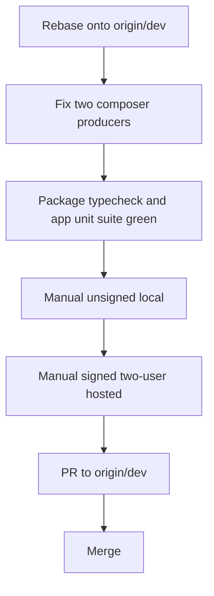

# Merge tenant-aware multiplayer to origin/dev

## Independent review verdict

Merge this branch **after** the two composer producers are fixed and a rebase onto current `origin/dev` (`3865ea6ac9`) is clean. Do not merge Cloudflare in the same PR.

The access equation in code matches the product docs:

```text
private session access
  = current workspace role for the action
    AND (creator OR active participant OR org admin via org_memberships)
```

Share-admin is **not** org-admin. Files and the working tree stay workspace-scoped. Unsigned loopback still allows everything (intentional single-user local).

The branch dossier oversells ship-readiness. Closed P1/P2 findings cover storage, runtime policy, turn leases, and stream grants. They do **not** cover:

- Two failing composer unit contracts (real producer bugs, not bad tests)
- Central vs workspace inventory misroute when `central:` is missing or directory matches are ambiguous
- Turn-lease holes on Session V2 wildcard proxy / WorkGraph / vendored OpenCode paths
- Staging Convex expand → migrate → verify → contract rehearsal (code exists, not run)
- Revocation SLA: SSE ~5s, PTY ~1s, stream JWT 15s — not “within 60s”

Primary owners: [convex/sessions.ts](convex/sessions.ts) `sessionRoleForUser`, [packages/workspace-runtime/src/session-access-policy.ts](packages/workspace-runtime/src/session-access-policy.ts), [packages/agent-sdk-runtime/src/runtime.ts](packages/agent-sdk-runtime/src/runtime.ts) `acquireTurnLease`, [packages/workspace-runtime/src/event-delivery.ts](packages/workspace-runtime/src/event-delivery.ts).



## Unit 1: Fix the two composer producers

Do not change the tests.

- Existing-session follow-up must submit the persisted harness model/variant (`claude-acp/opus` + `high`), not a generic `provider/model`. Empty GET `/session/:id/config` currently wins over `info().config` in [packages/claxedo-app/src/features/session/composer/ui/submit.ts](packages/claxedo-app/src/features/session/composer/ui/submit.ts).
- Second identical submit must not PATCH config again. [packages/claxedo-app/src/features/session/composer/ui/submit-transport.ts](packages/claxedo-app/src/features/session/composer/ui/submit-transport.ts) `readSessionConfig` uses `staleTime: 0`, so a refetch can overwrite the just-written cache.

Then rerun those two files and full `packages/claxedo-app` units. If submit payload/model path changed, rerun the existing-session real-harness journey.

## Unit 2: Rebase onto current origin/dev

The branch is **34 commits behind**, **10 ahead**, with **21 overlapping files**. Hottest conflicts: timeline, `route-bridge.tsx`, `sdk-runtime-adapter.ts`, `session-core.ts`, `runtime.ts`.

Keep MP’s tenant/privacy producers. Keep `origin/dev` CI/timeline/busy-after-stop fixes. Do not “fix” conflicts by dropping either side’s tests.

After rebase: architecture-gate / product-closure baselines may need a real measurement update (same class of failure that blocked the CF push). Do not bypass the hook.

## Unit 3: PR merge bar

PR target: `origin/dev` from `codex/single-tenant-multiplayer-ready`.

Required green:

- The two composer contracts
- Full `packages/claxedo-app` unit suite
- Affected package typechecks
- Server / Convex / workspace-runtime / agent-sdk-runtime suites that the branch already claimed green, re-run on the rebased tree

Not required to merge the git PR (deploy gates, run after merge on staging):

- Credentialed staging tenant-migration rehearsal ([docs/tech-docs/tenant-identity-schema-rollout.md](docs/tech-docs/tenant-identity-schema-rollout.md))
- Live-provider E2E
- Packaged desktop E2E

Do not merge `.branch_status/` as product docs forever if the team prefers it stay branch-local; keep [docs/tech-docs/access-model.md](docs/tech-docs/access-model.md) and the rollout doc.

---

## How you manually test it

Use two environments. Unsigned local proves composer/busy/central routing. Signed hosted with two people proves privacy. Unit tests cannot replace the hosted two-human pass.

### A. Unsigned local (desktop or local app)

Sign-in is not the point. One machine, one user.

1. **Existing session model restore (the two unit bugs, visually)**
   - Open an existing Pi/Claude ACP session that already has a saved model/variant.
   - Composer must stay inert until the saved model appears (not “Select model”).
   - Send a follow-up. The run must keep the persisted model/variant.
   - Send a second identical follow-up. Network panel: one `PATCH /session/:id/config`, not two.

2. **Concurrent prompts**
   - Same session, two composers if possible, or two windows on the same unsigned session.
   - Submit at the same time. One turn runs. Loser sees a collision, only their optimistic bubble disappears, winner stays busy.

3. **Central vs workspace routing**
   - From inventory, open a central session and a workspace-runtime session.
   - URL / session identity must not flip a central session into a workspace directory (or the reverse).
   - After reload, the same session opens on the same host.

4. **Long-lived terminal**
   - Open a PTY on that session, wait past 60 seconds, type again. It must stay up (renewal, not proof expiry).

5. **Authors**
   - Unsigned messages stay generic (no fake “you” lane). That is expected.

Fail any of 1–3 → do not merge.

### B. Signed hosted, two users (required)

Need: staging or equivalent Clerk-signed Claxedo, **Alice** (org owner), **Bob** (workspace editor via share, **not** org admin), optional **Casey** (workspace editor, never a session participant).

Follow this order. Files remaining visible to Bob is **correct**, not a bug.

1. **Solo path still works (Journey 1)**
   - Alice signs in, creates/opens a project+workspace with no personal-vs-team quiz, creates a session, prompts, streams.

2. **Team + workspace (Journey 2)**
   - Alice creates a Team, project, workspace, shares the workspace with Bob as editor.
   - Bob can open the workspace files. Bob must **not** see Alice’s private session in the list.

3. **Private session share (Journey 3) — the product**
   - Alice creates a private session, sends a prompt.
   - Casey (workspace member, not participant): list/get/messages/events/PTY all deny or omit. No detailed “session exists” error.
   - Alice adds Bob as participant. Bob’s list now includes it. Bob opens transcript, sees Alice’s attributed user message (avatar/name), can send a reply. Alice sees Bob’s author on Bob’s messages.
   - Historical messages without `claxedo.author` stay generic for both. Do not expect names on old history.

4. **Concurrent two-user submit (Journey 4)**
   - Both idle on the shared session, submit together.
   - Exactly one turn. Loser: `409` / collision UX, only their bubble rolls back. Winner stays busy. Permission mode from the loser must not stick on the winner.

5. **Fork (Journey 5)**
   - Alice (or Bob if allowed) forks. Child appears for the forker immediately. Casey still cannot see the child.

6. **Live, reconnect, PTY (Journeys 7–8)**
   - Bob: HTTP transcript, live SSE, disconnect/reconnect with Last-Event-ID, open PTY.
   - Keep Bob’s authorized PTY open >60s; it must remain connected.

7. **Revoke (Journey 6) — watch the clock**
   - Alice removes Bob as participant (and/or workspace share).
   - Bob’s new HTTP reads fail immediately.
   - SSE and PTY should close without further private bytes: PTY ~1s, SSE ~5s, worst ~15s (stream lease). If Bob still receives transcript bytes after ~15s, that is a merge blocker.
   - Process-log / “Needs you” style aliases must also deny Bob.

8. **Org admin vs share-admin**
   - Alice (org admin) can see private sessions in that org’s workspaces even without being a participant.
   - A **workspace share-admin who is not org admin** cannot list others’ sessions and cannot add participants.

9. **Outage vs denial (Journey 10)**
   - If you can pause the authority/oracle path: UI/API must show retryable unavailable (503), not a permanent “private/forbidden” that would stick after recovery.

10. **Central restore on hosted (Journey 11)**
    - Alice reopens an existing central session from inventory.
    - Model restores before submit is enabled. Assistant/task cards show completed child lifecycle, not a stuck Working state, if the backend already finished.

### C. Staging deploy rehearsal (after PR merge, before promoting runtime enforcement)

Do this on a staging copy, not as a reason to skip the PR:

1. Deploy **expand** schema (optional tenant fields) with old readers still compatible.
2. Run the ordered ledger: users → projects → memberships → workspaces → sessions.
3. Ambiguous tenant/project provenance must **stop**, not guess.
4. Only then promote relay/runtime private-session enforcement.
5. Open one **legacy** session as its creator after backfill.
   - Known limitation: backfill sets `created_by` to workspace owner when missing, and does **not** enroll historical non-owner creators as participants. Confirm that before blaming the new privacy code.
6. Keep a SQLite/local backup path documented if self-hosted is in scope.

---

## What you should not treat as a bug

- Workspace collaborators seeing files/working tree of a private session’s workspace
- Unsigned local allowing all session actions
- Unknown historical authors with no name/avatar
- Cloudflare / Better Auth / D1 (separate branch; rebase that **after** this merge)

## Residual risks to watch during the rebase, not to “fix” by weakening tests

- Timeline/busy-after-stop commits on `origin/dev` vs MP timeline grouping
- `session-core.ts` turn-lease vs upstream session-core test churn
- Architecture size/closure baselines after 300-file tenant surface
