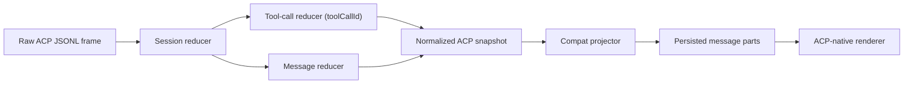
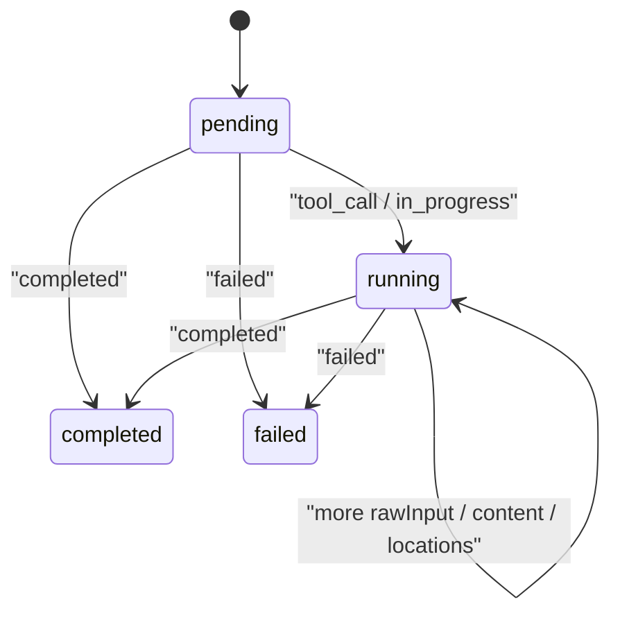

# ACP Journal-to-UI State Machine

This document describes the ACP pipeline after the reducer rewrite in `packages/workspace-runtime`.

## Flow

## Reducers

### Session reducer

Owns:

- current ACP client
- current assistant message id
- session status
- turn count
- active `toolCallId -> ToolState` map

It is the only layer allowed to merge sparse ACP updates.

### Tool-call reducer

Each tool call accumulates:

- first/latest `title`
- first/latest `kind`
- merged `rawInput`
- latest `rawOutput`
- additive `content[]`
- additive `locations[]`
- derived `terminalId`
- emitted diff/location/terminal keys for idempotent replay

## Normalized ACP snapshot

Every tool render now projects from merged state, not a single ACP frame.

Stored in `metadata.acp`:

- `client`
- `kind`
- `intent`
- `status`
- `title`
- `summary`
- `mode`
- `command`
- `query`
- `pattern`
- `url`
- `filePath`
- `sourcePath`
- `targetPath`
- `files`
- `locations`
- `terminalId`
- `hasDiff`
- `content`
- `rawInput`
- `rawOutput`

## Mapping registry

`packages/workspace-runtime/src/adapters/acp-registry.ts` is the maintained mapping table.

It records, per ACP client:

- observed raw titles
- observed raw tool names
- ACP kinds
- extractor rule name
- normalized intent/mode
- expected evidence fields

## Client coverage

### Cursor ACP

- `Terminal` -> shell
- `Read File` / `List MCP Resources` -> read
- `Edit File` -> edit
- `Delete File` -> delete
- `Find` -> list/files
- `grep` -> search/content
- `Web Search` -> search/web
- `Codebase Search` -> search/codebase
- `Fetch MCP Resource` -> fetch/mcp
- `Task: Subagent task` -> task
- `Update TODOs` -> todos

### Codex ACP

- execute kinds -> shell
- read kinds -> read
- edit kinds -> edit
- search kinds -> search/list depending on parsed command
- fetch kinds -> fetch

### Claude ACP

- `Terminal` -> shell
- `Read File` -> read
- `Find` / `ToolSearch` -> search
- `Fetch` -> fetch
- `Task` -> task
- `Skill` / `LSP` / `CronCreate` / `CronList` / `CronDelete` -> generic ACP-native cards

## Rendering rules

- ACP tool parts always render through the ACP renderer when `metadata.acp` exists.
- Native OpenCode cards are reused only when the normalized ACP snapshot has enough evidence.
- No title-based native fallback guessing.
- Expanded bodies show only real evidence:
  - shell output
  - read body
  - file paths
  - locations
  - counts/query/url when actually present

## Replay/debugging

To debug a bad tool row:

1. Inspect the raw JSONL frame.
2. Check merged `ToolState` for that `toolCallId`.
3. Inspect the normalized `metadata.acp` snapshot.
4. Inspect the projected compat tool part.
5. Only then inspect the renderer.

If data is missing in the UI but present in JSONL, the bug is in reduction or normalization, not the renderer.
