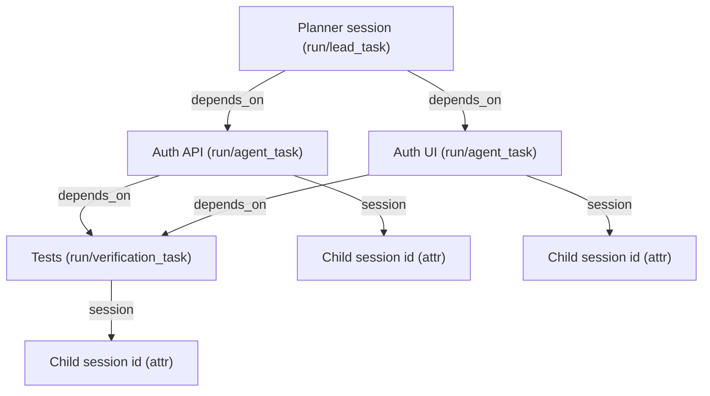

# Plan: Orchestrator as a Session Tool with Canvas DAG Renderer

## Context

Instead of a separate dashboard, the orchestrator integrates directly into OpenCode's existing Session UI. The user interacts with a main session (the "planner" thread). When the agent decomposes a goal into parallel tasks, it uses an **orchestrator tool** — rendered inline in the session timeline as a canvas DAG node graph, analogous to the existing `task` tool (which spawns a child session and renders a link).

**Key principle**: No new pages, no separate renderer. Everything lives inside the existing Session → MessageTimeline → SessionTurn → Part rendering pipeline.

## Architecture Overview

```
┌─────────────────────────────────────────────────────────────┐
│ OpenCode Session (main thread — "orchestrator" agent)       │
│                                                             │
│  [User message]  "Build auth system with tests"             │
│                                                             │
│  [ReasoningPart]  Planning decomposition...                 │
│  [TextPart]       "I'll break this into 3 parallel tasks:"  │
│                                                             │
│  [OrchestratorToolPart]  ← NEW: canvas DAG inline          │
│  ┌───────────────────────────────────────────────────┐      │
│  │  [Planner] ──┬── [Auth API]  ● completed          │      │
│  │              ├── [Auth UI]   ● running             │      │
│  │              └── [Tests]     ○ pending (blocked)   │      │
│  │                                                    │      │
│  │  Click node → navigates to child session           │      │
│  └───────────────────────────────────────────────────┘      │
│                                                             │
│  [TextPart]  "Auth API task completed. Auth UI in progress" │
│  [ToolPart]  task: "Auth API" → link to child session       │
│                                                             │
└─────────────────────────────────────────────────────────────┘
```

## WorkGraph Projection (Docs + Tasks + Runs)

The orchestrator tool is a UI renderer over a DAG state. That same DAG state should be representable as WorkGraph nodes and edges so it can:
- appear in the user's workspace alongside docs and backlog items
- be replayed historically (what ran, when, and why)
- link outputs (files, notes, artifacts) back to decisions and tasks

Mapping (conceptual):
- Each DAG node is a WorkGraph node tagged `run/*` (or `work/task` for durable tasks).
- Each DAG edge is a WorkGraph edge (often `depends_on`).
- Each node stores `sessionID` in attrs so clicking a canvas node navigates to the child session.



## Reference: Existing Patterns We Build On

### Session/Part Model (packages/sdk)
```typescript
// Existing part types we reuse
type Part = TextPart | ReasoningPart | ToolPart | FilePart | AgentPart
           | SubtaskPart | StepStartPart | StepFinishPart | ...

// ToolPart (existing) — our orchestrator tool renders as one of these
type ToolPart = {
  type: "tool"
  tool: string          // "orchestrate" — new tool name
  callID: string
  state: {
    status: "pending" | "running" | "completed" | "error"
    input: string       // JSON: goal, decomposition plan
    output?: string     // JSON: results summary
    metadata?: Record<string, unknown>
  }
}

// SubtaskPart (existing) — each spawned child task is one of these
type SubtaskPart = {
  type: "subtask"
  prompt: string
  description: string
  agent: string
  model?: string
  command?: string
}
```

### Session Hierarchy (existing)
```typescript
type Session = {
  id: string
  parentID?: string     // ← child sessions link back to parent
  title?: string
  agent?: string
}
```
The `task` tool already creates child sessions with `parentID`. The orchestrator does the same but for multiple parallel children.

### Tool Rendering (packages/ui — message-part.tsx)
```typescript
// Existing registry pattern — we register "orchestrate" here
ToolRegistry.register({ name: "orchestrate", render: OrchestratorToolRenderer })

// Existing BasicTool wrapper (collapsible card with icon/status)
<BasicTool icon="network" trigger={...} status={status}>
  {/* Canvas DAG renders here as the tool's expanded content */}
</BasicTool>
```

### Existing `task` Tool Renderer (reference)
The `task` tool renders as a link to a child session. The orchestrator tool extends this pattern — it renders a DAG where each node links to a child session.

---

## Step 1: Backend — Orchestrator Tool Definition

### 1a: New Agent Definition

Register a new `"orchestrate"` agent (or extend existing agents with orchestration capability):

```typescript
// Agent config (loaded via sdk.app.agents())
{
  name: "orchestrate",
  mode: "agent",        // top-level agent, not subagent
  model: { providerID: "anthropic", modelID: "claude-sonnet-4-6" },
  // System prompt instructs the agent to:
  // 1. Analyze the goal
  // 2. Call the "orchestrate" tool with a decomposition plan
  // 3. Monitor child session progress
  // 4. Summarize results when all children complete
}
```

### 1b: Orchestrate Tool

A new tool available to the orchestrate agent:

```typescript
// Tool definition
{
  name: "orchestrate",
  description: "Decompose a goal into parallel tasks and execute them as child sessions",
  parameters: {
    goal: { type: "string", description: "The high-level goal" },
    tasks: {
      type: "array",
      items: {
        id: { type: "string" },
        title: { type: "string" },
        kind: { type: "string", enum: ["research", "code_gen", "review", "test", "docs"] },
        prompt: { type: "string" },
        agent: { type: "string", default: "build" },
        depends_on: { type: "array", items: { type: "string" } }
      }
    },
    summary: { type: "string" }
  }
}
```

### 1c: Tool Execution (Backend)

When the orchestrate tool is called:

1. Create child sessions: For each task in the plan, call `session.create({ parentID: currentSessionID, title: task.title, agent: task.agent })`
2. Build dependency graph: Track which child sessions depend on which others
3. Execute ready tasks: For tasks with no pending dependencies, call `session.promptAsync({ sessionID: childID, parts: [{ type: "text", text: task.prompt }] })`
4. Monitor completion: Watch `session.status` events for child sessions
5. When a child completes, check if any blocked tasks are now unblocked → execute them
6. When all children complete, set the tool's output to a results summary

### 1d: Tool State Updates

The orchestrator tool's state updates in real-time via existing `message.part.updated` events:

```typescript
// Tool state metadata carries the DAG state
toolPart.state.metadata = {
  nodes: [
    { id: "task-1", title: "Auth API", kind: "code_gen", status: "completed", sessionID: "child-session-1" },
    { id: "task-2", title: "Auth UI", kind: "code_gen", status: "running", sessionID: "child-session-2" },
    { id: "task-3", title: "Tests", kind: "test", status: "pending", sessionID: "child-session-3" }
  ],
  edges: [
    { source: "task-1", target: "task-3" },  // Tests depends on Auth API
    { source: "task-2", target: "task-3" }   // Tests depends on Auth UI
  ],
  summary: "2/3 tasks completed"
}
```

This uses the existing `message.part.updated` event to push DAG state changes to the frontend — no new event system needed.

---

## Step 2: Frontend — Orchestrator Tool Renderer

### 2a: Register in ToolRegistry

```typescript
// In message-part.tsx or a new orchestrate-tool.tsx
import { ToolRegistry } from "./tool-registry"

ToolRegistry.register({
  name: "orchestrate",
  render: OrchestratorTool
})
```

### 2b: OrchestratorTool Component

Renders inside a `BasicTool` wrapper (matching all other tools), with the DAG canvas as its expanded content:

```
┌─────────────────────────────────────────────────────────────┐
│ ⬡ Orchestrate   "Build auth system"          ● running  ▾  │  ← BasicTool header
├─────────────────────────────────────────────────────────────┤
│                                                             │
│  ┌──────────┐                                               │
│  │ Planner  │──────┬──────────────────┐                     │
│  └──────────┘      │                  │                     │
│                    ▼                  ▼                     │
│            ┌────────────┐    ┌────────────┐                 │
│            │ Auth API   │    │ Auth UI    │                 │
│            │ ✓ done     │    │ ● running  │                 │
│            └─────┬──────┘    └─────┬──────┘                 │
│                  │                 │                         │
│                  └────────┬────────┘                         │
│                           ▼                                 │
│                   ┌────────────┐                             │
│                   │ Tests      │                             │
│                   │ ○ blocked  │                             │
│                   └────────────┘                             │
│                                                             │
│  Summary: 1/3 completed · 1 running · 1 blocked            │
└─────────────────────────────────────────────────────────────┘
```

### 2c: Canvas DAG Rendering (SVG within the tool card)

The DAG is an SVG rendered inside the `BasicTool`'s collapsible content area:

**Node rendering:**
- Each task is a rounded rect with: title, kind badge, status indicator
- Status colors match existing OpenCode palette:
  - `pending` → muted gray
  - `running` → cobalt blue + pulsing glow
  - `completed` → apple green + checkmark
  - `failed` → ember red + X
  - `blocked` → muted with lock icon
- Clicking a node navigates to the child session (same as clicking a `task` tool link)

**Edge rendering:**
- SVG path lines between nodes
- Completed edges: solid line
- Pending edges: dashed line
- Active edges: animated dash flow

**Layout algorithm:**
- Simple top-down layered layout (Sugiyama-style)
- Layer 0: Planner node (optional, visually distinct)
- Layer 1+: Tasks arranged by dependency depth
- Within each layer, nodes sorted by creation order

### 2d: Node Click → Navigate to Child Session

When a node is clicked, navigate to the child session using existing routing:

```typescript
// Same pattern as existing task tool's click handler
const navigate = useNavigate()
onClick={() => navigate(`/session/${node.sessionID}`)}
```

The child session renders with the full existing Session component — all the same TextPart, ToolPart, ReasoningPart rendering. No custom renderer needed.

### 2e: Inline Status Summary

Below the DAG canvas, a one-line summary:
```
2/5 completed · 1 running · 2 blocked · Est. 45s remaining
```

---

## Step 3: Integration with Existing Orchestrator Backend

### 3a: Bridge orchestrator-core → OpenCode Sessions

The existing `packages/orchestrator-core/` and `packages/api-server/` already have:
- `DecompositionPlan` model (teams, tasks, dependencies)
- `GraphEngine` (DAG with readiness evaluation)
- `executor.ts` (4-phase orchestration: plan → build graph → execute → complete)
- Agent spawning via Claude CLI subprocess

**Bridge approach**: Instead of spawning Claude CLI subprocesses directly, the orchestrator creates OpenCode child sessions and uses `session.promptAsync()` to execute them. This means:

1. Child tasks get full OpenCode session rendering (tools, permissions, file diffs, etc.)
2. The existing tool rendering pipeline handles everything
3. No custom stream-json parser needed — OpenCode's event system handles it

### 3b: Reuse Existing Orchestrator Logic

From `packages/orchestrator-core/`:
- **GraphEngine** (`orchestrator-graph/src/graph.ts`): DAG model with readiness checks
- **Scheduler** (`orchestrator-core/src/scheduler.ts`): Lease management, concurrency limits
- **Routing** (`orchestrator-core/src/routing.ts`): Task-to-agent matching

From `packages/api-server/src/orchestrator/`:
- **Executor** (`executor.ts`): 4-phase model (adapt to use sessions instead of raw agents)
- **Planner** (`planner.ts`): Goal decomposition prompt
- **Types** (`types.ts`): `DecompositionPlan`, `DecomposedTask`

### 3c: Adapted Execution Flow

```
1. User sends message to "orchestrate" agent in main session
2. Agent reasons about the goal (ReasoningPart in timeline)
3. Agent calls "orchestrate" tool with decomposition plan
4. Backend tool handler:
   a. Creates child sessions (session.create with parentID)
   b. Builds GraphEngine from task dependencies
   c. Starts execution loop:
      - Find ready nodes (GraphEngine.isReady)
      - For each ready node → session.promptAsync(childSessionID, taskPrompt)
      - Watch session.status events for completion
      - On completion → check newly unblocked nodes → execute
   d. Updates tool part metadata with DAG state (message.part.updated)
   e. When all complete → set tool output to summary
5. Frontend renders tool part via OrchestratorTool component
6. User sees DAG update in real-time, clicks nodes to inspect child sessions
7. Agent continues in main session with final summary (TextPart)
```

---

## Step 4: Part Types & Data Model

### 4a: No New Part Types Needed

The orchestrator uses existing part types:
- **ToolPart** with `tool: "orchestrate"` — carries the DAG state in `metadata`
- **SubtaskPart** — one per spawned child task (existing type)
- **TextPart** — agent's commentary before/after orchestration
- **ReasoningPart** — agent's planning reasoning

### 4b: Orchestrator Tool Metadata Schema

```typescript
// Carried in ToolPart.state.metadata
interface OrchestratorMetadata {
  goal: string
  phase: "planning" | "executing" | "completed" | "failed"
  nodes: OrchestratorNode[]
  edges: OrchestratorEdge[]
  summary?: string
  startTime: number
  endTime?: number
}

interface OrchestratorNode {
  id: string
  title: string
  kind: string              // "research" | "code_gen" | "review" | "test" | "docs"
  status: "pending" | "running" | "completed" | "failed" | "blocked"
  sessionID?: string        // child session ID (once created)
  agent: string             // which agent runs this task
  error?: string            // if failed
  startTime?: number
  endTime?: number
}

interface OrchestratorEdge {
  source: string            // node ID
  target: string            // node ID
}
```

### 4c: Existing Session Fields Used

```typescript
// Child sessions created by the orchestrator
{
  id: "child-session-uuid",
  parentID: "main-session-uuid",   // links back to orchestrator session
  title: "Auth API Implementation", // task title
  agent: "build"                    // or "research", etc.
}
```

---

## Step 5: Canvas Component Details

### 5a: SVG Layout Engine

Simple layered DAG layout (no external library needed):

```typescript
function layoutDAG(nodes: OrchestratorNode[], edges: OrchestratorEdge[]): LayoutResult {
  // 1. Topological sort
  // 2. Assign layers (longest path from root)
  // 3. Within each layer, minimize edge crossings (barycenter heuristic)
  // 4. Assign x,y coordinates
  // Returns: Map<nodeId, { x, y, width, height }>
}
```

Constants:
- Node width: 180px, height: 48px
- Layer gap: 64px vertical
- Node gap: 24px horizontal
- Canvas padding: 24px

### 5b: Node Component (SVG group)

```svg
<g class="orchestrator-node" data-status="running">
  <rect rx="8" width="180" height="48" />
  <text class="node-title">Auth API</text>
  <circle class="status-dot" r="4" />          <!-- status indicator -->
  <text class="node-kind">code_gen</text>       <!-- kind badge -->
</g>
```

### 5c: Edge Component (SVG path)

```svg
<path class="orchestrator-edge" data-status="completed"
      d="M90,48 C90,80 90,80 90,112" />  <!-- cubic bezier -->
```

### 5d: Animations

- Running nodes: CSS `@keyframes pulse` on the status dot (cobalt glow)
- Active edges: CSS `stroke-dashoffset` animation (flowing dashes)
- Completion: Brief scale-up + color transition on the node rect
- New node appearing: `opacity 0→1` + `translateY(-8→0)` transition

---

## Files to Modify/Create

### Frontend (packages/app or packages/ui)

1. **New file**: `packages/ui/src/components/orchestrator-tool.tsx`
   - `OrchestratorTool` component (BasicTool wrapper + SVG canvas)
   - `DAGCanvas` component (SVG layout + rendering)
   - `DAGNode` component (individual node)
   - `DAGEdge` component (individual edge)
   - ToolRegistry registration

2. **Modify**: `packages/ui/src/components/message-part.tsx`
   - Import and register `OrchestratorTool` in `ToolRegistry`
   - Or: add to PART_MAPPING if using a dedicated part type

### Backend (packages/app Go backend or api-server)

3. **New file**: `packages/api-server/src/orchestrator/session-bridge.ts`
   - Bridge between orchestrator executor and OpenCode session API
   - Creates child sessions, monitors completion, updates tool part metadata

4. **Modify**: `packages/api-server/src/orchestrator/executor.ts`
   - Adapt to use session-bridge instead of raw agent spawning
   - Update tool part metadata on each state change

5. **Modify**: `packages/api-server/src/routes/orchestrate.ts`
   - Add endpoint to trigger orchestration within an existing session context

### Shared Types

6. **New file**: `packages/api-server/src/orchestrator/types-ui.ts`
   - `OrchestratorMetadata`, `OrchestratorNode`, `OrchestratorEdge` types
   - Shared between backend (metadata producer) and frontend (metadata consumer)

---

## Implementation Order

1. **Define types** — `OrchestratorMetadata`, `OrchestratorNode`, `OrchestratorEdge`
2. **Frontend: OrchestratorTool component** — Register in ToolRegistry, render BasicTool with SVG DAG canvas, node click → navigate to child session
3. **Frontend: DAG layout engine** — Topological sort, layer assignment, coordinate calculation
4. **Frontend: SVG rendering** — Nodes, edges, status colors, animations, click handlers
5. **Backend: Session bridge** — Create child sessions, monitor status, update tool metadata
6. **Backend: Adapt executor** — Use session bridge instead of raw agent spawning
7. **Wire up** — Orchestrate agent calls tool → backend creates sessions → metadata updates → frontend renders DAG in real-time
8. **Polish** — Summary bar, transitions, error states, retry handling

## Verification

1. **Unit**: Existing `packages/api-server` tests still pass (`bun test`)
2. **Integration**: Start OpenCode → create session with "orchestrate" agent → send a goal
3. **Verify rendering pipeline**:
   - Main session shows ReasoningPart (planning) → TextPart (explanation) → ToolPart/orchestrate (DAG)
   - DAG canvas renders nodes with correct layout and status colors
   - Nodes update in real-time as child sessions progress (pending → running → completed)
   - Clicking a node navigates to child session with full Session component rendering
   - Child session shows normal TextPart, ToolPart, ReasoningPart rendering (no custom renderer)
   - Back navigation returns to main session with DAG still visible
4. **Verify DAG correctness**:
   - Blocked tasks show as "blocked" until dependencies complete
   - Parallel tasks (no dependencies) run simultaneously
   - Failed task shows error state, doesn't block unrelated tasks
   - Completion summary appears when all tasks finish
5. **No regressions**: Existing session rendering, tool rendering, and navigation unaffected
