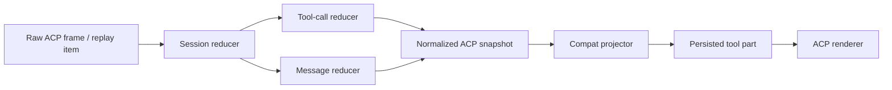
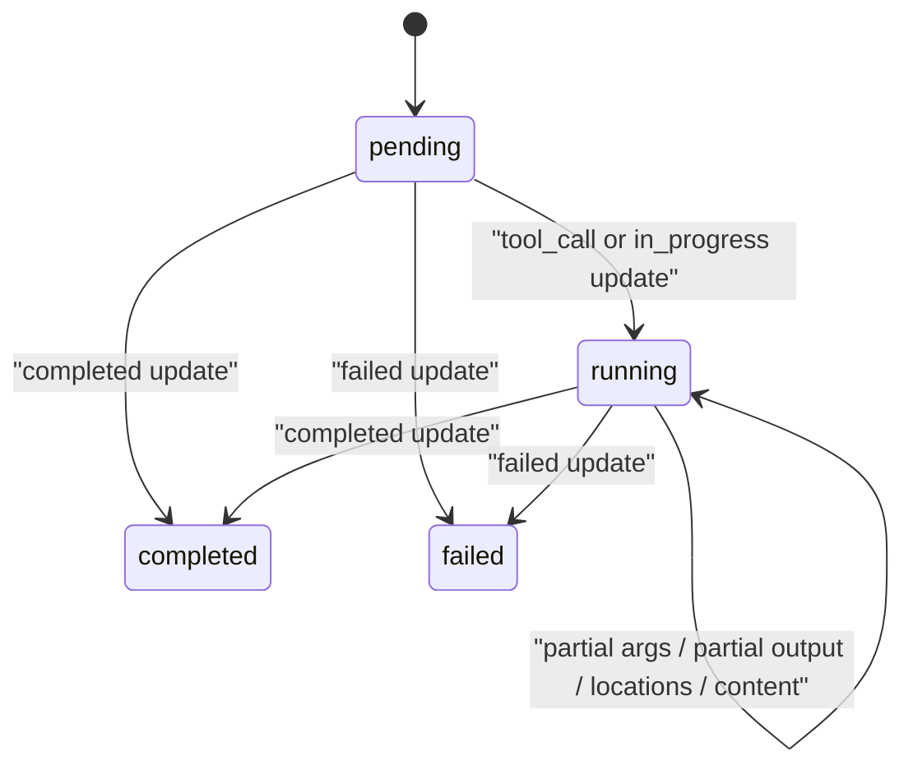

# ACP Tool Support Implementation

Date: 2026-04-01

Status: in progress — the reducer-first ACP contract is implemented for new sessions, and focused replay/runtime/UI tests now cover rich error text, ACP diff rendering inputs, task session ids, web search/fetch routing, and metadata-preserving replay across Cursor, Claude, and Codex. Historical sessions are explicitly out of scope for this rollout, and this document should remain in progress until the full acceptance matrix below is satisfied in verified app flows.

Related:

- [ACP Journal-to-UI State Machine](/Users/yashvardhansingh/test/opencode/docs/acp-journal-state-machine.md)
- [message-part.tsx](/Users/yashvardhansingh/test/opencode/packages/ui/src/components/message-part.tsx)
- [acp-tool.tsx](/Users/yashvardhansingh/test/opencode/packages/ui/src/components/acp-tool.tsx)
- [translate-session-update.ts](/Users/yashvardhansingh/test/opencode/packages/workspace-runtime/src/adapters/translate-session-update.ts)
- [translate-chunk-to-event.ts](/Users/yashvardhansingh/test/opencode/packages/workspace-runtime/src/adapters/translate-chunk-to-event.ts)
- [acp-registry.ts](/Users/yashvardhansingh/test/opencode/packages/workspace-runtime/src/adapters/acp-registry.ts)

## Purpose

This document is the implementation source of truth for ACP tool support across:

- Cursor ACP
- Claude ACP
- Codex ACP

It defines:

- the red-green TDD rollout
- the per-client tool inventory
- the normalization contract
- the frontend card contract
- the visible details each tool card must show

This document is intentionally specific. The goal is to remove guesswork from ACP support and make regressions traceable to a single layer.

## Goals

- Preserve every real tool signal that each ACP client emits.
- Normalize client-specific tool shapes into a stable internal model.
- Render rich native cards when the data is sufficient.
- Render ACP-native generic cards when the data is sparse or open-ended.
- Never invent file paths, commands, queries, URLs, or diffs.
- Keep live sessions and replayed sessions deterministic and debuggable.

## Non-goals

- Backfilling already-persisted old sessions automatically in this rollout
- Perfectly reconstructing data the upstream ACP client never emitted
- Forcing all ACP clients into the same raw event shape

## Current Scope

- New sessions only
- No DB migration or historical message rewrite
- Replay parity means newly persisted sessions keep enough normalized ACP metadata to choose the same card family and visible details after reload as they did during live streaming
- Older sessions may improve when already-stored ACP metadata is rich enough, but that is not a release requirement for this rollout

## Why TDD First

The ACP pipeline has already shown the same failure pattern multiple times:

- raw JSONL had data
- an intermediate translator or projector dropped it
- the UI appeared empty or misleading

So the implementation must be trace-first and test-first.

Every tool family should be implemented in this order:

1. add a failing trace-based reducer test
2. add a failing compat projection test if needed
3. add a failing UI renderer test if needed
4. implement normalization
5. implement projection
6. implement rendering
7. replay the real trace and confirm the card output

No new ACP tool support should start with UI work.

## Source Inventory

These are the primary sources this plan is based on.

### Cursor ACP

Source:

- [414.index.js](/Users/yashvardhansingh/.local/share/cursor-agent/versions/2026.03.18-f6873f7/414.index.js)

Important fact:

- Cursor collapses many distinct tools into coarse ACP `kind` values, especially `kind: "search"`.

### Claude ACP

Source:

- [tools.ts](/tmp/claude-agent-acp/src/tools.ts)
- [acp-agent.ts](/tmp/claude-agent-acp/src/acp-agent.ts)

Important fact:

- Claude preserves `toolName`, which is a stronger discriminator than `kind`.

### Codex ACP

Source:

- [thread.rs](/tmp/codex-acp/src/thread.rs)
- [codex_agent.rs](/tmp/codex-acp/src/codex_agent.rs)

Important fact:

- Codex builds ACP-native `ToolCall` and `ToolCallUpdate` events directly, but replay and generic dynamic/MCP flows are weaker than its live shell/edit/search flows.

### pi-acp

Deferred:

- `pi-acp` is out of scope for this repo's current rollout.
- Supporting it would require a new adapter and client wiring before any registry or card work.
- The temporary source files under `/tmp/pi-acp/` are useful reference material, not a supported implementation target for this document.

## Architecture

ACP support should remain reducer-first.

The runtime owns meaning. The UI must not guess meaning from a raw title when a stronger normalized signal exists.

## State Machines

### Session reducer

Owns:

- client id
- assistant message id
- turn lifecycle
- active tool calls
- plan/question/permission state

### Tool-call reducer

Keyed by `toolCallId`.

Each tool call accumulates:

- first and latest title
- first and latest raw tool discriminator
- kind
- status
- rawInput
- rawOutput
- content[]
- locations[]
- terminal refs
- derived fields

### Message reducer

Owns:

- assistant message boundaries
- text vs reasoning part segmentation
- tool boundary splitting
- tool part ordering
- terminal and diff attachments

### Render state

The renderer consumes one normalized tool snapshot and makes one choice:

- native card
- ACP-native specialized card
- ACP generic card

There must be no branch that guesses a native OpenCode card from a coarse `kind` alone.

## Canonical Normalized ACP Snapshot

Stored in `metadata.acp` and mirrored where needed in `tool.state.input`.

Always-present base fields:

- `client`
- `kind`
- `intent`
- `status`
- `title`
- `summary`
- `rawInput`
- `rawOutput`

Provider discriminator fields when the upstream client supplies them:

- `rawName`

Optional normalized evidence fields:

- `mode`
- `command`
- `query`
- `pattern`
- `url`
- `filePath`
- `path`
- `sourcePath`
- `targetPath`
- `files`
- `locations`
- `terminalId`
- `hasDiff`
- `stats`
- `body`
- `content`

Omit optional fields when the source did not emit enough real evidence. Never synthesize placeholder values just to satisfy a schema.

Some optional fields are still routing-critical for specific families:

- `mode` is mandatory whenever it disambiguates the resolved family, such as `glob`, `codebase`, `web`, `apply_patch`, `permission`, or session-surface reasoning modes
- `path` is mandatory for `list` and `grep` routing
- `query` is mandatory for `codebase` and `web search` routing
- `url` is mandatory for `web fetch` routing

### Field meanings

- `rawName`: upstream tool name when the client has one, such as Claude `Bash`
- `intent`: stable semantic family, such as `shell`, `read`, `list`, `search`, `fetch`, `edit`, `delete`, `move`, `task`, `todos`, `question`, `mcp`, `image`, `computer`, `reasoning`, `generic`
- `mode`: intent subtype, such as `stdin`, `glob`, `grep`, `web`, `web_find`, `codebase`, `apply_patch`, `permission`, `plan`, `reflection`, `review`, `mcp`
- `path`: directory or search-scope path for list/search-style tools; use `filePath` for a concrete file target
- `stats`: count-only structured metrics, such as `totalFiles`, `totalMatches`, `resultCount`, `referenceCount`, `truncated`
- `family`: a transient classifier used during matching, such as parsed command type, result-block family, or title-derived subtype; keep derivation centralized and do not persist it in the canonical snapshot unless debugging requires it

## Frontend Card Contract

This section defines the event contract each card or session surface expects from the runtime and what the user must see on screen.

Representation rule:

- permission requests, freeform questions, todo state, and session-plan or reasoning state always project to the existing OpenCode session surfaces
- if an upstream ACP client emits a real tool call for one of these families, normalize it, then emit the matching session-surface trigger instead of an ACP tool row
- never render both a session surface and a tool row for the same underlying event

### Card states

Cards and session surfaces must specify what users see while a tool is still streaming, not just after completion.

- `pending`: render a created but not-yet-populated row using the tool title plus a loading treatment consistent with existing OpenCode tool shimmer behavior
- `running`: preserve any accumulated real evidence and show incremental output as it arrives
- `completed`: show the final normalized evidence without losing earlier streamed content
- `failed`: preserve the tool identity, preserve any honest partial evidence already seen, and show the error state without fabricating missing output

Classification rule during streaming:

- start with the most honest route available from current evidence
- allow ACP generic to upgrade to a more specific card when routing evidence appears later in the stream
- do not downgrade a card back to a weaker family unless later evidence proves the earlier classification wrong
- session-surface families should not emit an ACP tool row first and then convert later; route them to the session surface once the normalized family crosses the required evidence threshold

Core families:

- shell: pending shows the shell row with loading state; running streams terminal output; failed preserves command plus any streamed output before the error
- read: pending shows file target when known; running may show partial body if emitted; failed preserves file path and any real partial content
- edit: pending shows file target and diff-loading state; running shows diff chunks as they arrive; failed preserves file target and any real diff evidence already emitted
- search or list: pending shows the query, pattern, or path when known; running shows partial counts or matches when emitted; failed preserves the original query or path and any real partial results

### Shell card

Resolved card:

- `bash`

Required normalized evidence:

- `intent = "shell"`
- one of:
  - `command`
  - `terminalId`
  - shell body output

Visible details:

- title: `Shell`
- subtitle: human description only if it is not the same as the title and not just `Terminal`
- body:
  - `$ <command>` prefix when command exists
  - live terminal output when terminal events exist
  - stdout/stderr text when only body output exists
- optional:
  - exit code when meaningful
  - copied shell transcript

Never show by default:

- `stdout=...`
- `stderr=...`
- `process_id=...`
- `call_id=...`

### Read card

Resolved card:

- `read`

Required normalized evidence:

- `intent = "read"`
- `filePath` or a strong location path

Visible details:

- title: `Read`
- subtitle: filename
- args:
  - offset
  - limit
  - line when available
- body:
  - read text content
- additional loaded file references when present

### List card

Resolved card:

- `list`

Required normalized evidence:

- `intent = "list"`
- `path`

Visible details:

- title: `List`
- subtitle: directory path
- args:
  - file counts
  - truncated
- body:
  - file list

### Glob card

Resolved card:

- `glob`

Required normalized evidence:

- `intent = "list"`
- `mode = "glob"`
- `path`

Visible details:

- title: `Find`
- subtitle: directory path
- args:
  - pattern
  - total files
  - truncated
- body:
  - file list

### Grep card

Resolved card:

- `grep`

Required normalized evidence:

- `intent = "search"`
- `pattern` or `query`
- `path`

Visible details:

- title: `Grep`
- subtitle: directory path
- args:
  - pattern
  - include/type flags if present
  - total matches
  - truncated
- body:
  - match lines or result summary

### Codebase Search card

Resolved card:

- `codesearch`

Required normalized evidence:

- `intent = "search"`
- `mode = "codebase"`
- `query`

Visible details:

- title: `Codebase Search`
- subtitle: query
- args:
  - result count
- body:
  - snippets/results when present

### Web Search card

Resolved card:

- `websearch`

Required normalized evidence:

- `intent = "search"`
- `mode = "web"`
- `query`

Visible details:

- title: `Web Search`
- subtitle: query
- args:
  - reference count
  - allowed/blocked domain hints when present
- body:
  - result links/snippets when present

### Web Fetch card

Resolved card:

- `webfetch`

Required normalized evidence:

- `intent = "fetch"`
- `url`

Visible details:

- title: `Web Fetch`
- subtitle: URL
- args:
  - host
- body:
  - fetched content summary or content blocks

### Edit card

Resolved card:

- `edit`

Required normalized evidence:

- `intent = "edit"`
- `filePath`
- `hasDiff = true` or structured diff content

Visible details:

- title: `Edit`
- filename
- directory path
- line when known
- change count when available
- full diff UI
- diagnostics if present

### Write card

Resolved card:

- `write`

Required normalized evidence:

- `intent = "edit"`
- `mode = "write"`
- `filePath`
- create or overwrite evidence, such as create-style diff content or an explicit write mode from the source client

Visible details:

- title: `Write`
- filename
- directory path
- created/overwritten content preview

Routing note:

- do not infer `Write` from OpenCode-native `input.newString` alone when defining the ACP contract
- prefer explicit ACP normalization such as `mode = "write"` or equivalent create-style diff evidence

### Delete card

Resolved card:

- dedicated ACP-native delete card

Required normalized evidence:

- `intent = "delete"`
- `filePath`

Visible details:

- title: `Delete`
- filename
- directory path
- deleted-content diff if available
- fallback body only if the client emitted honest content

### Move support

Status:

- future or speculative
- do not implement a dedicated Move card in this rollout unless a supported client emits real traces for it

If a move-like event appears before then, route it through the ACP generic card unless existing edit evidence is strong enough to represent it honestly.

### Apply Patch card

Resolved card:

- `apply_patch`

Required normalized evidence:

- `intent = "edit"`
- `mode = "apply_patch"` or explicit multi-file patch evidence

Visible details:

- title: `Apply Patch`
- affected file list
- per-file diffs
- change count

Routing note:

- `Apply Patch` wins over `Edit` when normalized evidence indicates patch-application semantics rather than a single-file edit row

### Task card

Resolved card:

- `task`

Required normalized evidence:

- `intent = "task"`

Visible details:

- title: agent/subagent label
- description
- child session link when available
- duration/background flag if available

### Todos session surface

Resolved surface:

- existing TODO session surface

Required normalized evidence:

- `intent = "todos"`

Visible details:

- title: `Update TODOs`
- todo entries and statuses
- no ACP tool row for this family

### Question or permission session surface

Resolved surface:

- existing question or permission session surface

Required normalized evidence:

- `intent = "question"`
- optional `mode = "permission"` when the source event is specifically a permission request

Visible details:

- prompt
- options
- pending/running/completed state
- no ACP tool row for this family

### MCP tool card

Resolved card:

- dedicated ACP-native MCP card

Required normalized evidence:

- `intent = "mcp"`
- server/tool or server/uri identity

Visible details:

- server name
- tool or resource name
- uri if applicable
- args if meaningful and concise
- returned content/resources

### Image card

Resolved card:

- dedicated ACP-native image card

Required normalized evidence:

- `intent = "image"`

Visible details:

- title/prompt summary
- generated image outputs or resource links

### Computer use card

Resolved card:

- dedicated ACP-native computer-use card

Required normalized evidence:

- `intent = "computer"`

Visible details:

- action summary
- screenshots or resource links if present
- operation result summary

### Thinking or plan session surface

Resolved surface:

- existing reasoning or plan session surface

Required normalized evidence:

- `intent = "reasoning"`

Visible details:

- title
- plan/review/risk text
- plan entries when present
- no ACP tool row for this family

### ACP generic card

Resolved card:

- `AcpFallbackTool`, but semantically this is the ACP generic card, not a native fallback

Required normalized evidence:

- any ACP metadata

Visible details:

- honest title
- deduped subtitle
- real counts
- real files
- real body content

Must not do:

- infer fake file paths
- infer fake commands
- print raw debug sludge as the main body
- duplicate title and subtitle

## Red-Green TDD Rollout

Implementation order matters more than breadth.

This rollout is additive:

- Phase 1 is independently shippable and should land even if later phases are deferred
- each later phase should be reviewable and shippable on its own

### Prerequisites

Before Phase 2 starts, make the required contract changes explicit in code:

- extend ACP metadata typing and registry typing for any new normalized intents or modes we actually keep in scope
- define how `family` is derived for registry matching and keep that derivation centralized
- define the routing path for new dedicated ACP-native cards versus ACP generic fallback
- define the routing path for normalized session-surface families so they project to existing OpenCode surfaces instead of ACP tool rows
- extend or adapt `AcpIntent`, routing helpers, and UI card resolution only for families we explicitly keep first-class in this rollout
- reconcile naming with current code during migration: the normalized snapshot uses `rawName`, while existing reducer code may still refer to raw tool names with older internal naming

### Phase 1: trace fixtures and reducer harness

Red tests:

- add one real trace fixture per client
- add replay tests that reduce the full trace into normalized tool snapshots
- assert that sparse later updates do not erase earlier known fields

Fixture format:

- store raw ACP trace fixtures as captured JSONL or line-preserving serialized frames
- keep one fixture per supported client behavior under test
- prefer fixtures captured from real sessions over hand-authored synthetic traces

Files:

- [packages/workspace-runtime/src/adapters/translate-session-update.test.ts](/Users/yashvardhansingh/test/opencode/packages/workspace-runtime/src/adapters/translate-session-update.test.ts)
- [packages/workspace-runtime/src/adapters/translate-chunk-to-event.test.ts](/Users/yashvardhansingh/test/opencode/packages/workspace-runtime/src/adapters/translate-chunk-to-event.test.ts)
- add `fixtures/acp/` trace files under `packages/workspace-runtime/src/adapters/`

Green work:

- finish the reducer merge contract before adding more UI logic
- guard against `rawOutput: null` or other sparse terminal updates erasing earlier useful evidence

### Phase 2: shell, read, edit, delete

Red tests:

- Cursor shell, read, edit, delete
- Claude Bash, Read, Edit, Write
- Codex exec command, apply_patch, read

Assertions:

- file paths survive
- shell output is not empty when raw output exists
- diff content survives
- no duplicate shell titles
- sparse input never invents a file path, command, URL, or diff

Green work:

- implement extractor rules
- implement compat projection
- route to native cards when evidence is sufficient

### Phase 3: list, glob, grep, codebase, web

Red tests:

- Cursor glob, grep, semSearch, webSearch
- Claude Glob, Grep, WebSearch, WebFetch
- Codex parsed search/list and web-search actions

Assertions:

- `glob` never becomes `grep`
- `web search` never becomes generic fetch when the source says search
- count-only tools stay thin but honest
- missing path, query, or pattern data never renders fabricated details

Green work:

- add `mode`-aware routing
- add ACP-native cards for codebase and web search when native registry needs more structure

### Phase 4: task plus session-surface families

Red tests:

- Cursor task/updateTodos/askQuestion/createPlan/reflect
- Claude Task/TodoWrite/ExitPlanMode/Agent
- Codex permission requests and guardian assessment

Assertions:

- todos do not disappear into generic other
- permission prompts preserve options and pending state
- no duplicate ACP tool row is rendered when a session surface exists for the same underlying event

Green work:

- keep `task` as a tool row
- project todos, questions, permissions, and plan or reasoning updates onto existing session surfaces even when the upstream client emitted a tool call
- add projection rules and tests for these families instead of ACP tool cards

### Phase 5: MCP, dynamic, image, computer-use

Red tests:

- Cursor MCP tool/resource, image, computer use
- Codex MCP tool calls and dynamic tool calls
- Claude MCP tool results and tool-search families

Assertions:

- server/tool identity survives
- generic dynamic tools are still readable
- image and computer-use outputs surface resources honestly

Green work:

- dedicated ACP-native cards for MCP, image, computer use
- keep generic card as the final honest sink

### Phase 6: replay parity

Red tests:

- load-session or replay tests for every supported client in this repo

Assertions:

- replayed sessions do not lose more information than the source client already lost
- replay chooses the same card family as live whenever the source evidence is equivalent

Green work:

- harden replay projectors and history rebuild paths for newly persisted sessions
- ensure tool metadata needed by the UI survives the event-to-chunk and persistence boundaries without backfill assumptions

## Per-Client Tool Matrix

This section is the implementation contract for each client.

### Cursor ACP

Primary key:

- `title`
- `rawName` when available

Secondary keys:

- parsed search command family
- `kind`

Do not key by `kind` first.

| Cursor title or family | ACP kind | Normalize to | Card or surface | Visible details |
| --- | --- | --- | --- | --- |
| `Terminal` | `execute` | `intent=shell` | `Shell` | command, stdout/stderr, exit code, terminal stream |
| `Terminal` stdin-write family | `execute` | `intent=shell`, `mode=stdin`, attached to shell | `Shell` timeline | stdin text appended to active terminal |
| `Read File` | `read` | `intent=read` | `Read` | file path, line/range, body |
| `Read File` lints family | `read` | `intent=read`, `mode=lints` | `Read` or ACP diagnostics card | file path, diagnostics summary |
| `Update TODOs` read-family output | `read` | `intent=todos`, `mode=read` | `Session TODO surface` | current todo list |
| `Edit File` | `edit` | `intent=edit` | `Edit` | file path, diff, locations |
| agent diff or apply-patch family | `edit` | `intent=edit`, `mode=apply_patch` | `Apply Patch` | file list, per-file diffs |
| `Delete File` | `delete` | `intent=delete` | `Delete` | deleted file path, deleted diff |
| `Find` glob family | `search` | `intent=list`, `mode=glob` | `Glob` | path, pattern, totalFiles, truncated |
| `Find` list family | `search` | `intent=list`, `mode=list` | `List` | directory path, listing |
| `grep` | `search` | `intent=search`, `mode=grep` | `Grep` | pattern, path, flags, totalMatches, truncated |
| `Codebase Search` | `search` | `intent=search`, `mode=codebase` | `Codebase Search` | query, resultCount, snippets |
| `Web Search` | `search` | `intent=search`, `mode=web` | `Web Search` | query, referenceCount, results |
| fetch or open-page web family | `fetch` | `intent=fetch`, `mode=web` | `Web Fetch` or ACP generic | URL, fetched result only when real |
| MCP tool or MCP resource family | `read` or `other` | `intent=mcp`, mode by family | `MCP Tool` | provider/server, tool or resource identity, args, result |
| `Task: Subagent task` | `other` | `intent=task` | `Task` | description, subagent type, duration |
| `Update TODOs` write family | `other` | `intent=todos`, `mode=write` | `Session TODO surface` | todo delta |
| question family | `think` | `intent=question` | `Session question surface` | prompt and options |
| plan or reflection family | `think` or `other` | `intent=reasoning`, mode by family | `Session reasoning surface` | plan, reflection, or review content |
| image family | `other` | `intent=image` | `Image` | prompt and generated images |
| computer-use family | `execute` or `other` | `intent=computer`, mode by family | `Computer use` | action summary, screenshots/resources |
| truncated or unknown family | `other` | `intent=generic`, mode by family | `ACP generic` | truncation summary or honest fallback content |

### Claude ACP

Primary key:

- `toolName`

Secondary keys:

- `title`
- result block types

Do not key by `kind` first.

| Claude tool name | ACP kind | Normalize to | Card or surface | Visible details |
| --- | --- | --- | --- | --- |
| `Agent` | `think` | `intent=task` | `Task` | description, prompt |
| `Task` | `think` | `intent=task` | `Task` | description, prompt |
| `Bash` | `execute` | `intent=shell` | `Shell` | command, terminal output, exit code |
| `Read` | `read` | `intent=read` | `Read` | file path, line/range, body |
| `Write` | `edit` | `intent=edit`, `mode=write` | `Write` | file path, create/replace diff |
| `Edit` | `edit` | `intent=edit`, `mode=edit` | `Edit` | file path, diff, locations |
| `Glob` | `search` | `intent=list`, `mode=glob` | `Glob` | path, pattern |
| `Grep` | `search` | `intent=search`, `mode=grep` | `Grep` | pattern, path, grep flags |
| `WebFetch` | `fetch` | `intent=fetch`, `mode=web` | `Web Fetch` | URL, prompt |
| `WebSearch` | `fetch` | `intent=search`, `mode=web` | `Web Search` | query, domain hints |
| `TodoWrite` | `think` | `intent=todos` | `Session TODO surface` | todo items |
| `ExitPlanMode` | `switch_mode` | `intent=reasoning`, `mode=switch` | `Session reasoning surface` | plan text |
| `Other` | `other` | `intent=generic` | `ACP generic` | raw content only |

Claude matching note:

- during migration, support both `toolName` and existing title-based matching
- prefer `toolName` when present
- keep title matching as a fallback for older traces and current registry compatibility
- once a rule matches, route by normalized `intent` and `mode`, not by the source `kind` alone, because equivalent families may arrive under different ACP kinds across clients

Claude result-content subfamilies:

| Result family | Normalize to | Card or surface | Visible details |
| --- | --- | --- | --- |
| `bash_code_execution_result` | `intent=shell` | `Shell` | stdout/stderr, exit code |
| text editor structured patch hook | `intent=edit` | `Edit` | full diff and locations |
| `web_search_result` blocks | `intent=search`, `mode=web` | `Web Search` | result links/snippets |
| `web_fetch_result` blocks | `intent=fetch`, `mode=web` | `Web Fetch` | fetched URL summary |
| tool-search result blocks | `intent=generic` or `intent=mcp` | `ACP generic` or `MCP Tool` | returned tool refs/errors |
| MCP result blocks | `intent=mcp` | `MCP Tool` | server/tool/resource content |

### Codex ACP

Primary key:

- ACP-native event structure

Secondary keys:

- parsed command type
- response item variant
- generic source subtype

Do not flatten Codex to title parsing when native ACP content already exists.

| Codex source family | Normalize to | Card or surface | Visible details |
| --- | --- | --- | --- |
| parsed command `Read` | `intent=read` | `Read` | file path, locations, content |
| parsed command `ListFiles` | `intent=list`, `mode=list` | `List` | directory and listing |
| parsed command `Search` | `intent=search`, `mode=grep` when query/path exist | `Grep` or `ACP generic search` | query/path/body |
| parsed command `Unknown` | `intent=shell` | `Shell` | command, terminal stream/output |
| `apply_patch` custom tool | `intent=edit`, `mode=apply_patch` | `Apply Patch` | files, locations, diffs |
| unified diff extraction | `intent=edit` | `Edit` | per-file diffs |
| `WebSearchAction::Search` | `intent=search`, `mode=web` | `Web Search` | query/queries |
| `WebSearchAction::OpenPage` | `intent=fetch`, `mode=web` | `Web Fetch` | URL/page |
| `WebSearchAction::FindInPage` | `intent=search`, `mode=web_find` | `Web Search` | pattern and URL |
| permission request | `intent=question`, `mode=permission` | `Session question or permission surface` | reason, scopes, options |
| guardian assessment | `intent=reasoning`, `mode=review` | `Session reasoning surface` | status, action, risk, rationale |
| dynamic tool call | `intent=generic`, `mode=dynamic` | `ACP generic` | tool name, args, returned content |
| MCP tool call | `intent=mcp`, `mode=tool` | `MCP Tool` | server/tool, args, result |
| generic function call | `intent=generic` | `ACP generic` | name, raw input/output |
| generic custom tool call | `intent=generic` | `ACP generic` | name, raw input/output |

Codex replay-specific note:

- replay can preserve shell parsing, apply_patch parsing, and web search reasonably well
- replay generic function/custom tools are weaker than live
- replay parity must be tested independently

### pi-acp

Deferred:

- remove `pi-acp` from the implementation matrix for this rollout
- revisit only after a real repo-local adapter and client id exist

## Closed Lists vs Open Families

Not every client has a closed exhaustive tool enum.

Closed or mostly closed:

- Cursor title plus parsed-family combinations
- Claude tool names

Open or partially open:

- Codex dynamic tools
- Codex MCP tools

Implementation rule:

- closed lists must have explicit entries in the registry
- open families must have an explicit generic family rule, not ad hoc fallthrough logic

## Proposed Runtime Work

### Registry changes

`acp-registry.ts` should become a real typed registry with centralized normalization:

- `client`
- `match`:
  - `rawName`
  - `kind`
  - `title`
  - `family`
- `normalize(snapshot) -> normalized ACP fields` implemented through a centralized normalization path, not one ad hoc function per registry row unless a clear simplification emerges
- `card`
- `requiredEvidence`

Match precedence:

1. provider-native tool name
2. source-specific family
3. title
4. kind
5. generic client family

Migration note:

- the current centralized normalization in `acp-state.ts` remains the baseline
- this rollout should either keep that centralized approach with a stronger typed match table or justify any move away from it

### Reducer changes

The reducer must retain:

- provider-native tool name
- title evolution
- per-tool terminal refs
- per-tool diff refs
- count-only stats
- parsed command or result family where the source makes it available

Sparse later frames must merge into the same tool state instead of reclassifying independently.

Merge rule for output:

- an explicit `rawOutput: null` update must not erase earlier non-null evidence unless that null is itself the strongest truthful final state
- when a completed update has `rawOutput: null` but carries useful `content`, preserve earlier raw output for debugging and let the projector choose the best honest visible body

### Compat projector changes

The projector should:

- project normalized fields into `tool.state.input`
- project full normalized snapshot into `metadata.acp`
- emit session-surface triggers instead of ACP tool rows for normalized `todos`, `question`, `mode=permission`, and `reasoning` families
- avoid overwriting richer metadata with later sparse updates

Pipeline insertion point:

- reduce and persist tool state first so replay and debugging still see the normalized snapshot
- fork in the compat projector after normalization but before tool-part emission
- if the normalized family is a session surface, emit the matching session event instead of a tool part
- otherwise emit the tool part and let ACP card routing resolve the final card family

### UI changes

The UI should:

- route by normalized card family first through `resolveAcpTool` or its successor routing layer
- keep native card reuse where exact evidence exists
- project permission requests, freeform questions, todo state, and session-plan or reasoning state to existing session surfaces even when the client emitted them as actual tool rows
- add dedicated ACP-native cards for:
  - delete
  - MCP tool
  - image
  - computer use

Routing note:

- ACP generic fallback remains the final honest sink
- dedicated ACP-native cards should be reachable through explicit routing branches, not only by changing titles in the fallback card

## Test Plan

### Runtime tests

- reducer trace tests for every tool family above
- idempotent replay tests
- sparse update merge tests
- replay parity tests
- negative merge tests proving sparse or null updates do not erase earlier useful evidence

### UI tests

- card-routing tests by normalized intent and mode
- no duplicate title/subtitle tests
- no empty shell/read/edit/delete body when source evidence exists
- count-only cards remain thin but honest
- no duplicate session surface and ACP tool row for the same todo, question, permission, or plan event
- negative rendering tests proving missing fields never render fabricated file paths, commands, URLs, queries, or diffs

### Acceptance tests

A client is only considered supported when:

- every closed-list tool is present in the registry
- every supported tool has:
  - a trace fixture
  - a normalization test
  - a card-routing test
  - a visible-details assertion
- newly created and replayed sessions choose the same card family and preserve the same ACP-visible details for the same trace evidence

## Deliverables

1. Phase 1: reducer and registry hardening in `packages/workspace-runtime`
2. additive ACP-native card and surface-routing improvements in `packages/ui`
3. per-client trace fixtures for supported repo-local clients
4. per-client test matrix
5. this document kept updated as the source of truth

## Success Criteria

We can call ACP tool support robust when all of the following are true:

- no tool with real raw evidence renders as an empty card
- no tool with only sparse evidence renders fabricated details
- no Cursor search tool is classified from `kind` alone
- no Claude tool is classified from `kind` when `toolName` exists
- no rich Codex ACP event is downgraded to title guessing
- live and replay differences are explicit and tested
- newly persisted live and replayed sessions keep the same ACP-visible details without requiring a historical backfill
- todo, question, permission, and plan or reasoning events never appear as both a session surface and an ACP tool row
- every supported tool family has a documented frontend card contract
