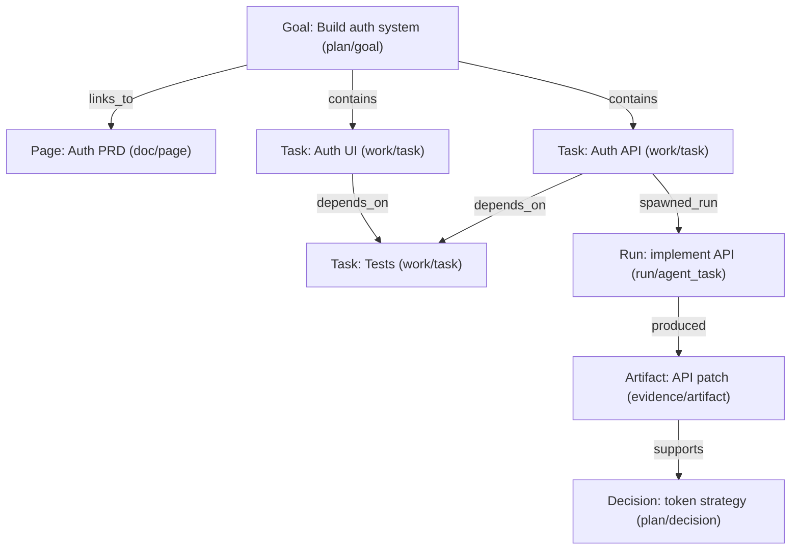

<!-- claxedo: page_id=page_1772169666420_407ewk5 updated_at=2026-02-27T05:55:00.423Z doc_hash=1808696025532a7ba48a2df4083f1e81c6b3658c4a4d19631fbf23317409ca70 derived_markdown=1 -->

# Agent Teams Build Plan

This document defines the first implementation plan for a multi-team agent orchestrator that runs locally, keeps a deterministic audit trail, and syncs selected outcomes to external trackers.

## Product Goals

1. Run multiple specialist agent teams against one feature goal.

2. Keep execution deterministic and replayable through an evented control plane.

3. Support direct intra-team collaboration with typed inter-team handoffs.

4. Keep local state responsive and resilient when offline.

5. Export high-quality, evidence-linked outputs for decisions and execution.

## Scope

In scope:

- Orchestrator control plane.

- Dependency graph and readiness scheduler.

- Planning pipeline (decompose -> route -> dispatch).

- Lead-agent coordination loop.

- Local-first event store, projections, snapshots.

- Sync adapters (GitHub, Jira, Linear).

- Render pipeline (markdown + html brief).

- Repair and recovery commands.

Out of scope (initial):

- Live browser action streaming in canvas.

- Advanced governance policy engine beyond baseline gates.

## System Model

### Core Runtime Stages

1. Plan: decompose user goal into scoped, non-overlapping work questions.

2. Route: select specialist roles by description-driven scoring.

3. Dispatch: schedule ready nodes with dependency and gate enforcement.

4. Coordinate: lead agent detects gaps, reroutes blocked/low-confidence branches.

5. Synthesize: verifier + synthesis nodes produce evidence-backed outputs.

6. Sync: push approved mutations to providers with idempotent semantics.

## WorkGraph Integration (Unified Docs + Tasks)

This orchestrator model benefits from being written into the same local-first WorkGraph that stores Pages and backlog items:

- A feature goal is a node (often `plan/goal`) linked to the Page section that described it.

- Planned tasks are nodes (often `work/task`) with dependency edges.

- Execution runs are nodes (often `run/*`) linked to the tasks they advance.

- Artifacts and evidence are nodes (`evidence/artifact`) linked to the runs and decisions they support.

- The event stream becomes the audit trail for replay, diff, and sync.

Conceptual mapping:



### Node Tags (Orchestrator Overlay)

These are runtime conventions stored as tags/attrs on WorkGraph nodes (not fixed schema enums):

- `run/lead_task`

- `run/team_task`

- `run/agent_task`

- `run/verification_task`

- `run/synthesis_task`

### Dependency and Gate Types

- `hard`: blocks readiness until source is complete.

- `soft`: advisory ordering only.

- `review_gate`: explicit approval required.

- `artifact_gate`: required artifact must exist and be valid.

### Scratchpad vs Artifact

Scratchpad is intermediary memory for in-progress work:

- local-only in v1.

- TTL and size bounded.

- non-canonical and non-scheduling.

Artifacts are durable outputs:

- versioned and provenance-linked.

- handoff/export/sync eligible.

- produced directly or by explicit scratchpad promotion.

## Package Layout

```text

packages/
  orchestrator-core/          # lifecycle, planning pipeline, scheduler, reactions
  orchestrator-graph/         # dependency graph, readiness, cycle detection
  orchestrator-events/        # envelope schema, reducers, replay
  orchestrator-sync/          # outbox/inbox, push/pull, cursor handling
  connector-github/           # provider adapter
  connector-jira/             # provider adapter
  connector-linear/           # provider adapter
  capability-research/        # role pack
  capability-execution/       # role pack
  capability-ux/              # role pack
  renderer-markdown/          # canonical export
  renderer-html-brief/        # rich brief with evidence links
  page/                       # canvas consumer

```

## Data Model (v1)

### Canonical State

- `events` (append-only truth)

- `runs_current`

- `teams_current`

- `team_members_current`

- `nodes_current`

- `dependency_edges_current`

- `messages_current`

- `handoffs_current`

- `artifacts_current`

- `decisions_current`

- `sync_outbox`

- `sync_state`

- `conflicts`

- `snapshots`

### Intermediary State

- `scratchpad_entries` (local-only, TTL/size bounded)

### Envelope Requirements

Each event includes:

- `id`, `run_id`, `stream_id`, `stream_seq`

- `logical_ts` (lamport-style, per run)

- `schema_version`

- `type`, `payload_json`

- `actor_type`, `actor_id`

- `op_id` (idempotency key scoped by run)

- `prev_hash`, `hash`

- `created_at`

## Event Families

Planning and routing:

- `run_planned`

- `question_scoped`

- `route_scored`

- `route_selected`

- `dispatch_requested`

Run/team lifecycle:

- `run_created`

- `team_created`

- `team_status_changed`

- `team_member_added`

Node and graph:

- `node_created`

- `node_status_changed`

- `edge_added`

- `edge_removed`

- `gate_satisfied`

- `gate_reopened`

Collaboration:

- `message_posted`

- `handoff_requested`

- `handoff_accepted`

- `handoff_rejected`

- `question_asked`

- `question_answered`

Lead loop and automation:

- `lead_plan_created`

- `lead_gap_detected`

- `lead_reroute_requested`

- `reaction_triggered`

- `watchdog_escalated`

Issue hydration and edits:

- `feature_slice_hydrated`

- `issue_hydrated`

- `issue_updated`

- `issue_linked`

- `issue_comment_added`

Scratchpad:

- `scratchpad_written`

- `scratchpad_promoted`

Outputs and decisions:

- `artifact_created`

- `decision_proposed`

- `decision_challenged`

- `decision_accepted`

- `decision_rejected`

Sync and recovery:

- `sync_push_acked`

- `sync_pull_applied`

- `conflict_detected`

- `conflict_resolved`

- `snapshot_created`

- `repair_rebuild_completed`

## Readiness Rules

A node is ready when:

1. All incoming hard dependencies are complete.

2. All required gates are satisfied.

3. Status is dispatchable (`pending` or `retryable`).

4. No active dispatch lease exists.

5. Team policy allows scheduling.

Additional constraints:

- Running/resuming nodes are never re-queued.

- Scratchpad state never affects readiness.

- Hard cycles are rejected with conflict events.

## APIs (v1)

Core:

- `POST /runs`

- `GET /runs/:run_id`

- `POST /runs/:run_id/teams`

- `POST /runs/:run_id/nodes`

- `POST /runs/:run_id/messages`

- `POST /runs/:run_id/edges`

- `GET /runs/:run_id/ready`

- `GET /runs/:run_id/events`

- `GET /runs/:run_id/events/stream`

Planning and routing:

- `POST /runs/:run_id/plan`

- `GET /runs/:run_id/plan`

- `POST /runs/:run_id/routes/preview`

- `POST /runs/:run_id/dispatch`

Lifecycle automation:

- `POST /runs/:run_id/reactions/evaluate`

- `GET /runs/:run_id/health`

Hydration and sync:

- `POST /features/hydrate`

- `POST /features/:feature_id/push`

- `GET /features/:feature_id/pull`

- `GET /sync/status`

- `POST /sync/rebuild`

Scratchpad:

- `POST /runs/:run_id/scratchpad`

- `GET /runs/:run_id/scratchpad`

- `POST /runs/:run_id/scratchpad/:entry_id/promote`

Repair:

- `POST /repair/verify`

- `POST /repair/rebuild`

- `POST /repair/replay`

- `POST /repair/reconcile`

## Delivery Phases

## Phase 0: Control Plane Foundations (2-3 weeks)

Deliverables:

1. Event schema + validator package.

2. SQLite migrations for canonical/projection/recovery tables.

3. Deterministic reducer engine.

4. Run/team/node lifecycle APIs.

5. Scratchpad local service.

6. Event query/stream APIs.

Acceptance criteria:

- Replay from event 0 reproduces projections deterministically.

- `(run_id, op_id)` dedupe is enforced.

- Hash/sequence verification detects tampering/gaps.

- Event stream can reconstruct run timeline without projection-only shortcuts.

## Phase 1: Planning, Routing, Team Collaboration (2-3 weeks)

Deliverables:

1. Plan pipeline (decomposition + scoped questions).

2. Routing classifier (description-based role selection).

3. Team messaging + typed handoffs.

4. Lead-agent loop and reroute events.

5. Scheduler with readiness/lease enforcement.

Acceptance criteria:

- Same run goal does not spawn duplicate specialist work above overlap threshold.

- Scheduler never dispatches nodes with unmet hard deps.

- Hard cycles are rejected and audited.

- Lead loop reroutes at least one blocked/low-confidence branch to completion in test scenarios.

## Phase 2: Feature Hydration and Provider Connectors (3-4 weeks)

Deliverables:

1. Feature slice hydration service.

2. Normalized issue model.

3. GitHub/Jira/Linear adapters.

4. Local-first issue edit flow with optional write-back gate.

Acceptance criteria:

- Hydration works for one feature slice per provider.

- Local updates are visible before network ack.

- Approved write-back maps title/state/comment correctly for each provider.

## Phase 3: Sync Reliability and Lifecycle Automation (2-3 weeks)

Deliverables:

1. Push/pull workers with cursor state.

2. Conflict pipeline and reconciliation path.

3. Lifecycle reaction engine.

4. Run-health watchdog.

5. Repair CLI set.

Acceptance criteria:

- Outages recover without duplicate remote mutation.

- Recoverable stalls are auto-resolved by reaction rules in baseline scenarios.

- Rebuild/replay/reconcile restore consistent projections.

## Phase 4: Output Quality and Capability Packs (2-4 weeks)

Deliverables:

1. Capability pack interface.

2. Synthesis/verifier node behaviors.

3. Markdown + html brief renderers.

4. Render quality rubric gate.

Acceptance criteria:

- Render outputs include source-linked evidence and decision lineage.

- Html brief fails closed when evidence linkage is incomplete.

- New capability pack can be installed without kernel changes.

## Testing Strategy

Unit:

- Reducer determinism.

- Cycle detection.

- Readiness and lease logic.

- Decomposition overlap checks.

- Routing scorer determinism.

- Reaction rule determinism.

Integration:

- Event write -> reducer -> projection transaction.

- Event stream replay ordering and completeness.

- Lead reroute updates graph/scheduler as expected.

- Scratchpad write/read/expiry/promotion lifecycle.

- Push/pull with transient failure injection.

E2E:

- Decompose -> route -> dispatch -> lead reroute -> synthesize.

- Deadlock detect -> unblock resolution.

- Offline outbox growth -> recovery drain without duplication.

- Conflict and reconcile scenario.

- Provider round-trip with approval gate.

## Operational Defaults

Run policy:

- max active nodes per run: 12

- max active nodes per team: 4

- max retries per node: 3

- escalation timeout for blocked question: 10 minutes

- decomposition max scoped questions: 7

- routing minimum confidence: 0.55

- watchdog no-progress timeout: 120 seconds

Sync policy:

- push batch size: 50 events

- pull interval: 2 seconds

- max backoff: 60 seconds

- snapshot interval: every 500 events

Scratchpad policy:

- local-only

- entry TTL default: 24 hours

- per-run size cap: 10 MB

## Risks and Mitigations

Risk: Event schema churn.

- Mitigation: versioned envelopes + compatibility tests.

Risk: Routing misclassification.

- Mitigation: route preview endpoint + threshold fallback to baseline team set.

Risk: Reaction noise.

- Mitigation: bounded retries, cooldown windows, audit events for auto-actions.

Risk: Provider API drift.

- Mitigation: adapter-owned mappings + nightly connector conformance tests.

Risk: Projection drift.

- Mitigation: verify/rebuild/replay tooling and periodic replay checks.

## Definition of Done

Ready for broad rollout when:

1. 99% of local mutations sync to remote within target window while online.

2. Rebuild from snapshots+events passes staged fault injection.

3. At least one multi-team run completes end-to-end with provider round-trip.

4. No unresolved high-severity duplication, scheduling, or integrity defects
