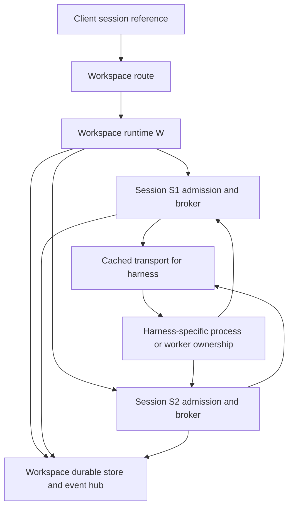
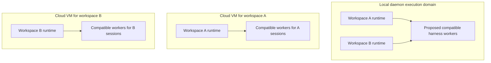
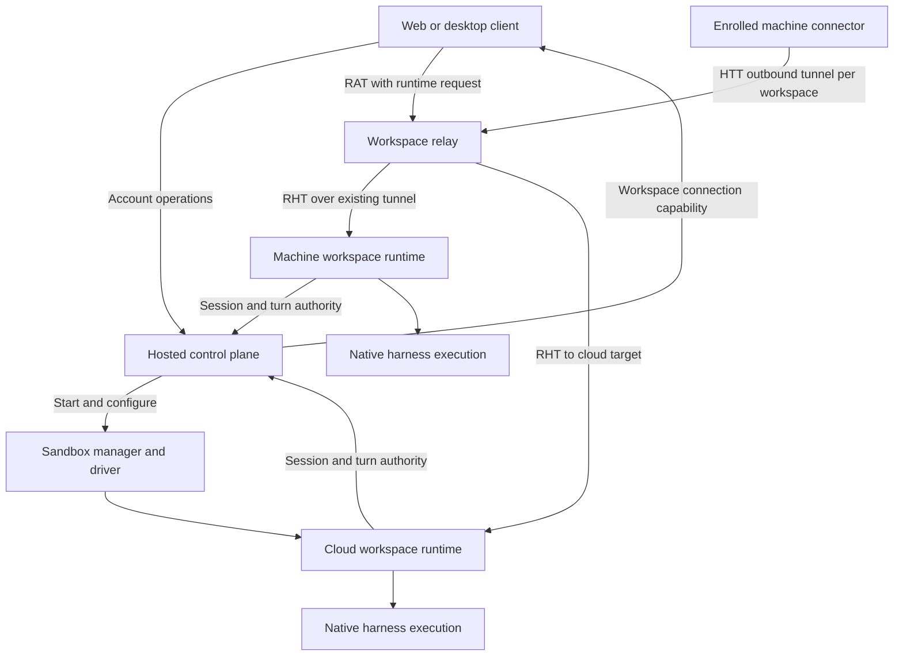

# Claxedo session execution across local and hosted clients

Claxedo supports multiple sessions by giving each workspace an execution runtime and giving each session its own admission, binding, broker, turn state, and persisted history inside that runtime. The harness transport decides whether these sessions use separate processes, a shared worker, or an embedded engine. Signing in changes account access and available placements; it does not automatically relocate a local session into cloud compute.

This is a source assessment at the revision above, with the subsequent desktop quit/reopen change checked at `final_checked_revision`. It covers the session execution architecture, including account access, workspace placement, relay delivery, credentials, events, and recovery. It does not certify a deployed environment or assume the running desktop matches this checkout. The [implementation plan](../plans/2026-10-03-harness-lifecycle-and-memory-plan.md) now targets sharing for every harness wherever supported; current behavior and that proposed target remain distinct below.

**OpenCode2 means the embedded V2 SDK in this document.** Current [host.ts](../../packages/harness/src/transports/opencode-sdk/host.ts) calls `OpenCode.create()` from `@opencode-ai/sdk`; [the harness dependency](../../packages/harness/package.json) pins `0.0.0-beta-19271`. The historical [`opencode2 serve` decision was superseded by embedded V2](https://github.com/kyashrathore/Claxedo/commit/ae4901980c91ad81daba5540f8b9088e574f22c4), followed by the [V2 dependency pin](https://github.com/kyashrathore/Claxedo/commit/acc0f8cf215d553e47ddc356fde43587baa2ddcd) and [current transport integration](https://github.com/kyashrathore/Claxedo/commit/5259a30ee5afad66c673bc2619a0ee5453721bef). Literal identifiers and error messages still say `opencode` or `OpenCode`; those names do not imply the old V1 HTTP client.

## 1. The boundaries that matter

Four choices are independent: **client** (browser or Electron), **identity** (local owner or signed-in account), **placement** (this machine, another enrolled machine, or a cloud sandbox), and **harness** (Codex, Claude, Cursor, Pi, OpenCode2, or an ACP connection).

| Boundary | Owner and responsibility | What it does not imply |
| --- | --- | --- |
| Project and placement | App catalog groups placements under logical projects. A placement resolves to a workspace ID and directory or remote target. | A project is not an OS process or a sandbox. |
| Client | `packages/claxedo-app` renders UI and calls its `src/server` adapter. Electron adds native services. | A browser tab does not own provider execution. |
| Account/control plane | Hosted server authenticates people, authorizes access, manages catalogs, reservations, grants, credentials, and sandbox placement. | Signing in does not create a harness process. |
| Local daemon | `packages/claxedo-local-server` mounts embedded runtimes by workspace ID and serves machine features. | There is no single machine-wide native session execution pool today. |
| Workspace runtime | `packages/workspace-runtime` owns the workspace store, runtime config, transports, launch ownership, events, filesystem/terminal services, and shutdown. | A workspace runtime is not necessarily a separate OS process locally. |
| Session | `packages/session-core` owns durable session identity, configuration, bindings, requests, and turns. | Two sessions in the same directory do not have isolated filesystems. |
| Turn | Session-core admits input and tracks execution and recovery under a session/owner generation. | An RPC acknowledgement is not proof that execution has stopped. |
| Harness transport | `packages/harness` translates one harness protocol and manages its execution resources. | A transport object need not correspond to one process. |
| Worker/process | Codex app-server, Claude CLI, Cursor worker, Pi RPC, embedded OpenCode2 engine, or ACP peer. | Process sharing is not credential or authorization isolation. |
| Launch wrapper | `packages/process-ownership` records launch identity and activation and owns process-group retirement. | The small wrapper is separate from the actual CLI and its descendants. |
| MCP server | Harness calls configured stdio or remote HTTP tools, including Claxedo first-party tools. | An HTTP server need not add a local process; an unidentified Node child is not automatically MCP. |
| Relay | `packages/workspace-relay` verifies connection capabilities and forwards HTTP/WebSocket traffic. | The relay does not run model turns or become the transcript authority. |

The ownership split is visible in [app server composition](../../packages/claxedo-app/src/server/server.ts), [embedded runtime registry](../../packages/claxedo-local-server/src/deployments/local/embedded-workspace-runtime.ts), [workspace host](../../packages/workspace-runtime/src/workspace/runtime.ts), [session runtime](../../packages/session-core/src/host/runtime.ts), and the [transport contract](../../packages/harness/src/contract/transport.ts).

## 2. Opening the app: unsigned, signed web, and signed desktop

**A. App startup → `SignedServer` → `createServer()`.** In [app.tsx](../../packages/claxedo-app/src/app.tsx), `principalOf()` extracts the signed-in person. `serverAccess()` provides either the desktop account port, browser cookie access, or neither. The keyed `SignedServer` recreates `ServerScope` when the principal changes, disposing the prior account's client stores and streams.

**A.1 Unsigned local desktop.** The app connects to its local daemon. The daemon exposes this machine's workspace catalog and embedded runtimes. Local execution uses machine-owner authority and the placement's permitted local provider login/configuration. No hosted account is required for that path. Local session persistence still exists; unsigned does not mean history lives only in browser memory.

**A.2 Signed desktop.** [desktop-binding.ts](../../packages/claxedo-app/src/auth/desktop-binding.ts) supplies a structured account port. Electron main's [account service](../../packages/claxedo-desktop/src/main/account/account-service.ts), especially `run()` and `openStream()`, owns the account credential and authenticated control-plane requests. The renderer receives operation results, not the long-lived account credential. Workspace connection results can contain their narrower runtime-access capabilities.

The app loads the local bootstrap catalog and account placements. [linkAccountCatalog()](../../packages/claxedo-app/src/server/account-link.ts) removes duplicate account placements for workspace IDs already present locally and pairs their project identities. Consequently, the same-machine workspace keeps its local runtime route after sign-in. Remote placements become additional routes. If the account catalog temporarily fails, [readCatalogs()](../../packages/claxedo-app/src/server/workspaces.ts) can continue displaying the local daemon's catalog; a hosted browser bootstrap cannot invent that local catalog.

**A.3 Signed browser.** [browser-binding.ts](../../packages/claxedo-app/src/auth/browser-binding.ts) establishes browser account state. [createBrowserHostedAccount()](../../packages/claxedo-app/src/server/account.ts) calls hosted operations through the configured transport with cookies. Runtime calls subsequently use relay capabilities, with cookies omitted from relay requests. The browser has no embedded workspace runtime; native harness execution happens on the selected host.

**A.4 `createServer()` finishes startup.** It constructs the transport, account adapter, workspace catalog, status owner, event intake, capabilities, queries, cloud projection observer, and placement stream manager. Startup loads the catalog before opening the declared streams. Disposal closes these subscriptions and clears the query cache. These are client-side owners, separate from stopping a server-side session.

| Client and placement | Account/control traffic | Session execution route |
| --- | --- | --- |
| Unsigned desktop, this machine | Local daemon | Local daemon → embedded workspace runtime |
| Signed desktop, this machine | Account port in Electron main plus local daemon | Still local daemon → embedded workspace runtime |
| Signed desktop, another machine | Account port obtains workspace/session connection | Renderer runtime transport → relay → enrolled host tunnel → workspace runtime |
| Signed browser, enrolled machine | Hosted cookie-authenticated operations | Browser → relay → enrolled host tunnel → workspace runtime |
| Signed browser or desktop, cloud workspace | Hosted cookie operations or desktop account port | Client → relay → cloud target → sandbox workspace runtime |

There is also a loopback daemon proxy branch in [createTransport()](../../packages/claxedo-app/src/server/transport.ts): a remote route without an account port can pass through `/workspaces/{workspaceId}`. Signed desktop remote calls with the account port use the relay branch directly. The actual branch follows the route and transport configuration, not merely the word “desktop.”

## 3. Sending a prompt into a workspace

**B. User sends → `sendPrompt()` → `server.sessions.prompt()`.** The [transcript sender](../../packages/claxedo-app/src/session/transcript/send.ts) inserts an optimistic user message, sends the request, removes that optimistic message on failure, and schedules authoritative transcript readback on success.

**B.1 `postPrompt()` → placement resolution.** [sessions.ts](../../packages/claxedo-app/src/server/sessions.ts) wakes a stopped placement when the action calls for execution, obtains `workspaces.route(ref)`, then posts the prompt route. [placementRoutes()](../../packages/claxedo-app/src/server/workspaces.ts) resolves the session's placement ID, workspace ID, directory, and any shared-session grant. A stopped cloud placement is not treated as a ready runtime.

**B.2 Transport chooses delivery.** A local route calls the configured server with the directory. A daemon proxy route uses `/workspaces/{workspaceId}`. A direct remote route calls `createRelay().fetch()`. The detailed relay branches are in sections 5 and 6.

**B.3 Local dispatch → one embedded runtime for the workspace.** [dispatchEmbedded()](../../packages/claxedo-local-server/src/workspace/runtime-dispatch/internals.ts) verifies ingress before calling `ensureEmbeddedWorkspaceRuntime()`. It supplies the authoritative workspace ID/directory, removes client-provided internal provenance, and forwards to `runtime.app.fetch()`. The registry's `hosts` map is keyed by workspace ID. Two sessions targeting the same workspace reach the same runtime object; different local runtimes still inhabit the daemon's process.

**B.4 Workspace host → execution owners.** [createWorkspaceHost()](../../packages/workspace-runtime/src/workspace/runtime.ts) establishes durable state, launch ownership, config application, and lazy `harnessEngine()` construction. That engine composes `createWorkspaceTransports`, `StoreBrokerPorts`, `createSessionConfiguration`, and session-core's runtime. Runtime services also expose workspace files, processes, terminals, and diffs under the host's authority.

**B.5 Prompt route → admission.** The [session route](../../packages/session-core/src/routes/session-core.ts) invokes the session operation guard and [createPromptAdmission()](../../packages/session-core/src/routes/session-prompt-admission.ts). This checks actor/permission constraints and message admission. [runRuntimePromptTurn()](../../packages/session-core/src/session/service.ts) subscribes before starting execution. `runtime.turns.start()` acquires admission, captures recovery ownership, persists the turn, and calls `runTurn()`.

**B.6 Session binding and credentials → harness.** [createSessionLifecycle()](../../packages/session-core/src/host/sessions.ts) creates or attaches the session. [startInput()](../../packages/session-core/src/host/launch.ts) supplies workspace/session identity, directory, resolved owner credentials, config, and launch projection. A `SessionBroker` owns session requests and rebinding; [runTurn()](../../packages/session-core/src/host/turn-runner.ts) derives the `TurnBroker` with turn identity, generation, and abort signal. The workspace's per-harness projection does not imply that the UI offers independent selection of every launch setting on every chat.

**B.7 Transport → process or engine.** [createWorkspaceTransports().forHarness()](../../packages/workspace-runtime/src/workspace/transports.ts) caches native transport handles under `native:{harnessId}`. Custom connection handles also incorporate connection descriptor, directory, owner, and credential-lease identity; active turns pin their handle. The transport then applies its harness-specific execution policy described in section 8.

**B.8 Owned spawn.** [createSpawnService()](../../packages/workspace-runtime/src/spawn-service.ts) delegates to `launchOwnedProcess()`. The [launch gate](../../packages/process-ownership/src/launch/launch-gate-child.ts) establishes durable launch identity before the payload starts and keeps a process-group leader for retirement. Parent/child and launch ownership evidence distinguish wrapper, CLI, and further descendants.

## 4. How multiple sessions share one workspace

The workspace is the routing, storage, and lifecycle owner. Session identity is the unit of conversation execution inside it.

1. [createTurnAdmissions()](../../packages/session-core/src/host/turn-admission.ts) keeps its active, waiting, handed-off, and gate state keyed by session ID. [runtime.ts](../../packages/session-core/src/host/runtime.ts) also tracks executing sessions by session ID and generation.
2. [Attachments](../../packages/session-core/src/host/attachments.ts) and session brokers retain the selected harness binding and upstream session identity for each conversation.
3. Input within one session is admitted, queued, steered, or refused according to the current turn and harness contract. There is no single workspace-wide turn queue forcing all unrelated chats to execute serially.
4. A turn receives only its session's broker and recovery capture. Provider events must be assigned to the correct root or child session before persistence, usage accounting, and publication.
5. Sessions share the workspace's files and some host resources. They can concurrently edit the same checkout; separate sessions alone do not provide worktree isolation.

For example, sessions S1 and S2 in workspace W both reach W's runtime. Both can use its cached Codex transport, but today that transport creates two independent root entries and app-server launches. With Cursor, compatible S1/S2 entries can instead use two Agent objects in one worker. With OpenCode2, they use one workspace engine. All three arrangements already support multiple sessions; only the process topology differs.

### 4.1 Why one runtime per workspace does not prevent sharing

Locally, `hosts[workspaceId]` selects a runtime object in the existing daemon, not a new Node process. That runtime owns session admission, stores, configuration and event routing. A harness worker is a separate resource. Several sessions can borrow one worker while their state remains in that runtime, as Cursor and OpenCode2 already demonstrate.

The current transport registries belong to individual workspaces, so compatible sessions in different local workspaces do not currently reach one shared Codex/Cursor registry. That is an implementation boundary, not a requirement of workspace identity. The proposed local daemon execution owner would let both runtimes acquire compatible workers while keeping each session's broker and storage in its own workspace. Shared launch ownership, recovery and daemon residency must move with the registry; moving only the map is unsafe.

**Cloud placement has a different topology.** With one VM per workspace, that VM is the execution and process-sharing domain. Its workspace runtime can own a pool serving all its sessions. The pool stays inside the VM; it does not sit in the relay or control plane. Two workspace VMs cannot share one OS process. Combining their compute into a multi-workspace VM would be a separate placement/isolation change and is not part of this plan.

| Placement | Workspace authority | Proposed process-resource owner | Sharing extent |
| --- | --- | --- | --- |
| Local daemon with several workspaces | One runtime object per workspace | One explicitly composed owner in the daemon | Compatible sessions within and across those local workspaces |
| Cloud VM for one workspace | That workspace's runtime in the VM | Owner composed in that same VM, with the runtime's deployment lifetime | Compatible sessions in that workspace |
| Two cloud workspace VMs | Separate runtimes and VM lifetimes | Separate owner in each VM | No cross-VM OS-process sharing |

An execution owner here is a proposed resource-lifetime component, not a new server, extra VM, or extra network hop. The client still addresses the workspace and session. Worker responses return through the original workspace/session broker. Stopping one workspace releases only its members; destroying its cloud VM necessarily stops everything inside that VM.

One runtime per workspace still has a real cost: stores, configuration state, event subscriptions and runtime services consume resources. Those should be measured. The structural point is narrower: that object boundary does not require duplicated harness processes. OpenCode2's separate local workspace engines already inhabit the same daemon process, even though their database/lifecycle owners remain separate.

## 5. Reaching a workspace on another machine

This flow has two independent connections: the machine opens an outbound serving tunnel, and an authorized client obtains a capability to use it.

**C. Host enrollment and assignments.** The desktop's [host connector child](../../packages/claxedo-desktop/src/host-connector-child/entry.ts) uses machine credentials after enrollment. [createHostConnector() and its connector lifecycle](../../packages/claxedo-host-connector/src/connector.ts) acquire a serving generation, receive workspace assignments, acknowledge validated assignments, and heartbeat readiness. Desktop serving requires both local folder consent and the matching assignment. A stale connector generation is not authority to keep serving the host.

**C.1 Host connects outward.** [HostServingRoutes](../../packages/claxedo-local-server/src/workspace/host-serving-routes.ts) applies control-plane endpoints and config before installing the serving assignment. [setHostServing()](../../packages/claxedo-host-serving/src/serving.ts) opens one outbound tunnel per workspace and tracks connected workspace IDs separately from intended assignments. Expiry and withdrawal retire the relevant serving connection. The standalone `claxedo connect` path uses the same runtime kit through [createHostWorkspaceRuntime()](../../packages/claxedo-host-serving/src/runtime.ts), with a different host composition.

**C.2 Client requests a connection.** [hostTunnelConnectionInfo()](../../packages/claxedo-server/src/connections/host-tunnel-connection.ts) checks workspace access and active host serving state before minting a runtime-access capability. A session-share connection is narrowed to that session and its granted access, rather than conferring general workspace access. Offline hosting produces an unavailable connection response; the browser cannot turn an offline laptop into cloud execution.

**C.3 Client sends through relay.** [createRelay()](../../packages/claxedo-app/src/server/relay.ts) caches connection results by workspace and optional shared-session ID, refreshes near expiry, sends an HTTP bearer, and retries a 401 once after a fresh connection lookup. WebSockets carry the capability in the `claxedo-rat.` subprotocol. A connection read requires a ready target and does not silently start compute.

**C.4 Relay verifies and forwards.** [authorizeWorkspaceRelayRequest()](../../packages/workspace-relay/src/server.ts) verifies the client capability, workspace/host binding, active-token status, and target. The Cloudflare gateway selects a workspace Durable Object. A `local-worktree` target uses the host tunnel; it is not fetched through a guessed public laptop URL. Relay forwarding removes the client bearer and internal actor headers, then supplies fresh relay-to-host provenance.

**C.5 Host dispatch and session authorization.** The request travels over the already-open tunnel to the local daemon's workspace dispatcher. [host-session-authority.ts](../../packages/claxedo-local-server/src/deployments/local/host-session-authority.ts) accepts only verified relay provenance as a remote actor, then consults hosted session authority. Unstamped, admitted local-owner calls remain a separate path. A control-plane outage can deny remote/private session access without logging out the machine owner or disabling ordinary local access.

For an existing local session missing hosted registration, adoption is constrained to an actual runtime session and machine-owner authority, followed by a fresh authorization decision for the caller. It is not permission to synthesize arbitrary session ownership.

**C.6 Transient account failure is not logout.** [remoteAccessFollow()](../../packages/claxedo-desktop/src/main/host-connector/account-follow.ts) distinguishes an unavailable account service from actual credential loss/refusal. The connector's own serving generation and lease still bound how long the host may remain advertised.

## 6. Reaching a cloud workspace

**D. User creates or starts a cloud placement.** The hosted workspace routes call [hostedConnectionInfo()](../../packages/claxedo-server/src/connections/hosted-connection-info.ts) for the start/mint operation. It authorizes the actor, validates the cloud backing and entitlement, prepares runtime delivery, calls the sandbox manager, and provisions runtime configuration before returning a usable capability. Provisioning can return a retryable state instead of claiming readiness.

**D.1 Reading is distinct from starting.** `hostedConnectionStatus()` uses `manager.target()` to inspect current availability and runtime provisioning. The POST start path uses `manager.ensure()`. A stopped target returned by GET remains stopped. `hostedSessionConnection()` for a shared session uses an existing target and cannot use the share grant to provision a workspace.

**D.2 Sandbox manager owns compute placement.** [createSandboxManager()](../../packages/sandbox-manager/src/manager.ts) manages workspace leases, epochs, driver target registration, resume/restore behavior, and stop/destroy operations. Drivers declare their capabilities. Different sandboxes can be separate hosts; there is no meaningful shared OS process across those hosts. A Cloudflare control-plane deployment does not imply all native CLIs execute in a Cloudflare Worker isolate.

**D.3 Control plane delivers configuration.** [createHostedRuntimeDelivery()](../../packages/claxedo-server/src/workspace/hosted-runtime-delivery.ts) resolves the workspace owner's settings, selected provider accounts, plugins, and driver-specific secret delivery. It pushes a composed config snapshot through the runtime supervisor client. Settings/plugin/credential changes reconcile running workspaces. Enrolled machine workspaces instead receive their host-connector delivery. The application must not infer that every driver keeps plaintext provider credentials outside the runtime; delivery depends on its declared broker capabilities.

**D.4 Sandbox boots the same runtime kit.** [claxedoWorkspaceRuntimeLaunch() and claxedoWorkspaceRuntimeBootFromEnv()](../../packages/claxedo-server/src/hosts/workspace-runtime/runtime-boot.ts) validate workspace/host/lease identity, epoch, bootstrap credential, directory, port, exposure, and harness selection. Cloud placement declares `canUseOwnLogin: false`; it cannot borrow a developer's laptop login. The host composes workspace-runtime, per-runtime first-party MCP credential issuance, remote session authority, and usage reporting. Native execution then follows B.4–B.8 inside that sandbox.

**D.5 Client sends through relay to the cloud target.** The client has the same workspace/session route and relay adapter as C.3. The relay resolves a cloud target and forwards to its permitted endpoint with fresh host provenance. Host admission and session authority still run; the relay capability is not a substitute for them.

**D.6 Cloud history and stop/resume.** [createSession()](../../packages/claxedo-app/src/server/sessions.ts) reserves a remote account session ID before creating that ID in the runtime. The runtime owns live execution history. The app's [session projection observer](../../packages/claxedo-app/src/server/session-projection.ts) requests registration and checkpoints for cloud placements, including on idle/failed status. A failed projection logs failure; it does not establish that cloud history was saved. These projections are distinct from sandbox filesystem/runtime checkpoints. Sandbox checkpoint, stop, resume, and replacement-restore follow [checkpoint-manager.ts](../../packages/sandbox-manager/src/checkpoint-manager.ts) and driver capability, rather than client cache state.

**D.7 Hosted services are their own deployment layer.** The [hosted core app](../../packages/claxedo-server/src/deployments/hosted-shared/hosted-core-app.ts) composes account, workspace, credential, session authority, and other control-plane routes. The [workerd core factory](../../packages/claxedo-server/src/deployments/hosted-workerd/core-worker.cf.ts) and [Better Auth/D1 composition](../../packages/claxedo-server/src/deployments/hosted-workerd/better-auth-d1-worker.cf.ts) use cloud database and storage bindings. This architecture assessment does not treat adjacent Pi durable-worker design documents as an implemented replacement for native sandbox execution.

## 7. Tokens, credentials, and live events

| Credential or authority | Where it is used | Scope |
| --- | --- | --- |
| Browser account cookie / desktop account bearer | Client account operations → hosted control plane | Signed-in account; desktop bearer is owned by main |
| Machine credential and serving generation | Host connector → control plane | Enrollment, assignment, heartbeat, and serving lifecycle |
| RAT: runtime access token | Client → relay | Workspace, host, actor/role, and optional shared session |
| HTT: host tunnel token | Machine → relay | Host, authorized workspaces, and serving/enrollment generation |
| RHT: relay host token | Relay → runtime ingress | Verified actor and destination provenance for the forwarded request |
| Session/turn authority lease | Runtime ↔ hosted authority | Session access or turn execution with expiry and fencing |
| Provider credential binding | Workspace config/admission → selected harness profile or broker | Chosen owner/account, locality, and current credential generation |
| First-party MCP credential | Runtime-launched harness → runtime MCP endpoint | Runtime/workspace/session and allowed tool scope |

RAT, HTT, and RHT are not three serial authentication steps performed by the same client. HTT authorizes the independently established host tunnel. The client presents RAT; the relay emits RHT when forwarding through either host delivery branch.

`remoteWorkspaceSessionAccessPolicy()` calls the [hosted runtime session authority](../../packages/claxedo-server/src/routes/runtime-session-authority.ts) for access, reservation/registration, and turn acquisition/renewal/release. Invalid, expired, unavailable, or unreadable authority is not converted into guessed permission. Turn fences and deferred-work grants are distinct from merely keeping a network connection open.

**E. Harness event → runtime → client.** The harness translates provider frames through its bound session/turn brokers. Session-core validates ownership, persists canonical events, and publishes through the workspace [RuntimeEventHub](../../packages/session-core/src/projection/runtime-event-hub.ts). The [workspace event route](../../packages/session-core/src/routes/events.ts) authorizes session visibility, covers child frames under the parent grant, renews finite stream leases, and emits replay-gap signals when recovery requires rereading.

**E.1 Client stream ownership.** [createEventStreams()](../../packages/claxedo-app/src/server/streams.ts) opens the control-plane event stream and, only when declared by bootstrap, the host aggregate workspace stream. [createPlacementStreams()](../../packages/claxedo-app/src/server/placement-streams.ts) reference-counts remote session subscriptions and opens `/api/wr/events?sessionID=...` for attached remote sessions. Opening another UI view adds a subscriber; it does not start another harness process.

**E.2 UI update.** [createEventIntake()](../../packages/claxedo-app/src/server/event-intake.ts) maps workspace/placement identity, updates status, invalidates reads, and publishes `ServerEvent`s. [Transcript event handling](../../packages/claxedo-app/src/session/transcript/events.ts) updates the matching conversation. Reconnect and replay gaps trigger canonical reads, not fabricated deltas or inferred completion.

**E.3 Long-lived connection authority.** Current [cloudflare.ts](../../packages/workspace-relay/src/cloudflare.ts) has `watchRuntimeAccessToken()`, host target/generation checks, and `runHibernatedRevocationCheck()` alarms. Established WebSockets are checked after setup, with caches and bounded resolver-outage handling; revocation is not instantaneous. Runtime SSE streams also have their own session authority lease renewal. The statement in [relay architecture.md](../../packages/workspace-relay/docs/architecture.md) that validation occurs only at connection establishment is stale. Each transport's lifetime rules must be documented separately.

## 8. What each harness actually shares

The upstream facts below refer to versions inspected in the harness audit: Codex 0.156.1–0.159.2, Claude Agent SDK 0.3.285, Cursor SDK 1.0.34, OpenCode2 embedded V2 beta-19271, Pi RPC/SDK source at `9fba660cf1caca0ade5bea72269352416e595a19` and tested Pi 1.0.0, and ACP SDK 1.5.1. They do not establish behavior for arbitrary future versions or ACP peers.

Dependency provenance matters: the lockfile and harness-local SDK resolve beta-19271, while a stale workspace-runtime-local installation inspected during this audit reports beta-18684. The harness owns the source import. [node-sdk-smoke.mjs](../../packages/workspace-runtime/scripts/node-sdk-smoke.mjs) deliberately resolves through that harness entry; actual staged and running desktop dependencies still need separate verification.

| Harness | Current Claxedo resource ownership | Configuration and cancellation boundaries | Plausible memory work |
| --- | --- | --- | --- |
| Codex app-server | One app-server/launch group per attached root entry; one cached transport per workspace | Root/child/title routing and inbound requests belong to that entry. Thread MCP/config is possible upstream; auth/home/cache contain process state. Close, launch replacement, and ambiguous-start recovery can retire the process. | Share compatible threads with process-wide routing and group recovery; add safe quiescent release and measure capacity. |
| Claude Agent SDK | Lazy Query/CLI per independent concurrent session; normal completed result closes it when no background work remains | Compatible live-query reuse is conditional. Launch settings and background tasks constrain replacement. Failed stop can retire the dedicated process. | Measure actual retained queries and descendants; do not assume every completed chat retains an idle CLI. |
| Cursor SDK | Compatible Agents already share a worker by binding/home within a workspace | Agent cwd/MCP differ; profile/home/plugin/account compatibility matters. A cancel/close timeout can retire the worker and affect siblings. | Measure worker occupancy, retained caches, and descendants before changing ownership. |
| OpenCode2 embedded V2 SDK | One shared engine per workspace transport, embedded in the local daemon when local | Current integration has directory-scoped config/tool/reload maps and engine-wide account compatibility. It does not use the installed SDK instance selector. | Measure retained engine resources. Instances are configuration separation, not an automatic memory saving or OS isolation. |
| Pi RPC | Separate RPC process per session using the resolved installed executable | RPC has one active session. Launch settings/MCP handoff/extensions are per entry; active launch changes are refused and eligible idle changes reopen. | Qualify embedded SDK sharing while preserving the selected Pi installation, eligible user extensions/profile and full behavior/resume parity. Retain RPC where the installation contract cannot be preserved. |
| Custom ACP | Peer/connection per session; may be stdio, WebSocket, or HTTP | Protocol addresses sessions, but concurrency and stop guarantees depend on the peer. MCP is protocol data; plugin options can be peer extensions. A remote disconnect need not stop execution. | Pool only proven-capable peers after measuring their entire child tree; fewer peer wrappers may leave the heavy processes unchanged. |

Canonical implementations: [Codex sessions](../../packages/harness/src/transports/codex-app-server/session.ts), [Claude live query](../../packages/harness/src/transports/claude-sdk/live-query.ts), [Cursor host registry](../../packages/harness/src/transports/cursor-sdk/host-registry.ts), [OpenCode host](../../packages/harness/src/transports/opencode-sdk/host.ts), [OpenCode transport](../../packages/harness/src/transports/opencode-sdk/transport.ts), `Pi launch`, and [ACP startup](../../packages/harness/src/transports/acp/startup.ts).

Two audit corrections affect implementation choices:

- Claude's [ordinary result/background cleanup](../../packages/harness/src/transports/claude-sdk/live-query.ts) already closes eligible queries. A general Claude idle-reaper proposal has not demonstrated an idle population to reclaim.
- [BUILT_IN_MCP.pi](../../packages/harness/src/registry/table.ts) is false, while `Pi's MCP handoff` registers actual MCP servers through an extension. [Real-process conformance](../../packages/harness/src/conformance/pi-mcp.test.ts) covers stdio, HTTP, and first-party MCP. The declaration is inconsistent; this audit did not establish a UI consumer hiding MCP because of that flag.

**Pi's installed-executable contract matters.** `resolvePiExecutable()` finds `PI_EXECUTABLE` or `pi` on PATH. [Composition](../../packages/workspace-runtime/src/host/composition.ts) supplies `PI_CODING_AGENT_DIR` or the user's `~/.pi/agent` as the owner profile. `selectPiProfile()` uses it only for an eligible owner-login session; selected-account/member sessions can instead use isolated brokered profiles. The owner profile is not rewritten. The launcher sets the workspace cwd, invokes `--mode rpc`, and passes projected extension roots plus Claxedo's own extensions with `-e`, leaving Pi to load its native resources. Terminal-only extension chrome is not rendered as a native Claxedo surface; the transport README records which UI events become dialogs, notices or diagnostics.

An embedded SDK can discover extensions, but “uses an SDK” is not equivalent to “runs this user's installed Pi.” The selected version/package, loader behavior, project trust, built-ins, native dependencies, callbacks and process-global extension state all matter. The pinned Pi 1.0.0 SDK docs explicitly require hosts to install CLI built-in MCP/codemode/tool-search extensions themselves. The plan now makes installed-Pi compatibility a prerequisite for SDK replacement, not a capability that can be dropped to make sharing work.

## 9. Stop, approvals, configuration changes, and recovery

**F. Stop one session.** The app calls the routed [session stop operation](../../packages/claxedo-app/src/server/session-stop.ts). [createTurnStops()](../../packages/session-core/src/host/turn-stops.ts) aborts the broker and calls the attached transport's `cancel()`, then reconciles provider settlement and cleanup facts. Unconfirmed execution retains recovery ownership. Codex checks owned terminals/background work; Cursor's shared-worker timeout illustrates why shared process failure must be handled for every occupant.

**G. Reply to an approval.** [replyToRequest()](../../packages/claxedo-app/src/server/sessions.ts) resolves the same session route and sends the permission/question answer. [createRequestSurface()](../../packages/session-core/src/host/requests.ts) records it and resolves the matching broker request. Native child requests must retain their asking-session owner. Reusing a Codex RPC without replacing its single entry-bound inbound handler would break this boundary.

**H. Change configuration or credentials.** The workspace applies a validated snapshot. [createSessionConfiguration()](../../packages/workspace-runtime/src/workspace/configure.ts) serializes pushes, resolves each session owner's credentials, and respects `applied`, `deferred`, and `refused`. A live model change can be narrower than a launch/profile change. Revocation can require retirement; ordinary compatible updates cannot skip background-work checks. Cloud and machine delivery differ as described above, but they converge on workspace config application.

**I. Restart or reconnect.** [workspaceDurableState()](../../packages/workspace-runtime/src/workspace/durable-state.ts) opens storage, recovers busy state, and reconciles prior-generation owned launches. [reconcileLaunchOwnership()](../../packages/workspace-runtime/src/ownership/reconcile-launch-ownership.ts) uses recorded process identity, not executable names. Unresolved prior launches block mutating admission. Harness attachment resumes the persisted upstream identity where supported; recovery cannot silently substitute a new conversation for a missing one. [Recovery/finalization](../../packages/session-core/src/host/recovery.ts) fences stale completion. Network reconnect alone does not provide exactly-once provider execution.

**J. Shut down a workspace.** [Workspace disposal](../../packages/workspace-runtime/src/workspace/runtime.ts) closes admission, cancels startup interactions, retires owned work/transports, disposes runtime services, and closes storage only after successful cleanup. Failed cleanup remains retryable. The local registry removes the mounted host while retaining retirement bookkeeping. A machine-wide pool would have to separate a workspace's release from the shared process lifetime; simply moving a map above the workspace registry is insufficient.

**J.1 Quit and reopen desktop.** Current `createDaemonExitLifecycle().release()` calls only `lease.stop()`, which releases desktop residency through [holdClaxedoDaemonLease()](../../packages/claxedo-desktop/src/main/server-daemon-lease.ts). It no longer submits a daemon drain. The [daemon lifecycle](../../packages/claxedo-local-server/src/app/local-daemon-lifecycle.ts) owns running work and applies idle grace after its residency owners release. This distinction was introduced by [the quit/reopen fix](https://github.com/kyashrathore/Claxedo/commit/0c272d491f115f4c7093889c2bf446cc365bc319) during this audit. Desktop [shutdown()](../../packages/claxedo-desktop/src/main/index.ts) still disposes its host connector, so preserving local execution does not promise continued remote tunnel availability after desktop exit. A future harness memory policy must preserve work across desktop exit; workspace disposal and explicit recovery/drain remain separate actions. This source check is not a packaged quit/reopen acceptance run.

## 10. What the memory evidence supports

The earlier read-only audit snapshot, at **2026-10-03 00:38:16 IST**, matched ten Codex launch wrappers and ten app-server children to ten sessions in **one workspace**. Summed RSS was approximately 378 MiB for wrappers and 700 MiB for the Codex children. A separate `vmmap` sample reported a 13.1M physical footprint for one wrapper, with an analysis warning. These are different metrics and sampling times; neither is a unique-memory total or a predicted saving. Those launches subsequently retired through activity outside the audit.

The snapshot did not record enough simultaneous active/background/quiescent state to quantify savings from unloading or pooling. It did not establish a leak, classify every descendant, or prove Claxedo caused the WindowServer watchdog panic. All sampled groups were in one workspace, but that distribution does not restrict the user's broader target of sharing wherever supported.

The immediate Codex constraint is entry-owned process routing and retirement: [CodexRpc](../../packages/harness/src/transports/codex-app-server/rpc.ts) has one inbound handler; [bindEntry()](../../packages/harness/src/transports/codex-app-server/session.ts) binds it to one broker; [notifications](../../packages/harness/src/transports/codex-app-server/notifications.ts) classify one root's children; [CodexSessions](../../packages/harness/src/transports/codex-app-server/sessions.ts) closes/reopens the process with the entry. [Profile preparation](../../packages/harness/src/profiles/codex/index.ts) also writes mutable home/config files, and [codexHomeKey()](../../packages/harness/src/profiles/codex/home.ts) is not a complete process compatibility key.

The target is now to share compatible execution across all supported harnesses, including compatible workspaces inside one local execution domain. The [plan](../plans/2026-10-03-harness-lifecycle-and-memory-plan.md) includes host-owned lifetime, Codex and Cursor sharing, existing OpenCode2 embedding, Pi SDK integration, qualified ACP peers and Claude's explicit API limit. Measurements tune capacity and establish actual savings; they do not select Codex as the only implementation lane. Cloud sharing remains inside each workspace VM.
