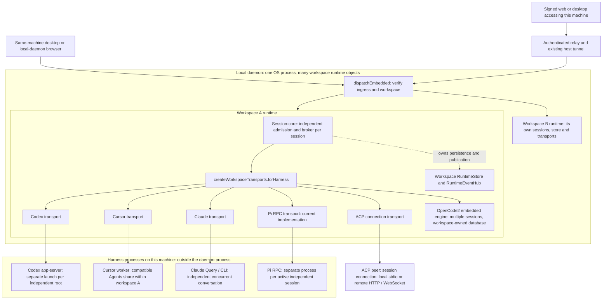
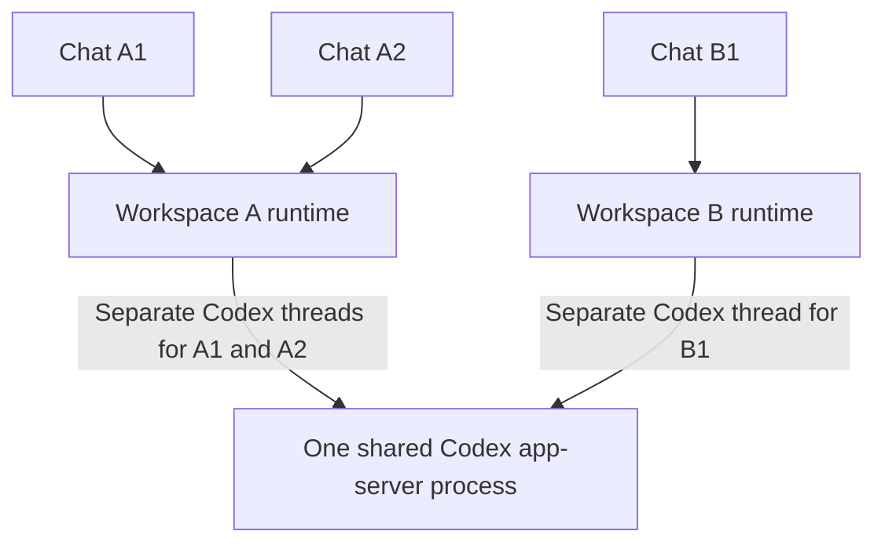
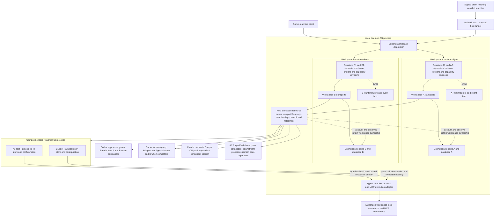
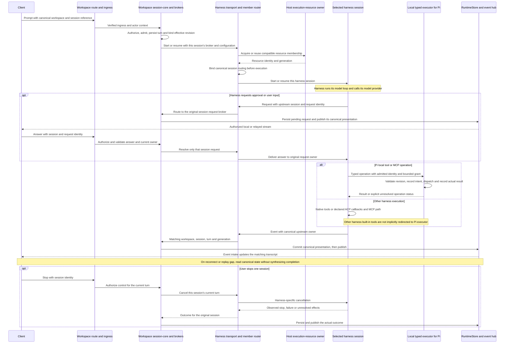
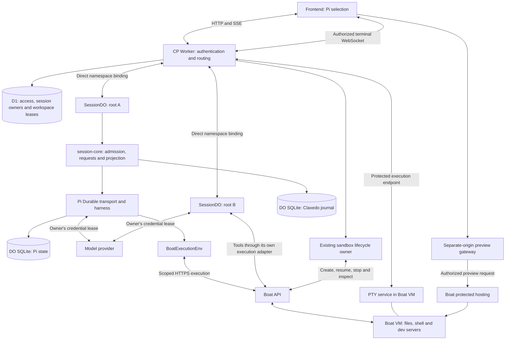
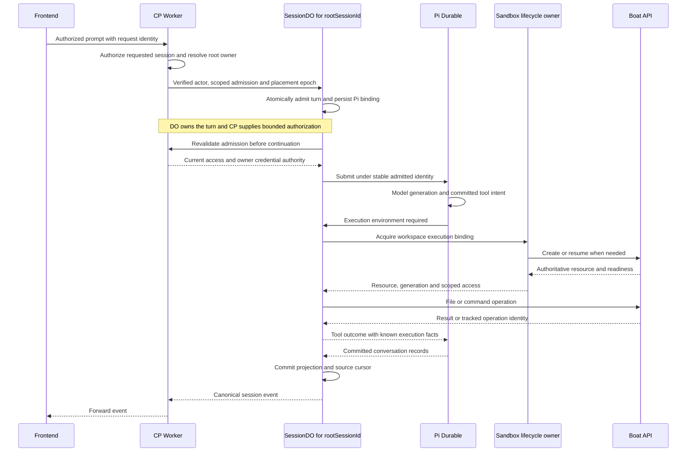
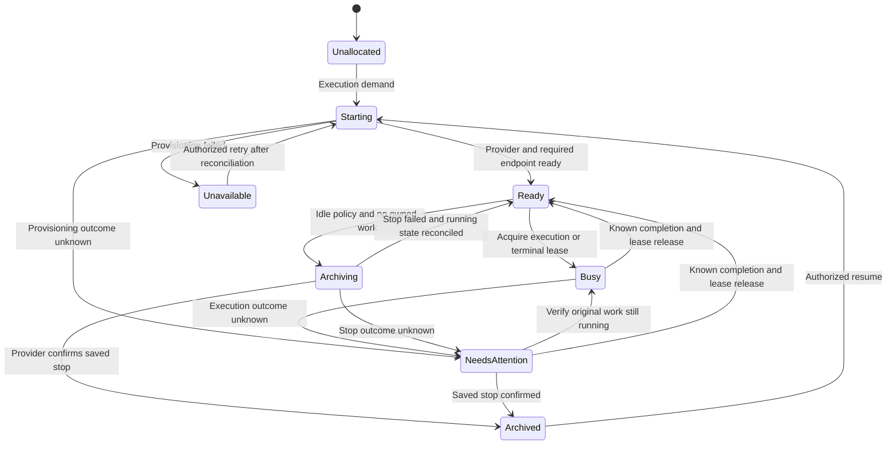
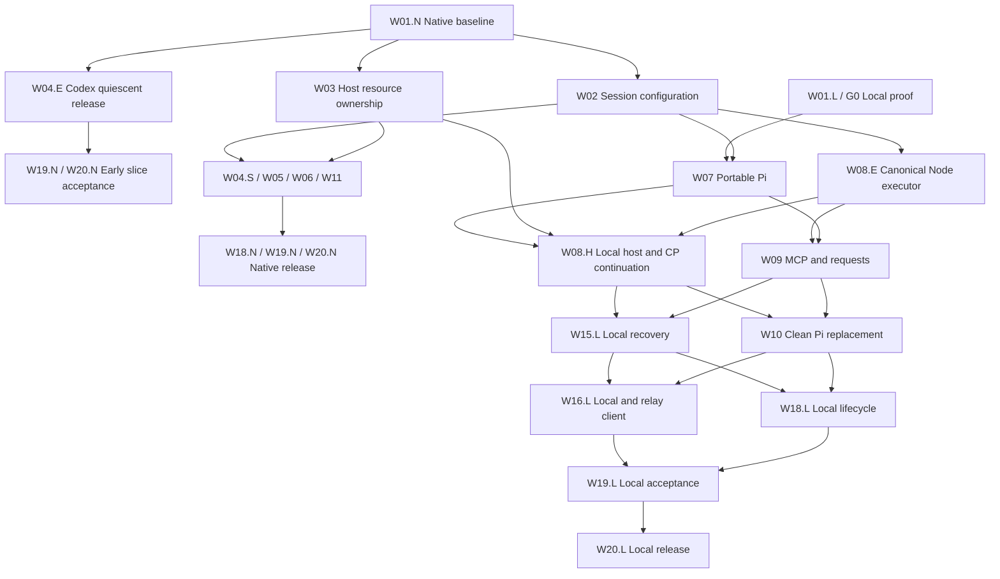
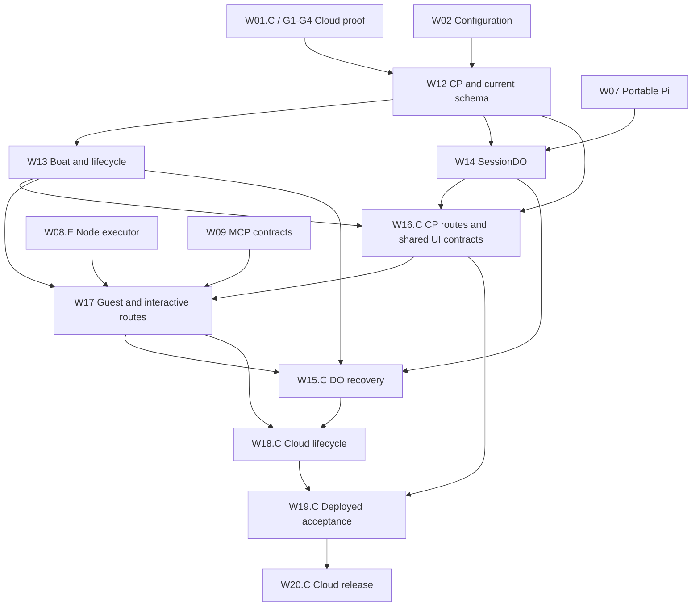

# Claxedo harness sharing and Pi execution

This document is the consolidated architecture and implementation plan requested on 2026-10-03. It covers all six existing harness integrations, Pi Durable on the local machine and in Cloudflare Durable Objects, per-session capabilities/MCP, machine execution, client/relay/cloud integration, recovery and resource measurement. The implementation units and acceptance matrix below are the execution authority for this combined scope.

It incorporates the [all-harness lifecycle plan](../plans/2026-10-03-harness-lifecycle-and-memory-plan.md) and [Pi Durable / Boat implementation plan](../plans/2026-10-02-2031-feat-pi-durable-boat-plan.md). Those documents remain source records; their narrower scope or older Pi SDK direction does not override this consolidated plan. The [current architecture audit](2026-10-03-claxedo-session-execution.md) and [49-case failure matrix](2026-10-03-harness-failure-matrix.md) provide the native-harness evidence. The coverage table below accounts for their work rather than requiring an implementer to combine competing plans.

**Status:** planning only. No checkboxes below claim implemented behavior. Current-code observations, upstream capability evidence and proposed implementation are distinguished. Passing document validation is not runtime, memory or deployment acceptance.

Reading order: [scope](#product-contract) → [current flow](#observed-current-flow) → [local architecture across all harnesses](#local-flow-across-all-harnesses) and [cloud architecture](#cloud-pi-durable-and-boat) → [implementation units](#complete-implementation-plan) → [dependencies](#delivery-dependencies-and-parallel-ownership) → [acceptance](#acceptance-matrix).

## Decision and outcome

Share compatible sessions in harness processes wherever the supported API permits it. Keep workspace/session authority independent of physical process lifetime. One workspace runtime is an authority object, not a requirement for one harness process per session or workspace. On a local daemon, compatible workspaces can share host-owned workers; in native cloud execution, each workspace VM owns its pool. Separate VMs are separate OS-process domains.

A user creating **Pi** locally reaches the local workspace/session host. A compatible local Pi worker runs multiple independent roots through the same Pi Durable transport used by the cloud composition. Typed execution calls use the local machine directly or local IPC. Local SQLite and daemon recovery replace DO storage and alarms. Local prompts do not pass through a DO. A signed web/desktop client accessing that local session uses the relay to reach the same local session host; signing in or connecting remotely does not move its model loop.

A user creates a session on a supported cloud workspace, chooses **Pi**, selects a model, and sends a prompt. The control-plane Worker authenticates the request and calls that top-level session's `SessionDO` directly. Each DO hosts Claxedo session-core, Pi Durable and the root session's Pi-owned child conversations/tasks. Independent top-level sessions have separate DOs and stores, even when they share a Boat VM for files and shell tools.

SessionDO is the sole owner of active turns, queues and recovery for the sessions in its store. CP remains the authority for access, revocation and credential issuance. The new placement does not use CP's existing `session_turn_leases` as a second turn-ownership lock. It must preserve their authorization guarantees through an explicit session-host authorization contract.

Boat replaces Cloudflare Sandbox for the first execution implementation. There is no Cloudflare Sandbox DO and no separate public session gateway on this path. Existing relay-backed runtimes continue to serve their existing placements. The user selects a harness and model; infrastructure placement remains server policy.

**Naming and replacement decision:** the user-facing harness is **Pi**, with public harness ID `pi`. Pi Durable replaces RPC locally and in cloud compositions; it is not a second selectable harness. Internal transport/storage versioning distinguishes the new format. Local versus DO is placement, not a different Pi product. W10 performs a clean replacement and W20 removes obsolete code. No installed-SDK/RPC execution path or automatic fallback remains.

**No backward compatibility is required.** This user decision supersedes earlier migration/parity requirements in this document and its source plans. Do not build RPC JSONL/session importers, installed-CLI extension or launcher compatibility, old-format readers, downgrade support, old client/protocol shims, old Box API support or mixed-version rollout machinery. Changed persisted contracts use the new schema and reject unsupported formats explicitly; use a fresh deployment/store where necessary. Rejection does not delete or silently reinterpret existing data, rebind an old conversation to an empty store, or terminate unowned live execution. The six current harness integrations and local/relay/cloud product flows remain in scope for the new implementation. Preserving those features and safe process ownership is distinct from supporting old software or stored formats.

## Product contract

### All-harness requirements

- **N1. Sharing is the default.** Codex, Cursor, OpenCode2, Pi, ACP and Claude each have a supported sharing implementation or an evidenced API/profile limit. Unknown feasibility is unfinished work, not proof of impossibility.
- **N2. Correct ownership.** Share workers across compatible local workspaces without sharing session authority, databases, brokers or credentials. In a one-workspace cloud VM, keep pooling inside that VM. Root, child, title and side-thread ownership must remain canonical.
- **N3. Scoped capabilities.** Resolve workspace defaults and explicit session selection under current policy. Keep tool/MCP catalog, account binding, approvals and capability revisions session-scoped where supported; expose exact harness limits instead of global mutation or fabricated success.
- **N4. Lifecycle isolation.** Stop/release/configure one member without affecting siblings unless the worker itself fails or cannot safely continue. Group retirement accounts for every occupant and descendant; failed cleanup remains owned.
- **N5. Current product behavior.** Preserve canonical identities/history for sessions created by the new implementation, supported approvals, queues, children, background work and credential policies. Pi replaces RPC outright. Legacy bindings/configuration/extensions are unsupported rather than imported or emulated. No automatic provider/transport fallback or guessed event/state repair; no destructive data reset is implied by a version refusal.
- **N6. Placement parity.** Verify unsigned local, signed desktop, signed web/desktop through enrolled hosts, native cloud runtimes and the new Pi Durable cloud route. Sessionless workspace operations retain a real authority owner.
- **N7. Measured resource outcome.** Attribute wrappers, harness payloads, MCP descendants, embedded engines, daemon and renderer separately. Predeclare matched active-sharing and quiescent workloads, repeatability bounds and latency budgets before implementation. Resource acceptance requires measured improvement beyond that noise bound for the targeted workloads; attribution alone is not completion. Process count and summed RSS alone are not unique memory saved. A failed comparison keeps the optimization criterion open for correction, rather than retroactively changing the workload or threshold.
- **N8. Complete delivery.** Remove replaced implementations and compatibility paths, run package/architecture/public-entrypoint checks and publish exact supported-version and packaged/deployed evidence. A time budget cannot waive an unmet acceptance criterion.

### Selection and scope

- **R1. One Pi identity.** Display **Pi** and retain harness ID `pi` across local and cloud placements. Replace its RPC transport with the shared Pi Durable implementation, gating host availability by actual implementation readiness. Keep implementation/storage version and placement separate from public harness identity.
- **R2. Independent session host.** Local roots retain independent Pi state/bindings in shared compatible workers; existing workspace session-core remains the local transcript/admission owner. Each cloud top-level session has its own DO, store and recovery lifecycle. Pi-owned children stay with their root in either placement. Cloud session state remains available independently of Boat readiness.
- **R3. Workspace execution.** Include local typed file/process execution and cloud file read/write/edit, shell execution, browser terminals and authenticated previews on one Boat sandbox per workspace. Multiple sessions share the selected workspace filesystem under existing semantics.
- **R4. Bounded replacement.** Create new-format Pi sessions on supported local, native-VM and DO placements. Older RPC bindings are explicitly unsupported, with no format conversion, empty replacement conversation or automatic relocation to a DO. Cross-placement history transfer, installed-CLI compatibility and a cloud-owned loop controlling a laptop are outside this delivery.

### Authority and state

- **R5. Access and continuing authority.** Account, workspace and shared-session follow/send permissions apply at every relevant route and when admitted work resumes. CP rechecks the original actor's current access; browser-ticket expiry alone does not cancel admitted work. A shared follower gains no terminal or arbitrary workspace-file access on this placement. The stored session owner's account remains the spending account.
- **R6. Credential isolation.** Model credentials and account-wide Boat credentials stay outside the VM and browser. Guest output, preview HTML and the execution service are untrusted.
- **R7. Canonical presentation.** Session-core commits presentation before publication. Recovery preserves original session, turn, message and tool identities, without duplicate usage or terminal events.
- **R8. Durable progress.** Disconnecting the browser does not cancel admitted work. Local worker/daemon restarts and DO resets resume supported work through explicit scheduling and reconciliation. Local progress requires the machine and daemon to run; it cannot continue while the machine is off.

### Control and execution lifecycle

- **R9. Truthful controls.** Stop, queued prompts, steering and any advertised questions/approvals retain their authority and durable ordering. Unsupported operations are declared unavailable; no fabricated capability or success result.
- **R10. Safe uncertainty.** A lost command response, timeout or unverified process status never authorizes automatic repetition of a mutating command or a claim that its effects stopped.
- **R11. Honest suspension.** Stop/resume preserves acknowledged filesystem state, not live processes. Admitted active or unresolved execution prevents an ordinary idle stop; activity admission and entry into archival are mutually exclusive durable transitions. Chat subscriptions alone do not keep the VM running.
- **R12. Verified public flow.** Release requires local, relay and cloud entrypoints, including the real picker, CP, DO, Boat execution and reconnect/recovery paths, to pass positive and negative acceptance scenarios.

Pi Durable must include explicit per-session tool/extension selection, supported HTTP and stdio MCP, owner credentials and existing approval/question integration. Existing skills, images, independent forks, goals and arbitrary CLI extensions are not implicitly inherited; the capability matrix below states their admission rules. Required core flows cannot be dropped by hiding a capability.

## Observed current flow

**Native local and relay flow.** A client chooses a workspace/session route. `ensureEmbeddedWorkspaceRuntime()` keeps one runtime object per workspace inside the local daemon. `createWorkspaceHost().harnessEngine()` composes session-core, a transport registry, launch/configuration services and brokers. `createWorkspaceTransports().forHarness()` reuses a transport by native harness ID within that workspace; it can serve many session entries. The transport selects its physical execution resource. Provider output returns through the owning session/turn broker, `RuntimeStore` and `RuntimeEventHub` to the client. An enrolled-host route inserts the authenticated relay before that same local runtime. Source: [embedded host](../../packages/claxedo-local-server/src/deployments/local/embedded-workspace-runtime.ts), [workspace composition](../../packages/workspace-runtime/src/workspace/runtime.ts), [transport registry](../../packages/workspace-runtime/src/workspace/transports.ts).

#### Current local topology: all six harnesses

Sending a prompt calls `server.sessions.prompt()` → `workspaces.route(ref)` → the client transport. On the same machine, signed and unsigned desktop use the local workspace route; signing in adds account operations without relocating that workspace. A browser explicitly connected to the local daemon also uses its declared local route. A signed browser or desktop reaching an enrolled machine obtains a connection capability and sends through the relay and that machine's already-open outbound tunnel. `dispatchEmbedded()` verifies ingress and selects the workspace runtime. The diagram shows request delivery; the result path is described immediately below it. Sources: [client session operations](../../packages/claxedo-app/src/server/sessions.ts), [transport routing](../../packages/claxedo-app/src/server/transport.ts), [local dispatcher](../../packages/claxedo-local-server/src/workspace/runtime-dispatch/internals.ts).

Workspace B repeats the same composition only as needed. The current workspace-owned registries do not pool Codex/Cursor resources across A and B. Both OpenCode2 engines already run inside the daemon process, with separate workspace ownership. Native child launches use `createSpawnService()` → `launchOwnedProcess()`; a shared transport object alone does not mean its sessions share a child process. ACP can be a remote service, so a local workspace does not prove every selected harness runs on this machine.

For every harness, output returns through its transport and the original session/turn broker. `createSessionEventWriter()` commits presentation to that workspace's `RuntimeStore` before `RuntimeEventHub` publishes it. Local host streams or the authorized remote session stream deliver it to client event intake and the matching transcript. The resource topology differs by harness; that session routing contract is common. Sources: [event writer](../../packages/session-core/src/projection/session-event-writer.ts), [client event intake](../../packages/claxedo-app/src/server/event-intake.ts). The [architecture audit](2026-10-03-claxedo-session-execution.md) traces sign-in, relay authorization and reconnect branches in full.

**Current cloud path and change points:**

1. `DraftHarnessPicker` and `AgentHarnessSelector` use `createHarnessSelectionController`. `createHarnessOptionList` currently builds its native options from a static ID list. See `packages/claxedo-app/src/composer/view/draft-harness-picker.tsx`, `composer/harness/harness-option-list.ts` and `lib/harness-selection.ts`.
2. `createSession` in `packages/claxedo-app/src/server/sessions.ts` wakes the selected placement, resolves its runtime route, reserves a remote session when needed, and sends the harness identity to `/session`.
3. `hostedConnectionInfo` / `hostedConnectionStatus` in `packages/claxedo-server/src/connections/hosted-connection-info.ts` return a relay endpoint and Runtime Access Token when the runtime is ready. Explicit connect can wake compute; connection reads cannot. `packages/claxedo-app/src/server/relay.ts` sends authenticated HTTP/SSE or opens an authenticated WebSocket. Workspace-relay resolves the runtime target and forwards with a Relay Host Token.
4. `workspace-runtime` hosts session-core and machine capabilities inside the sandbox. `createAgentRuntime` resolves a harness; `PiRpcTransport` launches the Pi CLI. `createSessionEventWriter` writes to `RuntimeStore` before `RuntimeEventHub` publishes.
5. session-core already has `durableObjectSqliteDatabase` and workerd acceptance fixtures. The fixture restart path calls `recoverBusySessions()` to interrupt unfinished process-backed work. These tests do not demonstrate the proposed Pi Durable continuation.
6. the sandbox-manager Box driver (now `packages/sandbox-manager/src/drivers/boat.ts`) uses the previous Box API and boots the full workspace-runtime image in Docker inside a VM. `hostedSandboxDriver` currently accepts Cloudflare or the fetch bridge. Boat v1 execution is not implemented on the hosted path.
7. `createAgentRuntime` currently holds several sessions in one `RuntimeStore`, but `createTurnAdmissions` already scopes queues, claims and recovery gates by session ID. Forks and child relationships use the shared store. CP's `D1SessionAuthority.listSessions()` already supplies workspace session listings; a new workspace DO is not needed for that index.
8. Managed prompts currently call `acquireManagedPromptLease()` and `acquireSessionTurnLease()` before execution. `D1SessionAuthority.acquireSessionTurn()` owns the durable CP lease; renewal rechecks the actor's access. The runtime holds its proof/renewal timers in memory, and model-secret routes accept the existing relay/turn proof chain. `SessionTurnOrigin` and queued delivery currently recognize only `relay-replayed` and `loopback-direct`. A SessionDO cannot bypass this behavior merely by omitting a callback or labelling itself local.

The change points are runtime placement/connection issuance, harness composition, execution ownership and restart handling. Session route semantics, account authority and commit-before-publish remain the contracts to preserve.

### Harness targets and concrete limits

| Integration | Current resource boundary | Required target and limit |
|---|---|---|
| Codex app-server | Per-root process; request callback and child/side event assumptions bind it to one entry | One process router with canonical memberships; compatible roots across local workspaces share a process. Separate thread release from group retirement, startup uncertainty and immutable process configuration |
| Cursor SDK | Multiple Agents share a compatible worker inside one workspace | Extend the existing worker registry to host lifetime. Keep Agent callbacks/cwd/MCP independent and shared home generations immutable; worker loss affects all its members |
| OpenCode2 embedded V2 | Multiple sessions share a workspace engine; local workspace engines already inhabit the daemon process | Preserve current OS-process sharing and database/account ownership. Use SDK instance scope only when every configuration/tool/reload/recovery owner follows it; merging workspace databases is not a pooling prerequisite |
| Pi (`pi`) | Currently one active CLI conversation per RPC process, with an installed executable/profile | Replace RPC using Pi Durable under the same public identity. Share compatible local workers, keep per-root state/configuration independent, and use root DOs on the new cloud placement. Remove RPC and installed-CLI coupling; reject legacy formats explicitly |
| ACP | Connection/peer-specific session and lifecycle behavior | Share proven multi-session peers through a session router; qualify exact peer/version. Session IDs alone do not prove concurrency, independent close or absence of downstream per-session processes |
| Claude Agent SDK | Independent concurrent Query/CLI executions | Preserve the supported per-conversation CLI boundary; share Claxedo infrastructure and reclaim only eligible completed execution. A shared wrapper does not eliminate CLI children |

Use the [failure matrix](2026-10-03-harness-failure-matrix.md) as regression obligations: CX1–CX9, CU1–CU6, OC1–OC8, PI1–PI7, AC1–AC7, CL1–CL6 and SH1–SH6. Keep its distinction between current guards, demonstrated shared scope and proposed-sharing risks. A silent cross-session effect often produces no exception; it must be tested by reading the sibling's state, not by expecting an invented error.

## Proposed architecture

Names introduced below are proposed components. Arrows show responsibilities, not a claim that these bindings or endpoints already exist. The local flow comes first; the DO-specific architecture and flows are explicitly cloud placement.

### Local flow across all harnesses

#### Start here: three chats on your laptop

Suppose workspace A has chats A1 and A2, and workspace B has chat B1. All three use Codex. Today Claxedo launches a separate Codex app-server for each independent root. The proposed change lets compatible chats use separate Codex threads in one app-server process.

Read this picture from top to bottom. The two workspace runtimes are objects inside the same Claxedo daemon process. Each keeps its own workspace's chat records and permissions. The Codex app-server is a separate process that can do work for all three chats.

When you send “fix the login bug” in A1:

1. The client sends A1's identity and message to workspace A's runtime.
2. That runtime checks access, records the turn, and sends it through the Codex transport to A1's Codex thread.
3. Codex calls the model and runs its tools with A1's working directory and supported configuration.
4. Codex output is routed back to A1. Workspace A saves it before the client displays it. Any approval belongs to that same chat and request.

**What stays separate:** chat history, active turn, approval requests and session configuration. **What is shared:** the compatible harness process and its process-wide resources. Workspace A's chats still share A's files; chat separation does not create separate worktrees. Stop A1 cancels A1's work. A crash of the shared process can interrupt all three chats. A process-global setting that cannot differ requires a separate compatible group.

The process-sharing target depends on the harness:

| Harness | What the plan shares on one local machine |
|---|---|
| Codex | One compatible app-server process, with a separate thread for each chat |
| Cursor | One compatible worker, with a separate Agent for each chat; extend today's sharing across workspaces |
| Pi | One compatible worker, with separate root state and configuration for each independent chat; replaces RPC |
| OpenCode2 | Already runs workspace engines inside the daemon process; retain each workspace's engine and database |
| Claude | Shared Claxedo services; independent concurrent conversations retain separate Query/CLI executions |
| ACP | One peer connection only when that exact peer supports independent concurrent sessions; its own child processes may remain separate |

**Reaching this laptop remotely changes the front of the path:** signed web/desktop client → relay → laptop → the same workspace runtime. The harness still runs on the laptop for these local native placements. Signing in on that laptop keeps its local route. A native cloud workspace runs the equivalent local stack inside its own VM, with sharing confined to that VM. Cloud Pi's SessionDO/Boat arrangement is described separately below.

The sections that follow expand this example into implementation owners, tools, recovery and every routing branch.

#### Proposed ownership and process sharing

The request still enters through `dispatchEmbedded()` and the selected workspace's `createWorkspaceHost()`. The change is inside `harnessEngine()` composition: inject a daemon-lifetime execution-resource owner into the harness services instead of giving every workspace an independent owner for shareable workers. This owner is an object in the existing daemon, not another server or network hop. Session-core, workspace stores and policy remain workspace-owned. W02/W03 establish this split; W04–W11 implement each harness boundary.

1. **Client → workspace session-core.** Resolve the existing workspace/session reference. Session-core authorizes and admits that session's turn, resolves its effective configuration and credentials, and creates its broker. S1 and S2 in workspace A have independent admission; workspace B has its own session-core and store.
2. **Workspace transport → host execution owner.** Acquire a resource membership using workspace/session identity and generation. Compatibility includes the actual SDK/executable, account scope where process-global, immutable profile/extension generation and trust policy. Workspace ID alone is not a worker key. The owner keeps launch records, process identities, capacity, drain and retirement. Each harness transport owns its protocol registry and per-resource router, which retains each member's original workspace/session broker.
3. **Resource → harness-specific execution.** Codex shares compatible app-server threads; Cursor shares compatible workers with separate Agents; Pi shares a local worker with separate root contexts; qualified ACP peers share connections with explicit session routing. Claude retains independent concurrent Query/CLI executions. OpenCode2 keeps a workspace-local embedded engine and database; moving it into a single cross-workspace engine is not required for OS-process sharing.
4. **Harness → tools and model provider.** Native harness tools keep their native execution path. Pi uses the typed local execution adapter described below. MCP calls keep session-bound access and connection ownership; pooling a harness process does not automatically pool its MCP children. Model network requests originate from the selected harness execution location with its authorized credential binding.
5. **Resource router → original broker → client.** Route root, child, title, approval and turn events by canonical membership, never the last session to use the worker. Workspace session-core commits presentation before publishing. The client receives its existing stream and updates the matching transcript. The host resource owner does not become a second transcript or session authority.

**Startup admission includes shared launches.** The host owner reconciles persisted launches and memberships before exposing an execution resource. Each workspace's existing mutation gate joins its own unresolved launches with unresolved host launches that could still execute for that workspace. Missing/incomplete membership after a launch crash remains unresolved under its persisted acquisition intent; it must not look like an empty group. A shared launch serving A and B fences mutations in both with the existing `503 workspace_launch_unreconciled`; unrelated C remains available. Reads and authorized recovery inspection remain possible. Only the host owner retires the shared launch, and workspace teardown cannot clear its unresolved obligation. Extend the canonical gate in `packages/workspace-runtime/src/workspace/durable-state.ts`; do not introduce an independent permissive admission path.

The diagram shows execution ownership and the forward path. Boxes inside the daemon are in-process objects; worker boxes below it are separate execution resources. Return routing is expanded in the sequence diagram that follows.

**Why one runtime per workspace is compatible with this:** A1 and B1 can own separate turn records and brokers while their Codex threads use the same app-server, their Cursor Agents use the same worker, or their Pi roots use the same worker. No workspace store is merged. For A1 and A2, the same arrangement operates within one runtime. OpenCode2 already shares the daemon OS process across workspace engines; Claude's supported Query/CLI boundary remains separate. An incompatible account/profile/extension generation selects another group rather than mutating an occupied group's global settings.

This diagram is the local multi-workspace case. In a native cloud VM with one workspace, the same resource owner lives inside that VM and only serves its workspace's sessions. A second workspace VM has a separate pool. The Pi SessionDO/Boat arrangement below is a separate cloud placement; neither a same-machine request nor local Pi tool execution is redirected through SessionDO.

#### Proposed local turn, tools, approvals and return path

This sequence starts with a prompt on an existing local session. The remote-client variant changes the delivery/stream route to relay → enrolled host; it reaches the same admission and resource owner. `Harness` below means the selected execution instance: a native thread/Agent/Query, an ACP session, an OpenCode2 engine session, or a Pi root context. Resource acquisition is harness-specific as shown above; the diagram does not require OpenCode2 to launch a worker or Claude to multiplex conversations.

Where a transport already has a session-bound callback, the member router is that binding; it is not necessarily another asynchronous hop. Approval replies keep the current request surface and exact owner checks in [session requests](../../packages/session-core/src/host/requests.ts). A tool's visibility is not authorization. Pi's executor checks the admitted grant on dispatch; native harnesses use their supported permission/MCP contracts and the concrete limits in the failure matrix. An ACP peer may execute remotely or call client-provided operations, so its qualification must state which tools run where.

**Stop and failure scope:** a normal session stop uses that harness's cancellation contract, not an unconditional shared-process kill. Turn completion also need not close a reusable membership. Closing workspace A releases A's members and can retire only resources no longer needed by other owners. If a worker crashes or cannot safely continue, retire/fence the entire affected group and notify every member's original broker, including members in B. Persist unresolved command effects; neither reconnect nor group restart authorizes rerunning them. Closing a client view releases its subscription, not another session's worker. These are W02/W03 and per-harness acceptance obligations, not behavior proved by this diagram.

#### Pi inside the local architecture

The public harness is **Pi** (`pi`). Its replacement transport uses Pi Durable inside the shared local worker. Load each root's Pi storage and canonical Claxedo-to-Pi binding; Pi-owned children stay in that root's store. Multiple root-bound `Harness` instances share immutable code without sharing mutable settings, credential registries or databases. Separate root/store objects are not separate OS processes. Keep the worker's Node boundary out of the portable transport export.

Pi calls the typed local execution adapter directly where colocated or through local IPC across the worker boundary. No SessionDO, relay or cloud round trip is introduced for local file/process tools. A selected remote MCP server, model provider or signed-account credential service can still require its own network request. Commit Pi state, project its committed identities into the workspace RuntimeStore, then publish through the existing event hub.

The local daemon owns durable discovery of resumable roots and their next due work, using local SQLite and daemon recovery instead of DO storage and alarms. Reuse daemon residency/restart and process-ownership mechanisms; a timer only wakes the owner while it is alive. Desktop quit may release UI residency but must not discard admitted background work. Recovery first verifies the previous writer's retirement, then reopens the original store, reconciles effects and obtains current authority before dispatch. W08 and W15.L deliver this local path; W12 onward adds the separate cloud composition.

#### Local Pi process decision and trust contract

The selected target is a **shared separate worker**, to contain a Pi scheduler/extension crash and retire a failed group without taking down the daemon's unrelated workspaces and harnesses. It costs one runtime and launch gate per compatible group, IPC and an explicit supervisor-loss contract. Daemon embedding is the comparison baseline: it removes that runtime/IPC boundary but shares failure and event-loop impact with the whole daemon. G0 measures both with 1/2/8 roots, slow extensions, worker crashes, startup/resume latency and physical footprint. If the separate worker fails the declared resource/responsiveness budgets, stop dependent composition and revise this decision explicitly; do not ship both execution paths or silently embed as fallback.

The Pi group compatibility key includes the actual library/worker build, immutable extension implementation generation, declared process-global provider/settings requirements and an execution trust-domain identifier. Account identity partitions a group only when a supported provider/resource actually binds it globally or the trust boundary requires it. Per-root model clients and credential resolvers remain separate even in a compatible group; never mutate `process.env`, cwd or a module-global provider registry for one member. Record each proven global constraint and its concrete error/refusal in W01, rather than assuming every account requires a process.

All code admitted to a shared worker is trusted for that worker's full process privileges. Root objects are logical ownership, not hostile-code isolation. W02/W09 define managed extensions and their trust/capability contract; arbitrary installed Pi CLI extensions are outside this replacement. Same-owner identity alone does not qualify untrusted code. Version/trust changes select a new immutable group and never replace code beneath an admitted turn. Within an accepted workspace execution domain, session configuration is not advertised as a sandbox against arbitrary sibling code.

#### Local supervisor loss and store ownership

Before a worker opens a root's writable Pi store, the host persists its launch, root membership and writer-generation claim under the existing ownership store. The worker proves its launch identity and presents that claim. Exactly one verified process owns a root store. OS/process identity, persisted membership and exclusive acquisition establish ownership; a generation field checked only by the new writer is insufficient to exclude an old writer. Host recovery cannot reopen the store until the previous writer and required descendants are verified retired. Failed retirement keeps the root and affected workspace admission fenced. Pi's storage has no cross-process locking; this ownership protocol is required above it. [Pinned storage contract](https://github.com/earendil-works/pi/blob/v1.0.0/packages/durable/README.md#storage).

The worker checks a supervisor liveness/authorization deadline before every new model or tool dispatch. IPC close immediately closes dispatch admission; a bounded renewable supervisor lease covers a hung or partitioned daemon. G0 fixes and tests the actual deadline against the existing managed authorization bound. On loss, stop the scheduler from admitting new work, persist the interruption/uncertain-operation facts, and enter bounded shutdown; do not translate a lost mutating call into an ordinary tool error that invites a model retry. The host's process-ownership machinery remains responsible for verified retirement. A worker that ignores shutdown remains owned and blocks replacement.

Already-dispatched external work may still finish after link loss. Preserve late observations under their original operation/generation and allow necessary reconciliation commits; do not promise zero effects or zero writes after disconnection. No new provider/tool dispatch is allowed once loss is observed or the deadline expires. A restart must neither redispatch an uncertain mutation nor open a second writer. Local typed file/process/MCP dispatch is owned by the daemon-side Node executor; the selected separate worker cannot bypass its admission/journal through a colocated shell implementation.

#### Local continuing authorization after restart

Keep the existing distinction between `loopback-direct` owner work and `relay-replayed` managed work. Persist verified origin with the original admission. A restart cannot relabel a remotely admitted turn as local owner work, and a stored actor ID is not proof. The current CP turn lease timers are in memory, and current deferred grants cover only queued prompts and child completion. The following local continuation contract is new work in W08/W15.L, independent of SessionDO.

For a managed local Pi admission, CP mints a scoped **`resume_turn` grant** while authenticating the original request. Bind it to the original actor, spending owner, enrolled host identity, workspace/session/root, admitted turn, authority epoch and a revocable CP admission record. Persist the grant through the existing credential-safe host store before acknowledging restart-safe admission; logs and guest/extension code cannot receive it. Use the existing deferred-grant issuer/verifier and runtime admission authorities, extending their intent contract instead of inventing a second authentication service.

After restart or a long wait, the authenticated enrolled host redeems that grant. CP checks the original actor's current send access, original spending owner, placement/enrollment and admission revocation, then acquires/renews the existing managed turn lease for that same turn. Live previous attempts must be fenced/reconciled; grant redemption does not bypass the turn lease. Redemption/refresh binds a new execution-attempt generation atomically, rejecting stale attempts and supporting repeated daemon restarts. The host still enforces the active authorization deadline before dispatch; the grant is not an unlimited execution token. Grant retention/expiry for parked work follows the existing deferred-authority policy and is tested independently of browser-ticket expiry.

Absent, expired or revoked proof parks the original turn with proposed state/error `authorization_required`; CP unavailability retains it without dispatch beyond the current lease deadline. History and authorized Stop remain usable. A fresh request from the **same original actor**, or the canonical owner-authorized recovery flow with an explicitly recorded new admission, may resolve the hold; never silently transfer the old actor's authority. Loopback-owner recovery uses its recorded local-owner policy and effect checks without a CP dependency. This makes durable progress conditional on current authority, rather than promising execution after revocation.

### Per-session capabilities and configuration

Pi Durable exposes conversation-scoped model, thinking, instructions, tool/extension selection and cwd; its environment factory receives conversation identity. Installed implementations and run settings can remain host-shared. Local SQLite is documented, so DO placement is not a library requirement. Those are upstream capabilities, not proof of Claxedo integration or CLI parity. [Pinned Pi contract](https://github.com/earendil-works/pi/blob/v1.0.0/packages/durable/README.md#per-conversation-agent).

**Current producer to change:** `LaunchComposer.projection(harness)` in [session-core launch](../../packages/session-core/src/host/launch.ts) and [workspace projection](../../packages/workspace-runtime/src/workspace/projection.ts) produce harness-scoped launch content. The [session MCP assembler](../../packages/harness/src/contract/mcp.ts) already adds first-party access by session, and `Pi RPC handoff` already accepts the launch's MCP list. Change the authoritative configuration producer and its persisted contract; do not synthesize session differences at the transport.

Proposed flow: workspace defaults + stored session selections + current owner/access policy → validated effective capability revision → harness projection/model tool catalog → execution-time authorization. Reuse existing session configuration and connection authorities. Persist references and a content revision, not raw secrets. An unset selection follows documented defaults; an explicit empty selection stays empty. Draft picker metadata is resolved without creating a session, worker or VM. Optional metadata reads never start billable execution.

| Capability | Pi Durable delivery contract | Scope/revision rule |
|---|---|---|
| Model, thinking, instructions, cwd | Required on both placements | Persist per conversation; validate workspace directory binding and owner model entitlement |
| Tools and managed extensions | Explicit allowlist and declared hooks | Do not rely on the upstream default of selecting every installed extension. Immutable registry generations prevent one session's replacement/uninstall from changing another's admitted implementation |
| HTTP MCP | Required for supported connection/auth forms | Session-bound catalog, credential lease, connection ownership and request mapping; host network access must satisfy the selected server |
| Stdio MCP | Local machine or Boat guest process, never a Node subprocess inside workerd | Node adapter owns the connection; bridge only advertised MCP methods/notifications. Bind cwd/env/handles to the approved session under existing secret policy. Readable secrets intentionally delivered into a shared execution domain are accessible to that domain; session routing does not create OS isolation |
| Model and MCP accounts | Existing connection/credential authority | Never mutate shared provider registries or global environment for one session. Separate compatible root contexts when a provider client has host-global credentials |
| Permissions, approvals and questions | Existing Claxedo request lifecycle | Enforce at dispatch, persist waits, route responses to the original session/request and revalidate on continuation; tool visibility alone is not authorization |
| Retry, compaction and scheduling policy | Explicit per-root host settings in the proposed composition | Independent root Harness objects permit different policies in one worker. Children inherit only the declared policy; do not imply every setting is a per-conversation upstream option |
| Skills and prompt resources | Load supported formats through the declared resource adapter | Explicit discovery/trust/cwd and revision; no automatic import of arbitrary CLI initialization code |
| Images, commands, goals and independent forks | Publish verified support per placement/version | Preserve supported existing behavior through the Pi replacement; do not advertise a feature before its complete wire/control/persistence flow is tested. Independent cross-store Pi Durable forks remain outside V1 |
| Pi-owned children | Root-local task graph with explicit capability/authority inheritance | Child access and budgets cannot expand the parent's authorized scope; exposing a child requires canonical registration before routing |
| Existing installed Pi CLI extensions | Unsupported legacy integration; no parity or import work | The new implementation uses its declared managed extension API. Do not load CLI initialization code or advertise the user's installed executable as the execution owner |

Freeze the effective capability revision for an admitted user turn and its owned calls; ordinary edits activate for the next admitted turn. A security revocation may stop earlier and must immediately gate future dispatch. Credentials may refresh through the same approved binding; an account switch creates a new revision, not a hidden token swap. Retain old implementation generations until their last reader releases them. In native transports use their actual configuration boundary and report a pending/refused revision honestly. Pi RPC currently refuses changed launch inputs during an active turn with `Cannot reconfigure Pi during an active turn`; its idle path resumes a restarted process. Other harness refusals remain those in the failure matrix.

### Typed machine and MCP execution

The typed boundary carries operations, not prompts for another agent. Its proposed families are file read/list/write/edit, process start/status/cancel/output, and MCP connect/discover/call/cancel/close plus supported notifications. Browser PTY and preview streams keep their own authorized routes. Runtime schemas validate requests and responses on any IPC/network boundary; TypeScript declarations alone are insufficient.

Each admitted operation records workspace, requested session/root, turn/tool identity, stable invocation ID, capability revision, executor/resource generation and a bounded grant. Resolve ownership from trusted admission state, never model arguments. Record intent before dispatch and the actual result or provider operation identity before publishing completion. Reusing an invocation ID with different arguments is a conflict. A dispatch/acknowledgement crash gap stays uncertain until reconciled; neither a local operation journal nor a remote proxy magically makes arbitrary commands exactly-once.

Local execution reuses process-ownership identity verification and the existing file/PTY/MCP mechanics. Cloud Pi uses the Boat adapter; required stdio MCP needs a bounded guest bridge with session-aware connection handles, output limits, cancellation and process ownership. The bridge must preserve any advertised server-initiated interactions, including their original session routing and approval policy. Do not use a one-shot shell invocation as a persistent MCP connection. Sharing a harness worker does not require sharing stateful MCP children; share those only after their own protocol/account/configuration contract is proved.

The same executor can serve sessions A and B with different grants while both see the same workspace files. File mutation conflicts remain real; capability separation is not filesystem isolation. W08.E establishes the canonical `packages/workspace-execution` Node mechanics and local adapter before W09; W17 later composes its guest service. This package does not depend on CP, Boat or SessionDO. A cloud-owned loop controlling an enrolled laptop is not necessary for this interface and is not part of this delivery.

### Cloud Pi Durable and Boat

`SessionDO` is keyed by the authoritative top-level session ID, called `rootSessionId` in this proposal. CP resolves the requested session to that owner, then addresses it through `getByName(rootSessionId)`. A root resolves to itself; its Pi-owned children resolve to the same root. Root B in the diagram has its own session-core, Pi harness and SQLite stores, just as root A does. Both can use the same workspace execution resource.

The class is deployed in a private session-host Worker with a narrow environment. CP binds directly to its namespace using `script_name`; there is no workspace DO or additional public session gateway between CP and `SessionDO`. Workspace identity remains the authority/execution scope. [Cloudflare binding configuration](https://developers.cloudflare.com/workers/wrangler/configuration/#durable-objects).

### Root sessions and Pi-owned children

CP records `sessionId → rootSessionId` in its existing session authority. Creation reserves the root identity before initializing its DO. An enabled Pi subagent capability registers each exposed child's immutable root binding through the canonical registration flow before clients can route to it; recovery reconciles a pending registration instead of guessing an owner. CP still authorizes the requested child session, and sharing one child does not grant access to its root or siblings.

The owning DO retains the Pi task graph, child transcript and cancellation relationships in one storage boundary. Pi's foreground/background task semantics still govern Stop; ending one conversation does not imply shutting down the DO or unrelated tasks. A child is not promoted to an independent root by changing its routing key.

An independent user fork into a new DO needs an explicit cross-store history transfer contract. V1 does not advertise that operation; Pi-owned children staying in their parent's store do not supply an independent-fork implementation. [Pi conversations and ownership](https://github.com/earendil-works/pi/blob/v1.0.0/packages/durable/README.md#abort-and-subagents).

### Ownership

| Owner | Authoritative responsibility | Boundary |
|---|---|---|
| CP and existing account services | User identity, membership, session reservations/index, root-owner routing, continuing authorization, workspace placement and credential issuance | Rechecks the admitted actor and stored spending owner; does not hold the active-turn lock for Pi Durable |
| `SandboxManager` and its D1 lease store | Boat resource identity, provisioning/stop operations, lease epoch and execution generation | One lifecycle producer; no competing VM lifecycle state machine in the session DO |
| `SessionDO` / session-core | Durable per-session turn admission, queues, requests, transcript, Pi-owned children, recovery and event delivery | Enforces CP authorization, owns the local turn state, and retains execution facts without becoming a workspace resource registry |
| Pi Durable | Model conversation, task checkpoints, tool loop and compaction | Exposes committed identities to the Claxedo transport |
| `BoatExecutionEnv` | Translation of Pi filesystem/process requests to one admitted Boat execution binding | Does not choose workspace placement or issue broad credentials |
| Boat | Actual VM state, command responses and snapshots | Provider observations are parsed and retained with their source and generation |
| PTY service in VM | Terminal processes, input/resize/output and guest process observations | Has no model loop or canonical session store; cannot grant itself Claxedo access |

Reuse the existing sandbox lifecycle owner with a new execution-only target variant. The current `SandboxTarget` requires a runtime URL; do not invent one for a VM that does not host session routes. Share one Boat v1 client between lifecycle and execution adapters, while keeping their permissions and retry policies separate.

Use **Boat** and the new canonical `boat` provider identity for new execution records. Replace the old Box REST implementation and remove its aliases; no old-resource/API conversion or compatibility router is required. Start the new placement with its supported schema/template. Never reinterpret an existing Box/Cloudflare resource record as Boat or attach to it under a guessed identity. Existing native-runtime placement support is a separate current product path, not a reason to retain the obsolete Box client. Retiring a deployment with live provider resources requires its existing authorized lifecycle cleanup; schema rejection does not prove those resources stopped.

### Cloud turn ownership and continuing authorization

For this proposal, a turn is one admitted prompt and its model/tool loop. The SessionDO atomically records the active turn and queue for each requested session in its own SQLite store. Pi-owned children may have their own active turns in that same store. Concurrent requests and alarm redelivery reuse the admitted request identity or queue behind the active turn; single-threaded execution alone does not make network waits atomic.

Three records have different purposes:

| Record | Owner and purpose | Lifetime |
|---|---|---|
| Active turn and local attempt generation | SessionDO; controls admission, cancellation, projection and recovery writes for that session | Durable across browser disconnect, approval waits and DO resets; settled by the canonical turn state machine |
| Continuing authorization | CP; checks the original actor, requested session/task scope, root placement and stored spending owner | Bounded while executing; revalidated on resume and expiry; never elects a competing turn owner |
| Workspace execution activity | SandboxManager/D1; prevents archival while admitted work or unresolved effects use Boat | Retained until execution is reconciled; losing turn authorization does not release it |

On admission, persist the verified actor, request/turn identity and CP-issued admission reference with the turn. The proposed `cp-session-host` provenance identifies this authenticated path; it is neither a relayed request nor loopback trust. W12 must specify its wire proof and internal authority port, including explicit admission revocation as distinct from browser-ticket expiry. A stored actor ID, an old browser ticket or a guest-provided value alone cannot establish continuing permission.

Before first dispatch, after an approval wait or DO reset, and before starting a queued prompt or child wake, the trusted host asks CP to authorize the recorded admission under current policy. While executing, authorization expires no later than the current 60-second managed-turn bound and must be refreshed before expiry. Check its deadline before each new model/tool dispatch and enforce expiry even if CP is unavailable. Durable wakeups perform revalidation; in-memory timers may optimize delivery but cannot be the only record. A revoked actor loses execution authority, even when spending still belongs to the owner. Model-credential issuance uses this same checked context.

An approval wait can outlive that authorization without losing its durable turn or requiring periodic work just to hold ownership. A reconnecting answer is separately authorized, then continuation rechecks the original admission. On a transient CP failure, pause new dispatch at the authorization deadline and retain the turn. On revocation, contain execution under the existing cancellation rules. Neither case fabricates completion, transfers ownership to another actor or proves that an external command stopped. Authorized inspection and Stop remain independently callable.

Keep the generations distinct: CP's **placement epoch** changes only when placement is replaced or invalidated; a normal DO activation does not invalidate browser tickets. The DO's **local attempt generation** fences stale asynchronous writers during recovery. Boat's **execution generation** identifies the live process environment. A late external observation is reconciled against its original operation; it cannot publish as the current attempt or authorize redispatch.

Existing process-backed placements retain their CP turn leases. Reuse common policy and admission mechanisms, but give the new placement an explicit host-owned admission branch. It must not create a dummy CP lease or silently fall through to local-trust behavior. This is a planned contract change, not behavior already implemented.

## User and request flows

### A. Cloud select and create

1. The selected workspace advertises its session-owner kind and supported harnesses. The picker offers `pi` only when that authority reports support; it cannot infer support from the presence of a Boat VM.
2. Selecting **Pi** loads that transport's model/effort options and account setup. Credential selection reuses the existing owner/provider authority, with an explicit harness mapping instead of copying account records or reading CLI login files from Boat.
3. The existing session reservation remains authoritative for workspace/session ownership. For a new top-level session, creation records `pi`, `rootSessionId = sessionId` and its placement epoch before CP initializes that root's DO. Exposed owned-child reservations explicitly distinguish that relationship from an independent fork. Another top-level session in the same workspace gets a separate DO.
4. Creating or reading a session does not require waking Boat. Replace the unconditional runtime wake on this path with session-owner readiness. An admitted tool, terminal creation or explicit user wake can acquire execution through CP's existing entitlement, quota and rate admission. Background connection/file/status reads cannot start billable compute; while stopped, they report execution availability and offer an explicit wake where appropriate.
5. Unsupported cloud placements explain why this cloud host lacks Pi Durable support; this is not a claim that local Pi Durable requires a cloud workspace. Existing sessions do not silently move, change harness, or use another transport when their host is unavailable.

### B. Cloud authenticate and connect

The canonical connection response gains an explicit CP session-host endpoint variant alongside the existing relay variant. Preserve the current desktop/browser account bootstrap and signed HTTP/WebSocket transport pattern. Session-scoped tickets bind actor, workspace, requested session, root owner, operations, placement epoch and the CP audience. Workspace-scoped bootstrap/list/execution tickets retain their own authority; they do not select a default session DO.

On each session request or upgrade, CP verifies the ticket, origin rules, current access and authoritative session-owner binding, then invokes the resolved DO with verified actor context and the original requested session ID. The DO checks that the session belongs to its root and applies that session's policy. Unknown/deleted sessions are rejected before object dispatch; a read cannot create a new root. Ignore or strip client-supplied internal actor headers. Session availability and ticket identity never depend on the Boat lease being ready.

For background work, the private session host uses a narrowly scoped service binding back to CP for continuing authorization, credential issuance and lifecycle operations. CP validates the admission reference, original actor's current access, placement epoch and authoritative spending owner. Checking only the host identity and owner is insufficient. Continuation does not depend on retaining a browser ticket after it expires, and guest code has no access to this service binding.

Forward SSE and terminal streams without buffering or per-frame D1 lookups. Preserve existing stream-authorization/revocation semantics explicitly; new requests and reconnects always require current authority. The session host must still enforce Stop and existing owner-driven access changes. A provider outage yields a typed execution error while session history remains readable.

Workspace session lists and summaries come from CP's existing session authority without waking every DO. Frontend file and Git/diff requests also use the runtime connection today. CP dispatches advertised workspace execution routes through an authorized Boat adapter, preserving their wire contracts and workspace policy, without selecting an arbitrary session DO. File views show the same filesystem as Pi tools; optional unsupported actions require a declared capability state.

The DO commits a durable publication obligation with canonical session title/status/awaiting-input changes. CP applies these updates idempotently under the registered root, placement epoch and source version; stale updates cannot overwrite newer state or resurrect tombstones. The existing enrolled-host publication path does not automatically authorize a DO. Its retry runs from the DO scheduler without a browser connection.

W12 inventories every sessionless route before composition: model/config options, permission modes, harness commands, terminal helpers, files/search and Git. CP uses shared trusted harness/catalog owners for pre-session metadata; it cannot create a temporary root to answer a picker query. Execution routes reuse canonical operation logic under workspace authorization. W16 implements that inventory, including declared unsupported optional capabilities, instead of discovering the ownership split late.

### C. Prompt, execute, publish

Pi uses a custom execution environment; it does not call Boat's hosted-agent `/prompt` API. Boat's command/file API is the runtime execution path. Bootstrap commands install/configure the terminal service; they do not start a second model loop. [Boat API](https://docs.boat.dev/api/v1), [Pi Durable environment contract](https://github.com/earendil-works/pi/blob/v1.0.0/packages/durable/README.md#environment).

File operations use a declared logical workspace root and an explicit mapping to Boat's working directory. Apply byte/output bounds, validate response schemas, and preserve empty files, nonzero exits and truncation indicators. `ExecutionEnv` identity must consistently identify the shared filesystem seen by conversations; replacement generations cannot accidentally reuse live process authority.

Pi's `edit`/`write` queue is module-global within a runtime isolate; co-resident DOs may share it. It is not a distributed lock across DO placement and does not cover shell commands or other guest processes. W01 tests co-resident objects and the environment-identity contract before choosing any queue adaptation; a cross-context hang is not an established defect. V1 retains shared-workspace concurrency semantics and promises no cross-session mutation serialization. Preserve actual edit conflicts/errors and shared-file interference. [Pi file mutation queue](https://github.com/earendil-works/pi/blob/v1.0.0/packages/durable/src/tools/file-mutation-queue.ts), [Cloudflare in-memory state](https://developers.cloudflare.com/durable-objects/reference/in-memory-state/).

### D. Terminals and previews

Session-linked terminal creation receives admission from the resolved root DO under the requested session's policy. Workspace-level terminals use CP's existing workspace authority without requiring a session. CP then forwards the WebSocket to a protected execution-only service in Boat. Terminal bytes bypass the Pi loop. Extract reusable PTY mechanics from workspace-runtime and inject access/ownership ports; do not copy the current session-dependent route wholesale or run the full session host just to get a terminal.

Workspace-level terminals are a new capability on this placement: the current remote frontend requires a session. Implement that capability explicitly rather than removing the requirement for existing relay placements. A Pi Durable follower receives no terminal access under R5; any difference from current `pty_read` behavior must be intentional and tested in the new adapter.

The VM service receives only a bounded execution grant and public verification configuration. It must not receive account cookies, model provider keys or CP administrative credentials. Strip the browser runtime ticket and its WebSocket subprotocol before forwarding to the guest; use the scoped execution grant for that boundary. Resize, backpressure, reconnect and generation-safe process control are release requirements. Boat hosting's suitability for this WebSocket path is an explicit feasibility gate, not an assumed capability.

Previews use an origin isolated from the app and from other workspaces, with host-only credentials scoped to the selected workspace/port. Keep Boat's protected hosting token server-side; a raw capability URL is not a substitute for app membership checks. Strip app credentials when forwarding, validate upstream host/port against the admitted resource, and preserve required asset and development-server WebSocket behavior. W12 identifies the real navigation/UI and gateway/DNS setup required; existing hosted preview support is not assumed. [Boat hosting](https://docs.boat.dev/hosting).

### E. Idle, stop and resume

CP's existing sandbox lifecycle owner is the only component that provisions or suspends a resource. Extend its durable activity records for admitted execution, terminals and preview use. Each session DO reports acquisition/release idempotently with its root, requested session, operation and execution generation. CP aggregates obligations across all roots using that workspace; one idle/deleted session cannot release another's lease or stop its VM. A scheduled CP sweep performs bounded reconciliation through that same owner. A missing heartbeat alone is not evidence that a command stopped.

Activity admission and archival must share a durable conditional-write boundary in D1. Acquiring an activity row succeeds only while the matching resource epoch/generation is ready; entering `Archiving` succeeds only while that same resource has no owned activity. The row must be committed before external dispatch. If archival wins, the caller waits for authorized resume; it cannot dispatch using a cached binding. The manager's in-memory operation map is insufficient across CP isolates. A failed or uncertain stop retains its transition/operation record until reconciliation, rather than guessing that admission is safe again.

Track execution obligations separately from terminal/preview connection presence. Connection expiry may end presence, but cannot declare a terminal process or admitted command finished. A guest process intentionally left untracked has no independent keepalive guarantee and may end at ordinary idle archival; that does not permit dropping an unresolved admitted operation. An unknown outcome has an owner-visible recovery path, not an automatic deadline that converts it to quiescence or silently archives a shared VM.

Boat's default TTL is an absolute lifetime from startup. For a paid deployment, disable that provider deadline and use our explicit lifecycle policy. An unknown execution retains its ownership obligation until reconciled or stopped through an authorized recovery action. Chat SSE alone creates no execution lease. Normal stop waits for Boat's acknowledged archive/snapshot result; failure remains visible and never becomes a forced stop automatically. Resume restores files and establishes a new execution generation; it does not resurrect a process. [Boat lifecycle](https://docs.boat.dev/long-running-tasks), [stop and resume](https://docs.boat.dev/platform-guide#pattern-3-stop-and-resume-around-usage).

These are proposed lifecycle classifications, not guessed mappings of Boat's `idle`/`running` fields. Those provider fields do not account for arbitrary commands. Session history and the event endpoint remain available in every execution state.

## Persistence and recovery

### State placement

| Store | Records |
|---|---|
| CP D1 | Accounts, membership, reservations, session index and immutable session-to-root bindings; placement epoch and canonical access/grant policy; workspace resource/epoch/generation, lifecycle operations and activity leases. Existing turn-lease rows serve their existing placements, not Pi Durable ownership |
| Local workspace RuntimeStore | Existing local session transcript/admission authority plus durable Pi bindings, capability revisions and recovery facts; it is not moved into a DO |
| Local root Pi SQLite | Root and owned-child Pi state under the workspace data policy; several stores can be open in one shared worker |
| Each Session DO SQLite / RuntimeStore | One root and its admitted children: active turns/queues, original actor and admission reference, local attempt generation, requests, transcripts, source projection cursor, CP publication obligations and execution-operation facts |
| Each Session DO SQLite / Pi storage adapter | That root's Pi conversations, committed entries and owned task graph, with explicit schema separation from RuntimeStore |
| Boat filesystem and snapshots | Workspace files, tools, terminal-service installation and guest logs; no authoritative Claxedo transcript or model credentials |

Persist the join from Claxedo session/turn to Pi conversation/submission before execution. Preserve canonical tool IDs and provider-operation identity. A projection record is keyed by its committed Pi source identity; its cursor advances in the same RuntimeStore transaction as the projection. Do not assume atomic transactions span Pi state, RuntimeStore, D1 and Boat.

Local writer-generation claims and root memberships live in the host ownership store; Pi data stays in the root store. Writer retirement must be verified before opening a replacement writer. A DO may place both schemas in one physical database, but that alone does not establish an atomic Pi-commit/projection hook. G1 may prove and document such a hook; until then retain the explicit cursor/catch-up contract on both placements. Do not remove recovery machinery on an unverified transaction assumption.

### Session DO restart

1. Open the two local stores and establish the local attempt generation with bounded initialization. Keep CP's placement epoch stable. Never wait for CP or Boat inside an object-wide initialization gate.
2. Load durable active turns, queues, actor/admission references, Pi bindings and pending authorization deadlines. Retain parked approval waits without acquiring a CP ownership lease.
3. Catch up committed Pi records missing from RuntimeStore and reject stale direct writes. Historical projection catch-up does not itself dispatch new work or claim that outstanding effects ended.
4. Revalidate continuing permission with CP and reconcile external operations and durable requests before enabling the affected Pi tasks. A CP outage parks dispatch; an uncertain mutation remains held. Reads and authorized controls are not blocked behind that reconciliation.
5. Resume supported work under the original turn only after both authorization and effect-safety checks pass. Preserve separate denied, waiting, uncertain and genuinely interrupted outcomes; a reset alone is not a terminal result.
6. Reconcile exposed-child registrations and CP index publications, re-arm persisted wakeups and publish only committed state. A reset does not change another root's turn or release its execution obligations.

The new coordinator extends the existing recovery owner. Process-backed transports retain their interruption behavior. Pi's current-view watch is not a replay log, and a durable task is not a promise that arbitrary shell effects may be replayed. The pinned Pi 1.0.0 storage/commit APIs must pass the first implementation gate. [Pi Durable 1.0 contract](https://github.com/earendil-works/pi/blob/v1.0.0/packages/durable/README.md).

### External operation uncertainty

Record intent and the admitted resource generation before dispatch. Save the provider's returned operation identity before treating a detached command as tracked. A known operation can be queried after DO restart; an unacknowledged dispatch cannot simply be sent again.

An uncertain mutating operation pauses the affected turn and retains its execution obligation. Do not resume model/tool dispatch in a way that lets the model repeat the same mutation under a new tool-call ID. Resume only after reconciliation or an authorized recovery decision; history and inspection remain available.

Pi's default interrupted-tool result can return control to the model, so R10 needs an actual recovery mechanism before its scheduler starts. W01 must prove a durable hold or a reconciliation-aware tool wrapper using the original committed tool/operation identity. A `replay: "safe"` declaration is acceptable only after proving that re-entry reconciles rather than redispatches. An unresolved promise, a fresh tool ID or an `interrupted` result alone does not satisfy the contract. Test the effect counter and the ability to run unrelated permitted tasks.

The reviewed Boat execute/status APIs do not establish idempotent command start or generation-safe per-command cancellation. G2 must establish the actual available control primitive and its trust boundary. If native APIs cannot meet R9/R10, stop dependent implementation and revise the execution-service scope and dependency graph explicitly. A guest supervisor is an option to prove, not a selected replacement; its own start/journal crash gap and hostile-output limits still apply.

| Failure | Required behavior |
|---|---|
| Sandbox create response lost | Retry the same persisted create request/key within Boat's supported idempotency window; unresolved requests outside it require reconciliation, not a new create |
| Command response lost or ambiguous 502 | Report uncertain execution; preserve the ownership obligation and prevent conflicting automatic retries |
| Detached command status is `lost`/unknown | Do not turn a best-effort PID probe into a successful exit or permission to signal a possibly reused PID |
| Stop request times out | Report request/termination/cleanup/persistence facts separately; inspect the original operation |
| VM resumes or is replaced | Fence previous process identities; do not send an old cancel to the new generation |
| Projection commit fails | Stop publication; retry from committed source identity without repeating the external tool effect |

These rules follow the existing [runtime recovery contract](runtime-recovery-contract.md). Boat documents creation idempotency separately from command execution; it does not promise retry-safe arbitrary commands. [Creation](https://docs.boat.dev/api/v1#idempotent-sandbox-creation), [commands](https://docs.boat.dev/api/reference/agent/execute-sandbox-command), [command status](https://docs.boat.dev/api/reference/agent/get-command-status).

### Scheduling

Persist runnable work and its next wakeup before acknowledging durable admission. Each `SessionDO` owns one alarm scheduler for its root and Pi-owned tasks, authorization deadlines, request waits, CP publication retries and reconciliation deadlines. A parked turn needs no heartbeat solely to retain ownership. Independent root DOs schedule and sleep separately. Execute bounded work within DO invocations, checkpoint and schedule another wakeup when necessary. Browser connections, a JavaScript timer, an unresolved promise or `waitUntil` alone do not establish restart-safe execution.

The alarm can redeliver, so work must be fenced and idempotent at its canonical commit boundary. Proving how Pi's scheduler yields/resumes under workerd is a feasibility gate. [DO alarms](https://developers.cloudflare.com/durable-objects/api/alarms/), [Worker invocation limits](https://developers.cloudflare.com/workers/platform/limits/).

## Security and operational boundaries

- **Credential scope:** CP holds the Boat provisioning credential. Lease a sandbox-scoped execution credential to the trusted DO for required actions only; validate issuance/expiry/rotation against the live API. Model leases remain tied to the session owner. Use `noEnv: true` for user VMs. Boat's own sandbox-scoped identity is distinct from an account-wide key. [Boat scopes](https://docs.boat.dev/api-keys), [user sandbox provisioning](https://docs.boat.dev/platform-guide).
- **Guest provider identity:** G3 must inspect the credential actually present under `noEnv`, including hosted-agent prompting, public hosting and billing. Prove the required restrictions or reject the configuration; `noEnv` alone is not evidence that those capabilities are absent. Credential cutover must account for every active root and for Boat's actual issuance/revocation authority; rotation must not unexpectedly invalidate all holders.
- **Existing secret contracts:** Boat `noEnv` does not provide outbound credential injection or network containment. Do not advertise native secret brokering or silently place never-readable secrets in environment variables. Repository/plugin integrations must use their existing credential policy; a required unsupported mode is refused explicitly.
- **Accepted shared execution domain:** The workspace VM is a shared trust boundary. Readable MCP credentials intentionally supplied to guest processes are available to code with the same OS access. Per-session scoping means correct catalog/account selection, grants, request routing, approvals and revocation of future authorized dispatch; it does not promise confidentiality against arbitrary sibling code. No new per-session OS sandbox, cross-principal credential-admission system or account partition is required solely because sessions share the VM. Existing never-readable-secret policy still applies, and model/account-wide Boat credentials stay outside it. Revocation does not uncopy an already-exported readable secret. A16 tests the promised routing/authority contract without asserting OS isolation.
- **Tenant binding:** Derive DO names from CP's verified session-to-root binding and Boat resources from workspace placement. Co-resident children retain separate access checks. A sandbox response, tool output or frontend parameter cannot choose another root/workspace, change a spending account or create a broader grant.
- **Untrusted execution:** Validate and bound tool results, file bytes, terminal frames and preview forwarding. The VM may fabricate its own output; an extra proxy cannot make that output trustworthy.
- **Control under failure:** Stop and inspection must remain callable while a tool or projection is stalled. Cancelling a wait is not termination. A whole-VM stop affects every session and terminal on that workspace and must use the existing authorized impact/recovery flow.
- **Unattended cost:** An unresolved execution may retain a paid VM until reconciliation or authorized whole-workspace recovery. Surface its owner, age and cost exposure. This plan does not add automatic time-based archival of uncertain work. A future preauthorized spending/containment policy needs an explicit product decision covering all roots and terminals. Confirmed VM archival stops guest execution, but cannot establish or undo effects already sent to an external service; those remain unknown and are not redispatched.
- **Deletion:** Root-session deletion tombstones its routing records and cleans up its owned tasks/state after reconciling execution obligations; it does not destroy a VM shared with other roots. Workspace deletion enumerates roots from CP's durable index, tombstones workspace access and records cleanup for every root and the provider resource. Session archive is not sandbox deletion. Retrying cleanup must not recreate deleted roots or workspaces.
- **Observability:** Correlate workspace, root/requested session, turn, placement epoch, local attempt generation, authorization deadline, Boat generation and operation ID. Measure authorization latency, DO scheduling/recovery, publication lag, active-object duration, tool latency, idle VM time and unresolved cleanup. Do not log keys, grant tokens or complete prompt/tool bodies by default.

## Alternatives and tradeoffs

| Alternative | Decision |
|---|---|
| Embed local Pi directly in the daemon | Lower process/IPC cost, but Pi/extension failure and event-loop stalls affect the daemon. G0 compares it with the selected shared-worker target; failed budgets require an explicit decision revision before composition, not two shipping transports |
| One session host DO per workspace | Easier reuse of shared-store queries, forks and local coordination, but couples independent chats to one store/recovery boundary; choose one DO per top-level session |
| One DO for every Pi child conversation | Would distribute Pi's native task graph and cancellation relationships; keep owned children with their root |
| Existing relay between CP and session DO | Omit for this placement: CP already authenticates and can bind directly |
| Cloudflare Sandbox attached to the session DO | Valid future execution backend; Boat is the selected first provider |
| Separate Cloudflare Sandbox DO | Not used with Boat; it would add a lifecycle owner without owning a Cloudflare container |
| Pi CLI or Boat integrated Pi inside the VM | Does not deliver the chosen separation of session/model execution from guest code |
| Rewrite terminal support from scratch | Extract current mechanics and replace session-host coupling with explicit admission/ownership ports |
| Retry commands to recover from lost responses | Reject; an uncertain external effect is not a safe replay |

Boat adds external network latency to tools and requires our own execution-activity policy. The design gains a session host that stays usable when the VM is unavailable, keeps model/provisioning credentials outside guest execution, and provides an execution-provider boundary.

Session DOs add CP routing/index work and can increase duration charges when several roots are active at once. They provide independent state/recovery boundaries, not isolation from hostile code inside a shared VM. No current throughput problem is assumed: one DO can overlap network waits, while separate DOs allow independent roots to spread their execution capacity. [DO concurrency](https://developers.cloudflare.com/durable-objects/concepts/what-are-durable-objects/), [duration billing](https://developers.cloudflare.com/durable-objects/platform/pricing/).

## Feasibility gates and evidence

| Gate | Proof needed before dependent work is accepted | Owner |
|---|---|---|
| G0 Local Pi | Node storage/commit/hold behavior; supervisor loss with no new dispatch after detection/deadline; exclusive store ownership and unresolved retirement; authenticated relay restart and revocation; new implementation's declared credential/provider support; embedded-versus-worker resource/fault comparison | Local runtime / harness / CP admission implementation |
| G1 Pi under workerd | Storage/commit semantics, root/child recovery, interrupted-tool hold, bounded scheduling, responsive controls and co-resident-object behavior | Session-host / harness implementation |
| G2 External effects | Actual command identity/cancellation, lost-start behavior, effect reconciliation, and atomic acquisition-versus-archive proof | Boat execution / lifecycle implementation |
| G3 Authority | DO-owned admission with CP reauthorization after reset/waits; actor revocation, credential issuance/rotation, guest identity scope under the accepted shared-workspace trust model, owner spending and root/child access | CP / session-host implementation |
| G4 Interactive execution | Authenticated Boat WSS and preview assets/HMR, workspace origin isolation, reconnect, revocation and generation checks | Execution-service implementation |

A failed gate is a named implementation blocker with captured evidence and a concrete proposed correction. It does not authorize a silent provider substitution, a fake event, a weaker credential boundary or a new model loop in the VM.

Schema creation/version rejection is a separate prerequisite. `packages/claxedo-server/scripts/control-plane-schema.ts` currently accepts an empty D1 database or the exact current baseline. W12 defines the new supported schema for fresh deployment and rejects unsupported existing schemas explicitly. No row-preserving legacy upgrade, dual reader or downgrade path is required. New placement/activity records belong to CP's D1 authority, not the local workspace inventory. Creating a fresh deployment is permitted by this design; deleting/recreating an existing database or abandoning its live resources is not implicitly authorized.

Initial cloud research used the repository on 2026-10-02 and the pinned Pi Durable 1.0.0 contract. The session ownership decision was revised on 2026-10-03 after reviewing current session/CP ownership, Pi's file queue and task graph, and the official Cloudflare contracts linked above. Consolidation on 2026-10-03 also checked the current native launch/configuration owners, harness dependency manifest, hosted driver composition and D1 deployment guard. The working tree contains concurrent unrelated changes; these observations are source evidence, not the running packaged build. No live Boat provisioning, Pi Durable deployment or recovery acceptance was performed while writing this plan. The Boat command-document fetch was unavailable during this consolidation; retain its existing source reference and G2 live proof requirement rather than claiming a fresh verified provider contract.

Prior architecture discussions and independent reviews informed local continuation, single-writer and shared-launch admission contracts. The user's later decisions remove backward compatibility work and accept the shared workspace VM as its execution trust boundary. Review reports remain separate evidence; recommendations based on superseded requirements do not override this document. Unverified atomic-projection shortcuts and automatic archival of uncertain work are not adopted.

## Complete implementation plan

Twenty units below replace the separate plans' execution lists for this combined scope. All paths are repository-relative. `Create` identifies proposed files; `extend` identifies existing owners and tests. New file names may be refined during implementation while preserving the named responsibility and dependency direction. Keep feature code and its focused tests together; do not place the whole design in a coordinator file.

### W01. Establish versions, feasibility and baseline evidence

- [ ] Establish the native sharing matrix and Pi Durable local/workerd/provider feasibility.
- **Requirements:** N1, N5, N7, R6–R12. **Dependencies:** none; live Cloudflare/Boat test environments and model/account credentials are required for their proofs.
- **Owners/files:** extend `packages/harness/src/registry/table.ts`, `registry/table.test.ts`, `conformance/pi-mcp.test.ts`, `e2e/flows/version-matrix.ts`; reuse `packages/session-core/src/test-support/durable-object-host.ts` and `durable-object.node-test.ts`. Create `packages/session-host/package.json`, `src/pi-durable.node-test.ts`, `src/boat-execution.live-test.ts`, `src/authorization.node-test.ts` and `docs/verification/harness-sharing-and-pi-durable.md`.
- **Changes:** Pin the actual imported artifacts: OpenCode2 V2 beta-19271 at the inspected harness package, Codex 0.159.2, Claude SDK 0.3.285, Cursor SDK 1.0.34 and ACP SDK 1.5.1 are starting source identities, not substitutes for installed/running provenance. Qualify Pi Durable 1.0.0 in Node and workerd. Correct inaccurate capability declarations and stale relay documentation for the new implementation; no installed-Pi compatibility inventory/importer is required.
- **Independent lanes:** **W01.N** records native versions, process census and matched baselines; **W01.L** proves G0 in Node, including the local CP continuation contract; **W01.C** proves G1–G4. Native work consumes N only; local Pi consumes N/L only. Cloud account/provider access is not a prerequisite to starting or releasing those other lanes. Put Node probes in adjacent `local-feasibility.test.ts` and local-runtime tests, not in a cloud-only package.
- **Proofs:** Local and workerd restart with original submission IDs; committed-record enumeration and projection failure; mutation holds without model reissue; supervisor loss and exclusive writer ownership; relay restart with revoked/expired proof; co-resident DO/file-queue behavior; bounded scheduling and responsive Stop; actual Boat command identity/cancellation and lost-start reconciliation; guest credential scope/rotation; real WSS/preview behavior; CP authorization after waits and activity/archive interleavings.
- **Baseline:** Before optimization, record actual active/quiescent/background/approval states for 1/2/8 sessions and a ten-Codex-root idle/resume workload. Measure launch-gate and payload footprint separately, plus MCP/daemon/renderer. Predeclare comparison workloads, baseline repeatability bounds, finite capacity and latency budgets in the verification record. Historical RSS samples do not establish that sessions were idle or caused a machine crash. Gate residency is in scope for measurement and release; removing a necessary process-ownership gate is not an accepted memory shortcut.
- **Exit:** N, L/G0 and each C/G1–G4 have separate evidence or named blockers with exact dependents. A timebox ending is not a pass. Failed provider/SDK proof changes only dependent scope explicitly; no automatic provider/CLI substitution. Incorporate proof code into its canonical owner or remove it.

### W02. Make effective session configuration and capabilities authoritative

- [ ] Deliver persisted session selection, versioned projection and truthful capability discovery.
- **Requirements:** N3, N5, R1, R5–R7, R9. **Dependencies:** W01.N version/capability inventory; Pi-specific projection integrates the W01.L contract without waiting for cloud gates.
- **Owners/files:** extend `packages/session-core/src/host/launch.ts`, `config-ops.ts`, `capabilities.ts`, `config-ops.test.ts`, `model-settings.test.ts`; `packages/workspace-runtime/src/workspace/projection.ts`, `configure.ts`, `runtime-projection-push.test.ts`, `runtime-projection-defer.test.ts`; `packages/harness/src/contract/projection.ts`, `contract/mcp.ts`, `contract/mcp.test.ts`, `capabilities/wire.ts`; canonical session/config schema under `packages/agent-runtime-contract/src/`. Create `session-capability-revision.ts` and `session-capability-revision.test.ts` only if the responsibility does not already have an equivalent owner.
- **Changes:** Extend the existing session configuration producer and storage contract with explicit selection/default semantics, approved connection references and effective revision. Replace harness-only projection calls consistently in start, attach, draft discovery, reconfiguration, child creation and recovery. Persist requested/applied revision separately when a native harness defers/refuses a change. Apply ordinary Pi Durable changes at the next admitted turn; revoke authority independently. Capability discovery must not create a temporary session or start execution.
- **Tests:** Two sessions in one workspace receive different MCP/tools/accounts; explicit empty selection stays empty; unauthorized widening is rejected before dispatch; one session's update leaves the other's revision untouched; queued turns capture the declared revision when admitted; restart reconstructs the same effective content; account withdrawal gates old grants; native refusal retains its exact error and previous applied state; draft discovery creates no process/VM.
- **Exit:** API, storage, frontend capability metadata and every launch/config consumer agree. No transport reconstructs authority from a guessed global snapshot.

### W03. Separate host execution resources from workspace authority

- [ ] Introduce shared host ownership with durable session memberships and verified retirement.
- **Requirements:** N1–N2, N4–N6. **Dependencies:** W01.N; consumes W02 revisions once integrated.
- **Owners/files:** extend `packages/workspace-runtime/src/workspace/runtime.ts`, `transports.ts`, `packages/workspace-runtime/src/spawn-service.ts`, `packages/process-ownership/src/launch/ownership-store.ts`, `packages/harness/src/compose.ts`, and `packages/claxedo-local-server/src/deployments/local/embedded-workspace-runtime.ts`. Create narrowly scoped `execution-owner.ts` and `execution-owner.test.ts`; extend `workspace/shutdown.test.ts`, `ownership/reconcile-launch-ownership.test.ts`, and `embedded-workspace-runtime.test.ts` in their existing packages.
- **Changes:** Compose an execution owner once per actual host/process-sharing domain and inject it. Protocol registries stay in their transports. Local cross-workspace launch records use host generation/store and durable memberships; one-workspace VMs retain their workspace launch owner. Separate process spawn/clock/lifetime ports from per-member brokers and first-party MCP. Persist acquisition intent and memberships before exposure; fence stale releases. Extend `workspace/durable-state.ts` admission with unresolved host launch memberships, including incomplete acquisitions, before workspace mutations can run. Integrate daemon residency, startup reconciliation, drain and retryable failed cleanup; Pi writer claims use the same verified owner.
- **Tests:** A and B acquire one worker; close A while B runs; restart between launch/membership commit; workspace reconciler cannot signal another owner's launch; stale callbacks fail after generation change; failed retirement blocks replacement and produces `503 workspace_launch_unreconciled` in A/B while C stays available; daemon drain covers shared/dedicated descendants; desktop quit preserves admitted work. Extend `workspace/durable-state.test.ts` if present, otherwise add its focused gate tests beside the owner.
- **Exit:** Workspace closure releases memberships; only the actual resource owner retires a worker. No global singleton, fake workspace or first-acquirer's abort signal owns sibling lifetime.

### W04. Route and share Codex app-server processes

- [ ] Replace single-entry routing and per-root process ownership as one complete slice.
- **Requirements:** N1–N5, N7. **Dependencies:** W04.E needs W01.N and existing session/launch contracts; W04.S router construction needs W01.N/W03, and its release integrates W02. Neither waits for Pi or cloud gates.
- **Owners/files:** extend `packages/harness/src/transports/codex-app-server/rpc.ts`, `entry.ts`, `session.ts`, `sessions.ts`, `notifications.ts`, `native-children.ts`, `titles.ts`, `configuration.ts`, `launch.ts`, `terminals.ts` and `packages/harness/src/profiles/codex/`. Create adjacent `process-router.ts`, `process-router.test.ts` and `shared-process.test.ts`; preserve existing startup/cancellation/configuration tests.
- **Changes:** **W04.E** first measures and implements safe quiescent release of current per-root Codex resources under existing authoritative configuration: no active turn, approval, child/background task, uncertain start/effect or cleanup. Retire its payload and gate through the current owner; next prompt resumes the same upstream thread. Serialize prompt admission with release. This slice can release independently and is not a substitute for sharing. **W04.S** adds one process router mapping canonical root/child/title/side identities to memberships. Remove request-handler rebinding and broadcast-based sibling classification. Bound early notifications by count/bytes/deadline until ownership is established; reject unknown ownership. Acquire compatible immutable groups, integrate W02 revisions, separate thread release from group retirement and coordinate every member on group failure.
- **Tests:** Concurrent opposite-order approvals across workspaces; early child frames and overlapping title calls; usage exactly once; distinct cwd/MCP; Stop A leaves B active; stale events rejected; configuration creates the correct generation; startup uncertainty fences all affected occupants; every root resumes its actual history. Preserve CX1–CX9 outcomes at their correct member/group scope.
- **Exit:** E proves ten quiescent roots release eligible payloads/gates and resume exact histories without losing protected work; S proves compatible active roots share a real app-server and group failure accounts for every occupant. W19.N checks both resource outcomes separately.

### W05. Extend Cursor's existing Agent worker sharing

- [ ] Reuse the current registry across compatible local workspace lifetimes.
- **Requirements:** N1–N5, N7. **Dependencies:** W01–W03.
- **Owners/files:** extend `packages/harness/src/transports/cursor-sdk/host-registry.ts`, `host.ts`, `index.ts`, `cancel.ts`, `packages/harness/src/profiles/cursor/index.ts`; create adjacent `shared-workspace.test.ts` and `profile-generation.test.ts`, retaining worker protocol/cancellation coverage.
- **Changes:** Inject host-owned registry lifetime and explicit Agent/run memberships. Preserve per-Agent callbacks/cwd/MCP. Replace live shared-home rewrites with immutable generations; credential/plugin changes must not mutate a sibling's launch profile. Release only the departing Agent; retire a failed worker through its real owner.
- **Tests:** Two workspaces share a compatible worker; independent accounts/profiles partition only where required; credential rotation/plugin removal preserves sibling content; acknowledged cancellation with live work differs from unresponsive cancellation; worker retirement notifies all members with `Cursor SDK host retired`; other workers continue. Cover CU1–CU6.
- **Exit:** No duplicate Cursor pool or workspace-owned worker teardown remains on the shared path.

### W06. Complete OpenCode2 engine and configuration boundaries

- [ ] Preserve existing process sharing and fix any configuration scope selected by the supported contract.
- **Requirements:** N1–N5, N7. **Dependencies:** W01–W02; W03 accounting integration.
- **Owners/files:** extend `packages/harness/src/transports/opencode-sdk/host.ts`, `runtime.ts`, `session-config.ts`, `launch-policy.ts`, `tool-port.ts`, `configuration-port.ts`; extend adjacent `scope.test.ts`, `session-config.test.ts`, `provider-binding.test.ts`, `event-pump-lifecycle.test.ts`, `runtime-shutdown.test.ts` and the existing Node SDK smoke probe.
- **Changes:** Use the SDK actually imported by the harness, not stale OpenCode documentation or another package's installation. Keep multiple compatible sessions per engine and distinct workspace database/account owners. If per-session application-plugin selection needs the V2 instance API, move config identity, tool catalog, reload, rollback and recovery-before-prompt together. Reconstruct instance configuration before SDK recovery; do not depend on a later returned handle or register essential plugins too late.
- **Tests:** Two sessions share one engine; two local workspace engines add no harness child; incompatible account selections preserve OC1/OC2; tool conflicts preserve OC4; config/reload affects the declared instance/directory scope only; failed open/rollback preserves OC8; stale events and uncertain interruption do not alter siblings; instance retention/disposal is measured. Cover OC1–OC8.
- **Exit:** No database consolidation is disguised as process pooling, and an instance migration is accepted only with complete configuration/recovery ownership.

### W07. Implement one portable Pi Durable transport

- [ ] Deliver the shared local/cloud Pi Durable core and canonical event projection.
- **Requirements:** N3, N5, R1–R2, R7–R10. **Dependencies:** W01.L/G0 and W02 for the portable/local implementation; DO acceptance additionally consumes W01.C/G1. Local release does not wait for workerd.
- **Owners/files:** create `packages/harness/src/transports/pi-durable/index.ts`, `storage.ts`, `projection.ts`, `configuration.ts`, `operations.ts`, `index.test.ts`, `projection.test.ts`, `configuration.test.ts`, `operations.test.ts`; add a narrow portable export in `packages/harness/package.json`. Extend `packages/session-core/src/host/runtime.ts`, `transports.ts`, `launch.ts`, `projection/session-event-writer.ts` and `host/projection.test.ts`.
- **Changes:** Implement HarnessTransport once, injecting storage, scheduling, credential/authority and execution ports. Persist Claxedo session/turn ↔ Pi conversation/submission joins before execution. Commit projection cursor and presentation atomically in RuntimeStore from Pi's committed source identities; neither current-view snapshots nor UI-inferred events become a replay log. Keep Pi schema separate. Bound queues, calls and output. Place portable operation/reconciliation facts here; host adapters supply actual process/provider observations.
- **Tests:** Prompt, streaming, exact usage and terminal events; queue/steer; empty/error tool result; projection crash/catch-up; duplicate admission; independent roots and owned children; missing binding/store errors; worker-safe import closure; reload without replacing another session's implementation. Run the same conformance fixtures under local and DO adapters.
- **Exit:** No second model loop, parallel event translator, automatic CLI fallback or duplicate local/DO transport implementation.

### W08. Compose local Pi Durable workers, storage and recovery

- [ ] Make local Pi Durable usable from local and relay clients without DO routing.
- **Requirements:** N1–N2, N4–N6, R1–R5, R7–R10. **Dependencies:** **W08.E** Node executor extraction depends on W01.N and the W02 execution grant contract; **W08.H** Pi host composition depends on G0, W02–W03, W07 and W08.E. W09 and W15.L are local acceptance integrations; no W12–W17 dependency.
- **Owners/files:** create `local-worker.ts`, `local-worker.test.ts`; create `pi-durable.ts`, `pi-durable.test.ts`, `pi-durable-storage.ts`, `pi-durable-storage.test.ts`; extend `packages/claxedo-local-server/src/deployments/local/embedded-workspace-runtime.ts` and its tests. Extend daemon residency/restart at its existing owner rather than adding a second daemon.
- **Node owner:** W08.E creates `package.json`, `src/files.ts`, `processes.ts`, `local-adapter.ts` and adjacent `local-adapter.test.ts` / `processes.node-test.ts`, extracting existing file/process mechanics with injected authority/journal/launch ports. W09 adds its MCP adapter here. Keep the package independent of Boat, CP and SessionDO; W17 adds guest composition later. Reuse the same operation schemas/implementation rather than a temporary local executor.
- **Changes:** W08.H opens independent root stores only after acquiring the exclusive verified writer claim; local session-core owns transcript/admission. Acquire compatible immutable worker memberships, supervisor leases and durable wake records. Daemon-side typed operations validate original admission/generation. Implement the local `resume_turn` contract in the existing CP deferred-grant/admission owners and corresponding session-core route ports; this CP work is owned here and is not deferred to cloud W12. Preserve loopback/relay provenance and proposed `authorization_required` holds. Fence callbacks and scheduler dispatch; unknown old-writer retirement prevents reopening.
- **Tests:** Two roots in one/two workspaces share a worker with different tools/accounts/cwd; close one workspace; browser disconnect and desktop quit/reopen; kill or hang the daemon with provider/effect counters; no new dispatch after observed loss/deadline; necessary late observations remain recorded; no second writer before verified retirement. Revoke the relay sender during restart/approval wait, expire a grant, deny CP access, then exercise same-actor authorized recovery. Missing/corrupt store refuses truthful resume; local prompts stay local and power-off claims no execution.
- **Exit:** Real packaged local and enrolled-host entrypoints execute Pi Durable without a cloud session-host dependency. Store objects and worker processes are reported separately.

### W09. Implement per-session Pi Durable MCP and request bridges

- [ ] Deliver HTTP/stdio MCP, credentials, approvals and server interaction ownership.
- **Requirements:** N3–N6, R5–R7, R9–R10. **Dependencies:** W02, W07 and W08.E for Node mechanics; local integration W08.H and cloud integration W13/W17. Cloud acceptance does not gate the local implementation.
- **Owners/files:** reuse `packages/harness/src/contract/mcp.ts`, `packages/harness/src/broker/` and existing connection/credential owners. Create `packages/harness/src/transports/pi-durable/mcp.ts`, `mcp.test.ts`, `requests.ts`, `requests.test.ts`; add Node execution adapters under proposed the Node MCP adapter proposed in the `workspace-execution` package, `mcp.test.ts`, `mcp.node-test.ts`. Extend `packages/session-core/src/host/requests.ts`, `credentials.test.ts` and `packages/harness/src/conformance/pi-mcp.test.ts` with current-transport fixtures.
- **Changes:** Discover approved servers into the session's versioned catalog; register typed tools without global name/account rebinding. Resolve credentials by authoritative owner/connection. Local stdio uses the Node adapter directly; cloud stdio uses the scoped guest bridge. Preserve advertised cancellation, notifications, progress, questions and server-initiated methods with original session/request correlation. Explicitly declare unsupported protocol forms; do not advertise features merely because the wire can forward JSON. Preserve existing never-readable credential policy; lack of required injection/containment is an explicit unsupported mode.
- **Tests:** A uses GitHub MCP/account A while B uses browser MCP/account B; same tool names resolve correctly; simultaneous approvals answered in reverse order; unauthorized server selection/foreign handle denied; MCP disconnect/reconnect and unknown mutation; credential expiry/revocation and rotation; server removal waits for old readers; bounded output and child cleanup; stdio grants cannot invoke unrelated machine commands; first-party tokens stay session-scoped.
- **Exit:** MCP is a real session-bound integration, not claimed from Pi CLI extension support or a one-shot shell proxy. All advertised server interactions have a tested owner.

### W10. Replace Pi RPC and reject obsolete execution contracts

- [ ] Deliver one Pi implementation with no legacy import or compatibility path.
- **Requirements:** N1, N3–N5, N7–N8, R1, R4, R7–R10. **Dependencies:** W01.N/L, W02–W03, W07–W09; W15.L/W20.L for local recovery/release. Cloud release adds only its cloud integrations.
- **Owners/files:** replace callers of the Pi executable resolver, the Pi branch in `host/composition.ts` / `packages/harness/src/compose.ts` and the Pi profile. Remove the pi-rpc transport (already replaced by `packages/harness/src/transports/pi-durable/`) and obsolete exports. Create `binding.ts`, `binding.test.ts`, `replacement.test.ts`; extend `packages/session-core/src/host/attachments.ts`, current binding/schema owners and `packages/harness/src/conformance/pi-mcp.test.ts`.
- **Changes:** Keep public ID `pi`, but use an explicit current implementation/storage binding. Reject RPC/JSONL bindings with proposed `pi_legacy_binding_unsupported`; do not attach them to a fresh Durable store or import their history. Remove installed-executable selection, `PI_EXECUTABLE` use, CLI auth/profile loading and extension compatibility glue. New Pi uses the canonical account/configuration APIs and managed extensions. Stored legacy data is untouched; no downgrade reader or automatic rollback to RPC exists.
- **Live ownership:** A new process generation cannot disregard an older live launch simply because its transport code was removed. The generic launch owner must verify retirement/reconciliation before conflicting execution, without loading RPC protocol code. Uncertain old effects remain visible and fenced. This is execution safety, not a promise to resume old RPC work.
- **Tests:** Fresh local/native-VM/DO sessions expose only `pi`; restart retains new-format identities/history; legacy binding refusal creates no new session/store, invokes no importer and leaves original bytes intact; removed executable overrides cannot start a CLI; generic unresolved-launch gates survive replacement; new model/MCP/approval/command behavior passes its declared capability tests.
- **Exit:** No Pi RPC runtime, importer, installed-SDK alternative, obsolete launcher/config path or compatibility flag remains. Unsupported old records produce a truthful refusal; new Pi passes its current product contracts.

### W11. Qualify ACP sharing and complete Claude lifecycle handling

- [ ] Complete both integrations with their actual concurrency and release contracts.
- **Requirements:** N1–N5, N7. **Dependencies:** W01–W03.
- **Owners/files:** ACP: `packages/harness/src/transports/acp/connection.ts`, `startup.ts`, `lifecycle.ts`, `events.ts`, `cancellation.ts`, `streams.ts`, `projection.ts`, adjacent `protocol.test.ts`, `startup.test.ts` and proposed `shared-peer.test.ts`. Claude: `packages/harness/src/transports/claude-sdk/live-query.ts`, `turns.ts`, `query-options.ts` and proposed adjacent `query-lifecycle.test.ts`.
- **Changes:** Publish the supported ACP peer/version qualification list; route updates, permissions, files and terminals by canonical protocol session identity. Split member release from connection close, preserve peer extensions and count downstream children. Claude retains independent Query/CLI execution for concurrent conversations; reuse host services and release eligible completed Queries/descendants without discarding background work or confusing cancellation with termination.
- **Tests:** ACP two real overlapping sessions, opposite-order callbacks, Stop/release one, resume and connection loss; serial peers retain evidenced dedicated mode. Claude N concurrent sessions have N justified CLI children, independent configuration/callbacks, ordinary completion cleanup, preserved background execution and truthful interrupt failure. Cover AC1–AC7 and CL1–CL6.
- **Exit:** No generic ACP concurrency claim and no fabricated multi-session Claude Query. Outer-wrapper sharing is not reported as eliminating native children.

### W12. Define cloud session authority, placement, schema and deployment contracts

- [ ] Land the explicit CP-session-host branch and current schema/deployment contracts.
- **Requirements:** N5–N6, R1–R2, R4–R6, R8–R9. **Dependencies:** W01 authority/gate findings, W02; shared Pi identity may land before all cloud contracts.
- **Owners/files:** extend `packages/agent-runtime-contract/src/harnesses.ts`, `harness-table.ts`, `harness-permission-modes.ts`; `packages/harness/src/registry/table.ts`, `credentials.ts`, `credentials.test.ts`, `contract/transport.ts`; `packages/account-contract/src/hosted-output.ts`, `hosted-operations.ts`, `workspace-connection.test.ts`; `packages/claxedo-server-core/src/platform/auth/authority.ts`, `private-session-authority.ts`, `runtime-access-token.ts` and their tests; `packages/claxedo-server/src/authority/adapters/d1/session-authority.ts`, `workspace-authority.ts` and their tests; `packages/session-core/src/session-access-policy.ts`, `session/delivery-owner.ts`, `routes/session-route-options.ts`, `session-prompt-admission.ts`, `session-turn-lease.ts` and adjacent tests. Extend canonical schema/deploy owners `packages/claxedo-server/migrations/control-plane/0001_baseline.sql`, `scripts/control-plane-schema.ts`, `scripts/control-plane-baseline.ts`, `scripts/deploy/staged-control-plane-migrations.ts` and baseline/schema tests. Create `pi-durable.test.ts`.
- **Changes:** Retain public `pi` catalog/credential identity with explicit current implementation/storage versioning. Persist root routing and placement epoch; introduce the CP endpoint variant and execution-only sandbox target without fake runtime URLs. Select local/native-VM versus DO routing by canonical placement. Specify verified `cp-session-host` provenance, admission reference, original actor, spending owner and bounded continuing authorization. DO owns active/queued turns; current workspace-hosted execution uses its managed lease/local branch. Reuse the local continuation authority implemented in W08 only where its policy/validation is actually common; no DO host may impersonate an enrolled local host. Inventory every sessionless route before composition. Define fresh-schema creation and explicit unsupported-version refusal, without destructive reset or legacy upgrade machinery.
- **Deployment decision:** New Boat records use `boat`. Remove obsolete Box API/client/alias paths; unsupported prior resource identities are not converted or treated as absent/free capacity. Release uses a fresh supported deployment or an explicitly retired old one. No mixed-version/legacy-driver compatibility layer is required. Current native-runtime placement support uses its real configured driver, separate from the new execution-only image.
- **Tests:** Catalog exposes only `pi`, with distinct local/native-VM/DO authority; legacy Pi bindings fail without attachment. Foreign/deleted roots and spoofed provenance fail; approval waits outlive the existing lease TTL without a DO CP ownership row; revocation/CP outage gates dispatch; child scope and placement epochs remain correct; fresh schema initializes; unsupported schema/resource IDs refuse without mutation; sessionless metadata creates no root/VM.
- **Exit:** Producers/readers and deployment policy agree. Unsupported placement/handoff/forks are rejected at the server. No permissive local-trust branch or synthetic CP lease bypasses policy.

### W13. Implement Boat execution, shared activity and lifecycle

- [ ] Deliver the Boat v1 adapter and atomic execution-admission versus archival lifecycle.
- **Requirements:** R3, R6, R9–R11. **Dependencies:** W01 G2/G3 and W12; W17 guest bridge/service for full interactive/MCP acceptance.
- **Owners/files:** replace/rename the sandbox-manager Box driver (now `packages/sandbox-manager/src/drivers/boat.ts`) and `box.test.ts` with proposed `drivers/boat.ts` and `boat.test.ts`; create `providers/boat/client.ts`, `client.test.ts`; extend `manager.ts`, `lease-policy.ts`, `driver-catalog.ts`, `contract.ts`, `lease-types.ts` and tests. Extend `packages/claxedo-server/src/authority/adapters/worker/hosted-sandbox-driver.ts`, `sandbox/stores/d1.ts` and tests. Create `boat.ts`, `boat.test.ts`, and `activity.ts`, `activity.test.ts`, `activity.node-test.ts`, `sweep.ts`, `sweep.test.ts`.
- **Changes:** One validated fetch-only Boat client serves callers with separate lifecycle/execution permissions and retry policies. Provision the execution-only template with `noEnv` and scoped credentials; configure acknowledged stop/resume and explicit TTL policy. Commit activity before dispatch; conditional D1 transitions make activity acquisition and archival mutually exclusive across CP isolates. Aggregate every root's tools, MCP processes, terminals and unresolved operations. Separate stream presence from process/effect obligations. Wire the scheduled sweep through existing Worker/deploy configuration.
- **Tests:** Empty/nonempty files, nonzero exit/truncation, stream disconnect, lost command acknowledgement, status unknown, create idempotency within its real supported window, save/stop failure, generation replacement, two roots sharing a VM, acquisition/archive in both orders, expired presence with active process, credential rotation with multiple roots, guest-key scope and no secret leakage.
- **Exit:** No model loop/full session runtime boots in the new VM. No unsupported idempotent-start or process-cancellation guarantee is inferred. Failed/unknown operations stay owned and visible.

### W14. Compose session-core and Pi Durable in each SessionDO

- [ ] Deliver the private Worker host with root-local stores and continuing authorization.
- **Requirements:** R1–R2, R5–R9. **Dependencies:** W07, W12 and W01 G1/G3; W13 for real execution.
- **Owners/files:** extend W01's `packages/session-host/package.json`; create `src/worker.ts`, `session-do.ts`, `composition.ts`, `pi-storage.ts`, `pi-storage.node-test.ts`, `authorization.ts`, `session-flow.node-test.ts`; extend W01's authorization test and `packages/session-core/src/host/credentials.test.ts`, `routes/session-core.test.ts`.
- **Changes:** Import the narrow portable transport, never the Node harness composer/workspace bootstrap. Store one root and Pi-owned child graph per DO; keep RuntimeStore and Pi schemas/transactions explicit. Bound local initialization before external calls. Bind CP authorization and credential issuance to original admissions, not browser tickets or host identity alone. Root registration and canonical child visibility must precede client routing; child registration failures persist for reconciliation.
- **Tests:** Two roots/DOs share execution while retaining independent turns/stores; reset one leaves the other intact; co-resident module behavior; foreign child rejected; missing policy fails closed; parked requests persist without ownership heartbeat; source projection and usage survive reset; package closure has no Node host imports.
- **Exit:** DO composition reuses W07's model/translation logic and existing session-core admission; it does not create another turn coordinator or workspace registry.

### W15. Implement local and DO recovery in independent lanes

- [ ] Prove local and DO recovery under their respective schedulers.
- **Requirements:** N4–N5, R7–R11. **Dependencies:** **W15.L** depends on G0, W03, W07, W08.H and W09 for local MCP; **W15.C** depends on G1–G3, W07, W12–W14 and W09/W17 for cloud MCP acceptance. L never depends on C or W12–W17. They share W07 operation/projection facts and current session-core recovery owners.
- **Owners/files:** extend `packages/session-core/src/host/recovery.ts`, `recovery-operations.ts`, `recovery-facts.ts`, `recovery-wiring.ts`, `packages/session-core/src/store.ts` and focused tests including `routes/session-recovery.test.ts`. Extend W07's portable operation owner; create `scheduler.ts`, `scheduler.node-test.ts`, `recovery.node-test.ts` and `pi-durable-recovery.test.ts`. Extend `docs/architecture/runtime-recovery-contract.md` only after its implemented contract is verified.
- **Changes:** Branch restart behavior by transport capability before store-wide process interruption. L first verifies the previous store writer's retirement, then opens the original store and redeems the original local/relay admission under W08's contract; missing proof parks as `authorization_required`. C uses DO authorization and alarm scheduling. Both catch up committed projection, reconcile effects/requests and fence attempts before enabling the scheduler. Persist uncertain-mutation holds so neither transport errors nor default interrupted-tool results invite model reissue. Late observations remain tied to the original operation. Stop/readback remain available while reconciliation stalls; unrelated permitted work is not globally blocked.
- **Tests:** Reset before/after Pi commit, intent, dispatch, operation acknowledgement, projection and publication; duplicate wake; queued prompt and parked approval; stale completion; revoked actor; CP outage beyond deadline; same effect counter after lost response; unknown cancellation/cleanup; no new mutation on recovery; bounded Stop; child/background ownership and deletion during cleanup.
- **Exit:** Actual effect counters and persisted identities establish recovery, not just matching final transcript text. Unknown outcomes retain an explicit owner action/reconciliation path.

### W16. Connect clients, CP session routes and workspace metadata

- [ ] Deliver local/relay/cloud selection and transport through real UI entrypoints.
- **Requirements:** N3, N5–N6, R1, R4–R9, R12. **Dependencies:** **W16.L** local/relay picker, session configuration and recovery UX depends on W02, W08–W10 and W15.L; **W16.C** CP/DO routes and publication depends on W12–W14 and the shared UI contracts. Its release integrates W15.C/W17. Neither cloud recovery nor deployed cloud is a dependency of L.
- **Owners/files:** extend `packages/claxedo-server/src/deployments/hosted-workerd/core-worker.cf.ts`, `better-auth-d1-worker.cf.ts`, `packages/claxedo-server/scripts/deploy/wrangler-config.ts`, `connections/hosted-connection-info.ts`, `routes/runtime-session-authority.ts`, `runtime-connection-secrets.ts`, `authority/adapters/d1/host-session-rows.ts` and tests. Create `session-host.ts`, `session-host.test.ts`, `workspace-execution.ts`, `workspace-execution.test.ts`, plus `session-index-publication.ts` and its test. Extend `packages/claxedo-app/src/server/transport.ts`, `relay.ts`, `sessions.ts`, `workspace-wakes.ts`, `harness-options.ts`, `account-sources.ts`, `provider-connect.ts`, their wire contracts/tests, and `lib/harness-selection.ts`, `harness-catalog.ts`, `composer/harness/harness-option-list.ts`, `harness-options-loader.ts`, `composer/view/draft-harness-picker.tsx` and account/onboarding views.
- **Changes:** Capability-driven picker/model/account discovery retains one Pi option and the existing `pi` account mapping across local and cloud implementations. CP resolves root bindings and invokes the private namespace directly for its placement. Local and enrolled-machine routes keep their current session host. Separate session readiness from workspace execution readiness. Implement sessionless metadata/files/search/Git and summary publication at their real CP/workspace owners. DO commits a durable publication obligation; CP applies source-versioned updates without reviving tombstones. Preserve SSE, reconnect, token refresh and stream revocation semantics without buffering/per-frame database reads.
- **Session selection UI:** Extend `packages/claxedo-app/src/server/session-config.ts`, `harness-config.ts`, the existing session configuration route and draft configuration contract. Add a session-tools control using existing composer selector/dialog primitives in `packages/claxedo-app/src/composer/view/composer.tsx`; proposed focused owners are `composer/harness/session-capabilities.ts`, `session-capabilities.test.ts` and `composer/view/session-capability-picker.tsx`. Show workspace defaults versus explicit selection, approved tool/MCP choices, connected account identity and when the change applies. Loading/error states retain the last confirmed selection; an explicit empty selection is valid. Show pending-next-turn or exact refusal separately from applied state. Reuse existing manage-session authority on server and client; followers cannot edit. Keep credential setup in existing Connections/account UI, not raw-secret fields in the picker. Preserve keyboard/focus handling and phone layout.
- **Tests:** Zero-session picker; local signed-in route stays local; enrolled-client reconnect/tunnel replacement; owner/allowed sender/follower/foreign account; expired ticket versus admitted background work; read history with stopped Boat; metadata/status reads never wake compute; explicit tool/terminal wake enforces entitlement; closed-browser summary retry/reordering; deleted root not recreated; independent readiness errors appear accurately.
- **Exit:** Every existing caller of a runtime endpoint has an assigned compatible owner or an explicit optional capability refusal. No temporary root answers workspace metadata.

### W17. Compose the guest machine service, terminals and previews

- [ ] Compose the execution-only guest from the canonical Node mechanics already delivered in W08.E/W09.
- **Requirements:** N3, N5–N6, R3, R5–R6, R9–R11. **Dependencies:** W01.C/G4, W08.E, W09 MCP contracts, W12–W13 and W16.C workspace routes. W09/W13 cloud acceptance consumes this service; their contracts and local acceptance do not wait for it.
- **Owners/files:** extend the W08.E `packages/workspace-execution` package with `src/server.ts`, `admission.ts`, `pty.ts`, `pty.test.ts`, `pty.node-test.ts`, `boat-hosting.live-test.ts`; reuse W08.E file/process and W09 MCP owners. Extract existing PTY mechanics from `packages/workspace-runtime/src/pty/index.ts`, `authorized-connection.ts`, `websocket-backpressure.ts`, `session-start.ts`. Preserve/relocate `pty/real-spawn.test.ts`, `history-restore.test.ts`, `authorized-connection.test.ts`, `routes/pty.test.ts`. Extend W16.C execution routes; create `workspace-preview.ts` and its test; extend client `server/terminals.ts` and preview entrypoints identified in W12.
- **Changes:** One implementation owns Node execution mechanics, with injected caller-specific authority. The local adapter may call it directly; the guest serves bounded validated operations and MCP connection handles. It receives neither session database nor model/provisioning credentials. Add explicit workspace-terminal capability only for the new placement; keep existing placement policy. Boot the service after Boat resume. Preview navigation/assets/HMR use isolated workspace origins, scoped host-only credentials and validated upstream ports/redirects; complete gateway/DNS setup explicitly.
- **Tests:** Real PTY spawn/input/resize/history/backpressure/reconnect; MCP child routing and cleanup; guest ticket/header stripping; expired/foreign grants; follower terminal denial; sessionless workspace terminal authority; old generation cannot control resumed processes; preview cross-workspace origin/credential isolation and HMR; existing local PTY flows pass after extraction.
- **Exit:** The new VM runs only machine services; no duplicate PTY implementation or full workspace-runtime is introduced to obtain terminal support. G4 passes through the actual provider.

### W18. Apply idle release, rotation and group failure consistently

- [ ] Complete lifecycle transitions for every shared and dedicated resource.
- **Requirements:** N2–N5, N7, R8–R11. **Dependencies:** **W18.N** integrates applicable W03–W06/W11 native resources; **W18.L** integrates W03, W07–W10 and W15.L; **W18.C** integrates W13–W17 cloud lifecycle. Each lane is independently accepted; local/native release never waits for C.
- **Owners/files:** W03 host owner and each transport's canonical lifecycle; extend `packages/session-core/src/host/attachments.ts`, `lifecycle.ts`, `background-tasks.ts`, `background-tasks.test.ts`, `packages/workspace-runtime/src/workspace/background-work.test.ts`, `runtime-lifecycle.test.ts`; create `execution-owner-races.test.ts`.
- **Changes:** Serialize admission, member release, configuration revision, child/title/goal activity and retirement against generations. Pending approval, live descendants, unresolved startup and uncertain cleanup prevent quiescent release. Reclaim proven-empty workers; retain immutable profiles until their final reader leaves. Resume exact existing stores; missing history never creates a replacement success. A process-wide failure coordinates all members, while revoking one member does not automatically kill authorized siblings.
- **Tests:** Prompt versus idle release, rotation versus active turn, approval/background wait, descendant still live after cancellation, profile final-reader race, failed retirement/retry, missing history, host drain and stale completion. Cloud activity/archive rules remain those of W13, not a second local timer-based VM policy.
- **Exit:** Resource accounting explains every retained worker/child and every incomplete cleanup; idle eviction does not replace required concurrent sharing.

### W19. Prove the complete client/version matrix and resource outcome

- [ ] Run native, Pi Durable, packaged, relay and deployed acceptance with attributed measurements.
- **Requirements:** N1–N8, R1–R12. **Dependencies:** baseline W01; final acceptance all applicable W02–W18.
- **Owners/files:** extend existing `packages/harness/e2e/flows/` and version/corpus owners, `packages/claxedo-app/e2e/flows/24-cloud-sandbox.spec.ts`, `13-terminal.spec.ts`, `04-stop-queue-reload.spec.ts`, `08-permissions-and-questions.spec.ts`, `47-shared-sessions.spec.ts`. Create `harness-shared-host.spec.ts`, `pi-durable-local.spec.ts`, `pi-durable-boat.spec.ts` and focused shared fixtures. Publish results in W01's verification record, with separate native and cloud sections.
- **Changes:** Execute the matrix below through real route/admission/store/launch boundaries. Use permitted external model/OAuth/provider fakes only for focused tests, then run separate real-provider, packaged and deployed acceptance. Independently inspect process identity/membership and committed events. Test 1, 2 and 8 sessions in one workspace and two compatible local workspaces, active/quiescent/background/waiting/rotation/failure states and incompatible controls.
- **Measurements:** At least five alternating matched runs and twenty start/resume observations; increase samples if W01's declared repeatability bound is unresolved. Report wrapper/payload/MCP/daemon/renderer, SDK engine/store counts, physical footprint/PSS, CPU, latency, growth and leftovers. Do not sum RSS as unique memory. Evaluate active concurrent sharing and quiescent release separately against W01's predeclared workload/noise/latency budgets. A process-count drop alone, or no footprint improvement beyond the declared noise, leaves the targeted memory criterion unmet; investigate retained gates, stores and descendants. Do not retune the gate after seeing results or substitute idle eviction for concurrent sharing.
- **Exit:** **W19.N/L/C** record their own applicable matrix and resource results and can complete independently. The whole plan requires all three. A passing fixture is not packaged/live-provider proof; unsupported peers and unavailable providers remain explicit open criteria.

### W20. Complete current-version release gates and obsolete-path removal

- [ ] Deliver a reviewable final implementation with evidence, staged availability and recoverable rollout.
- **Requirements:** N5–N8, R4–R12. **Dependencies:** W20.N/L/C consume their corresponding W19 lane and the release cuts below. The whole plan requires W01–W19; a local/native release does not require cloud completion.
- **Owners/files:** canonical schema/deploy files from W12, manifests/exports/closure checks for `packages/harness`, `packages/session-host`, `packages/workspace-execution`, relevant native package owners; this document, `docs/harness/README.md`, `docs/architecture/runtime-recovery-contract.md`, W01's verification record and the existing audit/failure matrix. Update the earlier plans with a pointer to this combined execution authority when implementing, without deleting their evidence.
- **Test files:** extend `packages/claxedo-server/scripts/control-plane-baseline.test.ts`; create `pi-durable-rollout.spec.ts` for fresh/current-format sessions, obsolete-format refusal, creation disable and owned cleanup, reusing W19 fixtures.
- **Changes:** Remove replaced routing, per-entry ownership, obsolete Box API and duplicate lifecycle/projection paths after their replacement passes. W10 removes RPC/installed-executable coupling without importers or fallback flags. Validate current-format schema/deployment and non-destructive old-version refusal; no downgrade or mixed-version operation is promised. Disabling new Pi creation preserves access/recovery for current-format admitted sessions. Existing live resources remain owned until authorized reconciliation/cleanup; removal of a client implementation cannot imply that an external effect stopped.
- **Tests:** Fresh supported deployment and current-format restart; unsupported schema/binding refuses without data changes; active current session survives creation disable; root/workspace deletion during provisioning/execution/cleanup; all six current harness flows and correct placement; no revival from stale index updates; package builds/typechecks, architecture/closure/size checks, public regression and final cleanup census.
- **Exit:** The definition of done below is met. Publish remaining intentional dedicated resource classes with exact reasons. Any unimplemented required behavior remains an explicit unfinished item, never a completed checkbox justified by the schedule.

## Delivery dependencies and parallel ownership

Dependencies describe code/contracts needed to start work; acceptance integrations do not require both sides to pass before either exists. Suffixes identify separately releasable parts of the same numbered unit, not extra implementations. W01.N/L/C are independent evidence lanes, W08.E owns shared Node mechanics and W08.H composes the local Pi host. W15, W16, W18–W20 have explicit local/native/cloud lanes. A generic reference to W01 or a range such as W01–W03 consumes only the relevant N/L evidence, not all cloud gates.

Local/native release has no transitive dependency on W12–W14, W15.C, W16.C, W17 or W18–W20.C. Local managed continuation does require the CP admission/grant extension owned in W08.H, but no SessionDO or Boat composition. W09 implements its local Node MCP owner before W17; cloud integration adds the guest host later.

The native/local dependency path is:

Cloud consumes the shared portable/Node owners, without becoming their release prerequisite:

| Release cut | Required completed work and evidence |
|---|---|
| Early Codex quiescent release | W01.N, W04.E and its W19.N/W20.N subset; current configuration, admission and safe-retirement contracts remain authoritative. Sharing is still an open separate requirement |
| Native sharing | W01.N, W02–W06/W11 as applicable, W18.N/W19.N/W20.N; exact harness/version proofs, H1–H3/H5–H9 and scoped client regressions |
| Local/native-VM Pi | W01.N/L, W02–W03, W07, W08.E/H, W09–W10, W15.L, W16.L, W18.L–W20.L; H4/H7–H9 and L1–L13 through packaged local, relay and current native-VM paths. No cloud-unit prerequisite |
| New cloud Pi | Shared current Pi/config/executor contracts plus W01.C, W12–W14, W15.C, W16.C, W17, W18.C–W20.C; A1–A16 through actual deployed CP/DO/Boat |

The combined plan is complete only when every release cut's required behavior passes. Partial releases must report their exact subset; they cannot close the whole plan.

Contract design, native qualification and baseline capture can proceed together in W01–W03. Native transport slices can run independently after their required interfaces settle. Local and DO composition share W07 rather than implementing competing transports. Feasibility failure blocks only the dependent work; it never permits quietly weakening the contract.

For future swarm execution, use 8–12 agents with bounded file ownership and one integration owner. This document authorizes no swarm launch by itself; implementation remains a separate task.

| Workstream | Primary units | Integration rule |
|---|---|---|
| Contracts and integration lead | W02, W03, W12, W20 | Own shared contract/schema/composition edits and reviewed handoffs; transport agents do not concurrently rewrite them |
| Codex | W04 | Own router and shared-process lifecycle as one slice |
| Cursor | W05 | Extend the current registry, using W03 ownership ports |
| OpenCode2 | W06 | Own actual V2 SDK/config/recovery boundaries |
| Pi replacement, ACP and Claude | W10, W11; split into separate agents when useful | Remove RPC/legacy coupling, qualify supported ACP peers and finish native lifecycle regressions |
| Portable Pi Durable and local host | W07, W08 | Own one transport/storage contract with the DO implementer consuming it |
| Session capabilities/MCP | W09 and W02 integration | Own catalog/request/connection behavior; share guest bridge contracts with W17 |
| DO authority and recovery | W14, W15 | Consume CP contracts; preserve original actor and sole turn ownership |
| Boat and machine services | W13, W17 | One provider client and one Node execution implementation; separate caller policy |
| Client/CP integration | W16 | Own actual route/capability consumers and summary publication |
| Acceptance and independent review | W01 baseline, W19, W20 review | Inspect real entrypoints, stored events and process identities independently of implementation claims |

Each handoff includes the producer/consumer contract, affected paths, supported versions, focused tests, remaining acceptance gaps and exact failure scope. Rebase/integrate complete slices rather than several competing edits to the same composer, store or schema. Review must inspect the resulting combined runtime flow, not merely each agent's isolated tests.

### Planning estimate

The conversation's **120–240 elapsed-hour range with 8–12 agents** was a provisional coordination budget, not measured AI throughput or a release promise. It predates removal of backward compatibility work; it is not a refreshed estimate. The current scope still includes both Pi placements, all-harness sharing and real recovery/authority proofs. Re-estimate by independent release cut after W01.N/L/C; do not infer a fixed saving from deleting migration work. Access to test accounts, current CLI/peer artifacts, packaged desktop and a deployable cloud environment remains necessary.

| Phase | Provisional elapsed budget |
|---|---:|
| Contracts, baseline and highest-risk feasibility | 12–24 hours |
| Parallel first complete implementations | 36–72 hours |
| Cross-package integration, authority and schema transitions | 24–48 hours |
| Packaged/deployed failure matrix, measurement, repairs and final cleanup | 48–96 hours |

These are historical coordination phases with internal parallelism, not per-agent hours to sum across workstreams. Re-estimate using actual Pi hold/storage, Boat command/credential control and fresh-schema deployment findings. External blocking time or a necessary SDK/provider change can extend the range. Increasing agent count does not eliminate those dependencies. Retain open feasibility criteria when the initial timebox ends.

## Acceptance matrix

Every row is required unless it explicitly names an unsupported optional capability. Record expected behavior, source/package/executable/build identities, environment, exact command/scenario, actual result and evidence location. An evidenced native API limit satisfies N1 only for that exact supported class; it does not waive other behavior or turn an untested class into a proved exception.

### Native sharing and local Pi Durable

| ID | Required scenario and outcome | Units |
|---|---|---|
| H1 | Codex concurrent roots across two workspaces share a compatible process; reverse-order approvals, child/title events and usage reach only their canonical owners; crash/startup uncertainty accounts for all occupants | W03–W04, W18 |
| H2 | Cursor Agents share across workspaces; immutable home/config generations preserve sibling behavior; group timeout/retirement is reported to every member | W03, W05, W18 |
| H3 | OpenCode2 shares sessions/OS process as declared; engine/account/database boundaries and any selected instance migration survive reload, rollback and startup recovery | W06 |
| H4 | New Pi uses public `pi` and retains current-format history through restart; no RPC process/importer/installed-CLI compatibility remains. Legacy binding refusal leaves original data intact and creates no replacement store/session | W10, W20.L/C |
| H5 | Each advertised ACP peer/version handles independent overlapping sessions, correct callbacks and one-member release, or has a demonstrated dedicated-mode limit; downstream processes are counted | W11 |
| H6 | Claude retains justified independent Queries, releases eligible ordinary completions and preserves live background work and truthful cancellation/cleanup state | W11, W18 |
| H7 | All 49 source failure-matrix cases have preserved or explicitly revised outcomes with causal evidence; obsolete RPC-specific guards are retired with replacement coverage, and no sibling mutation is accepted merely because no exception occurred | W01, W04–W11, W18 |
| H8 | An unresolved host launch with memberships A/B fences mutation admission in A/B with `503 workspace_launch_unreconciled`; C remains usable. Incomplete acquisition, workspace closure and stale release cannot erase the obligation | W03, W18.N/L |
| H9 | Predeclared matched active-sharing and quiescent workloads improve measured footprint beyond the baseline noise bound within latency budgets; ten idle Codex roots release eligible payloads/gates and resume exact threads; protected background work stays owned | W01.N, W04.E/S, W18.N/L, W19.N/L |
| L1 | Two local Pi Durable roots in one workspace run concurrently with different tools/MCP/account bindings in a shared worker; stored events and effects remain session-correct | W02, W07–W09 |
| L2 | Two compatible local workspaces share a Pi Durable worker; closing A releases A without stopping B; separate root/workspace stores retain ownership | W03, W08, W18 |
| L3 | Unsigned local and signed desktop keep local execution; a signed remote client reaches the same host through relay. No local Pi prompt is rerouted to a DO | W08, W16 |
| L4 | Restart worker/daemon at commit/dispatch/projection boundaries; verified writer retirement precedes original-store reopen; authorized original admissions resume, unknown effects stay held, and desktop quit/reopen preserves admitted background work | W08.H, W15.L, W18.L |
| L5 | Session A changes ordinary configuration while both sessions run; its current turn and B retain their revisions, the next admitted turn uses the new revision, and security revocation blocks new dispatch immediately under the applicable authority deadline | W02, W09 |
| L6 | HTTP and stdio MCP discover/call/cancel with session-specific routing/account selection under accepted workspace trust; opposite-order approvals, foreign handles, duplicate names, server notifications, reconnect and child cleanup preserve ownership | W08.E, W09; no W17 prerequisite |
| L7 | Per-root host settings differ without global provider/environment mutation; updating one extension generation cannot replace another session's admitted code; unqualified global-mutating extensions are not declared isolated | W02, W07–W10 |
| L8 | Local SQLite missing/corrupt/schema-mismatch cases report truthful recovery failure rather than creating a replacement conversation; updated session selections and admitted revisions survive restart | W02, W08, W15 |
| L9 | Shared filesystem edits preserve actual conflicts and command exit errors; neither session capability separation nor Pi's file queue is advertised as a filesystem sandbox or distributed lock | W07–W09 |
| L10 | Incompatible accounts/profiles separate only necessary resources; worker capacity is finite and measured; 1/2/8-session resource counts, latency and post-disposal growth match recorded memberships | W03, W18–W19 |
| L11 | Create a draft with explicit tools/MCP, start it, edit an existing session during a turn, clear selection and reset to defaults; read-only users cannot edit, pending/refused/applied states are truthful, and keyboard/phone flows preserve selection | W02, W09, W16; repeat the configuration flow on cloud in A16 |
| L12 | Relay-admitted turn restarts during execution/approval wait; original actor revocation, expired/missing grant or CP outage blocks new dispatch and reports the declared hold. Valid repeated `resume_turn` redemption retains original turn/spending owner; loopback recovery stays local | W08.H, W15.L, W16.L |
| L13 | Kill/hang daemon while worker has an in-flight mutation. No new model/tool dispatch follows detected loss/deadline; late effects/observations are reconciled, never replayed. Unretired prior writer blocks replacement. Embedded-versus-worker evidence supports the selected topology | W01.L/G0, W03, W08.H, W15.L |

### Cloud Pi Durable and Boat

| ID | Required action and expected result | Environment / units |
|---|---|---|
| A1 | Select Pi in a new supported cloud workspace; prompt reads/edits/runs a command; canonical transcript and file view agree | Deployed frontend → CP → DO → Boat; W07, W12–W17 |
| A2 | Close all browsers mid-turn; reconnect with a new ticket; original work continued and history has one completion/usage record | Deployed stack and workerd faults; W14–W16 |
| A3 | Reset at commit/dispatch/projection boundaries, including Pi interrupted-tool recovery and scheduler start; original IDs remain, unknown effects stay held and neither replay nor a new model call repeats them | Workerd faults and real effect counter; W01, W07, W13–W15 |
| A4 | Owner, allowed sender, follower and foreign account exercise session and workspace routes; owner pays, foreign requests have no effects, follower gains no terminal/arbitrary file authority | CP/DO and shared-session browser flow; W12, W14, W16–W17 |
| A5 | Queue, steer, answer requests and Stop; reset during a wait or stall execution/projection; controls remain bounded and truthfully report request/termination/cleanup facts | Conformance and deployed controls; W07, W09, W14–W16 |
| A6 | Quiet active command or stdio MCP obligation prevents idle archival; then archive quiescent VM, read chat while stopped, resume and inspect preserved files/new process generation | Live Boat and sweep; W13, W17–W18 |
| A7 | Authorized session-linked and workspace-level terminals support create/input/resize/reconnect; old process authority fails after resume | Actual CP-to-Boat WSS and browser; W16–W17 |
| A8 | Preview assets/HMR use isolated workspace origins; foreign/expired access fails; browser/guest receive no model/provisioning secret; guest `noEnv` capabilities meet G3 | Browser, guest and provider inspection; W01, W13, W17 |
| A9 | Provider outage, lost command status, failed save/stop and cleanup stay visible with retained ownership; deleting a root/workspace cannot recreate it during retry | Fault injection and provider observations; W13, W15, W20 |
| A10 | All current native/relay flows remain usable; new Pi supports its declared placements and legacy bindings/unsupported handoffs are refused. Disabling creation preserves access/recovery for current-format sessions; old data is not reset or reinterpreted | Replacement/browser regression; W10, W12, W16, W20 |
| A11 | Two roots share one VM; reset/stop/delete A while B executes. B's transcript/turn/scheduler are intact and its activity blocks VM archival | Multi-DO and live flow; W13–W15 |
| A12 | Pi-owned children remain with root; exposed child registration/routing recovers with narrow access and declared cancellation. Independent cross-store forks remain unavailable | Task graph, CP authority and advertised browser flows; W07, W12, W14–W16 |
| A13 | DO turn parks beyond old CP lease TTL, resets and resumes after reauthorization with original IDs and no CP ownership lease; sender revocation/CP failure blocks dispatch and credential issuance by deadline without discarding unknown execution | Authority, clock/reset and shared-session tests; W12, W14–W15 |
| A14 | Activity acquisition races archive across CP instances; activity blocks stop, archival blocks cached-binding dispatch, uncertain stop cannot reopen admission | D1 concurrency and live interleaving; W13 |
| A15 | Sessionless picker metadata needs no root/VM; closed-browser DO title/status publication reaches CP, reordered retries preserve latest values and cannot revive tombstones | Frontend bootstrap, CP index and workerd publication faults; W12, W14, W16 |
| A16 | Two DO sessions select different HTTP/stdio MCP accounts/tools on one VM; catalogs, requests, approvals, future authorized dispatch after revocation, reconnect and generation checks stay session-correct. Readable guest secrets share the VM trust boundary; no hostile-sibling confidentiality is claimed | Real MCP bridge and shared-VM flow; W02, W09, W13, W17 |

### Verification levels and commands

Run focused tests in their owning package; the repository intentionally rejects monorepo-root blanket tests. Preserve useful existing coverage, add behavior-bearing tests at the actual owner, and investigate failures without changing expected results to match a bug. Production-import changes require `bun run test:architecture-ratchets`. Intentional closure changes additionally require the affected product's full `verify:closure`; investigate new edges before changing an exact measured ceiling. File-size failures require responsibility splits, not compressed formatting or raised limits.

| Level | Required proof |
|---|---|
| Contracts and focused behavior | Harness registry/capability/MCP, configuration, routing, session-core admission/projection, process ownership and obsolete-contract refusal tests at the paths named in each unit |
| Real local transports | Harness flow suite and supported-version matrix, OpenCode2 Node probe, real process/PTY/MCP tests; preserve the existing transcript corpus and exact current error cases |
| Build and dependency boundaries | Owning-package typechecks/build/check tasks, repository lint/typecheck, architecture ratchets, changed product closures and whitespace checks |
| Public clients | Existing web/phone/desktop fixture projects, signed account/share flows, relay reconnect/revocation and repeated concurrency/recovery scenarios through canonical owners |
| Packaged desktop | Actual packaged executable identities, sign-in/local routing, daemon quit/restart and process/resource census; a source dev app does not establish this |
| Deployed cloud | Actual frontend/CP/private DO/Boat, continuing authorization, guest scope, WSS/preview and A1–A16; mocked provider success is not acceptance |
| Resource evidence | W19 matched workload, RSS/footprint/PSS distinction, capacity rationale, descendants and retained-resource accounting; distinguish DO duration/VM cost from native RAM |

Record the exact commands run and their outcomes in the verification record during implementation. Document-only validation performed while planning must be reported separately; none of the implementation suites above has been run by this planning task.

## Coverage and decisions carried forward

| Source work | Consolidated units |
|---|---|
| Original audit claims 1–7: request/runtime/session ownership | W02–W03, W16, W18 |
| Claims 8–16: Codex | W04, W18–W19 |
| Claims 17–19: Claude | W11, W18–W19; desktop governor is comparison evidence, not a selected Claxedo policy |
| Claims 20–22: Cursor | W05, W18–W19 |
| Claims 23–29: OpenCode2 | W06, W19 |
| Claims 30–32: native Pi and MCP | W01–W02, W10; additional Pi Durable requirements W07–W09, W12–W17 |
| Claims 33–35: ACP | W11, W19 |
| Claims 36–40: wrappers, reference apps, memory and above-workspace ownership | W01, W03, W18–W20; no claim that an old memory snapshot proves crash causation |
| All-harness plan U1–U2 | W01–W03 |
| All-harness plan U3–U6 | W04–W06 |
| All-harness plan U7–U9 | W10–W11; the installed-SDK/legacy migration branches are superseded by clean Pi RPC replacement using W07–W09 |
| All-harness plan U10–U12 | W18–W20 |
| Boat plan U1–U2 | W01, W12 |
| Boat plan U3–U5 | W13–W15, with portable core extracted into W07 and local composition W08 |
| Boat plan U6–U8 | W16–W17, W19–W20 |

Retained cloud-review decisions: DO sole turn ownership plus CP continuing authorization; a real uncertain-tool hold before scheduler restart; unresolved Boat command-control gate; atomic activity/archive transitions; no guessed provider identity; co-resident Pi file-queue proof; distinct connection/process obligations; complete sessionless route inventory; isolated preview origins; actual guest identity inspection; bounded initialization, child/fork distinction and durable CP summary publication. No backward compatibility or extra isolation inside the accepted shared VM is required. None is proved by writing this document.

Planning decisions now resolved: Pi can be local or cloud; local prompts stay local; one portable integration serves both; session capability selection and machine execution are separate; `pi` identifies the clean replacement with no legacy import; process sharing follows the real host; workspace VM execution is an accepted shared trust domain. Runtime questions remain assigned to G0–G4: storage/scheduler and hold behavior, supervisor/writer ownership, authenticated restart, actual Boat command/credential controls and current-schema deployment.

## Definition of done

- [ ] Every N1–N8 and R1–R12 requirement is linked to completed implementation and acceptance evidence.
- [ ] Every current harness shares its eligible resources or has a precisely demonstrated supported-version/profile limit; unexplained dedicated processes are not accepted.
- [ ] Pi works directly and through enrolled-host relay access locally, and in DOs with Boat execution on the new cloud placement. Both use the same Pi Durable implementation, public `pi` identity and canonical session events.
- [ ] Per-session configuration/MCP/account/request/approval ownership is proved under concurrency, configuration change, revocation, disconnect and restart within the declared execution trust domain; no OS isolation between VM sessions is claimed.
- [ ] H1–H9, L1–L13 and A1–A16 pass in their named environments; each of the 49 original failure cases has a disposition.
- [ ] Unknown execution never becomes synthesized success, safe replay or automatic quiescence. Recovery and cleanup retain original identities and owners.
- [ ] Current-format sessions retain identities/history and account authority across recovery. Unsupported legacy records are refused without data mutation; no importer, legacy reader, downgrade path, Pi RPC or separate installed-SDK execution path remains. No separate public `pi-durable` harness is introduced.
- [ ] Required package/architecture/public-entrypoint checks, packaged desktop, deployed cloud and matched resource measurements have actual recorded results.
- [ ] Replaced production paths are removed, operational disable/recovery is rehearsed, and current docs describe delivered behavior. Remaining optional unsupported features are explicitly declared.

If a required item is blocked, report the unmet criterion, evidence, blocker, responsible workstream and concrete next step. Keep its checkbox open. This is a complete implementation plan, not a claim that feasibility gates or release acceptance have already passed.
