# Fluid Streams for a Hosted Multiplayer WorkGraph

## Problem Frame

WorkGraph currently requires users to create and configure a Stream before they can create a simple Task. Stream creation exposes execution infrastructure such as local worktrees, cloud workspaces, and base revisions. That reverses the user's mental model: the user knows the work they want done, while placement details belong to the Project and hosted runtime.

The target product is a hosted-only, multiplayer system in which Documents preserve collaborative intent, WorkGraph tracks actionable work and AI Session status, GitHub supplies external work, and cloud VMs are disposable execution capacity. A Stream must scale fluidly from one Task to thousands without changing how work is created or forcing users to understand infrastructure.

## UX Model

The primary WorkGraph surface is **Tasks** inside the current Project. The Project selector sits beside the page title. Search and status, priority, assignee, Label, source, attention, and optional Stream filters sit above the collection. A member switches the same filtered collection between:

- **List:** a dense sortable table for scanning and comparing many Tasks.
- **Kanban:** a status-category board for observing flow and attention without rewriting exact execution state.

Selecting a row or card opens **Task detail**. The title, description, acceptance criteria, and definition of done lead; exact status, priority, assignee, type, milestone, Labels, and dates form supporting metadata; Sessions, Runs, activity, Decisions, and evidence explain what is happening and why. **Use in chat** starts or resumes Task-bound work and returns its status to this same record.

A singleton Stream contributes one ordinary Task row or card. When related Tasks are added, users continue using the same List, Kanban, and Task-detail interactions; optional Stream scope adds shared intent and aggregate progress without inserting an infrastructure setup step.

## Requirements

**Hosted multiplayer ownership**

- R1. WorkGraph and Documents are hosted capabilities whose durable records are scoped to a shared Project and visible to authorized Project members by default.
- R2. Project membership and permissions govern who may read, create, edit, approve, triage, and execute Project work.
- R3. Every mutation records actor provenance and uses conflict-safe semantics so one collaborator cannot silently overwrite another collaborator's newer action.
- R4. Collaborators receive timely updates from canonical durable state for Task, Stream, Decision, evidence, and Session-status changes.

**Project authority**

- R5. The Project owns repository identity, target-branch policy, hosted runtime policy, Connections, security policy, and budget defaults.
- R6. Stream and Task creation do not ask users to choose local versus cloud execution, worktrees, VMs, placement, harnesses, models, or Git revisions.
- R7. Project runtime and repository policy may be changed in Project settings without redefining the identity of existing Streams or Tasks.

**Fluid Streams**

- R8. A Stream is an elastic set of related Tasks with shared intent and aggregate observation; it does not own execution infrastructure.
- R9. Every Task belongs to exactly one Stream, but creating a manual Task never requires the user to create or select a Stream first.
- R10. Creating a manual Task creates its implicit singleton Stream and Task atomically, or creates neither. Creation is idempotent for a client creation key so a retry returns the original pair instead of creating duplicates.
- R11. A singleton Stream renders as its Task without duplicate Stream chrome or a repeated title.
- R12. Adding a related Task expands the same Stream into a grouped presentation without changing the original Task, Session, evidence, source lineage, or Stream identity.
- R13. A multi-Task Stream may grow to thousands of Tasks without changing the Task-first creation flow, Task identity, or core observation model.
- R14. Stream status, progress, active-agent count, and Needs-you count are derived from canonical Task, Run, Decision, and evidence state rather than separately maintained by users.
- R15. A Stream with one Task uses the Task or source title for display. When the Stream grows, WorkGraph may suggest a broader title; renaming is visible, reversible, and has no execution effect.
- R16. Users may add related Tasks and move eligible Tasks between Streams. These operations preserve Task history and are visible to collaborators; later merge or split features must compose the same guarded operations rather than introduce a second path.
- R17. AI-proposed grouping, moves, or follow-up Tasks remain reviewable and reversible under Project authority rules.

**Task-first UX**

- R18. The primary manual action is **New task** with intent as the only required user-authored field when Project context is already known.
- R19. Optional Labels, source context, dependencies, and completion requirements may be added without making Stream or execution configuration mandatory.
- R20. The same Task detail shows state, dependencies, source, active collaborators, AI Session status, activity, Decisions, evidence, and controls for singleton and multi-Task Streams.
- R21. Increasing Task count does not add creation prerequisites. WorkGraph progressively reveals Stream headers, aggregate progress, dependency validation, partial-failure and cancellation controls, ownership and approval coordination, filters, search, pagination, and bounded bulk actions as they become useful.
- R22. Large Streams use server-computed aggregates, bounded pages, targeted detail reads, and filtered views; clients do not load every Task to render overview state.

**Documents to work**

- R23. A brainstorm Session can create or update a shared Document that remains the authoritative collaborative source for evolving intent.
- R24. **Turn into work** produces a reviewable plan containing Stream intent, one or more Tasks, dependencies, Labels, and completion requirements without execution-infrastructure fields.
- R25. Confirming a Document plan atomically creates or updates the reviewed Stream and Tasks while preserving an exact reference to the source Document revision.
- R26. Tasks created from one Document retain their source relationship independently of Labels or current Stream placement.
- R27. Later Document revisions produce an explicit, reviewable change proposal and never silently rewrite confirmed Tasks.

**GitHub intake and triage**

- R28. Project-owned GitHub Connections deliver matching issues into durable Project intake without exposing credentials to WorkGraph or AI Sessions.
- R29. Automatic triage may create a singleton Stream, attach the issue as a Task to a compatible existing Stream, or request human review when placement is uncertain.
- R30. Triage records its placement rationale, source issue, applied Labels, and actor provenance.
- R31. External issues remain authoritative for issue state while WorkGraph owns execution Sessions, Decisions, evidence, and personal or team execution status.
- R32. Result synchronization to GitHub is explicit, idempotent, attributable, and governed by Project policy.

**Labels and views**

- R33. Labels are optional, many-to-many Task classification and never a prerequisite for Task creation or execution.
- R34. Labels do not own runtime placement, lifecycle, Decisions, evidence, or source lineage.
- R35. The Task collection may group or filter Tasks by Label, state, assignee, source, attention, or Stream without changing Task ownership.

**Sessions, Runs, and status**

- R36. Each execution attempt creates a durable Run linked to one Task and one AI Session; retry preserves earlier attempts.
- R37. AI Session events are the authoritative producer for runtime progress and settle into Run state, Task state, Stream aggregates, and the multiplayer UI in that order.
- R38. A process exit or successful model response does not bypass completion requirements or evidence evaluation.
- R39. Project members can inspect active and historical Sessions from the associated Task without reconstructing work from chat history.
- R40. Agent-proposed follow-up work in an existing Stream is Staged and cannot execute until Project policy permits or an authorized human approves it.

**Hosted VM placement and reuse**

- R41. VMs, worktrees, branches, checkpoints, leases, and placement receipts belong to individual Runs and hosted runtime services rather than Streams.
- R42. Before placement, the authoritative placement service filters candidate VMs by organization, Project, repository, runtime compatibility, region, security policy, health, lease state, cleanup completion, credential revocation, and prior Session settlement.
- R43. An AI ranker may compare only eligible candidates using tenant-bound, redacted metadata such as Session-settlement summaries, repository revision and cache identity, last-used time, and estimated warm-reuse benefit.
- R44. The placement service makes the final decision and atomically acquires a fenced lease. An AI preference cannot bypass eligibility, isolation, or concurrency rules.
- R45. A reused VM receives a clean per-Run checkout or worktree. It does not expose another Run's dirty working directory, untracked files, background processes, environment variables, or temporary credentials.
- R46. Every Run records whether placement reused, resumed, restored, or cold-started a VM and provides an inspectable placement receipt.
- R47. Placement failure preserves the Stream and Task, records the failure explicitly, and surfaces actionable attention without synthesizing a successful or fallback Run.

**Task observation surfaces**

- R48. A Project exposes one canonical Task collection through switchable **List** and **Kanban** views; the views are projections of the same Task records, not separate boards or workflows.
- R49. Switching List/Kanban preserves the current Project scope, optional Stream scope, search, filters, and selection, and does not mutate Task, Stream, or Run state.
- R50. The header Project selector chooses the current Project. Stream and source are optional filters or drill-downs and are never required when creating a Task.
- R51. List view provides a dense, sortable, virtualized table with Task ID, title, exact status, completion progress, priority, human or AI assignee, and active-Session/attention indicators.
- R52. Kanban view groups Tasks into the canonical presentation columns **To do**, **In progress**, and **Done**, with server-derived counts and bounded pages per column. **Needs you** remains an orthogonal attention badge and filter rather than a mutually exclusive lifecycle column.
- R53. Kanban cards preserve the same Task identity and expose title, exact status, completion progress, priority, assignee, and active-Session/attention indicators without requiring the full Task record.
- R54. Search and filters for exact status, priority, assignee, Label, source, attention, and Stream behave consistently in List and Kanban.
- R55. View choice, table sort, and personal filter preferences are per-member presentation state and do not change Task ownership or lifecycle.
- R56. Task detail presents the Task ID, title, description, source, acceptance criteria, definition of done, exact status, priority, assignee, type, milestone, Labels, timestamps, collaborators, Sessions, Runs, activity, Decisions, and evidence.
- R57. Acceptance-criteria and definition-of-done progress is derived from the Task completion contract and canonical evidence. A visual checkbox cannot silently bypass required verification or owner confirmation.
- R58. **Use in chat** starts or resumes an attributable AI Session bound to the selected Task and Project context; subsequent Session and Run status returns to that Task's detail and collection views.
- R59. The initial Kanban is an observation surface. If card movement is later introduced, a move must invoke a valid domain command and cannot directly overwrite execution-derived status.
- R60. Singleton and multi-Task Streams use the same Task row, card, and detail components. Entering a multi-Task Stream adds aggregate Stream context without changing the Task interaction model.
- R61. Board categories are derived from exact canonical state: open work awaiting an active Run appears in **To do**, active work in **In progress**, and completed work in **Done**. Decisions, failures, review, or configuration problems add **Needs you** attention without replacing exact status; abandoned or archived work is hidden by default and remains filterable.

**Cross-cutting integrity and transition contracts**

- R62. Every read, mutation, Session attachment, and realtime subscribe or resume revalidates current Project membership and action permission. Revocation invalidates active subscriptions and capability handles promptly and prevents cached state from authorizing further access.
- R63. Each admitted Run snapshots the exact Project-policy version and resolved execution profile it uses. Later Project-setting changes apply only to Runs admitted afterward; a retry either replays the original Run and snapshot or creates a new Run with an explicit new snapshot.
- R64. Document text, GitHub content, repository content, comments, and attachments are untrusted data rather than authority-bearing instructions. They cannot grant tools, Connections, execution permission, scope changes, or access to other Project data; consequential actions remain enforced by Project policy and explicit capability checks outside the model.
- R65. GitHub intake verifies provider signatures and installation identity, enforces the Project repository allowlist, rejects stale deliveries, deduplicates replayed delivery IDs, and records authenticated source provenance before triage can create or update work.
- R66. GitHub intake tolerates out-of-order updates, records authentication and provider failures as actionable durable state, and periodically reconciles source state so missed events, closures, deletions, and retries converge without duplicating Tasks.
- R67. Task-owned fields and external-source metadata remain distinguishable in the canonical record. Acceptance criteria and definition-of-done items are typed completion requirements whose satisfaction references attributable machine evidence, external-system confirmation, artifact inspection, or authorized human attestation.
- R68. New task, List, Kanban, Task detail, filters, Stream expansion, and **Use in chat** define loading, initial-empty, filtered-empty, partial, success, conflict, permission-denied, reconnecting, and recoverable-error behavior without substituting synthetic records.
- R69. List, Kanban, filters, progress, live updates, and Task detail support keyboard operation, semantic screen-reader structure, stable focus, non-color status cues, and a narrow-window layout that preserves primary actions.
- R70. Session transcripts and summaries, evidence, source snapshots, activity, and placement receipts use resource-scoped authorization, encryption in transit and at rest, producer-side secret redaction, explicit retention/deletion policy, and audit logs that omit sensitive payloads.
- R71. Project roles distinguish ordinary Task actions from repository, target-branch, Connection, runtime, security, and budget administration. Privileged changes are attributable and may require step-up or multi-party approval under Project policy.
- R72. VM-ranking inputs use a strict tenant-bound, redacted metadata schema inside the trusted placement control plane and exclude raw transcripts, source files, environment data, credentials, and tool output.
- R73. Project and Connection policy bound automatic intake, concurrent Runs, retries, and spend; exhaustion or a kill switch halts new admission without deleting durable work.
- R74. Migration from existing owner-scoped graphs to Project ownership preserves record identity and history, rekeys grants and cursors, prevents duplicate graphs and cross-member exposure, and defines cutover and rollback.
- R75. Migration from Stream-owned execution defaults or workspace envelopes to Project policy and Run-owned placement preserves active-Run cleanup ownership, durable effects, restart replay, and rollback before the old path is removed.

## Program Flow

```mermaid
flowchart LR
    A["Member creates Task"] --> B["Idempotent command creates Task + singleton Stream"]
    B --> C["Canonical events update Task collection"]
    C --> D["List or Kanban projection"]
    D --> E["Member opens Task detail"]
    E --> F["Use in chat starts or resumes Task-bound Session"]
    F --> G["Run snapshots Project policy"]
    G --> H["Placement service leases eligible VM"]
    H --> I["Session emits Run progress and evidence"]
    I --> J["Task exact state settles"]
    J --> K["Stream aggregates derive"]
    K --> D
```

Adding a second or thousandth related Task enters at the same canonical Task-creation command with an existing Stream ID. It does not change placement: each execution attempt still creates its own Run, policy snapshot, placement receipt, fenced lease, and clean checkout.

## Success Criteria

- A Project member can create and observe “Fix login page input field alignment” without creating a Stream or choosing execution infrastructure.
- The persisted result has one durable Stream, one Task, and no partial record if creation fails or is retried.
- The singleton renders as one Task row; adding a second related Task reveals grouped Stream presentation without migrating or recreating earlier records.
- A Document can create a reviewed one-Task or thousand-Task Stream through the same user action and contract.
- A GitHub issue can be automatically triaged into new or existing work with inspectable rationale and no credential exposure.
- Every active Task-bound execution Session has a visible Task and Run status, and collaborators converge on the same canonical state.
- A settled compatible VM can be safely reused with a clean checkout, while an ineligible or concurrently leased VM cannot be selected by AI or another scheduler.
- Large Streams remain responsive through aggregates, pagination, and filters rather than full collection reads.
- A member can switch between List and Kanban without losing scope or filters and without producing a Task or Stream mutation.
- A singleton Task and a Task inside a thousand-Task Stream use the same row, card, Task detail, and **Use in chat** flow.
- List and Task detail show the same exact canonical status, while Kanban derives the correct presentation column from that status; all three converge on completion evidence after Session events settle.

## Validation Sequence

1. **Task-first core:** configure one hosted Project, create “Fix login page input field alignment” from **New task**, and verify there is no Stream, branch, worktree, VM, model, or local/cloud prompt. Verify one idempotently created Task/Stream pair appears as one List row and one Task detail.
2. **Observation parity:** switch List/Kanban repeatedly with search and filters applied. Verify selection and filter state persist, List/detail retain exact status, Kanban derives the correct column, empty/error/reconnect states recover, and keyboard and non-color status cues work.
3. **Task execution:** choose **Use in chat**, verify the Session is Task-bound, watch Run events update exact Task state and derived Stream aggregates, then verify completion cannot bypass required evidence or authorized human attestation.
4. **Fluid growth:** add related Tasks to the singleton, verify shared Stream context appears without recreating earlier records, then exercise dependencies, partial failure, cancellation, approvals, movement, filters, pagination, and bounded bulk actions.
5. **Document conversion:** create and collaboratively revise a brainstorm Document, review **Turn into work**, confirm one and many-Task plans, and verify exact revision provenance and later change proposals.
6. **GitHub intake:** authenticate a Project Connection, replay and reorder issue events, verify idempotent triage into a singleton or compatible Stream, exercise human review for uncertainty, and reconcile issue edits, closure, deletion, and provider/authentication failure.
7. **Hosted placement:** verify deterministic VM eligibility, policy-version capture, fenced leasing, clean reuse, cold start, concurrency rejection, failure visibility, credential revocation, and inspectable placement receipts.
8. **Scale and migration:** test representative thousand-Task queries and realtime convergence, then migrate existing owner-scoped graphs and Stream-owned execution envelopes with authorization, active-Run cleanup, cursor, rollback, and cross-member isolation checks.

## Scope Boundaries

- No local, offline, or self-hosted WorkGraph or Documents product surface is introduced.
- Stream creation does not expose VM provider, local/cloud placement, worktree strategy, branch strategy, harness, or model selection.
- Labels do not replace source lineage, Stream membership, or Task identity.
- AI does not directly acquire, sanitize, lease, stop, or destroy VMs.
- VM reuse does not permit cross-organization or cross-Project state leakage.
- Stream grouping does not imply that Tasks share one VM, checkout, branch, or concurrent execution lane.
- Kanban drag-and-drop status mutation is not required in the initial scope.
- Stream merge and split operations and Project-owned shared saved views are not required in the initial scope.
- This scope does not define billing prices, VM-provider selection, or provider-specific checkpoint implementation.

## Key Decisions

- **Keep Stream as a fluid domain concept:** it preserves shared intent and aggregate observation while eliminating mandatory pre-creation.
- **Create stable Stream identity with the first Task:** it lets a singleton grow into related work without migrating Task history, provenance, links, or subscriptions; the UI keeps that container invisible until grouping adds value.
- **Singleton presentation is flattened:** one Task should feel like one Task, not a container containing a duplicate row.
- **Project owns configuration:** repository, runtime, security, Connections, and budget policy are configured once at the correct authority boundary.
- **Documents own evolving intent:** WorkGraph stores execution state and exact Document provenance rather than becoming a document editor.
- **Tasks own execution status:** Session events update Runs and Tasks first; Stream status is derived.
- **Labels remain orthogonal:** they classify work but never become a mandatory hierarchy.
- **Placement service remains authoritative:** AI can rank safe candidates but cannot bypass deterministic eligibility and fenced leasing.
- **List and Kanban are interchangeable projections:** view state belongs to the member; Task lifecycle remains canonical and execution-derived.
- **Attention is orthogonal to lifecycle:** **Needs you** is visible as a badge, count, and filter without moving a Task out of its lifecycle column.
- **Task detail is the work handoff surface:** requirements, completion evidence, Sessions, and **Use in chat** meet on one attributable Task record.

## Dependencies / Assumptions

- Projects have durable shared membership and an authoritative repository/runtime policy.
- Hosted Documents provide immutable revision references suitable for WorkGraph provenance.
- Hosted AI Sessions emit durable, attributable lifecycle and progress events.
- The sandbox manager can expose lease, health, settlement, cleanup, checkpoint, and compatibility facts needed for eligibility.
- Project runtime policy defines when agent-proposed Tasks require human approval versus policy-based auto-admission.

## Outstanding Questions

### Deferred to Planning

- [Affects R16][Needs research] Determine which Task states and durable external effects permit moving, merging, or splitting Streams without violating history or active leases.
- [Affects R22][Technical] Define the aggregate and pagination contract that keeps singleton and large-Stream projections convergent during concurrent multiplayer changes.
- [Affects R42-R46][Needs research] Characterize which existing sandbox drivers can prove cleanup and safe warm reuse versus requiring checkpoint restore or cold start.
- [Affects R4][Technical] Select the hosted realtime fan-out and presence boundaries while keeping durable WorkGraph state authoritative.
- [Affects R51-R55][Technical] Define the virtualized List and paged Kanban query contract so view switching preserves filters and stable ordering under concurrent updates.
- [Affects R61][Product/Technical] Specify the exhaustive mapping from exact lifecycle states to the three Kanban presentation columns, the orthogonal **Needs you** signal, and treatment of retrying, cancelled, and archived Tasks.
- [Affects R13, R22, R51-R54][Performance] Set representative Task counts, page-size limits, cold/warm query targets, and multiplayer convergence targets for the supported meaning of a thousand-Task Stream.
- [Affects R1-R4][Migration] Inventory existing owner-scoped WorkGraph records, cursors, grants, and queries; define their migration and authorization cutover into Project ownership without duplicate graphs or cross-member exposure.
- [Affects R41-R47][Migration] Define the cutover for existing Stream-owned execution defaults and workspace envelopes, including active Runs, cleanup ownership, durable effects, restart replay, and rollback.
- [Affects R18][Product] Decide how **New task** captures intent when no Project is selected or configured without restoring setup friction.
- [Affects R28-R32][Product/Technical] Define how material GitHub issue changes during an active Run pause, supersede, revalidate, or annotate the captured Task revision.
- [Affects R56-R58][Design] Define Task-detail information hierarchy, zero/one/many Session behavior for **Use in chat**, and loading, empty, permission, conflict, reconnecting, and recoverable-error states.
- [Affects R51-R58][Design] Define keyboard, screen-reader, non-color status, focus-update, and narrow-window behavior for List, Kanban, filters, progress, and Task detail.

## Next Steps

→ Inventory existing canonical owners and contracts for Project, Stream, Task, Session, Run, queries, realtime, and sandbox placement; then create a structured implementation plan that extends those paths and sequences the validation milestones above.
