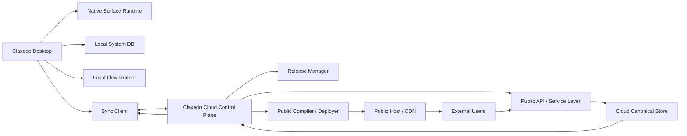

# Claxedo System Model

Proposal for Claxedo as a native-first system builder for personal systems and business tools.

This document describes the target product and platform model. It does **not** describe the current implementation in this repo.

## 1. Product Direction

Claxedo should build **systems**, not just apps.

The center of gravity should be:

- durable data
- saved operator views
- workflows and approvals
- connectors to outside systems
- release and rollback
- optional public surfaces

Claxedo should feel closer to a personal systems builder or a local-first Retool for business tools than a code-first AI app builder.

## 2. Core Principle

Claxedo should be **native-first**.

That means:

- internal operator tools live natively inside Claxedo
- internal dashboards, trackers, CRMs, workflows, and admin tools do not start as code projects
- only surfaces that must exist outside Claxedo become code and get deployed

Short version:

> Native for operator systems. Code only for public surfaces.

## 3. What Claxedo Is

Claxedo is a system builder with:

- native operator surfaces
- structured data and artifacts
- workflows and approvals
- connectors and channels
- release management
- sync between local and cloud state
- optional deployable public surfaces

Claxedo is not primarily:

- a code generator
- a framework picker
- a local IDE for shipping React apps
- a product where every tool is a separate codebase

## 4. System Primitive

A system is the top-level product object inside a project.

```text
System
├── Schema
│   ├── Entities
│   ├── Fields
│   ├── Relations
│   └── States / Formulas
├── Data
│   ├── Records
│   └── Artifacts
├── Surfaces
│   ├── Operator
│   ├── Internal
│   └── Public
├── Flows
│   ├── Triggers
│   ├── Actions
│   ├── Approvals
│   └── Runs
├── Connectors
├── Services
├── Releases
└── Environments
```

Short definition:

> `System = Schema + Data + Surfaces + Flows + Connectors + Releases`

## 5. Native Surface Model

Claxedo needs three surface types.

### Operator surface

Used by builders and operators inside Claxedo.

Examples:

- form builder
- CRM admin panel
- workflow editor
- release manager
- analytics console

### Internal surface

Used by teammates inside Claxedo.

Examples:

- response inbox
- deal board
- task dashboard
- approval queue

### Public surface

Used by people outside Claxedo.

Examples:

- public form
- booking page
- customer portal
- intake page

This is the only default surface type that should become deployable code.

## 6. Code Boundary

Claxedo should not be code-first for internal systems.

The code boundary should be:

- operator and internal surfaces are declarative and run in a native Claxedo runtime
- public surfaces compile into deployable web code
- optional services can be attached when a system needs backend logic, APIs, jobs, or webhooks

This keeps the product distinct from code-first builders.

## 7. Data Model

Claxedo needs three primary data shapes.

### Records

Structured business data.

Examples:

- leads
- deals
- contacts
- submissions
- invoices
- tasks

### Artifacts

Files and generated outputs attached to systems or records.

Examples:

- PDFs
- screenshots
- uploads
- recordings
- transcripts
- exports

### Source bindings

Connections to external systems and their mappings.

Examples:

- HubSpot deals mirrored into local records
- Postgres table mapped into a system entity
- Stripe events ingested into append-only activity data

## 8. Connector Model

Claxedo should separate connectors from channels.

### Connectors

A connector is access to an outside system.

Examples:

- Gmail
- HubSpot
- Postgres
- Stripe
- Slack API
- GitHub

Connectors provide:

- auth
- capability scopes
- schema introspection where possible
- read and write actions
- sync rules

### Channels

A channel is where people interact with the system.

Examples:

- web
- email
- Slack
- Telegram
- public form URL
- client portal

A Typeform-like app is not just a connector. It is a system with a `web` public channel.

## 9. Service Model

Some systems need server-side logic.

That should not disqualify them from living in Claxedo.

Claxedo should support optional attached services:

- API service
- background worker
- webhook receiver
- long-running job processor
- indexing/search service

These services may run:

- locally during development
- on Claxedo-managed infrastructure
- on user-owned infrastructure

The important rule is:

> Services support the system, but the system is still operated from Claxedo.

## 10. Runtime Layers

Claxedo needs clear runtime boundaries.



### Native runtime

Runs operator and internal surfaces inside Claxedo from declarative surface definitions.

### Flow runtime

Runs triggers, actions, approvals, retries, and connector actions.

### Connector runtime

Handles auth, scopes, sync, and outbound calls to external systems.

### Public compiler

Compiles public surfaces into deployable web output.

### Public runtime

Hosts public pages and handles anonymous traffic and submissions.

### Sync engine

Moves cloud or live state back into the local operator app.

## 11. Storage and Source of Truth

Claxedo needs different truth models for internal and public systems.

### Internal native systems

- local DB is the fast operator store
- cloud sync mirrors and shares state when enabled
- cloud is used for collaboration, releases, and recovery

### Public systems

- cloud is the canonical live store for public traffic
- public submissions land in cloud first
- local Claxedo replicates that data back for operator use

This is necessary because public traffic cannot depend on a laptop being online.

## 12. How UIs Are Stored

Surfaces should be stored as declarative source, not arbitrary app code.

Each surface should have:

- `source`
- `compiled`
- `bindings`
- `schema_version`
- `surface_type`
- `release_id`
- `updated_at`

Users should be able to edit surfaces through:

- visual builder
- prompt-based editing
- source editing for advanced users

Operator and internal surfaces compile into the native runtime.

Public surfaces compile into deployable web bundles.

## 13. Safety Model

Claxedo should be capability-based.

Examples:

- `connector.hubspot.read`
- `connector.gmail.send`
- `artifact.upload.write`
- `service.webhook.invoke`
- `surface.public.publish`
- `release.promote`

Safety rules:

- no arbitrary JS execution in the native runtime by default
- secrets stored separately from surface definitions
- risky actions can require approval
- every action and release is auditable

## 14. Release Model

If Claxedo is for business tools, every serious system needs a release lifecycle.

### Environments

- `draft`
- `candidate`
- `live`

Optional later:

- `staging`
- `production`

### What a release contains

A release is a versioned snapshot of:

- schema
- surfaces
- flows
- connector bindings
- service bindings
- permission changes
- public deploy artifacts

### Product diffs

Releases should show product diffs, not git diffs.

Examples:

- fields added or removed
- workflow changed
- approval widened
- public page updated
- connector target changed
- service endpoint changed

### Rollback

Rollback should be first-class.

Users should be able to revert a system to a previous release without touching code.

## 15. Schema Change Policy

Schema changes need safety rules.

- additive changes are safe by default
- destructive changes require review
- breaking public changes show warnings before release
- in-flight public sessions stay pinned to the release they started on

## 16. Typeform Example

Typeform is a good example of the full system shape.

### Inside Claxedo

- form builder
- logic editor
- preview
- responses inbox
- analytics
- automations
- publish controls

### Outside Claxedo

- public form page
- anonymous submission API
- file upload handling
- spam and rate limiting

### Data flow

1. Builder edits the form in Claxedo.
2. Draft form state is stored as a system surface and schema.
3. User creates a release and publishes it.
4. Public surface is compiled into a deployable bundle.
5. Bundle is hosted on Claxedo-managed hosting by default.
6. Respondent opens the public form and submits.
7. Submission hits the cloud API.
8. Response is stored in the cloud canonical store.
9. Sync replicates the response into the local Claxedo app.
10. Operator sees the response in native Claxedo views and flows can run.

### What this proves

The important point is not "build a form app".

The important point is that Typeform exposes the minimum architecture Claxedo needs to power real systems:

- control surface
- execution layer
- public surface
- state
- sync

## 17. Example Systems Claxedo Should Support

Native-first systems:

- CRM
- deal tracker
- hiring pipeline
- internal approvals
- reporting dashboard
- inventory tracker
- finance tracker
- project operations

Hybrid systems with public surfaces:

- form builder
- booking flow
- client portal
- intake system
- public report
- simple customer dashboard

Hybrid systems with attached services:

- search-backed knowledge system
- webhook-driven operations system
- workflow-heavy support tool
- sync-backed analytics system

## 18. Product Boundary vs Code-First Builders

Code-first builders start from generating an app codebase.

Claxedo should start from generating and operating a system:

- define schema
- define operator surfaces
- define workflows
- attach connectors
- manage releases
- optionally compile public surfaces into code

Short version:

> Dyad-like products build apps. Claxedo should build systems.

## 19. Required Platform Primitives

To power this model, Claxedo needs first-class primitives for:

- `system`
- `surface`
- `schema`
- `record`
- `artifact`
- `connector`
- `channel`
- `flow`
- `service`
- `release`
- `environment`
- `capability`
- `sync`

These should be product-level objects, not ad hoc runtime patches.

## 20. MVP Shape

An MVP for this direction should likely include:

1. Native system registry inside a project
2. Schema builder
3. Saved native views
4. Basic connector model
5. Basic flows with approvals
6. Draft and live releases
7. One public surface compiler and deploy path
8. Sync from cloud live state into local operator state

## 21. Final Rule

Claxedo should be:

- native-first for operator systems
- release-oriented for business trust
- cloud-backed when public traffic or collaboration needs it
- code-generating only at the public boundary

That keeps the product clear:

> Claxedo is for building and operating systems, not just generating apps.
