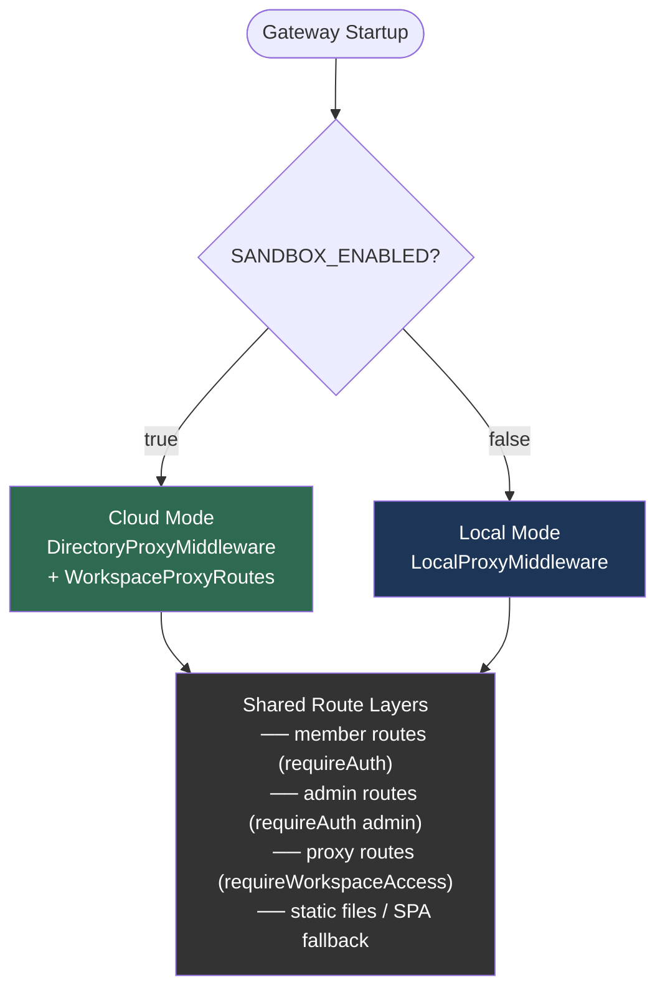
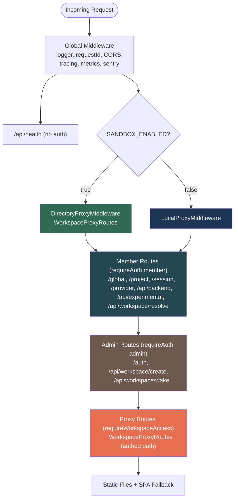
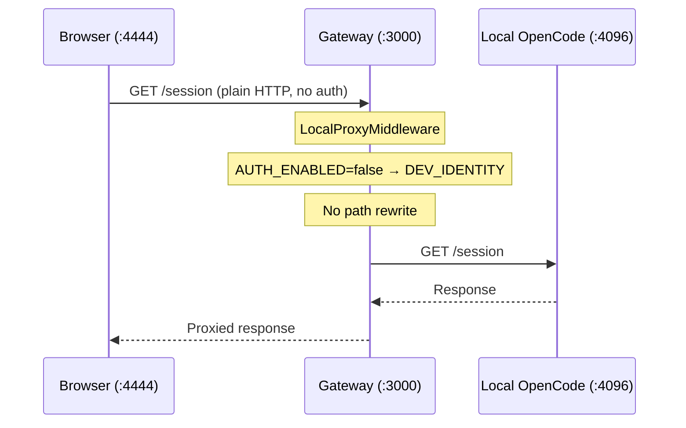
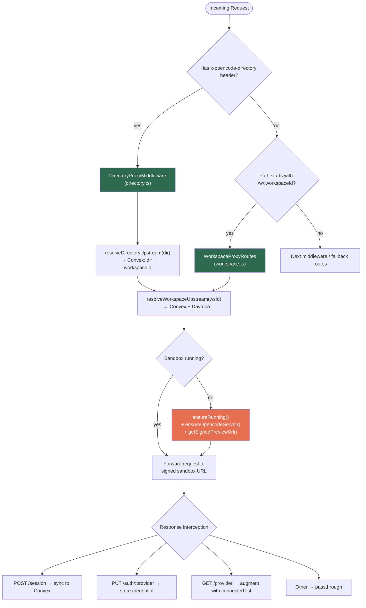
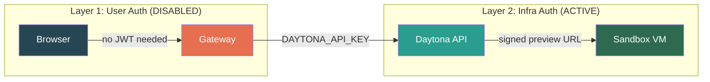
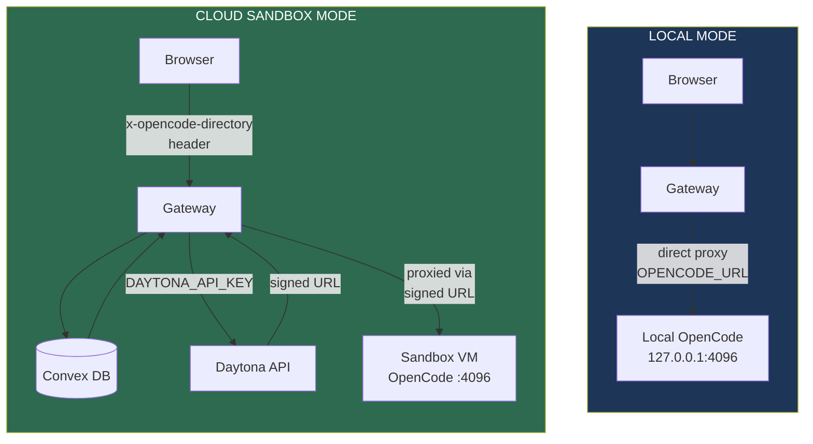
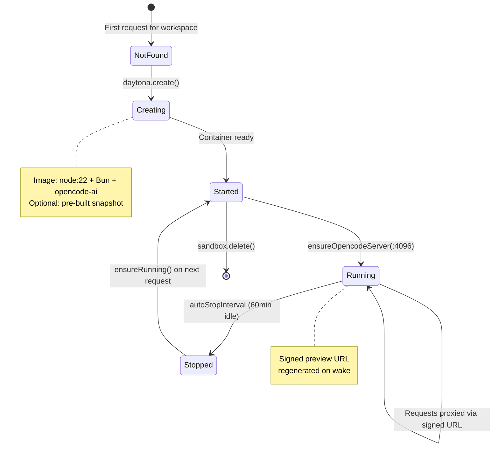

# Cloud Sandbox vs Local — Claxedo Gateway (No Auth)

How the Claxedo gateway routes requests in **cloud sandbox** mode (Daytona) vs **local** mode, without Clerk user authentication.

## Gateway Mode Selection

A single flag controls the mode — `SANDBOX_ENABLED` in `claxedo/src/server/app.ts`:



### Gateway Route Stack (`app.ts`)

After the mode-specific proxy, all remaining routes are shared:



> Note: `WorkspaceProxyRoutes` is mounted **twice** in cloud mode — once without auth (early, for directory-based proxy) and once with `requireWorkspaceAccess()` (for direct `/w/{workspaceId}/*` calls). When `AUTH_ENABLED=false`, both paths use `DEV_IDENTITY`.

---

## Local Mode

**No Convex, no Daytona, no workspace resolution.** Straight proxy to a local OpenCode server.



```
ENV:
  SANDBOX_ENABLED=false
  AUTH_ENABLED=false
  OPENCODE_URL=http://127.0.0.1:4096
```

**Key files:**
- `claxedo/src/server/proxy/local.ts` — proxy middleware

---

## Cloud Sandbox Mode (Daytona Token)

The gateway resolves a directory path to a Daytona sandbox, wakes it if needed, obtains a signed preview URL, and proxies the request.

### Full Request Lifecycle

```mermaid
sequenceDiagram
    participant B as Browser
    participant G as Gateway (:3000)
    participant C as Convex DB
    participant D as Daytona API
    participant S as Sandbox VM (:4096)

    B->>G: GET /session
    Note over B,G: Header: x-opencode-directory: /home/daytona/project

    Note over G: AUTH_ENABLED=false → DEV_IDENTITY (skip Clerk)

    G->>C: Query: directories.getByPath("/home/daytona/project")
    C-->>G: workspaceId: "ws_abc123"

    G->>C: Query: workspaces.getById("ws_abc123")
    C-->>G: sandboxId: "sb_xyz", status: "stopped"

    rect rgb(60, 60, 60)
        Note over G,D: Sandbox wake-up (uses DAYTONA_API_KEY)
        G->>D: daytona.get("claxedo-org1-sess1")
        D-->>G: Sandbox instance (stopped)
        G->>D: sandbox.start(timeout: 600s)
        D-->>G: Started
        G->>D: ensureOpencodeServer(port: 4096)
        D-->>G: OpenCode running
    end

    G->>D: getSignedPreviewUrl(port: 4096, ttl: 86400s)
    D-->>G: https://sb-xyz.preview.daytona.io:4096?token=eyJ...

    Note over G: Cache result (5s TTL, 15m SWR)

    G->>S: GET /session (via signed URL)
    S-->>G: Response

    G-->>B: Proxied response

    Note over G,C: Background: sync session metadata to Convex
```



```
ENV:
  SANDBOX_ENABLED=true
  AUTH_ENABLED=false
  DAYTONA_API_KEY=dtyk_...    # server-side only, never exposed to browser
  DAYTONA_API_URL=https://api.daytona.io
  DAYTONA_TARGET=us
  CONVEX_URL=https://...convex.cloud
```

**Key files:**
- `claxedo/src/server/proxy/directory.ts` — directory header → workspace resolution → proxy
- `claxedo/src/server/proxy/workspace.ts` — `/w/{workspaceId}/*` route + provider credential interception
- `claxedo/src/services/sandbox-resolver.ts` — Convex lookups + Daytona wake + caching
- `claxedo/src/services/sandbox-preview.ts` — signed preview URL generation
- `claxedo/src/sandboxes/providers/daytona.ts` — Daytona SDK lifecycle (create/start/stop)

### Proxy Routing (Cloud)

Two complementary middlewares handle cloud requests:



---

## Auth Layers

"No auth" means **no Clerk/user auth**. The Daytona API key is infrastructure auth that stays server-side.



| Layer | Purpose | Status | Mechanism |
|-------|---------|--------|-----------|
| **User auth** (Clerk) | Browser → Gateway | **Disabled** (`AUTH_ENABLED=false`) | `DEV_IDENTITY` injected, no JWT required |
| **Infra auth** (Daytona) | Gateway → Daytona API | **Active** | `DAYTONA_API_KEY` in gateway env |
| **Sandbox access** | Gateway → Sandbox VM | **Active** | Signed preview URL (24h TTL) |

When `AUTH_ENABLED=false`, the `requireAuth()` and `requireWorkspaceAccess()` middlewares inject a hardcoded `DEV_IDENTITY` (`userId: "dev"`, `organizationId: "dev"`, `role: "admin"`) and skip all JWT/ownership checks.

> **The gateway is the trust boundary.** Whoever can reach the gateway gets sandbox access.

---

## Side-by-Side Comparison



| Aspect | Local | Cloud Sandbox |
|--------|-------|---------------|
| **Trigger** | `SANDBOX_ENABLED=false` | `SANDBOX_ENABLED=true` |
| **Proxy** | `LocalProxyMiddleware` | `DirectoryProxy` + `WorkspaceProxy` |
| **Backend** | Local OpenCode `:4096` | Daytona VM with OpenCode `:4096` |
| **Workspace resolution** | None | Convex DB lookup (directory → workspace → sandbox) |
| **Daytona** | Not used | API key for lifecycle + signed preview URLs |
| **Convex** | Not used | Session sync, credential storage, workspace lookup |
| **Auto-wake** | N/A | Yes — sleeping sandboxes started on demand |
| **Caching** | None | 5s TTL, 15m stale-while-revalidate |
| **Signed URL TTL** | N/A | 24h (configurable via `DAYTONA_SIGNED_PREVIEW_TTL_SEC`) |

---

## Sandbox Lifecycle (Daytona)



---

## Environment Variables Reference

### Gateway Server (`claxedo/src/config/index.ts`)

| Variable | Default | Cloud | Local |
|----------|---------|-------|-------|
| `SANDBOX_ENABLED` | `true` | `true` | `false` |
| `AUTH_ENABLED` | `true` | `false` | `false` |
| `OPENCODE_URL` | `http://127.0.0.1:4096` | — | required |
| `DAYTONA_API_KEY` | — | required | — |
| `DAYTONA_API_URL` | — | optional | — |
| `DAYTONA_TARGET` | — | required | — |
| `DAYTONA_SIGNED_PREVIEW_TTL_SEC` | `86400` | optional | — |
| `CONVEX_URL` | — | required | — |
| `CLERK_SECRET_KEY` | — | required (if auth on) | — |
| `ENCRYPTION_KEY` | `default-key` | optional | — |

### Frontend (`packages/claxedo-app`, Vite `VITE_*`)

| Variable | Default | Cloud | Local |
|----------|---------|-------|-------|
| `VITE_SANDBOX_ENABLED` | `false` | `true` | `false` |
| `VITE_AUTH_ENABLED` | `false` | `false` | `false` |
| `VITE_OPENCODE_BACKEND_URL` | `window.location.origin` | gateway URL | gateway URL |
| `VITE_CONVEX_URL` | — | required | — |
