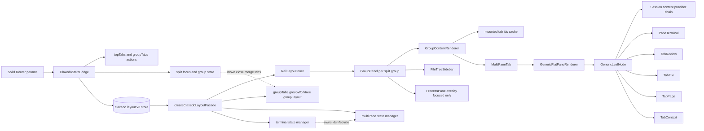
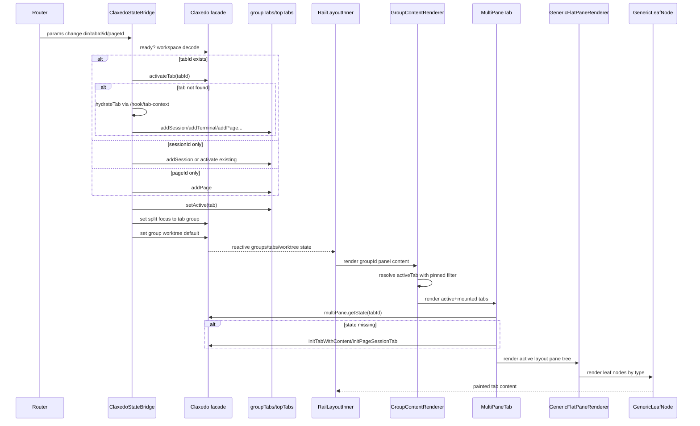
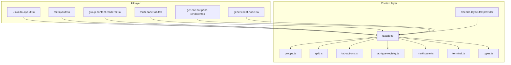
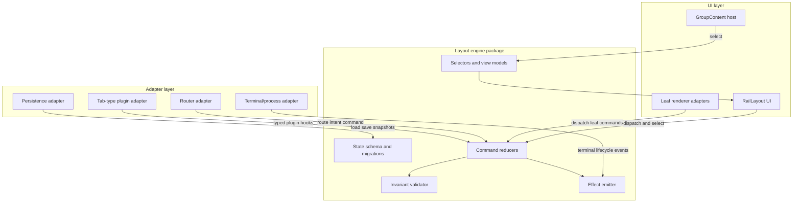
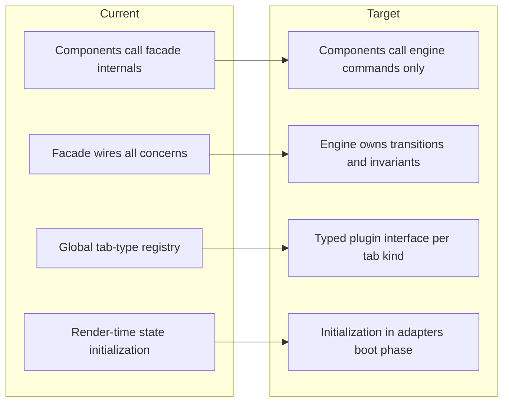

# Group Rendering RFC

Practical plan to decouple multi-pane layout runtime.

## 1) Executive Summary

Claxedo group rendering currently works, but the runtime model is spread across UI components, route synchronization, and a monolithic context facade. The result is a system that is powerful in behavior but expensive to reason about, test, and extract.

Today, a single render path crosses `ClaxedoLayout.tsx`, persisted store migration in `context/claxedo-layout.tsx`, group-scoped tab actions in `groups.ts`, split orchestration in `split.ts`, tab lifecycle hooks in `tab-type-registry.ts`, multi-pane state in `multi-pane.ts`, terminal lifecycle in `terminal.ts`, and render dispatch in `group-content-renderer.tsx` + `multi-pane/*`. Extraction is hard because behavior is encoded as distributed side effects rather than a small explicit engine API.

This document defines the current architecture in detail, calls out the main failure and coupling modes, and proposes a concrete phased extraction into a standalone layout engine boundary. The target state preserves UX parity while replacing implicit coupling with explicit commands, selectors, and event contracts.

---

## 2) Current Group Rendering Architecture

Group rendering is centered on three live domains: route-driven tab intent, persisted layout state, and per-tab multi-pane rendering. These domains are coordinated by the Claxedo layout facade and consumed by `RailLayoutInner` group panels.

### Core modules and responsibilities

- `ClaxedoLayout.tsx`
  - Bridges router params (`dir`, `tabId`, `id`, `pageId`) into layout state
  - Activates existing tabs or hydrates missing tabs through `/hook/tab-context`
  - Owns many side effects: auto-tab creation, review tab opening, workspace bootstrap, tab-context POST updates
- `context/claxedo-layout.tsx`
  - Owns persisted store (`claxedo.layout.v3`) and migration from legacy shapes
  - Creates store + setStore and wires facade
- `context/claxedo-layout/facade.ts`
  - Registers tab lifecycle hooks
  - Composes `groupTabs`, `split`, `multiPane`, `terminal`, `processPane`, `workspaceRecency`, color mapping
- `context/claxedo-layout/groups.ts`
  - Creates per-group tab actions and focused-group topTabs
  - Maintains worktree default/pinned and group file tree layout state
- `context/claxedo-layout/split.ts`
  - Controls split panel lifecycle, sizes, focus, group close/merge, tab moves across groups
- `context/claxedo-layout/multi-pane.ts`
  - Stores per-tab pane trees (`Pane`), leaf contents, focus/zoom, named layouts
- `context/claxedo-layout/terminal.ts`
  - Tracks terminal ownership, lifecycle state machine, pending create queues, pane-level terminal operations
- `components/group-content-renderer.tsx`
  - Resolves active tab with pinned-workspace filtering
  - Keeps previously rendered tabs mounted and hidden to avoid re-creating heavy provider chains
- `components/multi-pane/multi-pane-tab.tsx`
  - Lazily initializes missing multi-pane state for tabs that predate the feature
- `components/multi-pane/generic-flat-pane-renderer.tsx`
  - Flattens pane tree to absolute-positioned leaf rects + split handles
- `components/multi-pane/generic-leaf-node.tsx`
  - Per-leaf content dispatch to Session, Terminal, Review, Context, File, Page
  - Recreates `DirectoryScope`/`GroupId`/`SDK` provider stacks inside content matches
- `layouts/rail-layout.tsx`
  - Hosts split group panels, top tab bars, group content, file tree sidebar, and process pane overlay

### State model used for rendering

`types.ts` defines store slices that rendering relies on directly:

- `groups: GroupState[]`
  - `tabs: { items, activeId, order, closedTabs }`
  - `worktree: { default, pinned }`
  - `layout.fileTree: { opened, width }`
- `split: { direction, sizes, focusedId, hidden? }`
- `multiPane: Record<tabId, MultiPaneTabState>`
- terminal overlays and process-pane flags (`terminalOwner`, lifecycle maps, `processPane`)
- UI/global metadata (`worktreeColorMap`, `workspaceRecency`, `enabled`, `rail`)

### Rendering strategy at runtime

1. `RailLayoutInner` builds visible group panels from `split.orderedGroups()`.
2. Each `GroupPanel` mounts:
   - `WorkspaceBar`
   - `TopTabBar`
   - `GroupContentRenderer`
   - `FileTreeSidebar`
   - focused-only `ProcessPane` overlay
3. `GroupContentRenderer` resolves active tab and renders all previously activated tabs with CSS hide/show.
4. Each mounted tab is rendered via `MultiPaneTab`.
5. `MultiPaneTab` ensures multi-pane state exists, then delegates to `GenericFlatPaneRenderer`.
6. `GenericFlatPaneRenderer` computes leaf rectangles and renders `GenericLeafNode` per leaf.
7. `GenericLeafNode` dispatches leaf content type to actual feature components and provider stacks.

---

## 3) Detailed Render/Data Flow (with mermaid diagrams)

### Component and dataflow graph

### Route change to rendered group tab sequence

### Current module boundary map

### Flow specifics that matter for extraction

- `GroupContentRenderer` intentionally keeps previously viewed tabs mounted and only toggles `hidden`, which trades memory for avoiding expensive remount of `DirectoryScope + SessionParamsProvider + SessionPage`.
- `MultiPaneTab` performs lazy initialization in a render effect, so render can mutate persistent state.
- `GenericFlatPaneRenderer` builds geometry using `computeLeafRects/computeSplitHandles`, then handles pointer resize by mutating store paths through `claxedo.multiPane.resize`.
- `GenericLeafNode` embeds the leaf-content adapter and provider composition in one file, with repeated `DirectoryScope` and `onNavigateToSession` logic across content modes.
- `terminal.ts` cross-links pane contents, top-level tab fields, and lifecycle maps, including guard invariants that depend on group focus and ownership correctness.

---

## 4) Architecture Problems (detailed)

### Monolithic facade and hidden dependencies

`createClaxedoLayoutFacade` composes almost all domains into one returned object. This centralizes wiring but makes dependencies implicit, because consumers can call deep behavior without explicit module boundaries.

Tab lifecycle registration is global mutable state (`resetTabTypeRegistry` + `registerTabType`). That creates non-local behavior because adding one hook changes close/reopen/merge effects for unrelated call sites.

### State mutation from render paths

`MultiPaneTab` can initialize state inside a reactive effect during render-time lifecycle. This interleaving means UI paint and state schema repair happen in the same phase.

`GroupContentRenderer` both resolves active tab policy and manages mount-cache policy. Those are separate concerns that currently share one component and one effect graph.

### Data model duplication and drift risk

`TabItem` and `PaneContent` overlap in many fields (`type`, `directory`, `sessionId`, `terminalId`, `filePath`, `pageId`). Conversions happen repeatedly in hooks and renderers, with no canonical mapper layer.

Terminal identity appears in both tab-level fields and leaf-level pane contents. `terminal.ts.replaceId` has to update multiple stores to keep them coherent, which indicates model fragmentation.

### Coupling between routing and layout semantics

`ClaxedoStateBridge` owns route decoding, tab activation, tab hydration, title persistence, and redirect logic. This makes route handling and layout engine behavior tightly coupled.

Route intent, workspace selection, and group focus are not separated into intent events. Instead, imperative action sequences are embedded in effects with many dependencies.

### Group/split semantics mixed with tab lifecycle semantics

`split.closeGroup` merges tabs and executes `onMergeDrop` hooks for deduped tabs. Grouping behavior now depends on per-type tab hook details, which makes split extraction dependent on every tab type.

`groups.ts` updates worktree default as side effect of close/add tab operations. Worktree policy is therefore encoded inside tab action wiring rather than in a distinct policy module.

### Terminal subsystem is deeply entangled

`terminal.ts` handles create queues, process-pane deferral, lifecycle state machine, owner maps, multi-pane mutations, and invariant checks. It also knows about split groups and origin metadata.

This module is not just terminal logic; it is a cross-domain coordinator. Extracting rendering without this module leaves many behavior contracts undefined.

### Fragmented provider composition

`GenericLeafNode` repeats provider stacks for multiple content matches. The same `DirectoryScope` + `onNavigateToSession` closure appears in session, terminal, review, context, and page branches.

That repetition increases drift probability and makes a generic "leaf renderer API" harder to isolate. Provider dependencies are runtime requirements, not typed contract requirements.

---

## 5) Why Extraction Is Hard Today

### No stable engine contract

Most consumers call facade methods directly. There is no single command bus, reducer API, or read-only selector surface that can be moved without touching call sites.

### Behavior is encoded as side effects across layers

Render components initialize state, close hooks mutate terminal lifecycle, split merge invokes tab hooks, and route effects create tabs. Extraction must preserve ordering semantics that are currently implicit.

### Persisted schema and migration are in the same runtime layer

Store migration and runtime operations live in `claxedo-layout.tsx` + facade modules. Moving engine code requires preserving persisted compatibility (`claxedo.layout.v3`) while introducing new boundaries.

### Cross-slice invariants are not centralized

Invariants like terminal ownership vs pane membership are enforced ad hoc in `terminal.ts`. There is no single validation/repair pipeline that can run after every command.

### UI code depends on engine internals

`RailLayoutInner`, `GroupContentRenderer`, and `GenericFlatPaneRenderer` directly consume internal structures (`groups`, `split.sizes`, raw pane trees). UI cannot be moved independently because it reads implementation details, not abstract view models.

### Testability is limited by integration shape

Unit-level testing of one behavior often requires context bootstrapping because logic is distributed. This slows safe refactor speed and increases migration risk.

---

## 6) Target Architecture and API (with mermaid diagrams)

### Desired target state

Split the current system into three explicit layers with strict direction:

1. **Layout engine core**
   Pure state + commands + deterministic reducers for tabs/groups/split/panes/terminal metadata.
2. **Integration adapters**
   Route adapter, persistence adapter, process/terminal adapter, and tab-type plugin adapter.
3. **UI render layer**
   Reads selectors and dispatches commands only, with no direct store path mutation.

### Engine API shape

- `dispatch(command)` where command is a discriminated union
- `select(selector, state)` for derived read models
- `subscribe(listener)` for reactive integration
- `effects` emitted as typed events (ex: `TerminalCreateRequested`, `RouteRedirectSuggested`)

Example command families:

- `RouteIntentReceived`
- `GroupFocused`, `GroupClosed`, `GroupSplitToggled`
- `TabOpened`, `TabClosed`, `TabActivated`, `TabMovedAcrossGroups`
- `PaneLeafSplit`, `PaneLeafClosed`, `PaneLeafResized`, `PaneFocused`
- `TerminalLifecycleTransitionRequested`, `TerminalAttached`, `TerminalDetached`

### Module boundary target

### Current vs target boundary comparison

### Target rendering model for groups

- `GroupContentRenderer` becomes a thin host that reads `selectVisibleGroupTabs(groupId)` and `selectActiveRenderTarget(groupId)`.
- Tab mount-cache policy becomes a dedicated strategy module (`RetainMountedTabsPolicy`) with clear caps and eviction rules.
- `GenericLeafNode` becomes a pure leaf shell that calls `renderLeaf(contentDescriptor, env)` from a registry-based content adapter.

---

## 7) Migration Plan (phased)

### Phase 0: Baseline and observability

- Add trace IDs around critical commands currently performed imperatively:
  - route sync actions
  - split close/merge actions
  - terminal attach/replace transitions
- Snapshot current behavior with integration tests around:
  - route-to-tab activation
  - cross-group tab drag and merge
  - terminal reopen and ID replacement
  - pinned workspace active-tab fallback

Exit criteria: parity test suite reproduces current behavior without flaky ordering assumptions.

### Phase 1: Introduce read-only selectors facade

- Keep store shape unchanged.
- Add selector modules that encapsulate:
  - active tab resolution for group (including pinned fallback)
  - visible groups (respecting hidden split logic)
  - leaf view model (rect + focus + zoom + title)
- Update UI components to consume selectors first, then remove direct raw-structure reads.

Exit criteria: `RailLayoutInner`, `GroupContentRenderer`, and `GenericFlatPaneRenderer` no longer compute policy directly from raw store.

### Phase 2: Command surface for mutations

- Introduce command wrappers for existing mutators in facade.
- Replace direct methods (`setStore`-style mutations through many methods) with command dispatchers:
  - `dispatch({ type: "TabCloseRequested", ... })`
  - `dispatch({ type: "PaneSplitRequested", ... })`
- Keep old methods as thin compatibility shims with deprecation warnings.

Exit criteria: all UI writes flow through command API.

### Phase 3: Externalize tab lifecycle plugin boundary

- Replace global mutable registry with explicit plugin list provided at engine initialization.
- Convert existing hook logic in `facade.ts` to plugin descriptors:
  - terminal plugin
  - session plugin
  - review plugin
  - context plugin
  - file plugin
  - page plugin
- Make merge dedupe policy an explicit reducer hook with deterministic order.

Exit criteria: no global `resetTabTypeRegistry/registerTabType` calls in runtime path.

### Phase 4: Extract multi-pane + split reducers

- Move pane tree and split reducers to engine package.
- Keep UI geometry (`computeLeafRects`) in UI layer but consume normalized pane selector outputs.
- Move group close/merge logic and dedupe behavior fully into engine reducer.

Exit criteria: `split.ts` and `multi-pane.ts` become adapter wrappers or are removed from app package.

### Phase 5: Extract terminal state coordinator

- Move terminal lifecycle and ownership maps into engine state domain.
- Move process-pane deferral behavior into terminal/process adapter with explicit events.
- Preserve invariant checks but centralize in engine validator.

Exit criteria: `terminal.ts` replaced by engine terminal domain module + adapter bridge.

### Phase 6: Move persistence and migrations to engine schema package

- Migrate `claxedo.layout.v3` schema and migration logic into engine-owned serializer.
- Add versioned migration tests with legacy fixture snapshots.

Exit criteria: app context only initializes engine with persistence adapter and plugin set.

---

## 8) Risks, Guardrails, and Success Criteria

### Key risks

- Behavior regressions from changed ordering of side effects.
- Terminal lifecycle desync when ownership and pane mappings are migrated.
- Route sync loops if redirect suggestions and router writes are not debounced.
- Memory regressions if mounted-tab retention policy changes unexpectedly.

### Guardrails

- Keep persisted schema stable until Phase 6.
- Preserve existing IDs and tab ordering behavior through compatibility shims.
- Add invariant assertions in engine reducer for:
  - activeId must exist in items or be null
  - split sizes length must equal group count
  - terminal owner maps must reference existing tabs or process owners
- Gate rollout behind feature flag:
  - `claxedo.layoutEngine.v1`
  - shadow mode selector parity checks in dev

### Success criteria

- 100% parity for critical flows:
  - route tab recovery
  - split open/close/move
  - terminal create/reopen/replace ID
  - page-session split default layout
- 30%+ reduction in cross-module direct dependencies from UI into context internals.
- All UI mutations performed through command API.
- New tab type can be added via plugin descriptor without touching split/terminal core.
- Extraction result can be packaged as reusable engine module with no Solid component imports.

---

## 9) Open Questions

1. Should mounted-tab retention remain unbounded per group, or should we cap by tab count and use LRU eviction.
2. Should `TabItem` and `PaneContent` be unified into one canonical content descriptor with per-surface projections.
3. Should terminal ownership remain keyed by PTY ID only, or move to a typed resource identity that also models process panes explicitly.
4. Should group worktree default/pinned policy live in engine reducer or in workspace adapter to keep core generic.
5. Should route synchronization be command-driven only, with router treated as an effect consumer rather than direct imperative writes.
6. How should plugin hooks express merge dedupe and reopen behavior without reintroducing global mutable registries.
7. Can review-mode logic in `ClaxedoLayout.tsx` be extracted into a separate domain module in parallel with layout engine extraction, or should it wait to avoid scope explosion.
