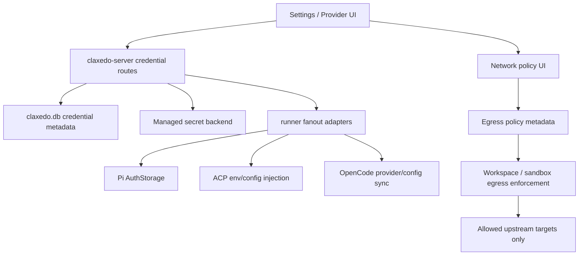

# security: Centralize Credentials and Sandbox Network Control

## Overview

Move Claxedo from ad hoc provider auth storage to a central credential control plane owned by `claxedo-server`. Secret values should no longer live in plain JSON config, and Claxedo should persist only non-secret metadata in `claxedo.db`. For hosted or cloud-deployed Claxedo, Cloudflare-backed storage is the target managed secret backend; for local desktop use, a local secure backend remains valid. Separately, sandbox and remote workspace networking should move to a default-deny model where outbound access is blocked unless the user has explicitly configured allowed targets in the UI.

For v1, defer Cloudflare request proxying and brokered provider access. Managed credentials will be centralized first, and explicit network policy will be added first. Secret-bearing provider calls from untrusted sandboxes remain out of scope until a later broker phase.

## Problem Frame

Provider credentials are currently fragmented across multiple systems:

- `packages/claxedo-server/src/agent-config.ts` persists `user.auth` directly in `~/.claxedo/user-agent-config.json`.
- `packages/claxedo-server/src/routes/workspace.ts` persists sandbox provider credentials in the same user config file under `sandbox.auth`.
- `packages/claxedo-server/src/routes/opencode-compat.ts` proxies non-ACP OpenCode auth upstream when the selected runner is `opencode`, so some credentials live outside Claxedo entirely.
- `packages/workspace-runtime/src/adapters/acp.ts` can succeed using local machine login state or env vars even when Claxedo has no stored credential.
- `packages/claxedo-server/src/harness/pi-support.ts` only reads Claxedo-local auth, so Pi cannot reliably reuse credentials that live only in OpenCode or only in machine-local ACP state.

This creates five concrete problems:

1. Secrets are stored unsafely in plain local config.
2. The UI can report providers/models that are not actually runnable from the currently selected runner path.
3. Cloud sandboxes would need raw credentials to call providers directly unless we add a broker, which we are deferring for v1.
4. Auth state is not reusable across Pi, OpenCode, ACP, and cloud provider flows because there is no canonical secret owner.
5. Sandbox and cloud workspace egress is too open today, instead of being explicitly configured by the user.

## Requirements Trace

- R1. Long-lived provider and sandbox credentials must not be persisted in plaintext JSON config.
- R2. `claxedo-server` must become the canonical credential control plane for all managed credentials.
- R3. Secret values and secret metadata must be separated.
- R4. Local desktop mode must remain viable without forcing Cloudflare-backed secret storage.
- R5. Untrusted sandboxes must never receive raw managed secrets in v1.
- R6. Pi, OpenCode, ACP, and cloud workspace providers must all be able to consume centrally managed credentials through runner-specific fanout.
- R7. Existing local-only ACP login behavior must continue to work during migration, but Claxedo should surface that it is unmanaged.
- R8. OpenCode subscription or OAuth-style credentials should converge on the same control plane instead of remaining upstream-only.
- R9. `/provider`, `/provider/auth`, `/auth/:providerID`, and sandbox provider settings should reflect the centralized credential state.
- R10. The system must support revocation, expiry, auditing metadata, and targeted fanout per runner/session/workspace.
- R11. Sandbox and remote workspace network egress must be deny-by-default and only permit user-configured targets.
- R12. The UI must expose an explicit network configuration surface for allowed outbound targets.

## Scope Boundaries

- Do not redesign provider UX beyond what is necessary to expose centralized status, source, and explicit network-policy behavior.
- Do not force immediate import of machine-local ACP login state into Claxedo-managed storage.
- Do not persist raw provider secrets in `claxedo.db`, Cloudflare KV, or `user-agent-config.json`.
- Do not attempt to reimplement every OpenCode provider OAuth flow in v1. Centralize storage of the resulting credential artifact first, then iterate on who owns the interactive flow.
- Do not assume every third-party binary can use a reverse proxy without validation. Provider families that cannot be safely brokered remain trusted-host-only until a later phase.
- Do not support file mounts or raw secret env injection into untrusted sandboxes.
- Do not build Cloudflare request proxying in v1.

## Context & Research

### Relevant Repo Patterns

- `packages/claxedo-server/src/agent-config.ts`
  - Current user config source of truth for `runner`, `auth`, `sandbox`, and legacy global harness settings.
  - Today `auth` is `Record<string, string>`, which only models simple API keys.
- `packages/claxedo-server/src/routes/opencode-compat.ts`
  - Current provider surface for `/provider`, `/provider/auth`, OAuth proxying, and `/auth/:providerID`.
  - Non-ACP OpenCode auth is still proxied upstream when `runner.type === "opencode"`.
- `packages/claxedo-server/src/routes/workspace.ts`
  - Current sandbox provider settings API, including persisted auth for Daytona and Modal.
- `packages/claxedo-server/src/cloud/provider.ts`
  - Reads sandbox secrets from config or process env and passes them directly into provider SDKs.
- `packages/workspace-runtime/src/adapters/acp.ts`
  - Uses machine env and local ACP state in addition to Claxedo-injected keys.
- `packages/claxedo-server/src/harness/pi-support.ts`
  - Creates Pi auth directly from `user.auth`, mapping ACP ids to Pi provider ids.
- `packages/claxedo-server/src/storage/db.ts`
  - Existing central SQLite store suitable for credential metadata tables.
- `packages/claxedo-server/src/storage/schema.ts`
  - Current table export surface where credential metadata tables can be added.

### External References

- Cloudflare Secrets Store Worker integration docs show account-level secrets are created and then bound into a Worker, which is appropriate for broker-owned signing/encryption material rather than a high-churn per-user credential store. Source: [Cloudflare Secrets Store Workers integration](https://developers.cloudflare.com/secrets-store/integrations/workers/)
- Cloudflare Workers KV docs state stored values are encrypted at rest. That is useful for short-lived escrow storage, but it is not by itself a per-user credential lifecycle or local desktop storage strategy. Source: [Cloudflare Workers KV data security](https://developers.cloudflare.com/kv/reference/data-security/)
- Pi provider docs say credentials resolve from CLI flags, `~/.pi/agent/auth.json`, environment variables, and custom provider keys, and that OAuth subscription tokens also live in `auth.json`. Source: [Pi providers.md](https://raw.githubusercontent.com/badlogic/pi-mono/main/packages/coding-agent/docs/providers.md)
- Pi custom-provider docs explicitly support overriding an existing provider with `baseUrl` and `headers`, plus registering fully custom providers for supported APIs including Anthropic, OpenAI, Google, Azure OpenAI, Mistral, and Bedrock. Source: [Pi custom-provider.md](https://raw.githubusercontent.com/badlogic/pi-mono/main/packages/coding-agent/docs/custom-provider.md)
- Cursor enterprise network docs focus on enterprise proxy, SSL inspection, firewall allowlisting, HTTP/2 streaming, and HTTP/1.1 SSE fallback. They recommend excluding Cursor domains from SSL inspection and note that custom LLM gateways can introduce compatibility issues; the page does not document a provider-level gateway override model comparable to Pi's provider hooks. Source: [Cursor enterprise network configuration](https://cursor.com/docs/enterprise/network-configuration)
- Public Cursor integration guides consistently show a global OpenAI-compatible `Override OpenAI Base URL` setting for custom model backends, which is still weaker than Pi's per-provider override model and may not cover non-OpenAI transport paths. This remains a fallback signal, not the primary enterprise networking mechanism described by Cursor. Source: [Alibaba Cloud Cursor guide](https://www.alibabacloud.com/help/en/model-studio/cursor-coding-plan)

### Planning Interpretation of the Cloudflare Docs

This plan uses Cloudflare in a deployment-specific v1 role:

- Use Cloudflare-managed storage as the canonical backend for hosted or cloud-deployed Claxedo.
- Keep only metadata and backend references in `claxedo.db`.
- Defer Cloudflare Worker proxying and brokered provider access to a later phase.

The exact Cloudflare storage substrate is still an implementation choice for the hosted path. Local desktop can continue to use a local secure backend.

### Future Broker Compatibility Snapshot

- **Pi**
  - Strong future broker candidate.
  - Documented seams exist for per-provider `baseUrl` and `headers` overrides, plus custom providers for supported API families.
  - Claxedo should avoid persisting long-lived Pi auth in `~/.pi/agent/auth.json`; instead, materialize runtime auth from the centralized registry and prefer provider overrides for brokered traffic.

- **OpenCode**
  - Still a strong future broker candidate at the provider-family level.
  - Existing repo research already showed `options.baseURL` and request-header hooks in the provider stack.
  - The provider-model matrix is large, but the transport seam is mostly per provider family rather than per model.

- **ACP: Claude and Codex**
  - Plausible future broker candidates, but only after explicit validation in real agent installs.
  - Claxedo already controls process env injection for ACP. The remaining question is whether each ACP client's documented base-URL hooks cover all traffic paths used in practice.

- **ACP: Cursor**
  - Treat as partial and validation-required.
  - Current local repo inspection shows `CURSOR_API_KEY` env injection support, but no explicit base-URL seam in the bundled ACP wrapper.
  - The official Cursor network docs document proxy compatibility, SSL inspection guidance, firewall allowlisting, HTTP/2 bidirectional streaming, and HTTP/1.1 SSE fallback, not provider-level broker routing.
  - Public custom-model docs still suggest a global OpenAI-compatible base-URL override, which is weaker than Pi's provider-level override model and may not cover non-OpenAI transport paths.

## Key Technical Decisions

- Make `claxedo-server` the canonical credential authority.
  - It owns credential metadata, validation state, fanout rules, and network-policy issuance.
  - It does not persist long-lived secret material directly in SQLite.

- Support deployment-specific managed secret backends.
  - Hosted or cloud-deployed Claxedo should use a Cloudflare-backed managed store.
  - Local desktop can use a local secure backend.
  - `claxedo.db` stores metadata and an opaque backend reference only.
  - Legacy plaintext local config must still be migrated out of `user-agent-config.json`.
  - Unmanaged local ACP login may continue to work, but it is not part of the managed secret store.

- Persist only metadata and references in `claxedo.db`.
  - Store provider id, credential type, source, account label, created/updated timestamps, expiry, validation state, last error, and backend reference.
  - Store network policy metadata separately from credential metadata.

- Treat v1 sandbox access as a network-policy problem first, not a broker problem.
  - Untrusted sandboxes must not receive managed secrets.
  - Secret-bearing provider calls remain trusted-host-only until the broker phase exists.
  - Network egress should be denied by default and opened only for user-configured targets.

- Add explicit user-configured outbound network policy.
  - The user should configure allowed domains, host patterns, or provider endpoints in the UI.
  - Workspace and sandbox networking should be limited to that explicit allowlist plus required Claxedo control-plane endpoints.
  - The policy should be auditable and visible in settings.

- Keep untrusted sandbox execution narrow in v1.
  - If an integration requires raw env vars, mounted secret files, or non-HTTP credential delivery inside the sandbox, it is not eligible for untrusted sandbox execution in v1.
  - Secret-bearing provider calls stay on trusted hosts until the later broker phase exists.

- Preserve unmanaged machine-local ACP auth during migration.
  - Existing Claude/Codex/Cursor logins on the machine may continue to work.
  - Claxedo should classify them as `local_only` or `unmanaged`, not as centrally stored credentials.
  - Users can migrate them into managed storage later when feasible.

- Use documented provider override seams where they exist instead of inventing runner-specific secret stores.
  - Pi should consume centralized credentials via runtime-populated auth, not its persistent `auth.json` file.
  - Cursor should remain in a validation bucket until a real install proves whether any global override path is broad enough for the traffic we care about, because its enterprise network docs emphasize proxy compatibility rather than gateway overrides.

- Centralize resulting credential artifacts before fully centralizing interactive auth flows.
  - For API-key providers, Claxedo can own the whole flow immediately.
  - For OpenCode plugin or OAuth-backed providers, the first milestone is to capture and store the resulting credential material centrally, then fan it out to Pi and OpenCode.

## Open Questions

### Must Resolve Before Implementation

- Which Cloudflare storage primitive should hold hosted managed credentials in v1?
  - For hosted or cloud-deployed Claxedo, it must be Cloudflare-managed, but the exact substrate still needs a concrete choice.
- What exact credential artifact does the OpenCode plugin flow yield for subscription providers such as `google-antigravity`, and can Claxedo capture it without reimplementing the interactive flow?
- How should user-configured network policy be represented?
  - Candidate scopes include per workspace, per runner, or per organization defaults with workspace overrides.

### Deferred to Implementation

- Final naming of credential status values such as `managed`, `unmanaged`, `expired`, `revoked`, and `error`.
- Exact UI language for centralized versus machine-local provider state.
- Whether network allowlists should accept exact hosts only, wildcard domains, provider presets, or all three.

## High-Level Technical Design

## Credential Domain Model

### Secret Metadata

Add a credential metadata table to `claxedo.db` with fields along these lines:

- `id`
- `provider_id`
- `kind`
  - `api_key`
  - `oauth_token`
  - `subscription_session`
  - `sandbox_provider`
- `source`
  - `managed`
  - `local_only`
  - `env`
  - `upstream_sync`
- `label`
- `account_id`
- `secure_ref`
  - opaque backend reference
- `status`
  - `available`
  - `expired`
  - `revoked`
  - `error`
- `expires_at`
- `last_validated_at`
- `last_error`
- `created_at`
- `updated_at`

### Network Policy Metadata

Add a separate network-policy table for sandbox and remote workspace fanout:

- `id`
- `workspace_id`
- `runner`
- `target`
  - exact host, domain pattern, or provider preset
- `kind`
  - `host`
  - `domain`
  - `provider_preset`
- `constraints_json`
  - optional path restrictions
  - optional port restrictions
  - enabled flag
- `created_at`
- `updated_at`

The network-policy table is about explicit outbound access, not secrets.

## Managed Secret Storage Strategy

### Canonical Managed Secret Backend

- New abstraction under `packages/claxedo-server/src/credentials/`:
  - `types.ts`
  - `store.ts`
  - `registry.ts`
  - `cloudflare.ts`
  - `local.ts`

- Responsibilities:
  - write managed secret material to the configured backend
  - return opaque backend handles
  - resolve handles back to raw material only at trusted fanout time
  - delete or rotate handles
  - support tests with a fake backend that still models opaque backend references

### Migration Away from Plain JSON

- Remove long-lived provider auth from `packages/claxedo-server/src/agent-config.ts` user config.
- Keep non-secret runner and UI config in `user-agent-config.json`.
- On first run after rollout:
  - read legacy `auth` and `sandbox.auth`
  - write each managed secret into the configured backend
  - persist metadata rows and handles in SQLite
  - rewrite config without raw secrets
  - keep a one-way migration marker so migration is idempotent

### Handling Existing Local ACP Logins

- Add probe state to classify providers as:
  - `managed`
  - `local_only`
  - `not_configured`
- Do not overwrite or remove machine-local ACP login state.
- Surface it as usable but unmanaged in `/provider` so the UI reflects reality without pretending Claxedo owns the credential.

## Runner and Provider Fanout

### Pi

- Replace direct `config.auth` reads in `packages/claxedo-server/src/harness/pi-support.ts` with credential-registry lookups.
- Populate Pi `AuthStorage` from centrally managed credentials at session creation and on config refresh.
- Use runtime-managed auth for trusted-host execution in v1.
- Mark unsupported providers as unavailable before prompting rather than discovering them only after execution begins.

### ACP

- Replace direct `_acpAuthKeys` population from legacy config with credential-registry fanout.
- Keep env injection at process spawn, but source the values from the centralized managed store only at spawn time.
- Preserve machine-local ACP login fallback while clearly reporting it as unmanaged.
- Investigate each ACP client separately rather than treating ACP as one uniform transport:
  - Claude and Codex are likely to have viable endpoint override paths, but still need real-install validation.
  - Cursor currently looks weaker and should be treated as a separate compatibility track with a likely OpenAI-compatible override only.
- If an ACP client cannot be safely executed without direct secret injection into an untrusted environment, keep it trusted-host-only in v1.
- Do not inject raw provider env vars into untrusted sandboxes.

### OpenCode

- Stop treating non-ACP provider auth as upstream-only state.
- Change `packages/claxedo-server/src/routes/opencode-compat.ts` so credential writes and resulting OAuth or subscription artifacts are stored centrally.
- Fan out the normalized credential to OpenCode when an OpenCode-backed session requires it.
- Preserve upstream proxying only for interactive steps that Claxedo does not yet own, not for long-lived storage.

### Sandbox Providers

- Move Daytona and Modal secrets out of `user-agent-config.json`.
- Source `packages/claxedo-server/src/cloud/provider.ts` from the centralized credential registry instead of direct config values.
- Reuse the same storage and redaction model used for model providers.

## Network Policy Design

### Default-Deny Egress

When a cloud sandbox or remote workspace needs outbound access:

1. `claxedo-server` resolves the workspace's network policy.
2. If the target is not explicitly configured by the user, the request is denied.
3. Only configured hosts, domain patterns, or provider presets are allowed.
4. Managed-secret-backed provider calls remain trusted-host-only until the later broker phase exists.

### Recommended v1 Network Policy Defaults

- Default:
  - deny all outbound targets except required Claxedo control-plane endpoints
- Scope:
  - per workspace
  - optional runner-specific overrides
- Allowed target types:
  - exact host
  - wildcard domain
  - curated provider preset
- Constraints:
  - optional port restrictions
  - optional path restrictions for HTTP targets
  - enabled/disabled flag

### Network Configuration UI

Add an explicit settings surface where users configure allowed outbound targets for sandboxes and remote workspaces.

Responsibilities:

- show current effective allowlist
- let users add exact hosts, wildcard domains, or provider presets
- explain that unconfigured targets are blocked
- distinguish network permission from credential configuration

## API and Interface Changes

### Central Credential Service

New or refactored server modules:

- Add:
  - `packages/claxedo-server/src/credentials/types.ts`
  - `packages/claxedo-server/src/credentials/store.ts`
  - `packages/claxedo-server/src/credentials/registry.ts`
  - `packages/claxedo-server/src/credentials/fanout.ts`
  - `packages/claxedo-server/src/credentials/cloudflare.ts`
  - `packages/claxedo-server/src/credentials/migrate.ts`

- Modify:
  - `packages/claxedo-server/src/agent-config.ts`
  - `packages/claxedo-server/src/routes/opencode-compat.ts`
  - `packages/claxedo-server/src/routes/workspace.ts`
  - `packages/claxedo-server/src/cloud/provider.ts`
  - `packages/claxedo-server/src/harness/pi-support.ts`
  - `packages/claxedo-server/src/harness/pi-adapter.ts`
  - `packages/claxedo-server/src/local-agent-engine.ts`
  - `packages/claxedo-server/src/storage/schema.ts`
  - `packages/claxedo-server/src/storage/db.ts`
  - routes or services that enforce network policy for sandboxes and remote workspaces

### Runtime Fanout

- Modify:
  - `packages/workspace-runtime/src/adapters/acp.ts`
  - any runtime config or route file currently expecting raw auth values from legacy config

### UI Surfaces

- Modify:
  - `packages/claxedo-app/src/claxedo-ui/context/acp-config.ts`
  - settings/provider components that currently assume `connected` means raw key present in config
  - sandbox settings components that currently post raw values into `sandbox.auth`
  - new network settings components for explicit outbound allowlists

## Success Criteria

- No long-lived provider or sandbox secret remains in `~/.claxedo/user-agent-config.json`.
- `claxedo-server` can answer provider status from centralized metadata rather than guessing from env vars alone.
- Pi can reuse centrally managed credentials for providers that were configured through the shared credential system.
- Managed secrets live only in the configured secure backend plus trusted in-memory fanout, never in local plaintext config.
- Sandbox and remote workspace egress is denied unless the user has explicitly configured the target in the UI.
- Untrusted sandbox execution never receives raw managed provider credentials in v1.
- Secret-bearing provider execution from untrusted sandboxes is deferred until the later broker phase.
- OpenCode provider flows no longer require long-lived credentials to remain upstream-only once the flow completes.
- Existing machine-local ACP auth continues to work during migration and is surfaced as unmanaged rather than broken.

## Implementation Units

- [ ] **Unit 1: Introduce the centralized credential domain**

**Goal:** Create a credential registry that separates secret metadata from secret values.

**Requirements:** R1, R2, R3, R10

**Files:**
- Add: `packages/claxedo-server/src/credentials/types.ts`
- Add: `packages/claxedo-server/src/credentials/store.ts`
- Add: `packages/claxedo-server/src/credentials/registry.ts`
- Add: `packages/claxedo-server/src/storage/provider-credential.sql.ts`
- Modify: `packages/claxedo-server/src/storage/schema.ts`
- Modify: `packages/claxedo-server/src/storage/db.ts`
- Add migration: `packages/claxedo-server/src/storage/claxedo-migration/<timestamp>_provider_credentials/migration.sql`

**Approach:**
- Introduce metadata tables for credentials and network policy.
- Keep raw secret material out of SQLite.
- Define provider id, credential type, source, expiry, validation, and backend reference as first-class fields.

**Test scenarios:**
- Create, update, delete, and list credential metadata.
- Store and resolve backend references without persisting the secret value in SQLite.
- Reject unsupported credential kinds or malformed provider ids.

- [ ] **Unit 2: Add backend-managed secret storage**

**Goal:** Replace plaintext local secret storage with backend-managed secret storage.

**Requirements:** R1, R4

**Files:**
- Add: `packages/claxedo-server/src/credentials/cloudflare.ts`
- Add: `packages/claxedo-server/src/credentials/local.ts`
- Add: `packages/claxedo-server/src/credentials/migrate.ts`
- Modify: `packages/claxedo-server/src/agent-config.ts`

**Approach:**
- Build a backend abstraction with deployment-specific handles.
- Use Cloudflare-backed storage for hosted/cloud deployments and a local secure backend for local desktop.
- Migrate existing `user.auth` and `sandbox.auth` into the configured backend on startup.
- Stop writing raw secrets back into `user-agent-config.json`.

**Test scenarios:**
- Legacy config with provider auth migrates into the configured backend and clears plaintext values.
- Missing required backend fails closed instead of silently writing plaintext.
- Test backend models opaque backend references.

- [ ] **Unit 3: Centralize provider and sandbox settings APIs**

**Goal:** Make server routes read and write centralized credentials instead of config-bound raw secrets.

**Requirements:** R2, R6, R8, R9

**Files:**
- Modify: `packages/claxedo-server/src/routes/opencode-compat.ts`
- Modify: `packages/claxedo-server/src/routes/workspace.ts`
- Add: `packages/claxedo-server/src/routes/credential.ts` if a dedicated route surface is cleaner

**Approach:**
- Refactor `/provider`, `/provider/auth`, `/auth/:providerID`, and sandbox provider endpoints to use the credential registry.
- For API-key providers, store centrally immediately.
- For OAuth or subscription providers, continue proxied interactive steps where needed, but persist the resulting credential artifact centrally rather than leaving it upstream-only.

**Test scenarios:**
- API-key auth write updates centralized state and reflected provider status.
- Sandbox provider write stores metadata plus backend reference, not raw JSON config.
- OpenCode OAuth-capable provider reports auth method without requiring storage to remain upstream-only.

- [ ] **Unit 4: Rewire runner fanout from the centralized registry**

**Goal:** Make Pi, ACP, OpenCode, and sandbox providers consume the same canonical credential layer.

**Requirements:** R6, R7, R8

**Files:**
- Modify: `packages/claxedo-server/src/harness/pi-support.ts`
- Modify: `packages/claxedo-server/src/harness/pi-adapter.ts`
- Modify: `packages/claxedo-server/src/local-agent-engine.ts`
- Modify: `packages/workspace-runtime/src/adapters/acp.ts`
- Modify: `packages/claxedo-server/src/cloud/provider.ts`

**Approach:**
- Replace direct config reads with registry lookups and runner-specific materialization.
- Preserve unmanaged ACP fallback while classifying it distinctly from managed credentials.
- Add provider-family mapping where needed, but keep the mapping in one place.
- Keep managed-secret fanout on trusted hosts only in v1.

**Test scenarios:**
- Pi can use centrally stored Claude/Codex-style credentials.
- ACP env injection sources credentials from the registry and not legacy config.
- Sandbox provider SDK creation uses registry-backed secrets.
- Unmanaged local ACP auth still works and is reported as `local_only`.

- [ ] **Unit 5: Introduce explicit outbound network policy**

**Goal:** Make sandbox and remote workspace egress deny-by-default and user-configurable.

**Requirements:** R5, R11, R12

**Files:**
- Add: network policy storage and service modules under `packages/claxedo-server/src/credentials/` or a sibling network namespace
- Add: routes for reading and writing network policy
- Modify: cloud workspace creation or session bootstrap paths that prepare sandbox env/config

**Approach:**
- Define an explicit policy format for allowed hosts, domain patterns, and provider presets.
- Update sandbox startup so it receives only the effective network policy, not provider keys.
- Enforce deny-by-default egress for remote execution.
- Keep secret-bearing provider calls out of untrusted sandboxes in v1.

**Test scenarios:**
- Policy creation stores allowed targets and rejects malformed entries.
- Sandbox bootstrap gets effective policy data, not raw provider secrets.
- Unconfigured outbound targets are blocked.
- Configured targets are allowed.

- [ ] **Unit 6: Update UI and status semantics**

**Goal:** Make provider settings and network settings reflect centralized, unmanaged, and blocked-by-policy states accurately.

**Requirements:** R7, R9, R12

**Files:**
- Modify: `packages/claxedo-app/src/claxedo-ui/context/acp-config.ts`
- Modify: provider settings and sandbox settings components that display connected status
- Add or modify: network settings UI components for outbound allowlists

**Approach:**
- Expose source and status fields such as `managed`, `local_only`, `expired`, `needs_login`, and `blocked_by_policy`.
- Distinguish “selectable model” from “usable credential”.
- Show when a provider is available only through machine-local login versus centrally managed storage.
- Add UI to configure explicit outbound targets and explain deny-by-default behavior.

**Test scenarios:**
- UI reflects centrally managed provider as connected.
- UI reflects machine-local ACP credential as usable but unmanaged.
- UI reflects blocked-by-policy targets clearly.
- UI can create and edit explicit outbound allowlists.

## Execution Sequence

1. Build the credential metadata tables and registry.
2. Add backend-managed secret storage and migrate plaintext config.
3. Rewire provider and sandbox settings APIs to the new registry.
4. Rewire Pi, ACP, OpenCode, and sandbox provider fanout.
5. Add explicit outbound network policy.
6. Update provider and network UI/status semantics.

## Risks and Mitigations

- **Risk:** Hosted Claxedo gains a Cloudflare dependency for managed credentials.
  - **Mitigation:** Keep backend selection explicit, preserve a local secure backend for desktop mode, and fail managed credential use clearly when the configured backend is unavailable.

- **Risk:** Once broker proxying is deferred, some remote execution flows will remain impossible because secrets cannot safely enter untrusted sandboxes.
  - **Mitigation:** Make trusted-host-only boundaries explicit in the product and do not advertise remote provider execution for those flows in v1.

- **Risk:** OpenCode plugin flows may not expose enough credential material for Claxedo to store centrally without deeper integration.
  - **Mitigation:** Treat this as a dedicated compatibility spike and centralize the resulting artifact first, not necessarily the entire login UX.

- **Risk:** Deny-by-default network policy may feel too restrictive or confusing.
  - **Mitigation:** Add clear UI affordances, provider presets, and explicit blocked-by-policy error states so users understand what to configure.

## Verification Strategy

- `packages/claxedo-server`
  - typecheck
  - integration tests for provider routes, migration, backend-managed storage behavior, and network-policy enforcement
- `packages/workspace-runtime`
  - typecheck
  - ACP adapter tests covering registry-driven auth injection and unmanaged fallback
- `packages/claxedo-app`
  - typecheck
  - provider and network UI tests for centralized status, unmanaged-state rendering, and blocked-by-policy behavior

## Recommended First Follow-Up

Before implementation starts, run a short technical spike focused on three questions:

1. Which Cloudflare-managed storage primitive should hold hosted managed credentials in v1?
2. What exact credential artifact is produced by the existing OpenCode subscription or OAuth plugin flows, and where can Claxedo safely capture it?
3. What is the right UX and storage model for explicit outbound allowlists?

That spike should explicitly include:

- Cloudflare storage validation for the hosted secret substrate
- A classification table for `pi`, `opencode`, `claude-acp`, `codex-acp`, and `cursor-acp` as:
  - `trusted_host_capable`
  - `remote_blocked_in_v1`
  - `future_broker_candidate`
- A proposal for host, domain, and provider-preset policy entries in the UI

Those answers determine the hosted storage backend, the local/backend selection model, the first-pass network UI, and which execution paths must remain trusted-host-only until the later broker phase.
