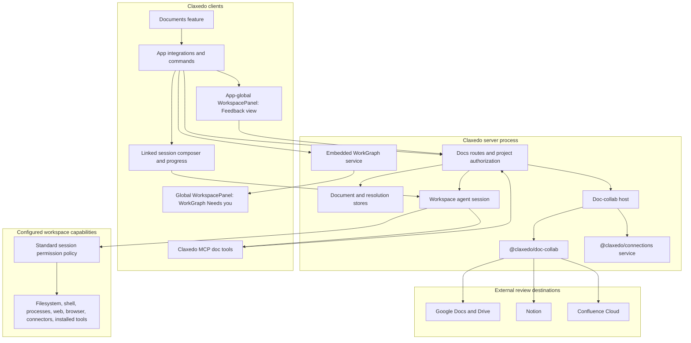
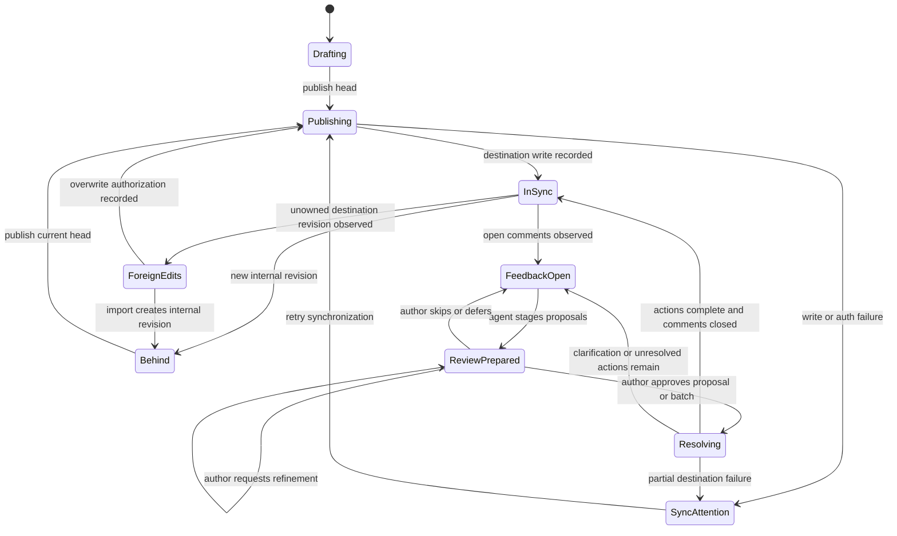
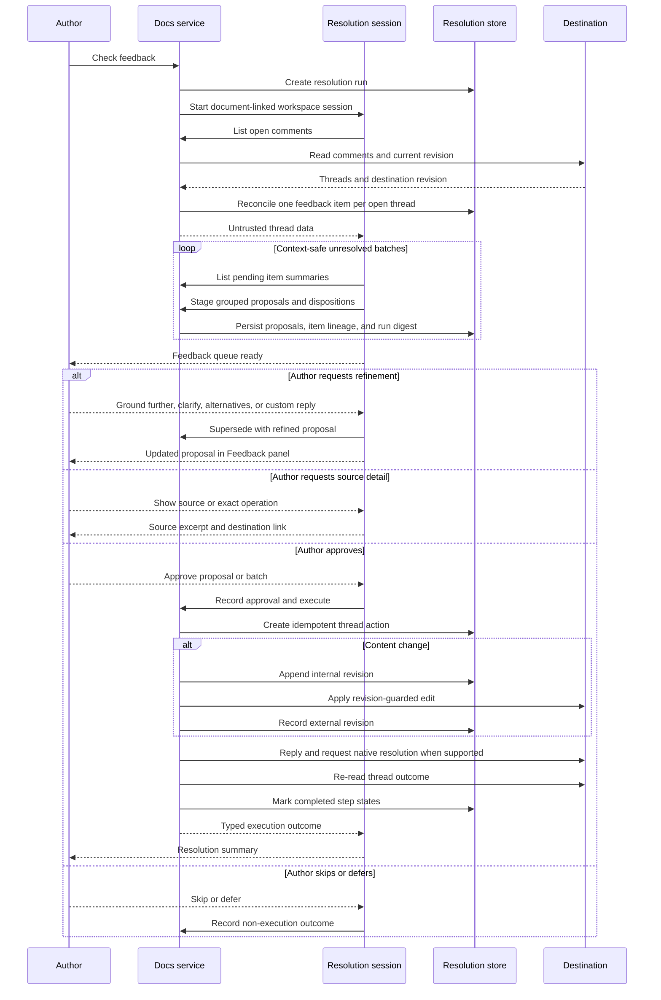
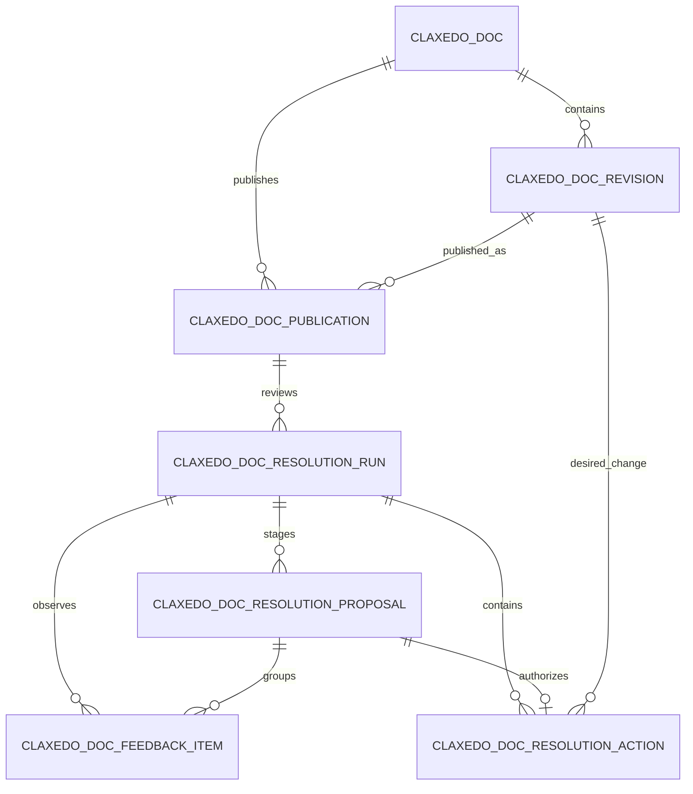
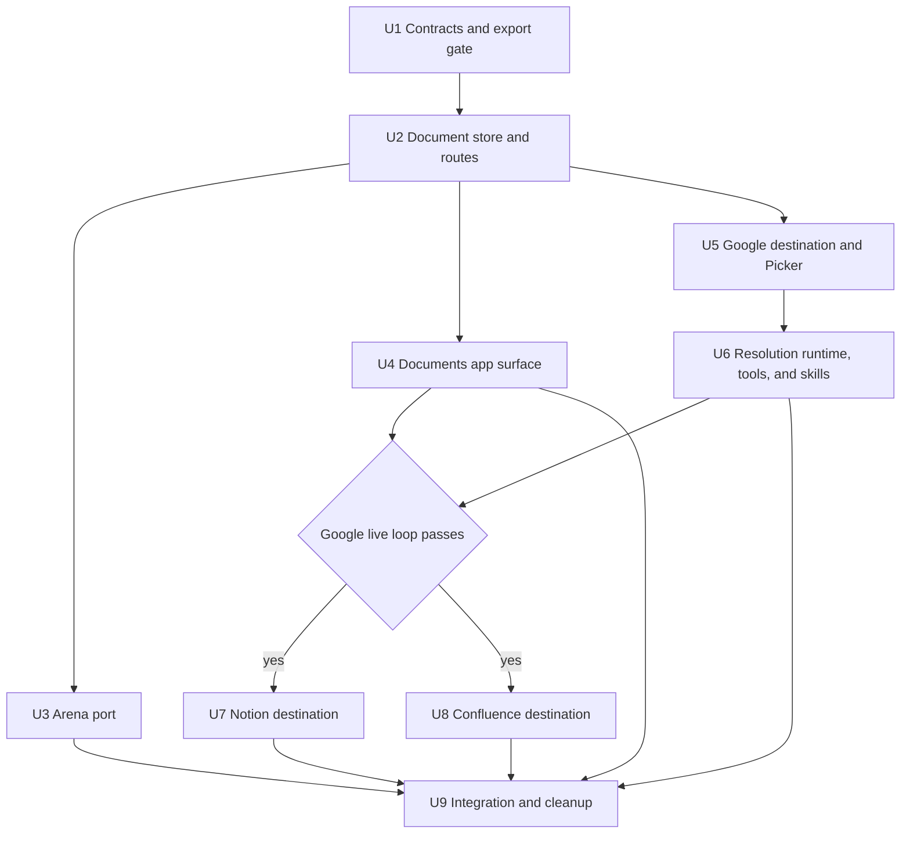

# Docs v2 Drafting and External Collaboration - Plan

## Goal Capsule

- **Objective:** Make Claxedo the place where people and agents create a durable document together, while established document platforms remain the place where external reviewers read, comment, and share.
- **Primary outcome:** A user can draft a machine-grounded document, publish it to Google Docs, Notion, or Confluence, collect native comments, and ask a normal workspace agent to resolve the feedback without losing the internal revision history.
- **Authority hierarchy:** Product Contract requirements govern behavior; Key Technical Decisions govern implementation; provider capability tests govern platform-specific outcomes; current repository architecture and scoped `AGENTS.md` files govern file ownership.
- **Execution profile:** Deep, security-sensitive, migration-bearing, multi-package work. Google proves the complete loop before the Notion and Confluence implementations begin.
- **Stop conditions:** Stop and surface a blocker when a destination cannot satisfy its declared capability contract, a migration cannot create a verified export, a provider write cannot preserve the internal canonical revision, or a document/provider action would need to bypass the session's configured permissions or the proposal-approval boundary.
- **Tail ownership:** The final integration unit owns the Pages-to-Docs-v2 cutover, dependency cleanup, documentation, architecture gates, and live-provider evidence.

---

## Product Contract

### Summary

Docs v2 is a native Claxedo document system with two complementary surfaces.

The workshop is Claxedo: users and agents create markdown documents, build append-only revisions, and run Arena against a fast local store.

In this plan, **machine-grounded** carries the intended meaning of code-grounded: it describes the agent's access to the working machine, not the document's subject. A document-linked session is a normal workspace session: it can inspect and modify files, run shell commands and processes, search the web, use a browser, call connectors, and use other installed tools according to the environment's standard permission model. The document may concern software, research, operations, strategy, writing, or any other domain.

The review surface is an external destination: Google Docs, Notion, or Confluence provides sharing, identity, comments, and familiar reviewer workflows.

The resolution loop joins the two surfaces. A machine-grounded agent uses the normal workspace toolset to investigate external feedback, creates a new internal revision for every approved content change, publishes that revision, replies to the external thread, and records enough durable state to resume safely after failure.

### Problem Frame

Document collaboration has three distinct jobs:

1. Agents need a low-latency, revisioned workspace where multiple writers can read and update the same document without provider rate limits.
2. Reviewers need a familiar destination that already supports links, identity, notifications, comments, and access control.
3. Authors need feedback resolution to remain grounded in the project and auditable across retries.

A single surface does not serve all three jobs equally well. Provider APIs are effective publication and review surfaces, but they are constrained drafting substrates. A local editor is effective for agent drafting, but recreating mature external collaboration features would add a large product and maintenance surface.

Docs v2 gives each job one owner: Claxedo owns drafting and revision truth; destinations own sharing and comments; the resolution service owns the durable bridge.

### Product Principles

- **One canonical history:** Every content-changing action produces an internal markdown revision.
- **Native review habits:** Reviewers use the destination they already know and need no Claxedo account.
- **Agent and user parity:** The UI, slash commands, MCP tools, and automated resolution sessions use the same document and publication contracts.
- **One contextual feedback surface:** A document opens a publication-scoped Feedback view in the existing app-global WorkspacePanel. The panel presents the agent's durable decision queue while the linked session supplies progress, free-form refinement, and agent continuity.
- **Summary before inspection:** The default surface explains what changed, why it matters, and what the agent recommends; source comments, exact edits, and provider documents remain one request or link away.
- **Normal session capability:** Document-linked sessions inherit the workspace's configured filesystem, shell, web, browser, process, connector, and tool permissions instead of receiving a Docs-specific restricted profile.
- **Authority follows the user:** External comments and imported content are evidence for the task; they cannot grant new tool permissions, reveal provider credentials, or bypass approval for document and destination side effects.
- **Explicit capability outcomes:** Every unsupported destination capability returns a typed outcome and stops the unsupported operation without substitute behavior.
- **Recoverable side effects:** Destination edits, replies, and resolution operations have durable action records and safe retry semantics.
- **Durable work, bounded context:** Feedback inventory, proposals, decisions, and execution progress persist independently of model context. One document-linked session is reused where possible, processes comments in safe batches, and resumes from durable checkpoints rather than replaying completed work.
- **Provider-owned sharing:** Destination ACLs remain the destination's responsibility.
- **Exact-revision WorkGraph handoff:** Docs remains the authoring and revision source of truth. Turn into work appends the selected exact document revision to the owner's WorkGraph as an immutable Work Source and starts the normal strict WorkGraph planning flow; confirmed WorkGraph Tasks remain execution truth.

### Actors

- A1. **Author** — creates and edits a document, starts Arena, publishes revisions, imports external edits, and initiates feedback resolution.
- A2. **Reviewer** — receives an external link and comments in Google Docs, Notion, or Confluence without joining Claxedo.
- A3. **Document agent** — uses the workspace's configured machine tools to research, analyze, create, and resolve document work; document and destination effects flow through `doc_*` tools.
- A4. **Project collaborator** — views document state and publication metadata subject to project authorization; destination writes require access to the publication's bound connection.
- A5. **Connection owner** — authorizes a personal or team destination connection and can reconnect or rebind a publication when credentials change.

### Requirements

**Drafting and revisions**

- R1. Claxedo stores each document as markdown with an append-only revision history and author provenance.
- R2. Every content write validates the expected parent revision and returns a typed conflict when the document head changed.
- R3. Arena reads and writes through the document revision contract so multiple agents share the same durable history.
- R4. The internal editor provides a focused markdown writing surface, rendered preview, revision history, save state, and conflict recovery.

**Publication and destination identity**

- R5. A user can publish a specific internal revision to Google Docs, Notion, or Confluence and receive the destination URL.
- R6. Each publication binds to an exact Connections capability handle by `connection_id`; later operations never switch accounts implicitly.
- R7. Re-publishing sends the current internal head and records the destination revision or version observed after the write.
- R8. External changes appear as `foreign_edits`; Claxedo requires import or explicit overwrite authorization before publishing over them.
- R9. Google adoption uses a Picker-backed `drive.file` authorization flow when the deployment has a public HTTPS callback; loopback-only deployments return a typed callback-required outcome. Notion and Confluence links are verified against the bound connection before persistence.

**Feedback and resolution**

- R10. Claxedo can list open destination comments, normalize their thread identity and source anchors, update the open-comment count, and identify capability or permission failures.
- R11. Feedback resolution classifies each thread as content change, answer-only, revision round, or clarification required and prepares a durable proposal before any external side effect.
- R12. An approved content-changing resolution creates an internal revision before destination synchronization and records partial failure as recoverable publication state.
- R13. Answer, reply, edit, and resolve side effects are recorded per thread with idempotency keys and resumable states.
- R14. A large feedback set can start a revision round, optionally use Arena, publish the resulting revision, and reply to included threads with the new version reference.
- R15. An external document can be imported as a new internal revision after the user confirms the source, target publication, and agent-prepared impact summary.

**Security and authorization**

- R16. Document routes reuse project authorization, return cross-scope resources as not found, preserve unsigned loopback-local operation, and require a session-bound document capability when an agent acts for a signed project actor.
- R17. OAuth and API tokens stay inside the Connections and doc-collab server processes and never appear in client, session, MCP, or log payloads.
- R18. External document content and comments are treated as untrusted data: rendering is sanitized, unsafe URLs are rejected, and embedded instructions cannot grant authority. Resolution sessions retain the normal workspace toolset and permission behavior while provider credentials remain isolated behind server-owned Docs operations.
- R19. A personal publication can be mutated only through a connection visible to its owner; a team publication can be mutated only through a team connection visible to the current authorized project actor.

**Product surfaces and operations**

- R20. The Docs index shows title, lifecycle state, destination, open-comment count, last synchronization, and one context-sensitive next action; connection and recovery details appear only when they require attention.
- R21. Composer commands and MCP tools expose create, edit, publish, adopt, import, check-feedback, and resolve-feedback actions through the same server contracts.
- R22. Desktop opens external documents in the native browser surface when its runtime and renderer gates are enabled; every other build uses a normal external link.
- R23. Missing connections, missing destination capabilities, expired credentials, conflicts, rate limits, and partial completion return actionable typed outcomes.
- R24. Existing Pages data is exported to a verified owner-only archive before the pre-release schema reset removes Pages and Page Arena storage.
- R25. Checking feedback starts or resumes the publication's document-linked session, reconciles a durable feedback inventory, and projects preparation progress into the Feedback panel and session todos. An empty result marks the run complete and reports that the publication is current.
- R26. Each staged proposal contains the source thread reference and content fingerprint, a grounded explanation, a plain-language change summary, the exact proposed document operation, a suggested external reply, and the intended provider action.
- R27. The author can approve, edit, improve, inspect, or skip a proposal from the Feedback panel. Improve offers concise grounding, clarity, and alternatives prompts plus free-form direction through the linked session. Refinement supersedes the proposal without mutating the document or destination; inspection leaves the proposal unchanged.
- R28. Foreign edits use the same panel-and-session interaction: the agent summarizes affected sections, likely intent, compatibility with the internal head, and a recommendation, and offers import, publish the internal version, more analysis, or defer with access to exact excerpts and the destination source.
- R29. Destination edits, replies, and resolution markers require explicit author approval of the staged proposal or an explicit batch approval recorded in the resolution run. Approval revalidates the internal head, destination revision, thread open state, and thread content fingerprint.
- R30. Raw comment threads remain native to the external destination. Claxedo stores the minimum observed thread snapshot needed for inventory, audit, stale detection, and recovery, and provides source excerpts and deep links through progressive disclosure rather than reproducing the provider's comment interface or a dedicated diff workspace.
- R31. Document-linked agents run with the standard workspace tool registry and permission policy, including filesystem, shell, process, web, browser, connector, and other machine capabilities when configured. The document domain does not change that capability model.
- R32. Every open thread observed during a feedback check is reconciled to a durable feedback item with its source fingerprint, source snapshot, anchor, minimal reviewer metadata, and explicit disposition. Preparation cannot complete while an observed item lacks a disposition.
- R33. A publication reuses one document-linked feedback session across checks and resolution runs while that session remains available. Durable run and item state remains authoritative when the transcript is compacted, the process restarts, or a replacement session is required.
- R34. The agent prepares feedback in the largest context-safe batches that share one source snapshot. It can classify, group, ground, and stage multiple compatible proposals in one provider turn while persisting each item's lineage and disposition independently.
- R35. Feedback execution uses stable prompt and tool prefixes, summary-first tool results, durable run digests, and incremental detail retrieval so continuation does not need to re-inject the complete document, all raw comments, or completed proposal history.
- R36. A Feedback button in the document header opens the existing app-global WorkspacePanel with a publication-scoped `document-feedback` activity subject. The panel is the canonical visual decision queue; the linked session remains the natural-language and agent-execution surface, and both project the same durable proposal records.
- R37. Turn into work sends one exact Docs revision, content hash, document identity, and provenance through the WorkGraph authoring-adapter port. WorkGraph exclusively materializes the confirmed Streams, Outcomes, and Tasks.
- R38. WorkGraph records `planning`, runs its exact configured Session V2 planner, and exposes a valid versioned proposal in the WorkGraph Needs you view of the existing app-global WorkspacePanel. The owner confirms that exact proposal version before Tasks enter the executable graph.
- R39. A later document revision appends a new Work Source revision and offers WorkGraph's keep, replace disposable work, or fork actions. It never silently rewrites confirmed work.
- R40. Missing planning configuration and invalid or unavailable planner output remain explicit configuration or `planning_failed` attention. Docs and WorkGraph publish no substitute proposal, Task set, model, or Recap.

### User Journeys

#### F1. Draft a machine-grounded document

- **Trigger:** The author runs `/docs draft "Channels layer PRD"` or selects New Doc.
- **Actors:** A1, optionally A3 through Arena.
- **Journey:** Claxedo creates a document and initial revision, opens the markdown editor, and lets the author invite Arena agents. Each accepted wave writes a revision against the current head. A stale save presents the newer head and offers rebase or discard without silent overwrite.
- **Outcome:** The author has a durable document head with a complete provenance trail.
- **Covered by:** R1-R4, R16, R20-R21.

#### F2. Publish and share for review

- **Trigger:** The author selects Publish and chooses a destination connection.
- **Actors:** A1, A2, A5.
- **Journey:** Claxedo checks the chosen connection, converts the selected markdown revision, creates or updates the destination document, records the publication revision, and returns the provider URL. The author uses the destination's own sharing controls.
- **Outcome:** Reviewers receive a familiar link and can participate without a Claxedo account.
- **Covered by:** R5-R9, R17, R19-R23.

#### F3. Adopt an existing Google Doc

- **Trigger:** The author chooses Adopt existing and provides a Google Docs URL.
- **Actors:** A1, A5.
- **Journey:** Claxedo extracts the document ID locally and verifies that the deployment has a public HTTPS callback. It starts a Google Picker authorization filtered to that file, validates the returned file ID and MIME type, reads the document through the resulting `drive.file` grant, and imports it as the first internal revision before creating the publication. A loopback-only deployment returns setup guidance while retaining app-created Google publication.
- **Outcome:** The existing Google Doc and the new internal history are bound to one verified connection and resource.
- **Covered by:** R6, R9, R15, R17, R19, R23.

#### F4. Resolve a feedback set

- **Trigger:** The author runs `/docs resolve-feedback` for a publication with open comments.
- **Actors:** A1, A2, A3.
- **Journey:** Claxedo reconciles every open provider thread into a feedback item and opens or resumes the publication's linked session. The agent processes pending items in context-safe batches, groups related concerns, grounds them with relevant machine and external sources, and stages durable proposals. The document's Feedback button opens its view in the app-global WorkspacePanel. The author can approve, edit, improve, inspect, or skip a proposal; free-form improvement continues in the same linked session and replaces the proposal in place. Approval creates the durable action, applies the internal revision when needed, publishes it, sends the approved reply, and records each included thread's provider-specific outcome.
- **Outcome:** The author resolves feedback from one compact queue while every observed comment, proposal, approval, revision, and provider effect remains auditable and resumable.
- **Covered by:** R10-R13, R16-R19, R21, R23, R25-R36.

#### F5. Run a revision round

- **Trigger:** Several comments affect the document's structure or require coordinated rewriting.
- **Actors:** A1, A2, A3.
- **Journey:** The linked agent session loads the unresolved inventory rather than replaying completed comments, groups compatible threads from one source snapshot, and stages one coherent document revision plus suggested replies for the included threads. The Feedback panel shows the batch and its item membership. The author can approve the batch, review selected proposals one by one, ask for stronger grounding or clearer alternatives, or launch Arena. Approval publishes one internal revision and replies to each included thread with the new version and section.
- **Outcome:** Large feedback becomes one coherent revision rather than a sequence of unrelated destination edits.
- **Covered by:** R3, R11-R14, R20-R21.

#### F6. Handle foreign edits

- **Trigger:** A person edits the destination document outside Claxedo.
- **Actors:** A1, A2.
- **Journey:** A feedback check observes an external revision that Claxedo did not write and marks the publication `foreign_edits`. The linked agent session prepares a durable summary of affected sections, important semantic changes, compatibility with the internal head, and its recommendation. The Feedback panel offers Import as revision, Publish internal version, Analyze further, and Defer with the destination link and exact excerpts available on inspection. Import creates a new internal revision with destination provenance; publishing the internal version records explicit overwrite approval.
- **Outcome:** External work is visible and cannot be overwritten silently.
- **Covered by:** R7-R8, R15, R20, R23.

#### F7. Recover a failed resolution

- **Trigger:** A token expires, a provider rate limit persists, or the process stops after one side effect succeeds.
- **Actors:** A1, A3, A5.
- **Journey:** Claxedo resumes from the durable resolution action state, checks whether the destination already reflects the intended edit or reply, retries only the missing step, and requests reconnection when authorization cannot be restored.
- **Outcome:** Recovery converges on one internal revision, one destination edit, and one thread reply.
- **Covered by:** R12-R13, R17, R23.

#### F8. Ground a non-software document in machine context

- **Trigger:** The author asks for a market brief, operating plan, research memo, or other document whose evidence spans local files and external sources.
- **Actors:** A1, A3.
- **Journey:** The document-linked session uses the normal workspace tools available to that user and environment. It can inspect and create files, run analysis through shell commands or processes, search the web, navigate a browser, and call configured connectors. Tool use follows the same configured permission policy as any other session. The agent records accepted writing as document revisions and cites or summarizes the evidence relevant to the document.
- **Outcome:** Docs v2 supports machine-grounded knowledge work without treating every document as a software artifact or limiting the agent to repository reads.
- **Covered by:** R1-R4, R16-R18, R21, R31.

#### F9. Turn an exact document revision into WorkGraph work

- **Trigger:** After brainstorming or drafting, the author selects Turn into work for the current document revision or asks the linked agent to do so.
- **Actors:** A1, A3.
- **Journey:** Docs sends the exact revision and provenance through the WorkGraph authoring adapter. WorkGraph preserves it as an immutable Work Source, runs its strict configured planner, and places the resulting versioned proposal in the WorkGraph Needs you view of the existing global WorkspacePanel. The author reviews placement, duplicates, optional Outcomes, Tasks, completion contracts, and execution defaults, then confirms the exact proposal version. Later Docs revisions use the same adapter and produce keep, replace-disposable, or fork choices.
- **Outcome:** Docs remains the durable authoring history and WorkGraph becomes the confirmed execution record without duplicated document or work state.
- **Covered by:** R1-R4, R16-R18, R21, R31, R37-R40.

### AI-Native Feedback Interaction

The feedback experience is a contextual decision queue inside the existing app-global WorkspacePanel. Its view opens from the active document, remains bound to that publication, and shares durable proposal state with one linked agent session. The panel provides overview and direct manipulation; the session provides natural-language direction, tool execution, and continuity.

**How external comments become visible**

1. Check feedback fetches every provider page, normalizes stable thread IDs and source anchors, observes the destination revision, and reconciles one durable feedback item for every open thread.
2. The publication stores the aggregate open count and the linked feedback session. Each resolution run binds its item inventory to one observed source snapshot.
3. The document header shows Check feedback, Checking, Feedback with a count, or Feedback current. Selecting it opens the app-global WorkspacePanel with a `document-feedback` activity subject for the publication.
4. The agent processes unresolved items in context-safe batches, groups related comments, and writes proposals and a compact run brief to durable storage. The panel updates from those records as preparation progresses.
5. The destination remains the source for the complete raw conversation. The panel reveals the stored excerpt, grounding, exact operation, and destination deep link only when requested.

**Feedback item disposition**

Every observed item advances through `observed`, `analyzing`, `proposal_ready`, `awaiting_author`, `approved`, `applying`, `addressed`, `clarification_needed`, `skipped`, `superseded`, `stale`, or `needs_attention`. A run reaches `ready` only after provider pagination completes and every observed item has an explicit disposition. Related items may share one proposal; each item retains its own thread identity, fingerprint, and final outcome.

`addressed` is a verified execution outcome. A content-change item reaches it after the internal revision, destination update, approved reply, and provider-specific completion contract are satisfied. An answer-only item reaches it after its approved reply and resolution outcome complete. An unsupported provider operation records a typed non-addressed outcome. Clarification, skip, stale, and partial-failure states remain distinguishable from addressed work. Execution re-reads the destination thread before recording the final outcome.

**What one staged decision contains**

| Default summary | Durable proposal data | Progressive disclosure |
|---|---|---|
| Reviewer intent and why it matters | Stable destination thread and source anchor | Full source comment or thread excerpt |
| Agent recommendation and confidence | Observed internal and external revisions | Project files or document passages used for grounding |
| Plain-language description of the proposed change | Exact proposed document operation | Exact before/after excerpt or operation detail |
| Suggested external reply | Exact suggested reply and provider action | Alternative changes or replies |
| Affected section and meaningful risk | Classification, provenance, and proposal lineage | External destination link |

The Feedback panel is a scrollable flat queue with one expanded proposal at a time. The default view shows reviewer intent, recommendation, affected section, and meaningful risk. Approve accepts the exact visible operation, Edit changes the proposed edit or reply, Improve offers Ground it, Make it clearer, Give alternatives, and a free-form instruction, Inspect reveals source and exact operation details, and Skip records a non-execution outcome. Improve and free-form edits continue through the linked session and replace the proposal in place. Compatible proposals can appear as one batch with visible membership; completed work collapses into a Done section.

**Resolution boundary**

Proposal creation, refinement, and source inspection are side-effect-free. Approval revalidates the internal head, destination revision, thread open state, and thread content fingerprint, records the author decision, and then creates the executable action. A stale proposal returns to the agent with the changed context. The server applies an approved content revision, publishes it, sends the exact approved reply, and records the destination's verified native resolution outcome. Unsupported resolution remains a typed non-addressed outcome.

**Batch behavior**

Small feedback sets appear as individual proposals in the panel. Large sets first produce one review brief and a progress list. Compatible proposals grounded against the same source snapshot may be approved as one revision round. Conflicting edits, ambiguous intent, and high-impact changes remain individual proposals. The author can switch between batch and one-by-one review from the panel or by directing the linked agent session.

**Agent persistence and context economy**

One feedback session is reused per publication while available. A new feedback check creates a new resolution run inside that session rather than a new session per comment or proposal. A replacement session adopts the durable run when the original session is unavailable and records its predecessor.

The session transcript is conversational context, not workflow storage. Feedback items, proposal lineage, author decisions, run digests, and action progress live in the Docs store. The agent requests unresolved inventory summaries first, retrieves full excerpts or grounding material only for the active batch, and stages multiple compatible proposals in one call. Completed batches are represented by a compact persisted digest containing source snapshot, themes, decisions, evidence references, remaining item IDs, and next action.

The system and tool prefix remains stable across turns so provider prompt caching can apply. Volatile counts, timestamps, comment bodies, and progress are supplied through tool results instead of rewriting the prefix. When transcript compaction is required, continuation reloads the persisted digest and unresolved item inventory rather than replaying all comments, tool outputs, document content, or completed proposals. Batch size is selected from the available context budget and shrinks for long comments, large documents, conflicting edits, or research-heavy grounding.

**Foreign updates**

The same interaction handles external document edits. The agent summarizes semantic changes, affected sections, likely intent, compatibility with the internal head, and a recommendation. The question offers Import as revision, Publish internal version, Analyze further, and Defer; the assistant message carries the destination link. Exact excerpts are available in the conversation on request, while the destination provides the complete source document.

### Acceptance Examples

- AE1. **Concurrent edit:** Given revision 7 is the head, when two writers submit children of revision 7, then one revision becomes head and the other request returns a conflict containing the current head.
- AE2. **Canonical quick resolution:** Given a comment requests a wording change, when the agent resolves it, then a new internal revision exists before the publication is marked in sync and the destination contains that revision's content.
- AE3. **Prompt-injection resistance:** Given a comment instructs the agent to run a shell command, disclose a local file, or upload machine content, when resolution runs, then the comment remains untrusted evidence and does not become user authority, override the configured permission policy, or bypass the staged proposal and approval boundary.
- AE4. **Connection stability:** Given a publication uses a team Google connection, when the user later adds a personal Google connection, then the publication continues using its stored team `connection_id`.
- AE5. **Crash recovery:** Given the destination edit succeeded and the process stopped before replying, when the run resumes, then Claxedo detects the applied edit and sends exactly one reply without creating another internal revision.
- AE6. **Google adoption:** Given a Google Docs URL outside the connection's current `drive.file` grant, when a deployment with a public HTTPS callback adopts it through Picker, then the selected file ID is verified and imported; submitting only the raw URL cannot create the publication, and a loopback-only deployment returns `public_callback_required`.
- AE7. **Notion capability outcome:** Given a Notion connection can edit content but lacks Insert comments capability, when resolution attempts a reply, then the thread action becomes `needs_attention` with setup guidance and no false resolved marker.
- AE8. **Confluence macro safety:** Given a page contains an unknown macro, when a full-body replacement would remove it, then the destination refuses that replacement with a typed outcome and preserves the macro.
- AE9. **Foreign edit:** Given the external revision changes outside a recorded Claxedo action, when the author republishes, then the write is blocked until import or overwrite authorization is recorded.
- AE10. **Migration export:** Given Pages data exists, when the Docs v2 migration starts, then a checksummed export manifest is written and verified before any Pages table is dropped; an export failure leaves the old tables intact.
- AE11. **Staged comment resolution:** Given an open comment requests a content change, when the agent prepares a proposal, then the Feedback panel shows a grounded summary and suggested reply while the document head and destination remain unchanged until approval.
- AE12. **Conversational refinement:** Given a staged proposal lacks useful evidence, when the author selects Improve or types a refinement, then the linked session updates the explanation and replaces the proposal in the panel without creating a revision or external reply.
- AE13. **Approved reply:** Given the author edits the suggested reply and approves the proposal, when execution completes, then the exact approved reply is sent once and the resulting internal revision and provider action link back to the proposal and approval.
- AE14. **Foreign-update summary:** Given the destination changed outside Claxedo, when feedback is checked, then the Feedback panel presents an agent summary and safe choices without requiring a Claxedo diff screen; import or overwrite occurs only after the corresponding choice.
- AE15. **No feedback:** Given a publication has no open comments or foreign edits, when feedback is checked, then the Feedback button and linked session report that it is current and the run contains no pending item or proposal.
- AE16. **Machine-grounded research:** Given a non-software research document and a workspace with web, browser, filesystem, and shell tools enabled, when the agent gathers evidence, then it can use those tools under the normal session permission policy and write the accepted result as a document revision.
- AE17. **Complete inventory:** Given the provider returns twelve open threads across multiple pages, when preparation completes, then twelve durable feedback items exist and each is linked to a proposal or carries an explicit informational, clarification, skipped, stale, or attention disposition.
- AE18. **Session reuse:** Given a publication has an existing linked feedback session, when a later feedback check finds new comments, then the same session receives a new durable run and does not recreate proposals or context for completed items.
- AE19. **Context-safe batching:** Given a large feedback set, when the agent prepares it, then compatible items from one source snapshot are staged in bounded batches, stable system and tool prefixes remain unchanged across those turns, each batch checkpoints its digest, and interruption resumes from the first unfinished item.
- AE20. **Verified addressed state:** Given an approved proposal completes, when the provider is re-read, then every included item becomes addressed only after its required edit, reply, and provider-specific completion contract are observed; unsupported, partial, or reopened threads retain a non-addressed typed state.

### Success Measures

- The Google reference journey completes live: draft, publish, comment, resolve, reply, thread resolution, and chat summary.
- Every destination passes the executable capability matrix, including its documented unsupported-capability outcomes.
- Every content-changing resolution is traceable from comment thread to resolution action, internal revision, publication write, and external reply.
- Every provider side effect is traceable to an approved proposal, and refinement requests leave document and destination state unchanged.
- Authors can complete the reference feedback journey through the contextual Feedback panel and its linked session without opening a mirrored provider-comment browser or diff workspace.
- Every observed open thread has a durable disposition, and the Feedback panel can reload its complete decision queue without reconstructing it from the session transcript.
- Repeated checks reuse one publication-linked session where possible and rehydrate only unresolved inventory plus the compact run digest.
- Retrying any resolution action after process interruption produces no duplicate revision, edit, reply, or resolution marker.
- Cross-project and cross-organization document access returns not found; personal and team connection boundaries remain intact.
- No access or refresh token appears in browser responses, MCP results, session messages, logs, or persisted publication rows.
- Existing Pages data has a verified export artifact before the reset migration completes.
- Software and non-software documents can use the same configured machine tools and permission behavior as ordinary workspace sessions.

### Scope Boundaries

**In scope**

- Native markdown documents, append-only revisions, publications, resolution runs, and resolution actions.
- Arena on the document revision contract.
- Google Docs, Notion, and Confluence destinations behind one capability contract.
- Google Picker adoption for existing Google Docs.
- Poll-based feedback checks, quick resolution, revision rounds, and explicit foreign-edit import.
- Docs index, markdown editor, composer commands, MCP tools, and explicit desktop in-app-browser or external-link capability modes.
- A document-triggered Feedback view in the existing app-global WorkspacePanel, durable staged proposals, progress projection, and linked-session refinement.
- Exact-revision Turn into work through the WorkGraph authoring-adapter port, strict planning, Needs you review, and later-revision replanning.
- Normal workspace filesystem, shell, process, web, browser, connector, and installed-tool capabilities in document-linked sessions.
- Automatic verified export followed by a sanctioned pre-release reset of Pages storage and UI.

**Deferred to follow-up work**

- Provider webhooks and background polling schedules.
- Automatic three-way merge of internal and external edits.
- Multiple personal accounts for the same destination integration.
- A mirrored destination-comment browser, permanent feedback inbox, and dedicated visual diff workspace.
- Google suggestion acceptance while the API remains in Developer Preview.
- Notion OAuth and Atlassian 3LO; v1 uses the shipped key methods for those destinations.
- A broader Arena coordination redesign.

**Outside this product's identity**

- Reimplementing destination ACLs, public hosting, reviewer accounts, or notification systems.
- Treating external destinations as the canonical multi-agent drafting store.
- Storing Docs v2 documents as repository files or coupling document revisions to git commits.

---

## Planning Contract

### Invariants

1. The internal revision graph is the source of truth for content authored or accepted through Claxedo.
2. A publication points to one internal revision, one destination resource, and one exact connection.
3. A destination side effect advances a durable resolution action; a durable action is never inferred solely from chat history.
4. Provider tokens stay within server-owned connection and destination code.
5. External content enters rendering and prompts through separate sanitization and untrusted-data boundaries.
6. Feature modules remain independent; cross-feature behavior is assembled in `packages/claxedo-app/src/app/integrations/` through ports and contributions.
7. Destination document and comment HTTP lives under `packages/claxedo-doc-collab/src/destinations/`; Connections continues to own authorization and token HTTP.
8. Docs owns document revisions and publications; WorkGraph owns admitted execution structure. Their integration passes exact revision identity and provenance through the authoring-adapter port without sharing persistence.

### Key Technical Decisions

| ID | Decision | Why this shape | Consequence |
|---|---|---|---|
| KTD1 | Keep markdown revisions in Claxedo and publish copies to destinations. | Agent drafting needs low-latency concurrent access and durable provenance; reviewer collaboration already exists in destination products. | Claxedo owns canonical revisions and explicit synchronization state. |
| KTD2 | Compose `@claxedo/doc-collab` into claxedo-server as a native kit. | Destination logic needs the internal stores, authorization context, and live Connections handles in one server process. | The kit owns destination contracts and HTTP; the host owns persistence, auth, and route composition. |
| KTD3 | Bind every publication to `connection_id`. | Connections can expose personal and team handles for the same integration, with caller-dependent selection. | Publication operations match the stored handle and fail with reconnect or rebind guidance when it is unavailable. |
| KTD4 | Create an internal revision before each content-changing destination write. | Canonical history remains truthful and retries have a stable desired state. | A failed destination write leaves the publication behind or failed, with a retryable action. |
| KTD5 | Persist resolution runs and per-thread actions. | Provider workflows contain multiple non-transactional side effects and can stop between them. | Recovery checks remote state and continues from the first incomplete step. |
| KTD6 | Run document work in a normal workspace agent session. | Machine grounding is valuable across software and non-software documents and may require filesystem writes, shell analysis, web research, browser use, processes, and connectors. | Docs adds document context and tools to the standard session; the existing workspace permission model continues to govern every machine capability. |
| KTD7 | Use polling for v1 feedback discovery. | The product is local-first and provider webhooks require durable public endpoints and renewal infrastructure. | Feedback checks are user-triggered or scheduler-triggered; webhook ingestion is a follow-up capability. |
| KTD8 | Use Google Docs as the reference destination and gate later destinations on its live loop. | Google exercises creation, revision-guarded edits, comments, replies, resolution, OAuth refresh, and Picker authorization. | Notion and Confluence implementation begins after the reference loop proves the shared contracts. |
| KTD9 | Use a textarea plus rendered preview for the internal editor. | Markdown is canonical and the editor's purpose is review and targeted authoring rather than destination-grade rich text. | Tiptap and its document-specific dependencies leave the Docs surface; richer editing remains a future product choice. |
| KTD10 | Separate additive Docs storage from the Pages cutover migration. | Current migration loading is automatic at database startup, so a destructive migration must arrive only when all consumers are ready. | U1 creates Docs tables additively; U9 adds the cutover migration, whose preflight exports and verifies the current Pages snapshot immediately before its SQL runs. |
| KTD11 | Keep UI, commands, and agent tools on one server contract. | Parity prevents behavior drift and lets the product initiate the same action from any surface. | App integrations translate UI intent; MCP tools return raw typed results; server routes own behavior. |
| KTD12 | Model unsupported capabilities as outcomes. | Notion cannot resolve comment threads and Confluence can contain markup that full replacement must preserve. | Skills and UI expose the typed capability outcome and never substitute behavior or report unsupported work as completed. |
| KTD13 | Bind agent calls to a session-scoped document capability. | Hosted agent traffic must carry the initiating actor, project, document, and allowed actions without relying on ambient loopback trust. | The resolution launcher issues a short-lived capability consumed by Docs routes; scope mismatch and expiry fail closed. |
| KTD14 | Open document feedback in the existing app-global WorkspacePanel. | A scrollable decision queue handles multiple proposals more clearly than sequential questions while preserving the current workbench hierarchy. | Documents emits an open-feedback intent; `app/integrations` targets a publication-scoped `document-feedback` activity subject in the shared panel. |
| KTD15 | Persist exact proposals while presenting summary-first UI. | The user needs a low-noise decision surface, while execution and audit need the precise edit, reply, source revision, and provider action. | The expanded proposal shows a grounded summary and recommendation; exact excerpts and operations appear on request and remain durable server data. |
| KTD16 | Require approval before provider side effects. | Agent judgment is valuable for preparing and refining work, while comments and foreign edits can change externally shared content. | Proposal generation is side-effect-free; approval or recorded batch approval is the boundary that creates executable actions. |
| KTD17 | Persist one feedback item per observed open thread. | Aggregate counts and proposal rows cannot prove that every fetched comment was examined or explain informational, grouped, skipped, reopened, and clarification outcomes. | A run cannot become ready until every observed item has an explicit disposition and proposal membership where applicable. |
| KTD18 | Reuse one feedback session per publication while keeping workflow state server-owned. | Session continuity preserves conversational and provider-cache locality, while transcripts can compact, expire, or become unavailable. | Runs, items, digests, proposals, and actions resume independently; a replacement session adopts the durable run and records its predecessor. |
| KTD19 | Prepare feedback in context-safe batches. | One model turn per comment repeats document context and tool prefixes, while placing an unbounded comment set in one turn risks context exhaustion and weak synthesis. | The agent stages multiple compatible proposals from one snapshot per turn, checkpoints a digest after each batch, and retrieves full detail only for active items. |
| KTD20 | Integrate Docs through the WorkGraph Work Source port. | Brainstorming and drafting need exact revision history, while execution needs one personal work graph with explicit admission. | Turn into work appends the selected Docs revision, invokes strict WorkGraph planning, and requires confirmation in Needs you before creating Tasks; later revisions use keep, replace, or fork. |

### High-Level Design

#### Component topology



The Documents feature owns document data, editor state, index UI, and document actions. It depends on platform modules, UI primitives, and `app-ports`; it does not import session, browser, settings, or workbench modules at runtime.

`app/integrations` supplies the cross-feature adapters for session launch, feedback-review context, workspace-panel targeting, command registration, content-surface registration, route creation, and opening a destination URL in the browser surface. A document action opens `mode: "activity"` with a `document-feedback` subject; a subject renderer owned through the integration boundary loads the durable queue. The Documents feature does not import workbench or Session modules.

The Feedback panel is the canonical visual decision surface. The publication-linked session owns agent turns, research, free-form refinement, and progress narration. Panel actions and agent tools call the same proposal routes, so either surface immediately projects the same durable state and the session transcript is never required to reconstruct the queue.

The server exposes document behavior under `/api/claxedo/docs`. MCP tools call these routes and never call destinations or Connections token routes directly.

#### Publication and feedback lifecycle



Document lifecycle shown in the UI is derived from the document, publication, comment count, and active resolution-run state. The persisted publication state describes synchronization facts; it is not a hand-edited workflow column.

Publication synchronization uses five persisted states:

| State | Meaning |
|---|---|
| `in_sync` | The recorded destination revision represents the recorded internal revision. |
| `behind` | The internal head is newer than the published revision. |
| `foreign_edits` | The destination revision changed outside a recorded Claxedo action. |
| `sync_pending` | A durable outbound action has an incomplete destination step. |
| `sync_attention` | Synchronization needs reconnection, authorization, conflict resolution, or user choice. |

Resolution runs advance through `checking`, `analyzing`, `ready`, `partially_ready`, `resolving`, `completed`, and `needs_attention`. Feedback items carry the per-thread dispositions defined in the interaction contract. Resolution proposals advance through `drafting`, `awaiting_author`, `refining`, `approved`, `skipped`, and `superseded`. Approval creates or activates the corresponding resolution action. Resolution actions advance through `pending`, `internal_applied`, `external_applied`, `replied`, `verified`, and `completed`; `needs_attention` records a terminal wait for user action. Recovery verifies the destination before advancing from any persisted step.

#### Durable thread resolution



The agent owns analysis, proposal preparation, and conversational refinement. The server owns proposal durability, approval records, and side-effect ordering. The agent never orchestrates raw provider calls, and an unapproved proposal cannot create a revision, destination edit, reply, or resolution marker.

#### Data relationships



The storage contract uses the following tables:

- `claxedo_doc`: project-scoped identity, title, head revision, timestamps, and archive time.
- `claxedo_doc_revision`: monotonic per-document sequence, parent revision, markdown, author kind, author/session provenance, note, and timestamp.
- `claxedo_doc_publication`: destination, external resource, URL, exact `connection_id`, connection scope, published revision, last known external revision, synchronization state, comment count, linked feedback session and predecessor, and synchronization timestamps.
- `claxedo_doc_resolution_run`: publication, linked session, mode, state, source snapshot, compact continuation digest, inventory counts, preparation checkpoint, and summary timestamps.
- `claxedo_doc_feedback_item`: resolution run, stable destination thread, source fingerprint and anchor, observed external revision, minimal reviewer metadata and excerpt, disposition, proposal membership, latest action, outcome, and timestamps.
- `claxedo_doc_resolution_proposal`: source thread or external revision, source content fingerprint, classification, grounded explanation, change summary, exact proposed operation, suggested reply, provider action, source document and destination revisions, proposal state, author decision, and provenance.
- `claxedo_doc_resolution_action`: destination thread, action kind, idempotency key, desired revision, expected and resulting external revisions, step state, outcome, error, and timestamps.
- `claxedo_doc_arena*`: the existing Arena model keyed by `doc_id` and connected to revision writes.

All Drizzle fields use snake_case. Foreign keys and indexes preserve document-owned cleanup, per-project listing, per-document revision order, per-publication active-run lookup, and unique thread-action idempotency.

### Destination Capability Contract

| Capability | Google Docs | Notion | Confluence Cloud |
|---|---|---|---|
| Create | Docs create | Page create | Page create |
| Read | Structured document | Block tree | Storage representation |
| Revision guard | Docs `requiredRevisionId` | Re-read block state and update identifiers | Page version number |
| Comments | Drive comments list with quoted content when available | Open discussions returned as comments | Inline and footer comment APIs |
| Reply | Drive replies create | Add comment to discussion | Comment reply |
| Resolve | Reply action `resolve` | `reply_marker` outcome | Inline comment update with `resolved: true` |
| Canonical publish | Markdown-to-Docs operations | Markdown-to-block operations | Markdown-to-storage conversion |
| Preservation strategy | Re-read indices before writes | Preserve unsupported blocks outside edited sections | Refuse full replacement when unknown macros are present and return a typed unsupported outcome |

The capability matrix is executable in `packages/claxedo-doc-collab/src/capability-matrix.test.ts`. Destination implementations return outcome unions for capability gaps, authorization failures, revision conflicts, rate limits, invalid resources, and preservation fallbacks.

### Trust Boundaries

**Connection boundary**

The doc-collab host receives the current request actor and resolves Connections handles visible to that actor. Creating a publication stores the selected handle ID. Later operations select that ID from the actor-visible handles and fail closed when it is absent. Tokens are fetched immediately before destination operations and are never cached by the publication store.

**External-content boundary**

Destination markup is parsed into a safe intermediate document form. Raw HTML, scriptable URL schemes, event attributes, active embeds, and provider-specific executable content do not enter rendered markdown. Unknown rich constructs remain preserved destination-side and appear as typed import warnings.

**Agent boundary**

Comment bodies, quoted text, author names, external document content, and destination URLs are labeled as untrusted context. They inform analysis but do not become user instructions or grant authority. The document-linked session otherwise behaves like a normal workspace session and can use its configured filesystem, shell, web, browser, process, connector, and other tools under the existing permission policy. Provider tokens remain unavailable to the session; destination access occurs through scoped `doc_*` operations.

**Authorization boundary**

Document reads and writes pass through the existing control-plane auth context, loopback-local policy, and project authority. Direct-ID authorization resolves the stored project before access checks. Cross-scope access returns 404.

Server-started resolution sessions receive a short-lived capability bound to the initiating actor, project, document, publication, and allowed `doc_*` actions. MCP forwards that capability only to Docs routes. Hosted requests cannot use ownerless loopback state as an authorization substitute, and capability expiry or scope mismatch fails closed.

### Output Structure

```text
packages/claxedo-doc-collab/
  package.json
  src/
    index.ts
    contracts.ts
    conversion/
      markdown.ts
      safe-document.ts
    destinations/
      google-docs.ts
      notion.ts
      confluence.ts
    resolution/
      classify.ts
      execute.ts
      recovery.ts
    capability-matrix.test.ts
    security.test.ts

packages/claxedo-server/src/
  doc-collab-host/
  routes/docs.ts
  routes/docs-arena.ts
  storage/doc.sql.ts
  storage/doc-arena.sql.ts

packages/claxedo-app/src/features/documents/
  actions/
  data/
  editor/
  ui/content/

packages/claxedo-mcp/
  src/doc-tools.ts
  skills/resolve-doc-feedback/SKILL.md
  skills/check-doc-feedback/SKILL.md
```

The tree names ownership boundaries. Exact helper filenames can follow implementation discoveries while preserving these owners.

### Sequencing and Release Gates



U3, U4, and U5 may proceed concurrently after U2 because they own server Arena, app surfaces, and Google destination files respectively. Notion and Confluence begin after the Google gate confirms that the shared contract, durable action model, and security profile support the complete product loop. U9 owns the single cutover point after every consumer is ready.

**G1 — Google live loop:** U4, U5, and U6 are complete; a real user can create or adopt a Google Doc, publish, receive a human comment, resolve it through a normal workspace session, observe one internal revision and one external reply, and recover one injected mid-action interruption without duplication.

### Assumptions

- The pre-release Pages reset is authorized, and preserving useful dogfood content through a verified export satisfies the data-retention need.
- The existing Connections service remains the authority for credential scope, token refresh, personal/team visibility, and authorization failure reporting.
- Google credentials and a test-mode OAuth application are available for the live reference gate.
- A public HTTPS callback that returns to the test deployment is available for the Google Picker adoption portion of the live reference gate.
- Notion v1 uses an internal integration configured with Read content, Update content, Read comments, and Insert comments capabilities.
- Confluence v1 uses an Atlassian Cloud API token with page and comment permissions for the selected site.
- Provider API behavior is verified again during implementation because these contracts can change independently of Claxedo.
- Document-linked sessions share the same machine-access risk envelope as ordinary workspace sessions. User and deployment permission configuration remains authoritative; Docs neither elevates nor narrows it.

### System-Wide Impact

- **Persistence:** Introduces seven document/collaboration tables, including the per-thread feedback inventory, ports Arena storage, and removes Pages tables after export verification.
- **Authorization:** Adds project-scoped routes plus connection-owner and connection-scope checks for destination mutations.
- **Session execution:** Reuses one publication-linked workspace session, adds document context and scoped `doc_*` actions while preserving configured tools and permissions, and resumes from durable run digests across compaction or replacement.
- **Agent parity:** UI actions, composer commands, MCP tools, and resolution automation share one route contract.
- **Frontend architecture:** Keeps document behavior in `features/documents` and composes session/browser/workbench dependencies through `app/integrations` and `app-ports`.
- **Packaging:** Adds the `@claxedo/doc-collab` workspace package and extends the first-party Claxedo MCP package with document tools and bundled skills.
- **Operational behavior:** Adds live-provider smoke gates, provider rate-limit handling, reconnect flows, and observable synchronization failures.

### Risks and Mitigations

| Risk | Impact | Mitigation |
|---|---|---|
| Provider API drift | A destination capability or request shape changes during implementation. | Pin API versions where supported, keep the matrix executable, and verify official docs plus live smoke before release. |
| Prompt injection through feedback | External text attempts to turn normal machine access into unauthorized file, shell, browser, connector, or network activity. | Label external data as untrusted, preserve the existing session permission boundary, require explicit user authority for instructions originating in feedback, isolate provider credentials, and test hostile comments end to end. |
| Partial provider side effects | An edit succeeds while reply or resolution fails. | Persist step-level resolution actions, inspect remote state on resume, and retry only incomplete steps. |
| Summary hides a material change | An author approves a concise explanation that omits an important consequence. | Bind proposals to exact source revisions, include affected sections and risk in the summary, offer source excerpts and exact operation on demand, and reject stale approvals. |
| Review interaction expands into a second app | Comment lists, diff panels, and provider-specific controls duplicate the session and destination surfaces. | Open one contextual Feedback view in the existing app-global WorkspacePanel, show agent proposals rather than provider chrome, and keep full source conversations at the destination. |
| Unsafe batch approval | Unrelated or conflicting comments execute under one broad confirmation. | Batch only proposals grounded against the same source snapshot with compatible edits; show exact membership and route conflicts or high-impact proposals to individual decisions. |
| Long feedback runs exhaust context | Repeated document and comment injection increases latency and weakens preparation quality. | Reuse one linked session, keep prompt prefixes stable, retrieve summaries before detail, persist a digest after every batch, compact completed work, and resume from durable unfinished item IDs. |
| Canonical/external divergence | Internal and destination content disagree after edits or foreign changes. | Create internal revisions before owned writes, track external revisions, and require import or overwrite authorization for foreign changes. |
| Credential switching | A personal connection shadows a team connection for an existing publication. | Persist and re-authorize the exact `connection_id`; never select by integration alone after publication creation. |
| Destructive reset failure | Pages data is lost or startup partially applies the reset. | Export and checksum before migration, abort on failure, and verify restart cannot recreate old tables. |
| Rich-format loss | Markdown conversion removes unsupported provider constructs. | Edit anchored sections, preserve unknown blocks/macros, and refuse destructive replacement with a typed unsupported outcome. |
| Rate limits | Resolution runs become slow or repeatedly fail. | Process thread effects sequentially per publication, honor retry headers, use bounded backoff, and persist retryable state. |
| Browser feature unavailable | Desktop cannot host the provider UI in-app. | Detect both browser gates and use an external link in every build as the baseline path. |
| Picker callback unavailable | A loopback-only deployment cannot complete Google's existing-file authorization flow. | Keep app-created publication available and return `public_callback_required` with public-callback setup guidance for adoption. |

---

## Implementation Units

### U1. Define contracts and prepare the data transition

- **Goal:** Define the shared contracts, additive schema, and verified Pages export gate that every later unit uses.
- **Requirements:** R1-R2, R5-R6, R10-R13, R18-R19, R23-R36; AE1, AE4, AE10-AE20.
- **Dependencies:** None.
- **Files:** `packages/claxedo-doc-collab/package.json`, `packages/claxedo-doc-collab/src/contracts.ts`, `packages/claxedo-doc-collab/src/index.ts`, `packages/claxedo-server/src/storage/doc.sql.ts`, `packages/claxedo-server/src/storage/doc-arena.sql.ts`, `packages/claxedo-server/src/storage/schema.ts`, `packages/claxedo-server/src/storage/db.ts`, `packages/claxedo-server/src/storage/docs-v2-export.ts`, `packages/claxedo-server/src/storage/docs-v2-export.test.ts`, `packages/claxedo-server/src/storage/claxedo-migration/20260713000100_docs_v2_additive/migration.sql`, `packages/claxedo-server/package.json`, `bun.lock`.
- **Approach:** Define document, revision, publication, linked feedback session, resolution-run, feedback-item, staged-proposal, approval, resolution-action, continuation-digest, destination capability, edit, and outcome contracts. A feedback item records the minimal observed thread snapshot and disposition; a proposal can group multiple items and binds its exact operation and suggested reply to the observed internal and external revisions. Refinement supersedes rather than mutates the prior proposal. Add an additive migration for Docs v2 tables. Add a named migration-preflight hook that can export Pages and Arena data as markdown plus structured metadata, write and verify a checksum manifest, and then allow the cutover SQL to run in the same exclusive startup migration window. The archive directory and files are owner-only, and exported content never enters logs. U9 supplies the cutover migration after all consumers have moved. Keep historical migrations intact.
- **Execution note:** Start with export-failure and revision/action uniqueness tests because later units depend on these guarantees.
- **Patterns to follow:** Drizzle snake_case schemas in `packages/claxedo-server/src/storage/`; migration loading in `packages/claxedo-server/src/storage/db.ts`; repair coverage in `packages/claxedo-server/src/storage/repair.test.ts`; package boundary pattern from `packages/claxedo-connections/`.
- **Test scenarios:**
  1. The additive migration creates Docs, publication, resolution, and Arena tables without changing Pages tables.
  2. Pages and Arena rows produce markdown and metadata entries plus a verified manifest when the named cutover preflight is invoked.
  3. Export write or checksum failure aborts the named migration and leaves Pages tables readable.
  4. Publication uniqueness includes document, destination resource, and connection identity.
  5. Resolution action idempotency rejects a second action with the same publication, thread, and semantic action key.
  6. Covers AE10. Export directories and files use owner-only permissions and logs contain only manifest metadata.
  7. A staged proposal persists exact source revisions, proposed operation, suggested reply, explanation, author decision, and supersession lineage.
  8. A paginated feedback check creates one feedback item per observed open thread and cannot mark the run ready while any item lacks a disposition.
  9. A run checkpoint persists a compact continuation digest and unfinished item IDs without storing provider credentials or complete raw threads.
- **Verification:** Contracts compile across the kit and server; Docs tables are available during additive development; the cutover migration hook cannot reach SQL execution without verified export evidence.

### U2. Build the document store and authorized routes

- **Goal:** Provide document CRUD, revision concurrency, publication metadata, feedback state, and resolution-ledger routes.
- **Requirements:** R1-R2, R5-R8, R10, R12-R16, R20, R23, R25-R30, R32-R36; AE1-AE2, AE5, AE9, AE11-AE14, AE17-AE20.
- **Dependencies:** U1.
- **Files:** `packages/claxedo-server/src/routes/docs.ts`, `packages/claxedo-server/src/routes/docs.test.ts`, `packages/claxedo-server/src/routes/docs-auth.test.ts`, `packages/claxedo-server/src/doc-store.ts`, `packages/claxedo-server/src/doc-resolution-store.ts`, `packages/claxedo-server/src/server.ts`, `packages/claxedo-server/src/architecture.test.ts`, `packages/claxedo-server/src/architecture-ownership.ts`.
- **Approach:** Reuse the Pages authorization shape: control-plane auth context, loopback-local allowance, stored-project resolution for direct IDs, project authority checks, and cross-scope 404s. Perform head validation, sequence allocation, revision insert, and head advancement in one SQLite write transaction. Expose routes to reconcile and list feedback items, checkpoint and complete runs, and stage, batch-stage, supersede, approve, skip, and inspect proposals. Run completion validates pagination completion and an explicit disposition for every observed item. Approval revalidates both source revisions plus every included thread's open state and content fingerprint before creating executable actions; stale proposals return to agent refinement. Keep destination orchestration outside these persistence routes while exposing typed synchronization and resolution state.
- **Execution note:** Implement repository behavior test-first around concurrency, authorization, and recovery state transitions.
- **Patterns to follow:** `packages/claxedo-server/src/routes/pages-auth.test.ts`, `packages/claxedo-server/src/routes/pages.ts`, `packages/claxedo-server/src/connections-host/connections-host.ts`.
- **Test scenarios:**
  1. Create, read, list, archive, and restore stay inside the authorized project and work unsigned on loopback.
  2. Covers AE1. Two children of one parent produce one successful write and one typed conflict.
  3. Direct-ID access resolves the stored project and returns 404 to another tenant.
  4. A publication cannot be created with a connection unavailable to the current actor.
  5. Covers AE4. Adding a higher-precedence connection does not change the publication's stored connection.
  6. A resolution run resumes its incomplete action list and does not recreate completed actions.
  7. Covers AE9. Foreign revision observation blocks publication until import or overwrite authorization exists.
  8. Covers AE11. Staging a proposal changes only proposal state and creates no document revision or executable provider action.
  9. Covers AE13. Approval records the author and exact reply, then creates one action; a repeated approval returns the same action.
  10. A proposal whose internal head, destination revision, thread open state, or thread content fingerprint changed returns `proposal_stale` without side effects.
  11. A run cannot transition to ready until pagination is complete and every observed item has a disposition.
  12. A compact digest and unfinished item cursor survive reload independently of the linked session transcript.
  13. Replacing an unavailable linked session preserves run ownership and records predecessor lineage without duplicating items or proposals.
- **Verification:** The server route tests prove revision atomicity, project isolation, connection binding, and durable recovery states.

### U3. Port Arena to document revisions

- **Goal:** Run Arena on document revisions while preserving the current Pages path until the final integration cutover.
- **Requirements:** R3, R24; F1, F5; AE10.
- **Dependencies:** U2.
- **Files:** `packages/claxedo-server/src/routes/docs-arena.ts`, `packages/claxedo-server/src/routes/doc-arena-*.ts`, `packages/claxedo-server/src/routes/docs-arena.test.ts`, `packages/claxedo-server/src/storage/doc-arena.sql.ts`, `packages/claxedo-server/src/storage/schema.ts`, `packages/claxedo-server/src/storage/repair.ts`, `packages/claxedo-server/src/storage/repair.test.ts`, `packages/claxedo-server/src/server.ts`.
- **Approach:** Port the current Arena runtime with `doc_id` ownership and revision writes at accepted wave boundaries. Keep Arena behavior stable while changing its storage and document seam. Pages remains mounted during additive development; U9 removes its routes, stores, legacy imports, repair entries, and tables after the app and provider flows use Docs v2.
- **Execution note:** Add characterization coverage for one existing Arena wave before changing the storage seam.
- **Patterns to follow:** Current `packages/claxedo-server/src/routes/pages-arena.ts` and `packages/claxedo-server/src/routes/page-arena-*.ts` behavior; U2 revision transactions.
- **Test scenarios:**
  1. Starting Arena requires document write authorization.
  2. One full wave reads the current head and writes one child revision with agent/session provenance.
  3. A concurrent user revision produces a typed Arena conflict and preserves both source texts for retry.
  4. Restart restores Arena state from Docs v2 tables.
  5. Pages and Docs Arena can coexist during the additive development window without sharing tables or identifiers.
- **Verification:** A real Arena wave completes against a Docs v2 document and server tests prove the new Arena path is independent of Pages storage.

### U4. Build the native Documents experience

- **Goal:** Build a focused Docs index, markdown editor, commands, and contextual Feedback workspace-panel entry point ready for the final product cutover.
- **Requirements:** R4, R20-R22, R24-R40; F1-F6, F8-F9; AE11-AE20.
- **Dependencies:** U2.
- **Files:** `packages/claxedo-app/src/features/documents/data/docs-api.ts`, `packages/claxedo-app/src/features/documents/data/docs-api.test.ts`, `packages/claxedo-app/src/features/documents/actions/doc-actions.ts`, `packages/claxedo-app/src/features/documents/actions/doc-actions.test.ts`, `packages/claxedo-app/src/features/documents/editor/doc-editor.tsx`, `packages/claxedo-app/src/features/documents/editor/doc-editor.integration.vitest.tsx`, `packages/claxedo-app/src/features/documents/editor/doc-index.tsx`, `packages/claxedo-app/src/features/documents/editor/doc-index.vitest.tsx`, `packages/claxedo-app/src/features/documents/ui/content/doc-content.tsx`, `packages/claxedo-app/src/features/documents/ui/content/docs-index-content.tsx`, `packages/claxedo-app/src/features/documents/app-ports.ts`, `packages/claxedo-app/src/app/integrations/doc-feedback-session.ts`, `packages/claxedo-app/src/app/integrations/doc-feedback-session.test.ts`, `packages/claxedo-app/src/app/integrations/feature-ports.ts`, `packages/claxedo-app/src/app/integrations/first-party-content-surfaces.tsx`, `packages/claxedo-app/src/app/integrations/first-party-content-surfaces.test.ts`, `packages/claxedo-app/src/app/integrations/registry.ts`, WorkGraph authoring-adapter integration, `packages/claxedo-app/src/features/session/composer/ui/slash-popover.tsx`, `packages/claxedo-app/src/features/session/ui/use-session-commands.tsx`, `packages/claxedo-app/src/app/workbench/state/`, `packages/claxedo-app/src/platform/identity/route.ts`, `packages/claxedo-app/src/platform/identity/route.test.ts`, `packages/claxedo-app/src/platform/runtime/workspace-runtime-route-audit.test.ts`.
- **Approach:** Keep document state, API queries, editor behavior, and content renderers inside `features/documents`. Use `app/integrations` and document app ports for route navigation, document-linked session launch, review context, command registration, workbench content, WorkspacePanel activity rendering, WorkGraph authoring-adapter invocation, and browser opening. The document header exposes one adaptive Feedback action and one Turn into work action. Feedback targets the existing app-global WorkspacePanel with a publication-scoped `document-feedback` activity subject whose flat scrollable queue loads durable run, item, and proposal records; one proposal expands at a time with Approve, Edit, Improve, Inspect, and Skip. Turn into work sends the exact selected revision through the WorkGraph port and navigates the owner to the WorkGraph Needs you view when its strict proposal is ready. Free-form improvement continues through the linked session and updates the proposal in place. Implement a textarea editor with preview and revision history. Detect desktop browser availability; open the in-app browser only when both gates are active and otherwise use the destination URL externally.
- **Execution note:** Build the interaction state model before visual polish and verify route, command, and reload behavior in a real browser.
- **Patterns to follow:** `packages/claxedo-app/src/ARCHITECTURE.md`, `packages/claxedo-app/src/features/documents/AGENTS.md`, `packages/claxedo-app/src/features/workspaces/ui/panel/workspace-panel-state.ts`, `packages/claxedo-app/src/app/workbench/rail/workspace-panel-body.tsx`, current Documents app-port composition, activity-subject targeting, content surface registry, command bus, session todo projection, and browser feature contract.
- **Test scenarios:**
  1. Empty, loading, success, permission-error, connection-error, conflict, foreign-edit, and partial-resolution states expose the correct actions.
  2. Keyboard users can create, save, inspect revisions, publish, open external, and start resolution with visible focus and announced status.
  3. A stale editor save preserves the draft and presents the current head.
  4. Slash commands and buttons dispatch the same typed intent and restore user input after failure.
  5. Desktop with both browser gates opens the provider in the browser surface; every other environment opens an external HTTPS link.
  6. Reload preserves the active Docs surface and selected document through current workbench persistence.
  7. No feature-level runtime import crosses from Documents into Session, Browser, Settings, or Workbench.
  8. A narrow viewport opens the selected document as the primary surface, preserves the index state for back navigation, and keeps touch targets within current app accessibility tokens.
  9. Covers AE11. The document Feedback action opens the current publication's durable proposal queue in the existing app-global WorkspacePanel; no mirrored provider comment browser or diff panel appears.
  10. Covers AE12. Improve choices and free-form direction continue the linked session and replace the proposal in place; Inspect preserves it.
  11. Covers AE14. A foreign-edit state exposes one Review update action whose Feedback panel offers import, publish internal, more analysis, and defer with the destination link.
  12. A large batch uses the todo dock for progress and asks for batch approval only when proposals share one source snapshot and contain no conflicting edits.
  13. Covers AE15. A feedback check with no open comments or foreign edits marks the button and panel current and creates no pending proposal.
  14. Covers AE17. Reloading the panel restores every observed item's disposition and proposal membership without reading the session transcript.
  15. The Feedback panel supports loading, preparing, ready, empty, stale, applying, partial, reconnect, and completed states at narrow and wide widths.
  16. Covers AE16. A document-linked session keeps the workspace's configured machine tools and permission behavior while receiving document context and `doc_*` actions.
  17. Turn into work binds the exact current revision and opens the resulting WorkGraph proposal in Needs you; invalid generation produces explicit attention and no Tasks.
- **Verification:** Focused UI tests, architecture guards, browser QA, and app typecheck pass for the Docs surface while the existing Pages surface remains available until U9.

### U5. Implement Google publication and adoption

- **Goal:** Prove create, publish, adopt, read, edit, comment, reply, resolve, and conflict behavior on Google Docs.
- **Requirements:** R5-R10, R15, R17-R19, R23; F2-F3, F6; AE4, AE6, AE9.
- **Dependencies:** U2.
- **Files:** `packages/claxedo-doc-collab/src/destinations/google-docs.ts`, `packages/claxedo-doc-collab/src/destinations/google-docs.test.ts`, `packages/claxedo-doc-collab/src/conversion/`, `packages/claxedo-connections/src/impls/google.ts`, `packages/claxedo-connections/src/impls/google.test.ts`, `packages/claxedo-server/src/connections-host/connections-host.ts`, `packages/claxedo-server/src/connections-host/connections-host.test.ts`, `packages/claxedo-server/src/doc-collab-host/`, `packages/claxedo-server/src/doc-collab-host/google-live.test.ts`.
- **Approach:** Use `drive.file`, offline access, and the Connections refresh service. Add a Picker authorization mode for existing files and validate the returned file ID before import. Re-read the Google document immediately before index-based writes and use the latest required revision ID. Read comments through Drive with explicit fields and pagination. Record the updated revision after every write.
- **Execution note:** Develop conversion and write planning against golden documents, then pass a live test with human credentials.
- **Patterns to follow:** Google integration and token refresh in `packages/claxedo-connections/src/impls/google.ts`; doc-collab outcome and safe-document contracts from U1.
- **Test scenarios:**
  1. Markdown headings, paragraphs, lists, links, code, tables, and task items round-trip within the supported contract.
  2. A stale required revision returns conflict, triggers one re-read/re-anchor retry, and then reports attention if conflict persists.
  3. Comment pagination includes open and resolved state plus quoted content when available.
  4. Reply and resolve create one Drive reply with the expected action.
  5. Covers AE6. Raw URL adoption without Picker grant fails; Picker-selected file imports and binds successfully.
  6. Covers AE6. A loopback-only deployment returns `public_callback_required` and can still create and publish an app-owned Google Doc.
  7. Covers AE9. An unowned external revision blocks overwrite.
  8. Token refresh succeeds without exposing the token outside server-owned code; permanent auth failure marks the connection degraded.
- **Verification:** Golden conversion tests and the live Google create/publish/comment/read/edit/reply/resolve flow pass.

### U6. Build the resolution runtime, MCP tools, and skills

- **Goal:** Turn destination feedback into safe, durable, machine-grounded document actions available from UI, commands, MCP, and sessions.
- **Requirements:** R10-R14, R17-R18, R21, R23, R25-R36; F4-F8; AE2-AE5, AE11-AE20.
- **Dependencies:** U2, U5.
- **Files:** `packages/claxedo-doc-collab/src/resolution/classify.ts`, `packages/claxedo-doc-collab/src/resolution/propose.ts`, `packages/claxedo-doc-collab/src/resolution/execute.ts`, `packages/claxedo-doc-collab/src/resolution/recovery.ts`, `packages/claxedo-doc-collab/src/resolution/propose.test.ts`, `packages/claxedo-doc-collab/src/security.test.ts`, `packages/claxedo-server/src/doc-collab-host/turn-credentials.ts`, `packages/claxedo-server/src/doc-collab-host/turn-credentials.test.ts`, `packages/claxedo-server/src/doc-collab-host/`, `packages/claxedo-server/src/routes/docs-resolution.test.ts`, `packages/claxedo-mcp/src/doc-tools.ts`, `packages/claxedo-mcp/src/doc-tools.test.ts`, `packages/claxedo-mcp/src/server.ts`, `packages/claxedo-mcp/skills/resolve-doc-feedback/SKILL.md`, `packages/claxedo-mcp/skills/check-doc-feedback/SKILL.md`, `packages/claxedo-mcp/package.json`, `packages/agent-extensions/src/install.test.ts`.
- **Approach:** Separate preparation from execution. Reuse one normal workspace session per publication with the user's configured tools and permission behavior, then add scoped document context and `doc_*` capabilities. Each check reconciles the complete provider inventory against one source snapshot. The agent lists unresolved summaries, retrieves full detail only for its active context-safe batch, classifies and grounds related items together, and stages multiple exact proposals and dispositions per turn. After every batch it persists a compact continuation digest and explicitly marks preparation ready, partial, or blocked. Stable system and tool prefixes preserve prompt-cache locality; dynamic inventory and progress arrive through tool results. External text remains labeled data and cannot elevate tool authority. Panel actions and session refinements operate on the same proposal routes; approval calls the execution route, which revalidates source revisions and owns all document/provider side effects. Register `doc_create`, `doc_get`, `doc_edit`, `doc_list`, `doc_publish`, `doc_adopt`, `doc_import_external`, `doc_comments_list`, `doc_feedback_items_list`, `doc_resolution_stage`, `doc_resolution_stage_batch`, `doc_resolution_checkpoint`, `doc_resolution_complete_preparation`, `doc_resolution_refine`, `doc_resolution_approve`, `doc_resolution_skip`, `doc_sync`, `doc_check_feedback`, and `doc_resolve_feedback`. Bundle skills in the first-party Claxedo MCP package using the existing conventional `skills/<name>/SKILL.md` discovery and materialization path.
- **Execution note:** Start with adversarial comment and mid-action crash tests; the live Google gate follows only after recovery tests are green.
- **Patterns to follow:** Existing Claxedo MCP registration and first-party materialization special case; standard Session tool registry, permission, and workspace-context patterns; U2 resolution ledger.
- **Test scenarios:**
  1. Covers AE3. A hostile comment remains labeled external data: it cannot become user authority, override the configured permission policy, access provider credentials, or execute an unapproved document/provider action, while independently authorized workspace tools remain available.
  2. Covers AE2 / AE11. A proposed content change creates no revision; approval appends one internal revision before destination synchronization.
  3. Covers AE5. Resume after edit success sends only the missing reply and resolution steps.
  4. An answer-only proposal sends the exact approved reply, creates no document revision, and remains idempotent.
  5. Ambiguous feedback stages a clarification reply and leaves the thread unresolved until the author approves or edits it.
  6. A revision round groups compatible threads from one source snapshot, stages one revision and its replies, publishes one approved revision, and links each reply to the version and section.
  7. MCP results contain typed raw data and omit credentials, hidden prompts, and unrelated machine content.
  8. Skills materialize for supported harnesses from the first-party Claxedo MCP package and describe the same outcome vocabulary as the executable matrix.
  9. A hosted resolution capability authorizes only its actor, project, document, publication, and allowed actions; expiry, replay outside the run, and scope mismatch fail closed.
  10. Covers AE12. Grounding, clarity, alternatives, and custom-reply requests supersede the proposal while preserving lineage and producing no provider action.
  11. Covers AE13. The approved custom reply is stored with the approval and sent exactly once after a retry.
  12. Covers AE14. A foreign revision produces a grounded summary proposal and cannot import or overwrite until the corresponding author choice is recorded.
  13. Conflicting or high-impact proposals are excluded from batch approval and appear as individual panel proposals.
  14. Covers AE15. An empty provider result completes the check with a concise status message and no staged proposal.
  15. Covers AE16. A non-software document session can use configured filesystem, shell, process, web, browser, and connector tools through the same permissions as a normal session.
  16. Covers AE17. Paginated provider results reconcile every observed thread to one feedback item, including grouped, informational, clarification, and skipped dispositions.
  17. Covers AE18. Repeated checks reuse the publication-linked session; an unavailable session is replaced without losing or duplicating durable run work.
  18. Covers AE19. A large run stages multiple proposals per context-safe batch, checkpoints after each batch, survives transcript compaction, and resumes at the first unfinished item.
  19. Covers AE20. Completion re-reads provider threads and records addressed only after the required provider outcome is observed.
- **Verification:** Unit and integration tests prove normal-session permission continuity, external-data authority boundaries, action ordering, retry convergence, tool parity, and skill materialization; the live Google loop completes through `/docs resolve-feedback`.

### U7. Implement the Notion destination

- **Goal:** Publish, read open discussions, reply, edit supported blocks, and expose Notion's typed unsupported-resolution outcome.
- **Requirements:** R5-R8, R10-R13, R17-R19, R23; F2, F4, F7; AE7.
- **Dependencies:** U1, U2, G1.
- **Files:** `packages/claxedo-doc-collab/src/destinations/notion.ts`, `packages/claxedo-doc-collab/src/destinations/notion.test.ts`, `packages/claxedo-doc-collab/src/capability-matrix.test.ts`, `packages/claxedo-server/src/doc-collab-host/notion-live.test.ts`.
- **Approach:** Use the bound Notion key connection. Convert supported markdown to blocks, preserve unsupported blocks outside edited sections, paginate open comments, and reply through discussion IDs. Return `reply_marker` when a thread would otherwise be resolved. Detect missing Read comments or Insert comments capability from the failing operation and return setup guidance.
- **Execution note:** Build against recorded fixtures and run a live smoke with a dedicated test page and integration.
- **Patterns to follow:** Notion connection declaration in `packages/claxedo-connections/src/impls/notion.ts`; shared destination and outcome contracts.
- **Test scenarios:**
  1. Supported markdown maps to stable block operations and reads back to equivalent markdown.
  2. Pagination groups comments by discussion ID and returns only open discussions for the open filter.
  3. Covers AE7. Missing comment capabilities return `needs_attention` with precise configuration guidance.
  4. Resolve returns `reply_marker` and creates one marked reply without reporting native resolution.
  5. Unsupported blocks survive section edits and appear in preservation warnings.
  6. Rate-limit responses persist retryable action state and honor bounded backoff.
- **Verification:** Capability-matrix, fixture, and live publish/comment/reply-marker tests pass.

### U8. Implement the Confluence destination

- **Goal:** Publish, read comments, edit versioned pages, reply, resolve inline comments, and preserve unknown macros.
- **Requirements:** R5-R8, R10-R13, R17-R19, R23; F2, F4, F7; AE8.
- **Dependencies:** U1, U2, G1.
- **Files:** `packages/claxedo-doc-collab/src/destinations/confluence.ts`, `packages/claxedo-doc-collab/src/destinations/confluence.test.ts`, `packages/claxedo-doc-collab/src/capability-matrix.test.ts`, `packages/claxedo-server/src/doc-collab-host/confluence-live.test.ts`.
- **Approach:** Use the bound Atlassian connection and site URL. Read storage representation and page version before writes. Convert safe markdown to storage markup, update with the next version, use inline/footer comment APIs, and resolve inline comments through the versioned comment update contract. Inspect macros before replacement and return the append-only outcome when preservation is uncertain.
- **Execution note:** Develop against fixtures containing nested storage markup and unknown macros before the live smoke.
- **Patterns to follow:** Atlassian host allowlist and credential verification in `packages/claxedo-connections/src/impls/atlassian.ts`; shared destination outcomes.
- **Test scenarios:**
  1. Storage markup conversion escapes unsafe content and preserves supported structures.
  2. A stale page version returns a conflict and leaves the action retryable.
  3. Inline and footer comments list with stable thread identity and pagination.
  4. Reply and inline resolve update one comment version and record the resolution result.
  5. Covers AE8. Unknown macros prevent full replacement and produce append-only guidance without changing the macro.
  6. A connection bound to another Atlassian site cannot adopt or mutate the resource.
- **Verification:** Capability-matrix, fixture, and live publish/comment/inline-resolution tests pass.

### U9. Complete the Docs v2 cutover

- **Goal:** Deliver one coherent Docs v2 product with Docs v2 as the production document surface and with provider evidence for every destination contract.
- **Requirements:** R1-R40; AE1-AE20.
- **Dependencies:** U3, U4, U6, U7, U8.
- **Files:** `packages/claxedo-server/src/storage/claxedo-migration/20260713000200_docs_v2_cutover/migration.sql`, `packages/claxedo-server/src/storage/migrate-legacy.ts`, `packages/claxedo-server/src/storage/repair.ts`, `packages/claxedo-server/src/architecture.test.ts`, the existing `packages/claxedo-server/src/routes/page*` and `packages/claxedo-server/src/storage/page*.sql.ts` removal set, `packages/claxedo-app/src/architecture/ownership.guard.test.ts`, `packages/claxedo-app/src/platform/runtime/workspace-runtime-route-audit.test.ts`, the existing Pages feature removal set under `packages/claxedo-app/src/features/documents/`, `packages/claxedo-app/package.json`, `packages/claxedo-desktop/src/main/browser/will-attach-webview.test.ts`, `packages/claxedo-docs/`, `packages/claxedo-mcp/README.md`, `packages/claxedo-doc-collab/README.md`, `package.json`, `bun.lock`.
- **Approach:** Run cross-package integration flows, add the named cutover migration, and let U1's migration preflight export and verify the live Pages snapshot immediately before the reset SQL executes. Remove Pages routes and UI plus document-specific Tiptap dependencies, update architecture baselines, document export recovery and typed destination capability outcomes, and record live-provider evidence. Keep external link-out as the universal path and verify the in-app browser path on a desktop build with both browser gates enabled. Verify exact-revision WorkGraph handoff, strict proposal review in Needs you, and later-revision keep/replace/fork behavior without direct Docs ownership of execution records.
- **Execution note:** Treat this as integration and cleanup; completion requires every production document route, schema, editor, command, and repair path to use Docs v2 ownership.
- **Patterns to follow:** Package-local verification scripts, architecture ownership tests, current Claxedo documentation structure, and desktop browser hardening tests.
- **Test scenarios:**
  1. The full Google product journey passes from UI and from MCP tools.
  2. Notion and Confluence live smokes produce their declared native and typed unsupported-capability outcomes.
  3. A browser-disabled desktop and web build both open a safe external HTTPS URL.
  4. A browser-enabled desktop opens the provider URL inside the hardened `persist:agent-browser` partition.
  5. Architecture scans find no forbidden cross-feature imports and no production Pages ownership.
  6. Package installation includes the doc-collab kit, updated MCP tools, bundled skills, and no document-specific Tiptap dependencies.
  7. Covers AE10. Restart after reset leaves old Pages tables absent, and repair plus legacy import cannot recreate them.
  8. The complete feedback journey uses the publication-scoped Feedback view in the app-global WorkspacePanel and linked session while provider conversations remain at the destination.
- **Verification:** All Verification Contract gates pass, live-provider evidence is recorded, the app boots in web and desktop modes, and ownership scans show Docs v2 as the single production document path.

---

## Verification Contract

### Package gates

| Area | Command location | Required gates | Proves |
|---|---|---|---|
| Doc-collab kit | `packages/claxedo-doc-collab` | `bun test src`; `bun typecheck` | Contracts, conversion, destination fixtures, capability matrix, security, and recovery. |
| Connections | `packages/claxedo-connections` | `bun test src`; `bun typecheck` | Google Picker authorization, token refresh, account/scope behavior, and existing integrations. |
| Server | `packages/claxedo-server` | Focused Docs, auth, export, repair, Arena, and live-test files through `bun test`; `bun typecheck` | Storage, migration, authorization, route composition, durable actions, and restart behavior. |
| App | `packages/claxedo-app` | `bun run test`; `bun typecheck`; `bun run build` | Documents UX, command parity, architecture ownership, explicit browser capability modes, and production build. |
| MCP | `packages/claxedo-mcp` | `bun run test`; `bun typecheck`; `bun run build` | Tool schemas, typed route calls, credential exclusion, and package output. |
| Agent Extensions | `packages/agent-extensions` | Focused discovery/materialization tests; package typecheck | Bundled Docs skills materialize with the first-party MCP package. |
| Desktop | `packages/claxedo-desktop` | `bun run test`; `bun run typecheck`; `bun run build` | Browser gating, URL hardening, partition behavior, and packaged renderer integration. |

All tests and typechecks run from their package directories. The server suite uses focused file lists when the full suite is unsuitable for local execution.

### Behavioral gates

1. **Migration gate:** Seed Pages and Arena data, run the export/reset path, verify the export checksum and contents, restart, and prove old tables and recreation paths are absent.
2. **Authorization gate:** Exercise unsigned loopback, signed project access, cross-project 404, personal publication ownership, team publication visibility, and stored-connection enforcement.
3. **Canonical-content gate:** Resolve a content comment and trace one internal revision to one destination edit and one publication revision.
4. **Recovery gate:** Stop the process after each external side-effect boundary and prove resume converges without duplicates.
5. **Security gate:** Feed hostile comments, HTML, URLs, provider blocks, and imported content through rendering and resolution; prove sanitized output, normal session permission enforcement, external-data labeling, provider-credential isolation, and proposal approval for document/provider effects.
6. **Google live gate:** Use a real Google connection to create, adopt through Picker, publish, comment, edit, reply, resolve, refresh a token, import a foreign edit, and produce a chat summary.
7. **Notion live gate:** Publish, read an open discussion, reply with marker, surface missing-capability guidance, and preserve unsupported blocks.
8. **Confluence live gate:** Publish, read inline feedback, edit with version guard, reply, resolve supported operations, and refuse destructive replacement when an unknown macro is present.
9. **UX gate:** Verify empty, checking, preparing, ready, conflict, stale, permission, reconnect, foreign-edit summary, staged proposal, refinement, approval, skip, partial-resolution, completed, keyboard, narrow-viewport, in-app-browser, and external-link capability journeys through the document Feedback action, workspace panel, and linked session.
10. **Agent-continuity gate:** Verify full pagination, one durable item per observed thread, bounded batch preparation, explicit preparation completion, linked-session reuse, transcript compaction, replacement-session adoption, and resume from the first unfinished item without repeated provider effects or completed proposal generation.
10. **Cleanup gate:** Search production source for Pages tables, routes, statuses, git-document actions, Tiptap document editor ownership, and legacy imports; only historical migrations and purposefully retained test fixtures may match.

### Capability consistency gate

The capability matrix, destination outcome types, MCP tool descriptions, skills, UI copy, and product documentation must agree on:

- native resolution support,
- reply-marker behavior,
- typed preservation refusal,
- required connection capabilities,
- retryable versus terminal errors,
- and the meaning of `in_sync`, `behind`, `foreign_edits`, and `sync_attention`.

---

## Definition of Done

- [ ] R1-R40 and AE1-AE20 are implemented and traced to passing unit or behavioral evidence.
- [ ] U1-U9 satisfy their listed verification outcomes.
- [ ] Docs v2 is the sole native document path in server and app production code.
- [ ] Existing Pages content has a verified, checksummed export and reset failure leaves the original data intact.
- [ ] Document writes are append-only, parent-guarded, atomic, and project-scoped.
- [ ] Arena completes a full wave through document revisions.
- [ ] Publications bind to exact Connections handles and enforce personal/team visibility on every destination mutation.
- [ ] Content-changing resolution creates an internal revision before destination synchronization.
- [ ] Proposal preparation and refinement create no internal revision or provider side effect; every execution links to an explicit proposal approval.
- [ ] Feedback and foreign updates are handled through the document-triggered workspace-panel Feedback tab and linked session without a mirrored provider-comment browser or diff workspace.
- [ ] Authors can approve, edit, improve, ground, clarify, request alternatives, inspect source detail, skip, and defer from the feedback flow.
- [ ] Every observed open thread has a durable feedback item and explicit disposition before its run is ready.
- [ ] One feedback session is reused per publication where available; durable runs survive context compaction, restart, and replacement-session adoption.
- [ ] Large feedback sets prepare multiple compatible proposals per context-safe batch, checkpoint compact digests, and resume without replaying completed work.
- [ ] Resolution recovery produces no duplicate revision, edit, reply, resolve action, or marker across tested interruption points.
- [ ] Document-linked sessions retain the workspace's configured filesystem, shell, process, web, browser, connector, and other tools under the standard permission model.
- [ ] External comments and imported content cannot grant tool authority, override the configured permission policy, expose provider credentials, or bypass approval for document and destination effects.
- [ ] Google passes the complete live reference journey, including Picker adoption and foreign-edit handling.
- [ ] Notion and Confluence pass live journeys with their declared typed capability outcomes.
- [ ] Docs index, markdown editor, revision history, commands, badges, reconnect guidance, and browser/link-out actions pass browser QA and accessibility checks.
- [ ] Provider tokens are absent from client responses, MCP results, session transcripts, logs, and publication rows.
- [ ] Capability matrix, skills, tools, UI copy, and documentation use one outcome vocabulary.
- [ ] Turn into work binds an exact Docs revision, produces a strict WorkGraph proposal in Needs you, requires exact-version confirmation, and supports later-revision keep/replace/fork without duplicated storage or substitute output.
- [ ] Package-local tests, typechecks, builds, architecture gates, cleanup gates, and live smoke evidence pass.
- [ ] The shipped code contains one production implementation path for each document capability.

---

## Appendix

### Decision Log

| ID | Decision | Rationale |
|---|---|---|
| D1 | Claxedo owns canonical markdown revisions. | Agents need a fast durable drafting substrate with provenance and optimistic concurrency. |
| D2 | Destinations own sharing and review interaction. | Reviewers already have identity, notifications, comments, and access in those products. |
| D3 | Doc collaboration ships as a native server-composed kit. | Internal stores, authorization, Connections, and UI are native product concerns that release together. |
| D4 | Publications bind to exact connections. | Caller-dependent connection precedence must not change the account behind an existing resource. |
| D5 | Content edits are internal revisions before remote writes. | Canonical history and retry behavior need one stable desired state. |
| D6 | Resolution is a durable server workflow. | Multi-step destination effects require recovery independent of chat history. |
| D7 | Document-linked sessions use the normal workspace capability model. | Machine-grounded knowledge work can require filesystem changes, shell analysis, web research, browser use, processes, and connectors regardless of the document's subject. |
| D8 | Google is the reference gate. | It exercises the broadest v1 contract, including OAuth refresh, Picker, revision guards, comments, replies, and native resolution. |
| D9 | Notion exposes unsupported native resolution and Confluence refuses replacement that would lose unknown macros. | Destination truth is more useful than simulated capability parity. |
| D10 | Pages storage resets after automatic export. | The pre-release product benefits from a clean schema while dogfood content remains recoverable. |
| D11 | The internal editor is markdown text plus preview. | The workshop optimizes for agent drafting, revision review, and focused human edits. |
| D12 | Polling starts the feedback lifecycle. | Local-first deployments can deliver the loop without public webhook infrastructure. |
| D13 | Document feedback opens in the existing app-global WorkspacePanel. | A publication-scoped scrollable queue supports overview and direct decisions in the shared panel; the linked session remains available for natural-language refinement and agent work. |
| D14 | Resolution proposals are durable and approval-gated. | Agents can prepare precise work autonomously while authors retain control over externally visible edits and replies. |
| D15 | External updates are summarized before they are inspected. | Most decisions need meaning, impact, and a recommendation; exact excerpts and the provider source remain available through progressive disclosure. |
| D16 | Each observed thread receives a durable feedback item. | Complete inventory and explicit disposition make preparation, reload, audit, grouping, reopening, and addressed-state verification deterministic. |
| D17 | A publication reuses one linked feedback session while workflow state remains server-owned. | Session continuity improves conversational and token-cache locality; durable records preserve correctness across compaction, restart, and session replacement. |
| D18 | Feedback preparation is batched against one source snapshot. | Batching compatible work amortizes document and tool context while bounded batches preserve reasoning quality and resumability. |

### Sources and Research

**Repository architecture**

- `packages/claxedo-app/src/ARCHITECTURE.md` — feature ownership, app integration boundary, and verification commands.
- `packages/claxedo-app/src/features/documents/AGENTS.md` — Documents feature ownership and prohibited runtime dependencies.
- `packages/claxedo-app/src/app/integrations/` — feature ports, command bus, contribution registry, and content surfaces.
- `packages/claxedo-server/src/routes/pages-auth.test.ts` — project authorization, cross-scope 404, loopback-local behavior, and stale-write patterns.
- `packages/claxedo-connections/src/service.ts` — personal/team connection resolution, capability handles, and token access.
- `packages/claxedo-server/src/connections-host/` — hosted connection scope, entitlement, token gates, and integration registration.
- `packages/claxedo-desktop/src/main/browser/` — browser feature flags, partition hardening, navigation policy, and webview setup.
- `packages/agent-extensions/src/materialize.ts` — first-party Claxedo MCP materialization behavior.

**External contracts verified 2026-07-13**

- Google Drive scope guidance: `https://developers.google.com/workspace/drive/api/guides/api-specific-auth`
- Google Picker desktop/mobile flow: `https://developers.google.com/workspace/drive/picker/guides/desktop-mobile-picker`
- Google Docs batch updates and write control: `https://developers.google.com/workspace/docs/api/reference/rest/v1/documents/batchUpdate`
- Google Drive comments and replies: `https://developers.google.com/workspace/drive/api/guides/manage-comments`
- Google Docs comments and suggestions Developer Preview: `https://developers.google.com/workspace/docs/api/how-tos/suggestions`
- Notion comment behavior and capabilities: `https://developers.notion.com/guides/data-apis/working-with-comments`
- Confluence Cloud comment API: `https://developer.atlassian.com/cloud/confluence/rest/v2/api-group-comment/`
