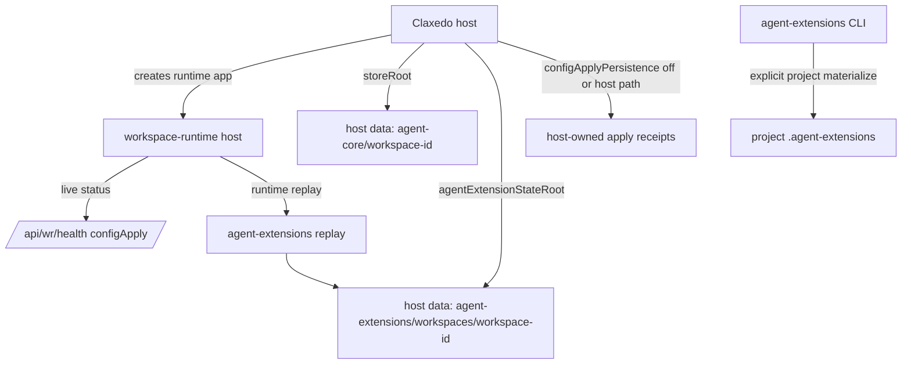

# refactor: Move runtime state out of source

## Overview

Claxedo runtime config apply currently writes local operational state into the target workspace checkout. The noisy files are `.workspace-runtime/runtime-config/accepted-snapshot.json`, `.workspace-runtime/runtime-config/apply-status.json`, and `.agent-extensions/materialized.json`. The runtime apply status files are observability receipts, while the Agent Extensions materialized record is an ownership ledger for generated skills, MCP entries, plugins, and hooks.

This plan separates those concerns. Runtime observability should live in memory and, when a host asks for durable receipts, in a host-owned state directory. Agent Extension ownership should remain durable, but runtime replay should use a host-supplied state root instead of defaulting to project source. Direct CLI project materialization remains project-local because the user explicitly invoked project materialization.

## Problem Frame

Developers see runtime-generated JSON files changing every few seconds in source control. The files include revision counters, timestamps, and absolute paths from the local machine, so they are not meaningful source artifacts. Repeated config fan-out or runtime sync churns the files even when the effective runtime config has not changed.

The underlying behaviors still matter:

- Runtime config apply needs observable status for diagnostics.
- Agent Extensions need a durable ownership ledger to avoid overwriting unmanaged user files and to remove stale owned artifacts safely.
- Hosts need control over where package/runtime state is written.

## Requirements Trace

- R1. Local embedded Claxedo runtimes must not write config apply receipts into the project checkout by default.
- R2. Runtime config apply status must remain observable through host APIs such as `/api/wr/health`.
- R3. Hosts must be able to opt into durable config apply receipts and choose the directory where receipts are written.
- R4. Runtime replay of Agent Extensions must use host-owned state when the host supplies it.
- R5. Direct `agent-extensions` CLI workflows must continue to support project-local `.agent-extensions` state.
- R6. Identical runtime config snapshots must not repeatedly bump revisions or rewrite state.
- R7. Package docs must tell integrators which generated paths to ignore when they opt into project-local state.

## Scope Boundaries

- This plan does not remove project-local Agent Extension materialization for explicit CLI usage.
- This plan does not change the target paths for generated skills, MCP configs, plugins, or hooks.
- This plan does not redesign credential fan-out or runtime snapshot contents.
- This plan does not make installers automatically edit a user's `.gitignore`.

## Context & Research

### Relevant Code and Patterns

- `packages/workspace-runtime/src/workspace/runtime.ts` owns `WorkspaceHostOptions`, config apply state, `persistRuntimeConfigApplyStatus`, and Agent Extension replay from runtime snapshots.
- `packages/workspace-runtime/src/server.ts` forwards server options to `createWorkspaceHost` and exposes `detail.configApply` through runtime health.
- `packages/agent-extensions/src/replay.ts` already accepts `ReplayOptions.stateRoot`, but defaults to `<project>/.agent-extensions`.
- `packages/agent-extensions/src/materialize.ts` reads `materialized.json` before materialization and uses it to remove stale owned components.
- `packages/agent-extensions/src/materialization.ts` uses the materialized record to distinguish owned/generated artifacts from unmanaged user files.
- `packages/claxedo-server/src/embedded-workspace-runtime.ts` already has a host-owned `storeRoot(ws)` under `dataDir()/agent-core/<workspaceId>`.
- `packages/claxedo-server/src/proxy.ts` already distinguishes embedded routes that can `skip` config sync from routes that require `sync`.

### Institutional Learnings

- No matching prior solution document was found in `docs/solutions/` during planning.

### External References

- Skipped. The relevant design is internal package ownership and host/runtime boundary work with strong local patterns.

## Key Technical Decisions

- Host-owned state is the default for Claxedo runtime replay: Claxedo knows the workspace id and data root, so it should decide where runtime state lives.
- Runtime config apply receipts become optional persistence: the in-memory `configApply` state is already the primary observable status for live local runtimes.
- Agent Extension replay keeps its current explicit `stateRoot` capability, but workspace-runtime must expose a host option and pass it through.
- Direct CLI behavior stays source-adjacent by default because CLI commands such as `agent-extensions materialize` are intentional project operations.
- Idempotency belongs in workspace-runtime apply, not only in gitignore, because unnecessary apply cycles can restart adapters, rewrite ownership records, and create needless churn even outside git.

## Open Questions

### Resolved During Planning

- Should local embedded runtimes persist config apply receipt files into the checkout? No. The live runtime exposes `configApply` through health/detail, and tests already prove `config: "skip"` can leave the workspace untouched.
- Is `.agent-extensions/materialized.json` purely diagnostic? No. It is an ownership ledger used to prevent unmanaged overwrites and remove stale generated artifacts.
- Should packages silently edit `.gitignore` on install? No. They should document the paths and optionally provide explicit doctor/write-helper behavior later.

### Deferred to Implementation

- Exact option names should be finalized while editing the TypeScript surface, but the semantics must remain host-selected config receipt persistence and host-selected Agent Extension state root.
- The canonical snapshot equality implementation should be finalized during implementation based on existing normalization helpers and test ergonomics.

## High-Level Technical Design

> *This illustrates the intended approach and is directional guidance for review, not implementation specification. The implementing agent should treat it as context, not code to reproduce.*



## Implementation Units

- [ ] **Unit 1: Add workspace-runtime host state options**

**Goal:** Let hosts decide whether config apply receipts are persisted and where Agent Extension runtime state is stored.

**Requirements:** R1, R2, R3, R4

**Dependencies:** None

**Files:**
- Modify: `packages/workspace-runtime/src/workspace/runtime.ts`
- Modify: `packages/workspace-runtime/src/server.ts`
- Test: `packages/workspace-runtime/src/workspace/runtime.test.ts`
- Test: `packages/workspace-runtime/src/server.test.ts`

**Approach:**
- Extend `WorkspaceHostOptions` with host-owned state controls for config apply receipt persistence and Agent Extension replay state root.
- Forward matching server options from `WorkspaceRuntimeServerOptions` into `createWorkspaceHost`.
- Make config apply receipt persistence optional. When disabled, keep updating in-memory `configApply` without writing `accepted-snapshot.json` or `apply-status.json`.
- When enabled with a directory, write receipts to that host-selected directory instead of deriving `.workspace-runtime/runtime-config` from the workspace directory.
- Pass the host-selected Agent Extension state root into `applyRuntimeAgentExtensions`.

**Patterns to follow:**
- `storeRoot` option propagation from `WorkspaceRuntimeServerOptions` to `createWorkspaceHost`.
- Existing in-memory `configApply` exposure through `host.detail()`.
- Existing `ReplayOptions.stateRoot` in `packages/agent-extensions/src/replay.ts`.

**Test scenarios:**
- Happy path: applying runtime config with receipt persistence disabled updates `host.detail().configApply` and creates no `.workspace-runtime/runtime-config` files in the workspace.
- Happy path: applying runtime config with a host receipt directory writes `accepted-snapshot.json` and `apply-status.json` under that directory.
- Happy path: applying runtime config with an Agent Extension state root writes `.agent-extensions` replay state under the supplied root, while generated target artifacts still materialize into the intended harness locations.
- Error path: when receipt persistence is enabled and writing the host directory fails, runtime apply reports the existing `runtime_config_apply_status_persist_failed` style failure.
- Integration: `createWorkspaceRuntimeApp` forwards the new options into `createWorkspaceHost`.

**Verification:**
- Local default runtime apply can be observed via health/detail without creating project checkout receipt files.
- Explicit persistence still produces redacted receipt files for hosts that need durable diagnostics.

- [ ] **Unit 2: Make config apply idempotent**

**Goal:** Avoid re-applying identical snapshots and rewriting state when runtime config fan-out repeats without effective changes.

**Requirements:** R6

**Dependencies:** Unit 1

**Files:**
- Modify: `packages/workspace-runtime/src/workspace/runtime.ts`
- Test: `packages/workspace-runtime/src/workspace/runtime.test.ts`

**Approach:**
- Track the last accepted normalized snapshot signature inside `createWorkspaceHost`.
- Compare incoming normalized snapshots using a stable canonical representation that excludes volatile apply metadata.
- If the snapshot is identical and no force option exists, return successfully without bumping `configApplyRevision`, without rewriting receipt files, without re-materializing auth/Agent Extensions, and without calling adapter `applyConfig`.
- Preserve current behavior for materially different snapshots, invalid snapshots, unsafe ACP live config changes, and failure paths.

**Patterns to follow:**
- Existing `sameRuntimeAuth` and `sameRuntimeMcp` comparisons.
- Existing apply queue behavior around concurrent applies.

**Test scenarios:**
- Happy path: applying the same snapshot twice leaves `configApply.revision` unchanged after the second apply.
- Happy path: applying an equivalent normalized snapshot with keys in a different object order is treated as identical if canonicalization supports it.
- Happy path: applying a changed harness/model/MCP/auth/extensions snapshot increments revision and runs the normal apply path.
- Integration: repeated same-snapshot applies do not call Agent Extension replay twice.
- Edge case: a failed apply does not poison the last accepted signature; retrying the same snapshot after failure still attempts apply.

**Verification:**
- Repeated fan-out no longer churns apply status or materialized timestamps when the effective runtime snapshot is unchanged.

- [ ] **Unit 3: Move Claxedo embedded local state under host data**

**Goal:** Configure local embedded Claxedo runtimes to keep runtime state outside the workspace checkout by default.

**Requirements:** R1, R3, R4

**Dependencies:** Unit 1

**Files:**
- Modify: `packages/claxedo-server/src/embedded-workspace-runtime.ts`
- Modify: `packages/claxedo-server/src/workspace-runtime-integration/runtime-config.ts`
- Test: `packages/claxedo-server/src/embedded-workspace-runtime.test.ts`
- Test: `packages/claxedo-server/src/agent-extensions/runtime-config.test.ts`

**Approach:**
- Add small local path helpers near `storeRoot(ws)` for host-owned runtime apply receipts and Agent Extension replay state.
- Pass those paths into `createWorkspaceRuntimeApp` for embedded local workspaces.
- Keep `workspaceDir` in the runtime snapshot because target artifacts still need to be materialized relative to the workspace.
- Update tests that currently assert local `.workspace-runtime/runtime-config/apply-status.json` exists; the new assertion should prove the workspace stays clean and the host-owned state path receives any explicitly enabled durable state.

**Patterns to follow:**
- `storeRoot(ws)` in `embedded-workspace-runtime.ts`.
- `dataDir()` based local state layout already used by Claxedo server.

**Test scenarios:**
- Happy path: `ensureEmbeddedWorkspaceRuntime(..., { config: "sync" })` applies config but does not create `.workspace-runtime/runtime-config` in the project.
- Happy path: embedded runtime Agent Extension replay records ownership under the Claxedo data directory.
- Integration: `syncEmbeddedWorkspaceRuntimes()` uses the same host-owned state locations when reconfiguring cached runtimes.
- Edge case: moving a workspace id to a new directory still disposes the cached runtime and creates state for the new workspace without reusing the old workspace checkout paths.

**Verification:**
- Running the local app no longer causes project checkout JSON files to churn for embedded runtime config sync.

- [ ] **Unit 4: Preserve and document explicit project-local Agent Extension workflows**

**Goal:** Keep CLI/project materialization usable while making the runtime replay boundary explicit.

**Requirements:** R4, R5, R7

**Dependencies:** Units 1 and 3

**Files:**
- Modify: `packages/agent-extensions/src/replay.ts`
- Modify: `packages/agent-extensions/README.md`
- Modify: `packages/claxedo-docs/packages/agent-extensions.mdx`
- Test: `packages/agent-extensions/src/replay.test.ts`
- Test: `packages/agent-extensions/src/cli.test.ts`

**Approach:**
- Keep the existing `ReplayOptions.stateRoot` behavior.
- Tighten docs around default behavior: direct CLI project materialization may use `<project>/.agent-extensions`; host/runtime integrations should pass `stateRoot`.
- Add or update tests that prove explicit `stateRoot` works as the host integration contract.
- Avoid breaking CLI flags such as `--runtime-dir`.

**Patterns to follow:**
- Existing CLI `--runtime-dir` behavior in `packages/agent-extensions/src/cli.ts`.
- Existing package docs that describe `--cache-dir` and `--runtime-dir`.

**Test scenarios:**
- Happy path: direct replay without `stateRoot` keeps current project-local behavior for compatibility.
- Happy path: replay with `stateRoot` writes desired, lock, cache, and materialized ownership state under the supplied root.
- Integration: CLI `materialize --runtime-dir` still reports the selected state path and materializes expected components.

**Verification:**
- Package consumers have a stable migration path without breaking explicit project-local workflows.

- [ ] **Unit 5: Update repo hygiene and installer guidance**

**Goal:** Prevent current and future generated state from being staged accidentally and tell integrators how to handle opt-in project-local state.

**Requirements:** R7

**Dependencies:** Units 1 through 4

**Files:**
- Modify: `.gitignore`
- Modify: `packages/workspace-runtime/README.md`
- Modify: `packages/workspace-runtime/docs/agent.md`
- Modify: `packages/claxedo-docs/packages/workspace-runtime.mdx`
- Modify: `packages/claxedo-docs/packages/agent-extensions.mdx`

**Approach:**
- Add narrow ignore patterns for generated local state without ignoring source-worthy `.workspace-runtime/processes.jsonc` style files.
- Document that hosts should pass explicit state directories and that project-local generated dirs should be ignored when used.
- Include a copy-paste `.gitignore` snippet for users who intentionally choose project-local state.
- Note that packages do not mutate `.gitignore` automatically; any helper should be explicit and opt-in.

**Patterns to follow:**
- Existing `.gitignore` sections for Claxedo runtime data and generated artifacts.
- Existing docs style in package reference pages.

**Test scenarios:**
- Documentation-only unit; no automated tests required beyond docs review.

**Verification:**
- `git status` does not show local runtime receipts or Agent Extension state after ordinary local runtime sync.
- Docs clearly explain the generated state contract for host integrators and CLI users.

## System-Wide Impact

- **Interaction graph:** Config fan-out calls in `claxedo-server` continue to call runtime apply; workspace-runtime decides whether apply is a no-op and where state is persisted.
- **Error propagation:** Persisted receipt write failures matter only when persistence is enabled. In-memory `configApply` remains available for live diagnostics.
- **State lifecycle risks:** Moving the Agent Extension ownership ledger changes cleanup behavior if the wrong state root is used. Claxedo must use a stable workspace-id keyed state root so disable/uninstall can see prior ownership.
- **API surface parity:** `createWorkspaceRuntimeApp` and `createWorkspaceHost` need matching options. Runtime package docs and Claxedo integration docs must describe the same host-owned state model.
- **Integration coverage:** Tests must cover host option propagation from server construction through runtime apply and Agent Extension replay.
- **Unchanged invariants:** Generated target artifacts still land in runner-native target paths. Direct CLI project materialization still works. Runtime snapshots remain redacted before persistence.

## Risks & Dependencies

| Risk | Mitigation |
|------|------------|
| Agent Extension cleanup loses ownership history after state-root migration | Use a stable host-owned state path keyed by workspace id and add tests for disable/replay cleanup through that path |
| Cloud/sandbox diagnostics lose durable apply receipts | Keep opt-in receipt persistence with a host-selected directory |
| Idempotency skips needed adapter reconfiguration | Compare normalized snapshots carefully and add tests for changed auth, MCP, model, harness, and extensions |
| Backward compatibility breaks direct package users | Preserve default `applyRuntimeAgentExtensions(..., projectDir)` behavior and CLI `--runtime-dir` |
| `.gitignore` hides source-worthy workspace files | Ignore only `.workspace-runtime/runtime-config/` and `.agent-extensions/`, not all `.workspace-runtime/` |

## Documentation / Operational Notes

- Package docs should tell host integrators to pass host-owned state directories.
- User-facing install docs should include this opt-in project-local ignore snippet:

```gitignore
.agent-extensions/
.workspace-runtime/runtime-config/
```

- The docs should explain that packages do not automatically edit `.gitignore`; users or host applications opt in explicitly.

## Sources & References

- Related code: `packages/workspace-runtime/src/workspace/runtime.ts`
- Related code: `packages/workspace-runtime/src/server.ts`
- Related code: `packages/agent-extensions/src/replay.ts`
- Related code: `packages/agent-extensions/src/materialize.ts`
- Related code: `packages/agent-extensions/src/materialization.ts`
- Related code: `packages/claxedo-server/src/embedded-workspace-runtime.ts`
- Related code: `packages/claxedo-server/src/proxy.ts`
