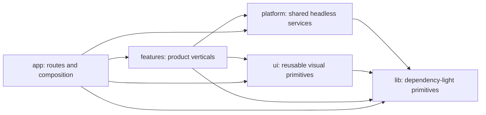

# refactor(app): Establish domain-owned source architecture

## Overview

Reorganize `packages/claxedo-app/src/` around product ownership and dependency direction. The target source tree has six architectural roots:

- `app/` owns boot, routes, provider composition, workbench composition, and cross-feature integration.
- `features/` owns complete user-facing verticals, including their state, data adapters, UI, and colocated tests.
- `platform/` owns headless application services shared by multiple features.
- `ui/` owns reusable visual primitives with no product-domain ownership.
- `lib/` owns dependency-light language and browser primitives.
- `architecture/` owns guards, baselines, migration manifests, and shared test infrastructure.

Resource files and ambient declarations live under their owning root when the toolchain permits it. Toolchain-required ambient declarations may remain directly under `src/`.

The migration preserves application behavior, URL contracts, persisted data, query keys, event-writer ownership, lazy-loading boundaries, and test-runner semantics. It proceeds one ownership boundary at a time, with architecture ratchets proving that each completed move reduces the legacy surface.

## Problem Frame

The current tree has 21 top-level directories and combines three incompatible classification schemes:

- technical layers such as `context/`, `shared/`, `components/`, and `pages/`;
- product domains such as `session/`, `terminal/`, `browser/`, and `marketplace/`;
- lineage boundaries such as `components/` versus `claxedo-ui/`.

As a result, a single product concept can span several roots. Session behavior currently appears in `session/`, `session-client/`, `pages/session/`, `components/session/`, `components/prompt-input/`, `shell/chat/`, `shell/data/`, `context/`, and `claxedo-ui/`. Terminal behavior spans `terminal/`, `context/terminal.tsx`, `components/terminal*.tsx`, and `claxedo-ui/terminal/`. The current `shell/` root owns both app composition and headless domain services, while `shared/data` and `shell/data` express distinct architectures through nearly identical names.

The architecture guards make this refactor tractable, but the current top-level cycle ratchet records 24 legacy bidirectional relationships and loses precision once multiple logical features move beneath a common `features/` root. The target therefore requires logical-owner enforcement, not only top-level-directory enforcement.

## Requirements Trace

- **R1 — Navigable ownership:** A contributor can determine the owner of new code from the product concept and dependency role, without knowing fork history.
- **R2 — Complete feature verticals:** Session, terminal, browser, extensions marketplace, processes, documents, review, and workspace surfaces each have one feature root for their domain behavior and UI.
- **R3 — Honest app boundary:** `app/` contains entry points, routes, workbench composition, and cross-feature assembly. A route module reads navigation state and delegates to a feature screen.
- **R4 — Honest platform boundary:** Shared identity, auth, transport, query, sync, runtime, files, i18n, notifications, and persistence services live under named `platform/` capabilities.
- **R5 — Reusable UI boundary:** `ui/` contains only visual building blocks reused across product features. Feature-specific widgets remain with their feature.
- **R6 — Enforced dependency direction:** The logical dependency graph is acyclic: `lib` is foundational; `platform` and `ui` depend on `lib`; `features` depend on `platform`, `ui`, and `lib`; `app` composes all of them.
- **R7 — Stable product behavior:** Existing URLs, route parsing, pane/tab restoration, persisted storage keys, query keys, SSE projection semantics, session identity, terminal lifecycle, and lazy chunk boundaries retain their contracts.
- **R8 — Incremental delivery:** Every migration wave reaches a complete ownership state, removes its superseded path, updates guard artifacts, and can land independently.
- **R9 — Test continuity:** Colocated tests move with their subjects and retain their Bun versus Vitest/browser execution semantics.
- **R10 — Legible special cases:** Demo mode, marketplace, process management, and the upstream session UI facade have names and locations that describe what they do.

## Scope Boundaries

- This plan changes source ownership and import structure. Product behavior changes are tracked as separate feature or fix work.
- The open cloud-pane URL synchronization behavior and the uncommitted Wave 4 fixes remain separate work. Migration coverage preserves their current behavior and does not use this refactor to redefine it.
- Public server protocols, generated clients, backend schemas, and package-level runtime architecture remain unchanged.
- Package extraction is out of scope. The new feature boundaries make a later extraction possible without requiring one now.
- Visual redesign, state-management replacement, routing-library replacement, and test-runner consolidation are out of scope.
- Existing size, accessibility, vocabulary, single-writer, and source-text ratchets remain active throughout the migration.

## Target Architecture

> *This illustrates the intended approach and is directional guidance for review, not implementation specification. The implementing agent should treat it as context, not code to reproduce.*

```text
src/
├── app/
│   ├── entry/                 # web/desktop boot and top-level App composition
│   ├── routes/                # URL-owning adapters only
│   ├── providers/             # provider ordering and app-wide composition
│   ├── workbench/             # pane, rail, chrome, route projection
│   ├── integrations/          # commands, contributions, feature registration
│   ├── demo/                  # alternate demo bootstrap, fixtures, tour controller
│   └── styles/
├── features/
│   ├── session/               # lifecycle, conversation, composer, timeline, UI
│   ├── terminal/              # terminal engine, provider, and surface UI
│   ├── browser/               # in-app browser vertical
│   ├── extensions/            # extension access plus marketplace surface
│   ├── processes/             # process client, state, diagnostics, and UI
│   ├── documents/             # Docs/Pages data, editor, and workbench surfaces
│   ├── review/                # review data and workspace UI
│   ├── workspaces/            # project/worktree/workspace user-facing flows
│   └── settings/              # settings sections and contribution surface
├── platform/
│   ├── identity/
│   ├── auth/
│   ├── api/
│   ├── query/
│   ├── sync/
│   ├── runtime/
│   ├── files/
│   ├── i18n/
│   ├── notifications/
│   └── persistence/
├── ui/
│   ├── controls/
│   ├── dialogs/
│   ├── files/
│   ├── feedback/
│   └── icons/
├── lib/
└── architecture/
```

### Dependency direction



`architecture/` statically observes the tree and is excluded from the production dependency graph. Feature-to-feature integration is assembled through `app/integrations/` using the existing command bus and contribution-registry patterns. A feature exports the smallest contract needed by composition; consumers do not import another feature's internal directories.

### Cross-boundary event assembly

The event plane retains one ingress/router and one cache writer per key family under `platform/sync/`. A feature owns the pure interpretation of its domain events and exposes that projector contract. `app/integrations/` supplies the feature projector to the platform sync registry during provider composition. Platform code invokes the registered contract without importing the feature, and the feature returns projection intent through the platform-owned writer contract rather than mutating shared query caches directly.

This keeps event semantics beside the feature, preserves the single-writer invariant, and maintains the declared dependency direction.

### Ownership rules

1. A file belongs to a feature when its name and behavior make sense only for that user-facing capability, even if it performs networking or renders UI.
2. A file belongs to `platform/` when two or more features consume a headless capability and the capability has an independent contract.
3. A file belongs to `ui/` when two or more features reuse a visual primitive without importing product state.
4. A file belongs to `app/` when it selects routes, orders providers, composes features into the workbench, or adapts a cross-feature event.
5. A file belongs to `lib/` when it is dependency-light and has no application-service or product vocabulary.
6. Solid providers are colocated with the capability they provide. Provider mechanics do not create a directory boundary.
7. Tests follow the production owner. Architecture and integration tests live with the boundary they prove.

## Current-to-Target Root Map

| Current root | Target owner |
|---|---|
| `agent-runtime/` | `platform/runtime/agent/` |
| `architecture/` | `architecture/` |
| `assets/` | owning capability, initially `platform/notifications/assets/` for `ios.mp3` |
| `browser/` | `features/browser/` |
| `claxedo-ui/` | distributed to `app/workbench/`, feature `ui/` directories, and reusable `ui/` primitives |
| `cloud/` | `platform/runtime/cloud/` for provisioning/runtime state; workspace-facing UI under `features/workspaces/` |
| `components/` | distributed to feature `ui/`, `app/workbench/`, and reusable `ui/` |
| `context/` | distributed to the owner of each provided capability; provider ordering remains in `app/providers/` |
| `demo/` | `app/demo/` |
| `extensions/` | `features/extensions/data/` |
| `i18n/` | `platform/i18n/` |
| `marketplace/` | `features/extensions/marketplace/` |
| `pages/` | URL adapters to `app/routes/`; session screen implementation to `features/session/ui/` |
| `pane/` | `app/workbench/preferences/` |
| `process/` | `features/processes/data/` |
| `session/` | `features/session/` |
| `session-client/` | upstream UI adapter at `features/session/ui/session-kit.ts` |
| `shared/` | shared infrastructure to `platform/api/` and `platform/query/`; domain clients to their feature |
| `shell/` | composition to `app/`; identity/auth/sync to `platform/`; conversation behavior to `features/session/` |
| `terminal/` | `features/terminal/core/` |
| `utils/` | primitives to `lib/`; capability-specific helpers to their platform or feature owner |

The migration manifest refines this table to one record per source file, with its target logical owner, implementation unit, target path, and migration status. A unit begins only when all in-scope production and test files have declared destinations. A completed unit removes its records after the ownership guard confirms that the source paths are absent; records for later units remain as the shrink-only backlog.

## Context & Research

### Relevant code and patterns

- `packages/claxedo-app/src/ARCHITECTURE.md` documents the current charters and confirms the 21-root topology.
- `packages/claxedo-app/src/architecture/layering.ts` and `layering.guard.test.ts` provide the existing shrink-only cycle-ratchet pattern.
- `packages/claxedo-app/src/architecture/layering-baseline.json` currently records 24 bidirectional top-level relationships; the logical-owner guard must replace this granularity before feature consolidation hides those relationships.
- `packages/claxedo-app/src/architecture/agents-md.guard.test.ts`, `orphan.guard.test.ts`, `single-writer.guard.test.ts`, and `app-route-spine.guard.test.ts` demonstrate repository-enforced documentation, ownership, and route invariants.
- `packages/claxedo-app/src/shell/contributions/command-bus.ts`, `registry.ts`, and `first-party-content-surfaces.tsx` provide the composition seam for independent feature surfaces.
- `packages/claxedo-app/src/browser/` demonstrates an existing vertical with UI, store, URL logic, and colocated behavior tests.
- `packages/claxedo-app/src/session/` and `docs/plans/2026-07-11-005-wp-d1-session-consolidation-move-map.md` provide the established additive-move and collision-analysis pattern.
- `docs/plans/2026-07-11-007-wp-d3-utils-dissolution-move-map.md` provides the established rule that helpers move to their domain owner while dependency-light primitives retain a small common home.
- `packages/claxedo-app/src/claxedo-ui/workbench/tests/` provides a comprehensive ordered behavior suite for pane layout, hydration, persistence, callbacks, reactivity, and collapse projection.
- `packages/claxedo-app/src/session-client/index.ts` is an upstream UI re-export facade rather than a session domain. Its target name describes that adapter directly.

### Institutional learnings

No matching `docs/solutions/` entries exist. The active architecture charter and the D1/D3/D5 move maps are the durable local references for this work.

### External references

External research is unnecessary for this plan. The change is governed by repository-specific ownership, import, route, query-cache, and event-writer constraints, and the repository contains direct patterns for each migration mechanism.

## Key Technical Decisions

- **Use `platform/`, not `core/`:** `platform/` is restricted to named, headless capabilities shared across features. This avoids recreating a generic catch-all.
- **Keep `app/` composition-only:** Workbench state and route projection belong here; session, terminal, documents, and other content behavior remain feature-owned.
- **Make features vertical:** Networking and provider code stay with a feature when they are meaningful only to that feature. Technical mechanism alone does not justify a global layer.
- **Retire `context/` as an ownership axis:** Each provider moves beside the state or service it exposes; `app/providers/` records composition order.
- **Retire `components/` and `claxedo-ui/` as lineage axes:** Reuse and product ownership determine destinations.
- **Treat workbench content as contributions:** The registry in `shell/contributions/` evolves into `app/integrations/`; feature surfaces register through explicit contracts and retain lazy imports.
- **Keep true routes small:** Full-screen routes remain URL owners. The session route delegates to the session feature while the workbench remains the mounted-screen owner.
- **Replace directory-level guarding with logical-owner guarding:** The scanner resolves boundaries such as `features/session` and `features/terminal`, so consolidation under `features/` cannot conceal cycles.
- **Use complete-wave cutovers:** Temporary compatibility exports are permitted only within an active wave and are removed before that wave lands. Persisted and wire compatibility keys remain where required by product contracts.
- **Preserve history and colocated tests:** Moves retain source/test pairs and update baselines in the same unit.

## Alternative Approaches Considered

- **Retain the current roots and improve charters:** This would document the present map but keep feature behavior split across layer and lineage boundaries. It does not satisfy navigable ownership or complete feature verticals.
- **Use only `app / core / features / ui`:** A broad `core/` would own primitives, transport, identity, sync, auth, and runtime together. Separating `platform/` from `lib/` gives both categories a testable admission rule.
- **Organize entirely by technical layer:** Global `data/`, `state/`, `providers/`, and `components/` roots make cross-cutting mechanisms visible but preserve the multi-root search cost for every product change.
- **Extract packages first:** Package boundaries would make imports explicit, but the current ownership ambiguity would be encoded into public package APIs. The source-tree refactor establishes boundaries that can later be extracted based on observed reuse.
- **Perform one repository-wide move:** A single cutover shortens coexistence but combines route, provider, cache, event, workbench, and UI risks into one review and rollback boundary. Domain-complete units provide smaller falsifiable changes.

## User and Migration Flows

### Flow 1: Contributor adds feature behavior

The contributor identifies the product capability, adds domain/data/UI code beneath that feature, and exports an explicit integration contract when app composition needs it. Shared extraction occurs only after a second feature demonstrates reuse.

### Flow 2: Contributor adds a route

The contributor adds a small adapter beneath `app/routes/`. It parses URL state, resolves the target feature contract, and composes route-level error/loading behavior. Reusable screen behavior remains in the feature.

### Flow 3: One migration wave lands

1. The move manifest assigns every in-scope source and test to a target owner.
2. The target owner and its charter are introduced.
3. Source/test pairs move together and importers change to the target contract.
4. Route, persistence, query, event-writer, and lazy-import invariants are evaluated for the moved slice.
5. Temporary forwarding paths are removed.
6. Architecture baselines shrink and the legacy-root manifest records the completed boundary.

### Flow 4: User opens a deep link during migration

The same route parser and route path resolve the same session/workspace identity. The route adapter delegates to the moved feature screen, and workbench state remains authoritative for mounted panes. Direct navigation, reload, back/forward, and restored-layout entry paths keep their current outcomes.

### Flow 5: Existing persisted state loads after a wave

Storage keys, serialized shapes, query keys, pane metadata, and session identity keys remain stable. Only module ownership changes, so existing state rehydrates into the same logical objects and mounted surfaces.

## Open Questions

### Resolved during planning

- **Should the target use four roots or retain more explicit concepts?** Use six architectural roots. `platform/` and `lib/` prevent `core/` from mixing shared services with primitives, while `architecture/` remains a first-class quality boundary.
- **Is `browser/` a page?** It is a workbench feature and moves to `features/browser/`.
- **Is marketplace a page?** It is the user-facing surface of extension management and moves under `features/extensions/marketplace/`.
- **Is process a page?** It is a feature with a headless relay client and several workbench surfaces; both move under `features/processes/`.
- **What is demo?** It is an alternate application bootstrap and guided-tour environment, so it moves to `app/demo/`.
- **What happens to `session-client/`?** Its single re-export file becomes the explicitly named upstream UI adapter `features/session/ui/session-kit.ts`.
- **Where does the current `pages/session/` implementation go?** Its workbench screen and timeline move to `features/session/ui/`; `app/routes/session.tsx` remains the URL adapter.
- **How do features integrate without importing each other deeply?** `app/integrations/` composes exported feature contracts through the existing command/contribution patterns.
- **Does the open URL-sync fix join this work?** It remains separate behavior work. Route-projection characterization tests protect the current contract during moves.

### Deferred to implementation

- **Exact final names for small reusable UI clusters:** Decide after feature-specific components have moved; observed reuse determines `ui/` placement.
- **Whether a handful of shared data clients are platform services or feature-owned:** Resolve from live importer counts in the per-wave manifest. A client with one domain owner follows that feature.
- **Toolchain-required root declarations:** Confirm which ambient files and CSS entry references can move without changing Vite/Electron packaging; record any required root exceptions in `ARCHITECTURE.md`.
- **Temporary adapter shape within a wave:** Choose the smallest form that keeps the wave reviewable; all temporary source-path adapters expire in the same wave.

## Implementation Units

### Phase 1 — Enforce the destination before moving code

- [ ] **Unit 1: Add logical ownership and migration ratchets**

**Goal:** Make the target dependency graph and shrinking legacy surface mechanically enforceable before directory consolidation begins.

**Requirements:** R1, R6, R8, R9

**Dependencies:** None

**Files:**

- Create: `packages/claxedo-app/src/architecture/ownership.ts`
- Create: `packages/claxedo-app/src/architecture/ownership.test.ts`
- Create: `packages/claxedo-app/src/architecture/ownership.guard.test.ts`
- Create: `packages/claxedo-app/src/architecture/migration-manifest.json`
- Modify: `packages/claxedo-app/src/architecture/layering.ts`
- Modify: `packages/claxedo-app/src/architecture/layering.guard.test.ts`
- Modify: `packages/claxedo-app/src/architecture/agents-md.guard.test.ts`
- Modify: `packages/claxedo-app/src/architecture/orphan.guard.test.ts`
- Modify: `packages/claxedo-app/src/ARCHITECTURE.md`
- Modify: `packages/claxedo-app/src/VOCABULARY.md`

**Approach:**

- Resolve a source path to a logical owner at the feature or platform-capability level, rather than only the first directory segment.
- Encode the allowed root graph and prohibit feature-internal imports from other features. App-owned integration modules are the declared cross-feature assembly seam.
- Seed a shrink-only migration manifest with every production and test file beneath a legacy root. Each record declares current path, target logical owner, implementation unit, target path, and status. Completed units remove records after source-path deletion; new unclassified legacy-root files fail the guard.
- Keep existing special guards active and teach path-sensitive guards to resolve old and new owners during an active wave.
- Add concise `AGENTS.md` charters when each target root first appears; the guard requires every production owner to have one.

**Execution note:** Add synthetic guard coverage before applying it to the live tree so failures distinguish scanner defects from real dependency debt.

**Patterns to follow:**

- `packages/claxedo-app/src/architecture/layering.ts`
- `packages/claxedo-app/src/architecture/debt-ratchet.guard.test.ts`
- `packages/claxedo-app/src/architecture/agents-md.guard.test.ts`

**Test scenarios:**

- Happy path: paths under `features/session/**` and `features/terminal/**` resolve to distinct logical owners even though they share a top-level root.
- Happy path: imports from `app` to a feature, from a feature to `platform`/`ui`/`lib`, and from `platform`/`ui` to `lib` pass.
- Error path: a feature deep-importing another feature is reported with source owner, target owner, and the allowed composition seam.
- Error path: adding a new file beneath a migrated legacy root fails the migration ratchet.
- Edge case: root ambient declarations are classified as documented toolchain exceptions rather than production owners.
- Integration: the logical-owner scan observes alias, relative, lazy dynamic, and type-only imports using the same resolver.

**Verification:** The target graph is documented and enforced without suppressing any existing architecture guard, and every current source file has either a logical owner or a documented migration classification.

### Phase 2 — Establish foundational and already-cohesive owners

- [ ] **Unit 2: Establish `lib/` and named platform capabilities**

**Goal:** Move shared headless foundations into explicit capability homes so later features depend on stable targets.

**Requirements:** R1, R4, R6, R8, R9

**Dependencies:** Unit 1

**Files:**

- Move: `packages/claxedo-app/src/utils/` primitives to `packages/claxedo-app/src/lib/`
- Move: query-client, persistence, key-registry, and genuinely cross-feature cache infrastructure from `packages/claxedo-app/src/shared/query/` to `packages/claxedo-app/src/platform/query/`; domain query modules remain assigned to their owning feature units in the manifest
- Move: shared HTTP foundations from `packages/claxedo-app/src/shared/data/` to `packages/claxedo-app/src/platform/api/`
- Move: `packages/claxedo-app/src/shell/identity/` to `packages/claxedo-app/src/platform/identity/`
- Move: `packages/claxedo-app/src/shell/auth/` and its owning providers/clients to `packages/claxedo-app/src/platform/auth/`
- Move: `packages/claxedo-app/src/agent-runtime/` to `packages/claxedo-app/src/platform/runtime/agent/`
- Move: `packages/claxedo-app/src/cloud/` headless runtime state to `packages/claxedo-app/src/platform/runtime/cloud/`
- Move: `packages/claxedo-app/src/i18n/` and `packages/claxedo-app/src/context/language.tsx` to `packages/claxedo-app/src/platform/i18n/`
- Move: `packages/claxedo-app/src/context/file.tsx` and `packages/claxedo-app/src/context/file/` to `packages/claxedo-app/src/platform/files/`
- Move: notification helpers, provider, and sound asset to `packages/claxedo-app/src/platform/notifications/`
- Test: colocated tests currently under each moved directory, including `shell/identity/*.test.ts`, `shell/auth/*.test.ts`, `agent-runtime/*.test.ts`, `shared/query/*.test.ts`, `context/file/*.test.ts`, and `i18n/locale-parity.test.ts`
- Modify: `packages/claxedo-app/tsconfig.json`
- Modify: `packages/claxedo-app/vite.config.ts`
- Modify: affected manifests and baselines under `packages/claxedo-app/src/architecture/`

**Approach:**

- Use the completed D3 classification as the starting point for `lib/`: capability-specific helpers follow their capability, while dependency-light primitives form the final common library.
- Split `shared/data/` by ownership before moving it. Base HTTP, health, credentials, and broadly shared wire behavior become platform API services; session, document, arena, and workspace-specific clients move with their feature in later units.
- Preserve nominal identity brands and their sanctioned minting points while changing module paths.
- Keep API response shapes, query keys, persistence keys, and runtime route builders unchanged.
- Move provider implementations with their service; leave only provider ordering for Unit 7.

**Execution note:** Use characterization-first coverage for persistence, query-key, identity, auth-session, and runtime-route contracts.

**Patterns to follow:**

- `docs/plans/2026-07-11-007-wp-d3-utils-dissolution-move-map.md`
- `docs/plans/2026-07-11-003-wp-d5-workspace-directory-split-design.md`
- `packages/claxedo-app/src/agent-runtime/AGENTS.md`

**Test scenarios:**

- Happy path: nominal `DirectoryRef`, `WorkspaceId`, `SessionRef`, and route round-trips produce identical values after the move.
- Happy path: query keys and persisted-query restoration use the same serialized keys.
- Error path: auth and runtime request failures retain their current typed/error outcomes.
- Edge case: legacy persistence and compatibility keys remain readable from existing browser storage.
- Integration: cloud and local runtime placement select the same transports and route URLs for equivalent session references.
- Integration: locale manifests and UI translation bridging expose the same locale set and keys.

**Verification:** `platform/` capabilities are independently chartered, `lib/` has no feature or app imports, and the corresponding legacy roots shrink in the migration manifest.

- [ ] **Unit 3: Move cohesive leaf verticals into `features/`**

**Goal:** Prove the vertical-feature convention on bounded domains before migrating session and terminal.

**Requirements:** R1, R2, R6, R8, R9, R10

**Dependencies:** Units 1–2

**Files:**

- Move: `packages/claxedo-app/src/browser/` to `packages/claxedo-app/src/features/browser/`
- Move: `packages/claxedo-app/src/extensions/` to `packages/claxedo-app/src/features/extensions/data/`
- Move: `packages/claxedo-app/src/marketplace/` to `packages/claxedo-app/src/features/extensions/marketplace/`
- Move: `packages/claxedo-app/src/process/` to `packages/claxedo-app/src/features/processes/data/`
- Move: process-specific files from `packages/claxedo-app/src/claxedo-ui/context/`, `claxedo-ui/state/`, `claxedo-ui/workspace-panel/`, and `claxedo-ui/components/process-diagnostics/` to `packages/claxedo-app/src/features/processes/`
- Test: `packages/claxedo-app/src/browser/components/browser-address-bar.test.ts`
- Test: `packages/claxedo-app/src/browser/store/browser-history.test.ts`
- Test: `packages/claxedo-app/src/browser/store/browser-comments.test.ts`
- Test: `packages/claxedo-app/src/marketplace/install-flow.test.ts`
- Test: `packages/claxedo-app/src/marketplace/confirm-dialog.test.ts`
- Test: `packages/claxedo-app/src/process/process.test.ts`
- Test: `packages/claxedo-app/src/process/client.relay.test.ts`
- Test: `packages/claxedo-app/src/claxedo-ui/workspace-panel/process-pane-panel.vitest.tsx`

**Approach:**

- Preserve browser as a self-contained vertical and use its internal model/store/UI split as a template where useful.
- Treat marketplace as the UI surface of extension management, with catalog/install data beneath the same feature.
- Bring the process relay client, schemas, ownership state, diagnostics, and workbench widgets into one feature.
- Export feature surface contracts for later registration by `app/integrations/`; retain current lazy-loading behavior.

**Patterns to follow:**

- `packages/claxedo-app/src/browser/AGENTS.md`
- `packages/claxedo-app/src/marketplace/AGENTS.md`
- `packages/claxedo-app/src/process/AGENTS.md`

**Test scenarios:**

- Happy path: browser navigation, normalized URLs, history persistence, and comment stores behave identically.
- Happy path: extension catalog filtering and installation produce the same requests and confirmation flow.
- Error path: malformed marketplace payloads and relay failures retain their validation/error behavior.
- Edge case: process ownership survives pane close/reopen and restored layouts.
- Integration: each feature surface remains discoverable through the contribution registry without direct imports from another feature.

**Verification:** The three feature roots are complete verticals, their old roots are removed, and their contracts can be registered without importing internal modules.

### Phase 3 — Consolidate the large product domains

- [ ] **Unit 4: Consolidate the session feature**

**Goal:** Give session lifecycle, conversation, composer, timeline, harness selection, and session UI one domain root while retaining a small route adapter.

**Requirements:** R2, R3, R6, R7, R8, R9, R10

**Dependencies:** Units 1–3

**Files:**

- Move: `packages/claxedo-app/src/session/` to `packages/claxedo-app/src/features/session/`
- Move: `packages/claxedo-app/src/shell/chat/` to `packages/claxedo-app/src/features/session/conversation/`
- Move: `packages/claxedo-app/src/pages/session/` to `packages/claxedo-app/src/features/session/ui/`
- Split: `packages/claxedo-app/src/pages/session.tsx` into `packages/claxedo-app/src/app/routes/session.tsx` and a feature-owned screen under `packages/claxedo-app/src/features/session/ui/`
- Move: `packages/claxedo-app/src/components/prompt-input/` to `packages/claxedo-app/src/features/session/composer/ui/`
- Move: `packages/claxedo-app/src/components/session/` to `packages/claxedo-app/src/features/session/ui/components/`
- Move: `packages/claxedo-app/src/claxedo-ui/harness/` to `packages/claxedo-app/src/features/session/harness/`
- Move: session-specific providers from `packages/claxedo-app/src/context/` and `packages/claxedo-app/src/claxedo-ui/context/` to `packages/claxedo-app/src/features/session/providers/`
- Move: session content renderers and session-specific navigation/actions from `packages/claxedo-app/src/claxedo-ui/` to the feature
- Move: session-specific API/query helpers from `packages/claxedo-app/src/shared/` and projectors from `packages/claxedo-app/src/shell/data/` to the owner selected by the single-writer contract
- Replace: `packages/claxedo-app/src/session-client/index.ts` with `packages/claxedo-app/src/features/session/ui/session-kit.ts`
- Test: all colocated suites currently under `session/`, `pages/session/`, `components/prompt-input/`, `components/session/`, `shell/chat/`, and session-specific `claxedo-ui/` paths
- Modify: `packages/claxedo-app/src/architecture/session-boundary.guard.test.ts`
- Modify: `packages/claxedo-app/src/architecture/session-client-reactivity.guard.test.ts`
- Modify: `packages/claxedo-app/src/architecture/model-key.guard.test.ts`
- Modify: `packages/claxedo-app/src/architecture/composer-mode.guard.test.ts`

**Approach:**

- Preserve the established internal domains `store/`, `submit/`, `composer/`, `harness/`, and `commands/` from D1.
- Add explicit `conversation/`, `data/`, `providers/`, and `ui/` homes rather than recreating global technical layers.
- Keep event ingress, routing, and cache writing under `platform/sync/`. The session feature owns pure session-event interpretation, `app/integrations/` supplies that projector at composition time, and projection results flow through the platform-owned writer contract.
- Keep the route adapter responsible for URL parameters and route errors; the workbench session screen owns timeline/composer behavior.
- Preserve `session-view-key`, `SessionRef`, prompt-scope, model-selection, and harness-reprobe semantics.
- Name the upstream UI facade for its purpose and keep it private to the session feature unless reuse is demonstrated.

**Execution note:** Characterize direct navigation, restored panes, prompt submission, harness selection, and session switching before moving their owners.

**Patterns to follow:**

- `docs/plans/2026-07-11-005-wp-d1-session-consolidation-move-map.md`
- `packages/claxedo-app/src/shell/chat/session-conversation-owner.test.ts`
- `packages/claxedo-app/src/pages/session/group-navigate-route.test.ts`
- `packages/claxedo-app/src/session/store/session-switch-race.test.ts`

**Test scenarios:**

- Happy path: direct session URLs, workbench selection, restored layout, and session switching select the same `SessionRef` and view key.
- Happy path: new and existing session submissions traverse the same prepare/send/pending/post-submit stages and retain draft rollback behavior.
- Happy path: harness selection and reprobe transition from connecting to the same ready/error state.
- Edge case: rapid session switches retain the existing race guarantees and do not leak messages or prompt state between sessions.
- Edge case: forked sessions retain distinct prompt caches through canonical session view keys.
- Error path: failed session creation, transport failure, permission denial, and invalid deep links render the same recovery state.
- Integration: SSE conversation events update the same cache writer and render the same timeline without duplicate projection.
- Integration: queue/steer/follow-up docks and keyboard commands target the active pane/session after route and directory moves.

**Verification:** All session-specific behavior has one logical owner, the URL route is a small app adapter, `session-client/` is removed, and session architecture guards express feature-level boundaries.

- [ ] **Unit 5: Consolidate the terminal feature**

**Goal:** Unite the terminal engine, provider state, pane integration, and UI beneath one feature root.

**Requirements:** R2, R6, R7, R8, R9

**Dependencies:** Units 1–4

**Files:**

- Move: `packages/claxedo-app/src/terminal/` to `packages/claxedo-app/src/features/terminal/core/`
- Move: `packages/claxedo-app/src/context/terminal.tsx` and terminal context support/tests to `packages/claxedo-app/src/features/terminal/providers/`
- Move: `packages/claxedo-app/src/components/terminal.tsx` and `components/terminal-*` modules/tests to `packages/claxedo-app/src/features/terminal/ui/`
- Move: `packages/claxedo-app/src/claxedo-ui/terminal/` to `packages/claxedo-app/src/features/terminal/workbench/`
- Move: terminal-specific content renderers, navigation helpers, state, and utilities from `packages/claxedo-app/src/claxedo-ui/` to the feature
- Move: terminal-specific helpers from `packages/claxedo-app/src/utils/` and settings sections from `packages/claxedo-app/src/components/settings/` to the feature
- Test: all suites currently under `terminal/`, terminal-specific `context/`, `components/`, and `claxedo-ui/` paths
- Modify: `packages/claxedo-app/src/architecture/osc-responder.guard.test.ts`

**Approach:**

- Preserve the terminal core's tested module boundaries and integration-suite convention.
- Treat xterm as the feature's backend adapter and keep the `#terminal-backend` alias pointed at its moved owner until a direct feature import is safe.
- Keep pane mounting, focus, resize, relay lifecycle, clone recovery, and zombie cleanup under one feature contract.
- Export a terminal workbench surface and commands for registration in `app/integrations/`.

**Execution note:** Characterize lifecycle and focus behavior before moving provider or pane adapters; retain the current integration tests as the primary proof.

**Patterns to follow:**

- `packages/claxedo-app/src/terminal/integration/`
- `packages/claxedo-app/src/claxedo-ui/terminal/pane-terminal-recovery.test.ts`
- `packages/claxedo-app/src/components/terminal-restore.test.ts`

**Test scenarios:**

- Happy path: create, attach, type, resize, detach, restore, and close preserve stream and geometry behavior.
- Edge case: pane switching and split resizing preserve focus and avoid duplicate paste/input delivery.
- Edge case: cloned terminals, zombie sessions, and relay reconnects clean up exactly once.
- Error path: backend creation and relay failures reach the same visible recovery/error state.
- Integration: restored workbench tabs reconnect the terminal provider and render buffered output without duplicate listeners.
- Integration: link parsing and file/URL providers keep the same activation behavior.

**Verification:** Terminal code has one feature owner, its integration suite remains colocated, and app/workbench code depends only on the feature surface contract.

- [ ] **Unit 6: Consolidate workbench content features**

**Goal:** Give documents, review, workspaces, and settings explicit vertical owners before reorganizing the app workbench itself.

**Requirements:** R1, R2, R5, R6, R7, R8, R9

**Dependencies:** Units 1–5

**Files:**

- Move: `packages/claxedo-app/src/claxedo-ui/components/page-editor/` and document-specific content renderers/actions/API clients to `packages/claxedo-app/src/features/documents/`
- Move: `packages/claxedo-app/src/claxedo-ui/components/review-workspace/`, review state, and review-specific shell modules to `packages/claxedo-app/src/features/review/`
- Move: workspace/project/worktree user-facing logic from `packages/claxedo-app/src/claxedo-ui/workspace-panel/`, `claxedo-ui/layout-actions/`, `shell/workspace/`, `context/layout-projects.ts`, and workspace-specific shared clients to `packages/claxedo-app/src/features/workspaces/`
- Move: `packages/claxedo-app/src/components/settings/` and settings contribution logic to `packages/claxedo-app/src/features/settings/`
- Move: product-specific `pages-api.ts` and `arena-api.ts` clients to their owning feature roots, creating a separate arena feature if its importer inventory proves independent ownership
- Test: colocated page-editor, review-workspace, workspace-panel, layout-action, and settings suites

**Approach:**

- Keep document editor behavior, document transport, and document content renderers together.
- Keep review data and UI together while exposing a lazy workbench surface.
- Separate user-facing workspace/project/worktree flows from platform runtime placement and identity. The feature consumes the branded platform contracts.
- Let each settings section be owned by the feature it configures; `features/settings/` owns the settings shell and cross-feature section registry.
- Register content surfaces and settings sections through app integration contracts.

**Patterns to follow:**

- `packages/claxedo-app/src/shell/contributions/first-party-content-surfaces.tsx`
- `packages/claxedo-app/src/claxedo-ui/components/page-editor/`
- `packages/claxedo-app/src/claxedo-ui/components/review-workspace/`
- `packages/claxedo-app/src/shell/workspace/AGENTS.md`

**Test scenarios:**

- Happy path: document tabs load, edit, persist, and restore with the same IDs and optimistic update behavior.
- Happy path: review surfaces retain selection, diff grouping, comments, and mount retention across pane switches.
- Happy path: workspace panels list files/processes and preserve open/close and target state.
- Edge case: narrow viewport collapse and restored workbench layouts retain the same hidden/active surface behavior.
- Error path: document/review/workspace client failures render the same retry or unavailable states.
- Integration: content and settings registries discover each moved feature through lazy contracts without deep feature imports.

**Verification:** Every workbench content type has a feature owner and exported surface contract; platform runtime remains headless and separate from workspace UI.

### Phase 4 — Rebuild composition and finish the topology

- [ ] **Unit 7: Establish app routes, providers, demo, and integration assembly**

**Goal:** Move boot and route ownership into `app/`, colocate provider composition, and convert the contribution registry into the explicit feature assembly boundary.

**Requirements:** R3, R6, R7, R8, R9, R10

**Dependencies:** Units 1–6

**Files:**

- Move: `packages/claxedo-app/src/app.tsx`, `main.tsx`, `index.tsx`, and `desktop-menu.ts` to `packages/claxedo-app/src/app/entry/`
- Move: true route modules from `packages/claxedo-app/src/pages/` to `packages/claxedo-app/src/app/routes/`
- Move: `packages/claxedo-app/src/demo/` to `packages/claxedo-app/src/app/demo/`
- Move: remaining app-wide provider composition from `packages/claxedo-app/src/context/` to `packages/claxedo-app/src/app/providers/`
- Move: `packages/claxedo-app/src/shell/contributions/` to `packages/claxedo-app/src/app/integrations/`
- Move: shell boot, connection gate, top-level layout composition, and route-sync modules from `packages/claxedo-app/src/shell/` to `packages/claxedo-app/src/app/`
- Move: `packages/claxedo-app/src/index.css` and app-shell CSS to `packages/claxedo-app/src/app/styles/`
- Test: `packages/claxedo-app/src/architecture/app-route-spine.guard.test.ts`
- Test: route, contribution-registry, connection, demo-origin, and provider-order suites currently colocated with moved subjects
- Modify: package/Vite/Electron entry references that point at moved entry modules

**Approach:**

- Keep `app/entry` responsible for environment boot and top-level application construction.
- Keep `app/routes` limited to URL ownership, lazy loading, route-level access gates, and error/loading boundaries.
- Move provider implementations to their owning feature/platform unit; `app/providers` owns only deterministic composition order and bridge adapters.
- Evolve first-party content registration so app imports feature public contracts and preserves the current lazy chunk boundaries.
- Keep demo fixtures and tour-origin security beneath the alternate demo bootstrap.
- Preserve route strings and all parse/format helpers; module paths change without URL changes.

**Execution note:** Characterize provider order, route table, deep links, demo origin checks, and lazy surface loading before changing entry imports.

**Patterns to follow:**

- `packages/claxedo-app/src/app.tsx`
- `packages/claxedo-app/src/architecture/app-route-spine.guard.test.ts`
- `packages/claxedo-app/src/shell/contributions/registry.ts`
- `packages/claxedo-app/src/demo/tour-origin.test.ts`

**Test scenarios:**

- Happy path: every current route path resolves to the same screen and access gate.
- Happy path: direct navigation, reload, back/forward, and restored-layout entry retain current route/workbench synchronization.
- Edge case: hidden workbench route outlets and deep links preserve mounted pane state.
- Edge case: demo mode resets and seeds only demo persistence, then starts mock handlers before rendering.
- Error path: connection health timeout and retry preserve blocking/background behavior.
- Error path: invalid demo postMessage origins remain rejected.
- Integration: feature surfaces remain lazy where they are lazy today, while the session surface retains its current eager boundary.
- Integration: desktop and web entry points install the same provider graph and platform adapters.
- Integration: the package export consumed as `@claxedo/app`, Vite entry, Electron entry, and HTML bootstrap resolve the moved public entry modules without changing exported symbols.

**Verification:** Root application modules live under `app/`, URL-owning files live under `app/routes/`, feature registration is centralized, and route/product behavior is unchanged.

- [ ] **Unit 8: Consolidate workbench and reusable UI**

**Goal:** Remove lineage-based UI ownership by moving app chrome to the workbench and retaining only proven reusable primitives under `ui/`.

**Requirements:** R1, R3, R5, R6, R7, R8, R9

**Dependencies:** Unit 7

**Files:**

- Move: `packages/claxedo-app/src/claxedo-ui/workbench/`, `rail/`, `state/`, `layout-actions/`, `navigation-islands/`, `compact-switcher/`, and remaining workbench contexts to `packages/claxedo-app/src/app/workbench/`
- Move: `packages/claxedo-app/src/pane/store/pane-preferences.ts` to `packages/claxedo-app/src/app/workbench/preferences/`
- Move: titlebar and workbench chrome from `packages/claxedo-app/src/components/` and remaining `claxedo-ui/` paths to `packages/claxedo-app/src/app/workbench/`
- Move: genuinely reusable dialogs, controls, file widgets, feedback, and icons from `packages/claxedo-app/src/components/` and `claxedo-ui/components/` to `packages/claxedo-app/src/ui/`
- Move: remaining feature-specific components to their feature owners
- Test: `packages/claxedo-app/src/claxedo-ui/workbench/tests/`
- Test: rail, route-bridge, pane-preference, titlebar, dialog, file-tree, and reusable-control suites currently under `claxedo-ui/` and `components/`
- Modify: `packages/claxedo-app/src/architecture/keybind-collisions.guard.test.ts`
- Modify: layout/breakpoint architecture guards and baselines

**Approach:**

- Treat pane reducers, persistence, rail, route projection, titlebar, and chrome as the application workbench.
- Classify a component as reusable UI only when its imports and consumers demonstrate domain independence and reuse.
- Keep feature-specific dialogs and controls with their feature, even when they use generic design-system primitives.
- Preserve workbench reducer state, serialized layout shapes, pane IDs, drag/drop behavior, keyboard commands, collapse projection, and mount retention.
- Preserve the ordered A–O workbench suite and its README convention under the new owner.

**Execution note:** Use the existing workbench suite as characterization coverage; add route-projection coverage for the cloud-pane case without changing the open behavior in this refactor.

**Patterns to follow:**

- `packages/claxedo-app/src/claxedo-ui/workbench/tests/README.md`
- `packages/claxedo-app/src/components/README.md`
- `docs/plans/2026-07-11-004-wp-c3-workbench-collapse-design.md`

**Test scenarios:**

- Happy path: layout hydration, pane creation/split, tab selection, drag/drop, persistence, and restoration produce identical state.
- Happy path: rail commands and titlebar controls target the same active pane and surface.
- Edge case: narrow viewport collapse preserves hidden panes and restores the prior split tree when widened.
- Edge case: closing the last pane, switching projects, and restoring stale pane metadata retain current fallback behavior.
- Error path: malformed persisted layout data follows the same recovery path.
- Integration: route projection follows the same active surface transitions, including a characterization of the currently open cloud-pane URL-sync case.
- Integration: reusable UI modules import no feature or app state, and feature UI composes them through public props/contracts.

**Verification:** `components/`, `claxedo-ui/`, and `pane/` are empty; app chrome has one workbench owner; `ui/` contains only reusable primitives; all workbench behavioral suites retain their meaning.

- [ ] **Unit 9: Remove legacy roots and lock the final graph**

**Goal:** Complete the cutover, remove migration scaffolding that has served its purpose, and make the final topology the enforced default.

**Requirements:** R1–R10

**Dependencies:** Units 1–8

**Files:**

- Remove: emptied legacy roots listed in `packages/claxedo-app/src/architecture/migration-manifest.json`
- Modify: `packages/claxedo-app/src/architecture/migration-manifest.json`
- Modify: `packages/claxedo-app/src/architecture/layering-baseline.json`
- Modify: `packages/claxedo-app/src/architecture/size-baseline.json`
- Modify: path-sensitive manifests and baselines under `packages/claxedo-app/src/architecture/`
- Modify: `packages/claxedo-app/src/ARCHITECTURE.md`
- Modify: `packages/claxedo-app/src/VOCABULARY.md`
- Create or modify: `AGENTS.md` charters beneath every final logical owner
- Modify: `packages/claxedo-app/CONTRIBUTING.md`
- Modify: repository references to legacy `packages/claxedo-app/src/**` paths in active documentation and configuration

**Approach:**

- Require an empty legacy migration manifest for production roots.
- Require the logical dependency graph to contain no undocumented cycles; replace the old top-level baseline with final-owner enforcement.
- Remove temporary forwarding modules and migration-only allowances.
- Audit aliases, lazy imports, CSS references, test configuration, Electron/web entries, source comments, and active plan references for legacy paths.
- Publish a concise “where code goes” decision guide in `ARCHITECTURE.md`, with examples for a route, a feature API client, a provider, a reusable dialog, and a primitive.
- Record any toolchain-required root files as explicit exceptions.

**Execution note:** Treat this as a strict cutover unit after every behavior-bearing move has independently landed.

**Test scenarios:**

- Happy path: every production source file resolves to exactly one final logical owner.
- Error path: imports against any retired root or deep imports into another feature fail architecture checks.
- Error path: adding a new unchartered owner fails the AGENTS/ownership guard.
- Edge case: lazy dynamic imports, CSS imports, ambient declarations, and test-only imports are classified correctly.
- Integration: route, session, terminal, workbench, event-writer, persistence, and architecture suites run against final paths without compatibility modules.

**Verification:** The source tree presents only the final architecture, the legacy manifest is empty, all architecture baselines are current and shrink-only, and active documentation contains no stale ownership guidance.

## System-Wide Impact

- **Interaction graph:** Entry modules compose platform services and feature contracts; `app/integrations/` owns commands, surface registration, settings registration, and cross-feature adapters. Features do not reach into one another's internals.
- **Error propagation:** Existing error contracts remain feature/platform owned. Route-level boundaries continue to render top-level failures; feature failures retain their current recovery surfaces.
- **State lifecycle risks:** Query cache keys, SSE single writers, persistence keys, pane metadata, and provider mount order are the highest-risk invariants. Every affected wave includes characterization and integration coverage.
- **API surface parity:** Internal module paths change. URL paths, server API routes, wire types, storage keys, content-type IDs, command IDs, and contribution IDs remain stable.
- **Integration coverage:** Direct navigation, restored layouts, prompt submission, SSE projection, terminal relay recovery, workbench persistence, and lazy feature registration require cross-layer coverage.
- **Unchanged invariants:** Nominal identity, one event/query writer per key family, route parse/format behavior, test-runner suffix meaning, and package dependency direction remain enforced.
- **Stakeholders:** End users receive behavior-preserving changes; contributors receive a deterministic ownership model; reviewers gain smaller vertical diffs; future package extraction gains explicit seams.

## Success Metrics

- Production source is organized under `app/`, `features/`, `platform/`, `ui/`, and `lib/`, with `architecture/` as tooling/test infrastructure.
- Every production file resolves to one logical owner and every owner has a charter.
- The final logical-owner graph has zero undocumented cycles.
- No production file remains under `shell/`, `context/`, `components/`, `claxedo-ui/`, `pages/`, `session-client/`, `shared/`, or `utils/`.
- Every workbench content type is registered through an explicit feature contract.
- Route strings, storage keys, query keys, content IDs, and command IDs have no migration-induced changes.
- All moved tests remain colocated and preserve their Bun/Vitest execution classification.
- `ARCHITECTURE.md` answers where to add a route, domain behavior, feature API client, provider, reusable control, and primitive without referencing repository history.

## Risk Analysis & Mitigation

| Risk | Likelihood | Impact | Mitigation |
|---|---|---|---|
| Large import rewrites conceal behavior changes | High | High | Complete-wave manifests, source/test pair moves, characterization coverage, and behavior-neutral acceptance criteria |
| Consolidating under `features/` hides cycles | High | High | Logical-owner scanner introduced before the first move |
| Provider reordering changes reactive lifecycle | Medium | High | Preserve provider order; characterize boot, sync, session, terminal, and error boundaries |
| Query or event writers duplicate during compatibility periods | Medium | High | One active implementation per key family; temporary adapters forward only and expire in-wave |
| Lazy imports change chunking or blank pane content | Medium | High | Preserve contribution lazy/eager decisions and verify loading fallbacks per surface |
| Persisted layouts or storage fail after module moves | Medium | High | Keep serialized keys/shapes stable and test pre-migration fixtures against moved owners |
| `ui/` becomes another generic component bucket | Medium | Medium | Require demonstrated reuse and prohibit product-state imports |
| `platform/` becomes another `shell/` | Medium | High | Named capability charters, shared-consumer criterion, and owner-level import enforcement |
| Feature-to-feature interactions produce new coupling | High | Medium | App-owned command/contribution assembly and public feature contracts |
| Dirty worktree overlaps obscure ownership | High | Medium | Schedule waves against clean, scoped ownership; preserve the currently uncommitted Wave 4 files and land/park them independently before overlapping moves |

## Phased Delivery

1. **Architecture foundation:** Unit 1.
2. **Stable foundations and bounded examples:** Units 2–3.
3. **Large feature consolidation:** Units 4–6, one unit at a time.
4. **Composition and UI convergence:** Units 7–8.
5. **Strict cutover:** Unit 9.

Each unit is a landing boundary. Within a unit, moves may be batched by leaf cluster, but the unit finishes with one owner, no old production path, updated tests, and reduced architecture baselines.

## Documentation and Operational Notes

- Update `packages/claxedo-app/src/ARCHITECTURE.md` at the start and end of each unit so it describes the live tree.
- Update `packages/claxedo-app/src/VOCABULARY.md` when moved paths are canonical references, while preserving its concept definitions.
- Keep `AGENTS.md` charters close to each logical owner and enforce them through the existing guard.
- Preserve active references from the D1, D3, D5, and workbench design notes until their successor paths are documented.
- This is a source-only rollout with no data migration. Compatibility concerns are storage, query, route, command, and content identifiers rather than persisted schema transforms.
- Coordinate with the existing dirty worktree before an implementation wave touches `pages/session.tsx`, session harness files, or related plan documents.

## Sources & References

- `packages/claxedo-app/src/ARCHITECTURE.md`
- `packages/claxedo-app/src/VOCABULARY.md`
- `packages/claxedo-app/src/architecture/layering.guard.test.ts`
- `packages/claxedo-app/src/architecture/layering-baseline.json`
- `packages/claxedo-app/src/shell/contributions/registry.ts`
- `packages/claxedo-app/src/shell/contributions/first-party-content-surfaces.tsx`
- `docs/plans/2026-07-10-001-refactor-claxedo-app-oss-quality-hld.md`
- `docs/plans/2026-07-10-002-refactor-claxedo-app-oss-quality-lld.md`
- `docs/plans/2026-07-11-005-wp-d1-session-consolidation-move-map.md`
- `docs/plans/2026-07-11-007-wp-d3-utils-dissolution-move-map.md`
- `docs/plans/2026-07-11-003-wp-d5-workspace-directory-split-design.md`
- `docs/plans/2026-07-11-004-wp-c3-workbench-collapse-design.md`
