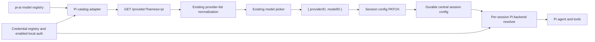

# feat(pi): Add provider and model selection

## Overview

Pi sessions use the same provider/model selection experience as OpenCode sessions while retaining Pi's native execution runtime. The user selects a concrete `{ providerID, modelID }`, the selection is stored with the session, and every Pi turn resolves that model through `pi-ai` using credentials available to the central runtime.

The implementation reuses Claxedo's existing provider response contract, normalized catalog, model picker, recent/favorite model behavior, and session model key. A Pi catalog adapter publishes `pi-ai` models through that contract and reports which providers have discoverable credentials. The Pi harness remains responsible for tools, turn orchestration, and credential refresh.

## Requirements

### Selection experience

- **R1 — User choice:** A Pi draft exposes an enabled provider/model picker. The selected model becomes read-only after the first prompt is accepted.
- **R2 — Shared product surface:** Pi uses the existing provider list normalization, model picker, model identity, recents, favorites, and connection dialog patterns.
- **R9 — Compatible defaults:** A new Pi draft starts with the user's current OpenCode model when the exact pair is eligible: it exists in the Pi catalog and its provider has discoverable credentials. Otherwise the user must select a connected Pi model before sending.

### Model and runtime contract

- **R3 — Runtime truth:** Catalog membership means a model is supported by `pi-ai`; connected state means credentials are discoverable for that provider. Provider acceptance is established by a real request and may still return an actionable provider error.
- **R4 — Full model identity:** Selection transports and persists both the backend provider ID and model ID. The harness ID remains `pi` and is not used as the model provider ID.
- **R5 — Per-session execution:** Two Pi sessions may select different models concurrently, and each turn uses its own session selection.
- **R8 — Explicit failures:** Missing credentials, unsupported models, and provider errors are surfaced as actionable unavailable/error states. Execution does not silently switch to another model.

### Persistence and credentials

- **R6 — Durability:** A central Pi session restores its selected provider/model after server restart or runtime reconstruction.
- **R7 — Credential safety:** Registry credentials are preferred; explicitly enabled local Pi/Codex stores and environment keys remain supported for self-hosted development. OAuth refresh rotation is persisted by the credential owner.

### Compatibility

- **R10 — Legacy continuity:** Existing `pi/virtual` sessions remain readable. They continue through a valid deployment default; without one they remain readable and direct the user to start a new configured Pi session.

## Scope

This work covers Pi provider/model discovery, selection UI, config transport, central-session persistence, per-turn resolution, credential availability, and focused tests across `claxedo-app`, `claxedo-server`, and `agent-sdk-runtime`.

The Pi execution engine remains `@mariozechner/pi-agent-core` plus `@mariozechner/pi-ai`. OpenCode's AI SDK provider runtime and language-model transport remain owned by OpenCode sessions. Provider-specific configuration forms beyond credential connection are out of scope and can be added when a Pi provider requires them.

The first release supports the three providers already implemented by Pi credential resolution: `openai-codex`, `anthropic`, and `openai`. Custom OpenAI-compatible providers and Pi providers that require configuration beyond an API key or the existing Codex OAuth bundle are follow-up work and are not advertised as connectable.

The first release uses the installation-scoped credential authority already present in self-hosted Claxedo. Tenant-scoped Pi credentials and execution in the shared hosted control plane are a separate delivery unit because that environment does not yet own a tenant credential store.

## Architecture



### Shared catalog contract

`GET /provider?harness=pi` returns the existing normalized provider response:

```ts
{
  all: Provider[]
  connected: string[]
  default: Record<string, string>
}
```

`agent-sdk-runtime` owns a serializable Pi catalog enumerator built from `pi-ai.getProviders()` and `pi-ai.getModels(provider)`. `claxedo-server` consumes that enumerator, limits the connectable catalog to the launch provider set, and adapts it to the existing provider response shape. This keeps `pi-ai` behind its current package owner instead of relying on a transitive server dependency.

The server derives `connected` from discoverable credentials for the requesting credential authority. Connected is a credential-presence signal, not proof of account entitlement or successful inference. This preserves the app's existing catalog/picker contract while keeping provider acceptance authoritative at turn execution.

Provider IDs retain Pi's native identifiers, including `openai-codex`. Where the credential registry uses a harness-oriented identifier such as `codex-app-server` or `codex-acp`, one server-owned mapping connects that credential source to the Pi provider. The mapping is shared by catalog availability and turn resolution so they cannot drift.

### Selection and defaulting

Pi is a selectable-model harness. The app removes its fixed-model profile and supplies the standard picker with the Pi-scoped provider catalog. Picker rows keep the model's real provider ID.

For a new draft, the selection policy is:

1. Reuse the user's current OpenCode `{providerID, modelID}` when the Pi catalog contains the exact pair and marks its provider connected.
2. Otherwise leave the selection empty and block send with the existing model-required affordance.
3. Once the user selects a model, the explicit Pi selection owns the draft and is persisted with the created session.

The policy provides a convenient starting point without concealing which model will execute.

The picker remains editable until the first prompt is durably accepted. After that boundary it displays the concrete provider/model as read-only with an explanation that a new Pi session is required to use another model. Config PATCH rejects model changes for started sessions and active turns. This release therefore does not require transcript portability, history truncation, or cross-model tool compatibility.

Picker interaction states reuse the existing model-selector visuals and follow these rules:

| State | Picker behavior | Send behavior |
|---|---|---|
| Loading | Shows the existing loading state and preserves any cached selection | Disabled until the selection is validated against the refreshed catalog |
| Empty supported catalog | Shows “No Pi models available” | Disabled |
| Catalog error | Preserves stale rows, shows the structured fetch error and retry action | Disabled unless the selected pair was validated by the current successful response |
| Disconnected provider | Models remain browsable; activation opens the existing connection dialog | Disabled until connection succeeds and the catalog refetch marks the provider connected |
| Selected and eligible | Shows provider and model | Enabled |
| Selected model unavailable | Preserves the historical label, explains why it cannot run, and offers “New Pi session” | Disabled |
| Started session | Shows the persisted provider/model read-only with the lock explanation | Governed by normal prompt readiness |

After a successful connection, focus returns to the originating model row, the Pi-scoped catalog refetches, and the intended model becomes selected when eligible. Keyboard navigation, accessible row names, dialog focus return, and loading/error announcements retain the existing picker contracts and receive regression coverage.

Recents and favorites remain stored through the existing shared preference mechanism but the Pi picker filters them through the Pi catalog. Entries absent from the Pi catalog are omitted; disconnected entries remain visible with the connection action.

### Session config authority

The canonical selection remains the existing session model shape:

```ts
type PromptModel = {
  providerID: string
  modelID: string
}
```

Harness selection and model mutation APIs carry this complete value. They do not reconstruct `providerID` from the harness ID.

Central session metadata is the durable authority. Add nullable `model_provider_id` and `model_id` columns to `claxedo_session_meta` and expose them as one optional model value on `SessionMeta`. Runtime binding loads that value before the first turn and never overwrites a concrete selection with `pi/virtual`.

Config PATCH first authorizes access to the session, validates the requested pair, and writes the durable metadata transaction. It updates the live adapter only after the durable write succeeds. A live update failure leaves the durable value authoritative and forces adapter reconstruction before the next turn. Create, load, archive, and delete use the existing session-meta lifecycle; sync paths preserve stored model columns when an incoming workspace projection omits them.

The schema migration adds nullable columns, so existing rows require no backfill. Rolling code back leaves the columns unused, and older readers continue to ignore them. A missing pair is interpreted as legacy/unset, while a partially populated pair is invalid and reported as configuration corruption.

### Per-turn Pi resolution

`PiModelBackendResolver` receives the selected model:

```ts
type PiModelBackendResolver = (input: {
  sessionId: string
  model?: { providerID: string; modelID: string }
}) => Promise<PiModelBackend | undefined> | PiModelBackend | undefined
```

`PiHarnessAdapter` passes the effective session model when resolving the agent. The resolver validates the exact pair with `pi-ai.getModel`, resolves credentials for that provider, and returns the matching backend. The adapter may refresh credentials and rebuild process-local agent state, but the selected model remains fixed after the session starts.

An explicit model selection has no fallback to a different provider or model. `CLAXEDO_PI_MODEL` remains the deployment default for legacy and non-UI creation paths. Local filesystem and environment credential sources participate only when the existing deployment opt-in is present (`CLAXEDO_PI_MODEL_BACKEND=1` or an explicit `CLAXEDO_PI_MODEL`); hosted multi-tenant execution never enables this compatibility path. New selectable UI sessions use their persisted model as the execution authority.

Programmatic Pi creation paths carry an explicit policy:

- a child/dispatch session inherits the source Pi session's concrete model;
- channel and wake continuations reuse the target session's concrete model;
- a root non-UI session uses the validated deployment default;
- when neither a concrete model nor valid default exists, admission returns a configuration error before provider execution.

### Credential availability

One scoped Pi credential capability answers both:

- whether a provider should appear in `connected`; and
- how a turn obtains or refreshes its key/token.

Resolution order remains registry first, followed by explicitly enabled local sources. API-key providers read provider-scoped registry credentials. `openai-codex` can use a synced Codex auth bundle and persists rotated OAuth tokens back to the same registry record. Provider aliases are declared once and tested in both directions. Catalog availability and secret resolution use the same installation credential authority.

All catalog, auth mutation, config PATCH, load, archive, and delete routes retain the existing session/workspace authorization boundary. Authorization occurs before model validation or credential lookup so session IDs and credential presence cannot be probed across scopes.

Raw secrets enter only the secret backend. Catalog/config responses, session metadata, logs, telemetry, provider error payloads, and test snapshots contain metadata or opaque references only. Credential replacement, deletion, and OAuth rotation preserve that boundary.

Catalog membership means the model exists in `pi-ai`; connected status means credentials are discoverable. Account-level rejection of a listed model remains a provider error and is surfaced without substituting a fallback model. If a later `pi-ai` version removes a persisted model, the session retains its historical key and becomes read-only; the UI offers a new Pi session rather than rewriting history.

## Implementation Plan

### Phase 1 — Define Pi catalog and credential capability

1. Export a serializable Pi provider/model enumerator from `agent-sdk-runtime`, where the direct `pi-ai` dependency already lives.
2. Add a server Pi catalog adapter that applies the launch-provider policy, credential authority, and existing provider response shape.
3. Extract a shared Pi credential-source mapping used by catalog connection state and backend resolution.
4. Extend registry resolution beyond the Codex bundle to provider-scoped API keys for the launch providers.
5. Route `/provider?harness=pi` to the Pi catalog and return structured 5xx responses when catalog or credential lookup fails; a successful empty catalog remains a 200 response.
6. Thread `harness=pi` through provider-auth discovery and PUT/DELETE auth mutations so Pi connection actions use the central registry rather than OpenCode's auth owner.
7. Include harness ID in provider query keys and invalidation so Pi and OpenCode catalogs can coexist in one app scope.

Primary files:

- `packages/claxedo-server/src/routes/opencode-compat-provider-config.ts`
- `packages/claxedo-server/src/routes/opencode-compat.ts`
- `packages/claxedo-server/src/provider-auth/service.ts`
- `packages/claxedo-server/src/credentials/registry.ts`
- `packages/claxedo-server/src/central-session-runtime.ts`
- `packages/agent-sdk-runtime/src/harnesses/pi/` catalog export
- `packages/claxedo-app/src/platform/query/provider-list.ts`
- `packages/claxedo-app/src/app/providers/use-providers.ts`
- new focused Pi catalog/credential modules under the owning server boundary

### Phase 2 — Make Pi a selectable-model harness

1. Remove the fixed `pi/virtual` model profile and classify Pi as using provider/model selection rather than harness config options.
2. Feed the Pi-scoped normalized provider catalog into the existing model picker.
3. Preserve each picker row's backend provider ID.
4. Extend the harness controller/model writer to accept a full `ModelKey`.
5. Apply the new-draft default policy and reuse existing submit-readiness behavior when no model is selected.
6. Lock the picker after the first prompt is accepted and expose the persisted model as read-only session context.
7. Keep variants hidden unless the chosen Pi catalog model explicitly exposes supported variants through the shared contract.

Primary files:

- `packages/claxedo-app/src/features/session/harness/profile.ts`
- `packages/claxedo-app/src/features/session/harness/selection.ts`
- `packages/claxedo-app/src/features/session/harness/controller.ts`
- `packages/claxedo-app/src/features/session/harness/harness-model-writer.ts`
- `packages/claxedo-app/src/features/session/ui/controls/agent-harness-selector.tsx`

Existing infrastructure reused without planned behavior changes:

- `packages/claxedo-app/src/features/session/providers/models.tsx`
- `packages/claxedo-app/src/features/session/ui/model/select-model.tsx`
- `packages/claxedo-app/src/features/session/composer/model-strategy.ts`

### Phase 3 — Carry and persist the full model key

1. Update the Pi model mutation route/controller boundary to accept `{providerID, modelID}`.
2. Validate that the requested pair is present in the Pi catalog and that its provider is connected before saving.
3. Add nullable provider/model columns to central session metadata and persist the key through its existing transaction.
4. Restore it during `ensureCentralRuntimeSession` and initial runtime binding.
5. Update live runtime config only after the durable write succeeds; reconstruct the adapter if the live update fails.
6. Reject model mutations after the first prompt admission.
7. Interpret `pi/virtual` only as a legacy unset/default marker.

Primary files:

- `packages/agent-sdk-runtime/src/index.ts`
- `packages/agent-sdk-runtime/src/harnesses/pi/index.ts`
- `packages/claxedo-server/src/central-session-runtime.ts`
- `packages/claxedo-server/src/session-meta.ts`
- `packages/claxedo-server/src/session-meta-types.ts`
- `packages/claxedo-server/src/storage/session-meta.sql.ts`
- `packages/claxedo-server/src/storage/repair.ts`
- `packages/claxedo-server/src/routes/agent-config-harness-routes.ts`

### Phase 4 — Resolve the selected backend per turn

1. Add the selected model to `PiModelBackendResolver` input.
2. Pass the effective session/turn model from `PiHarnessAdapter.resolveModelAgent`.
3. Refactor local and registry backend resolvers to validate and resolve the requested pair.
4. Retain lazy credential resolution and OAuth refresh on every provider call.
5. Return structured unavailable/unsupported errors so the app can distinguish configuration failure from provider-turn failure.
6. Apply explicit model inheritance/default admission rules to dispatch, channel, wake, and root non-UI sessions.
7. Retain environment default resolution only for legacy and non-UI sessions without a concrete model.

Primary files:

- `packages/agent-sdk-runtime/src/harnesses/pi/model-backend.ts`
- `packages/agent-sdk-runtime/src/harnesses/pi/index.ts`
- `packages/agent-sdk-runtime/src/harnesses/pi/local-auth.ts`
- `packages/agent-sdk-runtime/src/harnesses/pi/bundle-auth.ts`
- `packages/claxedo-server/src/central-session-runtime.ts`
- central channel, wake, and dispatch session creation call sites

### Phase 5 — Remove fixed-model compatibility assumptions

1. Update architecture guards and route-audit expectations that encode Pi as a fixed virtual model.
2. Update user-facing labels and translations from `Virtual`/disabled selection to normal provider/model states.
3. Retain a narrowly tested legacy decode path for stored `pi/virtual` configs.
4. Document the Pi catalog and credential mapping near their authoritative modules.

## Test Plan

### Runtime and resolver

- An explicit Pi model reaches `pi-ai.getModel` as the exact provider/model pair.
- Two simultaneous sessions select different providers/models without cross-session leakage.
- Model mutation remains allowed before the first prompt and is rejected after prompt admission.
- Missing credentials and unknown models fail explicitly without echo behavior or model substitution.
- Registry API keys and `openai-codex` OAuth bundles resolve through their mapped Pi providers.
- OAuth token rotation persists to the credential source that supplied the bundle.
- A legacy unset/`pi/virtual` session may use the configured deployment default.
- Child dispatch sessions inherit a source Pi model; root non-UI sessions use a validated deployment default or fail admission explicitly.

Target suites:

- `packages/agent-sdk-runtime/src/harnesses/pi/index.test.ts`
- new focused tests for `local-auth.ts`, `bundle-auth.ts`, and Pi catalog conversion
- `packages/claxedo-server/src/central-session-runtime.test.ts`

### Persistence and routes

- Session config PATCH round-trips the complete provider/model pair.
- A central session retains its model after runtime/server reconstruction.
- Create, archive, restore, and delete lifecycle operations keep durable config consistent.
- `/provider?harness=pi` returns models, defaults, and credential-derived connected providers.
- Catalog validation rejects a provider/model pair absent from the Pi catalog.
- Pi and OpenCode provider queries retain independent cache entries and invalidation.
- Pi auth PUT/DELETE routes target the central credential registry.
- Catalog/credential lookup failure returns a structured error rather than an empty successful catalog.
- Unauthorized and cross-scope callers cannot inspect connection state or mutate session model config.
- Catalog, config, logs, and errors never expose raw secrets.

Target suites:

- `packages/claxedo-server/src/frontend-api-contract.test.ts`
- `packages/claxedo-server/src/routes/provider-auth.test.ts`
- `packages/claxedo-server/src/routes/agent-config-extensions.test.ts`
- `packages/claxedo-server/src/session-harness.test.ts`
- central session metadata/storage tests
- `packages/claxedo-server/src/multi-agent.integration.test.ts`

### App behavior

- Pi shows an enabled model picker populated from the Pi catalog.
- The picker preserves a model's actual provider ID.
- A compatible current OpenCode model initializes a new Pi draft.
- An incompatible or disconnected current model leaves Pi unselected and blocks send.
- Selecting a model makes the draft submit-ready and persists the full key.
- Reloading an existing Pi session restores the selected model.
- Provider/model unavailability has an actionable state and never renders as a fixed `Virtual` model.
- Disconnected model activation completes the connection flow and restores focus/selection context.
- The picker is keyboard-operable and announces loading, error, and credential-state changes through the existing accessible contracts.

Target suites:

- `packages/claxedo-app/src/features/session/harness/profile.test.ts`
- `packages/claxedo-app/src/features/session/harness/selection.test.ts`
- `packages/claxedo-app/src/features/session/harness/harness-model-writer.test.ts`
- `packages/claxedo-app/src/features/session/ui/controls/agent-harness-selector.vitest.tsx`
- `packages/claxedo-app/src/features/session/commands/model-selection.test.ts`
- provider bootstrap/routing integration tests

## Verification Gates

Run package-local commands only:

1. `bun typecheck` in `packages/agent-sdk-runtime` if available through its package scripts, otherwise its documented package-local typecheck command.
2. Focused Pi runtime tests in `packages/agent-sdk-runtime`.
3. `bun typecheck` and focused route/runtime tests in `packages/claxedo-server`.
4. `bun typecheck`, focused Vitest suites, architecture guards, and route-audit tests in `packages/claxedo-app`.
5. Browser E2E for: create Pi draft, choose/change the model before send, send a real prompt, verify the picker locks, reload, and confirm the selection persists.
6. A real self-hosted round trip for one API-key provider and `openai-codex`, including a restart between selection and follow-up.

## Acceptance Criteria

- A user can choose a concrete provider and model for Pi from the standard model picker before the first prompt.
- The displayed provider/model pair is the pair used for execution.
- Pi and OpenCode share catalog/picker/session-model contracts without sharing execution engines.
- Only credentials discoverable within the current Pi credential authority are shown as connected.
- Different Pi sessions can run different selected models concurrently.
- The selection survives reload and central runtime reconstruction.
- Invalid or unavailable selections produce explicit, actionable errors.
- Existing legacy Pi sessions remain readable and continue through a valid deployment default; otherwise they provide a new-session recovery action.

## Risks and Mitigations

| Risk | Mitigation |
|---|---|
| OpenCode and Pi expose overlapping but non-identical providers/models | Use a Pi-native catalog behind the shared response contract and validate exact pairs server-side. |
| Provider aliases cause catalog and credential drift | Define one tested alias map used by both connection status and runtime resolution. |
| Central in-memory runtime loses model selection | Persist the full key in the durable central session authority and test reconstruction. |
| A listed Codex model is rejected for a specific account | Surface the provider error and keep the chosen model unchanged; do not substitute another model. |
| A process-wide environment override leaks across sessions | Treat it only as a legacy/default input; explicit session config always wins. |
| Credential refresh rotates an OAuth token | Persist refresh results back to the supplying registry record or enabled local store. |
| Existing model writer collapses provider identity to `pi` | Change the boundary to carry the full `ModelKey` and cover it with transport tests. |
| Programmatic sessions bypass the picker | Inherit a source model or require a validated deployment default before admission. |
| Provider query caches mix Pi and OpenCode catalogs | Include harness identity in query keys, requests, and targeted invalidation. |
| A selected model disappears after a `pi-ai` upgrade | Preserve the historical key, block execution, and offer a new configured Pi session. |
