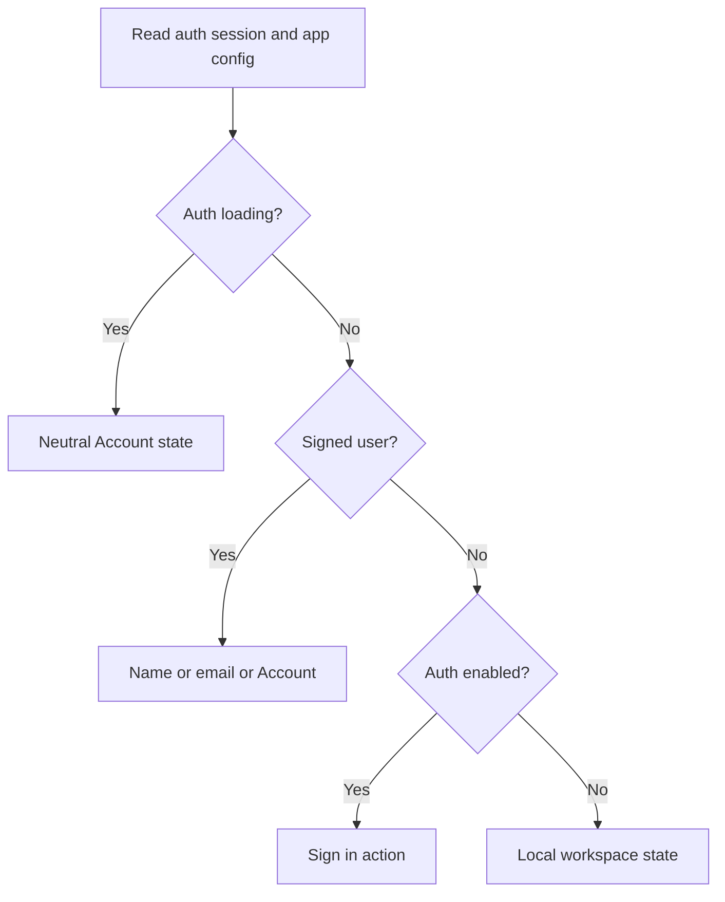
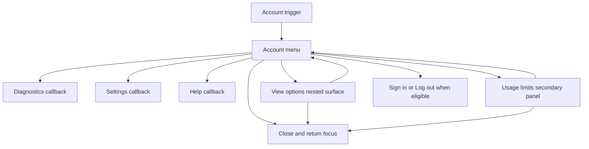

# Sidebar Account Menu - Plan

## Goal Capsule

| Field | Value |
|---|---|
| Objective | Replace the rail footer icon strip with one identity-aware account trigger and an upward-opening action surface. |
| Authority | Existing auth session and app configuration remain authoritative for identity state; existing rail callbacks and usage queries remain authoritative for actions and data. |
| Execution profile | Standard UI feature spanning rail composition, auth-derived presentation, nested floating surfaces, and browser coverage. |
| Stop conditions | Stop if the change requires a new auth state owner, changes usage-limit semantics, or cannot preserve the rail's menu-open collapse lock. |
| Tail ownership | The implementation owns focused component tests, affected Playwright flows, package typecheck, and browser verification at desktop and mobile widths. |

---

## Product Contract

### Summary

The rail footer becomes a calm, full-width identity control that opens an account menu above itself. Signed, anonymous, and local-only modes receive truthful labels and actions while the existing diagnostics, view, usage, settings, and help capabilities remain available.

### Problem Frame

The current footer presents five equally weighted icons with tooltip-only meaning. It consumes horizontal attention, obscures account state, and scatters secondary actions across independent floating surfaces.

The reference establishes a clearer hierarchy: identity is the persistent footer affordance, and secondary controls appear only when requested. Claxedo needs the same interaction model without copying the reference application's color treatment or inventing account data in local-only mode.

### Requirements

**Identity and trigger**

- R1. Replace the fixed footer icon strip with one full-width account trigger aligned to the rail's current width and visual tokens.
- R2. A signed user displays `fullName`, then `username`, then primary or fallback email, then `Account`; the avatar uses the user's image when available and a grapheme-safe fallback otherwise.
- R3. An auth-enabled anonymous session displays `Sign in`, while auth-disabled local-only mode displays `Local workspace` with a device-style identity mark.
- R4. Loading auth renders a neutral, non-actionable account state so the footer does not flash an incorrect sign-in or local action.

**Actions and capability preservation**

- R5. The account surface preserves Diagnostics, View options, Usage limits, Settings, and Help with their existing accessible names and underlying owners.
- R6. `Log out` appears only for signed users and delegates to the existing auth session; `Sign in` appears only for auth-enabled anonymous sessions and delegates to the existing redirect flow.
- R7. View options retain grouping, filtering, archived-state persistence, and multi-selection behavior inside the new hierarchy.
- R8. Usage limits retain provider bars, cached snapshots, refresh behavior, loading states, and failures without becoming account entitlement or billing data.

**Interaction and presentation**

- R9. The account surface opens upward, sizes from the live rail rather than a screenshot constant, and uses existing Claxedo surfaces, borders, typography, icons, radii, and motion.
- R10. The trigger and all nested surfaces support keyboard navigation, Escape and outside-click dismissal, focus return, and stable `aria-expanded` semantics.
- R11. The rail remains locked open for the lifetime of the account surface and its nested View options or Usage limits surfaces, including transitions between them.
- R12. The footer and floating content remain usable in the resizable desktop rail and the 280px mobile drawer without clipping or escaping the drawer's stacking order.

### Acceptance Examples

- AE1. Given a signed user named “Yash Rathore,” the footer shows that name and the menu includes Log out but not Sign in.
- AE2. Given a signed user without a name but with an email, the footer shows the email; with neither, it shows Account.
- AE3. Given auth is enabled and the session is anonymous, the footer shows Sign in and selecting it invokes the existing hosted sign-in flow.
- AE4. Given auth is disabled, the footer shows Local workspace and exposes neither Sign in nor Log out.
- AE5. Given the account menu is open, selecting Diagnostics, Settings, or Help invokes the same callback as the current icon; entering View options or Usage limits preserves its current behavior.
- AE6. Given an unpinned rail, moving through the root menu and a nested surface keeps the rail expanded until the entire account surface closes.
- AE7. Given keyboard focus on the account trigger, Enter opens the menu, arrow navigation reaches commands, Escape closes it, and focus returns to the trigger.

### Scope Boundaries

- The feature changes rail footer presentation and composition in `packages/claxedo-app`.
- The existing account settings section, auth provider behavior, sign-out cleanup, usage-limit API, query cache, and session-view persistence remain authoritative and unchanged in meaning.
- Reference-only actions such as Show pet and download are outside this feature.
- Broader account management, billing entitlement display, cloud usage metering, and new profile-editing flows are outside this feature.
- Existing English-only labels for Diagnostics, View options, and Usage limits remain as-is; localization expansion is separate from this layout change.

---

## Planning Contract

### Key Technical Decisions

- KTD1. Derive a small presentation model from `useAuthSession()` and `useConfigOptional()`. Signed state wins even when auth is disabled, matching the existing principal contract; the menu stores no duplicate identity state.
- KTD2. Add a focused `RailAccountMenu` component under the rail owner. It owns trigger rendering and the root floating-surface lifecycle, while `rail-sidebar.tsx` keeps session-view state, diagnostics construction, and app callbacks.
- KTD3. Use the shared Kobalte-backed dropdown primitives with upward placement. Shared primitives provide menu roles, focus management, dismissal, collision handling, theme styling, and motion that bespoke popover markup would have to reproduce.
- KTD4. Convert the current View options trigger/root into menu-owned nested content. A dropdown root must not be placed inside another dropdown root; the existing view object and setters remain in the rail.
- KTD5. Extract the existing usage body as a reusable panel and let the account surface own the transition into it. This preserves query/cache behavior while avoiding competing popover triggers and focus owners inside the root menu.
- KTD6. Drive `onRailLockChange` from one root surface state that covers the account menu and its secondary panels. Nested open/close events never unlock the rail independently.
- KTD7. Preserve accessible action names even though the visible entry point changes. Current Playwright suites depend on role/name selectors, and those names remain the stable user contract.
- KTD8. Use the existing shared Avatar for signed users and a themed icon badge for local/anonymous states. The visual direction is refined utilitarian: compact density, quiet hierarchy, and current theme tokens rather than the reference's teal background.

### High-Level Technical Design

The identity presentation is a pure derivation; it never owns session state.

One root surface state owns the rail lock across all menu transitions.

### Implementation Constraints

- Keep auth headless: UI remains under `app/workbench` and consumes `platform/auth` contracts; no auth module imports app or UI code.
- Preserve the current `claxedo.session-view.v1` data shape and the usage-limits query/cache ownership.
- Size floating content from the trigger or rail container with collision padding; do not encode the reference screenshot's pixel width.
- Preserve `RailSidebarShell` callback behavior that closes the mobile drawer for settings and help actions.
- Avoid introducing a general account-menu framework; this component is the named boundary for the rail footer only.

### Sequencing

Implement the identity/menu boundary first, then migrate the stateful View options and Usage limits surfaces into it, then update end-to-end selectors and run visual/accessibility verification. This order keeps each behavior independently testable and limits simultaneous changes inside the large rail component.

### Research Grounding

- `packages/claxedo-app/src/app/workbench/rail/rail-sidebar.tsx` owns the current footer, view state, diagnostics action, and rail-lock callback.
- `packages/claxedo-app/src/platform/auth/auth-session.ts` exposes the reactive status, user, sign-in, and sign-out contract.
- `packages/claxedo-app/src/platform/auth/principal-provider.tsx` establishes signed, anonymous, and local-only state precedence.
- `packages/claxedo-app/src/features/settings/ui/account-section.tsx` demonstrates defensive Clerk name and email extraction.
- `packages/ui/src/components/dropdown-menu.tsx` and `packages/ui/src/components/avatar.tsx` provide the shared interaction and visual primitives.
- `packages/claxedo-app/src/app/workbench/controls/usage-limits-popover.tsx` owns usage rendering, query state, caching, and refresh behavior.
- No `docs/solutions/` corpus exists for this repository, so there is no formal prior solution for this footer pattern.

---

## Implementation Units

### U1. Add the identity-aware account menu boundary

- **Goal:** Render the new account trigger and root menu with truthful identity states and eligible auth actions.
- **Requirements:** R1-R6, R9-R10; AE1-AE4, AE7.
- **Dependencies:** None.
- **Files:**
  - Create `packages/claxedo-app/src/app/workbench/rail/rail-account-menu.tsx`.
  - Create `packages/claxedo-app/src/app/workbench/rail/rail-account-menu.vitest.tsx`.
  - Modify `packages/claxedo-app/src/app/workbench/rail/rail-sidebar.tsx`.
- **Approach:** Derive the display label, avatar/image state, and eligible auth command from auth session plus app config. Render one full-width trigger and an upward shared dropdown with identity header, action slots, signed-only Log out, and anonymous-only Sign in. Keep callbacks injected from the rail so the component does not acquire diagnostics, settings, help, or session-view ownership.
- **Patterns to follow:** Defensive identity reads from `packages/claxedo-app/src/features/settings/ui/account-section.tsx`; shared Avatar and DropdownMenu primitives; signed-before-local precedence from `packages/claxedo-app/src/platform/auth/principal-provider.vitest.tsx`.
- **Test scenarios:**
  - Covers AE1. A signed user with a full name and image renders both, exposes Log out, and omits Sign in.
  - Covers AE2. Username, primary email, fallback email, and Account are selected in order when higher-priority fields are absent.
  - Covers AE3. An auth-enabled anonymous session renders Sign in, invokes the existing sign-in method with a return URL, and omits Log out.
  - Covers AE4. Auth-disabled anonymous state renders Local workspace with a device mark and exposes neither auth command.
  - A signed session still renders signed identity when the build config has auth disabled.
  - Loading auth renders a neutral disabled state without flashing Sign in or Local workspace.
  - Covers AE5. Diagnostics, Settings, and Help entries invoke their supplied callbacks once and close the menu.
  - Covers AE7. Enter opens, Escape closes, focus returns to the trigger, and `aria-expanded` follows open state.
- **Verification:** Component tests prove the state matrix and command visibility without relying on the Playwright test-auth bypass.

### U2. Move View options and Usage limits under the account surface

- **Goal:** Preserve both stateful secondary tools without nested-root focus conflicts or premature rail collapse.
- **Requirements:** R5, R7-R12; AE5-AE7.
- **Dependencies:** U1.
- **Files:**
  - Modify `packages/claxedo-app/src/app/workbench/rail/rail-account-menu.tsx`.
  - Modify `packages/claxedo-app/src/app/workbench/rail/rail-sidebar.tsx`.
  - Modify `packages/claxedo-app/src/app/workbench/controls/usage-limits-popover.tsx`.
  - Create `packages/claxedo-app/src/app/workbench/controls/usage-limits-popover.vitest.tsx` if the extracted panel contract is not fully covered through the account-menu test.
  - Modify `packages/claxedo-app/src/app/workbench/rail/rail-account-menu.vitest.tsx`.
- **Approach:** Convert FilterMenu's body into a nested branch owned by the account dropdown while retaining the rail's view signal and mutation functions. Export the usage body as a reusable panel and render it through an account-owned secondary state. Keep a single root lifecycle responsible for locking the rail until all nested content closes.
- **Patterns to follow:** Existing multi-select and submenu behavior in `FilterMenu`; existing `PopoverBody` query/cache/refresh flow; `handleRailMenuOpenChange` as the sole rail-lock integration point.
- **Test scenarios:**
  - Covers AE5. View options still switches Project/Workspace grouping, toggles filters without closing early, and changes Archived selection.
  - Covers AE5. Usage limits shows loading, provider bars, empty/error states, cached data, and refresh behavior after opening from the account menu.
  - Covers AE6. Opening the root locks the rail; entering and leaving View options or Usage limits does not emit a false unlock; closing the complete surface unlocks once.
  - Covers AE7. Arrow navigation reaches nested content, Escape unwinds predictably, and focus ultimately returns to the account trigger.
  - The usage panel and View options never render nested dropdown/popover roots with competing expanded state.
  - Resizing the desktop rail while closed changes the next menu width; opening in the mobile drawer stays within the viewport.
- **Verification:** Focused Vitest coverage proves open-state ownership and panel transitions; existing view and usage data owners remain unchanged.

### U3. Migrate browser contracts and verify the finished footer

- **Goal:** Update user-flow coverage for the new entry point and validate visual, responsive, and accessibility behavior in the real app.
- **Requirements:** R5-R12; AE1, AE5-AE7.
- **Dependencies:** U1-U2.
- **Files:**
  - Modify `packages/claxedo-app/e2e/playwright/core-sidebar-tree.spec.ts`.
  - Modify `packages/claxedo-app/e2e/playwright/core-processes.spec.ts`.
  - Modify `packages/claxedo-app/e2e/playwright/core-settings-auth.spec.ts`.
- **Approach:** Add a stable role/name helper for opening the account menu, then reach View options, Diagnostics, Settings, Help, and Usage limits through their visible menu commands. Extend the auth suite to assert the default signed footer identity while component tests retain responsibility for anonymous and local-only branches that the shared Playwright build cannot switch reliably.
- **Test scenarios:**
  - Covers AE1. The default signed test principal renders Test User on the footer trigger and exposes the expected command set.
  - Existing sidebar grouping, filtering, archive-query, and persistence flows pass through the nested View options branch.
  - Existing process diagnostics flow opens from the account menu and preserves the dialog assertions.
  - Existing settings flows open from the account menu without ambiguous duplicate Settings controls.
  - Usage limits opens above the footer and renders its heading/state without clipping.
  - Covers AE7. A browser-level keyboard pass opens, navigates, dismisses, and restores focus.
  - Desktop minimum/default/maximum rail widths and the mobile drawer preserve padding, collision handling, menu readability, and touch target size in light and dark themes.
- **Verification:** The affected Playwright suites pass, and browser screenshots show a stable footer/menu relationship at desktop and mobile widths.

---

## Verification Contract

| Gate | Command or method | Proves |
|---|---|---|
| Account/menu component | `bun run test:vitest -- ./src/app/workbench/rail/rail-account-menu.vitest.tsx` | Identity matrix, auth commands, callbacks, keyboard behavior, and rail lock lifecycle. |
| Usage panel | `bun run test:vitest -- ./src/app/workbench/controls/usage-limits-popover.vitest.tsx` when created | Extracted panel preserves query, refresh, and display states. |
| Locale guard | `bun test ./src/platform/i18n/locale-parity.test.ts` | Existing localized keys and cloud-string parity remain intact if copy keys change. |
| Browser flows | `bun run test:e2e -- e2e/playwright/core-sidebar-tree.spec.ts e2e/playwright/core-processes.spec.ts e2e/playwright/core-settings-auth.spec.ts` | View options, diagnostics, settings, signed identity, and keyboard flows work through the new entry point. |
| Package quality | `bun run typecheck` | Theme tokens, architecture constraints, TypeScript, and performance guard remain green. |
| Visual review | Browser inspection at desktop rail min/default/max widths and the mobile drawer in light and dark themes | Placement, collision, density, focus rings, touch targets, and responsive stacking match the intended refined utilitarian direction. |

Run every command from `packages/claxedo-app`; repository-root tests are guarded against use.

---

## Definition of Done

- The icon strip is absent and one full-width account trigger owns the rail footer.
- Signed, auth-enabled anonymous, auth-disabled local-only, and loading states match R2-R4 without fabricated identity data.
- Diagnostics, View options, Usage limits, Settings, and Help remain reachable and behaviorally unchanged beneath the new hierarchy.
- Sign in and Log out appear only in their eligible states and delegate to existing auth methods.
- One open-state owner keeps the rail locked across nested surfaces and restores focus on close.
- Component, Playwright, locale, and package quality gates pass from `packages/claxedo-app`.
- Desktop and mobile browser verification confirms upward placement, responsive sizing, accessible keyboard behavior, and theme-consistent polish.
- No duplicate footer controls, parallel auth state, abandoned experiments, or obsolete nested roots remain in the final diff.
