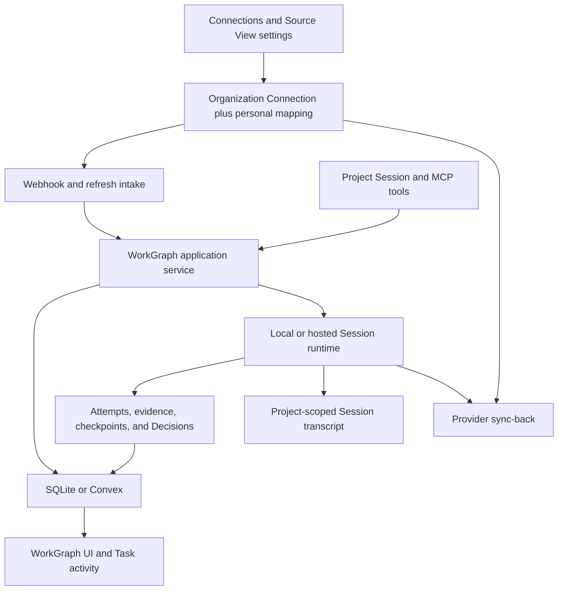
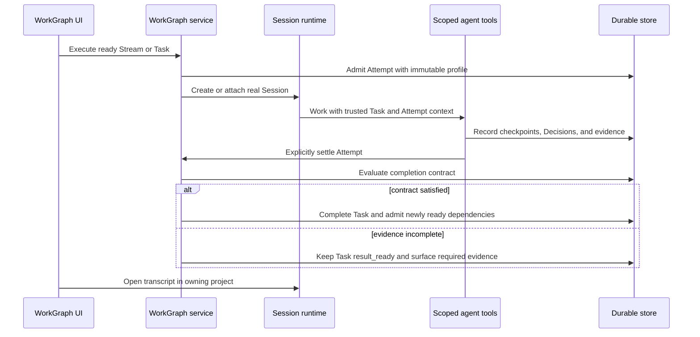
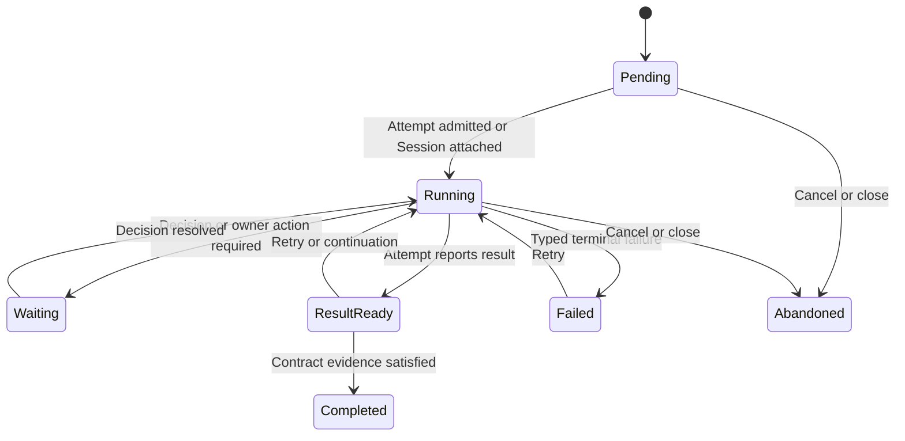

# Personal WorkGraph End-to-End Delivery - Plan

## Goal Capsule

- **Objective:** Finish WorkGraph as a dependable personal execution system: connected work and chat-created work become durable Tasks, autonomous Sessions execute them, meaningful progress is observable, and real staging proves the full loop.
- **Authority:** Product behavior follows `packages/workgraph/PRD.md` and `packages/workgraph/SPEC.md`; architecture follows `packages/workgraph/ARCHITECTURE.md`; this plan owns the remaining implementation and verification sequence.
- **Execution profile:** Land dependency-ordered units on `dev`, preserve trusted `(organization, user)` tenancy, and keep SQLite and Convex behavior conformant.
- **Stop conditions:** Stop for a product-contract change, a weakened authority boundary, a second credential store, destructive loss of durable results, or an external credential/runtime dependency that cannot be safely substituted in repository tests.
- **Tail ownership:** The goal is complete only after repository gates, real local browser journeys, deployed staging journeys, operational checks, and documentation all agree.

---

## Product Contract

### Summary

The repository implementation now closes three local user journeys: connected issues enter WorkGraph and execute autonomously, chat/MCP-created Streams execute in real project Sessions, and long-running Sessions maintain a bounded WorkGraph ledger. The remaining work turns the staging configuration into a deployed and observable Cloud composition and proves the same journeys with real hosted credentials and infrastructure.

### Problem Frame

WorkGraph has a substantial domain, storage, execution, connection, UI, and browser-test foundation. Local deterministic composition now proves that a user can configure a source, admit work, let autonomous execution advance Tasks according to their same-Stream prerequisites, inspect the real Session transcript, and receive provider-side results.

Task observability is implemented as a bounded durable ledger. Attempts, evidence, lifecycle events, and agent-authored checkpoints appear in the Task inspector while raw chat and tool activity remain in the Session. An ordinary long-running Session can bind to a Stream and current Task, record meaningful boundaries, complete with evidence, and select the next ready Task without creating a duplicate Session.

### Done

- The personal WorkGraph domain, trusted tuple tenancy, SQLite and Convex adapters, archive/restore, deletion barriers, ordered changes, Attention, notifications, Recaps, Work Sources, Decisions, evidence, and Attempt lifecycle exist with repository coverage.
- WorkGraph is the app-level destination after Marketplace, with inline Streams and Tasks, Needs you, execution defaults, Stream-scoped environment/repository/base-revision settings, project-directory selection, Recap settings, and focused inspectors.
- Local Stream execution creates project-scoped worktrees and real Sessions; Session links now route through the owning project rather than opening an unscoped shell.
- WorkGraph change synchronization uses bounded long polling, and opening WorkGraph no longer depends on repeated full snapshots.
- Notification acknowledgement and clearing are persisted through the backend instead of being browser-only state.
- GitHub, Linear, and Jira Connections, Source View contracts, webhook/refresh ingestion, candidate staging, source planning, and sync primitives exist without storing provider credentials in WorkGraph.
- Connections settings now create, edit, pause, refresh, and delete personal GitHub, Linear, and Jira Source Views. Each mapping carries an explicit Stream target, GitHub can infer its cloud repository, Linear and Jira require a selected project, and admission materializes the mapping on the new Stream.
- Local embedded WorkGraph agent tools and the standalone authenticated MCP expose creation, reads, source admission, execution, retry, cancellation, findings, evidence, Decisions, Recaps, and lifecycle operations.
- Execution capability discovery is tenant-scoped, server-attested, side-effect free on read, and aligned with Session-composer harnesses; Pi does not require a provider selection.
- Cleanup, integration, isolation, and permitted-tools controls are no longer user-facing WorkGraph execution settings; the selected harness and environment own those concerns.
- Prompt failures, provisioning failures, child-isolation failures, cancellation, and deletion have durable compensation paths; organization-scoped Connection metadata survives owner deletion.
- Public event credential-key filtering, Connection-tool Session authority checks, callback timeout/size controls, durable hosted Recap identities, catalog workspace cleanup, real E2E command gating, and legacy migration timestamp conversion are fixed in the current checkout.
- WorkGraph does not form one product-wide DAG. Stream → optional Outcome → Task is a fixed containment hierarchy. Separately, each Stream may have a Task prerequisite DAG used for scheduling: every prerequisite edge connects two Tasks in that Stream, and SQLite and Convex atomically reject self-cycles, direct cycles, transitive cycles, and cross-Stream edges without changing the previous prerequisite set. Outcomes, Attempts, activity, findings, and evidence are not prerequisite-graph vertices.
- Deterministic GitHub, Linear, and Jira provider journeys pass settings → candidate → admission → execution → sync-back → cleanup through the real local composition.
- A project chat creates a dependency-ordered multi-Task Stream through real Claxedo MCP, autonomous execution runs every Task in a real project Session, and each transcript reopens inside its owning project.
- One long-running project Session creates and maintains a bounded ledger, checkpoints Task A, completes it with evidence, observes Task B becoming ready, and returns to WorkGraph through the instant in-app route without duplicating the Session.
- Explicit Attempt completion publishes the durable `attempt_completed` change accepted by the ordered-change contract, so active WorkGraph clients converge without a snapshot reload.
- WorkGraph has 355 passing tests; the app typecheck and architecture/performance gates pass; the focused server agent-tool suite passes 8/8; the OpenCode application-tool registry suite passes 13/13. OpenCode package typecheck remains blocked only by the pre-existing branded Message ID comparison in `test/server/httpapi-session.test.ts:639`.

### Left

- U18: repair the clean-runner sandbox-image, control-plane/Convex packaging, and staging diff-routing workflows, then deploy the ordered staging composition from one `dev` SHA.
- U19: run signed credentialed staging acceptance for GitHub, Linear, and Jira; retain hosted Session transcripts, provider receipts, telemetry, rollback/roll-forward, and cleanup evidence; then align release documentation with the observed deployment.

### Requirements

#### Connected work

- R26. A user configures personal GitHub, Linear, or Jira Source Views beside an organization-owned Connection, including provider identity, filters, sync policy, and the Stream target template used when an issue becomes work.
- R27. A matching provider issue appears in Needs you, can be admitted into a Stream, executes after its same-Stream Task prerequisites are satisfied, and publishes a meaningful result back through the same Connection.

#### Agent-created and autonomous work

- R28. A Claxedo Session can use first-party WorkGraph tools to create and update Streams, Outcomes, and Tasks with valid completion contracts and defaults, after which the user can start autonomous execution from the app.
- R29. Autonomous execution advances only from explicit Attempt completion and contract-satisfying evidence; Session idle, prompt return, or absence of tool calls never implies Task completion.
- R30. Every managed or attached Attempt references the real Session and owning project so the app opens the complete transcript immediately in its project context.

#### Bounded activity and long-running ledgers

- R31. Every Task exposes a paginated activity timeline that combines canonical lifecycle facts with agent-authored checkpoints while keeping raw messages, shell commands, file reads, and intermediate reasoning in the Session.
- R32. Stream activity detail is `milestones`, `progress`, or `detailed`, with `progress` as the default; all levels retain lifecycle, blocker, evidence, external-effect, and completion facts.
- R33. An ordinary long-running Session can bind to one Stream and one current Task, record meaningful checkpoints, settle that Task with evidence, and move to another Task without spawning a duplicate Session.
- R34. Work remains three levels deep—Stream, optional Outcome, Task. The Task prerequisite relation is a separate per-Stream DAG: every edge connects two Tasks in that Stream, and every path that adds, replaces, imports, or restores edges rejects direct and transitive cycles atomically. Outcomes, Attempts, activity entries, findings, evidence, and follow-ups are not DAG vertices and do not create recursive Task nesting. SQLite and Convex enforce this invariant for dependency updates, admission, and archive restore; the legacy migration imports no dependency edges.

#### Delivery and proof

- R35. Local headless browser tests prove the connected-provider, chat-created, autonomous dependency, activity/read-clear, retry, and real-Session transcript journeys without direct database or HTTP seeding after the browser boundary.
- R36. Staging deploys in dependency order and proves signed tenant policy, Convex persistence, hosted execution, real GitHub/Linear/Jira fixture journeys, sync-back, cleanup, telemetry, and rollback readiness.
- R37. Current CI failures in sandbox-image installation, control-plane Convex packaging, and staging diff routing are resolved before deployment evidence is accepted.
- R38. New activity, binding, completion, and capability operations are represented in the public HTTP/Protocol/OpenAPI contract and regenerated SDKs; handwritten clients do not become a second wire contract.
- R39. Provider issue text and metadata remain explicitly untrusted input: they cannot select tenant, Session, execution target, credentials, tools, or completion authority, and prompt context preserves their provenance.

### Key Flows

- F7. **Connected issue to completed work:** The user connects a provider, defines a personal Source View, receives a candidate, admits it, starts autonomous execution, watches Tasks complete, opens the real Session, and sees a provider-side result.
- F8. **Chat to autonomous Stream:** In a project Session, the user asks the agent to create a Stream and Tasks. The agent infers the project directory, repository, and base revision, uses WorkGraph tools, and the user starts execution from the WorkGraph UI.
- F9. **Long-running Session ledger:** The user asks an existing Session to maintain a WorkGraph ledger. The Session binds to a Stream, selects a Task, records only important checkpoints, completes with evidence, and advances without creating a second Session.
- F10. **Recover and continue:** A failed Attempt exposes its reason, transcript, retry/cancel actions, and durable activity. Retry is idempotent and autonomous execution resumes only when evidence makes dependencies ready.

### Acceptance Examples

- AE13. A GitHub Source View configured through normal settings receives a labeled fixture issue, admits it, executes a no-op repository change, posts the configured result, and records no provider credential in WorkGraph data or public events.
- AE14. Equivalent Linear and Jira fixtures exercise their provider identities, filters, webhook or refresh paths, admission, execution, and sync-back semantics.
- AE15. A project Session asked to create a three-Task Stream produces one Stream with inferred local directory, repository URL, base revision, dependencies, and completion contracts; no WorkGraph-level repository setting is consulted.
- AE16. Completing Task A with valid evidence immediately admits ready Task B. A result without evidence leaves Task A at `result_ready` and does not unblock B.
- AE17. Opening an Attempt from a Task lands on the real Session inside the owning project and renders the full transcript; a missing or mismatched Session is a failed test, not a tolerated loading state.
- AE18. Marking Attention read removes unread state across reload and another client. Clearing an item uses its semantic backend action and does not reappear unless a newer actionable version exists.
- AE19. A long-running Session attaches to an existing Task, writes a checkpoint, survives process restart or context refresh, records evidence, completes the Task, and selects the next ready Task without spawning another Session.
- AE20. Milestone mode shows lifecycle, blocker, evidence, external effect, and completion only; progress mode adds checkpoints and findings; detailed mode adds more structured boundaries but never raw chat or tool logs.
- AE21. Invalid Connection credentials, revoked access, rate limits, callback timeout, provider duplication, or a tenant mismatch produce typed attention and no cross-tenant disclosure or duplicate external effect.
- AE22. The deployed Cloud journey creates, executes, inspects, and deletes a disposable Stream through the Worker/Convex/hosted-runtime composition and retains traces, Session IDs, provider receipts, and cleanup evidence.
- AE23. A provider fixture containing prompt-injection text is preserved as sourced content but cannot change trusted execution context, access another Connection, broaden tools, or self-certify completion.

### Scope Boundaries

#### Included

- Personal Source View configuration for GitHub, Linear, and Jira through project/user settings.
- Full WorkGraph CRUD and lifecycle parity for the UI, embedded tools, standalone MCP, and hosted agent surface.
- Structured Task activity, long-running Session binding, explicit completion, evidence-driven autonomous continuation, and real Session navigation.
- Deterministic local provider compositions plus credentialed staging provider journeys.
- CI repair, staging deployment, telemetry, runbooks, and release evidence.

#### Outside this product identity

- Recursive Tasks or arbitrary hierarchy below Task.
- Mirroring raw Session messages, tool calls, shell output, file reads, or chain-of-thought into WorkGraph activity.
- A second credential store or user-provided provider tokens in WorkGraph.
- WorkGraph-level repository, directory, environment, base-revision, cleanup, integration, isolation, or permitted-tools settings.
- Product-level capacity queues or a WorkGraph-owned cloud-VM idle-lifecycle policy.

#### Deferred to Follow-Up Work

- Shared ownership, organization-wide Streams, manager assignment, and portfolio planning.
- Maintained storage adapters beyond SQLite and Convex.
- Notification delivery beyond in-app Attention.
- Marketplace-distributed WorkGraph templates.

---

## Planning Contract

### Key Technical Decisions

- KTD1. Stream environment identity remains Stream-scoped. (session-settled: user-directed — chosen over WorkGraph-level repository defaults: each Stream is the first durable owner of its local/cloud location, directory, repository URL, and base revision.)
- KTD2. Connections settings own personal Source Views beside organization-owned accounts. (session-settled: user-approved — chosen over placing source configuration in WorkGraph execution settings: credentials and provider mappings stay together while admitted execution targets remain Stream-scoped.)
- KTD3. WorkGraph activity is a unified projection, not a second log. Canonical events, Attempts, Decisions, evidence, and external-effect receipts supply lifecycle facts; only agent-authored checkpoints require a new durable record.
- KTD4. Activity granularity controls checkpoint promotion, not lifecycle truth. (session-settled: user-directed — chosen over copying everything a Session does: meaningful boundaries remain visible and raw execution stays in the Session.)
- KTD5. A long-running Session attaches to one current Task as an observed Attempt. (session-settled: user-approved — chosen over spawning a managed duplicate Session: the existing transcript remains the execution authority.)
- KTD6. Agent completion is explicit and evidence-backed. The execution surface exposes scoped completion primitives; runtime idle and prompt success never mutate a Task to completed.
- KTD7. Embedded tools infer trusted Session, project, tenant, Stream, Task, and Attempt context. Standalone MCP may mutate authorized WorkGraph data but cannot claim attachment to a Claxedo Session without a signed broker identity.
- KTD8. No recursive Task hierarchy is introduced. (session-settled: user-directed — chosen over infinitely nested Tasks: Outcomes group deliverables, dependency edges order Tasks, and activity/evidence represent progress.)
- KTD12. Acyclicity is a write-time and restore-time invariant of each Stream's Task prerequisite graph, not an assumption made by the scheduler. Every dependency mutation validates the proposed complete same-Stream graph before replacing edges, and SQLite and Convex share conformance cases for identical rejection semantics.
- KTD9. Provider proof uses two layers: deterministic local compositions exercise every provider contract, while credentialed staging exercises the real external systems and cleanup lifecycle.
- KTD10. Existing repository tests are evidence for foundations only. A journey is complete only when its canonical browser test crosses UI, authenticated backend, durable storage, runtime Session, and visible transcript without direct fixture seeding after entry.
- KTD11. External issue content is data with immutable provider provenance, not trusted system instruction. The runtime supplies authority, target, tools, and completion context from durable WorkGraph state outside the untrusted content block.

### High-Level Technical Design

#### Component ownership

#### Explicit execution and completion sequence

#### Task activity state model

### System-Wide Impact

- **Persistence:** SQLite, Convex, archive/export/restore, migrations, cleanup, and conformance must cover checkpoint records and Session bindings.
- **Dependency integrity:** SQLite, Convex, admission, archive restore, and any migration that imports prerequisite edges reject a same-Stream Task prerequisite graph containing a direct or transitive cycle before persisting partial edge changes.
- **Authority:** Attached execution requires an invocation-derived Session identity; caller-provided Session IDs remain untrusted selectors.
- **Realtime:** Activity and completion append ordinary ordered changes so UI projections update without full snapshot reloads.
- **Execution:** Managed Attempts and attached Attempts share completion semantics but differ in who creates and owns the Session lifecycle.
- **Prompt context:** Managed and attached Sessions receive active Stream, current Task, completion contract, recent bounded activity, granularity, and scoped tool guidance at safe turn boundaries.
- **External effects:** Provider sync is idempotent and receipt-backed; retry never duplicates a comment, status transition, branch, or pull request.
- **SDK/API:** Public Protocol/OpenAPI and generated clients remain the source of truth for any new HTTP surface; generated outputs are regenerated, not edited.
- **Prompt trust:** Provider-authored text is delimited and labeled with source provenance; system and scoped-tool authority remains outside that text.

### Sequencing

1. Establish the activity, binding, and explicit-completion contracts before changing execution prompts or UI.
2. Implement SQLite and Convex parity before exposing new HTTP/MCP/UI actions.
3. Close MCP CRUD and trusted-context gaps before writing the chat and long-running-ledger journeys.
4. Add Source View settings and provider compositions after the execution loop can finish admitted work.
5. Repair CI, deploy staging, and run credentialed provider/browser proof only after deterministic local journeys pass.

### Risks and Mitigations

- **Duplicate provider execution:** Reuse durable Session, prompt, Attempt, and provider-operation identities; treat ambiguous callback or response loss as reconciliation, not a new run.
- **Activity amplification:** Page by Task and cursor, cap checkpoint payloads, index by tenant/Task/time, and keep raw transcript data out of WorkGraph.
- **False completion:** Require an explicit completion call and evaluate stored evidence against the exact immutable contract.
- **Attached-Session spoofing:** Infer identity from embedded invocation context or a signed broker; reject arbitrary Session IDs even when the caller has workspace access.
- **Autonomous stalls:** Re-evaluate readiness immediately after evidence or Decision changes and expose the exact unmet contract in activity and Attention.
- **Provider fixture pollution:** Isolate labeled staging fixtures, record external IDs and cleanup receipts, and make cleanup safe to rerun.
- **Cloud-only drift:** Keep SQLite and Convex on one conformance version and run the same contract scenarios before deployed smoke.

---

## Implementation Units

The original U1-U10 delivered the foundation summarized under **Done**. Stable unit numbering resumes at U11; deleted historical detail remains available in version control.

### U11. Define bounded Task activity and Session binding contracts

- **Goal:** Add the durable vocabulary and public ports for unified Task activity, checkpoint granularity, and attached Session execution.
- **Requirements:** R31-R34, R38; KTD3-KTD8, KTD12.
- **Dependencies:** Existing WorkGraph events, Attempts, evidence, Session identity, and ordered changes.
- **Files:** `packages/workgraph/src/contracts/records.ts`, `packages/workgraph/src/contracts/details.ts`, `packages/workgraph/src/contracts/commands.ts`, `packages/workgraph/src/contracts/events.ts`, `packages/workgraph/src/contracts/page-cursors.ts`, `packages/workgraph/src/contracts/archive.ts`, `packages/workgraph/src/ports/details.ts`, `packages/workgraph/src/ports/store.ts`, `packages/workgraph/src/application/workgraph-service.ts`, `packages/workgraph/src/application/completion-service.ts`, `packages/workgraph/src/http/router.ts`, `packages/workgraph/src/http/router.test.ts`, `packages/workgraph/src/contracts/activity.test.ts`.
- **Approach:** Introduce a typed agent-checkpoint record and a paginated activity DTO that normalizes canonical domain events with checkpoints. Add Stream granularity, Session-to-Stream binding, current Task, and managed-versus-attached Attempt provenance. Define semantic abandonment rather than hard deletion for evidence-bearing records.
- **Patterns to follow:** Existing Evidence subjects, Attempt detail pages, tenant-bound cursors, public event payload filtering, and versioned commands.
- **Test scenarios:**
  1. Creating and updating a binding requires the trusted tenant and rejects a foreign Session, Stream, or Task.
  2. One Session may have one active Task binding and may move to a new ready Task after settling the previous one.
  3. Activity pages remain stable across pagination and expose lifecycle facts plus checkpoints in deterministic order.
  4. Granularity validation defaults to progress and rejects an unsupported value without changing stored state.
  5. Archive validation rejects missing binding/checkpoint references and round-trips valid records.
  6. Contract-level dependency validation accepts an acyclic same-Stream Task prerequisite graph and rejects cross-Stream edges, self-cycles, two-node cycles, and longer transitive cycles.
- **Verification:** Public schemas parse representative managed and attached histories, cursor tests bind filters and tenant, and the contract has no field capable of carrying raw transcript content.

### U12. Persist activity and bindings with SQLite and Convex parity

- **Goal:** Implement the U11 contract in both maintained adapters and all lifecycle operations.
- **Requirements:** R31-R34, R36; KTD3, KTD5, KTD12.
- **Dependencies:** U11.
- **Files:** `packages/workgraph/src/adapters/sqlite/schema.ts`, `packages/workgraph/src/adapters/sqlite/store.ts`, `packages/workgraph/src/adapters/sqlite/archive.ts`, `packages/workgraph/src/adapters/sqlite/owner-deletion.ts`, `packages/workgraph/test/conformance/store-contract.ts`, `packages/workgraph/test/conformance/sqlite.test.ts`, `convex/schema.ts`, `convex/workgraphModel.ts`, `convex/workgraphCommands.ts`, `convex/workgraphChanges.ts`, `convex/workgraphArchive.ts`, `convex/workgraphOwnerDeletion.ts`, `packages/claxedo-server/src/workgraph-host/convex-store.ts`, `packages/claxedo-server/src/workgraph-host/convex-store.test.ts`.
- **Approach:** Store only authored checkpoints and bindings as new rows; derive lifecycle activity from existing canonical records. Append one ordered change for every activity-visible mutation. Include new records in archive, restore, owner deletion, and cleanup fences.
- **Execution note:** Start with adapter-conformance cases so SQLite and Convex cannot acquire different semantics.
- **Patterns to follow:** Evidence pagination, Attempt pages, snapshot/change cursor fencing, and archive conformance.
- **Test scenarios:**
  1. SQLite and Convex return identical activity for the same command history.
  2. Concurrent checkpoint retries with one operation ID create one record and one change.
  3. Owner deletion removes bindings/checkpoints while organization-owned Connection metadata remains.
  4. Snapshot resume remains stable when activity is appended beneath the cursor.
  5. Archive/export/restore preserves activity ordering and active Session binding.
  6. Large histories page without N+1 transcript, Recap, Attempt, or evidence reads.
  7. Updating A to depend on B is rejected atomically when B already reaches A, in both SQLite and Convex, while the previous dependency set remains unchanged.
  8. Archive restore rejects cyclic same-Stream Task prerequisite graphs without materializing partial edges. The current legacy migration imports no prerequisite edges; any future migration that does must apply the same validation.
- **Verification:** The next adapter-conformance version passes for SQLite and Convex, including restart, deletion, pagination, and archive cases.

### U13. Add explicit scoped progress and completion to managed execution

- **Goal:** Let an executing agent report progress, Decisions, evidence, follow-ups, result, and completion inside its trusted Attempt context so autonomous dependency chains advance truthfully.
- **Requirements:** R29-R30, R31-R32; AE16-AE17; KTD4, KTD6-KTD7.
- **Dependencies:** U11-U12.
- **Files:** `packages/workgraph/src/application/execution-service.ts`, `packages/workgraph/src/application/completion-service.ts`, `packages/workgraph/src/adapters/sqlite/store.ts`, `packages/workgraph/src/adapters/sqlite/source-planning-runtime.ts`, `packages/claxedo-server/src/workgraph-host/local-execution.ts`, `packages/claxedo-server/src/workgraph-host/hosted-runtime.ts`, `packages/claxedo-server/src/workgraph-session-gateway.ts`, `packages/claxedo-server/src/workgraph-host/local-execution.test.ts`, `packages/claxedo-server/src/workgraph-host/hosted-runtime.test.ts`, `packages/workgraph/test/sqlite-store-commands.test.ts`.
- **Approach:** Inject bounded WorkGraph context into the real Session and register Attempt-scoped tools that accept content but not caller-selected tenant, Session, Stream, Task, or Attempt IDs. A completion call records the result and evidence, settles the Attempt, evaluates the contract, and immediately re-runs autonomous readiness.
- **Patterns to follow:** Session V2 durable prompt identity, Connection operation broker scoping, Attempt leases, durable compensation, and Evidence evaluation.
- **Test scenarios:**
  1. A two-wave same-Stream Task prerequisite graph automatically launches the second wave only after first-wave evidence satisfies every contract.
  2. Prompt success without a completion call leaves the Attempt reconcilable and the Task non-completed.
  3. Invalid evidence records the unmet requirement and keeps the Task result_ready.
  4. A Decision pauses only dependent work and resumes it after resolution.
  5. Lost prompt or completion responses reconcile to the same Session and operation without duplicate provider work.
  6. Failed, cancelled, and timed-out Attempts have `finished_at`, a typed reason, and a navigable transcript when one exists.
- **Verification:** The local and hosted runtime suites prove explicit completion, multi-wave continuation, crash reconciliation, and no duplicate provider turn.

### U14. Complete WorkGraph MCP parity and long-running Session tools

- **Goal:** Make chat-created work and long-running ledgers first-class through embedded tools, standalone MCP, and hosted trusted composition.
- **Requirements:** R28, R31-R34, R38; F8-F9; AE15, AE19; KTD5-KTD8.
- **Dependencies:** U11-U13.
- **Files:** `packages/claxedo-mcp/src/workgraph-tools.ts`, `packages/claxedo-mcp/src/workgraph-tools.test.ts`, `packages/claxedo-server/src/workgraph-agent-tools.ts`, `packages/claxedo-server/src/workgraph-agent-tools.test.ts`, `packages/claxedo-server/src/workgraph-host/hosted.ts`, `packages/claxedo-server/src/workgraph-host/hosted.test.ts`, `packages/workspace-runtime/src/routes/session-core.ts`, `packages/workspace-runtime/src/routes/session-core.test.ts`, `packages/workgraph/src/contracts/commands.ts`, `packages/workgraph/src/http/router.ts`, `packages/protocol/src/groups/session.ts`, `packages/protocol/src/groups/workgraph.ts`, `packages/protocol/src/api.ts`, `packages/sdk/js/src/v2/gen/types.gen.ts`, `packages/sdk/js/src/v2/gen/sdk.gen.ts`.
- **Approach:** Expose general Stream, Outcome, and Task update operations already supported by backend commands; align create schemas with required success criteria and completion contracts; add bind/select/current-work, record-progress, refresh-context, and complete-current-work primitives. Embedded tools infer the current Session and project. Standalone MCP cannot claim a Session attachment without signed context. Extend the canonical Protocol/OpenAPI source and regenerate SDK output through the repository generator rather than editing generated files.
- **Patterns to follow:** Existing capability map, authenticated northbound transport, versioned expected-version commands, and creation-context inference.
- **Test scenarios:**
  1. A project Session creates and later updates a Stream, Outcome, Task, dependency, and completion contract without HTTP fallback.
  2. Missing MCP fields fail at tool validation rather than escaping as a backend Zod error.
  3. The embedded tool infers project directory, repository, and base revision; explicit caller data cannot override tenant or Session identity.
  4. Standalone MCP creates work but receives a typed denial when attempting to attach an arbitrary Claxedo Session.
  5. Repeated checkpoint and completion calls with the same operation ID are idempotent.
  6. Every high-value UI mutation has an equivalent typed tool outcome, including update, semantic delete/abandon, retry, and read activity.
- **Verification:** The MCP capability parity matrix is complete and both MCP and embedded-tool suites pass the same behavioral cases.

### U15. Surface Task activity, evidence, retry, and real Session navigation

- **Goal:** Turn the Task inspector into the concise operational view for progress and recovery while preserving the Session as the full execution view.
- **Requirements:** R30-R32, R35; F10; AE17-AE18, AE20.
- **Dependencies:** U11-U14.
- **Files:** `packages/claxedo-app/src/features/workgraph/api.ts`, `packages/claxedo-app/src/features/workgraph/api.test.ts`, `packages/claxedo-app/src/features/workgraph/waiting/waiting-source.ts`, `packages/claxedo-app/src/features/workgraph/waiting/item-dialogs.tsx`, `packages/claxedo-app/src/features/workgraph/waiting/item-dialogs.vitest.tsx`, `packages/claxedo-app/src/features/workgraph/waiting/settings-dialogs.tsx`, `packages/claxedo-app/src/features/workgraph/waiting/settings-dialogs.vitest.tsx`, `packages/claxedo-app/src/features/workgraph/workgraph-content.tsx`, `packages/claxedo-app/src/features/workgraph/workgraph-content.vitest.tsx`, `packages/claxedo-app/src/features/workgraph/change-sync.ts`, `packages/claxedo-app/e2e/playwright/core-workgraph.spec.ts`.
- **Approach:** Render a paginated activity timeline with structured icons and links for Attempts, checkpoints, Decisions, evidence, external effects, follow-ups, and completion. Stream Settings owns the milestones/progress/detailed choice and defaults to progress. Show typed failure reasons and unmet requirements. Retry and execute actions live on the Task/Stream surface. Session actions resolve project metadata first and navigate directly without an intermediate “opening” state.
- **Patterns to follow:** Existing WorkspacePanel handoff, focused WorkGraph dialogs, project-scoped Session navigation, ordered change sync, and backend Attention acknowledgement.
- **Test scenarios:**
  1. A Task with no Attempts shows its ready state and execute action rather than an empty error panel.
  2. A failed Attempt shows the reason, retry/cancel actions, activity, and real Session link.
  3. Opening the Session immediately selects the owning project and displays the entire transcript.
  4. Mark-read and semantic clear survive reload and another page instance; a newer version reappears as unread.
  5. Activity pagination appends without duplicate entries and updates from ordered changes without a full reload.
  6. Each granularity level hides or shows checkpoint detail while retaining mandatory lifecycle facts.
- **Verification:** Component accessibility checks and the canonical browser journey prove inspection, navigation, retry, read/clear, and scrolling at desktop and narrow widths.

### U16. Add personal Source View settings and provider target mapping

- **Goal:** Let users configure GitHub, Linear, and Jira issue intake through normal settings without exposing credentials or moving execution identity above Stream.
- **Requirements:** R26-R27, R39; F7; AE13-AE14, AE21, AE23; KTD1-KTD2, KTD11.
- **Dependencies:** U13-U15.
- **Files:** `packages/claxedo-app/src/features/settings/app-ports.ts`, `packages/claxedo-app/src/features/settings/ui/connections.tsx`, `packages/claxedo-app/src/features/settings/ui/connections-logic.ts`, `packages/claxedo-app/src/features/settings/ui/connections-logic.test.ts`, `packages/claxedo-app/src/features/workgraph/api.ts`, `packages/workgraph/src/contracts/source-view.ts`, `packages/workgraph/src/application/source-view-service.ts`, `packages/claxedo-server/src/workgraph-host/intake-router.ts`, `packages/claxedo-server/src/workgraph-host/intake-router.test.ts`, `convex/workgraphIntake.ts`, `packages/claxedo-app/e2e/playwright/core-workgraph.spec.ts`.
- **Approach:** Extend Connections settings with personal Source Views for each connected account: provider identity, allowlisted filters, active/paused state, refresh status, sync policy, and a target template. The Settings feature reaches Source Views through its injected app port and never imports the WorkGraph feature. GitHub may infer repository URL from the selected repository; Linear and Jira require an explicit project-to-repository/environment mapping. Admission materializes the final values on the Stream.
- **Patterns to follow:** Settings feature boundaries, existing Source View service, project picker, provider-specific Connection metadata, and versioned refresh commands.
- **Test scenarios:**
  1. A user can create, edit, pause, refresh, and delete a personal Source View for each provider.
  2. GitHub repository selection proposes a Stream repository target; Linear and Jira require a valid mapped target before admission.
  3. Broken or revoked credentials show a typed provider error without revealing secret material.
  4. Two users sharing one organization Connection maintain independent identities, filters, candidates, and mappings.
  5. Refresh and webhook delivery for the same issue deduplicate to one candidate and preserve the latest provider revision.
  6. Provider-authored prompt-injection text remains sourced content and cannot override tenant, target, tools, Connection access, or completion authority.
- **Verification:** Settings unit tests and browser tests prove all three provider configurations and tenant separation through normal UI interactions.

### U17. Prove the three canonical local journeys without false positives

- **Goal:** Replace primitive-only browser confidence with user-level proofs that cross the real local composition.
- **Requirements:** R27-R35; F7-F10; AE13-AE21; KTD9-KTD10.
- **Dependencies:** U13-U16.
- **Files:** `packages/claxedo-app/e2e/helpers/real-workgraph-harness.ts`, `packages/claxedo-app/e2e/helpers/workgraph-connection-browser-use-server.ts`, `packages/claxedo-app/e2e/playwright/core-workgraph.spec.ts`, `packages/claxedo-app/e2e/playwright/live-claxedo-mcp-tools.spec.ts`, `packages/claxedo-app/e2e/playwright/live-real-harness-smoke.spec.ts`, `packages/claxedo-app/e2e/INVARIANTS.md`.
- **Approach:** Drive provider settings, chat, WorkGraph UI, execution, and Session inspection from the browser. Deterministic provider servers may stand in for external networks, but tests must use production settings, routing, store, execution, and sync code. No direct HTTP or database creation is allowed after the journey begins.
- **Execution note:** Build the assertions from the user-visible end state backward so a placeholder Session page, staged-only candidate, or manually injected evidence cannot pass.
- **Test scenarios:**
  1. GitHub, Linear, and Jira each complete settings → candidate → admit → execute → sync-back → cleanup.
  2. A chat prompt creates a Stream with multiple dependent Tasks; clicking execute runs real Sessions and completes the graph through agent-recorded evidence.
  3. A long-running Session binds, checkpoints, resumes after context refresh, completes one Task, and selects the next.
  4. Every Attempt Session link opens a real transcript in the correct project and contains the original prompt, tool activity, and terminal result.
  5. Attention mark-read/clear remains durable through reload; retries do not duplicate Tasks, Sessions, or provider effects.
  6. All Session-composer harnesses pass contract-level creation and navigation; Codex supplies the canonical real execution, and Pi omits provider configuration.
- **Verification:** The headless canonical suite passes with trace evidence and fails when the Session, project metadata, evidence, or provider receipt is absent.

### U18. Repair CI and deploy the ordered staging composition

- **Goal:** Turn the populated staging configuration into a successful Convex, control-plane, sandbox, relay, and app deployment.
- **Requirements:** R36-R37; AE22.
- **Dependencies:** U12-U17.
- **Files:** `.github/actions/setup-bun/action.yml`, `.github/workflows/claxedo-sandbox-image.yml`, `.github/workflows/deploy-control-plane.yml`, `.github/workflows/deploy-claxedo-app-staging.yml`, `packages/workgraph/package.json`, `convex.json`, `public-docs/deploy-runbook.md`.
- **Approach:** Build `@claxedo/workgraph` before Convex dry-run/deploy so exported `dist` modules exist; make staging routing fetch or check out enough history to compare the exact before/after SHAs; make the sandbox image dependency install deterministic without the transient `node-gyp`/`nopt` failure. Preserve deployment order and avoid logging secret values.
- **Execution note:** This unit is CI and packaging heavy; reproduce each failing job locally or in an isolated workflow gate before rerunning deployment.
- **Test scenarios:**
  1. A clean runner resolves WorkGraph contracts/domain/matching during Convex dry-run.
  2. A multi-commit push computes changed paths even when the previous SHA is outside a shallow checkout.
  3. Sandbox-image install succeeds from a cold cache and includes the required runtime harnesses.
  4. Missing secret or variable names fail preflight with names only; populated staging never prints values.
  5. Convex deploy completes before Worker/app deployment, and a downstream failure stops later stages.
- **Verification:** The three currently failing workflows—`claxedo-sandbox-image`, `deploy-control-plane`, and `deploy-claxedo-app-staging`—complete successfully for the same `dev` commit.

### U19. Run credentialed staging acceptance and close operations/documentation

- **Goal:** Produce release-grade evidence for the Cloud composition and align every status document with observed reality.
- **Requirements:** R26-R37; F7-F10; AE13-AE22.
- **Dependencies:** U18.
- **Files:** `packages/claxedo-app/e2e/playwright/deployed-workgraph.spec.ts`, `packages/claxedo-app/playwright.deployed.config.ts`, `packages/claxedo-server/src/workgraph-host/operational-telemetry.ts`, `packages/claxedo-server/src/workgraph-host/operational-telemetry.test.ts`, `public-docs/deploy-runbook.md`, `public-docs/relay-and-deployment.md`, `packages/workgraph/README.md`, `packages/workgraph/PRD.md`, `packages/workgraph/SPEC.md`, `packages/workgraph/ARCHITECTURE.md`, `packages/workgraph/TASKS.md`.
- **Approach:** Use protected test accounts and labeled disposable fixtures for GitHub, Linear, and Jira. Run signed cross-tenant checks, hosted execution, Session inspection, provider sync-back, retry/idempotency, cleanup, telemetry, and rollback rehearsal. Store run URLs, traces, fixture IDs, receipts, and cleanup results as release evidence without secrets.
- **Patterns to follow:** Deployed WorkGraph smoke, provider preflight, operational telemetry queue metrics, durable cleanup compensation, and deployment runbook conventions.
- **Test scenarios:**
  1. Each real provider completes the full F7 journey and leaves no disposable fixture after cleanup.
  2. A signed user cannot access another organization/user WorkGraph, Session, callback, Source View, or provider receipt.
  3. Hosted autonomous execution advances a multi-wave Stream and opens each real Session transcript.
  4. Killing a worker during prompt, completion, provider sync, and workspace cleanup recovers without duplication or indefinite running state.
  5. Telemetry exposes candidate lag, Attempt age, failed/retried work, Recap age, provider sync failure, and cleanup compensation.
  6. Rollback and roll-forward preserve additive Convex data and resume background reconciliation.
- **Verification:** Deployed browser and smoke suites pass, dashboards and alerts are observed, rollback rehearsal succeeds, cleanup is confirmed, and documentation states only proven status.

---

## Verification Contract

| Gate | Applies to | Required proof |
|---|---|---|
| WorkGraph contracts and adapters | U11-U13 | From `packages/workgraph`: `bun typecheck`, `bun test`, and `bun run build`; SQLite and Convex conformance, archive, restart, deletion, and activity pagination pass. |
| MCP parity | U14 | From `packages/claxedo-mcp`: `bun typecheck`, `bun test`, and `bun run build`; embedded and standalone capability matrices match their authority boundaries. |
| Server/runtime | U13-U14, U18-U19 | From `packages/claxedo-server`: `bun typecheck` and the full test suite; local/hosted execution, Session identity, callbacks, provider sync, and telemetry pass. |
| App components and architecture | U15-U16 | From `packages/claxedo-app`: `bun typecheck`, `bun test`, and `bun run build`; feature-boundary and accessibility gates remain green. |
| Canonical local browser | U15-U17 | From `packages/claxedo-app`: `bun run test:e2e:core`; the real WorkGraph harness flag is active and traces prove real project Sessions. |
| Provider compositions | U16-U17 | Deterministic GitHub, Linear, and Jira suites pass through settings, intake, execution, sync-back, and cleanup. |
| CI/deployment | U18 | WorkGraph builds before Convex; sandbox image, control plane, and staging app workflows pass on one `dev` SHA. |
| Deployed Cloud | U19 | `bun run test:e2e:deployed-workgraph` passes against staging with signed authentication, real Convex, hosted runtime, and retained traces. |
| Repository hygiene | All | `git diff --check` passes; generated Protocol/client output is regenerated through supported commands; abandoned implementation experiments are removed. |

Repository success does not waive deployed acceptance. Deterministic provider tests do not waive credentialed staging. A page that merely contains a Session ID does not satisfy transcript proof.

---

## Definition of Done

- The completed-foundation bullets remain true under the integrated tree and no retired WorkGraph-level setting or recursive hierarchy reappears.
- U11-U19 satisfy their verification outcomes and every feature-bearing unit has passing happy-path, failure, tenancy, idempotency, and restart coverage.
- GitHub, Linear, and Jira complete real staging intake, admission, autonomous execution, sync-back, and cleanup.
- Chat/MCP creates valid project-scoped Streams and dependent Tasks, and the app executes them through explicit evidence-backed completion.
- Long-running Sessions maintain a bounded WorkGraph ledger using real attached Attempts and never duplicate Sessions or raw transcripts.
- Every dependency mutation, admission, and archive restore preserves an acyclic same-Stream Task prerequisite graph in SQLite and Convex; rejected cross-Stream edges or cycles leave the previous graph unchanged. Any future migration that imports dependency edges applies the same validation.
- Task activity is paginated, durable, immediately reactive, granularity-aware, and limited to meaningful boundaries.
- Every Attempt that owns a Session opens the full transcript inside the correct project; unavailable or mismatched Sessions fail acceptance.
- Read/clear, retry, cancel, Decision, evidence, provider receipt, and cleanup behavior persists across reload, restart, and another client.
- SQLite and Convex remain conformant; public HTTP, MCP, generated SDK, and UI contracts agree.
- Sandbox image, control-plane deploy, staging app deploy, typecheck, test, build, architecture, and browser workflows are green for the release SHA.
- Signed cross-tenant staging checks, telemetry/alert observation, rollback/roll-forward rehearsal, and disposable-fixture cleanup are retained as release evidence.
- `packages/workgraph/TASKS.md`, product/architecture/specification docs, MCP guidance, and Cloud runbooks describe the shipped behavior and distinguish repository proof from deployment proof.
- Dead-end code, unused compatibility paths, stale fixtures, secret-bearing logs, and abandoned implementation attempts are absent from the final diff.
