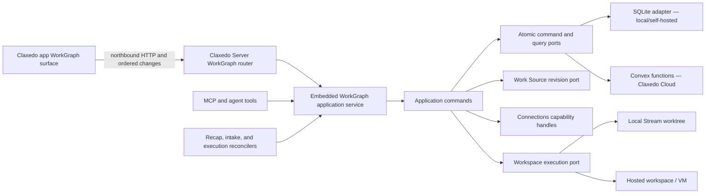
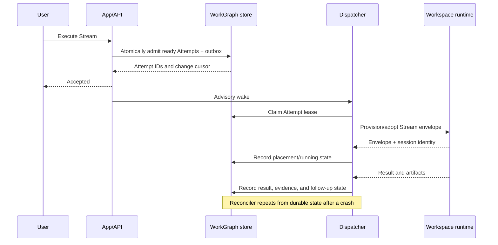

# GOAL — Execute WorkGraph End to End

## Goal Capsule

Deliver WorkGraph as the personal operating system for AI-assisted work across the Claxedo app, local/self-hosted Claxedo, and Claxedo Cloud.

The completed product has a first-class **WorkGraph** main-navigation entry immediately after **Marketplace**, a backend-neutral WorkGraph application service embedded in Claxedo Server, one northbound HTTP/JSON and ordered-change contract, SQLite as the local and default OSS adapter, Convex as the Cloud default, exact-revision source admission through agents and authoring adapters, Connections-backed personal candidates, Stream-owned execution isolation, durable background Recaps, agent/MCP parity, and end-to-end proof through real local and deployed-cloud compositions.

### Authority order

1. `packages/workgraph/PRD.md` defines product intent and user behavior.
2. `packages/workgraph/SPEC.md` defines the public service contract and acceptance criteria.
3. `packages/workgraph/ARCHITECTURE.md` defines ownership and dependency boundaries.
4. This goal defines implementation sequence, concrete code seams, and verification gates.
5. Current code supplies patterns and migration inputs; legacy behavior does not override the product contract.

### Authoritative current status

This section, the Requirements, Primary user journeys, Acceptance examples, and Implementation Units define the current goal. The dated Progress Log records point-in-time evidence and does not define the current product contract.

The approved UI is one personal WorkGraph surface at `/workgraph`. Streams expand within that surface and **Add task** is the canonical manual work action. Outcomes are optional organization within a Stream. The existing app-global WorkspacePanel and top-level toggle are the only secondary panel and control. WorkGraph contributes top-level **Needs you** and **Settings** views; the WorkGraph header controls select those views in the same panel. WorkGraph Settings is tabless and contains execution defaults only. Stream Settings is a tabless Stream-scoped dialog containing execution overrides and Recap configuration. Each Stream row exposes its latest Recap through a hover/focus Recap icon and popover. Zero attention produces no WorkGraph dot, card, list, or empty body content. Selecting a Needs you item opens its focused dialog over the same surface.

Source planning and Recap generation are strict Session V2 operations. Only valid output from the exact durable Session can publish a proposal or Recap. Invalid or unavailable output records failure, performs bounded retry, and surfaces attention without publishing generated substitute content or a notification for a nonexistent Recap.

Core adapter conformance version 3 covers snapshot/change convergence, leases, and Attempt runtime recovery for SQLite and Convex. Portable archive conformance version 1 passes for both adapters. Snapshot resume across SQLite process restart and reconstructed Convex service state is certified. Owner-level permanent deletion uses a durable read/write barrier and bounded physical cleanup in both adapters, including real hosted isolation cleanup. Bounded Attention, candidate-v2 migration, targeted detail reads, and strict configured generation profiles are implemented. The repository verification baseline is WorkGraph 248/248 and focused Claxedo Server 176/176. The approved WorkspacePanel integration, replacement browser acceptance, and a real credentialed Cloud deployment remain open; staging has not been deployed.

### Execution profile

- Execute on a dedicated goal branch and isolated worktree from `dev`.
- Treat this file as the long-running execution ledger. Append evidence to the progress log; do not rewrite completed evidence.
- Use dependency-ordered waves and keep every available agent slot assigned to safe, disjoint work. Refill completed slots immediately while independent implementation, tests, review, or evidence collection remains.
- Each wave ends with its named package tests, typechecks, architecture guards, and integration proof before the next wave begins.
- Schema changes are additive and ship before dependent hosted code.
- Keep the working product bootable after every wave.

### Stop conditions

Stop and surface a blocker only when implementation would change the Product Contract, weaken owner isolation, introduce a second credential store, make Cloud depend on SQLite or Node-native code, or require destructive handling of externally durable results.

Implementation-level naming, component decomposition, and migration mechanics may be resolved by the executing agent when they preserve the contracts and tests in this goal.

---

## Product Contract

### Problem frame

The repository contains the personal owner-scoped contracts, application services, SQLite and Convex core adapters, embedded local and hosted server compositions, northbound HTTP/change contract, MCP tools, strict Work Source planning, Connections-backed candidate admission and webhooks, Session-backed execution and Recaps, actionable notifications, the main WorkGraph Stream tree, and the execution lifecycle. The maintained production graph is V2-only apart from the explicit SQLite migration reader and schema fixture.

Repository completion remains open for the approved WorkspacePanel/settings/inspection interaction, replacement browser acceptance, and the final all-package regression gate. Release acceptance also requires a real deployed Convex/Worker/app composition and the complete Cloud browser journey with signed authentication and hosted workspace execution.

The final composition uses request-scoped owner context, adapter-neutral persistence, live Connections capability handles, launch-all-ready execution, and one primary isolation envelope per Stream with optional child isolation.

### Requirements

| ID | Requirement |
|---|---|
| R1 | Every WorkGraph record and operation is personally owned by one authenticated user. Organization membership may authorize a team Connection but does not own the WorkGraph. |
| R2 | Streams, Tasks (`Work Item` internally), optional Outcomes, Attempts, Decisions, Recaps, source views, backend candidates, source links, evidence, and durable-effect receipts are first-class records with truthful lifecycle states. |
| R3 | Work enters the executable graph only through explicit admission. Connector results and independent AI sessions remain backend candidates until the owner chooses Add to WorkGraph; they appear as aggregated Unorganized AI work in Needs you. |
| R4 | Agents, Docs v2, and explicit source actions append exact immutable Work Source revisions. “Turn into work” creates a durable `planning` record and uses an ordinary Session V2 planner to publish a reviewable Stream, optional Outcomes, Tasks, completion contracts, duplicates, and execution settings. Invalid or unavailable generation records `planning_failed` and attention without a substitute proposal. Later revisions support keep, replace disposable work, or fork. |
| R5 | Stream matching searches pinned and recent compact memory cards first, then expands to older cards only when confidence is low. Duplicate review never silently places or merges work. |
| R6 | GitHub, Linear, Jira, and future work sources use team-managed `@claxedo/connections` credentials plus a personal provider identity and saved filters. WorkGraph stores references, never provider credentials. |
| R7 | Execution settings inherit through WorkGraph → Stream → optional Outcome → Task → immutable Attempt. Every ready Task may launch; there is no product-level capacity or WIP queue. |
| R8 | One Stream owns one primary isolated execution envelope—a local worktree or remote VM/workspace. Tasks execute inside it and may request child isolation. |
| R9 | Agents may record factual state, sourced findings, artifacts, and clearly necessary follow-up work. Consequential scope or decision changes create Decisions that block only affected work. |
| R10 | Attempt termination does not imply Task completion. Completion contracts require evidence; an optional Outcome also requires success evidence and owner confirmation before closure. |
| R11 | Eight quiet hours schedule an incremental background Recap using changes since the previous Recap, current state, and prior memory. Only actionable changes notify the user. |
| R12 | Meaningful sessions created outside WorkGraph produce personal Unorganized AI work candidates after becoming idle; attachment is never automatic. |
| R13 | A Stream with no durable external effect may be deleted with its Attempts, environment, and unmerged work. A Stream with a durable effect can only close, abandoning unfinished work with reason while preserving history. |
| R14 | Domain/application code depends on public storage and runtime ports. SQLite is the local default, Convex is the Cloud default, and an OSS adapter can pass the same conformance suite. |
| R15 | Claxedo Cloud embeds the WorkGraph application service in its Worker-safe Claxedo Server control plane, mounts the same authenticated HTTP/change contract, persists through Convex, dispatches through hosted workspace runtimes, and recovers background work from durable state. |
| R16 | The Claxedo app exposes one global WorkGraph tab immediately after Marketplace. Streams expand within the main surface and Add task is the canonical manual Task action. |
| R17 | The app restores `/workgraph` on reload, consumes ordered change cursors, and contributes Needs you and execution-only Settings views to the existing app-global WorkspacePanel. The existing top-level toggle carries the attention dot only when attention exists. Stream Settings owns Stream execution and Recap configuration; targeted inspectors use focused dialogs over the same surface. |
| R18 | Every high-value UI command has equivalent typed HTTP and MCP/agent access under the same owner and authority checks. |
| R19 | A core end-to-end suite proves the personal journey across frontend and backend, and a deployed-cloud smoke proves the Convex/Worker composition. |
| R20 | Legacy docs, public docs, route lists, deployment runbooks, and package guidance describe only the final personal-first contract once migration completes. |
| R21 | Attention and candidate collections use stable owner-bound cursor pages. Query failure remains explicit and never substitutes a full snapshot or fabricated result. |
| R22 | WorkGraph Settings saves one versioned execution-defaults patch. Stream Settings saves one versioned execution-and-Recap patch. Each command is atomic, and an explicit clear removes an override. |
| R23 | Source planning and Recaps publish only strict output from their exact configured Session V2 jobs. Missing configuration and invalid output create explicit requirements or failure attention without selecting substitute content or profiles. |
| R24 | Staging deployment follows strict dependency order: additive Convex schema/functions, Worker-safe Claxedo Server, then app, followed by signed policy and browser verification. Repository dry runs are not deployment evidence. |

### Primary user journeys

#### F1. Create and execute a personal Stream

The user opens WorkGraph, creates a Stream, and uses Add task to add Tasks. An Outcome may group Tasks around a shippable result. Ready Tasks launch in the Stream envelope, and Attempt results move through truthful review/integration states until evidence satisfies each completion contract.

#### F2. Enter source text and turn it into work

The user asks an agent or Docs v2 to turn an exact idea, PRD, plan, or notes revision into work. WorkGraph stores the revision, creates a durable planning record, and schedules a strict Session V2 planner. Valid output becomes a reviewable proposal containing placement, duplicate evidence, optional Outcomes, Tasks, completion contracts, and execution defaults. The user confirms the exact rendered proposal version. Invalid generation remains `planning_failed` with attention. A later source revision shows the diff and keep/replace/fork choices.

#### F3. Stage personally relevant team work

The user configures a source view over a team GitHub, Linear, or Jira Connection and maps the provider identity plus filters. Matching issues appear under Needs you. Add to WorkGraph admits one issue, binds its external identity, and later announces meaningful results through the same Connection.

#### F4. Resume after losing context

After eight quiet hours, a strict background Session may publish an incremental Stream Recap. An actionable notification carries the exact Stream, Recap, and related record identifiers and appears under Needs you. Reading it acknowledges only the rendered notification version; a failed generation publishes neither a substitute Recap nor its notification.

#### F5. Recover work started outside WorkGraph

A meaningful independent session becomes idle and enters Unorganized AI work. WorkGraph suggests recent Streams. The user attaches it, creates a new Stream, or dismisses it until meaningful change.

#### F6. Discard or close safely

The user deletes a partially implemented Stream before integration; active Attempts cancel and the isolated worktree or VM is destroyed. If code was merged or an external result was accepted, delete is unavailable and close preserves provenance while abandoning unfinished items.

### Acceptance examples

- AE1. User A cannot list, read, mutate, subscribe to, execute, export, or delete User B’s WorkGraph records by guessing IDs or cursors.
- AE2. SQLite and Convex pass core conformance version 3 with equivalent owner, transition, idempotency, ordering, cursor, lease, and Attempt-recovery behavior. Both adapters pass archive conformance version 1, restart recovery, cleanup, and owner-level permanent deletion.
- AE3. A Work Source proposal remains non-executable until confirmed and records the exact old/new source revision pair for a later keep, replace, or fork action.
- AE4. A GitHub candidate created through a team Connection contains the Connection ID and owner’s filter/mapping but no token in database rows, events, logs, or responses.
- AE5. Executing two ready Tasks provisions one Stream envelope and two Attempts inside it; an explicitly isolated Task may receive a child worktree without becoming a second Stream.
- AE6. Killing the request process after Attempt admission does not create a second owner. Reconciliation claims the durable lease and resumes or surfaces attention according to the recorded state.
- AE7. An agent discovery can add necessary follow-up work, while changing the Outcome criteria creates a pending Decision and does not stop an unrelated ready branch.
- AE8. Eight quiet hours create exactly one Recap for the activity range; new activity resets the due time and transient generation failure retries without notifying the user.
- AE9. Before the first durable-effect receipt, Stream deletion cancels and destroys. After the receipt, the same delete command fails with a typed close-required outcome.
- AE10. Reloading `/workgraph` restores the global WorkGraph tab and expanded Stream state; reconnect from the last cursor applies each change once.
- AE11. Local and hosted E2E use the same frontend build and HTTP wire shapes; storage-specific fields never enter UI contracts.
- AE12. A staging deployment can create, read, execute a no-op test Attempt, and delete a disposable Stream through the Worker-backed Convex path with signed authentication.

### Scope boundaries

#### Included

- Personal WorkGraph domain, HTTP API, MCP tools, background workers, SQLite and Convex adapters.
- Local worktree and hosted workspace/VM execution.
- Exact-revision Work Sources from agents, Docs v2, and explicit source actions, with admission and replanning.
- Team-credential, user-filtered GitHub/Linear/Jira source views.
- One WorkGraph surface with inline Streams, Add task, optional Outcomes, and WorkGraph Needs you and execution-only Settings views in the existing app-global WorkspacePanel. Stream Settings is a tabless dialog for Stream execution and Recap configuration. Focused dialogs inspect proposals, candidates, Task execution/results, Decisions, and actionable Recaps.
- Real local/backend/browser E2E and deployed Cloud smoke.
- Deployment, observability, recovery, migrations, and current documentation.

#### Deferred to follow-up work

- Shared mutation, shared ownership, manager-assigned work, organization-wide Streams, and portfolio planning.
- Marketplace-distributed WorkGraph templates.
- Maintained storage adapters beyond SQLite and Convex; the public adapter contract and conformance suite are included.
- Cost-optimizing placement beyond explicit execution profiles.
- Notification channels beyond in-app actionable attention.
- Additional authoring adapters beyond the initial Docs v2 integration.

---

## Planning Contract

### Invariants

- I1. Owner identity comes from trusted host context. Public request bodies never select an arbitrary owner.
- I2. Provider credentials remain in Connections and are resolved immediately before each provider operation.
- I3. Cloud code imports no SQLite, `better-sqlite3`, Node filesystem, process, or local-worktree implementation.
- I4. Domain commands and wire contracts are storage-neutral and identical across local, self-hosted, and Cloud modes.
- I5. A durable command commits state, event/change record, idempotency result, and outbox work atomically.
- I6. One active Attempt has at most one valid execution lease owner.
- I7. A durable external effect is recorded before WorkGraph reports the corresponding integration as complete.
- I8. Destructive Stream deletion and durable-effect recording cannot both commit.
- I9. UI, HTTP, MCP, and background workers call the same application commands rather than implementing parallel state machines.
- I10. The app remains feature-owned: WorkGraph UI lives under `features/workgraph`; app composition contributes routes, content, commands, and sidebar entry without feature-to-feature imports.
- I11. Convex schema evolution is additive-first and follows `docs/tech-docs/convex-schema-evolution.md` plus the schema-only deployment gate.
- I12. Every browser assertion is backed by observable state or request evidence; no sleep is the sole proof of a negative.
- I13. HTTP/JSON and ordered-change delivery are northbound client transports only. Claxedo Server MCP tools, execution dispatchers, Recap/intake reconcilers, and scheduled handlers invoke the embedded WorkGraph application service in process.
- I14. Mocked routes and runtime doubles may support focused component tests, but no mocked browser, intercepted route, seeded postcondition, direct database mutation, or static prototype counts as core E2E or final acceptance evidence.

### Key technical decisions

| ID | Decision | Rationale | Consequence |
|---|---|---|---|
| KTD1 | Replace the legacy process-global WorkGraph registry with request-scoped application services bound to a trusted `WorkGraphContext`. | Personal isolation cannot be retrofitted around global mutable state. | HTTP, MCP, workers, and tests construct services explicitly. |
| KTD2 | Define capability-focused command/query ports, not a generic SQL repository. | Convex mutations and SQLite transactions have different mechanics but can implement the same atomic domain commands. | Adapters expose commands such as admit, transition, claim, append evidence, and close rather than leaking query builders. |
| KTD3 | Embed WorkGraph application services in Claxedo Server and keep the frontend on one HTTP/JSON + ordered-change-cursor contract. | Claxedo Server is the WorkGraph host, and direct Convex UI access would couple the app to the hosted adapter. | HTTP/change delivery is northbound only; server workers, scheduled handlers, reconcilers, and MCP call the service in process; local and Cloud differ only by adapters. |
| KTD4 | Use public authenticated Convex functions for user commands and service/internal functions for workers. | Interactive calls should derive owner identity from the user JWT; workers need durable access without impersonating arbitrary owners. | Service functions validate the control-plane token and accept a persisted owner reference only for already-due jobs. |
| KTD5 | Treat each domain mutation as an event/change-producing atomic command. | Realtime, recovery, audit, and idempotency need one committed source of change. | SQLite writes in one transaction; each Convex mutation writes all affected tables and the ordered change row. |
| KTD6 | Provision one Stream envelope lazily at first execution. | Empty/planning Streams should not consume a worktree or VM, while all executable work needs a stable isolation owner. | Stream stores desired placement before provision and stable envelope identity afterward. |
| KTD7 | Admit Attempts durably before advisory dispatch. | HTTP requests and Worker isolates can disappear after admission. | Immediate dispatch improves latency; reconcilers recover admitted/expired work without duplicating ownership. |
| KTD8 | Use existing workspace runtime and sandbox-manager contracts for hosted placement. | Cloud already owns VM/workspace lifecycle and relay routing. | WorkGraph adds orchestration intent and leases, not another VM provider abstraction. |
| KTD9 | Run Recaps and matching through normal Claxedo agent sessions with explicit model/effort profiles. | This preserves model selection, permission behavior, observability, and future provider portability. | WorkGraph persists prompts, inputs, outputs, and provenance but contains no direct vendor-specific LLM client. |
| KTD10 | Store exact source text from agents, explicit source actions, and authoring adapters as immutable Work Source revisions; represent admission as strict Session planning plus explicit confirmation. | Replanning needs stable provenance across every capture path. | Docs v2 is the initial authoring adapter; additional adapters append equivalent revisions through the source port. |
| KTD11 | Use compact deterministic candidate selection before model ranking. | Loading all Streams is unbounded and expensive. | Pinned/recent cards form the first bounded set; an older-card page is requested only below the confidence threshold. |
| KTD12 | Make WorkGraph one global content surface with inline Stream expansion and route-restorable state. | It is a personal main destination, not a project-owned tool. | `/workgraph` focuses one reusable tab; the sidebar row follows Marketplace and Add task is the canonical manual Task action. |
| KTD13 | Build one canonical E2E journey and run it through multiple compositions. | Separate local and Cloud tests often drift into testing different products. | Shared fixtures and assertions prove the same wire contract; environment-specific setup stays in adapters. |
| KTD14 | Migrate legacy data only when it maps truthfully; retain an export and compatibility read window before removing old tables/routes. | Fabricating Streams, owner identity, or completion evidence would corrupt user trust. | Ambiguous legacy rows enter an owner-visible migration intake/archive instead of pretending to be completed product records. |
| KTD15 | Publish the runtime-neutral DTOs and validators as `@claxedo/workgraph/contracts`. | Re-declaring wire shapes in the app, server, MCP package, and adapters would create silent contract drift. | Consumers import the pure contracts export; the export graph is guarded against database, runtime, and provider dependencies. |

### High-level technical design





### Domain and persistence shape

The domain package defines stable IDs, command inputs/results, state unions, transition guards, event/change envelopes, and public DTOs. Storage adapters may use different physical layouts but must support the following logical records:

- WorkGraph execution defaults, edited in the tabless WorkspacePanel Settings view; Stream execution overrides and Recap configuration, edited atomically in tabless Stream Settings.
- Streams and Stream memory cards.
- Optional Outcomes, criteria, evidence, closure, and reopen provenance.
- Tasks (`Work Item` internally), completion contracts, dependencies, source links, and evidence.
- Stream envelopes, immutable Attempts, leases, sessions, artifacts, and result state.
- Decisions and affected/dependent work references.
- Recaps, quiet-window scheduling state, and actionable attention.
- Source views, provider identity mappings, filters, sync policies, external identities, webhook/refresh receipts, and backend candidates.
- Work Sources, immutable source revisions/content hashes, admission proposals, exact revision pairs, diff summaries, confirmations, and replanning actions.
- Durable-effect receipts.
- Ordered owner/Stream changes, operation-id results, outbox entries, and schema version metadata.

SQLite field names remain snake_case. Convex tables use the same logical vocabulary and owner-first indexes. Public DTOs use one canonical wire naming convention selected in U1 and are converted at adapter boundaries.

### State machines

```text
Stream lifecycle: active ↔ paused → closed → reopened → active
Stream visibility: visible ↔ archived
Stream deletion: active/paused/closed → [removed] only when durable_effect_count = 0

Outcome: pending → active → ready_to_close → completed
                   ↘ blocked                 ↘ reopened → active

Work Item: pending → active → result_ready → completed
                   ↘ review_needed | integration_needed | blocked
                   ↘ verification_failed | failed | abandoned

Attempt: admitted → placing → running → result
                                  ↘ attention | failed | cancelled

Decision: proposed → pending → answered | dismissed

Candidate admission: candidate → staged | linked | merged | dismissed
```

Transitions use compare-and-set versioning and operation IDs. State correction is a new provenance-bearing command, not an in-place history rewrite.

### HTTP contract

The backend-neutral router is mounted at `/api/workgraph` locally and in hosted mode. It includes:

- WorkGraph and Stream settings/defaults;
- Streams, memory cards, matching, lifecycle, envelope state, and execution;
- optional Outcomes, criteria, evidence, closure, and reopen;
- Tasks, dependencies, completion contracts, evidence, retry, pause, and cancel;
- Attempts, Decisions, Recaps, attention, and artifacts;
- backend candidate admission, source views, provider preview/refresh, staging, and sync policy;
- Work Source create/revise and admission proposal/confirm/replan;
- Unorganized AI work candidates;
- ordered changes with cursor pagination and bounded long polling;
- export and account deletion.

Every mutating request accepts an operation ID and returns the committed change cursor. Repeating the same operation returns the original result. A conflicting reuse returns a typed idempotency error.

### Realtime and background execution

- The app performs an initial snapshot query, then follows `/changes?cursor=...` using bounded long polling. A future transport may provide SSE without changing cursor semantics.
- Local composition schedules reconciliation through a process-local wake plus periodic durable scan.
- Convex scheduled functions mark or enqueue due Recaps, source refreshes, expired leases, and admitted Attempts.
- The hosted Claxedo Server Worker handles low-latency advisory wakes and scheduled reconciliation by calling its embedded application service in process; each reconciler claims durable work before external action.
- Notifications are projections of actionable attention, not a second source of truth.

### Work Source contract

Agents, explicit source actions, and Docs v2 append immutable Work Source revisions with content hashes; admission and replanning bind those revision IDs. Docs v2 is the initial authoring adapter. Additional authoring surfaces append equivalent exact revisions through the Work Source port without changing admission semantics.

### Migration strategy

1. Introduce pure contracts and ports while legacy code remains readable.
2. Add versioned SQLite tables and owner context additively.
3. Add Convex tables/functions in an additive schema-only deployment.
4. Move HTTP/MCP/app consumers to the new application services.
5. Export and classify legacy rows; migrate only truthful mappings.
6. Hold a compatibility read window with telemetry for old routes.
7. Remove raw-token, singleton registry, legacy CRUD, scheduler-capacity, and obsolete orchestration surfaces after all gates pass.

### Risks and mitigations

| Risk | Mitigation |
|---|---|
| Owner isolation leaks through guessed IDs, cursors, workers, or MCP arguments | Owner-first indexes, trusted context, cross-user conformance tests, and negative HTTP/MCP/browser scenarios. |
| SQLite and Convex drift semantically | Command-level conformance suite with identical fixtures and normalized results; Cloud smoke exercises real Convex. |
| Worker termination duplicates execution or connector writes | Durable admission, leases, operation IDs, receipts, and reconciliation tests with injected interruption boundaries. |
| Stream deletion races with merge/publish | Atomic durable-effect receipt and delete guard; race test requires exactly one command to win. |
| VM/worktree cleanup loses integrated work | Close path secures durable receipts and references before cleanup; delete path is available only before durable effects. |
| Recap/matching costs grow with history | Incremental Recaps, compact memory cards, bounded recent-first candidate sets, pagination, and configurable model/effort. |
| Large pasted source text exhausts matching/planning context | Store the complete immutable revision, derive bounded summaries/sections for model use, and preserve direct retrieval of the original text. |
| Hosted Connections cannot resolve a team capability | Fail closed with actionable source-view attention; hosted operations require a valid Connections capability. |
| UI becomes a dashboard without execution truth | E2E journey must create, execute, reconcile, decide, and close through real backend commands. |
| Legacy tests bless obsolete behavior | Add characterization only for migration inputs; new conformance and product E2E are the release authority. |

---

## Implementation Units

### Unit index

| Unit | Title | Primary paths | Depends on |
|---|---|---|---|
| U1 | Domain contracts and storage ports | `packages/workgraph/src/domain/`, `packages/workgraph/src/ports/` | None |
| U2 | SQLite adapter and legacy migration | `packages/workgraph/src/adapters/sqlite/` | U1 |
| U3 | Convex adapter and Cloud persistence | `convex/workgraph*.ts`, hosted Convex adapter | U1 |
| U4 | Authenticated HTTP, changes, and composition | WorkGraph router, local/hosted mounts | U1-U3 |
| U5 | Stream isolation and durable execution | execution ports, local/hosted dispatchers | U2-U4 |
| U6 | Connections source views and intake | connectors, Connections host integration | U2-U4 |
| U7 | Source admission, Recaps, sessions, and MCP | source ports, workers, MCP tools | U4-U6 |
| U8 | First-class WorkGraph app surface | `packages/claxedo-app/src/features/workgraph/` | U4, U7 |
| U9 | Core E2E across local and hosted contracts | WorkGraph/server/app E2E | U5-U8 |
| U10 | Cloud deployment, rollout, cleanup, and docs | Convex/Worker workflows, runbooks, legacy removal | U9 |

### U1. Define the personal domain, commands, and adapter contract

**Goal:** Establish the storage-neutral source of truth that every adapter and surface consumes.

**Requirements:** R1-R3, R7-R14, R17-R18.

**Dependencies:** None.

**Files:** `packages/workgraph/src/contracts/`, `packages/workgraph/src/domain/`, `packages/workgraph/src/ports/`, `packages/workgraph/src/application/workgraph-service.ts`, `packages/workgraph/test/command-contracts.test.ts`, `packages/workgraph/test/domain-rules.test.ts`, `packages/workgraph/test/conformance/`, `packages/workgraph/src/conformance/`, `packages/workgraph/src/index.ts`, `packages/workgraph/package.json`.

**Approach:** Define `WorkGraphContext`, owner-bound IDs/DTOs, versioned commands, normalized typed errors, transition guards, execution inheritance, completion evaluation, deletion/closure guards, and an `AtomicWorkGraphStore` composed from capability-focused commands and queries. Publish the DTOs and runtime validators through a pure `@claxedo/workgraph/contracts` export consumed by the app, server, MCP package, and adapter tests. Keep that export Worker-safe and free of database/provider/runtime imports. External I/O is represented by ports; application services coordinate it without importing SQLite, Convex, Node filesystem, or provider SDKs. Define a conformance harness that adapters call with a factory and deterministic clock/ID source.

**Execution note:** Write transition, idempotency, owner-boundary, and profile-resolution tests before moving existing stores.

**Patterns to follow:** Package boundary discipline in `packages/claxedo-connections/src/types.ts`; trusted auth vocabulary in `packages/claxedo-server/src/control-plane/auth.ts`; owner and service helpers in `convex/model.ts`.

**Test scenarios:**

1. Execution profile resolution identifies the winning WorkGraph, Stream, optional Outcome, or Task value and freezes an Attempt snapshot.
2. Invalid Work Item, Outcome, Attempt, and Decision transitions return typed errors without writing an event.
3. A pending Decision blocks only its affected and dependent Work Items.
4. Completion evidence can move a Work Item to review/integration/verification states but only a satisfied contract completes it.
5. Outcome criteria produce `ready_to_close`; owner confirmation completes; contradictory evidence reopens with provenance.
6. A Stream with zero durable-effect receipts accepts delete; one with a receipt returns `close_required`.
7. Repeating an operation ID returns the same result; reusing it with a different command fails.
8. Context cannot be overridden by command payload owner fields because such fields do not exist in public inputs.
9. The `./contracts` export loads in a browser/Worker import check without pulling SQLite, Node, Convex, workspace runtime, or provider SDK code.

**Verification:** Pure package typecheck and focused tests pass without loading `better-sqlite3`, Convex, or Node-native modules.

### U2. Build the SQLite adapter and truthful legacy migration

**Goal:** Make SQLite the complete local/self-hosted implementation of the new contract and safely transition useful legacy state.

**Requirements:** R1-R3, R7-R14, R17, R20; AE1-AE2, AE5-AE9.

**Dependencies:** U1.

**Files:** `packages/workgraph/src/adapters/sqlite/schema.ts`, `packages/workgraph/src/adapters/sqlite/store.ts`, `packages/workgraph/src/adapters/sqlite/legacy-migration.ts`, `packages/workgraph/test/sqlite-schema-v2.test.ts`, `packages/workgraph/test/sqlite-store-commands.test.ts`, `packages/workgraph/test/sqlite-legacy-migration.test.ts`, `packages/workgraph/test/conformance/sqlite.test.ts`, `packages/workgraph/src/db/schema.ts`, `packages/workgraph/src/sqlite.ts`, `packages/claxedo-server/src/server-workgraph.ts`, `packages/claxedo-server/src/server-workgraph.test.ts`.

**Approach:** Add versioned snake_case tables and owner-first indexes for the logical records in the Planning Contract. Implement atomic commands with SQLite transactions, compare-and-set versions, monotonic per-Stream changes, operation results, leases, and outbox entries. Replace filename-keyed singleton registry use with constructed services. Create an export-first legacy migration that maps only provable owner/work/source state; ambiguous runs/items become owner-visible migration candidates with raw source references. Implement the separate portable archive port and archive conformance version 1 for SQLite. Retain old tables during the compatibility window.

**Execution note:** Characterize only the legacy behaviors required to migrate data; the conformance suite is authoritative for the final adapter.

**Patterns to follow:** Drizzle/SQLite snake_case rules in root `AGENTS.md`; local server lazy mounting in `packages/claxedo-server/src/server-workgraph.ts`; versioned migration discipline in `packages/claxedo-server/src/storage/`.

**Test scenarios:**

1. A fresh database passes the full store conformance suite under a stable local owner.
2. Two owners using one database cannot collide on external identity, operation ID, Stream sequence, or source view.
3. State and event/outbox/change rows commit together; injected failure rolls back all of them.
4. Expired lease claim succeeds once and increments its epoch; concurrent claims produce one owner.
5. Cursor pagination is stable across concurrent inserts and reconnect returns every later change once.
6. Export/restore round-trips every first-class record and preserves IDs/provenance.
7. Legacy raw provider tokens are excluded from the new tables and export.
8. Ambiguous legacy completion or ownership is not fabricated; it appears as a migration candidate with an explanation.
9. Local server starts without hosted dependencies and mounts the new router lazily.

**Verification:** `packages/workgraph` conformance and existing regression suites pass; `packages/claxedo-server` local composition tests pass; a local database export contains no credential material.

### U3. Implement Convex persistence and Cloud adapter semantics

**Goal:** Make Convex the durable multi-user WorkGraph implementation for Claxedo Cloud.

**Requirements:** R1-R3, R11, R14-R15, R17; AE1-AE2, AE6, AE8, AE11-AE12.

**Dependencies:** U1.

**Files:** `convex/schema.ts`, `convex/workgraphModel.ts`, `convex/workgraphCommands.ts`, `convex/workgraphRuntime.ts`, `convex/workgraphChanges.ts`, `convex/workgraphBackground.ts`, `convex/workgraphConnections.ts`, `convex/workgraphIntake.ts`, `convex/workgraphNotifications.ts`, `convex/crons.ts`, `packages/claxedo-server/src/workgraph-host/convex-api.ts`, `packages/claxedo-server/src/workgraph-host/convex-store.ts`, `packages/claxedo-server/src/workgraph-host/convex-store.test.ts`, `packages/claxedo-server/src/control-plane/convex-workgraph-policy.test.ts`.

**Approach:** Add owner-first tables and indexes to root Convex schema. Public functions use `authedQuery`/`authedMutation` and resolve the user from JWT identity. Scheduled/internal work queries only due records. Service functions require `CLAXEDO_CONTROL_PLANE_SERVICE_TOKEN` and operate on already persisted owner/resource IDs rather than accepting untrusted arbitrary owner selection. Each mutation applies one atomic command and appends its change/outbox/idempotency rows. The Worker-side adapter uses `ConvexHttpClient` behind the neutral WorkGraph port and forwards user bearer auth for interactive commands. Convex implements core conformance version 3; portable archive parity is a separate open unit.

**Execution note:** Ship schema additions alone through the Convex schema workflow before deploying code that requires them.

**Patterns to follow:** `convex/model.ts`, `convex/workspaces.ts`, `convex/sandboxLeases.ts`, `packages/claxedo-server/src/control-plane/adapters/convex/`, and `docs/tech-docs/convex-schema-evolution.md`.

**Test scenarios:**

1. Public functions reject missing/wrong-issuer identity and derive owner from authenticated user.
2. User A cannot read or mutate User B’s IDs, cursors, external identities, or Attempts.
3. Service functions reject missing/wrong service token and cannot create owner-selected interactive commands.
4. Core conformance version 3 proves command idempotency, compare-and-set, event/change ordering, lease epochs, and Attempt recovery equivalent to SQLite.
5. Due Recap/source/Attempt queries return bounded pages and cannot claim the same row twice.
6. Additive schema accepts existing production-shaped fixtures without migration.
7. Worker adapter error mapping produces the same typed public errors as SQLite.

**Verification:** Convex dry-run/codegen/typecheck passes; policy tests prove auth boundaries; normalized adapter fixtures match SQLite; schema-only staging deployment succeeds before U4.

### U4. Mount one authenticated HTTP contract locally and in Cloud

**Goal:** Expose the complete application service through identical local and hosted routes, ordered changes, and recovery hooks.

**Requirements:** R1-R4, R13-R18; AE1-AE3, AE6, AE9-AE12.

**Dependencies:** U1, U2, U3.

**Files:** `packages/workgraph/src/http/contracts.ts`, `packages/workgraph/src/http/router.ts`, `packages/workgraph/src/http/router.test.ts`, `packages/claxedo-server/src/server-workgraph.ts`, `packages/claxedo-server/src/workgraph-host/hosted.ts`, `packages/claxedo-server/src/workgraph-host/hosted-runtime.ts`, `packages/claxedo-server/src/workgraph-host/intake-router.ts`, `packages/claxedo-server/src/workgraph-host/webhook-router.ts`, `packages/claxedo-server/src/hosted-app.ts`, `packages/claxedo-server/src/hosted-app.test.ts`, `packages/claxedo-server/src/worker.ts`, `packages/claxedo-server/src/worker.import-graph.test.ts`.

**Approach:** Construct the WorkGraph application service inside Claxedo Server and mount one backend-neutral Hono router over it with trusted context middleware. The router and ordered-change endpoints are the northbound frontend boundary. MCP registration, advisory wakes, scheduled handlers, and reconcilers receive the same service instance and invoke commands directly in process. Local mode derives the stable local user or signed user when configured. Hosted mode requires signed auth, composes the service with the Convex adapter, and fails closed when authority/service configuration is absent. Add snapshot and bounded long-poll change endpoints with stable cursors. Scheduled reconciliation operates from durable due queues. Extend the Worker import-graph guard so hosted WorkGraph cannot pull local/server-native modules.

**Patterns to follow:** `packages/claxedo-server/src/hosted-app.ts`, `packages/claxedo-server/src/workgraph-host/hosted.ts`, `packages/claxedo-server/src/workgraph-host/hosted-runtime.ts`, and existing `localOnlyProjection` handling.

**Test scenarios:**

1. Every route rejects cross-owner IDs and ignores client attempts to supply owner identity.
2. Hosted routes require signed auth and fail closed when Convex URL or required service capability is absent.
3. Local routes run with SQLite and no Convex/Clerk dependency.
4. Repeated mutation operation ID returns the original HTTP status/body/cursor.
5. Snapshot plus cursor changes converges when changes occur during initial load.
6. Long poll returns on a new change or bounded timeout and reconnect never skips a committed cursor.
7. Worker import graph contains no SQLite, Node filesystem, or local execution implementation.
8. Scheduled handler claims bounded durable pages and one failed job does not prevent later jobs from reconciliation.
9. MCP and scheduled reconciliation tests prove direct application-service invocation without loopback HTTP requests.

**Verification:** WorkGraph router, server, hosted app, scheduled worker, and import-graph suites pass in their package directories.

### U5. Implement Stream-owned isolation and durable execution

**Goal:** Execute every ready Work Item inside its Stream’s isolated worktree/VM with durable Attempt ownership, truthful completion, and safe cleanup.

**Requirements:** R7-R10, R13, R15, R17-R18; AE5-AE7, AE9, AE12.

**Dependencies:** U2, U3, U4.

**Files:** `packages/workgraph/src/application/execution-service.ts`, `packages/workgraph/src/application/completion-service.ts`, `packages/workgraph/src/application/stream-lifecycle-service.ts`, `packages/workgraph/src/ports/workspace-execution.ts`, `packages/workgraph/test/execution-service.test.ts`, `packages/workgraph/test/execution-hardening.test.ts`, `packages/claxedo-server/src/workgraph-host/local-execution.ts`, `packages/claxedo-server/src/workgraph-host/hosted-runtime.ts`, `packages/claxedo-server/src/execution-reconciler.ts`, `packages/claxedo-server/src/execution-reconciler.test.ts`, `packages/claxedo-server/src/workgraph-session-gateway.ts`.

**Approach:** Introduce a `WorkspaceExecutionPort` for provision/adopt envelope, create child isolation, launch/steer/cancel session, collect result/evidence, integrate result, and destroy envelope. Refactor the existing local execution adapter so one Stream worktree is primary instead of one node worktree. Hosted execution provisions or adopts an existing Cloud workspace/VM through the sandbox manager and routes sessions through the existing runtime/relay contracts. Admit ready Attempts atomically, then dispatch. Reconciliation handles admitted, expired-lease, missing-session, and terminal-without-semantic-result states. Durable-effect recording gates delete vs close.

**Execution note:** Start with interruption and deletion/integration race tests. Do not rely on a continuously alive process for correctness.

**Patterns to follow:** `packages/claxedo-server/src/workgraph-host/local-execution.ts`, `packages/claxedo-server/src/execution-reconciler.ts`, `@claxedo/sandbox-manager` lease semantics, and V2 Session durable prompt admission rules in root `AGENTS.md`.

**Test scenarios:**

1. Two ready items share one Stream envelope and receive immutable resolved profiles.
2. A child-isolated Work Item receives a child worktree/session whose cleanup remains owned by the Stream.
3. Pause prevents new Attempts while active Attempts continue; explicit cancel targets only selected active Attempts.
4. Crash after admission, placement, session launch, result, and integration receipt converges without duplicate execution or external effect.
5. Transient placement/provider failure retries; repeated/semantic/ambiguous failure creates attention.
6. Session stop without semantic result does not mark the Work Item completed.
7. Completion contract failure produces review/integration/verification state and may add necessary follow-up work.
8. Delete before durable effect cancels Attempts, destroys children/envelope, and removes unmerged work.
9. Concurrent delete and durable-effect receipt produce exactly one winner; receipt winner forces close.
10. Close abandons unfinished items with reason, preserves history/evidence/references, and cleans the runtime.

**Verification:** Local real-worktree integration tests and hosted runtime-port reconciliation tests pass; runtime doubles are confined to interruption-focused component tests and are not E2E evidence. No Attempt can have two active leases; cleanup is idempotent.

### U6. Replace legacy credentials with Connections-backed personal candidates

**Goal:** Import and synchronize personally relevant GitHub, Linear, and Jira work through team Connections without credential duplication.

**Requirements:** R3, R5-R6, R9, R14-R15, R17-R18; AE4, AE7.

**Dependencies:** U2, U3, U4.

**Files:** `packages/workgraph/src/application/source-view-service.ts`, `packages/workgraph/src/application/intake-service.ts`, `packages/workgraph/src/application/matching-service.ts`, `packages/workgraph/src/application/webhook-intake-service.ts`, `packages/workgraph/src/connectors/`, `packages/claxedo-connections/src/`, `packages/claxedo-server/src/workgraph-host/connections.ts`, `packages/claxedo-server/src/workgraph-host/hosted-connections.ts`, `packages/claxedo-server/src/workgraph-host/hosted-intake.ts`, `packages/claxedo-server/src/workgraph-host/webhook-router.ts`, `packages/claxedo-server/src/control-plane/convex-workgraph-intake.test.ts`.

**Approach:** Define personal source views containing team Connection ID, provider user mapping, filters, refresh/webhook configuration, and sync policy. Resolve a live `CapabilityHandle` per operation and call `getToken()` only inside the server-side connector boundary. Report authorization failures through the handle. Remove WorkGraph credential CRUD, raw-token schema, and Composio connected-account assumptions. Normalize external items into backend candidates, apply user filters, enforce external identity idempotency, run bounded Stream/duplicate matching, and require explicit admission. Relevant candidates appear through Needs you with Add to WorkGraph as the user action. Default sync-back announces meaningful results while the external tracker remains team-state authority.

**Execution note:** Extend the existing Connections emulator plan so the final consumer test uses this implementation rather than the legacy resolver.

**Patterns to follow:** `packages/claxedo-connections/src/types.ts`, `packages/claxedo-server/src/connections-host/`, and `docs/plans/2026-07-06-005-test-connections-e2e-emulate-plan.md`.

**Test scenarios:**

1. Team Connection plus personal provider mapping/filter creates only matching owner candidates.
2. Two users sharing credentials receive separate candidates, external identities, and filters.
3. Token is obtained immediately before provider call, never returned, logged, persisted, or included in events.
4. Provider 401 reports auth failure and creates actionable source-view attention without leaking response credentials.
5. Repeated webhook/refresh delivery updates one candidate/external identity.
6. Add to WorkGraph requires explicit confirmation and duplicate disposition before executable Work Item creation.
7. Recent/pinned matching expands to older memory cards only under low confidence.
8. Announce, silent, and full sync policies produce their declared external effects with receipts and idempotency.

**Verification:** Connector/unit/conformance suites pass; emulator consumer flow proves UI/server/Connections/provider round trip; secret scans over persistence/log fixtures are empty.

### U7. Integrate source admission, Recaps, independent sessions, and MCP

**Goal:** Connect WorkGraph to the user’s real AI work surfaces and expose the complete high-value action set to agents.

**Requirements:** R3-R5, R9-R12, R17-R18; AE3, AE7-AE8.

**Dependencies:** U4, U5, U6.

**Files:** `packages/workgraph/src/application/work-source-service.ts`, `packages/workgraph/src/application/source-admission-service.ts`, `packages/workgraph/src/application/recap-service.ts`, `packages/workgraph/src/application/session-intake-service.ts`, `packages/workgraph/src/application/attention-service.ts`, `packages/workgraph/src/application/notification-service.ts`, `packages/workgraph/src/adapters/sqlite/source-planning-runtime.ts`, `packages/workgraph/src/adapters/sqlite/recap-runtime.ts`, `packages/workgraph/src/adapters/sqlite/session-intake.ts`, `packages/claxedo-server/src/workgraph-session-gateway.ts`, `packages/claxedo-server/src/workgraph-host/session-intake.ts`, `packages/claxedo-server/src/workgraph-host/hosted-runtime.ts`, `packages/claxedo-mcp/src/workgraph-tools.ts`, `packages/claxedo-mcp/src/workgraph-tools.test.ts`, `packages/claxedo-mcp/skills/workgraph/SKILL.md`.

**Approach:** Add a Work Source service that appends exact immutable revisions from agents, explicit source actions, and Docs v2, computes content hashes, and derives bounded model input without discarding the original. Admission begins in `planning`; only valid output from the exact Session V2 job may publish a non-executable proposal for owner confirmation. Invalid or unavailable output records `planning_failed`, bounded retry, and attention. Replanning implements keep, replace disposable work, and fork with exact revision provenance. Subscribe to session lifecycle events and create Unorganized candidates only after meaningful independent work becomes idle. Schedule Recaps from durable quiet-window state; only valid output from the exact background Session may publish a Recap and actionable notification. Register typed WorkGraph MCP tools for source create/revise, list/get/create/propose/admit/execute/pause/cancel/record finding/add follow-up/propose Decision/answer Decision/attach evidence/recap/close/delete, with caller-bound owner and Attempt authority.

**Execution note:** Test source revision races, incremental recap ranges, and MCP authority before visual integration.

**Patterns to follow:** Atomic revision allocation patterns in existing Claxedo document storage, first-party MCP materialization, and V2 Session context/execution boundaries.

**Test scenarios:**

1. “Turn into work” stores the exact Work Source revision ID/content hash and creates no executable work before confirmation.
2. A changed head between proposal and confirmation returns stale proposal and preserves user edits.
3. Keep admits selected additions; replace cancels/discards affected unmerged work; fork preserves the original Stream.
4. Matching uses a bounded recent/pinned first pass and explains alternatives/confidence.
5. Eight quiet hours produce one incremental Recap only from valid exact-Session output; activity resets the deadline; repeated failure creates attention without a Recap or notification.
6. A Recap prompt includes current state, previous Recap, and changed range but not complete historical sessions.
7. An independent meaningful idle session creates one candidate; dismissal suppresses until meaningful change.
8. MCP caller cannot select another owner/Stream/Attempt or expand scope without a Decision.
9. UI and MCP commands return the same command results and change cursors.

**Verification:** Work Source contract tests, recap/session worker tests, MCP parity tests, and package architecture guards pass.

### U8. Build WorkGraph as the main app tab after Marketplace

**Goal:** Deliver the approved personal WorkGraph interactions in the Claxedo app.

**Requirements:** R1-R13, R16-R18; AE10-AE11.

**Dependencies:** U4, U7.

**Files:** `packages/claxedo-app/src/features/workgraph/`, `packages/claxedo-app/src/app/workbench/rail/global-navigation.tsx`, `packages/claxedo-app/src/app/workbench/rail/rail-sidebar.tsx`, `packages/claxedo-app/src/app/workbench/rail/rail-sidebar-shell.tsx`, `packages/claxedo-app/src/app/app-shell-layout.tsx`, `packages/claxedo-app/src/app/app-shell-actions.ts`, `packages/claxedo-app/src/app/app-shell-route-sync.ts`, `packages/claxedo-app/src/app/workbench/state/types.ts`, `packages/claxedo-app/src/app/workbench/state/orchestration.ts`, `packages/claxedo-app/src/app/workbench/state/route-intent.ts`, `packages/claxedo-app/src/app/integrations/first-party-content-surfaces.tsx`, `packages/claxedo-app/src/platform/identity/route.ts`, `packages/claxedo-app/src/app/entry/app.tsx`.

**Approach:** Keep `workgraph` as one global content type and one reusable `/workgraph` tab. Add the sidebar row immediately after Marketplace in the same main-navigation group on desktop/mobile. Streams expand within the main surface, Add task remains the canonical manual Task action, and Outcomes are optional. Reuse the existing app-global WorkspacePanel and top-level toggle. WorkGraph contributes top-level Needs you and Settings views; the WorkGraph header controls select those views in the same panel instance. WorkGraph Settings is tabless and contains execution defaults only. Stream Settings is a tabless Stream-scoped dialog containing execution overrides and Recap configuration. Settings content is flush, descriptions and errors sit beside their fields, and the action footer stays pinned. Each Stream row exposes its latest Recap through a hover/focus Recap icon and popover. The existing toggle shows a small accessible dot only when bounded Attention is non-empty; zero attention leaves the body empty and renders no WorkGraph dot, card, or list. Proposal/candidate review, Task and Attempt execution/results, Decisions, and actionable Recaps open focused dialogs over the same surface. Use owner-scoped Attention, bounded candidate pages, and targeted-detail queries with one cursor synchronizer; API failure remains explicit. Preserve loading, offline, reconnecting, conflict, unauthorized, keyboard, narrow-viewport, and screen-reader behavior.

**Execution note:** Build the route/content state model and API fixture tests before visual polish. Use current Claxedo design tokens and interaction patterns.

**Patterns to follow:** Marketplace global surface in `app/workbench/state/orchestration.ts`, route identity in `platform/identity/route.ts`, content registry in `app/integrations/first-party-content-surfaces.tsx`, and sidebar rows around `sidebar-marketplace-entry`.

**Test scenarios:**

1. Sidebar order is New Project, Pages when available, Marketplace, WorkGraph; collapsed/mobile variants expose the same accessible ordering.
2. Clicking WorkGraph creates one reusable global tab; repeated click focuses it; reload restores `/workgraph` and expanded Stream state.
3. Needs you renders loading/offline/reconnecting/error or populated attention; zero attention leaves its body empty and removes the WorkGraph indicator.
4. User creates a Stream and Task through Add task, optionally groups it in an Outcome, edits WorkGraph execution defaults in the panel Settings view and Stream execution/Recap settings in the Stream dialog, and sees resolved source labels.
5. Execute/pause/cancel/Decision actions optimistically reflect only safe pending state and reconcile from committed cursor.
6. Attempt result cannot visually appear completed before completion evidence satisfies the contract.
7. Delete confirmation explains environment/unmerged-work destruction; durable-effect Stream presents close instead.
8. Proposal/candidate review shows exact provenance and requires confirmation from Needs you; the candidate action is Add to WorkGraph.
9. Keyboard users can navigate the main tab, create work, use Add to WorkGraph, answer a Decision, inspect evidence, and close an optional Outcome.
10. At 375×812, navigation and inline Stream content remain operable without hiding primary actions or creating horizontal overflow.

**Verification:** Focused Bun/Vitest UI tests, route/persistence tests, app architecture guards, typecheck, mobile smoke, and visual browser review pass.

### U9. Build the core WorkGraph E2E proof

**Goal:** Prove the product journey across backend and frontend, with adapter parity and deployed Cloud behavior.

**Requirements:** R1-R19; AE1-AE12.

**Dependencies:** U5, U6, U7, U8.

**Files:** `packages/workgraph/test/e2e/personal-journey.test.ts`, `packages/workgraph/test/conformance/`, `packages/workgraph/src/conformance/`, `packages/claxedo-server/src/server-workgraph.test.ts`, `packages/claxedo-server/src/workgraph-host/hosted-runtime.test.ts`, `packages/claxedo-app/e2e/playwright/core-workgraph.spec.ts`, `packages/claxedo-app/e2e/helpers/workgraph-browser-use-server.ts`, `packages/claxedo-app/e2e/helpers/workgraph-connection-browser-use-server.ts`, `packages/claxedo-server/scripts/smoke/smoke-workgraph.ts`, `packages/claxedo-app/playwright.config.ts`.

**Approach:** Create one canonical fixture/journey and reuse its transitions and assertions without injecting completed state. The backend E2E runs the application service with real SQLite. Core adapter parity runs conformance version 3 and archive conformance version 1 against SQLite and test-isolated Convex functions. The core browser spec starts the real frontend, embedded Claxedo Server service, SQLite store, and real local execution path; it creates journey state through the approved single-surface UI or public HTTP commands and uses no page-level route interception. Hosted smoke runs after Convex schema/functions, Worker, and app deployment with signed staging identities, creates a disposable Stream and Task, executes a controlled no-op Attempt through the hosted runtime, follows its changes, proves cross-user denial, and deletes the Stream after cleanup. An independent Browser Use operator then drives the approved deployed journey through visible UI controls, reloads and revisits state, captures evidence at each major transition, and compares visible results with authenticated backend reads. Browser Use is not a wrapper around Playwright, and no mocked suite, seeded postcondition, direct persistence edit, screenshot-only inspection, or static prototype can replace it.

**Core journey:** Open WorkGraph after Marketplace → create a Stream and two Tasks with Add task → optionally group them in an Outcome → confirm recent matching through an approved proposal interaction → execute two ready Tasks in one envelope → observe one Task require a Decision and another continue → answer the Decision through its approved inspector → attach completion evidence → generate and inspect a Recap → use Add to WorkGraph for a filtered external candidate from Needs you → verify `/workgraph` reload/cursor recovery → delete a disposable Stream → record a durable effect on another Stream and close it.

**Execution note:** The backend journey is written first as the executable contract. Browser specs cite numbered behaviors and share real-stack setup helpers. Focused mocked UI tests remain outside this E2E unit and outside acceptance evidence.

**Patterns to follow:** `packages/claxedo-app/e2e/INVARIANTS.md`, existing real-stack browser harnesses and `core-*.spec.ts` assertion conventions, server hosted smoke scripts, and the Connections emulator plan.

**Test scenarios:**

1. Canonical journey passes against application service + SQLite.
2. Same command corpus produces equivalent normalized results against Convex functions.
3. Cross-user negative corpus covers direct IDs, list filters, cursors, MCP, worker claims, export, and deletion.
4. Interruption corpus injects failure after each external boundary and proves convergence/idempotency.
5. Core browser E2E proves sidebar order, the complete journey, responsive state, keyboard access, reload, and request counts through the real local stack.
6. The local composition proves real app → embedded Claxedo Server WorkGraph service → real SQLite → real execution adapter with no route mocks or direct persistence setup of asserted outcomes.
7. Hosted smoke proves real Worker → real Convex mutation/query → hosted no-op execution → ordered cursor → cleanup and disposable deletion.
8. Secret scan proves provider tokens absent from captured responses, logs, snapshots, and exports.
9. Browser Use completes the entire canonical journey on the real deployment with no route interception, records screenshots/video, and confirms persisted results after reload and a fresh browser session.

**Verification:** All acceptance layers pass with artifacts: backend/conformance output, real-local browser trace/video, hosted smoke transcript, and independent deployed Browser Use screenshots/video plus authenticated persistence reads.

### U10. Deploy, observe, migrate, clean up, and document

**Goal:** Ship WorkGraph safely to Claxedo Cloud and leave one coherent production implementation.

**Requirements:** R14-R15, R19-R20; AE2, AE11-AE12.

**Dependencies:** U9.

**Files:** `.github/workflows/deploy-convex.yml`, `.github/workflows/deploy-control-plane.yml`, `packages/claxedo-server/wrangler.toml`, `packages/claxedo-server/scripts/deploy/deploy-hosted.ts`, `packages/claxedo-server/scripts/smoke/smoke-workgraph.ts`, `packages/claxedo-server/src/worker.ts`, `packages/claxedo-server/src/control-plane/worker-telemetry.ts`, `packages/claxedo-app/package.json`, `public-docs/deploy-runbook.md`, `packages/claxedo-docs/api/overview.mdx`, `packages/claxedo-docs/guides/introduction.mdx`, `packages/workgraph/README.md`, `packages/workgraph/ARCHITECTURE.md`, `packages/workgraph/SPEC.md`, `packages/workgraph/TASKS.md`, `docs/plans/README.md`, and the explicit migration-window files retained by U2.

**Approach:** Add WorkGraph schema/function paths to deployment gates. Preserve Convex-first then Worker ordering and schema-only rollout discipline, then deploy the app build pointed at the newly verified control plane. Add a protected reusable app deployment workflow because the current repository has package scripts but no app deployment workflow. The control-plane workflow calls it only after the same commit’s environment smoke passes; an app-only `dev` change may call the same workflow directly against the already-green staging control plane. Production deploys the same approved commit and environment configuration. Extend behavioral smoke with two signed staging CI identities, authenticated create/read/no-op execute/delete, and cross-user denial. The smoke script logs those protected CI users into the configured identity provider to obtain short-lived tokens at run time; it stores neither reusable bearer tokens nor a test-only authentication bypass. Add metrics for command latency/errors, reconciliation lag, lease age, Recap backlog/failure, connector health, cursor lag, envelope provision/cleanup, and durable-effect/close outcomes without logging content or secrets. Run legacy export/migration, observe compatibility route use, then remove old singleton/raw-token/Composio/scheduler-capacity/obsolete route code and tests. Refresh all WorkGraph and public docs to current behavior and delete completed temporary plans per policy when nothing cites them.

**Execution note:** Treat schema, hosted code, app enablement, and legacy removal as separate rollout checkpoints with rollback/roll-forward evidence.

**Patterns to follow:** `.github/workflows/deploy-control-plane.yml`, `.github/workflows/deploy-convex.yml`, `public-docs/deploy-runbook.md`, and Worker telemetry conventions.

**Test scenarios:**

1. Convex schema dry-run and schema-only staging deployment complete before dependent Worker deploy.
2. Old Worker remains compatible with additive WorkGraph schema; new Worker handles absent optional data.
3. Hosted boot fails closed when WorkGraph persistence/service configuration is invalid.
4. Staging smoke creates a Stream and Task, runs a controlled no-op hosted Attempt, follows its cursor changes, cleans its envelope, and deletes it with signed auth.
5. A second signed staging identity and garbage auth cannot read the smoke Stream.
6. The app deployment job uses the same approved commit, waits for its control-plane smoke, and opens the WorkGraph route against that environment.
7. Reconciler metrics expose stuck admitted Attempts and Recap backlog without recording content.
8. Legacy export verifies before migration; removed routes are unused during the observation window.
9. Public docs and package docs contain no org-owned, SQLite-only, raw-token, or capacity-queue contract.

**Verification:** Staging deployment and smoke pass, observability is visible, rollback/roll-forward instructions are exercised, production promotion is approved, and legacy scans are clean.

---

## Verification Contract

### Per-wave commands

Run commands only from their package directories.

#### WorkGraph

```text
cd packages/workgraph
bun run test
bun typecheck
bun run build
```

#### Claxedo Server

```text
cd packages/claxedo-server
bun run test
bun typecheck
bun run check:worker-safe
```

Use focused test paths during implementation; run the full package gates at wave barriers.

#### Claxedo app

```text
cd packages/claxedo-app
bun run typecheck
bun run test:e2e:core -- --workers=1
npx playwright test --config playwright.config.ts e2e/playwright/core-workgraph.spec.ts --workers=1
```

Run the WorkGraph core spec against the real local app/server stack started with `bun run dev`, never `vite preview`. Run browser suites serially at the goal gate so they do not share mutable browser or runtime state.

#### Convex and hosted deployment

```text
bunx convex deploy --dry-run --typecheck enable
cd packages/claxedo-server
bun run check:worker-safe
bun run deploy:hosted --target=central
```

The real staging deploy and authenticated hosted smoke are mandatory before completion.

### Wave gates

#### Wave 0 — Baseline and prerequisite audit

- Record current tests/typechecks and dirty-worktree ownership.
- Characterize source revision storage across agents, Docs v2, and explicit source actions, then freeze the Work Source revision contract.
- Freeze new WorkGraph wire contracts and canonical migration fixture.
- Confirm a dedicated branch/worktree and test evidence location.

#### Wave 1 — Domain and persistence

- Complete U1-U3.
- SQLite and Convex core conformance version 3, archive conformance version 1, Convex policy, restart, cleanup, deletion, and owner-isolation tests pass.
- When deployment credentials are available, deploy additive Convex schema/functions before the Worker and deploy the app only after the Worker is healthy.

#### Wave 2 — Service and execution

- Complete U4-U5.
- Local and hosted routers share contracts.
- Worker-safe guard, interruption corpus, leases, delete/close race, and local real-worktree tests pass.

#### Wave 3 — Sources and AI integration

- Complete U6-U7.
- Connections emulator consumer flow, Work Source exact-revision admission, recap/session workers, matching, and MCP parity pass.

#### Wave 4 — Frontend

- Complete U8.
- WorkGraph appears immediately after Marketplace and restores the single `/workgraph` surface with inline Streams and Add task.
- Settings use scoped dialogs. Proposal/candidate, Task result, Decision, and Recap inspection matches an explicitly approved interaction.
- UI/unit/architecture/typecheck/mobile/accessibility gates pass with screenshots reviewed by the leader.

#### Wave 5 — End-to-end and Cloud

- Complete U9-U10.
- Canonical backend journey, real local frontend/backend browser E2E, Convex/Worker hosted-execution staging smoke, deployed app smoke, secret scan, and deployment runbook gates pass.
- Browser Use independently drives the complete deployed journey through visible controls, inspects each resulting state, captures screenshots/video, and verifies persisted backend results. Scripted test output alone cannot satisfy this gate.
- Remove legacy code only after telemetry and tests show no remaining consumer.

### Quality gates

- No `any` added without a documented boundary justification.
- No feature-to-feature imports from WorkGraph UI into Documents, Session, Settings, Marketplace, or Workspaces.
- No raw provider token fields or WorkGraph-owned credential endpoints.
- No process-global WorkGraph registry in request handling.
- No hosted bundle path to SQLite, Node filesystem, or local worktree code.
- No success state that skips completion/evidence rules.
- No skipped/fixme core WorkGraph behavior without an owner, reason, and explicit follow-up outside this goal.
- Every user-visible behavior added to `core-workgraph.spec.ts` is described in its opening SPEC block and linked to a test.

---

## Definition of Done

- [ ] The personal-first requirements R1-R24 and acceptance examples AE1-AE12 are implemented without unresolved launch blockers.
- [x] SQLite is the default local/self-hosted adapter and passes the public adapter conformance suite.
- [x] SQLite and Convex pass core adapter conformance version 3.
- [x] SQLite and Convex pass archive conformance version 1, restart recovery, workspace cleanup, and owner-level permanent-deletion conformance.
- [ ] Convex is the default Claxedo Cloud adapter and passes policy, deployment, and real staging smoke gates.
- [x] The Cloudflare Worker-safe hosted app mounts authenticated WorkGraph routes and durable scheduled reconciliation.
- [x] WorkGraph uses Connections exclusively for GitHub, Linear, and Jira credentials and persists no secrets.
- [x] Stream-owned local worktrees and hosted VM/workspaces provision, execute, reconcile, cancel, delete, close, and clean up correctly in repository tests.
- [x] Strict Session-backed Work Source exact-revision admission and later-revision keep/replace/fork services operate from durable state.
- [x] Eight-hour incremental Recap jobs and Unorganized AI work candidates operate from durable state without generated substitute content.
- [x] MCP/agent tools provide parity for every high-value UI action under the same owner/authority rules.
- [x] WorkGraph is the main global tab immediately after Marketplace on desktop and mobile, with inline Streams and Add task.
- [ ] The existing app-global WorkspacePanel hosts the approved WorkGraph Needs you and execution-only Settings views; Stream Settings owns execution and Recap configuration; focused inspectors remain over the single WorkGraph surface.
- [ ] Replacement core browser E2E, real local full-stack E2E, backend conformance/E2E, deployed hosted smoke, and independent Browser Use journey all pass against the approved interaction with reviewed evidence.
- [x] Cross-user isolation, retry/idempotency, crash recovery, secret absence, and delete-vs-close races have explicit passing repository tests.
- [ ] Deployment workflows, telemetry, alerts, and runbooks cover WorkGraph rollout and recovery.
- [x] Legacy singleton, raw-token, Composio account, capacity scheduler, and obsolete production routes are absent from published/runtime reachability; only explicit migration-window inputs remain.
- [x] Dead-end V1 source, direct V1 tests, and compatibility-only dependencies are removed from the final production graph.
- [ ] All touched package tests, builds, typechecks, architecture guards, docs links, and deployment dry-runs are green.

---

## Operating Rules

- Use every available parallel-agent slot during implementation, testing, review, and evidence collection whenever dependency and file-ownership analysis finds safe concurrent work. Keep one leader responsible for integration, authoritative gates, and final claims.
- Assign each worker an explicit, disjoint file set and bounded completion contract. Serialize shared schemas, generated artifacts, lockfiles, integration surfaces, and browser sessions. Refill a worker slot as soon as it becomes available while independent work remains.
- Agent reports are claims, not evidence. The leader inspects every diff and runs wave gates against the integrated tree.
- Preserve unrelated user changes, including concurrent Docs v2 work. Re-read the working tree before every wave and never absorb foreign diffs into a WorkGraph commit.
- Use conventional commits: `feat(workgraph): ...`, `test(workgraph): ...`, `docs(workgraph): ...`, or the affected package scope.
- One commit should represent one coherent implementation unit or migration checkpoint.
- Convex schema changes land in a schema-only commit and deployment before dependent Worker code.
- Do not edit generated Convex or client artifacts directly; run repository generation commands when their source contracts change.
- After scripted gates are green, assign final Browser Use verification to an independent agent that did not implement the journey. It uses the real deployed frontend, embedded Claxedo Server WorkGraph service, Convex persistence, and hosted runtime, never page-route mocks, seeded postconditions, direct database writes, or a static prototype. It must traverse the entire core journey using visible UI controls, confirm backend persistence after reload and in a fresh browser session, and retain evidence the leader personally reviews.
- When implementation discovers a product-contract ambiguity, record the concrete conflict and stop that branch. Continue independent units where safe.
- When a bug is found inside the active unit, reproduce it with a test and fix it. Cross-scope findings become durable follow-up work with evidence.
- Keep the plan positive and current. Execution discoveries that change architecture are incorporated as decisions, not appended as contradictory alternatives.

## Current execution status

The authoritative status is summarized near the top of this goal and detailed in `packages/workgraph/TASKS.md`. Repository-delivered behavior includes owner-scoped contracts, SQLite and hosted Convex core persistence, embedded local and Worker-safe server composition, strict Session V2 execution/source planning/Recaps, Connections-backed provider access and signed webhooks, exact actionable notifications, MCP parity, source revision/replan services, Stream isolation and close/delete semantics, bounded Attention and candidate paging, candidate-v2 migration, targeted detail reads, core conformance version 3, archive conformance version 1 for SQLite and Convex, restart recovery, workspace cleanup, owner-level permanent deletion, V2-only production reachability, and the main WorkGraph surface with inline Streams and Add task. The current backend baseline is WorkGraph 248/248 and focused Claxedo Server 176/176.

Repository work remains for the approved global WorkspacePanel views, settings/inspection integration, replacement browser acceptance, and the final all-package regression gate. Replacement browser acceptance exercises the single WorkGraph surface, inline Stream composition, Add task, Needs you, execution-only WorkGraph Settings, Stream-owned Recap settings and row access, bounded paging, and strict generation-failure states.

Cloud deployment is structurally implemented but not release-accepted, and staging has not been deployed. The external gate requires real Convex, Cloudflare, Clerk, control-plane, sandbox, relay, and smoke credentials. Deployment proceeds in strict order: additive Convex schema/functions, Worker-safe Claxedo Server, app, signed cross-user policy checks, the canonical browser journey against hosted persistence and execution, rollout/rollback exercises, secret rotation, and retained operational evidence.

## Progress Log

The executing leader appends one row per completed wave or material blocker. Rows preserve point-in-time evidence and may name gaps that later rows close. They are not current product, UI, generation, conformance, archive, or deployment authority; the **Authoritative current status** and **Current execution status** sections govern.

| Date | Wave / Unit | Evidence | Result |
|---|---|---|---|
| 2026-07-13 | Goal authored | Product contract, repository architecture, local/hosted composition, app navigation, Convex deployment, Connections, and E2E patterns grounded in current files. | READY |
| 2026-07-13 | Source and execution model established | Manual versioned Work Sources provide initial authoring; Docs v2 can later append exact revisions through the source port. Embedded Claxedo Server composition, full parallel-agent utilization, and independent Browser Use verification are explicit gates. | READY |
| 2026-07-13 | U1 contracts and application core | Runtime-neutral contracts, owner-scoped domain rules, application service, immutable Attempt profiles, semantic completion/evidence rules, and reusable adapter conformance harness pass focused tests, typecheck, and build. | COMPLETE |
| 2026-07-13 | U2 SQLite local persistence | Additive owner-first SQLite schema, command surface, ordered changes, truthful legacy migration, restart persistence, and adapter conformance pass. Existing legacy async-test warnings remain outside acceptance evidence. | COMPLETE |
| 2026-07-13 | U3 Convex adapter foundation | Owner-first Convex schema/functions, command/change parity, secret guards, bounded queries, and Worker-safe host adapter pass component/policy gates. A real deployed Convex parity run and signed hosted smoke remain required. | IMPLEMENTED; DEPLOYMENT GATE OPEN |
| 2026-07-13 | U4 embedded local host | Claxedo Server mounts the v2 WorkGraph router in process with caller-owned SQLite, trusted owner context, direct service access for internal consumers, and restart/cross-owner HTTP tests. Execution hardening is tracked in U5. | COMPLETE |
| 2026-07-13 | U6 personal Connections intake | Team-held GitHub, Linear, and Jira Connections are scoped by personal Source Views, provider identities, and filters. Recent-first matching, staged confirmation, retryable sync receipts, owner isolation, and secret absence pass focused independent tests. Host/UI/Convex composition remains in progress. | SERVICE COMPLETE |
| 2026-07-13 | U8 WorkGraph app surface | WorkGraph appears immediately after Marketplace with route restoration, home/intake/Stream surfaces, operational Outcomes/items/Attempts/Decisions/evidence/Recaps controls, and a real HTTP/change client. App typecheck, focused tests, and production build pass. | IMPLEMENTED; E2E GATE OPEN |
| 2026-07-13 | U5 execution hardening | The production local mount uses Stream worktrees and durable Session V2 prompt admission, fenced leases, retryable cancellation effects, terminal result reconciliation, semantic evidence promotion, atomic delete-vs-receipt cleanup reservation, and owner-contained cleanup. Independent race and canonical backend rerun passes 35/35; server focused tests and typecheck pass. | COMPLETE |
| 2026-07-13 | U9 canonical backend journey | A real SQLite/public-service journey now exercises source admission, dependencies, concurrent Attempts, Decisions, evidence, personal intake, delete-vs-close, and owner isolation without direct state injection. It exposed and drove fixes for semantic completion plus durable-effect evidence, and exposed the missing mounted Recap runtime and remaining visible frontend controls. | BACKEND CORE PASS; BROWSER OPEN |
| 2026-07-13 | U7/U10 sources, Recaps, and agent integration | Public immutable Source queries, Connections-backed Source Views/intake, durable local idle-session intake, leased/retryable eight-hour incremental Recaps, MCP Source parity, and final-child Outcome readiness are mounted through the embedded service. The canonical Outcome and Recap ratchets are ordinary passing tests. | LOCAL HOST COMPLETE |
| 2026-07-13 | Canonical visible controls | The app exposes server-verified source admission, personal Connection-backed Source Views, external refresh/stage/place, Stream execution defaults, Decision proposal, requirement-aware typed evidence, durable integration evidence, and owner-confirmed Outcome closure. Focused UI/API tests, app typecheck, architecture checks, and production build pass. | COMPLETE; BROWSER VERIFICATION ACTIVE |
| 2026-07-13 | Integrated local package gate | Leader rerun: WorkGraph 669 passed/2 provider-live skipped plus source typecheck/build; MCP tests/typecheck; app typecheck/build; embedded local server behavior 13/13. Known legacy test warnings about closed databases and unawaited rejections remain visible and are not E2E evidence. | PASS |
| 2026-07-13 | Hosted Worker composition | Worker-safe embedded WorkGraph is backed by Convex and signed personal ownership. Atomic Attempt admission, fenced leases, durable launch outbox, SandboxManager placement, runtime-access token minting, Session V2 admission, and scheduled result reconciliation pass 64 hosted/Convex/runtime/auth tests. Server typecheck, Worker-safety checks, workspace-runtime proxy tests, and a Wrangler staging dry run pass. A real staging deployment and signed browser smoke require deployment credentials that are not available in this workspace. | REPOSITORY COMPLETE; DEPLOYED ACCEPTANCE BLOCKED |
| 2026-07-13 | Interim real-local Browser Use | Browser Use opened the real app and embedded local server, created a Stream through visible UI, then proved it survived reload and a fresh browser session. This is navigation/persistence evidence only and does not satisfy the canonical journey or deployed-cloud acceptance. | PARTIAL EVIDENCE |
| 2026-07-13 | Canonical real-local browser E2E | The opt-in Playwright journey passed in 16.4 seconds against the real app, embedded service, file-backed SQLite, local worktree execution, and controlled Session gateway. It visibly covered exact-revision source placement, execution defaults, Outcomes, dependent Work Items, Decisions, two Attempts, typed evidence, owner confirmation, reload/fresh-mobile persistence, durable integration evidence with close-required preservation, and disposable Stream deletion without route interception or direct database setup. | PASS |
| 2026-07-13 | Independent Browser Use acceptance | A separate Browser Use session drove the fresh persistent composition through source admission, Stream organization, immutable execution profile, Decision answer, controlled Session/worktree Attempt, typed evidence, semantic Work Item completion, owner-confirmed Outcome completion, reload, a fresh browser session, and disposable Stream deletion. Evidence: `/tmp/workgraph-root-browser-evidence/01-source-confirmed.png`, `02-outcome-completed.png`, and `03-disposable-deleted.png`. | LOCAL ACCEPTANCE PASS |
| 2026-07-13 | Session V2 execution profile enforcement | Session V2 durably stores the immutable Attempt tool list, and the Core runner applies it as an exact registry-name allowlist in addition to agent permissions. Local and hosted admission send the explicit execution location. Non-empty Connection IDs fail closed before provisioning because Session HTTP/relay has no safe callback-scoped capability consumer; credentials are never serialized or injected. Core focused tests pass 38/38, WorkGraph runtime tests pass 13/13, Protocol/Server typechecks and Worker dry-run pass. | TOOL ENFORCEMENT COMPLETE; CONNECTION EXECUTION OPEN |
| 2026-07-13 | Live provider acceptance | The legacy-catalog OpenAI Attempt now reconciles to a truthful failed result instead of hanging. A retry selected from the Session V2 catalog (`opencode/big-pickle`) ran with `tools: []` inside the correct Stream envelope, emitted durable created/admitted/prompted/step/text/ended events, returned `VERIFIED`, and reconciled to a WorkGraph terminal result. | PASS |
| 2026-07-13 | Live provider Browser Use persistence | Browser Use on the real app and production local server visibly opened the provider-backed Stream, showed `RESULT READY`, `Attempt 1 · result`, `opencode/big-pickle · default`, `local worktree · stream`, and `general · claxedo-v2`, then repeated the same assertions after a visible reload. Evidence: `/tmp/claxedo-workgraph-independent/browser-use-live-provider-persisted.png`. | PASS |
| 2026-07-13 | Later Work Source revision replanning | The app appends an immutable revision from an admitted Stream's exact prior revision, reads the server-authored revision/hash, proposes against that Stream, displays exact From/To provenance, and requires explicit keep, replace-disposable, or fork disposition. Focused UI passes 9/9; canonical real-stack Playwright executes keep and proves both revision references persist, passing 1/1 in 19 seconds on the leader rerun. | COMPLETE |
| 2026-07-13 | MCP Connections intake parity | MCP now uses the canonical authenticated routes to list/configure/refresh personal Source Views, list/stage/place intake candidates, and announce meaningful results through the team Connection. No tool accepts owner identity or credential material; the final MCP suite passes 60/60 with typecheck/build green. | COMPLETE |
| 2026-07-13 | Hosted background and lifecycle truth | Convex schedules idempotent eight-hour Recap jobs and independent-session intake, while the Worker claims, launches, and reconciles ordinary tool-less Session V2 jobs. Hosted cancel, close, and delete are two-phase: external interrupt/cleanup acknowledgement precedes terminal state/removal; launch races compensate durably; expired claims recover; retry exhaustion surfaces attention; cleanup receipts preserve idempotency after deletion. Independent re-review resolved every lifecycle race. Hosted/background tests pass 17/17, store/policy/authz tests pass 19/19, codegen/typecheck and Worker dry run pass. | COMPLETE IN REPOSITORY |
| 2026-07-13 | Source View and MCP hardening | Provider filters are allowlisted (GitHub `repo/state/labels`, Linear `team`, Jira `jql`) and recursively reject secret-shaped keys/values at the domain and SQLite boundaries. MCP embedded transports advertise only supported direct capabilities and can dispatch Source View/intake operations in process. Final MCP tests pass 60/60. | COMPLETE |
| 2026-07-13 | Final integrated local gates | WorkGraph passes 675 tests with 2 live-connector tests skipped, source typecheck/build pass; MCP passes 60/60 plus typecheck/build; app focused WorkGraph passes 16/16, full typecheck/168 architecture/performance gates and production build pass; canonical real-stack Chromium passes 1/1 in 18 seconds on fresh ports; `git diff --check` is clean. | PASS |
| 2026-07-13 | Remaining release gates | Real Cloud deployment and signed browser smoke are blocked by absent Convex, Cloudflare, Clerk, and control-plane credentials. Connection-bound Attempt execution remains fail-closed until Session runtimes can consume callback-scoped Connection capabilities without exposing secrets. The compatibility-window removal of the legacy WorkGraph implementation and final reachability/dead-code cleanup remain open. | GOAL REMAINS IN PROGRESS |
| 2026-07-13 | Fresh requirement completion audit | Source/tests were rechecked requirement by requirement after hosted lifecycle, Source View, MCP, and browser fixes. The audit separated deployed credential gates from repository work: agent-backed “Turn into work” planning and duplicate review; one external/session intake DTO and real `unorganized` UI flow; hosted Source View/intake plus provider webhooks; Connection-bound Session capabilities; actionable Recap notifications; complete MCP command parity; a published full adapter conformance/export/restore/deletion kit; expanded canonical journey coverage; and legacy reachability removal. `packages/workgraph/TASKS.md` now records this current closure list. | REPOSITORY GAPS OPEN; DEPLOYED ACCEPTANCE BLOCKED |
| 2026-07-13 | WorkGraph visual redesign | The Home, Stream, and Intake surfaces now use an editorial personal-operations layout with clearer hierarchy, compact metrics, readable execution state, stronger empty states, and responsive mobile composition. Focused UI passes 10/10, the full app typecheck and architecture/performance gate pass, the canonical real SQLite/local-worktree browser journey passes, and Browser Use reviewed clean desktop and 390px mobile captures. | COMPLETE |
| 2026-07-13 | Session-scoped Connection capability bridge | Core now supports exact Session-scoped application tools, the workspace runtime resolves only bound Connection operations through a trusted broker, and hosted setup stores credentials in Connections while Convex receives secret-free metadata. Leader reruns pass 112 Core registry/provider tests, 5 workspace bridge tests, 69 hosted server tests, and full server typecheck. | IMPLEMENTED; LIVE PROVIDER BROWSER PROOF ACTIVE |
| 2026-07-13 | Connection-bound live provider proof | An independent visible browser execution advertised only the bound `connection_work_source_list` Session tool, resolved the team-held GitHub credential through Connections, returned the authorized issue to the provider continuation, then deleted the Session-scoped tool registration. Evidence counters were `providerRequests=2`, `connectionCalls=2`, `connectorCalls=1`; the stale callback was unreachable after cleanup. | PASS |
| 2026-07-13 | Recency-biased admission planning | SQLite and Convex now produce the same bounded recent/pinned-first placement alternatives, expand to older memory only below the confidence threshold, propose Outcomes and Work Items from the immutable source revision, and surface duplicate evidence without automatic placement or merging. Focused matching, SQLite, hosted Convex, source typecheck, and build gates pass. | IMPLEMENTED; AGENT-SESSION PLANNING OPEN |
| 2026-07-13 | WorkGraph lifecycle hardening | Stream delete/close transitions are serialized and failure-safe; Task abandonment remains unavailable during live Attempts; duplicate Tiptap/icon registration warnings were removed. Focused UI/API tests pass 21/21, full app typecheck/168 architecture gates and production build pass. | PASS |
| 2026-07-13 | Work Item abandonment parity | `cancel_work_item` now has equivalent SQLite and Convex command semantics. It abandons an idle item with reason/version history and rejects a live Attempt or lease without changing runtime state. SQLite 9/9 and hosted Convex 9/9 focused suites plus both source typechecks pass. | PASS |
| 2026-07-13 | Canonical browser rerun after redesign | The canonical no-route-interception Chromium journey passed against file-backed SQLite, the embedded server, and a real local Stream worktree after the UI redesign and generated-plan changes. It exercised source admission/revision, organization, execution, decisions, evidence, persistence/mobile restore, durable-effect close, and disposable deletion in 19.6 seconds. | PASS |
| 2026-07-13 | Published OSS adapter proof | `@claxedo/workgraph/conformance` and `@claxedo/workgraph/ports` now publish a runner-neutral, backend-neutral v1 harness and public factory/view types. A custom in-memory adapter consumes only published contracts/domain/hosted/ports/conformance entries and passes the same eight owner, idempotency, CAS/rollback, cursor, lifecycle, source-revision, completion, and delete-race cases as SQLite. Focused conformance is 18/18; typecheck/build/declaration/self-import/package dry-run gates pass and bundles contain no Vitest, SQLite, or Convex. Lease, pagination, export/restore, recovery, cleanup, and permanent-deletion conformance remain explicit v2 work. | V1 COMPLETE; EXTENDED CONTRACT OPEN |
| 2026-07-13 | V2-only production reachability | Published WorkGraph entrypoints and Claxedo Server startup compose the V2 service. The final static graph audit removed the dormant singleton/client/app/MCP planner, raw-token provider routes, Composio bridge, scheduler, event substrate, direct V1 tests, and compatibility-only packages. The explicit migration reader, dependency-free legacy schema fixture, and migration verification remain for the migration window. | COMPLETE |
| 2026-07-13 | Reviewable admission analysis | Admission proposals now show the server-authored Outcomes/descriptions/success criteria, numbered Work Items with Outcome/dependency relationships, ranked placement alternatives with confidence/reason/evidence/score, and duplicate subjects with state/reason/evidence/score before confirmation. The component was extracted to keep architecture budgets green. Focused UI 1/1, full app typecheck/168 architecture/26 performance gates, and the real SQLite/embedded-server canonical E2E pass; the deterministic planner-to-agent-Session upgrade remains open. | PASS |
| 2026-07-13 | Durable actionable Recap notifications | SQLite and Convex publish one owner-scoped unread delivery record in the same transaction/mutation as a newly generated actionable Recap; retries and non-actionable Recaps cannot create duplicates. Canonical HTTP provides bounded owner-only list/read and exact-version read acknowledgement, while the home attention surface consumes the delivery record and preserves its Stream/Recap deep-link even when acknowledgement conflicts. Focused SQLite/HTTP 20/20, hosted background/runtime 19/19, focused UI 2/2, WorkGraph and server typechecks, WorkGraph build, Convex codegen/typecheck, and diff checks pass. | COMPLETE |
| 2026-07-13 | Local Session-backed Recap generation | Local leased Recap jobs admit exact activity-range and prior-Recap prompts through ordinary tool-less Session V2 with caller-owned durable Session IDs, explicit configured generation profiles, strict structured output, nonblocking reconciliation, restart adoption, lease-epoch publication fencing, and atomic actionable notification delivery. Settled failures retry with a new identity; unavailable or incomplete configuration creates durable failure and attention without publishing a Recap or notification. Focused WorkGraph runtime/contracts pass. | COMPLETE |
| 2026-07-13 | UI inheritance and concurrency hardening | WorkGraph, Stream, Outcome, and Work Item controls expose deliberate per-field overrides over truthful inheritance. Edit forms capture the rendered aggregate version, preserve user input on conflicts, and serialize destructive Stream lifecycle actions. Exact Recap deep links select the requested older Recap before acknowledging only that notification version. Focused UI tests, app typecheck/build, repeated real-local browser runs, and desktop/mobile review pass. | COMPLETE |
| 2026-07-13 | Hosted credential, webhook, and notification hardening | Team Connection metadata is canonical within organization scope while Source Views retain owner-specific provider mappings and filters. Webhook bodies are signature-gated and size-bounded while streaming; hosted notification listing uses indexed pagination. Local and hosted Recaps atomically publish exact owner-scoped actionable deliveries. | COMPLETE IN REPOSITORY |
| 2026-07-13 | Session-backed source planning final hardening | Local and hosted “Turn into work” use caller-owned Session/message identity, strict bounded output, immutable source binding, explicit configured generation profiles, durable `planning_failed` state, lease-fenced publication, dependency-cycle rejection, and ordered change publication. Confirmation requires the exact rendered proposal version before any target record or source link is created; focused WorkGraph, MCP, app, and hosted stale-race tests plus package typechecks pass. | COMPLETE IN REPOSITORY; INTEGRATED REGRESSION PENDING |
| 2026-07-13 | Expanded canonical browser journey | Fresh-port runs exercised duplicate disposition, a team Connection with owner mapping and provider/repository/state filters, greater-than-eight-hour scheduling, notification focus, and persisted read acknowledgement without route interception, direct database mutation, global fetch replacement, or fabricated postconditions. | BACKEND JOURNEY EVIDENCE; REPLACEMENT UI JOURNEY REQUIRED |
| 2026-07-13 | Conformance v2 snapshot and intake integrity | The published backend-neutral suite now brands resume cursors separately from change watermarks, certifies stable pagination, owner/mutation invalidation, and exact snapshot-to-change convergence. Convex keyset pagination returns complete snapshots beyond 100 records; app and MCP aggregate all pages with one clean invalidation restart. SQLite now rejects a proposal cross-bound to a second intake candidate transactionally, matching Convex and preserving candidate state. Remaining conformance work is leases, adapter/process restart and runtime recovery, export/restore, cleanup, and owner permanent deletion; real Cloud acceptance remains external. | V2 COMPLETE; EXTENDED/DEPLOYED GATES OPEN |
