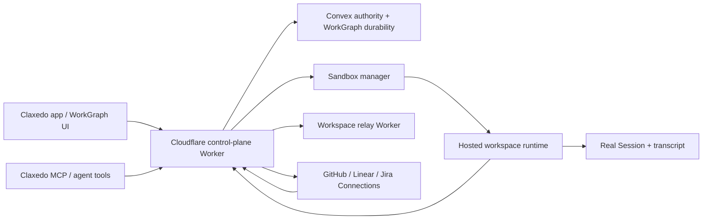

# WorkGraph Staging Delivery and Debugging Handoff

## Purpose of this document

This is a self-contained handoff for the next engineer or AI agent. It explains:

- the product outcome being pursued;
- the relevant architecture and deployment topology;
- what is already working;
- every material fix and diagnostic attempt made in the current delivery loop;
- the two remaining staging failures and the evidence behind them;
- local and hosted setup requirements;
- required GitHub, Convex, Cloudflare, Clerk, relay, and sandbox configuration;
- exact verification and deployment commands;
- repository-state warnings so concurrent UI work is not overwritten.

No secret values are included. Secret names and installation locations are included because they are required to reproduce the deployment.

## Executive summary

The objective is to finish and prove WorkGraph as a real personal autonomous execution system. A user should be able to create a Stream and Tasks from the UI or Claxedo MCP, execute ready Tasks in hosted Sessions, reopen the complete Session transcript in the owning project, and manage durable “Needs you”/Attention state. Connected GitHub, Linear, and Jira work should ultimately enter the same flow.

The repository implementation and the authenticated backend execution smoke are substantially working. On commit `d1e9d428e6`, the ordered staging pipeline successfully:

1. deployed Convex;
2. deployed the workspace relay Worker;
3. deployed the control-plane Worker;
4. passed health and fail-closed authentication probes;
5. passed the real authenticated WorkGraph smoke, including tenant isolation, Stream/Task persistence, hosted autonomous execution, retained Session/transcript references, durable completion, and cleanup;
6. built and deployed the app.

The final deployed browser gate still failed. Two backend/UI-bootstrap issues remain:

1. `GET /api/workgraph/attention?limit=50` returns `500` even though the underlying Convex query returns valid data.
2. `GET /api/workgraph/execution-capabilities` can return `503` during the first few seconds after bootstrap because capability discovery is still provisioning its transient catalog workspace. It becomes `200` later, but the UI/browser test expects the first settings interaction to be immediately usable.

The browser retry was then blocked by Clerk `429 Too Many Requests`, which is test-infrastructure noise rather than proof of either WorkGraph bug.

## Repository state: read before changing anything

Repository: `kyashrathore/Claxedo`

Workspace: `/Users/yashvardhansingh/test/opencode`

Default branch: `dev`

At handoff time:

- remote `origin/dev` points to `d1e9d428e6`;
- local `HEAD` points to `710c20ac60`, a local merge of concurrent UI work;
- the local worktree contains many modified and untracked UI, plan, runtime-snapshot, and extension files owned by the user;
- the deployment described below ran from `d1e9d428e6`, not from local `710c20ac60`;
- do not reset, clean, checkout, stash, stage, or rewrite unrelated local changes;
- avoid editing `packages/claxedo-app/src/features/workgraph/**` unless the user explicitly hands the UI work back to this agent;
- stage only files intentionally changed for the backend/deployment fix.

Useful safety check:

```sh
cd /Users/yashvardhansingh/test/opencode
git status --short
git rev-parse HEAD
git rev-parse origin/dev
```

## Product outcome

The canonical delivery plan is:

`docs/plans/2026-07-13-001-goal-execute-workgraph-end-to-end.md`

The important end-to-end journeys are:

### 1. UI-created autonomous work

1. User opens `/workgraph`.
2. User creates a Stream.
3. The Stream owns its execution environment:
   - local: selected project directory, repository, and base revision;
   - cloud: repository URL and base revision.
4. User creates one or more Tasks.
5. Agent-created Tasks await owner approval (Staged); approved/ready Tasks launch automatically while the Stream is active (pause/resume is the launch gate — see plan 2026-07-18-003).
6. WorkGraph admits an Attempt and creates a real Session.
7. The Session runs autonomously in the correct project/workspace.
8. The agent records evidence and explicitly completes the Attempt.
9. WorkGraph evaluates the completion contract and advances dependent Tasks.
10. User opens the related Session and sees the complete transcript inside the owning project.

### 2. MCP-created work

1. User asks an agent in a project Session to create a WorkGraph Stream and Tasks.
2. Claxedo MCP infers the trusted project directory, repository, and revision.
3. The MCP creates the Stream and Tasks without caller-selected Session authority.
4. The user starts execution from WorkGraph.
5. The same autonomous execution and Session-transcript flow runs.

### 3. Durable Attention


### 4. Connected providers

1. User connects GitHub, Linear, or Jira through the Connections system.
2. User defines a personal Source View targeting a Stream template.
3. Matching issues become intake candidates.
4. User admits a candidate.
5. WorkGraph executes it and publishes an idempotent provider-side result.

Local deterministic provider journeys exist. Real credentialed staging acceptance for GitHub, Linear, and Jira remains outstanding after the browser/backend blockers are closed.

## Architecture at a glance



Important identity boundary:

- HTTP authentication supplies a Clerk subject and Clerk organization.
- Workspace authority resolves those into internal Convex organization/user IDs.
- Convex stores internal IDs.
- public WorkGraph DTOs expose the public `ownerUserId` expected by the HTTP context.
- service calls must send the Clerk subject as `owner_subject`; Convex resolves it to its internal user ID.
- returned internal owner IDs must be projected back to the public owner identity before HTTP owner-boundary checks.

Important capability boundary:

- `GET /execution-capabilities` reads a persisted tenant-scoped attestation.
- owner activation/explicit refresh discovers the live runtime catalog and publishes a new attestation.
- capability attestations expire after five minutes.
- hosted discovery provisions a transient per-owner catalog workspace, reads harness/agent/provider/model/tool capability endpoints, then releases/destroys the catalog workspace.

## What is already working

The following evidence is currently green:

- WorkGraph package typecheck.
- Workspace runtime typecheck and focused Connection tests.
- MCP typecheck and test suite.
- Claxedo Server typecheck.
- Claxedo App typecheck and architecture/performance ratchets.
- `git diff --check` on the implemented backend fixes.
- focused server verification on the latest backend change: 106/106 tests passed.
- full pre-push package gate: 31/31 tasks passed.
- ordered staging Convex/Worker deployment.
- real authenticated staging WorkGraph smoke.
- hosted autonomous Attempt execution.
- explicit evidence-backed completion with one durable completion recovery.
- real Session and workspace references on the Attempt.
- retained transcript lookup in the backend smoke.
- tenant isolation across two users and two organizations.
- durable cleanup/compensation.
- central event stream route.
- app build and Cloudflare Pages deployment.

The deployment run proving the green backend path is:

- GitHub Actions run: `29500054602`
- commit: `d1e9d428e68b1d8cbe3620c90d7d8c7a62b3a8e1`
- `deploy-staging`: passed
- `smoke-staging`: passed
- `deploy-app-staging`: app deployed, browser gate failed

## Material fixes already made

These commits are on `origin/dev` and form the relevant delivery chain:

| Commit | Change | Result |
| --- | --- | --- |
| `f288c60609` | Pin the deployed sandbox image/build identity. | Removed drift between the control plane and runtime image. |
| `fe64f7b783` | Wait for the hosted model catalog during capability discovery. | Fixed early model-catalog reads after runtime startup. |
| `61cd8e9f55` | Expose hosted completion tools. | Gave the hosted agent an explicit completion surface. |
| `69d34b8dd4` | Guide hosted completion evidence. | Added completion/evidence guidance to the hosted prompt. |
| `f7d080e9f0` | Preserve hosted owner identity. | Prevented internal identity loss through runtime work. |
| `4b41f63d8a` | Preserve broker tokens through relay calls. | Restored authorized WorkGraph tools inside hosted runtimes. |
| `78a2a8a58d` | Project hosted Attempt results. | Fixed Attempt result DTO projection from Convex. |
| `7a8a7fc8d3` | Build WorkGraph before app deployment. | Stopped the app deployment from consuming stale WorkGraph package output. |
| `8624de49c4` | Authenticate the deployed app browser client. | Removed a test-only bypass and asserted real bearer organization/subject claims. |
| `23f92211e3` | Serve the hosted central event stream. | Fixed missing `/api/wr/events` in the hosted app. |
| `a6bbe06994` | Recover missing explicit completion once. | Prevented a successful provider run from remaining incomplete when the first completion response was lost; the recovery is durable and bounded. |
| `4a4518655d` | Avoid redundant Clerk organization activation on every token read. | Reduced repeated Clerk frontend calls and one source of rate-limit amplification. |
| `d1e9d428e6` | Wait for catalog workspace provisioning and project Attention ownership. | Locally correct and covered by tests; staging revealed that first-request synchronization and Attention HTTP projection are still incomplete. |
| `cc652cecaa` | Retain hosted transcripts before completion is accepted. | Fixed the empty-snapshot retention defects (store-projection shadowing, empty-sync clobbering) and gated `complete_attempt` on durable transcript retention. |
| `6b87c048cf` | Serialize reconcile and settle effects on a fast lane. | Fixed `/internal/workgraph/reconcile returned malformed JSON` (overlapping reconciles in one isolate) and settles durable effects within ~60s. |
| `a1efc16389` | Retain completion transcripts through the trusted subject path. | Fixed the retention gate’s Clerk-subject vs internal-user-id mismatch via `sessions.retainWorkGraphSessionTranscript`; backend smoke green on run `29516828808`. |

## Attempts and findings in the latest debugging loop

### Capability discovery attempt

Observed failure in deployed browser trace:

```text
GET /api/workgraph/execution-capabilities -> 503
code: execution_capabilities_unavailable
capability: runtime
reason: runtime_unavailable
message: The hosted execution capability attestation is stale or unavailable
```

Diagnosis:

1. Capability attestation maximum age is five minutes.
2. The authenticated backend smoke refreshes it, but the app deployment/browser phase can start after it has expired.
3. `/api/claxedo/bootstrap` schedules `workgraph.activateOwner(auth)` with Worker `waitUntil`.
4. Owner activation provisions a transient catalog workspace.
5. The old code called `sandboxManager.ensure` once and returned a typed retryable failure while the workspace was still `provisioning`.

First fix in `d1e9d428e6`:

- add a bounded 30-second catalog-startup wait;
- retry `ensure` while it reports `provisioning`;
- retain typed retryable failure on timeout or an unavailable placement;
- add regression tests for provisioning followed by ready.

Result:

- local tests passed;
- after the deployment, a direct probe that called bootstrap and then waited through request latency observed capabilities `200` with one hosted environment;
- the browser gate still called capability GET approximately three seconds after bootstrap and received `503`;
- therefore the remaining bug is synchronization, not eventual discovery.

Recommended next correction:

- make the first capability read join the in-flight owner activation, or make bootstrap return only after the bounded capability refresh required by the immediate WorkGraph surface;
- do not weaken attestation freshness or fabricate defaults;
- do not provision a second catalog workspace for the same owner;
- retain one shared in-flight promise keyed by `(organizationId, ownerUserId)`;
- add a hosted integration test where bootstrap begins provisioning, capability GET arrives before readiness, and GET resolves from the same activation rather than returning stale `503`.

Relevant files:

- `packages/claxedo-server/src/workgraph-host/hosted.ts`
- `packages/claxedo-server/src/workgraph-host/hosted-execution-capabilities.ts`
- `packages/claxedo-server/src/workgraph-host/execution-capabilities.ts`
- `packages/workgraph/src/http/router.ts`
- `packages/workgraph/src/contracts/execution-capabilities.ts`
- `packages/claxedo-server/src/workgraph-host/execution-capabilities.test.ts`

### Attention ownership attempt

Observed failure:

```text
GET /api/workgraph/attention?limit=50 -> 500
{"error":{"code":"internal_error","message":"WorkGraph request failed","retryable":false}}
```

Diagnosis performed:

1. Extracted the authenticated tenant from the failed Playwright trace without printing the token or identity values.
2. Queried staging Convex directly through `workgraphChanges.readForService`.
3. Convex returned a valid Attention page.
4. The page passed `AttentionPageSchema`.
5. Its top-level `ownerUserId` was the internal Convex user ID, not the Clerk subject in the hosted `WorkGraphContext`.
6. The HTTP router checks every Attention item against `context.ownerUserId`, so this mismatch can become a generic 500.

First fix in `d1e9d428e6`:

- project every Attention item through `publicOwner(context, item)` in `createConvexWorkGraphStore`;
- project `mark_all_read` and `clear` acknowledgements back to `context.ownerUserId`;
- add regression tests using distinct `internal_user_id` and `clerk_subject` values.

Result:

- focused tests passed;
- the fixed adapter queried against real staging data locally and returned `adapterOk: true`;
- the newly deployed HTTP endpoint still returned `500`;
- Cloudflare tail showed the request and status but no exception because `packages/workgraph/src/http/router.ts` installs its own generic `onError` handler and discards the exception before the Worker-level error reporter sees it.

This means the initial identity diagnosis was real, but at least one additional exception remains in the full hosted HTTP composition.

Recommended next diagnostic:


Relevant files:

- `packages/claxedo-server/src/workgraph-host/convex-store.ts`
- `packages/claxedo-server/src/workgraph-host/hosted-attention.ts`
- `packages/claxedo-server/src/workgraph-host/hosted.ts`
- `packages/workgraph/src/http/router.ts`
- `packages/workgraph/src/contracts/attention.ts`
- `convex/workgraphChanges.ts`
- `convex/workgraphAttention.ts`
- `packages/claxedo-server/src/workgraph-host/convex-store.test.ts`
- `packages/claxedo-server/src/workgraph-host/hosted-attention.test.ts`

### Clerk browser rate-limit attempt

The deployed browser test uses `@clerk/testing/playwright` and performs:

1. `clerkSetup`;
2. `clerk.signIn` by the smoke user’s email;
3. an explicit organization `setActive`;
4. real WorkGraph bearer-token requests.

Earlier code also called `setActive` during every `getAuthToken`, amplifying Clerk requests. Commit `4a4518655d` removed that redundant call.

Latest browser result:

- first test attempt signed in and reached WorkGraph, where the two backend failures occurred;
- retry failed during Clerk sign-in with `Too Many Requests`;
- this retry does not provide WorkGraph evidence and should not be treated as a product regression.

Recommended test-hardening after the product endpoints pass:

- avoid immediate full sign-in retries after a product assertion failure;
- consider minting a dedicated short-lived Clerk Session/token through the Backend API once per test run, then installing that supported state in the browser if Clerk’s official helper supports it;
- keep production code free of test-bypass tokens;
- continue asserting that WorkGraph Authorization headers contain the intended Clerk subject and organization.

### Transcript retention failure (solved 2026-07-16)

Observed failure in the backend smoke (run `29509642365`, twice, after a pass on identical retention code at 13:58 in run `29504342469`):

```text
error: Hosted Session transcript was not retained
    at verifyHostedSession (scripts/smoke/smoke-workgraph.ts:616)
```

Probing `GET /api/control/sessions/:id/messages` for the failed Sessions returned `{allowed: true, messages: [], maxEventOrdinal: 0}` permanently, while the Attempt had settled normally with durable references.

Diagnosis — the “session lives in a repo-clone subdirectory” suspicion was REFUTED: both the engine (`Session.get`/`MessageV2.page`) and the workspace-runtime `RuntimeStore` read messages by session id only, with no directory predicate on any read. Three real defects stacked:

1. **The retention pull never had an authoritative source.** The reconcile pulls `GET /session/:id/message?snapshot=1`, which workspace-runtime serves from its `RuntimeStore` projection. That projection NEVER mirrors messages for Session V2 (OpenCode-proxied) sessions — the opencode adapter is a pure HTTP proxy with no store ingestion. Real transcripts were only served by accidentally falling through to `adapter.getMessages` (engine truth) when the store had NO session row. Any `GET /session` list against the runtime (`bindDiscoveredSession`) binds a bare message-less row, after which the snapshot short-circuits to `{messages: [], ...}` forever.
2. **Settlement raced the sync.** Attempts settle through the broker (`workgraph_complete_task` → `/internal/workgraph/attempt-operation` → Convex `complete_attempt`) between reconcile polls, so the LAST reconcile snapshot could predate any persisted message. Pass versus fail was pull timing — the launch reconcile often pulls the snapshot within a second of admitting the prompt, and no later cycle runs if the Attempt settles before the next trigger.
3. `OpenCodeHarnessAdapter.getMessages` swallows any non-OK engine response into `[]`, so a failed engine read was indistinguishable from an empty transcript.

Fix (commits `cc652cecaa` and `a1efc16389`):

- workspace-runtime `getMessages`/`getMessageSnapshot` treat an empty store projection as non-authoritative and fall through to the adapter (ships in the SANDBOX IMAGE — see the pin warning below);
- the reconcile never syncs an empty snapshot over a previously retained transcript;
- `complete_attempt` is accepted only after `createHostedSessionTranscriptRetention` pulls the transcript, requires both `user` and `assistant` messages, and durably syncs it into Convex; any failure rejects the completion as retryable `attempt_transcript_not_retained` (503), so an Attempt can no longer settle without its transcript.

Identity trap hit on the first deployment of the gate (run `29515874998`, every completion rejected → “Hosted Session ended without workgraph_complete_task after one completion retry”): the attempt-operation principal’s `ownerUserId` is the runtime access token’s CLERK SUBJECT, but `sessions.syncWorkGraphSession` requires the INTERNAL Convex user id. The gate now syncs through the new `sessions.retainWorkGraphSessionTranscript` mutation, which resolves the owner via `requireTrustedWorkGraphTenantSubject` (`owner_subject`), mirroring `workgraphCommands.executeForService`, and requires the workspace to already exist.

Sandbox image pin warning: the workspace-runtime half of the fix only reaches staging through the sandbox image. Image `40370c8513` (built from `cc652cecaa`) was pinned via `CLAXEDO_SANDBOX_BUILD_ID` on the staging environment before the proving run — deploying the Worker alone does NOT update the runtime.

Result: run `29516828808` (SHA `a1efc16389`) passed `smoke-staging` end to end, including the unweakened retention check (transcript with both roles verified against the deployed control plane). The `deploy-app-staging` browser-gate failure in the same run is the separate stream-card-deletion workstream, not retention.

Regressions added:

- `packages/workspace-runtime/src/workspace/runtime.test.ts` — a bound session with an empty message projection serves the adapter transcript for both the plain and `snapshot=1` reads;
- `packages/claxedo-server/src/workgraph-host/hosted-runtime.test.ts` — the reconcile never syncs an empty snapshot; retention pulls, verifies roles, and syncs through the subject-resolving mutation; failed pulls map to retryable retention errors;
- `packages/claxedo-server/src/workgraph-host/hosted-attempt-operation.test.ts` — completions retain before the Convex command and reject as retryable 503 without settling when retention fails; checkpoints skip retention.

Relevant files:

- `packages/workspace-runtime/src/workspace/runtime.ts`
- `packages/claxedo-server/src/workgraph-host/hosted-runtime.ts`
- `packages/claxedo-server/src/workgraph-host/hosted-attempt-operation.ts`
- `packages/claxedo-server/src/hosted-app.ts`
- `convex/sessions.ts`

## Latest deployment evidence

### Green backend run

Run `29500054602`, SHA `d1e9d428e6`:

- Convex dry-run: passed.
- Convex deploy: passed.
- Clerk webhook secret synchronization: passed.
- legacy runtime lease normalization: passed.
- workspace relay Worker deploy: passed.
- control-plane Worker deploy: passed.
- staging sandbox token synchronization: passed.
- health/auth smoke: passed.
- Clerk smoke fixture synchronization: passed.
- real WorkGraph authenticated persistence and hosted no-op execution smoke: passed.
- app build/deploy/route verification: passed.
- authenticated browser gate: failed.

Browser failure details:

- first attempt waited for the “Cloud workspace” capability option and timed out;
- network trace showed Attention `500` and capabilities `503`;
- retry failed in Clerk sign-in with `429`.

Artifact:

```text
GitHub run: 29500054602
Artifact name: deployed-workgraph-staging-1
Artifact ID: 8376346955
```

Local downloaded copy at handoff time:

```text
/tmp/deployed-workgraph-29500054602
```

The trace for the first attempt is under:

```text
/tmp/deployed-workgraph-29500054602/test-results/deployed-workgraph/
  deployed-workgraph-deploye-c8cae-w-reloads-then-deletes-them/trace.zip
```

### Direct post-deploy probe

A short-lived Clerk Session was created through the Backend API, a Convex-template token was minted, `/api/claxedo/bootstrap` was called, and then both endpoints were called. The Session was revoked afterward.

Observed:

```json
{
  "bootstrap": 200,
  "attention": 500,
  "capabilities": 200
}
```

Interpretation:

- capability discovery eventually succeeds after the bounded provisioning wait;
- the first-request readiness contract is still broken;
- Attention remains broken in the full deployed HTTP composition.

## Local setup

### Prerequisites

- Bun version pinned by the root `packageManager` field.
- Node 24 for the same environment used by GitHub Actions.
- GitHub CLI authenticated to `kyashrathore/Claxedo`.
- Cloudflare Wrangler authenticated or configured through API token/account ID.
- Convex deploy key for deployment operations.
- Clerk test/development instance credentials.
- configured sandbox driver and relay/runtime signing keys for real hosted execution.

Install dependencies once from the repository root:

```sh
cd /Users/yashvardhansingh/test/opencode
bun install
```

Do not run repository tests from the root. Run them from the owning package.

### Existing local environment files

Local values already exist in:

- `packages/claxedo-server/.env`
- `packages/claxedo-server/.env.local`
- `packages/claxedo-app/.env.local`

Do not print or commit these files. The relevant variable names currently present include:

Server deployment/provider credentials:

- `CLOUDFLARE_API_TOKEN`
- `CLOUDFLARE_ACCOUNT_ID`
- `CLOUDFLARE_SANDBOX_WORKER_URL`
- `DAYTONA_API_KEY`
- `CLERK_SECRET_KEY`
- `CLERK_JWT_ISSUER`
- `CLERK_JWKS_URL`
- `CLAXEDO_CONTROL_PLANE_SERVICE_TOKEN`
- `CLAXEDO_WORKSPACE_AUTHORITY_URL`
- `CLAXEDO_WORKSPACE_RELAY_URL`
- `CLAXEDO_RELAY_RESOLVER_TOKEN`
- `CLAXEDO_RUNTIME_ACCESS_TOKEN_PRIVATE_KEY_PEM`
- `CLAXEDO_RUNTIME_ACCESS_TOKEN_PUBLIC_KEY_PEM`
- `CLAXEDO_RUNTIME_ADMIN_TOKEN`
- `CONVEX_DEPLOYMENT`
- `CONVEX_SITE_URL`

App configuration:

- `VITE_AUTH_ENABLED`
- `VITE_CLAXEDO_SERVER_URL`
- `VITE_CLERK_PUBLISHABLE_KEY`
- `VITE_CONVEX_URL`
- `VITE_CONVEX_SITE_URL`
- `VITE_SANDBOX_ENABLED`
- `VITE_TERMINAL_BACKEND`

### Run locally

Backend:

```sh
cd /Users/yashvardhansingh/test/opencode/packages/claxedo-server
bun run dev
```

Frontend, defaulting to port `4444`:

```sh
cd /Users/yashvardhansingh/test/opencode/packages/claxedo-app
bun run dev -- --host 127.0.0.1
```

Open:

```text
http://localhost:4444/workgraph
```

### Focused verification

```sh
cd /Users/yashvardhansingh/test/opencode/packages/claxedo-server
bun run test \
  src/workgraph-host/convex-store.test.ts \
  src/workgraph-host/hosted-attention.test.ts \
  src/workgraph-host/execution-capabilities.test.ts \
  src/workgraph-host/hosted.test.ts
bun typecheck
```

WorkGraph:

```sh
cd /Users/yashvardhansingh/test/opencode/packages/workgraph
bun run test
bun typecheck
```

App gates:

```sh
cd /Users/yashvardhansingh/test/opencode/packages/claxedo-app
bun typecheck
```

Before committing:

```sh
cd /Users/yashvardhansingh/test/opencode
git diff --check
git diff --name-only
```

## GitHub environment setup

Create two GitHub environments:

- `staging`: automatic deployments from `dev`, normally no approval gate;
- `production`: required reviewers enabled; production is never automatic.

The current `staging` environment already has all names below configured. Values were not inspected or copied into this document.

### Environment secrets

| Name | Purpose |
| --- | --- |
| `CONVEX_DEPLOY_KEY` | Deploy key for the staging or production Convex deployment. |
| `CLOUDFLARE_API_TOKEN` | Deploy permission for Workers and Pages. |
| `CLOUDFLARE_ACCOUNT_ID` | Target Cloudflare account. |
| `CLERK_SECRET_KEY` | Clerk Backend API access for smoke Sessions and browser testing. |
| `CLERK_WEBHOOK_SECRET` | Svix signing secret synchronized into Convex. |
| `CLAXEDO_RUNTIME_ADMIN_TOKEN` | Authorizes the protected bounded WorkGraph reconciler; must match the Worker runtime secret. |
| `FLY_API_TOKEN` | Used by relay deployment workflows. |

Set or update without printing values:

```sh
gh secret set NAME --repo kyashrathore/Claxedo --env staging
gh secret set NAME --repo kyashrathore/Claxedo --env production
```

### Environment variables

| Name | Purpose |
| --- | --- |
| `CLAXEDO_CONTROL_PLANE_URL` | Hosted control-plane Worker base URL. |
| `CLAXEDO_WORKSPACE_RELAY_URL` | Hosted workspace relay URL. |
| `CLAXEDO_SANDBOX_BUILD_ID` | Exact successful sandbox image build used for this release. |
| `CLAXEDO_APP_URL` | Deployed app URL used by route and Playwright verification. |
| `CLAXEDO_PAGES_PROJECT` | Cloudflare Pages project. |
| `CLAXEDO_PAGES_BRANCH` | Pages branch for the environment. |
| `VITE_CLERK_PUBLISHABLE_KEY` | Public Clerk key embedded in the app. |
| `VITE_CONVEX_URL` | Public Convex URL embedded in the app. |
| `WORKGRAPH_SMOKE_USER_A_ID` | Dedicated Clerk smoke user A. |
| `WORKGRAPH_SMOKE_USER_A_EMAIL` | Primary email for user A’s browser sign-in. |
| `WORKGRAPH_SMOKE_USER_B_ID` | Distinct Clerk smoke user B. |
| `WORKGRAPH_SMOKE_ORGANIZATION_A_ID` | Clerk organization containing users A and B. |
| `WORKGRAPH_SMOKE_ORGANIZATION_B_ID` | Distinct Clerk organization containing user A. |
| `WORKGRAPH_SMOKE_HARNESS` | Live catalog harness ID, currently intended to be `opencode`. |
| `WORKGRAPH_SMOKE_AGENT` | Agent ID supported by the live catalog. |
| `WORKGRAPH_SMOKE_PROVIDER_ID` | Provider ID advertised by the live catalog. |
| `WORKGRAPH_SMOKE_MODEL_ID` | Low-cost model ID advertised by the live catalog. |
| `WORKGRAPH_SMOKE_EFFORT` | Supported effort value for the smoke model. |
| `WORKGRAPH_SMOKE_TOOLS_JSON` | Exact JSON tool list, normally `[]` for the no-op profile. |

Set or update variables:

```sh
gh variable set NAME --body 'VALUE' --repo kyashrathore/Claxedo --env staging
```

Smoke fixture membership requirements:

- user A belongs to organizations A and B;
- user B belongs to organization A;
- the two users are distinct;
- the two organizations are distinct;
- the configured harness/agent/provider/model/effort combination must be advertised by the live hosted runtime.

The workflow derives `WORKGRAPH_SMOKE_REPOSITORY_URL` from the GitHub repository and `WORKGRAPH_SMOKE_BASE_REVISION` from the deployed SHA; these are not manually configured environment variables.

## Runtime secret setup

GitHub environment configuration deploys code but does not install every runtime secret. Worker and Convex runtime state must be provisioned separately.

### Shared Convex/Worker service token

Generate one strong random token and install the same value in both places:

```sh
# Convex
CONVEX_DEPLOY_KEY=... bunx convex env set \
  CLAXEDO_CONTROL_PLANE_SERVICE_TOKEN "$TOKEN"

# Cloudflare Worker staging
cd packages/claxedo-server
printf '%s' "$TOKEN" | bunx wrangler secret put \
  CLAXEDO_CONTROL_PLANE_SERVICE_TOKEN --env staging
```

Never print the token. Omit `--env staging` only for an intentional production operation.

### Current staging Worker secret names

The current Worker reports these configured secret names:

- `CLAXEDO_APP_ORIGINS`
- `CLAXEDO_CONTROL_PLANE_JWKS_URL`
- `CLAXEDO_CONTROL_PLANE_SERVICE_TOKEN`
- `CLAXEDO_DAYTONA_SNAPSHOT`
- `CLAXEDO_RELAY_HOST_VERIFY_PEM`
- `CLAXEDO_RELAY_JWKS_URL`
- `CLAXEDO_RELAY_RESOLVER_TOKEN`
- `CLAXEDO_RUNTIME_ACCESS_TOKEN_PRIVATE_KEY_PEM`
- `CLAXEDO_RUNTIME_ACCESS_TOKEN_PUBLIC_KEY_PEM`
- `CLAXEDO_RUNTIME_ADMIN_TOKEN`
- `CLAXEDO_RUNTIME_BENCHMARK_DIRECT_TOKEN`
- `CLAXEDO_RUNTIME_PROVIDER`
- `CLAXEDO_WORKSPACE_AUTHORITY_URL`
- `CLAXEDO_WR_TRUSTED_DIRECT_TOKEN`
- `CLERK_JWKS_URL`
- `CLERK_JWT_ISSUER`
- `CLOUDFLARE_API_TOKEN`
- `CLOUDFLARE_SANDBOX_API_TOKEN`
- `CLOUDFLARE_SANDBOX_WORKER_URL`
- `CONVEX_URL`
- `DAYTONA_API_KEY`

List names safely:

```sh
cd packages/claxedo-server
bunx wrangler secret list --env staging
```

### Hosted execution driver

The Worker supports these relevant driver configurations:

Cloudflare sandbox:

- `CLAXEDO_SANDBOX_DRIVER=cloudflare`
- `CLOUDFLARE_SANDBOX_WORKER_URL`
- `CLOUDFLARE_SANDBOX_API_TOKEN`
- `CLAXEDO_SANDBOX_BUILD_ID`

Daytona:

- `CLAXEDO_SANDBOX_DRIVER=daytona`
- `DAYTONA_API_KEY`
- `CLAXEDO_DAYTONA_SNAPSHOT`
- optional `DAYTONA_API_URL`
- optional `DAYTONA_ORGANIZATION_ID`
- optional `DAYTONA_TARGET`

Fetch/custom driver:

- `CLAXEDO_SANDBOX_DRIVER=fetch`
- `CLAXEDO_SANDBOX_DRIVER_URL`
- optional `CLAXEDO_SANDBOX_DRIVER_TOKEN`

Ordinary staging currently uses the Cloudflare sandbox path. The deploy workflow synchronizes `CLOUDFLARE_SANDBOX_API_TOKEN` from the protected runtime-admin secret after deploying the Worker.

### Signed runtime and relay

Required or relevant names:

- `CLAXEDO_WORKSPACE_RELAY_URL`
- `CLAXEDO_RELAY_RESOLVER_TOKEN`
- `CLAXEDO_RUNTIME_ACCESS_TOKEN_PRIVATE_KEY_PEM`
- `CLAXEDO_RUNTIME_ACCESS_TOKEN_PUBLIC_KEY_PEM`
- optional next-key slots during rotation;
- `CLERK_JWT_ISSUER`
- `CLERK_JWKS_URL`
- optional `CLERK_JWT_AUDIENCE`;
- `CLAXEDO_RUNTIME_ADMIN_TOKEN`.

### Hosted Connections

For real GitHub/Linear/Jira credentials, enable the encrypted organization credential backend:

- `CLAXEDO_HOSTED_CREDENTIALS_ENABLED=1`
- `CLAXEDO_CREDENTIALS_KEK`
- `CLAXEDO_CF_KV_URL`
- `CLAXEDO_CF_KV_TOKEN`
- optional `CLAXEDO_CREDENTIALS_KEK_NEXT` only during rotation.

Provider tokens and webhook secrets should be written through Connections setup routes. Do not place provider access tokens in WorkGraph records, public events, GitHub variables, or this handoff.

## Deployment procedure

### Normal staging deployment

A push to `dev` that changes Convex, server, WorkGraph, relay, sandbox-manager, or related ordered-release files automatically runs:

```text
Convex dry-run
  -> Convex deploy
  -> workspace relay Worker deploy
  -> control-plane Worker deploy
  -> authenticated backend smoke
  -> app build and Pages deploy
  -> authenticated deployed browser gate
```

Push only reviewed, intentional files:

```sh
git add <exact files>
git diff --cached --check
git commit -m 'fix(workgraph): <summary>'
git push origin dev
```

Watch the ordered release:

```sh
gh run list --repo kyashrathore/Claxedo --branch dev --limit 10
gh run watch <RUN_ID> --repo kyashrathore/Claxedo --exit-status
```

Download browser artifacts:

```sh
gh run download <RUN_ID> \
  --repo kyashrathore/Claxedo \
  --name deployed-workgraph-staging-1 \
  --dir /tmp/deployed-workgraph-<RUN_ID>
```

### Manual backend smoke

From `packages/claxedo-server`:

```sh
BASE_URL='https://<staging-control-plane>' \
CLERK_SECRET_KEY='...' \
WORKGRAPH_SMOKE_USER_A_ID='user_...' \
WORKGRAPH_SMOKE_USER_B_ID='user_...' \
WORKGRAPH_SMOKE_ORGANIZATION_A_ID='org_...' \
WORKGRAPH_SMOKE_ORGANIZATION_B_ID='org_...' \
WORKGRAPH_SMOKE_RECONCILE_TOKEN='...' \
WORKGRAPH_SMOKE_HARNESS='opencode' \
WORKGRAPH_SMOKE_AGENT='...' \
WORKGRAPH_SMOKE_PROVIDER_ID='...' \
WORKGRAPH_SMOKE_MODEL_ID='...' \
WORKGRAPH_SMOKE_EFFORT='low' \
WORKGRAPH_SMOKE_TOOLS_JSON='[]' \
WORKGRAPH_SMOKE_REPOSITORY_URL='https://github.com/kyashrathore/Claxedo.git' \
WORKGRAPH_SMOKE_BASE_REVISION='<deployed sha>' \
bun run smoke:workgraph
```

`WORKGRAPH_SMOKE_REPOSITORY_URL` and `WORKGRAPH_SMOKE_BASE_REVISION` are required by the script; CI derives them from `github.server_url`/`github.repository` and `github.sha`.

Use environment injection or a local ignored env file; do not paste values into shell history on shared systems.

### Worker logs

```sh
cd packages/claxedo-server
bun --env-file=.env --env-file=.env.local x wrangler tail \
  --env staging --format json
```

The WorkGraph router currently swallows the underlying exception for generic 500s, so add safe server-side reporting before expecting tail output to reveal the Attention error.

### Production

Do not promote while the browser gate is red.

Production is invoked through `workflow_dispatch` on `deploy-control-plane.yml`, deploys the same reviewed SHA, and must be protected by required reviewers on the GitHub `production` environment.

## Suggested next implementation sequence

1. Preserve the user’s local UI changes and work only in backend/test files.
2. Add a full hosted-router regression for Attention using distinct Clerk subject and internal Convex user ID.
3. Add safe exception reporting at the WorkGraph router boundary and reproduce the exact staging Attention exception.
4. Fix every public owner projection required by the full Attention DTO, including nested variant records if indicated by the regression.
5. Add a bootstrap/capability concurrency regression.
6. Make capability GET join the existing owner activation or otherwise wait on the same bounded refresh promise.
7. Run the four focused server files and server typecheck.
8. Query the real staging Convex data through the fixed local adapter.
9. Commit only the backend/test changes and push once.
10. Run one ordered staging release.
11. Treat a Clerk 429 retry as test-infrastructure failure; inspect the first attempt for product evidence.
12. Require all three stages to be green before moving on:
    - deploy;
    - authenticated backend smoke;
    - authenticated browser gate.
13. After this is green, run the remaining credentialed GitHub/Linear/Jira staging acceptance and retain provider receipts/cleanup evidence.

## Acceptance criteria for the next agent

The immediate debugging task is complete only when a fresh staging browser Session proves all of the following without manual retries:

- `/workgraph` renders immediately rather than staying on “Loading WorkGraph.”
- `/api/workgraph/attention?limit=50` returns `200` for the signed smoke user.
- mark-all-read and clear return `200`, survive reload, and do not reappear without newer actionable state.
- the New Stream dialog exposes “Cloud workspace” on its first open.
- `/api/workgraph/execution-capabilities` does not expose a transient stale-attestation error to the first WorkGraph interaction.
- Stream and Task creation persist across desktop and narrow reloads.
- the browser sends real bearer tokens with the intended Clerk subject and organization.
- the test deletes the disposable Task and Stream.
- no guarded app/control-plane response is `>=400`.
- the ordered backend smoke remains green.

The broader goal remains open until credentialed GitHub, Linear, and Jira staging journeys also pass.

## Existing references

- `docs/plans/2026-07-13-001-goal-execute-workgraph-end-to-end.md`
- `public-docs/deploy-runbook.md`
- `packages/workgraph/PRD.md`
- `packages/workgraph/SPEC.md`
- `packages/workgraph/ARCHITECTURE.md`
- `.github/workflows/deploy-control-plane.yml`
- `.github/workflows/deploy-claxedo-app.yml`
- `.github/workflows/deploy-claxedo-app-staging.yml`
- `packages/claxedo-app/e2e/playwright/deployed-workgraph.spec.ts`
- `packages/claxedo-server/scripts/smoke/smoke-workgraph.ts`
- `packages/claxedo-server/wrangler.toml`

