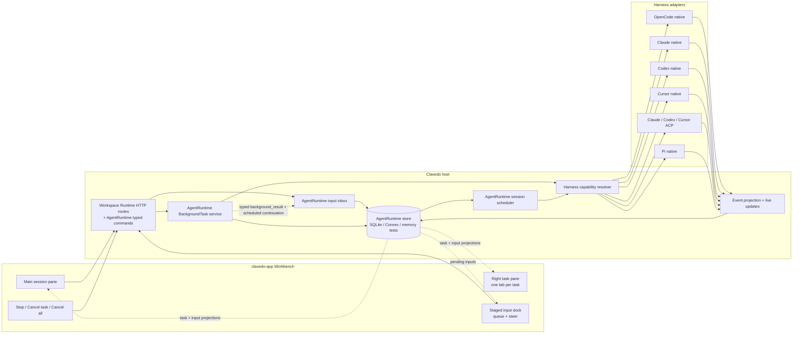
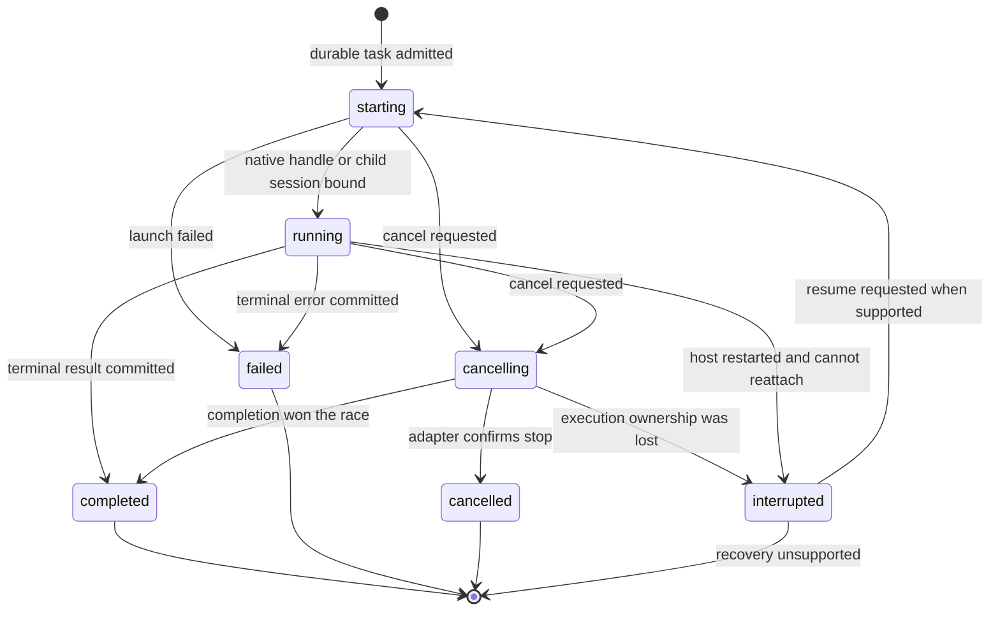
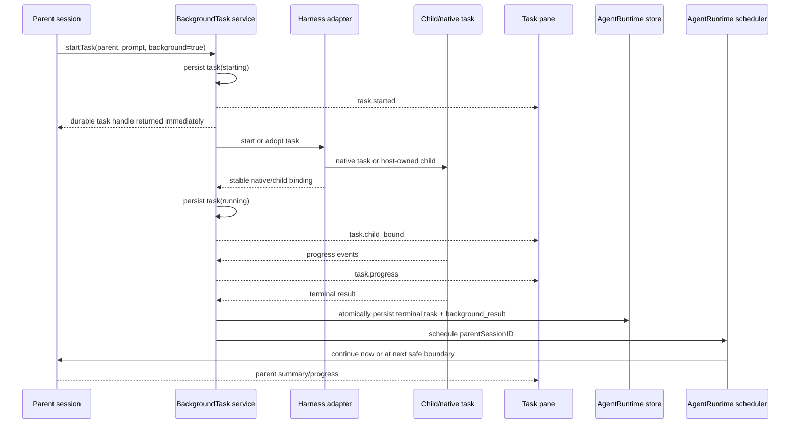
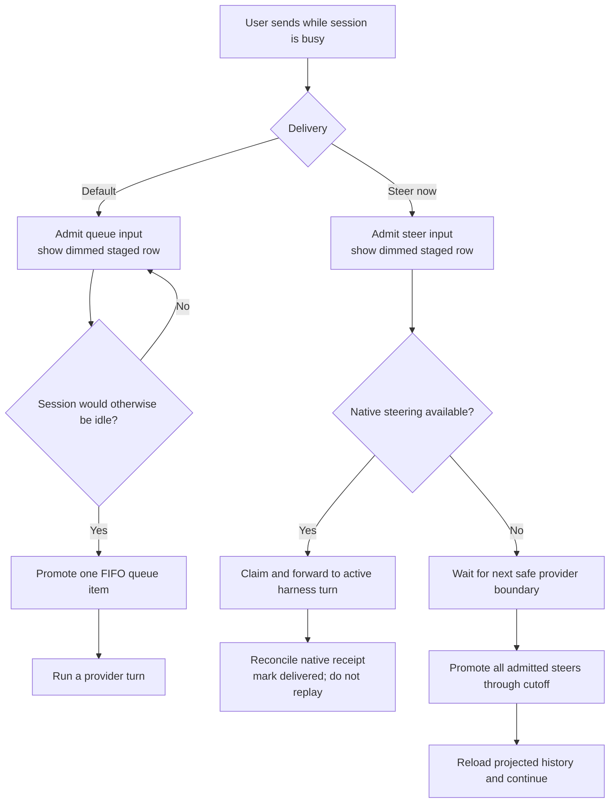
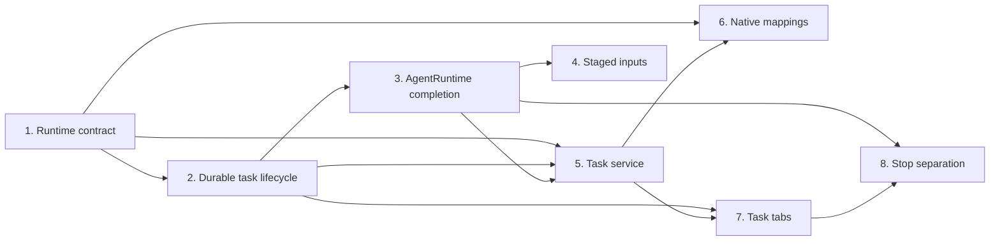

# Background Agents, Task Tabs, and Staged Steering

## The proposal in one paragraph

Claxedo gives every long-running delegated task an explicit identity, lifecycle,
and place in the UI. A detached task continues while the user works in the main
session, appears as a tab in a right-side task pane, and reports its result back
to the parent automatically. Messages sent while a session is busy are visible
as removable staged inputs. The user chooses whether an input waits its turn or
steers the active turn. Foreground **Stop**, per-task **Cancel**, and **Cancel
all tasks** are separate commands, so the control shown in the composer always
matches what it will stop. Claxedo owns this product contract and maps each
harness onto it using native task support where available and a host-owned child
session where it is not.

## Problem and product intent

Agent harnesses expose different pieces of the same experience. Some can spawn
native subagents, some can steer an active turn, some expose only a normal
session, and some surface an internal task without a stable child conversation.
Presenting those protocol details directly creates three UX problems:

1. A long-running subagent can make the main session feel blocked even when the
   work is logically independent.
2. The main Stop control can disappear after the parent turn becomes idle even
   though background work is still running, leaving no obvious cancellation
   path.
3. A message typed during a run has ambiguous delivery: it may interrupt the
   active turn, wait until later, or be rejected, and the user cannot see or
   retract it.

The product contract is therefore defined by Claxedo rather than by the least
capable harness. Harness capability determines the implementation and the
controls available for a particular task, while the task model, ordering rules,
and UI remain consistent.

## Product principles

- **A background task is explicit.** Ordinary agent turns are foreground.
  Delegated work becomes background only when a tool, user action, or agent
  request starts it in detached mode.
- **The main session remains the anchor.** Background work opens beside the
  parent rather than replacing it.
- **Every control has one target.** Stop targets the active foreground turn;
  Cancel targets one task; Cancel all targets the parent's running descendants.
- **Pending user intent is visible.** A queued or steering input remains shown
  until it is promoted into model history.
- **Delivery semantics are honest.** Native steering is used only when the
  harness supports it. Other harnesses deliver at the next safe boundary and
  label the action accordingly.
- **Task completion is typed system state.** A task result has its own
  provenance-tagged author class in runtime events and model history.
- **Durability lives on the host.** The browser projects task and input state;
  it is not the source of truth for either.

---

## Part 1 — Feature proposals

### Feature 1: Detached background tasks

#### What it is

A delegated agent run can execute as a detached background task. Starting it
returns control to the parent immediately with a task handle. The main session
can accept new work while the task continues. Each task has a durable status:
`starting`, `running`, `completed`, `failed`, `cancelling`, `cancelled`, or
`interrupted`.

This does not make every agent run a background run. The foreground parent turn
and each detached child are separate executions with separate lifecycles.

#### Why it improves the experience

- Research, tests, code review, and other slow work no longer hold the whole
  conversation hostage.
- Users can ask the parent a follow-up, start another task, or inspect existing
  work without waiting.
- A named task with visible status is easier to trust than an indefinite
  spinner inside a tool call.
- Explicit lifecycle states make recovery and cancellation understandable.

#### How it is built

Claxedo introduces a durable `BackgroundTask` record owned by the parent
session. The task service resolves the selected harness's capabilities and
chooses one of two execution strategies:

1. **Native task adoption:** bind the harness's stable task or child-session ID
   to the Claxedo task and translate native progress, completion, input, and
   cancellation events.
2. **Host-owned child session:** create an ordinary independent child session
   with the same workspace placement, harness, model, agent configuration, and
   permission context. Claxedo schedules and cancels it through existing
   session primitives.

The portable child contract requires equivalent system context, workspace
placement, enabled tools, permission policy, selected agent/model, cancellation,
follow-up input, and result reintegration. A harness that cannot satisfy those
properties reports task start as unsupported until its adapter supplies the
missing behavior.

Native tasks without a stable child conversation are still recorded, but use
an `opaque-task` representation with only the transcript, progress, and
controls the harness actually exposes. Every task started through Claxedo is
cancellable: when a native task does not provide a stable cancellation handle,
Claxedo selects the host-owned child strategy. A model-internal task discovered
after native launch may remain opaque; its tab labels unavailable controls
explicitly instead of presenting a non-functional Cancel action.

The initial invocation surface is a Claxedo `task` tool registered for every
harness. The tool accepts a prompt, optional agent/model override, and
`background` mode, then calls `Task.Start`. A task menu in the parent session
provides the same command for direct user initiation. Both paths return the
same durable task handle.

### Feature 2: Task side panel with tabs

#### What it is

Background tasks open in a right-side Workbench pane. Each task has its own tab.
The main session stays in the primary pane, and selecting a subagent chip in the
timeline focuses the corresponding task tab.

A task tab renders one of two surfaces:

- **Session surface:** a real child conversation with its messages, composer,
  status, and supported controls.
- **Task activity surface:** a read-only progress and result view for an opaque
  native task, plus any supported Cancel or Send input action.

Closing a tab closes the view only. It does not cancel the work. A completed
task remains reopenable from the parent timeline.

#### Why it improves the experience

- The user keeps the parent context visible while inspecting delegated work.
- Multiple parallel tasks have a stable, compact home instead of taking over
  the central route one by one.
- Task status and cancellation are available where the work is visible.
- Tabs make it natural to compare outputs and move between active subagents.

#### How it is built

The feature uses the existing Workbench concepts: a pane is a layout leaf, a
tab is a content instance, and orchestration decides where content opens. The
first started task creates or reuses a right-side task pane. Later tasks become
tabs in that pane. Starting a task selects its tab without moving keyboard
focus from the parent composer; clicking its chip or the persistent Tasks
launcher focuses the existing tab.

Task content uses a canonical `TaskRef` containing the Claxedo task ID and its
optional child `SessionRef`. Workbench persistence stores the selected task tab
and layout, while task status is projected from the durable task store.

### Feature 3: Staged follow-up queue

#### What it is

When the current session is busy, the default Send action creates a staged
follow-up. It appears directly above the composer as a dimmed row with its
position in the queue. Hovering the row reveals a cross that removes it before
delivery. Selecting the row enters an explicit edit state: the row remains
visible and locked, the composer shows **Save staged message** and **Cancel
editing**, and saving performs a version-checked replacement. Escape or Cancel
editing leaves the original input unchanged. If promotion wins the race, the
editor closes, refreshes history, and explains that the message was already
delivered.

Queued inputs are promoted **one at a time in FIFO order**. The next item starts
only when the session would otherwise become idle. It gets a complete provider
turn before the following queued item is considered.

#### Why it improves the experience

- Users can record a thought immediately without silently changing an active
  run.
- Visible ordering removes uncertainty about when each message will be read.
- An accidental or stale follow-up can be removed before it affects the agent.
- One-at-a-time delivery preserves a conversational turn for every distinct
  user instruction.

#### How it is built

The AgentRuntime input inbox is the canonical Claxedo queue across every
harness. Its public contract adds list, cancel, and replace operations for
inputs that are still pending. The OpenCode native adapter maps those inputs to
Session V2's existing queue/steer semantics. Cancellation and replacement use
a lifecycle version check so a client racing with promotion receives a conflict
and refreshes instead of editing model history.

The app subscribes to pending inputs and renders them through the existing
follow-up dock pattern. Removal invokes a typed runtime-input command; it never
deletes a projected message locally.

### Feature 4: Active steering

#### What it is

The send menu exposes an explicit **Steer now** action during a foreground run.
A steer becomes available to the agent at the next safe provider boundary. If
several steering messages arrive before that boundary, they are promoted
together in admission order so the agent receives one coherent correction
before continuing.

For harnesses with a native active-turn steering API, Claxedo forwards the
steer into that active turn. For other harnesses, the same action is presented
as **Send at next boundary** and the AgentRuntime scheduler delivers it before
the next adapter continuation. The OpenCode adapter uses Session V2's native
safe-boundary implementation for this mode.

#### Why it improves the experience

- The user can correct direction without throwing away useful work already
  completed in the turn.
- Steering is distinct from a later follow-up, so the user's intent is clear.
- Capability-aware labeling prevents the UI from promising an immediate
  interruption a harness cannot perform.

#### How it is built

The runtime capability contract describes steering as a mode rather than a
boolean: `native`, `next-boundary`, or `none`. The session command gateway
admits every steering message durably first. A native-capable adapter claims
the input, forwards it using the expected turn or live query handle, and
reconciles native acceptance to the same durable message ID. That receipt marks
the input delivered so the scheduler does not send it again. In
`next-boundary` mode, AgentRuntime promotes all steers through the boundary
cutoff as one ordered batch and reloads projected history before continuing.

This preserves one source of truth even if a native stream disconnects between
admission and delivery.

### Feature 5: Automatic completion and parent continuation

#### What it is

When a background task finishes, its result is attached to the parent and the
parent is awakened automatically. If the parent is idle, it can immediately
summarize the result or proceed with the next step. If the parent is already
running, the result is admitted at the next safe boundary.

The task tab and parent timeline both show the terminal status. A completion
badge identifies results the parent has not yet incorporated.

#### Why it improves the experience

- Users do not have to poll the task, copy its output, or tell the parent that
  the work is finished.
- Multi-step delegations can continue naturally after independent work joins.
- The transcript clearly distinguishes user instructions from task results.

#### How it is built

Task completion persists the terminal task event and a typed
`background_result` runtime event in one idempotent AgentRuntime store
transaction. The result carries the task ID, child session link, status,
summary, provenance, and structured artifacts. A dedicated history-lowering
step presents it to the model as untrusted task output, distinct from system and
user instructions. It then schedules the parent runtime.

Product-started tasks default to `continue_parent`; adopted opaque tasks default
to `notify_only`. Multiple results committed before a parent drain begins are
coalesced into one continuation. When the parent is idle, the first result opens
a 500 ms join window before the drain starts; the runtime task limit bounds the
number of staggered automatic turns. A result that arrives during a parent turn
is included at the next safe boundary. Duplicate completion notifications
reconcile against the task's terminal version and do not add another result or
continuation.

### Feature 6: Predictable Stop and Cancel controls

#### What it is

Claxedo exposes three intentionally separate controls:

| Control | Visible when | Target |
|---|---|---|
| **Stop** | The displayed session has an active foreground provider turn | That foreground turn only |
| **Cancel task** | A Claxedo-started task is active, or an adopted task exposes native cancellation | That task and its owned descendants |
| **Cancel all tasks** | The parent owns at least one cancellable background task | All cancellable active descendants of the parent |

The composer returns to Send as soon as its own foreground turn becomes idle,
even if detached tasks continue. The task pane continues to show Cancel for
those tasks. A parent-chat instruction such as “cancel the research task”
resolves the named task and invokes the same typed task-cancellation command.

#### Why it improves the experience

- The button label and target stay aligned.
- Users can stop a noisy foreground response without destroying useful parallel
  work.
- Background cancellation remains discoverable after the main Stop button has
  correctly disappeared.
- Closing a tab, stopping a turn, and cancelling work no longer have overlapping
  side effects.

#### How it is built

Foreground interruption and task cancellation use separate command paths.
Adapters translate task cancellation to a native task API when one exists; a
host-owned child uses the ordinary child-session interrupt path. Cancelling a
task first makes the durable state `cancelling`, then records the adapter result
as `cancelled`, `completed`, or `interrupted` to handle completion races.
While `cancelling`, the action is disabled and labeled **Cancelling…**.

Detached ownership changes OpenCode's parent-cancellation behavior: stopping a
parent foreground turn preserves detached descendants. Explicit Cancel task or
Cancel all performs recursive descendant cancellation.

---

## Part 2 — Unified high-level design

### System context

The six features share one task-and-input architecture. The UI never calls a
harness-specific background or steering API directly.



`AgentRuntime` is the canonical Claxedo command and durability boundary because
the app already sends normal session traffic through workspace-runtime and
AgentRuntime routes. `SessionV2` remains OpenCode's internal implementation: the
OpenCode adapter translates AgentRuntime queue, steer, task, result, and abort
commands onto Session V2 primitives. Other adapters implement the same
AgentRuntime contract without depending on Core Session V2.

### Core domain model

#### BackgroundTask

```text
id
parent_session_id
child_session_id?             # real Claxedo child session when available
harness
harness_task_id?              # native task/run/tool handle
harness_child_id?             # native child thread/conversation/agent handle
representation                # session | opaque_task
execution_strategy            # native | host_owned_child
state                         # starting | running | completed | failed |
                              # cancelling | cancelled | interrupted
attention                     # none | permission | question | reconnect
title
prompt_summary
result_summary?
result_artifacts?
completion_policy              # continue_parent | notify_only
launch_correlation_id
launch_lease_until?
capability_snapshot
created_at, updated_at, completed_at?
version
```

The Claxedo task ID is the public identity. Native IDs are bindings and may be
attached after the first task event. This avoids using a tool-call ID as a
temporary public ID and then changing links when a harness reports its real
child ID.

#### Capability modes

The task experience requires richer modes than the current boolean capability
set:

```text
child_representation: none | opaque_task | real_session
background_execution: unsupported | native | host_owned
task_cancel: none | native_task | child_session
task_input: none | native_task | child_session | parent_mediated
active_steer: none | next_boundary | native
task_replay: none | events | full_transcript
task_recovery: none | reattach | resume
```

Capabilities are captured when the task starts because installed harness
versions can change later. The current runtime capability endpoint reports the
latest modes for creating new tasks.

#### Pending RuntimeInput

AgentRuntime adds a durable input identity and lifecycle shared by all
harnesses:

```text
delivery: queue | steer
state: pending | delivering | promoted | cancelled | delivery_uncertain
admitted_seq
promoted_seq?
cancelled_seq?
native_delivery_receipt?
content
```

`pending` inputs are editable and removable. `delivering` inputs have been
claimed by a native adapter and are no longer editable. `promoted` inputs are
immutable history. If a connection is lost after dispatch and native history
cannot confirm acceptance, the input becomes `delivery_uncertain` and is not
replayed automatically. `cancelled` inputs remain in the event log for replay
and audit but are omitted from model history.

### Task lifecycle



Completed, failed, and cancelled events are terminal and idempotent. A task
completion and cancellation race resolves through the task version: the first
terminal transition wins, while the other observation is retained as diagnostic
metadata. `interrupted` can return to `starting` only when the captured recovery
capability supports resume.

### End-to-end background flow



### Input scheduling and steering



The ordering contract is:

1. In `next-boundary` mode, steers admitted before a safe-boundary cutoff are
   promoted as one ordered batch.
2. In `native` mode, the adapter claims each input before forwarding it and
   records the native receipt against that message ID. An accepted input is not
   replayed by the scheduler.
3. A pending task completion result is promoted at the same safe boundary
   before the next model call so the parent sees newly completed work.
4. Queued user inputs wait until the session would otherwise become idle.
5. Exactly one queued input is promoted, then continuation is reevaluated.
6. Removing or editing an input succeeds only while it remains pending.

### Stop and cancellation semantics

| Situation | Main composer | Task tab | Result |
|---|---|---|---|
| Parent provider turn active, no tasks | Stop | — | Stop interrupts parent turn |
| Parent provider turn active, detached task running | Stop | Cancel task | Each control affects only its named execution |
| Parent idle, detached task running | Send | Cancel task | Main conversation remains usable |
| Several detached tasks running | Send or Stop according to parent | Cancel per tab; Cancel all in task-pane menu | Tasks remain independently controllable |
| Task tab closed | Unchanged | Tab hidden | Execution continues |
| Parent task cancelled | Unchanged unless its own turn is active | Cancelling → terminal state | Owned task descendants are cancelled recursively |

Task cancellation is authorized through access to the parent session. Direct
child input additionally requires the child session to inherit the same
workspace and permission boundary. Permission prompts remain associated with
the session or task that initiated the protected operation.

### Workbench layout

```text
+--------------------------------------+-----------------------------+
| Main session                          | Tasks                       |
|                                      | [Research ●] [Tests ✓] [x] |
| Parent timeline                       |-----------------------------|
|  └─ Research task chip ──────────────>| Child conversation or       |
|  └─ Tests task chip                   | native task activity        |
|                                      |                             |
| [queued: check Windows too       ×]  | [Cancel task]               |
| [steer: focus on data races      ×]  |                             |
| [composer] [Send ▾] [Stop if active] |                             |
+--------------------------------------+-----------------------------+
```

The task pane follows these rules:

- The main session remains in its existing pane.
- The first task start creates a right-side pane; later tasks reuse it.
- Background start selects the new tab without stealing keyboard focus from the
  parent composer.
- A persistent **Tasks** launcher in the parent header shows active and unread
  counts, opens the task pane, and provides the empty state after all tabs close.
- Clicking a task chip or launcher item opens and selects the tab.
- The close affordance removes only the Workbench surface.
- A running dot, unread-completion badge, terminal icon, and needs-attention
  badge expose status without requiring the tab to be open. Permission and
  question events raise needs-attention on both the task tab and parent
  launcher; selecting it opens the child interaction surface, and resolving or
  rejecting the request clears the indicator.
- On narrow screens, the same task surface opens as a temporary full-height
  sheet while preserving tab state. The Workbench responsive breakpoint owns
  the transition; the sheet header contains task switching, Cancel, and Close.
  Close returns to the parent and restores focus to the launcher or originating
  chip. Escape and browser Back dismiss the sheet before navigating away.
- Status, close, cancel, and staged-input controls have accessible names and do
  not rely on hover alone; hover reveals the visual cross, while keyboard focus
  reveals the same action.

**Cancel all** opens a confirmation listing the number and names of active
descendants. Confirming snapshots the listed set and moves them to `cancelling`.
Tasks that finish before confirmation are removed from the snapshot; mixed
results remain visible per task, with a summary such as “3 cancelled, 1
completed before cancellation.”

### Command and event boundaries

The design uses typed commands throughout:

```text
Task.Start
Task.Cancel
Task.CancelAllForParent
Task.SendInput

RuntimeInput.AdmitQueue
RuntimeInput.AdmitSteer
RuntimeInput.CancelPending
RuntimeInput.ReplacePending

SessionTurn.Interrupt
```

Normalized task events are append-only:

```text
task.started
task.child_bound
task.progressed
task.cancel_requested
task.completed
task.failed
task.cancelled
task.interrupted
```

Harness translators emit normalized observations. The BackgroundTask service
validates them against the durable lifecycle and produces projections for the
app. The parent receives a typed `background_result`; user-authored inputs keep
their own author and delivery mode.

### Durability and recovery

- Task identity, lifecycle, native bindings, and terminal results are persisted
  before they are exposed to the client.
- A host-owned child session is durable like any other session. Its provider
  run still follows the owning AgentRuntime adapter's process-local execution
  rules.
- After restart, adapters with reattach support reconnect to the native task.
  Adapters with only resume support present an interrupted task with an explicit
  Resume action that transitions the same task through `starting` back to
  `running`. Other in-flight tasks become a closed `interrupted` state while
  their existing transcript remains readable.
- A launch attempt owns a correlation ID and a short renewable launch lease.
  Host-owned children use the correlation ID as their idempotent creation key.
  An unbound `starting` task whose lease expires becomes `interrupted`; an
  adapter may reattach only when it proves the same launch correlation. A
  `cancelling` task whose cancellation lease expires is reconciled from native
  state, then becomes `interrupted` if the adapter cannot determine an outcome.
- Completion delivery is idempotent, so replaying a harness notification does
  not wake the parent with a duplicate result.
- Browser refresh reconstructs the task pane from task projections and
  Workbench layout; no execution depends on a mounted component.
- Archiving a parent or child changes visibility only; active tasks continue and
  remain discoverable from the archived parent's activity state. Permanent
  deletion is rejected while descendants are active unless the request
  explicitly includes descendant cancellation. Deletion proceeds after
  cancellation settles and applies the normal session retention policy.

### Harness support matrix

This matrix separates what the installed harness exposes from how Claxedo
provides the product contract. Capability probes remain version-aware because
SDK behavior can change independently of Claxedo.

| Harness | Native background/subagent surface | Native steering | Stable child/task control | Claxedo support strategy | Initial UX |
|---|---|---|---|---|---|
| **OpenCode native** | Background `task` tool creates a real child Session and can return immediately; completion notifies the parent | Yes, through Session V2 safe-boundary steering | Child session ID is stable; background job supports wait, extend, promote, and cancel while the process is alive | Adopt the child Session, persist a Claxedo task binding, replace synthetic parent injection with typed `background_result`, and separate detached-task cancellation from foreground parent stop | Full child tab, direct input, per-task cancel, native/next-boundary steer |
| **Claude native** | Agent SDK supports background agents and publishes task lifecycle snapshots | Streaming query can accept additional input when the live query handle is retained | `stopTask`, background-task lookup, and task IDs are available | Retain the live Query in the driver lifecycle, normalize `task_started`, `task_updated`, `background_tasks_changed`, and completion notifications, then bind native task IDs to durable tasks | Full task activity; child session tab when transcript identity is available; native cancel and steer |
| **Codex native** | App-server exposes collaboration agent calls and related child Threads | Explicit `turn/steer` with an expected turn ID | Child thread IDs, agent states, send input, wait, resume, and close operations are exposed | Subscribe to the related thread tree instead of filtering to the parent only; bind child Thread IDs and map collaboration lifecycle and controls | Full child thread tab, direct input, cancel/close, native steer |
| **Cursor native** | Task results expose an agent ID and whether the task is background; runs can be listed and cancelled | No dependable public active-turn steer in the installed SDK | Agent resume and Run cancel APIs expose stable handles after result/start metadata arrives | Create the Claxedo task before launch, reconcile the reported agent/run ID, resume the child for direct follow-ups, and use next-boundary steering for the parent | Child task/session tab, cancel, direct follow-up after binding, next-boundary steer |
| **Claude ACP** | ACP standardizes session and tool updates but not detached tasks | No standardized active-turn steer | Optional session fork/resume/close; child IDs may appear only in tool metadata | Use a host-owned Claude ACP child session for product-invoked tasks; adopt a reported child session when stable; represent opaque internal tasks read-only | Full host-owned child tab; adopted/opaque tab as available; next-boundary steer |
| **Codex ACP** | Same ACP protocol boundary; agent-specific tool metadata may expose child session details | No standardized active-turn steer | Same optional session lifecycle methods | Use a host-owned Codex ACP child session and opportunistically bind stable native child metadata | Full host-owned child tab; next-boundary steer |
| **Cursor ACP** | Same ACP protocol boundary; detached task controls are not portable | No standardized active-turn steer | Same optional session lifecycle methods | Use a host-owned Cursor ACP child session and show only controls confirmed by the adapter | Full host-owned child tab; next-boundary steer |
| **Pi native** | No native subagent surface in the current runtime adapter | No native active-turn steer | Ordinary Pi sessions can be created and interrupted | Run delegated work as a host-owned independent Pi child session | Full child tab, child-session cancel, next-boundary steer |

### Harness-specific gaps to close

#### OpenCode native

- `packages/opencode/src/tool/task.ts` already has the native child-session and
  background execution seam.
- `packages/core/src/background-job.ts` keeps job state in process memory, so
  Claxedo persists the product task independently and treats the native job as
  an execution binding.
- `packages/opencode/src/session/run-state.ts` currently couples parent
  cancellation to background descendants. Detached ownership uses the Stop and
  Cancel semantics defined above.

#### Claude native

- `packages/agent-sdk-runtime/src/harnesses/claude/driver.ts` retains the live
  query object for `streamInput`, `stopTask`, and background task inspection.
- `packages/agent-event-runtime/src/harnesses/claude/adapter.ts` promotes
  `task_started`, `task_updated`, `background_tasks_changed`, and terminal task
  notifications to normalized lifecycle events rather than diagnostics.

#### Codex native

- `packages/agent-sdk-runtime/src/harnesses/codex/driver.ts` subscribes to the
  parent and related child Threads and adds `turn/steer` plus collaboration
  controls.
- `packages/agent-event-runtime/src/harnesses/codex/adapter.ts` maps
  `collabAgentToolCall` and child-thread status to task lifecycle events.

#### Cursor native

- `packages/agent-sdk-runtime/src/harnesses/cursor/driver.ts` exposes Run and
  Agent resume/cancel operations through the common adapter contract.
- `packages/agent-event-runtime/src/harnesses/cursor/adapter.ts` reconciles the
  provisional tool binding with the returned `agentId` and background status.

#### ACP harnesses

- `packages/agent-sdk-runtime/src/harnesses/acp/index.ts` reports explicit
  capability modes for each connected agent.
- `packages/agent-event-runtime/src/harnesses/acp/state.ts` continues extracting
  child IDs from tool metadata, while the host-owned child path supplies the
  portable baseline.

#### Pi native

- No Pi-specific task protocol is required for the first release. The task
  service creates a normal child session and projects it as a task-owned
  Session surface.

### Security and permission boundaries

- A task inherits the parent session's workspace placement and starts with the
  same harness, model configuration, and filesystem boundary unless the user
  explicitly chooses a different agent configuration. A child cannot widen
  credential, network, or filesystem access beyond the parent policy; any
  explicit configuration change is re-authorized as a new task admission.
- Permission decisions remain scoped to the execution that requested them.
  Parent approvals are not silently reused by a child unless the existing
  permission policy explicitly allows that reuse.
- Task read, input, and cancel APIs verify access to the parent session and the
  child's workspace.
- Queue, steer, list, cancel, and replace input APIs authorize against the owning
  session and workspace. An input is always resolved through that authorized
  session; an unscoped input ID is not a valid command target.
- Native task IDs are never accepted as authorization. They are adapter
  bindings resolved through the durable Claxedo task ID.
- A native observation can bind or update a task only when it comes from the
  adapter instance that owns the launch correlation and matches the expected
  harness, workspace, parent session, and monotonic native event version.
- Result artifacts use the same visibility checks as the parent session before
  appearing in task tabs or parent context.
- Task transcripts and result artifacts use the application's existing
  sanitized message and link renderers. Structured native payloads are decoded
  through typed schemas before rendering.
- Child output is untrusted, provenance-tagged model input. Automatic
  continuation does not elevate it to system or user instructions, and every
  sensitive tool action still passes through the normal permission policy.
- Admission limits bound recursive work: a configurable per-parent concurrency
  ceiling, descendant depth, fan-out, pending-input count, input/result payload
  size, and provider budget are checked before `Task.Start` or input admission.
  The provisional defaults are 4 concurrent tasks per parent, depth 2, 8 total
  active descendants per root, 20 pending inputs per session, and 256 KiB per
  input or inline result; artifacts use existing attachment limits. Child turns
  inherit the session's existing max-step and provider-budget policy. Runtime
  configuration and the capability endpoint expose the effective values so the
  UI can explain a rejected launch. Load validation may lower or raise these
  defaults before release.
- Task prompts, transcripts, cancelled inputs, and artifacts follow parent
  session retention and encryption. Metrics and ordinary logs contain IDs,
  sizes, states, and timings only; raw content is restricted to authorized
  transcript storage, with existing secret redaction applied to diagnostic
  payloads.
- A task is owned by the same principal and collaboration policy as its parent.
  Collaborators who may control the parent may control its tasks; sharing or
  transferring the parent updates task access through that same policy rather
  than copying task ownership.
- Concurrent write-capable children share the parent's existing workspace
  semantics. The task projection records the workspace write scope and warns
  when multiple active children can edit the same checkout; automatic isolated
  worktree allocation is a separate workspace-execution feature.

### Observability

The host records:

- task launch latency and launch failures by harness and strategy;
- running, completed, failed, cancelled, and interrupted task counts;
- native reattach/resume success;
- completion-to-parent-admission and admission-to-parent-continuation latency;
- queue age, queue cancellation rate, and steering delivery mode;
- cancellation races and duplicate terminal notifications;
- tasks that remain running without a heartbeat beyond a harness-specific
  threshold.

The UI exposes a compact diagnostic label for degraded cases such as “task
continues in harness; live progress unavailable” or “host restarted; resume
available.”

---

## Part 3 — Implementation plan

### Requirements trace

| Requirement | Product surface | Owning implementation |
|---|---|---|
| Main session is usable while a detached task runs | Background task + main composer | BackgroundTask service and independent child execution |
| Task/subagent opens beside the main session | Right-side task tabs | Workbench orchestration and Task surface |
| No main Stop button for background-only work | Composer state | Foreground run state separated from active task projection |
| Task can be stopped after main Stop disappears | Task tab and task-pane menu | `Task.Cancel` and `Task.CancelAllForParent` |
| Completion resumes the parent automatically | Parent timeline/run | Typed `background_result` event and scheduled AgentRuntime continuation |
| Busy-session messages are staged and dimmed | Follow-up dock | Pending RuntimeInput projection |
| Staged messages are removable by hover/focus cross | Follow-up row | Lifecycle-checked cancel command |
| Follow-ups run turn by turn | Scheduler | Promote one queued input at idle |
| Steers can be delivered together | Scheduler | Promote steers as an ordered safe-boundary batch |
| All registered harnesses have an explicit behavior | Runtime + adapter contract | Capability modes and fallback strategy matrix |

### Unit 1: Expand the normalized runtime contract

**Files**

- `packages/agent-sdk-runtime/src/capabilities.ts`
- `packages/agent-sdk-runtime/src/adapter-contract.ts`
- `packages/agent-sdk-runtime/src/runtime.ts`
- `packages/agent-sdk-runtime/src/harnesses/harness-capabilities.test.ts`
- `packages/agent-event-runtime/src/contracts/agent-runtime-event.ts`
- `packages/agent-event-runtime/src/core/runtime.ts`

**Work**

- Add task, child-representation, replay, recovery, cancellation, input, and
  steering capability modes.
- Add normalized adapter operations for native task inspection, input,
  cancellation, related-child subscription, and active steering.
- Add normalized lifecycle event variants with stable Claxedo task correlation.
- Keep optional adapter methods consistent with the declared capability mode.

**Acceptance**

- Every one of the eight registered harness entries declares every mode.
- Contract tests reject a harness that advertises a control without
  implementing its adapter operation.
- Existing foreground session behavior remains unchanged.

### Unit 2: Add durable task and input storage to AgentRuntime

**Files**

- `packages/agent-sdk-runtime/src/background-task.ts` (new)
- `packages/agent-sdk-runtime/src/input-inbox.ts` (new)
- `packages/agent-sdk-runtime/src/index.ts`
- `packages/agent-sdk-runtime/src/harnesses/shared/runtime-store.ts`
- `packages/agent-sdk-runtime/src/stores/sqlite.ts`
- `packages/agent-sdk-runtime/src/stores/convex.ts`
- `packages/agent-sdk-runtime/src/stores/memory.ts`
- `packages/agent-sdk-runtime/src/harnesses/shared/store-lifecycle.test.ts`
- `packages/agent-sdk-runtime/src/background-task.test.ts` (new)
- `packages/agent-sdk-runtime/src/input-inbox.test.ts` (new)

**Work**

- Define durable task records, runtime inputs, lifecycle events, launch
  correlation, native bindings, results, and capability snapshots.
- Extend each AgentRuntime store implementation with atomic lifecycle changes,
  pending-input queries, cancellation, replacement, and ordered promotion.
- Classify existing runtime data compatibly: existing message/turn rows remain
  history; only new runtime-input records participate in pending state.
- Implement idempotent start, bind, progress, cancellation, and terminal
  transitions.

**Acceptance**

- SQLite recreation and Convex projection reconstruct every task and pending
  input without browser state.
- Duplicate native events produce one logical transition.
- Completion versus cancellation resolves to one terminal state.
- An expired unbound launch becomes interrupted instead of remaining starting.
- Archive, deletion, and active-descendant rules match the HLD.

### Unit 3: Add task orchestration and typed result continuation

**Files**

- `packages/agent-sdk-runtime/src/runtime.ts`
- `packages/agent-sdk-runtime/src/background-task.ts` (new)
- `packages/agent-sdk-runtime/src/input-inbox.ts` (new)
- `packages/agent-sdk-runtime/src/compat-events.ts`
- `packages/agent-sdk-runtime/src/harnesses/shared/turn-projection.ts`
- `packages/agent-sdk-runtime/src/harnesses/shared/sdk-runtime-adapter.ts`
- `packages/agent-sdk-runtime/src/harnesses/opencode/index.ts`
- `packages/agent-sdk-runtime/src/harnesses/acp/index.ts`
- `packages/agent-sdk-runtime/src/harnesses/pi/index.ts`
- `packages/agent-event-runtime/src/contracts/agent-runtime-event.ts`
- `packages/agent-event-runtime/src/core/runtime.ts`
- `packages/agent-sdk-runtime/src/runtime.test.ts`

**Work**

- Make AgentRuntime the canonical scheduler for parent turns, pending inputs,
  task results, and host-owned children.
- Add a typed `background_result` runtime event projected into transcript
  history with task provenance and lowered to each harness as untrusted context,
  never as user-authored text.
- Commit terminal task state and parent result in one store transaction, then
  schedule one coalesced parent drain according to `completion_policy`.
- Define ordering between results, steers, and queued user messages.

**Acceptance**

- Idle parent continues once after one or several coalesced results.
- Busy parent receives results at its next safe boundary.
- A replayed completion does not duplicate history or continuation.
- Every harness sees the result in model context while transcript authorship
  remains accurate.
- Sensitive actions triggered after automatic continuation still pass through
  normal permission handling.

### Unit 4: Expose task and staged-input commands through workspace-runtime

**Files**

- `packages/workspace-runtime/src/session/service.ts`
- `packages/workspace-runtime/src/session/service.test.ts`
- `packages/workspace-runtime/src/routes/session-core.ts`
- `packages/workspace-runtime/src/routes/session-core.test.ts`
- `packages/claxedo-app/src/platform/runtime/agent/agent-runtime-client.ts`
- `packages/claxedo-app/src/platform/runtime/agent/agent-runtime-client.test.ts`
- `packages/claxedo-app/src/features/session/ui/composer/session-followup-dock.tsx`
- `packages/claxedo-app/src/features/session/ui/composer/session-composer-region.tsx`
- `packages/claxedo-app/src/features/session/composer/ui/submit-transport.ts`

**Work**

- Add authorized list, admit queue, admit steer, cancel, and replace input
  commands plus task list, get, cancel, cancel-all, and direct-input commands.
- Resolve task and input IDs through the authorized parent session and workspace.
- Project pending queue/steer state to the client in admission order.
- Wire the follow-up dock into the normal session screen and implement the
  version-checked edit flow.
- Label steering from the runtime capability mode.

**Acceptance**

- Queue entries promote one at a time in FIFO order.
- Next-boundary steers promote as one batch; native steers are not replayed.
- Cancel or replace after promotion returns a lifecycle conflict.
- Cross-session task/input commands are rejected.
- Keyboard and pointer users can inspect, edit, and remove every staged row.

### Unit 5: Register the portable task tool and host-owned child strategy

**Files**

- `packages/workspace-runtime/src/routes/task-tools.ts` (new)
- `packages/workspace-runtime/src/routes/task-tools.test.ts` (new)
- `packages/workspace-runtime/src/server.ts`
- `packages/workspace-runtime/src/workspace/runtime.ts`
- `packages/agent-sdk-runtime/src/runtime.ts`
- `packages/claxedo-server/src/central-session-runtime.ts`
- `packages/claxedo-server/src/embedded-workspace-runtime.ts`

**Work**

- Register a Claxedo `task` tool for every harness using the existing
  workspace-runtime tool registration seam.
- Route both tool and UI launches to `Task.Start` with prompt, selected
  agent/model, background mode, workspace, and launch correlation.
- Resolve native versus host-owned execution from capability modes.
- Create a host-owned child through AgentRuntime with inherited placement,
  configuration, tools, and permission boundary.
- Compose SQLite-backed AgentRuntime stores for local/embedded sessions and the
  Convex-backed store for hosted sessions; the memory store remains a test
  implementation.
- Bind native IDs and forward normalized lifecycle events.
- Implement typed cancel, cancel-all, and direct-input commands.

**Acceptance**

- A portable-contract spike on Pi and one ACP harness proves context, workspace,
  tools, permissions, cancellation, follow-up input, and result reintegration.
- Product-started tasks are cancellable on all eight harness entries through a
  native handle or host-owned child.
- Closing a client or refreshing the browser does not alter execution.
- Recreating the central or embedded runtime preserves task and input
  projections.
- Cancel-all affects active descendants and leaves the parent foreground turn
  unchanged.

### Unit 6: Complete native harness mappings

**Files**

- `packages/opencode/src/tool/task.ts`
- `packages/core/src/background-job.ts`
- `packages/opencode/src/session/run-state.ts`
- `packages/agent-sdk-runtime/src/harnesses/opencode/index.ts`
- `packages/agent-sdk-runtime/src/harnesses/claude/driver.ts`
- `packages/agent-event-runtime/src/harnesses/claude/adapter.ts`
- `packages/agent-sdk-runtime/src/harnesses/codex/driver.ts`
- `packages/agent-event-runtime/src/harnesses/codex/adapter.ts`
- `packages/agent-sdk-runtime/src/harnesses/cursor/driver.ts`
- `packages/agent-event-runtime/src/harnesses/cursor/adapter.ts`
- `packages/agent-sdk-runtime/src/harnesses/acp/index.ts`
- `packages/agent-event-runtime/src/harnesses/acp/state.ts`
- `packages/opencode/test/background/job.test.ts`
- `packages/opencode/test/tool/task.test.ts`
- `packages/agent-sdk-runtime/src/harnesses/shared/sdk-runtime-adapter.test.ts`
- `packages/agent-sdk-runtime/src/harnesses/claude/driver.test.ts`
- `packages/agent-event-runtime/src/harnesses/claude/adapter.test.ts`
- `packages/agent-sdk-runtime/src/harnesses/codex/driver-task.test.ts` (new)
- `packages/agent-event-runtime/src/harnesses/codex/adapter.test.ts`
- `packages/agent-sdk-runtime/src/harnesses/cursor/driver.test.ts`
- `packages/agent-event-runtime/src/harnesses/cursor/adapter.test.ts`
- `packages/agent-event-runtime/src/harnesses/acp/event-translator.test.ts`

**Work**

- Implement the per-harness bindings described in the support matrix.
- Preserve raw native events as diagnostics in addition to normalized lifecycle
  events.
- Adopt a native child only after a stable handle is available.
- Report capability degradation when a native operation disappears or fails.

**Acceptance**

- Native Claude task snapshots update one durable task rather than creating
  duplicates.
- Codex child-thread events remain visible after the parent turn completes.
- Cursor provisional task identity reconciles with the returned agent/run ID.
- Two identical concurrent Claude or Cursor tasks remain correctly correlated
  under reordered start/snapshot events, duplicate notifications, and restart
  before binding; ambiguous observations stay unbound.
- Claude and Codex native steering pass a nonce/disconnect test at every
  admission and acknowledgement boundary without provider replay.
- ACP opaque tasks and adopted child sessions remain distinguishable.
- OpenCode foreground Stop preserves detached children; explicit cancellation
  still cancels the chosen descendant tree.

### Unit 7: Add task tabs to the Workbench

**Files**

- `packages/claxedo-app/src/app/workbench/state/orchestration.ts`
- `packages/claxedo-app/src/app/workbench/state/orchestration.test.ts`
- `packages/claxedo-app/src/app/workbench/state/types.ts`
- `packages/claxedo-app/src/app/workbench/state/persistence.ts`
- `packages/claxedo-app/src/app/workbench/state/persistence.test.ts`
- `packages/claxedo-app/src/app/workbench/content/index.tsx`
- `packages/claxedo-app/src/features/session/ui/message-timeline.tsx`
- `packages/claxedo-app/src/features/session/ui/composer/session-composer-region.tsx`
- `packages/claxedo-app/src/features/session/tasks/task-surface.tsx` (new)
- `packages/claxedo-app/src/features/session/tasks/task-tab.tsx` (new)
- `packages/claxedo-app/src/features/session/tasks/task-commands.ts` (new)
- `packages/claxedo-app/src/features/session/tasks/task-surface.test.tsx` (new)

**Work**

- Add `openTask` orchestration that creates or reuses the right task pane.
- Extend the persisted Workbench content union and central renderer with
  `TaskRef` and task-surface restoration.
- Replace child-session route navigation from the subagent chip with task-tab
  selection.
- Render a child Session surface or opaque Task activity surface from the task
  representation.
- Add the persistent Tasks launcher, per-task Cancel, unread completion,
  needs-attention, reopen, and confirmed Cancel all controls.
- Keep tab close independent from task cancellation.

**Acceptance**

- The first started task opens on the right and the parent remains visible.
- Further tasks appear as tabs in the same pane.
- Task start does not steal composer focus.
- Closing and reopening a running task does not interrupt it.
- Narrow-screen presentation preserves the same task selection and controls.

### Unit 8: Separate foreground and task activity in the composer

**Files**

- `packages/claxedo-app/src/features/session/ui/composer/session-composer-region.tsx`
- `packages/claxedo-app/src/features/session/data/session-runtime-state.ts` (new)
- `packages/claxedo-app/src/features/session/ui/composer/session-composer-region.test.tsx` (new)

**Work**

- Derive Stop visibility only from the displayed session's active provider
  turn.
- Derive task badges and Cancel all from the parent task projection.
- Allow normal main-session input when only detached tasks are active.

**Acceptance**

- A background-only run shows Send in the main composer and Cancel in its task
  tab.
- A simultaneous foreground run and background task show both controls with
  distinct targets.
- Stop never closes a task tab or cancels a detached task.

### Delivery sequence



Recommended vertical delivery:

1. Land the capability and durable task contracts.
2. Run the portable child falsification spike on Pi and one ACP harness, then
   ship that host-owned path with typed completion.
3. Ship the task pane and Stop/Cancel separation against the portable baseline.
4. Enable staged queue management as an independent release.
5. Add OpenCode native adoption, then Claude, Codex, and Cursor mappings after
   concurrent-correlation and steering-receipt spikes pass.
6. Enable native steering independently per harness; every other harness keeps
   the portable host-owned task and next-boundary input baseline.

### Cross-harness verification matrix

Each harness runs the same behavioral contract suite with capability-specific
expectations:

| Scenario | All harnesses | Native-capable addition |
|---|---|---|
| Start detached task | Host-owned or native task becomes `running` | Native handle binds exactly once |
| Use main session while task runs | Parent accepts an independent prompt | Native child continues without parent ownership loss |
| Open task | Right pane/tab renders | Full native child transcript when available |
| Stop parent foreground | Task remains active | Native task handle remains valid |
| Cancel one task | Only selected descendant tree stops | Native cancel called once |
| Cancel all | All active descendants terminalize | Every native task reconciles terminal state |
| Close/reopen tab | No execution change | Native progress catches up from replay/snapshot |
| Complete while parent idle | Parent wakes once | Native duplicate completion is deduplicated |
| Complete while parent busy | Result arrives at safe boundary | Active native turn sees result at supported boundary |
| Queue three messages | Three FIFO provider turns | Same behavior |
| Remove second queued message | First and third run | Same behavior |
| Submit two steers | One ordered boundary batch | Forwarded into live turn where supported |
| Restart host mid-task | Durable state is reconstructed | Reattach/resume or explicit interrupted state |

### Release gates

- Capability matrix is generated from or checked against adapter declarations;
  UI controls do not rely on harness-name conditionals.
- The portable behavioral suite passes for every registered harness; native
  adoption is gated per adapter and is not required for the portable release.
- Foreground Stop, task Cancel, Cancel all, and tab close each have an
  interaction test proving their target boundary before Task Tabs release.
- Queue removal/editing and steering have their own release gates.
- Completion delivery has duplicate-event and cancel-race positive controls.
- Browser validation demonstrates two simultaneous tasks, continued parent
  interaction, side-panel tabs, per-task cancellation, needs-attention, and one
  coalesced automatic parent continuation.
- Load validation measures 1, 5, and 20 tasks, recursive descendants,
  foreground latency, provider cost, and Cancel-all latency, then pins the
  initial concurrency, depth, fan-out, and budget defaults.
- Type checking runs from each affected package directory.

### Release milestones

#### Milestone A — Background tasks and control clarity

- **Pilot:** OpenCode native plus Pi host-owned, instrumented for task discovery,
  tab use, cancellation targeting, parent interaction, completion cost, and
  attention handling.
- **General availability:** portable host-owned task path across registered
  harnesses after the pilot interaction contract is stable.
- Right-side task tabs, persistent launcher, attention states, typed completion,
  Stop/Cancel separation, and Cancel all.
- Native adoption may be enabled on any harness whose adapter suite passes.

#### Milestone B — Staged follow-ups

- Visible FIFO queue, version-checked edit, removal, and one-turn-at-a-time
  promotion across all harnesses.

#### Milestone C — Steering and native optimization

- Next-boundary steer across the portable AgentRuntime path.
- Native steering and native task adoption enabled independently per harness
  after delivery-receipt and concurrent-correlation tests pass.
- Recovery reattach/resume and heartbeat-specific UX follow as adapter
  optimizations; the initial release marks unrecoverable work interrupted.

### Out of scope

- Distributed ownership and post-crash retry of in-flight provider work are a
  separate clustering design. This feature records interruption honestly and
  uses reattach or resume only when the harness provides it.
- Cross-project task migration is outside this release. A task stays in the
  parent session's workspace and permission boundary.
- Arbitrary task graphs and dependency scheduling remain WorkGraph concerns.
  This design covers parent/child execution and completion delivery.
- Automatic backgrounding based only on elapsed time is outside the initial
  behavior. Background execution is an explicit task mode.

## Definition of done

The target design is complete when all three milestones are shipped. Milestone
A is independently complete when a user can start multiple cancellable detached
tasks through the portable path on every registered harness, keep using the
parent session, inspect and resolve attention for each task in a right-side tab,
cancel one task or all tasks without confusing those actions with foreground
Stop, and have terminal results update the parent and trigger at most one
coalesced continuation per parent drain. Model-internal opaque tasks expose only
verified native controls and clearly label unsupported cancellation.
