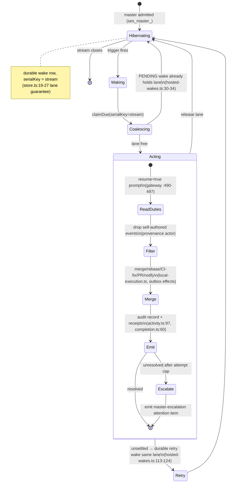

# 2026-07-18-005 — WorkGraph v2 implementation: charters, masters, evidence

**Status:** PLANNED
**Companion product plan:** 2026-07-18-004
**Principle:** Evolve the existing WorkGraph. Every addition names the existing seam it attaches to — a field on a record, a command in the union, an event in the enum, a launchability reason in the oracle, a sink in the wakes engine, or a memo on a component. No subsystem is replaced.

---

## Overview & scope

WorkGraph is a read-canonical-snapshot / write-via-commands feature. Every field a surface shows is a contract DTO field arriving through the `workgraph.changed` doorbell → `reloadCanonical` → snapshot/attention → memo → props pipeline (`workgraph-content.tsx:229`, `sync-lifecycle.ts:52`); every affordance calls `props.mutate(() => props.client.someCommand(...))` (`work-item-rows.tsx:6,205-240`); and every command, event, and launchability reason is declared in three parallel registries that stay in lockstep — the command union `contracts/commands.ts:435`, the event enum `contracts/events.ts:22`, and the handler map `ports/store.ts:28`, mirrored on Convex by the `applyCommand` if-chain `workgraphCommands.ts:204` and its `supported` allow-list `workgraphCommands.ts:17-50`. This plan adds capability inside that shape without changing it.

**What is added.** Four capabilities and one structural law graft onto named seams:

- A plain-text **charter** — standing instructions plus a content hash — on each Stream record (`records.ts:78`), drafted by the planner at scoping, edited by the human, versioned by hash, and injected into both worker prompts and the master's context.
- A per-Stream **master** agent: a long-lived, lease-less session (`ses_master_<streamId>`) admitted through `WorkGraphSessionGateway` (`local-execution.ts:14-33`), hibernated and woken by the wakes package as a new `workgraph_master` sink (`hosted-wakes.ts:6-11`), that operates the Stream's merge queue, scheduled rebase, CI-fix loop, PR creation, and notifications under a hard authority envelope.
- An **evidence** layer: structured audit records (`AgentCheckpointDto`, `activity.ts:67`) and receipts (`EvidenceDto`, `completion.ts:60`) on every agent action, plus provenance tags on external content that survive derivation and are checked at the point of use.
- A single inter-agent primitive, **`call_master(message)`**, registered as one host-local tool in `createLocalWorkGraphAgentTools` (`workgraph-agent-tools.ts:85-133`) and one `applyCommand` branch.
- **One running Task per Stream** by default — a new `workspace_busy` launchability reason in the pure oracle (`launch-readiness.ts:9`) and a sibling stream-granularity lease on Convex (`workgraphCommands.ts:1972`).

Two further capabilities extend the same seams: **flow streams** (a stored `shape` value on the existing `stream_kind` column, `schema.ts:147`, whose Tasks circulate and never close) with a **ledger skill** and per-Task worktree isolation reusing the `children/` subtree (`local-execution.ts:170-171`).

**What is explicitly not rebuilt.** The launch drain (`drainReadyStreams`/`continueSqliteStream` at `store.ts:334,913`; Convex `continueStream`/`reconcileReadyStreams` at `workgraphCommands.ts:2137,2113`) remains the mechanical launcher — the master enqueues work, it does not launch. The approval gate (`pending_approval` and `approve_work_item`, `workgraphCommands.ts:219`) remains, now gating only agent-proposed work. The snapshot/doorbell sync — the `workgraph.changed` doorbell, the snapshot pager (`store.ts:3342-3391`), and `snapshot_relevant` invalidation (`schema.ts:569`) — remains the sole data path to the UI, and no new surface opens a socket, a cursor, or a chrome pattern the flat hairline language (`workgraph.css`, `workgraph-*` prefix, `is-*` modifiers) does not already carry. The session gateway admits both workers and the master through one contract. The outbox, due-jobs, lease, and wake tables all remain; masters, receipts, and side effects extend existing tables and effect-type switches (`claimControlEffects`, `workgraphRuntime.ts:223`) rather than adding subsystems.

**Scope boundary.** Genuinely new infrastructure is held to the minimum the seams demand: the master session identity, one `wg_v2_master_mailbox` table (mirrored on Convex), the audit-record shape (riding `AgentCheckpointDto`/`TaskActivityEntry`), provenance tags (read over existing origin columns), and the `master_escalation` attention kind. Everything else extends an existing table, command union, event enum, launchability reason, outbox effect switch, wake sink, or component memo.

---

## UX

This section specifies every surface a user touches and the exact component each one evolves. New surfaces attach at the doorbell → `reloadCanonical` → props seams; none introduces a socket, a cursor, or a chrome pattern the flat hairline language does not already carry. The `workgraph-*` class prefix and `is-*` state-modifier idiom (`workgraph.css`) govern all of it.

### 1. The project stream card

The stream card is `StreamCard` inside `WorkGraphProjectGroups` → `ProjectSection` (`workgraph-overview.tsx:37,95,153`), grouped by `streamProject()` derived from `executionDefaults.environment` (`:23`). Four regions evolve.

**Placement line.** Directly under the card title sits a single muted hairline line reading `worktree · from dev @ a1b3f2c`. It states where the Stream's work lands and what base revision it tracks, so a user never wonders which repo or branch a launch touches. It renders from the Stream's `executionDefaults` and base-revision fields already carried on `StreamDto` and reuses the `.workgraph-streamcard-head` typographic scale — no new component, a `
` beneath the title node at `:281`.

**Master status line.** Below the placement line, one live line reports the Stream's master in plain English: `Idle`, `Merging task 3 into the stream branch`, `Rebasing on dev`, `Opening PR`. When the master has just acted, the line ends with inline one-click receipt links — `merged · diff` — where `diff` opens the exact attempt. This is a footer/head chip mirroring `.workgraph-streamcard-paused` and `.workgraph-streamcard-needs-you` (`workgraph.css:404-416`); it slots as a `masterStatus()` memo plus a `<Show>` in `workgraph-streamcard-actions` (`:281-323`) or the footer beside the Paused label (`:402`). The receipt anchor reuses the Session deep-link precedent (`work-item-rows.tsx:372`): a safe ref that resolves to a session, never a credential-bearing value.

**Needs-you pill.** The always-visible `N need you` pill in the footer (`:408`) already folds staged Tasks and attention into one count. It gains master escalations in that same fold — the count is the Stream's true human-owned backlog. No visual change; the pill's source memo widens to include the new escalation attention kind (surface 7).

**Pause and stop controls.** The head action span (`:281-323`) carries one Pause control, evolving the existing Pause/Resume icon button (`:286`, `setStreamLifecycle` active↔paused, gated by `canPauseResume()` at `:246`). Pause halts new launches — this is the launch gate. A checkbox inside the Pause popover, `Also stop running work`, extends the single action to cancel live attempts. A paused Stream announces itself inline on every affected Task row (surface 2), so the state is never hidden behind a card-level label alone; `streamPaused()` (`:167`) already drives the footer Paused label (`:402`) and now also feeds the per-row message. Stop-the-whole-stream is Pause-with-checkbox; there is one pause verb, not two.

**Spinner rows.** The card preview renders the first four Tasks via `WorkItemLeaf` with the animated running spinner (`TaskStatusGlyph`, `work-item-rows.tsx:75,82-87`, `.workgraph-leaf-spin` honoring `prefers-reduced-motion` at `workgraph.css:322`). Because one project Stream runs one Task at a time by default, at most one spinner turns per card, which is the visual proof of the serialization law.

**Backend needs:** `StreamDto` base-revision + placement fields readable in the snapshot (`records.ts:78`); a master-status field on `StreamDto` (or a `master_session` record memo beside `workgraph-content.tsx:200-212`) carrying the plain-English state and the latest receipt ref; the `setStreamLifecycle` command already present (`commands.ts:224`) plus a stop-running variant that cancels live attempts; a `workspace_busy` launchability reason so the snapshot projector reports at most one running Task (`launch-readiness.ts:51`).

### 2. Task rows and the task inspector

Rows are `WorkItemLeaf` (`work-item-rows.tsx:165`), one component mounted in the card preview, the `OutcomeGroup` in the Tasks panel (`:108`), and the Needs-you panel. Status is the six-label model from `taskStatusLabel()` (`:18`), ordered by `STATUS_ORDER` (`:52`). Changes land everywhere at once.

**Stop button.** A running row gains a trailing Stop button as a new `<Show>` gated on the row being `running`, placed beside the existing Session and Delete buttons (`:372,385`) and following the `approve`/`confirmReject` mutate pattern exactly (`:205-240`). It calls `props.mutate(() => props.client.cancelAttempt(...))` — the command exists end-to-end (`api.ts:388`) with no UI caller today; this button is that caller.

**Stopped · Retry.** A stopped attempt reads `Stopped · Retry` inline. Retry reuses the existing Retry affordance and its `isRetryable` logic (`:360,400`); the label is a status-message variant in the row gap region (`:290`). A paused Stream's rows carry the inline `Paused` message in the same region, so pause state travels with the row, not only the card.

**Session and workspace identity.** The task inspector is `TaskDialog` → `AttemptDetailView` (`waiting/item-dialogs.tsx:41,592`). Its execution block names the concrete session and workspace the attempt ran in, read from `attempt.executionReferences` (`records.ts:174`), rendered as a `DialogSection` (`:403`) beside the existing Result block (`:649`). The Session deep-link (`:620-642`) already resolves `executionReferences.sessionId`; the workspace identity renders next to it as a labeled ref, subject to the no-credential guard at `:588-590`.

**Open in project.** Every row and the inspector expose Open in project, which opens the attempt's session in a pane via `openWorkGraphSession` (`first-party-content-surfaces.tsx:160`, wired as `onOpenSession` at `:136-146`, resolving directory/workspace at `:220-226`). This is the resolution path for a master escalation carrying a conflict: the user opens the exact session the master left the work in, rather than any bespoke merge UI. `WorkItemLeaf.openSession` (`:241-261`) already reads `attempt.executionReferences`; Open in project is that same call surfaced as a labeled affordance.

**Backend needs:** `cancelAttempt` command reachable per row (present, `api.ts:388`); the attempt machine's `running → cancelled` edge (present, `transitions.ts:65`); a stopped/retryable flag surfaced on the work-item or attempt DTO for the `Stopped · Retry` label; `executionReferences.{sessionId,workspaceId}` populated on `AttemptDto` (`records.ts:174`) for identity and Open-in-project.

### 3. The charter

The charter is plain-text standing instructions on a Stream, drafted by the planner at scoping, edited by the human, versioned by hash.

**At stream creation.** When the planner scopes a new Stream, it presents the drafted charter diff-style before the Stream commits. Lines with externally-visible side effects — open a PR, notify a channel, push to a branch — are highlighted with an `is-side-effect` modifier so a rubber-stamped clause the human never wrote cannot ship silently. This renders in the admission/scoping flow that already produces proposals (`AttentionItem.kind === "admission_proposal"`, `waiting/waiting-source.ts:174`; confirm path `ConfirmAdmissionCommand`, `commands.ts:212`), as a charter block above the proposed Tasks. The highlight reuses the `is-*` modifier idiom on hairline text; no new chrome.

**Where it is edited.** The charter's home is the Settings panel: `StreamSettingsView` → `StreamSettingsContent` → `SettingsForm` (`waiting/settings-dialogs.tsx:98,120,167`). It is a new `Charter` section headed by `.workgraph-settings-section-title` (`:435,688`), a `RichTextEditor` (already imported, `workgraph-content.tsx:9`) bound to a `charter` signal, saved through `StreamSettingsSource.save` (`:80-82`, `streamSettingsSource` at `workgraph-content.tsx:476`) via a new `updateStreamCharter` command carrying `stream.version` for CAS (`:147`). The editor lives inside a `KeyedById`-style keyed mount (`work-item-rows.tsx:492`) so a snapshot refresh mid-edit never destroys the draft.

**A blank charter.** An empty or vacuous charter shows the conservative defaults it resolves to, rendered as read-only hint text inside the Charter section: draft PRs, capped notification rate, ask before the first externally-visible action. The user sees exactly the behavior a blank field buys, so silence is never mistaken for unbounded autonomy.

**Backend needs:** a `charter: {text, hash}` field on `StreamDtoSchema` reusing `ContentHashSchema` (`records.ts:78`, `work-source.ts:5`); a `SetStreamCharterCommand` shaped on `SetStreamLifecycleCommandSchema` with `expectedVersion` CAS (`commands.ts:224`) plus a `stream_charter_updated` event (`events.ts:22`); the charter and its hash present on the create/admission-confirm path so scoping can draft and highlight it; the documented default set readable so the blank state renders honestly.

### 4. Master status and the stream notes doc

**Master status with receipts.** The master's plain-English updates render in two places from one source: the card's master status line (surface 1) and, in full, the task inspector. `AttemptDetailView` (`item-dialogs.tsx:592`) gains a master-activity `DialogSection` (`:403`) listing recent master actions — `merged task 3`, `rebased on dev`, `opened PR` — each ending in an inline diff/artifact receipt link beside the existing Result/`artifactRefs` region (`:649,654-658`) and Session link (`:620-642`). Receipts are safe refs only, per the guard at `:588-590`; a merge receipt resolves to the diff, a PR receipt is a plain external anchor. This makes the narrator auditable: every prose claim carries a link the user can open.

**The stream notes doc.** The master maintains a notes doc — learnings and status — as a WorkSource authored through the document handoff, not a Stream field. It attaches via `createDocumentWorkGraphHandoff` (`app/integrations/doc-workgraph.ts:54`, `adapterId "claxedo_docs":25`), so the notes doc is a first-class Documents-feature document the human reads and the master revises. A `Notes` link on the card footer and a viewer `DialogSection` in the inspector open it. External content quoted into the doc is stored as structurally fenced quotation with its source, never flattened into trusted prose — the viewer renders the fence visibly so provenance survives to the reader.

**Backend needs:** structured audit records for master actions via `AgentCheckpointDto` / `TaskActivityEntry` (`activity.ts:67,97`), each carrying `evidenceIds`; receipt payloads as `EvidenceDto` — `artifact` for diffs, `integration` with the mandatory `durableEffectReceiptId` for merged/published effects (`completion.ts:60,81,91`); the notes doc as a WorkSource with `AuthoringSourceRevision` provenance (`work-source.ts:8`); fenced-quotation storage so external content keeps its source tag through the doc.

### 5. Approval of agent-proposed work

Work the human directly asked for just runs. Work an agent proposes — planner fan-outs, worker-discovered Tasks, flow-stream promotions — arrives `pending_approval`, labeled **Staged**.

**Staged rows.** Staged Tasks render through the existing staged path: the dashed-circle glyph (`work-item-rows.tsx:75`, `is-staged`), the per-row Approve/Reject buttons where Reject reveals an inline required-reason input (`:298-359`), and the Needs-you panel's per-stream staged grouping with bulk `Approve all staged` (`waiting/waiting-panel.tsx:98-138`, styled `.workgraph-waiting-row.is-staged` / `.workgraph-staged-*`, `waiting.css:135-177`). Bulk conflict handling reuses `staged-approvals.ts` (`workgraph-content.tsx:268`).

**File-scope groups.** A large proposal shows file scope per Task and overlap flags, so a 45-row fan-out reads as roughly six to eight groupable decisions rather than forty-five. Staged rows within a Stream group by file scope under a scope header, with an overlap badge on rows that touch the same files. The grouping evolves the existing per-stream `stagedGroups` structure (`waiting-panel.tsx:44`); `Approve & run` acts on a whole scope group at once through the bulk path.

**Human-created tasks skip approval.** A Task the human created — via `InlineAddTask` (`workgraph-overview.tsx:347`) or the ledger skill — never enters Staged; it launches straight to `ready`. The row distinguishes provenance from its `createdByActorType` so a user's own Task never asks the user to approve it.

**Backend needs:** `pending_approval` state and `approve_work_item` command (present, `commands.ts:245`); `createdByActorType`/`createdByActorId` on `WorkItemDto` (`records.ts:132-134`) so human-created Tasks bypass staging; per-task file-scope and overlap data on the proposal DTO for scope grouping; the bulk/partial-conflict approve path (present, `staged-approvals.ts`).

### 6. The flow-stream card

A flow Stream never closes; work circulates through it. Its card is the same `StreamCard` (`workgraph-overview.tsx:153`) branching on a stored `shape` field — never a menu the user configures up front.

**Queue metrics.** The flow card's footer replaces the project card's progress fraction (`doneCount()/total()`, `:384`) with queue depth and throughput: `arrived · resolved · oldest waiting`, computed as a `flowMetrics()` memo from the Stream's item states, reusing the `statusCounts` mechanism (`:172`) and the footer fan region (`--fan-count`, `:362`).

**Aging-out rows.** Resolved items age out of view — the preview shows current queue items, resolved rows fade via an `is-resolved` modifier and drop from the list, so a flow Stream stays glanceable instead of growing unbounded. The delete/close logic branches on `shape` here: a flow Stream has no Close affordance (`removeStream`/`hasDurableEffects` at `:222-236` gate on shape), only per-item dispositions.

**Dispositions.** Each flow item carries three affordances as trailing row buttons on `WorkItemLeaf`: **Resolve** in place, **Promote** to a project Stream, **Dismiss** with reason. Dismiss reuses the inline required-reason input pattern (`work-item-rows.tsx:298-359`); Promote opens a target-stream selection; Resolve marks the item done. The intake candidate feed (source views, unorganized/staged/dismissed) is this card's input, not a separate lane.

**Backend needs:** a `shape` field on `StreamDto` (`records.ts:78`) so the card branches; per-item disposition commands (resolve / promote / dismiss-with-reason) following the `CancelAttemptCommand` shape (`commands.ts:275`); flow metrics derivable from item states in the snapshot; the intake candidate pipeline projected as a flow Stream's item feed rather than a distinct attention lane.

### 7. Escalations in Needs-you

The Needs-you panel (`WaitingPanelBody`, `waiting/waiting-panel.tsx:15`) renders a discriminated `AttentionItem` union — `work_item`, `admission_proposal`, `decision`, `attempt`, `unorganized_ai_work`, `configuration_required` (`waiting-source.ts:173-255`) — as `WaitingRow`s with per-kind glyphs (`WaitingRowGlyph:268`).

A master escalation is a new `AttentionItem` kind projected into that same list — not a new panel, not new chrome. It reads as a filtered, human-owned decision: `Master could not resolve a merge conflict in task 3` or `Master is holding the first public PR for your confirmation`, with the escalating Stream named and Open in project as the primary action (surface 2), plus the master's reasoning and the linked diffs beneath. It renders through `toWaitingRow` (`waiting-source.ts:173`) with a glyph in `WaitingRowGlyph` (`:268`), modeled structurally on `ConfigurationRequiredAttentionItem` (`contracts/attention.ts:121`) — a structured requirement rather than a bare record ref.

The master absorbs the first bounce of every worker question and ordinary conflict; only what it cannot resolve reaches this surface. Needs-you is therefore a filtered queue, not a per-task interrupt tax. The empty state stays the deliberate reassuring success state (`:76-86`); escalations never appear there.

**Backend needs:** a master-escalation `AttentionKind` and item schema in the `AttentionItemSchema` union with a `kind` cursor entry (`attention.ts:16,156,229`), carrying the Stream ref, the master's reasoning summary, and the linked evidence ids; the master's escalate-and-halt path emitting that attention item (with loop-breaker attempt caps so a failing master escalates once rather than looping); the escalation's diffs as `EvidenceDto` refs (`completion.ts:60`) so Open in project and the linked diffs resolve to real sessions and artifacts.

---

Every surface above is a memo or a `<Show>` on an existing component, a new command method on the `api.ts` client (`:292-510` pattern), or a new `AttentionItem` kind — all riding the one doorbell → `reloadCanonical` pipeline (`sync-lifecycle.ts:52`) with no new socket. The invariants hold throughout: CAS `expectedVersion` on every write, `KeyedById` around every inline editor (charter, reason inputs), snapshot fields only (no fabrication), stall-don't-fallback on reload failure, and receipts that carry safe refs, never credentials.

---

## High-Level Design

WorkGraph adds three capabilities to the existing hexagon — a plain-text **charter** on each Stream, a per-Stream **master** agent, and an **evidence** layer on every agent action — and one structural rule, **one running Task per Stream**. Each capability grafts onto a named existing seam. Nothing here replaces a subsystem: the launch drain, the approval gate, the snapshot/doorbell sync, and the `WorkGraphSessionGateway` all remain the load-bearing machinery, and every new field, command, event, and launchability reason is defined in the three parallel registries that already govern them (the command union at `contracts/commands.ts:435`, the event enum at `contracts/events.ts:22`, and the handler map at `ports/store.ts:28`).

### Charter — a standing field on the stream record

The charter is plain text plus a content hash, stored on the Stream record itself, resolved behind conservative defaults, and injected into both worker prompts and the master's context.

**Storage.** The charter attaches to `StreamDtoSchema` (`records.ts:78`) exactly as `title` and `executionDefaults` do: `charter: z.strictObject({ text: z.string(), hash: ContentHashSchema }).optional()`. The hash reuses the existing 64-hex branded `ContentHashSchema` (`work-source.ts:5`), so the charter version is a first-class content hash, not a new primitive. There is no stream detail DTO (`details.ts:112` covers proposals/work-items/attempts/decisions only), so the charter rides the Stream record through the snapshot pages (`records.ts:376` → `records.ts:387`). In SQLite the field is one `charter TEXT` (or `charter_json`) column on `wg_v2_streams` (`schema.ts:140`), added through the package's hand-rolled migration idiom — the `PRAGMA table_info` probe plus conditional `ALTER TABLE ADD COLUMN` at `schema.ts:705-747`. On the Convex side the same field is an optional column on `workgraph_streams` (`convex/schema.ts:450`), added in the EXPAND step only; the header law of `migrations.ts:2-10` — "expand-migrate-contract is law," no hand-rolled backfills — governs it, so the column ships optional and any backfill runs through `migrations.define`.

**Version hash and commands.** Charter writes go through a dedicated `SetStreamCharterCommand`, shaped on `SetStreamLifecycleCommandSchema` (`commands.ts:224`) so it carries `expectedVersion` (`commands.ts:26`) as its CAS token and gets independent optimistic-concurrency control. It emits a `stream_charter_updated` event appended to `WorkGraphEventTypeSchema` (`events.ts:22`), and its handler lands in the SQLite command map and in the Convex `applyCommand` if-chain (`workgraphCommands.ts:204`) with a matching `supported`-set entry (`workgraphCommands.ts:17-50`). Charter text is also accepted on the create/admission-confirm path (`CreateStreamCommandSchema` at `commands.ts:67`, `ConfirmAdmissionCommand` at `commands.ts:212`) so the planner drafts it at scoping.

**Injection.** Every agent records the charter hash it holds; an agent whose hash is stale re-syncs before its next externally-visible action. Worker injection happens at admit: the gateway's `admit` builds the session prompt and sends it with `delivery:"steer", resume:true` (`workgraph-session-gateway.ts:490-497`), and the charter text prepends the worker prompt there. Master injection is the same text delivered as the master's duty list on each wake (below). The versioned-hash rule is enforced at the point of use, not at read time, so drift-in-flight cannot produce an unauthorized side effect.

**Defaults behind the charter.** A blank or vacuous charter resolves to a fixed conservative set — draft PRs, capped notification rate, ask before the first externally-visible action. This resolution is a pure function over the charter text, evaluated where the master reads its duties and where the worker prompt is assembled; silence never resolves to unbounded autonomy. The master's **notes doc** is not a charter field: it is a WorkSource authored through `create_work_source`/`revise_work_source` (`commands.ts:47,56`), which already carry `AuthoringSourceRevisionSchema` provenance (`work-source.ts:8`) and content hashing, and it attaches to the Documents feature via `createDocumentWorkGraphHandoff` (`app/integrations/doc-workgraph.ts:54`).

### Master runtime — a long-lived session on the wakes engine

A master is a session plus a charter plus a mailbox plus wake subscriptions plus bounded authority. It is admitted through the existing gateway, anchored by an existing session binding, and hibernated and woken by the wakes package.

**The session.** The master is admitted through `WorkGraphSessionGateway` (`local-execution.ts:14-33`) with a stable id (`ses_master_<streamId>`) and **no** `leaseEpoch`. Omitting the lease epoch is load-bearing: the gateway gates all attempt-lease and attempt-tool wiring on `leaseEpoch !== undefined` (`workgraph-session-gateway.ts:412`), so a master — which is not an attempt and holds no lease — admits cleanly without acquiring attempt machinery. Its home directory is the Stream envelope resolved by `envelopeDirectory(context, streamId)` (`local-execution.ts:87`). Re-prompting on wake is a second `admit`/prompt against the same id with `resume:true` (`:490-497`), idempotent by `messageID` on the V2 path (`:385,494`). The master is anchored by a `SessionBindingDto` (`activity.ts:28`) scoped to `streamId` with no `currentWorkItemId` when idle — the unique partial index enforcing one active binding per `(owner, session)` (`schema.ts:684`) makes the per-stream master structurally singular. The idle-intake filter that turns stray idle sessions into new Streams (`session-intake.ts:38`) extends to skip the `ses_master_` prefix so the master's own idle events never bootstrap a spurious Stream.

**Hibernation and wakes.** The master hibernates as a durable wake row and wakes on three triggers, each mapping to one of the wakes package's existing trigger types `at | on_event | on_approval` (`types.ts:18`): task-settled (`on_event`), a `call_master` mailbox message (`on_event`), and a schedule (`at`/`cron`, `wakes.ts:82`). The master is a new sink `kind` — `workgraph_master` — registered in `composeHostedWakes` alongside the existing `workgraph_settle` sink (`hosted-wakes.ts:6-11,27`), which is already a per-tenant hibernating reconciler running inside a `WakeLane` Durable Object alarm. Its `serialKey` is `streamKey(tenant, streamId)`, so the lane guarantee of the wake store (`store.ts:19-27`) delivers **one master turn per stream at a time for free** — the serialization is the lane, not new code.

Enqueue is atomic with the settlement write. Task-settled wakes are created via `createWakeInTx` (`convex/wakes.ts:122`) from `recordResult` (`workgraphRuntime.ts:904`) and `recordFailure` (`workgraphRuntime.ts:1116`) — the exact mutations where "task settled" is observed — so the domain change and the master wake commit in one transaction. The SQLite path reads settled attempts through `listSqliteReconcilableAttempts` (`store.ts:809`) and enqueues a `wg_v2_due_jobs` row keyed `(job_type='master_wake', subject_id=stream_id)` (`schema.ts:599`), whose uniqueness dedups a settlement burst at insert time. The mailbox trigger enqueues the same wake from the `call_master` command branch in `applyCommand` (`workgraphCommands.ts:204`); the schedule trigger uses `schedule({cron, serialKey:stream})` on the same lane.

**Wake coalescing.** Wake coalescing is a design requirement: N settlements in one window produce one master invocation. The Convex in-transaction creator skips the insert when a PENDING wake already holds the lane (`hosted-wakes.ts:30-34`), and the node push driver coalesces per-lane and drains a lane until empty (`node-driver.ts:24,45-48`). **Attempt caps per failure signature** are a loop-breaker: the master caps retries per distinct failure signature using the wake store's budget counters (`store.ts` budget port) and the outbox `attempt_count`, and on cap it escalates-and-halts rather than looping. **Self-action filtering** keeps a master out of its own trigger stream: every record carries `RecordProvenance` (`records.ts:33`) with a `WorkGraphActor` (`context.ts:4`), and the master's wake handler filters change events whose actor is the master's own identity, so a merge the master just performed does not wake it again.

Triggers: **task settled** (`recordResult`/`recordFailure`, `workgraphRuntime.ts:904/1116`), **mailbox** (`call_master` branch, `workgraphCommands.ts:204`), **schedule** (`wakes.ts:82`). Each maps to an existing wake trigger type; no new trigger machinery is introduced.

### call_master — one agent tool on the existing registry

`call_master(message)` is the single inter-agent primitive: enqueue into the master's mailbox and wake it. It registers as one more entry in the host agent-tool registry `createLocalWorkGraphAgentTools` (`workgraph-agent-tools.ts:85-133`), spread into the map after the loop that builds tools from the MCP catalog (`:105-131`) — a host-local tool needs no MCP-package change. Its `execute` receives `{sessionID, toolCallID}` (`:113`) and, via `owner.sessionContext` / `sessionBindings.readForSession` on the transport (`:43`), resolves the caller's Stream, appends the message to that Stream's master mailbox, and enqueues the mailbox wake. Because it needs the caller's binding, `call_master` joins the `sessionToolNames` set that gates `owner.sessionContext` injection (`:135-143`). The command-layer counterpart is a `call_master` branch in `applyCommand` (`workgraphCommands.ts:204`) plus its `supported`-set entry (`:17`), which performs the `createWakeInTx` enqueue.

### Master duties as capabilities

The master's duties are capabilities layered on existing machinery; the charter selects and sequences them, and the hard envelope (below) bounds them.

**Merge / land in the envelope worktree.** Landing rides `createLocalWorkspaceExecution` (`local-execution.ts:45-197`), which owns the deterministic worktree tree `worktreeRoot/org/owner/streamId/` with `envelope/` (`:87`) and `children/` (`:170-171`) subdirs. Merges are serialized by the existing per-`[org,owner,streamId]` `serialize()` lock (`:57-72`) — the same lock already guarding provision/cleanup — so the master's merge queue lands work one attempt at a time against a single envelope head. The master operates the envelope with normal file and git tools; merge needs no new port.

**Scheduled trunk rebase.** A `schedule({cron})` wake (`wakes.ts:82`) on the master's lane fires the rebase duty; the master rebases the envelope directory on current trunk and re-validates landings against the moving head. The schedule trigger reuses the wake `at`/`cron` type with no new timer.

**CI-fix loop with the structural escape-hatch gate.** "Fix CI until green" is bounded by a mechanical gate the master cannot argue with: a landing that introduces new `any`/`@ts-ignore`/`@ts-expect-error` or loosens tsconfig strictness fails regardless of green CI. The gate is a check evaluated in the domain alongside `evaluateCompletionContract` (`domain/completion.ts`), charter-configurable in its pattern set but enforced as code, not as prompt text. The attempt cap per failure signature bounds the loop so a failing fix escalates once rather than looping.

**PR creation.** PR creation is a new capability — the connection tools today are read/comment/update on issue source-views only (`connection_work_source_*`, gateway `:447-448`), and no connector exposes a PR verb. The master opens PRs through a host-local delivery tool in its own toolset, registered at admit via `input.profile.tools` and the `WorkGraphConnectionToolRoutes` per-session registration path (gateway `:464-489`). The tool obtains a GitHub token only inside `ConnectionsPort.withAuthorization` (`connections.ts:29-34`), never raw. PRs are **draft by default**; the first non-draft PR to a public repo in a Stream is **held for human confirmation** and auto-proceeds thereafter within that Stream.

**Notify.** Notifications go through the connections framework: `createControlPlaneChannels`' `sendMessage` (`channels-control-plane.ts:205,273`), behind its per-sender allow-list and rate-limit gates (`:338-381`). Dispatch is owner-scoped, so the master resolves the Stream owner as the recipient, never an arbitrary address, and the charter's notification cadence rides the existing rate caps.

### Evidence — audit records, receipts, provenance

The evidence layer is a design law: prose is a claim, evidence is a link.

**Structured audit records** append through the existing activity service. Each master action is a `TaskActivityEntry` (`activity.ts:97`) with an appropriate `category` (`:101`) and an `AgentCheckpointDto` (`activity.ts:67`) carrying `{level, summary, evidenceIds, provenance}`, recorded via `RecordAttemptCheckpointCommand` (`commands.ts:355`) and surfaced to agents as `listWorkItemActivity` (`workgraph-agent-tools.ts:32`) over `activityPorts.activity` (`server-workgraph.ts:113`). The record is atomic with the action — `{timestamp, wake_trigger, charter_version_hash, model_version, cited_charter_clause, reasoning_summary, tool_calls, resulting_diffs}` is emitted as part of taking the action, not reconstructed later.

**Receipts** are `EvidenceDto` refs (`completion.ts:60`) linked from the checkpoint's `evidenceIds` (`activity.ts:79`). A diff link is an `artifact` evidence (`completion.ts:69`); the gateway already collects `file:<path>` artifacts from settlement (`workgraph-session-gateway.ts:552-560`) into `ExecutionResult.artifacts` (`workspace-execution.ts:36`). A merged/published effect is `integration` evidence (`completion.ts:81`), whose `superRefine` (`:91`) requires a `durableEffectReceiptId` for `merged`/`published`/`accepted_external_write` — so a merge receipt has a mandatory durable provenance slot, backed by `wg_v2_durable_effect_receipts` (`schema.ts:427`) storing the PR URL in `external_reference_json` and keyed to `DurableEffectReceiptID` (`ids.ts:59`).

**Provenance tags** on external content survive derivation and are checked at point of use. External origin is already carried by `WorkSourceOriginSchema`'s `external` variant (`work-source.ts:20`) and the `wg_v2_work_source_revisions.origin_kind`/`origin_reference_json` columns (`schema.ts:52-53`). Content originating from public or untrusted sources stays execution-blocked even after summarization or paraphrase; it is stored as structurally fenced quotation with its source, never flattened into trusted prose, and the execution check reads the tag at the point the content would drive an action.

### Authority envelope — hard limits below the charter

No charter sentence and no model reasoning can widen these; they are enforced below the language layer.

**Master git identity is a permission fact.** The master acts under a dedicated git-host identity whose credentials structurally cannot push, merge, or force-push to `main` or any protected ref. A "fix CI" directive that conflicts with "never touch main" therefore resolves at worst into an open revert PR a human merges — the credential, not the prompt, is the boundary.

**No-approve is enforced at the command layer.** Approval commands (`approve_work_item` at `workgraphCommands.ts:219`, and the bulk variant) are absent from the master's toolset and are not reachable through `call_master`; the `supported` allow-list (`workgraphCommands.ts:17-50`) is the enforcement point. No agent — master included — can approve agent-proposed work.

**Protected-ref rules** live with the identity above; the master lands only its own Stream's work and rides the git host, never mutating protected refs.

### Serialization — one running task per stream

The scheduler is derived, never declared, and the default is one running Task per Stream. This is a new launchability reason, `workspace_busy`, added to `WorkItemLaunchabilityReason` (`launch-readiness.ts:9`) in the pure oracle's ordered checks (`:52-61`). The oracle's SQL twin in the adapter drain stays byte-for-byte equivalent (`launch-readiness.ts:4` docstring), so the reason lands in both the pure function and the SQL mirror together; it propagates to all three consumers the docstring names — the drain, the snapshot projector, and the attention projector. In Convex the guard is a stream-granularity lease: `admitAttempt` already takes a `workgraph_leases` row keyed `resource_type='work_item'` (`workgraphCommands.ts:1972`); a sibling `resource_type='stream'` lease acquired in the same admit path, reusing the identical lease+epoch mechanics, serializes at stream granularity. The `held` derivation in `continueStream` (`workgraphCommands.ts:2154-2159`) and the `stream_held` input (`launch-readiness.ts:32`) remain the per-pass hold; `workspace_busy` is the strict per-stream running-attempt guard beneath them.

### Flow shape — a stored field, per-task branches, planner intake

A Stream's shape is a stored field the planner infers, never a menu the user configures. The `stream_kind` column already exists on `wg_v2_streams` with default `'finite'` (`schema.ts:147`) and on Convex `workgraph_streams` (`convex/schema.ts:466`); `shape` is `stream_kind='flow'`, a new free-text enum value needing no DDL. A flow Stream never closes: this is a policy on the existing lifecycle, gating the close command and `streamRemovalEligibility` (`lifecycle.ts:21`) on shape, not a new lifecycle state.

**Per-task branches** reuse the child-worktree machinery. The `children/` subtree (`local-execution.ts:170-171`) is already provisioned-for in the layout and disposed by `cleanup`, which decodes the `child_<org>.<owner>.` prefix and removes each worktree (`:172-177`); `reason:"reconcile"` intentionally skips envelope teardown (`:191`), which is exactly what a never-closing flow Stream wants. A `provisionChild(streamId, taskId)` method mirrors `provisionOrAdopt` (`:100-144`) but targets `children/<taskId>` with a per-task branch off current trunk, and `ChildIsolationID` (`workspace-execution.ts:16,94`) tags each for cleanup. This same machinery serves charter-requested per-Task isolation in project Streams.

**Intake feeds the flow master.** The intake pipeline (source views, `IntakeCandidateDto` at `source-view.ts:77`, receipts) projects as a flow Stream's item feed rather than a separate lane, and the flow master triages per its charter with three dispositions — resolve in place, promote to a project Stream, dismiss with reason. Promotion leans on the existing `fork` admission mode (`commands.ts:188`). The naïve regex structurer `proposeSourceStructure` (`matching-service.ts:103-126`) yields to a planner pass on the admission path (`ProposeAdmissionCommand` at `commands.ts:143` → `ConfirmAdmissionCommand` at `commands.ts:212`) that produces real dependencies and a drafted charter.

### Data flow to the UI

Every new field reaches the UI through the existing snapshot/doorbell sync, unchanged. Charter, shape, master status, and master-escalation attention items ride the canonical snapshot: `StreamDto` flows through `WorkGraphSnapshotPageSchema` (`records.ts:387`), invalidated by the `wg_v2_changes.snapshot_relevant` flag (`schema.ts:569`) in the snapshot pager (`store.ts:3342-3391`). Master activity and escalations propagate on the `workgraph.changed` doorbell: every `service.execute` nudges post-commit (`server-workgraph.ts:108`), and `observeChanges` (`server-workgraph.ts:289`) is the tip-watching backstop for out-of-band writers, including the master. A master-escalation is a new `AttentionKind` and item schema in the `AttentionItemSchema` union (`attention.ts:16,156,229`), modeled on `ConfigurationRequiredAttentionItemSchema` (`attention.ts:121`); it arrives in the UI through the same `ChangeEnvelope` (`events.ts:121`) → reloadCanonical → snapshot pipeline, introducing no new socket.

### What is NOT rebuilt

The launch drain stays: `drainReadyStreams`/`continueSqliteStream` (`store.ts:334,913`) and Convex `continueStream`/`reconcileReadyStreams` (`workgraphCommands.ts:2137,2113`) remain the mechanical launcher; the master enqueues work but does not replace the drain. The approval gate stays: `pending_approval` and `approve_work_item` (`workgraphCommands.ts:219`) are unchanged, now gating only agent-proposed work. The snapshot/doorbell sync stays: the `workgraph.changed` doorbell, snapshot pager, and `snapshot_relevant` invalidation are the sole data path to the UI. The session gateway stays: `WorkGraphSessionGateway` (`local-execution.ts:14-33`) admits both workers and the master through one contract; the master adds a stable-id, lease-less admission, not a new transport. The outbox, due-jobs, lease, and wake tables all stay — masters, receipts, and side effects extend existing tables and effect-type switches (`claimControlEffects` at `workgraphRuntime.ts:223`) rather than adding new subsystems.

---

## Technical Implementation Plan

This plan evolves the existing WorkGraph hexagon. Every addition names the seam it attaches to; no subsystem is rebuilt. Three registries stay in lockstep for every new field, command, event, and launchability reason: the command union `contracts/commands.ts:435`, the event enum `contracts/events.ts:22`, and the handler map `ports/store.ts:28`, mirrored on Convex by the `applyCommand` if-chain `workgraphCommands.ts:204` plus its `supported` allow-list `workgraphCommands.ts:17-50`. Schema changes follow two conventions already in the tree: the SQLite hand-rolled `PRAGMA table_info` probe plus conditional `ALTER TABLE ADD COLUMN` at `adapters/sqlite/schema.ts:705-747`, and the Convex expand-migrate-contract law at `convex/migrations.ts:2-10` (optional column in EXPAND, backfill via `migrations.define`, drop deferred to CONTRACT — never a hand-rolled backfill). Every mutating command carries `version: z.literal(1)` `commands.ts:24` and `expectedVersion` `commands.ts:26` as its CAS token, and the pure oracle `launch-readiness.ts:51` and its SQL twin in the drain move together (docstring `launch-readiness.ts:4`).

### Phase 0 — Safety and honesty

Three independent slices; each is a parallel worktree agent.

**0a — Stop controls.** No contract change: `CancelAttemptCommandSchema` `commands.ts:275` (attemptId, expectedVersion, reason) and the `running → cancelled` edge `transitions.ts:65` already exist, and the client method `cancelAttempt` is reachable at `api.ts:388` with no caller. Modify `work-item-rows.tsx`: add a `<Show>` gated on the row being `running`, beside the Session/Delete buttons (`work-item-rows.tsx:372,385`), calling `props.mutate(() => props.client.cancelAttempt(...))` in the exact shape of `approve`/`confirmReject` (`work-item-rows.tsx:205-240`). The `Stopped · Retry` label is a status-message variant in the row gap region (`work-item-rows.tsx:290`), reusing the `isRetryable` logic at `work-item-rows.tsx:400`. The Pause control evolves the existing Pause/Resume button in `workgraph-overview.tsx:286` (`setStreamLifecycle` active↔paused, gated by `canPauseResume()` at `:246`); the "Also stop running work" checkbox in its popover fans out `cancelAttempt` over the Stream's running attempts. The inline paused-row message is driven by `streamPaused()` (`workgraph-overview.tsx:167`) threaded into `WorkItemLeaf`.

**0b — One running task per stream.** Add `workspace_busy` to `WorkItemLaunchabilityReason` `launch-readiness.ts:9` and to the ordered checks at `launch-readiness.ts:52-61`; add the corresponding `stream.hasRunningAttempt?` input flag at `launch-readiness.ts:31-38`. The SQL mirror in the SQLite drain (`store.ts:1060` predicate, invoked from `drainSqliteReadyStreams` `store.ts:913`) lands byte-for-byte in the same commit. On Convex the guard is a sibling `workgraph_leases` row: `admitAttempt` already takes a `resource_type='work_item'` lease at `workgraphCommands.ts:1972`; acquire a `resource_type='stream'` lease in the same admit path with identical epoch mechanics so a second admit in the Stream fails with the existing "already has an active Attempt" surface `workgraphCommands.ts:1980`. The derived hold in `continueStream` `workgraphCommands.ts:2154-2159` and the `stream_held` input `launch-readiness.ts:32` remain the per-pass hold; `workspace_busy` is the strict running-attempt guard beneath them.

**0c — Honest copy.** No new command. `StreamDto` base-revision fields (`base_repository`/`base_revision`, `schema.ts:155`; `records.ts:78`) render as the `.workgraph-streamcard-placement` div beneath the title node at `workgraph-overview.tsx:281`. `createdByActorType`/`createdByActorId` `records.ts:132-134` gate the "Approve & run" label so human-created rows skip Staged. Session + workspace identity render in `AttemptDetailView` from `executionReferences` `records.ts:174`, subject to the credential guard `item-dialogs.tsx:588-590`.

**Contract/schema changes:** none for 0a/0c; one launchability reason (pure + SQL) and one stream-lease for 0b.

**Tests:** extend `packages/workgraph/test/domain-rules.test.ts` for `workspace_busy` in the oracle and `packages/workgraph/test/sqlite-store-commands.test.ts` plus the conformance suite `packages/workgraph/test/conformance/sqlite.test.ts` for the drain refusing a second admit; extend `work-item-rows.vitest.tsx` (new file beside `workgraph-overview.vitest.tsx`) for the Stop `<Show>` and `Stopped · Retry`; extend `packages/claxedo-app/e2e/playwright/core-workgraph.spec.ts` via `real-workgraph-harness.ts` for two approved Tasks never holding two live attempts, Stop from card and panel, and a human-created Task launching with no approval step.

**DoD:** unit tests for the reason in oracle + SQL mirror green; E2E proves single-attempt-per-stream, Stop from both surfaces, and approval-skip for direct asks; vision-reviewed screenshots (both themes) of Stop, `Stopped · Retry`, the Pause control, the inline paused-row message, and the placement line.

**Sequencing:** 0a, 0b, 0c share no files (rows vs. launch-readiness/drain vs. card head) — three concurrent agents; 0b's oracle+SQL edit is the single serialization point and must land atomically.

### Phase 1 — Charter + master v1 (critical path)

One focused agent with adversarial-verify before merge. Authority-envelope items — protected-ref identity, no-approve, self-action filtering, and wake coalescing — land here.

**Charter contract.** Add `charter: z.strictObject({ text: z.string(), hash: ContentHashSchema }).optional()` to `StreamDtoSchema` `records.ts:78`, reusing the 64-hex branded `ContentHashSchema` `work-source.ts:5`. Add `SetStreamCharterCommandSchema` shaped on `SetStreamLifecycleCommandSchema` `commands.ts:224` (carrying `expectedVersion` for independent CAS), append it to `WorkGraphCommandSchema` `commands.ts:435`, and add `stream_charter_updated` to `WorkGraphEventTypeSchema` `events.ts:22`. Accept optional `charter` on `CreateStreamCommandSchema` `commands.ts:67` and `ConfirmAdmissionCommand` `commands.ts:212` so the planner drafts it at scoping. SQLite: one `charter_json` column on `wg_v2_streams` `schema.ts:140` via an `ADD COLUMN` probe at `schema.ts:705-747`, plus the handler in the store command map (`ports/store.ts:28`, satisfied in `adapters/sqlite`). Convex: optional `charter` field on `workgraph_streams` `convex/schema.ts:450` added in EXPAND per `migrations.ts:2-10`, plus a `set_stream_charter` branch in `applyCommand` `workgraphCommands.ts:204` and its `supported` entry `workgraphCommands.ts:17`.

**Master session identity (new infrastructure, kept minimal).** The master is admitted through the existing `WorkGraphSessionGateway` `local-execution.ts:14-33` with stable id `ses_master_<streamId>` and no `leaseEpoch` — the gateway gates all attempt-lease/attempt-tool wiring on `leaseEpoch !== undefined` (`workgraph-session-gateway.ts:412`), so a lease-less admit skips attempt machinery cleanly. Its home is `envelopeDirectory(context, streamId)` `local-execution.ts:87`. Re-prompt on wake is a second `admit` with `resume:true` `workgraph-session-gateway.ts:490-497`, idempotent by `messageID` `:494`. Anchor with a `SessionBindingDto` `activity.ts:28` scoped to `streamId`, no `currentWorkItemId` when idle — the unique partial index `schema.ts:684` makes the per-stream master structurally singular. Extend the idle-intake skip filter `session-intake.ts:38` to ignore the `ses_master_` prefix.

**Hibernation via wakes.** Register a new sink kind `workgraph_master` in `composeHostedWakes` alongside `workgraph_settle` `hosted-wakes.ts:6-11,27`, `serialKey = streamKey(tenant, streamId)` so the lane guarantee `store.ts:19-27` delivers one master turn per stream for free. Enqueue atomically with settlement: call `createWakeInTx` `convex/wakes.ts:122` from `recordResult` `workgraphRuntime.ts:904` and `recordFailure` `workgraphRuntime.ts:1116`. Coalescing reuses the state-aware skip when a PENDING wake already holds the lane `hosted-wakes.ts:30-34` and the per-lane drain in `node-driver.ts:24,45-48`. Self-action filtering reads `RecordProvenance.actor` `records.ts:33` and drops change events authored by the master's own identity. The attempt cap per failure signature uses the wake store budget counters (`store.ts` budget port) and the outbox `attempt_count` `schema.ts:577`; on cap it escalates-and-halts.

**call_master.** Register one host-local tool in `createLocalWorkGraphAgentTools` `workgraph-agent-tools.ts:85-133`, spread after the MCP-catalog loop `:105-131`; its `execute({sessionID,toolCallID})` `:113` resolves the caller's Stream via `owner.sessionContext`/`sessionBindings.readForSession` `:43`, appends to the master mailbox, and enqueues the mailbox wake. Add `call_master` to `sessionToolNames` `:135-143`. The command-layer counterpart is a `call_master` branch in `applyCommand` `workgraphCommands.ts:204` + `supported` entry that performs the `createWakeInTx` enqueue.

**Mailbox (new table, minimal).** A `wg_v2_master_mailbox` row keyed `(owner, stream_id, id)` with `message TEXT`, `provenance_json`, `status`, mirrored as `workgraph_master_mailbox` on Convex — added EXPAND-only. It is drained inside the master sink turn.

**v1 duties.** Merge rides `createLocalWorkspaceExecution` `local-execution.ts:45-197`, serialized by the existing per-`[org,owner,streamId]` `serialize()` lock `:57-72`; the master operates the envelope with normal file/git tools, no new port. Notes doc is a WorkSource authored via `create_work_source`/`revise_work_source` `commands.ts:47,56` (carrying `AuthoringSourceRevisionSchema` provenance `work-source.ts:8`), attached through `createDocumentWorkGraphHandoff` `app/integrations/doc-workgraph.ts:54`. Status-with-receipts writes an `AgentCheckpointDto` `activity.ts:67` via `RecordAttemptCheckpointCommand` `commands.ts:355`, its `evidenceIds` `activity.ts:79` pointing at `EvidenceDto` refs `completion.ts:60` — `artifact` for diffs `completion.ts:69`, collected from settlement `file:<path>` artifacts `workgraph-session-gateway.ts:552-560` (atomic audit record). Escalation is a new `AttentionKind` (delivered in Phase 5 UI; the escalate-and-halt path lands here).

**Protected refs.** The master admits under a dedicated git-host identity whose credentials structurally cannot push/merge to protected refs. This is a wiring fact in the gateway admit profile, not a domain check; the connections token is obtained only inside `ConnectionsPort.withAuthorization` `connections.ts:29-34`.

**UI.** Master status line and receipts render as a `masterStatus()` memo + `<Show>` in `workgraph-overview.tsx:281-323` (footer chip mirroring `.workgraph-streamcard-paused` `workgraph.css:404`) and a `DialogSection` in `AttemptDetailView` `item-dialogs.tsx:403,649`. The charter editor is a new `Charter` section in `SettingsForm` `settings-dialogs.tsx:98,435`, a `RichTextEditor` (imported at `workgraph-content.tsx:9`) inside a `KeyedById` mount `work-item-rows.tsx:492`, saved through `streamSettingsSource` `workgraph-content.tsx:476` via `updateStreamCharter` carrying `stream.version` CAS.

**Tests:** extend `packages/workgraph/test/command-contracts.test.ts` and `src/contracts/commands.test.ts` for `SetStreamCharterCommand`; `record-contracts.test.ts` for the charter field; `packages/workgraph/test/sqlite-store-commands.test.ts` + conformance `packages/workgraph/test/conformance/sqlite.test.ts` for charter persistence and CAS conflict; `packages/wakes/test/sinks.test.ts` and `lanes.test.ts` for the `workgraph_master` sink and per-stream serialization; `packages/wakes/test/wakes.test.ts` for coalescing (6 settlements → one invocation) and attempt-cap escalate-and-halt; `packages/workgraph/test/sqlite-activity-store.test.ts` and `sqlite-evidence-queries.test.ts` for audit records carrying charter hash + cited clause and receipt evidence ids; `settings-dialogs.vitest.tsx` for the charter section and blank-charter hint; extend `core-workgraph.spec.ts` for the two-Task project Stream completing with zero human merge actions.

**DoD:** E2E — a two-Task project Stream completes with zero human merge actions; the master's status message contains working diff links for every merge; audit records exist for every master action and include charter hash + cited clause; wake-storm test coalesces 6 settlements to one invocation; attempt-cap test escalates-and-halts rather than looping; an integration test against a git-host fixture proves the master credential cannot push a protected ref; a blank-charter Stream behaves per documented defaults; status-with-receipts UI vision-reviewed in both themes.

**Sequencing:** critical path, largely serial. Two sub-slices parallelize after the charter contract lands: (i) charter storage + editor UI, (ii) master session + wakes sink + call_master. They meet at the checkpoint/receipt write.

### Phase 2 — Landing and evidence completion

**Scheduled trunk rebase.** A `schedule({cron})` wake `wakes.ts:82` on the master's lane fires the rebase duty; the master rebases the envelope directory on trunk and re-validates landings against the moving head — no new timer, the `at`/`cron` trigger already exists.

**Structural anti-reward-hacking gate.** Add a domain check beside `evaluateCompletionContract` (`domain/completion.ts`, barrelled at `domain/index.ts:1`): a landing that introduces new `any`/`@ts-ignore`/`@ts-expect-error` or loosens tsconfig strictness fails regardless of green CI. The gate's pattern set is charter-configurable but enforced as code. It surfaces as a `CommandErrorCode` appended to `CommandErrorCodeSchema` `commands.ts:477`.

**PR creation (new capability).** No connector exposes a PR verb today; the master opens PRs through a host-local delivery tool registered at admit via `input.profile.tools` and the `WorkGraphConnectionToolRoutes` path `workgraph-session-gateway.ts:464-489`. The token is obtained only inside `ConnectionsPort.withAuthorization` `connections.ts:29-34`. PRs are draft by default; the first non-draft PR to a public repo in a Stream is held for human confirmation and auto-proceeds thereafter. The hold is a first-instance record on the Stream and a master-escalation attention item. The merged/published effect lands as `integration` evidence `completion.ts:81`, whose `superRefine` `completion.ts:91` requires a `durableEffectReceiptId`, backed by `wg_v2_durable_effect_receipts` `schema.ts:427` storing the PR URL in `external_reference_json`, keyed to `DurableEffectReceiptID` `ids.ts:59`. The PR effect itself is a new `effect_type` on `wg_v2_outbox` `schema.ts:577`, claimed by the sibling switch `claimControlEffects` `workgraphRuntime.ts:223,239-243` via `enqueueControlEffect` `workgraphCommands.ts:1433`.

**Notify.** Notifications go through `createControlPlaneChannels`' `sendMessage` `channels-control-plane.ts:205,273`, behind the per-sender allow-list and rate-limit gates `:338-381`; dispatch is owner-scoped, so the master resolves the Stream owner as recipient. Charter cadence rides the existing caps.

**Contract/schema:** new outbox `effect_type` values (free-text, no DDL); the completion gate error code; a first-instance-hold flag on the Stream record (EXPAND-only optional column on `wg_v2_streams` and `workgraph_streams`).

**Tests:** `packages/workgraph/test/domain-rules.test.ts` for the escape-hatch gate (honest fix passes, `@ts-ignore` fix fails); `packages/workgraph/test/execution-hardening.test.ts` for outbox PR effect idempotency and claim-lease; `sqlite-evidence-queries.test.ts` for the mandatory `durableEffectReceiptId` on merged effects; a fixture-repo migration stress in `packages/workgraph/test/e2e/personal-journey.test.ts` style plus `core-workgraph.spec.ts` — teammate commit lands mid-flight, morning rebase absorbs it, landing re-validates; first-instance hold-and-confirm E2E.

**DoD:** the migration stress rides in a fixture repo (rebase absorbs a mid-flight trunk commit, landing re-validates); a gamed CI fix fails the gate while an honest fix passes; a PR appears with correct draft state and working receipts; first-instance hold-and-confirm E2E green.

**Sequencing:** three parallel slices — rebase/schedule, the completion gate (pure domain, fully isolatable), and PR+notify delivery — converging on the fixture-repo stress test.

### Phase 3 — The ledger skill + dogfood gate

**Ledger skill.** One host-local tool of the same shape as `call_master`, registered in `createLocalWorkGraphAgentTools` `workgraph-agent-tools.ts:105-131`: create Task / mark done / file discovered work into a Stream. Writes are free — no approval to record — because a human-invoked create passes `createdByActorType: "user"` `records.ts:132` and launches straight to `ready`, while an agent-filed proposal enters `pending_approval` per the existing approval gate `workgraphCommands.ts:219`. It calls `service.execute` with the existing create/propose commands; the transport surface `EmbeddedWorkGraphTransport` `workgraph-agent-tools.ts:11-47` needs no new method.

**Provenance tags.** External origin is already carried by `WorkSourceOriginSchema`'s `external` variant `work-source.ts:20` and the `wg_v2_work_source_revisions.origin_kind`/`origin_reference_json` columns `schema.ts:52-53`. The execution-blocking rule reads the tag at the point content would drive an action: content from public/untrusted sources stays execution-blocked after summarization or paraphrase, stored as structurally fenced quotation with source, never flattened. This is a domain check on the worker prompt assembly and the notes-doc write path — no new table, a read over existing origin fields.

**Contract/schema:** none new beyond a provenance-derivation flag on the work-source revision (existing columns suffice); the ledger skill is pure wiring.

**Tests:** `packages/claxedo-app/src/features/workgraph/api.test.ts` and `integration-contract.test.ts` for the skill's create/mark-done round-trip; extend `core-workgraph.spec.ts` — from a plain session one tool call files a Task that appears live on the Stream card, and a worker filing a proposal mid-task lands Staged; a two-hop injection fixture in `packages/workgraph/test/personal-intake.test.ts` style proving public-source content quoted into the notes doc remains execution-blocked downstream (must fail safe).

**DoD:** one tool call from a plain session files a Task that appears live on the card; discovered-work E2E lands Staged; the two-hop provenance fixture fails safe. **Dogfood gate:** the team runs its own launch backlog through WorkGraph for one week; the Phase-4 go/no-go is whether the team checks the graph instead of scrolling session history. Record the verdict in this plan doc.

**Sequencing:** ledger skill and provenance enforcement are independent (tool registration vs. domain check) — two parallel agents; the dogfood gate is a scheduled team activity, not a code slice.

### Phase 4 — Flow streams (gated on Phase 3's verdict)

**Shape field.** `stream_kind` already exists on `wg_v2_streams` default `'finite'` `schema.ts:147` and on `workgraph_streams` `convex/schema.ts:466`; `'flow'` is a new free-text enum value needing no DDL. A flow Stream never closes: gate the close command and `streamRemovalEligibility` `lifecycle.ts:21` on shape — a policy on the existing lifecycle, not a new state.

**Per-task branches.** Reuse the `children/` subtree already provisioned-for in the layout and disposed by `cleanup` `local-execution.ts:170-177` (`reason:"reconcile"` intentionally skips envelope teardown `:191`, exactly what a never-closing flow Stream wants). Add `provisionChild(streamId, taskId)` to `createLocalWorkspaceExecution`, mirroring `provisionOrAdopt` `:100-144` but targeting `children/<taskId>` with a per-task branch off trunk, tagged by `ChildIsolationID` `workspace-execution.ts:16,94` for cleanup.

**Intake feeds the flow master.** The intake pipeline (`IntakeCandidateDto` `source-view.ts:77`, receipts) projects as a flow Stream's item feed. The regex structurer `proposeSourceStructure` `matching-service.ts:103-126` yields to a planner pass on the admission path `ProposeAdmissionCommand` `commands.ts:143` → `ConfirmAdmissionCommand` `commands.ts:212`; promotion leans on the existing `fork` admission mode `commands.ts:188`. Three dispositions per item (resolve / promote / dismiss-with-reason) are new commands following `CancelAttemptCommand` `commands.ts:275` shape.

**UI.** The flow card is the same `StreamCard` `workgraph-overview.tsx:153` branching on `shape`; the footer replaces `doneCount()/total()` `:384` with a `flowMetrics()` memo over `statusCounts` `:172`; resolved rows fade via an `is-resolved` modifier; per-item dispositions are trailing `WorkItemLeaf` buttons reusing the inline required-reason pattern `work-item-rows.tsx:298-359`.

**Contract/schema:** three disposition commands + events; no schema DDL (shape is an existing column value); public-source execution ceiling enforced in domain (charter cannot override).

**Tests:** `packages/workgraph/test/matching-service` coverage retired with the regex structurer; new admission-planner tests in `workgraph-service.test.ts`; `workgraph-overview.vitest.tsx` for the flow card face and aging-out rows; E2E triage across the quality spectrum in `core-workgraph.spec.ts` (junk → dismissed with reason; small bug → fixed in place, PR per Task; feature-sized → promoted, Staged in target); a hostile-issue fixture that cannot reach execution through any path including the notes doc.

**DoD:** triage E2E across the spectrum passes; the hostile-issue fixture cannot reach execution; flow card vision-reviewed in both themes; the regex structurer is deleted.

**Sequencing:** shape/lifecycle policy, `provisionChild`, dispositions, and the planner-replaces-regex slice are four parallel worktree agents; the flow card UI depends on the shape field landing first.

### Phase 5 — Parallel isolation at scale

**Charter-requested worktrees.** `provisionChild` (Phase 4) serves charter-requested per-Task isolation in project Streams. When a charter asks for isolation, the launch path provisions a child worktree instead of sharing the envelope; the `serialize()` lock `local-execution.ts:57-72` still guards provision/cleanup.

**File scope + overlap.** Proposals carry per-task file-scope and overlap data on the proposal DTO; the staged rows group by scope under a header with an overlap badge, evolving the per-stream `stagedGroups` structure `waiting-panel.tsx:44`. Overlapping Tasks auto-serialize via the same stream-lease mechanism from Phase 0b (`resource_type='stream'`), while non-overlapping worktree Tasks run concurrently — the `workspace_busy` guard `launch-readiness.ts` keys on the write-conflict domain, so isolated Tasks are not held.

**Merge queue re-validation.** The master's merge queue, serialized by the envelope lock, re-validates each landing against the moving envelope head. An engineered conflict escalates a master-escalation attention item with both diffs linked; resolution happens via `openWorkGraphSession` `first-party-content-surfaces.tsx:160` ("Open in project" resolving `executionReferences.sessionId`), not a bespoke merge UI.

**Master-escalation attention (new kind).** Add a `master_escalation` kind to `AttentionKindSchema` `attention.ts:16`, a new item schema in the `AttentionItemSchema` union `attention.ts:156` modeled on `ConfigurationRequiredAttentionItemSchema` `attention.ts:121`, and a `kind` cursor entry `attention.ts:229`. It renders through `toWaitingRow` `waiting-source.ts:173` with a glyph in `WaitingRowGlyph` `waiting-panel.tsx:268`, carrying the Stream ref, the master's reasoning, and linked evidence ids.

**Contract/schema:** the new attention kind + item schema + cursor entry; per-task file-scope/overlap fields on the proposal DTO (EXPAND-only).

**Tests:** `packages/workgraph/src/contracts/attention.test.ts` for the new kind and cursor; `waiting-panel.vitest.tsx` for scope grouping and overlap badges; `item-dialogs.vitest.tsx` for the escalation dialog; E2E in `core-workgraph.spec.ts` — two non-overlapping worktree Tasks run concurrently and land serially with receipts; engineered overlap flagged at proposal time and serialized at run time; engineered conflict escalates with both diffs linked and resolves via Open in project; a worktree lifecycle leak-test asserting no orphan directories after Stream close/delete (reusing `cleanup` `local-execution.ts:168-195`).

**DoD:** concurrent non-overlapping Tasks land serially with receipts; engineered overlap is flagged at proposal and serialized at run; engineered conflict escalates with both diffs linked and resolves via Open in project; the worktree leak-test is clean.

**Sequencing:** the attention-kind contract and `provisionChild` reuse land first; then scope-grouping UI and merge-queue re-validation parallelize as two agents against the shared attention seam.

---

Genuinely new infrastructure across all phases, kept as small as the seams allow: the master session identity (`ses_master_<streamId>`, lease-less admit through the existing gateway), one `wg_v2_master_mailbox` table (mirrored on Convex), the audit-record shape (rides the existing `AgentCheckpointDto`/`TaskActivityEntry`), provenance tags (read over existing origin columns), and the `master_escalation` attention kind. Everything else extends an existing table, command union, event enum, launchability reason, outbox effect switch, wake sink, or component memo. No socket, cursor, drain, or transport is replaced.

---

## Decisions required before Phase 1

Three decisions gate the critical path and are resolved before Phase 1 opens.

**Master git identity.** The master acts under a dedicated git-host identity whose credentials structurally cannot push, merge, or force-push to `main` or any protected ref — the credential, not the prompt, is the boundary (HLD Authority envelope; Phase 1 Protected refs). The decision is the concrete provisioning: one shared bot identity per git host with branch-protection rules that deny it protected refs, versus a per-owner identity minted at Stream creation. This choice sets the gateway admit profile (`input.profile.tools`, `workgraph-session-gateway.ts:464-489`) and the `ConnectionsPort.withAuthorization` scope (`connections.ts:29-34`), and it must be settled before the master opens its first PR.

**Charter surfacing at creation.** The planner drafts the charter and presents it diff-style, with `is-side-effect` highlighting on externally-visible clauses, before the Stream commits (UX §3; charter accepted on `ConfirmAdmissionCommand`, `commands.ts:212`). The decision is whether charter confirmation is a blocking step in the admission flow — the Stream does not commit until the human accepts the highlighted charter — or a non-blocking draft the human may edit later in Settings. The blocking choice makes the highlight a hard gate against a rubber-stamped side effect; the non-blocking choice keeps scoping fast and leans on the conservative defaults for un-reviewed charters.

**Notes-doc structure.** The master's notes doc is a WorkSource authored through `createDocumentWorkGraphHandoff` (`app/integrations/doc-workgraph.ts:54`), with external content stored as structurally fenced quotation carrying its source (UX §4; HLD Evidence). The decision is the document schema: a single free-form notes document per Stream that the master revises in place, versus a structured document with fixed sections (status, learnings, fenced external references) that the fenced-quotation renderer and the provenance execution-check read by section. The structured choice makes provenance boundaries mechanically checkable at the write path (Phase 3 provenance tags); the free-form choice is simpler to author but pushes provenance enforcement onto content scanning.
