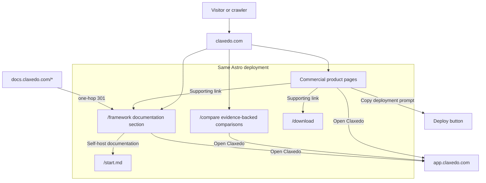

# Goal — Implement the Claxedo public website

## Goal Capsule

- **Objective:** Ship one production public site on `claxedo.com` that presents Claxedo as the open cloud workspace for coding agents, converts visitors through exactly two marketing actions—**Open Claxedo** and **Deploy to Cloudflare**—and consolidates product marketing, open architecture, comparisons, framework documentation, and machine-readable discovery under one canonical origin.
- **Primary implementation target:** `packages/claxedo-web`, the existing Astro application. Framework content migrates from `packages/claxedo-docs`; product and technical evidence comes from the relevant Claxedo and WorkGraph packages rather than being redefined by the website.
- **Product authority:** This document owns public information architecture, technical delivery, migration, positioning and competitor research, homepage content governance, claim governance, and release acceptance. Shipped code and active product contracts remain the authority for capability claims.
- **Execution profile:** Implement Units 1–8 in dependency order, keeping every page server-rendered or statically rendered, every public claim evidence-gated, every marketing conversion on one of the two canonical CTA paths, and the existing documentation deployment available until cutover acceptance passes.
- **Stop conditions:** Stop a publication or cutover when a claim lacks reproducible evidence, a release artifact is missing, a legacy route lacks a verified destination, hosted and self-hosted source parity cannot be substantiated, or active hosting ownership is unknown. Omit or narrow the affected claim while implementation continues elsewhere.
- **Tail ownership:** The goal is complete only after repository gates, browser acceptance, accessibility and visual review, production redirect/canonical/crawler smoke tests, and post-cutover documentation checks all pass against the deployed release.

## Implementation Baseline

| Concern | Current authority | Target state |
|---|---|---|
| Public web application | `packages/claxedo-web` with Astro 5 | One production build owns product, download, pricing, comparisons, `/framework`, sitemap, and agent-discovery routes. |
| Framework documentation | `packages/claxedo-docs` with the current Mintlify IA | Content migrates beneath `/framework` in the Astro application; the old deployment remains only for verified one-hop redirects. |
| Homepage content | This plan's Content Strategy section | Its settled section sequence, evidence-reviewed working copy, proof direction, and publication checks are implemented without introducing another marketing CTA. |
| Product evidence | `packages/claxedo-app`, `packages/claxedo-desktop`, `packages/claxedo-server`, `packages/workgraph`, public packages, release artifacts, and deployment records | Every material claim points to a current reproducible artifact and carries verification status. |
| Framework examples | `claxedo-cookbook` and public package documentation | Runnable examples and API claims are rendered from maintained sources or checked against them. |
| Canonical public origin | Split between `claxedo.com` and `docs.claxedo.com` | All indexable public content resolves canonically on `claxedo.com`; `app.claxedo.com` remains the authenticated application. |

This goal changes the public website, its content pipeline, and its deployment contracts. Product runtime behavior, model execution, billing enforcement, authentication, and sandbox provisioning remain owned by their existing packages and plans.

## Overview

Claxedo's public website becomes one coherent acquisition and knowledge surface on `claxedo.com`. The root site positions Claxedo as the open cloud workspace for coding agents: one product for running and supervising the harnesses developers already use across desktop, browser, local machines, and remote workspaces. Visitors can open the hosted product or deploy its open control plane to Cloudflare.

The open-source framework remains a first-class trust and developer-adoption surface at `claxedo.com/framework`, implemented as a documentation-first section in the same Astro deployment. `/framework` is heavily inspired by Flue and follows its docs-plus-marketing information architecture and content progression closely, translated into Claxedo's workspace and harness-integration category through original content and product evidence. The framework proves that the product's workspace layer, backend, relay, and packages are open and deployable according to the capabilities that have passed the truth gates in this plan.

The commercial homepage has exactly two conversion actions: **Open Claxedo** as the primary CTA and **Deploy to Cloudflare** as the secondary CTA. Open Claxedo leads to `app.claxedo.com`. Deploy to Cloudflare is a button that directly copies one complete agent deployment brief. Download and framework remain prominent supporting navigation, while the architecture link is a tertiary in-page control.

The resulting brand hierarchy gives every surface one clear role:

- **Claxedo** is the product and subscription.
- **Claxedo Web** and **Claxedo Desktop** are clients for that product.
- **Claxedo Framework** is the open-source foundation behind the product.
- **Claxedo Cloud** is the hosted form of Claxedo. It is part of the same product and uses the same MIT-licensed platform packages exposed by the framework.

## Problem Frame

The live and repository versions of the marketing site currently present several different categories:

- The live site describes a parallel AI coding workspace and repeatedly foregrounds its OpenCode relationship.
- The checked-in homepage leads with deploying an entire agent stack and self-hosting.
- `/app` presents the app as a separate product surface.
- `/framework` presents the packages as another top-level offer.
- `docs.claxedo.com` is a separately branded Mintlify site focused on framework and deployment documentation.

This makes visitors choose Claxedo's category before they understand its value and gives download, deployment, and hosted use equal visual weight. The target product model gives visitors one default product action—download Claxedo—while using the open-source framework as the secondary trust and developer-adoption funnel. The product remains free during the current launch posture, and the downloaded desktop client supports both unsigned local use and the connected Claxedo experience.

The public URL split also weakens the desired search architecture. Framework documentation, package references, cookbook recipes, integration pages, and product marketing should reinforce one `claxedo.com` entity. The authenticated application remains at `app.claxedo.com` because it is an operational surface rather than indexable public content.

## Product and Brand Model

### Canonical product hierarchy

| Name | Meaning | Primary public destination |
|---|---|---|
| Claxedo | The subscription product | `claxedo.com` |
| Claxedo Web | Browser client for Claxedo | `app.claxedo.com` |
| Claxedo Desktop | Native client, including unsigned local mode | `claxedo.com/download` |
| Claxedo Framework | Open-source agent infrastructure behind Claxedo | `claxedo.com/framework` |
| Claxedo Cloud | The hosted Claxedo product | `app.claxedo.com` |

The commercial site sells the outcome delivered by Claxedo. The hero leads with that outcome, while pricing and account terms explain the subscription model and the framework section owns infrastructure diagrams and module details.

### Category and positioning

**Category:** open cloud workspace for coding agents.

**Audience:** developers and teams already using more than one coding-agent harness and needing a consistent place to run, supervise, resume, configure, and review their work.

**Positioning statement:**

> For developers using Claude Code, Codex, Gemini CLI, OpenCode, and other coding agents, Claxedo is the open cloud workspace that keeps sessions, terminals, processes, approvals, skills, and review together across desktop, browser, local machines, and remote workspaces. Use Claxedo Cloud or deploy the open control plane to Cloudflare; each harness and provider remains itself.

**Working homepage message:**

> The open cloud workspace for coding agents.

> Run coding agents across chat, terminal, desktop, browser, and mobile. Start with Claxedo Cloud—or deploy the open control plane to your Cloudflare account with a prompt.

Visual implementation may refine line breaks and responsive composition, but the headline, supporting promise, and message hierarchy remain:

1. **Outcome:** run and supervise the coding agents a developer already uses.
2. **Deployment choice:** use the hosted product or deploy the open control plane to Cloudflare with a complete agent brief.
3. **Continuity:** sessions and workspace context remain reachable across desktop, browser, local, and remote environments according to shipped capability.
4. **Neutrality:** Claxedo sits above the harness layer and supports multiple vendors rather than replacing them with a proprietary agent.
5. **Ownership proof:** one architecture explorer shows the MIT-licensed platform boundary, deployment choices, and workspace execution boundary.

### Defensible differentiation

The competitive research identifies a compound position whose individual pieces are common but whose complete combination remains unusual:

- **Cross-vendor workspace:** familiar harnesses run as themselves inside one product surface.
- **Connected reach:** desktop and browser provide access to local and remote workspaces through the same product model.
- **Setup continuity:** skills, MCP configuration, credentials, and workspace setup can follow the user across machines and cloud workspaces when the corresponding synchronization capability is shipped and security-reviewed.
- **Placement choice:** Local, Cloud, and Split describe where the model loop and tools execute. These terms appear only where the product supports and can demonstrate them.
- **Open ownership:** MIT-licensed product layers and self-deployment provide a concrete ownership story, with every “MIT at every layer” claim verified against the published repositories and packages.

The homepage leads with the first two user outcomes. Setup continuity, placement, self-hosting, licensing, and architecture appear as evidence in product proof, framework documentation, and comparison pages.

### Brand principles and language

- Use **agent workspace**, **connected workspace**, **agent harness**, and **agent backend** as precise category language.
- Use **agent stack** inside framework and deployment explanations for the complete self-deployable composition. The commercial homepage uses **agent workspace** because it describes the product experience users are choosing.
- Use **Claxedo** as the product name. **Web** and **Desktop** identify clients; **Framework** identifies the open foundation; **Cloud** describes the hosted composition only when a deployment distinction is necessary.
- Say **built on the OpenCode engine** prominently and explain the architectural delta in factual terms: Claxedo adds the connected multi-workspace product, backend, relay, synchronization, and framework layers represented by the current code.
- Qualify ownership claims precisely: “the entire stack is yours” and “MIT at every layer” appear only after the app, backend, relay, packages, and relevant source history are publicly verifiable.
- Describe self-hosting through the actual artifact: **one command** when a public CLI supports it, and **one click** only when a working clickable deployment flow exists.
- Qualify synchronization as setup continuity across **machines and cloud workspaces**. A single-machine config fan-out is useful product behavior but not a differentiated market claim.
- Explain placement through the architecture explorer: the control plane runs on Claxedo Cloud or the user's Cloudflare account, while agent work runs on a connected machine, server, or sandbox.
- Keep **any agent**, parallel worktrees, remote control, and terminal fidelity as proof rows. Competitors already claim these concepts broadly, so they do not carry the headline alone.
- Reserve **AI infrastructure**, **agent control plane**, **command center**, generic **no lock-in**, and unqualified **self-hosted** language for contexts where a precise technical explanation accompanies them.

### Brand personality, voice, and visual expression

Claxedo should feel like a serious workspace a developer can trust with active agent sessions: **capable, composed, open, precise, and quietly ambitious**. The brand avoids both enterprise-control-plane stiffness and consumer-AI spectacle.

**Voice principles:**

- Lead with concrete verbs: run, supervise, resume, review, connect, and deploy.
- Name real harnesses, surfaces, and outcomes instead of relying on abstract “AI-powered” language.
- Give competitors and OpenCode accurate credit; confidence comes from checkable product evidence.
- Prefer short declarative copy and technical specificity over superlatives, fear, acquisition rhetoric, or vague freedom language.
- Explain local, connected, and self-hosted operation as a progression of capability rather than an ideological test.

**Visual principles:**

- Make the real workspace the primary visual asset: sessions, terminal state, approvals, diffs, processes, and cross-surface continuity.
- Use an editorial, documentation-adjacent layout with strong type hierarchy, measured whitespace, fine rules, and restrained status color.
- Let the commercial site breathe while the framework section becomes denser and reference-oriented; typography, color, spacing, and component details keep them recognizably one brand.
- Use diagrams when they clarify Local, Cloud, Split, synchronization, or product/framework relationships. Diagrams show actual boundaries and data movement rather than decorative node clouds.
- Use motion to demonstrate continuity—such as a session moving from desktop to browser—while preserving reduced-motion behavior and a clear static fallback.
- Favor product evidence and original technical illustrations over stock imagery, generic glowing orbs, purple-blue gradients, oversized glass cards, and repeated three-column feature grids.
- Screenshots use seeded demo data, neutral workspace names, readable scale, and clean states. Personal paths, credentials, debug output, warnings, and fabricated capabilities never appear.

**Brand test:** after viewing the hero and first proof sequence, a visitor should remember “my coding agents in one connected workspace,” not “another AI agent,” “another terminal,” or “another orchestration dashboard.”

### Marketing page inspirations

The landing page synthesizes three references inspected on July 20, 2026: [Matrix OS](https://matrix-os.com/), [Ona](https://ona.com/), and [Codex in ChatGPT](https://chatgpt.com/codex/). They are direction-setting references rather than templates. Claxedo retains its own category, copy, visual identity, component geometry, motion language, and product evidence.

#### Matrix OS: editorial product narrative

Matrix OS combines a warm off-white canvas, editorial display typography, a compact utility navigation, a centered hero, and a large product environment as the first proof. Its long page progresses through modular white product panels, dark thesis bands, connected-surface demonstrations, deployment choices, pricing, editorial content, FAQ, and a restrained final conversion.

Claxedo should take inspiration from:

- The immediate transition from a short category claim to a large, legible product environment.
- A logo/name strip showing the coding agents the product already works with.
- The warm editorial tone and the rhythm between light product panels and occasional dark emphasis sections.
- Product sections that explain a system through surfaces and workflows rather than isolated feature cards.
- Clear visual treatment of desktop, browser, terminal, and mobile as views into one underlying workspace.
- Honest capability status and deployment choices presented inside the narrative rather than hidden in footnotes.

Claxedo keeps its open-cloud-workspace category and develops an original workspace metaphor, palette, deployment story, and two-conversion composition. Matrix OS's “cloud computer,” nature-wallpaper desktop, hosted-first argument, cream-and-green palette, and setup-prompt conversion remain specific to its brand.

#### Ona: proof hierarchy and operational credibility

Ona uses a high-contrast editorial hero, one dominant product film, a customer-logo strip, a compact four-part capability model, alternating media-and-copy workflow slabs, use-case proof, customer evidence, compliance signals, editorial resources, and a direct closing conversion. The page feels substantial because every major claim is followed by product, customer, or operational evidence.

Claxedo should take inspiration from:

- One high-quality hero film or interaction instead of a collage of disconnected screenshots.
- A compact capability framework that makes the product understandable before deeper workflow sections.
- Alternating text and product media so each section has a distinct reading rhythm.
- Use cases written as work a developer delegates or reviews, not generic feature labels.
- Proof appearing close to the claim it validates: shipped product state, customer evidence, security posture, or a maintained technical source.
- Comparison and educational content forming part of the public acquisition surface rather than living only in documentation.

Claxedo's initial site uses only earned proof. Customer logos, quantified outcomes, compliance badges, acquisition narratives, and enterprise-security claims appear after corresponding evidence exists. Claxedo retains its developer-first voice and two-conversion system while adopting Ona's discipline of placing proof next to claims.

#### Codex in ChatGPT: product-image art direction

The Codex page uses concise centered messaging, generous whitespace, large interface crops, and one product idea per section. Product screens sit inside soft atmospheric color fields, allowing the interface to remain the focus while giving each section a memorable visual stage. Its narrative moves from engineering outcomes to parallel work, skills, background work, review quality, plans, and continuity across app, editor, and terminal.

Claxedo should take inspiration from:

- Oversized, sharply cropped product moments that make one workflow legible at a glance.
- A single idea and a single supporting visual per section.
- Soft color fields used as a stage behind real UI, with enough restraint that they support rather than substitute for product proof.
- Showing continuity across client surfaces as a visual sequence rather than explaining it only in prose.
- Simple layouts that let typography, spacing, and authentic interface detail carry the page.
- Review, changed files, agent status, and scheduled work as concrete visual subjects.

Claxedo uses its own accent palette and visual texture. Atmospheric color frames authentic product evidence with restrained, brand-specific hues. Familiar harness names and the workspace around them remain visible throughout the sequence.

#### Claxedo synthesis

The preferred combination is:

- **Matrix OS for page rhythm:** warm editorial foundation, strong product environment, connected-surface storytelling, and occasional thesis bands.
- **Ona for information hierarchy:** product film, capability framework, workflow proof, earned trust, comparisons, and resource depth.
- **Codex for product presentation:** generous whitespace, large purposeful interface crops, simple section composition, and refined color staging.

The resulting landing-page sequence is:

1. Compact navigation with Open Claxedo primary and Deploy to Cloudflare secondary.
2. Cloud-category hero, exactly the two approved conversion actions, and a tertiary architecture anchor.
3. One large real-product stage showing a seeded task moving through agent execution and review.
4. One architecture explorer with Platform, Deployment, and Inside a workspace views.
5. Connected continuity across desktop, browser, and mobile web.
6. Harness neutrality, followed by chat UI and terminal as first-class interaction modes.
7. WorkGraph and Agent Extensions as focused, contextual product chapters.
8. The open-interface thesis and a quiet closing band repeating Open Claxedo and the deployment copy button.

This page feels edited and intentional. Each section answers a distinct buying question; product proof replaces decorative dashboards, maintained evidence replaces duplicated claims, earned trust replaces placeholder social proof, and the two approved CTAs close the composition.

### Commercial CTA hierarchy

1. **Open Claxedo** — primary CTA in the hero, header, pricing, and closing conversion band. It links to `app.claxedo.com`.
2. **Deploy to Cloudflare** — secondary CTA. It is a button that copies the complete deployment prompt without opening another section or showing the prompt inline.

These are the only marketing conversions. Download, framework, documentation, GitHub, comparison, and architecture links remain ordinary supporting navigation. The hero's **Explore the open architecture** link scrolls to `#architecture` and is visually tertiary.

The deployment prompt's concrete outcome is a verified Claxedo control plane in the user's Cloudflare account, connected to a workspace runtime and relay. It instructs the agent to inspect current repository scripts, verify Cloudflare feature availability, stop before unsupported or billable actions, and produce verification and rollback steps.

The prompt and its surrounding guide instruct users and agents to use authenticated CLIs or the target platform's secret store for credentials. Secrets must never be pasted into chat, committed to source, embedded in generated configuration, or written to logs.

### Local mode relationship

Unsigned local mode is a trust-building entry path inside Claxedo Desktop:

> Start entirely local. Sign in when you want the connected Claxedo experience across browser, desktop, remote workspaces, and devices.

The site states explicitly that unsigned local desktop operation works without a subscription or account. Local mode is a supporting capability and trust-building path; Open Claxedo remains the dominant commercial conversion.

## Competitive Positioning

The competitive landscape is a July 20, 2026 research snapshot captured in this plan's Competitive Positioning section. It informs category boundaries, comparison priorities, vocabulary, and proof requirements. Pricing, licenses, traction, product availability, acquisitions, and feature claims require first-party re-verification immediately before publication.

### Closest strategic competitors

These products are the highest-value comparisons because they overlap multiple parts of Claxedo's connected-workspace, open-backend, cross-harness, or self-deployment position:

| Competitor | Why a buyer may compare it with Claxedo | Claxedo positioning boundary |
|---|---|---|
| **Matrix OS** | Open, VPS-oriented agent workspace with laptop, phone, browser, and terminal access | Demonstrate the complete product experience, setup continuity, deployment path, and MIT coverage with shipped evidence |
| **Omnigent** | Open deployable server, relay, orchestration, and support for several existing harnesses | Emphasize the polished desktop/browser workspace and verified cross-machine setup continuity |
| **Paseo** | Open, multi-provider access to agents from phone, desktop, and terminal | Explain the deployable backend, workspace placement, synchronization model, and MIT licensing boundary precisely |
| **codeg** | Open, one-command deployment, broad harness support, and hybrid session aggregation | Demonstrate product polish, connected workspace continuity, review flow, and framework depth |
| **AgentsMesh** | Self-hosted backend with runners distributed across a user's fleet | Show the end-user workspace, client experience, setup model, and local-to-connected progression |
| **OpenHands** | Large open, model-agnostic, self-deployable agent platform | Establish that Claxedo is the workspace around existing harnesses, while OpenHands primarily supplies its own agent/runtime experience |
| **Coder** | Self-hosted development infrastructure supporting agent workloads and enterprise environments | Keep Claxedo developer-product-led and cross-harness; reserve governance and CDE language for technical comparisons |
| **Warp** | Terminal-to-cloud continuity, multiple agent integrations, and self-hosted enterprise execution options | Distinguish the open backend and product ownership model using verified licensing and deployment facts |
| **Kilo** | Open multi-agent portal, self-host language, and strong fork-lineage transparency | Match the transparency standard and prove the connected workspace/backend delta |
| **Super / Superconductor** | Local Mac workspace and cloud multiplayer surfaces from one company | Explain Claxedo's single product across local and connected operation, plus its open backend and setup continuity |

### Credible alternative set

The website and comparison program track competitors in six rings. Inclusion means a serious buyer could reasonably compare the product, category, or framework; it does not imply feature parity.

| Ring | Competitors to track | Comparison frame |
|---|---|---|
| **Model-lab and closed product surfaces** | **Claude Code**, **OpenAI Codex**, **Google Jules**, **Google Antigravity**, **xAI Grok Build**, **AWS Kiro**, **Z.ai Z Code**, **Cursor**, **Zed**, **Devin / Devin Desktop**, **Factory**, **Amp**, **Zencoder** | Vendor-specific agent or closed platform versus a cross-vendor workspace with an open foundation |
| **Local orchestration and agent workspaces** | **Conductor**, **Orca**, **Superset**, **T3 Code**, **Emdash**, **Supacode**, **Jean**, **cmux**, **Composio Agent Orchestrator**, **Sculptor**, **Claude Squad**, **Nimbalyst**, **OpenAI Symphony**, **GCP Scion**, **gastown**, **Herdr** | Parallel local execution versus connected reach, durable workspace continuity, setup synchronization, and placement through one product |
| **Cloud workspaces and remote agent products** | **Terminal Use**, **boxes.dev**, **Runtime**, **Twill**, **InsForge**, **flexenv**, **Coasts**, **Ara**, **Vorflux**, **Agent 37 Cloud**, **Superconductor**, **Cursor Cloud Agents** | Provider-managed cloud execution versus local-to-connected choice and a verifiable ownership path |
| **Open runtimes, relays, and infrastructure** | **opencode**, **Cline**, **OpenHands**, **Goose**, **Hermes Agent**, **Happy**, **Omnara**, **MidTerm**, **agent-vm**, **clay**, **Netclode**, **Matrix OS**, **codeg**, **AgentsMesh**, **Paseo**, **Omnigent**, **Coder** | An individual agent, relay, or infrastructure primitive versus the complete workspace layer around existing harnesses |
| **Workspace infrastructure and sandboxes** | **E2B**, **Northflank**, **Coder**, **agent-vm**, **Coasts**, **AgentsMesh**, **Omnigent**, **Happy**, **Omnara**, **MidTerm** | Infrastructure or session-access building blocks versus an integrated developer workspace and product experience |
| **Agent-authoring frameworks** | **Flue**, **Eve**, **VibeKit** | Frameworks for authoring new agents versus Claxedo Framework's workspace, harness-integration, runtime, and connected-product layer |

Products that are dead, absorbed, renamed away, or no longer independently available—such as Roo Code, Continue, Windsurf, Terragon, vibe-kanban, Daytona, and Morph in the research snapshot—serve only as dated market context. They are excluded from active comparison navigation unless their history directly supports a sourced consolidation argument.

### Comparison-page priorities

The initial maintained comparison set is deliberately smaller than the tracked landscape:

1. **Matrix OS** — nearest open whole-product thesis.
2. **Omnigent** — nearest open architectural composition.
3. **Paseo** — closest access and self-host language overlap.
4. **OpenHands** — strongest category-level open alternative.
5. **T3 Code** — strong “control plane” language and local-workspace mindshare.
6. **Hermes Agent** — necessary “agent versus workspace” category clarification.

The next comparison set is **Conductor**, **Orca**, **Coder**, **Warp**, **Claude Code**, **OpenAI Codex**, **Cursor**, **codeg**, **AgentsMesh**, and **Super / Superconductor**, selected from search demand and sales objections after the launch set is maintained reliably.

Every comparison page includes a named owner, first-party source links, a visible last-reviewed date, a factual scope statement, and a review interval. Claims about licenses, hosting, prices, acquisitions, security, source availability, and current features expire from publication when the review interval lapses.

### Competitive response framework

- **Against model labs:** Claxedo is cross-vendor by structure. Claude Code remains Claude Code, Codex remains Codex, and the workspace around them is the product.
- **Against local orchestrators:** Claxedo adds connected reach, durable workspace continuity, setup synchronization, and remote placement to the local supervision experience.
- **Against cloud workspaces:** Claxedo preserves local operation and provides an open ownership path alongside the connected product.
- **Against individual open agents:** Claxedo sits one layer above the agent and can host several harnesses rather than requiring a new agent runtime.
- **Against authoring frameworks:** Claxedo Framework builds the workspace and integration layer for existing harnesses; Flue, Eve, and VibeKit primarily help developers author agents.
- **Against terminal-only tools:** Claxedo explains what its backend enables—browser reach, continuity, synchronization, placement, and team-ready operation—while respecting the simplicity of single-machine workflows.

### Commodity claims and proof hierarchy

Parallel agents, worktrees, “any agent,” remote control, and terminal fidelity are expected product proof. They support the story but do not define the category. The differentiated proof sequence is:

1. Multiple familiar harnesses running as themselves.
2. One supervision and review surface across desktop and browser.
3. Setup following the user across machines and cloud workspaces.
4. Local, Cloud, and Split placement through the same product model.
5. Open, inspectable, self-deployable product layers with verified MIT coverage.

Each step appears only when the corresponding product behavior can be demonstrated from a clean public build or documented deployment.

## Requirements Trace

### Product and conversion

- **R1. Single commercial product:** The root site presents Claxedo Cloud, desktop, browser, framework, and self-deployment as forms and layers of one product.
- **R2. Primary conversion:** Every commercial conversion surface has one dominant **Open Claxedo** action that reaches `app.claxedo.com`.
- **R3. Deployment conversion:** **Deploy to Cloudflare** is the only secondary marketing conversion and directly copies the complete agent prompt.
- **R4. Local availability:** `/download` clearly documents that Claxedo Desktop supports unsigned local mode without an account.
- **R5. Deployment utility:** Every prominent Deploy to Cloudflare control copies the same complete prompt. Prerequisites, boundaries, safety rules, verification, and rollback live inside that prompt rather than separate homepage content.

### Public architecture and discovery

- **R6. One public origin:** Indexable marketing, framework, documentation, comparison, and integration content uses `claxedo.com` URLs.
- **R7. Same deployment:** `/framework` is implemented in the existing `packages/claxedo-web` Astro deployment, with an isolated documentation layout and content tree.
- **R8. Documentation migration:** Every current `docs.claxedo.com` URL has a one-hop permanent redirect to a corresponding `claxedo.com/framework/...` URL.
- **R9. Search discovery:** Public pages are server-rendered, canonically linked, included in sitemaps, and reachable through crawlable HTML links.
- **R10. AI discovery:** `OAI-SearchBot` and ordinary search crawlers can access public content; `start.md` provides a concise agent-oriented entry map without duplicating the entire site.
- **R11. Entity clarity:** Structured data consistently describes Claxedo, its software clients, its free-beta offer, and its relationship to the open-source framework.

### Quality and operations

- **R12. Truthfulness:** Product claims, screenshots, code examples, pricing, and platform support reflect shipped behavior and current launch posture.
- **R13. Measurement:** The site can distinguish Open Claxedo and Deploy to Cloudflare conversions by placement without collecting prompt content, credentials, repository paths, or other sensitive data.
- **R14. Visual coherence:** Commercial and framework sections share a recognizable Claxedo system while giving framework documentation its own guide/reference navigation, search, left sidebar, and page outline.
- **R15. Preserved public contracts:** Privacy, terms, downloads, GitHub releases, npm package links, and existing framework documentation remain reachable during and after migration.

### Positioning, competition, and trust

- **R16. Category clarity:** The site consistently positions Claxedo as the open cloud workspace above the individual harness layer.
- **R17. Compound differentiation:** Hosted availability, prompt-driven Cloudflare deployment, cross-vendor operation, connected reach, setup continuity, and open ownership appear in a proof hierarchy tied to demonstrable product behavior.
- **R18. Competitive coverage:** The site maintains a structured competitor registry and publishes the six priority comparisons before expanding to the broader tracked set.
- **R19. Comparison governance:** Every public comparison has first-party sources, an owner, a visible last-reviewed date, a review interval, and an expiry behavior for stale claims.
- **R20. Lineage and license transparency:** Public content credits the OpenCode engine and substantiates MIT, source-history, package-publication, synchronization, deployment, and placement claims before publishing them.
- **R21. Original inspiration synthesis:** The commercial landing page combines Matrix OS's editorial rhythm, Ona's proof hierarchy, and Codex's product-image clarity through original Claxedo typography, color, motion, composition, copy, and evidence.
- **R22. Flue-led framework model:** `/framework` closely follows Flue's developer information architecture, page density, navigation model, and content progression, with every content role translated into an original, repository-backed Claxedo workspace-layer equivalent.
- **R23. Homepage implementation contract:** The homepage implements the settled proof sequence: open cloud workspace hero; unified Platform/Deployment/Workspace architecture explorer; desktop/browser/mobile continuity; harness neutrality with recognizable marks; chat UI and terminal as two first-class modes; WorkGraph; Agent Extensions; principles; and the closing two-action conversion. Deploy controls directly copy the complete Cloudflare agent prompt. Each product-led section uses a current deterministic capture or repository-backed evidence, mobile product images open at full resolution, and no third marketing conversion is introduced.

## Scope Boundaries

- Billing enforcement, entitlement rules, authentication, subscription prices, and the free launch posture continue to follow the cloud subscription launch plan.
- Connected product onboarding continues to follow `docs/plans/2026-07-17-002-feat-onboarding-v1-implementation-plan.md` after a user launches the desktop client or signs into the web application.
- Framework APIs, npm package names, runtime behavior, and OpenCode engine lineage remain governed by their existing package contracts.
- The Claxedo name remains the product identity.
- Hosted capabilities are represented within the core product pages, pricing, and technical documentation under the canonical routes in this plan.
- Customer-specific pages, authenticated workspaces, and account state remain on `app.claxedo.com`; the public SEO surface is the content graph on `claxedo.com`.
- Search content earns discovery through human usefulness, technical truthfulness, maintained evidence, and canonical organization.
- The competitor handoff supplies a dated research baseline. Publication uses freshly verified first-party facts and treats community quotations as research context rather than marketing copy.
- Competitive content explains category and product differences through sourced capabilities. Editorial attacks, unsourced superlatives, and claims of being first, only, or universally unique remain outside the content model.
- Product capabilities retain their current implementation ownership. This website plan adds claim gates and evidence requirements rather than defining synchronization, deployment, placement, or licensing behavior that has not shipped.

## Information Architecture

### Public routes

```text
claxedo.com/
├── pricing
├── download
├── framework
│   ├── guides
│   ├── concepts
│   ├── deploy
│   ├── packages
│   ├── api
│   ├── cookbook
│   └── integrations
├── compare
│   ├── matrix-os
│   ├── omnigent
│   ├── paseo
│   ├── openhands
│   ├── t3-code
│   └── hermes-agent
├── privacy
├── terms
├── start.md
├── llms.txt
├── robots.txt
└── sitemap-index.xml

app.claxedo.com/
└── authenticated web application
```

The existing Mintlify slugs are retained beneath `/framework` where practical. For example:

| Current URL | Canonical replacement |
|---|---|
| `docs.claxedo.com/` | `claxedo.com/framework` |
| `docs.claxedo.com/guides/install` | `claxedo.com/framework/guides/install` |
| `docs.claxedo.com/concepts/layer-stack` | `claxedo.com/framework/concepts/layer-stack` |
| `docs.claxedo.com/deploy/self-host-fly` | `claxedo.com/framework/deploy/self-host-fly` |
| `docs.claxedo.com/packages/workspace-runtime` | `claxedo.com/framework/packages/workspace-runtime` |
| `docs.claxedo.com/api/workspace-runtime` | `claxedo.com/framework/api/workspace-runtime` |
| `docs.claxedo.com/cookbook/01-hello-agent` | `claxedo.com/framework/cookbook/01-hello-agent` |

Keeping the suffix stable makes redirects, inbound link preservation, source-code link updates, and migration verification deterministic. Visible navigation may label the sections “Guide,” “Reference,” “CLI,” “SDK,” “Packages,” and “Ecosystem” without changing every established content slug.

### Navigation contracts

Commercial navigation:

- Product
- Architecture
- WorkGraph
- Pricing
- Open-source framework
- Download app
- Deploy to Cloudflare
- Open Claxedo

Framework navigation:

- Guide
- Reference
- CLI
- SDK / Packages
- Ecosystem
- Search
- GitHub
- Open Claxedo

The framework header returns to **Open Claxedo** as its commercial action. Framework setup controls and package links retain documentation styling.

## Content Strategy

### Commercial homepage

This implementation goal governs page scope, CTA hierarchy, positioning, claim gates, and delivery; the section-by-section homepage wording, product-proof direction, and publication checklist below govern homepage wording within those boundaries.

The homepage is a product-led conversion narrative:

1. **Hero:** The open cloud workspace category, Open Claxedo, Deploy to Cloudflare, a tertiary architecture link, BYO-provider terms, and a real session-and-review capture.
2. **Architecture explorer:** One tabbed section explains the MIT-licensed product boundary, hosted versus user-deployed control plane, and execution inside a connected workspace.
3. **Continuity:** Desktop, browser, and mobile web reopen the same work while files, tools, and execution remain on the user's infrastructure.
4. **Harness neutrality:** Claude Code, Codex, Gemini CLI, OpenCode, and any agent CLI are shown with recognizable visual marks and accurate mode support.
5. **Chat UI and terminal:** A contextual feature block shows a normal Codex chat Session and a functioning Codex terminal side by side.
6. **WorkGraph:** A close capture of one populated Stream card proves durable work, its Tasks, and their states without repeating the complete board.
7. **Agent Extensions:** Skills, instructions, MCP servers, plugins, hooks, and supporting files materialize into a workspace or sandbox for compatible harnesses.
8. **Principles and final conversion:** The open-interface thesis is followed by Open Claxedo and the Deploy to Cloudflare copy button.

Product captures are generated by `packages/claxedo-app/e2e/playwright/marketing-screenshots.spec.ts` into three canonical assets:

- `marketing-workspace.png` — neutral `Northstar` project, completed release-verification conversation, and seeded changed-file evidence.
- `marketing-session-terminal.png` — the real split workbench with a structured Codex chat Session, its Environment context collapsed, and a Codex terminal beside it.
- `marketing-workgraph.png` — one populated `Ship Claxedo Cloud` Stream card with enough Tasks and state variation to explain the primitive at a glance.

The capture spec owns the fixture data and screenshot dimensions so public images can be regenerated after product UI changes. Captures render at 3× device density and are presented as focused product moments inside contextual feature blocks. Personal workspaces and old manually captured screenshots are not valid homepage inputs.

The homepage architecture explorer provides a concise system view. The framework journey owns package-level API detail and the maintained deployment procedure.

### Pricing page

`/pricing` describes the current active offer:

- Claxedo is free during beta.
- Users are informed before billing begins.
- BYO model credentials and BYO compute obligations are explicit.
- The reserved future paid design remains internal until activation criteria are met.
- Refund and trial language appears only when a paid checkout is actually enabled.

### Download page

`/download` provides platform-specific artifacts and explains the client relationship:

- macOS Apple Silicon and Intel
- Windows
- Linux `.deb` and `.rpm`
- Unsigned local operation requires no Claxedo account.
- Signing in connects the desktop client to the Claxedo product.
- Release version, checksums/signing status when available, and GitHub release provenance are visible.

### Framework landing and documentation

`/framework` is heavily inspired by [Flue](https://flueframework.com/) in information architecture, page density, navigation, and content progression. Its content should follow Flue's successful docs-plus-marketing model closely, translated from agent authoring into Claxedo's workspace and harness-integration layer. Claxedo retains original wording, runnable examples, diagrams, visual identity, and technical claims.

The framework navigation follows the same compact developer-oriented model:

- Guide
- Reference
- CLI
- SDK / Packages
- Ecosystem
- Docs search
- GitHub
- Open Claxedo as the shared commercial action

The framework landing page follows this Flue-derived content sequence:

1. **Release banner:** current framework maturity or release status linked to a maintained announcement or changelog.
2. **Category hero:** “The open-source foundation behind Claxedo,” followed by one precise sentence explaining the workspace and integration layer around existing coding-agent harnesses.
3. **Guided-start utility:** an inline framework setup prompt and optional short walkthrough video, treated as documentation utilities rather than marketing conversions.
4. **Runnable example:** a prominent, syntax-highlighted example drawn from `claxedo-cookbook`, paired with a real command and observable result. The example proves how an existing harness enters a Claxedo workspace rather than demonstrating a newly authored proprietary agent.
5. **Foundation and lineage:** Flue's “Powered by Pi” architecture chapter maps to a factual “Built on the OpenCode engine” chapter, followed by the Claxedo-owned workspace, backend, relay, runtime, protocol, and package layers.
6. **Continuity proof:** Flue's durability/recovery chapter maps to Claxedo's verified session continuity, reconnect, resume, placement, and safe-boundary behavior. Interactive failure or reconnect demonstrations appear only for shipped behavior.
7. **Bring your existing stack:** a visual ecosystem section for Claude Code, Codex, Gemini CLI, OpenCode, ACP clients, MCP servers, skills, sandboxes, providers, and supported deployment targets.
8. **Framework capabilities:** a linked capability grid for workspace runtime, normalized agent events, extensions, connections, relay, sandbox management, channels, MCP, workgraph, deployment, and observability where publicly supported.
9. **Architecture and placement:** an original Claxedo diagram explains Local, Cloud, and Split placement plus the boundary between product composition and reusable framework packages.
10. **Documentation handoff:** Guide, Reference, CLI, SDK/Packages, Cookbook, and Ecosystem entry points close the landing page, followed by Open Claxedo as the commercial return path.

The content mapping is explicit:

| Flue content role | Claxedo Framework equivalent |
|---|---|
| Open agent framework category | Open workspace and integration foundation behind Claxedo |
| Programmable TypeScript agent example | Existing-harness workspace/runtime example from the cookbook |
| Powered by Pi | Built on the OpenCode engine, with Claxedo-owned layers identified |
| Durable recovery | Verified session continuity, reconnect, resume, and placement behavior |
| Bring the stack you love | Bring the harnesses, skills, MCP servers, providers, and sandboxes already in use |
| Agent/workflow feature catalog | Runtime, protocol, events, extensions, relay, connections, packages, and deployment catalog |
| Guide / Reference / CLI / SDK / Ecosystem | The same top-level discovery model using Claxedo's canonical framework routes |

This mapping guides structure and emphasis rather than literal copy. Every Claxedo section uses repository-backed claims, original examples, original diagrams, and terminology appropriate to the workspace layer.

The ordered sequence and mapping in this plan are the implementation reference. A later change to Flue's live site does not silently change Claxedo's scope; adopting a new Flue pattern requires an explicit content review and plan update.

Documentation pages use:

- Persistent top navigation.
- Search.
- Left documentation sidebar.
- Main article column.
- Right “On this page” outline.
- Code blocks with copy controls and filenames.
- Last-updated metadata where reliable.
- View-as-Markdown or a targeted agent entry document without producing uncontrolled duplicate indexable pages.

The existing `packages/claxedo-docs/README.md` truthfulness gate remains an invariant after migration: examples compile against real exports, route/tool references match code, and framework claims distinguish package-supported behavior from product-owned composition.

### Comparison content program

`/compare` explains Claxedo's category and links to the maintained priority comparisons. The index groups alternatives by the decision a visitor is making—model-lab product, local orchestrator, cloud workspace, open runtime, or authoring framework—rather than presenting one undifferentiated feature matrix.

Each competitor page follows the same evidence-backed structure:

1. Who the alternative is designed for.
2. The layer it owns: agent, orchestrator, workspace, cloud environment, infrastructure, or authoring framework.
3. Areas of genuine overlap with Claxedo.
4. The architectural or product boundary that changes the buying decision.
5. Deployment, source availability, licensing, and pricing facts with first-party sources.
6. A “last reviewed” date, named content owner, and next review deadline.
7. Open Claxedo as the primary CTA and Deploy to Cloudflare as the secondary CTA.

The matrix and individual pages render from one competitor registry so names, review state, sources, category, and publication status cannot drift independently. A stale page becomes `noindex` and displays a review notice until its material claims are verified again.

### Search and AI-answer content program

The framework and commercial site should publish authoritative pages around real user intents rather than generic keyword collections. Initial clusters are:

- Running Claude Code, Codex, Gemini CLI, and other harnesses together.
- Local versus remote coding-agent workspaces.
- Self-hosting an AI coding workspace.
- TypeScript coding-agent runtime and normalized agent events.
- Skills and MCP configuration across multiple agents.
- Sandboxes and workspace placement.
- Secure relay and remote workspace access.
- Honest product comparisons backed by maintained evidence.

Each intent has one canonical page. Marketing summaries link to the detailed source instead of duplicating it. Comparison pages are indexable only after their claims have an owner, update cadence, source links, and a visible last-reviewed date.

## Content boundaries

- "Cloud" names the connected product and deployment model in the headline; product and cloud are not separate products.
- The site claims MIT licensing only for packages verified by the public license and package manifests.
- The site explains hosted and self-deployed compositions without claiming production environment parity that has not been demonstrated.
- Cloudflare is the control plane deployment target. Execution remains on a connected user-controlled machine, server, or sandbox.
- Deployment prerequisites and operational details live inside the copied prompt rather than a separate homepage section.
- Framework and download are supporting destinations, not competing hero conversions.
- The page does not use "More than another chat window," "Discover at the frontier," "Use an integrated harness," "Start here," or "workspace host."
- The site does not fabricate testimonials, customer logos, performance metrics, or identical structured-chat support for every CLI.

## Search, AI Discovery, and Machine-Readable Surfaces

### Crawl and index contracts

- All public content is emitted as usable HTML at build time.
- All navigation uses standard anchors with descriptive link text.
- Canonical URLs point to `https://claxedo.com/...`.
- `docs.claxedo.com` and deployment-preview URLs are not competing canonical sources.
- One sitemap index covers commercial, framework, comparison, and policy content with accurate modification dates.
- `robots.txt` allows Googlebot, Bingbot, and `OAI-SearchBot` to access public content while excluding authenticated application routes if they are ever proxied through the public origin.
- IndexNow notification is sent for new, changed, and removed public URLs after a successful production deployment.

### Agent entry surfaces

`/start.md` is a concise routing document for coding agents. It explains how to:

- Start with the hosted Claxedo product.
- Download and use local desktop mode.
- Self-host Claxedo.
- Build with individual framework packages.
- Find canonical guides and API references.

`/llms.txt` is an optional directory of canonical high-value public URLs. It is treated as a navigation convenience, not a ranking mechanism or replacement for crawlable HTML, internal links, sitemaps, or accurate content.

### Structured data

- Root: `WebSite` and `Organization` identify Claxedo consistently and link official GitHub/npm identities.
- Product pages: `SoftwareApplication` describes the web and desktop software, supported operating systems, category, and current zero-price beta offer.
- Documentation: article metadata describes visible content only; structured data never claims unsupported ratings, pricing, compatibility, or features.

## High-Level Technical Design

> *This illustrates the intended approach and provides directional guidance for review. Implementation details remain grounded in the repository's current Astro and deployment contracts.*



The commercial pages continue to use custom Astro layouts. Starlight is added to the existing Astro application and scoped under `/framework`, using its content collection, sidebar, page-outline, search, and override system. Framework-specific CSS and component overrides remain isolated so the documentation shell does not leak into product pages.

## Key Technical Decisions

1. **One Astro deployment:** Product and framework public pages ship from `packages/claxedo-web`. This concentrates public URLs and avoids reverse-proxy complexity while keeping future extraction possible through isolated content and layouts.
2. **Starlight at a subpath:** Starlight supplies the documentation information architecture, local search, code presentation, and responsive documentation shell. Its official integration supports adding docs to an existing Astro site at a subpath.
3. **Retain established documentation suffixes:** Existing Mintlify path suffixes move beneath `/framework`, minimizing redirect complexity and inbound-link loss.
4. **Retire Mintlify after parity:** Mintlify remains live from `packages/claxedo-docs` until content, search, redirects, and route verification pass. During migration, a deterministic prebuild sync copies its MDX into the Starlight content tree and fails on unsupported or divergent content. Canonical source ownership moves to `packages/claxedo-web` only at the verified cutover, when the temporary sync is removed.
5. **Unified product route:** Claxedo Cloud is the hosted product path, not a separate product line. Desktop, framework, and self-deployment reinforce the same Claxedo entity.
6. **Exactly two marketing conversions:** Open Claxedo is primary and Deploy to Cloudflare is secondary across commercial conversion surfaces.
7. **Download remains a durable supporting route:** Platform artifact selection lives at `/download`, making local mode, platform support, and release provenance explainable without competing with the hosted-product conversion.
8. **Provider-neutral analytics seam:** CTA events use one small site-owned event contract. The analytics vendor is replaceable and receives no repository, credential, prompt, or workspace data.
9. **Provider-neutral redirect manifest:** Legacy-to-canonical mappings live in the repository and are tested independent of whichever edge provider performs the redirect.
10. **Truth before breadth:** A smaller set of accurate, evidence-backed pages ships before broad comparison or integration catalogs.
11. **Open cloud workspace category:** Commercial copy positions Claxedo above the harness layer and puts cloud in the headline. The site names familiar agents for recognition while making deployment choice, workspace continuity, and supervision the product.
12. **Compound proof hierarchy:** Hosted availability and prompt-driven Cloudflare deployment lead; cross-vendor operation, connected reach, setup continuity, and open ownership deepen the claim through verified architecture and product evidence.
13. **Structured competitor registry:** Comparison pages, matrices, review dates, sources, ownership, and publication state derive from one typed content source with automated expiry checks.
14. **Prominent lineage:** Homepage trust content and framework documentation state that Claxedo is built on the OpenCode engine and link to verifiable provenance and license information.
15. **Commercial inspiration by principle:** Matrix OS contributes editorial rhythm, Ona contributes proof hierarchy, and Codex contributes product-image clarity. Claxedo supplies the commercial site's original brand system and product-specific composition.
16. **Flue-led framework model:** `/framework` deliberately follows Flue's information architecture and content progression closely because it is the strongest reference for a combined framework-marketing and documentation surface. Each Flue content role maps to Claxedo's workspace layer through original copy, examples, diagrams, components, and verified product evidence.

## Open Questions

### Resolved During Planning

- **Is Claxedo Cloud a separate product?** No. Claxedo Cloud is the hosted form of the Claxedo product.
- **What is the commercial primary CTA?** Open Claxedo.
- **What is the commercial secondary CTA?** Deploy to Cloudflare.
- **Where does desktop download belong?** In persistent supporting navigation and the dedicated `/download` page.
- **Where does the deployment prompt belong?** Inside the Deploy to Cloudflare button. The prompt itself contains the complete prerequisite and operational procedure.
- **Subdomain or subpath for the framework?** `/framework` on `claxedo.com`.
- **Same or separate deployment?** Same Astro deployment initially, with isolated framework content and layouts so future extraction does not require URL changes.
- **What happens to `docs.claxedo.com`?** Every path permanently redirects to its canonical `/framework` equivalent after parity verification.
- **What category does Claxedo claim?** Open cloud workspace for coding agents.
- **What is the homepage heading?** “The open cloud workspace for coding agents.”
- **What features carry the homepage proof?** One open architecture, hosted or Cloudflare deployment, structured chat and terminals, WorkGraph, cross-surface continuity, and Agent Extensions.
- **What is the differentiated story?** Use the hosted product now or give a coding agent one complete prompt to deploy the open control plane to Cloudflare; keep existing harnesses, providers, and execution infrastructure.
- **Which comparisons launch first?** Matrix OS, Omnigent, Paseo, OpenHands, T3 Code, and Hermes Agent.
- **How is OpenCode lineage handled?** Prominent engine credit, factual architectural-delta copy, and links to public provenance rather than defensive or ambiguous fork language.

### Deferred to Implementation

- **Final visual composition:** Resolve through a focused design pass while preserving the settled homepage headline, message hierarchy, section order, positioning, proof requirements, and CTA semantics.
- **Analytics provider:** Select after confirming the privacy, retention, and operational requirements; the event contract must remain provider-neutral.
- **Production redirect mechanism:** The repository does not currently declare the marketing site's hosting provider. Implementation must identify the active edge/origin and bind the tested redirect manifest to that provider before DNS changes.
- **Paid-launch copy:** Update `/pricing` only when billing activation decisions are current; do not surface reserved internal pricing as an active offer prematurely.
- **Comparison ownership and review interval:** Assign a human owner and an operationally sustainable review cadence before each page becomes indexable.
- **Capability evidence:** During implementation, bind every synchronization, placement, deployment, licensing, and “runs as itself” claim to a reproducible product or repository artifact; omit claims whose evidence is incomplete.

## Execution Contract

The unit checkbox is the implementation ledger. A unit becomes complete only when its named files are landed, its requirement set is satisfied, its focused tests pass from `packages/claxedo-web`, and its verification evidence is recorded in the pull request or release record. Later units may refine earlier files, but they may not weaken the two-conversion, architecture, canonical-route, claim-evidence, or migration-safety contracts.

| Order | Unit | Produces | Entry gate | Exit gate |
|---:|---|---|---|---|
| 1 | Content contracts | Typed product, route, claim, and competitor authorities | Existing site builds | Contract tests pass; publishable claims and competitors all have evidence metadata |
| 2 | Commercial journey | Cloud-first homepage, architecture explorer, deployment copy action, pricing, download, and app handoff | Unit 1 | The copy deck's settled structure is implemented, public wording passes evidence review, exactly two conversion classes remain, and all supporting routes resolve |
| 3 | Comparison system | Registry-driven comparison index and pages | Unit 1 | Six launch pages pass source, ownership, freshness, canonical, and CTA checks |
| 4 | Framework surface | Starlight section and deterministic Mintlify migration | Unit 1 | Full route/content parity; clean sync; Flue-derived content-role audit; no style or route collisions |
| 5 | Discovery | Sitemap, canonicals, structured data, `start.md`, `llms.txt`, and crawler policy | Units 2–4 | Every declared route resolves and discovery output contains only current canonical pages |
| 6 | Measurement | Provider-neutral conversion events | Units 1–4 | Only bounded `open_claxedo` and `deploy_cloudflare` conversion payloads are emitted; links survive script failure |
| 7 | Migration | Edge-bound redirect manifest and canonical source movement | Units 4–5 plus identified hosting owner | Complete one-hop production redirects pass before Mintlify retirement |
| 8 | Launch acceptance | Browser, accessibility, visual, content, and production evidence | Units 2–7 | All repository and deployed gates below pass against one release SHA |

### Repository gates

Run from `packages/claxedo-web` after the relevant scripts and dependencies are introduced by the units:

```bash
bun test test
bun run build
bunx playwright test
```

Run `git diff --check` from the repository root. Unit 4 additionally proves that a clean framework sync is deterministic. Unit 7 runs the redirect contract over the complete legacy URL inventory. Unit 8 runs the built public site at desktop and mobile viewport classes and retains reviewed screenshots or video for visual claims.

### Release evidence

The release record must identify one commit SHA and retain reproducible artifacts under `docs/plans/evidence/claxedo-public-website/<release-sha>/`:

- build and focused test output;
- the claim-registry snapshot used for publication;
- the competitor-registry snapshot with owners, first-party sources, and review dates;
- desktop and mobile captures of the homepage, download journey, comparison page, and framework landing;
- accessibility results and keyboard/reduced-motion checks;
- a complete legacy redirect report;
- production responses for representative canonicals, sitemap entries, `robots.txt`, `start.md`, and `llms.txt`;
- resolved desktop release URLs for each advertised platform;
- evidence that the hosted and self-hosted same-source statement matches the public source and deployed composition.

## Implementation Units

- [ ] **Unit 1: Establish the brand, claim, competitor, and route contracts**

**Goal:** Centralize product naming, positioning, CTA destinations, claim evidence, competitor metadata, navigation labels, public route ownership, and truthfulness rules before visual page work begins.

**Requirements:** R1, R2, R3, R4, R5, R12, R15, R16, R17, R18, R19, R20

**Dependencies:** None

**Files:**

- Create: `packages/claxedo-web/src/content/site.ts`
- Create: `packages/claxedo-web/src/content/routes.ts`
- Create: `packages/claxedo-web/src/content/claims.ts`
- Create: `packages/claxedo-web/src/content/competitors.ts`
- Create: `packages/claxedo-web/test/site-contract.test.ts`
- Create: `packages/claxedo-web/test/competitor-contract.test.ts`
- Modify: `packages/claxedo-web/package.json`
- Modify: `packages/claxedo-web/src/config.ts`
- Create: `packages/claxedo-web/README.md`

**Approach:**

- Define Claxedo, its web and desktop clients, the framework, the open-cloud-workspace category, and the approved language guide in one small content module used by navigation, metadata, conversions, and structured data.
- Define Open Claxedo and Deploy to Cloudflare once rather than repeating literal URLs across pages. Keep framework and download destinations centralized as supporting routes.
- Define a claim inventory that records the claim, public wording, evidence location, capability owner, verification status, and last verification date. Synchronization, placement, deployment, licensing, and lineage claims require verified evidence before rendering.
- Define a competitor registry containing canonical name, slug, comparison ring, priority, first-party sources, content owner, last-reviewed date, next-review date, publication status (`draft`, `current`, or `expired`), and the factual comparison boundary.
- Add package-scoped test coverage so the new content contracts run from `packages/claxedo-web` in accordance with repository test conventions.
- Keep release download construction in `config.ts`, but expose a canonical `/download` destination to marketing components.
- Record the truthfulness gate and content-update responsibilities in the package README.

**Patterns to follow:**

- Existing centralized external URL and download configuration in `packages/claxedo-web/src/config.ts`.
- Existing framework documentation truthfulness gate in `packages/claxedo-docs/README.md`.
- Positioning vocabulary, competitor taxonomy, claim cautions, and initial comparison evidence in this plan's Competitive Positioning section.
- Repository rule to avoid unnecessary destructuring and one-use variables.

**Test scenarios:**

- **Happy path:** The content contract exposes exactly one Open Claxedo destination, one Deploy to Cloudflare destination, centralized framework/download routes, and consistent public product names.
- **Happy path:** The competitor registry contains the six launch comparisons, unique slugs, valid first-party sources, and complete review metadata.
- **Edge case:** A competitor may remain tracked while unpublished; it appears in internal registry coverage but produces no indexable public page.
- **Edge case:** Development configuration may override the app origin without changing canonical public-site URLs.
- **Error path:** Unverified high-risk claims and competitors with expired or incomplete review metadata cannot enter the publishable content set.
- **Error path:** Missing or malformed required public URLs fail the contract test rather than producing empty anchors.
- **Integration:** Navigation, homepage metadata, footer, and structured-data builders consume the same canonical values.

**Verification:**

- Searching the package finds no competing definitions for the download or framework destinations.
- Product naming is consistent across commercial and framework surfaces.
- Published claims and comparisons have current evidence and ownership metadata.

- [ ] **Unit 2: Build the positioned commercial journey**

**Goal:** Implement the homepage copy deck and commercial route system as a cloud-first journey for Claxedo, with feature-level proof, an open architecture explorer, a direct deployment-prompt copy action, and supporting framework/download paths.

**Requirements:** R1, R2, R3, R4, R12, R14, R15, R16, R17, R20, R21, R23

**Dependencies:** Unit 1

**Files:**

- Modify: `packages/claxedo-web/src/pages/index.astro`
- Create: `packages/claxedo-web/src/components/ArchitectureExplorer.astro`
- Create: `packages/claxedo-web/src/components/ArchitectureMap.astro`
- Create: `packages/claxedo-web/src/components/DeploymentPrompt.astro`
- Create: `packages/claxedo-web/src/content/deployment.ts`
- Create: `packages/claxedo-web/src/pages/pricing.astro`
- Create: `packages/claxedo-web/src/pages/download.astro`
- Modify: `packages/claxedo-web/src/pages/app.astro`
- Modify: `packages/claxedo-web/src/components/Nav.astro`
- Modify: `packages/claxedo-web/src/components/Footer.astro`
- Modify: `packages/claxedo-web/src/components/DownloadMenu.astro`
- Modify: `packages/claxedo-web/src/layouts/Layout.astro`
- Modify: `packages/claxedo-web/src/styles/site.css`
- Create: `packages/claxedo-web/test/product-funnel.test.ts`

**Approach:**

- Implement this plan's Content Strategy section as the homepage content contract. Preserve its chapter order unless a browser-tested composition requires merging adjacent proof, and preserve every claim's publication gate.
- Lead with “The open cloud workspace for coding agents.” Follow it with the unified architecture explorer, cross-surface continuity, harness neutrality, chat UI and terminal, WorkGraph, Agent Extensions, the principles thesis, and the closing conversion. Deploy controls copy the complete prompt directly.
- Demonstrate terminal tabs as the immediate compatibility path for any coding-agent CLI while describing supported harnesses in user-facing terms as a chat UI or terminal. Protocol detail belongs in `/framework` rather than a standalone homepage chapter.
- Give WorkGraph a full product chapter showing Streams, dependent Tasks, execution progress, evidence, and **Needs you**. Use the verified local composition until deployed Cloud acceptance supports hosted proof.
- Explain deployment through a complete copyable agent brief. Keep the Cloudflare control-plane boundary, companion runtime, and relay explicit; name only layers whose public source and deployment evidence passes Unit 1's claim contract.
- Make Open Claxedo the only primary button treatment in the commercial hero, header, pricing, and closing conversion band.
- Make Deploy to Cloudflare the only secondary conversion treatment. The hero architecture link is a tertiary scroll control.
- Name Claude Code, Codex, Gemini CLI, and OpenCode for recognition, then demonstrate that Claxedo owns the workspace, continuity, and supervision layer around them.
- Present OpenCode lineage in the homepage trust section and framework handoff with factual engine credit and verifiable provenance links.
- Link fork-point or pre-fork history claims only after a durable public provenance artifact exists. Engine credit and repository/license links may ship independently with narrower wording.
- Convert `/app` into a temporary, canonicalized transition page that links visitors to the root commercial page and is marked `noindex`. The production one-hop `301` from `/app` to `/` is installed at the edge in Unit 7; static Astro output alone must not simulate a permanent redirect.
- Keep `/download` as a dedicated supporting route; a compact download affordance remains in persistent navigation.
- Keep beta pricing plain and current. Do not show a crossed-out future price or inactive refund/trial promises.
- Apply a documentation-first visual system: neutral high-contrast typography, restrained status color, real product proof, and no generic AI gradients or decorative complexity.
- Use the documented Matrix OS/Ona/Codex synthesis to establish page rhythm, evidence placement, product crops, and cross-surface storytelling while keeping Claxedo's design tokens and component forms original.
- Implement semantic landmark and heading order, keyboard-operable navigation and download controls, visible focus, touch-safe targets, reduced-motion fallbacks, and readable product evidence as part of the page components rather than deferring accessibility to launch review.

**Execution note:** Start with static route and CTA contract coverage before replacing the current homepage.

**Patterns to follow:**

- Existing Astro page/layout composition in `packages/claxedo-web/src/pages/index.astro` and `packages/claxedo-web/src/layouts/Layout.astro`.
- Existing application URL override behavior in `packages/claxedo-web/src/config.ts`.
- Subscription launch posture: launch free, per the cloud subscription launch plan.
- Homepage section order, working copy, proof direction, and publication checks in this plan's Content Strategy section.
- WorkGraph behavior and proof boundaries in `packages/workgraph/README.md`, `packages/workgraph/PRD.md`, and `packages/claxedo-app/src/features/workgraph/`.
- Evidence and comparison-page priorities in this plan's Competitive Positioning section, re-verified against first-party sources before publication.

**Test scenarios:**

- **Happy path:** The root page contains one dominant Open Claxedo action to `app.claxedo.com`, one secondary Deploy to Cloudflare copy button, and one tertiary architecture anchor.
- **Happy path:** `/pricing` states the active free-beta offer and BYO obligations without presenting inactive checkout terms.
- **Happy path:** `/download` lists every configured platform artifact and states that unsigned local mode needs no account.
- **Happy path:** The homepage identifies Claxedo as the open cloud workspace and presents the compound proof in the approved order without turning commodity features into unsupported headline claims.
- **Happy path:** The homepage contains the complete approved chapter sequence and renders the open architecture, WorkGraph, sessions, and terminals as substantive evidence-backed sections. Cloudflare prerequisites and deployment boundaries are contained in the copied agent prompt.
- **Happy path:** A visitor can distinguish an integrated harness Session from a terminal tab and understands that any coding-agent CLI can run through the latter.
- **Edge case:** A development app URL override can change the Open Claxedo destination without changing canonical public-site URLs or the deployment anchor.
- **Edge case:** Mobile navigation preserves Open Claxedo and Deploy to Cloudflare without horizontal overflow; architecture diagrams use a dedicated vertical layout.
- **Edge case:** Keyboard, screen-reader, high-zoom, and reduced-motion users receive the same content hierarchy and working CTA destinations; motion-led product proof has an informative static fallback.
- **Error path:** A missing release artifact or version cannot silently render a broken empty download action.
- **Error path:** Missing public fork-history evidence removes the fork-point/history wording while preserving accurate OpenCode engine credit.
- **Error path:** Missing WorkGraph Cloud acceptance, hosted/self-hosted parity evidence, or public MIT evidence suppresses the affected hosted or same-source wording without removing the narrower verified product section.
- **Integration:** Header, hero, pricing, footer, and closing CTA use the same product and URL contracts.
- **Integration:** Hero film, harness strip, proof chapters, local-to-connected section, open-foundation band, and closing conversion form one continuous narrative at desktop and mobile widths.

**Verification:**

- A first-time visitor can describe Claxedo as one product without encountering a product-versus-cloud choice.
- A first-time visitor can distinguish Claxedo from an individual agent, local worktree orchestrator, cloud-only workspace, and agent-authoring framework.
- Open Claxedo is visually and semantically dominant on every commercial conversion surface.
- Deploy to Cloudflare remains the single secondary conversion; framework and download remain discoverable supporting destinations.
- A side-by-side design review can identify the three borrowed principles while recognizing the result as distinctly Claxedo rather than a visual replica of any reference.

- [ ] **Unit 3: Publish the evidence-backed comparison system**

**Goal:** Turn the tracked competitor landscape into a maintainable public comparison program with current evidence, explicit ownership, and automatic stale-content handling.

**Requirements:** R6, R9, R12, R16, R17, R18, R19, R20

**Dependencies:** Unit 1

**Files:**

- Replace: `packages/claxedo-web/src/pages/compare.md` with `packages/claxedo-web/src/pages/compare/index.astro`
- Create: `packages/claxedo-web/src/pages/compare/[competitor].astro`
- Create: `packages/claxedo-web/src/components/ComparisonTable.astro`
- Create: `packages/claxedo-web/src/components/ComparisonSources.astro`
- Create: `packages/claxedo-web/test/comparison-pages.test.ts`

**Approach:**

- Render the comparison index and statically generated individual routes from `src/content/competitors.ts`; page files contain presentation rather than duplicated competitor facts.
- Publish Matrix OS, Omnigent, Paseo, OpenHands, T3 Code, and Hermes Agent as the launch set after first-party re-verification and owner assignment.
- Group the broader tracked landscape by buyer decision and keep unpublished names available to maintainers without generating indexable routes.
- Apply the shared seven-part comparison structure: intended user, category layer, genuine overlap, decision boundary, sourced deployment/license/pricing facts, review metadata, and the two canonical CTAs.
- Generate routes for `current` and `expired` entries while omitting `draft` entries. A current page appears in navigation and discovery; an expired page retains its canonical route, displays a review notice, emits `noindex`, and returns to discovery after re-verification without changing its URL.
- Use neutral, factual language and give competitors credit for genuine strengths. Comparative conclusions remain narrower than their supporting sources.

**Patterns to follow:**

- Competitor taxonomy, launch priorities, and claim cautions in this plan's Competitive Positioning section.
- Canonical content and route contracts from Unit 1.
- Existing Astro static-route generation patterns in `packages/claxedo-web/src/pages/`.

**Test scenarios:**

- **Happy path:** `/compare` groups current competitors by decision category and links only to reviewed, published pages.
- **Happy path:** Each of the six launch pages renders canonical name, overlap, boundary, first-party sources, owner, last-reviewed date, next-review date, and the two approved CTA types.
- **Edge case:** A tracked but unpublished competitor appears in registry coverage but generates no public route or navigation entry.
- **Edge case:** An expired comparison retains its canonical route for returning visitors while emitting `noindex`, showing a review notice, and disappearing from the public comparison index.
- **Error path:** Duplicate slugs, missing sources, missing owner, invalid review dates, or a publishable entry without a supported decision boundary fail the content tests.
- **Integration:** Updating one registry record changes its comparison page, index grouping, sources, review state, and sitemap eligibility consistently.

**Verification:**

- The six priority comparisons are current, sourced, and visibly maintained.
- The full credible competitor set is represented in the registry without forcing an unmaintainable number of public pages.
- Stale facts withdraw from discovery automatically while canonical URLs remain stable.

- [ ] **Unit 4: Integrate the framework marketing and documentation surface**

**Goal:** Replace the separate Mintlify information architecture with a Flue-led, original Claxedo framework section under `/framework` in the same Astro build.

**Requirements:** R3, R5, R6, R7, R14, R15, R16, R17, R20, R22

**Dependencies:** Unit 1

**Files:**

- Modify: `packages/claxedo-web/package.json`
- Modify: `packages/claxedo-web/astro.config.mjs`
- Create: `packages/claxedo-web/scripts/sync-framework-docs.ts`
- Create: `packages/claxedo-web/src/content.config.ts`
- Modify in the migration source: `packages/claxedo-docs/index.mdx`
- Create in the migration source: `packages/claxedo-docs/cli/index.mdx`
- Create in the migration source: `packages/claxedo-docs/sdk/index.mdx`
- Create in the migration source: `packages/claxedo-docs/ecosystem/index.mdx`
- Create in the migration source: `packages/claxedo-docs/integrations/index.mdx`
- Create: `packages/claxedo-web/src/components/framework/FrameworkHeader.astro`
- Create: `packages/claxedo-web/src/components/framework/FrameworkHero.astro`
- Create: `packages/claxedo-web/src/components/framework/CopyPrompt.astro`
- Create: `packages/claxedo-web/src/styles/framework.css`
- Generate during migration: `packages/claxedo-web/src/content/docs/framework/**` from `packages/claxedo-docs/**/*.mdx`
- Remove after the Starlight route is verified: `packages/claxedo-web/src/pages/framework.astro`
- Create: `packages/claxedo-web/test/framework-routes.test.ts`
- Create: `packages/claxedo-web/test/framework-content.test.ts`

**Approach:**

- Add a Starlight release compatible with the Astro version pinned by `packages/claxedo-web`, and scope all Starlight content beneath `src/content/docs/framework`.
- Keep `packages/claxedo-docs` as the canonical authoring source during the overlap. Run `scripts/sync-framework-docs.ts` before development, build, and content tests to recreate the generated Starlight tree deterministically; fail when unsupported Mintlify components, missing navigation targets, or source/output divergence is detected.
- Author the framework landing in `packages/claxedo-docs/index.mdx` during the overlap so the sync owns the generated `/framework` entry. Remove the existing Astro page only after the Starlight route produces the same canonical URL, preventing duplicate route ownership.
- Add source landing pages for the CLI, SDK, ecosystem, and integrations groups currently represented in navigation without corresponding `index.mdx` entries.
- Build the custom framework landing in the defined Flue-derived sequence: release banner, category hero, guided-start utility, runnable cookbook example, foundation and lineage, continuity proof, existing-stack ecosystem, capability catalog, architecture and placement, and documentation handoff.
- Preserve the content purpose and relative emphasis of Flue's major landing-page chapters while translating each chapter to Claxedo's workspace and harness-integration category. Use original Claxedo prose, examples, diagrams, visual components, interaction details, and evidence.
- Position Claxedo Framework as the workspace and integration layer around existing harnesses. Include a concise category boundary explaining how this differs from agent-authoring frameworks such as Flue, Eve, and VibeKit.
- Credit the OpenCode engine and describe framework-owned additions through current package and repository evidence.
- Implement the copy control as a keyboard-accessible button with distinct idle and copied states. If the Clipboard API is denied or unavailable, preserve the selectable prompt text and show concise manual-copy guidance without reporting a successful copy.
- Configure guide/reference navigation, local search, GitHub links, code blocks, and responsive sidebars.
- Preserve established documentation suffixes below `/framework`.
- Transform supported Mintlify MDX components to Starlight equivalents in the sync step while preserving semantics and internal links.
- Isolate framework CSS and overrides so commercial pages retain their own layout.
- Keep `packages/claxedo-docs` operational and deployable until migration parity and redirects pass. Permanent source movement and removal of the temporary sync occur in Unit 7.

**Execution note:** Migrate one documentation group first and prove MDX rendering, search, internal links, and styling before moving the remaining groups.

**Patterns to follow:**

- Current content organization and truthfulness policy in `packages/claxedo-docs/docs.json` and `packages/claxedo-docs/README.md`.
- Current real example sources in `claxedo-cookbook/`.
- Starlight's documented existing-Astro subpath pattern and component override system.

**Test scenarios:**

- **Happy path:** `/framework` renders a marketing-quality framework landing page inside the documentation shell.
- **Happy path:** `/framework` presents the release banner, category hero, guided start, runnable example, lineage, continuity proof, ecosystem, capability catalog, architecture, and documentation handoff in the specified order and visual hierarchy.
- **Happy path:** Every current guide, concept, deploy, package, API, and cookbook entry builds at its expected `/framework/...` path.
- **Happy path:** Search returns representative results from guides, packages, and API reference.
- **Edge case:** Framework navigation remains usable without JavaScript and on narrow mobile viewports.
- **Edge case:** Long code blocks and wide API tables scroll without expanding the page viewport.
- **Edge case:** Copying the self-host prompt reports success only after the clipboard write resolves; denied and unavailable clipboard access leaves the prompt selectable and provides manual-copy guidance.
- **Error path:** Broken internal links, duplicate slugs, missing frontmatter, and unsupported Mintlify-only components fail the build or content contract test.
- **Error path:** Generated framework content that differs from a clean sync fails the content contract test, preventing an unrepeatable production build.
- **Error path:** Copied Flue prose, assets, diagrams, signature component geometry, or an unsupported Claxedo equivalent fails content and originality review.
- **Integration:** Framework commercial actions open `app.claxedo.com`, while supporting commercial framework links enter `/framework` without an origin change.
- **Integration:** The framework landing page and authoring-framework comparison copy use the same factual category boundary and present Claxedo Framework as the workspace and integration layer.
- **Integration:** Every Flue content role in the framework mapping resolves to a repository-backed Claxedo capability, example, architecture fact, or documentation destination.

**Verification:**

- Framework users can move from landing page to guide, reference, package, and ecosystem content using one consistent shell.
- A side-by-side content audit confirms that `/framework` follows Flue's information architecture and content progression closely while using an original Claxedo execution.
- All migrated examples and claims retain the existing truthfulness gate.
- Commercial and framework pages build together without route or style collisions.

- [ ] **Unit 5: Add search and AI-discovery infrastructure**

**Goal:** Make the consolidated public site easy to crawl, index, cite, and navigate by both humans and agents.

**Requirements:** R6, R9, R10, R11, R12, R18, R19

**Dependencies:** Units 2, 3, and 4

**Files:**

- Modify: `packages/claxedo-web/package.json`
- Modify: `packages/claxedo-web/astro.config.mjs`
- Modify: `packages/claxedo-web/src/layouts/Layout.astro`
- Create: `packages/claxedo-web/src/components/StructuredData.astro`
- Create: `packages/claxedo-web/src/pages/start.md.ts`
- Create: `packages/claxedo-web/src/pages/llms.txt.ts`
- Create: `packages/claxedo-web/public/robots.txt`
- Create: `packages/claxedo-web/test/discovery-contract.test.ts`

**Approach:**

- Add Astro sitemap generation and ensure framework content participates in the same sitemap index.
- Generate canonical metadata from the configured site origin and route path.
- Emit accurate WebSite, Organization, and SoftwareApplication data from the canonical content contract.
- Publish concise `start.md` and `llms.txt` route maps based on canonical public routes.
- Allow public search and answer-engine crawlers while keeping application/authenticated URLs outside the public site.
- Add descriptive internal links between summaries and detailed canonical sources.
- Include only current, indexable comparison pages in sitemaps, internal comparison navigation, and agent route maps. Expired comparisons remain `noindex` until reviewed.
- Keep machine-oriented documents short and unique rather than mirroring every HTML page.

**Patterns to follow:**

- Existing canonical and Open Graph construction in `packages/claxedo-web/src/layouts/Layout.astro`.
- Astro static endpoint and sitemap patterns.
- Google Search Central structured-data and crawlability guidance.
- OpenAI publisher guidance for `OAI-SearchBot` access.

**Test scenarios:**

- **Happy path:** Root, pricing, download, framework landing, and representative docs emit self-referential `claxedo.com` canonicals.
- **Happy path:** The sitemap contains commercial and framework URLs but excludes application, preview, and noindex pages.
- **Happy path:** Current priority comparison pages appear in the sitemap and route maps with self-referential canonicals.
- **Happy path:** `start.md` and `llms.txt` contain valid canonical routes for product, download, framework, self-host, and reference journeys.
- **Edge case:** A trailing slash or legacy route cannot create two indexable canonical versions of the same page.
- **Error path:** Structured data omits an unsupported price, operating system, or feature rather than fabricating a fallback.
- **Error path:** An expired or unpublished competitor entry cannot appear in a sitemap, `llms.txt`, or comparison index.
- **Integration:** Every URL in machine-readable route maps resolves successfully in the production build output.

**Verification:**

- Search Console and Bing Webmaster URL inspection can fetch representative product and framework pages.
- OpenAI's search crawler is not blocked from public content.
- Rich Results validation reports structurally valid application markup without misleading fields.

- [ ] **Unit 6: Add measurable, privacy-bounded conversion events**

**Goal:** Measure engagement with the two marketing conversions: Open Claxedo and Deploy to Cloudflare.

**Requirements:** R2, R3, R4, R13

**Dependencies:** Units 1–4; a production analytics provider and data owner must be selected before deployed verification

**Files:**

- Create: `packages/claxedo-web/src/components/TrackedLink.astro`
- Create: `packages/claxedo-web/src/scripts/analytics.ts`
- Modify: `packages/claxedo-web/src/pages/index.astro`
- Modify: `packages/claxedo-web/src/pages/download.astro`
- Modify: `packages/claxedo-web/src/components/framework/FrameworkHeader.astro`
- Create: `packages/claxedo-web/test/analytics-contract.test.ts`

**Approach:**

- Define the conversion vocabulary `open_claxedo` and `deploy_cloudflare`. Supporting-route events `download_app` and `explore_framework` may be retained for navigation analysis but are not homepage conversion classes. Placement and source route distinguish hero, header, pricing, closing band, and deployment interactions.
- Route both events through one site-owned adapter. Development and tests use a deterministic in-memory sink; production configuration binds the adapter to the selected provider without changing component call sites or payload shape.
- Attach only route, placement, platform label, and release version where relevant.
- Do not attach freeform text, referrer query contents, repository paths, prompt bodies, user identity, credentials, or workspace state.
- Keep ordinary links functional if the analytics provider or client script fails.
- Track platform artifact selection as `download_app` with a bounded platform label and release version, separate from the two commercial conversion events.

**Test scenarios:**

- **Happy path:** Each conversion class emits the expected event name and bounded metadata.
- **Edge case:** With analytics disabled or blocked, every CTA still navigates normally.
- **Error path:** Arbitrary data attributes cannot be forwarded as event properties.
- **Integration:** Download and framework attribution remains visible across the internal route transition without exposing query contents or preceding page content.
- **Integration:** A production smoke click for each event appears in the selected provider with the expected bounded payload and can be distinguished by route and placement.

**Verification:**

- Analytics can distinguish the two conversion classes, supporting navigation events, and their placements.
- An event payload audit finds no sensitive or freeform user data.
- The named data owner can retrieve both production events and has documented retention, access, and deletion settings for the selected provider.

- [ ] **Unit 7: Migrate legacy URLs and retire the separate docs deployment**

**Goal:** Move documentation authority to `claxedo.com/framework` without broken inbound links, duplicate indexable copies, or a prolonged split identity.

**Requirements:** R6, R8, R9, R15

**Dependencies:** Units 4 and 5; production hosting provider identified

**Files:**

- Create: `packages/claxedo-web/deploy/redirects.json`
- Create: `packages/claxedo-web/test/redirects.test.ts`
- Move canonical sources: `packages/claxedo-docs/**/*.mdx` to `packages/claxedo-web/src/content/docs/framework/**`
- Remove after source movement: `packages/claxedo-web/scripts/sync-framework-docs.ts`
- Modify: `packages/claxedo-docs/docs.json`
- Modify: `packages/claxedo-docs/README.md`
- Remove after production verification: `packages/claxedo-docs/`
- Modify: repository files returned by `rg "https://docs.claxedo.com"` to use canonical replacement URLs
- Modify: active edge/hosting configuration identified during deployment discovery

**Approach:**

- Generate a complete legacy-to-canonical mapping from the current Mintlify content tree, including `/app` to `/`.
- Test every legacy path for exactly one canonical destination and every destination for build output existence.
- Keep Mintlify live while the new section is validated; place a migration notice and canonical preference on it if an overlap window is required.
- Bind the repository redirect manifest to the active DNS/edge provider and verify one-hop `301` behavior before removing the old deployment.
- Move the final canonical MDX sources into the Starlight content tree, update build scripts to read them directly, and remove the temporary migration sync.
- Update README, package metadata, npm descriptions, cookbook links, and public docs links to canonical URLs.
- Submit the new sitemap and high-value URLs after cutover; monitor 404s and indexing before deleting the Mintlify package.

**Execution note:** Treat redirects and content deletion as a gated migration. Do not remove Mintlify content until production redirect evidence exists.

**Test scenarios:**

- **Happy path:** Every current Mintlify route redirects once to its `/framework` equivalent. Redirects drop query strings by default; only an explicit, reviewed allowlist of non-sensitive campaign parameters may be forwarded.
- **Happy path:** `/app` redirects once to `/`, while URL fragments continue through normal browser redirect handling.
- **Happy path:** Root and trailing-slash variants converge on one canonical URL.
- **Edge case:** Unknown legacy docs paths return an intentional not-found response rather than redirecting every request to the framework root.
- **Error path:** Redirect chains, loops, temporary redirects, and destinations missing from the new build fail the redirect contract test.
- **Integration:** Existing repository, npm, cookbook, and search-result links reach the corresponding migrated content after cutover.

**Verification:**

- A complete legacy URL crawl reports one-hop permanent redirects and zero mapped 404s.
- Search engines replace `docs.claxedo.com` URLs with `claxedo.com/framework` canonicals over the monitoring window.
- `packages/claxedo-docs` is removed only after redirect and indexing gates pass.

- [ ] **Unit 8: Run visual, accessibility, content, and launch verification**

**Goal:** Prove the new public surface is credible, usable, truthful, and operational before replacing the live site.

**Requirements:** R2, R3, R4, R9, R12, R14, R15, R16, R17, R18, R19, R20, R21, R22, R23

**Dependencies:** Units 2–7

**Files:**

- Modify: `packages/claxedo-web/package.json`
- Create: `packages/claxedo-web/playwright.config.ts`
- Create: `packages/claxedo-web/e2e/public-site.spec.ts`
- Create: `packages/claxedo-web/test/content-truthfulness.test.ts`
- Create during verification: `docs/plans/evidence/claxedo-public-website/<release-sha>/`
- Replace or remove: `packages/claxedo-web/public/screenshots/hero-app.png`
- Replace or remove: `packages/claxedo-web/public/screenshots/all-coding-agent-dark.png`
- Update: other referenced files in `packages/claxedo-web/public/screenshots/`
- Modify: `docs/plans/README.md`

**Approach:**

- Test commercial and framework journeys on desktop and mobile viewports using the built site rather than mocked page fragments.
- Configure Playwright to start `bun run preview` against a fresh production build, use explicit desktop and mobile projects, and fail if the preview server cannot start. Browser assertions must exercise rendered routes and ordinary links rather than importing page internals.
- Verify keyboard navigation, visible focus, semantic headings, accessible names, contrast, reduced motion, responsive tables, and every copy-prompt state: idle, copied, clipboard denied, and clipboard unavailable.
- Capture fresh product evidence from a seeded demo workspace. Remove personal paths, secrets, warnings, errors, merge conflicts, private project names, and unfinished features.
- Run pre-launch comprehension sessions with representative multi-harness developers and verify that they identify Claxedo as the connected workspace around their agents, understand the local-to-connected progression, and recall only the two intended marketing actions.
- Review desktop and mobile captures against the documented inspiration synthesis: Matrix OS contributes rhythm, Ona contributes proof hierarchy, and Codex contributes product-image staging. Verification evaluates principles and originality rather than pixel similarity.
- Audit `/framework` side by side with Flue for the planned navigation model, page density, chapter order, content roles, runnable-proof placement, capability discovery, and documentation handoff. Verify that each mapped Claxedo chapter uses original expression and shipped evidence.
- Verify claims against current product behavior and active plans before launch.
- Audit the implemented homepage against this plan's Content Strategy section: section order, copy intent, adjacent evidence, WorkGraph behavior, Session-versus-terminal distinction, same-source boundary, and exactly two marketing CTA classes must agree.
- Re-verify every published competitor claim against first-party sources, record the review date and owner, and confirm that stale-page expiry works in the production build.
- Verify OpenCode engine credit, fork provenance links, current MIT coverage, package publication state, and every claim about synchronization, deployment, or placement against public artifacts.
- Run a link and asset crawl across the built site.
- Record production smoke evidence for CTAs, redirects, canonical tags, sitemaps, crawler access, and representative framework pages.

**Execution note:** Visual evidence is a release gate because the current repository includes marketing screenshots with debugging output and personal filesystem paths.

**Test scenarios:**

- **Happy path:** A visitor can open Claxedo, copy the Cloudflare deployment prompt, inspect the architecture, explore the framework, and select a platform build from supporting navigation.
- **Happy path:** Framework search, sidebar, page outline, code copy, and mobile menu work in the production build.
- **Happy path:** The framework landing preserves the complete Flue-derived content progression and every chapter links to the intended Claxedo guide, reference, package, ecosystem, or download destination.
- **Happy path:** All six launch comparison pages have current first-party sources, review metadata, accurate category boundaries, and the same two conversion types as the rest of the site.
- **Happy path:** The landing page presents one legible product idea per chapter, places evidence beside its claim, and preserves an original Claxedo visual identity across hero, proof, framework handoff, and closing conversion.
- **Happy path:** The homepage acceptance journey sees a chat Session and a functioning agent terminal as first-class tabs, opens WorkGraph evidence from a seeded Stream, switches among all architecture views, copies the deployment prompt, and reaches Open Claxedo and Deploy to Cloudflare from header, hero, and closing conversion.
- **Edge case:** The site remains navigable at narrow widths, high zoom, keyboard-only input, dark/light preferences, and reduced-motion preferences.
- **Error path:** Broken images, missing alternative text, console errors, inaccessible controls, or nonfunctional no-JavaScript links fail the release check.
- **Error path:** Unsupported superlatives, stale competitive claims, unverified license claims, missing lineage evidence, and capability claims without a reproducible artifact fail the release check.
- **Error path:** Reference-specific copy, signature palette choices, distinctive component geometry, or near-pixel composition from Matrix OS, Ona, Codex, or Flue fails the originality review; structural and content-role similarity to Flue remains intentional.
- **Integration:** Production redirects, canonical metadata, sitemap entries, CTA attribution, and target pages agree end to end.

**Verification:**

- The commercial funnel and framework journey pass browser acceptance on supported viewport classes.
- No public screenshot or HTML output contains personal filesystem paths, credentials, debug errors, or unsupported claims.
- No public comparison or positioning claim exceeds the evidence recorded in the claim and competitor registries.
- Production smoke evidence is attached before DNS or redirect cleanup is considered complete.

## Definition of Done

- `packages/claxedo-web` produces one successful production build containing the commercial routes, `/download`, `/pricing`, current comparisons, `/framework` and its documentation tree, canonical metadata, structured data, sitemap, `robots.txt`, `start.md`, and `llms.txt`.
- The homepage implements this plan's Content Strategy section: “The open cloud workspace for coding agents” leads the page; the unified architecture explorer explains platform, deployment, and workspace boundaries; chat Sessions and agent terminals are first-class; WorkGraph receives a substantive evidence-backed section; and the Cloudflare prompt is complete and copyable.
- **Open Claxedo** is the sole primary marketing conversion and targets `app.claxedo.com`. **Deploy to Cloudflare** is the sole secondary marketing conversion and copies the complete agent prompt. Framework, download, architecture, documentation, GitHub, comparison, legal, and release-artifact links remain supporting navigation.
- `/download` represents every advertised platform with a verified current artifact, explains unsigned local mode and account requirements accurately, and does not imply bundled models, tokens, compute, or sandboxes.
- `/framework` follows the planned Flue-derived navigation and content progression through original Claxedo copy, examples, diagrams, and components. Guides, reference, packages, cookbook, ecosystem, search, sidebars, page outlines, code blocks, and the copy-prompt fallback all work in the production build.
- The six priority comparison pages are registry-generated, current, factual, first-party sourced, owner-assigned, date-bounded, canonically linked, and governed by automatic expiry behavior. Draft and expired content cannot leak into discovery surfaces.
- Every public claim about harness integration, WorkGraph, cross-surface continuity, setup sharing, placement, hosted operation, self-hosting, source parity, MIT coverage, releases, pricing, or OpenCode lineage is within the evidence recorded by the claim contract.
- Every mapped `docs.claxedo.com` URL and `/app` reaches its built canonical destination through exactly one permanent production redirect. Canonical source ownership moves only after this report passes, and the old documentation deployment remains available until then.
- Package-scoped contract tests, the Astro type/build gate, browser acceptance, link and asset crawling, accessibility checks, responsive and reduced-motion review, and `git diff --check` pass for the release SHA.
- Production smoke confirms both CTA journeys, representative framework navigation/search, release downloads, redirect behavior, canonicals, crawler access, structured data, and machine-readable entry routes.
- Public screenshots and product films use seeded neutral data and contain no credentials, private names, personal filesystem paths, debug output, warnings, fabricated state, or unsupported capability.
- The deployment owner, comparison owners, claim owners, redirect monitoring, indexing monitoring, and content-review cadence are documented before the goal is marked complete.

## System-Wide Impact

- **Interaction graph:** The primary commercial conversion sends visitors to `app.claxedo.com`; the secondary copies the Cloudflare deployment prompt in place; comparison pages reuse the same conversion vocabulary; framework and download remain supporting paths; platform choices target GitHub release artifacts; legacy docs traffic enters through an edge redirect.
- **Error propagation:** Public links remain ordinary anchors if analytics fails. Missing documentation routes, release artifacts, claim evidence, and required comparison metadata surface as explicit build/test failures.
- **State lifecycle risks:** Canonical ownership, redirects, claim verification, and competitor review status change over time. The build derives public navigation, indexing, and sitemaps from current publication state so stale content withdraws predictably.
- **API surface parity:** Framework docs track public package APIs, CLI behavior, route contracts, cookbook examples, licensing, and OpenCode-derived boundaries. Capability wording stays consistent across homepage, framework, comparisons, and machine-readable entry documents.
- **Integration coverage:** Build checks alone do not prove edge redirects, app handoff, analytics attribution, crawler access, or production assets; production smoke verification is required.
- **Unchanged invariants:** `app.claxedo.com` remains the application origin, desktop local mode remains available without an account, the framework stays MIT, and the hosted product continues to use BYO model and compute according to the active launch posture.
- **Stakeholders:** Product users receive a clearer start path; local-only users retain a transparent download path; framework developers receive richer documentation; maintainers own the claim and competitor registries; designated content owners maintain comparisons; operations owns redirect, expiry, and indexing observability.

## Phased Delivery

### Phase 1: Contracts and commercial funnel

- Land Units 1, 2, and 3.
- Validate Open Claxedo against the active app origin, the deployment button against the canonical prompt text, and supporting download links against real release artifacts.
- Validate the connected-agent-workspace category, language guide, claim inventory, and competitor registry against the positioning handoff and current product evidence.
- Publish the six priority comparison pages only after first-party re-verification and owner assignment.
- Publish only after active pricing and capability claims pass owner review.

### Phase 2: Framework parity

- Land Unit 4 behind the existing `/framework` path.
- Keep Mintlify live while route, content, search, and styling parity is proven.
- Validate close structural and content-progression parity with Flue from the release banner through the documentation handoff.
- Verify that every Flue content role has a truthful Claxedo workspace-layer equivalent and that the authoring-framework category boundary remains clear against Flue, Eve, and VibeKit.

### Phase 3: Discovery and measurement

- Land Units 5 and 6.
- Validate canonical data, crawler access, sitemaps, machine entry documents, and privacy-bounded events.

### Phase 4: Migration and launch

- Land Unit 7 redirect infrastructure.
- Run Unit 8 production acceptance.
- Cut over `docs.claxedo.com`, monitor, then retire Mintlify.
- Re-run the claim, competitor, lineage, license, and provenance truth gates immediately before production launch.

## Success Metrics

### Funnel

- Open Claxedo click-through rate from the homepage, header, pricing, closing CTA, and framework surface.
- Deploy to Cloudflare engagement by placement and prompt-copy success rate.
- Architecture explorer engagement across Platform, Deployment, and Inside a workspace views.
- Platform artifact selection and successful outbound release navigation from `/download`.
- Framework exploration rate from the commercial site.
- Framework-to-app conversion rate.
- Desktop download rate by platform.
- Privacy-safe downstream rate from site-attributed desktop download to connected-product activation or sign-in, owned by the onboarding measurement work rather than the public-site event payload.
- Subscription conversion from the download cohort after billing is active; during free beta, connected activation is the leading indicator.

### Positioning and competitive clarity

- In moderated comprehension checks, a first-time visitor describes Claxedo as a workspace around existing coding agents rather than as a new proprietary agent, generic worktree orchestrator, terminal replacement, or agent-authoring SDK.
- Visitors can explain the difference between Claxedo, Claxedo Desktop, Claxedo Web, Claxedo Framework, and the hosted Claxedo composition without interpreting them as competing products.
- All six launch comparison pages remain within their review interval and retain complete first-party source coverage.
- Search impressions and qualified visits grow for category and comparison queries tied to connected agent workspaces, cross-vendor agent workflows, setup continuity, and open self-deployment.
- Support, community, and launch feedback shows declining “why not just OpenCode?”, “is this another agent?”, and “is Cloud a separate product?” confusion.

### Search and AI discovery

- All intended commercial and framework pages indexed under `claxedo.com`.
- Declining indexed `docs.claxedo.com` URLs after migration with no mapped 404 growth.
- Organic impressions and clicks for the defined product/framework intent clusters.
- ChatGPT referral traffic identified through standard referral/UTM data.
- Bing AI Performance citations for canonical Claxedo pages where available.
- No duplicate canonical, redirect-chain, or blocked-crawler alerts.

### Quality

- Zero broken internal links in the production build.
- Zero mapped legacy documentation URLs ending in a 404.
- Zero public screenshots containing personal paths, secrets, errors, or debug output.
- Representative commercial and framework pages meet the agreed accessibility and performance budget.
- Every published code sample is traced to a runnable or tested source.

## Risks & Dependencies

| Risk | Likelihood | Impact | Mitigation |
|---|---|---|---|
| Download app reaches a missing, stale, or incompatible artifact | Medium | High | Generate platform choices from the release contract and verify every artifact before publishing the route. |
| The deployment promise sounds easier than the actual Cloudflare procedure | Medium | High | Show prerequisites, deployment boundary, a complete prompt, verification, rollback, and an agent instruction to stop before unsupported or billable actions. |
| Product copy overstates hosted compute, included models, remote access, or self-host readiness | High | High | Maintain a claim inventory with code/plan evidence; owner-review every commercial promise. |
| “Cloud workspace” sounds like another hosted coding environment | Medium | High | Pair the category with prompt-driven deployment, user-controlled execution, cross-vendor harness names, and a visible MIT-licensed architecture boundary. |
| The strongest compound claims describe planned rather than shipped capabilities | High | High | Gate synchronization, placement, deployment, licensing, and continuity copy through the evidence-backed claim registry. |
| Competitive facts age or become misleading | High | High | Require first-party sources, owner, review deadline, automated expiry, `noindex` stale behavior, and launch-time re-verification. |
| Broad competitor coverage becomes an unmaintainable content burden | Medium | Medium | Track the full credible set internally while publishing six priority comparisons first and expanding only with sustained ownership. |
| OpenCode fork lineage or source-history presentation creates trust concerns | Medium | High | Credit the engine prominently and publish verifiable fork-point, source-history, licensing, and architectural-delta evidence before launch. |
| Mintlify migration breaks inbound links | Medium | High | Retain suffixes, test a complete redirect manifest, require one-hop production evidence before retirement. |
| Starlight styles or routes collide with existing Astro pages | Medium | Medium | Scope content beneath `/framework`, isolate overrides/CSS, and prove one migrated section before bulk movement. |
| Separate old and new docs dilute canonical authority during overlap | Medium | Medium | Keep the overlap short, publish canonical preference, then replace it with permanent redirects. |
| Framework content distracts from the product funnel | Medium | Medium | Keep it as supporting navigation and return framework visitors to Open Claxedo as the sole primary commercial action. |
| Analytics introduces privacy or reliability regressions | Low | High | Use bounded events, ordinary link fallbacks, no freeform payloads, and provider-neutral instrumentation. |
| Heavy Flue inspiration crosses from content-model parity into copied expression | Medium | Medium | Follow Flue's information architecture, content roles, and progression closely while creating original Claxedo typography, palette, copy, component geometry, motion, examples, diagrams, and product evidence. |
| Current marketing assets reduce credibility | High | High | Replace debug-heavy and personal-path screenshots before launch; make asset review a release gate. |
| Hosting provider is not represented in the repository | High | Medium | Complete deployment discovery before redirect implementation and add the resulting operational config to version control. |

## Architecture Rationale

- **Open cloud workspace category:** It makes hosted reach explicit while staying above individual harnesses, model vendors, and infrastructure primitives.
- **Outcome with inspectable architecture:** The homepage sells immediate hosted use and user-controlled deployment, then substantiates the claim through one unified architecture explorer.
- **Three-part marketing synthesis:** Matrix OS supplies editorial rhythm, Ona supplies proof hierarchy, and Codex supplies product-image clarity; the explicit division prevents a blended imitation and keeps each borrowed principle purposeful.
- **Flue-led framework content:** Flue supplies the primary structure for combining framework marketing, runnable proof, ecosystem breadth, capability discovery, and documentation. Claxedo follows that content model closely while changing the category, claims, examples, and visual expression to fit its workspace layer.
- **Framework at `/framework`:** The subpath preserves one public site identity, one canonical content graph, unified monitoring, and durable URLs even if hosting changes later.
- **Astro and Starlight in one deployment:** This composition provides the desired documentation shell while keeping edge, asset, cache, and header behavior inside the existing website deployment.
- **Mintlify as the migration source:** The current deployment remains stable throughout parity work, then yields canonical ownership after production redirect evidence is available.
- **Open Claxedo as the primary conversion:** The site gives every visitor one immediate path into the hosted product.
- **Deploy to Cloudflare as the secondary conversion:** The differentiating ownership path is visible at the same decision point and leads to a complete, copyable brief rather than an unsupported one-click promise.
- **Architecture as the tertiary action:** One in-page explorer explains the MIT platform boundary, deployment choices, and workspace execution without creating a competing funnel.
- **Framework and download as supporting paths:** Developers retain durable access to source, docs, packages, and account-free local mode without diluting the two commercial conversions.
- **One Claxedo product story:** Hosted, local, remote, and self-hosted capabilities are explained as modes and compositions around a single product and open-source foundation.
- **Maintained competitor registry:** A broad tracked landscape supports research, while a smaller evidence-backed publication set keeps comparisons trustworthy and maintainable.
- **OpenCode lineage as trust:** Clear attribution and a checkable architectural delta strengthen the open-source story and reduce fork ambiguity.

## Documentation and Operational Notes

- Update `docs/plans/README.md` to retain this plan while the migration is active.
- Update repository README, npm package metadata, cookbook references, and public guides to canonical `claxedo.com/framework` URLs.
- Preserve `docs.claxedo.com` ownership after migration so redirects remain durable.
- Register the domain property in Google Search Console and Bing Webmaster Tools; submit the new sitemap after launch.
- Monitor redirect errors, 404s, canonical selection, index coverage, and AI referral/citation data during the migration window.
- Keep framework and product claims version-aware. Pages describing planned capabilities must say so or remain unpublished until they ship.
- Assign comparison owners and schedule review reminders before enabling comparison-page indexing.
- Preserve the full competitor registry as internal research coverage while limiting public navigation to reviewed, maintained pages.
- Update the positioning handoff or its successor when the category, priority competitors, or claim ownership materially changes.

## Sources & References

### Repository

- `packages/claxedo-web/src/pages/index.astro` — current deploy-first homepage.
- `packages/claxedo-web/src/pages/app.astro` — current separate app positioning.
- `packages/claxedo-web/src/pages/framework.astro` — current framework marketing page.
- `packages/claxedo-web/src/layouts/Layout.astro` and `packages/claxedo-web/src/styles/site.css` — current public design system.
- `packages/claxedo-docs/docs.json` and `packages/claxedo-docs/README.md` — current Mintlify IA and truthfulness gate.
- `docs/plans/2026-07-17-002-feat-onboarding-v1-implementation-plan.md` — hosted and desktop activation dependency.

### External

- [Flue](https://flueframework.com/) — primary structural and content-progression reference for `/framework`, including developer navigation, runnable proof, ecosystem framing, capability discovery, and documentation handoff.
- [Matrix OS](https://matrix-os.com/) — reference for warm editorial rhythm, a large product environment, connected-surface storytelling, and modular evidence panels.
- [Ona](https://ona.com/) — reference for proof hierarchy, hero film, workflow chapters, earned trust, comparison content, and resource depth.
- [Codex in ChatGPT](https://chatgpt.com/codex/) — reference for concise messaging, generous whitespace, purposeful product crops, atmospheric product stages, and cross-surface continuity.
- [Starlight: add docs to an existing Astro site at a subpath](https://starlight.astro.build/da/manual-setup/)
- [Starlight configuration and search](https://starlight.astro.build/fr/reference/configuration/)
- [Astro Markdown and content collections](https://docs.astro.build/en/guides/markdown-content/)
- [Google Search Central: site names](https://developers.google.com/search/docs/appearance/site-names?hl=en)
- [Google Search Central: link best practices](https://developers.google.com/search/docs/crawling-indexing/links-crawlable?hl=en)
- [Google Search Central: software application structured data](https://developers.google.com/search/docs/appearance/structured-data/software-app)
- [OpenAI: publishers and developers FAQ](https://help.openai.com/en/articles/12627856-publishers-and-developers-faq)
- [Bing: sitemaps in AI-powered search](https://blogs.bing.com/webmaster/July-2025/Keeping-Content-Discoverable-with-Sitemaps-in-AI-Powered-Search)
- [Bing: IndexNow](https://www.bing.com/webmasters/help/indexnow-0z209wby)
- [Mintlify: custom subpath reverse proxy](https://www.mintlify.com/docs/deploy/reverse-proxy)
