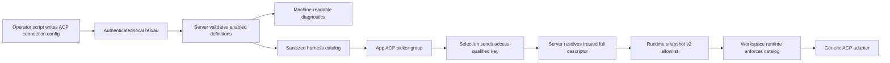

# refactor(agent): Make ACP connections scriptable and discoverable

## Overview

Claxedo will present Claude, Codex, and Cursor through their native SDK harnesses. ACP remains a supported transport for other agents, with every ACP connection coming from an explicit, script-managed allowlist. An enabled connection becomes an ACP picker option automatically; a disabled, malformed, or unlisted connection is not executable.

The implementation turns the existing fixed ACP identities into a generic ACP connection catalog while retaining the mature `AcpHarnessAdapter`, live ACP model/config-option probing, permissions, recovery, and normalized event pipeline. It also removes the bundled Claude/Codex ACP adapter artifacts and the fixed Cursor ACP choice from the active product surface.

## Problem Frame

ACP execution is already structurally generic in `packages/workspace-runtime/src/workspace/runtime.ts`: the default registry matches any harness whose access mode is `acp`. The surrounding contracts are still closed, however:

- `packages/agent-sdk-runtime/src/harness-types.ts` permits only Claude, Codex, and Cursor as ACP identities.
- `packages/claxedo-server/src/agent-config.ts` infers vendor-specific ACP binaries and stores only one selected harness, not an allowed connection catalog.
- `packages/workspace-runtime/src/routes/config.ts` accepts a plural v2 harness list but collapses it to the first entry during normalization.
- `packages/claxedo-app/src/features/session/ui/controls/agent-harness-selector.tsx` hard-codes all eight picker options, including three ACP vendor duplicates.
- Desktop and runtime packages still bundle vendor ACP adapter binaries even though native SDK paths exist.

This prevents operators from scripting another ACP-compatible agent into Claxedo and causes first-party agents to appear twice through different transports.

## Requirements Trace

### Product surface and discovery

- **R1 — Native first-party choices:** Claude, Codex, and Cursor appear once in the app through their native SDK harnesses and are not advertised, auto-configured, or bundled as ACP connections.
- **R2 — Scriptable ACP definitions:** A trusted operator can define local-process and remote ACP connections declaratively, including stable ID, display label, process command/arguments/environment, or remote transport/URL/headers.
- **R3 — Explicit allowlist:** Only valid definitions explicitly enabled by the operator are selectable or executable. Declaring an executable path is not enough without the enable decision.
- **R4 — Automatic app discovery:** Enabled ACP definitions appear under the app's ACP group without an app code change or a second UI-side registry update.

### Runtime behavior and identity

- **R5 — End-to-end generic execution:** A discovered custom ACP connection can be selected, probed for live config/model options, persisted as session identity, run locally or in a workspace runtime, interrupted, recovered, and reloaded through the existing ACP adapter.
- **R6 — Complete model identity:** Custom ACP models use the same access-qualified `acp:<connection-id>` key as their provider identity so model selection, sticky defaults, submit payloads, and reload cannot collide with native or direct harnesses.
- **R7 — Deterministic config convergence:** After an atomic config write, a local or management-authenticated reload operation validates the catalog, returns accepted rows/diagnostics, fans the accepted snapshot to runtimes, and invalidates app discovery without a server restart.

### Security and compatibility

- **R8 — Secret-safe configuration and projection:** Connection topology is stored with owner-only permissions. Secret values are supplied by references to the existing credential registry or named runtime environment variables; app catalogs, diagnostics, logs, and persisted runtime metadata never contain resolved secret values.
- **R9 — Deterministic scripting diagnostics:** Invalid, duplicate, reserved, or disabled definitions produce stable machine-readable catalog diagnostics; they do not silently become executable and one bad entry does not erase valid entries.
- **R10 — Durable compatibility:** Historical Claude/Codex/Cursor ACP sessions remain readable and retain their stored identity. A historical or custom session whose definition is no longer enabled cannot start another turn and reports an actionable disabled/unavailable error.

### Packaging and regression safety

- **R11 — Packaging cleanup:** Release packages and desktop builds no longer install, copy, contract-check, or ship Claude/Codex ACP adapter binaries; the protocol SDK and generic ACP runtime remain.
- **R12 — Regression safety:** Native SDK, OpenCode, Pi, ACP event normalization, sticky draft defaults, session locks, runtime config application, and local/cloud placement retain their existing authority boundaries.

## Scope Boundaries

- ACP connection definitions are managed through trusted configuration and automation. An in-app connection editor is out of scope.
- Automatic discovery means projecting accepted allowlist entries into the app. The product does not scan `$PATH`, package managers, or the filesystem for executables.
- The first implementation supports the connection mechanisms already present in the ACP runtime: stdio process, streamable HTTP, and WebSocket.
- Agent-specific ACP event rules may remain as historical replay compatibility. They are not active picker entries, packaged binaries, credential providers, or recommended execution paths.
- Native SDK implementation changes are limited to any parity fixes exposed by removing their ACP alternatives. New native SDK features are tracked separately.
- ACP server installation, upgrades, and binary distribution belong to the operator or the configured connection package. Claxedo supplies the protocol client/runtime, not third-party ACP servers.

## Planning Bootstrap Assumptions

- “Fully scriptable” means a stable declarative config contract plus machine-readable validation/discovery, with no required UI setup.
- The existing `~/.claxedo/user-agent-config.json` authority remains the local/self-host configuration source. Hosted deployment automation can produce the same normalized runtime snapshot through the existing management-authenticated config path.
- Presence alone is not execution consent. Each custom ACP definition uses an explicit enabled flag.
- Connection IDs are stable lowercase slugs. The built-in IDs and legacy first-party aliases are reserved so a custom entry cannot shadow a native harness.
- Scripts write config atomically and call an explicit reload operation; filesystem watching is not required for correctness.

## Context & Research

### Technology & Architecture

- The relevant packages are TypeScript workspaces running on Bun/Node, with Hono server routes, SolidJS app state/UI, and package-level Bun/Vitest/Playwright tests.
- `packages/agent-sdk-runtime/src/harnesses/acp/index.ts` already provides generic ACP session creation, prompting, config-option probing, permission handling, process reuse, recovery, and event projection.
- `packages/workspace-runtime/src/workspace/runtime.ts` already uses an ordered adapter registry. Its first entry matches any `access: "acp"` harness, which is the implementation seam to preserve.
- `packages/claxedo-server/src/agent-config.ts` owns user config loading, runtime snapshot generation, and the current vendor binary inference.
- `packages/claxedo-app/src/features/session/harness/harness-hydrator.ts` and `profile.ts` already decode server-owned harness status into scope-local picker state.

### Relevant Patterns

- `SessionHarness` separates logical identity from process/remote connection metadata.
- Runtime snapshot v2 already uses a plural `harnesses` list; the receiver currently validates every entry but applies only the first.
- Runtime config apply is serialized and rejects ACP changes that would restart an active turn.
- Session config is durable and session-locked after creation; new draft defaults are convenience state, not created-session authority.
- App harness choices are grouped as ACP, Native SDK, and Direct, but the list is currently static.
- App-facing API parsers use validating decode functions rather than trusting persisted or wire strings.

### Institutional Learnings

- `docs/plans/2026-07-12-003-feat-sticky-workspace-harness-defaults-plan.md` establishes that server session config owns existing sessions and that live harness config options own ACP/native model eligibility.
- `docs/e2e-decisions.md` records passing native Codex multi-turn/reload coverage, supporting the native-only first-party direction.
- `docs/plans/2026-07-18-002-feat-background-agents-steering-plan.md` treats ACP as a portable protocol boundary whose optional capabilities must be discovered rather than assumed.
- No `docs/solutions/` or critical-patterns file exists, so there are no additional formal solution records for this feature area.

### External Research

External research is unnecessary. The repository already contains the ACP protocol client, generic adapter, all three transport implementations, runtime registry, config fanout, and app selector patterns needed for this refactor.

## Key Technical Decisions

- **Separate closed native identities from open ACP identities:** Native harness IDs remain the finite built-in set. ACP connection IDs are validated operator-defined slugs carried only with `access: "acp"`. This preserves strong dispatch for native adapters while allowing generic ACP entries.
- **Use an access-qualified app key:** App and preference state represent custom entries as `acp:<connection-id>`. The prefix prevents collisions with native/direct keys and round-trips to structured runtime identity `{ id: <connection-id>, access: "acp" }`.
- **Make enabled definitions the allowlist:** Add a versioned ACP connection record to user agent config. Each row contains a label, explicit enable decision, and exactly one process or remote connection. Accepted rows are both the discovery catalog and the execution authorization source.
- **Keep connection details server-owned:** Picker and bootstrap/status payloads expose key, ID, access, label, and availability only. Selection requests send the key; the server resolves it back to the trusted full descriptor before persistence or fanout.
- **Resolve secrets at the last trusted boundary:** Declarative env/header values may be non-secret literals or references to a named runtime environment variable/existing credential-registry slot. The server/runtime resolves references only while building the trusted adapter configuration. User config is always owner-readable/writable only, and resolved values never enter catalogs, diagnostics, logs, session rows, or persisted runtime metadata.
- **Use explicit reload rather than file-watch semantics:** A local-only or management-authenticated reload endpoint reparses the on-disk config, returns accepted rows and diagnostics, fans out the accepted snapshot, and invalidates harness-catalog queries. Entry-level validation excludes only invalid rows and applies the valid accepted set. A top-level parse/schema failure, authorization failure, fanout failure, or runtime-apply conflict leaves the previous catalog active.
- **Use runtime snapshot v2 as the workspace allowlist:** The first harness remains the active/default harness for compatibility, while the full normalized `harnesses` list remains available to the workspace host as its execution catalog. Runtime session resolution accepts a custom ACP identity only when an exact enabled descriptor exists in that applied catalog.
- **Do not duplicate connection secrets into session rows:** Durable session identity stores the ACP ID/access pair. The runtime resolves command, args, environment, URL, and headers from the current allowed catalog. Accepted-snapshot metadata records connection IDs and transport kinds only.
- **Treat explicit allowlisting as remote-transport consent:** An enabled remote descriptor is sufficient authorization for its configured transport. The separate ambient `WORKSPACE_RUNTIME_ENABLE_ACP_REMOTE_TRANSPORT` gate can be retired once runtime allowlist enforcement is in place.
- **Preserve last-known-good runtime application:** A malformed catalog snapshot fails before mutation. A catalog change that would restart an active ACP turn returns the existing structured conflict and keeps the previously applied catalog; inactive-entry changes apply without restarting the active adapter.
- **Isolate invalid definitions:** Config parsing returns accepted definitions plus stable diagnostics. Valid enabled connections continue to work when another row is invalid. Reserved IDs, duplicate normalized IDs/keys, unsupported transports, empty commands/URLs, malformed args/env/headers, and missing labels have explicit diagnostic codes.
- **Retain historical aliases as read compatibility:** Legacy `claude-acp`, `codex-acp`, and `cursor-acp` values continue to decode for stored sessions and event replay. They are excluded from active definitions, picker choices, default binary resolution, credential catalogs, new-session selection, and packaging.
- **Use generic ACP behavior by default:** Custom clients enter the event translator as `unknown` unless an explicit compatibility rule recognizes them. Standard ACP content, tools, permissions, plans, and config options continue through the generic translation path.
- **Use the access-qualified key for model ownership:** A custom connection's model provider ID is `acp:<connection-id>` across live options, draft defaults, model writes, submit payloads, and recovered session config. The runtime translates that presentation identity back to the structured harness descriptor before invoking ACP.

## High-Level Technical Design

> *This illustrates the intended approach and is directional guidance for review, not implementation specification. The implementing agent should treat it as context, not code to reproduce.*



### Directional Configuration Contract

The configuration shape should communicate these concepts without requiring app edits:

```text
acp.connections.<id>
  label: human-readable name
  enabled: explicit execution consent
  connection:
    process: command + args + non-secret values or secret references
    OR
    remote: transport + URL + non-secret values or secret references
```

The app-facing projection is deliberately smaller:

```text
key + id + access=acp + label + availability
```

### State and Failure Matrix

| Definition/session state | App behavior | Execution behavior |
|---|---|---|
| Valid and enabled | Appears under ACP | Allowed through resolved descriptor |
| Valid and disabled | Hidden | Rejected as disabled/unlisted |
| Malformed enabled row | Hidden; valid peers still appear | Rejected; diagnostic is queryable |
| Reserved first-party ID | Hidden | Rejected with reserved-ID diagnostic |
| Definition removed before a session starts | Removed on refresh | New selection/turn rejected |
| Definition removed while a turn is active | Removed from central discovery; runtime reports apply conflict | Current turn keeps last-known-good runtime; retry applies once idle |
| Historical ACP session, definition unavailable | Session remains readable and locked to its identity | Follow-up blocked with actionable unavailable error |
| Remote definition enabled | Appears under ACP | Uses configured HTTP/WebSocket transport without an ambient feature flag |

## User Flows and Edge Cases

1. **Scripted process connection:** An operator atomically writes and enables one process definition, then invokes reload. The reload response confirms acceptance, runtime fanout completes, and the refreshed app adds its label under ACP. Selecting it resolves the trusted command/args/env references, probes live options, creates a session, and stores only its logical identity.
2. **Scripted remote connection:** An operator enables a streamable-HTTP or WebSocket definition and invokes reload. The app shows the same generic ACP choice shape; the runtime resolves header references at connection time and keeps resolved values out of app payloads and persisted metadata.
3. **Connection disabled or removed:** It disappears from new-draft choices. Existing sessions still load history and identify their former harness, but follow-up execution returns a stable unavailable error.
4. **Invalid configuration:** The invalid row is absent from discovery, a diagnostic names the row and validation failure, and other accepted rows remain available.
5. **Late catalog refresh:** A stale response from another workspace, draft, or server authority cannot replace the current scope's list or selected created-session identity.
6. **Config change during a turn:** Changes that affect the active descriptor retain the existing safe conflict behavior. Changes to an inactive catalog entry apply without touching the active process.
7. **Fresh install:** The ACP group is absent or empty until at least one custom connection is enabled. Native SDK and Direct groups remain usable.
8. **Partially valid reload:** A script receives the accepted rows plus per-entry diagnostics. Valid entries replace the prior accepted set and fan out; invalid entries remain hidden and unauthorized.
9. **Failed reload:** A top-level parse/schema, authorization, fanout, or runtime-apply failure leaves the workspace's last-known-good catalog active. After resolving the failure, a later reload converges server discovery and runtime authorization.

## Open Questions

### Resolved During Planning

- **Does automatic mean scanning installed binaries?** No. Discovery is automatic from accepted allowlist definitions; arbitrary executable discovery would bypass explicit consent and produce non-deterministic deployments.
- **Where is the source of truth?** The server-owned user agent config and its normalized runtime snapshot. The app consumes a projection and never becomes a second registry.
- **Can Claude/Codex/Cursor be re-added under custom ACP IDs?** Their reserved identities and legacy aliases are rejected for new definitions. They remain available through native SDKs.
- **What happens to old ACP sessions?** They remain readable. Continued execution requires an active allowed definition; the product does not silently migrate a durable session to a native harness.
- **Should the app receive commands, environment, URLs, or headers?** No. The app needs presentation identity only; trusted layers resolve connection details.
- **How do scripts activate an edited config?** They atomically replace the config file and call the local-only or management-authenticated reload operation. The response is the machine-readable acceptance receipt.
- **How are connection secrets represented?** Through existing credential-registry slots or named runtime environment references resolved at the trusted server/runtime boundary. The config file remains owner-only and catalogs/diagnostics carry reference names at most, never values.
- **Should a bad row invalidate the whole catalog?** No. Per-entry diagnostics isolate operator mistakes, while runtime snapshot validation remains atomic for the accepted catalog.
- **Is a second remote ACP feature flag required?** No. The explicit enabled allowlist becomes the authorization boundary for both process and remote connections.

### Deferred to Implementation

- **Exact config field spelling and schema helper names:** Preserve the concepts and validation behavior above while following the smallest existing config parsing pattern.
- **Catalog refresh trigger:** Prefer the existing harness hydration/status refresh path; add a dedicated query only if implementation shows that status caching cannot provide timely catalog updates without coupling health and discovery.
- **Historical label retention:** Reuse a stored/session-derived label if already available; otherwise derive a bounded title from the legacy/custom ID. The identity and execution policy are fixed regardless of final fallback copy.

## Implementation Units

- [ ] **Unit 1: Open the shared ACP identity and connection contracts**

**Goal:** Represent arbitrary ACP identities and complete connection descriptors without weakening the finite native harness registry.

**Requirements:** R2, R5, R6, R8, R10, R12

**Dependencies:** None

**Files:**
- Modify: `packages/agent-sdk-runtime/src/harness-types.ts`
- Modify: `packages/agent-sdk-runtime/src/index.ts`
- Modify: `packages/agent-sdk-runtime/src/harnesses/index.ts`
- Modify: `packages/agent-sdk-runtime/src/harnesses/acp/index.ts`
- Modify: `packages/agent-sdk-runtime/src/harnesses/acp/default-binaries.ts`
- Modify: `packages/agent-sdk-runtime/src/mcp-resolver.ts`
- Create or modify tests: `packages/agent-sdk-runtime/src/harness-types.test.ts`
- Test: `packages/agent-sdk-runtime/src/harnesses/acp/index.test.ts`
- Test: `packages/agent-sdk-runtime/src/runtime.test.ts`
- Test: `packages/agent-sdk-runtime/src/mcp-resolver.test.ts`

**Approach:**
- Split built-in native definitions from operator-defined ACP identity. Keep native factories closed over Claude, Codex, Cursor, OpenCode, and Pi.
- Add an exported generic ACP factory/descriptor path that accepts a validated ID and explicit connection instead of inferring a vendor binary.
- Extend process connection metadata to carry arguments and environment overrides through the trusted runtime path.
- Make `AcpHarnessAdapter` accept a generic ACP client ID. Keep vendor-only recovery quirks behind legacy compatibility checks rather than making them the type boundary.
- Define canonical access-qualified keys and parsing rules, including `acp:<id>` for custom connections and read-only legacy aliases.
- Make the access-qualified key the model provider identity returned to app/runtime consumers.
- Ensure unknown ACP IDs map to the generic event translator/client classification and MCP agent fallback without being mislabeled as Claude, Codex, or Cursor.

**Patterns to follow:**
- `AgentHarnessAccess` for transport-independent access qualification.
- `defaultWorkspaceHarnessRegistry()` for generic `access: "acp"` dispatch.
- `acpClient()` returning `unknown` for unrecognized event compatibility.

**Test scenarios:**
- Happy path: a valid custom slug and `access: "acp"` round-trip through identity normalization and key generation.
- Happy path: a generic ACP factory receives process command, args, and env unchanged.
- Edge case: native built-in IDs remain finite and still select their native factories.
- Error path: blank, malformed, reserved, or overlong custom ACP IDs fail validation.
- Compatibility: legacy Claude/Codex/Cursor ACP keys still decode for historical input but are not present in active definitions.
- Integration: a fake custom ACP adapter creates a session and emits generic normalized events without vendor classification.
- Identity: live model options and a recovered model selection retain `providerID: "acp:<id>"` without colliding with a native harness ID.

**Verification:**
- Shared types can express a custom ACP connection while callers cannot treat an arbitrary string as a native harness.
- No generic ACP code path requires a Claude/Codex/Cursor default binary.

- [ ] **Unit 2: Add the server-owned ACP allowlist and sanitized catalog**

**Goal:** Make trusted configuration the single source of ACP discovery and execution authorization.

**Requirements:** R2, R3, R4, R7, R8, R9, R10

**Dependencies:** Unit 1

**Files:**
- Modify: `packages/claxedo-server/src/agent-config.ts`
- Modify: `packages/claxedo-server/src/routes/agent-config-harness.ts`
- Modify: `packages/claxedo-server/src/routes/agent-config-harness-routes.ts`
- Modify: `packages/claxedo-server/src/routes/agent-config.ts`
- Modify: `packages/claxedo-server/src/config-fanout.ts`
- Modify: `packages/claxedo-server/src/harness-resolution.ts`
- Modify: `packages/claxedo-server/src/session-harness.ts`
- Test: `packages/claxedo-server/src/agent-config.test.ts`
- Test: `packages/claxedo-server/src/harness-resolution.test.ts`
- Test: `packages/claxedo-server/src/routes/agent-config-extensions.test.ts`
- Test: `packages/claxedo-server/src/multi-agent.integration.test.ts`

**Approach:**
- Add a versioned ACP connection map to `UserAgentConfig` and preserve it through every existing load/save mutation.
- Parse each entry into accepted definitions and stable diagnostics. Require explicit enablement and exactly one valid process or remote connection.
- Reserve native IDs and legacy aliases. Detect collisions after normalization so spelling differences cannot create ambiguous keys.
- Add the sanitized accepted catalog to the harness status/discovery response used by app hydration. Include diagnostics on the trusted configuration endpoint for scripts and operators, not in normal picker rows.
- Add a local-only or management-authenticated reload operation that reparses config, returns accepted rows/diagnostics, fans out the accepted snapshot, and invalidates app discovery. Apply the valid subset when individual rows fail validation; preserve the last applied catalog when the document cannot be parsed/authorized or the accepted snapshot cannot be fanned out/applied.
- Resolve selection keys against the accepted catalog before saving a default, binding a session, probing config options, or generating a runtime snapshot. Never accept app-supplied command/env/header fields as catalog authority.
- Resolve credential/environment references only while producing trusted runtime configuration; save the user config with mode `0600` and redact all diagnostic/log fields.
- Remove vendor binary inference. A custom ACP process definition must provide its command; native harnesses retain their own executable resolution.
- Generate runtime snapshot v2 with the active/default harness first and every accepted ACP descriptor included once.

**Patterns to follow:**
- `sandboxDriverConfig()` for canonical config parsing and preservation.
- `localAgentConfigAllowed()` for the trusted configuration boundary.
- `errorBody()` for stable machine-readable errors.

**Test scenarios:**
- Happy path: two enabled custom connections round-trip through config and both appear in the sanitized catalog.
- Happy path: process args/env and remote URL/headers reach the runtime snapshot but not the app catalog response.
- Edge case: a disabled valid definition remains queryable in diagnostics but is absent from picker data and runtime allowlist.
- Edge case: one malformed row does not remove a valid peer.
- Error path: reserved first-party IDs, normalized duplicates, unsupported transport, missing process command, malformed args/env/headers, and missing remote URL return stable diagnostic codes.
- Security: posting an unlisted `acp:<id>` or a body containing its own binary/headers is rejected without config mutation.
- Compatibility: existing session config using a legacy first-party ACP identity resolves for reads but cannot be chosen for a new session.
- Integration: selecting an accepted custom key saves the trusted descriptor, fans out config, and exposes its live options route.
- Reload: an atomic file edit followed by reload returns an acceptance receipt, updates app discovery, and fans the same catalog to local/cloud runtimes without restart.
- Partial success: a reload with one invalid row returns accepted rows plus diagnostics and applies the valid accepted set.
- Error path: a top-level or apply failure returns diagnostics and leaves the previous runtime catalog active.
- Secret handling: config file permissions are owner-only, reference names resolve on the trusted path, and values are absent from JSON responses and logs.

**Verification:**
- A script can write config, query accepted/invalid rows, and predict exactly which ACP choices the app will show.
- The app never receives secret-bearing connection fields.

- [ ] **Unit 3: Retain and enforce the ACP catalog in workspace runtimes**

**Goal:** Carry the allowed catalog across local/cloud runtime boundaries and enforce it for every session operation.

**Requirements:** R3, R5, R7, R8, R9, R10, R12

**Dependencies:** Units 1–2

**Files:**
- Modify: `packages/workspace-runtime/src/routes/config.ts`
- Modify: `packages/workspace-runtime/src/workspace/runtime.ts`
- Modify: `packages/workspace-runtime/src/routes/session.ts`
- Modify: `packages/workspace-runtime/src/session-config.ts`
- Modify: `packages/workspace-runtime/src/workspace/host.ts`
- Test: `packages/workspace-runtime/src/routes/config.test.ts`
- Test: `packages/workspace-runtime/src/workspace/runtime.test.ts`
- Test: `packages/workspace-runtime/src/routes/session.test.ts`
- Test: `packages/workspace-runtime/src/store.test.ts`
- Test: `packages/claxedo-server/src/workspace-supervisor-cloud.test.ts`

**Approach:**
- Preserve the full normalized v2 harness list in the applied snapshot while retaining the first row as the active/default harness.
- Build an immutable applied ACP catalog keyed by canonical ID/access. Resolve custom session requests and durable session identities through this catalog before adapter creation.
- Reject unknown, disabled, ambiguous, or descriptor-mismatched ACP requests at the runtime boundary even when a caller bypasses the app.
- Construct process or remote transport from the catalog descriptor, including args/env and headers, and use the generic ACP adapter registry entry.
- Keep session rows focused on logical identity. Resolve connection details from the current catalog during resume/reload so secret-bearing fields are not duplicated into durable session storage.
- Redact accepted-snapshot metadata to IDs, labels, access, and transport kinds. Keep environment/header values out of `.workspace-runtime/runtime-config/accepted-snapshot.json` and apply-status details.
- Resolve secret references after snapshot authorization and before adapter creation; keep resolved values in memory only for the adapter/process lifetime.
- Refine safe config apply so inactive catalog changes do not restart the active adapter, while changes/removal of an actively used descriptor retain conflict/last-known-good behavior.
- Replace the ambient remote ACP feature flag with catalog authorization after enforcement coverage is in place.

**Patterns to follow:**
- `normalizeRuntimeSnapshot()` for atomic validation before mutation.
- `applyQueue` and `unsafeAcpLiveConfigChange` for serialized safe application.
- `sessionAdapters` and `adapterKey()` for per-identity adapter ownership.

**Test scenarios:**
- Happy path: a v2 snapshot applies two custom ACP definitions, keeps the declared first default, and can create sessions through either allowed identity.
- Happy path: process args/env and remote transport settings reach the adapter factory exactly once.
- Security: a direct session query for an unlisted ACP ID fails before process spawn or network connection.
- Security: persisted metadata includes only redacted catalog information.
- Security: runtime diagnostics and transport errors never echo resolved env/header values.
- Edge case: changing an inactive definition applies without draining the active adapter.
- Concurrency: changing/removing the active definition during a turn returns the structured conflict and keeps the old catalog/adapter usable until a later successful apply.
- Compatibility: a historical session remains listable/readable when its ACP definition is missing, while a prompt returns the stable unavailable error.
- Recovery: after restart, an enabled custom session resolves through the newly applied catalog and reconnects with the same logical identity.
- Regression: native Claude/Codex/Cursor, Pi, and OpenCode still dispatch through their existing registry entries.

**Verification:**
- Allowlist enforcement holds at both central server and workspace runtime boundaries.
- Runtime status and persisted metadata reveal no environment or header values.

- [ ] **Unit 4: Drive the app picker from the server catalog**

**Goal:** Show enabled custom ACP connections automatically and remove fixed first-party ACP choices.

**Requirements:** R1, R4, R6, R7, R8, R10, R12

**Dependencies:** Units 1–3

**Files:**
- Modify: `packages/claxedo-app/src/platform/identity/session-ref.ts`
- Modify: `packages/claxedo-app/src/features/session/harness/profile.ts`
- Modify: `packages/claxedo-app/src/features/session/harness/selection.ts`
- Modify: `packages/claxedo-app/src/features/session/harness/harness-hydrator.ts`
- Modify: `packages/claxedo-app/src/features/session/harness/harness-store.ts`
- Modify: `packages/claxedo-app/src/features/session/harness/store-state.ts`
- Modify: `packages/claxedo-app/src/features/session/ui/controls/agent-harness-selector.tsx`
- Modify: `packages/claxedo-app/src/app/workbench/state/route-session-harness.ts`
- Modify: `packages/claxedo-app/src/ui/harness-display.ts`
- Test: `packages/claxedo-app/src/platform/identity/session-ref.test.ts`
- Test: `packages/claxedo-app/src/features/session/harness/profile.test.ts`
- Test: `packages/claxedo-app/src/features/session/harness/harness-hydrator.test.ts`
- Test: `packages/claxedo-app/src/features/session/harness/harness-store.test.ts`
- Test: `packages/claxedo-app/src/features/session/harness/draft-default-policy.test.ts`
- Test: `packages/claxedo-app/src/features/session/ui/controls/agent-harness-selector.vitest.tsx`

**Approach:**
- Replace the static `HARNESS_OPTIONS` ACP portion with catalog rows from scoped harness hydration. Keep native Claude/Codex/Cursor and Direct Pi/OpenCode as built-in rows.
- Introduce a validated `acp:<id>` app key and catalog-backed label lookup. Derive a bounded fallback label for historical sessions not in the current catalog.
- Keep catalog ownership scoped by server/workspace/draft identity so late responses cannot mutate another picker.
- Feed the dynamic supported-harness list into sticky draft-default resolution. A saved custom ACP default is eligible only while its exact catalog key is enabled.
- Send only the access-qualified key when switching. Continue using live config options for the selected ACP connection's model rows.
- Use the same access-qualified key as provider ID for custom ACP model rows and sticky draft defaults.
- Preserve existing-session lock behavior. An unavailable historical custom/legacy ACP session remains identified and readable but shows a non-switching unavailable state for follow-up.
- Render the ACP group only when at least one accepted row exists. Native SDK and Direct groups remain stable.

**Patterns to follow:**
- `decodeHarnessState()` for validated server projections.
- `draftDefaultApplication()` for exact saved-harness eligibility.
- `shouldApplyHarnessSelection()` for typeahead and in-flight switch safety.

**Test scenarios:**
- Happy path: catalog rows `acp:gemini` and `acp:goose` appear under ACP with server-provided labels.
- Happy path: selecting a custom row sends only its canonical key and then loads its live model options.
- Regression: Claude, Codex, and Cursor appear only under Native SDK; Pi and OpenCode remain under Direct.
- Empty state: with no enabled custom rows, the ACP group is absent and no placeholder vendor ACP items appear.
- Security: catalog decoder discards rows containing invalid keys/access/labels and ignores secret-shaped extra fields.
- Persistence: a valid saved custom ACP draft default restores only while the catalog contains that exact key.
- Compatibility: a historical `claude-acp`, `codex-acp`, or `cursor-acp` session renders a sensible label without adding that choice to a new draft.
- Race: a late catalog response from a prior directory/server/surface does not replace the active picker list or selection.
- Refresh: a successful reload invalidates/refetches discovery and a failed reload does not expose unapplied rows as selectable.
- Locking: an existing session cannot switch to a newly discovered ACP connection.

**Verification:**
- Editing the trusted config and refreshing/hydrating is sufficient to add or remove ACP picker rows.
- No app source registry needs a new entry for another ACP-compatible agent.

- [ ] **Unit 5: Remove first-party ACP packaging and credential surfaces**

**Goal:** Make native SDKs the only active Claude/Codex/Cursor choices and stop shipping their ACP server adapters.

**Requirements:** R1, R10, R11, R12

**Dependencies:** Units 1–4

**Files:**
- Modify: `packages/agent-sdk-runtime/package.json`
- Modify: `packages/agent-sdk-runtime/README.md`
- Modify: `packages/claxedo-desktop/package.json`
- Modify: `packages/claxedo-desktop/scripts/prebuild.ts`
- Modify: `packages/claxedo-desktop/scripts/contract.ts`
- Modify: `packages/claxedo-desktop/electron-builder.config.ts`
- Modify: `packages/claxedo-server/src/credentials/sync.ts`
- Modify: `packages/claxedo-server/src/credentials/verify.ts`
- Modify: `packages/claxedo-server/src/credentials/registry.ts`
- Modify: `packages/claxedo-server/src/routes/bootstrap.ts`
- Modify: `packages/claxedo-server/src/routes/opencode-compat-provider-config.ts`
- Modify: `packages/claxedo-server/src/provider-auth/service.ts`
- Modify: `bun.lock`
- Test: `packages/claxedo-desktop/scripts/contract.test.ts`
- Test: `packages/claxedo-server/src/credentials/sync.test.ts`
- Test: `packages/claxedo-server/src/credentials/registry.test.ts`
- Test: `packages/claxedo-server/src/routes/bootstrap.test.ts`
- Test: `packages/claxedo-server/src/routes/provider-auth.test.ts`

**Approach:**
- Remove dependencies and build steps for `claude-agent-acp` and `codex-acp`; remove Cursor ACP from built-in/default resolution without adding a packaged replacement.
- Remove desktop ACP resource copying and contract requirements once no bundled ACP artifacts remain. Keep native CLI/SDK executable preparation intact.
- Remove first-party ACP provider-auth entries, environment mappings, and credential fanout aliases from active catalogs. Native credential IDs continue to own first-party auth.
- Let generic ACP processes inherit the runtime environment and consume explicit connection env overrides; Claxedo does not invent vendor credential slots for arbitrary ACP IDs.
- Retain narrow legacy credential migration/read support only where deleting it would make existing stored credentials unreadable before users transition to native harnesses.
- Update package descriptions and public exports to describe generic configured ACP support.

**Patterns to follow:**
- The current native Claude/Codex/Cursor adapters and desktop executable resolution.
- Credential registry fanout allowlists as explicit, narrowly scoped compatibility boundaries.

**Test scenarios:**
- Packaging: desktop release contracts pass without any `resources/acp/*` artifact.
- Dependency: the runtime package retains `@agentclientprotocol/sdk` and drops vendor ACP server packages.
- Native regression: each first-party native harness still resolves its executable/auth path.
- Auth regression: bootstrap/provider-auth responses no longer advertise first-party ACP IDs and still advertise native IDs.
- Compatibility: legacy credential records can be migrated/read according to the chosen transition path but are not offered for new ACP setup.
- Lockfile: no transitive vendor ACP server package remains solely because of removed first-party ACP support.

**Verification:**
- Built desktop/server artifacts contain no bundled Claude/Codex ACP executable.
- The first-party authentication surface contains only native harness entries.

- [ ] **Unit 6: Replace vendor ACP matrices with generic integration coverage and documentation**

**Goal:** Prove the new catalog-to-session flow and document the operator contract.

**Requirements:** R1–R12

**Dependencies:** Units 1–5

**Files:**
- Modify: `packages/claxedo-server/src/agent-lifecycle.integration.test.ts`
- Modify or remove: `packages/claxedo-server/src/real-acp-boot.integration.test.ts`
- Modify: `packages/claxedo-server/src/fixtures/fake-acp.ts`
- Modify: `packages/claxedo-app/e2e/playwright/core-harness-ownership-local.spec.ts`
- Modify: `packages/claxedo-app/e2e/playwright/core-harness-ownership-cloud.spec.ts`
- Modify: `packages/claxedo-app/e2e/playwright/core-harness-rendering-matrix.spec.ts`
- Modify: `packages/claxedo-app/e2e/playwright/live-real-harness-smoke.spec.ts`
- Modify: `packages/claxedo-app/e2e/fixtures/harness-traces/claude-acp.json`
- Modify: `packages/claxedo-app/e2e/fixtures/harness-traces/codex-acp.json`
- Modify: `packages/claxedo-app/e2e/fixtures/harness-traces/cursor-acp.json`
- Modify: `packages/claxedo-server/README.md`
- Modify: `packages/workspace-runtime/README.md`
- Modify: `public-docs/agent-sdk-runtime.md`
- Modify: `public-docs/workspace-runtime.md`
- Modify: `public-docs/supported-surfaces.md`

**Approach:**
- Replace the three duplicated fake lifecycle suites with a parameterized generic custom ACP definition that is admitted through the same config/catalog path production uses.
- Keep focused event-translation golden coverage for vendor-specific historical traces only where it protects durable replay semantics; name it as compatibility coverage rather than active harness availability.
- Make live first-party smoke coverage native-only. A generic ACP live smoke is optional and runs only when CI supplies an explicitly configured external ACP server; the deterministic fake integration remains the required gate.
- Add an end-to-end app test that changes accepted config, refreshes the selector, selects the new ACP row, discovers live model options, sends a turn, reloads, and preserves session identity.
- Document schema, ID rules, local/remote examples, enable/disable behavior, diagnostics, secret handling, config refresh, and the unavailable historical-session behavior.

**Patterns to follow:**
- Existing fake ACP binary and full lifecycle integration setup.
- Existing live-smoke loud-skip policy for external binaries/credentials.
- Public docs package-boundary descriptions.

**Test scenarios:**
- End-to-end happy path: an enabled custom fake ACP connection appears in the picker, creates a session, streams a reply, and survives reload.
- End-to-end removal: disabling the connection removes it from new drafts while the created session history remains visible and follow-up is blocked.
- End-to-end invalid row: a malformed peer produces a diagnostic without hiding the valid fake connection.
- End-to-end reload: an atomic config edit plus reload updates both picker discovery and workspace enforcement; failed reload retains last-known-good execution.
- Secret safety: configured env/header references work while their resolved values remain absent from browser traffic, logs, and runtime metadata.
- Cloud parity: the same normalized catalog reaches a workspace runtime and selects the custom connection without app-side connection details.
- Native regression: Claude, Codex, and Cursor native live/fake smokes remain available and no first-party ACP picker option is present.
- Historical replay: retained legacy ACP trace fixtures still project existing session content correctly.

**Verification:**
- Required unit, integration, architecture, type, and browser suites cover config → discovery → selection → runtime → reload.
- Operator documentation is sufficient to add another ACP-compatible client without changing Claxedo source.

## System-Wide Impact

- **Interaction graph:** User config parsing feeds sanitized app discovery and trusted runtime snapshots. Picker selection resolves through the server catalog, session config stores logical identity, and workspace runtime resolves the full descriptor before the generic ACP adapter starts.
- **Error propagation:** Config validation produces per-entry diagnostics; unlisted selection produces a client-safe 4xx; runtime catalog mismatch produces a stable unavailable error; transport/probe failures retain current harness error semantics.
- **State lifecycle:** The central accepted catalog and workspace last-known-good applied catalog can briefly differ when an active-turn safety conflict occurs. Apply status must make that state visible, and a later idle retry converges them.
- **Data integrity:** Existing session identity columns already store arbitrary strings, so no session-table rewrite is required. Connection secrets remain catalog-owned and are not copied into session rows or runtime metadata.
- **API surface:** Shared `SessionHarness`/runtime snapshot types, local agent-config routes, workspace config apply, session route query parsing, app `HarnessId`, and package exports all change together.
- **API parity:** Local loopback, user-hosted relay, and managed cloud workspaces consume the same normalized catalog. Native/direct choices stay available in every placement where they already work.
- **Security boundary:** Enabling a connection authorizes command execution or a remote network endpoint. Only trusted config-management paths can create definitions; app requests select by key and cannot supply executable details.
- **Secret lifecycle:** Config stores references under owner-only permissions; credential/environment values resolve in memory at the runtime boundary and follow the existing credential authority's rotation/revocation lifecycle.
- **Caching:** Catalog data follows the same server/workspace scope and stale-response guards as harness status. Inactive entry changes must invalidate picker discovery without unnecessarily recreating active session adapters.
- **Observability:** Runtime status includes active identity plus accepted catalog IDs/transport kinds and config-apply diagnostics, with secrets redacted.
- **Unchanged invariants:** Created sessions remain harness-locked; live ACP config options remain model authority; one explicit ACP stream call path remains; native/OpenCode/Pi adapters retain their existing dispatch and storage behavior.

## Threat Model

- **Configuration tampering:** An enabled process can execute code and an enabled remote connection can reach a network endpoint. Restrict file permissions to the owner, restrict reload to local or management-authenticated callers, validate the complete accepted set before fanout, and return an auditable acceptance receipt.
- **Selection forgery:** A compromised or stale app request could name an arbitrary ACP ID or submit its own connection details. Resolve only canonical `acp:<id>` keys through the applied allowlist at both server and workspace boundaries, and reject caller-supplied executable, environment, URL, or header fields.
- **Secret disclosure:** Credentials could escape through app discovery, diagnostics, logs, transport errors, session persistence, or accepted-snapshot metadata. Store references rather than values, resolve them only at the final trusted boundary, redact structured failures, and assert every durable and client-facing projection is secret-free.

## Risks & Dependencies

| Risk | Mitigation |
|---|---|
| Opening ACP IDs turns a closed string union into an unsafe arbitrary dispatch surface | Keep native IDs closed, validate ACP slugs, require `access: "acp"`, and enforce exact catalog membership at both central and workspace boundaries. |
| App selection could smuggle a binary, env, URL, or headers | App sends only a canonical key; trusted server lookup supplies the descriptor and ignores/rejects caller connection fields. |
| Secret-bearing env/headers leak through discovery or accepted-snapshot metadata | Use separate trusted and sanitized projections; add explicit redaction assertions. |
| A script edits config but runtimes keep a stale allowlist | Require an explicit reload receipt that validates, fans out, invalidates discovery, and preserves last-known-good state on failure. |
| Removing bundled adapters breaks users with old ACP sessions | Keep historical reads/replay, give a clear unavailable follow-up state, document transition to native, and do not silently rewrite durable harness identity. |
| Config removal races an active turn | Preserve serialized config apply and last-known-good conflict behavior; retry after idle. |
| Runtime v2 plural-list changes drift between emitter and receiver | Extend the existing server snapshot-accepted-by-runtime contract test and keep v1 compatibility coverage. |
| Generic ACP clients expose different optional capabilities | Continue live capability/config-option probing and generic translation; do not infer vendor features from ID or label. |
| Native SDK packaging is not equivalent on every OS | Keep desktop contract and native live-smoke coverage per supported target before deleting ACP assets. |
| Current in-progress desktop/native executable changes overlap packaging files | Integrate against the final native executable-resolution contract and preserve that behavior while deleting only ACP-specific assets. |

## Sequencing and Rollout

1. Land shared generic identity/connection contracts with legacy reads intact.
2. Add server parsing/catalog and runtime allowlist retention/enforcement behind the existing config v2 path.
3. Switch the app to catalog-driven ACP choices and validate local/cloud end to end.
4. Remove active first-party ACP choices, provider-auth entries, dependencies, and desktop assets.
5. Update integration matrices and documentation, then release as one coordinated compatibility boundary.

The rollout does not need a user-facing feature flag. Before the app switches to dynamic discovery, the server/runtime must already accept and enforce the new catalog. Vendor ACP packaging is removed only after all three native harness smokes pass on supported desktop targets.

## Documentation / Operational Notes

- Publish the exact versioned config contract and stable diagnostic codes.
- Document the atomic-write + reload workflow and the acceptance receipt scripts should treat as success.
- Explain that enabled ACP entries execute trusted commands or connect to trusted remote endpoints and should be managed like other code-execution configuration.
- Document credential/environment reference syntax, owner-only file permissions, rotation behavior, and redaction guarantees.
- Document config reload behavior, active-turn conflicts, and how automation verifies accepted rows.
- Document native Claude/Codex/Cursor as the supported first-party paths and custom ACP as operator-supplied.
- Update deployment/image guidance: images include the ACP client runtime, while configured ACP servers must be installed or reachable by the operator.
- Release notes should call out the removal of bundled first-party ACP adapters and the preserved historical-session behavior.

## Sources & References

- `packages/agent-sdk-runtime/src/harness-types.ts`
- `packages/agent-sdk-runtime/src/harnesses/acp/index.ts`
- `packages/workspace-runtime/src/routes/config.ts`
- `packages/workspace-runtime/src/workspace/runtime.ts`
- `packages/claxedo-server/src/agent-config.ts`
- `packages/claxedo-server/src/config-fanout.ts`
- `packages/claxedo-server/src/routes/agent-config-harness-routes.ts`
- `packages/claxedo-app/src/features/session/harness/profile.ts`
- `packages/claxedo-app/src/features/session/ui/controls/agent-harness-selector.tsx`
- `packages/claxedo-app/src/platform/identity/session-ref.ts`
- `packages/claxedo-desktop/scripts/prebuild.ts`
- `docs/e2e-decisions.md`
- `docs/plans/2026-07-12-003-feat-sticky-workspace-harness-defaults-plan.md`
- `docs/plans/2026-07-18-002-feat-background-agents-steering-plan.md`
