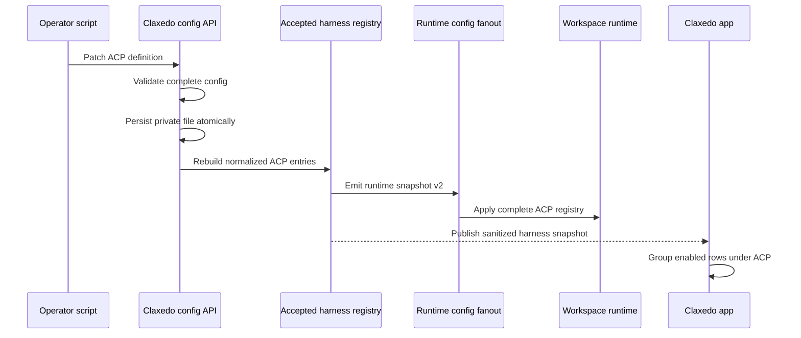
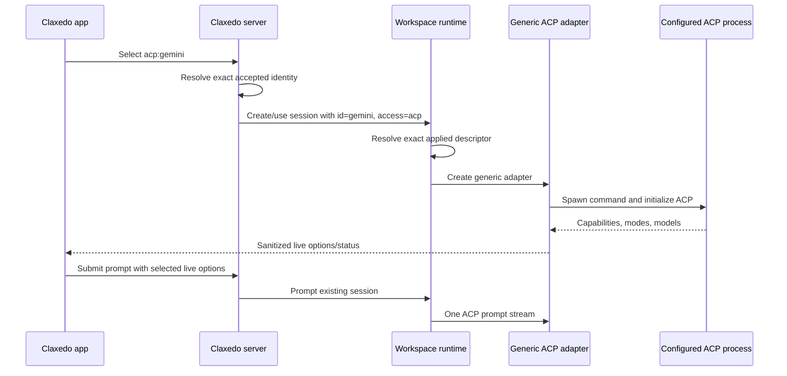

# refactor(agent): Use native first-party harnesses and scriptable ACP extensions

## Overview

Claxedo will use its first-class native SDK integrations for Claude, Codex, and Cursor. Their ACP adapters, bundled binaries, duplicate picker entries, credential aliases, packaging steps, and vendor-specific runtime dependencies will be removed from the built-in product surface.

ACP remains Claxedo's open extension point. An operator can add any stdio ACP-compatible agent as data in trusted configuration. The server turns each enabled configuration entry into a generic ACP harness, the app discovers it from the server-owned harness snapshot, and the workspace runtime resolves it through the same accepted registry before starting the process.

This boundary gives Claxedo two clear integration models:

- **First-party agents:** Native SDK or app-server implementations maintained and tested by Claxedo.
- **External agents:** Operator-installed ACP processes described by configuration and handled by one generic ACP adapter.

The result removes large duplicate dependencies and per-vendor maintenance while making the ACP surface more extensible. Adding another standards-compliant ACP agent becomes a configuration operation rather than a Claxedo code change.

## Why This Change

Claude, Codex, and Cursor already have native integrations that expose their first-party lifecycle, authentication, recovery, permissions, models, and events directly. Bundling separate ACP implementations for the same agents has significant ongoing cost:

- Desktop and server packages ship vendor ACP binaries and transitive dependencies in addition to the native integration.
- Each first-party agent has two execution paths that can drift in recovery, permissions, model selection, authentication, packaging, and tests.
- The app presents duplicate choices for the same logical agent.
- Native defects can be hidden by an ACP fallback instead of being fixed in the supported first-party path.
- Adding another ACP agent currently requires expanding closed unions, registries, UI options, binary inference, and test matrices.

The generic ACP client is still valuable. It is comparatively small, protocol-oriented infrastructure that can connect to many independently installed agents. Claxedo should bundle that protocol client while leaving each external ACP server, its installation, and its upgrades under operator control.

## Desired Outcome

After this refactor:

- Claude, Codex, and Cursor appear once under **Native SDK**.
- Claxedo release artifacts contain no bundled Claude, Codex, or Cursor ACP server.
- An operator can configure a new stdio ACP agent without changing Claxedo source.
- A configured and enabled ACP agent appears automatically under **ACP** in the app.
- A disabled or removed ACP agent is absent from new-session choices and cannot be started.
- The app receives labels and availability, but never commands or environment values.
- The central server and workspace runtime enforce the same accepted ACP registry.
- Models, modes, permissions, and optional capabilities continue to come from live ACP negotiation.
- Supporting the next ordinary ACP agent requires configuration and interoperability testing, not a new adapter class.

## Requirements Trace

### First-party consolidation

- **R1 — Native first-party surface:** Claude, Codex, and Cursor are built-in only through their native integrations.
- **R2 — Dependency and packaging reduction:** Vendor ACP packages, binaries, desktop resources, credential aliases, and vendor boot logic are removed from release artifacts.

### Generic ACP extension

- **R3 — Open ACP identity:** Custom ACP connection IDs are validated operator-defined slugs rather than members of the closed native harness union.
- **R4 — Scriptable definition:** A trusted configuration mutation can define an ACP connection with an ID, label, command array, optional environment, optional compatibility parameters, and enabled state.
- **R5 — Configuration is authorization:** A valid configured entry is allowed by default; `enabled: false` preserves its settings while removing it from discovery and execution.
- **R6 — Automatic discovery:** Every enabled ACP entry appears under the app's ACP group from server-projected data without an app registry edit.
- **R7 — Runtime enforcement:** Both the central server and workspace runtime reject an ACP identity that is not in their current accepted registry.
- **R8 — Generic interoperability:** The existing ACP adapter handles initialization, session creation, live model/mode discovery, permissions, MCP injection, prompting, interruption, and recovery for custom identities.

### Lifecycle and compatibility

- **R9 — Durable identity:** Sessions persist the logical `{ id, access: "acp" }` identity and resolve its current configured launch descriptor when execution starts.
- **R10 — Safe configuration application:** Live config mutations validate and persist the central accepted config atomically, then rebuild discovery and fan the normalized registry to workspace runtimes without restarting the server. Per-target apply status reports whether each runtime has converged.
- **R11 — Compatibility:** Historical first-party ACP sessions remain readable. They can continue only when the operator explicitly configures the corresponding ACP identity and supplies its process.
- **R12 — Regression protection:** Native Claude/Codex/Cursor, OpenCode, Pi, session locking, sticky defaults, live option discovery, and local/cloud placement retain their existing authority boundaries.

## Scope Boundaries

- The first release supports ACP over stdio processes. Streamable HTTP and WebSocket ACP connections are tracked as a later extension of the same registry contract.
- Operators install and authenticate external ACP agents. Claxedo manages the client side of the protocol and the configured child process.
- Live scripting uses the authenticated/local agent-config API. Direct edits to `user-agent-config.json` are supported for provisioning before server start; filesystem watching is outside this release.
- The app consumes configured connections but does not provide a general-purpose connection editor in this release.
- A curated ACP marketplace or installer is outside this refactor. A future catalog can generate the same config mutation without changing runtime architecture.
- Configuration may contain environment overrides. Full trusted descriptors may be persisted in owner-only server/runtime config needed for restart recovery, but commands/environment never enter browser payloads, session records, logs, diagnostics, or public runtime status metadata.
- A new secret-reference DSL is outside this refactor. Existing credential injection remains available where already supported.
- Operator-defined ACP IDs may use names such as `claude`, `codex`, or `cursor`. They remain custom `acp:<id>` choices and do not restore bundled or advertised first-party ACP support.

## Prior Art and Existing Seams

### Paseo's generic ACP pattern

The sibling Paseo implementation demonstrates the minimal viable shape:

- Provider IDs are open strings while built-in definitions remain a separate closed list.
- A custom entry declares `extends: "acp"`, a label, and a command.
- Registry construction turns each entry into `GenericACPAgentClient` and defaults it to enabled unless explicitly disabled.
- A provider snapshot is the common source for execution and app selection.
- Config API changes persist first, rebuild the registry, and publish new snapshots immediately.
- A small compatibility parameter object handles protocol differences such as agents that reject injected MCP servers.

Claxedo will use the same principles within its existing harness/access model rather than introduce a second provider framework.

### Claxedo implementation seams

- `packages/agent-sdk-runtime/src/harness-types.ts` owns closed harness identities and access-qualified keys.
- `packages/agent-sdk-runtime/src/harnesses/acp/index.ts` already contains the generic ACP lifecycle and transport behavior.
- `packages/claxedo-server/src/agent-config.ts` owns `user-agent-config.json`, default harness configuration, and runtime snapshot generation.
- `packages/claxedo-server/src/config-fanout.ts` already propagates accepted configuration to local and hosted workspace runtimes.
- `packages/workspace-runtime/src/routes/config.ts` already accepts snapshot v2 with a plural `harnesses` field, although it currently applies only the first harness.
- `packages/workspace-runtime/src/workspace/runtime.ts` already dispatches every `access: "acp"` harness through the ACP adapter entry.
- `packages/claxedo-app/src/features/session/harness/harness-hydrator.ts` already treats the server as harness-status authority.
- `packages/claxedo-app/src/features/session/ui/controls/agent-harness-selector.tsx` already renders ACP, Native SDK, and Direct groups; only its option source is currently static.

## Configuration Contract

The trusted user config gains one direct map of ACP definitions. That map is the single configuration source; its valid enabled projection is the execution allowlist and discovery catalog. There is no second allowlist table.

> *This illustrates the intended contract and is directional guidance for review, not implementation specification. The implementing agent should follow the repository's existing parsing and naming conventions.*

```json
{
  "acp": {
    "gemini": {
      "label": "Gemini",
      "command": ["gemini", "--acp"],
      "env": {
        "GEMINI_API_KEY": "..."
      },
      "params": {
        "supportsMcpServers": true
      },
      "enabled": true
    },
    "hermes": {
      "label": "Hermes",
      "command": ["hermes", "acp"],
      "enabled": false
    }
  }
}
```

Contract rules:

- The map key is a stable lowercase slug and becomes the logical ACP identity.
- `label` and a non-empty `command` array are required.
- `command[0]` is the executable; remaining values are arguments.
- `env` is an optional string map applied over the runtime process environment.
- `params` contains narrowly defined generic ACP compatibility switches. The initial schema includes only behavior proven necessary by existing integrations, such as MCP-server injection support.
- `enabled` defaults to `true`. Setting it to `false` is an explicit, reversible disable operation.
- Unknown top-level fields are handled according to the repository's versioned-config compatibility convention; invalid known fields reject the mutation.
- The entire mutation is validated before persistence. One malformed entry leaves the previously accepted config and runtime registry unchanged.

The canonical app identity is `acp:<id>`, for example `acp:gemini`. Native and direct harness keys remain unchanged. This access-qualified representation prevents collisions without forbidding useful custom slugs.

## User Flows

### Add and use a custom ACP agent

1. The operator installs an ACP-compatible CLI and completes any authentication required by that CLI.
2. A script sends a trusted config mutation containing the ACP definition. Offline provisioning may place the same definition in `user-agent-config.json` before server start.
3. The server validates the complete proposed config. On success, it writes the owner-only file atomically and returns the normalized accepted configuration.
4. The server rebuilds the accepted harness registry and fans the same normalized ACP descriptors to workspace runtimes.
5. Harness discovery is invalidated or pushed to connected app scopes.
6. The app receives a sanitized row such as `{ key: "acp:gemini", label: "Gemini", access: "acp", status: "ready" }` and displays it under **ACP**.
7. The user selects Gemini. The app sends only `acp:gemini`; it does not send the command or environment.
8. The server and workspace runtime independently resolve `acp:gemini` from their accepted registry.
9. The generic ACP adapter starts `gemini --acp`, performs ACP initialization and session creation, and reads live models, modes, and capabilities.
10. The user chooses any required live option and starts the session through the normal prompt path.

No Claxedo source file, desktop bundle, or app option registry changes when the operator later adds another ordinary ACP agent.

### Disable or remove a connection

1. A script patches the connection with `enabled: false`, or explicitly removes its map entry.
2. The server atomically persists the new config and rebuilds/fans out the registry.
3. The connection disappears from new-session choices.
4. New starts and follow-up execution for that logical ACP identity fail with a stable unavailable/not-configured error.
5. Existing session history remains readable.

Disabling is the preferred temporary operation because it preserves configuration. Removal is the permanent configuration cleanup operation.

### Configured process is unavailable

An enabled definition whose executable cannot be resolved remains visible under **ACP** with an unavailable state and diagnostic action. It cannot be selected for a new session until the process is resolvable. Keeping the row visible lets the operator distinguish “configured but not installed” from “not configured.”

### Update a connection

Changing the command, environment, or parameters for an existing ID intentionally rebinds that logical ACP identity. Existing sessions use the new descriptor on their next process start. Operators who need old and new behavior to coexist create a new ID, such as `gemini-v2`.

This policy matches how executable upgrades already affect native and process-based integrations while avoiding a per-session copy of commands and secrets.

### Historical Claude/Codex/Cursor ACP sessions

Removing bundled adapters does not delete session data. A historical ACP session remains readable. If an operator still needs to run it, they can explicitly define the same logical ACP ID and provide the required command. Claxedo will treat that definition as operator-managed ACP—not as a built-in or supported first-party path.

## Code Flow

### Configuration and discovery

> *This illustrates the intended approach and is directional guidance for review, not implementation specification.*



### Selection and execution



### Authority boundaries

| Layer | Owns | Does not own |
|---|---|---|
| User config | ACP IDs, labels, commands, env, params, enabled state | Session history or UI-local selection |
| Claxedo server | Validation, persistence, accepted registry, sanitized discovery, runtime fanout | ACP protocol execution in hosted workspaces |
| Workspace runtime | Applied registry enforcement, adapter/process lifecycle | Editing operator config or app labels independently |
| App | Rendering groups, selecting canonical keys, displaying live options | Commands, environment, or execution authorization |
| Session record | Logical harness identity and selected live options | A copy of the ACP command or environment |

## Key Technical Decisions

- **Use one data-defined registry:** The configured ACP map is simultaneously the extension catalog, allowlist, and source for runtime descriptors. This avoids separate discovery and authorization stores drifting apart.
- **Keep native IDs closed and ACP IDs open:** Built-in adapter factories remain strongly typed. A validated ACP slug is accepted only with `access: "acp"` and exact registry membership.
- **Use the config API for live scripting:** The existing trusted mutation boundary can validate, persist, rebuild, fan out, and notify in one operation. A filesystem watcher and separate reload endpoint would duplicate those lifecycle concerns.
- **Validate atomically:** A malformed update does not silently disable a previously working connection or partially alter the registry.
- **Support stdio first:** Every target in the immediate use case can use the standard process-based ACP path. Remote transports can extend the connection union later without complicating the initial product surface.
- **Default configured entries to enabled:** Adding the configuration is the operator's allow decision. `enabled: false` supports reversible suspension without a second consent flag or table.
- **Keep connection details out of the app:** The app selects an opaque canonical key. Trusted server/runtime layers resolve the descriptor and enforce it again before process spawn.
- **Resolve current descriptors at execution time:** Sessions retain a stable logical ID while operational command/env changes apply on future starts. Operators use a new ID when semantic continuity matters.
- **Use generic ACP behavior with narrow compatibility parameters:** Live protocol negotiation remains authoritative. Config flags handle optional behavior that cannot be discovered reliably; per-vendor adapter classes require evidence of a true protocol deviation.
- **Permit operator-managed first-party slugs:** Removing built-in Claude/Codex/Cursor ACP support means Claxedo no longer bundles or advertises those adapters. It does not reduce the generic ACP protocol's openness.
- **Remove vendor artifacts only behind native gates:** Each first-party ACP package is deleted after the corresponding native integration passes its required lifecycle and platform checks.

## Does This Simplify the Codebase?

### Steady-state simplification

Yes. The refactor adds generic configuration plumbing, but removes more specialized code and operational surface than it adds.

| Removed | Added or generalized |
|---|---|
| Three hard-coded ACP picker choices | Dynamic ACP rows from server discovery |
| Closed ACP ID union | Validated open ACP slug for `access: "acp"` |
| Claude/Codex ACP server dependencies | Existing generic ACP client retained |
| Desktop ACP binary preparation and resource contracts | No replacement packaging path |
| Vendor ACP binary inference | Explicit configured command array |
| First-party ACP credential aliases | Operator process environment / existing credentials |
| Repeated vendor lifecycle matrices | One generic ACP lifecycle matrix plus native tests |
| App and runtime registries that must change together | One server-owned accepted registry |

For the next ACP agent, steady-state cost changes from “add code, types, dependencies, assets, UI entries, auth mappings, and tests” to “install the agent, add config, and verify interoperability.”

### Short-term complexity

The migration is cross-cutting because the current closed identity appears in shared types, server config, workspace runtime snapshots, app selection, credentials, desktop packaging, and tests. That is temporary refactor complexity, not a new permanent subsystem.

The design stays smaller by enforcing these constraints:

- One ACP config map; no separate database table or allowlist service.
- One normalization path shared by discovery and runtime fanout.
- One generic ACP adapter for ordinary clients.
- One sanitized app projection rather than a second app-side registry.
- One atomic config mutation path rather than file watch plus reload semantics.
- One stdio transport in this release.
- No bundled external ACP server installation or update manager.

### Where complexity can worsen

The design becomes worse if Claxedo starts adding per-agent compatibility classes, curated install logic, remote transport policy, secret-reference syntax, and independent discovery caches before real agents require them. Each addition must solve an observed interoperability or operational problem and preserve the single-registry flow.

## Success Metrics

- The new-session picker contains exactly one built-in row each for Claude, Codex, and Cursor.
- Release artifacts and `bun.lock` contain no first-party ACP server package or desktop ACP binary retained solely for Claude, Codex, or Cursor.
- A previously unknown ACP ID can be added, discovered, selected, and run without editing Claxedo source.
- Disabled and unknown ACP IDs fail before process spawn in both central and workspace-runtime paths.
- The required independent ACP interoperability smoke completes through the generic adapter.
- Native lifecycle gates pass for each vendor before its ACP artifact is removed.
- The release report records the desktop/server artifact-size reduction so the dependency-removal benefit remains visible, without making a platform-specific byte threshold a release blocker.

## Open Questions

### Resolved During Planning

- **What counts as allowing a connection?** A valid config entry is allowed unless `enabled: false`; no second consent table is introduced.
- **How does live scripting work?** Scripts use the trusted config mutation API. Offline file provisioning takes effect at server start.
- **How are invalid updates handled?** The complete central mutation is rejected and the previous accepted config remains active.
- **Can an operator still run Claude/Codex/Cursor through ACP?** Yes, as an explicitly configured custom process. Claxedo does not bundle, advertise, or maintain that path.
- **What happens when a descriptor changes?** The stable ID intentionally rebinds to the new operational descriptor; a distinct behavior uses a distinct ID.
- **Which transport ships first?** Stdio process connections, matching the immediate external-agent and dependency-removal use case.

### Resolve Before First-Party Artifact Removal

- **Independent interoperability target:** Select and version-pin one non-Claude/Codex/Cursor ACP implementation that can run in the release environment, including any required test credential arrangement. The generic registry may land before this choice; vendor artifact removal may not.

### Deferred Extensions

- Streamable HTTP/WebSocket ACP descriptors using the existing transport implementation.
- Revision preconditions for deployments with demonstrated concurrent config writers.
- Curated install/catalog UX that emits the same trusted config mutation.
- Secret-reference syntax beyond the existing credential and private-config model.

## Failure and State Behavior

| Situation | Result |
|---|---|
| Valid enabled definition | Persisted, fanned out, shown under ACP, executable |
| Valid disabled definition | Persisted, hidden from new choices, rejected for execution |
| Invalid mutation | Entire mutation rejected; previous config and registry remain active |
| Missing executable | Definition remains visible as unavailable with diagnostic; execution does not spawn |
| Unknown `acp:<id>` selection | Rejected at server and runtime boundaries |
| Connection removed while idle | Removed immediately from discovery and future execution |
| Connection changed during an active turn | Current process/turn completes; the new descriptor applies to a later process start |
| Runtime fanout failure | Server reports the apply failure and does not advertise the connection as ready for that target |
| Historical session without definition | History readable; follow-up reports connection not configured |
| Historical session with operator definition | Resolves through the configured generic ACP path |

## Implementation Units

> **Progress note (2026-08-19):** Units 1–3 landed (see the just-another-
> harness index, `2026-08-19-000`). The plan predates the server
> reorganization, so the landed work maps onto the moved owners:
> `claxedo-server/src/agent-config.ts` → `claxedo-server-core/src/agent-config/index.ts`
> (`UserAcpConnection`, `normalizeAcpConnections`, `acpConnectionHarnesses`,
> `acpConnectionRows`, registry-resolved snapshot),
> `config-fanout.ts` → `claxedo-local-server/src/agent-config/fanout.ts`
> (unchanged — the snapshot itself now carries the registry), and the
> mutation/discovery API lives at
> `claxedo-local-server/src/agent-config/routes/acp-connection-routes.ts`
> (`GET/PUT/DELETE /api/claxedo/agent-config/harness/acp-connections[/:id]`).
> The runtime holds the applied registry in `workspace/runtime.ts`
> (`appliedAcpConnections`, `WorkspaceHarnessUnavailableError`) and the open
> identity is `SessionHarnessId` + `isAcpConnectionId` in
> `agent-sdk-runtime/harness-types.ts` (canonical key `acp:<id>`).
> Deliberate deviations: remote-transport ACP descriptors stay deferred
> (stdio only, as planned); `params.supportsMcpServers` is accepted and
> stored but not yet consumed by the adapter's MCP injection path; the
> "visible but unavailable" diagnostic state for a missing executable is not
> yet surfaced (a missing binary fails at spawn with the process error).

- [x] **Unit 1: Open ACP identity without opening native adapter dispatch** *(landed 2026-08-19)*

**Goal:** Represent an arbitrary configured ACP identity while keeping built-in native harness factories finite.

**Requirements:** R3, R7, R8, R9, R12

**Dependencies:** None

**Files:**
- Modify: `packages/agent-sdk-runtime/src/harness-types.ts`
- Modify: `packages/agent-sdk-runtime/src/index.ts`
- Modify: `packages/agent-sdk-runtime/src/harnesses/index.ts`
- Modify: `packages/agent-sdk-runtime/src/harnesses/acp/index.ts`
- Modify: `packages/agent-sdk-runtime/src/mcp-resolver.ts`
- Test: `packages/agent-sdk-runtime/src/harness-types.test.ts`
- Test: `packages/agent-sdk-runtime/src/harnesses/acp/index.test.ts`
- Test: `packages/agent-sdk-runtime/src/runtime.test.ts`

**Approach:**
- Separate the finite native harness ID type from the validated open ACP connection ID.
- Preserve structured identity as `{ id, access }` and canonical presentation as `acp:<id>`.
- Let `AcpHarnessAdapter` accept any validated ACP ID and explicit process descriptor.
- Carry process arguments, environment, and the narrow compatibility parameter set through the trusted adapter construction path.
- Keep existing vendor event/recovery rules only where historical replay or proven protocol deviations require them; default every other client to generic ACP behavior.

**Execution note:** Add characterization coverage for legacy access-qualified identities before widening the type boundary.

**Patterns to follow:**
- `normalizeHarnessIdentity()` and `harnessKey()` for access-qualified identity.
- The `access === "acp"` adapter match in `defaultWorkspaceHarnessRegistry()`.
- Paseo's separation between an open provider identity and closed built-in factory list.

**Test scenarios:**
- Happy path: `gemini` plus `access: "acp"` round-trips as `acp:gemini`.
- Happy path: command, args, env, and supported compatibility params reach the generic adapter unchanged.
- Edge case: custom IDs named `claude`, `codex`, or `cursor` remain ACP-qualified and cannot dispatch to native factories.
- Error path: blank, malformed, or overlong IDs fail validation.
- Compatibility: legacy first-party ACP keys still decode for stored sessions.
- Regression: finite native IDs continue selecting their existing native adapters.

**Verification:**
- Adding a new ACP ID requires no edit to a TypeScript union or adapter factory table.
- An arbitrary string still cannot select a native adapter.

- [x] **Unit 2: Make trusted config the atomic ACP registry** *(landed 2026-08-19)*

**Goal:** Add, update, disable, remove, and discover ACP definitions through one trusted configuration path.

**Requirements:** R4, R5, R6, R7, R10, R11

**Dependencies:** Unit 1

**Files:**
- Modify: `packages/claxedo-server/src/agent-config.ts`
- Modify: `packages/claxedo-server/src/routes/agent-config.ts`
- Modify: `packages/claxedo-server/src/routes/agent-config-harness-routes.ts`
- Modify: `packages/claxedo-server/src/config-fanout.ts`
- Modify: `packages/claxedo-server/src/harness-resolution.ts`
- Modify: `packages/claxedo-server/src/session-harness.ts`
- Test: `packages/claxedo-server/src/agent-config.test.ts`
- Test: `packages/claxedo-server/src/routes/agent-config-extensions.test.ts`
- Test: `packages/claxedo-server/src/harness-resolution.test.ts`
- Test: `packages/claxedo-server/src/multi-agent.integration.test.ts`

**Approach:**
- Extend `UserAgentConfig` with the versioned ACP map and preserve it across every existing config mutation.
- Parse and validate the entire proposed config before save. Reject invalid IDs, labels, commands, env maps, params, or enabled values without changing disk/runtime state.
- Save `user-agent-config.json` atomically with mode `0600`.
- Use the existing local/authenticated config route as the live scripting API. Return the normalized accepted config and stable validation errors.
- Derive two projections from the same accepted entries: trusted runtime descriptors and sanitized app discovery rows.
- Remove vendor ACP binary inference. Every custom ACP process supplies its command explicitly.
- Resolve selected `acp:<id>` keys through the accepted registry before defaults, options probes, or session binding.
- Fan out every enabled descriptor in runtime snapshot v2 while preserving the selected/default harness ordering expected by existing receivers.

**Patterns to follow:**
- Existing `loadUserConfig()` / `saveUserConfig()` ownership.
- `localAgentConfigAllowed()` for mutation authorization.
- `fanOutConfig()` for local/cloud propagation.
- Paseo's persist-before-runtime-update config store behavior.

**Test scenarios:**
- Happy path: adding two entries persists them and returns two sanitized enabled discovery rows.
- Happy path: omitted `enabled` behaves as enabled; `enabled: false` remains stored but is absent from the runtime registry and picker rows.
- Happy path: updating the command for an existing ID changes the next resolved descriptor.
- Error path: one malformed entry rejects the entire mutation and preserves the prior file, registry, and fanout snapshot.
- Error path: an unconfigured app selection is rejected without saving a default or session identity.
- Security: app/status responses contain ID, key, label, access, availability, and diagnostic state but no command or env values.
- Persistence: the config file is owner-only and unrelated MCP, auth, extension, sandbox, model, and harness fields survive ACP mutations.
- Compatibility: a configured custom `claude` ACP identity can resolve a historical `{ id: "claude", access: "acp" }` session without becoming a built-in choice.

**Verification:**
- A script can add or disable an ACP agent through one request and observe the normalized accepted state.
- Configuration acceptance, app discovery, and runtime authorization all derive from the same parsed entries.

- [x] **Unit 3: Retain and enforce the full ACP registry in workspace runtimes** *(landed 2026-08-19)*

**Goal:** Make every workspace runtime capable of resolving any allowed ACP ID and rejecting everything else.

**Requirements:** R7, R8, R9, R10, R11, R12

**Dependencies:** Units 1–2

**Files:**
- Modify: `packages/workspace-runtime/src/routes/config.ts`
- Modify: `packages/workspace-runtime/src/workspace/runtime.ts`
- Modify: `packages/workspace-runtime/src/routes/session.ts`
- Modify: `packages/workspace-runtime/src/session-config.ts`
- Modify: `packages/workspace-runtime/src/workspace/host.ts`
- Test: `packages/workspace-runtime/src/routes/config.test.ts`
- Test: `packages/workspace-runtime/src/workspace/runtime.test.ts`
- Test: `packages/workspace-runtime/src/routes/session.test.ts`
- Test: `packages/workspace-runtime/src/store.test.ts`
- Test: `packages/claxedo-server/src/workspace-supervisor-cloud.test.ts`

**Approach:**
- Preserve every validated v2 `harnesses` row instead of collapsing the list to its first entry.
- Build an immutable applied ACP map keyed by canonical identity.
- Resolve session create, resume, prompt, probe, and recovery through exact applied-map membership before adapter creation.
- Construct the generic process adapter from the applied command, args, env, and params.
- Store only logical session identity and selected live options. Resolve operational connection details from the applied registry.
- Keep accepted-snapshot status metadata limited to non-secret identity, label, access, transport kind, and apply diagnostics.
- Apply registry changes without restarting unrelated adapters. Let an active process finish its current turn; use the new descriptor when a later process is created.

**Patterns to follow:**
- `normalizeRuntimeSnapshot()` for validation before mutation.
- Existing config apply serialization and `sessionAdapters` ownership.
- The generic `access: "acp"` registry entry in `workspace/runtime.ts`.

**Test scenarios:**
- Happy path: a v2 snapshot contains multiple ACP definitions and sessions can be created through either one.
- Integration: process command, arguments, and environment reach a fake independent ACP process and complete initialize, session creation, and a prompt.
- Error path: a direct runtime request for an unknown or disabled ID fails before process spawn.
- State change: changing an inactive descriptor does not disturb another active ACP process.
- State change: changing an active descriptor lets the current turn finish and uses the new descriptor only after process replacement.
- Recovery: a stored custom session resolves its logical ID through the registry after runtime restart.
- Security: accepted-snapshot metadata and errors do not expose configured environment values.
- Regression: native Claude/Codex/Cursor, OpenCode, and Pi still dispatch through their existing entries.

**Verification:**
- Local and cloud workspace runtimes enforce the same normalized ACP registry.
- No runtime path can construct an arbitrary ACP process from caller-provided connection details.

- [x] **Unit 4: Drive the ACP app group from discovery data**

> **Landed 2026-08-19.** `HarnessId` widened to `BuiltinHarnessId | acp:<slug>` in
> `session-ref.ts`; `pickHarness` recognizes operator identities before binary
> sniffing; the picker's ACP group is exactly the enabled rows from
> `GET /harness/acp-connections` (new `acp-connections.ts` catalog owned by
> `harness-config-store`, exposed through the selection controller), with the
> first-party ACP trio removed from the built-in options. Draft defaults flow
> through `supportedHarnesses` fed from the same dynamic option list, so a
> custom saved default restores only while its connection is enabled.
> Deviations from the file list: `harness-hydrator.ts`/`harness-store.ts`/
> `store-state.ts` needed no changes (they are harness-key-opaque);
> permission-mechanism tables were re-keyed to `BuiltinHarnessId` with
> function-level fallbacks instead. The "unavailable state with diagnostic
> action" for an enabled-but-unresolved connection is not a distinct UI state:
> the runtime's `workspace_harness_not_configured` error surfaces through the
> existing harness config-error path.

**Goal:** Replace fixed vendor ACP choices with enabled custom rows from the server.

**Requirements:** R1, R5, R6, R10, R11, R12

**Dependencies:** Units 1–3

**Files:**
- Modify: `packages/claxedo-app/src/platform/identity/session-ref.ts`
- Modify: `packages/claxedo-app/src/features/session/harness/profile.ts`
- Modify: `packages/claxedo-app/src/features/session/harness/selection.ts`
- Modify: `packages/claxedo-app/src/features/session/harness/harness-hydrator.ts`
- Modify: `packages/claxedo-app/src/features/session/harness/harness-store.ts`
- Modify: `packages/claxedo-app/src/features/session/harness/store-state.ts`
- Modify: `packages/claxedo-app/src/features/session/ui/controls/agent-harness-selector.tsx`
- Modify: `packages/claxedo-app/src/app/workbench/state/route-session-harness.ts`
- Modify: `packages/claxedo-app/src/ui/harness-display.ts`
- Test: `packages/claxedo-app/src/platform/identity/session-ref.test.ts`
- Test: `packages/claxedo-app/src/features/session/harness/profile.test.ts`
- Test: `packages/claxedo-app/src/features/session/harness/harness-hydrator.test.ts`
- Test: `packages/claxedo-app/src/features/session/harness/harness-store.test.ts`
- Test: `packages/claxedo-app/src/features/session/harness/draft-default-policy.test.ts`
- Test: `packages/claxedo-app/src/features/session/ui/controls/agent-harness-selector.vitest.tsx`

**Approach:**
- Keep Native SDK and Direct built-ins as the finite static portion of the picker.
- Replace the static ACP portion with sanitized rows from scoped harness discovery.
- Validate `acp:<id>` at the app boundary and use the server-provided label; never decode or retain connection details.
- Feed dynamic supported keys into draft-default resolution so a custom saved default restores only while enabled.
- Keep created sessions harness-locked. An unavailable historical identity remains displayable but is not offered for a new session.
- Keep an enabled but unresolved connection visible with an unavailable state and diagnostic action; exclude it from executable selections until its process resolves.
- Refresh the scoped discovery query/store when config application publishes a new accepted registry.

**Patterns to follow:**
- Existing scope keys and late-response protection in the harness store/hydrator.
- `draftDefaultApplication()` for exact saved-choice eligibility.
- `shouldApplyHarnessSelection()` for menu/typeahead safety.

**Test scenarios:**
- Happy path: `acp:gemini` and `acp:hermes` appear under ACP with configured labels.
- Happy path: selecting a row sends only its canonical key and then shows live models/modes from that connection.
- Regression: Claude, Codex, and Cursor appear once under Native SDK; Pi and OpenCode remain under Direct.
- Empty state: with no enabled custom entries, the ACP group is absent.
- Disable: a config update removes a row and invalidates a saved custom draft default.
- Unavailable: an enabled entry with a missing executable remains visible with a diagnostic state but cannot create a session.
- Compatibility: a historical unavailable ACP session shows a stable fallback label and readable history without adding a new-session choice.
- Race: a stale response from another workspace/draft/server cannot replace the current catalog.
- Security: rows with malformed keys or secret-bearing unexpected fields are rejected by the app decoder.

**Verification:**
- Adding another ACP entry changes the picker without changing app source.
- The browser never receives command, argument, or environment data.

- [ ] **Unit 5: Prove independent interoperability and document extension** *(partially landed 2026-08-19 — see note)*

> **Progress note (2026-08-19).** The executable-without-owner-input parts
> landed:
> - **Operator-connection contract coverage**: a new "operator ACP connection
>   lifecycle" suite in
>   `packages/claxedo-server/src/tests/integration/agent-lifecycle.integration.test.ts`
>   proves config mutation → sanitized discovery → session turn through the
>   configured process (the scripted `test-support/fake-acp.ts` driven through
>   the OPEN registry path, not a built-in id), atomic whole-map rejection
>   with the accepted registry still executing, and disable failing new
>   execution closed with re-enable restoring the same logical identity and
>   its history. Registry fail-closed resolution is covered in
>   `packages/workspace-runtime/src/workspace/runtime.test.ts`.
> - **Documentation**: new operator guide `public-docs/acp-connections.md`
>   (config schema, live mutation API, offline provisioning,
>   enable/disable/remove, id rebinding, diagnostics, process ownership,
>   historical-session behavior), plus pointers in `public-docs/README.md`,
>   `public-docs/supported-surfaces.md`, `public-docs/agent-sdk-runtime.md`,
>   `public-docs/workspace-runtime.md`, and a runtime-semantics section in
>   `packages/workspace-runtime/README.md`. (The pre-reorg file list above
>   predates `src/tests/integration/`; `claxedo-server/README.md` needed no
>   change.)
>
> **Deviations / remaining:**
> - The three vendor ACP lifecycle matrices were NOT collapsed into one
>   parameterized suite: the first-party trio remains shipped until Unit 6,
>   and those suites still guard its dialect quirks. Fold them when Unit 6
>   removes the trio.
> - ~~`params.supportsMcpServers` is stored and validated but not yet
>   consumed~~ **Closed later on 2026-08-19**: operator connections now
>   receive the user's MCP servers through the snapshot (`runtimeMcp` resolves
>   user servers for open ACP identities; managed servers stay a
>   built-in-agent concern), the flag rides the trusted descriptor
>   (`ProcessHarnessConnection.supportsMcpServers`) into the applied registry
>   and adapter, and `applyConfig` gates the offer. Capability variance is
>   exercised through the real registry in the integration suite (the fake
>   agent rejects `session/new` carrying `mcpServers` when its
>   connection-provided env arms `FAKE_ACP_REJECT_MCP`).
> - **Blocked on owner input**: the required version-pinned smoke against an
>   independent non-Claude/Codex/Cursor ACP implementation needs the owner to
>   choose/pin that implementation and provide test credentials; cloud-parity
>   e2e (playwright specs) needs the hosted sandbox path.

**Goal:** Demonstrate that “any ACP” is a real external contract rather than only a fake matching Claxedo's assumptions.

**Requirements:** R3–R12

**Dependencies:** Units 1–4

**Files:**
- Modify: `packages/claxedo-server/src/agent-lifecycle.integration.test.ts`
- Modify: `packages/claxedo-server/src/real-acp-boot.integration.test.ts`
- Modify: `packages/claxedo-server/src/fixtures/fake-acp.ts`
- Modify: `packages/claxedo-app/e2e/playwright/core-harness-ownership-local.spec.ts`
- Modify: `packages/claxedo-app/e2e/playwright/core-harness-ownership-cloud.spec.ts`
- Modify: `packages/claxedo-app/e2e/playwright/core-harness-rendering-matrix.spec.ts`
- Modify: `packages/claxedo-app/e2e/playwright/live-real-harness-smoke.spec.ts`
- Modify: `packages/claxedo-server/README.md`
- Modify: `packages/workspace-runtime/README.md`
- Modify: `public-docs/agent-sdk-runtime.md`
- Modify: `public-docs/workspace-runtime.md`
- Modify: `public-docs/supported-surfaces.md`

**Approach:**
- Replace three vendor ACP lifecycle matrices with one parameterized generic contract suite.
- Keep historical vendor trace fixtures only where they protect durable replay/event compatibility.
- Add a required version-pinned smoke against at least one independent non-Claude/Codex/Cursor ACP implementation in CI or the release gate.
- Cover both `supportsMcpServers: true` and `false` so compatibility configuration is exercised through the real registry.
- Document the config schema, live API mutation, offline provisioning, enable/disable/remove semantics, ID rebinding policy, diagnostics, process ownership, and historical-session behavior.

**Test scenarios:**
- End to end: config mutation adds an external ACP agent, the app discovers it, a session completes a turn, and reload preserves logical identity.
- Disable: the row disappears, new execution is rejected, and old history remains readable.
- Atomic failure: a malformed config mutation leaves the previous external agent visible and executable.
- Cloud parity: the normalized registry reaches a hosted workspace and starts the configured process without browser-visible connection details.
- Independent client: a real external ACP process completes initialize, session creation, model/mode discovery, permission handling, prompt streaming, and interruption where advertised.
- Capability variance: an agent that rejects MCP servers succeeds when its config disables MCP injection.
- Native regression: no first-party ACP option appears while all three native choices remain functional.

**Verification:**
- Documentation alone is sufficient for an operator to add another ACP-compatible process.
- Required tests prove the config → discovery → selection → runtime → independent ACP process path.

- [ ] **Unit 6: Remove first-party ACP dependencies, assets, and auth surfaces**

**Goal:** Stop shipping duplicate Claude/Codex/Cursor ACP implementations after native readiness is proven.

**Requirements:** R1, R2, R11, R12

**Dependencies:** Units 1–5 and native parity gates

**Files:**
- Modify: `packages/agent-sdk-runtime/package.json`
- Modify: `packages/agent-sdk-runtime/src/harnesses/acp/default-binaries.ts`
- Modify: `packages/agent-sdk-runtime/README.md`
- Modify: `packages/claxedo-desktop/package.json`
- Modify: `packages/claxedo-desktop/scripts/prebuild.ts`
- Modify: `packages/claxedo-desktop/scripts/contract.ts`
- Modify: `packages/claxedo-desktop/electron-builder.config.ts`
- Modify: `packages/claxedo-server/src/credentials/sync.ts`
- Modify: `packages/claxedo-server/src/credentials/verify.ts`
- Modify: `packages/claxedo-server/src/credentials/registry.ts`
- Modify: `packages/claxedo-server/src/routes/bootstrap.ts`
- Modify: `packages/claxedo-server/src/routes/opencode-compat-provider-config.ts`
- Modify: `packages/claxedo-server/src/provider-auth/service.ts`
- Modify: `bun.lock`
- Test: `packages/claxedo-desktop/scripts/contract.test.ts`
- Test: `packages/claxedo-server/src/credentials/sync.test.ts`
- Test: `packages/claxedo-server/src/credentials/registry.test.ts`
- Test: `packages/claxedo-server/src/routes/bootstrap.test.ts`
- Test: `packages/claxedo-server/src/routes/provider-auth.test.ts`
- Test: `packages/claxedo-app/e2e/playwright/live-real-harness-smoke.spec.ts`

**Approach:**
- Define native readiness per vendor across executable resolution, authentication, multi-turn prompting, permissions, interruption, recovery/reload, live models/options, and supported desktop platforms.
- Add the missing native Cursor live coverage before removing its alternative product path.
- Remove Claude/Codex ACP server dependencies and desktop resource preparation; remove Cursor ACP default inference and picker/auth exposure.
- Retain `@agentclientprotocol/sdk` and the generic ACP client implementation.
- Remove first-party ACP credential/provider aliases from active catalogs. Operator-defined ACP processes receive inherited/configured environment rather than vendor-specific Claxedo slots.
- Keep only the minimum dated read compatibility required for legacy stored identities/credentials.

**Test scenarios:**
- Native gate: Claude, Codex, and Cursor each pass the defined native lifecycle matrix on supported targets.
- Packaging: desktop contracts pass without `resources/acp` vendor binaries.
- Dependency: the runtime retains the ACP protocol SDK and no longer depends on vendor ACP server packages.
- Auth: bootstrap and provider-auth surfaces advertise native first-party IDs but no first-party ACP IDs.
- Generic regression: a configured fake ACP process remains executable after vendor dependencies are removed.
- Compatibility: historical ACP session metadata still decodes and reports configured/unavailable accurately.

**Verification:**
- Release artifacts contain no bundled first-party ACP server.
- First-party agents have one supported execution and credential path each.

## Native Readiness Gate

First-party ACP artifacts are removed only when the matching native integration proves:

- The executable or SDK resolves in development and packaged desktop environments.
- Existing authentication is discovered and actionable authentication failures are surfaced.
- Three sequential turns complete and the session survives app/server reload.
- Permission requests and unattended modes retain their expected behavior.
- Interruption reaches the active native execution.
- Live model/config options remain selectable and durable.
- MCP/tool integration used by Claxedo remains available.
- Supported operating-system packaging contracts pass.

Claude, Codex, and Cursor are gated independently. A missing gate delays removal of that vendor's ACP artifact without blocking the generic ACP registry work.

## System-Wide Impact

- **Distribution:** Desktop/server artifacts become smaller and stop carrying vendor ACP executables that duplicate native integrations.
- **Dependency graph:** Runtime retains the ACP protocol client but removes vendor ACP server packages and their transitive dependency trees.
- **Extension workflow:** Ordinary ACP support moves from compile-time registration to trusted runtime configuration.
- **Authority:** The server-owned accepted registry feeds both sanitized discovery and trusted runtime descriptors; app state does not become configuration authority.
- **Persistence:** User config stores process definitions; session storage retains logical identity and live selections, not commands or environment.
- **Execution:** Workspace runtime performs a second exact registry lookup before process creation, including requests that bypass the app.
- **Caching:** Config mutation invalidates or pushes scoped harness discovery; existing late-response guards remain responsible for workspace/draft isolation.
- **Failure propagation:** Validation errors stop before persistence; fanout/apply errors remain visible as target readiness; missing binaries produce unavailable diagnostics rather than disappearing definitions.
- **Compatibility:** Historical identities remain decodable and can be operator-reconnected through the generic registry.
- **Future extensibility:** Remote transports or a curated installer can produce the same normalized registry entries without changing selection or session identity.

## Alternatives Considered

- **Keep bundled first-party ACP as fallback:** Rejected because it preserves the duplicate dependency, packaging, auth, test, and support burden this refactor is intended to remove.
- **Maintain a hard-coded catalog of every ACP agent:** Rejected because each new external agent would still require a Claxedo release and registry changes.
- **Scan `$PATH` for ACP executables:** Rejected because ACP capability cannot be inferred reliably from arbitrary binaries and discovery would become non-deterministic.
- **Use a separate allowlist and connection catalog:** Rejected because configuration presence already expresses operator intent; two stores can drift.
- **Watch the config file and add a reload endpoint:** Deferred because the trusted config API already provides an atomic live mutation lifecycle. Offline file provisioning is sufficient at startup.
- **Ship process and remote ACP transports together:** Deferred to keep the first release aligned with the common stdio ACP contract and the immediate dependency-reduction goal.
- **Create one adapter class per external ACP agent:** Rejected as the default. Compatibility parameters or narrowly scoped protocol fixes are preferred until a client demonstrates a true behavioral divergence.

## Risks and Mitigations

| Risk | Mitigation |
|---|---|
| Native integration lacks behavior users relied on through ACP | Gate each vendor removal on the explicit native lifecycle/platform matrix. |
| A fake ACP server validates only Claxedo's own assumptions | Require one independent non-first-party ACP interoperability smoke. |
| App request smuggles an executable or environment | App sends only `acp:<id>`; server and runtime resolve exact accepted descriptors. |
| Config typo disables working connections | Validate the entire mutation before persistence and preserve the prior accepted registry on failure. |
| Changing a descriptor surprises old sessions | Document ID rebinding semantics; operators use a new ID when behaviors must coexist. |
| Missing binary makes a configured row unusable | Preserve the row with an unavailable diagnostic and a command-resolution report. |
| Environment values leak through app or runtime status | Use trusted/sanitized projections and redaction assertions; persist the config owner-only. |
| Generic clients differ in optional ACP behavior | Use live negotiation plus a small validated compatibility-params schema. |
| Runtime registry differs from central discovery | Generate both from one normalized config and expose target apply/readiness state. |
| Two scripts update config concurrently | Live mutations are serialized and last accepted write wins; responses return normalized state so automation can verify the result. Add revision preconditions if multi-writer deployment becomes a demonstrated requirement. |
| Refactor grows into a marketplace or remote-connection framework | Enforce the scope constraints and require observed use cases before adding subsystems. |

## Sequencing and Rollout

1. Characterize existing identities and native lifecycle behavior.
2. Open generic ACP identity and add the config-driven registry while current vendor ACP paths still exist.
3. Apply/enforce the full registry in local and hosted workspace runtimes.
4. Switch the app's ACP group from static choices to sanitized discovery.
5. Prove an independent ACP client through the complete flow.
6. Remove each first-party ACP dependency and artifact as its native readiness gate passes.
7. Publish operator documentation and release notes.

This sequencing keeps the new generic path independently testable before packaging cleanup. Each first-party removal can be reviewed against concrete native evidence rather than inferred from the presence of an SDK.

## Documentation and Operational Notes

- Document the exact versioned ACP configuration contract with stdio examples.
- Document the authenticated config mutation workflow for scripts and startup-only file provisioning.
- Explain that adding a config entry authorizes Claxedo to execute that command in the workspace runtime environment.
- Document `enabled: false`, removal, ID rebinding, missing-binary diagnostics, and historical-session behavior.
- Document compatibility parameters and when they should be used.
- State that Claxedo bundles the ACP client, not external ACP servers.
- Release notes should identify the removed first-party ACP packages and direct users to native Claude/Codex/Cursor.
- Deployment docs should explain that external ACP binaries must be installed in or reachable from the workspace runtime where execution occurs.

## Sources and References

- `packages/agent-sdk-runtime/src/harness-types.ts`
- `packages/agent-sdk-runtime/src/harnesses/acp/index.ts`
- `packages/workspace-runtime/src/routes/config.ts`
- `packages/workspace-runtime/src/workspace/runtime.ts`
- `packages/claxedo-server/src/agent-config.ts`
- `packages/claxedo-server/src/config-fanout.ts`
- `packages/claxedo-server/src/routes/agent-config-harness-routes.ts`
- `packages/claxedo-app/src/features/session/harness/harness-hydrator.ts`
- `packages/claxedo-app/src/features/session/ui/controls/agent-harness-selector.tsx`
- `packages/claxedo-desktop/scripts/prebuild.ts`
- `docs/e2e-decisions.md`
- Local prior art reviewed from the sibling Paseo checkout (not a repository dependency): `../paseo/packages/protocol/src/provider-config.ts`
- Local prior art: `../paseo/packages/server/src/server/agent/provider-registry.ts`
- Local prior art: `../paseo/packages/server/src/server/agent/providers/generic-acp-agent.ts`
- Local prior art: `../paseo/packages/server/src/server/daemon-config-store.ts`
- Local prior art: `../paseo/packages/app/src/provider-selection/provider-selection.ts`
