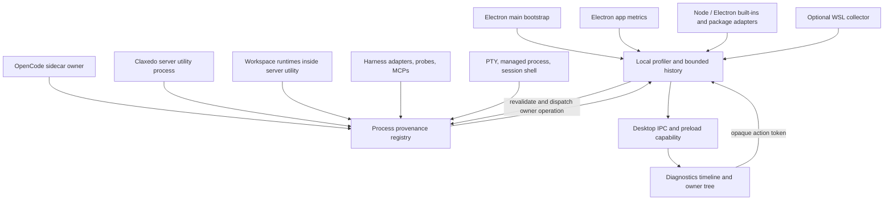
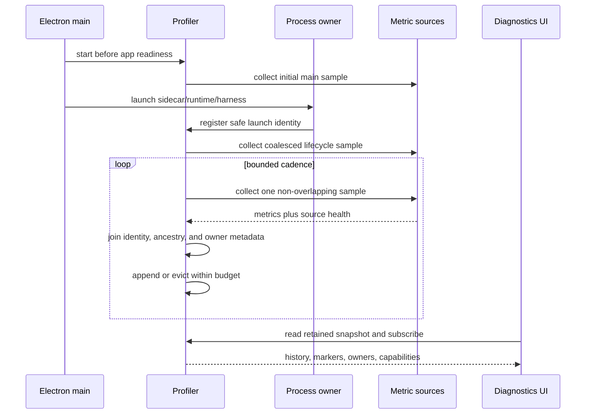
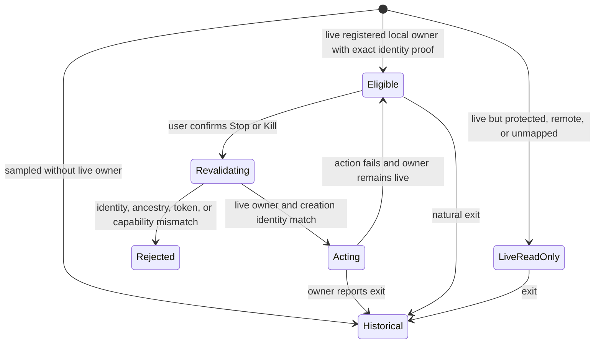
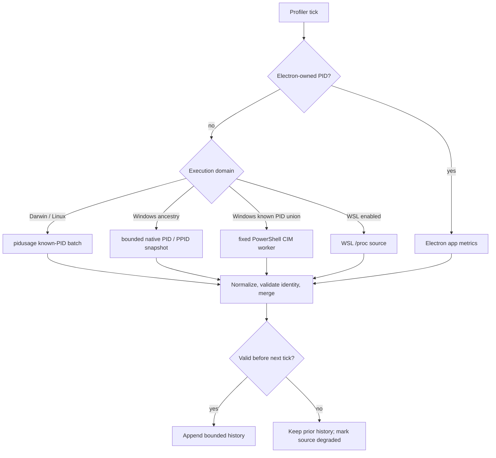
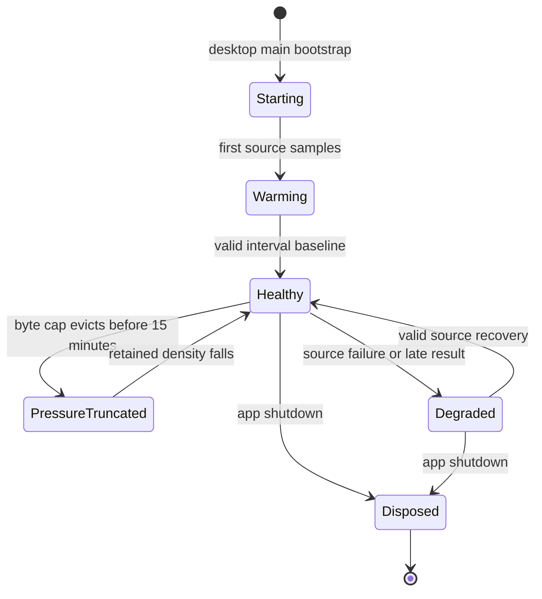
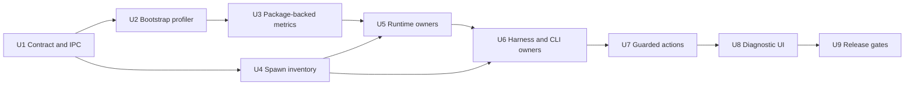

# feat: Add local performance diagnostics profiler

## Goal Capsule

- **Objective:** Replace the one-shot process snapshot with a desktop-local profiler that captures CPU and memory history from app startup and explains which Claxedo-owned process tree contributed to a spike.
- **Primary user:** A person running the Claxedo desktop app who sees unexpected CPU or memory growth and needs to identify the responsible app process, workspace, harness, terminal, MCP server, managed process, or spawned CLI.
- **Authority:** This plan governs the desktop Diagnostics surface, its local metrics/provenance model, and guarded local process actions. Existing process-management APIs remain authoritative for starting and stopping managed processes.
- **Execution profile:** Characterize the current spawn and action paths before replacing them. Land the shared contract and profiler core before wiring process owners or rebuilding the UI.
- **Stop conditions:** Stop release if a supported harness cannot be attributed without collecting secrets or if the enabled profiler exceeds the release overhead budget. Stop an owner’s mutation path—and keep it read-only—whenever its platform or process boundary cannot revalidate identity immediately before the operation.

---

## Product Contract

### Summary

Diagnostics is a local performance-analysis surface for the desktop app. A bounded in-memory profiler starts before Electron finishes initialization, retains the current app run, and correlates CPU and memory samples with safe lifecycle and ownership records. Opening the dialog shows the spike that already happened rather than beginning observation at that moment.

The surface covers Electron main, renderer, GPU, and utility processes; the dedicated Claxedo server utility process and its in-process workspace runtimes; the local OpenCode sidecar; PTYs and terminals; managed processes; session and tool shells; MCP servers; every registered agent harness; model/config probes; and descendants spawned by those roots. It reports process contribution, owner attribution, and timing without claiming source-code causality that OS metrics cannot prove.

Hosted control-plane processes, cloud VMs, user-hosted runtimes, relayed workspaces, and remote process mutation are outside this feature.

### Problem Frame

The current dialog calls `GET /api/wr/process/diagnostics` only after it mounts. That route runs `ps` and `lsof` once and returns a point-in-time workspace snapshot. CPU and memory spikes during desktop bootstrap, server/sidecar startup, renderer creation, harness initialization, or CLI bursts have ended before the first sample exists. The replacement quantifies processes that survive a valid sample window and separately reports sub-cadence process churn; it does not invent CPU/RSS values for children that exit before any platform can measure them.

The one-shot collector also has the wrong trust and product boundaries. It gathers process environments and raw commands, treats collector failure as empty healthy data, depends on Unix commands on Windows, and accepts PID-based termination without durable ownership proof. It is workspace/relay-shaped even though the product need is desktop-local and app-wide across workspaces.

The replacement must remain cheaper than the work it observes. It needs bounded cadence, retention, output size, and concurrent collection, plus explicit degraded states when a metric source is unavailable.

### Actors

- A1. **Desktop user:** Inspects resource history, selects a spike window, expands an owner tree, and may stop a verified Claxedo-owned local target.
- A2. **Desktop main process:** Owns sampling, retained history, process identity, IPC, action-token validation, and protected-process policy.
- A3. **Local process owner:** A sidecar, server utility process, runtime, harness adapter, PTY, managed-process manager, or session shell that registers safe identity and lifecycle metadata and may independently expose graceful-stop and kill-tree operations.

### Requirements

**Capture and retention**

- R1. Sampling begins during desktop main bootstrap before `app.whenReady()`, sidecar launch, Claxedo server utility-process startup, and renderer creation.
- R2. The profiler targets the latest 15 minutes of the current app run in memory, never exceeds the 20 MiB hard cap, and tells the user when pressure shortens the retained window. It never writes samples into a workspace checkout.
- R3. Startup uses a higher-resolution sampling tier, steady state uses a lower-cost tier, and lifecycle events request a coalesced immediate/burst sample within the source's supported window. Collection is completion-driven and never queues overlapping ticks.
- R4. Retention has a hard byte/sample ceiling, records late or dropped ticks, and evicts the oldest history before exceeding its budget.
- R5. The profiler resets on app restart and tells the user when the retained history began.

**Coverage and attribution**

- R6. Every sample uses stable process identity: PID plus process creation identity where the platform exposes it, and a Claxedo launch ID for registered roots. A platform that cannot revalidate an action-grade identity keeps the row observable but action-ineligible.
- R7. The profiler covers Electron main, each mapped renderer, GPU, the registered Claxedo server utility root and its in-process workspace runtimes, local sidecar, PTY, managed process, session/tool shell, MCP server, harness, probe, and observable descendant.
- R8. Harness coverage is derived from `AGENT_HARNESS_DEFINITIONS` and includes Claude, Codex, and Cursor in native and ACP modes, plus native OpenCode and Pi.
- R9. Descendants inherit the nearest recorded local root while ancestry remains observable. Detached or reparented descendants keep their last historical attribution but become ineligible for actions.
- R10. Attribution records workspace, directory, harness ID/access, session when known, logical role, lifecycle state, and safe display label without storing environment values, raw argv, prompts, credentials, MCP headers, or shell text.
- R11. Unmapped Electron and local child processes remain visible in explicit unmapped buckets. Executable names alone never establish action ownership.
- R12. The Claxedo server is a distinct Electron utility-process root with its own CPU/RSS series. Workspace runtimes embedded inside that server share its process metrics; redacted lifecycle markers correlate workspace activity without fabricating per-module CPU/RSS.
- R13. Windows Subsystem for Linux is treated as a local execution domain when enabled. Windows host and WSL metrics expose separate capability/health state.

**Analysis experience**

- R14. The dialog opens with retained total CPU and RSS timelines, collector status, current/peak totals, and the highest contributors for the retained or selected interval.
- R15. Selecting a time range recomputes contributor ranking by peak CPU, CPU share, peak RSS, and RSS change, and synchronizes the owner/process tree to that interval.
- R16. Lifecycle markers cover profiler start/degradation/recovery; Electron and server-utility appearance/exit; sidecar/runtime readiness/exit; harness, probe, MCP, PTY, managed-process, and shell launch/exit; coalesced process-churn summaries for sub-cadence children; and user-requested actions.
- R17. The UI distinguishes warming up, healthy, degraded, failed, no owned activity, historical exit, and unsupported metric states. Missing data is never rendered as zero or "All healthy."
- R18. The UI describes temporal contribution rather than asserting a root cause. A user can inspect any contributor even when it does not cross an automatic threshold.
- R19. Timelines have equivalent textual summaries/tables, selection controls expose keyboard values and bounds, routine sample ticks do not spam live regions, and desktop actions/expand controls are keyboard-visible, named, stateful, and covered by accessible-role tests.

**Guarded local actions**

- R20. Stop and Kill appear only for a current local owner with a registered owner API and a freshly verifiable identity. Electron main, renderer, GPU, Claxedo server utility process and its in-process runtimes, unknown, external, historical, remote, and identity-mismatched rows are read-only.
- R21. The profiler issues short-lived opaque action tokens bound to launch ID, PID/PGID where applicable, creation identity, owner kind, and profiler generation; the main process resolves and revalidates the token immediately before action.
- R22. Stop invokes the owner-level graceful operation. Kill is an explicit escalation. Electron main owns the native confirmation dialog for both actions and revalidates after confirmation; neither action accepts a renderer-supplied PID or process group.
- R23. The initial profiler has no Clean all, Kill stale, or other bulk mutation. A completed action records an outcome marker and refreshes from live state.
- R24. Agent and automation surfaces receive no process-mutation capability from this feature.

**Platform and privacy**

- R25. The feature is available only through the desktop platform capability and IPC. It does not use workspace relay, the hosted control plane, or a cloud/runtime diagnostics route.
- R26. Darwin, Linux, Windows, and WSL sources expose one normalized metric contract plus per-source capabilities, errors, last-success timestamps, warm-up state, and native accuracy evidence.
- R27. Resource adapters retain resource metrics only for registered roots and reconciled descendants. An ancestry source may enumerate PID/PPID plus executable basename for the host and immediately filters to registered trees before retention or IPC. The Windows native snapshot runs with both memory and command-line flags disabled; a fixed noninteractive CIM worker queries only the resulting owned PID union for creation time, cumulative CPU time, and 64-bit working-set bytes. Every source allows at most one request in flight and discards late results; direct Claxedo identity probes use bounded output and hard deadlines. No source requests process environments or command lines.
- R28. No diagnostic response, retained sample, marker, log, or test fixture contains environment values, raw command arguments, auth material, prompt content, or full process configuration.
- R29. A custom or remote server connection leaves local Electron diagnostics available while clearly marking remote runtime processes as excluded and action-ineligible.

**Performance and release quality**

- R30. Steady-state profiling stays within a 1 percentage-point average CPU budget and a 20 MiB retained-memory budget on the release reference machines.
- R31. Enabling the profiler does not move any existing real-app performance-harness flow past its stored p95/worst-frame gate.
- R32. Blocking packaged macOS, Windows, and Linux smokes prove startup history, platform degradation, one known spawned CLI/harness attribution, sub-cadence churn disclosure, and task-level diagnostic success before production release.

### Key Flows

- F1. **Inspect a startup spike**
  - **Trigger:** The user opens Diagnostics after noticing CPU or memory growth during app launch.
  - **Actors:** A1, A2.
  - **Steps:** The dialog loads retained startup history, the user selects a peak, and the ranked contributors/tree update to the selected interval.
  - **Outcome:** The user sees which local process trees contributed and which initialization markers overlapped the peak.
  - **Covered by:** R1-R7, R14-R18.

- F2. **Inspect a harness or CLI subtree**
  - **Trigger:** A Claude, Codex, Cursor, OpenCode, or Pi turn/probe launches local work.
  - **Actors:** A1, A2, A3.
  - **Steps:** The owner registers a launch identity, descendants inherit it, samples accumulate, and the user expands the harness/session tree.
  - **Outcome:** Measured CPU/RSS contribution is attributed to the correct harness, workspace, session, and descendant roles; sub-cadence work retains attributed churn evidence and an explicit unmeasured state.
  - **Covered by:** R6-R13, R16.

- F3. **Handle incomplete metrics honestly**
  - **Trigger:** An OS collector times out, Electron omits a platform-specific memory field, or WSL is unavailable.
  - **Actors:** A1, A2.
  - **Steps:** The source records a typed failure, successful sources continue, and the UI labels only the affected metrics unavailable.
  - **Outcome:** Existing history remains useful without false zeroes, false healthy state, or destructive recommendations.
  - **Covered by:** R17, R26-R29.

- F4. **Stop a verified local owner**
  - **Trigger:** The user selects Stop or Kill on an eligible current owner.
  - **Actors:** A1, A2, A3.
  - **Steps:** The UI submits an opaque token, main revalidates live identity and ancestry, the owner operation runs, and the profiler records the outcome.
  - **Outcome:** The intended Claxedo-owned target stops, or the action fails closed with a specific stale/ownership/platform reason.
  - **Covered by:** R20-R24.

- F5. **Use Diagnostics while connected to a remote server**
  - **Trigger:** The desktop app uses a custom or remote server URL.
  - **Actors:** A1, A2.
  - **Steps:** The local profiler continues showing Electron-owned processes and identifies the runtime connection as excluded.
  - **Outcome:** The user gets truthful local app data and cannot inspect or mutate remote runtime processes.
  - **Covered by:** R25, R29.

### Acceptance Examples

- AE1. Given the app consumes CPU before the main window is created, when Diagnostics opens two minutes later, then the startup interval and its top Electron/server-utility/sidecar contributors are present.
- AE2. Given a Codex ACP harness and its tool descendant create a spike, when the user selects that interval, then both rows appear under the Codex ACP owner with the correct workspace/session ancestry.
- AE3. Given a renderer exits and its PID is later reused, when retained history is rendered, then the two creation identities remain separate and the historical renderer has no action.
- AE4. Given Darwin `ps`, `/proc`, the Windows native process-tree source, or WSL collection is unavailable, when Diagnostics opens, then the affected source is degraded with a last-success time and no healthy/stale inference is made from missing data.
- AE5. Given an action token points to a process whose creation identity changed, when Stop is confirmed, then the action is rejected and no signal is sent.
- AE6. Given a process has no registered Claxedo owner, when it contributes to the sampled app tree, then it is visible as unmapped/read-only and no Kill control is present.
- AE7. Given a harness environment and argv contain sentinel secrets, when history, markers, logs, and the rendered dialog are inspected, then none of the sentinel values appear.
- AE8. Given the desktop uses a remote server, when Diagnostics opens, then local Electron metrics are visible, remote runtime coverage is explicitly excluded, and no runtime mutation is offered.
- AE9. Given WSL is enabled and the sidecar launches inside WSL, when a Linux child spikes, then the WSL source reports its contribution and capability state separately from Windows host processes.
- AE10. Given a burst of children start and exit before a valid resource sample, when the user selects the interval, then Diagnostics attributes the launch/exit churn to the owner, labels resource contribution unmeasured, and does not display zero CPU/RSS.
- AE11. Given the Claxedo server utility process spikes while a workspace runtime is active, when the user selects the interval, then the server has its own CPU/RSS series and the workspace lifecycle markers are shown as correlation rather than fabricated resource splits.

### Scope Boundaries

**In scope**

- One app-run, in-memory CPU/RSS history and process ownership for the desktop application.
- All local Claxedo-spawned roots, harnesses, probes, MCPs, CLIs, PTYs, managed processes, session/tool shells, and observable descendants.
- Guarded human-operated Stop/Kill through verified owner APIs.
- Darwin, Linux, Windows, and WSL capability-aware collection.

**Deferred to follow-up work**

- A redacted export bundle for support tickets.
- Optional user-configurable cadence or retention after default overhead is measured.
- Read-only agent access to profiler summaries.
- Deeper in-process spans or heap profiles for separating workspace-runtime modules within the Claxedo server utility process.

**Out of scope**

- Hosted control-plane diagnostics, cloud VM inspection, workspace-relay diagnostics, remote process collection, or remote termination.
- Durable telemetry upload, cross-run history, background analytics, or workspace-local diagnostic files.
- Agent-initiated Stop/Kill.
- Arbitrary host process management or cleanup recommendations based only on command/executable matching.

---

## Planning Contract

### Key Technical Decisions

- KTD1. **Electron main owns the profiler.** It is the earliest stable local process, sees Electron metrics, owns the desktop IPC boundary, and can register the OpenCode sidecar before the renderer exists.
- KTD2. **Diagnostics moves from workspace HTTP to desktop IPC.** The local profiler is exposed as a desktop platform capability; `createProcessClient()` and workspace-relay routing no longer carry diagnostics reads or mutations.
- KTD3. **Ownership is registered at spawn seams.** A neutral process-observer contract receives safe launch/lifecycle records from desktop sidecar launch, workspace-runtime PTY/process/session-shell owners, and every agent adapter. Descendant discovery enriches explicit roots; it does not replace registration.
- KTD4. **One canonical feature schema crosses IPC.** The Processes data layer owns the validated local-diagnostics DTO, and desktop main/preload/renderer plus UI consume that contract rather than duplicating structural types.
- KTD5. **Identity is launch ID plus platform creation identity.** PID and PGID are transient lookup fields. History keys and action tokens never use PID alone.
- KTD6. **Owner operations replace raw signals.** Verified current local owners may expose Stop and explicit Kill through their registered lifecycle API: managed processes stop through `ProcessManager`, PTYs through their owning runtime, harnesses through adapter lifecycle, and the sidecar through the desktop kill-tree owner. Arbitrary PID/group mutation and bulk cleanup remain outside the capability.
- KTD7. **Sampling is adaptive, completion-driven, and bounded.** Main/Electron metrics sample every 500 ms for the first 120 seconds, then every 2 seconds. Darwin/Linux and Windows external metrics target one second during startup and two seconds afterward, subject to completion and platform overhead gates. Lifecycle events request a coalesced immediate sample and a short bounded burst; no source overlaps itself. The window targets 15 minutes with a 20 MiB hard ceiling.
- KTD8. **Trusted userland packages provide observations behind a constrained adapter.** Node/Electron built-ins cover app-owned processes; exact `pidusage@4.0.1` and `pidtree@1.0.0` cover known external PIDs and ancestry on Darwin/Linux. Exact `@vscode/windows-process-tree@0.8.0` supplies only a bounded Windows PID/PPID ancestry snapshot with memory and command-line flags disabled. A fixed, long-lived, noninteractive Windows PowerShell CIM worker queries only the known owned PID union for `CreationDate`, `KernelModeTime`, `UserModeTime`, and 64-bit `WorkingSetSize`; Claxedo computes CPU deltas itself. The selected packages have strong adoption, established maintainers, bounded integration surfaces, compatible licenses, and an audited dependency closure. They remain isolated behind the source contract and cannot authorize actions without independently revalidated creation identity.
- KTD9. **The UI ranks contribution, not causality.** Peak machine CPU share, owned CPU share, peak RSS, and RSS change are computed for a selected interval. Lifecycle markers add context, while in-process workspace work, sub-cadence churn, and unmapped children stay honestly labeled.
- KTD10. **Mutation remains human-only.** The product keeps guarded Stop/Kill as directed, while agent parity is limited to future read-only diagnostics context.
- KTD11. **Action support fails closed by identity capability.** Registered Linux external owners can qualify through `/proc` start ticks and Windows owners through freshly revalidated CIM `CreationDate`; Electron roots remain protected. Darwin external owners ship read-only until an exact creation-identity probe is implemented and passes packaged PID-reuse/revalidation gates. Read-only diagnostic coverage is not withheld because an OS cannot meet the mutation proof.

### High-Level Technical Design

#### Component and data flow

#### Sampling and attribution sequence

#### Action eligibility lifecycle

#### Platform source selection and degradation

#### History lifecycle

#### Implementation dependency graph

### Metric Source Matrix

| Source | Primary data | Identity | Platform behavior |
|---|---|---|---|
| Main process | `process.cpuUsage()`, `process.memoryUsage()` | main launch identity | Available before Electron readiness |
| Electron app metrics | CPU, process type, PID, creation time, supported memory fields | PID plus Electron creation time and mapped `webContents` | Memory fields vary by platform; never substitute zero |
| Claxedo server utility | Electron CPU/type/creation time plus field-level RSS fallback; redacted child lifecycle messages | Electron creation time plus registered utility launch ID | Separate process root; workspace runtimes inside it share this CPU/RSS series |
| Darwin external source | `pidusage` CPU/RSS for known PIDs; `pidtree` PID/PPID reconciliation | launch ID plus minimal start-identity probe | `pidusage` batches safe `ps` fields; `pidtree` reconciliation runs on lifecycle changes and a slow recovery cadence |
| Linux external source | `pidusage` CPU/RSS for known PIDs; `pidtree` PID/PPID reconciliation | launch ID plus `/proc/<pid>/stat` start ticks | The identity probe never reads `environ` or `cmdline`; `pidusage` uses `/proc` by default |
| Windows external source | One native PID/PPID snapshot with data flags disabled; one persistent CIM query over the known owned PID union for creation time, cumulative CPU, and 64-bit RSS | launch ID plus CIM `CreationDate`, freshly revalidated before action | A 1,024-row native snapshot is marked truncated/degraded and cannot establish complete ancestry; CIM failure degrades known-PID metrics without invoking WMIC or broad host queries |
| WSL collector | Linux `/proc` metrics inside the active distribution | WSL process start identity plus registered WSL root | Runs only when WSL execution is enabled |

### Canonical Metric Semantics

- Sample timestamps use the main process monotonic clock for interval ordering; wall-clock timestamps are display metadata only.
- CPU time is normalized to microseconds when a source exposes cumulative time. The displayed process CPU is machine share from 0-100: Electron already divides by logical processor count; Windows CIM and main-process cumulative deltas plus `pidusage` per-core values are divided by elapsed monotonic time and logical processor count. Raw core-equivalent CPU may be retained only as debug evidence.
- RSS is bytes. Source precedence is field-specific: Electron owns process identity, type, creation time, and every metric it supplies; a platform adapter may fill an unavailable field for the same stable identity. Aggregation emits one process row and counts each metric once.
- The first external sample is warm-up unless the native source supplies a trustworthy cumulative baseline. PID reuse or identity change discards the first delta for the new identity.
- "Current" is the latest valid sample at or before the interval end; peaks are the maximum valid values inside the interval; RSS change is the last valid RSS minus the first valid RSS inside the interval. A missing endpoint makes RSS change incomplete.
- Owned CPU share is an owner's valid CPU-time delta divided by valid total owned CPU-time delta in the same interval. Missing spans, source gaps, counter resets, and exited-before-sample owners remain explicitly incomplete.
- Short-lived owners always leave launch/exit markers and contribute to a coalesced churn count/duration series. They receive CPU/RSS contribution only when at least one valid native sample or exit-accounting record exists; lifecycle evidence is never converted into a zero-resource claim.

### Dependency Selection

Evidence was checked on 2026-07-24 against npm registry metadata, published tarballs, current upstream repositories, and the exact production dependency graph.

| Candidate | Trust and adoption evidence | Product fit | Decision |
|---|---|---|---|
| `pidusage@4.0.1` | MIT; one small dependency; no lifecycle scripts or native code; 16,103,369 npm downloads in the prior 30 days; exact version used by PM2; current graph has no npm audit finding | Batches known-PID CPU/RSS without env or argv; macOS/Linux behavior fits the least-data boundary; its Windows implementation still depends on WMIC | Adopt for Darwin/Linux only, exact-pinned |
| `pidtree@1.0.0` | MIT; zero dependencies; no lifecycle scripts; npm provenance/signature; 84,725,189 downloads in the prior 30 days; current release is ESM/Node 18+ and has Windows CI | Small ancestry primitive, but it enumerates PID/PPID for the host and cannot prove ownership or action identity | Adopt for lifecycle/slow reconciliation, exact-pinned; filter immediately to registered roots |
| `@vscode/windows-process-tree@0.8.0` | Microsoft-published MIT package; exact current dependency of VS Code; 374,139 downloads in the prior 30 days; current graph has no npm audit finding | Native ancestry avoids removed WMIC, but snapshots stop at 1,024 rows; its CPU call forces a one-second sleep, its memory field narrows `WorkingSetSize` to 32 bits, and it does not expose creation time | Adopt only for PID/PPID ancestry with data flags disabled after Electron 40 rebuild, signing, asar, truncation, and architecture gates pass; do not use its CPU or memory APIs |
| `systeminformation@5.33.1` | Active MIT project, zero dependencies, 41,440,620 monthly downloads, and no current-version audit finding | `processes()` scans and returns broad host metadata including command, params, and path; substantially larger privacy/attack surface than needed | Do not ship for this feature |
| `pidusage-tree@2.0.5` | Low current maintenance and stale dependency majors | Adds no capability over the accepted packages | Reject |
| `electron-process-manager@1.2.0` | Low adoption; README documents missing memory support on modern Electron | Does not meet Electron 40 requirements | Reject |
| `clinic@13.0.0` | Official repository says it is not actively maintained and results may be inaccurate | Large profiling toolchain suited to explicit developer sessions, not always-on end-user diagnosis | Reject; use Electron/Node on-demand built-ins in a later scoped feature |

The accepted packages are implementation details of `ProcessMetricsSource`. They cannot authorize Stop/Kill, label owners, preserve WSL identity, or cross IPC directly. Exact versions and integrity remain locked in `bun.lock`; notices and current advisories are rechecked at dependency updates.

This is the smallest userland package set that satisfies the live-process boundary without inheriting known-invalid metrics. Electron/Node built-ins alone do not cover external descendants; a broad monolithic package would collect substantially more host metadata; a developer profiler such as Clinic is too heavy for always-on end-user diagnosis. The accepted packages supply Darwin/Linux known-PID CPU/RSS and cross-platform ancestry primitives. Windows known-PID metrics use the OS-provided CIM surface because the reviewed npm options either depend on removed WMIC or expose unsafe RSS semantics. Claxedo still owns startup retention, lifecycle correlation, short-lived churn disclosure, privacy filtering, and safe identity because no reviewed package provides those product guarantees.

### Assumptions

- The 500 ms startup and 2 second steady tiers are initial defaults; R30-R32 are the release authority if a platform needs a lower-cost cadence.
- "All descendants" means every process reachable from a registered root through observable ancestry at sample time. Detached/reparented processes keep historical attribution and become read-only.
- Opening the dialog does not start a second sampler or materially increase cadence.
- The profiler is process-level. It does not claim to divide Electron main CPU/RSS among embedded TypeScript modules.
- Existing process owners can expose `stopGracefully` and `killOwnedTree` independently without exposing their private process handles to the renderer. Stop never implicitly escalates to Kill.
- Product Contract preservation: direct planning bootstrap; the confirmed local-only and guarded-action scope is unchanged.

### Sequencing

1. Establish the canonical DTO, bounded history semantics, capability states, and platform seam.
2. Start the profiler at desktop bootstrap and prove history exists before the window opens.
3. Integrate the package-backed platform adapter and source-health behavior, then prove one startup-to-dialog vertical slice before broad instrumentation.
4. Complete the production spawn-seam inventory and make it a checked artifact.
5. Register all process owners and harnesses against one provenance contract.
6. Replace raw mutation with action tokens and retire workspace diagnostics HTTP.
7. Rebuild the UI on retained history and owner operations.
8. Run dependency, real-app overhead, and packaged cross-platform release gates before removing the implementation flag.

---

## Implementation Units

### U1. Define the local diagnostics contract and desktop capability

**Goal:** Establish one validated DTO for retained samples, owners, lifecycle markers, collector capabilities, interval summaries, and opaque action requests.

**Requirements:** R2-R6, R10-R19, R21, R25-R29.

**Flows and acceptance:** F1-F5; AE3-AE8.

**Dependencies:** None.

**Files:**

- Create `packages/claxedo-app/src/features/processes/data/local-diagnostics.ts`.
- Create `packages/claxedo-app/src/features/processes/data/local-diagnostics.test.ts`.
- Modify `packages/claxedo-app/src/features/processes/data/index.ts`.
- Modify `packages/claxedo-app/package.json`.
- Modify `packages/claxedo-app/src/platform/runtime/platform-provider.tsx`.
- Modify `packages/claxedo-desktop/src/preload/types.ts`.
- Modify `packages/claxedo-desktop/src/renderer/index.tsx`.

**Approach:**

1. Define safe schemas for process identity, owner identity, metric point, source capability/health, lifecycle marker, retained snapshot, selected-interval summary, action token, and action result.
2. Make unavailable metrics optional with explicit reason/capability rather than numeric zero.
3. Represent logical owners separately from OS processes so multiple descendants aggregate without losing the process tree.
4. Add an optional desktop platform capability for snapshot read, live subscription, Stop, and Kill. Web/demo/cloud platforms do not implement it.
5. Export the schema through an explicit `@claxedo/app/process-diagnostics-contract` package subpath containing data-only runtime code. Desktop main, preload, renderer, and UI consume that path without importing browser code or creating a second contract.
6. Bind IPC requests to the exact main-frame `WebContents` and its current navigation generation. Accept only the packaged app origin or the configured development app origin, reject subframes and DevTools, permit at most one subscription per generation, and revoke subscriptions on navigation, render-process termination, or `WebContents` destruction.

**Patterns to follow:** Processes feature ownership in `packages/claxedo-app/src/features/processes/AGENTS.md`; validated data-client schemas in `packages/claxedo-app/src/features/processes/data/process.ts`; optional desktop capabilities in `packages/claxedo-app/src/platform/runtime/platform-provider.tsx`.

**Test scenarios:**

1. A complete retained snapshot with mixed Electron, harness, PTY, and WSL owners parses and preserves stable identities.
2. A degraded source omits an unavailable metric and carries a typed reason plus last-success time.
3. A payload containing environment, argv, command, prompt, header, or config fields is rejected or stripped by the public schema.
4. PID reuse is representable as two identities with the same PID and different creation identities.
5. Action requests accept only opaque tokens and action kind; raw PID, PGID, signal, or workspace-relay target fields fail validation.
6. A web platform without the capability has no diagnostics entry point.

**Verification:** Main, preload, renderer, and Processes UI compile against one contract, and contract tests demonstrate privacy and identity invariants.

### U2. Start a bounded profiler during desktop bootstrap

**Goal:** Capture main/Electron history before app readiness and retain it under fixed cadence and memory limits.

**Requirements:** R1-R5, R12, R14, R16-R18, R30.

**Flows and acceptance:** F1, F3; AE1, AE3, AE4.

**Dependencies:** U1.

**Files:**

- Create `packages/claxedo-desktop/src/main/diagnostics/profiler.ts`.
- Create `packages/claxedo-desktop/src/main/diagnostics/profiler.test.ts`.
- Create `packages/claxedo-desktop/src/main/diagnostics/electron-source.ts`.
- Create `packages/claxedo-desktop/src/main/diagnostics/electron-source.test.ts`.
- Modify `packages/claxedo-desktop/src/main/index.ts`.
- Modify `packages/claxedo-desktop/src/main/windows.ts`.

**Approach:**

1. Construct the profiler before `setupApp()` and record an immediate main-process sample.
2. Add Electron app metrics after readiness; map BrowserWindow/webContents identities and lifecycle to renderer rows while retaining unmapped GPU/utility/renderer buckets.
3. Store samples and lifecycle markers in a compact ring with time and byte caps. Keep one collection in flight and record late/dropped ticks instead of queueing.
4. Implement the startup/steady cadence from KTD7 and a coalesced event-triggered sample path.
5. Record collector start, renderer appearance/exit/recreation, sidecar/server phases, degradation, recovery, and app shutdown.
6. Expose pure interval aggregation for total/owner current, peak, CPU share, peak RSS, and RSS change.
7. Treat the Claxedo server returned by `utilityProcess.fork()` as its own Electron utility-process root. Register it immediately from the owner-held `UtilityProcess`, retain its launch/exit markers, and present its CPU/RSS separately from Electron main; workspace runtimes executing inside that utility process correlate lifecycle markers with the shared server series rather than receiving fabricated process metrics.
8. Merge observations field by field. Electron remains authoritative for its process type, creation time, CPU, and memory fields that it exposes; platform sources may fill only unavailable fields. A PID observed by both sources produces one identity and one metric contribution.

**Execution note:** Start with deterministic fake-clock characterization of startup ordering and budget eviction before connecting Electron APIs.

**Patterns to follow:** Deferred initialization in `packages/claxedo-desktop/src/main/index.ts`; injectable clocks and pure sampling math in `packages/claxedo-app/perf-harness/src/frame-sampler.ts`; bounded in-memory browser console buffers in `packages/claxedo-desktop/src/main/browser/console-buffer.ts`.

**Test scenarios:**

1. Main samples exist before readiness, sidecar launch, and renderer creation markers.
2. A renderer appearing after readiness gets its own creation identity and mapped window label.
3. Renderer exit followed by PID reuse creates a new series rather than appending to history.
4. A slow collection increments dropped/late ticks and never overlaps another tick.
5. The 20 MiB hard cap evicts oldest data while targeting a 15-minute window, and the snapshot reports the actual retained start plus pressure truncation.
6. Startup cadence transitions to steady cadence at the configured boundary.
7. A source exception produces degraded health and recovery without ending the sampler.
8. Interval aggregation does not double-count Electron main or descendants.
9. Disposal cancels timers/subscriptions and no sample arrives after shutdown.

**Verification:** A unit test opening the logical dialog after a simulated startup spike receives the earlier samples and correct contributor ranking.

### U3. Integrate trusted userland process metrics and minimal platform identity

**Goal:** Collect external process-tree CPU/RSS on every supported local platform, with action-grade identity only where exact revalidation is proven, while keeping OS-specific code and collected metadata minimal.

**Requirements:** R6-R7, R9-R13, R17, R26-R30.

**Flows and acceptance:** F1, F3, F5; AE3, AE4, AE7-AE9.

**Dependencies:** U2.

**Files:**

- Modify `package.json`.
- Modify `packages/claxedo-desktop/package.json`.
- Modify `bun.lock`.
- Modify `packages/claxedo-desktop/electron-builder.config.ts`.
- Create `packages/claxedo-desktop/src/main/diagnostics/process-metrics-source.ts`.
- Create `packages/claxedo-desktop/src/main/diagnostics/process-metrics-source.test.ts`.
- Create `packages/claxedo-desktop/src/main/diagnostics/process-metrics-worker.ts`.
- Create `packages/claxedo-desktop/src/main/diagnostics/process-metrics-worker.test.ts`.
- Create `packages/claxedo-desktop/src/main/diagnostics/windows-cim-worker.ps1`.
- Create `packages/claxedo-desktop/src/main/diagnostics/process-identity.ts`.
- Create `packages/claxedo-desktop/src/main/diagnostics/process-identity.test.ts`.
- Create `packages/claxedo-desktop/src/main/diagnostics/wsl-source.ts`.
- Create `packages/claxedo-desktop/src/main/diagnostics/wsl-source.test.ts`.

**Approach:**

1. Add exact runtime dependencies `pidusage@4.0.1` and `pidtree@1.0.0`, plus exact optional dependency `@vscode/windows-process-tree@0.8.0` loaded only on Windows. Explicitly add the native addon to the root Bun `trustedDependencies` allowlist. A missing optional addon is a typed Windows-ancestry failure, never a startup crash. Keep every import behind `ProcessMetricsSource` so dependency replacement does not change profiler, provenance, IPC, or UI contracts.
2. Prefer `app.getAppMetrics()` for Electron PIDs. On Darwin/Linux, batch only registered/reconciled external PIDs through `pidusage`; use `pidtree` at bootstrap, on coalesced lifecycle changes, after source recovery, and on a slow reconciliation cadence rather than every sampling tick.
3. Execute command-backed Darwin/Linux collection in a dedicated worker with a fixed system executable search path, a non-workspace current directory, a minimal environment, bounded input cardinality, and typed output validation. Resolve only known system `ps` locations; ambient workspace `PATH`, shell aliases, and project-local binaries never influence diagnostics.
4. On Windows, run one `getAllProcesses(..., ProcessDataFlag.None)` snapshot per reconciliation cycle, derive the descendant closure for every registered root, discard non-owned rows immediately, and mark discovery truncated when the snapshot reaches 1,024 rows. Never call the addon's CPU API or enable its memory/command-line flags.
5. Start one protected diagnostics-owned Windows PowerShell process from the absolute `System32\WindowsPowerShell\v1.0\powershell.exe` path with `-NoProfile`, `-NonInteractive`, and an `-EncodedCommand` produced at build time from the reviewed fixed worker script; do not add an execution-policy bypass. Use a non-workspace cwd and minimal environment. The script reads bounded integer PID batches over line-delimited JSON and issues one property-limited `Get-CimInstance Win32_Process` query containing only those PIDs. It returns PID, parent PID, UTC creation ticks, kernel/user time, and 64-bit working-set bytes as decimal strings. Validate and convert with `BigInt`, cap input/output, restart with backoff after failure, and never interpolate renderer or workspace text into script/query syntax.
6. Compute Windows CPU from successive CIM kernel/user deltas, main monotonic elapsed time, and logical processor count. A first sample, counter regression, changed creation ticks, partial query, or invalid 64-bit value is incomplete rather than zero. Reconciliation may be slower than known-PID CIM sampling; a saturated native snapshot degrades discovery while already-known PIDs continue to sample.
7. Normalize outputs using Canonical Metric Semantics, merge Electron/platform observations field by field, discard the first delta after warm-up or PID reuse, bound `pidusage` history age, and call `pidusage.clear()` on profiler disposal.
8. Keep action identity independent of ancestry/package metrics. Owner-held handles and launch IDs establish provenance but do not by themselves defeat PID reuse. Linux start ticks, Electron creation time, and Windows CIM creation ticks are action-grade only when freshly revalidated. Darwin owners remain read-only until an equally exact probe ships. Executable names and the Microsoft addon's observational rows never authorize actions.
9. Keep WSL sampling separate from Windows host sampling. Register a WSL-side root handshake and read only PID/PPID, start ticks, CPU time, and RSS from its enabled distribution; never conflate `wsl.exe` with Linux descendants.
10. Limit each source to one in-flight call, bounded registered-root cardinality, late-result discard, and typed degradation. Because the packages and CIM query do not expose reliable cancellation, the overhead gate—not a fictional Promise timeout—is the release authority for an internally late call.
11. Ensure electron-builder rebuilds the Windows N-API addon for Electron 40, unpacks it from asar where required, signs it, and excludes it from non-Windows artifacts. A packaged native import plus fixed-path CIM real-sample smoke is required; source/unit success is insufficient.
12. Prove a vertical slice immediately: desktop bootstrap retains a real child spike, the dialog reads it after the spike, and duplicate Electron/platform PIDs are not double-counted.

**Patterns to follow:** Electron-builder native dependency handling already used for `better-sqlite3` and `node-pty`; bounded identity invocation in `packages/workspace-runtime/src/git.ts`; WSL invocation/path patterns in `packages/claxedo-desktop/src/main/apps.ts`; platform switches in `packages/claxedo-desktop/src/main/cli.ts`.

**Test scenarios:**

1. Darwin/Linux batch sampling reports package CPU/RSS units correctly, performs warm-up, and never retains environment, argv, command, or raw package errors.
2. Lifecycle reconciliation attributes a descendant created between ordinary ticks; a slow or failed `pidtree` call degrades reconciliation without stopping direct-root sampling.
3. Linux start ticks and Darwin identity distinguish PID reuse and discard the reused PID's first CPU delta.
4. Windows fixture tests map one bounded data-flag-free ancestry snapshot plus one known-PID CIM response into the canonical contract, detect the 1,024-row truncation boundary, validate 64-bit decimal parsing beyond 4 GiB, and mark negative process-group signaling unsupported.
5. A packaged Windows 11 x64 app loads the rebuilt ancestry addon, launches only the absolute fixed Windows PowerShell binary, samples a real child tree, distinguishes 0%, one-core, and multicore CPU fixtures within tolerance after machine-share normalization, reports RSS including a synthetic greater-than-4-GiB protocol fixture without wrap, and revalidates creation ticks.
6. The release matrix explicitly resolves Windows ARM64 support: either a passing native artifact smoke or a documented unsupported desktop architecture before release.
7. WSL disabled is not-applicable; enabled WSL proves the Linux root handshake; WSL command failure degrades only WSL data.
8. A duplicate Electron PID uses Electron identity/metrics precedence and is counted once.
9. A sentinel secret in environment/argv never appears in output, retained samples, typed errors, or logs.
10. Disposal clears package history and ignores every late callback/result.
11. A worker fixture with a malicious workspace-local `ps` and modified ambient `PATH` still invokes the allowlisted system executable and emits no secret-bearing environment.
12. Darwin owners without exact creation-identity revalidation remain visible but receive no action token; Windows creation-tick mismatch also fails closed.
13. A malicious ambient `PATH`, PowerShell profile, workspace script, PID text, or oversized worker response cannot change the fixed executable/script/query shape or enter retained output.
14. The addon's CPU and memory entry points are never called, and its ancestry rows are filtered before source output, history, error, log, or IPC construction.

**Verification:** Exact dependency audit, fixture tests, one startup-to-dialog vertical slice, and packaged native smokes all pass before owner instrumentation expands.

### U4. Inventory and classify every production spawn seam

**Goal:** Turn “all CLIs and harnesses” into a checked, exhaustive ownership matrix before instrumentation.

**Requirements:** R7-R13, R16, R20, R28-R29.

**Flows and acceptance:** F1, F2, F5; AE2, AE6-AE9.

**Dependencies:** U1.

**Files:**

- Create `packages/claxedo-desktop/src/main/diagnostics/spawn-inventory.ts`.
- Create `packages/claxedo-desktop/src/main/diagnostics/spawn-inventory.test.ts`.
- Create `packages/agent-sdk-runtime/src/harness-types.test.ts`.
- Modify architecture checks covering `packages/claxedo-desktop`, `packages/claxedo-server`, `packages/workspace-runtime`, and `packages/agent-sdk-runtime`.

**Approach:**

1. Enumerate production `spawn`, `exec`, `execFile`, PTY, SDK custom-spawn, sidecar, LSP/tool, MCP stdio, probe, app-server, and managed-process seams across the four product packages.
2. Classify each seam as registered root, registered descendant, in-process contribution, remote/excluded, or non-production test/build tooling. Record logical owner, safe stop capability, kill capability, session/workspace linkage, and expected observation source.
3. Generate the harness portion from `AGENT_HARNESS_DEFINITIONS`; require explicit native/ACP/probe/MCP/CLI rows for Claude, Codex, Cursor, OpenCode, and Pi.
4. Fail the inventory test when a production process seam or harness definition has no classification. Keep a narrow reviewed allowlist for generated/vendor/build-only matches.
5. Use the inventory as the completion checklist for U5-U6 and the packaged known-CLI fixture in U9.

**Test scenarios:**

1. Every current production process creation callsite maps to exactly one classification and owner boundary.
2. Adding a harness catalog entry or production spawn seam without inventory metadata fails.
3. Remote/cloud/control-plane seams are classified excluded and cannot obtain the desktop observer.
4. Test, packaging, and code-generation subprocesses do not become runtime coverage obligations.
5. Every classified actionable owner declares graceful-stop and kill-tree support independently.

**Verification:** Repository search and the checked inventory agree, and U5-U6 have no unlisted process family.

### U5. Register sidecar, runtime, PTY, managed-process, and shell ownership

**Goal:** Attach stable local ownership and owner-level actions to every non-harness process root Claxedo launches.

**Requirements:** R6-R13, R16, R20-R24, R28-R29.

**Flows and acceptance:** F1, F2, F4, F5; AE1-AE3, AE5, AE6, AE8.

**Dependencies:** U1-U4.

**Files:**

- Create `packages/workspace-runtime/src/managed-processes/process-observer.ts`.
- Create `packages/workspace-runtime/src/managed-processes/process-observer.test.ts`.
- Modify `packages/workspace-runtime/src/workspace/runtime.ts`.
- Modify `packages/workspace-runtime/src/pty/index.ts`.
- Modify `packages/workspace-runtime/src/routes/session-env.ts`.
- Modify `packages/workspace-runtime/src/managed-processes/manager.ts`.
- Modify focused tests beside each workspace-runtime owner.
- Modify `packages/claxedo-server/src/server.ts`.
- Modify `packages/claxedo-server/src/public-api.d.ts`.
- Create `packages/claxedo-desktop/src/shared/diagnostics-transport.ts`.
- Create `packages/claxedo-desktop/src/shared/diagnostics-transport.test.ts`.
- Modify `packages/claxedo-desktop/scripts/claxedo-server-entry.ts`.
- Modify `packages/claxedo-desktop/scripts/bundle-claxedo-server.ts`.
- Modify `packages/claxedo-desktop/src/main/cli.ts`.
- Modify `packages/claxedo-desktop/src/main/index.ts`.

**Approach:**

1. Define a neutral observer/sink with register, update, exit, and owner-operation capabilities. Descriptors contain IDs and safe labels, not environment or command payloads.
2. Register the desktop-owned Claxedo server `UtilityProcess` as a distinct root immediately after `utilityProcess.fork()`. The bundled desktop server entry receives an optional, schema-validated diagnostics transport and passes its observer into in-process workspace hosts. Standalone server, relay, cloud, and private-network compositions omit this transport.
3. Send redacted ownership/lifecycle events upward over the utility-process message channel. Desktop main binds every message to the current server child PID, launch ID, and generation. The child retains all owner callbacks; registration messages contain only an opaque owner-operation identity and declared capabilities.
4. For an eligible server-owned descendant, desktop main completes native confirmation plus its token/platform identity checks, then sends a typed operation request down the same launch-bound channel. The child validates parent channel, server generation, single-use request ID, current owner record, operation capability, and live creation identity again before invoking the owner API and returning a typed result. No callback or renderer-supplied PID crosses the process boundary, and registration alone never authorizes mutation.
5. Register the detached OpenCode sidecar at spawn time with its existing kill-tree owner and creation identity.
6. Register PTYs, managed processes, and session/tool shells when their handles exist; include workspace, process/PTY/session IDs and lifecycle/exit results.
7. Prefer logical owner APIs for action dispatch. Each owner declares `stopGracefully` and `killOwnedTree` separately; absence of one capability never synthesizes it from the other. A managed process points to `ProcessManager.stop`, a PTY to workspace-checked removal, and a shell to its owned cancellation/termination lifecycle.
8. Mark processes detached/read-only when their owning object is disposed but OS descendants remain.
9. Associate runtime lifecycle bus events with safe markers while keeping sampling independent of event delivery. Coalesce each start/exit notification into the profiler's bounded burst path and retain aggregate churn count and observed lifetime even when the process exits without a resource sample.

**Patterns to follow:** Existing sidecar owner ledger and `killTree()` in `packages/claxedo-desktop/src/main/cli.ts`; workspace identity injection in `packages/workspace-runtime/src/pty/index.ts`; process ownership in `packages/workspace-runtime/src/managed-processes/manager.ts`; process-global lifecycle events in `packages/workspace-runtime/src/bus.ts`.

**Test scenarios:**

1. The sidecar registers before its first sampled PID and unregisters on exit/error.
2. Two workspaces with PTYs cannot see or act on each other's owner operation.
3. A managed process stop resolves by config/owner identity, not raw PID.
4. A session shell records start, timeout/cancel, exit, and detached-child state without shell text.
5. Workspace runtime disposal makes surviving descendants historical/read-only.
6. A reused PID fails observer identity matching.
7. The desktop server utility root has a separate metric series, and its in-process workspace lifecycle events correlate to that series without being counted as another process.
8. Embedded desktop wiring supplies the redacted message transport; standalone, relay, cloud, and private-network hosts do not expose it.
9. Runtime events add markers but missing events do not erase a live sampled process.
10. Invalid, stale-generation, wrong-PID, and secret-bearing utility-process messages are rejected.
11. A server-owned action request fails before mutation when the channel, request ID, server generation, owner generation, identity, or declared operation changes; duplicate requests are idempotently rejected.

**Verification:** A composed desktop test shows the Claxedo server utility root, sidecar, workspace, PTY, managed process, and shell ownership in one profiler registry with distinct workspace attribution.

### U6. Cover every harness, probe, MCP, and spawned CLI

**Goal:** Make the harness catalog the executable completeness contract for local attribution.

**Requirements:** R6-R11, R16, R20-R24, R28.

**Flows and acceptance:** F2, F4; AE2, AE5-AE7.

**Dependencies:** U4-U5.

**Files:**

- Create `packages/agent-sdk-runtime/src/process-observer.ts`.
- Create `packages/agent-sdk-runtime/src/process-observer.test.ts`.
- Modify `packages/agent-sdk-runtime/src/adapter-contract.ts`.
- Modify `packages/agent-sdk-runtime/src/harness-types.test.ts`.
- Modify `packages/agent-sdk-runtime/src/harnesses/acp/transport.ts`.
- Modify `packages/agent-sdk-runtime/src/harnesses/acp/index.ts`.
- Modify `packages/agent-sdk-runtime/src/harnesses/codex/driver.ts`.
- Modify `packages/agent-sdk-runtime/src/harnesses/claude/driver.ts`.
- Modify `packages/agent-sdk-runtime/src/harnesses/cursor/driver.ts`.
- Modify `packages/agent-sdk-runtime/src/harnesses/opencode/process.ts`.
- Modify `packages/agent-sdk-runtime/src/harnesses/pi/index.ts`.
- Modify focused harness tests under the same directories.
- Modify `packages/workspace-runtime/src/workspace/runtime.ts`.

**Approach:**

1. Add an optional safe process-observer capability to adapter construction and lifecycle. Workspace runtime adapts its local observer into this neutral contract.
2. Register every ACP process entry, shared fingerprint process, and model/config probe, not only the active session transport.
3. Register native Codex app-server and spawned OpenCode server handles directly.
4. Use Claude Agent SDK's custom `spawnClaudeCodeProcess` hook to register the actual CLI child while preserving the SDK's graceful abort semantics.
5. For Cursor SDK and subprocesses not directly exposed by an SDK, combine adapter lifecycle, parent ancestry, expected safe executable basename/path, and creation time into an explicit confidence state. Such inferred roots are visible but remain read-only unless the adapter can return a live owner handle and identity proof.
6. Attribute Pi model work to the in-process workspace runtime within the Claxedo server utility-process series and register all Pi tool commands through the SessionEnv boundary.
7. Record configured stdio MCP identities and correlate their observed descendants beneath the owning harness. Never expose MCP args, env, headers, or config values.
8. Treat OpenCode sidecar LSP/tool/shell descendants as its subtree. At every directly owned short-lived spawn, publish launch and exit markers and request a coalesced bounded burst sample. If an existing owner API supplies exit resource accounting, retain and normalize it; otherwise retain duration/churn as explicitly unmeasured resource work rather than reporting zero CPU/RSS.
9. Add a catalog-parity test that fails whenever `AGENT_HARNESS_DEFINITIONS` gains an entry without an attribution scenario.

**Patterns to follow:** Adapter registry composition in `packages/workspace-runtime/src/workspace/runtime.ts`; transport PID exposure in `packages/agent-sdk-runtime/src/harnesses/acp/transport.ts`; Claude custom spawn contract; shared harness definitions in `packages/agent-sdk-runtime/src/harness-types.ts`.

**Test scenarios:**

1. Claude ACP, Codex ACP, and Cursor ACP direct and shared/probe processes register the correct harness/access and lifecycle.
2. Native Codex app-server registers its PID, exits cleanly, and rejects a reused PID action.
3. Native Claude's custom spawn hook forwards command/cwd/env/signal behavior to the SDK while emitting only safe ownership metadata.
4. Native Cursor without a process handle remains attributed with explicit confidence and no action; a future SDK handle activates eligibility without schema changes.
5. Spawned OpenCode registers; injected/external OpenCode reports in-process or excluded rather than a fake PID.
6. Pi tool subprocesses inherit Pi/session/workspace ancestry while in-process model work remains on the shared Claxedo server utility-process row.
7. Each configured stdio MCP appears beneath its harness when observable; HTTP MCPs are labeled remote/not-process-backed and have no local metric row.
8. Every `AGENT_HARNESS_DEFINITIONS` entry is represented in the catalog-driven fixture.
9. A harness and child carrying sentinel secrets produce no secret-bearing descriptor, marker, error, or snapshot.
10. A short-lived CLI that exits between cadence ticks leaves lifecycle markers, observed lifetime, churn contribution, and an explicit unmeasured-resource state; when exit accounting is available from its existing owner, that accounting is recorded without double-counting a sampled interval.

**Verification:** The catalog parity suite and an embedded integration fixture account for every supported harness mode, probe role, process-backed MCP, and observable CLI descendant.

### U7. Replace raw PID diagnostics with guarded owner actions

**Goal:** Remove the unsafe one-shot workspace diagnostics API and make all remaining actions local, owner-scoped, and freshly revalidated.

**Requirements:** R20-R29.

**Flows and acceptance:** F3-F5; AE4-AE8.

**Dependencies:** U1-U6.

**Files:**

- Modify `packages/claxedo-desktop/src/main/diagnostics/profiler.ts`.
- Create `packages/claxedo-desktop/src/main/diagnostics/actions.test.ts`.
- Modify `packages/claxedo-desktop/src/main/ipc.ts`.
- Modify `packages/claxedo-desktop/src/preload/index.ts`.
- Modify `packages/workspace-runtime/src/routes/process.ts`.
- Delete `packages/workspace-runtime/src/managed-processes/diagnostics.ts` after moving any reusable safe classification logic into the U3-U6 owners.
- Delete `packages/workspace-runtime/src/managed-processes/diagnostics.test.ts` after its applicable behavior is represented by the U3-U6 owner/collector tests.
- Modify `packages/claxedo-app/src/features/processes/data/process.ts`.
- Modify `packages/claxedo-app/src/features/processes/data/client.ts`.
- Modify corresponding client/schema/route tests.
- Modify `packages/claxedo-app/src/app/demo/handlers.ts`.
- Modify `packages/claxedo-app/e2e/helpers/mock-runtime.ts`.

**Approach:**

1. Issue action tokens only for current registered owners whose platform capability and owner callback permit the requested operation.
2. Bind tokens to launch ID, creation identity, current PID/PGID where relevant, owner kind, action kinds, profiler generation, and short expiry.
3. Ask for confirmation through Electron main's native dialog. Bind the pending confirmation to the initiating main-frame `WebContents`, current navigation generation, token, and profiler generation; renderer text or booleans cannot substitute for native confirmation.
4. After confirmation, resolve the live registry record and recollect/revalidate exact creation identity and ancestry before calling a desktop-owned operation or issuing a launch-bound server-owner operation request. A platform/owner combination without an exact fresh identity proof never receives a token and remains read-only.
5. Return structured expired, stale, protected, unsupported, not-owned, already-exited, failed, and succeeded outcomes; always append an outcome marker.
6. Stop invokes only `stopGracefully` and returns its outcome; it never times out into or otherwise invokes `killOwnedTree`. Kill uses a distinct token capability and confirmation.
7. Remove raw PID/PGID/action fields and retire `/api/wr/process/diagnostics` plus `/diagnostics/terminate`. Keep ordinary managed-process start/stop/restart routes.
8. Remove environment/command/config-bearing diagnostic schemas and relay/demo mocks that kept the old surface reachable.
9. Validate exact main-frame sender identity, navigation generation, profiler generation, single-use token, owner capability, and fresh platform identity in one main-process dispatch path before invoking a desktop owner or issuing the server request. Server-owned operations repeat owner-generation, identity, and capability validation at the live callback registry.

**Execution note:** Preserve existing managed-process behavior while deleting only the diagnostic mutation surface; route and architecture tests should prove the distinction.

**Patterns to follow:** Existing sidecar `killTree()` escalation; typed launch/stop outcomes in the process client; bounded IPC handlers in `packages/claxedo-desktop/src/main/ipc.ts`.

**Test scenarios:**

1. Stop succeeds for a current managed process through `ProcessManager.stop` and records a success marker.
2. Kill escalates only after explicit confirmation and calls the registered owner tree operation.
3. Expired token, PID reuse, changed creation identity, detached ancestry, protected owner, remote owner, and unknown PID all fail before mutation.
4. A target that exits between confirmation and dispatch returns already-exited without signaling a replacement.
5. Electron main/renderer/GPU and the Claxedo server utility process with its in-process runtimes never receive an action token.
6. The renderer cannot submit PID, PGID, signal, process group, workspace relay, or arbitrary owner identifiers.
7. The workspace runtime no longer serves diagnostics read/terminate routes, while managed-process stop/restart tests stay green.
8. Partial or concurrent UI requests cannot act on the same token twice.
9. A confirmation that survives navigation, renderer replacement, owner exit, or profiler-generation change cannot dispatch an action.

**Verification:** No public or relay-capable route accepts diagnostic PID termination, and every surviving action proves current local ownership at dispatch time.

### U8. Rebuild the dialog around history and contributor analysis

**Goal:** Give the user a clear, accessible explanation of when the spike occurred and which local owners contributed.

**Requirements:** R14-R19, R23, R25, R29.

**Flows and acceptance:** F1-F5; AE1-AE8.

**Dependencies:** U1-U7.

**Files:**

- Modify `packages/claxedo-app/src/features/processes/ui/dialog-process-diagnostics.tsx`.
- Create `packages/claxedo-app/src/features/processes/ui/diagnostics/model.ts`.
- Create `packages/claxedo-app/src/features/processes/ui/diagnostics/model.test.ts`.
- Create `packages/claxedo-app/src/features/processes/ui/diagnostics/timeline.tsx`.
- Create `packages/claxedo-app/src/features/processes/ui/dialog-process-diagnostics.vitest.tsx`.
- Modify `packages/claxedo-app/src/app/workbench/rail/rail-sidebar.tsx`.
- Modify `packages/claxedo-app/src/app/workbench/rail/rail-account-menu.vitest.tsx`.
- Modify `packages/claxedo-app/src/app/styles/app-shell.css`.

**Approach:**

1. Load the retained snapshot immediately, then subscribe once for coalesced updates and dispose the subscription with the dialog.
2. Render an explicit initial loading state. A snapshot failure shows Retry; a stream disconnect preserves the last valid snapshot, labels it stale/disconnected with its timestamp, and reconnects with bounded backoff without duplicating subscriptions.
3. Present collector state and history start, total CPU/RSS timelines, peak/current metrics, source-capability badges, lifecycle markers, and sub-cadence churn with unmeasured-resource disclosure.
4. With no explicit selection, use the full retained live window and let its end advance with samples. Once the user selects a range, keep both endpoints fixed as new samples arrive until the user moves/resizes it or clears back to the live window.
5. Let the user select, resize, move, or clear the range using pointer drag and keyboard controls with named handles and textual start, end, and duration. Arrow keys move one retained sample; a documented modifier moves a larger step; all values and bounds are exposed accessibly. Rank contributors and synchronize the owner/process tree using pure model functions.
6. Group by Desktop/Electron, Claxedo server utility process, workspace activity within that server, harness/session, MCP, terminal, managed process, shell/tool, sidecar, and unmapped local child.
7. Show current, peak, RSS change, lifecycle, attribution confidence, and action eligibility. Explain shared server-process attribution, short-lived unmeasured churn, and remote-runtime exclusion.
8. Stop and Kill controls name the logical owner and requested effect, then invoke the main-owned confirmation flow. Refresh from the profiler result rather than optimistic mutation.
9. Reveal actions on keyboard focus, provide accessible expand names/state, and preserve a usable narrow layout. At narrow widths, order status, timelines, interval summary, ranked contributors, then tree in one column with no page-level horizontal scroll.
10. Provide a textual timeline summary/table for equivalent access. Announce user selection/action results and collector source transitions, but never routine sample ticks.
11. Replace "All healthy" and stale-cleanup language with collector status and contribution language.

**Patterns to follow:** Pure grouping extraction in `packages/claxedo-app/src/features/processes/ui/diagnostics/groups.ts`; accessible menu tests in `packages/claxedo-app/src/app/workbench/rail/rail-account-menu.vitest.tsx`; app chart primitives where available.

**Test scenarios:**

1. A retained pre-open spike renders on first mount and selects the correct top contributor.
2. Changing the interval updates CPU share, peak RSS, RSS change, and tree rows from the same history.
3. Warming, degraded, failed, unsupported, empty-owned, and historical-exit states have distinct messages and never render false zeroes.
4. Shared Claxedo server utility-process work, sub-cadence churn, and unmapped child rows use honest labels and no unsupported action.
5. Stop and Kill confirmation/cancel/success/rejection flows call the desktop capability with the opaque token only.
6. Closing during snapshot load, subscription delivery, confirmation, or action produces no later state update or toast.
7. Keyboard focus reveals every action; expand buttons have accessible names and `aria-expanded`.
8. A narrow viewport retains timelines, contributor detail, and actions without hover dependency; the interval can be selected and adjusted entirely by keyboard.
9. A remote server connection shows local Electron history plus a runtime-excluded explanation.
10. Web/demo platforms do not render the Diagnostics menu item or instantiate the dialog.
11. Snapshot retry, disconnect/reconnect, and remount do not create duplicate subscriptions; stale data remains visibly timestamped until a fresh snapshot arrives.
12. Live-window selection advances with new samples, while an explicit range remains fixed; clear restores the live window.
13. Screen-reader output provides interval and timeline equivalents without announcing ordinary ticks, and the narrow one-column reading order remains coherent.

**Verification:** The mounted dialog tests read as the executable product specification for startup history, interval analysis, degradation, guarded actions, teardown, and accessibility.

### U9. Add overhead, real-process, and packaged-platform release gates

**Goal:** Prove the profiler observes real spikes without becoming one and works in packaged desktop builds on every supported OS.

**Requirements:** R30-R32.

**Flows and acceptance:** F1-F5; AE1-AE9.

**Dependencies:** U1-U8.

**Files:**

- Modify `package.json`.
- Modify `packages/claxedo-app/perf-harness/src/types.ts`.
- Modify `packages/claxedo-app/perf-harness/src/browser-runner.ts`.
- Modify `packages/claxedo-app/perf-harness/src/report.ts`.
- Add profiler-enabled control/budget fixtures under `packages/claxedo-app/perf-harness/data/`.
- Create `packages/claxedo-desktop/scripts/performance-diagnostics-smoke.ts`.
- Create `packages/claxedo-desktop/scripts/performance-diagnostics-smoke.test.ts`.
- Modify `packages/claxedo-desktop/package.json`.
- Modify `packages/claxedo-desktop/electron-builder.config.ts`.
- Modify `bun.lock`.
- Create `docs/local-diagnostics-dependency-review.md`.
- Modify `.github/workflows/test.yml`.
- Modify `.github/workflows/release-claxedo.yml`.
- Modify `packages/claxedo-app/e2e/playwright/core-processes.spec.ts`.

**Approach:**

1. Recheck exact package versions, integrity/provenance, license notices, lifecycle scripts, published contents, maintainers, current advisories, and transitive audit. Dependency updates repeat this review instead of floating automatically.
2. Add profiler duration, dropped ticks, retained bytes, reconciliation duration, retained process count, and source duration as debug sub-metrics to real app flows. Measure the standalone CPU budget with fresh disabled/enabled probes in ABBA order and compare the mean of both positions.
3. Compare enabled profiling against a test-only disabled control on launch-project, session switching, live-terminal switching, large-diff toggling, and workspace switching. Execute two enabled and two disabled context-isolated runs in ABBA order across two benchmark browsers, warm the profiler before non-launch interactions, and merge each side conservatively so browser order and helper startup cannot be mistaken for diagnostics overhead.
4. Add a desktop smoke that induces a bounded pre-dialog CPU/RSS load in a known child, opens Diagnostics, and verifies retained peak attribution and redaction.
5. Run the smoke in packaged macOS, Windows, and Linux jobs; add a WSL-specific fixture where CI supports WSL and keep fixture-driven WSL tests mandatory elsewhere.
6. On Windows, prove Electron rebuild, asar unpacking, signing, installed-artifact import, fixed-path/profile-free CIM startup, one known-PID query per cycle under many roots, 64-bit RSS, CPU-delta accuracy, creation-tick identity, and the 1,024-row ancestry truncation path on current Windows 11. Treat the current nonblocking Windows test job as insufficient; make the release smoke blocking.
7. Verify Stop on a disposable identity-qualified owned fixture and rejection for an external/stale fixture; never target ambient host processes. Packaged Windows proves the CIM creation-tick action path; packaged Darwin proves read-only behavior until its independent exact identity probe exists.
8. Add seeded diagnostic tasks covering an Electron startup spike, Claxedo server-utility spike, sidecar, harness/CLI, memory growth, source degradation, and unmeasured short-lived churn. A release evaluator must identify the correct interval, logical contributor, and stated measurement limitation from the rendered product; raw collector correctness alone is insufficient.
9. Ship one production Diagnostics implementation. Keep the disabled profiler mode inside the performance and source-smoke harnesses so production has no runtime feature flag or legacy fallback.

**Patterns to follow:** Real-browser frame gates and debug sub-metrics in `packages/claxedo-app/perf-harness`; packaged desktop contract scripts in `packages/claxedo-desktop/scripts`; platform matrix in Claxedo release workflows.

**Test scenarios:**

1. A CPU spike completed before dialog open remains visible and attributed in the packaged app.
2. A memory-growing child produces the expected peak/RSS-change ranking without leaking its secret env/argv.
3. Average steady profiler CPU is at most one percentage point over the disabled control and retained bytes remain at or below 20 MiB.
4. Existing real-app flows retain their p95/worst-frame verdicts with profiling enabled.
5. Darwin, Linux, and Windows sources report native capability; missing optional fields render unavailable rather than zero.
6. WSL fixture coverage proves separate host/WSL capability and ancestry behavior.
7. A disposable harness/CLI is represented by the correct catalog identity and can be stopped through its owner.
8. External and stale fixtures remain read-only and survive attempted action; Darwin owners without the independent exact identity capability and Windows rows with missing/mismatched CIM creation ticks expose no token.
9. The packaged artifact loads all externalized dependencies; the Windows addon is present only in Windows artifacts and works from its final asar/unpacked location.
10. Package audit is clean for the exact locked graph and any native build/install script is explicitly allowlisted.
11. A many-root Windows fixture issues one bounded CIM query over the owned PID union rather than one process per command; a saturated 1,024-row snapshot is visibly degraded and never presented as complete ancestry.
12. A packaged server-utility spike appears separately from Electron main and correlates workspace lifecycle without a fabricated per-workspace resource split.
13. A sub-cadence CLI without exit accounting is attributed as churn with unmeasured CPU/RSS, and a task evaluator does not mistake that state for zero resource use.
14. Seeded diagnostic tasks meet the task-level success threshold for interval, contributor, and limitation identification on every blocking platform.

**Verification:** The release matrix produces platform-specific diagnostic evidence and blocks shipping if history, attribution, privacy, action safety, or overhead budgets fail.

---

## System-Wide Impact

### Interaction graph

Desktop bootstrap starts the profiler and owns its history. It registers the separately spawned Claxedo server utility process as an Electron root. The desktop-bundled server entry alone receives an optional diagnostics transport; its in-process workspace runtimes and harness owners publish schema-validated lifecycle/provenance messages back to main. The renderer receives a validated local snapshot and subscription through preload IPC. User actions return through the same IPC to a main-owned native confirmation and token validator. Desktop-owned callbacks execute in main; server-owned operations use a typed, launch-bound request to the child’s live owner registry. No callback or renderer-supplied process target crosses the server utility-process boundary.

Observer registration is optional at every reusable package boundary. Failure to register or publish a lifecycle event cannot block process launch, session execution, PTY creation, or app startup; it degrades attribution for that owner and records a profiler-source failure when the profiler exists.

### Error propagation

Metric sources fail independently into typed capability state. Sampler errors do not crash desktop startup or the Claxedo server utility process. Action failures return typed outcomes and become lifecycle markers; they are not translated into successful booleans. The UI preserves retained data through source degradation and explicitly timestamps stale data during transport recovery.

### State lifecycle

All samples, owners, action tokens, and markers are process-memory state scoped to one Electron run. Owner records survive logical exit long enough to label retained history, while callbacks and action eligibility are removed immediately. Issued tokens are single-use, expire quickly, and become invalid when the owner exits, the profiler generation changes, or identity revalidation fails. Workspace/runtime disposal unregisters callbacks before process handles are released. No workspace files or cross-run receipts are created.

### API and package boundaries

Processes owns the public renderer diagnostics DTO and UI. Desktop owns collection, renderer IPC, retention, action tokens, and the internal utility-process transport schema. Terminal remains the PTY owner and exposes lifecycle through the neutral observer rather than importing Processes. Agent SDK runtime owns harness process observation; workspace runtime composes it; the bundled server entry adapts that observer to the desktop transport. The public workspace runtime process route loses its diagnostics endpoints and retains ordinary process-management APIs.

### Observability and privacy

The profiler observes itself with sample duration, retained bytes, dropped ticks, and source-health metrics. Logs use owner IDs and error codes only. Environment, argv, commands, prompts, headers, and full configs never enter the contract, so redaction is structural rather than best-effort string replacement.

### Rollout and rollback

The production desktop has one Diagnostics implementation and no runtime profiler flag. Test-only child processes provide disabled controls for overhead measurement. Native smoke jobs verify that packaged permissions, signing, package loading, and platform sources degrade safely when host process metadata is restricted. Rollback is a release revert and never re-enables PID-targeted diagnostics mutation.

---

## Risks and Dependencies

| Risk | Impact | Mitigation |
|---|---|---|
| Sampling adds the CPU or memory spike under investigation | The feature invalidates its own result | Adaptive cadence, one in-flight sample, hard memory cap, source duration telemetry, real-app control comparison |
| SDK-owned subprocess is not directly exposed | Harness attribution is incomplete or guessed | Use official spawn hooks when available, ancestry plus lifecycle confidence otherwise, keep inferred roots read-only |
| PID reuse joins or kills the wrong process | Corrupt history or destructive host action | Creation identity plus launch ID, short-lived token, fresh recollection, owner callback only |
| Platform metrics differ | False zeroes or inconsistent UX | Capability-aware optional metrics and per-source degradation |
| `pidusage` or `pidtree` behavior drifts | Silent semantic or overhead regression | Exact pins, adapter contract tests, package review on updates, native smoke, easy adapter replacement |
| `pidtree` enumerates the host PID/PPID table | Unneeded work or privacy boundary expansion | Run at lifecycle/slow reconciliation cadence, retain only rows reachable from registered roots, expose no full-table data over IPC |
| `pidusage` keeps PID-keyed global history | Reused-PID CPU contamination or retained state | Stable identity check, discard first delta, bounded `maxage`, and `pidusage.clear()` at profiler disposal |
| Command-backed packages inherit workspace `PATH` or cwd | A project-local executable is invoked or diagnostics behavior is attacker-controlled | Isolated worker, fixed system-only search path, non-workspace cwd, minimal environment, bounded validated output, malicious-PATH fixture |
| Windows native addon is rebuilt or packaged incorrectly | Windows Diagnostics fails only after installation | Electron 40 rebuild, explicit asar/native config, signing check, installed-artifact import and real-sample smoke in blocking release CI |
| Windows known-PID collection is scheduled per process | PowerShell/CIM overhead scales with tree size and falls behind | One property-limited CIM query over the bounded owned PID union, completion-driven scheduling, cardinality and duration gates |
| Windows process snapshot stops at 1,024 rows | Descendants disappear while the UI claims complete coverage | Detect saturation, mark ancestry discovery truncated/degraded, continue known-PID CIM metrics, blocking saturation fixture |
| The Microsoft addon's CPU or 32-bit memory path is accidentally enabled | Forced one-second latency or silently wrapped RSS above 4 GiB | Adapter exposes ancestry only, uses `ProcessDataFlag.None`, has negative call-path tests, and validates greater-than-4-GiB CIM protocol values |
| Persistent PowerShell/CIM worker is influenced by profile, path, input, or output | Code execution, secret exposure, or profiler overhead | Absolute system executable, `-NoProfile -NonInteractive`, fixed packaged script, minimal environment/cwd, integer-only bounded protocol, BigInt validation, restart backoff, and R30 packaged gate |
| Windows native addon has no creation time | Unsafe action identity if metrics are treated as authority | Addon data remains observational; action tokens are withheld unless an independent exact platform identity probe passes fresh revalidation |
| WSL hides Linux descendants behind `wsl.exe` | Windows diagnostics miss the actual workload | Separate WSL `/proc` source tied to the registered WSL root |
| Workspace runtimes share the Claxedo server utility process | Misleading per-workspace CPU/RSS blame | One server utility-process metric row plus correlated workspace lifecycle markers; no fabricated split |
| A child exits before any valid resource window | CPU/RSS contribution is unknowable from ordinary samples | Record owner-bound launch/exit, lifetime, and churn; request a bounded burst; use owner exit accounting when already available; otherwise label CPU/RSS unmeasured |
| Descendant detaches or reparents | Historical attribution becomes uncertain | Preserve last owner with confidence, remove action eligibility |
| Process metadata exposes secrets | Credentials appear in UI/log/history | Allowlisted fields only, schema rejection, sentinel tests at every boundary |
| Removing diagnostics HTTP breaks hidden callers | Regression outside the dialog | Repository-wide callsite audit and architecture test proving desktop IPC is the sole diagnostics path |
| Utility-process action transport accepts a stale or replayed request | A server-owned process is mutated without current authority | Private parent/child channel, schema validation, server and owner generation binding, single-use request ID, identity revalidation on both sides, typed owner operation only, replay and wrong-channel tests |
| Observer additions create package dependency cycles | Build/type failures and ownership drift | Define neutral observer types in the lowest owning package and inject upward; do not import desktop/app UI into runtime packages |

---

## Verification Contract

| Gate | Command or environment | Required outcome |
|---|---|---|
| Agent harness ownership | From `packages/agent-sdk-runtime`: `bun test src` and `bun typecheck` | Every harness definition, probe, MCP mode, and direct CLI process has an attribution scenario; privacy tests pass |
| Workspace owner integration | From `packages/workspace-runtime`: focused diagnostics/PTY/process/session tests, `bun typecheck`, `bun run build`, and `npm pack --dry-run --json` | Observer propagation, workspace isolation, route removal, and public package surface are valid |
| Desktop profiler | From `packages/claxedo-desktop`: `bun test ./src ./scripts` and `bun typecheck` | Ring buffer, Electron/platform sources, IPC, identity, actions, WSL, and cleanup pass |
| Dependency trust | Exact locked production graph plus npm registry/tarball/advisory review | Accepted versions, integrity, license, lifecycle scripts, published contents, maintainers, and current audit match the recorded decision |
| Processes UI | From `packages/claxedo-app`: browser-conditioned Processes tests, focused Vitest dialog/menu tests, and `bun typecheck` | Timeline, interval analysis, degradation, accessibility, action, and desktop-only contracts pass |
| Browser regression | From `packages/claxedo-app`: the core process Playwright scope | Diagnostics remains absent from web/demo and ordinary process management remains intact |
| Real-app overhead | From `packages/claxedo-app/perf-harness`: ABBA context-isolated enabled/disabled runs for all five real flows | R30-R31 p95/worst-frame tolerances hold; a stored budget fails only when the disabled control satisfies it and diagnostics causes the enabled run to cross it; pre-existing control regressions remain visible as base-app warnings |
| Packaged smoke | Blocking macOS, Windows, and Linux release jobs run the installed desktop diagnostics smoke | Pre-open Electron and server-utility spikes, harness/CLI attribution, churn disclosure, redaction, external dependency loading, native addon rebuild/signing, and safe action behavior pass on each source |
| Diagnostic task success | Seeded rendered-product tasks on every blocking packaged platform | An evaluator identifies the selected interval, correct logical contributor, and any unavailable/unmeasured limitation for Electron, server, sidecar, harness/CLI, memory-growth, degradation, and churn cases |
| Static privacy audit | Repository search over diagnostics DTOs, marker construction, IPC, fixtures, and logs | No environment, argv, raw command, prompt, header, auth, or full config fields cross the diagnostics boundary |

### Release readiness evidence

Evidence recorded on 2026-07-24:

| Evidence | Result |
|---|---|
| Desktop diagnostics typecheck and focused release tests | Pass: 69 tests, including retention, lifecycle, source isolation, worker recovery, Windows CPU history, IPC, action identity, WSL, sidecar ownership, and packaged-source requirements |
| Workspace observer | Pass: typecheck and 7 focused tests; duplicate lifecycle updates are coalesced while PID transitions remain observable |
| Processes UI | Pass: typecheck, 168 architecture tests, 11 browser-conditioned performance tests, 23 focused Vitest tests, and 11 diagnostics data/model tests |
| Browser overhead | Pass for diagnostics attribution across all five ABBA flows: zero diagnostics failures, zero dropped ticks, four retained browser processes, and approximately 8–26 KiB retained per flow. Existing disabled-control frame misses remain reported as base-app warnings for session, terminal, large-diff, and workspace flows. |
| Source overhead | Pass: approximately 0.15 percentage-point CPU overhead, 7,048 retained bytes, zero dropped ticks, retained startup attribution, memory growth, redaction, and unmeasured-churn disclosure |
| Packaged macOS arm64 | Pass against the rebuilt `Claxedo Dev.app`: Electron and `macos-ps` healthy; pre-open startup history, separate Claxedo server attribution, interval selection, contributor ranking, memory growth, lifecycle, redaction, read-only action safety, and churn disclosure rendered successfully |
| Dependency and privacy verification | Pass for the exact locked dependency graph and structural privacy scanner |
| Release workflow | Blocking dependency, real-app overhead, source-smoke, and packaged macOS/Windows/Linux jobs are wired before artifact publication |

The implementation is a release candidate after this local evidence. Final production approval requires the blocking packaged Windows and Linux jobs, plus the signed/notarized macOS release job, to pass for the release commit. Local macOS packaging uses an ad-hoc signature and therefore proves packaged behavior rather than release credentialing.

---

## Definition of Done

- R1-R32 are implemented with passing scenarios and no launch-blocking open question.
- The user can open Diagnostics after startup and inspect the retained spike, selected interval, ranked contributors, lifecycle markers, and owner tree.
- Every entry in `AGENT_HARNESS_DEFINITIONS` and every direct Claxedo spawn seam has an attribution test.
- The checked spawn inventory classifies every production CLI, harness, probe, MCP stdio server, PTY, managed process, sidecar, tool shell, and descendant-observation seam.
- Electron, Claxedo server utility process, in-process workspace activity, sidecar, PTY, managed process, session shell, MCP, harness, probe, and descendant categories appear in the canonical schema.
- Darwin, Linux, Windows, and WSL sources expose truthful capabilities and never convert failure into empty healthy data.
- Exact accepted package versions remain locked, current-audit clean, license-noticed, and isolated behind `ProcessMetricsSource`; rejected broad/stale packages are absent from the production graph.
- No public/relay/runtime diagnostics route exposes process history or accepts diagnostic termination.
- No renderer request can target an arbitrary PID, PGID, signal, process group, workspace, or remote runtime.
- Stop/Kill acts only through a freshly verified local owner; protected, stale, detached, external, remote, and identity-mismatched targets remain safe.
- Diagnostic history, logs, fixtures, and UI contain no environment values, raw argv/commands, prompts, credentials, headers, or full configs.
- The dialog has positive desktop tests for startup history, interval analysis, failure states, accessible controls, action confirmation/results, and teardown.
- Profiler CPU/RSS and frame overhead stay within R30-R31 budgets.
- Packaged macOS, Windows, and Linux smoke evidence satisfies R32.
- The installed Windows artifact loads and exercises the Electron-rebuilt Microsoft addon on supported architectures; an unproven architecture is excluded from release support rather than inferred.
- Windows collection uses one property-limited CIM query per owned-PID union, preserves 64-bit RSS, exposes the addon's 1,024-row ancestry truncation, never calls its CPU/memory paths, and authorizes an owner only after fresh CIM creation-tick revalidation.
- Sub-cadence processes retain owner-bound churn/lifetime evidence and never appear as zero CPU/RSS merely because no resource window captured them.
- Seeded packaged diagnostic tasks prove a user can identify the interval, contributor, and measurement limitation rather than merely proving collector output exists.
- Legacy one-shot diagnostics code, mocks, demo handlers, schemas, and implementation flag are removed before release.

---

## Appendix

### Repository grounding

- `packages/claxedo-desktop/src/main/index.ts` defines startup order and forks the bundled Claxedo server as a separate Electron utility process.
- `packages/claxedo-desktop/scripts/claxedo-server-entry.ts` and `packages/claxedo-desktop/scripts/bundle-claxedo-server.ts` define the desktop server entry and bundle boundary.
- `packages/claxedo-desktop/src/main/cli.ts` launches and owns the detached OpenCode sidecar.
- `packages/workspace-runtime/src/managed-processes/process-observer.ts` is the optional neutral lifecycle/provenance observer composed by the local runtime.
- `packages/workspace-runtime/docs/architecture.md` defines the harness adapter seam and process-global runtime bus.
- `packages/agent-sdk-runtime/src/harness-types.ts` is the harness completeness catalog.
- `packages/agent-sdk-runtime/src/harnesses/acp/transport.ts`, `harnesses/codex/driver.ts`, `harnesses/claude/driver.ts`, and `harnesses/opencode/process.ts` contain direct process seams.
- `packages/claxedo-app/perf-harness/README.md` defines real-app frame gates.
- `docs/plans/2026-07-09-001-refactor-host-owned-runtime-state-plan.md` establishes host-owned, redacted runtime observability state.

### External documentation

- [Electron `app.getAppMetrics()`](https://www.electronjs.org/docs/latest/api/app#appgetappmetrics) provides app-associated process CPU/memory statistics.
- [Electron `ProcessMetric`](https://www.electronjs.org/docs/latest/api/structures/process-metric) defines PID, type, creation time, CPU, and platform-varying memory data.
- [Electron `process.getProcessMemoryInfo()`](https://www.electronjs.org/docs/latest/api/process#processgetprocessmemoryinfo) provides current-process memory detail after app readiness.
- [Node.js `process.cpuUsage()`](https://nodejs.org/docs/latest-v22.x/api/process.html#processcpuusagepreviousvalue) provides interval CPU time for the current Node process.
- [Node.js child process documentation](https://nodejs.org/docs/latest-v22.x/api/child_process.html) documents child PID/lifecycle and why killing a parent does not guarantee descendant termination.
- [Node.js `process.kill()`](https://nodejs.org/docs/latest-v22.x/api/process.html#processkillpid-signal) documents platform signal and Windows process-group limitations.
- [`pidusage`](https://github.com/soyuka/pidusage) documents batched PID CPU/RSS semantics, units, history, and cleanup; [npm adoption data](https://api.npmjs.org/downloads/point/last-month/pidusage) provides the recorded rolling count.
- [`pidtree`](https://github.com/simonepri/pidtree) documents descendant discovery and its platform backends; [npm adoption data](https://api.npmjs.org/downloads/point/last-month/pidtree) provides the recorded rolling count.
- [Microsoft `@vscode/windows-process-tree`](https://github.com/microsoft/vscode-windows-process-tree) documents the native Win32 tree, memory, and CPU API; the [current VS Code manifest](https://github.com/microsoft/vscode/blob/main/package.json) proves production adoption of the exact package line.
- [Microsoft `Get-CimInstance`](https://learn.microsoft.com/en-us/powershell/module/cimcmdlets/get-ciminstance) documents property-limited and filtered CIM queries; [`Win32_Process`](https://learn.microsoft.com/en-us/windows/win32/cimwin32prov/win32-process) defines `CreationDate`, 64-bit kernel/user counters, parent PID, and 64-bit `WorkingSetSize`.
- [PM2's current manifest](https://github.com/Unitech/pm2/blob/master/package.json) proves direct use of `pidusage@4.0.1`.
- [`systeminformation` process documentation](https://github.com/sebhildebrandt/systeminformation#8-current-load-processes--services) shows why its broad command/path/params process surface is outside the least-data design.
- [Clinic.js maintenance status](https://github.com/clinicjs/node-clinic#clinicjs) explains why it is not a production dependency for this feature.
