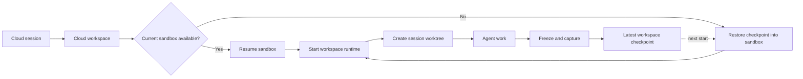

# Persistent Cloud Workspaces

## Goal

Extend the Cloud session flow so a cloud workspace behaves like a long-lived development environment across sessions.

Cloud remains one placement option:

```text
Local
Local with new worktree
Cloud
  Select or create workspace
  Create a new worktree by default
```

The provider sandbox keeps its normal lifecycle. Claxedo makes the workspace durable by recording its current sandbox and capturing restorable state. When the provider sandbox is available, Claxedo resumes it. When a replacement is needed, Claxedo restores the saved state into a new sandbox.

Concurrent sessions use the same active workspace sandbox and receive separate Git worktrees.

## Architecture

### Workspace and sandbox

The cloud workspace is the durable identity. It owns:

- the current sandbox lease
- the latest restorable checkpoint
- provider and image configuration
- credential bindings
- Git data and session worktrees
- runtime metadata

The sandbox is the current execution environment. It may be stopped, resumed, or replaced without changing the workspace identity.

The existing workspace lease remains the infrastructure authority. It records the provider sandbox ID, deterministic provider name, image digest, compute and region, lifecycle status, checkpoint reference, and epoch.

The canonical lease contract is backend-independent. Local Claxedo persists it through the SQLite lease store; hosted Claxedo persists it through the Convex lease store.

Each replacement or restore increments the epoch. Runtime credentials are bound to the workspace and epoch so an older sandbox cannot reconnect.

### Session flow

1. The user selects Cloud and chooses a workspace.
2. Claxedo resumes the current sandbox or restores the latest checkpoint into a replacement.
3. Claxedo starts `workspace-runtime` and waits for relay health.
4. Claxedo creates a registered worktree for the session.
5. The agent works and creates its pull request from that worktree.
6. When the workspace becomes idle, Claxedo captures its state if the provider supports capture.

The snapshot or backup is an additional persistence step in the ordinary sandbox lifecycle. Resume and restore are provider-specific implementation details within the same Cloud flow.

An explicit checkpoint request captures immediately after active work drains. An automatic checkpoint waits until every session in the workspace is idle, so one session cannot freeze another session’s active work.

### Runtime

`@claxedo/workspace-runtime` is an npm package with a Node.js executable.

The Claxedo platform image contains Node.js 22 and an exact version of the package. After sandbox create, resume, or restore, Claxedo starts the executable through SSH or the provider exec API. The runtime connects outbound to the Claxedo relay.

One workspace runtime serves all registered session worktrees in the active sandbox.

Future custom images use the same contract: Node.js 22 and `@claxedo/workspace-runtime` are installed, and Claxedo starts the executable.

### Git and worktrees

Workspace Git state lives in a hidden Claxedo-owned directory:

```text
$HOME/.claxedo/workspaces/<workspace-id>/
  repo.git/                   bare repository
  worktrees/
    <session-id>/             session checkout
  runtime/
    state.db
```

Each session receives:

```text
Worktree: $HOME/.claxedo/workspaces/<workspace-id>/worktrees/<session-id>
Branch:   claxedo/session/<session-id>
```

Git worktree creation and shared-repository maintenance are serialized. File, process, PTY, and agent operations resolve only registered worktrees.

### Provider resource names

Provider sandboxes use a workspace-specific name:

```text
claxedo-ws-<workspace-slug>-<short-id>-g<epoch>
```

The provider adapter applies provider-specific length and character limits while preserving the `claxedo-ws-` prefix and stable workspace identity. Worktree and branch names remain separate.

### Freeze and capture

For providers with capture support, Claxedo freezes the workspace before taking a checkpoint:

1. Pause new writes and session admission.
2. Drain or interrupt active work according to the requested policy.
3. Flush SQLite, Git, and runtime state.
4. Scrub temporary credentials.
5. Invoke the provider snapshot or backup operation.
6. Resume workspace activity.

Restore fences the previous epoch, starts the selected sandbox, launches the runtime, verifies registered worktrees, and marks the new lease current.

### Credentials

Credential bindings belong to the cloud workspace. Secret values are injected after runtime boot, which makes them available after resume or restore while keeping them out of checkpoints and support logs.

Provider credentials remain in the control plane. Runtime bootstrap credentials are short-lived and bound to the workspace and epoch.

## Lifecycle

This diagram is directional guidance for the lifecycle, not an implementation specification.



## Provider capabilities

| Provider | Workspace start | Capture |
|---|---|---|
| exe.dev | Resume the same VM and disk | Clone is a separate operation |
| Daytona | Resume persistent sandbox state | Filesystem snapshot |
| Modal | Restore a sandbox from saved state | Filesystem or directory snapshot |
| Vercel | Restore a sandbox from saved state | Filesystem snapshot with source-stop and retention semantics |
| Cloudflare | Restore declared workspace directories | Directory backup restored as a COW mount |
| Box | Resume the same sandbox | Same-resource persistence |
| Docker | Recreate over host-managed persistent data | Development volume policy |

The provider capability record describes same-sandbox resume, replacement restore, clone, capture scope, source behavior, retention, and restored mount behavior. The control plane validates lifecycle operations against this record before provisioning.

## Implementation

### U1. Extend the workspace lease with persistence state

Add checkpoint reference, source epoch, capture metadata, provider persistence capabilities, and restore status to the canonical `SandboxLease` contract. Map the same fields through the SQLite and Convex stores so local and hosted control planes observe identical lease behavior.

Primary files:

- `packages/sandbox-manager/src/index.ts`
- `packages/sandbox-manager/src/lease-types.ts`
- `packages/sandbox-manager/src/lease-policy.ts`
- `packages/sandbox-manager/src/driver-catalog.ts`
- `packages/claxedo-server/src/storage/workspace-lease.sql.ts`
- `packages/claxedo-server/src/sandbox-manager-adapters/stores/sqlite.ts`
- `packages/claxedo-server/src/sandbox-manager-adapters/stores/convex.ts`
- `packages/claxedo-server/src/sandbox-manager-adapters/stores/sqlite-supervisor-state.ts`
- `packages/claxedo-server/src/workspace-supervisor-sandbox.ts`
- `convex/schema.ts`
- `convex/sandboxLeases.ts`

Tests cover concurrent acquisition, same-sandbox resume, replacement restore, epoch fencing, capability validation, and lease-store equivalence across memory, SQLite, and Convex:

- `packages/sandbox-manager/src/manager.test.ts`
- `packages/sandbox-manager/src/lease-policy.test.ts`
- `packages/claxedo-server/src/sandbox-manager-adapters/stores/lease-store-equivalence.test.ts`
- `packages/claxedo-server/src/control-plane/convex-sandbox-leases-policy.test.ts`

### U2. Package the runtime for the platform image

Expose a `workspace-runtime` npm `bin` entry targeting built Node ESM. Install and verify the exact package version during the Claxedo image build. Start it through provider SSH or exec with short-lived workspace-and-epoch credentials.

Primary files:

- `packages/workspace-runtime/package.json`
- `packages/workspace-runtime/src/cli.ts`
- `packages/workspace-runtime/scripts/build.ts`
- `packages/workspace-runtime/scripts/verify-publish.ts`
- `packages/claxedo-server/src/workspace-runtime-integration/runtime-boot.ts`
- `packages/claxedo-server/scripts/sandbox/Dockerfile`
- `packages/claxedo-server/scripts/sandbox/build-sandbox-image.ts`

Tests run the packed package on Node.js 22, verify the image package version, and check runtime health after create, resume, and restore.

### U3. Add the exe.dev provider adapter

Implement create, inspect, stop, resume, clone, destroy, and in-VM command execution through exe.dev’s bearer-authenticated HTTPS API. The adapter uses `fetch`, declares Worker and Node compatibility, starts the platform runtime through the API, and waits for relay health. The capability record represents same-VM resume and clone as separate operations.

Primary files:

- `packages/sandbox-manager/src/drivers/exe.ts`
- `packages/sandbox-manager/src/drivers/exe.test.ts`
- `packages/sandbox-manager/src/driver-catalog.ts`
- `packages/claxedo-server/src/sandbox-manager-adapters/driver-auth.ts`
- `packages/claxedo-server/src/control-plane/hosted-services.ts`
- `packages/claxedo-server/src/control-plane/adapters/worker/hosted-compose.ts`

Tests cover disk and worktree continuity, provider-safe names, scoped bearer authentication, capability reporting, and hosted Worker driver selection:

- `packages/sandbox-manager/src/drivers/exe.test.ts`
- `packages/claxedo-server/src/control-plane/sandbox-driver-selection.test.ts`
- `packages/claxedo-server/src/control-plane/hosted-services.test.ts`

### U4. Add the hidden Git store and worktrees

Create the bare repository and registered worktrees under `$HOME/.claxedo/workspaces/<workspace-id>`. Store each worktree’s session, branch, pinned base commit, path, state, and activity.

Primary files:

- `packages/workspace-runtime/src/target.ts`
- `packages/workspace-runtime/src/worktree.ts`
- `packages/workspace-runtime/src/worktree.test.ts`
- `packages/workspace-runtime/src/store.ts`
- `packages/workspace-runtime/src/routes/session.ts`
- `packages/workspace-runtime/src/routes/file.ts`
- `packages/workspace-runtime/src/routes/process.ts`
- `packages/workspace-runtime/src/routes/pty.ts`

Tests cover concurrent worktrees, idempotent retries, path containment, crash repair, and branch isolation.

### U5. Extend Cloud session admission

Keep placement as local, local-new-worktree, or cloud. Cloud admission selects a workspace, ensures its sandbox and runtime are healthy, and allocates a new registered worktree before agent-session creation.

The session stores its workspace, worktree, lease epoch, and pinned base commit. Retry handling reuses the same session and worktree.

Primary files:

- `packages/claxedo-server/src/central-session-runtime.ts`
- `packages/claxedo-server/src/workgraph-session-gateway.ts`
- `packages/claxedo-app/src/features/session/ui/components/session-new-workspace-options.ts`
- `packages/claxedo-app/src/features/session/composer/workspace-resolver.ts`
- `packages/claxedo-app/src/features/session/submit/resolve.ts`
- `packages/claxedo-server/src/agent-lifecycle.integration.test.ts`

Tests cover all placement choices, workspace selection, new-worktree defaults, concurrent sessions, and retry identity.

### U6. Add freeze, capture, and restore

Add runtime freeze, flush, scrub, resume, and restore-reconcile operations. Record capture scope, source epoch, retention, and restore semantics with each checkpoint.

Primary files:

- `packages/sandbox-manager/src/checkpoint-manager.ts`
- `packages/sandbox-manager/src/checkpoint-manager.test.ts`
- `packages/workspace-runtime/src/routes/checkpoint.ts`
- `packages/workspace-runtime/src/workspace/runtime.ts`
- `packages/claxedo-server/src/workspace-checkpoints/service.ts`
- `packages/claxedo-server/src/routes/workspace-checkpoints.ts`

Tests cover write fencing, consistent capture, one epoch increment per restore, recovery state, and Cloudflare backup remounting.

### U7. Expose workspace lifecycle in UI and agent tools

Cloud session creation selects a workspace and defaults to a new worktree. Workspace settings show the current sandbox, epoch, image and runtime version, latest checkpoint, and worktrees.

UI and MCP operations call the same application services. Restore, replacement, forced cleanup, and destruction require explicit approval.

Primary files:

- `packages/claxedo-app/src/features/workspaces/ui/dialogs/create-cloud-project.tsx`
- `packages/claxedo-app/src/features/workspaces/ui/panel/workspace-panel.tsx`
- `packages/claxedo-server/src/routes/hosted-workspace.ts`
- `packages/claxedo-mcp/src/cloud-workspace-tools.ts`
- `packages/claxedo-mcp/src/tool-policy.ts`

Tests cover workspace creation and selection, UI/MCP parity, approval gates, capability messages, and reconnectable progress.

Implementation order is U1, U2, U3, U4, U5, U6, then U7.

## Release criteria

- Local and local-with-new-worktree placement behave as defined.
- Cloud has one workspace-based session flow.
- A cloud workspace retains development state across stop and resume.
- Providers with capture support also retain workspace state across sandbox replacement.
- Each cloud session receives a separate worktree by default.
- Concurrent sessions share the active workspace runtime without sharing an index or branch.
- Same-resource providers resume the current sandbox.
- Restore providers recreate the workspace from captured state.
- The platform image runs the npm package on Node.js 22.
- Hosted Claxedo persists lease and checkpoint state in Convex and can operate the selected provider from its Worker control plane.
- Workspace credentials are available after resume and restore through secret injection.
- Checkpoints exclude active secrets and contain consistent Git and runtime state.

## Future image support

User-provided images follow the same runtime contract: Node.js 22 and `@claxedo/workspace-runtime` are installed, and Claxedo starts the executable through provider exec.

Image building, registry images, repository Dockerfiles, compatibility checks, registry credentials, SBOM/provenance, and reusable images captured from modified sandboxes form a later delivery phase. The platform image supports the initial release.

Memory snapshots and cross-provider live migration are independent future capabilities.

## Research references

- [exe.dev documentation](https://exe.dev/docs/all)
- [Cloudflare Sandbox backups](https://developers.cloudflare.com/sandbox/api/backups/)
- [Daytona snapshots](https://www.daytona.io/docs/snapshots/)
- [Modal Sandbox snapshots](https://modal.com/docs/guide/sandbox-snapshots)
- [Vercel Sandbox snapshots](https://vercel.com/docs/vercel-sandbox/concepts/snapshots)
