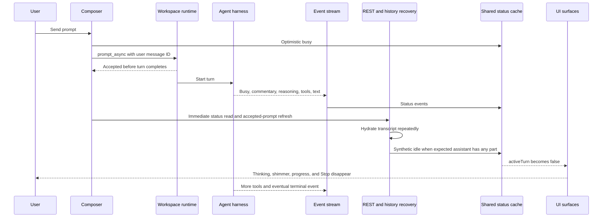
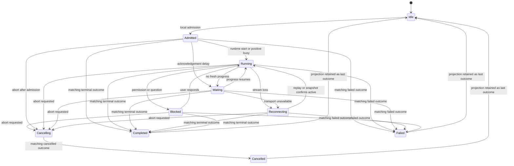
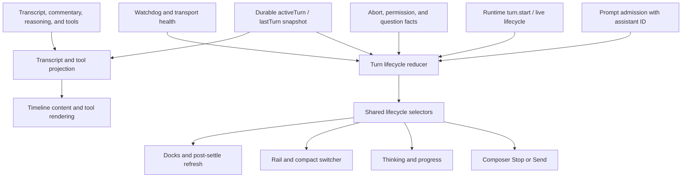
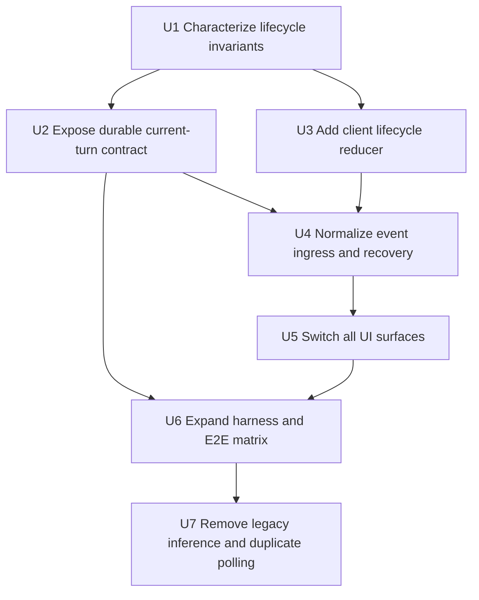

# Turn Lifecycle Authority Refactor - Plan

## Goal Capsule

| Field | Contract |
|---|---|
| Objective | Give each admitted agent turn one identity-scoped lifecycle authority from admission through completion, failure, or cancellation. |
| Primary invariant | Assistant content, reasoning, commentary, tool activity, polling silence, and missing status entries never complete a turn. Only a terminal outcome for the current turn completes it. |
| Authority order | Matching durable `turn.finish` outcome; matching normalized live terminal event; current-turn snapshot; optimistic local admission. Transcript content is not lifecycle authority. |
| Execution profile | Cross-package code refactor across runtime persistence, lifecycle event projection, client state, recovery, composer, timeline, rail, and E2E fixtures. |
| Stop conditions | Stop if a harness cannot expose or correlate a current turn identity, if a legacy terminal event cannot be ordered against a newer admission, or if reload recovery cannot distinguish active from unknown without transcript inference. Resolve the contract before switching UI consumers. |
| Tail ownership | The final unit removes inference-based settlement and duplicate status writers only after the lifecycle matrix is green across OpenCode, ACP, and native SDK paths. |

---

## Product Contract

### Summary

The application will project one current turn per session and keep every active-work surface attached to that projection until the same turn receives a completed, failed, or cancelled outcome. Recovery remains active, but uncertainty is represented as waiting or reconnecting instead of being converted to idle.

### Problem Frame

The screenshot shows a real execution continuing after the application has visually returned to idle. The missing Thinking row, tool shimmer, progress treatment, and Stop button are not four separate rendering defects. They all consume the same derived `activeTurn` boolean. That boolean became false while the runtime was still working.

The current prompt path is asynchronous. The app creates a message ID, shows optimistic busy state, submits `prompt_async`, and receives an acceptance response before the agent finishes. This early response is correct: it keeps sending responsive and allows the real turn to stream over events.

After acceptance, the app runs recovery work in case event delivery was missed. It fetches session status and repeatedly hydrates history. That recovery work currently does more than repair data. It also decides whether the turn ended. When the expected assistant message contains any part, the accepted-prompt refresh dispatches a synthetic server-source idle status.

Native SDK runtimes use one stable assistant message for the complete turn. Commentary, reasoning summaries, text deltas, and tools appear on that message before the terminal event. The first visible part therefore satisfies the current completion predicate. The app writes idle, clears its optimistic watchdog metadata, and every active-work cue disappears even though the runtime continues.

The same status cache has additional writers. Live SSE events, immediate REST status reads, a delayed active-session poll, timeout escalation, durable `lastTurn` reconciliation, abort cleanup, and the sidebar's independent polling loop can all change the state from which active work is derived. Several paths also treat a missing status-map entry as idle. There is no turn identity or monotonic transition rule at that shared write boundary.

The runtime already has stronger facts. It records `turn.start` with an `assistantMessageId`, records `turn.finish` with a completed, failed, or cancelled outcome, and exposes the latest outcome as `lastTurn`. The refactor makes those facts the lifecycle authority and limits transcript hydration to transcript repair.

### Current State

#### Current end-to-end flow

#### Current state authorities

| Writer | Intended purpose | Current lifecycle effect | Defect |
|---|---|---|---|
| Prompt submission | Make accepted asynchronous work visible immediately. | Writes optimistic `busy`. | Correct evidence, but it is stored in an unscoped session-status value. |
| Live SSE status | Deliver runtime progress and terminal changes. | Writes `busy`, `retry`, `idle`, or error into the same cache. | Terminal events carry no current assistant identity, so a late event can affect a newer turn. |
| Immediate REST status read | Repair a missed busy acknowledgement after dispatch. | Replaces status when a map entry exists. | Snapshot vocabulary differs by transport and is not turn-scoped. |
| Accepted-prompt history refresh | Hydrate the asynchronously created transcript. | Synthesizes server idle from assistant content. | Nonterminal commentary, reasoning, or tool activity can end the UI turn. |
| Active-session poll | Repair a missed event after a long active period. | Starts after 60 seconds and repeats every 5 seconds. | Empty, failed, or incomplete observations can collapse to idle. |
| Durable `lastTurn` refresh | Recover a terminal outcome missed by live events. | Refreshes status, then may synthesize idle. | It has the right turn identity but still routes through an unscoped status cache. |
| Timeout escalation | Explain slow acknowledgement or event silence. | Rewrites canonical status to `retry`. | Presentation health and execution lifecycle are merged. |
| Permission and question requests | Show that the agent needs user input. | Independently make `activeTurn` true. | Blocking interaction is treated as another authority instead of an overlay on the same turn. |
| Sidebar batch poll | Keep background session dots fresh. | Polls every 5 seconds and maps absent entries to idle. | The rail can disagree with the open task and can erase active state independently. |

#### Why this state is bad

1. **The state has no turn identity.** A session-level `busy` or `idle` value cannot distinguish the current turn from a delayed event for the previous turn.
2. **Nonterminal evidence creates a terminal transition.** Content proves that the agent produced something. It does not prove that the agent stopped working.
3. **Recovery can lie.** A failed fetch, an absent map entry, or a hydrated message is converted into a confident idle result instead of an unknown observation.
4. **Provenance is erased.** Synthetic inferences use `source: "server"`, making them indistinguishable from runtime-attested events and clearing watchdog metadata.
5. **One value carries unrelated concepts.** Execution activity, retrying, reconnection, slow acknowledgement, and user blocking all compete inside `SessionStatus`.
6. **UI consistency is accidental.** Composer, timeline, rail, compact switcher, and docks reuse overlapping status inputs rather than one lifecycle selector.
7. **The tests encode recovery history.** Several tests assert that missing REST status or assistant content clears busy. Those contracts protect the workaround instead of protecting the user-visible invariant.

### Actors

- A1. The user starts, observes, steers, blocks, cancels, or continues an agent turn.
- A2. The workspace runtime admits the prompt, assigns the stable assistant identity, persists lifecycle facts, and normalizes harness behavior.
- A3. A harness executes the turn and emits progress in its native vocabulary.
- A4. The application event and recovery layer combines live and durable evidence without inventing terminal state.
- A5. Composer, timeline, rail, compact switcher, and docks render the shared projection.

### Requirements

**Turn identity and terminal authority**

- R1. Prompt admission creates a current turn identified by `{sessionID, assistantMessageId}` before asynchronous model execution begins.
- R2. The public runtime session snapshot exposes the current turn identity while active and the matching terminal outcome after it settles.
- R3. Only a completed, failed, or cancelled outcome matching the current `assistantMessageId` clears the current turn.
- R4. Terminal transitions are monotonic and idempotent; duplicate terminal evidence has no additional effect.
- R5. A terminal event for an older assistant ID cannot settle a newer turn in the same session.
- R6. Every supported harness is normalized to the same admitted, active, blocked, and terminal contract before events reach generic UI state.

**Progress and recovery semantics**

- R7. Commentary, reasoning, text, tool start, tool output, tool completion, todos, diffs, message completion, and transcript hydration never clear the current turn.
- R8. REST status observations can confirm positive activity or recovery phase, but a missing entry, failed request, or malformed response never proves completion.
- R9. Accepted-prompt refresh hydrates session and transcript snapshots without writing terminal lifecycle state from message content.
- R10. Reload and reconnect restore the current turn from durable lifecycle data or show an active uncertainty state until terminal evidence arrives.
- R11. Waiting, retrying, reconnecting, cancelling, permission-blocked, and question-blocked phases remain active and cancellable when the harness supports abort.
- R12. Pre-dispatch cancellation may settle locally only when the runtime has not admitted the turn; post-admission abort settles from the matching cancelled outcome.

**Surface consistency**

- R13. Thinking, progress treatment, tool activity, Stop/Send, rail status, compact-switcher status, docks, and post-settle refresh use selectors from the same lifecycle projection.
- R14. Visible partial assistant content may coexist with active work; rendering content must not force Send readiness.
- R15. Background and foreground presentations of the same session agree on active, blocked, and terminal state.
- R16. A completed background turn produces the existing unseen-done presentation exactly once.

**Compatibility and observability**

- R17. OpenCode HTTP proxy, ACP, Claude SDK, Codex SDK, Cursor, and Pi keep their native event vocabulary inside their adapters.
- R18. Lifecycle observations retain origin and ordering metadata so telemetry can distinguish optimistic admission, live runtime evidence, durable snapshot recovery, and watchdog state.
- R19. The legacy `SessionStatus` query remains a derived compatibility projection during migration and is no longer independently writable after consumers move.
- R20. Telemetry records event/snapshot disagreement and recovery latency without changing lifecycle state as a side effect.

**Verification**

- R21. Tests hold a turn after exact-ID commentary, reasoning, or tool activity and prove all active indicators remain present.
- R22. Tests deliver a stale terminal outcome after a newer admission and prove the newer turn remains active.
- R23. Tests cover success, failure, cancellation, retry, user blocking, reconnect, reload, duplicate terminal events, and missing status observations.
- R24. Real-harness coverage verifies lifecycle continuity before terminal completion, not only the final transcript.

### Key Flows

- F1. Normal streamed turn
  - **Trigger:** A1 submits a prompt from an idle session.
  - **Steps:** The app admits the turn optimistically; A2 persists `turn.start`; A3 emits progress; A2 emits and persists a matching outcome; all surfaces settle from that outcome.
  - **Outcome:** Active UI is continuous from Send through the terminal fact.
  - **Covered by:** R1-R7, R13-R15

- F2. Partial content and multi-step tools
  - **Trigger:** A3 emits commentary, reasoning, text, or one completed tool step while more work remains.
  - **Steps:** Transcript and tool projections update; lifecycle remains current and active; the composer remains Stop.
  - **Outcome:** Progress is visible without being mistaken for completion.
  - **Covered by:** R3, R7, R14, R21

- F3. Missed event or incomplete status snapshot
  - **Trigger:** SSE disconnects, a REST request fails, or the status map omits the session.
  - **Steps:** Recovery hydrates the durable session snapshot and transcript; positive evidence may change the presentation to running or reconnecting; only a matching outcome settles.
  - **Outcome:** The UI never becomes falsely idle because evidence is absent.
  - **Covered by:** R8-R10, R18, R20, R23

- F4. Permission or question block
  - **Trigger:** A3 asks for permission or user input during the current turn.
  - **Steps:** The blocker overlays the active lifecycle; the user responds; the same current turn resumes.
  - **Outcome:** The task stays active and the correct action surface is visible.
  - **Covered by:** R6, R11, R13, R23

- F5. Abort or failure
  - **Trigger:** A1 stops admitted work or A3 fails.
  - **Steps:** The UI may enter cancelling; A2 records the matching cancelled or failed outcome; transcript interruption/error rendering uses that outcome.
  - **Outcome:** The task settles once with correct error or interruption semantics.
  - **Covered by:** R3-R5, R12, R23

- F6. Reload or background rail recovery
  - **Trigger:** The page reloads or the session is visible only in navigation while a turn is active.
  - **Steps:** The session snapshot restores `activeTurn`; live events continue from replay or reconnect; the rail and task use the same projection.
  - **Outcome:** Working remains visible until the matching outcome, then unseen-done is emitted once when applicable.
  - **Covered by:** R2, R10, R15-R16, R24

### Acceptance Examples

- AE1. **Covers R3, R7, R14, R21.** Given an admitted turn whose stable assistant message receives commentary, when no terminal outcome has arrived, then commentary may render but Thinking/progress, Stop, and working rail status remain active.
- AE2. **Covers R3, R7, R21.** Given a multi-step tool turn, when one tool step completes with more work pending, then the completed tool card renders and the turn remains active.
- AE3. **Covers R3-R5, R22.** Given turn B is current, when a delayed terminal event for turn A arrives, then turn B remains unchanged.
- AE4. **Covers R3, R8-R10.** Given a native SDK turn is streaming, when `/session/status` omits the session or fails, then the UI shows running or reconnecting and does not switch to Send.
- AE5. **Covers R3-R4.** Given the current turn receives a matching completed `turn.finish`, when duplicate idle or snapshot evidence arrives, then it settles once and the UI remains ready.
- AE6. **Covers R11.** Given the current turn requests permission, when the request is pending, then the task is blocked but active and Stop remains available if abort is supported.
- AE7. **Covers R12.** Given an admitted turn is aborted, when cancellation has not yet been acknowledged, then the UI shows cancelling rather than claiming successful completion; the matching cancelled outcome settles it.
- AE8. **Covers R2, R10, R15.** Given the page reloads during a turn, when the durable session snapshot contains `activeTurn`, then the open task and background rail restore working state before new transcript content arrives.
- AE9. **Covers R14.** Given completed assistant content is visible while a terminal event is delayed, then content stays visible and active indicators remain until terminal evidence arrives.
- AE10. **Covers R16.** Given an unfocused session transitions from current turn to a matching outcome, then the rail and compact switcher show unseen-done once and clear it when focused.

### Success Criteria

- No code path derives turn completion from assistant parts, `message.completed`, `time.completed`, tool completion, or transcript presence.
- No missing or failed status observation changes an active turn to idle.
- All active-work surfaces consume the same current-turn selector.
- A current turn survives commentary, reasoning, and tools in mock, native SDK, and real-harness tests.
- Reload and reconnect recover the current turn or an honest uncertainty phase without a false ready state.
- The accepted-prompt and sidebar recovery loops no longer own terminal transitions.

### Scope Boundaries

The plan includes lifecycle identity, durable projection, runtime normalization, event ordering, client state, recovery polling, composer, timeline, navigation status, telemetry, and test migration.

Visual redesign is outside scope. Existing components and copy remain unless a truthful lifecycle phase requires a small label change such as waiting, reconnecting, or cancelling.

General transcript deduplication, message virtualization, model execution policy, and new agent workflow abstractions are outside scope. Transcript code changes only where lifecycle inference must be removed or terminal rendering must consume the canonical outcome.

Clustered execution recovery and retrying provider work after a process crash remain separate runtime designs. This refactor must represent the recovered state honestly, but it does not introduce durable distributed execution ownership.

### Sources

- `packages/claxedo-app/src/features/session/composer/ui/submit-normal-prompt.ts:87-181` — prompt identity and post-acceptance reconciliation.
- `packages/claxedo-app/src/features/session/store/session-controller.ts:66-119,175-178,380-452,833-958` — content predicate, REST reconciliation, history retry, and active polling.
- `packages/claxedo-app/src/features/session/store/session-status-dispatcher.ts:74-98,120-195,322-347` — shared status writer and timeout phases.
- `packages/claxedo-app/src/app/workbench/rail/rail-sidebar.tsx:831-989` — independent background polling and absent-entry-to-idle behavior.
- `packages/agent-sdk-runtime/src/runtime.ts:198-333,391-435,555-580` — stable assistant identity and typed outcomes.
- `packages/workspace-runtime/src/store.ts:1707-1753,1857-1929,1982-2050` — durable turn start, finish, and `lastTurn`.
- Commit `3cd81c9d2` — parent-matched tool-step guard; exact-ID path intentionally remained content-based.
- Commit `016ba0cff` — non-ancestor heuristic episode guard that confirms the race but retains transcript inference.
- `docs/plans/2026-08-05-001-feat-durable-agents-layer-plan.md` — runtime-attested terminal receipt precedent.

---

## Planning Contract

### Why the Proposed Solution Is Better

The proposed model uses facts the runtime already owns instead of adding another heuristic. Admission establishes which turn is current. Progress updates what the user sees. A matching terminal outcome ends that turn. Each fact has one meaning.

| Concern | Current design | Proposed design | Benefit |
|---|---|---|---|
| Identity | Session-level status only. | Current turn is keyed by session and assistant message ID. | Late events cannot settle newer work. |
| Completion | Inferred from content, status absence, or unscoped idle. | Accepted only from a matching terminal outcome. | Partial progress cannot create false readiness. |
| Recovery | Repairs data and mutates lifecycle. | Hydrates evidence and feeds the lifecycle reducer. | Recovery can be uncertain without lying. |
| Polling | Missing key often means idle. | Polling supplies positive activity and transport health only. | Harness-specific snapshot gaps are safe. |
| Slow or disconnected work | Rewrites execution status to retry. | Changes an active presentation phase. | Stop stays available and execution truth remains stable. |
| User blocking | Independently creates active state. | Overlays the same current turn. | Resuming input does not create or lose lifecycle identity. |
| UI consumption | Each surface combines raw status differently. | All surfaces use common selectors. | Composer, timeline, rail, and docks cannot disagree. |
| Testing | Samples busy or waits for final content. | Asserts full identity-scoped transitions. | The exact screenshot regression becomes directly reproducible. |

### Key Technical Decisions

- KTD1. **One turn-lifecycle reducer owns canonical client state.** It accepts typed evidence and enforces legal transitions for one `{sessionID, assistantMessageId}`. Raw status writers and UI effects cannot clear current work directly. Governs R1, R3-R5, R13, R19.

- KTD2. **The durable pair is `activeTurn` plus `lastTurn`.** Runtime session projections expose `activeTurn: { assistantMessageId, startedAt }` while executing and the existing typed `lastTurn` after settlement. Reload and reconnect use this pair instead of transcript inspection. Governs R2-R3, R10.

- KTD3. **Terminal events are correlated at the runtime boundary.** A normalized lifecycle observation carries session identity, assistant identity, phase or outcome, origin, and ordering information. Legacy harness events without a turn ID are decorated from the runtime's current turn before publication; an event that cannot be correlated is advisory and triggers snapshot repair rather than settlement. Governs R5-R6, R17-R18.

- KTD4. **Transcript events are progress only.** Message creation, parts, deltas, completion metadata, tool events, and history hydration update transcript/tool projections but do not call lifecycle settlement. This removes `conversationHasAssistantMessage` from the terminal path rather than adding another content discriminator. Governs R7, R9, R14.

- KTD5. **REST status is a positive-observation channel.** A busy, retry, or recovering value may advance presentation. Absence, failure, or malformed data produces no terminal transition. Matching durable session outcome is the REST recovery path for completion. Governs R8-R10, R20.

- KTD6. **Execution state and presentation phase are separate.** `admitted`, `running`, `waiting`, `reconnecting`, `blocked`, and `cancelling` all mean a current turn exists. `completed`, `failed`, and `cancelled` are outcomes. Watchdog timers change only the active presentation phase. Governs R11-R12, R18.

- KTD7. **Permission and question requests are lifecycle overlays.** They attach to the current turn when one exists and do not become an independent substitute for execution state. Existing auto-response and user-action UI stays intact. Governs R11, R13.

- KTD8. **Legacy status becomes a derived compatibility view during migration.** The reducer projects `busy` or `retry` for consumers that have not migrated, but only the reducer writes that view. The compatibility view is removed or narrowed after all in-scope consumers use lifecycle selectors. Governs R13, R19.

- KTD9. **Migration is additive and characterization-first.** New reducer and runtime snapshot tests land before consumer switching. Shadow comparison telemetry records disagreements without affecting UI. Old inference paths are deleted only after mock and real harness lanes prove parity. Governs R20-R24.

- KTD10. **A runtime-attested `turn.finish` outranks legacy message-derived outcomes.** The SQLite store's legacy `message.completed` fallback remains for historical compatibility, but it cannot settle a current turn unless the snapshot identifies it as the current turn's normalized terminal receipt. Governs R3, R7, R17.

### High-Level Technical Design

#### Lifecycle state machine

`Completed`, `Failed`, and `Cancelled` represent a recorded outcome, not a long-lived active phase. UI selectors return ready when no `current` turn remains and use `lastOutcome` for interruption, error, unseen-done, and post-settle refresh.

#### Proposed evidence flow

#### Ordering rules

1. A new admission replaces the previous current identity only through the prompt admission contract.
2. Evidence for another assistant ID cannot mutate the current turn.
3. A matching terminal outcome clears `current` and records `lastOutcome` once.
4. Progress after terminal may repair transcript state but cannot reopen the turn.
5. A duplicate or older event ordinal is ignored for lifecycle transitions.
6. An uncorrelated legacy idle/error triggers a durable snapshot refresh. It does not settle by itself.

### System-Wide Impact

| Section | Current responsibility | Refactor impact |
|---|---|---|
| Agent runtime contract | Stable assistant ID and typed outcome exist internally. | Public session rows expose active turn identity; terminal publication carries identity and order. |
| Runtime stores | Persist start/finish and derive session status. | Memory, SQLite, and hosted projections return the same `activeTurn`/`lastTurn` pair and preserve first-terminal-wins behavior. |
| Harness adapters | Translate native progress into compat events. | Associate legacy status/idle/error with the normalized current turn before generic publication. |
| Workspace routes and event bridge | Proxy status and publish session/agent lifecycle. | Preserve turn identity and terminal outcome in lifecycle observations; status snapshots cease implying terminal state through absence. |
| App event ingress | Routes transcript and status events into query writers. | Routes lifecycle observations to the single reducer and keeps transcript projection separate. |
| Prompt submission | Creates optimistic busy and schedules recovery. | Admits the current identity and requests evidence hydration without owning settlement. |
| Session controller | Hydrates info, transcript, todos, requests, and status. | Reads lifecycle selectors; accepted refresh becomes transcript/session hydration; active polling becomes evidence/health recovery. |
| Status dispatcher | Owns raw status query and watchdog timers. | Becomes lifecycle evidence dispatch plus a derived legacy status writer; timers update presentation only. |
| Session screen | Reconciles matching `lastTurn` through a status refresh and synthetic idle. | Feeds the matching durable outcome to the reducer and removes the stale-busy idle effect. |
| Timeline | Derives working from raw status and content settlement. | Uses lifecycle active/current identity for Thinking/progress while content renders independently. |
| Composer | Derives Stop from active status. | Uses the shared `canStop/current` selector; cancelling stays non-ready until authoritative settlement. |
| Rail and compact switcher | Maintain their own polling inputs and active-to-done map. | Consume the shared lifecycle cache; polling only hydrates positive evidence and durable outcomes. |
| Telemetry and guard tests | Track status disagreement and enforce dispatcher ownership. | Track evidence origin/ordering and enforce single lifecycle-writer ownership. |

### Risks and Mitigations

| Risk | Impact | Mitigation |
|---|---|---|
| OpenCode HTTP-proxy sessions do not yet expose the same durable current-turn snapshot as native runtimes. | Reload recovery remains ambiguous on a primary harness. | Normalize prompt admission and terminal correlation in workspace runtime before switching UI consumers; add OpenCode proxy contract tests in U2. |
| Existing compat `session.idle` and `session.error` lack assistant identity. | A delayed terminal event can settle a newer turn. | Decorate at the runtime boundary from the active turn and reject uncorrelated terminal events in the client reducer. |
| SQLite `lastTurn()` can fall back to `message.completed`. | A step-level message may look like a runtime receipt. | Mark or derive terminal provenance and require current-turn correlation; prefer `turn.finish` for active settlement. |
| Abort currently clears UI optimistically in some paths. | The refactor may expose a cancelling interval and change timing-sensitive tests. | Preserve immediate local settlement only for proven pre-admission cancellation; use `cancelling` after admission and update behavior tests explicitly. |
| Removing rail polling too early can regress background dots. | Background sessions appear idle despite active execution. | Switch the rail to shared lifecycle state before deleting the loop; retain evidence hydration until event and snapshot coverage is proven. |
| A dual-write migration can hide divergence. | New and legacy state appear green separately while disagreeing. | Add shadow comparison telemetry keyed by turn identity and make disagreement tests mandatory before cutover. |
| Permissions or questions may arrive before current-turn hydration on reload. | A blocked task could appear idle. | Retain blocker facts independently, attach them when the current snapshot lands, and render blocked-unknown as active uncertainty. |

### Sequencing

The runtime contract must land before the current UI fallback is removed. The client reducer can be developed in parallel behind tests, but consumer cutover waits for both durable snapshot and live-event identity.

---

## Implementation Units

### U1. Characterize the lifecycle invariant before refactoring

- **Goal:** Add failing or characterization tests for the exact unsafe sequences without changing production behavior.
- **Requirements:** R3-R8, R21-R23
- **Files:**
  - `packages/claxedo-app/src/features/session/store/session-controller.test.ts`
  - `packages/claxedo-app/src/features/session/store/session-status-dispatcher.test.ts`
  - `packages/claxedo-app/src/features/session/store/session-store.test.ts`
  - `packages/claxedo-app/src/features/session/ui/view-state.test.ts`
  - `packages/claxedo-app/src/features/session/ui/message-timeline-row-reuse.test.ts`
  - `packages/claxedo-app/src/features/session/composer/ui/submit-control.vitest.tsx`
  - `packages/claxedo-app/e2e/helpers/turn-oracle.ts`
  - `packages/claxedo-app/e2e/playwright/core-busy-abort-errors.spec.ts`
- **Approach:**
  - Add a separate in-flight oracle. It accepts visible partial progress while requiring Stop and working status.
  - Hold exact-ID commentary/text with no terminal event and prove the task remains active.
  - Hold a pending/running or completed intermediate tool step and prove the task remains active.
  - Deliver an older terminal event after a newer admission and prove it is ignored.
  - Record the current unsafe expectations around absent REST status as tests to replace in U4, not invariants to preserve.
- **Test Scenarios:** AE1-AE5, plus duplicate terminal observations and session switch isolation.
- **Verification:** Run the selected app unit tests and the focused busy/abort E2E. The new regression scenario must fail against the old content-based settlement path before the production fix lands.
- **Dependencies:** None.

### U2. Expose one durable current-turn contract from every runtime path

- **Goal:** Make `activeTurn` and matching `lastTurn` available across memory, SQLite, hosted projection, session routes, and harness families.
- **Requirements:** R1-R6, R10, R17-R18
- **Files:**
  - `packages/agent-sdk-runtime/src/index.ts`
  - `packages/agent-sdk-runtime/src/runtime.ts`
  - `packages/agent-sdk-runtime/src/runtime.test.ts`
  - `packages/agent-sdk-runtime/src/stores/memory.ts`
  - `packages/agent-sdk-runtime/src/harnesses/shared/runtime-store.ts`
  - `packages/agent-sdk-runtime/src/harnesses/shared/sdk-runtime-adapter.ts`
  - `packages/agent-sdk-runtime/src/harnesses/shared/sdk-runtime-adapter.test.ts`
  - `packages/workspace-runtime/src/store.ts`
  - `packages/workspace-runtime/src/store.test.ts`
  - `packages/workspace-runtime/src/session/service.ts`
  - `packages/workspace-runtime/src/routes/session.ts`
  - `packages/workspace-runtime/src/routes/session-status-snapshot.ts`
  - `packages/workspace-runtime/src/routes/session-status-snapshot.test.ts`
  - `packages/workspace-runtime/src/routes/session.test.ts`
  - `packages/claxedo-app/src/platform/runtime/session.ts`
  - `packages/claxedo-app/src/features/session/data/session-types.ts`
- **Approach:**
  - Add public `activeTurn` with stable assistant identity and start time to runtime session rows.
  - Project `activeTurn` from the latest unmatched `turn.start`; clear it only through checked `finishTurn`.
  - Preserve first-terminal-wins and mismatched-finish no-op behavior.
  - Ensure OpenCode proxy prompt admission also writes the same durable start/finish contract.
  - Preserve terminal provenance so current lifecycle settlement prefers `turn.finish` over legacy `message.completed` fallback.
  - Keep `/session/status` compatible for positive activity observations while session detail/list snapshots provide identity-scoped terminal recovery.
- **Test Scenarios:** Active snapshot before any content, active after commentary/tool content, matching finish, mismatched finish, cancellation followed by late success, process/reload reconstruction, OpenCode proxy parity, and hosted projection parity.
- **Verification:** Run focused tests in `packages/agent-sdk-runtime` and `packages/workspace-runtime`, then run each package's `bun typecheck`.
- **Dependencies:** U1.

### U3. Introduce the single client lifecycle reducer and derived selectors

- **Goal:** Create a pure, identity-scoped reducer that becomes the only canonical client lifecycle owner.
- **Requirements:** R3-R5, R11-R13, R18-R20
- **Files:**
  - `packages/claxedo-app/src/features/session/store/turn-lifecycle.ts` (new)
  - `packages/claxedo-app/src/features/session/store/turn-lifecycle.test.ts` (new)
  - `packages/claxedo-app/src/features/session/store/session-status-dispatcher.ts`
  - `packages/claxedo-app/src/features/session/store/session-store.ts`
  - `packages/claxedo-app/src/features/session/data/sync/writers.ts`
  - `packages/claxedo-app/src/platform/sync/keys.ts`
  - `packages/claxedo-app/src/platform/runtime/workspace-runtime-route-audit.test.ts`
- **Approach:**
  - Define lifecycle evidence for admission, runtime start/progress, terminal outcome, snapshot, blocker, abort request, and transport/watchdog phase.
  - Enforce assistant-ID matching, ordinal ordering, monotonic phase progression, and idempotent terminal handling in a pure reducer.
  - Store lifecycle state in the existing query ownership boundary so session and rail consumers share one reactive cache.
  - Derive compatibility `SessionStatus`, `active`, `blocked`, `canStop`, `presentationPhase`, and `lastOutcome` selectors.
  - Add a guard test that production lifecycle writes occur only through this owner.
- **Test Scenarios:** Table-driven sequences for admit through all progress types, reconnect, blocked/resume, stale terminal, duplicate terminal, abort, and quick consecutive turns.
- **Verification:** Run the reducer, dispatcher, store, and architecture guard tests in `packages/claxedo-app`; run `bun typecheck` from that package.
- **Dependencies:** U1. U3 may develop against the U2 contract types but consumer cutover waits for U2.

### U4. Normalize event ingress and make recovery evidence-only

- **Goal:** Feed live events, durable snapshots, REST observations, accepted-prompt refresh, and watchdog phases into the reducer without transcript-derived settlement.
- **Requirements:** R5-R10, R17-R20
- **Files:**
  - `packages/agent-event-runtime/src/contracts/agent-runtime-event.ts`
  - `packages/agent-event-runtime/src/projections/opencode-compat/runtime-event.ts`
  - `packages/agent-event-runtime/src/projections/opencode-compat/projection.ts`
  - `packages/agent-event-runtime/src/projections/opencode-compat/projection.test.ts`
  - `packages/agent-sdk-runtime/src/runtime-event-hub.ts`
  - `packages/agent-sdk-runtime/src/harnesses/shared/turn-projection.ts`
  - `packages/workspace-runtime/src/routes/session.ts`
  - `packages/workspace-runtime/src/routes/events.ts`
  - `packages/workspace-runtime/src/routes/runtime-events.test.ts`
  - `packages/claxedo-app/src/app/integrations/session-events/event-ingress.ts`
  - `packages/claxedo-app/src/features/session/data/sync/directory-event-projector.ts`
  - `packages/claxedo-app/src/features/session/composer/ui/submit-normal-prompt.ts`
  - `packages/claxedo-app/src/features/session/store/accepted-prompt-refresh.ts`
  - `packages/claxedo-app/src/features/session/store/session-controller.ts`
  - `packages/claxedo-app/src/features/session/store/session-status-telemetry.ts`
- **Approach:**
  - Carry assistant identity and ordering on normalized lifecycle observations.
  - Correlate legacy harness terminal events before publishing them to generic application state.
  - Change `reconcileAfterDispatch` to request session/transcript evidence only.
  - Delete `conversationHasAssistantMessage` as a completion predicate. Preserve history retry only for hydration.
  - Make REST status absence and errors no-op lifecycle observations with telemetry.
  - Make the 60-second active poll repair live evidence and session snapshots without writing idle from absence.
  - Route matching durable `lastTurn` directly into the reducer.
  - Change timeout escalation from canonical status rewrites to active presentation-phase updates.
- **Test Scenarios:** AE1-AE9, event replay, replay gap, malformed status, empty map during native execution, stream reconnect, and a terminal event without correlatable identity.
- **Verification:** Run projection/runtime-event tests, focused app controller/dispatcher tests, and package typechecks.
- **Dependencies:** U2, U3.

### U5. Switch composer, timeline, docks, rail, and compact switcher to shared selectors

- **Goal:** Remove independent active-state derivations so every user-visible cue agrees.
- **Requirements:** R11-R16, R19
- **Files:**
  - `packages/claxedo-app/src/features/session/store/session-controller.ts`
  - `packages/claxedo-app/src/features/session/ui/session-screen.tsx`
  - `packages/claxedo-app/src/features/session/ui/view-state.ts`
  - `packages/claxedo-app/src/features/session/composer/composer.tsx`
  - `packages/claxedo-app/src/features/session/composer/ui/submit-control.tsx`
  - `packages/claxedo-app/src/features/session/ui/message-timeline.tsx`
  - `packages/claxedo-app/src/features/session/ui/message-timeline.data.ts`
  - `packages/claxedo-app/src/features/session/ui/composer/session-composer-region.tsx`
  - `packages/claxedo-app/src/features/session/ui/components/session-status-stage.tsx`
  - `packages/claxedo-app/src/app/workbench/rail/rail-sidebar.tsx`
  - `packages/claxedo-app/src/app/workbench/rail/rail-sidebar-status-poll.ts`
  - `packages/claxedo-app/src/app/workbench/compact-switcher/surface-status.ts`
  - `packages/claxedo-app/src/app/workbench/state/agent-status-listener.ts`
- **Approach:**
  - Use `current`/`canStop` for Stop, keyboard abort, active timeline row, Thinking, and progress.
  - Render partial assistant content independently of current-turn activity.
  - Use `presentationPhase` for waiting, reconnecting, blocked, and cancelling surfaces.
  - Use `lastOutcome` for interruption, error, duration, post-settle refresh, and unseen-done.
  - Feed rail and compact switcher from the same lifecycle cache as the open session.
  - Retain sidebar polling only as evidence hydration until U6 proves event and snapshot recovery; it must never map omission to idle.
- **Test Scenarios:** AE1-AE10, keyboard Stop, blank Enter while active, permission/question action, cancelling, status-stage actions, foreground/background parity, and unseen-done exactly once.
- **Verification:** Run composer, timeline, navigation, compact-switcher, dock, and architecture tests; run `bun typecheck` from `packages/claxedo-app`.
- **Dependencies:** U4.

### U6. Migrate E2E contracts and prove every harness family

- **Goal:** Replace tests of heuristic mechanics with transition tests that hold real work in nonterminal phases.
- **Requirements:** R21-R24
- **Files:**
  - `packages/claxedo-app/e2e/helpers/turn-oracle.ts`
  - `packages/claxedo-app/e2e/helpers/rail-oracle.ts`
  - `packages/claxedo-app/e2e/playwright/core-busy-abort-errors.spec.ts`
  - `packages/claxedo-app/e2e/playwright/core-first-prompt-local.spec.ts`
  - `packages/claxedo-app/e2e/playwright/core-turns-reload-recovery.spec.ts`
  - `packages/claxedo-app/e2e/playwright/core-sidebar-tree.spec.ts`
  - `packages/claxedo-app/e2e/playwright/core-docks.spec.ts`
  - `packages/claxedo-app/e2e/playwright/core-harness-rendering-matrix.spec.ts`
  - `packages/claxedo-app/e2e/playwright/core-claude-native-sdk-rail.spec.ts`
  - `packages/claxedo-app/e2e/playwright/live-real-harness-smoke.spec.ts`
  - `packages/claxedo-app/e2e/playwright/real-harness-local.spec.ts`
- **Approach:**
  - Keep the existing terminal oracle strict: visible reply, Thinking gone, and Send ready.
  - Add an in-flight oracle for visible progress plus Stop and working status.
  - Add deterministic hold points after commentary/reasoning and during tool work.
  - Preserve the stale-busy scenario where a matching terminal outcome repairs a missed idle event; change its fixture and documentation so content alone does not settle.
  - Add stale-terminal, empty-status, reconnect/replay, and reload-mid-turn scenarios.
  - Cover OpenCode, Claude ACP, Claude SDK, Codex ACP, Codex SDK, Cursor fixture paths, and Pi fixture paths.
- **Test Scenarios:**
  - Admitted before first SSE.
  - Exact-ID commentary/text without terminal.
  - Tool pending/running/intermediate completion.
  - Matching completion without live idle.
  - Prior-turn terminal after next admission.
  - SSE loss and empty REST status.
  - Replay and durable snapshot recovery.
  - Reload mid-turn.
  - Failure, cancellation, retry, permission, and question.
  - Background rail and compact-switcher parity.
- **Verification:** Run focused core specs first, then the Tier R real harnesses and the live lane. Capture evidence during the held in-flight phase and after terminal settlement.
- **Dependencies:** U2, U5.

### U7. Remove legacy lifecycle inference and duplicate clocks

- **Goal:** Finish the cutover with one writer, one recovery contract, and no content-based or absence-based terminal paths.
- **Requirements:** R3, R7-R9, R13, R19-R20
- **Files:**
  - `packages/claxedo-app/src/features/session/store/session-controller.ts`
  - `packages/claxedo-app/src/features/session/store/session-status-dispatcher.ts`
  - `packages/claxedo-app/src/features/session/store/session-store.ts`
  - `packages/claxedo-app/src/features/session/ui/view-state.ts`
  - `packages/claxedo-app/src/features/session/ui/session-screen.tsx`
  - `packages/claxedo-app/src/app/workbench/rail/rail-sidebar.tsx`
  - `packages/claxedo-app/src/app/workbench/rail/rail-sidebar-status-poll.ts`
  - `packages/claxedo-app/src/platform/runtime/workspace-runtime-route-audit.test.ts`
  - `packages/claxedo-app/e2e/playwright/core-busy-abort-errors.spec.ts`
- **Approach:**
  - Remove `conversationHasAssistantMessage` settlement logic and synthetic server idle from history refresh.
  - Remove `undefined => idle` and failed-fetch-to-idle fallbacks from active lifecycle handling.
  - Remove stale-busy UI effects that dispatch status after a separate refresh.
  - Remove `mergeBusySessionStatus` once reducer precedence owns the rule.
  - Remove duplicate sidebar and active-session polling clocks where live events plus durable snapshots now provide coverage; retain a single bounded recovery scheduler if metrics show it is still necessary.
  - Remove legacy compatibility writes and shadow comparison after all consumers and tests use lifecycle state.
  - Update explanatory comments to describe the new authority rather than the removed workaround.
- **Test Scenarios:** Mutation checks that reintroduce content settlement, status omission settlement, or unscoped stale terminal handling must fail.
- **Verification:** Run the full unit/typecheck matrix and the complete targeted E2E matrix. Search production code for removed helpers, synthetic idle dispatches, and direct lifecycle query writes.
- **Dependencies:** U6.

---

## Verification Contract

### Unit and contract verification

| Area | Command | Proves |
|---|---|---|
| App lifecycle and UI | From `packages/claxedo-app`: `bun test --conditions=browser --preload ./happydom.ts ./src/features/session/store/turn-lifecycle.test.ts ./src/features/session/store/session-controller.test.ts ./src/features/session/store/session-status-dispatcher.test.ts ./src/features/session/store/session-store.test.ts ./src/features/session/ui/view-state.test.ts ./src/features/session/ui/message-timeline-row-reuse.test.ts` | Reducer invariants, recovery semantics, active selectors, and terminal rendering. |
| App component tests | From `packages/claxedo-app`: `bun run test:vitest -- ./src/features/session/composer/ui/submit-control.vitest.tsx ./src/features/session/ui/components/session-status-stage.vitest.tsx ./src/app/workbench/compact-switcher/surface-status.integration.test.ts` | Stop/Send, active phases, and surface parity. |
| App architecture | From `packages/claxedo-app`: `bun test ./src/architecture ./src/platform/runtime/workspace-runtime-route-audit.test.ts` | Single lifecycle writer and package boundaries. |
| Agent event projection | From `packages/agent-event-runtime`: `bun test src/projections/opencode-compat/projection.test.ts src/harnesses/codex/adapter.test.ts src/harnesses/claude/adapter.test.ts` | Progress/terminal separation and harness normalization. |
| Agent runtime | From `packages/agent-sdk-runtime`: `bun test src/runtime.test.ts src/harnesses/shared/sdk-runtime-adapter.test.ts` | Stable current identity, terminal outcome, abort ordering, and adapter parity. |
| Workspace runtime | From `packages/workspace-runtime`: `bun test src/routes/session-status-snapshot.test.ts src/routes/session.test.ts src/routes/runtime-events.test.ts` and the package's store test command | Durable snapshot, route correlation, replay, and persistence. |

### Type checking

Run `bun typecheck` separately from:

- `packages/agent-event-runtime`
- `packages/agent-sdk-runtime`
- `packages/workspace-runtime`
- `packages/claxedo-app`

### E2E verification

| Gate | Command from `packages/claxedo-app` | Required evidence |
|---|---|---|
| Focused lifecycle | `CLAXEDO_E2E_SUITE=core npx playwright test --config playwright.config.ts e2e/playwright/core-busy-abort-errors.spec.ts e2e/playwright/core-first-prompt-local.spec.ts e2e/playwright/core-turns-reload-recovery.spec.ts` | Exact-ID partial content remains active; terminal outcome settles. |
| Navigation parity | `CLAXEDO_E2E_SUITE=core npx playwright test --config playwright.config.ts e2e/playwright/core-sidebar-tree.spec.ts e2e/playwright/core-claude-native-sdk-rail.spec.ts e2e/playwright/core-docks.spec.ts` | Foreground, rail, switcher, and docks agree. |
| Harness matrix | `CLAXEDO_E2E_SUITE=core npx playwright test --config playwright.config.ts e2e/playwright/core-harness-rendering-matrix.spec.ts` | Adapter vocabulary does not leak into lifecycle semantics. |
| Real harness | `bun run test:e2e:real` | OpenCode/ACP/native turn continuity with real runtime timing. |
| Live harness | `bun run test:e2e:live -- e2e/playwright/live-real-harness-smoke.spec.ts` | End-to-end active continuity and reload recovery. |

### Required mutation checks

- Make exact-ID commentary call the terminal reducer: the in-flight regression test must fail.
- Treat missing REST status as terminal: the native SDK empty-status test must fail.
- Remove assistant-ID matching from terminal handling: the stale-terminal test must fail.
- Let a tool-step completion settle the turn: the multi-round tool-hold tests must fail.
- Give the rail a separate raw-status input: the foreground/background parity test must fail.

---

## Definition of Done

### Global completion criteria

- Every runtime path exposes current turn identity and a matching typed terminal outcome.
- The application has one lifecycle reducer and one canonical lifecycle cache owner.
- Transcript content and message completion have no terminal side effect.
- Missing REST status and fetch failure have no terminal side effect.
- Thinking, progress, tools, Stop/Send, rail, switcher, and docks consume shared selectors.
- Reload and reconnect restore active, blocked, reconnecting, or terminal state without false idle.
- OpenCode, ACP, and native SDK lifecycle tests pass through nonterminal holds and terminal release.
- Old inference helpers, synthetic server idle dispatches, duplicate status writers, and abandoned migration code are removed.
- Comments and tests describe the final authority model rather than the prior workaround.

### Per-unit completion

- U1 is done when the exact screenshot failure is deterministic and protected by a failing pre-fix scenario.
- U2 is done when runtime snapshots reconstruct current and terminal identity across persistence and harness paths.
- U3 is done when the pure reducer rejects every stale, unscoped, or nonterminal settlement attempt.
- U4 is done when all live and recovery inputs are evidence-only and content hydration cannot settle lifecycle.
- U5 is done when every in-scope surface agrees in unit and integration tests.
- U6 is done when the mock, real, and live lanes prove active continuity before terminal completion.
- U7 is done when the old authority paths are deleted and the full verification matrix remains green.

---

## Appendix

### Expected E2E Contract Changes

| Test area | Expected result during refactor | Final contract |
|---|---|---|
| `core-busy-abort-errors.spec.ts` partial-content behavior | New held-content scenario fails on current code. Existing comments and fixtures that describe content-based idle require rewrite. | Partial content stays active; a matching terminal outcome can still repair a missed idle event. |
| `core-busy-abort-errors.spec.ts` retry/escalation | Timing and banners may break when timeout stops rewriting canonical status. | Retry/wait/reconnect stays active and cancellable until terminal evidence. |
| `core-busy-abort-errors.spec.ts` abort | Immediate ready-state timing may change after admitted abort. | Pre-admission cancel may settle locally; admitted abort shows cancelling until cancelled outcome. |
| `core-sidebar-tree.spec.ts` status rehydration | Fixtures that use status-map absence as idle break intentionally. | Active rehydrates from current-turn snapshot; terminal rehydrates from matching outcome. |
| `core-timeline-rendering-scroll.spec.ts` mutable status fixtures | Fixtures driven only by REST busy-to-idle may require terminal outcomes. | Timeline rendering remains independent; lifecycle fixtures provide identity-scoped settlement. |
| `core-docks.spec.ts` live derivation | Raw `status !== idle || blocked` expectations may break mechanically. | Dock activity consumes lifecycle plus blocker overlay. |
| `core-claude-native-sdk-rail.spec.ts` | Its current documentation that native SDK is absent from REST becomes a first-class safety case. | REST absence cannot clear working; live or durable lifecycle drives working-to-done. |
| `core-first-prompt-local.spec.ts` | Normal final assertions remain; intermediate timing may expose hidden false idle. | First prompt stays active from admission to matching terminal outcome. |
| `core-turns-reload-recovery.spec.ts` | Request ceilings may change if lifecycle snapshot hydration is added. | Reload mid-turn restores current identity with bounded recovery requests. |
| `core-harness-rendering-matrix.spec.ts` | Existing tool renderer tests remain green but are insufficient alone. | Tool activity is paired with active lifecycle assertions. |
| `real-harness-local.spec.ts` and `live-real-harness-smoke.spec.ts` | Final-oracle-only scenarios remain but gain controlled mid-turn assertions. | Real commentary/reasoning/tools cannot clear Stop before terminal completion. |

### Files Whose Current Contracts Intentionally Change

- `packages/claxedo-app/src/features/session/store/session-controller.test.ts` — remove assistant-content and absent-status completion expectations.
- `packages/claxedo-app/src/features/session/store/session-status-dispatcher.test.ts` — replace “absent server status records idle” and “any server write clears all lifecycle metadata.”
- `packages/claxedo-app/src/features/session/store/session-store.test.ts` — replace raw status merge precedence with reducer transition precedence.
- `packages/claxedo-app/src/features/session/ui/view-state.test.ts` — move matching `lastTurn` behavior into canonical reducer tests and reject undefined-status settlement.
- `packages/claxedo-app/src/app/workbench/rail/rail-sidebar-status-poll.test.ts` — replace or delete the independent perpetual polling-loop contract after shared lifecycle recovery is proven.

### Current Regression Evidence

`conversationHasAssistantMessage` currently applies the terminal guard only to the parent-matched fallback. The exact-ID branch accepts any part. Commit `3cd81c9d2` fixed an intermediate tool-step race in the fallback branch and explicitly left the exact-ID path unchanged. Native SDK turns reuse the exact stable assistant ID for commentary, reasoning, tools, and final output, so the unguarded branch remains sufficient to synthesize idle during active execution.
