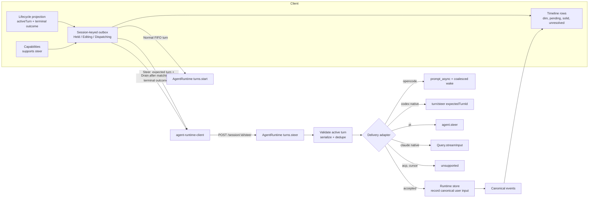

# Follow-up Steer and Queue - Plan

## Goal Capsule

| Field | Contract |
|---|---|
| Objective | Make a message sent while an agent is working a first-class, reversible object: held locally and shown as unsent, editable and cancellable while held, promotable into the active work chain at its earliest safe boundary, and delivered automatically when the current turn authoritatively settles. |
| Primary invariant | A held message has not left the client. Dispatching retains the local payload but locks mutation. Runtime acceptance creates one canonical user-message projection; an accepted message never returns to held state or blindly retries. |
| Authority order | One session-keyed client outbox owns held and dispatching state across panes. The AgentRuntime owns accepted user-message persistence and publication. Harnesses only deliver at the earliest safe boundary in the active work chain. The canonical server echo for the stable client message ID retires the optimistic row. |
| Execution profile | Cross-package feature: harness adapters (4 upstreams), adapter contract, workspace-runtime route, client composer/timeline, settings deletion, i18n across 17 locale files, e2e matrix. |
| Stop conditions | Stop if the lifecycle-authority prerequisite cannot expose a stable current assistant identity; stop if accepted steer cannot produce exactly one canonical user row; stop if OpenCode cannot close its final-read orphan window; stop if Claude streaming input cannot preserve permission callbacks, resume, or per-turn effort. Resolve before switching the client default. |
| Tail ownership | The dead `settings.general.followup` row and the unwired follow-up dock are deleted only after per-message steer/queue is green on every harness family. |

---

## Product Contract

### Summary

When the session has an authoritative active turn, a message the user sends is held in a session-keyed client outbox and rendered in every pane as a dim row labelled **Not sent — kept only in this window**. It can be edited, cancelled, or promoted while held. Promotion ("steer") delivers it at the earliest safe boundary in the active work chain on harnesses that support that; OpenCode may use one coalesced continuation run when its final history read has already passed. Otherwise the message waits and is delivered after the matching terminal outcome as a distinct queued turn. When no turn is active, the message sends immediately, exactly as today.

### Problem Frame

Three separate defects sit behind one visible symptom.

**The setting is inert.** `Settings → Follow-up behavior` offers "Steer" and "Queue". Choosing Queue does nothing: the settings provider rewrites `"queue"` to `"steer"` on both read and write ([provider.tsx:172-196](../../packages/claxedo-app/src/platform/settings/provider.tsx:172)). Even if it did not, nothing consumes the value — `SessionComposerRegion`'s `followup` prop is optional and is never passed by [session-screen.tsx:1504](../../packages/claxedo-app/src/features/session/ui/session-screen.tsx:1504), so `shouldQueue` is permanently undefined and `SessionFollowupDock` never renders. The user is offered a choice that cannot be made about a behavior that does not exist.

**The choice is global when it should be per-message.** "Do I want to interrupt the agent's current work, or wait?" is a property of the message, not of the account. A settings toggle forces one answer for every future message.

**Sending while busy is a coin flip across harnesses.** There is no shared contract. Two adapter families hard-refuse, OpenCode races its final history boundary, and pi starts a concurrent run:

| Adapter | Behavior on a second prompt during an in-flight turn |
|---|---|
| `SdkRuntimeAdapter` (claude, codex, cursor native) | Refuses: `"Session is already processing a message"` ([sdk-runtime-adapter.ts:330](../../packages/agent-sdk-runtime/src/harnesses/shared/sdk-runtime-adapter.ts:330)) |
| `AcpHarnessAdapter` (claude-acp, codex-acp, cursor-acp) | Refuses, same lock ([acp/index.ts:809](../../packages/agent-sdk-runtime/src/harnesses/acp/index.ts:809)) |
| `OpenCodeHarnessAdapter` | Persists the message, but consumption races the running loop's final history read — see below |
| `PiHarnessAdapter` | Accepts and starts a **concurrent** run, overwriting `session.active` ([pi/index.ts:387](../../packages/agent-sdk-runtime/src/harnesses/pi/index.ts:387)) so `abort()` cancels only the newer turn |

The opencode path sometimes steers by construction and sometimes orphans the input. `prompt()` persists the user message, then `ensureRunning` observes `Running` and awaits the live run instead of scheduling another ([runner.ts:120](../../packages/opencode/src/effect/runner.ts:120)). `runLoop` reads history only at the top of an iteration ([prompt.ts:1093](../../packages/opencode/src/session/prompt.ts:1093)); a prompt arriving after the final read but before `finishRun` changes the state to `Idle` is persisted but not consumed until a later prompt wakes the session. That window includes the final provider response and tool work, so it can last seconds or minutes. U4 closes this wakeup gap before opencode advertises steer.

### Current State

#### Current send path

```mermaid
sequenceDiagram
  participant U as User
  participant C as Composer
  participant T as Optimistic timeline
  participant R as Workspace runtime
  participant H as Harness adapter

  U->>C: Send while agent is busy
  C->>T: addSubmittedPrompt (client message id)
  C->>R: POST /session/:id/message or /prompt_async
  R->>H: sendMessage
  alt SdkRuntime or ACP
    H-->>R: sessionError "already processing a message"
    R-->>T: Error row; user's text is gone from the composer
  else opencode
    H-->>R: Accepted; consumed only if another loop read occurs
  else pi
    H-->>R: Accepted; second concurrent run; abort now targets the wrong turn
  end
```

The user cannot tell which of these three they are about to get, and the composer shows ready throughout.

#### Upstream capability research

Verified against the pinned packages' own typings and each vendor's docs. Four of eight harness keys have a usable native steer path.

| Harness | Upstream (pinned) | Steer primitive | Upstream queue | Per-message cancel upstream |
|---|---|---|---|---|
| `claude` native | `@anthropic-ai/claude-agent-sdk` 0.3.220 | `Query.streamInput(AsyncIterable<SDKUserMessage>)` (`sdk.d.ts:2557`); `SDKUserMessage.priority?: 'now' \| 'next' \| 'later'` (`sdk.d.ts:4592`) | Yes | Yes — `cancel_async_message { message_uuid }` (`sdk.d.ts:2997`) |
| `codex` native | codex app-server JSON-RPC | `turn/steer { threadId, input, expectedTurnId, clientUserMessageId? }` | No | No |
| `pi` | `@mariozechner/pi-agent-core` 0.73.1 | `agent.steer(msg)` | `agent.followUp(msg)` | Bulk only (`clearSteeringQueue`) |
| `opencode` | in-repo | `prompt_async` plus a coalesced post-run wake added by U4 | No | No |
| `cursor` native | `@cursor/sdk` 1.0.24 | None — `Run` exposes only `cancel()` | No | No |
| `claude-acp` / `codex-acp` / `cursor-acp` | `@agentclientprotocol/sdk` 1.3.0 | None | No | No |

ACP 1.3.0's complete session method set is `new / load / resume / fork / list / close / delete / prompt / cancel / request_permission / set_config_option / set_mode / update`. The spec states `session/cancel` is the only client-initiated action during a turn and a client must wait for the `StopReason` before the next `session/prompt`. The three ACP refusals are therefore correct, not conservative.

Note that `@agentclientprotocol/codex-acp` is a bridge: **Codex loses `turn/steer` when run over ACP.** Same engine, different transport, different capability. Both Codex entries appear in the harness picker.

### Actors

- **User** — sends a follow-up while the agent works; wants to correct course now, or park a thought for later, and to take either back.
- **Session outbox registry** — one client-local owner per canonical workspace/session identity; every pane reads and mutates the same ordered state.
- **AgentRuntime** — validates the expected active turn, serializes steer attempts, records accepted user input exactly once, and publishes its canonical timeline events.
- **Harness adapter** — declares whether it can steer and performs delivery only; it does not own public user-message projection.
- **Workspace runtime route layer** — authorizes and exposes the runtime-owned steer operation.

### Requirements

- **R1** — Sending while the session is idle behaves exactly as today: immediate dispatch, no dim state, no new round-trip.
- **R2** — Sending while the lifecycle projection exposes a current turn holds the message in the session outbox. It is not posted.
- **R3** — A held message renders in submission order below existing turns with dim styling and the explicit accessible status **Not sent — kept only in this window**. Styling alone never carries pending or volatile meaning.
- **R4** — Every held row exposes named Edit and Cancel actions plus capability-gated Steer. Pointer hover and keyboard focus reveal the inline actions; touch exposes the same actions through a discoverable menu with standard touch targets.
- **R5** — Cancel acts on the pane where it was invoked and restores the exact text and attachments only when that pane's composer is empty. If a newer draft exists, cancellation does not mutate either object and explains that the draft must be sent or cleared first. No network call occurs.
- **R6** — Edit acquires one session-wide edit lease for the initiating pane and loads the held payload into that pane's composer while the row stays visible at its original queue position. Other panes show **Editing in another pane** and locked actions. The outbox retains the saved payload and mirrors the unsaved edit draft. The composer exposes **Save queued message** and **Cancel editing**; Escape cancels editing without mutation. Pane closure or navigation releases the lease, returns the saved item to `Held`, and preserves the unsaved buffer as a recoverable session draft. If a matching terminal outcome starts an automatic drain during editing, the saved payload dispatches and the unsaved buffer remains a recoverable draft.
- **R7** — Steer from `Held`, or automatic drain from `Held` or `Editing`, moves the item synchronously to `Dispatching`, locks all mutation controls, and retains pending treatment until the runtime returns an admission result.
- **R8** — On a harness that cannot steer, Steer is absent from the inline actions and touch menu. Cancel and Edit remain.
- **R9** — After the matching active turn settles, held messages dispatch FIFO, one turn at a time. Each submitted message remains a separate turn because it has independent identity, edit/cancel history, failure recovery, and model-cost visibility; the next item waits for the prior queued turn's matching terminal outcome.
- **R10** — Only an explicit upstream rejection that proves non-admission returns the item to `Held` with an inline error and **Retry delivery**. Retry reevaluates lifecycle authority: with no active turn it performs normal dispatch; with an active turn it clears the error and waits for the matching terminal outcome unless the user explicitly chooses Steer. Later items remain blocked until the head is admitted, cancelled, or dismissed. Runtime acceptance moves an item to `Admitted`; it never returns to held state. A lost adapter response, lost `/steer` response, or post-acceptance projection failure becomes `Unresolved`, preserves the payload, and offers non-destructive Copy plus explicit Dismiss with uncertain-delivery guidance, never blind resend.
- **R11** — Harness steer support is declared as a capability, read by the client through the existing `supports()` seam, never inferred from harness id at a call site.
- **R12** — Steer is a distinct AgentRuntime operation with its own route. The runtime validates the expected active assistant identity, serializes attempts by message ID, delegates delivery at the earliest safe boundary in that active work chain, and records/publishes one canonical user message plus parts only after adapter acceptance.
- **R13** — `pi` must not run two concurrent turns. A second send is held by the outbox like every other harness.
- **R14** — OpenCode gains an explicit coalesced wake contract: a prompt admitted while a run is active either becomes visible to that run at a later history boundary or schedules one follow-on run after the current run exits. The final-read orphan window is tested deterministically.
- **R15** — The inert `settings.general.followup` row, its provider coercion, its i18n keys in all 17 locale files, and the unwired `SessionFollowupDock` are deleted.
- **R16** — The session-keyed outbox survives pane closure, session navigation, and multiple mounted views within the current client process. Reload or application exit clears it; every held row states that boundary explicitly, and reload-loss behavior is asserted in tests.
- **R17** — No client code branches on harness id to decide steer behavior.
- **R18** — Outbox ownership is keyed by canonical workspace/session identity outside `SessionScreen`; multiple panes render one queue, and exactly one elected session interaction owner reacts to lifecycle transitions and emits live-region announcements. The interaction-owner lease transfers when its pane unmounts; focus changes stay local to the pane that initiated an action.
- **R19** — Hold and drain decisions use the lifecycle-authority plan's stable `activeTurn` identity and matching terminal outcome, never raw `busy | idle`, transcript content, or missing status. A normal-send collision before admission is recoverable into the outbox; a held item inserted after settlement is drained immediately.
- **R20** — The runtime tracks every user message ID admitted against the active work chain. Adapter echoes for those IDs are deduplicated and never rewritten as assistant aliases, including an OpenCode message consumed by a coalesced continuation run.
- **R21** — Adapter steer returns one shared outcome vocabulary: `accepted`, `turn_ended`, `not_ready`, `failed`, or `delivery_unknown`. AgentRuntime absorbs `not_ready` inside a two-second readiness window for the same expected turn; readiness retries stop immediately on matching settlement, and expiry returns a proven pre-admission `failed(driver_not_ready)`. `failed` is reserved for explicit proof of non-admission. Transport loss after an upstream request is sent maps to `delivery_unknown`, as does canonical persistence or publication failure after acceptance. `turn_ended` performs one normal queued fallback with the same message ID; `delivery_unknown` becomes `Unresolved` and never retries blindly.
- **R22** — A session holds at most ten messages. When full, the composer preserves the new draft and announces the limit; each message continues to use the existing composer attachment constraints.
- **R23** — Focus transitions are deterministic in the initiating pane: Edit focuses the composer; successful Cancel focuses the restored composer; a cancel conflict retains focus on the row action; `Dispatching` focuses the row status when its invoked action disappears; reconciliation moves focus to the next held-row action or the composer. Only the elected session interaction owner announces state transitions, preventing duplicate announcements across panes.
- **R24** — Canonical reconciliation is order-independent after dispatch begins. A canonical echo observed while local state is `Dispatching` retires the optimistic row immediately; a later route result is idempotently ignored. Acceptance-first and event-first interleavings produce the same single timeline row.

### Key Flows

```mermaid
stateDiagram-v2
  [*] --> NoPendingMessage
  NoPendingMessage --> Dispatched: submit while session idle (R1)
  NoPendingMessage --> Held: submit while session busy (R2)
  Held --> Editing: edit with empty composer (R6)
  Editing --> Held: save or cancel edit (R6)
  Editing --> Dispatching: automatic drain; use last saved payload (R6-R7)
  Held --> [*]: cancel into empty composer (R5)
  Held --> Dispatching: steer or FIFO drain (R7)
  Dispatching --> Held: proven failure or readiness expiry before admission (R10, R21)
  Dispatching --> Admitted: steer accepted (R10, R12)
  Dispatching --> Admitted: turn_ended; one normal fallback accepted (R21)
  Dispatching --> Unresolved: delivery_unknown (R21)
  Dispatching --> Reconciled: canonical echo arrives before route result (R24)
  Admitted --> Reconciled: canonical echo for stable message ID
  Admitted --> Unresolved: reconciliation retries exhausted
  Reconciled --> [*]
  Unresolved --> Reconciled: late canonical echo
  Unresolved --> [*]: explicit dismiss after uncertain-delivery warning
```

Dim covers `Held` and `Editing`. `Dispatching` keeps the pending treatment with progress and locked controls. `Admitted` is solid because the message has left the client.

### Acceptance Examples

- **AE1** — Session idle. User sends "run the tests". Message posts immediately, never renders dim, no outbox entry exists.
- **AE2** — Session busy on claude native. User sends "actually use vitest". Row renders dim; composer is cleared; **no network request is issued**.
- **AE3** — Continuing AE2 with an empty composer, user presses Cancel. Row disappears, "actually use vitest" is restored with its attachments, and still no network request has been issued. With a newer draft present, both remain unchanged and the UI explains the conflict.
- **AE4** — Continuing AE2, user presses Steer twice. The first activation synchronously locks the row, exactly one request is issued, runtime acceptance creates exactly one canonical user row, and the running turn is not aborted or restarted.
- **AE5** — Session busy on `cursor-acp`. Pointer, keyboard, and touch surfaces expose Edit and Cancel but no Steer control.
- **AE6** — Session busy, user holds three messages, then the turn ends. Three turns run in submission order. None are dropped, none are reordered, none are coalesced.
- **AE7** — On `pi`, a send during an active turn produces one held row and **no second concurrent run**; `abort()` still targets the original turn.
- **AE8** — Steer is pressed on codex native in the exact instant the turn ends. `turn/steer` fails its `expectedTurnId` precondition; the message falls back to queued dispatch and is delivered as its own turn. It is never lost and never double-sent.
- **AE9** — Settings contains no "Follow-up behavior" row; `locale-parity.test.ts` is green with the keys removed from all 17 locale files.
- **AE10** — Two panes show the same session. Holding, editing, cancelling, or steering in either pane updates one shared row, and one terminal outcome starts exactly one drain.
- **AE11** — A held item is inserted as the active turn settles. The authoritative lifecycle projection observes no current turn and dispatches it once instead of stranding it.
- **AE12** — OpenCode receives a steer after its running loop's final history read. The current run exits, one coalesced wake starts, and the admitted message is consumed without another user prompt.
- **AE13** — A steered message is accepted but its canonical echo is not observed before accepted-prompt reconciliation exhausts. The solid row becomes Unresolved and offers copy/recovery information, never blind resend.
- **AE14** — Keyboard focus reveals every action; Enter/Space activates it; Escape abandons editing without mutation; the a11y sweep reports no new rule IDs.
- **AE15** — An explicit rejection before any upstream request is sent returns the queue head to Held with Retry delivery and blocks later rows. Retry with no active turn dispatches that head once; cancelling it unblocks the next row.
- **AE16** — Pane A edits a held message while pane B views it. Pane B shows the locked cross-pane state. Closing pane A keeps the saved queued payload and exposes the unsaved edit as a recoverable session draft; no text or attachment is lost or silently queued.
- **AE17** — Copy on an Unresolved row leaves it present. A late canonical echo retires it; Dismiss requires uncertain-delivery guidance, and manually resubmitting copied text warns that duplicate delivery is possible.
- **AE18** — Edit focuses the initiating composer; Dispatching focuses its row status; reconciliation focuses the next actionable held row or composer. Two panes render the state change, but one live announcement is emitted.
- **AE19** — The canonical user event arrives before the steer HTTP response. The Dispatching row reconciles immediately, the later accepted response is ignored, and no Unresolved timeout appears.
- **AE20** — Upstream receives a steer but its response is lost. The row becomes Unresolved rather than Held; Retry is absent because non-admission cannot be proven.

### Success Criteria

- The steer-capability matrix is asserted by test for all eight harness keys, not documented in prose.
- A dim row provably corresponds to zero network requests.
- Cancel restores the exact text and attachments when the invoking composer is empty; a newer draft and the held item remain unchanged on conflict.
- Queue drain order is asserted with three or more messages, not one.
- The `pi` concurrency defect has a red-before-green regression test.
- Accepted steer produces exactly one canonical timeline row for the stable client message ID on every `steer: true` harness.
- Lifecycle races, duplicate terminal events, multiple panes, edit-versus-dispatch, failed-head recovery, focus transfer, and reconciliation timeout are asserted directly.

### Scope Boundaries

**In scope:** the pending window and its three actions; one session-keyed outbox owner; runtime-owned steer admission and canonical user-message projection; the steer adapter operation and route; per-harness delivery for opencode, codex native, pi, and claude native; the OpenCode post-run wake guarantee; lifecycle-authority integration; deletion of the dead setting and dock; keyboard, touch, and automated accessibility coverage.

**Out of scope:**
- Durable, server-side queueing that survives reload or a second device. The upstream queues in the Claude SDK and pi could back this later; the client outbox is deliberately the first version. Revisit only with a stated multi-device requirement.
- Cursor native and the three ACP harnesses gaining steer. Both are blocked upstream, not by us.
- The "background agent running, foreground idle" rule — tracked as a deferred follow-on below.

### Sources

- [Streaming Input — Claude Agent SDK](https://code.claude.com/docs/en/agent-sdk/streaming-vs-single-mode)
- [Codex App Server — turn control](https://learn.chatgpt.com/docs/app-server)
- [Agent Client Protocol — Prompt Turn](https://agentclientprotocol.com/protocol/prompt-turn)
- Pinned typings read directly: `@anthropic-ai/claude-agent-sdk@0.3.220/sdk.d.ts`, `@mariozechner/pi-agent-core@0.73.1/dist/agent.d.ts`, `@cursor/sdk@1.0.24/dist/esm/{agent,run}.d.ts`, `@agentclientprotocol/sdk@1.3.0`.
- [Turn lifecycle authority plan](./2026-08-06-002-refactor-turn-lifecycle-authority-plan.md) — authoritative `activeTurn` identity and matching terminal outcome.
- [Single-tenant / multiplayer-ready plan](./2026-08-01-002-refactor-single-tenant-today-multiplayer-ready-plan.md) — prompt-admission collision and stable conflict semantics.
- [Background agents steering plan](./2026-07-18-002-feat-background-agents-steering-plan.md) — prior art for staged rows, edit/cancel interaction, FIFO turns, and session-level ownership.
- Accessibility gates: `packages/claxedo-app/e2e/playwright/a11y-sweep.spec.ts`, `a11y-baseline.json`, and `mobile-smoke.spec.ts`.

---

## Planning Contract

### Why the Proposed Solution Is Better

The app's prompt path is `agent-runtime-client` → `/message` or `/prompt_async` ([agent-runtime-client.ts:694](../../packages/claxedo-app/src/platform/runtime/agent/agent-runtime-client.ts:694)) → AgentRuntime and its harness adapters. The client outbox therefore owns only reversible, not-yet-sent state. Cancel and edit are local on every harness, and dim has one precise meaning: *the message is still yours*.

Once steer delivery is accepted, AgentRuntime records and publishes the canonical user message. This keeps the public timeline independent of adapter iterator behavior while preserving a single cross-harness projection. The v2 `SessionInput` inbox remains the future durable, multi-device queue path; adopting it is a separate engine-routing project.

### Key Technical Decisions

- **D1 — A session-keyed registry owns the pending window.** One outbox exists per canonical workspace/session identity outside `SessionScreen`. A held message is not posted, so cancel and edit require no API.
- **D2 — Visual state follows admission state.** `Held` and `Editing` are dim; `Dispatching` remains visibly pending and locked; runtime acceptance makes the row solid; canonical echo retires the optimistic row; uncertain reconciliation becomes `Unresolved`.
- **D3 — AgentRuntime owns steer admission.** `turns.steer` validates the current turn, serializes by stable client message ID, calls the adapter's delivery-only `steer`, then atomically records the canonical user message plus parts and publishes its event after `accepted`. Adapter steer remains a control `Promise`; adapters do not manufacture public timeline events.
- **D4 — Harness protocol identifiers remain protocol-correct.** The stable `msg_` client ID is the runtime/timeline identity. Claude receives a separate RFC UUID in `SDKUserMessage.uuid`; Codex receives the client ID in `clientUserMessageId`.
- **D5 — Queue stays client-side even where upstream queues exist.** Claude and pi both offer upstream queues, but the product exposes one consistent pending-state contract across all harnesses.
- **D6 — Follow-up behavior is per-message.** The global setting and its unwired dock are removed after the inline workflow is complete.
- **D7 — Turn-end and transport races use typed outcomes.** A delivery adapter reports `turn_ended` only with proof that the message was not admitted. The outbox performs one normal queued fallback with the same stable ID; accepted or unknown delivery never falls back.
- **D8 — Lifecycle authority is a prerequisite.** Hold and drain consume the lifecycle plan's stable `activeTurn` identity and matching terminal event. Raw status remains presentation data, not admission authority.
- **D9 — FIFO drains one message per turn.** Separate turns preserve per-message identity, edit/cancel history, failure recovery, and model-cost visibility. A ten-message per-session bound limits accidental cost.

### High-Level Technical Design



The outbox is a pure state machine over `{ id, payload, state }`, where `state ∈ Held | Editing | Dispatching | Admitted | Unresolved`; reconciliation removes the local record. It is testable without a DOM or harness. The arrows above flow from client intent through runtime admission to canonical projection; harnesses sit only on the delivery branch.

### System-Wide Impact

| Area | Impact |
|---|---|
| `agent-sdk-runtime` capabilities | `HarnessCapabilities` gains `steer`. Every `readHarnessCapabilities` implementation must set it — the struct is exhaustive, so this is a compile error, not a silent default. |
| Adapter contract | New optional delivery-only `SupportsSteer` with typed pre-admission outcomes. `sendMessage` retains its busy lock. |
| AgentRuntime and stores | New `turns.steer` operation plus an idempotent store primitive that records user message and parts without starting an assistant turn. Runtime event aliasing recognizes every admitted user ID. |
| Workspace runtime routes | One runtime-owned route. `route-ownership-contract.test.ts` lists it; route code does not call an adapter directly. |
| OpenCode runner | A wake that arrives while running is acknowledged by a later history snapshot or coalesced into one follow-on drain when the current loop cannot observe it. |
| Lifecycle projection | The feature depends on canonical `activeTurn` and matching terminal outcome from the lifecycle-authority plan. |
| Client | Submit consults lifecycle authority; a session-keyed registry owns outbox state and one drain; timeline renders all pending states; `supports("steer")` gates one action. |
| i18n and accessibility | New action/status/error keys across all 17 locale files; removal of four settings keys and six dock keys; keyboard, touch, live-region, sweep, baseline, and mobile-smoke coverage. |

### Risks and Mitigations

| Risk | Mitigation |
|---|---|
| The Claude streaming-input rework is the largest single change: the driver currently passes `prompt` as a string ([driver.ts:164](../../packages/agent-sdk-runtime/src/harnesses/claude/driver.ts:164)), and moving to an `AsyncIterable` touches permission callbacks, `resume`, and per-turn `effort`. | Sequence it last among the harness units (U7). Keep the string path behind the same driver until parity tests pass; the client is unaffected either way because `steer` is capability-gated. |
| The upstream response is lost after request send, or canonical store commit/publication fails after acceptance. | Return `delivery_unknown`, retain the payload as `Unresolved`, reconcile by stable ID, and never blind-resend. |
| `turn/steer`'s `expectedTurnId` race. | D7 — accept only a typed `turn_ended` as proof of non-admission, then perform one queued fallback. AE8 is the test. |
| OpenCode receives input after the loop's final history read. | Coalesce a post-run wake and assert the exact final-read interleaving deterministically. |
| Lifecycle status and transcript lag each other. | Gate on canonical `activeTurn` and matching terminal identity; declare the lifecycle plan as a landing prerequisite. |
| Multiple panes react to the same terminal event. | Store the drain lease in the session-keyed outbox owner and make duplicate terminal notifications idempotent. |
| Ten individually held prompts can create ten model turns. | Show the queue count, preserve separate-turn semantics, and enforce the ten-message admission bound before clearing the composer. |
| Silent regression to the old refusal path. | The refusal must remain reachable and asserted: a direct `sendMessage` while busy still errors. Only the client's *use* of it changes. |
| Green tests that assert nothing. | Each required mutation in the Verification Contract must make its named scenario fail; `includes()`-shaped assertions are banned in favor of probing the collection. |

### Prerequisites

- The lifecycle-authority plan's runtime projection must expose stable `activeTurn` identity before U3 and its client selector plus matching terminal outcome before U8. Follow-up work consumes those contracts rather than implementing a second busy/idle interpretation.
- The single-tenant / multiplayer-ready plan's atomic prompt-admission lease and stable conflict code must land before U3, or U3 must provide the equivalent atomic AgentRuntime admission guarantee. Normal start and steer validate and update `activeTurn` without overwriting each other's ownership.

### Sequencing

U1 → U2 → U3 establish characterization, the delivery contract, and runtime-owned admission. U4–U7 implement the four harnesses behind that seam. U5 and U7 both touch the shared SDK lifecycle adapter, so their shared seam lands once or those two units run serially. U8 starts after U3 and the lifecycle client selector are available. U9 follows once U4–U8 are green, and U10 closes with interaction, accessibility, and real-harness coverage.

---

## Implementation Units

### U1. Characterize the pending window and the harness matrix

- **Goal:** Pin the current races, projection gap, and per-harness behavior before changing production code.
- **Requirements:** R1-R14, R19-R21
- **Files:**
  - `packages/claxedo-app/src/features/session/store/followup-outbox.test.ts` (new)
  - `packages/agent-sdk-runtime/src/harnesses/harness-capabilities.test.ts`
  - `packages/agent-sdk-runtime/src/harnesses/shared/sdk-runtime-adapter.test.ts`
  - `packages/agent-sdk-runtime/src/runtime.test.ts`
  - `packages/agent-sdk-runtime/src/harnesses/pi/index.test.ts` (new or extend)
  - `packages/opencode/test/effect/runner.test.ts`
- **Approach:**
  - Encode two table-driven matrices: direct second-send behavior and declared steer capability. The direct-send matrix preserves today's behavior except for pi, whose U6 row changes from concurrent-run acceptance to refusal. The capability matrix starts false for every key, then U4-U7 each flip one native harness row to true.
  - Red repro for R13: assert that a second `sendMessage` on pi does not start a concurrent run and does not reassign `session.active`. This fails today.
  - Red OpenCode repro drives a prompt after the final history read but before `finishRun`; assert that one later run consumes it without a third prompt.
  - Runtime characterization proves that an adapter-side user event is currently required for a canonical row and that a control-only steer would otherwise leave no durable timeline message.
  - Outbox tests pin order, edit/save/cancel, dispatch locking, occupied-composer conflict, max-ten behavior, and one-drain ownership without a DOM.
- **Verification:** The pi, OpenCode final-read, and runtime projection scenarios fail for their named reasons; both matrices pass and pin current behavior.
- **Dependencies:** None.

### U2. Define steer capability, delivery outcomes, and client transport types

- **Goal:** One exhaustive capability and one delivery-only adapter contract, with no steer behavior enabled yet.
- **Requirements:** R11, R17, R21
- **Files:**
  - `packages/agent-sdk-runtime/src/capabilities.ts`
  - `packages/agent-sdk-runtime/src/adapter-contract.ts`
  - `packages/agent-sdk-runtime/src/harnesses/{acp,opencode,pi}/index.ts`
  - `packages/agent-sdk-runtime/src/harnesses/shared/sdk-runtime-adapter.ts`
  - `packages/claxedo-app/src/platform/runtime/capabilities.ts`
  - `packages/claxedo-app/src/platform/runtime/agent/agent-runtime-client.ts`
  - `packages/claxedo-app/src/features/session/store/session-controller.ts`
- **Approach:**
  - Add `steer: boolean` to `HarnessCapabilities`. Because the struct is exhaustive, every `readHarnessCapabilities` fails to compile until it declares a value — that is the intended forcing function.
  - Add `SupportsSteer { steer(request): Promise<AdapterSteerResult> }` next to `SupportsAbort`. The request carries session identity, expected active-turn identity, the stable client message ID, and parts. The result is `accepted | turn_ended | not_ready | failed | delivery_unknown` and never contains public timeline events. Define the two-second readiness deadline as a named runtime constant and exercise it with a fake clock.
  - Extend the client's `SessionTransportCapabilities` and every default or pending capability object with `steer`, conservatively defaulting to `false` until a session capability response is loaded.
  - Set `steer: false` everywhere in this unit. No runtime behavior changes yet.
- **Verification:** Typecheck across `agent-sdk-runtime`, `workspace-runtime`, `claxedo-app`. Matrix test from U1 still green.
- **Dependencies:** U1.

### U3. Admit steered input through AgentRuntime and expose the route

- **Goal:** Deliver into the active turn and create exactly one canonical user-message projection under runtime ownership.
- **Requirements:** R12, R19-R21, R24
- **Files:**
  - `packages/agent-sdk-runtime/src/index.ts`
  - `packages/agent-sdk-runtime/src/runtime.ts`
  - `packages/agent-sdk-runtime/src/runtime.test.ts`
  - `packages/agent-sdk-runtime/src/adapter-contract.ts`
  - `packages/agent-sdk-runtime/src/harnesses/shared/runtime-store.ts`
  - `packages/agent-sdk-runtime/src/stores/memory.ts`
  - `packages/workspace-runtime/src/store.ts`
  - `packages/workspace-runtime/src/store.test.ts`
  - `packages/workspace-runtime/src/session/service.ts`
  - `packages/workspace-runtime/src/routes/session-core.ts`
  - `packages/workspace-runtime/src/routes/session.ts`
  - `packages/workspace-runtime/src/routes/session.test.ts`
  - `packages/claxedo-server/src/workspace/runtime-dispatch/route-ownership-contract.test.ts`
  - `packages/claxedo-app/src/platform/runtime/agent/agent-runtime-client.ts`
- **Approach:**
  - Add `runtime.turns.steer(request)`. Require the lifecycle-authority plan's active turn and expected assistant identity, then serialize same-message attempts within that turn. Share an atomic admission lease with `turns.start` so a concurrent normal start cannot overwrite the identity being validated.
  - Add an idempotent store primitive that atomically records a user message and its parts without creating a new assistant row or changing `activeTurn` / `lastTurn`. Register the stable user ID before delivery so adapter echoes are recognized.
  - Call the delivery-only adapter. Resolve transient `not_ready` inside the named two-second readiness window while the same expected turn remains active. On `accepted`, commit and publish the canonical user row before returning. An adapter echo with a registered user ID passes through the same idempotent canonical-record path, never through assistant-alias rewriting.
  - Exact retries with the same session, active turn, payload, and delivery mode reconcile to the existing admission; conflicting message-ID reuse fails. An adapter/HTTP transport loss after request send, or a canonical commit/publication failure after acceptance, returns `delivery_unknown`; generic transport exceptions never imply non-admission.
  - Route `POST /session/:id/steer` through AgentRuntime, not directly to the adapter. Preserve the session guard and standard unsupported shape. Return the typed runtime result to the client.
- **Verification:** Tests prove one accepted adapter call and one canonical row under double submission; no assistant alias for an admitted user ID; no new assistant turn; exact retry idempotency; conflicting reuse failure; concurrent normal-start/steer ownership; readiness success, settlement, and fake-clock timeout inside the two-second window; pre-send rejection versus post-send transport ambiguity; event-before-response reconciliation; typed outcome mapping; route ownership and unsupported response.
- **Dependencies:** U2, the lifecycle-authority plan's runtime `activeTurn` contract, and the atomic admission lease contract. U3 may implement the lease if it has not landed separately.

### U4. OpenCode — guarantee observation after the final history read

- **Goal:** Every accepted OpenCode steer is consumed by the current run or by one coalesced follow-on run.
- **Requirements:** R11, R14, R20-R21
- **Files:**
  - `packages/agent-sdk-runtime/src/harnesses/opencode/index.ts`
  - `packages/agent-sdk-runtime/src/harnesses/opencode/index.test.ts`
  - `packages/opencode/src/effect/runner.ts`
  - `packages/opencode/src/session/run-state.ts`
  - `packages/opencode/src/session/prompt.ts`
  - `packages/opencode/test/effect/runner.test.ts`
- **Approach:**
  - Implement delivery-only `steer()` with `prompt_async` and return typed pre-admission outcomes. Set `steer: true` after the observation guarantee is green.
  - Extend the process-local Runner with a monotonic wake generation. Each wake increments the requested generation; the prompt loop acknowledges the current generation immediately after taking a history snapshot. On exit, requested greater than acknowledged schedules exactly one follow-on run. Wakes observed by a later snapshot require no follow-on; multiple unobserved wakes coalesce and different sessions remain independent.
  - Let AgentRuntime own the canonical user row. Route OpenCode's persisted/echoed message through the same idempotent canonical-record path by stable admitted user ID.
- **Verification:** Deterministically test both sides of the generation protocol: a wake acknowledged by the next history snapshot creates no follow-on, while a wake after the final snapshot creates exactly one follow-on. No additional user prompt is required, duplicate wakes do not create duplicate runs or rows, and the capability matrix flips only after these tests pass.
- **Dependencies:** U3.

### U5. codex native — wire `turn/steer`

- **Goal:** Use the RPC the app-server already exposes.
- **Requirements:** R7, R11-R12, R20-R21
- **Files:**
  - `packages/agent-sdk-runtime/src/harnesses/codex/driver.ts`
  - `packages/agent-sdk-runtime/src/harnesses/shared/turn-lifecycle.ts`
  - `packages/agent-sdk-runtime/src/harnesses/shared/sdk-runtime-adapter.ts`
  - corresponding driver, lifecycle, and adapter tests
- **Approach:**
  - The driver already tracks `turnId` and stores it on the lifecycle handle ([driver.ts:308-313](../../packages/agent-sdk-runtime/src/harnesses/codex/driver.ts:308)). Add a `steer` member alongside `close`, so the adapter can reach the live turn without reaching into the driver.
  - Send `turn/steer { threadId, input, expectedTurnId: turnId, clientUserMessageId }`. Carry our own message id in `clientUserMessageId` for reconciliation.
  - Distinguish an absent driver handle (`not_ready`), a mismatched/ended turn (`turn_ended`), an accepted steer, and a proven pre-admission failure. Runtime admission supplies the canonical row.
- **Verification:** Fake app-server asserts one `turn/steer` with a matching `expectedTurnId` and no `turn/start`; accepted delivery yields one runtime-owned user row; a scripted precondition failure produces exactly one normal queued dispatch and no duplicate (AE8).
- **Dependencies:** U3. Coordinate or serialize the shared SDK adapter changes with U7.

### U6. pi — steer with single-turn concurrency

- **Goal:** Use pi's steer primitive while preserving exactly one active run.
- **Requirements:** R7, R12-R13, R21
- **Files:** `packages/agent-sdk-runtime/src/harnesses/pi/index.ts` and its tests
- **Approach:**
  - `steer()` delegates to `agent.steer(message)` — "injected after the current assistant turn finishes", i.e. before the next LLM call.
  - Require both the expected active lifecycle identity and a live `session.active` agent before calling upstream; report `not_ready` when lifecycle is active before the handle exists and `turn_ended` after authoritative settlement.
  - Add the missing busy guard to `sendMessage` so pi matches every other adapter: a second direct send while `session.active` is set is refused, and the client's outbox is what holds it. Keep `agent.followUp` outside this client-queue design.
- **Verification:** U1's red pi scenario turns green; `abort()` after a held-then-drained message still targets the correct turn.
- **Dependencies:** U3.

### U7. claude native — streaming input mode

- **Goal:** Move the driver from a string prompt to an `AsyncIterable<SDKUserMessage>` so messages can be pushed into a live query.
- **Requirements:** R7, R11-R12, R20-R21
- **Files:**
  - `packages/agent-sdk-runtime/src/harnesses/claude/driver.ts`
  - `packages/agent-sdk-runtime/src/harnesses/claude/driver.test.ts`
  - `packages/agent-sdk-runtime/src/harnesses/shared/turn-lifecycle.ts`
  - `packages/agent-sdk-runtime/src/harnesses/shared/sdk-runtime-adapter.ts`
  - corresponding lifecycle and adapter tests
- **Approach:**
  - Replace `prompt: extractTextFromParts(...)` with a generator the driver owns; hold the `Query` handle for the turn's lifetime and use `streamInput` for steered messages.
  - Preserve, with explicit tests: `canUseTool` permission callbacks, the `CLAUDE_DENY_FLOOR`, `permissionMode`, `resume` of the agent session id, per-turn `effort`, and MCP server wiring. These are the parity surface and the stated stop condition.
  - Stamp a separate RFC UUID on every pushed SDK message; keep the stable `msg_` ID solely in runtime admission and reconciliation. Do not depend on `priority`.
  - Return `not_ready` while lifecycle is active but the streaming handle is not installed, and `turn_ended` only when the expected turn is authoritatively over.
- **Verification:** Driver parity tests green before the capability flips to `true`; a steered message reaches the model within the same query with no second `query()` call; the SDK UUID is valid and exactly one runtime-owned canonical row uses the client message ID.
- **Dependencies:** U3. Coordinate or serialize the shared SDK adapter changes with U5.

### U8. Session-keyed client outbox and accessible row actions

- **Goal:** The user-facing feature.
- **Requirements:** R1-R11, R16-R24
- **Files:**
  - `packages/claxedo-app/src/features/session/store/followup-outbox.ts` (new)
  - `packages/claxedo-app/src/features/session/store/followup-outbox.test.ts` (new)
  - `packages/claxedo-app/src/features/session/store/session-controller.ts`
  - `packages/claxedo-app/src/features/session/composer/ui/submit-normal-prompt.ts`
  - `packages/claxedo-app/src/features/session/submit/prepare-request.ts`
  - `packages/claxedo-app/src/features/session/ui/message-timeline.tsx`
  - `packages/claxedo-app/src/features/session/ui/composer/session-composer-region.tsx`
  - `packages/claxedo-app/src/features/session/ui/session-screen.tsx`
  - `packages/claxedo-app/src/platform/runtime/agent/agent-runtime-client.test.ts`
  - `packages/claxedo-app/src/platform/i18n/en.ts` + 16 locales
- **Approach:**
  - Create a registry keyed by canonical workspace/session identity outside `SessionScreen`. It owns the ordered state machine, saved payloads, mirrored edit drafts, edit lease, recoverable session draft, ten-message bound, terminal-event dedupe, elected interaction owner, and exactly one drain promise per session. Mounted panes subscribe to the same owner; owner leases transfer on unmount.
  - Submit forks on authoritative `activeTurn`. No active turn keeps today's path. An active turn creates a stable message ID and held row with zero network requests. A collision from the normal path uses the stable admission-conflict code to create the same held entry.
  - Edit locks the row at its queue position and uses explicit Save/Cancel-editing composer modes. Mirror its buffer into the registry. Cancel restores through existing `restoreInput` / `restoreCommentItems` only in the invoking pane and only when that composer is empty; a newer draft is never overwritten. Unmount releases the lease and preserves a divergent buffer as a recoverable draft.
  - Steer or drain synchronously marks `Dispatching`. `accepted` marks `Admitted`; `turn_ended` performs one normal dispatch; proven `failed` returns to `Held` with Retry delivery; `delivery_unknown` becomes `Unresolved`. Later queued items stop behind a failed or unresolved head until it is admitted, cancelled, or dismissed.
  - Reconcile by stable ID in every state after dispatch begins. If the canonical echo arrives during `Dispatching`, retire immediately and treat the later route response as an idempotent no-op. Copy from `Unresolved` is non-destructive; late echo reconciles it; explicit Dismiss presents uncertain-delivery and duplicate-resubmission guidance. Reload clears held state by design, while every visible held row states that boundary.
  - Render named Edit, Cancel, Retry, Dismiss, and capability-gated Steer controls as their states require, available through hover, focus, and a touch menu. Add accessible names, status/live announcements, standard touch targets, and the deterministic local focus transitions from R23. Only the elected owner emits announcements.
- **Verification:** State tests cover all transitions and races; two-pane tests prove shared identity, edit ownership, announcement ownership, owner transfer, and one drain; request interception proves held means zero requests; row tests cover focus/touch/keyboard and no-hover operation; lifecycle settlement, duplicate terminal, max-ten, occupied-composer, edit-versus-dispatch draft recovery, failed-head retry/cancel, and unresolved copy/dismiss/late-echo cases pass; locale parity is green.
- **Dependencies:** U3, the lifecycle-authority plan's client `activeTurn`/terminal selector, and an atomic normal-prompt admission conflict contract.

### U9. Delete the dead setting and the unwired dock

- **Goal:** Remove the obsolete global follow-up UI and its unused state.
- **Requirements:** R15
- **Files:**
  - `packages/claxedo-app/src/platform/settings/provider.tsx`
  - `packages/claxedo-app/src/features/settings/ui/general.tsx`
  - `packages/claxedo-app/src/features/session/ui/composer/session-followup-dock.tsx`
  - `packages/claxedo-app/src/platform/i18n/*.ts` (17), `missing-keys-baseline.json`
- **Approach:** Delete the `followup` field, its coercion effect, its accessor pair, the settings row, the four i18n keys across all 17 locale files, and the dock component with its six `session.followupDock.*` keys. Persisted `settings.v3` values are ignored on read — no migration needed, but assert that an old persisted `"queue"` value does not throw.
- **Verification:** `locale-parity.test.ts`; settings e2e no longer finds the row; no dangling imports.
- **Dependencies:** U4-U8.

### U10. E2E matrix

- **Goal:** Prove the behavior on real harness lanes, not only in unit tests.
- **Requirements:** all
- **Files:**
  - `packages/claxedo-app/e2e/playwright/core-followup-steer-queue.spec.ts` (new)
  - `packages/claxedo-app/e2e/playwright/core-docks.spec.ts`
  - `packages/claxedo-app/e2e/playwright/core-settings-auth.spec.ts`
  - `packages/claxedo-app/e2e/playwright/a11y-sweep.spec.ts`
  - `packages/claxedo-app/e2e/playwright/a11y-baseline.json`
  - `packages/claxedo-app/e2e/playwright/mobile-smoke.spec.ts`
  - `packages/claxedo-app/e2e/playwright/real-harness-local.spec.ts`
  - `packages/claxedo-app/e2e/helpers/mock-runtime.ts`
- **Approach:** Exercise AE1-AE20. Cover steer-capable and unsupported harnesses in the same spec so the capability gate is observed. Assert zero requests while held, one request after dispatch, both canonical-event orderings, transport ambiguity, failed-head recovery, unresolved behavior, keyboard focus, touch-menu access, single live announcements, two-pane editing, owner transfer, and one-drain behavior. Run the existing accessibility sweep and mobile-smoke scenarios; update the baseline only for an understood, documented rule change.
- **Verification:** Full e2e shard, accessibility sweep, mobile smoke, and real-harness AE4/AE6/AE12 lane are green; forced capability, hidden keyboard controls, missing status text, or duplicate drain mutations fail their named scenarios.
- **Dependencies:** U4-U9.

---

## Deferred Follow-on

### Background-agent immediate-send rule

When the session is busy only because of background work, a future follow-on may send immediately instead of holding. "Background agent" is not represented anywhere today. Status is `idle | busy | retry` ([claxedo-session-retry.tsx:6](../../packages/claxedo-app/src/features/session/ui/components/claxedo-session-retry.tsx:6)) plus a claxedo-only `recovering`. The owner must first choose which signal is meant:

1. a subagent/task tool running inside the foreground turn,
2. a cloud/hosted session running while the user watches.

Once defined, add the distinguishing field to the status contract at its source, surface it through the same lifecycle projection, and make the outbox's busy predicate read it.

---

## Verification Contract

### Unit and contract verification

- `packages/agent-sdk-runtime` — capability matrix, runtime admission/idempotency, user-ID dedupe, per-harness outcomes, RFC UUID, and pi concurrency regression.
- `packages/opencode` — deterministic post-final-read wake, wake coalescing, and same-session/different-session Runner behavior.
- `packages/workspace-runtime` — idempotent user-input store primitive, route presence, typed outcomes, and unsupported-operation shape.
- `packages/claxedo-app` — session-keyed outbox state machine, lifecycle races, one drain across panes, timeline states, edit/cancel conflicts, max-ten, reconciliation, accessibility behavior, and i18n parity.
- Check `scripts.test` for the runner before invoking; a `bun test` in a vitest package reports misleading results.

### Type checking

Typecheck `agent-sdk-runtime`, `workspace-runtime`, `claxedo-server`, and `claxedo-app`. Note that typecheck tsconfigs exclude `*.test.ts` — a green typecheck does not mean the tests compile. Run the test suites too.

### E2E verification

Mock lane for AE1-AE20; at least one real-harness lane (`real-harness-local.spec.ts`) for AE4, AE6, and AE12 so admission, drain order, and OpenCode's post-run wake are proven against an actual agent, not only a fixture. Run `a11y-sweep.spec.ts` and `mobile-smoke.spec.ts` with the feature visible.

### Required mutation checks

Each required mutation below must make its named scenario fail:

- Force `supports("steer")` true on an ACP harness → AE5 must fail.
- Make cancel skip `restoreInput` → AE3 must fail.
- Reverse drain order → AE6 must fail.
- Let a held row issue its POST immediately → AE2 must fail.
- Remove the pi busy guard → AE7 must fail.
- Make codex steer surface an error instead of falling back → AE8 must fail.
- Commit an accepted steer without a canonical user row → AE4 must fail.
- Rewrite an admitted user ID as an assistant alias → the runtime dedupe contract must fail.
- Drop OpenCode's coalesced post-run wake → AE12 must fail at the final-read interleaving.
- Let two panes acquire the drain lease → AE10 must fail with duplicate dispatch.
- Treat a duplicate terminal event as a new drain → the lifecycle race test must fail.
- Permit editing during `Dispatching` → the edit-versus-dispatch test must fail.
- Hide actions until pointer hover with no focus/touch path → AE14 and the accessibility/mobile checks must fail.
- Retry `delivery_unknown` automatically → AE13 must fail.
- Map a post-send transport loss to `failed` → AE20 must fail.
- Ignore a canonical event received during `Dispatching` → AE19 must fail.

A test that stays green under its own mutation does not count as coverage.

### Visual and interaction verification

Verify dim, dispatching, admitted, and unresolved treatments in the running app at desktop and mobile widths. Exercise mouse, keyboard-only, and touch paths. The text status must remain understandable without color, opacity, or hover.

---

## Definition of Done

### Global completion criteria

- [ ] Sending while idle is byte-identical in behavior to today. *Progress:*
- [ ] A held message provably issues zero network requests until steered or drained. *Progress:*
- [ ] Cancel restores exact text and attachments through the existing restore path when the invoking composer is empty, and preserves both objects on a newer-draft conflict. *Progress:*
- [ ] Edit, save, cancel-editing, occupied-composer conflict, and edit-versus-dispatch have deterministic outcomes. *Progress:*
- [ ] Steer is a declared capability, read only through `supports()`; no harness-id branching exists in client code. *Progress:*
- [ ] `steer: true` for opencode, codex native, pi, and claude native; `false` for cursor native and all three ACP harnesses. *Progress:*
- [ ] Runtime acceptance produces exactly one canonical user row and adapter echoes never become assistant aliases. *Progress:*
- [ ] `delivery_unknown` is visible and never automatically retried. *Progress:*
- [ ] The Steer affordance is absent from the DOM on non-steer harnesses. *Progress:*
- [ ] Drain preserves submission order across three or more held messages. *Progress:*
- [ ] Two panes share one session outbox and one drain owner; duplicate terminal events are idempotent. *Progress:*
- [ ] Hold/drain uses authoritative active-turn identity and survives every specified settle race. *Progress:*
- [ ] OpenCode consumes a steer admitted after its final history read without another prompt. *Progress:*
- [ ] pi runs exactly one turn at a time. *Progress:*
- [ ] The ten-message bound preserves the eleventh draft and announces the limit. *Progress:*
- [ ] Keyboard and touch expose all held-row actions; a11y sweep and mobile smoke are green. *Progress:*
- [ ] The follow-up setting, its coercion, its dock, and all associated keys in 17 locale files are deleted. *Progress:*
- [ ] Every mutation check in the Verification Contract fails as specified. *Progress:*
- [ ] The dim state has been visually verified in the running app. *Progress:*

### Per-unit completion

- [ ] U1 is done when pre-change red evidence is recorded for pi concurrency, OpenCode final-read, and runtime projection, the regression tests are retained for later units to turn green, and both matrices pin current behavior. *Progress:*
- [ ] U2 is done when capability omission is a compile error and all delivery outcomes are exhaustively handled. *Progress:*
- [ ] U3 is done when double submission makes one adapter call and one canonical user row, with atomic normal-start/steer ownership, event-before-response reconciliation, idempotency, alias dedupe, typed uncertainty, and route ownership proven. *Progress:*
- [ ] U4 is done when a final-read steer is consumed by one coalesced follow-on run without a duplicate row. *Progress:*
- [ ] U5 is done when accepted Codex steer yields one canonical row and a proven turn-end race yields exactly one queued dispatch. *Progress:*
- [ ] U6 is done when U1's red pi scenario is green and abort still targets the original turn. *Progress:*
- [ ] U7 is done when permissions, deny floor, resume, per-turn effort, RFC UUID, and canonical-row identity are proven under streaming input. *Progress:*
- [ ] U8 is done when the session-keyed state machine, all client races, multi-pane ownership, and non-hover actions pass without harness knowledge. *Progress:*
- [ ] U9 is done when locale parity is green with the keys removed. *Progress:*
- [ ] U10 is done when AE1-AE20, the accessibility sweep, mobile smoke, real-harness AE4/AE6/AE12, and the named UI mutations pass. *Progress:*

---

## Execution: parallelize with agents and workflows

The work pipelines after the shared runtime contract lands.

- **Sequential spine:** U1 → U2 → U3. These touch shared contracts and must land in order.
- **Parallel fan-out after U3:** U4 (OpenCode), U6 (pi), and the client-independent portions of U5/U7 can proceed together. U5 and U7 share `turn-lifecycle.ts` and `sdk-runtime-adapter.ts`; land that shared seam once or serialize their edits. U7 is the long pole.
- **Concurrent with harness work:** U8 starts when U3 plus the lifecycle client selector and atomic admission-conflict contract are available. It owns the app-side registry and UI.
- **Convergence:** U9 after U4-U8 are green; U10 after U9.
- **Parallel research/verification:** run the mutation checks as a fan-out — each mutation is independent, and a serial pass is the slowest way to discover that an assertion does not bite.

Pipeline rather than barrier: the codex unit should not wait on the claude unit's parity tests to start.

---

## Appendix

### Files whose current contracts intentionally change

- `packages/agent-sdk-runtime/src/capabilities.ts` — `HarnessCapabilities` gains a required field; every implementation must be revisited.
- `packages/agent-sdk-runtime/src/harnesses/pi/index.ts` — gains a busy guard and preserves one active run as the target for abort and steer.
- `packages/claxedo-app/src/platform/settings/provider.tsx` — the `general.followup` field and its coercion effect are removed, not repaired.
- `packages/claxedo-app/src/features/session/ui/composer/session-followup-dock.tsx` — deleted; pending messages are presented as inline timeline rows.

### Durable queue boundary

`packages/core` models durable prompt delivery with `delivery: "steer" | "queue"` on `POST /api/session/{id}/prompt`, a pending row with `promoted_seq = NULL`, and the `session.next.prompt.admitted` → `session.next.prompted` event pair. This plan keeps reversible pending state in the current AgentRuntime client path. A future durable, multi-device version can route all harnesses through the v2 inbox after it supports withdrawing a pending row and changing delivery for an admitted ID.

### Steer capability by harness, final state

| Key | Access | `steer` | Mechanism |
|---|---|---|---|
| `opencode` | native | `true` | `prompt_async` plus a coalesced post-run wake |
| `codex` | native | `true` | `turn/steer` with `expectedTurnId` |
| `pi` | native | `true` | `agent.steer()` |
| `claude` | native | `true` | `Query.streamInput()` |
| `cursor` | native | `false` | `@cursor/sdk` `Run` exposes only `cancel()` |
| `claude-acp` | acp | `false` | ACP has no mid-turn input method |
| `codex-acp` | acp | `false` | ACP bridge — the engine can steer, the transport cannot |
| `cursor-acp` | acp | `false` | ACP has no mid-turn input method |
