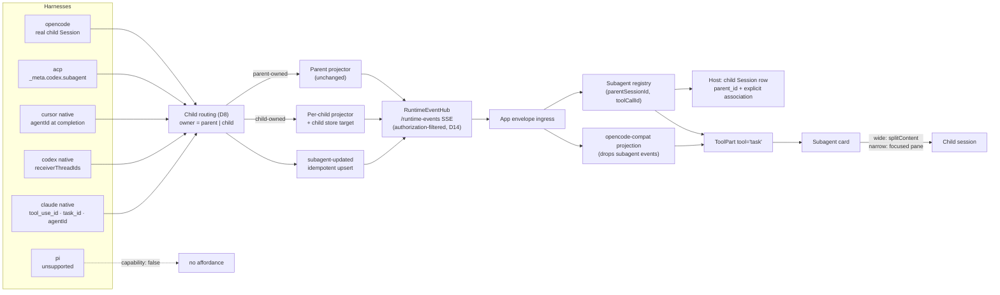

# Cross-Harness Subagents - Plan

## Goal Capsule

| Field | Contract |
|---|---|
| Objective | Make a subagent a first-class, uniform object on every harness that has one: recognized at spawn, rendered as a subagent card rather than a raw tool dump, status-tracked through its lifecycle, and openable beside its parent session. |
| Primary invariant | Within a parent Session, a subagent is identified by the **tool call that spawned it**, not by a child session id. The host-scoped identity is `(parentSessionId, toolCallId)`. Child Session identity is late-bound: some harnesses supply a provider identity at spawn, some only at completion, and one never supplies one at all. No surface may assume it exists. |
| Authority order | Harness adapters classify and correlate. The AgentRuntime event contract carries the lifecycle. The **host** owns child-session persistence. The compat projection stays out of it entirely — subagents are not OpenCode-compat events and never become them. |
| Execution profile | Cross-package: 6 harness adapters across 2 packages, 1 transport driver, the runtime event contract, the host store schema, the app's runtime-event ingress, and session-ui. |
| Stop conditions | Stop if child-event routing cannot give each child its own projector and store target — without it, unfiltering nested events corrupts the parent transcript, and no adapter unit may proceed. Stop if the contract-version bump cannot be landed atomically across the version constant, explicit version literals, and handshake coverage. Stop if the host store cannot take a `parent_id` migration without a rebuild (create-only schema hazard) — durability is a release requirement, not an optional tail. |
| Tail ownership | `injectTaskChildSessionId` and its fixture-generator comment are deleted only after the projection-adjacent path carries a real child id end to end. |

---

## Product Contract

### Summary

When an agent delegates work, the timeline shows a **subagent card**: the agent's name, what it was asked to do, a live status, and — where the harness supports it — a control that opens the subagent's own transcript in a pane beside the parent session. When the harness cannot supply a transcript, the card says so instead of offering a dead control. When the harness has no subagent concept at all, no affordance is rendered.

### Problem Frame

Subagents work on exactly one of eight rails. On every other rail the feature is broken, and it is broken at a different layer on each, which is why it has never been fixed as one thing.

The visible symptom on the Claude native SDK rail is a tool card reading `Called Agent` with a raw `{"tool_use_id":…,"type":"tool_result",…}` blob beneath it. That single screenshot contains four independent defects stacked on top of each other, and fixing any one alone changes nothing the user can see.

**The tool is not recognized.** `isTaskTool` matches only the literal string `"task"` ([claude/adapter.ts:100](../../packages/agent-event-runtime/src/harnesses/claude/adapter.ts:100)). The Claude CLI renamed the tool `Task` → `Agent` in v2.1.63; `Task` survives only as an alias, and `system:init` still reports the old name — so both must be accepted. Detection is currently dead against the pinned SDK. Note that `canonicalToolIntent` ([tool-display.ts:15](../../packages/agent-event-runtime/src/harnesses/tool-display.ts:15)) *does* already know `agent`, so the two classifiers in the same package disagree.

**The UI cannot name the tool.** Registry lookup is an exact, case-sensitive object index ([message-part.tsx:1768](../../packages/session-ui/src/components/message-part.tsx:1768)), and the projection passes harness tool names through verbatim ([projection.ts:910](../../packages/agent-event-runtime/src/projections/opencode-compat/projection.ts:910)). The committed `claude-sdk.json` fixture carries `"tool": "Grep"` — capitalized — proving that *every* tool on that rail misses the registry and falls through to `GenericTool`. The ACP rails work only by accident of ACP lowercasing.

**The result is not extracted.** The adapter emits the entire `tool_result` block as output ([claude/adapter.ts:547](../../packages/agent-event-runtime/src/harnesses/claude/adapter.ts:547)) rather than the text it extracted one line earlier. The projection's `output()` recovers `row.content` only when it is a string; the Agent tool's content is an array of blocks, so it falls through to raw JSON stringification. This affects any tool whose result content is an array, not just subagents.

**There is nothing to open.** The card needs `state.metadata.sessionId`, or a `Session` row whose `parentID` matches the current session. On every rail except the vendored OpenCode engine, neither exists — see the schema finding below.

Behind those four sits the structural problem: **the subagent event is degenerate.**

```ts
// packages/agent-event-runtime/src/contracts/agent-runtime-event.ts:89
| { type: "subagent-spawned"; childSessionId: string }
```

One field. No `toolCallId`, so it cannot be joined to the tool call that produced it. No type, description, status, or depth. **No terminal event**, so the lifecycle cannot be closed. And all three producers put a *label* where a session id belongs — [claude:167](../../packages/agent-event-runtime/src/harnesses/claude/adapter.ts:167) and [cursor:199](../../packages/agent-event-runtime/src/harnesses/cursor/adapter.ts:199) both pass an agent *type* like `"general-purpose"`. The tests lock the wrong value in: `claude/adapter.test.ts:224` and `cursor/adapter.test.ts:151` each assert `childSessionId: "code-reviewer"`.

Its only consumer discards it:

```ts
// packages/agent-event-runtime/src/projections/opencode-compat/projection.ts:1311
case "subagent-spawned":
  return []
```

It has never been anything else. Git history is squashed, but both root commits (`00a533c2f`, `728cedf2a`) already contain that stub at the same line.

### Current State

#### Where the decision is written down

Only one place, and it is an admission rather than a design note — [generate-harness-fixtures.ts:40-49](../../packages/claxedo-app/e2e/fixtures/generate-harness-fixtures.ts:40):

> the real `subagent-spawned` AgentRuntimeEvent is **intentionally dropped** by the opencode-compat projection … child-session correlation for the `task` tool card happens **client-side via a session-list lookup** … this script injects `state.metadata.sessionId` directly onto the COMPLETED task tool part after real generation — the one hand-touched field in this entire file.

The client-side correlator is a **title-string heuristic**: `title.startsWith(description) && title.includes("@"+agent)` ([message-part.tsx:624](../../packages/session-ui/src/components/message-part.tsx:624)). It works only because the OpenCode engine happens to compose child titles as `` `${description} (@${agent} subagent)` `` ([task.ts:145](../../packages/opencode/src/tool/task.ts:145)). That is an unversioned string contract between two packages that never agreed to one.

#### The harness matrix

Verified against each vendor's pinned typings and docs.

| Rail | Subagents in protocol | Tool name on wire | Child identity | Bound at | Child transcript | State today |
|---|---|---|---|---|---|---|
| **opencode** | Yes — own engine | `task` | real `SessionID`, `parentID` set | spawn | full, same event bus | **Works — reference impl** |
| **claude** native | Yes, rich | **`Agent`** (`Task` alias) | `tool_use_id` → `task_id` → `agentId` | `agentId` at **completion** | message-granular, needs a flag | Dead at 3 layers |
| **claude** ACP | None in ACP; vendor `_meta` | `task` | **none, ever** | — | needs a capability we never send | Card renders, never clickable |
| **codex** native | Yes — **richest** | `"tool"` (bug) | `receiverThreadIds[]`, `Thread.parentThreadId` | **spawn** | live, same item union | Killed upstream of the adapter |
| **codex** ACP | Yes — vendor `_meta.codex.subagent` | `Start subagent N` | `agentThreadId` | spawn | live | Real id on the wire, unread |
| **cursor** native | Yes | `task` | `result.value.agentId` + `transcriptPath` | **completion** | file only, no live stream | Wrong id, at the wrong time |
| **cursor** ACP | Title only | `Task: Subagent task` | none | — | none | Renders generic |
| **pi** | **None, by design** | — | — | — | — | n/a — declare unsupported |

Three consequences drive the whole design:

1. **`childSessionId` is the wrong primitive.** Only OpenCode has a child *session*. Claude has a task id plus an agent id, Codex has a thread id, Cursor has an agent id plus a file path. The one universal join key is the **spawning tool call id**, which the current event does not carry.
2. **Identity is late-bound on half the rails.** A single spawn-time event cannot express "I know a subagent started but not yet which one."
3. **Token-level child streaming exists only on OpenCode.** Claude's `SDKPartialAssistantMessage.parent_tool_use_id` is *always* null (`sdk.d.ts:4153`) — structural, not a config gap. Cursor's child work is one blocking result. Design for **message granularity**.

#### Per-rail defects

| Rail | Defect | Cite |
|---|---|---|
| claude | `isTaskTool` matches `"task"` only; CLI emits `"Agent"` | [adapter.ts:100](../../packages/agent-event-runtime/src/harnesses/claude/adapter.ts:100) |
| claude | `assistant` case reads **text blocks only**, so subagent `tool_use` blocks — which arrive as complete messages, never stream events — are never registered | [adapter.ts:558](../../packages/agent-event-runtime/src/harnesses/claude/adapter.ts:558) |
| claude | Consequence: subagent `tool_result` finds no entry in `byToolId` and silently `return []`, with no diagnostic | [adapter.ts:539](../../packages/agent-event-runtime/src/harnesses/claude/adapter.ts:539) |
| claude | `parent_tool_use_id` is never read anywhere in the file | (absent) |
| claude | Two spawn paths emit incompatible `childSessionId` — a type name vs a `task_id` | [:167](../../packages/agent-event-runtime/src/harnesses/claude/adapter.ts:167) vs [:713](../../packages/agent-event-runtime/src/harnesses/claude/adapter.ts:713) |
| claude | `output: result.block` discards the structured `tool_use_result` the SDK says to render from | [adapter.ts:547](../../packages/agent-event-runtime/src/harnesses/claude/adapter.ts:547) |
| claude | `task_updated` / `background_tasks_changed` bucketed as unmapped diagnostics — the whole status machine is lost | [:771](../../packages/agent-event-runtime/src/harnesses/claude/adapter.ts:771), [:761](../../packages/agent-event-runtime/src/harnesses/claude/adapter.ts:761) |
| claude | `task_progress` feeds **subagent** token counts into the **parent's** usage gauge | [adapter.ts:649](../../packages/agent-event-runtime/src/harnesses/claude/adapter.ts:649) |
| claude | `forwardSubagentText` — the SDK flag built for nested transcripts — is set nowhere in the repo | [driver.ts:170](../../packages/agent-sdk-runtime/src/harnesses/claude/driver.ts:170) |
| codex | **Every non-primary-thread notification is dropped before the adapter runs** | [driver.ts:261](../../packages/agent-sdk-runtime/src/harnesses/codex/driver.ts:261) |
| codex | `collabAgentToolCall` falls through to `dynamic_tool_call`; the real name lives in field `tool` which is never read, so it renders as the literal `"tool"` | [adapter.ts:65](../../packages/agent-event-runtime/src/harnesses/codex/adapter.ts:65), [:80](../../packages/agent-event-runtime/src/harnesses/codex/adapter.ts:80) |
| codex | `thread/started` — carrying `parentThreadId` — is bundled into the unmapped-event diagnostic | [adapter.ts:738](../../packages/agent-event-runtime/src/harnesses/codex/adapter.ts:738) |
| acp | `session()` reads `childSessionId`/`sessionId` variants but **not** codex-acp's `agentThreadId` or `_meta.codex.subagent.threadId` | [state.ts:211](../../packages/agent-event-runtime/src/harnesses/acp/state.ts:211) |
| acp | No registry rule for codex-acp's `Start subagent N` titles → classified `other` → GenericTool | [registry.ts](../../packages/agent-event-runtime/src/harnesses/acp/registry.ts) |
| acp | `clientCapabilities._meta["subagent-transcript"]` is never sent, so claude-agent-acp never forwards nested updates | [process.ts:298](../../packages/agent-sdk-runtime/src/harnesses/acp/process.ts:298) |
| cursor | `subagentId()` returns `subagentType.kind` — a type name — and fires at tool-**start**, when the real `agentId` does not exist yet | [adapter.ts:155](../../packages/agent-event-runtime/src/harnesses/cursor/adapter.ts:155), [:198](../../packages/agent-event-runtime/src/harnesses/cursor/adapter.ts:198) |
| cursor | On completion `ensureTool` short-circuits, so the real `agentId`/`transcriptPath` are never promoted | [adapter.ts:171](../../packages/agent-event-runtime/src/harnesses/cursor/adapter.ts:171) |
| host | The `session` table has **no `parent_id` column** | [store.ts:535](../../packages/workspace-runtime/src/store.ts:535) |
| ui | `SubagentChipRow` has no `taskSession()` fallback, so ≥2 subagent calls render as **permanently disabled** chips — worse than the single-card path | [subagent-chip.tsx:53](../../packages/session-ui/src/components/subagent-chip.tsx:53) |
| caps | `HarnessCapabilities` has 12 keys, none for subagents; `REQUIRED_KEYS` duplicates the list; **pi is not in the capability test at all** | [capabilities.ts](../../packages/agent-sdk-runtime/src/capabilities.ts), `harness-capabilities.test.ts:14` |

#### What the transport actually is

The wire carries **native `AgentRuntimeEvent`**. `/runtime-events` streams `RuntimeEventEnvelope { contractVersion, directory, sessionId, payload }` ([events.ts:13](../../packages/workspace-runtime/src/routes/events.ts:13)). There is no compat event stream for runtime-native sessions.

There are **two** compat projections, and both are keyed on the **parent** Session id. Missing the first one is the trap that makes the naive fix corrupt data:

1. **Server-side, persisting.** [`createTurnEventProjector`](../../packages/agent-sdk-runtime/src/harnesses/shared/turn-projection.ts:32) runs the compat projection over every accepted runtime event and **appends the output to the store** under `sessionId: options.sessionId` ([turn-projection.ts:60-69](../../packages/agent-sdk-runtime/src/harnesses/shared/turn-projection.ts:60)), then republishes the raw runtime event under the same parent id ([:51-59](../../packages/agent-sdk-runtime/src/harnesses/shared/turn-projection.ts:51)). Three call sites construct one: [runtime.ts:262](../../packages/agent-sdk-runtime/src/runtime.ts:262), [sdk-runtime-adapter.ts:408](../../packages/agent-sdk-runtime/src/harnesses/shared/sdk-runtime-adapter.ts:408), [acp/index.ts:958](../../packages/agent-sdk-runtime/src/harnesses/acp/index.ts:958).
2. **Client-side, live.** One instance per `(sessionId, assistantMessageId)` at [provider.tsx:193](../../packages/claxedo-app/src/app/providers/global-sdk/provider.tsx:193). Ownership is a session-id prefix test: `ses_` → legacy OpenCode, everything else → runtime-native ([ownership.ts:34](../../packages/agent-event-runtime/src/projections/opencode-compat/ownership.ts:34)).

**The consequence is the plan's single hardest constraint.** A child-thread event that reaches an adapter today is projected and *persisted* into the **parent's** transcript, because the projector has no notion of whose event it is. Unfiltering nested events without routing them therefore does not "show subagents" — it silently contaminates the parent transcript. Every adapter unit is gated on child routing landing first.

The projection's inability to create a session row is a self-imposed purity rule ([boundaries.md:26](../../packages/agent-event-runtime/docs/boundaries.md:26) gives hosts, not projections, ownership of persistence and session visibility) — not a process boundary. That remains the seam this plan uses for the *UI*; routing is what makes it safe.

---

## Planning Contract

### Why the Proposed Solution Is Better

The obvious fix — teach the compat projection to emit a subagent tool part with a child session id — is the wrong one. It would require a new `ClaxedoProjectionExtensionEvent` member, matching entries in `claxedoDirectoryEventTypes` and `mirroredByRuntimeProjection` kept manually in sync, and a full fixture regeneration, all to smuggle a non-OpenCode concept through an explicitly OpenCode-shaped contract.

Handling subagent events **beside** the projection costs none of that. The envelope call site already holds the raw event. The dropped-subagent case stays, and stays *correct* — subagents genuinely are not OpenCode-compat events. The existing `task` card lights up through `metadata.sessionId` exactly as it does for OpenCode today, so one renderer serves all eight rails and the OpenCode path is untouched.

What that framing alone does **not** buy is safety. The persisting projector is server-side and parent-keyed, so the routing layer (D8) is what makes nested events expressible at all. The plan's order is therefore: make child events routable, then make them meaningful, then make them visible.

### Key Technical Decisions

- **D1 — Subagents are runtime events, never compat events.** The compat projection continues to drop them. The app subscribes to the subagent lifecycle at the runtime-envelope call site, beside `projectRuntimeEventEnvelope`.
- **D2 — `(parentSessionId, toolCallId)` is the host identity.** The runtime envelope supplies the parent Session; the event supplies the tool-call identifier present on every rail (Claude `tool_use_id`, Codex collab item id, Cursor tool call id, OpenCode `callID`). Registries and persistence key on the pair. A concurrency test reuses one tool-call id across two parent Sessions and proves their state cannot collide.
- **D3 — One idempotent `subagent-updated` event, not a three-event lifecycle.** The event is a partial upsert: `{ type, parentSessionId, toolCallId, status?, label?, subagentType?, description?, providerId?, providerKind?, transcript?, usage? }`. Only the identity pair is required; every other field is last-writer-wins.
  *Rejected alternative:* separate `started` / `status` / `linked` events. It reads cleaner but pushes three hard problems onto every consumer — out-of-order arrival (`status` before `started`), missing `started` after a replay gap, and duplicate `started` on reconnect. An idempotent upsert makes all three a no-op by construction, adds one union member instead of three, and shrinks the contract-version blast radius. The cost is that "is this new?" becomes a registry question rather than an event-type question, which the registry already has to answer anyway.
- **D4 — Provider identity and host identity are separate fields and never conflated.** `providerId` is the upstream's own handle (Claude `agentId`, Codex thread id, Cursor `agentId`) with `providerKind` naming its namespace. `childSessionId` is the Claxedo Session the host materializes. A rail may have the first without the second, the second without the first, or neither. Nothing may derive one from the other.
- **D5 — Status is a normalized enum with an explicit terminal set.** `pending | running | paused | interrupted | completed | failed | killed`. Terminal = `completed | failed | killed | interrupted`. A transition out of a terminal status is ignored and recorded as a diagnostic, so a late duplicate cannot resurrect a finished subagent. Codex is the only rail with a genuine state machine; the others map onto a subset and must not invent intermediate states.
- **D6 — Transcript availability is declared, and every reference is host-mediated.** `transcript: {kind: "live" | "file" | "messages" | "none", ref?}`. `ref` is an **opaque host-issued handle**, never a raw filesystem path — see D14. The UI renders an open control only for kinds it can service; a rail that cannot produce a transcript must not show a spinner that never resolves.
- **D7 — `subagents` becomes a required `HarnessCapabilities` key.** The struct is exhaustive, so omission is a compile error rather than a silent `false`. Pi is `false` and is added to the capability test, which currently does not import it at all.
  *Why a flag when events already imply support:* absence of events is indistinguishable from "no subagent has started yet". The capability is what lets a surface decide **proactively** whether to reserve space, render an empty state, or render nothing at all. Reactive-only would flash an empty panel on every supported session.
- **D8 — Child events are routed, never merely unfiltered.** Each child gets its own projector, store target, and publish identity before any event reaches the shared projection path. `createTurnEventProjector` gains an explicit owning-session parameter rather than inheriting the parent's. An event whose owner cannot be resolved is dropped with a diagnostic — never defaulted to the parent. This is the P0 constraint and it lands before any adapter unit.
- **D9 — Durability is a release requirement, not a tail.** A subagent that vanishes on reload is a bug. The live-only path exists only as an internal stepping stone inside U4; it is not a shippable state and no DoD item is satisfied by it.
- **D10 — New child rows are associated explicitly; the title heuristic becomes legacy-read-only.** Host-materialized rows record `(parentSessionId, toolCallId)` and are resolved by it. `taskSession()`'s `title.startsWith(description)` match is retained **only** for legacy `ses_` sessions, because it cannot distinguish two same-agent calls with identical descriptions — exactly the collision the new identity exists to prevent. The title format is still written compatibly so legacy readers keep working, but nothing new resolves through it.
- **D11 — Tool-name identity is fixed independently and first.** Case-insensitive registry lookup plus an `agent → task` alias is orthogonal to the contract work. It deliberately repairs *every* capitalized tool on the Claude rail rather than only subagents, because the same one-line lookup is the cause and scoping it narrower would leave a known-broken path in place.
- **D12 — The contract version bumps exactly once, atomically.** Adding a union member changes `AGENT_RUNTIME_EVENT_CONTRACT_VERSION`; the handshake rejects a mismatch. One commit updates the constant, the contract test asserting `=== 3`, and the hard-coded version constant, assertion, and comments in `packages/claxedo-app/e2e/playwright/core-user-hosted-workspace.spec.ts`. The hub, SSE route, app parser, and provider tests import the shared constant and must remain green in the same commit.
- **D13 — Open beside on wide viewports; substitute a full-pane push on narrow ones.** `splitContent(targetPane, edge, id)` already exists on the workbench API ([orchestration.ts:53](../../packages/claxedo-app/src/app/workbench/state/orchestration.ts:53)) and no subagent path calls it. Below the tablet breakpoint a side-by-side split is unusable, so the child opens as a focused pane with an explicit back affordance to the parent. Repeated activation focuses the existing pane rather than opening a second.
- **D14 — Nested transcripts inherit parent authorization and are host-resolved.** A child transcript is readable exactly when its parent Session is. The SSE stream and replay filter child events server-side by the subscriber's parent authorization — a client-side filter is not sufficient. File-backed transcripts are never exposed as paths: the host issues an opaque handle, resolves it through `realpath`, confines it to the workspace root, rejects symlink escapes, enforces a size and parse limit, and re-validates at open because a vendor-written file may move or change between spawn and read.

### High-Level Technical Design



The subagent registry is a pure state machine keyed by `(parentSessionId, toolCallId)`, holding `{status, label, providerId?, providerKind?, childSessionId?, transcript}`. It is testable with no DOM and no harness.

**Registry lifecycle.** Entries are dropped when their parent Session is deleted or archived, when the workspace directory changes, and when a replay gap invalidates the stream (the existing `resetRuntimeReplayGapState` path). An aborted parent turn marks every non-terminal child `interrupted` rather than leaving it spinning. These are the cleanup paths that a naive `Map` keyed on a growing id set would leak.

### System-Wide Impact

| Area | Impact |
|---|---|
| Turn projection | `createTurnEventProjector` gains an explicit owning-session parameter; all three construction sites pass it. This is the P0 seam and the highest-blast-radius change in the plan. |
| Event contract | `subagent-spawned` is **replaced** by one idempotent `subagent-updated`. Union, type registry (`satisfies Record`), factory-coverage assertion, and the projection's `assertNever` are all compile-time gates that force every call site. |
| Contract version | Bumps 3 → 4. The shared constant, explicit version literals, and handshake coverage move together (D12). |
| `agent-sdk-runtime` capabilities | `HarnessCapabilities` gains required `subagents`. Every `readHarnessCapabilities` must set it. `REQUIRED_KEYS` and the missing pi import in `harness-capabilities.test.ts` are both updated. |
| codex driver | The primary-thread filter becomes thread-aware routing rather than a drop — safe only after D8 lands. |
| acp process | `clientCapabilities._meta["subagent-transcript"]` is added, changing what claude-agent-acp forwards. |
| Host store | New `parent_id` column plus an explicit `(parentSessionId, toolCallId)` association, a stored provider identity, transcript reference, and status. A column alone cannot persist linkage. |
| Host API | A new read path returning a parent's children with enough state to rehydrate cards after reload, and a resolver endpoint for file-backed transcripts (D14). |
| SSE / replay | Child events are filtered server-side by parent authorization; replay honors the same filter. |
| App ingress | New subagent handler at the runtime-envelope call site, plus registry teardown on session delete, workspace switch, abort, and replay gap. The compat projection is unchanged. |
| session-ui | Registry lookup becomes case-insensitive; `agent` aliases to `task`; `SubagentChipRow` gains the same fallback the card has; child panes declare themselves read-only. |
| Fixtures | `injectTaskChildSessionId` and its header comment are deleted; all eight harness traces regenerate. Hand-editing is explicitly rejected by the generator. |

### Risks and Mitigations

| Risk | Mitigation |
|---|---|
| **Child events contaminate the parent transcript.** The persisting projector is parent-keyed, so any nested event that reaches it is written into the parent's journal. | D8 lands first as its own unit. An event whose owner cannot be resolved is dropped with a diagnostic, never defaulted to the parent. U1 pins the current parent-only transcript as a regression that must stay byte-identical through every later unit. |
| The contract freezes before it has met real data and needs a second bump. | U4 validates the contract vertically against three deliberately different rails — Codex (identity at spawn), Cursor (identity at completion), claude-acp (no identity ever) — before the version bump is committed. |
| The contract-version bump desynchronizes client and server, producing a hard handshake reject. | Bump the shared constant and every explicit literal in one commit (D12); verify with the existing handshake tests before merging. Treat a partial bump as a stop condition. |
| Host store is create-only style; an `ALTER` may not be supported. | U10 opens with a migration-feasibility spike. If a rebuild is required, that is the unit's scope — durability is not optional (D9), so a rebuild is the cost of the feature rather than a reason to defer it. |
| `forwardSubagentText: true` materially increases event volume on Claude. | Concrete threshold: if a representative subagent turn exceeds ~2× the parent's event count or 5 MB of forwarded text, keep the default heartbeat-only forwarding and serve the transcript from the on-disk JSONL through the D14 resolver instead. Measure in U5 and record the number in the unit's acceptance. |
| Claude's `providerId` only exists at completion, so a running subagent cannot be addressed. | D3's upsert carries no identity until one exists; D4 forbids deriving it. The card renders running-without-transcript until an identity arrives. |
| A file-backed transcript reference goes stale or is mutated between spawn and open. | D14 re-validates at open rather than trusting the spawn-time reference, and surfaces a typed `unavailable` state instead of a partial read. |
| Green tests that assert nothing — the failure mode this codebase has hit repeatedly. | Every mutation in the Verification Contract must make its named scenario fail. `includes()`-shaped assertions are banned in favor of probing the collection. |
| Fixing only the visible symptom (the raw JSON blob) and declaring victory. | U2 is explicitly cosmetic and is *not* allowed to close any subagent DoD item. The card it produces is deliberately non-clickable. |
| Subagent work becomes a second, competing user-facing object alongside the planned `BackgroundTask`. | This plan owns the **in-transcript** representation only: a tool call and its child Session. It deliberately introduces no task list, no cross-session inventory, and no scheduling surface. If [2026-07-18-002](./2026-07-18-002-feat-background-agents-steering-plan.md) later lands, `BackgroundTask` becomes the durable record and consumes the `(parentSessionId, toolCallId)` identity defined here rather than replacing it. |

### Prerequisites

- None external. U2 can land immediately and independently of everything else.

### Sequencing

Record each U1 characterization test in its current red or green state before its owning implementation unit starts. U2 may begin after its Claude/UI U1 slice is recorded while characterization of unrelated rails continues.

**U3 (child routing) gates every adapter unit.** No rail may emit or forward a nested event until an owner can be resolved for it. U4 freezes the contract, but only after validating it vertically against three deliberately different rails. U5–U9 are five independently owned rails behind that contract. U10 and U11 are host-side and start after U4 in parallel with the rails. U12 converges the UI; U13 closes.

**Product checkpoint after U2.** U2 fixes the demonstrated pain — the raw JSON blob the user actually reported — and is independently shippable. Ship it, then confirm the remaining rails are still worth the full build before committing to U3 onward. The requested scope is all eight rails, so the default is to proceed; the checkpoint exists so that decision is made deliberately rather than by momentum. Within the fan-out, order the rails by observed session volume rather than by implementation convenience.

---

## Implementation Units

### U1. Characterize every rail with red evidence

Write failing tests that pin the broken behavior **before** changing its owning code: Claude does not recognize `"Agent"`; capitalized Claude tool names miss the registry; array-content tool results stringify to raw JSON; Codex child-thread events never reach the adapter; Cursor emits a type name as an id at spawn; and ACP `metadata.sessionId` is always undefined. Add green regression coverage for the working OpenCode reference rail and for Pi's intentionally unsupported behavior. Retain each test as the acceptance or regression test for its later unit.

Additionally, capture a **byte-identical baseline of the parent transcript** for a Codex session that spawns a subagent. This baseline is the regression gate for U3 and U6 — the two units that change what reaches the projector.

*Acceptance:* every claim in the harness matrix has a characterization test: defects fail today and name the unit that will turn them green; the OpenCode reference and Pi negative cases pass and remain green; the Codex parent-transcript baseline is recorded and reproducible.

### U2. Tool-name identity and result extraction

Make registry lookup case-insensitive and alias `agent → task` ([message-part.tsx:1768](../../packages/session-ui/src/components/message-part.tsx:1768), `TOOL_NAME_ALIASES`). Emit `result.text` rather than `result.block` ([claude/adapter.ts:547](../../packages/agent-event-runtime/src/harnesses/claude/adapter.ts:547)) and teach the projection's `output()` to flatten array-shaped content. Accept both `agent` and `task` in `isTaskTool`.

Ships alone, changes no contract. Fixes every capitalized tool on the Claude rail, not only subagents.

*Acceptance:* the Claude rail renders a proper subagent card with clean output. The card is **not** clickable — that is U3+. No DoD item about opening a subagent may be checked by this unit.

### U3. Child event routing — the P0

Give `createTurnEventProjector` an explicit owning-session parameter instead of inheriting `options.sessionId` for everything, and thread it through all three construction sites ([runtime.ts:262](../../packages/agent-sdk-runtime/src/runtime.ts:262), [sdk-runtime-adapter.ts:408](../../packages/agent-sdk-runtime/src/harnesses/shared/sdk-runtime-adapter.ts:408), [acp/index.ts:958](../../packages/agent-sdk-runtime/src/harnesses/acp/index.ts:958)). Add per-child projector and store targets, created lazily on first child-owned event. Publish child runtime events under the child's identity. An event whose owner cannot be resolved is dropped with a diagnostic and never attributed to the parent.

No adapter changes here — this unit ships with every rail still parent-only, and the parent transcript must not move.

*Acceptance:* U1's Codex parent-transcript baseline is byte-identical after the change. A synthetic child-owned event lands in the child's store and provably not in the parent's. An unresolvable-owner event produces a diagnostic and no journal write.

### U4. The subagent contract

Replace `subagent-spawned` with one idempotent `subagent-updated` (D3–D5). Add required `subagents` to `HarnessCapabilities`; set Pi to `false`, update `REQUIRED_KEYS`, and add the missing Pi import to `harness-capabilities.test.ts`. Add the app-side registry with the teardown paths named in the design section.

**Validate before freezing.** Prototype the contract vertically against three rails chosen for maximum shape difference — Codex (identity at spawn, live transcript), Cursor (identity at completion, file transcript), claude-acp (no identity, no transcript) — and only then bump the contract version atomically across the D12 sites. A contract that cannot express all three without an optional-field escape hatch is not ready.

*Acceptance:* omitting `subagents` from any harness is a compile error. The projection still returns `[]` for subagent events. Replayed and out-of-order upserts converge to the same registry state. A terminal-status entry ignores a later non-terminal update and records a diagnostic. All three validation rails round-trip before the version bump commits.

### U5. Claude native SDK

Accept `Agent` and `Task`. Register subagent `tool_use` blocks arriving as complete assistant messages, correlated by `parent_tool_use_id`, so their `tool_result`s stop being silently dropped. Map `task_started` / `task_notification` / `task_updated` / `background_tasks_changed` onto `subagent-updated`, honoring the level-vs-edge distinction of `background_tasks_changed`. Read the structured `tool_use_result` for `agentId` and stats. Stop feeding subagent tokens into the parent usage gauge. Evaluate `forwardSubagentText` against the volume threshold in Risks and record the measured number.

*Acceptance:* U1's Claude scenarios are green; a subagent's own tool calls appear in its transcript; the parent context gauge is unaffected by subagent tokens; the forwarding decision is recorded with its measurement.

### U6. Codex native

Convert the driver's primary-thread drop into thread-aware routing ([driver.ts:261](../../packages/agent-sdk-runtime/src/harnesses/codex/driver.ts:261)), feeding U3's owner resolution. Map `collabAgentToolCall`, reading the real name from field `tool` and the identity from `senderThreadId`/`receiverThreadIds`. Map `thread/started`'s `parentThreadId`. Codex is the only rail with a genuine status machine — map `CollabAgentStatus` onto D5's enum rather than collapsing it.

*Acceptance:* a Codex subagent streams live into its own pane; the parent transcript is byte-identical to U1's baseline.

### U7. ACP rails

Add a codex-acp registry rule for the `Start/Interact/Interrupt subagent` titles. Teach `session()` to read `agentThreadId` and `_meta.codex.subagent.threadId`. Classify Cursor ACP's `Task: Subagent task` title as a subagent with `transcript: none`. Send `clientCapabilities._meta["subagent-transcript"]` ([process.ts:298](../../packages/agent-sdk-runtime/src/harnesses/acp/process.ts:298)).

claude-acp has **three** distinct outcomes and each needs its own coverage, because they look alike in the UI and differ completely in cause:
1. **Capability declined** — the agent did not accept `subagent-transcript`. Render `transcript: none`, permanently.
2. **Capability accepted, nothing forwarded yet** — render a running subagent with no transcript control, not an empty transcript.
3. **Capability accepted, nested updates arriving** — render `transcript: messages`, correlated by `parentToolUseId`.

*Acceptance:* codex-acp subagents carry a real thread id; all three claude-acp outcomes are distinguishable in tests and in the UI; Cursor ACP renders a non-openable subagent card rather than a generic tool.

### U8. Cursor native

Emit `subagent-updated` at spawn with no identity, and again at completion carrying the real `agentId` as `providerId` plus a host-issued transcript handle derived from `transcriptPath` (never the raw path — D14). Remove the `ensureTool` short-circuit that currently discards the completion payload.

*Acceptance:* U1's Cursor scenario is green; two concurrent same-type subagents no longer collide; no raw filesystem path crosses the runtime boundary.

### U9. Pi and capability gating

Gate every subagent affordance on the `subagents: false` capability established for Pi in U4, so an unsupported harness renders nothing rather than an empty panel that reads as "in flight".

*Acceptance:* no subagent DOM exists on a pi session.

### U10. Host persistence and the read path

Open with the migration-feasibility spike (see Risks). Then: add `parent_id` plus the explicit `(parentSessionId, toolCallId)` association, stored provider identity, transcript reference, and status. Add the host read path that returns a parent's children with enough state to rehydrate cards after reload, and the reconciliation rule for a child row whose parent turn ended while the app was disconnected. Write titles in the legacy-compatible format (D10) without resolving through them.

*Acceptance:* a subagent opened before reload is still openable after reload, with its status intact. A child orphaned by a disconnect reconciles to a terminal status rather than spinning forever.

### U11. Transcript resolution and authorization

Implement the D14 host resolver: opaque handles, `realpath` + workspace-root confinement, symlink-escape rejection, size and parse limits, re-validation at open, and a typed `unavailable` state. Filter child events server-side on the SSE and replay paths by the subscriber's parent authorization.

*Acceptance:* a handle pointing outside the workspace root is rejected; a symlink escape is rejected; a file mutated between spawn and open yields `unavailable` rather than a partial read; a subscriber without access to the parent Session receives no child events, proven by a negative test against the stream rather than the UI.

### U12. UI surface

Open the child with `splitContent` on wide viewports and a focused pane with a back affordance below the tablet breakpoint (D13). Repeated activation focuses the existing pane. Give `SubagentChipRow` the same fallback the card has; subagents with `transcript: none` render as non-interactive status labels rather than disabled open controls. Child panes are **read-only in v1** — no composer, no abort, no interrupt — and declare that explicitly rather than showing inert controls. Delete `injectTaskChildSessionId` and its header comment; regenerate all eight harness traces with the generator.

Ship a visible-state matrix covering every combination of `{status} × {transcript kind}`, with accessible name, announcement, and keyboard path for each.

*Acceptance:* the state matrix renders correctly at desktop and mobile widths; every state is reachable and legible by keyboard alone and by screen reader; no fixture contains a hand-injected field.

### U13. E2E matrix

Cover every supported rail end to end: spawn → status → open → child transcript → parent still intact. Include the pi negative case, the three claude-acp outcomes, and the authorization negative test.

*Acceptance:* the matrix spec passes on every rail with its declared capability.

---

## Deferred Follow-on

- Nesting depth beyond 1. Only Codex carries it (`SubAgentSource.thread_spawn.depth`); the others would be hardcoded.
- Adopting the unshipped [2026-07-18-002](./2026-07-18-002-feat-background-agents-steering-plan.md) `BackgroundTask` record and portable Claxedo task tool. This plan deliberately does not implement a Claxedo-owned task tool for harnesses that lack one, and owns only the in-transcript representation — see the boundary note in Risks.
- Reading Cursor's `conversationSteps` (typed `unknown[]`, shape unverified) as an alternative to the on-disk transcript.
- **Interactive child panes.** Composer, abort, interrupt, and steer inside a subagent pane. Codex exposes `sendInput` / `interrupt` and Claude exposes `TaskStop`, so this is achievable on some rails, but a control that works on two of eight rails is worse than no control. Revisit once the read-only surface is proven.

---

## Verification Contract

### Unit and contract verification

- `packages/agent-event-runtime` — the upsert contract, idempotency and out-of-order convergence, terminal-status immutability, per-rail adapter classification and correlation, projection still drops subagent events.
- `packages/agent-sdk-runtime` — owner-scoped turn projection, per-child store targets, capability exhaustiveness including pi, codex thread routing, acp client capabilities.
- `packages/workspace-runtime` — child association, read path, reconciliation, transcript-handle resolution and confinement, SSE authorization filtering.
- `packages/claxedo-app` — the subagent registry state machine and its teardown paths, envelope-ingress handling, pane open behavior.
- Check `scripts.test` for the runner before invoking; a `bun test` in a vitest package reports misleading results.

### Type checking

Typecheck `agent-event-runtime`, `agent-sdk-runtime`, `workspace-runtime`, and `claxedo-app`. Typecheck tsconfigs exclude `*.test.ts` — a green typecheck does not mean the tests compile. Run the suites too.

### Required mutation checks

Each mutation below must make its named scenario fail:

- Default an unresolvable-owner event to the parent instead of dropping it → the U3 contamination test must fail.
- Revert the projector's owning-session parameter to `options.sessionId` → the child-store isolation test must fail.
- Revert `isTaskTool` to `"task"` only → the Claude recognition scenario must fail.
- Restore case-sensitive registry lookup → the capitalized-tool scenario must fail.
- Emit `result.block` again → the raw-JSON scenario must fail.
- Restore the codex primary-thread drop → the Codex subagent scenario must fail.
- Emit Cursor's identity at spawn → the concurrent-same-type scenario must fail.
- Derive `childSessionId` from `providerId` → the D4 separation test must fail.
- Apply a non-terminal update to a terminal entry → the status-immutability test must fail.
- Replay an upsert twice → any test that passes only on exactly-once delivery must fail (proving idempotency is asserted, not assumed).
- Declare `subagents: true` on pi → the no-affordance scenario must fail.
- Make the projection emit a subagent part → the boundary test must fail.
- Resolve a new child row through the title heuristic → the explicit-association test must fail.
- Accept a transcript handle resolving outside the workspace root → the confinement test must fail.
- Skip the SSE authorization filter → the cross-session negative test must fail.
- Remove the chip fallback → the ≥2-subagent scenario must fail.
- Skip registry teardown on workspace switch → the leak test must fail.
- Skip a required contract-version literal or handshake update → the contract-version verification must fail.

A test that stays green under its own mutation does not count as coverage.

### Visual and interaction verification

Verify the full `{status} × {transcript kind}` state matrix in the running app at desktop and mobile widths, on at least Claude native and Codex native. Every state must be legible without color, opacity, or hover; reachable by keyboard alone; and correctly announced. Verify the narrow-viewport substitution for "beside" and the back affordance to the parent.

---

## Definition of Done

### Global completion criteria

- [ ] **No child event is ever written into a parent's transcript**, proven by store-level assertion, not by UI inspection. *Progress:*
- [ ] The Codex parent transcript is byte-identical to U1's baseline after routing and adapter changes. *Progress:*
- [ ] No rail renders a subagent as `Called <tool>` with a raw JSON dump. *Progress:*
- [ ] `subagent-spawned` no longer exists; one idempotent `subagent-updated` replaces it. *Progress:*
- [ ] Every subagent event carries `(parentSessionId, toolCallId)`; nothing else is required. *Progress:*
- [ ] Replayed, duplicated, and out-of-order upserts converge to identical registry state. *Progress:*
- [ ] A terminal subagent cannot be resurrected by a late update. *Progress:*
- [ ] Provider identity and host child-session identity are never derived from one another. *Progress:*
- [ ] `subagents` is a required capability; omitting it is a compile error; pi is `false` and is covered by the capability test. *Progress:*
- [ ] The compat projection still returns `[]` for every subagent event, and a test pins that. *Progress:*
- [ ] The contract version bump landed atomically, and only after the three-rail validation passed. *Progress:*
- [ ] Activating a subagent opens it beside its parent on wide viewports and as a focused pane with a back affordance on narrow ones; repeat activation focuses rather than duplicates. *Progress:*
- [ ] Transcript availability is declared per rail; no rail shows a control it cannot service. *Progress:*
- [ ] No raw filesystem path crosses the runtime boundary; every transcript reference is an opaque host-issued handle. *Progress:*
- [ ] A handle outside the workspace root, a symlink escape, and a mutated file each fail closed with a typed state. *Progress:*
- [ ] A subscriber without parent access receives no child events, proven against the stream. *Progress:*
- [ ] A subagent opened before reload is still openable after reload, with status intact. *Progress:*
- [ ] Registry entries are torn down on session delete, workspace switch, abort, and replay gap. *Progress:*
- [ ] Subagent tokens do not inflate the parent context gauge. *Progress:*
- [ ] `injectTaskChildSessionId` is deleted and all eight fixtures are regenerated, not hand-edited. *Progress:*
- [ ] Every openable chip resolves to a child Session and is enabled; no-transcript subagents render as non-interactive status labels. *Progress:*
- [ ] Child panes are read-only and say so; no inert controls are rendered. *Progress:*
- [ ] The full `{status} × {transcript kind}` matrix is keyboard-reachable, announced, and legible without color. *Progress:*
- [ ] Every mutation check fails as specified. *Progress:*
- [ ] The state matrix and both pane behaviors have been visually verified in the running app. *Progress:*

### Per-unit completion

- [ ] U1 is done when every matrix claim has a characterization test — broken behavior red with a named owning unit, OpenCode and Pi green — and the Codex parent-transcript baseline is recorded. *Progress:*
- [ ] U2 is done when the Claude rail renders a clean subagent card that is deliberately not clickable, with no contract change. *Progress:*
- [ ] U3 is done when a child-owned event lands only in the child's store, an unresolvable owner is dropped with a diagnostic, and the parent baseline is unmoved. *Progress:*
- [ ] U4 is done when the contract is exhaustive, idempotent under replay and reordering, terminal-safe, validated against all three shape-distinct rails, and the version bump is atomic. *Progress:*
- [ ] U5 is done when subagent tool calls appear in the child transcript, parent usage is unaffected, and the forwarding decision carries its measurement. *Progress:*
- [ ] U6 is done when a Codex subagent streams live and the parent transcript matches the U1 baseline byte for byte. *Progress:*
- [ ] U7 is done when codex-acp carries a real thread id, all three claude-acp outcomes are distinguishable, and Cursor ACP renders as a subagent. *Progress:*
- [ ] U8 is done when two concurrent same-type Cursor subagents no longer collide and no raw path escapes. *Progress:*
- [ ] U9 is done when no subagent DOM exists on a pi session. *Progress:*
- [ ] U10 is done when a subagent survives reload with status intact and a disconnect-orphaned child reconciles to terminal. *Progress:*
- [ ] U11 is done when confinement, symlink, mutation, and cross-session authorization tests all fail closed. *Progress:*
- [ ] U12 is done when the state matrix passes at both widths by keyboard and screen reader, and no fixture is hand-touched. *Progress:*
- [ ] U13 is done when the matrix spec passes on every rail including all negative cases. *Progress:*

---

## Execution: parallelize with agents and workflows

- **Staged immediate work:** Record the Claude/UI U1 characterization slice before U2 changes its behavior. U2 may then proceed while unrelated U1 rail characterization continues. U2 is shippable on its own and is the product checkpoint.
- **Sequential spine:** U3 (routing) then U4 (contract). Both are single-owner, single-commit units — U3 because a partial routing change is a data-corruption hazard, U4 because the version bump must be atomic. Nothing forks until both are green.
- **Five-way fan-out after U4:** U5 (claude), U6 (codex), U7 (acp), U8 (cursor), U9 (pi) are independently owned. Assign one agent per unit and order them by observed session volume. U6 is the long pole and the highest-risk.
- **Concurrent with the fan-out:** U10 (host persistence) and U11 (transcript resolution and authorization) depend on U4's contract but on no adapter, so both start immediately after it. U10 opens with its migration spike — start that first, because a rebuild verdict changes the unit's shape.
- **Convergence:** U12 starts after the relevant rails plus U10 and U11 are green; U13 runs last.
- **Parallel verification:** run the mutation checks as a fan-out — each is independent, and a serial pass is the slowest way to discover an assertion does not bite. The three U4 validation rails are also a natural fan-out.

Pipeline rather than barrier: the cursor unit must not wait on the codex unit's parity tests to start. The one place a barrier is genuinely required is U3 → U4 → everything, because both spine units change shared contracts that the rails compile against.

---

## Appendix

### Files whose current contracts intentionally change

- `packages/agent-sdk-runtime/src/harnesses/shared/turn-projection.ts` — `createTurnEventProjector` stops inheriting the parent session for every event; all three construction sites change with it. **This is the P0 seam.**
- `packages/agent-event-runtime/src/contracts/agent-runtime-event.ts` — `subagent-spawned` is removed, not deprecated; the version constant moves.
- `packages/agent-sdk-runtime/src/capabilities.ts` — `HarnessCapabilities` gains a required field; every implementation must be revisited.
- `packages/agent-sdk-runtime/src/harnesses/codex/driver.ts` — the primary-thread filter becomes routing; safe only behind U3.
- `packages/claxedo-app/e2e/fixtures/generate-harness-fixtures.ts` — `injectTaskChildSessionId` is deleted along with its header comment.
- `packages/workspace-runtime/src/store.ts` — the `session` table gains `parent_id` and the child association, provider identity, transcript reference, and status.

### What deliberately does not change

- `projection.ts:1311` keeps returning `[]` for subagent events. This is correct, not a bug: subagents are not OpenCode-compat events. The plan removes the *need* for the projection to know about them rather than teaching it to.
- The OpenCode engine's own `task.ts` child-session behavior. It is the reference implementation; every other rail is being brought toward it.
- `taskSession()`'s title heuristic, retained **read-only** for legacy `ses_` sessions. Nothing created by this plan resolves through it (D10).
- The parent transcript, on every rail. Byte-identical is a gate, not an aspiration.

### Review-driven revisions

This plan was revised after an adversarial review. The three changes that altered the design rather than the wording:

1. **The P0.** The original draft asserted the compat projection ran client-side only. A second, *persisting* projector runs server-side in `turn-projection.ts` and is parent-keyed, which makes "unfilter nested events" a data-corruption bug rather than a rendering change. U3 exists because of this.
2. **Three events collapsed to one.** The original `started`/`status`/`linked` triple pushed out-of-order arrival, replay-gap gaps, and reconnect duplicates onto every consumer. An idempotent upsert makes all three vacuous (D3).
3. **Durability stopped being optional.** The draft simultaneously permitted stopping before the persistence unit and required reload survival in its DoD. Reload survival won (D9).
