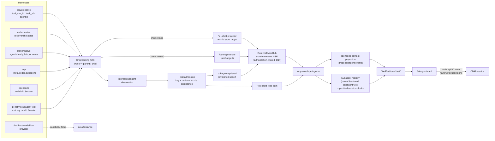

# Cross-Harness Subagents - Plan

## Goal Capsule

| Field | Contract |
|---|---|
| Objective | Make a subagent a first-class, uniform object on every harness that has one: recognized at spawn, rendered as a subagent card rather than a raw tool dump, status-tracked through its lifecycle, and openable beside its parent session whenever the rail exposes a readable transcript. |
| Primary invariant | A subagent is identified by **itself**, not by the call that spawned it. The host key is `(parentSessionId, subagentKey)` — a host-minted identity, optionally *associated* with a provider handle, never replaced by one. The spawning tool call is an **edge**, not an identity: one call may address many subagents, one subagent may be addressed by many calls, and some subagents have no call at all. Provider handles and child Session ids may arrive at spawn, arrive at completion, or never arrive; no surface may assume either exists, and no identity may change when one does. |
| Authority order | Harness adapters classify and correlate. The AgentRuntime event contract carries the lifecycle. The **host** owns child-session persistence. The compat projection stays out of it entirely — subagents are not OpenCode-compat events and never become them. |
| Execution profile | Cross-package: 6 harness adapters across 2 packages, 1 transport driver, the runtime event contract, the host store schema, the app's runtime-event ingress, and session-ui. |
| Stop conditions | Stop if child-event routing cannot give each child its own projector and store target — without it, unfiltering nested events corrupts the parent transcript, and no adapter unit that emits or forwards child-owned events may proceed. Classification and output-extraction work that remains parent-only is exempt. Stop if the contract-version bump cannot be landed atomically across the version constant, explicit version literals, and handshake coverage. Stop if the host store cannot take a `parent_id` migration without a rebuild (create-only schema hazard) — durability is a release requirement, not an optional tail. |
| Tail ownership | `injectTaskChildSessionId` and its fixture-generator comment are deleted only after the projection-adjacent path carries a real child id end to end. |

---

## Product Contract

### Summary

When an agent delegates work, the timeline shows a **subagent card**: the agent's name, what it was asked to do, a live status, and — where the harness supports it — a control that opens the subagent as a workspace Session tab in a pane beside the parent session. When the harness cannot supply a transcript, the card says so instead of offering a dead control. When the harness has no subagent concept at all, no affordance is rendered. V1 represents direct children only; nested descendants remain visible inside their direct parent's transcript until depth-aware navigation is designed.

### Problem Frame

Subagents work on exactly one of eight rails. On every other rail the feature is broken, and it is broken at a different layer on each, which is why it has never been fixed as one thing.

The visible symptom on the Claude native SDK rail is a tool card reading `Called Agent` with a raw `{"tool_use_id":…,"type":"tool_result",…}` blob beneath it. That single screenshot contains four independent defects stacked on top of each other, and fixing any one alone changes nothing the user can see.

**The tool is not recognized.** `isTaskTool` matches only the literal string `"task"` ([claude/adapter.ts:100](../../packages/agent-event-runtime/src/harnesses/claude/adapter.ts:100)). The Claude CLI renamed the tool `Task` → `Agent` in v2.1.63; `Task` survives only as an alias, and `system:init` still reports the old name — so both must be accepted. Detection is currently dead against the pinned SDK. Note that `canonicalToolIntent` ([tool-display.ts:15](../../packages/agent-event-runtime/src/harnesses/tool-display.ts:15)) *does* already know `agent`, so the two classifiers in the same package disagree.

**The UI cannot name the tool.** Registry lookup is an exact, case-sensitive object index ([message-part.tsx:1768](../../packages/session-ui/src/components/message-part.tsx:1768)), and the projection passes harness tool names through verbatim ([projection.ts:910](../../packages/agent-event-runtime/src/projections/opencode-compat/projection.ts:910)). The committed `claude-sdk.json` fixture carries `"tool": "Grep"` — capitalized — proving that *every* tool on that rail misses the registry and falls through to `GenericTool`. The ACP rails work only by accident of ACP lowercasing.

**The result is not extracted.** The adapter emits the entire `tool_result` block as output ([claude/adapter.ts:547](../../packages/agent-event-runtime/src/harnesses/claude/adapter.ts:547)) rather than the text it extracted one line earlier. The projection's `output()` recovers `row.content` only when it is a string; the Agent tool's content is an array of blocks, so it falls through to raw JSON stringification. This affects any tool whose result content is an array, not just subagents.

**There is nothing to open.** The card needs `state.metadata.sessionId`, or a `Session` row whose `parentID` matches the current session. On every rail except the vendored OpenCode engine, neither exists — see the schema finding below.

Behind those four sits the structural problem: **the subagent event is degenerate.**

```ts
// packages/agent-event-runtime/src/contracts/agent-runtime-event.ts:89
| { type: "subagent-spawned"; childSessionId: string }
```

One field. No `toolCallId`, so it cannot be joined to the tool call that produced it. No type, description, status, or depth. **No terminal event**, so the lifecycle cannot be closed. And all three producers put a *label* where a session id belongs — [claude:167](../../packages/agent-event-runtime/src/harnesses/claude/adapter.ts:167) and [cursor:199](../../packages/agent-event-runtime/src/harnesses/cursor/adapter.ts:199) both pass an agent *type* like `"general-purpose"`. The tests lock the wrong value in: `claude/adapter.test.ts:224` and `cursor/adapter.test.ts:151` each assert `childSessionId: "code-reviewer"`.

Its only consumer discards it:

```ts
// packages/agent-event-runtime/src/projections/opencode-compat/projection.ts:1311
case "subagent-spawned":
  return []
```

It has never been anything else. Git history is squashed, but both root commits (`00a533c2f`, `728cedf2a`) already contain that stub at the same line.

### Current State

#### Where the decision is written down

Only one place, and it is an admission rather than a design note — [generate-harness-fixtures.ts:40-49](../../packages/claxedo-app/e2e/fixtures/generate-harness-fixtures.ts:40):

> the real `subagent-spawned` AgentRuntimeEvent is **intentionally dropped** by the opencode-compat projection … child-session correlation for the `task` tool card happens **client-side via a session-list lookup** … this script injects `state.metadata.sessionId` directly onto the COMPLETED task tool part after real generation — the one hand-touched field in this entire file.

The client-side correlator is a **title-string heuristic**: `title.startsWith(description) && title.includes("@"+agent)` ([message-part.tsx:624](../../packages/session-ui/src/components/message-part.tsx:624)). It works only because the OpenCode engine happens to compose child titles as `` `${description} (@${agent} subagent)` `` ([task.ts:145](../../packages/opencode/src/tool/task.ts:145)). That is an unversioned string contract between two packages that never agreed to one.

#### The harness matrix

Verified against each vendor's pinned typings and docs.

| Rail | Subagents in protocol | Tool name on wire | Child identity | Bound at | Child transcript | State today |
|---|---|---|---|---|---|---|
| **opencode** | Yes — own engine | `task` | real `SessionID`, `parentID` set | spawn | full, same event bus | **Works — reference impl** |
| **claude** native | Yes, rich | **`Agent`** (`Task` alias) | `tool_use_id` → `task_id` → `agentId` | `agentId` at **completion** | message-granular, needs a flag | Dead at 3 layers |
| **claude** ACP | Vendor `_meta` extension | `task` | host `subagentKey` joined by `_meta.claudeCode.parentToolUseId` | spawn | nested messages when client opts in | Supported by `claude-agent-acp@0.63.0`; Claxedo does not advertise the capability and desktop pins `0.60.0` |
| **codex** native | Yes — **richest** | `"tool"` (bug) | `receiverThreadIds[]`, `Thread.parentThreadId` | **spawn** | live, same item union | Killed upstream of the adapter |
| **codex** ACP | Vendor `_meta.codex.subagent` metadata | `Start subagent N` | `agentThreadId` | spawn | **none through ACP** | Identity and status are available; the adapter does not expose the child thread transcript |
| **cursor** native | Yes | `task` | input `agentId?`/`resume?` on re-entry; `result.value.agentId?` **optional**; none on `status:"error"` | **sometimes never** | `transcriptPath?` optional, file only, no live stream | Wrong id, at the wrong time |
| **cursor** ACP | Title only | `Task: Subagent task` | none | — | none | Renders generic |
| **pi** | Claxedo-native tool | `subagent` | host-minted `subagentKey` plus created child Session | spawn | full child Session through the existing runtime event path | Existing `spawn_session` supplies most mechanics; lifecycle association is missing |

Three consequences drive the whole design:

1. **`childSessionId` is the wrong primitive.** Only OpenCode and the Claxedo-owned Pi tool create a Claxedo child Session directly. Claude has a task id plus an agent id, Codex has a thread id, and Cursor may expose an agent id plus a file path. The host therefore owns a stable **`subagentKey`**; spawning and interaction tool-call ids form explicit association edges to it when present.
2. **Identity is late-bound on half the rails.** A single spawn-time event cannot express "I know a subagent started but not yet which one."
3. **Token-level child streaming exists only on OpenCode.** Claude's `SDKPartialAssistantMessage.parent_tool_use_id` is *always* null (`sdk.d.ts:4153`) — structural, not a config gap. Cursor's child work is one blocking result. Design for **message granularity**.

#### Workspace-tab outcome after implementation

| Rail | Openable? | Update mode | Available when |
|---|---|---|---|
| OpenCode | Yes | live child Session | immediately at spawn |
| Claude native | Yes | message-granular | when the host materializes the child; provider identity may bind at completion |
| Claude ACP | Yes | message-granular nested updates | immediately when the Agent/Task tool starts |
| Codex native | Yes | live child thread | immediately at spawn |
| Codex ACP | **No** | identity/status metadata only | no child transcript is exposed through ACP |
| Cursor native | **Conditional** | host-resolved file snapshot | only when `transcriptPath` arrives and passes host resolution; otherwise the card is non-openable |
| Cursor ACP | **No** | status card only | the wire supplies neither child identity nor transcript |
| Pi | Yes | live child Session | immediately in foreground and background modes |

This is definitive for the pinned ACP adapters: Claude ACP exposes nested transcript updates when the client advertises its vendor capability; Codex ACP exposes child identity/activity but not a child transcript; Cursor ACP exposes neither. Version alignment does not turn Codex ACP metadata into a readable transcript.

#### Per-rail defects

| Rail | Defect | Cite |
|---|---|---|
| claude | `isTaskTool` matches `"task"` only; CLI emits `"Agent"` | [adapter.ts:100](../../packages/agent-event-runtime/src/harnesses/claude/adapter.ts:100) |
| claude | `assistant` case reads **text blocks only**, so subagent `tool_use` blocks — which arrive as complete messages, never stream events — are never registered | [adapter.ts:558](../../packages/agent-event-runtime/src/harnesses/claude/adapter.ts:558) |
| claude | Consequence: subagent `tool_result` finds no entry in `byToolId` and silently `return []`, with no diagnostic | [adapter.ts:539](../../packages/agent-event-runtime/src/harnesses/claude/adapter.ts:539) |
| claude | `parent_tool_use_id` is never read anywhere in the file | (absent) |
| claude | Two spawn paths emit incompatible `childSessionId` — a type name vs a `task_id` | [:167](../../packages/agent-event-runtime/src/harnesses/claude/adapter.ts:167) vs [:713](../../packages/agent-event-runtime/src/harnesses/claude/adapter.ts:713) |
| claude | `output: result.block` discards the structured `tool_use_result` the SDK says to render from | [adapter.ts:547](../../packages/agent-event-runtime/src/harnesses/claude/adapter.ts:547) |
| claude | `task_updated` / `background_tasks_changed` bucketed as unmapped diagnostics — the whole status machine is lost | [:771](../../packages/agent-event-runtime/src/harnesses/claude/adapter.ts:771), [:761](../../packages/agent-event-runtime/src/harnesses/claude/adapter.ts:761) |
| claude | `task_progress` feeds **subagent** token counts into the **parent's** usage gauge | [adapter.ts:649](../../packages/agent-event-runtime/src/harnesses/claude/adapter.ts:649) |
| claude | `forwardSubagentText` — the SDK flag built for nested transcripts — is set nowhere in the repo | [driver.ts:170](../../packages/agent-sdk-runtime/src/harnesses/claude/driver.ts:170) |
| codex | **Every non-primary-thread notification is dropped before the adapter runs** | [driver.ts:261](../../packages/agent-sdk-runtime/src/harnesses/codex/driver.ts:261) |
| codex | `collabAgentToolCall` falls through to `dynamic_tool_call`; the real name lives in field `tool` which is never read, so it renders as the literal `"tool"` | [adapter.ts:65](../../packages/agent-event-runtime/src/harnesses/codex/adapter.ts:65), [:80](../../packages/agent-event-runtime/src/harnesses/codex/adapter.ts:80) |
| codex | `thread/started` — carrying `parentThreadId` — is bundled into the unmapped-event diagnostic | [adapter.ts:738](../../packages/agent-event-runtime/src/harnesses/codex/adapter.ts:738) |
| acp | `session()` reads `childSessionId`/`sessionId` variants but **not** codex-acp's `agentThreadId` or `_meta.codex.subagent.threadId` | [state.ts:211](../../packages/agent-event-runtime/src/harnesses/acp/state.ts:211) |
| acp | No registry rule for codex-acp's `Start subagent N` titles → classified `other` → GenericTool | [registry.ts](../../packages/agent-event-runtime/src/harnesses/acp/registry.ts) |
| acp | `clientCapabilities._meta["subagent-transcript"]` is never sent, so claude-agent-acp never forwards nested updates | [process.ts:298](../../packages/agent-sdk-runtime/src/harnesses/acp/process.ts:298) |
| cursor | `subagentId()` returns `subagentType.kind` — a type name — and fires at tool-**start**, when the real `agentId` does not exist yet | [adapter.ts:155](../../packages/agent-event-runtime/src/harnesses/cursor/adapter.ts:155), [:198](../../packages/agent-event-runtime/src/harnesses/cursor/adapter.ts:198) |
| cursor | On completion `ensureTool` short-circuits, so the real `agentId`/`transcriptPath` are never promoted | [adapter.ts:171](../../packages/agent-event-runtime/src/harnesses/cursor/adapter.ts:171) |
| host | The `session` table has **no `parent_id` column** | [store.ts:535](../../packages/workspace-runtime/src/store.ts:535) |
| ui | `SubagentChipRow` reads only `metadata.sessionId`, so ≥2 subagent calls without injected metadata render as **permanently disabled** chips; the single-card path currently masks the same missing association with a title heuristic | [subagent-chip.tsx:53](../../packages/session-ui/src/components/subagent-chip.tsx:53) |
| pi | The adapter already accepts injected `AgentTool`s, and the central runtime already supplies `spawn_session`; that tool creates and prompts a child Session but does not emit the normalized subagent lifecycle or persist the explicit association | [pi/model-backend.ts](../../packages/agent-sdk-runtime/src/harnesses/pi/model-backend.ts), [session/runtime.ts](../../packages/claxedo-server/src/session/runtime.ts) |
| caps | `HarnessCapabilities` has 12 keys, none for subagents; `REQUIRED_KEYS` duplicates the list; **pi is not in the capability test at all** | [capabilities.ts](../../packages/agent-sdk-runtime/src/capabilities.ts), `harness-capabilities.test.ts:14` |

#### What the transport actually is

The wire carries **native `AgentRuntimeEvent`**. `/runtime-events` streams `RuntimeEventEnvelope { contractVersion, directory, sessionId, payload }` ([events.ts:13](../../packages/workspace-runtime/src/routes/events.ts:13)). There is no compat event stream for runtime-native sessions.

There are **two** compat projections, and both are keyed on the **parent** Session id. Missing the first one is the trap that makes the naive fix corrupt data:

1. **Server-side, persisting.** [`createTurnEventProjector`](../../packages/agent-sdk-runtime/src/harnesses/shared/turn-projection.ts:32) runs the compat projection over every accepted runtime event and **appends the output to the store** under `sessionId: options.sessionId` ([turn-projection.ts:60-69](../../packages/agent-sdk-runtime/src/harnesses/shared/turn-projection.ts:60)), then republishes the raw runtime event under the same parent id ([:51-59](../../packages/agent-sdk-runtime/src/harnesses/shared/turn-projection.ts:51)). Three call sites construct one: [runtime.ts:262](../../packages/agent-sdk-runtime/src/runtime.ts:262), [sdk-runtime-adapter.ts:408](../../packages/agent-sdk-runtime/src/harnesses/shared/sdk-runtime-adapter.ts:408), [acp/index.ts:958](../../packages/agent-sdk-runtime/src/harnesses/acp/index.ts:958).
2. **Client-side, live.** One instance per `(sessionId, assistantMessageId)` at [provider.tsx:193](../../packages/claxedo-app/src/app/providers/global-sdk/provider.tsx:193). Ownership is a session-id prefix test: `ses_` → legacy OpenCode, everything else → runtime-native ([ownership.ts:34](../../packages/agent-event-runtime/src/projections/opencode-compat/ownership.ts:34)).

**The consequence is the plan's single hardest constraint.** A child-thread event that reaches an adapter today is projected and *persisted* into the **parent's** transcript, because the projector has no notion of whose event it is. Unfiltering nested events without routing them therefore does not "show subagents" — it silently contaminates the parent transcript. Every adapter unit is gated on child routing landing first.

The projection's inability to create a session row is a self-imposed purity rule ([boundaries.md:26](../../packages/agent-event-runtime/docs/boundaries.md:26) gives hosts, not projections, ownership of persistence and session visibility) — not a process boundary. That remains the seam this plan uses for the *UI*; routing is what makes it safe.

---

## Planning Contract

### Architecture Rationale

Subagent lifecycle handling runs beside the OpenCode-compat projection at the runtime-envelope call site. Subagents remain native runtime concepts, while the existing `task` renderer receives explicit lifecycle and transcript availability for all eight rails and a host child Session association only for openable rails.

The persisting projector is server-side and parent-keyed, so child routing (D8) establishes the owning Session before nested events enter any projector. Implementation order is therefore routing, lifecycle normalization, then UI visibility.

### Key Technical Decisions

- **D1 — Subagents are runtime events, never compat events.** The compat projection continues to drop them. The app subscribes to the subagent lifecycle at the runtime-envelope call site, beside `projectRuntimeEventEnvelope`.
- **D2 — `(parentSessionId, subagentKey)` is the host identity; the spawning tool call is an edge.** The runtime envelope's `sessionId` is the sole parent authority. `subagentKey` is seeded from the provider's durable handle when one exists — Claude `task_id`, Codex thread id — and is host-minted when no handle exists at first observation, including Pi, Cursor before completion, and claude-acp. A synthetic key is deterministically seeded from stable correlation data when available — `(parentSessionId, harnessExecutionId, providerKind, providerId ?? spawningToolCallId)` — and its association is persisted atomically before any lifecycle event is published. When no stable correlation seed exists, the host allocates and persists a key before publication. Replay and crash recovery reuse the persisted association; they never mint a replacement. The `toolCallId ↔ subagentKey` relation is **many-to-many** and stored as an edge set, not as a key:

  - Each edge records `role: "spawn" | "interaction"` so the UI can anchor a canonical card without treating later control calls as new children.
  - One call addresses many subagents. Codex's `receiverThreadIds` is `Array<string>` ([ThreadItem.ts:85](../../packages/agent-event-runtime/src/harnesses/codex/protocol/v2/ThreadItem.ts:85)).
  - One subagent is addressed by many calls. `CollabAgentTool` is `spawnAgent | sendInput | resumeAgent | wait | closeAgent` — four of five target an existing subagent — and Cursor's `task` args carry `resume?` and `agentId?`.
  - A subagent may have no spawning call at all. Claude's `task_started.tool_use_id` is **optional** (`sdk.d.ts:4500`); backgrounded and ambient tasks arrive with only a `task_id`.
  - Two lifecycle messages never carry one. `task_updated` and `background_tasks_changed` are keyed solely on `task_id`, and the SDK's own doc comment warns that the latter "carries ids only, so do not correlate it with the edge stream."

  Keying on the tool call would fork one subagent into an entry per interaction, collapse N concurrent Codex subagents into one, and drop every backgrounded Claude task on the floor. A concurrency test reuses one subagent key across two parent Sessions and proves their state cannot collide; a second test drives `spawnAgent` then `sendInput` against one subagent and proves it stays a single entry.
- **D3 — One revisioned `subagent-updated` event carries the lifecycle.** The published event is a partial upsert: `{ type, subagentKey, revision, toolCallId?, toolCallRole?, mode?, status?, label?, subagentType?, description?, providerId?, providerKind?, childSessionId?, transcript? }`, where `toolCallRole` is `spawn | interaction` and `mode` is `foreground | background`. Adapters produce an internal observation; the host admission boundary resolves/allocates the key, assigns and durably records a monotonically increasing `revision` per `(parentSessionId, subagentKey)`, and only then publishes the contract event. The runtime envelope supplies `parentSessionId`, so the payload cannot disagree with it. `toolCallId` plus its role adds a grow-only edge. Each present mutable field updates only when the event revision exceeds that field's stored revision. Provider binding and `childSessionId` are immutable once set; a conflicting value is rejected and diagnosed. This converges under every ordering of distinct updates, replay gaps, reconnect duplicates, and duplicate delivery without relying on arrival-order last-writer-wins.
- **D4 — Provider identity, host key, and child Session are three separate things.** `subagentKey` is the host's stable key. `providerId`/`providerKind` record the upstream handle that seeded it or arrived later. `childSessionId` is the Claxedo Session the host materializes. Provider identity may seed a stable host key once, but child Session identity is never derived from either, and a synthetic key is never presented as a provider handle.
  Cursor is the case that forces this apart, and it is messier than "late". `TaskArgs` carries `agentId?` and `resume?`, so on re-entry the handle arrives **at spawn**. `TaskResult`'s success value types `agentId?` as **optional**, and the `status: "error"` variant has no value object at all — so a fresh Cursor subagent may finish, or fail, having **never** produced a provider handle. The synthetic `subagentKey` is therefore a legitimate permanent identity, not a placeholder awaiting one; when a handle does arrive it is recorded alongside, never substituted. Claude is the case that rewards the split: `task_id` is present from `task_started`, so `task_updated` and `background_tasks_changed` join directly.
- **D5 — Status is a normalized enum with an explicit terminal set.** `pending | running | paused | interrupted | completed | failed | killed`. Terminal = `completed | failed | killed | interrupted`. A transition out of a terminal status is ignored and recorded as a diagnostic, so a late duplicate cannot resurrect a finished subagent. Codex is the only rail with a genuine state machine; the others map onto a subset and must not invent intermediate states.
- **D6 — Transcript availability is declared, and every reference is host-mediated.** `transcript: {kind: "live" | "file" | "messages" | "none", ref?}`. `ref` is an **opaque host-issued handle**, never a raw filesystem path — see D14. Resolution has five explicit UI states: `not-yet-bound`, `loading`, `ready`, `empty`, and `unavailable`. A serviceable transcript without a bound child/handle is `not-yet-bound`; activation enters `loading`; a successful non-empty or empty read becomes `ready` or `empty`; a denied, invalid, missing, or unsupported reference becomes `unavailable`. `kind: "none"` is non-interactive from the start. No state presents an endless spinner or a control it cannot service.
- **D7 — `subagents` becomes a required, runtime-resolved `HarnessCapabilities` key.** The struct is exhaustive, so omission is a compile error rather than a silent `false`. Pi reports `true` when the adapter is constructed with the Claxedo tool-extension provider and the Session has model-backed execution; a bare or virtual-only Pi adapter reports `false`. Both states are covered by the capability test, which currently does not import Pi at all.
  *Why a flag when events already imply support:* absence of events is indistinguishable from "no subagent has started yet". The capability is what lets a surface decide **proactively** whether to reserve space, render an empty state, or render nothing at all. Reactive-only would flash an empty panel on every supported session.
- **D8 — Child events are routed, never merely unfiltered.** Each child gets its own projector, store target, and publish identity before any event reaches the shared projection path. `createTurnEventProjector` gains an explicit owning-session parameter rather than inheriting the parent's. A child event with a stable provider correlation key but no resolved owner enters a per-harness-execution buffer capped at 256 events or 1 MiB and 30 seconds; association flushes it in source order. Expiry emits a diagnostic and drops the buffered events. An event with no usable correlation key is dropped immediately with a diagnostic. Neither path ever defaults to the parent. This is the P0 constraint and it lands before any adapter unit that emits or forwards child-owned events.
- **D9 — Durability is a release requirement, not a tail.** A subagent that vanishes on reload is a bug. The live-only path exists only as an internal stepping stone inside U4; it is not a shippable state and no DoD item is satisfied by it.
- **D10 — Explicit association is the only child-resolution path.** Host-materialized rows record `(parentSessionId, subagentKey)` plus the tool-call edge set, and every card, chip, reload path, and pane open resolves through that association. `taskSession()` and its `title.startsWith(description)` correlation are deleted. Session titles are display data only and carry no identity contract.
- **D11 — Tool-name identity is fixed independently and first.** Case-insensitive registry lookup plus an `agent → task` alias is orthogonal to the contract work. It deliberately repairs *every* capitalized tool on the Claude rail rather than only subagents, because the same one-line lookup is the cause and scoping it narrower would leave a known-broken path in place.
- **D12 — The contract version bumps exactly once, atomically.** Adding a union member changes `AGENT_RUNTIME_EVENT_CONTRACT_VERSION`; the handshake rejects a mismatch. One commit updates the constant, the contract test asserting `=== 3`, and the hard-coded version constant, assertion, and comments in `packages/claxedo-app/e2e/playwright/core-user-hosted-workspace.spec.ts`. The hub, SSE route, app parser, and provider tests import the shared constant and must remain green in the same commit.
- **D13 — Open beside on wide viewports; use one focused child-tab stack on narrow ones.** `splitContent(targetPane, edge, id)` already exists on the workbench API ([orchestration.ts:53](../../packages/claxedo-app/src/app/workbench/state/orchestration.ts:53)) and no subagent path calls it. A parent owns one dedicated child pane beside it; distinct subagents open as Session tabs in that pane, and repeated activation focuses the existing tab. Below the tablet breakpoint the same tab stack occupies the full pane with an explicit back affordance. Back or close returns focus to the exact card or chip that opened the child; closing the active child selects the previously focused child, or the parent when none remains.
- **D14 — Nested transcripts inherit parent authorization and are host-resolved.** A child transcript is readable exactly when its parent Session is. The SSE stream and replay filter child events server-side by the subscriber's parent authorization — a client-side filter is not sufficient. File-backed transcripts are never exposed as paths: U1/U8 characterize each vendor's actual transcript location, and the host allowlists the narrow provider-specific session root needed by that rail rather than the whole workspace. The resolver binds an opaque handle to the parent workspace and Session, resolves through `realpath`, rejects symlink escapes and credential/config subtrees, enforces size and parse limits, and re-validates authorization and the file at open. A rail without a safely characterizable root reports `unavailable`.
- **D15 — Pi subagents use a Claxedo-owned Pi tool extension.** A focused `subagent` `AgentTool` module is loaded through the Pi adapter's existing `extraTools` seam only for model-backed Pi Sessions; other harnesses keep provider-native delegation. It replaces only the in-process `spawn_session` tool in `packages/claxedo-server/src/session/runtime.ts`, with all in-process callers, prompts, comments, and tests updated atomically and no alias. The separately published `packages/claxedo-mcp` `spawn_session` API remains registered and unchanged. The extension is built on `createDispatchedSession`, the existing message route, runtime event hub, and host Session persistence. Each invocation mints and persists a `subagentKey`, records the tool-call edge, creates the child Session, and emits `subagent-updated`. `background: true` dispatches and returns the child reference immediately; foreground mode awaits the child turn and returns its final text while the child Session streams independently. Child Sessions do not receive the Pi `subagent` tool in v1, limiting depth to one. A parent may own at most four active background children; each has a 15-minute hard timeout and a host-level kill operation, with failure or kill status persisted. The tool deliberately excludes `pi-subagents` workflows, missions, scheduling, worktrees, TUI, intercom, and watchdog features.

  The local Pi backend already accepts injected `extraTools`, and claxedo-server already creates and dispatches child Sessions, so this is a focused tool-and-lifecycle change rather than a new extension runtime. The published `pi-subagents@0.42.0` targets the newer `@earendil-works/pi-* >=0.80` extension family, while the embedded runtime uses `@mariozechner/pi-agent-core@0.73.1`; its workflow, mission, scheduler, worktree, TUI, intercom, and watchdog surface is substantially broader than this product contract.

### High-Level Technical Design



The subagent registry is a pure state machine keyed by `(parentSessionId, subagentKey)`, holding `{mode?, status, label, providerId?, providerKind?, childSessionId?, transcript, toolCallEdges: Map<string, "spawn" | "interaction">, fieldRevisions}`. Present fields apply only when their revision is newer than that field's clock; edges are grow-only; provider and child bindings are immutable. It is testable with no DOM and no harness.

**Registry lifecycle.** Deleting a parent cancels active foreground and background children, transactionally deletes child associations and edges, invalidates transcript handles, and makes future resolution fail closed. Archiving cancels active children and removes their live registry surfaces while preserving durable child rows and completed transcripts for later unarchive/rehydration. A workspace change or replay gap clears the in-memory registry; durable state is re-read from the host. An aborted parent turn marks non-terminal foreground children `interrupted`; bounded background children continue independently until completion, kill, timeout, archive, or delete.

**Card placement.** A subagent with tool-call edges is anchored once at its first associated spawning call. Later interactions render a reference that focuses the same card rather than duplicating or moving it. An ambient subagent with no edge appears in a session-level **Background subagents** group at the next stable assistant-turn boundary; a later edge does not relocate it.

### System-Wide Impact

| Area | Impact |
|---|---|
| Turn projection | `createTurnEventProjector` gains an explicit owning-session parameter; all three construction sites pass it. This is the P0 seam and the highest-blast-radius change in the plan. |
| Event contract | `subagent-spawned` is **replaced** by one revisioned `subagent-updated`. Union, type registry (`satisfies Record`), factory-coverage assertion, and the projection's `assertNever` are all compile-time gates that force every call site. |
| Contract version | Bumps 3 → 4. The shared constant, explicit version literals, and handshake coverage move together (D12). |
| `agent-sdk-runtime` capabilities | `HarnessCapabilities` gains required `subagents`. Every `readHarnessCapabilities` must set it. `REQUIRED_KEYS` and the missing pi import in `harness-capabilities.test.ts` are both updated. |
| codex driver | The primary-thread filter becomes thread-aware routing rather than a drop — safe only after D8 lands. |
| acp process | `clientCapabilities._meta["subagent-transcript"]` is added, changing what claude-agent-acp forwards. |
| Pi runtime | Replace the claxedo-server in-process `spawn_session` tool with the Claxedo-native `subagent` tool, reuse `createDispatchedSession` and the existing message/event path, and add bounded foreground/background completion semantics. The public claxedo-mcp `spawn_session` tool is a separate API and remains unchanged. |
| Host store | New `parent_id` column plus an explicit `(parentSessionId, subagentKey)` association, per-field revision clocks, and a role-bearing tool-call edge table, with stored provider identity, transcript reference, and status. A column alone cannot persist linkage. |
| Host API | A new read path returning a parent's children with enough state to rehydrate cards after reload, and a resolver endpoint for file-backed transcripts (D14). |
| SSE / replay | Child events are filtered server-side by parent authorization; replay honors the same filter. |
| App ingress | New subagent handler at the runtime-envelope call site, plus registry teardown on session delete, workspace switch, abort, and replay gap. The compat projection is unchanged. |
| session-ui | Registry lookup becomes case-insensitive; `agent` aliases to `task`; cards and `SubagentChipRow` resolve the same explicit child association; the title heuristic is removed; child panes declare themselves read-only. |
| Fixtures | `injectTaskChildSessionId` and its header comment are deleted; all eight supported harness traces regenerate, plus a bare-Pi-adapter negative fixture. Hand-editing is explicitly rejected by the generator. |

### Risks and Mitigations

| Risk | Mitigation |
|---|---|
| **Child events contaminate the parent transcript.** The persisting projector is parent-keyed, so any nested event that reaches it is written into the parent's journal. | D8 lands first as its own unit. An event whose owner cannot be resolved is dropped with a diagnostic, never defaulted to the parent. U1 pins the current parent-only transcript as a regression that must stay byte-identical through every later unit. |
| The contract freezes before it has met real data and needs a second bump. | U4 validates the contract vertically against four deliberately different rails — Codex (identity at spawn), Cursor (identity may never arrive), claude-acp (host identity plus nested messages), and Pi (host-minted identity plus immediate child Session) — before the version bump is committed. |
| Pi grows a second orchestration runtime or duplicates the full `pi-subagents` package. | U9 builds on the existing `spawn_session`, `createDispatchedSession`, message route, and event hub. Its public schema is limited to one child per call with foreground/background execution; workflow, scheduling, TUI, worktree, intercom, and watchdog features remain out of scope. |
| Desktop and server launch different ACP adapter versions, so documented vendor metadata exists on one path but not the other. | U7 aligns both package surfaces to `claude-agent-acp@0.63.0` and `codex-acp@1.1.7`, then pins fixture coverage to those versions. Claude's extension yields a nested transcript; Codex's metadata yields identity/status only and stays non-openable. |
| The contract-version bump desynchronizes client and server, producing a hard handshake reject. | Bump the shared constant and every explicit literal in one commit (D12); verify with the existing handshake tests before merging. Treat a partial bump as a stop condition. |
| Host store is create-only style; an `ALTER` may not be supported. | U10 opens with a migration-feasibility spike. If a rebuild is required, that is the unit's scope — durability is not optional (D9), so a rebuild is the cost of the feature rather than a reason to defer it. |
| `forwardSubagentText: true` materially increases event volume on Claude. | Concrete threshold: if a representative subagent turn exceeds ~2× the parent's event count or 5 MB of forwarded text, keep the default heartbeat-only forwarding and serve the transcript from the on-disk JSONL through the D14 resolver instead. Measure in U5 and record the number in the unit's acceptance. |
| Claude's `providerId` only exists at completion, so a running subagent has no provider address. | The host `subagentKey` exists from first observation while provider identity remains unset; D4 forbids deriving one. The card renders `not-yet-bound` until the provider/child transcript binding arrives. |
| A file-backed transcript reference escapes its intended vendor store, goes stale, or is mutated between spawn and open. | D14 uses characterized provider-specific allowlisted roots, opaque parent-bound handles, `realpath` and symlink checks, size/parse limits, and open-time revalidation; failures surface as typed `unavailable`. |
| Child content arrives before its provider-to-host association. | D8 buffers only correlated unresolved events within strict per-execution time, count, and byte limits, then flushes in source order or expires with a diagnostic. It never projects unresolved content into the parent. |
| A Pi background child recurses or runs indefinitely after the parent turn ends. | V1 withholds the `subagent` tool from children, caps each parent at four active background children, enforces a 15-minute hard timeout, exposes a host kill operation, and persists every terminal failure/kill. |
| Parent lifecycle leaves readable or running child resources behind. | Archive cancels active children but preserves durable history; deletion cancels children, deletes associations and edges transactionally, invalidates handles, and makes later resolution fail closed. |
| Green tests that assert nothing — the failure mode this codebase has hit repeatedly. | Every mutation in the Verification Contract must make its named scenario fail. `includes()`-shaped assertions are banned in favor of probing the collection. |
| Fixing only the visible symptom (the raw JSON blob) and declaring victory. | U2 is explicitly cosmetic and is *not* allowed to close any subagent DoD item. The card it produces is deliberately non-clickable. |
| Subagent work becomes a second, competing user-facing object alongside the planned `BackgroundTask`. | This plan owns the **in-transcript** representation only: child Sessions and their tool-call edges. It introduces no task list, cross-session inventory, or scheduling surface. If [2026-07-18-002](./2026-07-18-002-feat-background-agents-steering-plan.md) later lands, `BackgroundTask` consumes the `(parentSessionId, subagentKey)` identity and edge set rather than replacing them. |

### Prerequisites

- U2 can land immediately and independently of everything else.
- U7 aligns the ACP adapter versions shipped by `claxedo-desktop` and `agent-sdk-runtime` before relying on their vendor metadata.

### Sequencing

Record each U1 characterization test in its current red or green state before its owning implementation unit starts. U2 may begin after its Claude/UI U1 slice is recorded while characterization of unrelated rails continues.

**U3 (child routing) gates every adapter unit that emits or forwards child-owned events.** Classification and output extraction in U2 may proceed independently. U4 freezes the contract only after validating it vertically against four deliberately different rails. U5–U9 adapter/runtime work can fan out behind that contract while U10 and U11 build the host path. Rail-level classification and lifecycle tests do not depend on UI, but U7 and U9 host-materialization acceptance waits for U10. U12 converges the rail contracts with U10/U11 into the cards and tab behavior; U13 closes. Within the fan-out, order the rails by observed session volume rather than implementation convenience.

---

## Implementation Units

### U1. Characterize every rail with red evidence

Write failing tests that pin the broken behavior **before** changing its owning code: Claude does not recognize `"Agent"`; capitalized Claude tool names miss the registry; array-content tool results stringify to raw JSON; Codex child-thread events never reach the adapter; Cursor emits a type name as an id at spawn; ACP `metadata.sessionId` is always undefined; and Pi's current `spawn_session` creates an unassociated background Session rather than a normalized subagent. Add green regression coverage for the working OpenCode reference rail and for a bare Pi adapter correctly reporting no subagent tool. Retain each test as the acceptance or regression test for its later unit.

Additionally, capture a **byte-identical baseline of the parent transcript** for a Codex session that spawns a subagent. This baseline is the regression gate for U3 and U6 — the two units that change what reaches the projector.

*Acceptance:* every claim in the harness matrix has a characterization test: defects fail today and name the unit that will turn them green; the OpenCode reference and bare-Pi capability guard pass and remain green; the Codex parent-transcript baseline is recorded and reproducible.

### U2. Tool-name identity and result extraction

Make registry lookup case-insensitive and alias `agent → task` ([message-part.tsx:1768](../../packages/session-ui/src/components/message-part.tsx:1768), `TOOL_NAME_ALIASES`). Emit `result.text` rather than `result.block` ([claude/adapter.ts:547](../../packages/agent-event-runtime/src/harnesses/claude/adapter.ts:547)) and teach the projection's `output()` to flatten array-shaped content. Accept both `agent` and `task` in `isTaskTool`.

Ships alone, changes no contract. Fixes every capitalized tool on the Claude rail, not only subagents.

*Acceptance:* the Claude rail renders a proper subagent card with clean output. The card is **not** clickable — that is U3+. No DoD item about opening a subagent may be checked by this unit.

### U3. Child event routing — the P0

Give `createTurnEventProjector` an explicit owning-session parameter instead of inheriting `options.sessionId` for everything, and thread it through all three construction sites ([runtime.ts:262](../../packages/agent-sdk-runtime/src/runtime.ts:262), [sdk-runtime-adapter.ts:408](../../packages/agent-sdk-runtime/src/harnesses/shared/sdk-runtime-adapter.ts:408), [acp/index.ts:958](../../packages/agent-sdk-runtime/src/harnesses/acp/index.ts:958)). Add per-child projector and store targets, created lazily on first child-owned event. Publish child runtime events under the child's identity. Implement D8's bounded unresolved-owner buffer for events with a stable correlation key; drop uncorrelated or expired events with diagnostics and never attribute them to the parent.

No adapter changes here — this unit ships with every rail still parent-only, and the parent transcript must not move.

*Acceptance:* U1's Codex parent-transcript baseline is byte-identical after the change. A synthetic child-owned event lands in the child's store and provably not in the parent's. Content-before-association flushes in source order after association, including across reconnect; count, byte, and time limits expire safely; an event without correlation produces a diagnostic and no journal write.

### U4. The subagent contract

Replace `subagent-spawned` with one revisioned `subagent-updated` (D3–D5), including optional `childSessionId` and role-bearing tool-call edges. Define the internal adapter observation and host-admission boundary; U4 may use a test/in-memory admission store for vertical contract validation, while U10 supplies the durable implementation required before release. Add required `subagents` to `HarnessCapabilities`; make Pi resolve it from the configured tool-extension provider and Session model availability, update `REQUIRED_KEYS`, and add the missing Pi import to `harness-capabilities.test.ts`. Add the app-side registry with per-field revision clocks and the teardown paths named in the design section.

**Validate before freezing.** Prototype the contract vertically against four rails chosen for maximum shape difference — Codex (identity at spawn, live transcript), Cursor (provider identity may never arrive, optional file transcript), claude-acp (host key plus nested messages), and Pi (host-minted key plus immediate child Session) — and only then bump the contract version atomically across the D12 sites. A contract that cannot express all four without a provider-specific escape hatch is not ready.

*Acceptance:* omitting `subagents` from any harness is a compile error. The projection still returns `[]` for subagent events. Every permutation of distinct-field updates, plus replay and duplicates, converges to the same registry state; `childSessionId` round-trips and conflicting immutable bindings fail diagnostically. Crash tests on both sides of association persistence/event publication reuse the same synthetic key. A terminal-status entry ignores a later non-terminal update and records a diagnostic. All four validation rails round-trip before the version bump commits.

### U5. Claude native SDK

Accept `Agent` and `Task`. Register subagent `tool_use` blocks arriving as complete assistant messages, correlated by `parent_tool_use_id`, so their `tool_result`s stop being silently dropped. Map `task_started` / `task_notification` / `task_updated` / `background_tasks_changed` onto `subagent-updated`, honoring the level-vs-edge distinction of `background_tasks_changed`. Read the structured `tool_use_result` for `agentId` and stats. Stop feeding subagent tokens into the parent usage gauge. Evaluate `forwardSubagentText` against the volume threshold in Risks and record the measured number.

*Acceptance:* U1's Claude scenarios are green; a subagent's own tool calls route to its child event stream/store; the parent context gauge is unaffected by subagent tokens; the forwarding decision is recorded with its measurement. U12 owns visual card/tab acceptance.

### U6. Codex native

Convert the driver's primary-thread drop into thread-aware routing ([driver.ts:261](../../packages/agent-sdk-runtime/src/harnesses/codex/driver.ts:261)), feeding U3's owner resolution. Map `collabAgentToolCall`, reading the real name from field `tool` and the identity from `senderThreadId`/`receiverThreadIds`. Map `thread/started`'s `parentThreadId`. Codex is the only rail with a genuine status machine — map `CollabAgentStatus` onto D5's enum rather than collapsing it.

*Acceptance:* a Codex subagent streams live under its own child identity and store target; the parent transcript is byte-identical to U1's baseline. U12 owns visual pane acceptance.

### U7. ACP rails

Align the runtime and desktop launch surfaces on `claude-agent-acp@0.63.0` and `codex-acp@1.1.7`. Send `clientCapabilities._meta["subagent-transcript"] = true` ([process.ts:298](../../packages/agent-sdk-runtime/src/harnesses/acp/process.ts:298)). For Claude, recognize `_meta.claudeCode.subagent`, materialize the host child Session when the Agent/Task tool call starts, and route nested text, thinking, and tool updates through `_meta.claudeCode.parentToolUseId`. The child tab is openable immediately and fills at message granularity as updates arrive.

Add codex-acp registry rules for the `Start/Interact/Interrupt subagent` titles. Teach `session()` to read `agentThreadId` and `_meta.codex.subagent.threadId` as provider identity and status correlation. The pinned codex-acp does not expose `thread/read` or nested child messages through ACP, so its card is deliberately `transcript: none` and non-openable. Classify Cursor ACP's `Task: Subagent task` title as a subagent with `transcript: none`; it is likewise non-openable because its wire shape supplies neither identity nor transcript.

*Acceptance:* Claude ACP classifies the Agent/Task child, materializes its host child association after U10, and routes nested updates under the pinned adapter. Codex ACP produces correctly identified status events with `transcript: none` and no fabricated child Session. Cursor ACP classifies as a subagent with `transcript: none` rather than a generic tool. Tests assert the runtime and desktop package pins so one launch path cannot silently lose vendor metadata. U12 owns the corresponding openable/non-openable surfaces.

### U8. Cursor native

Submit a spawn observation so host admission mints and persists `subagentKey`. Adopt a provider handle from `TaskArgs.agentId`/`resume` when the call is a re-entry, and from `TaskResult.value.agentId` when the result supplies one — treating **both as optional**. A subagent that completes or errors without ever yielding a handle keeps its synthetic key permanently and is not a failure state. Characterize Cursor's actual transcript location, then derive a host-issued transcript handle from `transcriptPath` only when it resolves inside that provider-specific allowlisted root (never expose the raw path — D14); `status: "error"` carries no value object, so its transcript kind is `none`. Keep `subagentKey` stable across every binding and remove the `ensureTool` short-circuit that currently discards the completion payload.

*Acceptance:* U1's Cursor scenario is green; two concurrent same-type subagents no longer collide; a re-entry call adopts its handle at spawn; a subagent that completes or errors with no `agentId` is tracked under its synthetic key; an error result resolves to `transcript: none`; no raw filesystem path crosses the runtime boundary.

### U9. Pi subagent tool extension

Replace the claxedo-server in-process `spawn_session` tool with a Claxedo-owned `subagent` `AgentTool`; update its in-process prompts, comments, consumers, and tests atomically, with no compatibility alias. Keep the separately published claxedo-mcp `spawn_session` tool unchanged and cover its continued registration with a regression test. The Pi tool schema is `{ task, title?, background? }`, with foreground execution as the default. Extend `createDispatchedSession` to inherit the source Session's selected model, workspace identity, and tool-sandbox placement; the model cannot choose an unrelated workspace. Attach `parentID`, a persisted host-minted `subagentKey`, and the spawning `toolCallId` before dispatching the prompt. Do not inject `subagent` into the child Session, limiting v1 to direct children.

Subscribe to `RuntimeEventHub` for the child Session before dispatch, then emit `subagent-updated` as the child moves through pending, running, and a terminal status. Translate child lifecycle/progress into the Pi tool update callback without routing it through the parent projector, and unsubscribe in `finally`. The created Session supplies `childSessionId` immediately and its existing runtime event stream supplies the live transcript. Foreground mode awaits message-route settlement, returns the child's final text, and maps the parent tool's abort signal to `adapter.abort(childSessionId, undefined)` before awaiting settlement. `background: true` dispatches without awaiting and returns `{subagentKey, childSessionId}` immediately. Background errors and timeouts emit and persist `failed`; explicit host termination emits and persists `killed`. Enforce four active background children per parent and a 15-minute hard timeout.

`readHarnessCapabilities(directory, {sessionId})` reports `subagents: true` only when the adapter has the focused tool-extension provider and the Session can execute model turns. A bare adapter or virtual-only Session reports `false` and renders no subagent affordance. This unit adds no Pi Coding Agent extension host and no `pi-subagents` dependency.

*Acceptance:* runtime-level tests prove foreground and background Pi lifecycle, transcript isolation, final-text return, subscribe-before-dispatch ordering, `finally` cleanup, abort settlement, concurrency rejection, timeout, kill, and persisted failures. Background returns immediately and survives the parent turn ending. The child inherits the parent's model, workspace, and sandbox, receives no recursive `subagent` tool, and the schema contains no cross-workspace selector. The bare-adapter test reports `subagents: false`; the public claxedo-mcp `spawn_session` regression remains green. U12 owns card/tab behavior and U13 owns the full open flow.

### U10. Host persistence and the read path

Open with the migration-feasibility spike (see Risks). Then add `parent_id` plus the explicit `(parentSessionId, subagentKey)` association, per-field revision clocks, the role-bearing tool-call edge set, stored provider identity, transcript reference, and status. Make revision assignment and synthetic-key association atomic before event publication. Materialize a read-only host child Session for openable live/message/file rails; `transcript: none` rails retain lifecycle state without fabricating one. Add the host read path that returns a parent's children with enough state to rehydrate cards after reload, and the reconciliation rule for a child row whose parent turn ended while the app was disconnected. Implement archive/delete semantics from the Registry lifecycle section and write a display title without using or preserving any title-based identity contract (D10).

*Acceptance:* a subagent opened before reload is still openable after reload, with its status intact. A child orphaned by a disconnect reconciles to a terminal status rather than spinning forever. Crash-boundary tests preserve identity and monotonic revisions. Archive cancels active children while preserving history; delete cancels children and transactionally removes associations/edges and invalidates handles.

### U11. Transcript resolution and authorization

Implement the D14 host resolver: opaque parent/workspace-bound handles, characterized provider-specific allowlisted roots, `realpath` confinement, credential/config subtree denial, symlink-escape rejection, size and parse limits, re-validation at open, and typed `empty`/`unavailable` states. Filter child events server-side on the SSE and replay paths by the subscriber's parent authorization.

*Acceptance:* a handle outside the allowed provider root, inside a denied credential/config subtree, bound to another parent/workspace, or escaping through a symlink is rejected. A file mutated between spawn and open yields `unavailable` rather than a partial read; oversized and malformed transcripts fail closed; a subscriber without access to the parent Session receives no child events, proven against both stream and replay rather than the UI.

### U12. UI surface

Open children in the parent's dedicated child pane with `splitContent` on wide viewports and the same child-tab stack as a focused pane below the tablet breakpoint (D13). Repeated activation focuses the existing tab. Back/close restores the exact originating card or chip. Make cards and `SubagentChipRow` resolve the same explicit `(parentSessionId, subagentKey)` association and D6 resolution state. Anchor the canonical card at the first associated spawn call; later interactions focus it, while ambient children appear in the session-level **Background subagents** group without relocating later. Subagents with `transcript: none` render as non-interactive status labels rather than disabled open controls. Child panes are **read-only in v1** — no composer, no abort, no interrupt — and declare that explicitly rather than showing inert controls.

Card copy has deterministic fallbacks: label `Subagent`, agent/provider label from `subagentType` then `providerKind` then harness name, and description `Delegated task`. The accessible name includes the normalized status. Background Pi cards show `Background · continues independently`; foreground cards need no mode badge. Semantic buttons/tabs have visible focus. Opening focuses the child tab or pane heading. A polite live region announces meaningful status transitions only, never transcript chunks or token deltas.

Delete `taskSession()`, `injectTaskChildSessionId`, and the fixture generator's injection comment; regenerate all eight harness traces with the generator. Unit-test the renderer exhaustively for every enum member and unknown fallback. Manually verify only reachable `{status} × {transcript/resolution state}` combinations at desktop and narrow widths, including keyboard and screen-reader behavior.

*Acceptance:* every reachable state and unknown fallback renders correctly at desktop and narrow widths; pane reuse, focus entry/return, canonical placement, fallback copy, and live-region behavior are covered; no fixture contains a hand-injected field.

### U13. E2E matrix

Cover openable rails end to end: spawn → status → open → child transcript → parent still intact. Separately cover non-openable rails as spawn → status/identity → explicit unavailable copy → no open control. Include Pi foreground and background modes, the bare-Pi negative case, a definite Claude ACP open, definite non-openable Codex and Cursor ACP cases, conditional Cursor-native behavior with and without a valid transcript, and the authorization negative test.

*Acceptance:* the matrix spec passes on every rail with its declared capability.

---

## Deferred Follow-on

- Nesting depth beyond 1. Only Codex carries it (`SubAgentSource.thread_spawn.depth`); the others would be hardcoded.
- Adopting the unshipped [2026-07-18-002](./2026-07-18-002-feat-background-agents-steering-plan.md) `BackgroundTask` record and a portable cross-harness task tool. U9's Pi `subagent` tool is harness-specific and owns only the in-transcript child Session representation — see the boundary note in Risks.
- Reading Cursor's `conversationSteps` (typed `unknown[]`, shape unverified) as an alternative to the on-disk transcript.
- **Interactive child panes.** Composer, abort, interrupt, and steer inside a subagent pane. Codex exposes `sendInput` / `interrupt` and Claude exposes `TaskStop`; the Claxedo-owned Pi tool can add equivalent controls against its child Session later. V1 keeps the cross-harness pane uniformly read-only; interactive controls can follow with explicit per-capability behavior.

---

## Verification Contract

### Unit and contract verification

- `packages/agent-event-runtime` — the revisioned upsert contract, per-field convergence under every update permutation, immutable bindings, terminal-status immutability, per-rail adapter classification/correlation, and projection still dropping subagent events.
- `packages/agent-sdk-runtime` — owner-scoped turn projection, per-child store targets, capability exhaustiveness including pi, codex thread routing, acp client capabilities.
- `packages/workspace-runtime` — atomic key/revision admission, child association, archive/delete behavior, read path, reconciliation, provider-root transcript resolution/confinement, and SSE/replay authorization filtering.
- `packages/claxedo-app` — the subagent registry state machine and its teardown paths, envelope-ingress handling, pane open behavior.
- Check `scripts.test` for the runner before invoking; a `bun test` in a vitest package reports misleading results.

### Type checking

Typecheck `agent-event-runtime`, `agent-sdk-runtime`, `workspace-runtime`, and `claxedo-app`. Typecheck tsconfigs exclude `*.test.ts` — a green typecheck does not mean the tests compile. Run the suites too.

### Required mutation checks

Each mutation below must make its named scenario fail:

- Default an unresolvable-owner event to the parent instead of dropping it → the U3 contamination test must fail.
- Discard a correlated content event that arrives before association, or let the unresolved buffer exceed a count/byte/time bound → the U3 ordering/bounds tests must fail.
- Revert the projector's owning-session parameter to `options.sessionId` → the child-store isolation test must fail.
- Revert `isTaskTool` to `"task"` only → the Claude recognition scenario must fail.
- Restore case-sensitive registry lookup → the capitalized-tool scenario must fail.
- Emit `result.block` again → the raw-JSON scenario must fail.
- Restore the codex primary-thread drop → the Codex subagent scenario must fail.
- Emit Cursor's identity at spawn → the concurrent-same-type scenario must fail.
- Require `agentId` on a Cursor success result, or treat its absence as an error → the no-handle-ever scenario must fail.
- Read `transcriptPath` from a Cursor `status: "error"` result → the error-variant test must fail.
- Derive `childSessionId` from `providerId`, or substitute a provider handle for a synthetic key once it arrives → the D4 separation test must fail.
- Key the registry on `toolCallId` → the `spawnAgent`-then-`sendInput` single-entry test and the Codex multi-receiver test must both fail.
- Take only `receiverThreadIds[0]` → the Codex multi-receiver test must fail.
- Require `tool_use_id` on Claude `task_started` → the backgrounded-task tracking scenario must fail.
- Apply a non-terminal update to a terminal entry → the status-immutability test must fail.
- Replay an upsert twice → any test that passes only on exactly-once delivery must fail (proving idempotency is asserted, not assumed).
- Apply a lower revision to any mutable field, or use one object-wide revision clock → the permutation convergence tests must fail.
- Republish after a crash with a newly minted synthetic key → the crash-boundary identity test must fail.
- Rebind `providerId` or `childSessionId` after either is set → the immutable-binding test must fail.
- Report `subagents: true` for a bare or virtual-only Pi adapter without the native tool provider → the Pi capability-negative scenario must fail.
- Make the projection emit a subagent part → the boundary test must fail.
- Restore or call the title-based `taskSession()` heuristic → the explicit-association-only test must fail.
- Accept a transcript handle outside its provider-specific root, inside a denied credential/config subtree, or bound to another parent/workspace → the confinement tests must fail.
- Skip the SSE or replay authorization filter → the cross-session negative tests must fail.
- Inject Pi's `subagent` tool into its child, permit a fifth active background child, or omit the timeout/kill terminal event → the Pi containment tests must fail.
- Remove the public claxedo-mcp `spawn_session` registration while renaming the in-process Pi tool → the MCP regression must fail.
- Leave a child running or its handle valid after parent deletion → the deletion-cascade test must fail.
- Remove explicit child-association resolution from chips → the ≥2-subagent scenario must fail.
- Skip registry teardown on workspace switch → the leak test must fail.
- Skip a required contract-version literal or handshake update → the contract-version verification must fail.

A test that stays green under its own mutation does not count as coverage.

### Visual and interaction verification

Unit-test exhaustive handling of every status, transcript kind, resolution state, and unknown fallback. In the running app, verify the reachable combinations at desktop and narrow widths on at least Claude native and Codex native. Every state must be legible without color, opacity, or hover; reachable by keyboard alone; and correctly announced. Verify child-tab reuse, exact focus restoration, the narrow-viewport back affordance, ambient placement, and the Pi background badge.

---

## Definition of Done

### Global completion criteria

- [ ] **No child event is ever written into a parent's transcript**, proven by store-level assertion, not by UI inspection. *Progress:*
- [ ] The Codex parent transcript is byte-identical to U1's baseline after routing and adapter changes. *Progress:*
- [ ] No rail renders a subagent as `Called <tool>` with a raw JSON dump. *Progress:*
- [ ] `subagent-spawned` no longer exists; one revisioned `subagent-updated` replaces it. *Progress:*
- [ ] Every subagent event carries `subagentKey` plus a host-stamped revision; the envelope's `sessionId` is the sole parent authority and `toolCallId` is optional/additive. *Progress:*
- [ ] One subagent addressed by several tool calls stays one entry; one tool call addressing several subagents produces several. *Progress:*
- [ ] A Claude subagent with no `tool_use_id` is still tracked, and `task_updated` / `background_tasks_changed` join to it. *Progress:*
- [ ] A synthetic key stays stable when a provider handle arrives later, and is never presented as a provider handle. *Progress:*
- [ ] A subagent that never yields a provider handle is a supported terminal outcome, not an error. *Progress:*
- [ ] Replayed, duplicated, and every permutation of out-of-order upserts converge by per-field revisions to identical registry state. *Progress:*
- [ ] Content that precedes association is bounded and flushed in source order; it never enters the parent transcript. *Progress:*
- [ ] A terminal subagent cannot be resurrected by a late update. *Progress:*
- [ ] Provider identity and host child-session identity are never derived from one another. *Progress:*
- [ ] `subagents` is a required capability; omitting it is a compile error; Pi is `true` only with the tool-extension provider plus model execution and `false` for bare/virtual-only sessions, with both states covered. *Progress:*
- [ ] The compat projection still returns `[]` for every subagent event, and a test pins that. *Progress:*
- [ ] The contract version bump landed atomically, and only after the four-rail validation passed. *Progress:*
- [ ] Activating an openable subagent uses the parent's one child-tab pane beside it on wide viewports and the same focused stack with a back affordance on narrow ones; repeat activation focuses rather than duplicates and close/back restores origin focus. *Progress:*
- [ ] Claude ACP is openable; Codex ACP and Cursor ACP are definitively non-openable and never fabricate a child transcript. *Progress:*
- [ ] Transcript availability is declared per rail; no rail shows a control it cannot service. *Progress:*
- [ ] No raw filesystem path crosses the runtime boundary; every transcript reference is an opaque host-issued handle. *Progress:*
- [ ] A handle outside its provider-specific allowlisted root, inside a denied sensitive subtree, bound to another parent/workspace, escaping by symlink, oversized, malformed, or mutated fails closed with a typed state. *Progress:*
- [ ] A subscriber without parent access receives no child events, proven against stream and replay. *Progress:*
- [ ] A subagent opened before reload is still openable after reload, with status intact. *Progress:*
- [ ] Archive cancels active children while preserving history; delete cancels children, removes associations/edges, and invalidates handles; workspace switch/replay gap clears and safely rehydrates live state. *Progress:*
- [ ] Pi child Sessions cannot recursively spawn, background execution is capped at four per parent and 15 minutes, and timeout/kill/failure persist terminal state. *Progress:*
- [ ] Only the in-process Pi `spawn_session` surface is replaced without an alias; the public claxedo-mcp `spawn_session` remains registered and unchanged. *Progress:*
- [ ] Subagent tokens do not inflate the parent context gauge. *Progress:*
- [ ] `injectTaskChildSessionId` is deleted and all eight fixtures are regenerated, not hand-edited. *Progress:*
- [ ] Every openable chip resolves to a child Session and is enabled; no-transcript subagents render as non-interactive status labels. *Progress:*
- [ ] Child panes are read-only and say so; no inert controls are rendered. *Progress:*
- [ ] Every reachable status/transcript/resolution state and unknown fallback has deterministic copy, keyboard behavior, meaningful announcements, and color-independent presentation. *Progress:*
- [ ] Every mutation check fails as specified. *Progress:*
- [ ] The state matrix and both pane behaviors have been visually verified in the running app. *Progress:*

### Per-unit completion

- [ ] U1 is done when every matrix claim has a characterization test — broken behavior red with a named owning unit, OpenCode and the bare-Pi capability guard green — and the Codex parent-transcript baseline is recorded. *Progress:*
- [ ] U2 is done when the Claude rail renders a clean subagent card that is deliberately not clickable, with no contract change. *Progress:*
- [ ] U3 is done when a child-owned event lands only in the child's store, correlated pre-association content flushes within strict bounds, unresolved content expires diagnostically, and the parent baseline is unmoved. *Progress:*
- [ ] U4 is done when the contract is exhaustive, revision-convergent under replay and every ordering, immutable-binding and terminal-safe, crash-stable, validated against all four shape-distinct rails, and the version bump is atomic. *Progress:*
- [ ] U5 is done when subagent tool calls appear in the child transcript, parent usage is unaffected, and the forwarding decision carries its measurement. *Progress:*
- [ ] U6 is done when a Codex subagent streams live and the parent transcript matches the U1 baseline byte for byte. *Progress:*
- [ ] U7 is done when the runtime and desktop ACP pins align, Claude ACP supplies nested child updates, and Codex ACP plus Cursor ACP produce correctly classified non-openable lifecycle state. *Progress:*
- [ ] U8 is done when two concurrent same-type Cursor subagents no longer collide, a subagent that never yields a handle is tracked normally, an error result resolves to `transcript: none`, and no raw path escapes. *Progress:*
- [ ] U9 is done when bounded foreground/background Pi execution, abort, cleanup, inheritance, non-recursion, capability guards, and public MCP regression pass at runtime level. *Progress:*
- [ ] U10 is done when a subagent survives reload with status intact, crash boundaries preserve identity/revisions, disconnect orphans reconcile, and archive/delete semantics hold. *Progress:*
- [ ] U11 is done when provider-root confinement, sensitive-subtree, parent binding, symlink, mutation, size/parse, and stream/replay authorization tests all fail closed. *Progress:*
- [ ] U12 is done when cards and child tabs pass reachable-state, fallback-copy, placement, focus, keyboard, and screen-reader coverage at both widths, and no fixture is hand-touched. *Progress:*
- [ ] U13 is done when the matrix spec passes on every rail including all negative cases. *Progress:*

---

## Execution: parallelize with agents and workflows

- **Staged immediate work:** Record the Claude/UI U1 characterization slice before U2 changes its behavior. U2 may then proceed while unrelated U1 rail characterization continues and remains independently shippable.
- **Sequential spine:** U3 (routing) then U4 (contract). Both are single-owner, single-commit units — U3 because a partial routing change is a data-corruption hazard, U4 because the version bump must be atomic. Nothing forks until both are green.
- **Five-way fan-out after U4:** U5 (claude), U6 (codex), U7 (acp), U8 (cursor), and U9 (pi) have independently owned adapter/runtime work. U7 and U9 complete their host-association acceptance only after U10. Assign one agent per unit and order them by observed session volume. U6 is the long pole and the highest-risk.
- **Concurrent with the fan-out:** U10 (host persistence) and U11 (transcript resolution and authorization) depend on U4's contract but on no adapter, so both start immediately after it. U10 opens with its migration spike — start that first, because a rebuild verdict changes the unit's shape.
- **Convergence:** U12 starts after the rail contracts plus U10 and U11 are green; U12 alone owns cards and workspace-tab behavior. U13 runs the complete openable/non-openable matrix last.
- **Parallel verification:** run the mutation checks as a fan-out — each is independent, and a serial pass is the slowest way to discover an assertion does not bite. The four U4 validation rails are also a natural fan-out.

Pipeline rather than barrier: the cursor unit must not wait on the codex unit's parity tests to start. The one place a barrier is genuinely required is U3 → U4 → everything, because both spine units change shared contracts that the rails compile against.

---

## Appendix

### Files whose current contracts intentionally change

- `packages/agent-sdk-runtime/src/harnesses/shared/turn-projection.ts` — `createTurnEventProjector` stops inheriting the parent session for every event; all three construction sites change with it. **This is the P0 seam.**
- `packages/agent-event-runtime/src/contracts/agent-runtime-event.ts` — `subagent-spawned` is removed, not deprecated; the version constant moves.
- `packages/agent-sdk-runtime/src/capabilities.ts` — `HarnessCapabilities` gains a required field; every implementation must be revisited.
- `packages/agent-sdk-runtime/src/harnesses/codex/driver.ts` — the primary-thread filter becomes routing; safe only behind U3.
- `packages/claxedo-server/src/session/runtime.ts` — its in-process `spawn_session` tool is replaced by the focused `subagent` tool built on `createDispatchedSession`, with bounded foreground/background execution and explicit lifecycle emission; all in-process consumers change atomically and no alias remains.
- `packages/agent-sdk-runtime/src/harnesses/pi/index.ts` and `model-backend.ts` — Pi capabilities reflect native-tool and model availability; tool updates are translated into the common lifecycle.
- `packages/agent-sdk-runtime/package.json` and `packages/claxedo-desktop/package.json` — Claude and Codex ACP adapter versions align on the vendor-metadata-capable pins used by U7.
- `packages/session-ui/src/components/message-part.tsx` — `taskSession()` is deleted; cards resolve only explicit child associations.
- `packages/claxedo-app/e2e/fixtures/generate-harness-fixtures.ts` — `injectTaskChildSessionId` is deleted along with its header comment.
- `packages/workspace-runtime/src/store.ts` — the `session` table gains `parent_id` and the child association, per-field revisions, provider identity, transcript reference, status, and archive/delete lifecycle behavior.

### What deliberately does not change

- `projection.ts:1311` keeps returning `[]` for subagent events. This is correct, not a bug: subagents are not OpenCode-compat events. The plan removes the *need* for the projection to know about them rather than teaching it to.
- The OpenCode engine's own `task.ts` child-session behavior. It is the reference implementation; every other rail is being brought toward it.
- The public `packages/claxedo-mcp` `spawn_session` tool. It is a separate API from the claxedo-server in-process Pi tool and retains its name and behavior.
- The parent transcript, on every rail. Byte-identical is a gate, not an aspiration.
