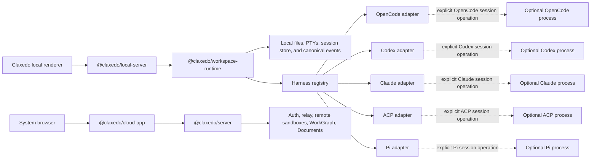
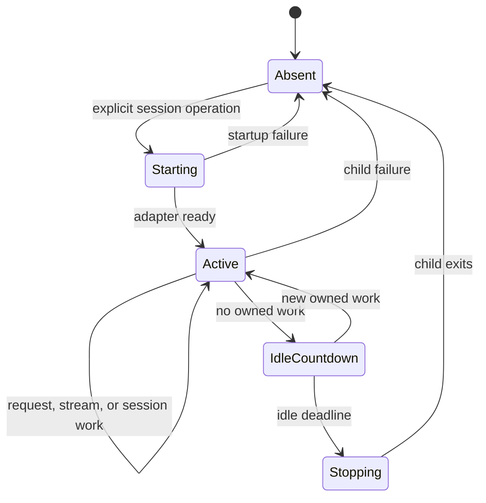
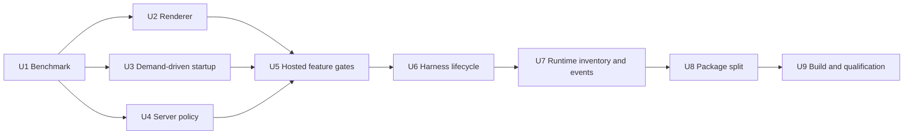

# Claxedo Desktop Local Composition and Idle Memory - Plan

## Goal

The unsigned Claxedo desktop shell has a median native physical footprint below 300 MiB after a 60-second settle period while preserving its current interaction and execution performance. Its resident process family contains only the renderer, Electron infrastructure, the desktop-local server, and Workspace Runtime. A harness process starts only for an explicit session operation and exits after its lifecycle becomes idle.

The desktop build contains local project, file, diff, terminal, session, provider, configuration, credential, and harness-dispatch behavior. Authentication, cloud workspace authority, relay, remote sandbox management, WorkGraph, Documents, billing, and hosted connections are composed and shipped by the hosted products.

## Memory Action Table

This table records every measured action from the investigation. Each delta belongs to the comparison named in its row. Native physical footprint is the acceptance metric; summed RSS and Activity Monitor totals remain supporting observations because they use different accounting rules.

| Stage | Action | Result | Incremental effect | Contribution to the target design |
|---:|---|---:|---:|---|
| 0 | Opening Activity Monitor observation | 1,040.8 MB across six Claxedo rows | — | Establishes the user-visible starting condition. |
| F1 | Bound persisted queries, use asynchronous IndexedDB persistence, compact provider persistence, and expire inactive queries (`2d13c86af`) | Included in the 865 MiB controlled baseline | No isolated native-footprint pair | Retained idle-state foundation. |
| F2 | Disable Chromium HTTP caching for local dynamic API and SSE responses (`5295ed7a8`) | Included in the 865 MiB controlled baseline | No isolated native-footprint pair | Retained transport foundation. |
| F3 | Load a compact provider index and fetch provider detail on demand (`c9d0a8051`) | Included in the 865 MiB controlled baseline | No isolated native-footprint pair | Retained provider foundation. |
| F4 | Cap the workbench at ten retained surfaces with LRU state (`d95427181`) | Included in the 865 MiB controlled baseline | No isolated native-footprint pair | Retained renderer foundation. |
| F5 | Run session-memory diagnostics on demand (`7668d5ce1`) | Included in the 865 MiB controlled baseline | No isolated native-footprint pair | Retained diagnostics foundation. |
| F6 | Give raw session transport queries zero retention after projection | Included in the 865 MiB controlled baseline | No isolated native-footprint pair | Retained query-lifecycle foundation. |
| 1 | Reproduce the ten-surface workload | 996 MiB median summed RSS; 865 MiB native footprint | Baseline | Controlled benchmark baseline. |
| 2 | Mount only the visible non-terminal surface (`74d38028c`) | About 827 MiB native footprint | About -38 MiB | Renderer ownership reduction; hidden terminals retain their live attachment. |
| 3 | Defer provider/config bootstrap until a provider journey (`c38e7e46d`) | About 829 MiB native footprint; RSS 975.7 → 830.3 MiB | No attributable native saving; -145.4 MiB RSS | Reduces startup work and retained transport data. |
| 4 | Run the process-metrics helper only while Diagnostics has subscribers (`221a0a9ed`) | 829 → 805 MiB median native footprint | -24 MiB | Removes an idle helper process. |
| 5 | Apply the measured Electron server V8 policy before isolate creation (`474521749`) | 805 → 651 MiB median native footprint | -154 MiB | Reduces the long-lived local-server heap; server about 415 → 262 MiB. |
| 6 | Host the bundled server in Electron Node mode with explicit IPC ownership (`c1b281970`) | 651 → 640 MiB median native footprint | -11 MiB | Reduces sidecar host overhead. |
| 7 | Make WorkGraph and Documents default-off, lazy, and absent from unsigned composition (`9774813b0`) | 643 → 465 MiB restored-state median; 440 MiB clean profile | -178 MiB | Removes cloud feature UI, routes, tools, databases, timers, and subscriptions. Feature-on proof measured 592 MiB. |
| 8 | Apply the 60-second settle period and require core-route plus terminal gates | 425 / 443 / 428 MiB; median 428 MiB | -37 MiB versus the phase result | Defines the strict, correctness-gated checkpoint; not a code saving. |
| 9 | Lazy-load remote sandbox drivers (`ec1703311`) | 383 / 424 / 406 MiB; median 406 MiB | -22 MiB | Supports the package boundary that keeps remote sandbox code in hosted products. |
| 10 | Lazy-load broader shared-server imports | 431 MiB median | +25 MiB | Provides bundle-shape evidence; no memory credit. |
| 11 | Dispose OpenCode state inside the long-lived server | Nominal 391 MiB | No attributable saving | Establishes process exit as the reliable unloading boundary for a harness module graph. |
| 12 | Run OpenCode in a disposable child process (`1ae63e856`) | 315 / 290 / 292 MiB; median 292 MiB | -114 MiB versus 406 MiB | Demonstrates that an absent harness process can meet the cold-idle target. |
| 13 | Compare custom OpenCode child ownership with Workspace Runtime spawning native `opencode serve` | Post-idle medians 278 vs 277 MiB | -1 MiB for Workspace Runtime ownership | Establishes that ownership placement has no material settled-idle effect once the harness exits. Workspace Runtime is selected for its multi-harness contract. |
| 14 | Split desktop-local and hosted packages | Measured during U9 | No advance memory credit | Makes the local/cloud composition enforceable in source, bundles, and packaged resources. |
| V1 | Revalidate default-off WorkGraph and Documents against clean `dev` with three fresh paired runs | Post-idle median 556 → 469 MiB; empty-shell median 743 → 712 MiB | -87 MiB post-idle; -31 MiB empty-shell | Confirms the feature boundary on the current tree. Every candidate post-idle sample (447–507 MiB) is below every baseline sample (553–614 MiB). |
| V2 | Build the default-off and feature-on renderer compositions | Eager main chunk 3,737.28 → 3,411.87 kB raw and 1,097.30 → 989.92 kB gzip | -325.41 kB raw; -107.38 kB gzip | Places Documents (152.65 kB) and WorkGraph (262.46 kB) in demand-loaded chunks while retaining a feature-on build proof. |
| V3 | Run all five real-browser performance flows against clean `dev` and the candidate | 0 failed flows in both cohorts; 5 warnings in both cohorts | No attributable regression | The disabled controls exceed the stored physical-frame budgets, so the cohort is preliminary evidence. A repeated five-iteration session-switch run showed the candidate's enabled path faster than its same-build control. |

The measured investigation spans 865 → 292 MiB in the controlled workload and starts from a user-visible process total above 1,000 MB. The implementation acceptance comparison uses fresh cohorts from current `dev` while retaining the same workload and gates.

### Controlled Harness Ownership Benchmark

Three fresh runs used the optimized composition, an empty-shell fixture, a 10-second harness idle timeout, and a 20-second settle period.

| Checkpoint | Custom OpenCode child | Workspace Runtime + native `opencode serve` | Runtime-native delta |
|---|---:|---:|---:|
| Startup transient | 538 MiB median | 522 MiB median | -16 MiB |
| Settled empty shell | 343 MiB median | 339 MiB median | -4 MiB |
| Active harness | 509 MiB median | 1,119 MiB median | +610 MiB |
| Post-teardown idle | 278 MiB median | 277 MiB median | -1 MiB |
| Harness process count | 1 → 0 → 1 → 0 | 1 → 0 → 1 → 0 | Same lifecycle shape |

Renderer, core-route, PTY, active-process, and post-idle teardown gates passed in both cohorts. Settled differences are within a 20 MiB noise band. The architecture therefore receives no idle-memory credit for choosing one OpenCode process owner over the other. The active-harness difference remains a dedicated optimization and packaging criterion for the OpenCode adapter.

## Performance Acceptance Contract

Performance evidence is captured before the first memory implementation unit and after every unit that changes renderer mounting, V8 policy, server composition, session inventory, events, or harness lifecycle. Final acceptance uses production builds and the packaged unsigned macOS application.

Two complementary lanes cover the complete product path:

| Lane | Target | Workloads | Primary evidence |
|---|---|---|---|
| Real-browser interaction lane | `packages/claxedo-app/perf-harness` | Launch project, session switch, live terminal switch, large diff toggle, workspace switch | p95 frame time, worst frame, frames below 60 Hz, completion latency |
| Desktop lifecycle lane | Production Electron app, local server, Workspace Runtime, and deterministic harness fixture | Health readiness, store-only session list, provider first use, PTY first output, cold harness start, warm harness operation, idle restart, active-session stress | p50/p95 completion latency, local-server event-loop delay, CPU time, GC pause evidence, process lifecycle |

### Browser Harness Modes

The performance harness retains its diagnostics ABBA mode and adds a base-app comparison mode. Base-app comparison launches baseline and candidate production builds from separate worktrees and executes each flow in baseline → candidate → candidate → baseline order. This makes warm/cold position and short-lived machine load symmetrical.

The browser lane uses these gates:

- Interaction p95 frame time targets 8.33 ms and must remain at or below the 16.67 ms 60 Hz floor.
- At most two frames per interaction may exceed 16.67 ms.
- Worst-frame time remains within the stored per-flow budget.
- Candidate p95 completion latency remains within `max(10% of baseline, 50 ms)` for interactions and `max(10% of baseline, 200 ms)` for launch.
- A comparison is valid only when both baseline runs satisfy the physical frame floor and their completion-time spread is within 15%.
- Diagnostics-enabled ABBA runs continue to enforce their separate retained-memory and frame-overhead contract.

Planned final commands:

```sh
cd packages/claxedo-app
bun run build
cd perf-harness
bun test
bun run run:compare --baseline-worktree <clean-dev-worktree> --candidate-worktree <implementation-worktree> --all --iterations 3
bun run run:all --iterations 3
```

### Desktop Lifecycle Gates

The desktop lane uses local deterministic data and a deterministic harness fixture, so provider network latency and model generation do not influence the result.

| Operation | Regression ceiling relative to clean `dev` | Additional gate |
|---|---:|---|
| App process start → local health ready | `max(10%, 200 ms)` | Renderer and local route gates pass. |
| Store-only session list | `max(10%, 25 ms)` | Harness process count stays zero. |
| Provider journey first-use bootstrap | `max(10%, 100 ms)` | Full provider projection is complete. |
| PTY create → first output | `max(10%, 100 ms)` | Output and resize gates pass. |
| Explicit session operation → harness ready | `max(10%, 300 ms)` | Exactly one selected harness starts. |
| Warm operation on a running harness | `max(10%, 50 ms)` | The existing process is reused. |
| First operation after idle teardown | `max(10%, 300 ms)` | A new generation starts against durable state. |
| Representative active-session workload | `max(10%, 100 ms)` per local operation | No out-of-memory failure; mutation and stream gates pass. |

Local-server event-loop delay p95 and CPU time remain within 10% of baseline with a 2 ms event-loop noise allowance. GC pause totals and maximum pause are reported for U4; the V8 policy advances only when the active workload meets the latency gates and has no new pause above 50 ms.

The desktop runner records app commit, baseline commit, hardware, power state, thermal state, macOS version, Electron version, Bun version, harness executable version, production build identity, sample order, and every raw sample. Baseline and candidate each receive two runs in ABBA order, with three iterations per operation.

Planned final command:

```sh
cd packages/claxedo-desktop
bun run perf:lifecycle --baseline-app <clean-dev-app> --candidate-app <implementation-app> --iterations 3
```

## System Model

### Terms

- **Workspace Runtime** is Claxedo's local execution core. It owns workspace files, diffs, PTYs, process dispatch, local routes, durable session metadata, event publication, and the harness registry.
- **Harness** is a selectable agent implementation such as OpenCode, Codex, Claude, ACP, or Pi.
- **Harness adapter** translates Workspace Runtime operations into one harness's protocol and owns that harness's process lifecycle.
- **Harness process** is an optional child process created by an adapter for explicit session work. OpenCode participates through the same selectable harness contract as Codex, Claude, ACP, and Pi.
- **Local server** is the long-lived desktop sidecar that exposes the approved local HTTP and event contract and composes Workspace Runtime.
- **Hosted products** are the cloud server and web app compositions that own identity and cloud-only capabilities.

### Process Ownership

The idle process-family total has four long-lived owners:

- Electron main and utility infrastructure.
- Chromium renderer with the mounted Solid UI and retained query state.
- Chromium GPU process, whose IOSurface allocation is reported separately.
- The desktop-local server containing Workspace Runtime.

Harnesses, diagnostics helpers, remote sandbox drivers, WorkGraph, and Documents have demand-driven or hosted ownership and are absent from the unsigned empty shell.

### Target Topology



### Harness Lifecycle



Session inventory, title updates, workspace metadata, and canonical events stay in Workspace Runtime. Reading that local state does not start a harness. An explicit operation against a selected harness starts its adapter lifecycle. Each adapter defines safe request replay, active-work detection, idle timing, shutdown, and restart semantics for its protocol.

## Product Contract

### Requirements

#### Measurement

- **R1.** The unsigned empty shell and post-session-idle workloads each have a five-run median native physical footprint at or below 300 MiB after 60 seconds, with every sample at or below 325 MiB.
- **R2.** Every record includes process-role footprint, IOSurface, summed RSS, renderer readiness, route gates, PTY gates, mounted-surface count, and harness-process inventory.
- **R3.** The benchmark uses a fresh temporary profile and never reads the user's profile, credentials, caches, or configuration.
- **R4.** A benchmark result is valid only when all local route, terminal, renderer, active-harness, and post-idle teardown gates pass.

#### Performance

- **PR1.** A clean `dev` production build supplies the immutable browser and desktop performance baselines before U2 begins.
- **PR2.** Browser comparison runs all five real-app flows in baseline → candidate → candidate → baseline order using isolated contexts and three iterations per position.
- **PR3.** Every interactive browser flow satisfies the 60 Hz physical floor, the two-frame allowance, its stored worst-frame budget, and its baseline-relative completion ceiling.
- **PR4.** Launch performance satisfies its stored worst-frame budget and baseline-relative completion ceiling; launch frame drops remain visible in the report.
- **PR5.** Desktop lifecycle comparison covers health readiness, store-only session list, provider first use, PTY first output, cold harness start, warm harness use, idle restart, and active-session stress.
- **PR6.** V8 policy changes satisfy active-workload latency, event-loop, CPU, GC-pause, route, mutation, and stream gates before they contribute to the memory target.
- **PR7.** Every performance report identifies both commits, production build identities, tool versions, machine and thermal state, sample order, raw samples, and gate outcomes.
- **PR8.** Final acceptance runs the browser comparison, diagnostics ABBA suite, and desktop lifecycle comparison against the packaged candidate.

#### Empty-shell composition

- **R5.** Only the visible non-terminal workbench surface is mounted; hidden terminal surfaces retain their live PTY attachment.
- **R6.** Provider detail, full provider configuration, and diagnostics process sampling start on demand.
- **R7.** WorkGraph and Documents are off by default and lazy-loaded only by a hosted or explicitly enabled composition.
- **R8.** The unsigned local server constructs no cloud auth, authority, relay, remote sandbox, WorkGraph, Documents, billing, connection, or channel owner.

#### Workspace Runtime and harnesses

- **R9.** Workspace Runtime owns local session inventory, title metadata, canonical events, workspace operations, and harness selection.
- **R10.** Unqualified session inventory and empty-shell hydration read Workspace Runtime's durable store without selecting or starting a harness.
- **R11.** An explicit session operation resolves the configured harness and starts or joins that adapter's lifecycle.
- **R12.** Concurrent first operations for one adapter lifecycle share startup; startup failure clears pending state so a later operation can recover.
- **R13.** The adapter keeps a harness alive while requests, response streams, client-owned event streams, or protocol-defined active work remain.
- **R14.** The adapter exits its harness process after a 30-second desktop idle grace period and restarts it against durable state when later work arrives. Protocol-defined active work suspends the countdown.
- **R15.** Each adapter defines retry safety. Read-only work may retry only when non-delivery is known; mutations preserve stable identity or surface delivery uncertainty.
- **R16.** Parent loss and application shutdown terminate every adapter-owned child within a bounded interval.
- **R17.** OpenCode, Codex, Claude, ACP, and Pi remain independently selectable through a lazy adapter registry. Workspace Runtime boots with any supported subset of adapter packages.
- **R18.** Adapter-owned network processes bind to loopback and authenticate every request with a fresh per-launch credential. Credentials travel through the narrowest protocol-supported channel, remain out of arguments and logs, and are removed from requests before provider dispatch. Stdio-only harnesses use private parent-owned pipes.

#### Events and metadata

- **R19.** Workspace Runtime publishes canonical local session and title events from its store and operation results.
- **R20.** Empty-shell hydration and session listing do not open a harness-global compatibility SSE stream.
- **R21.** An explicit client stream or active harness operation participates in the owning adapter's liveness contract and releases that ownership when closed or complete.
- **R22.** Metadata reconciliation after harness restart is idempotent and cannot duplicate a session mutation.
- **R23.** Existing Workspace Runtime projections remain visible after upgrade. A named refresh operation for a selected harness discovers historical harness-only sessions and imports their metadata idempotently without changing generic session-list behavior.

#### Package boundaries

- **R24.** `@claxedo/local-server` builds without hosted server, sandbox-manager, WorkGraph, relay, cloud SDK, or auth SDK source availability.
- **R25.** `@claxedo/app` builds the desktop renderer without Clerk, WorkGraph, Documents, provisioning, remote access, or hosted API clients.
- **R26.** `@claxedo/server` and `@claxedo/cloud-app` own hosted identity, cloud workspace authority, remote sandbox infrastructure, WorkGraph, Documents, and hosted connections.
- **R27.** Desktop sign-in and cloud-product affordances open fixed HTTPS URLs in the system browser. Account tokens remain in the hosted browser session.
- **R28.** Development, production, and packaged macOS launches use the same local-server entry and harness-adapter contract.

### Acceptance Examples

- An unsigned launch with no session operation reaches the empty shell with zero harness processes.
- Listing local sessions reads the Workspace Runtime store and leaves the harness process count at zero.
- Opening an OpenCode session starts OpenCode; opening a Codex session starts Codex; each process exits after its own idle contract is satisfied.
- Refreshing historical OpenCode sessions explicitly starts the OpenCode adapter, imports stable session metadata into Workspace Runtime, and returns to zero harness processes after idle.
- Completing a prompt, closing client streams, and waiting 60 seconds returns the process family to the post-session-idle target.
- Opening Diagnostics starts one process-metrics helper; closing its last subscriber exits the helper.
- Restoring ten non-terminal surfaces preserves ten navigation entries while mounting one surface tree.
- A desktop build succeeds when hosted server, WorkGraph, sandbox-manager, relay, and cloud SDK sources are unavailable.
- Selecting sign-in opens the hosted web application and does not add an auth runtime to desktop.

## Technical Decisions

- **KTD1 — Native physical footprint controls acceptance.** Activity Monitor totals, RSS, JavaScript heap, and IOSurface remain diagnostic fields with distinct accounting.
- **KTD2 — Workspace Runtime is the local core.** It owns local data, operations, canonical events, the harness registry, and harness dispatch. Harness-specific transports remain behind adapters.
- **KTD3 — Harness processes are optional lifecycle owners.** A harness exists in the desktop process family only while its selected adapter owns active work or an idle grace period.
- **KTD4 — Session inventory is runtime-owned.** Generic session lists and empty-shell hydration use the durable local store, so they cannot select the default adapter as a side effect.
- **KTD5 — Canonical metadata events are runtime-owned.** Session and title state flows through the Workspace Runtime event hub. Harness compatibility streams are scoped to explicit adapter work.
- **KTD6 — Replay safety is adapter-specific.** Each adapter distinguishes known non-delivery, uncertain delivery, planned shutdown, and process failure according to its protocol.
- **KTD7 — Harness transports are private and authenticated.** Network adapters use loopback plus a fresh per-launch credential; pipe-based adapters inherit the parent-owned process boundary.
- **KTD8 — Package manifests enforce local/cloud ownership.** Source-import, emitted-bundle, and packaged-resource guards complement runtime feature tests.
- **KTD9 — Hosted identity stays in the browser.** Desktop opens allowlisted hosted URLs and receives no account credential.
- **KTD10 — Five-sample cohorts include a variance ceiling.** The median target protects typical idle cost and the 325 MiB ceiling catches unstable process or graphics ownership.
- **KTD11 — Active harness cost is measured separately.** The native OpenCode comparison reached a 1,119 MiB active median, so OpenCode adapter packaging and transport require an active-workload budget independent of idle acceptance.

## Delivery Plan

### Work Item Guide

| Unit | What | Why | How | Memory role |
|---|---|---|---|---|
| U1 | Immutable memory and performance benchmark | Makes memory and responsiveness claims comparable and correctness-gated. | Captures fresh-idle, active-harness, post-session-idle, browser-flow, and desktop-lifecycle baselines before implementation. | Measurement authority. |
| U2 | Visible-only surface mounting | Hidden UI trees retain components, DOM, queries, and editor models. | Retains navigation state while unmounting hidden non-terminal trees. | About -38 MiB measured. |
| U3 | Demand-driven bootstrap and diagnostics | Empty shell does not require provider detail or a process scanner. | Loads provider detail on first provider journey and ties metrics helper lifetime to subscribers. | About -24 MiB measured for diagnostics; provider work has RSS evidence. |
| U4 | Local-server host and V8 policy | The long-lived sidecar needs a bounded, product-qualified heap with stable active latency. | Applies flags before isolate creation, uses Electron Node mode with explicit child ownership, and qualifies event-loop and GC behavior under active load. | About -165 MiB measured across policy and host topology. |
| U5 | Default-off WorkGraph and Documents | These hosted capabilities otherwise construct UI, tools, routes, state, and services in desktop. | Breaks import, composition, restoration, and lifecycle edges; lazy-loads feature-on entrypoints. | About -178 MiB measured. |
| U6 | Workspace Runtime harness lifecycle | The local core supports multiple harnesses and the empty shell needs none of their processes. | Routes explicit session work through the registry and lets each adapter start, share, idle, stop, and restart its process. | Keeps harness footprint at zero when idle; no ownership-placement credit. |
| U7 | Runtime-owned session inventory and events | Generic inventory and compatibility SSE can activate or pin a default harness. | Reads inventory from the durable store and publishes canonical metadata through the runtime event hub. | Preserves zero-harness empty and post-session idle states. |
| U8 | Local/cloud package split | Desktop requires a smaller capability and dependency boundary than hosted products. | Creates local server/app compositions and hosted server/cloud-app compositions with explicit manifests. | Structural prevention; measured without advance credit. |
| U9 | Build, packaging, and final performance qualification | Source behavior must match packaged behavior while idle memory and active responsiveness satisfy their contracts together. | Wires artifacts, adds bundle guards, packages required launch assets, and runs browser plus desktop performance comparisons for each supported harness. | Delivery enforcement, active-memory control, and performance acceptance. |

### U1. Establish the Memory and Performance Benchmark Contract

Primary files:

- `packages/claxedo-desktop/scripts/measure-idle-memory.ts`
- Create `packages/claxedo-desktop/scripts/measure-lifecycle-performance.ts`
- `packages/claxedo-desktop/package.json`
- `packages/claxedo-app/perf-harness/src/cli.ts`
- `packages/claxedo-app/perf-harness/src/cli-options.ts`
- `packages/claxedo-app/perf-harness/src/browser-runner.ts`
- `packages/claxedo-app/perf-harness/src/report.ts`
- `packages/claxedo-app/perf-harness/src/storage.ts`
- `packages/claxedo-app/perf-harness/src/types.ts`
- `packages/claxedo-app/perf-harness/package.json`

- Port `packages/claxedo-desktop/scripts/measure-idle-memory.ts` and the restored-state and empty-shell fixtures to current `dev`.
- Add `fresh-idle`, `active-harness`, and `post-session-idle` modes.
- Record five samples per acceptance cohort with a fixed profile, workload, settle interval, and gate set.
- Classify Electron main, GPU, renderer, local server, diagnostics helper, and harness children separately.
- Store benchmark output outside the product diff and retain the command, commit, OS, architecture, Electron version, and harness version with every cohort.
- Build a clean current-`dev` browser target and packaged desktop target before U2.
- Run all five existing browser flows and retain raw frame and completion samples as the baseline side of the final comparison.
- Add base-app worktree comparison to `packages/claxedo-app/perf-harness` while preserving the existing diagnostics ABBA mode.
- Add the deterministic desktop lifecycle runner and capture health, session-list, provider, PTY, cold/warm/restart harness, active-workload, event-loop, CPU, and GC baselines.

Verification: all memory and performance gates pass, temporary profiles and children are removed, and repeated runs produce complete machine-readable records with baseline attribution.

### U2. Mount Only the Visible Non-Terminal Surface

Primary files:

- `packages/claxedo-app/src/app/workbench/rail/rail-workbench-canvas.tsx`
- `packages/claxedo-app/src/app/workbench/workbench/workbench.tsx`
- `packages/claxedo-app/src/app/workbench/workbench/tests/F-mount-retention.vitest.tsx`

Retain surface identity, ordering, activation, and LRU state separately from the mounted renderer subtree. Switching surfaces releases the previous non-terminal tree. Terminal surfaces preserve their live process and UI attachment until their existing close or eviction contract runs.

Verification: ten restored IDs, one mounted non-terminal tree, working navigation, and uninterrupted hidden terminal output.

### U3. Make Bootstrap and Diagnostics Demand-Driven

Primary files:

- `packages/claxedo-app/src/app/providers/global-sync/provider.tsx`
- `packages/claxedo-app/src/app/providers/global-sync/shell-bootstrap.ts`
- `packages/claxedo-server/src/deployments/shared-routes/bootstrap.ts`
- `packages/claxedo-desktop/src/main/diagnostics/process-metrics-source.ts`
- `packages/claxedo-desktop/src/main/diagnostics/profiler.ts`

The shell bootstrap returns only local shell state and does not populate the full provider cache with an empty projection. The first provider-dependent journey joins the normal full-bootstrap query. Diagnostics subscription count owns the metrics helper; the first subscriber starts it and the last subscriber ends it.

Verification: zero provider-detail calls and zero metrics helpers in empty shell; complete provider data and descendant metrics on demand.

### U4. Apply the Local-Server Runtime Policy

Primary files:

- `packages/claxedo-desktop/src/main/server-runtime-policy.ts`
- `packages/claxedo-desktop/src/main/server-child-process.ts`
- `packages/claxedo-desktop/src/main/index.ts`
- `packages/claxedo-desktop/scripts/claxedo-server-entry.ts`

Run the bundled local server in Electron Node mode. Supply the measured size-oriented V8 flags before isolate creation, retain JIT and required native modules, and keep explicit IPC, parent-loss, PTY, and shutdown ownership. Qualify the 512 MiB old-space ceiling with a representative active-session workload.

Verification: real bundle boot, local routes, PTY/IPC, active session, clean parent shutdown, and reported heap limit all pass. The desktop lifecycle lane satisfies PR6 before the policy is included in the candidate composition.

### U5. Make WorkGraph and Documents Hosted, Default-Off Features

Primary areas:

- Workbench feature registration and restored-surface pruning in `packages/claxedo-app`
- Route, database, timer, subscription, and application-tool composition in `packages/claxedo-server`
- Desktop flags and build definitions in `packages/claxedo-desktop`

The default unsigned composition has no import or construction edge to WorkGraph or Documents. Feature-on entrypoints use dynamic imports and live in hosted composition. Persisted desktop surfaces for unavailable hosted features are pruned while local sessions and terminals remain intact.

Verification: default boot has zero feature surfaces, tools, routes, databases, timers, and subscriptions; hosted feature-on tests retain their behavior.

### U6. Give Workspace Runtime Full Harness Lifecycle Ownership

Primary files:

- `packages/workspace-runtime/src/workspace/runtime.ts`
- `packages/agent-sdk-runtime/src/harnesses/opencode/index.ts`
- `packages/agent-sdk-runtime/src/harnesses/opencode/process.ts`
- Matching adapters for Codex, Claude, ACP, and Pi
- `packages/claxedo-server/src/deployments/local/embedded-workspace-runtime.ts`, relocating to the local-server package in U8

Workspace Runtime resolves the session's configured harness through `defaultWorkspaceHarnessRegistry()`. Registry entries load adapter modules on first selection, so installing support for a harness does not load its code in the empty shell. An explicit session operation joins or starts that adapter. The adapter owns process creation, readiness, request and stream accounting, protocol activity, idle countdown, shutdown, parent loss, and restart. Local-server composition supplies shared services and policy through the generic adapter contract.

OpenCode may use an installed or bundled executable according to product packaging. For native `opencode serve`, the adapter generates `OPENCODE_SERVER_PASSWORD`, supplies matching Basic authorization on every request, binds to `127.0.0.1`, and redacts the credential. Its adapter is qualified against both settled-idle and active-workload budgets. Codex, Claude, ACP, and Pi use the same registry contract while retaining protocol-specific lifecycle and transport-security rules.

Verification:

- Removing the OpenCode adapter leaves empty shell, files, diffs, PTYs, session inventory, and other harnesses operational.
- Concurrent first operations share one adapter startup.
- Startup failure permits a later clean retry.
- Network transports reject missing or incorrect launch credentials, and logs contain no credential value.
- Active requests and streams keep the child alive.
- Closing owned work and passing the idle deadline removes the child.
- Parent loss removes all adapter descendants.
- Mutation delivery is never replayed without protocol proof.
- Cold start, warm reuse, and post-idle restart satisfy the desktop lifecycle ceilings.

### U7. Make Session Inventory and Metadata Events Runtime-Owned

Primary areas:

- Workspace Runtime session store and event hub
- Local session-list and session-metadata routes
- OpenCode compatibility event routes
- `packages/claxedo-server/src/deployments/local/embedded-workspace-runtime.ts`

Unqualified session inventory, empty-shell hydration, and title projection read Workspace Runtime's durable store. Explicit harness discovery is a named operation with a selected adapter. Workspace Runtime publishes canonical created, updated, status, and title events when durable state changes or adapter results reconcile into the store.

The OpenCode adapter opens compatibility SSE only for an explicit OpenCode operation that requires it. Reconnect and teardown participate in OpenCode adapter liveness. Generic Claxedo event subscribers consume the runtime event hub and do not hold an OpenCode process.

A selected-harness refresh operation calls that adapter's discovery API, binds discovered stable IDs to the configured harness, and upserts metadata into the runtime store. This preserves historical harness sessions as an explicit operation while keeping generic inventory store-only.

Verification:

- Empty shell and session list keep every harness absent.
- A session mutation publishes one canonical event and one durable state transition.
- Title changes survive harness exit and application restart.
- Repeating a historical-session refresh produces the same projected rows and no duplicate session.
- Closing the last explicit stream allows adapter teardown.
- Post-session-idle benchmark reports zero harness children.

### U8. Split Desktop-Local and Hosted Products

#### Capability Placement

| Capability | Desktop local owner | Hosted owner |
|---|---|---|
| Health, bootstrap, local configuration | `@claxedo/local-server` | Hosted server may expose its own contract |
| Files, diffs, PTYs, process dispatch | Workspace Runtime | Cloud workspace runtime through hosted composition |
| Session inventory, titles, canonical events | Workspace Runtime | Hosted persistence and event infrastructure |
| Harness selection and dispatch | Workspace Runtime harness registry | Hosted runtime policy |
| OpenCode, Codex, Claude, ACP, Pi | Optional adapter and process | Hosted runtime adapters as configured |
| Local credentials and provider configuration | Local server/profile store | Hosted account configuration |
| Authentication and account session | System browser | `@claxedo/cloud-app` and `@claxedo/server` |
| Cloud workspace authority | — | `@claxedo/server` |
| Relay and remote access | — | `@claxedo/server` and relay packages |
| Remote sandbox manager and drivers | — | Hosted server and sandbox packages |
| WorkGraph and Documents | — | Hosted server and cloud app |
| Billing, connections, channels, wakes | — | Hosted products |

#### Package Topology

- `@claxedo/local-server`: desktop-local HTTP/SSE composition, local profile and credentials, Workspace Runtime wiring, network policy, and harness dispatch.
- `@claxedo/app`: local renderer, workbench, terminals, session UI, provider UI, and dependency-neutral hosted-product links.
- `@claxedo/server`: hosted control plane, identity, authority, relay, remote sandbox, WorkGraph, Documents, billing, connections, channels, and wakes.
- `@claxedo/cloud-app`: hosted identity and cloud-product UI.
- `@claxedo/workspace-runtime`: local workspace/session core and harness registry, usable without any specific harness.
- Harness packages: adapter implementations and their independently packaged launch requirements.

#### Split Sequence

1. Freeze the unsigned local route, workflow, and import allowlist with characterization tests.
2. Create `@claxedo/local-server` from the approved local routes and supporting modules.
3. Compose local directories and PTYs directly through Workspace Runtime.
4. Connect hosted capabilities exclusively through hosted Node and Worker entrypoints.
5. Move hosted renderer identity and cloud features to `@claxedo/cloud-app`.
6. Point desktop development, production, and packaging at local package manifests.
7. Add manifest, transitive-import, emitted-bundle, and packaged-resource guards.

The split is complete when desktop builds and launches with hosted server, cloud app, sandbox-manager, WorkGraph, relay, and cloud SDK sources unavailable, while hosted product tests retain their contracts.

### U9. Wire and Qualify Production Artifacts

Primary files:

- `packages/claxedo-desktop/scripts/prebuild.ts`
- `packages/claxedo-desktop/package.json`
- `packages/claxedo-desktop/electron.vite.config.ts`
- `packages/claxedo-desktop/electron-builder.config.ts`
- `packages/claxedo-desktop/scripts/claxedo-server-boot.test.ts`
- A desktop local-bundle contract test

Build and package the local server and renderer from their local manifests. Package only the native modules and harness launch assets required by supported local modes. Installed-harness discovery and bundled-harness resolution use explicit adapter configuration. Development watches the same entries that production builds.

Add three artifact checks:

1. A source dependency graph with a local allowlist and hosted denylist.
2. An emitted import manifest checked for representative cloud packages and modules.
3. A packaged-resource inventory plus a real unsigned macOS launch smoke.

Run empty, active, and post-idle measurements for every bundled harness. The OpenCode active cohort receives a dedicated budget before native `opencode serve` becomes the default packaged path.

Run the final browser base-app comparison, the diagnostics ABBA suite, and the desktop lifecycle comparison against the clean U1 baseline. Store the JSON and Markdown reports with the memory cohort evidence.

## Integration Sequence



Each unit lands with focused behavioral tests and a benchmark checkpoint. Memory deltas are reported from current `dev` without requiring an individual unit to reproduce a historical number exactly. The completed topology must meet the absolute cohort thresholds in R1.

## System-Wide Impact

- **Renderer:** fewer mounted trees, smaller default feature graph, hosted sign-in through the system browser.
- **Local server:** bounded V8 policy and a dependency-minimal composition.
- **Workspace Runtime:** authoritative local session inventory, canonical metadata events, harness registry, and adapter dispatch.
- **Harness adapters:** independent process and protocol lifecycles with no empty-shell process.
- **Hosted products:** sole ownership of identity and cloud capability.
- **Build system:** separate local and hosted manifests with source, bundle, and package guards.
- **Persistence:** local session metadata remains available while every harness is absent; adapter restart reconciles through stable identity.

## Risks and Controls

| Risk | Impact | Control |
|---|---|---|
| Session inventory omits harness-created state | Missing sessions or stale titles | Reconcile explicit adapter results into the Workspace Runtime store using stable IDs and idempotent updates. |
| A compatibility stream pins a harness | Post-session idle exceeds target | Scope streams to explicit adapter work and include them in adapter liveness tests. |
| Mutation replay after process loss | Duplicate prompts or configuration changes | Use stable request identity where supported; otherwise surface delivery uncertainty. |
| Native OpenCode active footprint remains high | Memory pressure during work | Set an active budget, profile the adapter and executable, and qualify installed and bundled modes separately. |
| V8 ceiling is too small for active local work | Sidecar out-of-memory failure | Run representative active-session, large-workspace, and terminal workloads before release. |
| Package barrels reintroduce hosted code | Larger renderer or sidecar | Enforce transitive source and emitted import manifests in CI. |
| Parent shutdown leaves descendants | Orphan harness or PTY processes | Track adapter children by generation and test parent-loss cleanup. |
| macOS graphics variance obscures a regression | Misleading memory conclusion | Report IOSurface separately and retain all five samples with the per-sample ceiling. |

## Verification Contract

Run tests and typechecks from their package directories.

- Focused renderer tests for surface retention, feature gating, and hosted links.
- Focused desktop tests for server policy, process inventory, parent loss, build entries, and package resources.
- Focused Workspace Runtime tests for store-only inventory, harness selection, concurrent startup, canonical events, and teardown.
- Real adapter integration tests for requests, streams, cancellation, restart, and mutation identity.
- Local-server route and PTY characterization suite.
- Hosted server and cloud-app tests for auth, remote sandbox, relay, WorkGraph, and Documents.
- `bun typecheck` in each changed package.
- Production desktop build and unsigned packaged macOS smoke.
- Five fresh-idle samples and five post-session-idle samples with median ≤ 300 MiB and every sample ≤ 325 MiB.
- Active-harness cohorts recorded separately for each packaged harness.
- Performance-harness unit tests and all five real-browser flows in base-app comparison mode.
- The existing profiler-disabled/profiler-enabled diagnostics ABBA suite.
- Desktop lifecycle comparison against the U1 clean-`dev` packaged baseline.
- Browser and desktop performance JSON/Markdown reports retained beside the memory evidence.

## Definition of Done

- The measured-action table remains complete and every new benchmark result names its cohort and accounting method.
- Empty shell and unqualified session inventory start no harness process.
- Workspace Runtime remains functional when OpenCode is absent and can select OpenCode, Codex, Claude, ACP, or Pi through adapters.
- Every adapter shares concurrent startup, tracks protocol-owned activity, exits after idle, terminates on parent loss, and preserves mutation safety.
- Runtime-owned session metadata and canonical events survive harness teardown and application restart.
- WorkGraph and Documents are off by default, lazy-loaded, and owned by hosted packages.
- Desktop source, emitted bundles, and packaged resources contain no hosted auth, relay, remote sandbox, WorkGraph, Documents, or cloud control-plane graph.
- Hosted product capabilities pass their existing tests under hosted composition.
- Development, production, and packaged launches use the same local-server and adapter contracts.
- The production unsigned app passes all correctness gates and both idle-memory cohorts.
- All browser flows preserve the physical frame floor, stored worst-frame budgets, and baseline-relative completion ceilings.
- Local health, session inventory, provider first use, PTY first output, harness cold start, warm use, idle restart, active workload, event-loop delay, CPU, and GC evidence satisfy the desktop performance contract.

## Evidence Locations

- Current architecture: `packages/workspace-runtime/docs/architecture.md`
- Harness registry: `packages/workspace-runtime/src/workspace/runtime.ts`
- OpenCode adapter: `packages/agent-sdk-runtime/src/harnesses/opencode/index.ts`
- OpenCode process lifecycle: `packages/agent-sdk-runtime/src/harnesses/opencode/process.ts`
- Current local composition: `packages/claxedo-server/src/deployments/local/embedded-workspace-runtime.ts`
- Current OpenCode transport seam: `packages/claxedo-server/src/opencode/engine.ts`
- Memory benchmark branch: `optimize/claxedo-core-memory-300`
- Controlled ownership benchmark branch: `optimize/claxedo-harness-lifecycle-memory`
- Frozen ownership benchmark commit: `d32ecf05f`
- Ownership benchmark log: `.context/compound-engineering/ce-optimize/claxedo-harness-lifecycle-memory/experiment-log.yaml`
- Electron performance guidance: <https://www.electronjs.org/docs/latest/tutorial/performance>
