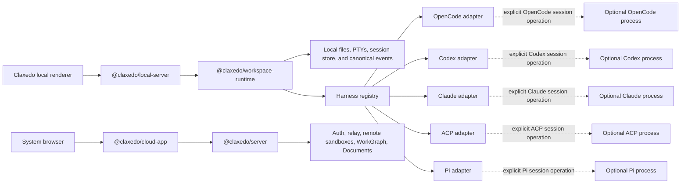
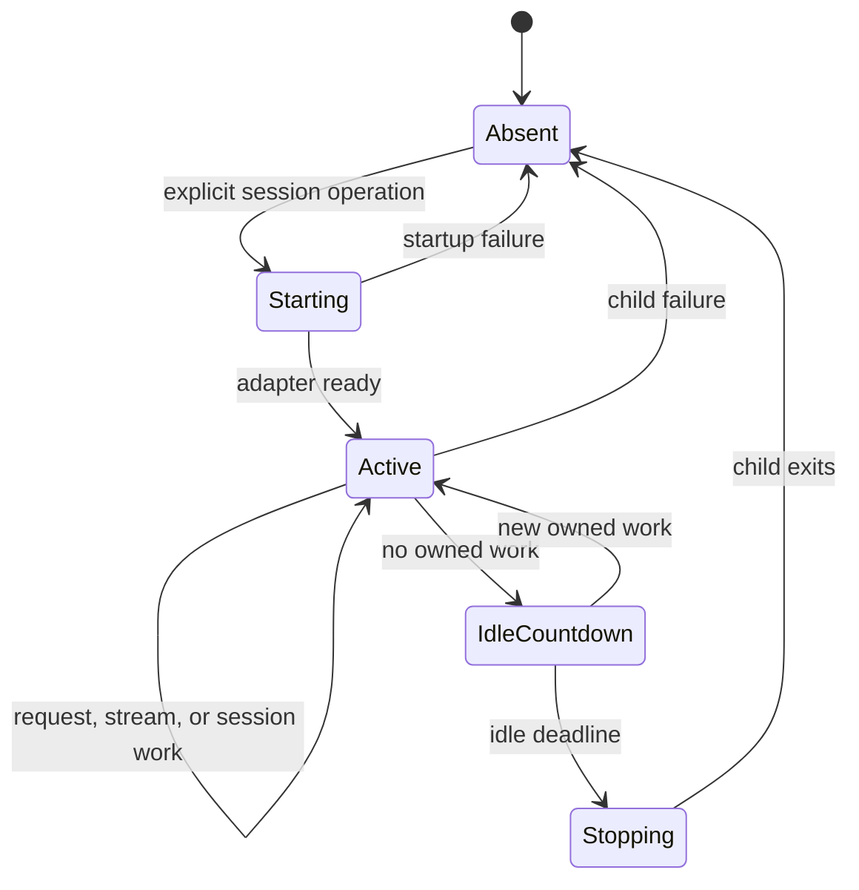
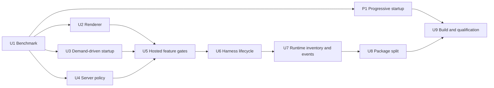

# Claxedo Desktop Local Composition and Idle Memory - Plan

## Goal

The unsigned Claxedo desktop shell has a median native physical footprint below 300 MiB in fresh empty-shell and post-session-idle cohorts, and below 500 MiB in a deterministic restored interactive-profile cohort, after a 60-second settle period. It preserves 60 Hz renderer scheduling and current operation-completion performance. Its resident process family contains only the renderer, Electron infrastructure, the desktop-local server, and Workspace Runtime. A harness process starts only for an explicit session operation and exits after its lifecycle becomes idle.

The desktop build contains local project, file, diff, terminal, session, provider, configuration, credential, and harness-dispatch behavior. Authentication, cloud workspace authority, relay, remote sandbox management, WorkGraph, Documents, billing, and hosted connections are composed and shipped by the hosted products.

## Memory Action Table

This table records every measured action from the investigation. Each delta belongs to the comparison named in its row. Native physical footprint is the acceptance metric; summed RSS and Activity Monitor totals remain supporting observations because they use different accounting rules.

| Stage | Action | Result | Incremental effect | Contribution to the target design |
|---:|---|---:|---:|---|
| 0 | Opening Activity Monitor observation | 1,040.8 MB across six Claxedo rows | — | Establishes the user-visible starting condition. |
| 0B | Manual checkpoint after using the latest packaged app | 1,450.6 MB across eight filtered rows; renderer 758.3 MB | No controlled delta | Confirms that the user-visible problem remains in an interactive profile. This screenshot is not substituted for the fixed-profile 60-second cohort. |
| F1 | Bound persisted queries, use asynchronous IndexedDB persistence, compact provider persistence, and expire inactive queries (`2d13c86af`) | Included in the 865 MiB controlled baseline | No isolated native-footprint pair | Retained idle-state foundation. |
| F2 | Disable Chromium HTTP caching for local dynamic API and SSE responses (`5295ed7a8`) | Included in the 865 MiB controlled baseline | No isolated native-footprint pair | Retained transport foundation. |
| F3 | Load a compact provider index and fetch provider detail on demand (`c9d0a8051`) | Included in the 865 MiB controlled baseline | No isolated native-footprint pair | Retained provider foundation. |
| F4 | Cap the workbench at ten retained surfaces with LRU state (`d95427181`) | Included in the 865 MiB controlled baseline | No isolated native-footprint pair | Retained renderer foundation. |
| F5 | Run session-memory diagnostics on demand (`7668d5ce1`) | Included in the 865 MiB controlled baseline | No isolated native-footprint pair | Retained diagnostics foundation. |
| F6 | Give raw session transport queries zero retention after projection | Included in the 865 MiB controlled baseline | No isolated native-footprint pair | Retained query-lifecycle foundation. |
| 1 | Reproduce the ten-surface workload | 996 MiB median summed RSS; 865 MiB native footprint | Baseline | Controlled benchmark baseline. |
| 2 | Mount only the visible non-terminal surface (`74d38028c`) | About 827 MiB native footprint | About -38 MiB | Renderer ownership reduction; hidden terminals retain their live attachment. |
| 3 | Defer provider/config bootstrap until a provider journey (`c38e7e46d`) | About 829 MiB native footprint; RSS 975.7 → 830.3 MiB | No attributable native saving; -145.4 MiB RSS | Reduces startup work and retained transport data. |
| 4 | Run the process-metrics helper only while Diagnostics has subscribers (`221a0a9ed`) | 829 → 805 MiB median native footprint | -24 MiB | Removes an idle helper process. |
| 5 | Apply the measured Electron server V8 policy before isolate creation (`474521749`) | 805 → 651 MiB median native footprint | -154 MiB | Reduces the long-lived local-server heap; server about 415 → 262 MiB. |
| 6 | Host the bundled server in Electron Node mode with explicit IPC ownership (`c1b281970`) | 651 → 640 MiB median native footprint | -11 MiB | Reduces sidecar host overhead. |
| 7 | Make WorkGraph and Documents default-off, lazy, and absent from unsigned composition (`9774813b0`) | 643 → 465 MiB restored-state median; 440 MiB clean profile | -178 MiB | Removes cloud feature UI, routes, tools, databases, timers, and subscriptions. Feature-on proof measured 592 MiB. |
| 8 | Apply the 60-second settle period and require core-route plus terminal gates | 425 / 443 / 428 MiB; median 428 MiB | -37 MiB versus the phase result | Defines the strict, correctness-gated checkpoint; not a code saving. |
| 9 | Lazy-load remote sandbox drivers (`ec1703311`) | 383 / 424 / 406 MiB; median 406 MiB | -22 MiB | Supports the package boundary that keeps remote sandbox code in hosted products. |
| 10 | Lazy-load broader shared-server imports | 431 MiB median | +25 MiB | Provides bundle-shape evidence; no memory credit. |
| 11 | Dispose OpenCode state inside the long-lived server | Nominal 391 MiB | No attributable saving | Establishes process exit as the reliable unloading boundary for a harness module graph. |
| 12 | Run OpenCode in a disposable child process (`1ae63e856`) | 315 / 290 / 292 MiB; median 292 MiB | -114 MiB versus 406 MiB | Demonstrates that an absent harness process can meet the cold-idle target. |
| 13 | Compare custom OpenCode child ownership with Workspace Runtime spawning native `opencode serve` | Post-idle medians 278 vs 277 MiB | -1 MiB for Workspace Runtime ownership | Establishes that ownership placement has no material settled-idle effect once the harness exits. Workspace Runtime is selected for its multi-harness contract. |
| 14 | Split the desktop-local server from hosted server deployments and add the local renderer composition | Landed on `dev`: Electron boots `@claxedo/local-server`; `@claxedo/server` retains hosted and self-hosted deployments; `app/entry/local.tsx` has a clean Clerk/Convex value-import closure; hosted content surfaces activate through a contribution seam | No fresh native-footprint pair on the rebased candidate | Establishes product-owned server closures and a measurable local renderer entry. The remaining renderer closure and packaged-resource gates are recorded below. |
| V1 | Revalidate default-off WorkGraph and Documents against clean `dev` with three fresh paired runs | Post-idle median 556 → 469 MiB; empty-shell median 743 → 712 MiB | -87 MiB post-idle; -31 MiB empty-shell | Confirms the feature boundary on the current tree. Every candidate post-idle sample (447–507 MiB) is below every baseline sample (553–614 MiB). |
| V2 | Build the default-off and feature-on renderer compositions | Eager main chunk 3,737.28 → 3,411.87 kB raw and 1,097.30 → 989.92 kB gzip | -325.41 kB raw; -107.38 kB gzip | Places Documents (152.65 kB) and WorkGraph (262.46 kB) in demand-loaded chunks while retaining a feature-on build proof. |
| V3 | Establish the five-flow production-renderer evidence contract | Launch, session, terminal, and workspace flows require further deadline work; the progressively rendered 500-file review passes at 15.7 ms worst with 0/723 misses | Defines the performance qualification rather than a memory delta | The browser lane measures semantic readiness, retains raw intervals, includes the first interaction interval, pools p95 from the interval population, matches Long Animation Frames to rAF gaps by timestamp, and states its synthetic-data and compositor boundaries. |
| V4 | Measure cold session switching through progressive transcript completion | Full timeline: 34.5 ms pooled p95, 57.7 ms worst, 11/135 misses, 108.1 ms completion; staged rich rows: 7.7 ms pooled p95, 17.1 ms worst, 6/259 strict deadline intervals, 83.7 ms completion | Diagnostic performance evidence; no accepted memory or performance credit | Separates the material 30–58 ms rich-row stalls from the 16–17 ms cold SessionPage, first-fold projection, and shell lifecycle. The packaged test shows that changing visible rows from text previews to canonical Markdown is not an acceptable progressive boundary. |
| V5 | Profile rich session renderers independently and bound their DOM | A 240-line highlighted block retained 11,399 DOM nodes across two sessions and completed in 162.3 ms; the large-block text-node path retains 1,321 nodes and completes in 90.6 ms | -10,078 retained DOM nodes in the two-session fixture; native-footprint delta pending | Keeps complete copyable source while reserving token-span highlighting for bounded code blocks. Large Mermaid diagrams expose an explicit render action; the measured action still waits for the sanitized SVG. |
| V6 | Bound the nested renderer inside expanded session edit tools | Pierre's 1,000 px buffer and syntax-token path produced a 48,704-node action delta; a 240 px buffer plus the large-inline-diff token limit produces 29,176–29,794 nodes in two fresh cohorts | At least -18,910 Chromium nodes; completion 151.7 → 123.0–133.9 ms; native-footprint delta pending | Keeps the visible diff semantic endpoint while reducing shadow-DOM construction, style, layout, and heap allocation inside a virtualized timeline row. |
| V7 | Profile Markdown parse, DOM admission, row sizing, syntax highlighting, and Mermaid rendering as separate phases | A warm 9.6 KiB list/table block parses in about 2 ms; cold JavaScript parser initialization records 47–48 ms parse continuations for 24–839 character blocks. Progressive list/table admission plus structural row-height estimation records a 16.09 ms worst renderer task with zero 60 Hz misses in a three-iteration run. Explicit Mermaid generation records 80–165 ms of browser work and about 36.8 MB of action heap growth. | No idle-memory credit; renderer deadline evidence | Separates cold parser initialization, steady parsing, browser layout, virtual-row reconciliation, and diagram generation. |
| V8 | Build and benchmark `mmdr` 0.3.1 through the Electron renderer, preload, IPC, and one-shot child path | 5.1 MiB SVG-only binary; about 7.4–7.5 MiB warm one-shot peak RSS; 11.3 ms end-to-end for a small flowchart and 94.6 ms for Claxedo's 61-edge linear fixture, returning a valid 46,364-byte SVG | No idle-footprint delta with one-shot execution; about +5.1 MiB packaged disk; transient child memory only | Establishes a desktop capability path that moves diagram parsing and layout outside Chromium. Mermaid.js remains the web and fidelity fallback. |
| V9 | Build and benchmark a Comrak 0.54 native Markdown capability through the Electron renderer, preload, IPC, and one-shot child path | 1.2 MiB audit binary; 2.6 ms end-to-end for a small GFM document and 6.0 ms for a 7.6 KiB list/table fixture; both returned the expected semantic HTML | No idle-footprint delta with one-shot execution; about +1.2 MiB packaged disk in the audit build; transient child memory only | Establishes the same desktop capability selection for Markdown while retaining Marked as the web, extension-fidelity, and failure fallback. |
| V10 | Run all five release renderer flows on the current candidate | Terminal switch: 8.77 ms worst, pass; 500-file diff toggle: 10.08 ms worst, pass; launch: 36.98 ms worst, fail; session switch: 24.51 ms worst, fail; workspace switch: 41.19 ms worst, fail | Qualification evidence rather than an idle-memory delta | Narrows the remaining renderer work to cold module/Markdown initialization and session virtualizer measurement. Disabled controls fail the same three base-app gates, so diagnostics overhead is not the cause. |
| V11 | Package one pinned Rust rich-content renderer and select it through desktop capabilities | 2.4 MiB arm64 binary; packaged Markdown and themed Mermaid IPC smoke passed; five repeated packaged Mermaid renders completed in 115.8–118.2 ms with four warm runs at 8.5–10.1 ms worst rAF and zero deadline misses | 514.9 MiB before rendering and 513.2 MiB after; zero retained renderer children; current cohort remains 13–15 MiB above the `<500 MiB` checkpoint | Moves Markdown parsing and Mermaid graph generation out of Chromium for desktop without adding a resident process. Web and native-failure paths retain lazy Marked and Mermaid.js. |
| V12 | Re-run the registered local-workspace fixture at the latest 60-second checkpoint | 358 MiB native physical footprint; 726.3 MiB summed RSS; 23.8 MiB renderer JavaScript heap; five owned processes | 70 MiB below the documented 428 MiB checkpoint, but not a fresh paired delta; RSS remains supporting evidence | Establishes the latest valid interim memory checkpoint: ten restored entries, one mounted active draft, WorkGraph and Documents off, and no idle harness child. It does not qualify the restored interactive-profile cohort represented by the manual screenshot. |
| V13 | Add trace-only module-boundary markers and profile the two-message launch fixture | Two repeatable 20–23 ms `v8.evaluateModule` tasks: feature-port wiring and main app entry; layout inside each is below 1 ms; Markdown phases are about 6–9 ms | Causal attribution; no memory credit | Moves the launch work away from timeline, Mermaid, and app-shell hypotheses and toward startup graph boundaries. |
| V14 | Move the unused OpenCode fallback icon catalog out of the default startup graph | Main chunk 535.01 → 490.97 KiB; 23.55 ms worst; 12/39,365 tasks above 16.67 ms; 422.96 ms completion | +0.79 ms worst versus the 22.76 ms launch baseline; reverted | Shows that bundle-byte reduction alone does not identify the long evaluation task. |
| V15 | Keep a canonical local principal and lazy-load signed auth/cloud UI providers | Main chunk about 535.1 → 530.66 KiB; 23.27 ms worst; 12/40,114 misses; 421.31 ms completion | +0.51 ms worst; reverted | Shows that auth UI is above the actual shared local/remote event and workspace transport boundary. The deeper transport split must precede an effective auth split. |
| V16 | Split core and secondary feature-port wiring into separate progressive module graphs | Feature-port chunk 32.50 → 24.16 KiB; 23.09 ms worst; misses 12 → 6; completion 422.33 → 496.32 ms | Removes one of the two repeatable miss classes; +73.99 ms completion in the serial-fetch variant | Demonstrates useful scheduling separation but does not yet pass launch. A concurrent-fetch refinement exists in the worktree and remains unmeasured. |
| V17 | Package the first progressive transcript candidate | Packaged `app.asar` built 2026-08-08 11:27:36; manual Electron use shows transcript blinking and an apparent halfway-to-top transition | No accepted performance or memory credit | This package combines viewport-dependent plain-text previews, staged rich rows, a 8 → 50 interaction range expansion, and a custom offset observer that writes virtualizer offset state. It is retained only as regression evidence. |
| V18 | Package the refined progressive transcript candidate | Packaged `app.asar` built 2026-08-08 14:49:14; focused unit tests and the headless mid-scroll test pass, while manual Electron use still shows the message representation changing | No accepted performance or memory credit | The package uses the canonical offset observer, rect notification deduplication, a 1 → 8 staged range, and an unbounded range after interaction. Its failure establishes that the browser tests do not qualify the packaged transcript experience. |
| V19 | Remove viewport-dependent message presentation and package the canonical-row candidate | Packaged `app.asar` built 2026-08-08 15:07:04; 27 focused unit tests, two focused browser regressions, application types, E2E types, and packaging pass; manual Electron result pending | No accepted performance or memory credit until packaged use passes | A mounted virtual row now always renders `TimelineRowView` and the canonical `Message` component. Progressive state controls row admission only; the production bundle contains no `data-session-message-preview` branch. |
| V20 | Preserve the visible row while revealing older cached turns | The exact 12-turn, uneven-Markdown browser fixture fails before the change and passes after it; 32 focused unit tests, three focused browser regressions, application types, E2E types, and packaging pass. Packaged `app.asar` built 2026-08-08 15:34:55; manual Electron use confirms the >10-turn boundary no longer jumps to the first message. | No performance or memory credit; transcript correctness accepted | Cached history backfill now uses the timeline's stable row-key anchor across late virtual-row and Markdown measurements instead of a one-animation-frame `scrollHeight` delta. |
| V21 | Rebase the memory/performance candidate onto the integrated local/hosted extraction on `dev` | Thirteen optimization commits rebased onto `dev` at `9e8b37a5f`; the older optional-surface flag commit was superseded by the contribution and package boundaries now in `dev`. Frozen install, 17 app-boundary tests, three local-server closure tests, 15 server deployment/product tests, 32 transcript unit tests, application types, and the exact cached-history browser regression pass. The inherited Workspace Runtime type lane remains red on `transportLive` and `acquireRequestFn`, matching the current `dev` 31/32 typecheck baseline. | No memory or performance credit until a fresh post-rebase cohort runs | Uses `@claxedo/local-server`, deployment closure guards, the local renderer entry, tokenless account ports, hosted contribution activation, and the Host Connector boundary as the new benchmark base. |

The measured investigation spans 865 → 292 MiB in the controlled workload and starts from a user-visible process total above 1,000 MB. The implementation acceptance comparison uses fresh cohorts from current `dev` while retaining the same workload and gates.

### Packaged Transcript Regression Ledger

The packaged transcript investigation has two independently reproduced paths. The first is a representation change: a user message is displayed by the plain-text preview and then by the canonical Markdown `Message` component, or changes back when the timeline lifecycle is re-established. V19 removes that presentation branch. The second is a cached-history reveal jump: in a transcript with more than ten turns, scrolling above the second visible user turn crosses the history threshold, expands the rendered history from the latest four turns by a batch of eight, and can move the viewport to the first message. V20 addresses this anchor path.

The direct selector in V17 and V18 was in `features/session/ui/message-timeline.tsx`. `VirtualTimelineRow` computed `rich()` from `progressiveReady()` and `item().index >= richRowStart()`. When it was false, a user-message row could render `data-session-message-preview`, a plain `whitespace-pre-wrap` text node. When it was true, the same row rendered `TimelineRowView` and the canonical `Message` Markdown path. `richRowStart` advanced over animation frames, `progressiveReady` changed after the staged range settled, and both returned to their initial values when the timeline remounted. Virtual row admission was therefore coupled to presentation mode.

V19 removes that selector, the preview DOM, and `richRowStart`. Staging now changes only `renderRangeLimit`; every admitted row immediately uses `TimelineRowView`. This closes the outer timeline-level representation switch. The canonical Markdown component still has its own asynchronous initial fallback while parsing uncached content. If V19 continues to show source text becoming rendered Markdown, that inner parser/cache lifecycle becomes the next isolated seam; it is not combined with this change.

The cached-history path begins in `history-window.ts`. The initial history window contains four recent turns. When `scrollTop` enters the 200 px threshold, `backfillTurns()` prepends up to eight cached turns. The prior preservation transaction captured `scrollTop` and `scrollHeight`, changed the history slice, and applied the height delta on the next animation frame. Rich Markdown rows and virtual rows can still be using estimated heights at that frame; their later measurements change the document height without a corresponding viewport adjustment. The visible second-turn neighborhood can therefore be displaced all the way to the first turn.

V20 routes cached backfill through the same stable row-key prepend anchor already used for network history loads. `MessageTimeline` captures the first visible row and its viewport offset before the history slice changes, then reapplies that row offset while late measurements settle. The prior height-delta behavior remains available only to history-window consumers that do not supply timeline anchor callbacks. The browser regression uses twelve turns with deliberately uneven Markdown heights, performs a real upward wheel interaction at the reveal boundary, and requires the row visible immediately before the boundary to remain visible after all twelve turns are admitted.

The product invariant for the next candidate is: one message has one canonical visible renderer. Virtualization may decide whether an offscreen row exists, and progressive work may defer code highlighting, Mermaid generation, or other enhancements inside a stable row. It must not replace a visible user message with a semantically different preview, downgrade a Markdown row when it leaves or re-enters the viewport, or switch renderer identity after a timeline remount.

| Changed seam | Candidate behavior | How it can contribute | Evidence and priority |
|---|---|---|---|
| `message-timeline.tsx`: preview versus rich row | V17/V18 add the plain `data-session-message-preview` fallback and select it with `rich()`; V19 removes both and always mounts the canonical row | Directly changes the same user message between plain text and canonical Markdown, including different DOM and height | **Primary/direct for V17/V18; removed in V19.** Manual packaged verification remains required. |
| `message-timeline.tsx`: range admission | Starts with one row, grows to eight rows over animation frames, and removes the cap on the first wheel, touch, or pointer interaction | A newly admitted virtual row can first use the preview mode and then be replaced as progressive state advances | **High interaction.** The representation selector and row-admission schedule share the same signals. |
| `message-timeline.tsx`: initial reveal and bottom settlement | Hides the timeline, repeatedly settles total size/offset, then reveals after staged rows; bottom anchoring changed from the prior virtualizer options to explicit frame work | Whole-timeline visibility and row measurement can make the representation transition appear as blinking or movement | **High interaction; secondary for the exact text/Markdown swap.** |
| `session-screen.tsx` and `session-content.tsx`: lazy timeline, composer, prompt, and environment card | Resolves session subtrees through Suspense and replaces a fixed composer fallback | A timeline remount resets `richRowStart` and `progressiveReady`; adjacent late layout changes remeasure virtual rows | **High enabling condition.** Confirm timeline instance identity during the packaged reproduction. |
| `workbench.tsx` and `rail-workbench-canvas.tsx`: visible-once retention | Retains activated surfaces, changes canonical slot order, and keeps hidden content layout-active with `opacity: 0`, `content-visibility: visible`, `inert`, and `aria-hidden` | Hidden timelines can continue measurement work; activation can reconnect or remount a timeline with fresh progressive state | **High interaction for session switching; medium for scrolling one settled session.** |
| `message-timeline-observe-offset.ts`: first packaged observer | Delays attachment, mutates private intended/current offsets, defers callbacks while not scrolling, and adopts the native bottom | Can change which virtual indexes are admitted and amplify a row replacement into apparent movement | **High for V17, absent from V18.** It does not explain why V18 still changes renderer mode. |
| `message-timeline-observe-offset.ts`: current rect deduplication | Seeds a window-sized initial rect, assigns the first real rect without a callback, and suppresses identical rect notifications | A nested workbench viewport can temporarily use stale dimensions, altering virtual admission and measurement timing | **Medium interaction.** It cannot independently select plain text versus Markdown. |
| `timeline-virtualization.ts`: Markdown height estimator and recent-row-only precision | Uses structural estimates for long Markdown and a default estimate for older rows | Preview and Markdown heights reconcile differently as a row becomes measurable, making the swap visually stronger | **Medium interaction.** Validate anchor stability after the renderer identity is fixed. |
| `message-timeline.data.ts`: lightweight row classes and equality | Replaces Effect tagged classes/equality with custom reference and field comparisons | False equality can retain stale row inputs; false inequality can replace and remeasure an otherwise stable row | **Medium.** Add identity/reuse coverage for user and assistant rows before retaining it. |
| `ui/context/marked.tsx`: asynchronous Markdown phases and native backend | Markdown parse, math, syntax highlighting, and native/JavaScript fallback can complete in separate phases | The canonical Markdown row can change height after first paint and trigger virtualizer measurement; native fallback may repeat that work | **Medium after the direct preview swap.** It does not create the plain preview node. |
| `app-shell-layout.tsx`, `app-shell-bootstrap.tsx`, `app-shell.tsx`: lazy shell and provider boundary | Delays sidebar/shell subtrees and changes the provider/Suspense mount sequence | Late shell geometry can reconnect the timeline or change its viewport; a boundary retry can remount it | **Medium/low after the shell has settled.** Instrument instance identity rather than infer it. |
| `runtime-providers.tsx`, `feature-ports.ts`, `secondary-feature-ports.ts`: split feature wiring | Fetches core and secondary module graphs separately before completing shell composition | Changes initial mount timing and readiness transitions | **Low for an established session; relevant to launch-only blinking.** |
| `use-session-commands.tsx`: lazy dialogs | Defers file, model, MCP, and fork dialog modules | Adds module/Suspense work only when the associated command runs | **Low for the reported path.** Retain in the inventory until the package bisection closes. |
| `codex-icons.tsx`, `file-icon.tsx`, `provider-icon.tsx`, `inline-svg-sprite.ts`: asynchronously fetched symbol sprites | Icons materialize after their sprite arrives | Late inline geometry can remeasure a row and can look like local blinking | **Low; cannot switch message text to Markdown.** |
| `perf-harness/browser-runner.ts` and `frame-sampler.ts` | Changes sampling and completion semantics | Does not change product rendering, but can report a passing browser lane without exercising Electron input, compositor, restored state, or lifecycle remounts | **Qualification gap.** V18 passed this lane and failed manual packaged use. |

The package checkpoints establish both the renderer-mode switch and the cached-history anchor jump as release blockers. V19 and V20 have automated regression evidence. Manual use of the V20 packaged Electron candidate confirms that crossing above the second visible turn in a transcript with more than ten turns no longer jumps to the first message. This correctness result does not assign memory or performance credit to the candidate.

Isolation begins from one packaged candidate that retains the server, harness-lifecycle, feature-flag, and local/cloud memory work while using the current `dev` session renderer and workbench lifecycle. Renderer changes then enter in independently packaged seams: row data reuse, height estimation, Markdown backend, canonical-row progressive enhancement, virtualizer observers, lazy session components, visible-once workbench retention, shell/provider splitting, and sprite loading. This add-one-seam sequence keeps interaction effects attributable.

Each seam is tested in the packaged Electron app with a restored long transcript. The lane records a stable timeline-instance ID, row key, renderer mode, `scrollTop`, `scrollHeight`, virtual range, observer callbacks, and row measurements while the user crosses the 25%, 50%, and 75% viewport positions and waits for late Markdown work. It requires zero visible text ↔ Markdown changes, zero downgrade after leaving and re-entering the viewport, and no unexpected timeline remount. The headless browser lane remains useful for frame attribution but cannot replace this packaged acceptance lane.

### Current Checkpoint and Accounting

The latest valid 60-second local-workspace checkpoint is an interim result, not final acceptance.

| Process role | Native physical footprint | RSS | Interpretation |
|---|---:|---:|---|
| Renderer | About 112 MiB | About 226 MiB | One active draft is mounted; ten surface identities remain restorable. JavaScript heap is 23.8 MiB, so most renderer memory is native Chromium, DOM, code, graphics, and shared mappings rather than live JavaScript objects. |
| Desktop-local server | About 75 MiB | About 171.5 MiB | Long-lived local routes and Workspace Runtime remain present; the disposable harness worker has passed its idle deadline. |
| Electron main | About 55 MiB | About 188.9 MiB | Window, preload, IPC, lifecycle, and server ownership. |
| GPU | About 111 MiB | About 90.8 MiB | Chromium graphics and IOSurface ownership; reported separately because window size and display state affect it. |
| Network utility | About 7.5 MiB | About 49.2 MiB | Chromium network-service process. |
| Process family | **358 MiB** | **726.3 MiB** | Native footprint satisfies the interim `<500 MiB` checkpoint for this fixed fixture. Summed RSS is supporting evidence and is not Activity Monitor's Memory accounting. |

The numbers are intentionally not merged into one claim. Native physical footprint is macOS's pressure-oriented process accounting and is the closest automated process-role measure to Activity Monitor's Memory view. RSS counts resident mappings per process and can double-count shared pages. The manual screenshot used an interactive user profile rather than the fixed benchmark profile. Final qualification therefore publishes native footprint, RSS, IOSurface, and Activity Monitor-compatible role totals, and runs both the fresh fixture and a deterministic restored interactive-profile fixture.

### Current Performance Finding

The strict launch baseline for the current candidate is 22.76 ms worst attributed renderer task, 13 tasks above 16.67 ms across 39,175 enabled samples, and 422.33 ms semantic completion. Trace marks assign the two repeatable misses as follows:

| Owner | Measured task | Included work | Excluded hypothesis |
|---|---:|---|---|
| `app/integrations/feature-ports.ts` graph | About 22–23 ms | Evaluation of six feature-port families and their static dependencies | App-shell layout and provider mounting are below the budget. |
| `app/entry/app.tsx` graph | About 22–23 ms | Main application entry and shared local/remote event/workspace imports | Layout inside the task is below 1 ms; Markdown phases are about 6–9 ms. |

Splitting feature-port evaluation into core and secondary graphs reduced the repeatable enabled misses from 12 to 6, which removes the feature-port miss class. The measured serial-fetch form increased completion by about 74 ms and remains a failed candidate. A concurrent-fetch form is present but has not been measured. No result is assigned to it until a fresh three-iteration cohort completes.

The main-entry result also explains why the auth-provider-only experiment did not move the task. `ClaxedoEventsProvider` and `workspace-connection.ts` serve both local and remote modes and statically retain signed relay/cloud runtime modules. The useful boundary is loopback events plus local workspace connection versus signed relay plus cloud workspace connection. Signed auth UI becomes a lazy leaf after that producer boundary is separated; it is not the first split.

### Current Composition State After the `dev` Extraction

| Boundary | Integrated state | Evidence in the rebased tree | Memory-plan effect |
|---|---|---|---|
| Desktop-local server | Landed | Electron's server entry imports `startLocalServer` from `@claxedo/local-server/self-hosted-execution`; the local package owns the desktop HTTP/SSE, credential, network-policy, session-projection, Workspace Runtime, and harness-dispatch producers. | The memory candidate no longer carries the former mixed `@claxedo/server` composition as its desktop baseline. |
| Hosted and self-hosted server | Landed | `@claxedo/server` has hosted Node, hosted workerd, and gated self-hosted Node compositions; the former `packages/claxedo-server/src/deployments/local` owner is retired and deployment closure tests enforce the direction. | Hosted authority, WorkGraph/Documents server producers, Relay, and sandbox ownership are outside the desktop-local entry closure. |
| Shared server core | Landed | `@claxedo/server-core` owns dependency-neutral database, credential, session metadata, workspace store, event, and HTTP primitives used by more than one product. | Shared behavior is not duplicated to obtain the split. |
| Local renderer entry | Landed | `app/entry/local.tsx`, `index.local.html`, and `vite.local.config.ts` exist; `local-entry-closure.guard.test.ts` records an empty Clerk/Convex value-import closure and the emitted-bundle identity gate checks the produced local artifact. | Unsigned renderer identity is a build entry rather than an `authEnabled` branch. |
| Hosted surface activation | Landed | `first-party-content-surfaces.tsx` contains local surfaces; `hosted-content-surfaces.tsx` contains WorkGraph/Documents surfaces; `product-contributions.ts` loads and registers the hosted set through the account-aware contribution port. | Hosted surface construction is demand-driven and removable on sign-out. |
| Desktop account and remote access authority | Landed foundation | Electron main owns the protected account credential and named hosted-operation IPC; `@claxedo/host-connector` owns machine publication and Relay tunnel authority; renderer account state is tokenless. | Account and tunnel authority no longer belong to the local server or renderer. |

The remaining closure is smaller than the original mixed product and is measured independently:

| Remaining edge or gate | Current state | Qualification required by this plan |
|---|---|---|
| `app/integrations/feature-ports.ts` statically imports Documents and WorkGraph app-port modules | Hosted surface implementations are separated, while their cross-feature port configuration is still part of the shared startup graph. The rebased candidate keeps session/workspace ports in the core graph and loads terminal/settings/onboarding/review wiring through `secondary-feature-ports.ts`; Documents/WorkGraph wiring remains intact in the core graph. | Move hosted app-port wiring behind the hosted contribution activation seam, then prove local session, mention, event, and workspace flows retain their canonical producers. |
| Physical `@claxedo/cloud-app` package | Deliberately deferred in the extraction plan. The local product outcome is enforced through entry and emitted-bundle closure rather than package location; hosted browser implementation remains co-located in `@claxedo/app`. | No package move is required for memory acceptance. The local emitted artifact must still exclude hosted identity, WorkGraph, Documents, cloud runtime, and hosted clients. |
| Local product guard coverage | Clerk/Convex source and emitted identity gates are green on `dev`; the older local-product boundary test still characterizes hosted reach from the shared published entry rather than enforcing the full local WorkGraph/Documents closure. | Extend the authoritative local-entry and emitted-artifact denylist to every hosted capability named by R25, with planted positive controls. |
| Rebased production artifact | Not yet remeasured | Build the local renderer and packaged Electron app from the rebased branch, run source/bundle/resource guards, then collect fresh empty-shell and restored interactive-profile memory cohorts plus the renderer and desktop performance gates. |

The package split and the memory result stay separate. The landed server boundary supplies a smaller authoritative baseline; it receives no inferred MiB credit. Runtime flags remain useful inside hosted-capable products, while source entrypoints, emitted-bundle inspection, and packaged-resource guards determine what the unsigned product actually ships.

### Controlled Harness Ownership Benchmark

Three fresh runs used the optimized composition, an empty-shell fixture, a 10-second harness idle timeout, and a 20-second settle period.

| Checkpoint | Custom OpenCode child | Workspace Runtime + native `opencode serve` | Runtime-native delta |
|---|---:|---:|---:|
| Startup transient | 538 MiB median | 522 MiB median | -16 MiB |
| Settled empty shell | 343 MiB median | 339 MiB median | -4 MiB |
| Active harness | 509 MiB median | 1,119 MiB median | +610 MiB |
| Post-teardown idle | 278 MiB median | 277 MiB median | -1 MiB |
| Harness process count | 1 → 0 → 1 → 0 | 1 → 0 → 1 → 0 | Same lifecycle shape |

Renderer, core-route, PTY, active-process, and post-idle teardown gates passed in both cohorts. Settled differences are within a 20 MiB noise band. The architecture therefore receives no idle-memory credit for choosing one OpenCode process owner over the other. The active-harness difference remains a dedicated optimization and packaging criterion for the OpenCode adapter.

## Performance Acceptance Contract

Performance evidence is captured before the first memory implementation unit and after every unit that changes renderer mounting, V8 policy, server composition, session inventory, events, or harness lifecycle. Final acceptance uses production builds and the packaged unsigned macOS application.

Two complementary lanes cover the complete product path:

| Lane | Target | Workloads | Primary evidence |
|---|---|---|---|
| Production-renderer interaction lane | `packages/claxedo-app/perf-harness` | Launch project, session switch, attached-terminal switch, large diff toggle, workspace switch | Pooled rAF interval p95, worst attributed renderer interval, 60 Hz renderer-deadline misses, completion latency |
| Desktop lifecycle lane | Production Electron app, local server, Workspace Runtime, and deterministic harness fixture | Health readiness, store-only session list, provider first use, PTY first output, cold harness start, warm harness operation, idle restart, active-session stress | p50/p95 completion latency, local-server event-loop delay, CPU time, GC pause evidence, process lifecycle |

The renderer lane builds `packages/claxedo-app/vite.cloud.config.ts`, serves that production web bundle in headless Chromium, and supplies deterministic route-level API fixtures over loopback. The packaged desktop renderer is built through `packages/claxedo-desktop/vite.renderer.ts` and requires the Electron preload API. The browser lane exercises shared application state transitions, DOM construction, JavaScript, style, and layout, but it is not the packaged desktop renderer. It excludes the production server, filesystem, sandbox, relay, WAN behavior, native input dispatch, Electron compositor, GPU raster, display presentation, and input-to-photon latency. Its result is a renderer scheduling capability signal rather than an FPS measurement.

The desktop lane owns the displayed-performance claim. It records packaged Electron compositor and presentation evidence on the target macOS hardware alongside native input-to-visible readiness. A browser-lane pass is necessary for this claim because renderer stalls can make the display target impossible; it is not sufficient by itself.

### Browser Harness Modes

The performance harness retains its diagnostics ABBA mode and adds a base-app comparison mode. Base-app comparison launches baseline and candidate production builds from separate worktrees and executes each flow in baseline → candidate → candidate → baseline order. This makes warm/cold position and short-lived machine load symmetrical.

The browser lane uses these gates:

- Pooled renderer-interval p95 targets 8.33 ms.
- Every application-attributed renderer interval remains at or below the 16.67 ms 60 Hz deadline.
- A rAF gap at or above 50 ms enters the application gate when Chromium supplies a corresponding Long Animation Frame. An excess long rAF gap without LoAF attribution is preserved as host/browser scheduling evidence and produces a measurement-quality warning.
- Worst attributed renderer interval remains within the stored per-flow budget.
- Candidate p95 completion latency remains within `max(10% of baseline, 50 ms)` for interactions and `max(10% of baseline, 200 ms)` for launch.
- A comparison is valid only when both baseline runs satisfy the renderer deadline and their completion-time spread is within 15%.
- Diagnostics-enabled ABBA runs continue to enforce their separate retained-memory and frame-overhead contract.

Each normal flow runs disabled → enabled → enabled → disabled across two browser processes. The report retains each raw repetition and each gated interval. The merged p95 is calculated from the pooled interval population; the worst interval and every deadline miss remain visible independently. The measured action begins with an in-page DOM click, so native input delivery and Playwright actionability overhead do not enter the renderer window.

### Renderer Performance Evidence

The current candidate is qualified per renderer path before the five-flow release run. Values below are diagnostics-enabled results; paired disabled controls remain part of every gate.

| Experiment | Fixture | Pooled p95 | Worst attributed interval | 60 Hz misses | Finding |
|---|---:|---:|---:|---:|---|
| Cold launch to usable session and 20-session inventory | 20 sessions, 80-message first fold | 0.1 ms | 88.3 ms | 13/7,928 | Application-attributed launch Long Animation Frames remain. |
| Session cold+warm stress | Two 80-message first folds, six switches | 16.5 ms | 36.7 ms | 9/199 | The cold SessionPage/first-fold construction is the dominant cost. |
| Session cold+warm stress | Two one-message histories, six switches | 16.3 ms | 17.6 ms | 6/210 | Data scale explains the larger stalls, while the shell transition remains near the deadline. |
| Session retained-only stress | Two one-message histories pre-mounted | 13.1 ms | 14.4 ms | 0/91 | The enabled retained-pane path satisfies the 60 Hz renderer deadline. |
| Session retained-only stress | Two 80-message first folds pre-mounted | 13.8 ms | 16.3 ms | 0/95 | Loaded history size does not materially worsen retained switching. |
| Session prefetch-settle measurement | One-message histories, 1 s unmeasured settle | 16.7 ms | 20.0 ms | 6/110 | Cold construction remains the governing cost after data is available. |
| Core session without environment metadata card | One-message histories | 16.2 ms | 34.3 ms | 10/286 | Core SessionPage and pane construction owns the remaining deadline work independently of environment metadata. |
| One-turn initial history measurement | 10k-message history, one recent turn initially | 181.9 ms | 232.7 ms | 34/112 | The four-turn history window remains the rendering basis because it preserves stable reactive commits and scroll anchoring. |
| Visible-transcript semantic endpoint | Two 80-message first folds, one switch pair per repetition | 34.5 ms | 57.7 ms | 11/135 | Readiness requires the timeline reveal state, visible computed style, mounted virtual keys, and a non-empty seeded message body. Completion is approximately 108.1 ms. |
| Timeline-shell causal bisection | Real SessionPage, controllers, queries, route, and workbench with a lightweight timeline node | 16.1 ms | 17.6 ms | 3/89 | Completion falls to 36.5 ms, locating most cold cost inside `MessageTimeline` rather than the surrounding workbench shell. |
| Bounded-overscan causal measurement | 11 logical rows, 8 mounted rows, 3 user bodies, 3 assistant bodies, 2 gaps | 32.0 ms | 67.2 ms | 12/136 | A small virtual range still mounts six rich message bodies; overscan alone does not bound the expensive component work. |
| Stable-row body staging diagnostic | Virtual row geometry retained; newest complete turn mounted | 17.4 ms | 35.0 ms | 10/132 | Completion falls to approximately 98.0 ms and the worst interval narrows, showing that rich older bodies contribute while virtualizer construction and measurement remain active. |
| Lightweight newest-message diagnostic | Virtual row geometry retained; newest user content rendered as plain text | 17.1 ms | 33.9 ms | 11/156 | Completion falls to approximately 86.4 ms while the remaining 33.9 ms interval locates a separate cost in cold virtualizer construction, measurement, and anchoring. |
| Progressive rich-row construction | Four-turn window, stable virtual geometry, newest readable preview, one rich logical row admitted per animation frame | 7.7 ms | 17.1 ms | 6/259 | The measurement continues until every staged row is rich and stable. The earlier 30–58 ms stalls are absent and completion is approximately 83.7 ms. |
| No-rich-row control | Two 80-message first folds; real SessionPage, timeline virtualizer, and readable preview; rich bodies remain unmounted | 16.2 ms | 17.1 ms | 5/172 | Completion is approximately 52.8 ms. The remaining recurring interval survives without rich body construction and belongs to the cold shell, first-fold projection, or browser scheduling boundary. |
| No-rich-row small-history control | Twelve messages per session; real SessionPage, timeline virtualizer, and readable preview | 11.5 ms | 16.4 ms | 0/158 | Completion is approximately 41.6 ms. The paired disabled control recorded one 16.9 ms interval. Diagnostic seed scaling now preserves the requested message count exactly. |
| True one-message control | One message per session; real SessionPage, timeline virtualizer, and progressive completion | 10.5 ms | 16.7 ms | 2/177 | Completion is approximately 45.1 ms. The cold session shell and first-fold lifecycle remain near the renderer deadline with the smallest valid history. |
| Expanded inline edit diff | One 240-line before/after edit in the recent turn; nested line virtualization disabled | 33.6 ms | 40.7 ms | 11/88 | The visible tool row creates a second unbounded rendering surface inside the virtual timeline row. |
| Expanded inline edit diff | Same edit with nested line virtualization | 29.1 ms | 48.1 ms | 10/87 | Virtualizing lines without a bounded nested viewport retains repeated geometry reconciliation between the file viewer and bottom-anchored timeline. |
| Expanded inline edit diff | Same edit with nested line virtualization and a bounded viewport | 18.1 ms | 31.8 ms | 10/83 | Bounding the nested scroll surface reduces sampled geometry work and diff DOM application; stable initial geometry remains part of the qualification path. |
| Inline diff renderer counter baseline | Same bounded viewport; Pierre 1,000 px line buffer and syntax tokenization | 17.7 ms | 34.4 ms | 7/84 | Completion is 151.7 ms. The action records 48,704 Chromium nodes, 123.0 ms script, 91.9 ms style, 14.8 ms layout, and 21.1 MB heap growth. |
| Inline diff bounded renderer | Same viewport; 240 px line buffer and syntax tokenization | 19.5 ms | 25.4 ms | 7/85 | Live composed DOM falls 2,138 → 1,738, Chromium nodes fall to 37,637, style falls to 77.6 ms, and layout falls to 10.5 ms. Timing remains outside the hard floor. |
| Inline diff bounded plain-token path | Same viewport and 240 px buffer; syntax tokenization retained through 120 lines; two fresh cohorts | 15.8–16.0 ms | 18.6–19.9 ms | 3/124 and 4/106 | Completion is 123.0–133.9 ms. Chromium nodes fall to 29,176–29,794, script to 88.6–99.2 ms, layout to 8.0–8.8 ms, and action heap growth to 3.2–4.2 MB. The remaining misses keep this path active rather than qualified. |
| Rich renderer causal control | Plain recent response | 13.3 ms | 101.1 ms | 4/120 | Completion is 108.0 ms. Long Animation Frame evidence contains no script attribution and establishes the retained session/timeline layout baseline for this cohort. |
| Rich renderer causal control | Markdown list and table | 16.0 ms | 116.7 ms | 6/143 | Completion is 119.4 ms. Markdown parsing and ordinary structured DOM add approximately 11 ms over the cohort baseline. |
| Rich renderer causal control | 240-line highlighted TypeScript block | 16.8 ms | 123.0 ms | 7/123 | Completion is 162.3 ms and two retained sessions contain 11,399 DOM nodes, locating the code-specific cost in token-span construction and collection. |
| Large-code bounded DOM | Same 240-line block represented as complete copyable text above the token limit | 15.9 ms | 91.9 ms | 3/87 | Completion is 90.6 ms and retained DOM falls to 1,321 nodes. Named JavaScript samples stay below 6 ms; the code-specific spike is absent. |
| Rich renderer causal control | 60-node Mermaid flowchart, explicit render through sanitized SVG readiness | 6.2 ms | 93.7 ms | 9/440 | Completion is 363.3 ms. The cold Mermaid module continuation contributes an approximately 80 ms script, followed by SVG insertion, text measurement, and timeline remeasurement. |
| Cold structured Markdown after progressive admission | Unique 9.6 KiB list/table source in each session; semantic readiness waits for every staged row | — | 16.09 ms | 0 | Three iterations complete in approximately 407.5 ms. Parsing is about 2 ms per large block; structural row-height reservation and bounded DOM admission keep layout work within the 60 Hz renderer deadline. |
| Native Mermaid audit path | `mmdr` 0.3.1, exact 61-edge Claxedo fixture, Electron renderer → preload → IPC → warm one-shot process → renderer | — | 94.6 ms completion | Audit corpus passed | The path returns a valid 46,364-byte SVG and the child exits. The renderer retains SVG sanitization, insertion, text measurement, and row remeasurement. |
| Native Markdown audit path | Comrak 0.54 audit wrapper, Electron renderer → preload → IPC → one-shot process → renderer | — | 2.6 ms small / 6.0 ms 7.6 KiB structured completion | Audit corpus passed | Both calls return expected headings, lists, tables, and task-list markup. Sanitization, math decoration, code highlighting, progressive admission, and row measurement remain renderer-owned. |
| Packaged native rich-content path | Pinned `mermaid-rs-renderer` revision plus Comrak 0.54 in one 2.4 MiB arm64 executable; production Electron → preload → IPC → one-shot process | — | Markdown 5.4 ms; Mermaid 115.8–118.2 ms across five repeated actions | Four warm actions: 8.5–10.1 ms worst rAF, 0 misses; first action: 17.5 ms, 1 miss | Packaged capability discovery, Markdown table semantics, CSS-derived Mermaid theme, SVG response validation, sanitizer policy, JavaScript fallback, timeout, and child exit pass. Native physical footprint measures 514.9 MiB before and 513.2 MiB after, with zero renderer children retained. |
| Five-flow current candidate | Three iterations per flow, diagnostics enabled/control in ABBA order | 0.06–0.61 ms | 8.77–41.19 ms | Launch 35, session 8, workspace 10; terminal and diff 0 | Terminal and 500-file diff pass. Launch, session, and workspace remain active work; the corresponding disabled controls also miss the 60 Hz task ceiling. |
| Five-flow web fallback after native packaging | Production web build; three iterations per flow; no native desktop capability | — | Launch 36.84 ms; session 21.28 ms; terminal 22.44 ms; diff 9.11 ms; workspace 24.86 ms | 1/5 flows pass | The web lane intentionally exercises lazy Marked and Mermaid.js. Native packaging does not change this lane; launch, session, terminal, and workspace retain deadline work while the 500-file diff passes. |
| Two-message launch attribution baseline | Production web renderer proxy; three iterations; trace disabled for the gate | 0.06 ms | 22.76 ms | 13/39,175 | Completion is 422.33 ms. Two module-evaluation tasks, not layout or Markdown, own the repeatable misses. |
| OpenCode icon-catalog split | Same launch fixture | 0.06 ms | 23.55 ms | 12/39,365 | Completion is 422.96 ms. The main bundle is 44.04 KiB smaller and the miss classes remain; reverted. |
| Signed-auth UI provider split | Same launch fixture, auth disabled | 0.06 ms | 23.27 ms | 12/40,114 | Completion is 421.31 ms. Shared local/remote event transport retains the graph; reverted. |
| Progressive feature-port split, serial fetch | Same launch fixture | 0.07 ms | 23.09 ms | 6/48,351 | Completion is 496.32 ms. One repeatable miss class is removed, but the added serial round trip fails the completion objective. Concurrent fetch remains unmeasured. |
| Attached-terminal retained switch | Three already-open surfaces, six repetitions per mode | 12.5 ms | 32.5 ms | 1/80 | In-page semantic switching removes Playwright/layout-driver cost; one renderer miss remains. |
| Progressive 500-file review toggle | 20 headers initially, one open two-line diff | 1.6 ms | 15.7 ms | 0/723 | Progressive header mounting satisfies the renderer gate. |
| Minimal cross-workspace switch | 2 sessions, 2 workspaces, 1 message, 1 file | 16.6 ms | 21.3 ms | 6/148 | Inventory size is not the primary cause; cold workspace/session construction remains. |

The session timeline uses TanStack row virtualization, and the session screen supplies four recent user turns from an 80-message fetched page. The fixture produces 11 derived timeline rows. A small-overscan run mounted eight rows, including six rich message bodies, so the virtual range bounds DOM row count without bounding the component work performed by those visible rows. Each mounted rich row can construct markdown, tool, assistant, status, measurement, and reactive component state. Cold construction also creates the SessionPage and surface controllers, projects the first-fold response, initializes measurement caches, establishes the bottom range, and runs the reveal anchor sequence. Action-scoped Chromium counters record JavaScript, task, style, layout, live light DOM, live open-shadow DOM, node allocation, and heap deltas without enabling the sampled CPU profiler.

The causal controls identify three additive session costs. Cold SessionPage, surface, controller, and virtualizer construction produces a recurring interval near 16 ms with a small history and no rich bodies. Projecting the 80-message first fold adds approximately 11 ms to completion and increases tail exposure. Constructing the mounted rich row bodies in one commit produces the material 30–58 ms stalls. Progressive rich-row admission removes those large stalls while the retained-session path demonstrates that reusing an activated surface can keep the full 80-message fixture within the deadline.

The review path has a different cost shape. It mounts 20 file headers progressively and delegates opened diff bodies to Pierre's line virtualization. The 500-file fixture therefore keeps both file-section construction and visible line rendering bounded, and its 15.7 ms worst interval satisfies the renderer deadline.

Diffs embedded in session tool messages have a separate ownership boundary. The parent assistant row participates in timeline virtualization. The nested `MessagePart` uses Pierre line virtualization inside a bounded scroll viewport so its logical file height does not continually resize the bottom-anchored parent timeline. Its virtualizer retains a 240 px buffer around the visible range instead of the full-review buffer. Syntax tokenization remains available through 120 lines; larger inline diffs retain line structure, additions, deletions, numbers, selection, and complete source without building a token span tree. Session qualification includes a tool-heavy first-fold fixture that expands a 240-line edit and waits for the file viewer's rendered callback. This evidence remains independent from the workspace Review fixture because the two surfaces have different mount and scroll ownership.

Markdown content has three cost classes. Prose, lists, and tables parse and sanitize on demand within the mounted virtual row. Large lists and table bodies reserve their virtual-row height from source structure, mount an initial readable slice, and admit the remaining rows in bounded animation-frame slices. Fenced code tokenization runs asynchronously, while the main renderer owns token DOM; blocks above the bounded token threshold retain their complete copyable source as one text node. Mermaid's package remains demand-loaded in the web composition. Small diagrams render automatically, while large diagrams present their source and an explicit render action. The Mermaid diagnostic clicks that action and waits for the sanitized SVG, preserving generation, sanitization, insertion, text measurement, and timeline remeasurement as visible evidence. Sampled CPU runs provide function attribution only; their perturbed frame intervals remain separate from the release gate.

### Desktop and Web Rendering Backends

Rendering backends are selected through the existing `Platform` capability object rather than renderer-side environment checks. This keeps the web bundle independent from desktop IPC and lets each product supply only the implementation it can execute.

| Content | Desktop backend | Web backend | Shared renderer work |
|---|---|---|---|
| Mermaid | Start a packaged one-shot Rust renderer based on `mermaid-rs-renderer`; send source and current CSS-derived theme through bounded IPC; end the child after the response | Lazily import Mermaid.js after the diagram becomes visible or the user requests a large diagram | Validate response shape, sanitize SVG, insert it, measure the row, cache by source + theme + renderer version |
| Markdown | Run complete, non-streaming blocks through the packaged one-shot Comrak parser and end the child after the response | Lazily import the current Marked parser | Sanitize HTML, render math, highlight bounded code, progressively admit large structures, estimate and reconcile row height |

The desktop Mermaid capability uses the Rust backend first and falls back to Mermaid.js when native parsing, rendering, process execution, validation, queue admission, or timeout fails. Inputs, output, and wall time have explicit ceilings. The response must contain one complete bounded SVG document and passes through the same renderer-side fail-closed sanitizer used for Mermaid.js output. Every request owns one short-lived child. The shared launcher admits at most two active children and eight queued requests, and it terminates a child on every early stream error, overflow, or timeout. The backend therefore contributes no resident idle process or retained post-render footprint while keeping burst process count bounded.

`mermaid-rs-renderer` is pinned to revision `7ff1196ed297c32a65a6b3cdc28f3ca3787fb65e` and built without CLI or PNG features inside `claxedo-rich-content-renderer`. The same executable provides `mermaid` and `markdown` subcommands. It reads one bounded JSON request from standard input, writes raw SVG or HTML to standard output, reports errors on standard error, and exits. Build scripts compile the target-native artifact with the locked Cargo graph, place it in the desktop resources directory, and package exactly one executable beside the application archive. Packaged verification executes both subcommands and checks Markdown table output plus themed Mermaid SVG output.

The native Markdown capability follows the same product selection rule. Desktop supplies `Platform.parseMarkdown` only when the packaged artifact is discoverable; web omits the capability and uses lazy Marked. A native failure loads and invokes Marked on demand. Inputs, output, and wall time are bounded, the one-shot child exits after rendering, and renderer sanitization remains mandatory. Complete blocks use the native path; streaming projection and fenced-code token streaming remain renderer-owned.

Comrak's CommonMark and GFM support covers headings, emphasis, links, lists, tables, autolinks, strikethrough, task lists, fenced language metadata, and raw HTML for downstream sanitization. The wrapper adds the product's external-link attributes and preserves inline and display math delimiters for the existing KaTeX pass. Tests cover semantic GFM output, raw HTML handoff, fenced code, external links, math boundaries, themed Mermaid SVG, malformed Mermaid input, process limits, response validation, capability discovery, JavaScript fallback, and fail-closed SVG sanitization. Production evidence records the 2.4 MiB packaged artifact, successful packaged IPC, zero retained native children, and a 514.9 → 513.2 MiB pre/post-action footprint pair. The current packaged cohort remains above the `<500 MiB` checkpoint, so that checkpoint stays active independently of rich-content backend selection.

The session implementation preserves the four-turn data window and uses two complementary presentation paths. Already-activated session surfaces remain mounted within the existing retained-surface budget. A cold surface presents the newest readable turn through a lightweight, stable-height first-paint path, then constructs rich bodies in bounded renderer slices. TanStack row virtualization remains active throughout cold presentation, progressive completion, retained switching, and upward history navigation. The measurement window continues through progressive completion, so every slice participates in the semantic-ready result. The harness records first-readable readiness and progressive-complete readiness separately and gates both phases.

Planned final commands:

```sh
cd packages/claxedo-app
bun run build
cd perf-harness
bun test
bun run run:all --iterations 3
```

### Desktop Lifecycle Gates

The desktop lane uses local deterministic data and a deterministic harness fixture, so provider network latency and model generation do not influence the result.

| Operation | Regression ceiling relative to clean `dev` | Additional gate |
|---|---:|---|
| App process start → local health ready | `max(10%, 200 ms)` | Renderer and local route gates pass. |
| Store-only session list | `max(10%, 25 ms)` | Harness process count stays zero. |
| Provider journey first-use bootstrap | `max(10%, 100 ms)` | Full provider projection is complete. |
| PTY create → first output | `max(10%, 100 ms)` | Output and resize gates pass. |
| Explicit session operation → harness ready | `max(10%, 300 ms)` | Exactly one selected harness starts. |
| Warm operation on a running harness | `max(10%, 50 ms)` | The existing process is reused. |
| First operation after idle teardown | `max(10%, 300 ms)` | A new generation starts against durable state. |
| Representative active-session workload | `max(10%, 100 ms)` per local operation | No out-of-memory failure; mutation and stream gates pass. |

Local-server event-loop delay p95 and CPU time remain within 10% of baseline with a 2 ms event-loop noise allowance. GC pause totals and maximum pause are reported for U4; the V8 policy advances only when the active workload meets the latency gates and has no new pause above 50 ms.

The desktop runner records app commit, baseline commit, hardware, power state, thermal state, macOS version, Electron version, Bun version, harness executable version, production build identity, sample order, and every raw sample. Baseline and candidate each receive two runs in ABBA order, with three iterations per operation.

Planned final command:

```sh
cd packages/claxedo-desktop
bun run perf:lifecycle --baseline-app <clean-dev-app> --candidate-app <implementation-app> --iterations 3
```

## System Model

### Terms

- **Workspace Runtime** is Claxedo's local execution core. It owns workspace files, diffs, PTYs, process dispatch, local routes, durable session metadata, event publication, and the harness registry.
- **Harness** is a selectable agent implementation such as OpenCode, Codex, Claude, ACP, or Pi.
- **Harness adapter** translates Workspace Runtime operations into one harness's protocol and owns that harness's process lifecycle.
- **Harness process** is an optional child process created by an adapter for explicit session work. OpenCode participates through the same selectable harness contract as Codex, Claude, ACP, and Pi.
- **Local server** is the long-lived desktop sidecar that exposes the approved local HTTP and event contract and composes Workspace Runtime.
- **Hosted products** are the cloud server and web app compositions that own identity and cloud-only capabilities.

### Process Ownership

The idle process-family total has four long-lived owners:

- Electron main and utility infrastructure.
- Chromium renderer with the mounted Solid UI and retained query state.
- Chromium GPU process, whose IOSurface allocation is reported separately.
- The desktop-local server containing Workspace Runtime.

Harnesses, diagnostics helpers, remote sandbox drivers, WorkGraph, and Documents have demand-driven or hosted ownership and are absent from the unsigned empty shell.

### Target Topology



### Harness Lifecycle



Session inventory, title updates, workspace metadata, and canonical events stay in Workspace Runtime. Reading that local state does not start a harness. An explicit operation against a selected harness starts its adapter lifecycle. Each adapter defines safe request replay, active-work detection, idle timing, shutdown, and restart semantics for its protocol.

## Product Contract

### Requirements

#### Measurement

- **R1.** The unsigned empty shell and post-session-idle workloads each have a five-run median native physical footprint at or below 300 MiB after 60 seconds, with every sample at or below 325 MiB. A deterministic restored interactive-profile workload has a five-run median native physical footprint at or below 500 MiB, with every sample at or below 550 MiB. Summed RSS remains reported but is not substituted for Activity Monitor-compatible footprint accounting.
- **R2.** Every record includes process-role footprint, IOSurface, summed RSS, renderer readiness, route gates, PTY gates, mounted-surface count, and harness-process inventory.
- **R3.** The benchmark uses a fresh temporary profile and never reads the user's profile, credentials, caches, or configuration.
- **R4.** A benchmark result is valid only when all local route, terminal, renderer, active-harness, and post-idle teardown gates pass.

#### Performance

- **PR1.** A clean `dev` production build supplies the immutable browser and desktop performance baselines before U2 begins.
- **PR2.** Browser comparison runs all five real-app flows in baseline → candidate → candidate → baseline order using isolated contexts and three iterations per position.
- **PR3.** Every interactive browser flow has zero application-attributed renderer intervals above 16.67 ms, satisfies its stored worst-interval budget, and meets its baseline-relative completion ceiling.
- **PR4.** Launch performance satisfies its stored worst-frame budget and baseline-relative completion ceiling; launch frame drops remain visible in the report.
- **PR5.** Desktop lifecycle comparison covers health readiness, store-only session list, provider first use, PTY first output, cold harness start, warm harness use, idle restart, and active-session stress.
- **PR6.** V8 policy changes satisfy active-workload latency, event-loop, CPU, GC-pause, route, mutation, and stream gates before they contribute to the memory target.
- **PR7.** Every performance report identifies both commits, production build identities, tool versions, machine and thermal state, sample order, raw samples, and gate outcomes.
- **PR8.** Final acceptance runs the production-renderer ABBA suite and the packaged desktop lifecycle/presentation comparison against the candidate.
- **PR9.** A renderer startup split advances only when a three-iteration cohort reduces its attributed miss class, preserves semantic readiness, and stays within the launch completion ceiling. Unmeasured refinements carry no performance result.
- **PR10.** A visible session message uses the canonical renderer from its first visible paint through viewport exit, re-entry, late Markdown enhancement, surface switching, and timeline lifecycle changes. Plain preview and canonical Markdown representations never alternate for the same visible row.
- **PR11.** Packaged Electron transcript qualification records timeline instance identity, row renderer mode, virtual range, scroll geometry, and row measurements for a restored long transcript. Headless Chromium evidence cannot satisfy this requirement by itself.

#### Empty-shell composition

- **R5.** Only the visible non-terminal workbench surface is mounted; hidden terminal surfaces retain their live PTY attachment.
- **R6.** Provider detail, full provider configuration, and diagnostics process sampling start on demand.
- **R7.** WorkGraph and Documents are off by default and lazy-loaded only by a hosted or explicitly enabled composition.
- **R8.** The unsigned local server constructs no cloud auth, authority, relay, remote sandbox, WorkGraph, Documents, billing, connection, or channel owner.

#### Workspace Runtime and harnesses

- **R9.** Workspace Runtime owns local session inventory, title metadata, canonical events, workspace operations, and harness selection.
- **R10.** Unqualified session inventory and empty-shell hydration read Workspace Runtime's durable store without selecting or starting a harness.
- **R11.** An explicit session operation resolves the configured harness and starts or joins that adapter's lifecycle.
- **R12.** Concurrent first operations for one adapter lifecycle share startup; startup failure clears pending state so a later operation can recover.
- **R13.** The adapter keeps a harness alive while requests, response streams, client-owned event streams, or protocol-defined active work remain.
- **R14.** The adapter exits its harness process after a 30-second desktop idle grace period and restarts it against durable state when later work arrives. Protocol-defined active work suspends the countdown.
- **R15.** Each adapter defines retry safety. Read-only work may retry only when non-delivery is known; mutations preserve stable identity or surface delivery uncertainty.
- **R16.** Parent loss and application shutdown terminate every adapter-owned child within a bounded interval.
- **R17.** OpenCode, Codex, Claude, ACP, and Pi remain independently selectable through a lazy adapter registry. Workspace Runtime boots with any supported subset of adapter packages.
- **R18.** Adapter-owned network processes bind to loopback and authenticate every request with a fresh per-launch credential. Credentials travel through the narrowest protocol-supported channel, remain out of arguments and logs, and are removed from requests before provider dispatch. Stdio-only harnesses use private parent-owned pipes.

#### Events and metadata

- **R19.** Workspace Runtime publishes canonical local session and title events from its store and operation results.
- **R20.** Empty-shell hydration and session listing do not open a harness-global compatibility SSE stream.
- **R21.** An explicit client stream or active harness operation participates in the owning adapter's liveness contract and releases that ownership when closed or complete.
- **R22.** Metadata reconciliation after harness restart is idempotent and cannot duplicate a session mutation.
- **R23.** Existing Workspace Runtime projections remain visible after upgrade. A named refresh operation for a selected harness discovers historical harness-only sessions and imports their metadata idempotently without changing generic session-list behavior.

#### Package boundaries

- **R24.** `@claxedo/local-server` builds without hosted server, sandbox-manager, WorkGraph, relay, cloud SDK, or auth SDK source availability.
- **R25.** `@claxedo/app` builds the desktop renderer without Clerk, WorkGraph, Documents, provisioning, remote access, or hosted API clients.
- **R26.** `@claxedo/server` and `@claxedo/cloud-app` own hosted identity, cloud workspace authority, remote sandbox infrastructure, WorkGraph, Documents, and hosted connections.
- **R27.** Desktop sign-in and cloud-product affordances open fixed HTTPS URLs in the system browser. Account tokens remain in the hosted browser session.
- **R28.** Development, production, and packaged macOS launches use the same local-server entry and harness-adapter contract.

### Acceptance Examples

- An unsigned launch with no session operation reaches the empty shell with zero harness processes.
- Listing local sessions reads the Workspace Runtime store and leaves the harness process count at zero.
- Opening an OpenCode session starts OpenCode; opening a Codex session starts Codex; each process exits after its own idle contract is satisfied.
- Refreshing historical OpenCode sessions explicitly starts the OpenCode adapter, imports stable session metadata into Workspace Runtime, and returns to zero harness processes after idle.
- Completing a prompt, closing client streams, and waiting 60 seconds returns the process family to the post-session-idle target.
- Opening Diagnostics starts one process-metrics helper; closing its last subscriber exits the helper.
- Restoring ten non-terminal surfaces preserves ten navigation entries while mounting one surface tree.
- A desktop build succeeds when hosted server, WorkGraph, sandbox-manager, relay, and cloud SDK sources are unavailable.
- Selecting sign-in opens the hosted web application and does not add an auth runtime to desktop.

## Technical Decisions

- **KTD1 — Memory acceptance uses representative cohorts and one pressure-oriented total.** Native physical footprint controls the automated acceptance because it aligns with macOS pressure accounting. Fresh empty/post-idle cohorts protect the architectural floor; a deterministic restored interactive-profile cohort protects the user-visible multi-row case. Summed RSS, Activity Monitor rows, JavaScript heap, and IOSurface remain separately reported because their accounting is not interchangeable.
- **KTD2 — Workspace Runtime is the local core.** It owns local data, operations, canonical events, the harness registry, and harness dispatch. Harness-specific transports remain behind adapters.
- **KTD3 — Harness processes are optional lifecycle owners.** A harness exists in the desktop process family only while its selected adapter owns active work or an idle grace period.
- **KTD4 — Session inventory is runtime-owned.** Generic session lists and empty-shell hydration use the durable local store, so they cannot select the default adapter as a side effect.
- **KTD5 — Canonical metadata events are runtime-owned.** Session and title state flows through the Workspace Runtime event hub. Harness compatibility streams are scoped to explicit adapter work.
- **KTD6 — Replay safety is adapter-specific.** Each adapter distinguishes known non-delivery, uncertain delivery, planned shutdown, and process failure according to its protocol.
- **KTD7 — Harness transports are private and authenticated.** Network adapters use loopback plus a fresh per-launch credential; pipe-based adapters inherit the parent-owned process boundary.
- **KTD8 — Package manifests enforce local/cloud ownership.** Source-import, emitted-bundle, and packaged-resource guards complement runtime feature tests.
- **KTD9 — Hosted identity stays in the browser.** Desktop opens allowlisted hosted URLs and receives no account credential.
- **KTD10 — Five-sample cohorts include a variance ceiling.** The median target protects typical idle cost and the 325 MiB ceiling catches unstable process or graphics ownership.
- **KTD11 — Active harness cost is measured separately.** The native OpenCode comparison reached a 1,119 MiB active median, so OpenCode adapter packaging and transport require an active-workload budget independent of idle acceptance.
- **KTD12 — Rich-content rendering is capability-selected.** Desktop may supply native Mermaid and Markdown backends through `Platform`; web supplies lazy JavaScript backends. SVG and HTML remain untrusted renderer inputs and pass through the shared sanitization and semantic-readiness contract.
- **KTD13 — Progressive rendering preserves renderer identity.** Virtualization controls whether an offscreen row is mounted. Progressive enhancement may add bounded syntax, math, or diagram output inside the canonical row, but it does not substitute a plain-text component for a visible Markdown message.

## Delivery Plan

### Work Item Guide

| Unit | What | Why | How | Memory role |
|---|---|---|---|---|
| U0 | Characterize and isolate the packaged transcript regression | The current candidate alternates a user message between plain text and canonical Markdown as virtual rows become visible. | Restores the `dev` renderer over the memory candidate, proves the package baseline, then adds renderer seams independently with mode/lifecycle instrumentation. | Release blocker; no memory or performance credit until it passes. |
| U1 | Immutable memory and performance benchmark | Makes memory and responsiveness claims comparable and correctness-gated. | Captures fresh-idle, restored-interactive, active-harness, post-session-idle, browser-flow, and desktop-lifecycle baselines before implementation. | Measurement authority. |
| P1 | Progressive renderer startup boundaries | Two repeatable module-evaluation tasks exceed one 60 Hz budget even with a one-message session. | Separates feature wiring into schedulable graphs, then separates loopback/local event and workspace producers from signed relay/cloud producers; benchmarks every boundary independently. | No memory credit until a fresh desktop cohort; prevents responsiveness from being exchanged for memory. |
| U2 | Visible-only surface mounting | Hidden UI trees retain components, DOM, queries, and editor models. | Retains navigation state while unmounting hidden non-terminal trees. | About -38 MiB measured. |
| U3 | Demand-driven bootstrap and diagnostics | Empty shell does not require provider detail or a process scanner. | Loads provider detail on first provider journey and ties metrics helper lifetime to subscribers. | About -24 MiB measured for diagnostics; provider work has RSS evidence. |
| U4 | Local-server host and V8 policy | The long-lived sidecar needs a bounded, product-qualified heap with stable active latency. | Applies flags before isolate creation, uses Electron Node mode with explicit child ownership, and qualifies event-loop and GC behavior under active load. | About -165 MiB measured across policy and host topology. |
| U5 | Default-off WorkGraph and Documents | These hosted capabilities otherwise construct UI, tools, routes, state, and services in desktop. | Breaks import, composition, restoration, and lifecycle edges; lazy-loads feature-on entrypoints. | About -178 MiB measured. |
| U6 | Workspace Runtime harness lifecycle | The local core supports multiple harnesses and the empty shell needs none of their processes. | Routes explicit session work through the registry and lets each adapter start, share, idle, stop, and restart its process. | Keeps harness footprint at zero when idle; no ownership-placement credit. |
| U7 | Runtime-owned session inventory and events | Generic inventory and compatibility SSE can activate or pin a default harness. | Reads inventory from the durable store and publishes canonical metadata through the runtime event hub. | Preserves zero-harness empty and post-session idle states. |
| U8 | Local/cloud package split | Desktop requires a smaller capability and dependency boundary than hosted products. | Creates local server/app compositions and hosted server/cloud-app compositions with explicit manifests. | Structural prevention; measured without advance credit. |
| U9 | Build, packaging, and final performance qualification | Source behavior must match packaged behavior while idle memory and active responsiveness satisfy their contracts together. | Wires artifacts, adds bundle guards, packages required launch assets, and runs browser plus desktop performance comparisons for each supported harness. | Delivery enforcement, active-memory control, and performance acceptance. |

### U0. Characterize and Isolate the Packaged Transcript Regression

Primary files:

- `packages/claxedo-app/src/features/session/ui/message-timeline.tsx`
- `packages/claxedo-app/src/features/session/ui/message-timeline-observe-offset.ts`
- `packages/claxedo-app/src/features/session/ui/message-timeline.data.ts`
- `packages/claxedo-app/src/features/session/ui/timeline-virtualization.ts`
- `packages/claxedo-app/src/features/session/ui/session-screen.tsx`
- `packages/claxedo-app/src/features/session/ui/session-content.tsx`
- `packages/claxedo-app/src/app/workbench/workbench/workbench.tsx`
- `packages/claxedo-app/src/app/workbench/rail/rail-workbench-canvas.tsx`
- `packages/ui/src/context/marked.tsx`
- `packages/claxedo-app/e2e/playwright/core-timeline-rendering-scroll.spec.ts`
- Create a packaged Electron transcript characterization lane under `packages/claxedo-desktop/scripts/`

- Package the memory architecture with the current `dev` session renderer, workbench lifecycle, app-shell mount sequence, Markdown provider, and icons. This establishes whether the server/feature-boundary candidate preserves the canonical transcript independently of renderer experiments.
- Tag every timeline instance and emit trace-only row records containing the stable row key, canonical-versus-preview mode, virtual index, measurement, and mount/unmount reason.
- Reproduce with a restored long transcript containing plain user text, Markdown user text, long assistant Markdown, code, math, a tool diff, and a Mermaid source block.
- Cross the 25%, 50%, and 75% positions using real wheel/trackpad input; wait for late renderer work; leave and re-enter rows; switch away from and back to the session.
- Require one canonical renderer mode for every visible user message. A row may unmount when genuinely outside overscan, but re-entry recreates the same canonical presentation.
- Add renderer seams to independently packaged candidates in this order: row data reuse, height estimation, native/JavaScript Markdown selection, canonical-row progressive enhancement, virtualizer observer changes, lazy session subtrees, visible-once workbench retention, lazy shell/provider composition, and sprite loading.
- Keep a seam only when packaged behavior satisfies PR10 and PR11 and the seam independently improves its named performance or memory metric.

Verification: a restored transcript remains visually and semantically stable in the packaged Electron application, no trace record changes a visible user row between preview and canonical mode, no unexpected timeline-instance replacement occurs, and the existing browser frame lane still passes.

### U1. Establish the Memory and Performance Benchmark Contract

Primary files:

- `packages/claxedo-desktop/scripts/measure-idle-memory.ts`
- Create `packages/claxedo-desktop/scripts/measure-lifecycle-performance.ts`
- `packages/claxedo-desktop/package.json`
- `packages/claxedo-app/perf-harness/src/cli.ts`
- `packages/claxedo-app/perf-harness/src/cli-options.ts`
- `packages/claxedo-app/perf-harness/src/browser-runner.ts`
- `packages/claxedo-app/perf-harness/src/report.ts`
- `packages/claxedo-app/perf-harness/src/storage.ts`
- `packages/claxedo-app/perf-harness/src/types.ts`
- `packages/claxedo-app/perf-harness/package.json`

- Port `packages/claxedo-desktop/scripts/measure-idle-memory.ts` and the restored-state and empty-shell fixtures to current `dev`.
- Add `fresh-idle`, `restored-interactive`, `active-harness`, and `post-session-idle` modes. The restored fixture contains the representative navigation inventory, session history, workspace panel state, and active draft that distinguish the manual user profile from the empty benchmark without reading user data.
- Record five samples per acceptance cohort with a fixed profile, workload, settle interval, and gate set.
- Classify Electron main, GPU, renderer, local server, diagnostics helper, and harness children separately.
- Store benchmark output outside the product diff and retain the command, commit, OS, architecture, Electron version, and harness version with every cohort.
- Build a clean current-`dev` browser target and packaged desktop target before U2.
- Run all five existing browser flows and retain raw frame and completion samples as the baseline side of the final comparison.
- Add base-app worktree comparison to `packages/claxedo-app/perf-harness` while preserving the existing diagnostics ABBA mode.
- Add the deterministic desktop lifecycle runner and capture health, session-list, provider, PTY, cold/warm/restart harness, active-workload, event-loop, CPU, and GC baselines.

Verification: all memory and performance gates pass, temporary profiles and children are removed, and repeated runs produce complete machine-readable records with baseline attribution.

### P1. Make Renderer Startup Progressive Without Slowing Readiness

Primary files:

- `packages/claxedo-app/src/app/entry/runtime-providers.tsx`
- `packages/claxedo-app/src/app/entry/app.tsx`
- `packages/claxedo-app/src/app/integrations/feature-ports.ts`
- `packages/claxedo-app/src/app/integrations/claxedo-events.tsx`
- `packages/claxedo-app/src/features/workspaces/data/workspace-connection.ts`
- `packages/claxedo-app/perf-harness/src/frame-sampler.ts`
- `packages/claxedo-app/perf-harness/src/browser-runner.ts`
- `packages/claxedo-app/src/architecture/app-ports-wiring.guard.test.ts`
- `packages/claxedo-app/src/app/integrations/claxedo-events.test.ts`
- `packages/claxedo-app/src/features/workspaces/data/workspace-connection.test.ts`
- `packages/claxedo-app/perf-harness/test/runner.test.ts`

Keep the trace-only module markers while startup ownership is being assigned. The feature-port graph is divided on real feature ownership boundaries, with every required port configured before its consumer can render. Chunk requests begin concurrently; evaluation retains scheduling boundaries. The app-port completeness guard covers every production wiring module.

After the feature-port miss class passes, split the main app-entry graph at the authoritative transport producer. Loopback events, local workspace readiness, and local Workspace Runtime stay in the unsigned graph. Signed relay, remote workspace connection, cloud runtime store, remote access, and auth UI live in a signed/hosted graph. This ordering follows the experiment evidence: moving the auth wrapper alone changes few bytes because shared event and workspace modules still import cloud transport.

Test scenarios:

- An unsigned local launch configures every session, workspace, terminal, settings, onboarding, and review port before the first owning surface calls it.
- Concurrent core and secondary chunk requests preserve one configuration call per port family and one shell mount.
- A failed secondary chunk prevents semantic-ready state and surfaces the canonical startup error; it does not install fallback ports.
- Loopback session events and workspace readiness run without importing or constructing relay, auth, cloud runtime store, or remote sandbox owners.
- A signed remote route loads the hosted transport graph, preserves auth redirect behavior, and receives the canonical event stream.
- Three launch iterations have zero application-attributed tasks above 16.67 ms and completion remains within the stored launch ceiling.
- The packaged Electron renderer repeats the shared launch flow and supplies compositor/presentation evidence before the browser proxy is described as a desktop performance result.

Verification: the feature-port and main-entry miss classes are independently absent, semantic readiness still proves the real session shell, completion does not regress beyond its allowed band, and the production unsigned bundle has no signed relay/cloud producer edge.

### U2. Mount Only the Visible Non-Terminal Surface

Primary files:

- `packages/claxedo-app/src/app/workbench/rail/rail-workbench-canvas.tsx`
- `packages/claxedo-app/src/app/workbench/workbench/workbench.tsx`
- `packages/claxedo-app/src/app/workbench/workbench/tests/F-mount-retention.vitest.tsx`

Retain surface identity, ordering, activation, and LRU state separately from the mounted renderer subtree. Switching surfaces releases the previous non-terminal tree. Terminal surfaces preserve their live process and UI attachment until their existing close or eviction contract runs.

Verification: ten restored IDs, one mounted non-terminal tree, working navigation, and uninterrupted hidden terminal output.

### U3. Make Bootstrap and Diagnostics Demand-Driven

Primary files:

- `packages/claxedo-app/src/app/providers/global-sync/provider.tsx`
- `packages/claxedo-app/src/app/providers/global-sync/shell-bootstrap.ts`
- `packages/claxedo-server/src/deployments/shared-routes/bootstrap.ts`
- `packages/claxedo-desktop/src/main/diagnostics/process-metrics-source.ts`
- `packages/claxedo-desktop/src/main/diagnostics/profiler.ts`

The shell bootstrap returns only local shell state and does not populate the full provider cache with an empty projection. The first provider-dependent journey joins the normal full-bootstrap query. Diagnostics subscription count owns the metrics helper; the first subscriber starts it and the last subscriber ends it.

Verification: zero provider-detail calls and zero metrics helpers in empty shell; complete provider data and descendant metrics on demand.

### U4. Apply the Local-Server Runtime Policy

Primary files:

- `packages/claxedo-desktop/src/main/server-runtime-policy.ts`
- `packages/claxedo-desktop/src/main/server-child-process.ts`
- `packages/claxedo-desktop/src/main/index.ts`
- `packages/claxedo-desktop/scripts/claxedo-server-entry.ts`

Run the bundled local server in Electron Node mode. Supply the measured size-oriented V8 flags before isolate creation, retain JIT and required native modules, and keep explicit IPC, parent-loss, PTY, and shutdown ownership. Qualify the 512 MiB old-space ceiling with a representative active-session workload.

Verification: real bundle boot, local routes, PTY/IPC, active session, clean parent shutdown, and reported heap limit all pass. The desktop lifecycle lane satisfies PR6 before the policy is included in the candidate composition.

### U5. Make WorkGraph and Documents Hosted, Default-Off Features

Primary areas:

- Workbench feature registration and restored-surface pruning in `packages/claxedo-app`
- Route, database, timer, subscription, and application-tool composition in `packages/claxedo-server`
- Desktop flags and build definitions in `packages/claxedo-desktop`

The default unsigned composition has no import or construction edge to WorkGraph or Documents. Feature-on entrypoints use dynamic imports and live in hosted composition. Persisted desktop surfaces for unavailable hosted features are pruned while local sessions and terminals remain intact.

Current `dev` integration: the visible surface ownership is landed. Local surfaces and hosted WorkGraph/Documents surfaces live in separate modules, and the hosted contribution set activates through the product-contribution port. Server-side WorkGraph/Documents producers remain in hosted/self-hosted compositions rather than `@claxedo/local-server`. The remaining unsigned-renderer work is the cross-feature wiring edge in `app/integrations/feature-ports.ts` plus the complete emitted/package denylist; this is treated as closure work rather than another runtime feature flag.

Verification: default boot has zero feature surfaces, tools, routes, databases, timers, and subscriptions; hosted feature-on tests retain their behavior.

### U6. Give Workspace Runtime Full Harness Lifecycle Ownership

Primary files:

- `packages/workspace-runtime/src/workspace/runtime.ts`
- `packages/agent-sdk-runtime/src/harnesses/opencode/index.ts`
- `packages/agent-sdk-runtime/src/harnesses/opencode/process.ts`
- Matching adapters for Codex, Claude, ACP, and Pi
- `packages/claxedo-server/src/deployments/local/embedded-workspace-runtime.ts`, relocating to the local-server package in U8

Workspace Runtime resolves the session's configured harness through `defaultWorkspaceHarnessRegistry()`. Registry entries load adapter modules on first selection, so installing support for a harness does not load its code in the empty shell. An explicit session operation joins or starts that adapter. The adapter owns process creation, readiness, request and stream accounting, protocol activity, idle countdown, shutdown, parent loss, and restart. Local-server composition supplies shared services and policy through the generic adapter contract.

OpenCode may use an installed or bundled executable according to product packaging. For native `opencode serve`, the adapter generates `OPENCODE_SERVER_PASSWORD`, supplies matching Basic authorization on every request, binds to `127.0.0.1`, and redacts the credential. Its adapter is qualified against both settled-idle and active-workload budgets. Codex, Claude, ACP, and Pi use the same registry contract while retaining protocol-specific lifecycle and transport-security rules.

Verification:

- Removing the OpenCode adapter leaves empty shell, files, diffs, PTYs, session inventory, and other harnesses operational.
- Concurrent first operations share one adapter startup.
- Startup failure permits a later clean retry.
- Network transports reject missing or incorrect launch credentials, and logs contain no credential value.
- Active requests and streams keep the child alive.
- Closing owned work and passing the idle deadline removes the child.
- Parent loss removes all adapter descendants.
- Mutation delivery is never replayed without protocol proof.
- Cold start, warm reuse, and post-idle restart satisfy the desktop lifecycle ceilings.

### U7. Make Session Inventory and Metadata Events Runtime-Owned

Primary areas:

- Workspace Runtime session store and event hub
- Local session-list and session-metadata routes
- OpenCode compatibility event routes
- `packages/claxedo-server/src/deployments/local/embedded-workspace-runtime.ts`

Unqualified session inventory, empty-shell hydration, and title projection read Workspace Runtime's durable store. Explicit harness discovery is a named operation with a selected adapter. Workspace Runtime publishes canonical created, updated, status, and title events when durable state changes or adapter results reconcile into the store.

The OpenCode adapter opens compatibility SSE only for an explicit OpenCode operation that requires it. Reconnect and teardown participate in OpenCode adapter liveness. Generic Claxedo event subscribers consume the runtime event hub and do not hold an OpenCode process.

A selected-harness refresh operation calls that adapter's discovery API, binds discovered stable IDs to the configured harness, and upserts metadata into the runtime store. This preserves historical harness sessions as an explicit operation while keeping generic inventory store-only.

Verification:

- Empty shell and session list keep every harness absent.
- A session mutation publishes one canonical event and one durable state transition.
- Title changes survive harness exit and application restart.
- Repeating a historical-session refresh produces the same projected rows and no duplicate session.
- Closing the last explicit stream allows adapter teardown.
- Post-session-idle benchmark reports zero harness children.

### U8. Split Desktop-Local and Hosted Products

#### Capability Placement

| Capability | Desktop local owner | Hosted owner |
|---|---|---|
| Health, bootstrap, local configuration | `@claxedo/local-server` | Hosted server may expose its own contract |
| Files, diffs, PTYs, process dispatch | Workspace Runtime | Cloud workspace runtime through hosted composition |
| Session inventory, titles, canonical events | Workspace Runtime | Hosted persistence and event infrastructure |
| Harness selection and dispatch | Workspace Runtime harness registry | Hosted runtime policy |
| OpenCode, Codex, Claude, ACP, Pi | Optional adapter and process | Hosted runtime adapters as configured |
| Local credentials and provider configuration | Local server/profile store | Hosted account configuration |
| Authentication and account session | System browser | `@claxedo/cloud-app` and `@claxedo/server` |
| Cloud workspace authority | — | `@claxedo/server` |
| Relay and remote access | — | `@claxedo/server` and relay packages |
| Remote sandbox manager and drivers | — | Hosted server and sandbox packages |
| WorkGraph and Documents | — | Hosted server and cloud app |
| Billing, connections, channels, wakes | — | Hosted products |

#### Package Topology

- `@claxedo/local-server`: desktop-local HTTP/SSE composition, local profile and credentials, Workspace Runtime wiring, network policy, and harness dispatch.
- `@claxedo/app`: local renderer, workbench, terminals, session UI, provider UI, and dependency-neutral hosted-product links.
- `@claxedo/server`: hosted control plane, identity, authority, relay, remote sandbox, WorkGraph, Documents, billing, connections, channels, and wakes.
- Hosted browser composition inside `@claxedo/app`: hosted identity and cloud-product UI. A physical `@claxedo/cloud-app` package remains an optional publication boundary rather than a memory prerequisite; the local entry and emitted artifact are the enforced boundary.
- `@claxedo/workspace-runtime`: local workspace/session core and harness registry, usable without any specific harness.
- Harness packages: adapter implementations and their independently packaged launch requirements.

#### Split Sequence

1. Freeze the unsigned local route, workflow, and import allowlist with characterization tests.
2. Create `@claxedo/local-server` from the approved local routes and supporting modules.
3. Compose local directories and PTYs directly through Workspace Runtime.
4. Connect hosted capabilities exclusively through hosted Node and Worker entrypoints.
5. Move hosted renderer identity and cloud features to `@claxedo/cloud-app`.
6. Point desktop development, production, and packaging at local package manifests.
7. Add manifest, transitive-import, emitted-bundle, and packaged-resource guards.

#### Integrated `dev` State

The 2026-08-09 `dev` integration supplies the new base for this memory plan:

| Split sequence item | State on `dev` | Memory-plan interpretation |
|---|---|---|
| Freeze product contracts | Landed | Local, self-hosted, hosted, desktop mode, route ownership, and deployment-closure tests define the producer sets used by the benchmark. |
| Create `@claxedo/local-server` | Landed | Desktop boots the extracted local package; the former mixed server-local deployment is retired. |
| Compose Workspace Runtime and harness adapters | Landed foundation | Store-owned inventory and adapter idle lifecycle are present. The split plan retains specific lifecycle/status follow-ups that do not block using this architecture as the memory baseline. |
| Separate hosted server compositions | Landed | Hosted Node/workerd and self-hosted Node retain their explicit authority and closure gates. |
| Add local renderer entry and hosted contribution seam | Landed | The local entry excludes Clerk/Convex; hosted content surfaces register through the contribution port. |
| Create a physical `@claxedo/cloud-app` package | Deferred by design | Bundle closure, not source directory placement, controls unsigned memory and shipped code. Revisit only if an independently published cloud-app package becomes a product requirement. |
| Rewire desktop account and Host Connector authority | Landed foundation | Electron main holds protected credentials and named hosted operations; Host Connector holds publication/tunnel authority. The split plan's remaining signed-flow and platform qualification work stays outside claims made by this memory checkpoint. |
| Enforce final renderer and packaged-resource closure | Partial | Clerk/Convex local-entry and emitted identity guards exist. WorkGraph, Documents, cloud runtime, hosted clients, and packaged Electron resources still require the complete R25 denylist and a fresh production artifact check. |

For this plan, “local/cloud extraction landed” means the server producer split, local renderer entry, hosted contribution seam, account authority boundary, and Host Connector boundary are present and are now the implementation base. Final memory acceptance still requires the unsigned packaged artifact to launch with hosted server, sandbox-manager, WorkGraph, Documents, Relay, cloud runtime, and hosted identity implementations absent from its loaded and shipped closure while hosted product tests retain their contracts.

### U9. Wire and Qualify Production Artifacts

Primary files:

- `packages/claxedo-desktop/scripts/prebuild.ts`
- `packages/claxedo-desktop/package.json`
- `packages/claxedo-desktop/electron.vite.config.ts`
- `packages/claxedo-desktop/electron-builder.config.ts`
- `packages/claxedo-desktop/scripts/claxedo-server-boot.test.ts`
- A desktop local-bundle contract test

Build and package the local server and renderer from their local manifests. Package only the native modules and harness launch assets required by supported local modes. Installed-harness discovery and bundled-harness resolution use explicit adapter configuration. Development watches the same entries that production builds.

Add three artifact checks:

1. A source dependency graph with a local allowlist and hosted denylist.
2. An emitted import manifest checked for representative cloud packages and modules.
3. A packaged-resource inventory plus a real unsigned macOS launch smoke.

Run empty, active, and post-idle measurements for every bundled harness. The OpenCode active cohort receives a dedicated budget before native `opencode serve` becomes the default packaged path.

Run the final browser base-app comparison, the diagnostics ABBA suite, and the desktop lifecycle comparison against the clean U1 baseline. Store the JSON and Markdown reports with the memory cohort evidence.

For native rich-content backends, U9 builds pinned Rust wrappers for each release target, packages them as executable resources, exposes bounded `renderMermaid` and `parseMarkdown` IPC capabilities, and runs native-versus-JavaScript semantic, visual, security, and performance corpora. The browser composition remains buildable without Rust artifacts and supplies lazy JavaScript implementations.

## Integration Sequence



Each unit lands with focused behavioral tests and a benchmark checkpoint. Memory deltas are reported from current `dev` without requiring an individual unit to reproduce a historical number exactly. The completed topology must meet the absolute cohort thresholds in R1.

## System-Wide Impact

- **Renderer:** fewer mounted trees, smaller default feature graph, hosted sign-in through the system browser.
- **Local server:** bounded V8 policy and a dependency-minimal composition.
- **Workspace Runtime:** authoritative local session inventory, canonical metadata events, harness registry, and adapter dispatch.
- **Harness adapters:** independent process and protocol lifecycles with no empty-shell process.
- **Hosted products:** sole ownership of identity and cloud capability.
- **Build system:** separate local and hosted manifests with source, bundle, and package guards.
- **Persistence:** local session metadata remains available while every harness is absent; adapter restart reconciles through stable identity.

## Risks and Controls

| Risk | Impact | Control |
|---|---|---|
| Session inventory omits harness-created state | Missing sessions or stale titles | Reconcile explicit adapter results into the Workspace Runtime store using stable IDs and idempotent updates. |
| A compatibility stream pins a harness | Post-session idle exceeds target | Scope streams to explicit adapter work and include them in adapter liveness tests. |
| Mutation replay after process loss | Duplicate prompts or configuration changes | Use stable request identity where supported; otherwise surface delivery uncertainty. |
| Native OpenCode active footprint remains high | Memory pressure during work | Set an active budget, profile the adapter and executable, and qualify installed and bundled modes separately. |
| V8 ceiling is too small for active local work | Sidecar out-of-memory failure | Run representative active-session, large-workspace, and terminal workloads before release. |
| Package barrels reintroduce hosted code | Larger renderer or sidecar | Enforce transitive source and emitted import manifests in CI. |
| Parent shutdown leaves descendants | Orphan harness or PTY processes | Track adapter children by generation and test parent-loss cleanup. |
| macOS graphics variance obscures a regression | Misleading memory conclusion | Report IOSurface separately and retain all five samples with the per-sample ceiling. |
| Viewport-dependent preview changes message presentation | User messages blink or alternate between text and Markdown | Use one canonical visible row renderer; defer only bounded enhancements within it; enforce PR10 in packaged Electron. |
| Timeline or workbench remount resets progressive state | A previously stable row downgrades when it re-enters view or a session is restored | Trace stable timeline instance IDs and row modes across scrolling and surface switches; isolate lazy and visible-once seams before acceptance. |
| Headless Chromium passes while packaged Electron fails | A synthetic frame result masks a user-visible regression | Treat the packaged restored-transcript lane as an independent required gate under PR11. |

## Verification Contract

Run tests and typechecks from their package directories.

- Focused renderer tests for surface retention, feature gating, and hosted links.
- Focused desktop tests for server policy, process inventory, parent loss, build entries, and package resources.
- Focused Workspace Runtime tests for store-only inventory, harness selection, concurrent startup, canonical events, and teardown.
- Real adapter integration tests for requests, streams, cancellation, restart, and mutation identity.
- Local-server route and PTY characterization suite.
- Hosted server and cloud-app tests for auth, remote sandbox, relay, WorkGraph, and Documents.
- `bun typecheck` in each changed package.
- Production desktop build and unsigned packaged macOS smoke.
- Five fresh-idle and five post-session-idle samples with median ≤ 300 MiB and every sample ≤ 325 MiB, plus five deterministic restored-interactive samples with median ≤ 500 MiB and every sample ≤ 550 MiB.
- Active-harness cohorts recorded separately for each packaged harness.
- Performance-harness unit tests and all five real-browser flows in base-app comparison mode.
- Packaged Electron restored-transcript characterization with stable timeline instance IDs and canonical row renderer modes across viewport exit/re-entry, late Markdown work, and session switching.
- The existing profiler-disabled/profiler-enabled diagnostics ABBA suite.
- Desktop lifecycle comparison against the U1 clean-`dev` packaged baseline.
- Browser and desktop performance JSON/Markdown reports retained beside the memory evidence.

## Definition of Done

- The measured-action table remains complete and every new benchmark result names its cohort and accounting method.
- Empty shell and unqualified session inventory start no harness process.
- Workspace Runtime remains functional when OpenCode is absent and can select OpenCode, Codex, Claude, ACP, or Pi through adapters.
- Every adapter shares concurrent startup, tracks protocol-owned activity, exits after idle, terminates on parent loss, and preserves mutation safety.
- Runtime-owned session metadata and canonical events survive harness teardown and application restart.
- WorkGraph and Documents are off by default, lazy-loaded, and owned by hosted packages.
- Desktop source, emitted bundles, and packaged resources contain no hosted auth, relay, remote sandbox, WorkGraph, Documents, or cloud control-plane graph.
- Hosted product capabilities pass their existing tests under hosted composition.
- Development, production, and packaged launches use the same local-server and adapter contracts.
- The production unsigned app passes all correctness gates and the fresh-idle, post-session-idle, and restored-interactive memory cohorts.
- Every visible session message keeps one canonical renderer identity; no user message alternates between plain preview and Markdown in the packaged application.
- All browser flows preserve the renderer deadline, stored worst-interval budgets, and baseline-relative completion ceilings; the packaged desktop lane satisfies the display-presentation contract.
- Local health, session inventory, provider first use, PTY first output, harness cold start, warm use, idle restart, active workload, event-loop delay, CPU, and GC evidence satisfy the desktop performance contract.

## Evidence Locations

- Current architecture: `packages/workspace-runtime/docs/architecture.md`
- Harness registry: `packages/workspace-runtime/src/workspace/runtime.ts`
- OpenCode adapter: `packages/agent-sdk-runtime/src/harnesses/opencode/index.ts`
- OpenCode process lifecycle: `packages/agent-sdk-runtime/src/harnesses/opencode/process.ts`
- Current local composition: `packages/claxedo-server/src/deployments/local/embedded-workspace-runtime.ts`
- Current OpenCode transport seam: `packages/claxedo-server/src/opencode/engine.ts`
- Memory benchmark branch: `optimize/claxedo-core-memory-300`
- Controlled ownership benchmark branch: `optimize/claxedo-harness-lifecycle-memory`
- Frozen ownership benchmark commit: `d32ecf05f`
- Ownership benchmark log: `.context/compound-engineering/ce-optimize/claxedo-harness-lifecycle-memory/experiment-log.yaml`
- Electron performance guidance: <https://www.electronjs.org/docs/latest/tutorial/performance>
- Mermaid Rust renderer: <https://github.com/1jehuang/mermaid-rs-renderer>
- Comrak CommonMark and GFM parser: <https://docs.rs/comrak/latest/comrak/>
