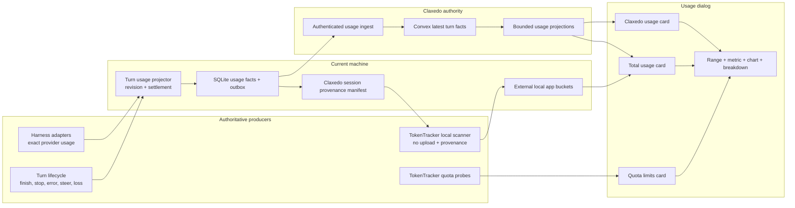
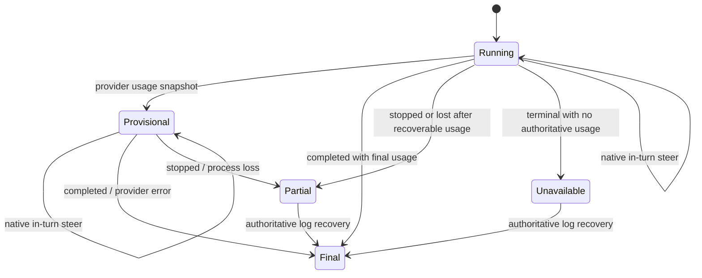

# feat: Add unified usage dashboard

## Overview

Replace the account menu's hover-opened **Usage limits** submenu with a direct **Usage** action that opens a full Settings-sized dialog. The dialog presents three comparable views over one time range:

1. **Quota limits** — provider-reported account windows from TokenTracker's provider probes.
2. **Claxedo usage** — every Claxedo turn the signed user can access, across local hosts, central sessions, and cloud workspace runtimes.
3. **Total usage** — Claxedo usage plus non-Claxedo coding-agent usage found on the current machine, without counting a Claxedo-launched upstream session twice.

The dashboard reports token counts first and estimated API-rate cost second. Cost is explicitly a projection, not an invoice. Claxedo rows support breakdown by harness, model, location, session, and workspace; external local rows support only dimensions retained by their source scanner.

This is a deep, cross-cutting plan because the UI depends on canonical turn usage from eight harness modes, revision-safe central persistence, a durable local outbox, a privacy-bounded TokenTracker scan, and deterministic overlap handling.

## Problem Frame

The current UI already probes quota windows through `tokentracker-cli`, but it only renders those values in a nested account-menu submenu. Claxedo also has an authoritative Convex `llm_usage_events` table, but the current producer records only completed `message.updated` events, converts absent token categories to zero, and inserts one immutable row per message. That path loses interrupted/failed turns, cannot accept a recovered authoritative revision, and does not retain the workspace, host, or local/cloud dimensions the new dashboard needs.

TokenTracker can scan local Claude Code, Codex, Cursor, OpenCode, Pi, and other app histories from provider-produced usage counters. Its current queue aggregates by `source + model + 30-minute bucket`, however, so session identity and “launched through Claxedo” provenance are discarded before Claxedo can exclude overlap. Calling `tokentracker sync` directly is also not an acceptable embedded API: it owns `~/.tokentracker`, may upload to TokenTracker Cloud when the user has a device token, and emits its own heartbeat unless configured otherwise.

The implementation must therefore establish canonical metering and provenance first, then build projections and UI on top. It must not reconstruct token counts from message text, quota deltas, or independently computed subtraction.

## Requirements Trace

- **R1. Direct dialog entry:** Selecting Usage in the account menu closes the menu and opens a modal with the same desktop and mobile dimensions/behavior as Settings; hover no longer opens a usage surface.
- **R2. Three views:** The dialog exposes Quota limits, Claxedo usage, and Total usage as three summary cards with one active selection and a shared detail region.
- **R3. Quota probing:** Quota limits retain the current TokenTracker provider probes, refresh semantics, provider health states, window resets, and cached-last-value behavior.
- **R4. Cross-location Claxedo coverage:** Claxedo usage includes every supported harness and every Claxedo execution location: local, central, and cloud workspace runtime.
- **R5. Canonical turn metering:** Every harness publishes exact provider-reported input, output, reasoning, cache-read, and cache-write counters when available; normal completion, provider error, explicit stop, steering, interruption, process loss, and recovery have defined settlement behavior.
- **R6. Revision-safe persistence:** Provisional, final, partial, unavailable, and recovered usage are upserted by a stable turn identity and monotonically increasing revision. Only the latest revision contributes to totals.
- **R7. Requested Claxedo breakdowns:** Claxedo usage can be grouped and filtered by harness, model, location, session, and workspace, while preserving raw token categories and turn quality.
- **R8. Local app coverage:** Total usage includes supported non-Claxedo local application history from TokenTracker and identifies source app/model/time/project where the scanner has authoritative data.
- **R9. No double count:** TokenTracker-scanned rows that originate from a Claxedo session are classified before aggregation and excluded from the non-Claxedo local contribution. The implementation never subtracts independently aggregated totals.
- **R10. Cross-machine behavior:** Central Claxedo facts sync across signed-in machines through the Claxedo ledger; third-party local app history remains on the machine unless a future explicit opt-in sync is designed.
- **R11. Honest cost projection:** Every displayed cost is derived from versioned per-model API pricing and carries coverage metadata; unknown pricing remains unpriced rather than becoming a fabricated zero-cost model.
- **R12. Resilient UX:** Partial source failure leaves other cards usable, identifies stale/degraded/unavailable sources, and never replaces a last known valid snapshot with a false zero.
- **R13. Privacy and tenancy:** Local transcript files, paths, prompts, and responses never leave the host. Central ingest derives org/user from verified auth and accepts only the minimal usage fact and public Claxedo identifiers.
- **R14. Accessibility and responsive behavior:** Card selection, range controls, grouping, chart values, loading/error states, and row drill-down are keyboard and screen-reader usable; mobile uses the established full-viewport dialog behavior.

## Scope Boundaries

- TokenTracker Cloud is not Claxedo's central ledger and is not used to synchronize Claxedo dashboard data.
- Provider quota windows are account-level snapshots, not usage history and not billing API totals.
- Non-Claxedo local history is not uploaded to Claxedo Cloud in this scope.
- The dashboard does not infer tokens by tokenizing prompts/responses, by looking at quota movement, or by estimating a failed turn from text length.
- The dashboard does not claim invoice accuracy. It displays “estimated API cost” with pricing coverage and pricing-catalog date/source.
- External app histories do not receive fake session/workspace labels. A dimension absent from an authoritative source is shown as unavailable.
- Retrospective recovery is bounded by source history retention. If a provider emits usage only at final response and both the final event and authoritative log are unavailable, the turn remains `unavailable`.
- Team/admin rollups, budgets, alerts, CSV export, chargeback, and syncing third-party local history across machines are follow-on work.

## Planning Bootstrap Decisions

- **Three-card meaning:** “Total usage” means all Claxedo usage visible to the signed user across locations plus non-Claxedo application usage found on this machine. “Claxedo usage” is a strict subset and is separately selectable.
- **Interaction shape:** Cards select the shared chart/metrics/breakdown area; they do not open three nested dialogs.
- **Initial selection:** Claxedo usage is selected when the dialog opens because it is complete across machines and has the richest authoritative attribution. The user can switch to Quota limits or Total usage without opening another surface.
- **Initial range:** 30 days is the default, with 7/30/90 day controls matching the reference screenshot.
- **Default metric:** Tokens are primary. Estimated cost is a toggle because it has pricing-coverage caveats.
- **Default grouping:** Claxedo defaults to Harness; Total defaults to App; Quota shows provider windows and does not use the historical chart.
- **Location vocabulary:** User-facing location is `Local` or `Cloud`. Internal placement may distinguish `central`, `cloud-workspace`, and `user-hosted`; those map through one explicit projection function.

## Context & Research

### Technology & Infrastructure

- Bun/Node TypeScript monorepo; SolidJS 1.9 and Kobalte-based `@opencode-ai/ui` components in `packages/claxedo-app`.
- Hono control-plane APIs and local sidecar in `packages/claxedo-server`.
- Better SQLite/Drizzle for local durable state; Convex for hosted authority and metering facts.
- TanStack Solid Query is the established cache/revalidation mechanism.
- No charting dependency is present. `packages/claxedo-app/src/features/processes/ui/diagnostics/timeline.tsx` is the established accessible responsive SVG-chart pattern.

### Relevant Code and Patterns

- `packages/claxedo-app/src/app/workbench/rail/rail-sidebar.tsx` owns the current `UsageLimitsMenu` hover submenu.
- `packages/claxedo-app/src/app/workbench/rail/rail-account-menu.tsx` owns account-menu action closure/focus behavior.
- `packages/claxedo-app/src/app/dialogs/settings.tsx` and `packages/claxedo-app/src/app/styles/app-shell.css` define the target Settings-sized modal and mobile behavior.
- `packages/claxedo-app/src/features/settings/data/usage-limits-api.ts`, `packages/claxedo-app/src/app/workbench/controls/usage-limits-cache.ts`, and `packages/claxedo-app/src/app/workbench/controls/usage-limits-popover.tsx` implement current quota fetch, caching, refresh, and provider rendering.
- `packages/claxedo-server/src/deployments/local/server-usage-limits.ts` is the audited, local-only TokenTracker quota adapter.
- `packages/agent-event-runtime/src/contracts/agent-runtime-event.ts` owns the common harness event contract; its current `usage` event carries context occupancy but not exact token categories.
- `packages/agent-sdk-runtime/src/harnesses/shared/turn-projection.ts` is the shared runtime-event to committed compat-event projection.
- `packages/workspace-runtime/src/store.ts` owns durable `turn.start`, `message.completed`, and `turn.finish` lifecycle state.
- `packages/claxedo-server/src/session/runtime.ts` is the single compat-event ingress and current completed-turn metering trigger.
- `packages/claxedo-server/src/platform/telemetry/product/metering.ts` owns the current `LlmTurnRecord` and `UsageLedger` write contract.
- `convex/usageMetering.ts`, `convex/schema.ts`, and `convex/sessions.ts` own the current authoritative hosted fact, its readers, and the WorkGraph transcript metering path.
- `packages/claxedo-server/src/workspace/local-host.ts` owns stable local host identity; reuse it instead of creating a separate machine identifier.
- `packages/claxedo-server/src/platform/db/claxedo-migration/` plus `packages/claxedo-server/src/platform/db/repair.ts` are the established local schema migration/repair path.

### Harness Capability Matrix

| Harness mode | Current token source | Current status | Planned change |
|---|---|---|---|
| `claude-acp` | ACP prompt result `usage` | Exact fields mapped into final message | Contract/E2E coverage and lifecycle revisions |
| `codex-acp` | ACP prompt result `usage` | Exact fields mapped into final message | Contract/E2E coverage and lifecycle revisions |
| `cursor-acp` | ACP prompt result `usage` | Exact fields mapped into final message | Contract/E2E coverage and lifecycle revisions |
| `opencode` | Upstream final assistant message tokens | Strong native final-message path | Emit canonical observation/terminal revisions and recovery coverage |
| `claude-sdk` | SDK result `usage` | Collapsed to context occupancy | Preserve exact input/cache-write/cache-read/output fields |
| `codex-app-server` | `thread/tokenUsage/updated` total/last breakdown | Collapsed to context occupancy | Preserve input/cached/output/reasoning and distinguish snapshot/delta semantics |
| `cursor-sdk` | SDK usage input/output/cache read/cache write/total | Collapsed to context occupancy | Preserve exact token fields |
| `pi` | `AssistantMessage.usage` | Discarded by `runPiModelTurn`; final message has zeroes | Return usage and apply it to the canonical assistant message |

### Institutional Learnings

- `docs/solutions/` does not exist in this repository, so there were no usage-specific institutional solution notes to carry forward.
- Repository-level `AGENTS.md` is controlling: fix the authoritative producer rather than adding fallback/synthesized usage events, and verify real entrypoints plus failure/recovery/isolation paths.

### External Research Decision

External research is intentionally skipped. The key constraints are repository-specific contracts and an already pinned TokenTracker implementation. Official provider billing APIs would not resolve the product question because the requested view is based on local harness history plus Claxedo's own turn ledger.

## Key Technical Decisions

1. **One canonical `TurnUsageRevision` contract, separate from analytics.** Runtime usage observations and terminal outcomes produce revisioned facts. PostHog remains best-effort; SQLite/Convex remain authoritative.
2. **Use provider-reported counters only.** Harness adapters preserve exact native usage. Missing categories stay unknown in observation quality metadata instead of silently becoming measured zero.
3. **Separate observation from settlement.** A usage snapshot can persist a `provisional` revision before a full turn succeeds. Completion, provider error, explicit stop, and abort-backed steering settle the same turn; native in-turn steering does not.
4. **Upsert, never append revisions into totals.** Stable identity is `org + session_ref + message_id` centrally and `host_id + session_ref + message_id` locally. A higher revision replaces the current contribution; replaying the same revision is idempotent.
5. **Retain raw facts and query bounded projections.** Raw facts carry tokens and attribution; daily/model/harness/location projections answer the dashboard without whole-table reads. Raw revisions remain available for session drill-down and repair.
6. **Use a durable local usage store/outbox.** Local Claxedo turns write SQLite synchronously with lifecycle persistence. A signed client flushes pending minimal facts to the hosted ingest boundary; offline/restart preserves pending rows.
7. **TokenTracker is an embedded scanner, not a child dashboard.** Claxedo must use a no-upload/no-telemetry library entrypoint with an explicit Claxedo tracker state directory and provenance classifier. It must not invoke the current `cmdSync` path against the user's TokenTracker account.
8. **Preserve provenance before TokenTracker buckets.** The scanner classifier receives native source/session identity, matches it against a Claxedo session manifest, and writes `app = claxedo | <native-app>` into the aggregate key. Total usage sums only non-Claxedo local buckets plus authoritative Claxedo ledger rows.
   - Classification is fail-closed for overlap safety: a row whose source cannot expose enough identity to prove it is non-Claxedo is quarantined from Total and reported as unclassified coverage. It is never optimistically counted as external-local usage.
9. **Keep third-party local history local.** Only Claxedo turn facts sync centrally. The Total card is therefore richer in a desktop/local-server context and explicitly labels current-machine coverage.
10. **Price at read/projection time with version metadata.** Token facts remain price-independent. One audited pricing adapter produces estimated cost and priced/unpriced coverage so catalog changes can recompute views without mutating facts.
11. **One dashboard API contract with deployment-specific composition.** Shared response types describe quota, Claxedo, local-external, coverage, and breakdowns. Local composition adds quota/local scans and merges central Claxedo data; hosted composition returns central Claxedo data and marks local scan unavailable.
12. **Cards control one detail surface.** This keeps the dialog scannable at Settings size and makes range, metric, chart, and breakdown controls consistent.

## Open Questions

### Resolved During Planning

- **Does provider quota probing replace turn metering?** No. Quotas are account-window snapshots and cannot attribute usage to harness/session/workspace or reliably recover a failed turn.
- **Should TokenTracker sync all local history to Claxedo Cloud?** No. Third-party local history remains local in this scope; only Claxedo facts enter the central ledger.
- **How is Claxedo overlap removed from local app history?** Classify native sessions before TokenTracker aggregation using a Claxedo-owned provenance manifest. Do not subtract Claxedo totals later.
- **Does steering finish a turn?** Native provider steering remains the same turn. A harness that implements steer as abort+new prompt settles the old turn as `interrupted_by_steer` and opens a new turn identity.
- **What happens when no usage snapshot exists after a crash?** Persist `unavailable`; later authoritative log recovery may replace it with a higher revision.
- **What dimensions appear for third-party local rows?** Only authoritative source dimensions. App/model/day are baseline; project/session/workspace appear only when preserved by that scanner.

### Deferred to Implementation

- **TokenTracker delivery mechanism:** Prefer an upstream released no-upload scan/provenance API. If it is not available when execution begins, carry the audited change as a Bun dependency patch and keep a contract test. Do not silently fall back to spawning `tokentracker sync`.
- **Exact cloud runtime host attribution:** Resolve from the placement/relay/sandbox record available at each producer. If a producer has no authoritative host identifier, retain an absent host field and still report `Cloud`; do not derive it from workspace text.
- **Pricing catalog adapter:** Evaluate the pinned TokenTracker pricing library against the repository's models.dev catalog on real provider/model IDs. Choose one canonical adapter based on coverage tests; do not combine two prices for the same row.
- **90-day projection storage:** Measure bounded Convex query sizes during implementation to decide whether daily Claxedo rollups are written transactionally or by a cron. The API response and correctness requirements are unchanged.

## High-Level Technical Design

> *This illustrates the intended approach and is directional guidance for review, not implementation specification. The implementing agent should treat it as context, not code to reproduce.*

### Turn Settlement State Model

## UX Specification

### Entry and shell

- Rename the account-menu row from **Usage limits** to **Usage** and render it as a normal `DropdownMenu.Item` with the gauge icon.
- Click/Enter closes the account menu through its existing `select(...)` helper, restores focus correctly after dialog close, and opens `DialogUsage` through the shared dialog context.
- Remove `UsageLimitsMenu`, its hover/pin/grace behavior, and popover-only styling after the quota panel is migrated.
- `DialogUsage` uses `Dialog size="x-large"`, `transition`, and an opt-in `.usage-dialog-shell` that shares the Settings 1120×860 desktop box, backdrop, reduced-motion rules, and full-viewport mobile behavior.

### Header and global controls

- Title: **Usage**.
- Date subtitle reflects the selected inclusive local date range.
- Right-side controls: **7 days / 30 days / 90 days**, Refresh, and Close.
- Refresh runs source-specific revalidation concurrently. Each card keeps its prior snapshot while refreshing and reports its own updated time/error.

### Summary cards

- **Quota limits:** provider count, most constrained active window, and nearest reset. Selection replaces the historical detail area with provider window rows.
- **Claxedo usage:** estimated API cost, processed tokens, turn count, and Local/Cloud share for the selected range.
- **Total usage:** estimated API cost and processed tokens for `central Claxedo + current-machine non-Claxedo`. A coverage caption makes the current-machine boundary explicit.
- Selected card uses pressed/selected semantics and visible focus; cards are buttons, not hover-only targets.

### Shared usage detail for Claxedo and Total

- Metric toggle: **Tokens / Estimated cost**.
- Accessible daily stacked-area/line chart. Claxedo defaults to harness series; Total defaults to app series. Hover/focus readout and an `aria-label` summarize axes, range, peaks, and series.
- Metric strip: processed tokens, uncached input, cached input, output, reasoning, turns/sessions, plus pricing and metering coverage.
- Group control: **Harness, Model, Location, Session, Workspace** for Claxedo; **App, Model, Location, Project** for Total. Unsupported dimensions are absent, not disabled fake options.
- Breakdown table columns: label, projected cost, share, total tokens, token categories, status/coverage. Session/workspace labels link to existing Claxedo routes when the row carries a valid public ref.
- Filters compose with group: selected app/harness/model/location/workspace/session and date range. “Clear filters” restores the card default.
- Quality panel reports provider-reported/final, partial, unavailable, priced, and unpriced shares. It explains that cached-token savings/cost are projections.

### Loading, empty, and degraded states

- First open: card-shaped skeletons plus detail skeleton; no all-zero flash.
- Quota unavailable: signed-in-provider guidance from the current panel.
- Central disconnected: retain last Claxedo snapshot if cached, label stale, and keep local-only Total contribution visible.
- TokenTracker scan unavailable or unsupported deployment: Total still includes Claxedo and labels non-Claxedo local coverage unavailable.
- Partial scanner failure: show successful apps and one compact source-error list.
- No usage: distinguish “no usage in this range” from “source unavailable.”
- Anonymous/local-only user: show local Claxedo and local app usage; explain that cross-machine Claxedo sync requires sign-in.
- Deployment capability: quota probes run only where the active Claxedo server can access configured provider credentials. A hosted context without those credentials reports Quota limits as unavailable with setup guidance; it does not proxy credentials from another machine or render zero usage.

## Implementation Units

- [ ] **Unit 1: Define exact runtime usage and lifecycle contracts across every harness**

**Goal:** Make exact provider-reported usage and terminal outcome a canonical shared runtime contract, preserving revisions before compatibility projection.

**Requirements:** R4, R5, R6, R12

**Dependencies:** None

**Files:**
- Modify: `packages/agent-event-runtime/src/contracts/agent-runtime-event.ts`
- Modify: `packages/agent-event-runtime/src/projections/opencode-compat/types.ts`
- Modify: `packages/agent-event-runtime/src/projections/opencode-compat/projection.ts`
- Modify: `packages/agent-event-runtime/src/projections/opencode-compat/runtime-event.ts`
- Test: `packages/agent-event-runtime/src/projections/opencode-compat/projection.test.ts`
- Test: `packages/agent-event-runtime/src/projections/opencode-compat/runtime-event.test.ts`
- Modify: `packages/agent-event-runtime/src/harnesses/claude/adapter.ts`
- Test: `packages/agent-event-runtime/src/harnesses/claude/adapter.test.ts`
- Modify: `packages/agent-event-runtime/src/harnesses/codex/adapter.ts`
- Test: `packages/agent-event-runtime/src/harnesses/codex/adapter.test.ts`
- Modify: `packages/agent-event-runtime/src/harnesses/cursor/adapter.ts`
- Test: `packages/agent-event-runtime/src/harnesses/cursor/adapter.test.ts`
- Modify: `packages/agent-sdk-runtime/src/harnesses/shared/turn-projection.ts`
- Test: `packages/agent-sdk-runtime/src/harnesses/shared/turn-projection.test.ts`
- Modify: `packages/agent-sdk-runtime/src/harnesses/shared/runtime-store.ts`
- Modify: `packages/agent-sdk-runtime/src/harnesses/shared/sdk-runtime-adapter.ts`
- Test: `packages/agent-sdk-runtime/src/harnesses/shared/sdk-runtime-adapter.test.ts`
- Modify: `packages/agent-sdk-runtime/src/harnesses/acp/helpers.ts`
- Modify: `packages/agent-sdk-runtime/src/harnesses/acp/index.ts`
- Test: `packages/agent-sdk-runtime/src/harnesses/acp/workspace-behavior.test.ts`
- Modify: `packages/agent-sdk-runtime/src/harnesses/pi/model-backend.ts`
- Modify: `packages/agent-sdk-runtime/src/harnesses/pi/index.ts`
- Test: `packages/agent-sdk-runtime/src/harnesses/pi/index.test.ts`
- Test: `packages/agent-sdk-runtime/src/harnesses/opencode/workspace-behavior.test.ts`
- Modify: `packages/workspace-runtime/src/store.ts`
- Test: `packages/workspace-runtime/src/store.test.ts`

**Approach:**
- Extend the runtime `usage` event so context occupancy and exact token categories are distinct fields. Include snapshot semantics and provider observation identity needed to order revisions.
- Preserve nullable/known category information. A provider-reported zero is different from a category the provider did not report.
- Extend `session.usage` compatibility projection with `messageID` and exact tokens so the committed event log, not an in-memory callback, is the metering input.
- Have shared turn projection apply observations to the active assistant message and persist terminal `turn.finish` outcome. Ensure terminalization order commits the latest usage before completion/error/stop.
- Keep ACP's existing exact mapping and strengthen its contract tests.
- Map native Claude SDK result usage, Codex total/last token breakdowns, and Cursor SDK usage without collapsing categories.
- Return Pi usage from `runPiModelTurn()` and populate the final canonical assistant message instead of leaving `buildAssistantMessage()` zeroes.
- Treat OpenCode's upstream completed message as authoritative and prove it passes through unchanged.
- Define outcomes for completed, failed, cancelled/stopped, interrupted-by-steer, and process-lost. Native steer emits no terminal outcome; abort-backed steer does.

**Execution note:** Start with failing contract tests for exact category preservation and lifecycle ordering; this is the authoritative-producer migration.

**Patterns to follow:**
- `packages/agent-sdk-runtime/src/harnesses/acp/helpers.ts` for exact usage normalization.
- `packages/workspace-runtime/src/store.ts` for journal-first lifecycle persistence.
- `packages/agent-event-runtime/src/projections/opencode-compat/projection.test.ts` for compatibility contract coverage.

**Test scenarios:**
- **Happy path:** Each of the eight harness modes supplies known native usage and the committed assistant/usage event preserves exact input/output/reasoning/cache categories before terminal completion.
- **Edge case:** A cumulative Codex snapshot followed by a newer cumulative snapshot replaces the prior observation rather than adding both.
- **Edge case:** A category omitted by a provider remains unknown; a provider-reported zero remains known zero.
- **Integration:** A completed SDK turn commits usage, `message.completed`, and `turn.finish` in canonical order and produces one final turn revision.
- **Error path:** Provider error after a usage snapshot settles an error turn with the latest reported usage.
- **Error path:** Explicit Stop after a usage snapshot settles partial usage; Stop with no snapshot records unavailable.
- **Edge case:** Native steering continues the same turn; abort+new-turn steering settles the old message as interrupted and assigns a different new turn identity.
- **Recovery:** Process loss records partial/unavailable, and replay of a later authoritative message usage yields a higher revision.

**Verification:**
- All harness adapters pass exact-usage contract tests, and no supported mode reaches a terminal event with synthesized zeroes when native usage was present.
- Repository search shows one shared exact token shape and no harness-specific shadow metering contract.

- [ ] **Unit 2: Replace completion-only metering with a revisioned local turn ledger and outbox**

**Goal:** Persist every Claxedo usage observation/settlement durably on the producing host, attribute it to canonical session/workspace/host placement, and queue signed central delivery.

**Requirements:** R4, R5, R6, R7, R10, R12, R13

**Dependencies:** Unit 1

**Files:**
- Create: `packages/claxedo-server/src/usage/contracts.ts`
- Create: `packages/claxedo-server/src/usage/turn-meter.ts`
- Test: `packages/claxedo-server/src/usage/turn-meter.test.ts`
- Create: `packages/claxedo-server/src/usage/usage.sql.ts`
- Create: `packages/claxedo-server/src/usage/adapters/sqlite-usage-ledger.ts`
- Test: `packages/claxedo-server/src/usage/adapters/sqlite-usage-ledger.test.ts`
- Create: `packages/claxedo-server/src/platform/db/claxedo-migration/20260808000100_usage_turn_ledger/migration.sql`
- Modify: `packages/claxedo-server/src/platform/db/schema.ts`
- Modify: `packages/claxedo-server/src/platform/db/repair.ts`
- Test: `packages/claxedo-server/src/platform/db/repair.test.ts`
- Modify: `packages/claxedo-server/src/session/runtime.ts`
- Test: `packages/claxedo-server/src/session/runtime.test.ts`
- Modify: `packages/claxedo-server/src/platform/telemetry/product/metering.ts`
- Test: `packages/claxedo-server/src/platform/telemetry/product/metering.test.ts`
- Modify: `packages/claxedo-server/src/workspace/local-host.ts`

**Approach:**
- Introduce `TurnUsageRevision` as the metering fact with stable session ref, message id, revision, observation time, settlement, turn status, location, harness/provider/model, optional workspace/host, exact known token fields, and quality metadata.
- Split the existing `UsageLedger` responsibility into a revision writer and read projection contract; keep PostHog emission downstream of successful/best-effort ledger handling.
- Replace `meterCompletedTurn()` with a `turn-meter` that consumes committed `session.usage`, `message.updated`, `message.completed`, `session.error`, and durable turn outcome events from `publishGlobal`.
- Resolve `session_ref`, workspace, harness, provider/model, and location from `ProjectionStore`, runtime config, placement, and `localHostIdentity()`. The meter must not infer these from UI route state.
- Write SQLite with compare-and-set revision semantics. Store current contribution and outbox delivery state in the same transaction so a crash cannot produce an unqueued local fact.
- On runtime startup, reconcile durable `turn.start` records that have no terminal `turn.finish`. Settle each from its latest committed authoritative usage as `partial`, or as `unavailable` when none exists, and allow a later recovered provider log to replace it with a higher revision.
- Keep local facts readable even when unsigned. Mark outbox rows pending until a signed client uploads them; anonymous users retain local-only usage.
- Continue emitting `llm_turn_completed` analytics for final/partial terminal states, augmented with settlement/quality, but never use analytics as the dashboard source.

**Execution note:** Implement the ledger compare-and-set and outbox transaction test-first; this is a persistent-data integrity boundary.

**Patterns to follow:**
- `packages/claxedo-server/src/session/message-replay.ts` for durable event and session-meta lookup.
- `packages/claxedo-server/src/platform/db/claxedo-migration/` and `repair.ts` for schema lifecycle.
- `packages/claxedo-server/src/workspace/local-host.ts` for host identity ownership.

**Test scenarios:**
- **Happy path:** Provisional revision 1 then final revision 2 leaves one contributing current fact and two audit revisions/outbox updates as designed.
- **Edge case:** Replay of the same revision/payload is idempotent; a lower or conflicting same-number revision is rejected and observable.
- **Integration:** A committed `session.usage` followed by `message.completed` writes SQLite before the public event loop can lose the fact.
- **Error path:** Ledger or outbox transaction failure is reported as degraded metering without corrupting session execution; no half-written fact exists.
- **Recovery:** Restart reads pending outbox rows and current facts without relying on process memory.
- **Isolation:** Two sessions with the same provider message id but different canonical session refs do not collide; duplicate replay of the same session ref does.
- **Privacy:** Stored/uploadable fact excludes prompt, response, raw directory path, credential, and provider auth material.

**Verification:**
- Local Claxedo usage survives process restart and can be queried before sign-in or central connectivity.
- Every terminal path produces final, partial, or unavailable settlement rather than silently disappearing.

- [ ] **Unit 3: Upgrade Convex metering to revisioned facts and add bounded dashboard projections**

**Goal:** Make central Claxedo usage authoritative across machines and locations, with tenancy-safe ingest and queryable range/group projections.

**Requirements:** R4, R6, R7, R10, R11, R12, R13

**Dependencies:** Unit 2 contracts

**Files:**
- Modify: `convex/schema.ts`
- Modify: `convex/usageMetering.ts`
- Test: `convex/usage-metering.policy.test.ts`
- Modify: `convex/sessions.ts`
- Test: `convex/sessions.test.ts`
- Modify: `packages/claxedo-server/src/authority/adapters/convex/usage-ledger.ts`
- Test: `packages/claxedo-server/src/authority/adapters/convex/usage-ledger.test.ts`
- Create: `packages/claxedo-server/src/usage/routes.ts`
- Test: `packages/claxedo-server/src/usage/routes.test.ts`
- Modify: `packages/claxedo-server/src/central-runtime.ts`
- Test: `packages/claxedo-server/src/central-runtime.test.ts`
- Modify: `packages/claxedo-server/src/deployments/hosted-node/index.ts`
- Modify: `packages/claxedo-server/src/deployments/hosted-workerd/worker.import-graph.test.ts`

**Approach:**
- Evolve `llm_usage_events` so the current authoritative row carries revision, settlement, quality, location, optional host/workspace/session ref, observed/completed timestamps, and known token categories.
- Preserve existing `llm_usage_events` through an explicit compatibility migration: treat each legacy completed row as revision 1/final with its currently authoritative token fields, backfill only attribution that can be resolved from canonical session/workspace records, and mark unavailable dimensions/categories as legacy-unknown. Deploy readers that accept old and new rows before enabling new writers, then remove compatibility handling only after the backfill is verified.
- Add a stable compound lookup index and compare revision inside the mutation. Tenant identity comes from the verified boundary/service context; browser ingest cannot choose org/user.
- Retain or introduce a bounded revision audit table only if recovery/debug requirements need past revisions; totals always read the current fact table.
- Update `recordLlmTurnFact()` and WorkGraph transcript sync so cloud workspace turns use the same revision contract and placement attribution as central/local turns.
- Add authenticated batch ingest for local outbox rows with per-item accepted/stale/conflict outcomes. Validate batch size, numeric bounds, enums, and public identifiers.
- Add tenant-scoped reads for daily series, headline totals, data quality, and paginated/grouped breakdowns. Use indexes/rollups, not a whole-table `.collect()` followed by filtering.
- Preserve 400-day raw retention only after any required daily rollup is durable. Recovered higher revisions must adjust rollups rather than add an extra turn.
- Keep TokenTracker and filesystem code out of the Cloudflare worker import graph.

**Execution note:** Start with Convex policy tests for tenant isolation, idempotent revisions, and bounded reads before changing the schema producer.

**Patterns to follow:**
- Existing service-token builders and tenant resolution in `convex/model.ts`.
- Existing `recordLlmTurnFact()` dedup path and `sandbox_usage_daily` bounded query/rollup patterns.
- Existing central runtime auth behavior in `packages/claxedo-server/src/central-runtime.ts`.

**Test scenarios:**
- **Happy path:** Signed batch ingest derives tenant, accepts a newer local revision, and the 30-day projection includes it once.
- **Edge case:** Duplicate, stale, and conflicting revisions return distinct deterministic outcomes; none double-count totals.
- **Integration:** WorkGraph transcript sync and central runtime metering for the same canonical turn converge on one latest fact.
- **Isolation:** A user cannot ingest into another org or query another org/session/workspace, even with guessed public ids.
- **Error path:** Oversized batches, negative/non-finite tokens, invalid settlements, and malformed refs are rejected without partial cross-tenant writes.
- **Performance:** 7/30/90-day queries use bounded indexes/rollups and pagination; tests guard against unbounded all-org collection.
- **Recovery:** Partial/unavailable fact followed by authoritative final revision updates daily/model/harness/location totals by replacement.
- **Retention:** Pruning cannot delete an unrolled fact or make a retained dashboard range incorrect.

**Verification:**
- Central queries return correct totals and breakdowns across central runtime and cloud WorkGraph producers.
- Hosted worker import guards remain green and no public Convex function bypasses verified auth.

- [ ] **Unit 4: Add safe TokenTracker local history, provenance classification, and cost projection adapters**

**Goal:** Read current-machine coding-agent history without TokenTracker Cloud side effects, preserve app provenance before aggregation, and project model costs consistently.

**Requirements:** R3, R8, R9, R10, R11, R12, R13

**Dependencies:** Unit 2 local session manifest; audited TokenTracker library support

**Files:**
- Create: `packages/claxedo-server/src/usage/adapters/token-tracker-local-history.ts`
- Test: `packages/claxedo-server/src/usage/adapters/token-tracker-local-history.test.ts`
- Create: `packages/claxedo-server/src/usage/adapters/token-tracker-pricing.ts`
- Test: `packages/claxedo-server/src/usage/adapters/token-tracker-pricing.test.ts`
- Create: `packages/claxedo-server/src/usage/provenance.ts`
- Test: `packages/claxedo-server/src/usage/provenance.test.ts`
- Modify: `packages/claxedo-server/src/deployments/local/server-usage-limits.ts`
- Modify: `packages/claxedo-server/src/types/tokentracker-cli.d.ts`
- Modify: `packages/claxedo-server/src/deployments/local/usage-limits.contract.test.ts`
- Modify: `packages/claxedo-server/package.json`
- Modify: `package.json`
- Create if required: `patches/tokentracker-cli@0.75.1.patch`

**Approach:**
- Require a TokenTracker library entrypoint that accepts explicit source home, explicit Claxedo-owned tracker state directory, `upload: false`, `telemetry: false`, time window, source set, and a provenance classifier callback.
- If the released package lacks that entrypoint, add the smallest audited dependency patch and lock it with a contract test. Do not call `cmdSync` and do not read/modify the user's TokenTracker `config.json`, queue offset, device token, or cloud account.
- Maintain a Claxedo provenance manifest from canonical session meta/runtime bindings: upstream app/source, upstream provider session id, Claxedo session ref, harness, workspace public id, and time bounds. Do not store prompts or raw transcript content.
- Classify each native session/event before the 30-minute bucket key is formed. Aggregate by `app + source + model + bucket_start` and retain optional authoritative project/session refs.
- When a parser does not expose enough native identity to distinguish a direct app session from a Claxedo-launched one, quarantine that source's rows from Total and expose an `unclassified` coverage count. Add the source only after characterization proves deterministic classification.
- Return only `app != claxedo` as the external-local contribution. Keep classified Claxedo buckets available for diagnostics/coverage comparison but never add them to Total.
- Wrap TokenTracker's pricing API or the selected canonical pricing catalog behind a Claxedo adapter. Return estimated USD plus priced/unpriced token coverage and catalog metadata; unknown models remain unpriced.
- Keep the existing quota probe cache/refresh contract and consolidate shared TokenTracker import/audit concerns without coupling quota refresh to history scan.

**Execution note:** Add characterization tests around the pinned TokenTracker version before patching or upgrading it; use fixture homes only.

**Patterns to follow:**
- `packages/claxedo-server/src/deployments/local/usage-limits.contract.test.ts` for deep-import contract locking.
- TokenTracker's own incremental cursors and latest-row-per-bucket semantics; preserve them rather than reimplementing token parsing.
- `packages/claxedo-server/src/platform/http/local-only-projection.ts` for filesystem-backed local-only routes.

**Test scenarios:**
- **Happy path:** Fixture Claude/Codex/Cursor/OpenCode/Pi histories produce app/model/day/category buckets and projected costs without network upload.
- **Overlap:** A Codex/Claude upstream session registered in the Claxedo manifest is labeled `claxedo` before bucketing and excluded from external-local totals.
- **Edge case:** Direct native app and Claxedo launch use the same provider/model/time bucket but distinct session provenance; only the direct event remains external.
- **Privacy:** Scanner output and logs contain no prompt/response text, credential, raw home path, or file content.
- **Isolation:** Claxedo uses its own scanner cursor/state and leaves an existing user's TokenTracker queue/config byte-for-byte unchanged.
- **Error path:** One corrupt/unreadable source yields source-specific degradation while other source buckets remain available.
- **Network:** Tests prove no TokenTracker Cloud upload and no anonymous heartbeat even when fixture config contains a device token.
- **Pricing:** Known input/output/cache model rates match expected fixture cost; unknown model increases unpriced coverage and does not appear as zero-cost priced usage.
- **Upgrade contract:** TokenTracker version/import/row/provenance contracts fail loudly on incompatible dependency changes.

**Verification:**
- Total local external tokens equal the authoritative scanner fixtures after classification and never include registered Claxedo sessions.
- No embedded path invokes TokenTracker Cloud sync or telemetry.

- [ ] **Unit 5: Compose local and central usage APIs with durable outbox sync**

**Goal:** Expose one dashboard contract that combines quota, central Claxedo, local Claxedo, and current-machine external history according to deployment capability.

**Requirements:** R2, R3, R4, R7, R8, R9, R10, R11, R12, R13

**Dependencies:** Units 2–4

**Files:**
- Modify: `packages/claxedo-server/src/usage/routes.ts`
- Test: `packages/claxedo-server/src/usage/routes.test.ts`
- Create: `packages/claxedo-server/src/usage/projection.ts`
- Test: `packages/claxedo-server/src/usage/projection.test.ts`
- Create: `packages/claxedo-server/src/usage/outbox-sync.ts`
- Test: `packages/claxedo-server/src/usage/outbox-sync.test.ts`
- Modify: `packages/claxedo-server/src/deployments/local/server.ts`
- Test: `packages/claxedo-server/src/deployments/local/server.test.ts`
- Modify: `packages/claxedo-server/src/deployments/hosted-node/index.ts`
- Create: `packages/claxedo-app/src/features/usage/data/usage-api.ts`
- Test: `packages/claxedo-app/src/features/usage/data/usage-api.test.ts`
- Create: `packages/claxedo-app/src/features/usage/data/usage-query.ts`
- Test: `packages/claxedo-app/src/features/usage/data/usage-query.test.ts`

**Approach:**
- Define a versioned dashboard response containing source snapshots, coverage, daily points, summary metrics, filter options, grouped rows, pagination, and source-specific errors/updated times.
- Provide range/group/filter parameters with explicit timezone. Server projection owns inclusion, latest-revision selection, token arithmetic, and cost coverage; UI does not recompute authoritative totals.
- Hosted routes return central Claxedo data and a local-history capability of unavailable.
- Quota capability is deployment- and credential-scoped: the response distinguishes configured probe results, unconfigured providers, and a deployment where local provider credentials are unavailable.
- Local routes compose local quota/history with signed central Claxedo data through the established control-plane transport under independent source deadlines. They merge local and central Claxedo by stable turn identity/revision before totals; a central timeout returns cached/local sources with stale metadata rather than delaying the whole dialog indefinitely.
- On signed local requests, flush bounded pending outbox batches to hosted ingest and mark acknowledgements transactionally. Trigger on app bootstrap/reconnect, after a terminal turn notification, dashboard open/refresh, and periodic backoff while pending—not on every token delta.
- If central is offline, retain pending rows and return local data plus stale/error metadata. A later signed request resumes from the durable outbox.
- Keep TanStack query keys source/range/group/filter scoped and use `keepPreviousData` during changes.

**Patterns to follow:**
- `packages/claxedo-app/src/features/settings/data/usage-limits-api.ts` and `usage-limits-cache.ts` for query/cache behavior.
- `packages/claxedo-app/src/platform/api/api.ts` for bearer/basic auth refresh.
- `packages/claxedo-app/src/platform/runtime/transport.ts` for local versus hosted routing.

**Test scenarios:**
- **Happy path:** Local signed dashboard response contains quota, merged cross-machine Claxedo usage, and non-Claxedo current-machine buckets with correct coverage.
- **Hosted path:** Hosted web returns Claxedo data and explicitly unavailable current-machine history without failing the dashboard.
- **Anonymous path:** Local unsigned response includes local facts/history, has no cross-machine data, and leaves outbox pending.
- **Overlap:** Same local Claxedo turn in SQLite and central Convex appears once at the highest accepted revision.
- **Error path:** Central timeout preserves local totals and reports stale central status; scanner failure preserves Claxedo totals; quota failure preserves historical views.
- **Recovery:** Pending outbox survives restart, uploads after sign-in/reconnect, and marks only acknowledged revisions delivered.
- **Concurrency:** Two refreshes/outbox flushes do not upload or count the same revision twice.
- **Boundary:** 7/30/90-day inclusive ranges honor the client timezone without leaking a bucket into adjacent days.

**Verification:**
- One API response is sufficient to render each deployment's supported cards, and every missing source is distinguishable from a true zero.
- Cross-machine Claxedo usage converges after reconnect while external local history never leaves the local route.

- [ ] **Unit 6: Build the Settings-sized three-card Usage dialog and replace the hover submenu**

**Goal:** Deliver the requested interaction and visual hierarchy on desktop and mobile using the new usage contract.

**Requirements:** R1, R2, R3, R7, R8, R11, R12, R14

**Dependencies:** Unit 5 API contract

**Files:**
- Create: `packages/claxedo-app/src/features/usage/AGENTS.md`
- Create: `packages/claxedo-app/src/features/usage/ui/usage-dashboard.tsx`
- Create: `packages/claxedo-app/src/features/usage/ui/usage-summary-cards.tsx`
- Create: `packages/claxedo-app/src/features/usage/ui/usage-chart.tsx`
- Create: `packages/claxedo-app/src/features/usage/ui/usage-breakdown.tsx`
- Create: `packages/claxedo-app/src/features/usage/ui/quota-limits-view.tsx`
- Create: `packages/claxedo-app/src/features/usage/ui/usage-dashboard.css`
- Create: `packages/claxedo-app/src/features/usage/ui/usage-dashboard.vitest.tsx`
- Test: `packages/claxedo-app/src/features/usage/ui/usage-chart.vitest.tsx`
- Test: `packages/claxedo-app/src/features/usage/ui/usage-breakdown.vitest.tsx`
- Create: `packages/claxedo-app/src/app/dialogs/usage.tsx`
- Modify: `packages/claxedo-app/src/app/dialogs/index.ts`
- Modify: `packages/claxedo-app/src/app/integrations/feature-ports.ts`
- Modify: `packages/claxedo-app/src/app/app-shell-actions.ts`
- Modify: `packages/claxedo-app/src/app/app-shell-layout.tsx`
- Modify: `packages/claxedo-app/src/app/app-shell.tsx`
- Modify: `packages/claxedo-app/src/app/workbench/rail/rail-sidebar-shell.tsx`
- Modify: `packages/claxedo-app/src/app/workbench/rail/rail-sidebar.tsx`
- Modify: `packages/claxedo-app/src/app/workbench/rail/rail-account-menu.tsx`
- Test: `packages/claxedo-app/src/app/workbench/rail/rail-account-menu.vitest.tsx`
- Modify: `packages/claxedo-app/src/app/styles/app-shell.css`
- Remove: `packages/claxedo-app/src/app/workbench/controls/usage-limits-popover.tsx`
- Remove: `packages/claxedo-app/src/app/workbench/controls/usage-limits-popover.css`
- Move or replace: `packages/claxedo-app/src/app/workbench/controls/usage-limits-cache.ts`
- Test: `packages/claxedo-app/e2e/playwright/core-sidebar-tree.spec.ts`

**Approach:**
- Add a normal `onUsage` action alongside `onSettings` through the shell/rail boundary and open `DialogUsage` through `dialog.show(...)`.
- Reuse Settings dialog sizing/backdrop CSS through shared selectors while keeping Usage content independent of Settings tabs.
- Implement the UX specification above: cards, range, refresh, tokens/cost metric, accessible SVG daily chart, metric strip, grouping/filter controls, paginated breakdown, quality coverage, and drill-down links.
- Migrate the current quota window logic and provider states into `quota-limits-view.tsx`; keep one TanStack query/cache family and remove the popover owner after parity tests pass.
- Use semantic buttons, pressed/selected state, focus-visible styling, table headers, live refresh announcements, and non-hover equivalents for every chart value.
- At narrow width, cards scroll/snap or stack, controls wrap, the dialog becomes full viewport, and the breakdown uses responsive columns without hiding the row label/primary metric.

**Execution note:** Build behavior tests before visual polish, then validate against real desktop/mobile screenshots through the public account-menu entrypoint.

**Patterns to follow:**
- `packages/claxedo-app/src/app/dialogs/settings.tsx` for dialog shell and mobile header.
- `packages/claxedo-app/src/features/processes/ui/diagnostics/timeline.tsx` for accessible responsive SVG interaction.
- Existing usage-limit panel helpers for percent/reset/provider error wording.

**Test scenarios:**
- **Happy path:** Click/Enter Usage opens one Settings-sized dialog with three cards, 30-day default, and Claxedo/Tokens default detail.
- **Reconciliation:** For every range, `Total = deduplicated Claxedo latest revisions + classified non-Claxedo current-machine buckets`; quarantined/unclassified scanner rows are shown in coverage and contribute to neither side.
- **Interaction:** Selecting each card changes the detail view; range/metric/group/filter changes update query keys and retain previous data while fetching.
- **Quota parity:** Provider windows, reset text, throttled stats endpoint wording, manual refresh, and last snapshot behavior match the current panel.
- **Breakdown:** Harness/model/location/session/workspace rows display correct labels, totals, shares, coverage, and valid session/workspace links.
- **Capability:** Hosted web clearly marks local app history unavailable while keeping Total/Claxedo cards understandable.
- **Error path:** Independent quota, local scan, central, and pricing failures render per-source degradation without a zero flash or whole-dialog error.
- **Accessibility:** Keyboard can open/close, select cards, change ranges/grouping, focus chart points, and traverse table; axe finds no critical violations.
- **Responsive:** Settings-size desktop box, reduced motion, and full-viewport mobile layout match existing shell behavior.
- **Regression:** Account menu no longer opens a Usage hover submenu, closes on selection, and returns focus after dialog close.

**Verification:**
- The feature is reachable from the real account menu in desktop, local web, hosted web, keyboard-only, and mobile test projects.
- Old popover code, CSS, hover behavior, and E2E expectations are removed rather than left as a second implementation.

- [ ] **Unit 7: Prove end-to-end coverage, recovery, privacy, and rollout quality**

**Goal:** Validate the complete pipeline with realistic harness fixtures and deployment boundaries before enabling the dialog broadly.

**Requirements:** R1–R14

**Dependencies:** Units 1–6

**Files:**
- Create: `packages/claxedo-app/e2e/playwright/core-usage-dashboard.spec.ts`
- Modify: `packages/claxedo-app/e2e/playwright/real-harness-local.spec.ts`
- Create: `packages/claxedo-server/scripts/smoke/smoke-usage-metering.ts`
- Modify: `packages/claxedo-server/package.json`
- Modify: `packages/claxedo-app/package.json`
- Create: `docs/usage-dashboard.md`
- Modify: `docs/plans/README.md`

**Approach:**
- Build deterministic fixture homes for TokenTracker-supported local apps and scripted harness providers with exact usage responses.
- Add one real-entrypoint journey per harness family proving prompt/stop/error/steer/recovery to local ledger, central ingest, projection, and visible breakdown.
- Add cross-location fixtures: local signed host, central session, and hosted WorkGraph transcript sync in one range.
- Instrument only operational health: outbox age/count, ingest accepted/stale/conflict/error counts, projection latency, scanner source health, and priced coverage. Never log transcript content or raw paths.
- Before rollout, capture representative 7/30/90-day fixture baselines, commit numeric cold/warm projection and scanner-refresh budgets, and enforce them without loosening the bounds after seeing candidate results.
- Roll out behind a temporary feature flag only if deployment sequencing requires API/schema compatibility; define and remove the flag after both local and hosted backends support the contract.

**Execution note:** Treat the scripted exact-token journey as a release gate; real-provider tests remain opt-in because they consume provider quota.

**Patterns to follow:**
- `packages/claxedo-app/e2e/playwright/real-harness-local.spec.ts` for real versus scripted tiering.
- `packages/claxedo-server/scripts/smoke/smoke-interactive-session.ts` for evidence-based settlement checks.
- Repository diagnostics/privacy conventions for bounded operational metadata.

**Test scenarios:**
- **End to end:** Exact scripted usage from every harness reaches the correct dialog card/breakdown once with the expected cost projection.
- **Cross-machine:** Machine A local turn uploads; Machine B opens Claxedo usage and sees it; Machine B's external local app usage does not appear on A.
- **Overlap:** One Claxedo-launched Claude/Codex session plus one direct session produces two scanner classifications but Total counts each underlying turn exactly once.
- **Interruption:** Stop, provider error, native steer, abort-backed steer, process kill, restart, and recovered log produce expected settlement/quality and totals.
- **Offline:** Local turns accumulate with central unavailable, remain visible locally, then converge after reconnect/sign-in.
- **Privacy/security:** Captured request bodies and logs contain only allowed usage fields; tenant-crossing ingest/query attempts fail.
- **Retention/90-day:** Projection remains correct across daily rollup and raw fact pruning boundaries.
- **Visual:** Desktop dark/light, narrow desktop, mobile, empty, loading, partial, stale, unpriced, and dense-breakdown screenshots are reviewed.

**Verification:**
- A release checklist records exact commands/results during implementation, scripted acceptance is green, and any unrun real-provider criterion is named explicitly.
- Temporary rollout compatibility is removed once the final contract is live on all deployment modes.

## Dependencies and Sequencing

1. Unit 1 establishes authoritative producer data; nothing downstream should compensate for missing harness fields.
2. Unit 2 gives every local/central runtime a revisioned durable write and provenance manifest.
3. Units 3 and 4 can proceed in parallel after the shared contract exists: central ledger/projections and safe local external history.
4. Unit 5 composes deployment-specific APIs and outbox synchronization.
5. Unit 6 builds the final UX against stable contracts.
6. Unit 7 is the release gate and removes any temporary compatibility flag.

TokenTracker no-upload/provenance library support is the only external prerequisite. If an upstream release is unavailable, the audited Bun patch is part of Unit 4, not a reason to bypass the safety boundary.

## System-Wide Impact

- **Interaction graph:** Account menu → shell `onUsage` action → dialog context → usage queries → local/hosted Usage routes → SQLite/Convex projections and TokenTracker adapters.
- **Runtime graph:** Harness native event → `AgentRuntimeEvent.usage` → committed `session.usage`/assistant message → `turn-meter` → local/Convex revision writer → daily/group projection → dashboard.
- **Error propagation:** Harness metering failure is observable but cannot fail the user turn. API source errors are per-source and preserve prior data. Invalid central ingest fails the batch item and leaves its outbox row pending/conflicted.
- **State lifecycle risks:** Revisions, overlap, outbox delivery, rollups, retention, and replay all require compare-and-set/idempotency tests. No totals path may add historical revisions.
- **API surface parity:** Local server and hosted node expose the same versioned response contract with explicit capability metadata; hosted worker stays filesystem/TokenTracker-free.
- **Security boundary:** Local history endpoints stay loopback/local-only. Central ingest/query verifies auth and derives tenant. Raw local transcript content never enters payloads.
- **Performance:** TokenTracker scan is incremental and serialized by its own Claxedo-owned lock. Dashboard range reads are bounded; breakdowns paginate; refresh does not scan on every hover or token delta.
- **Pricing drift:** Facts remain raw and pricing is versioned at projection time. UI exposes priced/unpriced coverage and catalog effective date.
- **Unchanged invariants:** Provider quota probe semantics remain local and account-level. PostHog stays best-effort analytics. Existing session/message persistence remains the canonical conversation record. Third-party local usage stays local.

## Risk Analysis & Mitigation

| Risk | Likelihood | Impact | Mitigation |
|---|---:|---:|---|
| TokenTracker embedded scan accidentally uploads or mutates user state | Medium | High | Require explicit no-upload/no-telemetry library API, separate Claxedo state dir, device-token fixture test, and deep-import contract lock |
| Claxedo usage is double-counted through TokenTracker | High without provenance | High | Classify using native session identity before aggregation; never subtract aggregated totals |
| Provider snapshots are cumulative and get added twice | Medium | High | Put snapshot semantics in the shared contract and compare/replace revisions |
| Stop/crash loses final provider usage | Medium | Medium | Persist provisional snapshots; settle partial/unavailable; recover only from authoritative logs |
| Unknown tokens are represented as measured zero | High in current code | Medium | Preserve known/unknown categories and expose metering coverage |
| Cross-tenant ingest/query leak | Low with existing builders | Critical | Verified auth, server-derived tenant, bounded validators, policy tests, no public Convex client mutation |
| Convex range query becomes unbounded | Medium | High | Compound indexes/daily rollups/pagination; guard tests against whole-table collection |
| Cost looks like a bill | Medium | Medium | “Estimated API cost” copy, pricing coverage, catalog metadata, raw token toggle as default |
| External app project/session attribution is missing | High for some sources | Low | Show only authoritative dimensions and capability metadata; never invent labels |
| New dialog regresses account-menu focus/mobile | Medium | Medium | Reuse existing select/dialog patterns and cover keyboard/mobile public entrypoints |
| Dependency patch drifts from TokenTracker | Medium | Medium | Exact version pin, contract fixtures, smallest patch, replace with upstream release when available |

## Success Metrics

- 100% of supported harness modes pass scripted exact-token completion/error/stop tests.
- Every terminal Claxedo turn has a latest settlement (`final`, `partial`, or `unavailable`); no silent missing row.
- Duplicate/replayed/recovered turns change totals exactly once.
- Total usage overlap fixtures show zero double-counted Claxedo tokens.
- Dashboard source coverage and pricing coverage are visible and internally reconcile to displayed totals.
- 7/30/90-day dashboard projections satisfy the precommitted Unit 7 latency/read budgets under representative fact volume and never require an all-tenant or unpaginated raw-fact scan.
- No TokenTracker Cloud request or transcript-content upload occurs in local history acceptance tests.

## Phased Delivery

### Phase 1: Metering foundation

- Units 1–3: exact harness usage, revisioned SQLite/Convex facts, outbox, central projections.
- Keep current Usage limits popover live until quota parity and the new dashboard API are ready.

### Phase 2: Local total usage

- Units 4–5: safe TokenTracker scan, provenance classification, pricing, deployment-specific composition.

### Phase 3: UX replacement and release proof

- Units 6–7: new dialog, remove hover popover, full integration/visual/privacy checks, remove temporary flag.

## Documentation / Operational Notes

- Document exact data-source/coverage semantics and why Total is current-machine-local plus central Claxedo.
- Document TokenTracker version/patch audit, scanner state location, and no-upload guarantee.
- Add an operational runbook for pending outbox growth, scanner source degradation, ingest conflicts, unpriced-model spikes, and rollup lag.
- Dashboard copy must use “estimated API cost” and “not what you were billed.”
- Metrics/logs must avoid raw paths, prompts, responses, credentials, provider account ids, and TokenTracker device tokens.

## Sources & References

- Current quota UI: `packages/claxedo-app/src/app/workbench/controls/usage-limits-popover.tsx`
- Account-menu integration: `packages/claxedo-app/src/app/workbench/rail/rail-sidebar.tsx`
- Settings dialog shell: `packages/claxedo-app/src/app/dialogs/settings.tsx`
- Settings dialog sizing: `packages/claxedo-app/src/app/styles/app-shell.css`
- Local quota route: `packages/claxedo-server/src/deployments/local/server-usage-limits.ts`
- Runtime usage contract: `packages/agent-event-runtime/src/contracts/agent-runtime-event.ts`
- Turn journal: `packages/workspace-runtime/src/store.ts`
- Current metering producer: `packages/claxedo-server/src/session/runtime.ts`
- Current ledger contract: `packages/claxedo-server/src/platform/telemetry/product/metering.ts`
- Convex facts/readers: `convex/usageMetering.ts`
- Convex schema: `convex/schema.ts`
- WorkGraph transcript metering: `convex/sessions.ts`
- Local host identity: `packages/claxedo-server/src/workspace/local-host.ts`
- TokenTracker dependency: `packages/claxedo-server/package.json`
- TokenTracker repository: https://github.com/mm7894215/TokenTracker
