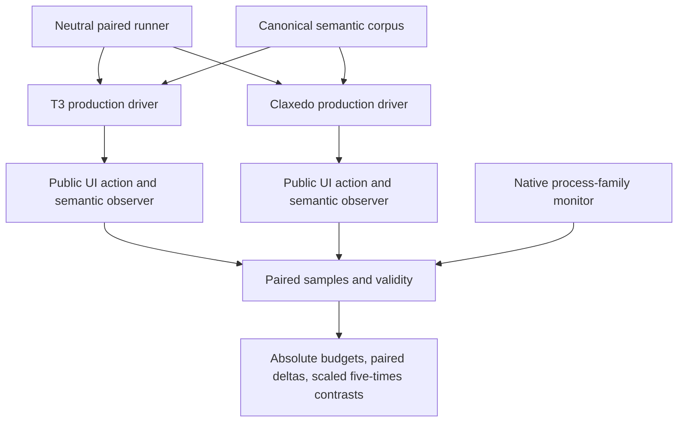
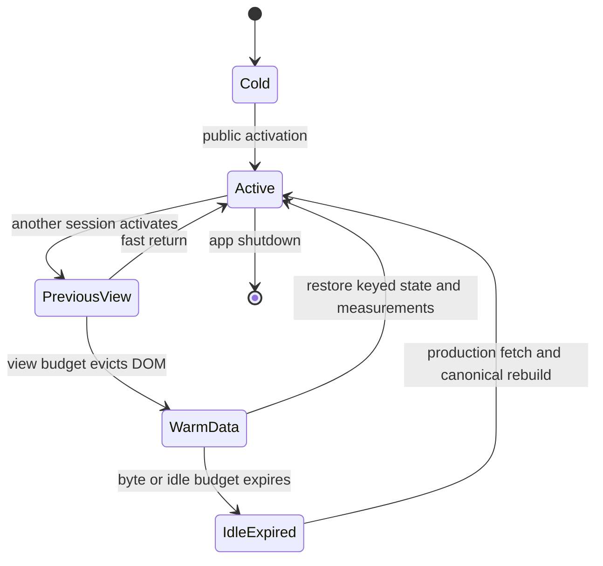
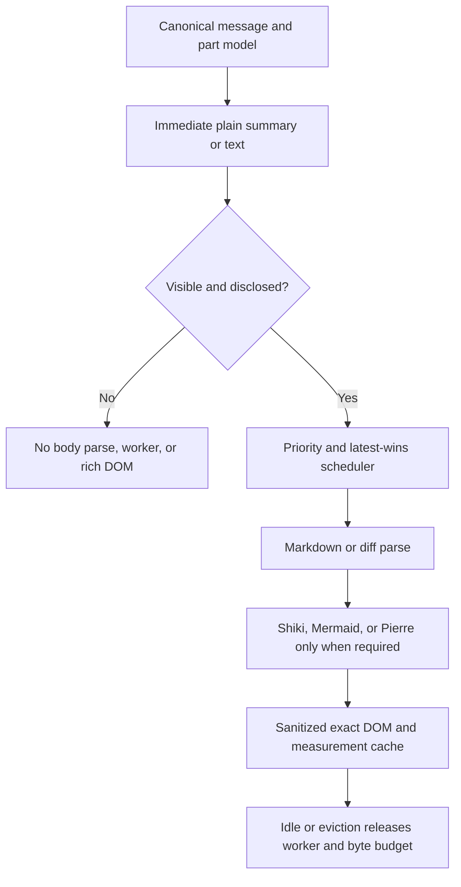

# Five Times Faster Than T3 - Plan

## Goal Capsule

- **Objective:** Make Claxedo at least five times faster than T3 on the predeclared cold-ready metric, then extend independently valid five-times results to other core metrics without weakening their product contracts.
- **Primary authority:** Claxedo's own semantic packaged benchmark owns the optimization loop. The neutral agent-app benchmark and canonical comparison corpus own only the final cross-app claim. Product correctness and perceived readiness outrank a benchmark score.
- **Release floor:** Ship only measured improvements. Preserve or improve every affected user-visible latency, correctness, and resource gate. A regression cannot be traded for a win elsewhere without a separately approved product decision.
- **Five-times rule:** A five-times claim is per metric. It requires a predeclared scaled paired contrast, a valid publication run, and an upper 95% confidence bound on the losing side of the target. Composite scores and independent confidence-interval overlap do not qualify.
- **Execution profile:** Run the units as independent stop/go experiments. Land a unit only after its public flow, focused tests, packaged benchmark, and cleanup gates pass.
- **Stop conditions:** Stop or redesign an experiment when it changes the readiness boundary, defers visible terminal fit, loses transcript content, breaks scroll or minimap stability, causes a first-use stall outside its budget, or fails to improve its target metric after attribution noise is removed.
- **Tail owner:** The final qualification unit owns publication evidence, stale experiment removal, and the comparison report. Diagnostics remain attribution tools and never replace the neutral metrics.

---

## Product Contract

### Summary

This program reduces work on Claxedo's core path rather than hiding it behind loading states. It first makes the cross-app benchmark paired, reproducible, and semantically strict. It then removes live hidden surfaces, narrows Solid subscriptions, makes disclosures own rich rendering cost, bounds warm state by bytes, and reduces the actual desktop bundle and process closure. Native implementations remain measured experiments until they beat the JavaScript path on end-to-end latency and total resource cost.

### Problem Frame

The corrected smoke run suggests that Claxedo starts faster than T3, but loses cold-open, warm-switch, memory, and idle-CPU comparisons. It is contextual diagnostic evidence, not a gate or publication baseline: the source corpus includes reasoning parts that the current T3 materializer drops, so materialized production work is not yet identical. U1-U10 use independently declared Claxedo budgets and fresh Claxedo control/candidate contrasts; only U11 establishes the actual five-times denominator.

| Metric | Invalid T3 smoke median | Claxedo smoke median | Diagnostic `smoke / 5` marker | Current interpretation |
|---|---:|---:|---:|---|
| `app.cold_ready_ms` | 3,904.70 ms | 1,925.25 ms | at most 780.94 ms | A credible stretch target after bundle and startup work. |
| `work_item.cold_open_ms` | 126.70 ms | 328.00 ms | at most 25.34 ms | Requires removing mount, reveal, and rich-body work from activation. |
| `work_item.warm_switch_p95_ms` | 46.30 ms | 228.90 ms | at most 9.26 ms | Incompatible with a two-stable-frame endpoint on a 120 Hz display unless the observer or display cadence changes. Do not weaken the endpoint. |
| `resource.peak_process_family_rss_mib` | 1,402.75 MiB | 1,473.11 MiB | at most 280.55 MiB | Below the observed Electron non-renderer floor. Requires a topology or shell change, not cache tuning alone. |
| `resource.quiescent_cpu_p95_pct` | 12.05% | 35.60% | at most 2.41% | Plausible only after hidden effects, polling, retained surfaces, and server wakeups are eliminated. |

The common smoke corpus contains 20 sessions, 800 turns, 1,600 messages, 3,720 parts, and 931,940 renderable bytes. Its SHA-256 digest is `8c8ac43d5f3a06403784b660095d55849d46b149a85e6373c4e5b65098ed428a`. The environment was an Apple M4 Pro with 24 GiB RAM, macOS 26.2, AC power, nominal thermal state, a 120 Hz display at 2x scale, and a 1440 by 900 app window.

Only five metric shapes have observers in both apps today because T3 advertises only `workspace-core-v1` and `resource-core-v1`. They are not publication-comparable until the final unit also fixes materialized reasoning parity. T3 does not yet provide the history, stream, or terminal observers. Claxedo's ten-metric coverage remains the only benchmark executed during optimization; cross-app execution waits until final qualification.

### Requirements

#### Benchmark authority and claims

- R1. Both apps must consume the same materialized semantic corpus through their production data models, with matching corpus digest, seed, environment, window, display, and run profile.
- R2. Publication comparisons must interleave both app drivers in one seeded schedule and report paired differences, directionality, confidence intervals, invalid samples, and scaled five-times hypotheses.
- R3. Session readiness must require the focused non-inert surface to show the canonical latest-turn message ID and content hash, a generic first fold without a blank virtual gap, a visible enabled composer, and two identical semantic and geometry snapshots on consecutive animation frames.
- R4. A skeleton, shimmer, title, composer, minimap tick, stale prior-session row, or synthetic fallback must never satisfy R3.
- R5. Every publication artifact must record the executable digest, driver digest, app commit, driver commit, corpus digest, dependency lock digest, environment disclosure, process ownership, and validity result.
- R6. Failed, incomplete, hidden, thermally invalid, focus-invalid, sleep-interrupted, or low-coverage samples must remain in the attempt as typed invalid records and must not enter a partial median.

#### User-visible performance and correctness

- R7. The first input feedback, selected-row state, and panel chrome response must occur in the first available frame and must not wait for ancillary fetches or rich rendering.
- R8. Twenty settled warm switches and ten overlapping three-to-five-selection bursts must finish on the final requested session's canonical real message with complete history, stable scroll anchoring, monotonic minimap navigation, no blank transcript region, and no late commit from a superseded target.
- R9. Visible terminal mount, `fit()`, resize, input, parser order, and painted output must remain synchronous with the existing correctness boundary; hidden terminal work may be reduced only through authoritative lifecycle and replay state.
- R10. Markdown, code, reasoning text, Mermaid, tool results, patches, and diffs must preserve exact content, copy behavior, sanitization, selection, scroll, fold, and expansion semantics.
- R11. Compositor-only motion that supplies immediate spatial feedback may remain. Hidden JavaScript, queries, observers, layout, parsing, and polling must not remain active merely to preserve an animation.

#### Warmth, virtualization, and resource ownership

- R12. Warm session data must be independent from mounted session DOM. The default policy must retain only the active session plus a measured short previous-view budget while keeping bounded data, drafts, scroll, fold, and virtual-measurement state warm.
- R13. Session, terminal, query, render, event, and diff caches must have byte budgets, owner-specific eviction, idle expiry, and observable counts; item-count-only caps do not satisfy this requirement for variable-size data.
- R14. A closed workspace panel and every hidden session surface must have zero active UI-owned polling, document handlers, resize observers, fetches, virtualizer observers, and rich-render workers unless an explicit background product operation owns the work.
- R15. Virtualization must minimize connected layout and paint without manufacturing readiness delay. The latest real row must be eligible in the first frame, and long-history prepend and anchor safeguards must remain intact.
- R16. Warm-then-idle tests must exercise active use, backgrounding, idle expiry, resource release, and clean first reuse for sessions, terminals, the OpenCode engine, Markdown workers, diff workers, and native helpers.

#### Bundle, dependency, and native boundaries

- R17. Bundle budgets must measure the actual packaged desktop renderer, main, preload, worker, server, and optional capability closures. Source-entry or gzip-only checks do not satisfy this requirement.
- R18. Desktop builds must exclude hosted implementations and must not eagerly load optional provider adapters, languages, diagrams, diff engines, or editor capabilities that the active workflow has not selected.
- R19. Duplicate package versions, duplicate semantic chunks, repeated grammars, and multiple worker pools must be detected from the emitted module graph, not only by byte-identical file hashes.
- R20. A native, WebAssembly, forked-dependency, or vendored implementation may replace the canonical path only when a controlled experiment proves an end-to-end win including startup, IPC, queueing, memory, failure recovery, packaging, and first-use latency.

#### Success thresholds

- R21. The first release envelope is: cold ready at most 1,750 ms, cold open at most 55 ms, warm switch p95 at most 20 ms, peak family RSS at most 650 MiB, and quiescent family CPU p95 at most 5% on the declared reference environment. U1 measures and reports observer overhead separately; it cannot raise these product budgets.
- R22. The predeclared five-times set is M1 cold ready as the sole primary hypothesis and M2 cold open, M3 warm switch, and M10 quiescent CPU as multiplicity-corrected secondary hypotheses. M9 peak family RSS is reported as a secondary ratio but is not a five-times claim under the current Electron topology unless a measured architectural floor below `T3 / 5` is established. No comparable metric may be worse than T3 and no Claxedo-only metric may exceed its absolute budget.
- R23. Until T3 implements M4 through M8 and reasoning materialization, reports must say “five comparable metrics” and must show Claxedo's remaining five metrics as non-comparable absolute results.
- R24. The declared idle workload must warm sessions, a workspace panel, rich content, and terminals, then enforce post-idle session and terminal resume budgets so low idle cost cannot be purchased with a slow or corrupt wake.
- R25. A compile-time subtraction lab must measure the marginal cost of every major feature and rendering layer by comparing one deleted or substituted boundary at a time against the unchanged packaged control.
- R26. Subtraction variants, mock producers, embedded frontend data, disabled network paths, and deleted UI must remain diagnostic-only builds; they cannot satisfy product readiness, cross-app metrics, release gates, or fallback behavior.
- R27. Causal measurements must separate JavaScript execution, style recalculation, layout, paint, font loading and shaping, GPU and compositor work, network and IPC, server and database time, worker queues, and process startup where the platform exposes them.
- R28. Every pull request must report a cheap representative performance scorecard with overall, bundle, and process deltas plus the strongest available causal attribution; performance-sensitive or regressing changes must escalate to the packaged diagnostic tier before merge.
- R29. Broad unit, integration, end-to-end, and platform suites must run only after a candidate exceeds its material-gain threshold and the implementer intends to keep it if correctness passes; losing or noise-level experiments stop after semantic validity and focused causal measurement.
- R30. Expensive test and build matrices must use Crabbox shards on prewarmed Hetzner or AWS leases, with provider and machine class pinned per evidence type, automatic artifact collection, and prompt lease cleanup.
- R31. Every remote stage must use an event- or history-based deadline, fail fast on semantic invalidity, capture evidence once, cancel remaining dependent work, and avoid blind sleep, polling, timeout, or retry loops.
- R32. U1 through U10 must run only Claxedo benchmarks. T3 builds, drivers, and benchmark scenarios run once in U11 after the Claxedo candidate freezes and all ten Claxedo gates pass.
- R33. This program counts as a five-times success only if final `app.cold_ready_ms` is at most one fifth of T3 under KTD4; R21 may still authorize an ordinary release, but it cannot close or retain the five-times title when R33 fails.
- R34. Rich disclosure, lazy capability, terminal creation, workspace reopen, and post-idle resume must pass the Supporting Latency Budgets; a primary metric win cannot hide a first-use or wake regression.
- R35. The measured-action ledger in `docs/plans/2026-08-07-003-refactor-claxedo-idle-memory-plan.md` is prior evidence, not an experiment queue. U1 imports its stage IDs, commit or artifact provenance, metric definitions, accepted decisions, reverted variants, and unresolved candidates; later units rerun an inherited experiment only when the current tree invalidates its causal boundary or the new metric asks a materially different question.
- R36. Timeline recovery must define visible and semantic states for partial history, history-load failure, idle-rebuild failure, retry, and recovery. Each state specifies canonical content, composer availability, focus, scroll anchor, and whether it may satisfy R3; a failed state never paints as an empty successful transcript.
- R37. Terminals must expose explicit launching, attaching, replaying, ready, disconnected, reconnecting, failed, and idle-restoring states. Each state specifies retained output, input availability, focus ownership, retry or recreate action, and whether fit and paint have completed.
- R38. Optional capability acquisition must expose available, downloading, cancelled, failed, installed, and resumed-action states with immediate visible feedback, byte progress when available, cancellation, retry, offline explanation, and bounded resumption after installation.
- R39. Session eviction and restoration, workspace body teardown, and disclosure close or reopen must preserve deterministic keyboard focus, make hidden content inert and absent from the accessibility tree, and announce meaningful loading, failure, and recovery state without duplicating live regions.
- R40. Every UI subtraction variant must declare whether trusted input modality, focus path, geometry, visible state, and semantic endpoint match the control. If any invariant differs, the parent user metric is invalid and only named causal substeps may be compared.
- R41. Publication attempts are append-only and preregister their candidate digest, primary hypothesis, secondary family, estimator, power-derived sample count, seed, and stopping rule. A performance-valid failed attempt cannot be rerun unchanged; a new attempt requires a new candidate digest or a documented measurement-contract correction. Infrastructure-invalid attempts remain visible and may retry once after the classified cause is fixed.
- R42. The twenty largest private sessions form a required scale lane. Every session must show the exact latest canonical message with complete reachable history, no blank gap or crash, warm-switch p95 at most 100 ms, history-navigation p95 at most 100 ms, and peak process-family RSS no more than 25% above the canonical-corpus candidate on the same host.

### Supporting Latency Budgets

| Flow | Start observer | End observer | p95 | Maximum |
|---|---|---|---:|---:|
| Selected row or panel chrome | Trusted pointer or keyboard event | Correct selected or open chrome paints | Next available frame | 16.67 ms |
| Streaming plain text | Canonical part revision accepted | Exact latest text paints | 16.67 ms | 50 ms |
| Collapsed tool summary | Canonical tool revision accepted | Exact header, state, and cheap summary paint | 16.67 ms | 50 ms |
| Diff disclosure | Trusted file disclosure | Correct first visible rich diff rows paint and selection works | 100 ms | 250 ms |
| Code highlighting | Plain code text paint | Correct visible token spans commit without changing text | 100 ms | 250 ms |
| Small Mermaid disclosure | Trusted Render action for a diagram within the automatic size limit | Sanitized SVG reaches stable geometry | 250 ms | 500 ms |
| Workspace body reopen | Trusted panel open after a prior visit | Selected heavy body restores its first usable content | 120 ms | 250 ms |
| New-terminal creator | Trusted add-terminal action | Creator controls are visible and enabled | 50 ms | 100 ms |
| Terminal launch | Trusted Shell, Claude, or Codex launcher action | Correct terminal is visible, synchronously fitted, and accepts input | 250 ms | 750 ms |
| Terminal switch | Trusted terminal-row action | Correct retained model paints with synchronous fit complete | 50 ms | 100 ms |
| Post-idle session resume | Trusted row action after declared idle expiry | R3 semantic readiness | 100 ms | 250 ms |
| Post-idle terminal resume | Trusted row action after declared idle expiry | Correct model paints, synchronous fit completes, and input is accepted | 100 ms | 250 ms |
| Installed lazy capability | Trusted first action requiring an already installed chunk or pack | Correct usable capability output | 250 ms | 500 ms |
| Unavailable offline capability | Trusted first action while required optional bytes are absent and network is unavailable | Explicit retryable unavailable state paints | 100 ms | 250 ms |

Download time for an optional capability is reported separately by bytes and network conditions. It does not enter the installed-capability clock and cannot be hidden inside an unbounded loading state.

### Recovery and Interaction-State Contracts

| Owner | State | Visible and interactive contract | Valid readiness or transition |
|---|---|---|---|
| Timeline | Partial history | Canonical loaded range remains visible; older-range boundary shows its exact loading status; composer remains available only if the active session can still accept a prompt. | Cannot claim complete-history readiness; latest-message readiness may pass only when R3's fold and gap predicates pass. |
| Timeline | Load or idle-rebuild failed | Preserve the last canonical content and anchor when available; otherwise show an explicit non-empty error surface. Focus moves to one retry action only when the initiating control disappeared. | Never satisfies R3. Retry is idempotent and keeps the same target session. |
| Timeline | Retrying and recovered | Retrying is announced once without replacing canonical rows with shimmer; recovery restores the same stable key, anchor, draft, fold, and focus intent. | R3 restarts from the canonical-content milestone and must pass normally. |
| Terminal | Launching, attaching, replaying, or idle-restoring | Status is visible; retained output remains visible when it exists; input stays disabled until the authoritative PTY and synchronous fit boundary are ready. | Cannot satisfy terminal readiness. |
| Terminal | Ready | Correct output model is painted, synchronous `fit()` and resize are complete, input is enabled, and focus belongs to the requested terminal. | May satisfy creation, switch, or resume budget. |
| Terminal | Disconnected, reconnecting, or failed | Retain existing output and selection; display exact status; disable unsafe input; expose reconnect or recreate according to PTY ownership. | Reconnect repeats attach, replay, fit, resize, and paint in canonical order. |
| Capability | Available, downloading, cancelled, failed, or offline | The initiating surface stays mounted. Downloading reports bytes or an explicit indeterminate state and offers cancel; cancelled and failed offer retry; offline explains that bytes are absent. | None may satisfy installed-capability readiness. |
| Capability | Installed and resumed | Verify artifact integrity, register the capability once, resume the original trusted action, and focus its result or original control. | Resumption must pass the installed-capability budget after installation completes. |

All hidden or torn-down bodies are inert and absent from the accessibility tree. Their lightweight state may remain owned, but it cannot retain focusable nodes or live regions. Reopen restores focus to the previously focused stable control when it still exists, otherwise to the selected surface heading or primary action.

### Actors and Key Flows

- A1. A developer opens, switches, and works in sessions, terminals, and workspace panels.
- A2. A benchmark operator builds immutable packaged apps and runs paired publication attempts.
- A3. An optimization implementer profiles a unit, changes one owner, and decides whether to land or discard it.

- F1. Cold launch
  - **Trigger:** A1 or A2 starts a fresh packaged app with an isolated profile.
  - **Steps:** The process family starts, the primary surface paints, canonical content is available, and trusted input succeeds.
  - **Outcome:** M1 ends at stable usable readiness without preloading optional rich capabilities.
  - **Covered by:** R1-R7, R17-R23.
- F2. Cold and rapid warm session activation
  - **Trigger:** A1 selects a session row.
  - **Steps:** Selection feedback paints, the existing warm data state supplies the session, the active view mounts or resumes, the latest canonical message paints, and the fold settles.
  - **Outcome:** The requested transcript is complete, stable, and interactive; no shimmer or stale row satisfies readiness.
  - **Covered by:** R3-R8, R12-R16, R21-R23.
- F3. Long-thread navigation and streaming
  - **Trigger:** A1 uses the minimap or scrolls while a rich response streams.
  - **Steps:** The virtualizer preserves anchors, only affected turn projections update, plain text paints before optional highlighting, and obsolete rich jobs are cancelled or coalesced.
  - **Outcome:** Navigation is monotonic and the active turn updates without whole-history recomputation.
  - **Covered by:** R8, R10, R13, R15, R20-R23.
- F4. Rich tool disclosure
  - **Trigger:** A1 opens a folded tool, patch file, diff, code block, or Mermaid diagram.
  - **Steps:** The summary remains immediate, the disclosure becomes the owner of parsing and workers, and exact rich content appears within its first-use budget.
  - **Outcome:** Collapsed work costs no body parse or DOM, while expanded work remains complete and correct.
  - **Covered by:** R7, R10-R11, R13-R15, R17-R20.
- F5. Workspace panel use
  - **Trigger:** A1 opens, switches, or closes files, review, process, or terminal-preview surfaces.
  - **Steps:** Chrome moves immediately, exactly one selected heavy body becomes active, and close disposes or suspends its owned work while retaining lightweight selection state.
  - **Outcome:** Reopen restores state without hidden activity or a layout flash.
  - **Covered by:** R7, R11, R13-R15, R21-R22.
- F6. Terminal creation and reuse
  - **Trigger:** A1 creates or switches among Codex, Claude, or shell terminals.
  - **Steps:** The route changes without a shell reload, the authoritative PTY and renderer attach, visible fit occurs synchronously, and replay reaches the painted sentinel.
  - **Outcome:** Input is accepted immediately, output is ordered, and idle resources expire without corrupting the next reuse.
  - **Covered by:** R7, R9, R13-R16, R20-R23.
- F7. Paired benchmark attempt
  - **Trigger:** A2 starts a publication run.
  - **Steps:** Preflight validates environment and focus, the runner prevents sleep, apps run in seeded interleaved order, invalidity is preserved, and the aggregate evaluates paired and scaled contrasts.
  - **Outcome:** One auditable report compares the valid capability intersection and lists non-comparable metrics honestly.
  - **Covered by:** R1-R6, R21-R23.
- F8. Diagnostic subtraction
  - **Trigger:** A3 selects one feature or boundary whose cost is unknown.
  - **Steps:** The build system produces an unchanged control and one compile-time ablation, both run in ABBA order on the smallest still-valid diagnostic flow, and traces decompose the delta by R27.
  - **Outcome:** The feature receives an auditable marginal-cost record and an optimization target without changing the production contract.
  - **Covered by:** R25-R28.

### Acceptance Examples

- AE1. Rapid session switching
  - **Covers:** R3, R4, R8, R12, R15.
  - **Given:** Twenty warm sessions from the canonical corpus and a 120 Hz display.
  - **When:** The driver makes twenty seeded switches faster than rich rendering can finish.
  - **Then:** Every switch finishes on the target's canonical latest message, the last switch cannot cancel the only reveal callback, and every target retains complete navigable history.
- AE2. Hidden warmth
  - **Covers:** R12-R16.
  - **Given:** Twelve sessions have been visited and one is visible.
  - **When:** The app remains quiescent through the idle deadline.
  - **Then:** Only the allowed view budget remains mounted, hidden UI owners have zero periodic work, warm data stays within byte budgets, and reopening a retained session preserves draft and scroll state.
- AE3. Collapsed large patch
  - **Covers:** R10, R13-R15, R19-R20.
  - **Given:** A settled turn contains a multi-file patch with files above and below the large-diff threshold.
  - **When:** The turn and files remain collapsed.
  - **Then:** Headers and counts are available, but no Pierre viewer, syntax worker, file body, or word-diff parse exists until its disclosure opens.
- AE4. Visible terminal correctness
  - **Covers:** R7, R9, R16.
  - **Given:** A hidden terminal has accumulated output and its view size changed.
  - **When:** The user selects it.
  - **Then:** Attach, replay, `fit()`, resize, and paint complete in canonical order; no deferred fit produces clipped or corrupt content.
- AE5. Honest five-times claim
  - **Covers:** R1-R6, R21-R23.
  - **Given:** A publication schedule with three warmups and at least twenty measured repetitions per app, where the final count was predeclared by the power calculation.
  - **When:** One app sample is focus-invalid and Claxedo is faster than `T3 / 5` only in the independent medians.
  - **Then:** The attempt remains unranked for that claim until a fully valid paired schedule places the scaled contrast's upper 95% bound below zero.

### Scope Boundaries

This plan includes the complete desktop critical path: packaged benchmark authority, session and workspace activation, Solid reactive ownership, virtualization, Markdown and code highlighting, Mermaid, tools and diffs, terminals, warm and idle lifecycles, bundle closure, process topology, and native experiments.

This plan does not duplicate the completed diagnostics and provider work from Codex task `019fd847-b37e-78f2-b491-2d939c73db05`. It also does not reopen the completed memory-attribution, provider-index, bounded diagnostics-history, or process-metric design in `docs/plans/2026-08-07-003-refactor-claxedo-idle-memory-plan.md`. Those results remain inherited regression controls.

T3 feature implementation for M4 through M8 is a companion-repository dependency. Claxedo must not emulate missing T3 features or remove Mermaid, rich diffs, reasoning text, terminal correctness, or product capability merely to improve a comparison.

---

## Planning Contract

### Key Technical Decisions

- KTD1. **Canonical real content owns session readiness.** The observer uses the canonical latest message plus stable fold and composer state. (session-settled: user-directed — chosen over skeleton, shimmer, title, composer, or minimap readiness: those surfaces can paint while the transcript is blank or stale.) Governs R3-R4 and R8.
- KTD2. **Visible terminal fit remains synchronous.** Hidden terminals may use bounded replay and suspended rendering, but visible attach, fit, resize, and paint keep canonical order. (session-settled: user-directed — chosen over deferred `fit()` and resize: deferral risks visibly broken terminals for an unproven gain.) Governs R7 and R9.
- KTD3. **Warm data and warm DOM are separate products.** Data, draft, scroll, fold, and measurements may remain warm under byte budgets; whole hidden session effect graphs do not. (session-settled: user-directed — chosen over making many sessions fully warm: unbounded warmth trades core responsiveness for memory and idle CPU.) Governs R12-R16.
- KTD4. **Five-times is a scaled paired hypothesis.** The runner evaluates `Claxedo - T3/5` for lower-is-better metrics and the inverse relationship for throughput. It never derives a claim from independent median ratios. Governs R1-R6 and R21-R23.
- KTD5. **Reactive optimization follows dependency ownership, not component folklore.** Instrument memo and effect executions, then replace whole-snapshot and global-ID dependencies with keyed per-turn or per-content accessors. Do not add blanket `batch()` calls because Solid already batches several common contexts and batching does not narrow dependency fan-out. Governs R8, R12, and R14-R15.
- KTD6. **Disclosure owns rich-body cost.** Closed turn groups, tools, patch files, and diffs expose canonical summaries but cannot instantiate their body parsers, workers, or DOM until the exact disclosure owns them. Governs R7, R10, and R13-R15.
- KTD7. **Virtualization is time-budgeted, bottom-first, and correctness-gated.** Replace fixed one-row-per-frame staging only after traces prove it is the active delay. Preserve prepend stabilization, measurement caches, stable keys, and the two-frame semantic endpoint. Do not enable animation-frame-deferred resize measurement because it adds a frame and can create stale geometry. Governs R3, R8, and R15.
- KTD8. **The emitted packaged graph is the bundle authority.** Budgets operate on raw and compressed bytes, module identity, initial HTML preloads, workers, server chunks, and process-specific entry closures. The monorepo lockfile alone does not define shipped duplication. Governs R17-R19.
- KTD9. **Native is a portfolio of falsifiable spikes.** A persistent native rich-content pool, native diff model, native read service, and alternate shell each get a workload, target, and kill criterion. A native label is never evidence of a win. Governs R20-R22.
- KTD10. **Perceived motion and hidden work are separate.** Preserve the short compositor transform for panel response, but unmount or deactivate the hidden heavy body and its resources after close. Governs R7, R11, and R14.
- KTD11. **Neutral readiness excludes app-specific staged-render signals from the clock.** Claxedo's progressive-ready condition and any T3-specific marker remain post-clock validity evidence unless both drivers implement the same neutral predicate. Governs R3-R4.
- KTD12. **Deletion is a diagnostic instrument, not a product strategy.** Each subtraction build changes one owner at compile time and runs against an unchanged control. A mock harness, embedded corpus, deleted component, or disabled feature cannot leak into production or repair a broken contract. Governs R25-R28.
- KTD13. **Correctness cost follows evidence of value.** Every experiment gets a minimal semantic-validity check before measurement. Broad tests and E2E begin only after the measured gain exceeds the control noise and minimum useful effect, at which point passing correctness makes it a keep candidate. Governs R29-R31.
- KTD14. **T3 is a final comparator, not an inner-loop dependency.** Existing T3 smoke values remain visible only as invalid contextual markers; they cannot approve or kill a Claxedo candidate. Claxedo is optimized against independent absolute budgets and fresh Claxedo control/candidate contrasts. T3 reasoning parity and paired execution occur only after the Claxedo candidate freezes. If the final valid denominator moves, R33 passes or the five-times claim fails; the plan does not retroactively redefine success. Governs R1-R6, R21-R23, and R32-R33.

### High-Level Technical Design

The benchmark measures the public flow. Diagnostic marks expose causal substeps, but they cannot end the metric.



Warmth becomes an explicit lifecycle instead of a synonym for mounted DOM.



Rich rendering becomes disclosure- and visibility-owned.



### Current Evidence That Shapes the Plan

The source and corrected artifacts show these primary targets:

| Area | Observed evidence | Planning consequence |
|---|---|---|
| Session retention | `rail-workbench-canvas.tsx` selects `visible-once` with twelve mounted contents; retained pages keep effects, listeners, and observers alive. | U4 separates warm state from full DOM and compares active-plus-one and active-plus-two policies. |
| Session activation | `rail-sidebar.tsx` schedules visible session activation through `setTimeout(..., 0)` while ancillary restoration is also delayed. | U3 removes avoidable task boundaries from the selected content without pulling ancillary work forward. |
| Timeline fan-out | `message-timeline.tsx` rebuilds whole-conversation maps and each turn memo reads shared whole maps and global state. | U3 adds keyed message and turn versions, then proves active-turn-only recomputation. |
| Progressive reveal | Rows stage one per animation frame, then wait two settle frames; bottom settling can add more frames. | U3 and U8 measure latest-real-message and complete-fold milestones separately before testing time-budgeted batches. |
| Hidden workspace | Closing keeps panel mode and live body resources; navigators and review bodies remain mounted after visit. | U5 preserves chrome motion and selection state but gives heavy resources actual active ownership. |
| Rich diffs | `deferToolContent={false}` propagates eager tool bodies; patch metadata creates Pierre models and expanded files before individual disclosure. | U6 makes tool and file disclosure authoritative and keeps only measured recent rich bodies warm. |
| Markdown | Claxedo already has block projection, worker highlighting, latest-per-key transport, large-code limits, Mermaid gating, and sanitization. | U7 preserves this structure and targets obsolete parse queues, byte caps, viewport priority, and native process startup only. |
| Bundle | The inspected build initially loads about 6.94 MB raw JavaScript in Claxedo versus 4.68 MB in T3; Claxedo's full renderer closure is about twice T3's raw size. | U10 rebuilds with immutable provenance and attacks actual entry closures, not source estimates. |
| Process floor | The corrected smoke peak is about 1.47 GiB; prior decomposition places the non-renderer Electron and server floor near the first release RSS target. | U10 treats a 280 MiB goal as an alternate-topology moonshot, not a cache-cleanup promise. |

These numbers came from existing local build artifacts and must be regenerated before they become a gate. Raw `file://` JavaScript matters for parse and compile even when gzip totals look similar.

### Sequencing and Stop-Go Policy

U1 and the U2 subtraction infrastructure land first because every later decision depends on reproducible Claxedo measurements and causal attribution. U1 first imports the August 7 idle-memory action table as immutable prior evidence. U2 initially calibrates only the session-retention, rich-diff, workspace-panel, and eager-bundle ablations identified by current evidence and not already answered by that ledger; the remaining Appendix variants run on demand when attribution is unresolved and in parallel before the final marginal-cost ledger closes. U3 through U7 remove known work using independent changes. U8 evaluates dependency upgrades or forks only after the local owners are measured. U9 preserves terminal correctness while reducing hidden lifetime. U10 runs bundle and current-Electron native-topology experiments. U11 alone completes T3 parity, runs the cross-app comparison, produces final qualification, and deletes losing experiments.

Do not combine U4, U5, U6, or U7 in one performance change. Their effects overlap in warm switch, RSS, and CPU, so combined changes cannot identify the winning owner. Do not combine the warm-DOM change with a virtualizer algorithm change.

### Fast Feedback Execution Policy

The inner loop is ablate, build the narrow entry, validate the semantic sentinel, measure, and decide. It does not begin with a repository test suite.

The inner loop never launches T3. It compares each Claxedo candidate with a fresh build of its immediately preceding accepted Claxedo control and with independently declared absolute Claxedo budgets. Candidate and control run in a seeded ABBA or randomized interleaved schedule on the same lease; the report retains both the immediate-parent contrast and the immutable U1 baseline contrast. Existing T3 smoke values are display-only and cannot enter a stop/go rule.

A candidate becomes material when its primary metric improves by at least 10%, its effect is larger than twice the fresh paired control's robust run-to-run dispersion, or it crosses a hard product or bundle budget that the control fails. A candidate also needs no observed adverse movement beyond the metric's noise band. Directionally positive but individually underpowered changes may enter one preregistered cumulative-candidate lane. That bundle is rebuilt with its fresh U1-baseline control, must clear the same material threshold and correctness gates, and is decomposed before landing so a losing member is not hidden by a winner.

Before the material threshold, run only compilation, the smallest contract test needed to avoid measuring a broken path, one semantic public-flow smoke, and the causal benchmark. Kill a loser, archive its compact result, and remove its code. Do not run broad unit suites, Playwright, full packaging, or platform matrices for it.

After the threshold, run the focused owner tests. If those pass and the implementer would keep the change, run affected integration and E2E shards. Run the full repository and platform matrix only for a frozen group of independently proven keep candidates before U11 publication.

Crabbox owns transport and parallel execution for the expensive stage; it does not replace repository or release-workflow authority and this plan does not build a second CI system. Prewarm one dependency and build checkpoint, fork it into independent shards, and size workers for wall-clock reduction. Every shard invokes the existing package, test, typecheck, or release command. Use Hetzner high-core or high-memory Linux leases for typecheck, unit, integration, bundle, server-only, and browser-proxy shards. Use an AWS macOS host for packaged macOS Electron evidence, and use the matching AWS or configured platform host for Windows packaging. Cross-app performance comparisons run both apps on the same pinned host, image, display, power, and thermal contract; results from different providers or machine classes never enter one paired contrast.

Each Crabbox job has a deadline derived from the command's recorded p99 plus a fixed margin, with a hard outer lease TTL. Readiness waits remain semantic. At the first invalid state or deadline, collect logs, traces, process samples, and the signed run receipt, cancel dependent shards, and release the lease. Retry once only for a classified transient infrastructure failure; product timeout, crash, survivor, semantic mismatch, or performance failure is a result, not a reason to wait again.

---

## Implementation Units

| Unit | Title | Primary files | Depends on |
|---|---|---|---|
| U1 | Freeze targets and make Claxedo evidence reproducible | Claxedo perf driver and benchmark contracts | None |
| U2 | Instrument and subtract the real critical path | Session, workspace, terminal, bundle, and ablation instrumentation | U1 |
| U3 | Remove session activation latency and broad Solid fan-out | Rail activation and message timeline | U2 |
| U4 | Split warm session data from live session DOM | Workbench retention and session lifecycle | U2, U3 |
| U5 | Give workspace surfaces real visibility ownership | Workspace panel, review, files, processes | U2 |
| U6 | Make rich tool and diff work disclosure-owned | Tool parts, session diff, Pierre integration | U2 |
| U7 | Bound and prioritize Markdown, Shiki, and Mermaid | Markdown parser, workers, native renderer | U2 |
| U8 | Qualify virtualizer, Shiki, and Pierre dependency choices | Dependency spikes and long-thread tests | U3, U6, U7 |
| U9 | Bound warm terminals without deferring correctness | Terminal renderer, PTY, replay, harness | U2 |
| U10 | Reduce the packaged bundle and process topology | Desktop build, server bundle, capability closures | U1, U2 |
| U11 | Run the final T3 comparison, publish, and remove losing experiments | Both benchmark drivers, reports, and regression gates | U3-U10 |

### U1. Freeze targets and make Claxedo evidence reproducible

- **Goal:** Make all ten Claxedo measurements reproducible without launching T3, with independent absolute budgets and a clearly quarantined record of invalid historical T3 smoke values.
- **Requirements:** R3-R6, R21-R23, R32, R35.
- **Files:** `packages/claxedo-app/perf-harness/src/agent-claxedo-driver.ts`, `packages/claxedo-app/perf-harness/src/agent-claxedo-launcher.ts`, `packages/claxedo-app/perf-harness/src/agent-driver-contract.ts`, Claxedo sample and report code, and tests.
- **Approach:** Add a checked-in executable Bun entry so local and remote runs do not depend on an extensionless symlink. Record the current T3 smoke values and their semantic caveat in a non-gating context manifest; the Claxedo target manifest contains only independent absolute budgets. Import the August 7 idle-memory `F1-F6`, `1-14`, and `V1-V22` records into a machine-readable prior-evidence manifest that links to the original plan rather than copying or normalizing away its cohort definitions. For every inherited result, record its source commit, artifact digest, original command, current owning files, cohort contract, and a verification command and outcome on this branch. An entry without that provenance is unresolved, not inherited. Classify each verified record as accepted foundation, accepted causal result, reverted or failed, correctness evidence, or unresolved and unmeasured. Define R3 and KTD11 conformance fixtures on the Claxedo driver. Capture executable, driver, source, lock, corpus, and environment provenance. Add preflight and run-owned keep-awake; reject hidden renderers, lost foreground, display changes, unknown power or thermal state, and sample coverage gaps. Leave multi-driver and T3 execution to U11.
- **Test Scenarios:** Reproduce blank title/composer readiness, wrong content hash, inert or stale surface, app-specific progressive marker drift, first-open mislabeled warm, non-monotonic materialized IDs, tied sidebar pagination, short quiescence hold, failed 20-session sweep, incomplete process ownership, sleep interruption, hidden renderer, and invalid Claxedo samples.
- **Verification:** One Claxedo command reports all ten metrics with immutable provenance, fixed absolute targets, typed validity, and no T3 process. Invalid samples never enter an aggregate. Every proposed experiment is checked against the imported prior-evidence manifest and either links to a genuinely new question or is rejected as a duplicate.

### U2. Instrument and subtract the real critical path

- **Goal:** Attribute each metric to the Solid, DOM, style, font, worker, server, process, and bundle owners that execute during the public flow, then price major features through one-owner subtraction builds.
- **Requirements:** R3-R6, R11-R20, R25-R28, R35, R40; F8.
- **Files:** `packages/claxedo-app/src/features/session/ui/message-timeline.tsx`, `packages/claxedo-app/src/features/session/ui/content/session-content.tsx`, `packages/claxedo-app/src/app/workbench/workbench/workbench.tsx`, `packages/claxedo-app/src/app/workbench/state/metadata.ts`, application shell and feature-contribution entries, workspace panel files, terminal observer files, CSS and font entries, `packages/claxedo-desktop/vite.renderer.ts`, build scripts, server entrypoints, and the perf harness.
- **Approach:** Extend the existing opt-in trace surface with mount and disposal counts, memo and effect executions by owner, hidden listeners and observers, active resources, virtualizer range cost, rich parser and worker lifetimes, DOM and heap deltas, Event Timing, long animation frames, Chrome trace categories, process samples, server spans, and semantic milestones. Emit Rollup or Vite module graph data for renderer, main, preload, workers, server, CSS, fonts, and initial HTML preloads. Add compile-time diagnostic contribution manifests that can remove exactly one feature or replace exactly one data boundary without runtime branches. Run control and ablation variants in ABBA order. Keep all probes and manifests absent or inert in normal use and quantify perturbation through the existing control lane.
- **Test Scenarios:** One streamed token, one session switch, one workspace close, one diff disclosure, one Mermaid disclosure, one terminal switch, warm-then-idle, cold launch, the four initial high-confidence subtraction families, and an intentional mock or ablation leak into a release build. Each fixture asserts which owners may run and which hidden owners must remain at zero.
- **Verification:** A trace maps every slow sample to an owner without changing the semantic endpoint. The subtraction infrastructure emits a marginal-cost record for each initial family and cannot produce a release artifact. The bundle report explains every initial byte and process closure, the profiler control remains within its stored overhead budget, and server-only plus renderer-only lanes reconcile with the packaged total without being presented as the total.

### U3. Remove session activation latency and broad Solid fan-out

- **Goal:** Make selection-to-real-message activation fit within the absolute 20 ms target when the semantic observer floor permits it, and make streaming work proportional to the changed turn.
- **Requirements:** R3-R8, R12, R15, R21-R23, R36, R39; F2-F3; AE1.
- **Files:** `packages/claxedo-app/src/app/workbench/rail/rail-sidebar.tsx`, `packages/claxedo-app/src/features/session/ui/message-timeline.tsx`, `packages/claxedo-app/src/features/session/ui/message-timeline.data.ts`, session-controller selectors, workbench metadata state, and focused tests.
- **Approach:** Apply selected-row and visible-content activation in the trusted action without the zero-delay timer. Keep status and ancillary panel restoration deferred. Replace whole-conversation and global-metadata dependencies with canonical keyed accessors and versioned per-turn projections. Give the active-row index a direct owner. Profile the current serial reveal, then test bottom-first work batches capped by a small frame budget while guaranteeing the latest real row in frame one. Keep the two-frame observer and prepend safeguards.
- **Test Scenarios:** Twenty settled switches, ten overlapping selection bursts, reopening every burst target, draft-to-real session promotion, active response streaming in a 500 MB-class transcript, a status-only update, metadata change in another surface, deep-history load and retry, initial bottom render, first-middle-last-second-first minimap jumps, prepend, late Markdown measurement, resize, and interrupted reveal.
- **Verification:** The trace shows only the target content and affected turn recomputing. Every switch passes AE1. The warm switch distribution loses the current multi-frame slow mode without adding a long task or blank gap.

### U4. Split warm session data from live session DOM

- **Goal:** Keep fast returns and user state while reducing mounted transcript graphs from twelve to a measured active-plus-one or active-plus-two policy.
- **Requirements:** R8, R12-R16, R21-R22, R24, R36, R39; F2; AE2.
- **Files:** `packages/claxedo-app/src/app/workbench/rail/rail-workbench-canvas.tsx`, `packages/claxedo-app/src/app/workbench/workbench/workbench.tsx`, `packages/claxedo-app/src/features/session/ui/content/session-content.tsx`, `packages/claxedo-app/src/features/session/ui/session-screen.tsx`, `packages/claxedo-app/src/platform/query/query-client.ts`, conversation persistence, event resources, measurement caches, and workbench retention tests.
- **Approach:** Introduce one authoritative warm-state governor. Store lightweight session data, draft, focus intent, scroll anchor, fold state, tool disclosure state, and virtual measurements separately from DOM ownership. Add an owner-tagged in-memory budget registry for QueryClient data, retained events, conversations, render data, and measurements. Each owner supplies byte estimation, active-entry pins, idle expiry, eviction priority, and counters. Migrate existing unrelated count caps and the global query `gcTime` without duplicating the already-completed persisted-query policy. Compare active-plus-one and active-plus-two view budgets under the same registry. Gate document handlers, resize observers, environment cards, polling, and resources on actual visibility. Restore from canonical state; do not synthesize a transcript or fall back to stale DOM.
- **Test Scenarios:** Twelve visited sessions, rapid return to previous and older sessions, an active draft, streaming in the prior session, resized window, background and foreground, byte eviction, idle expiry, session deletion, and failed reload followed by recovery.
- **Verification:** Hidden session effects and listeners reach zero after view eviction. Draft, scroll, folds, and canonical messages restore exactly. Warm p95 does not regress while RSS and quiescent CPU improve materially.

### U5. Give workspace surfaces real visibility ownership

- **Goal:** Preserve the existing 120 ms panel open and close compositor transition plus R7's first-frame chrome feedback, while closed and unselected workspace surfaces do no UI-owned work.
- **Requirements:** R7, R11, R13-R15, R21-R22; F5.
- **Files:** `packages/claxedo-app/src/features/workspaces/ui/panel/workspace-panel.tsx`, `packages/claxedo-app/src/app/workbench/rail/workspace-panel-body.tsx`, review workspace, files navigator, process navigator, terminal preview, lifecycle summary, motion state, and tests.
- **Approach:** Separate lightweight panel mode and selection state from the selected heavy body. Make `open && selectedSurface` the active accessor for resources. Unmount or suspend file, process, review, preview, and lifecycle bodies after close motion completes. Mount only one selected body. Virtualize file and sidebar lists only after U2 shows scale-dependent work. Use layout transitions only where the inline dock requires them; keep immediate chrome feedback.
- **Test Scenarios:** Open and close each surface, switch surfaces during motion, reopen to the same file and scroll, change workspaces while closed, process disappearance, file watcher event while closed, and terminal preview output while another surface is selected.
- **Verification:** Closed-panel traces show zero owned queries, observers, intervals, and rich DOM. Reopen preserves the 120 ms transition budget and first-frame chrome feedback, with no flash, width jump, stale selection, or hidden background mutation.

### U6. Make rich tool and diff work disclosure-owned

- **Goal:** Remove patch parsing, Pierre worker startup, and rich diff DOM from collapsed turns and files.
- **Requirements:** R7, R10, R13-R20; F4; AE3.
- **Files:** `packages/claxedo-app/src/features/session/ui/message-timeline.tsx`, `packages/session-ui/src/components/basic-tool.tsx`, `packages/session-ui/src/components/message-part.tsx`, `packages/session-ui/src/components/apply-patch-file.ts`, `packages/session-ui/src/components/session-diff.ts`, `packages/session-ui/src/pierre/worker.ts`, file diff components, and tests.
- **Approach:** Propagate deferred tool content through the timeline. Let a closed tool expose only exact summary metadata. Parse file bodies and acquire a Pierre pool on individual file disclosure, not outer turn expansion. On close, release rich DOM, active parsers, and workers; retain only byte-bounded canonical parse or measurement data when repeat-open traces justify it. Consolidate split and unified worker pools when the library permits it. Preserve large-diff virtualization and the existing 500 KB word-diff and tokenization guard.
- **Test Scenarios:** Single and multi-file patches, deletes and renames, huge files, split and unified toggles, close before worker completion, rapid file disclosure, copy and selection, failure and retry, and warm-then-idle worker release.
- **Verification:** AE3 passes. Expansion-to-first-diff stays within its absolute budget. Exact diff, copy, selection, and mode semantics remain unchanged, and collapsed-session switch cost no longer scales with patch bytes.

### U7. Bound and prioritize Markdown, Shiki, and Mermaid

- **Goal:** Keep immediate text and safe rich output while making parsing, highlighting, and native helper work latest-wins, byte-bounded, and visibility-prioritized.
- **Requirements:** R8, R10, R13-R20, R21-R23; F3-F4.
- **Files:** `packages/ui/src/context/marked.tsx`, `packages/session-ui/src/components/markdown.tsx`, `markdown-stream.ts`, `markdown-cache.tsx`, `markdown-worker.ts`, `markdown-worker-queue.ts`, `markdown-shiki.worker.ts`, Mermaid timeline and block files, `packages/claxedo-desktop/native/rich-content-renderer`, main-process native renderer bridge, and tests.
- **Approach:** Replace the unbounded native Markdown FIFO with keyed latest-wins coalescing and explicit supersession. Prioritize visible rows and allow immediate plain text while highlighting is pending. Convert count-only render caches to byte-aware budgets. Build a fine-grained Shiki worker bundle with only approved themes and a measured common-language set; load other grammars on demand. U10 exclusively owns removal of the initial Mermaid preload; U7 owns Mermaid parse, render, cancellation, and cache behavior after demand starts. Compare the current spawn-per-request Rust helper with a supervised persistent framed pool that has bounded concurrency, cancellation, idle exit, and crash recovery. Keep JavaScript fallback only as an explicit supported-mode decision, not silent synthesized output.
- **Test Scenarios:** Fast streaming revisions, multiple code languages, unknown language, huge code, 200-plus code blocks, large tables and lists, incomplete and large Mermaid fences, malicious SVG, helper crash, cancellation, idle expiry, and first use after expiry.
- **Verification:** Obsolete revisions never accumulate unbounded work. Plain text remains immediate. Sanitization and copy fidelity pass. Native or bundled changes land only when total latency, memory, and startup improve on the rich-content matrix.

### U8. Qualify virtualizer, Shiki, and Pierre dependency choices

- **Goal:** Determine whether upgrades, narrow forks, or local ownership outperform the installed versions without importing regressions or unused code.
- **Requirements:** R8, R10, R15, R17-R20.
- **Files:** Root dependency catalog and lockfile, TanStack virtual adapters, message and diff virtualizers, Shiki integration, Pierre integration, build graph tests, and focused benchmark fixtures.
- **Approach:** Run three-way spikes: current version, latest compatible upstream, and minimal local patch where profiler evidence identifies an upstream-owned hotspot. For TanStack Virtual, evaluate stable measurement snapshots, cached hidden measurements, end anchoring, and chat append behavior while leaving animation-frame ResizeObserver deferral off. For Shiki, compare fine-grained grammars and engine choices. For Pierre, measure lazy metadata, one worker pool, virtualization, and collapsed cost. Vendor or fork only when the upstream path cannot meet a named gate and the maintenance boundary is smaller than replacing the library.
- **Test Scenarios:** Dynamic-height 40-turn and 500 MB-class histories, prepend and append, hidden then visible list, 500-file diff, huge single file, split and unified modes, common and rare grammars, first-use and steady-state paths, and dependency failure fallback.
- **Verification:** Each spike produces an attributed result, compatibility result, bundle delta, and kill decision. Only one selected implementation remains in source and lockfile.

### U9. Bound warm terminals without deferring correctness

- **Goal:** Keep active and recently used terminals instant while bounding hidden DOM, parser queues, replay bytes, PTY lifetime, and idle work.
- **Requirements:** R7, R9, R13-R16, R20-R24, R37, R39; F6; AE4.
- **Files:** `packages/claxedo-app/src/features/terminal/core/backend/renderer.ts`, `resize-handlers.ts`, `xterm.ts`, terminal UI content and surface files, `packages/workspace-runtime/src/pty`, workbench terminal state, benchmark observer and scenario, and tests.
- **Approach:** Instrument new-terminal click to creator-ready, launcher click to fitted input-ready terminal, route, surface mount, attach, replay, synchronous fit, PTY resize, terminal switch to correct model paint, first accepted input, parsed model, and painted sentinel. Keep the active terminal and a small measured recent terminal view budget. Store authoritative replay and cursor state outside the DOM under byte caps. Suspend hidden rendering and coalesce hidden output without reordering canonical PTY data. Add idle expiry and clean reattach. Remove full-shell reload boundaries during new terminal and agent-terminal creation rather than masking them with a loading page. Keep creation and switch timings as mandatory supporting gates even though M7 and M8 begin after terminal readiness.
- **Test Scenarios:** Create shell, Claude, and Codex terminals; create several in sequence; switch under continuous output; resize while hidden; paste, OSC52, alternate screen, Unicode, parser backpressure, disconnect and reconnect, idle expiry, and app restart.
- **Verification:** AE4 passes. M7 stays within 100 ms during M8. Creation and switching do not remount the application shell. Hidden terminal resource use is bounded and no output, cursor, selection, clipboard, or fit state is corrupt.

### U10. Reduce the packaged bundle and process topology

- **Goal:** Reduce cold startup and the memory floor by shipping and starting only the desktop capabilities the current flow owns.
- **Requirements:** R16-R22, R35, R38; F1.
- **Files:** `packages/claxedo-desktop/vite.renderer.ts`, desktop renderer and preload entries, i18n registry, build chunk tests, forbidden eager dependency checks, server bundle script, provider registry and packaging boundaries, native helpers, and package manifests.
- **Approach:** Regenerate immutable raw, gzip, parse, and module-graph baselines. Split the fourteen non-English dictionaries from the initial desktop renderer. Remove the initial Mermaid preload, dead direct `marked` dependency, unused Motion path, and eager QR, TanStack AI, KaTeX, Marked, Pierre, and Shiki paths. Deduplicate shipped Solid primitives, TanStack Query core, diff, DOMPurify, Marked, and Shiki closures when the emitted graph proves overlap. Enforce budgets at the actual desktop entries. Package optional provider adapters and rare rich capabilities as lazy capability chunks or installable packs without removing supported providers. Measure main, preload, renderer, GPU, server, engine, Markdown, and diff processes separately.
- **Native experiments:** The persistent Rust rich-content pool, Rust diff line model, native SQLite read model, V8 startup snapshots or code cache, and consolidated utility-service variants are conditional catalog entries. U10 runs one only when U2 records a material owner that the imported August 7 ledger did not answer and the experiment record names the invalidated prior boundary. Preserve cross-platform behavior or name a platform-specific product decision before adoption. Produce a separate decision packet for a Tauri, native Swift, or other non-Electron shell as the moonshot required for the 280 MiB target; that prototype is not a dependency of U10, U11, R21, or R33.
- **Test Scenarios:** Cold launch with no optional capability, first use of each lazy capability, offline first use, provider selection, language change, worker or service crash, engine idle and restart, package install on macOS, Windows, and Linux, and bundle-guard failures for known duplicates and hosted imports.
- **Verification:** Initial and total closures shrink with no eager capability leak. First-use budgets pass. Process-family metrics improve, and every executed native experiment includes its IPC, memory, crash, packaging, and idle cost. Losing experiments are removed.

### U11. Run the final T3 comparison, publish, and remove losing experiments

- **Goal:** After the Claxedo candidate freezes, repair only the semantic parity needed by the existing comparable observer intersection, produce the final honest cold-ready and five-metric paired scorecard, and retain only changes that improve the owned metric without violating product gates.
- **Requirements:** R1-R42; F1-F8; AE1-AE5.
- **Files:** Claxedo benchmark budgets, reports, perf harness tests, packaged end-to-end suites, and bundle guards. T3 companion repository reasoning materializer, existing comparable observers, multi-driver runner, comparison statistics, reports, contracts, and tests.
- **Approach:** First require all ten Claxedo metrics and supporting gates to pass on the frozen candidate. Then extend T3's production materializer to preserve reasoning and make both drivers report materialized row counts and content hashes. Conform the existing cold-ready, cold-open, warm-switch, peak-RSS, and quiescent-CPU observers; M4-M8 remain Claxedo-only and move to a companion follow-on rather than blocking R33. Add one seeded multi-driver schedule with direction-aware scaled contrasts. Cold-ready is the sole primary five-times hypothesis. Predeclare the paired estimator and resampling method, choose at least twenty valid repetitions from a prospective minimum-detectable-effect and power calculation, and apply a declared simultaneous-inference correction to secondary five-times claims. Run T3 and Claxedo only in this unit, on the same pinned host, in one paired publication attempt. Report all ten Claxedo metrics, the five-metric semantic intersection, absolute thresholds, paired deltas, scaled hypotheses, bundle and process decompositions, invalid samples, feature differences, and the marginal-cost ledger from R25. Remove diagnostic-only behavior and every abandoned experiment, flag, adapter, dependency, and stale budget.
- **Test Scenarios:** Full canonical corpus, the twenty largest real sessions through the approved private corpus path, rich workload matrix, warm-then-idle, rapid interaction stress, offline and recovery paths, unresolved subtraction families sharded in Crabbox, and clean install on supported desktop platforms.
- **Verification:** No T3 process appears in U1-U10 artifacts. The final report is reproducible from immutable, materialized-equivalent inputs. R21 passes before T3 runs. Each five-times claim independently passes KTD4. No excluded prior-work item was reimplemented, no benchmark-only product path exists, and the final diff contains no losing experiment.

---

## Verification Contract

### Metric Gates

| Gate | Applicability | Required result |
|---|---|---|
| Semantic readiness | U1, U3, U4, U11 | R3 and R4 pass on every measured activation. |
| Paired publication | U11 | Three warmups and at least twenty valid measured repetitions per app in one interleaved attempt; the final count, estimator, resampling method, power target, and multiplicity correction are predeclared. |
| First release envelope | U11 | Every R21 threshold passes on the reference environment; U3-U10 must preserve or improve every affected R21 metric at their individual stop/go gates. |
| Five-times claim | U11 | The direction-aware scaled paired contrast passes its 95% confidence bound. |
| Claxedo-only metrics | U3, U6-U9, U11 | M4-M8 remain inside absolute budgets even when T3 lacks coverage. |
| Perceived performance | U3-U9 | Immediate selection, chrome, text, and terminal feedback do not regress; no loading surface substitutes for readiness. |
| Supporting latency | U3-U11 | Every R34 flow passes its p95 and maximum observer budget. |
| Prior-evidence reuse | U1-U11 | R35's imported ledger is complete; duplicate experiments are rejected unless the report names the invalidated boundary or new metric. |
| Idle ownership | U4-U7, U9, U10 | Hidden UI owners have zero periodic work and every bounded helper releases at its idle deadline. |
| Bundle closure | U7, U8, U10 | Raw, compressed, initial-preload, module-identity, worker, and process-entry budgets pass. |

Semantic readiness, perceived performance, supporting latency, idle ownership, prior-evidence reuse, and bundle closure are per-unit landing gates for the listed units. The first release envelope, paired publication, five-times claim, and ten-metric aggregate are cumulative gates evaluated on the frozen candidate in U11; contributing units must improve or preserve them but are not required to satisfy unrelated final thresholds by themselves.

### Repository Verification

Run focused unit and integration tests named in each unit before broad suites. The final candidate runs these repository entry points from a clean dependency state:

```bash
bun test packages/claxedo-app/perf-harness/test
bun test packages/claxedo-app/src/features/session packages/claxedo-app/src/app/workbench
bun test packages/session-ui/src/components packages/session-ui/src/context
bun test packages/claxedo-app/src/features/terminal packages/workspace-runtime/src/pty
bun run typecheck
bun --cwd packages/claxedo-app run lint:eager-deps
bun --cwd packages/claxedo-app run check:eager-chunk
bun --cwd packages/claxedo-app run check:local-bundle
bun --cwd packages/claxedo-app/perf-harness run run:all
bun --cwd packages/claxedo-desktop run package:mac
```

Run the final platform artifacts on their native Crabbox hosts rather than treating one macOS build as cross-platform evidence:

```bash
# Hetzner Linux shard
bun --cwd packages/claxedo-desktop run package:linux

# AWS Windows host
bun --cwd packages/claxedo-desktop run package:win

# AWS macOS host
bun --cwd packages/claxedo-desktop run package:mac
```

Use the Claxedo-only browser harness as a causal renderer proxy. It does not prove Electron compositor presentation, native input-to-photon latency, real server or filesystem latency, or cross-app superiority. Packaged paired evidence owns those claims.

### Required Regression Suites

- `packages/claxedo-app/e2e/playwright/core-timeline-rendering-scroll.spec.ts` covers rapid switches, canonical real text, complete history, blank gaps, minimap monotonicity, scroll anchoring, and interrupted reveal.
- Timeline row reuse, virtualizer, history window, grouping, and draft-promotion tests prove keyed activity and complete recovery.
- Workbench mount-retention, session-content, environment-card, and reactivity tests prove warm state without hidden UI work.
- Workspace panel motion, files, review, process, and preview tests prove closed-resource ownership and state restoration.
- Message part, session diff, patch file, and Pierre tests prove no rich body before disclosure and exact behavior after it.
- Markdown stream, worker queue, transport, protocol, code-state, progressive collection, SVG sanitizer, and Mermaid timeline tests prove cancellation, safety, immediacy, and completeness.
- Terminal benchmark observer, PTY write queue, paste, OSC52, resize, attach, replay, disconnect, and idle tests prove canonical ordering and bounded warmth.
- Build graph tests fail on initial optional preloads, duplicate semantic modules, duplicate grammar closures, hosted implementation imports, and adapter leakage.

---

## Definition of Done

- Every applicable Claxedo obligation in R1-R42 has passing evidence. A missing T3 capability may make only the T3 side of a cross-app clause non-comparable; its Claxedo absolute evidence remains required.
- The benchmark starts both packaged apps automatically, owns their isolated profiles and process families, prevents host sleep for the run, verifies visible foreground state, and leaves no surviving child.
- The corrected canonical corpus and its digest produce identical semantic content in both production data models.
- The current smoke comparison has been replaced by a paired publication comparison with immutable build and environment provenance.
- R21 passes without changing R3, R4, KTD1, or KTD2.
- Every reported five-times result passes KTD4; mathematically or architecturally infeasible targets are labeled as such instead of being redefined.
- R33 passes. If it does not, the work may ship under R21 but this artifact's five-times program remains unsuccessful and must be renamed or rescoped before further execution.
- Rapid switches never lose earlier messages, the minimap settles once, rich streaming remains responsive, and terminals never render clipped or corrupt.
- Closed panels, hidden sessions, collapsed rich tools, and idle helpers do no unowned work.
- The actual desktop initial and total bundle closures have enforceable raw and compressed budgets, no unintended hosted implementation, and no unselected eager adapter or rich capability.
- Native and dependency spikes have explicit keep or kill results. Only selected implementations and dependencies remain.
- All focused tests, type checks, build guards, browser proxy gates, packaged smoke tests, warm-then-idle tests, and paired publication validity checks pass.
- Abandoned experiment code, flags, wrappers, dependencies, budgets, generated traces, and temporary corpus data are removed from the final diff.
- Release builds contain no subtraction manifest, mock producer, embedded benchmark corpus, disabled production boundary, or diagnostic-only UI replacement.

---

## Appendix

### Canonical Benchmark Runbook

#### U1-U10: Claxedo-only loop

Set only the Claxedo repository root. Do not configure, build, launch, or sample T3 during U1 through U10:

```bash
CLAXEDO_REPO=<path-to-claxedo>
```

Build the packaged Claxedo application and run the Claxedo-owned ten-metric entry created by U1:

```bash
cd "$CLAXEDO_REPO"
bun install --frozen-lockfile
bun --cwd packages/claxedo-desktop run package:mac
bun --cwd packages/claxedo-app/perf-harness run benchmark:agent-app -- \
  --app "$CLAXEDO_REPO/packages/claxedo-desktop/dist/mac-arm64/Claxedo Dev.app" \
  --profiles all \
  --run-profile iteration \
  --seed 1729 \
  --targets packages/claxedo-app/perf-harness/targets/five-times.json \
  --output artifacts/agent-app-benchmark/claxedo-iteration
```

`benchmark:agent-app`, `--profiles all`, and the target manifest are U1 deliverables, not claims that those entrypoints already exist. The command must launch only Claxedo, report all ten metrics, and reject any process whose executable or parent lineage belongs to T3. A causal inner-loop change may run one named profile instead of `all`; a keep candidate and each nightly checkpoint run all ten.

Use the same Claxedo command on the pinned Crabbox performance host. Build and test shards use a dependency checkpoint, but performance samples run serially on one idle pinned host:

```bash
crabbox doctor
crabbox prewarm --provider hetzner --class <pinned-linux-class>
crabbox checkpoint create --id <dependency-lease-id> --name claxedo-perf-deps --mode native
crabbox shard --provider hetzner --class <pinned-linux-class> --count <n> \
  --from <checkpoint-id> --fail-fast -- <focused-or-broad-shard-command>
```

AWS macOS owns the packaged Electron benchmark and `package:mac`; Hetzner owns Linux tests, server-only work, browser-proxy work, and `package:linux`; an AWS Windows host owns `package:win`. Every run records provider, region, machine class, image, CPU, RAM, display, power, and thermal evidence. Artifacts are collected before the lease is released. `crabbox stop` runs on success, invalidity, and deadline failure.

#### U11 only: final T3 comparison

Do not execute this section until the Claxedo candidate is frozen and every Claxedo metric, supporting budget, correctness sentinel, and R21 gate passes. Then set the companion repository root and build T3 once:

```bash
T3_REPO=<path-to-t3code>
cd "$T3_REPO"
vp i
pnpm build:desktop
pnpm build:resource-monitor
```

U11 first fixes T3 reasoning materialization and conforms its existing five comparable observers. M4-M8 remain Claxedo-only and move to a companion follow-on. Materialize once through each real production ingestion path and require identical canonical content hashes and row counts before timing. Then run one seeded, interleaved, paired publication attempt on the same pinned AWS macOS host:

```bash
cd "$T3_REPO"
pnpm benchmark:agent-app \
  --apps t3,claxedo \
  --profiles workspace-core-v1,resource-core-v1 \
  --run-profile publication \
  --seed 1729 \
  --environment artifacts/agent-app-benchmark/environment-publication.json \
  --shareable-report \
  --output artifacts/agent-app-benchmark/final-publication
```

This final command is also a U11 deliverable rather than a promise about the companion repository's current CLI. It must execute both apps in one randomized paired schedule with three warmups and the predeclared powered sample count of at least twenty valid repetitions, generate one comparison automatically, and refuse publication if semantic parity, foreground state, machine state, or process ownership fails.

### Ten-Metric Contract

| ID | Metric | Direction | Claxedo absolute budget | Cross-app status |
|---|---|---|---:|---|
| M1 | `app.cold_ready_ms` | Lower | 1,750 ms | Comparable in U11. |
| M2 | `work_item.cold_open_ms` | Lower | 55 ms | Comparable in U11. |
| M3 | `work_item.warm_switch_p95_ms` | Lower | 20 ms | Comparable in U11. |
| M4 | `history.navigate_p95_ms` | Lower | 100 ms | Claxedo only until a follow-on adds T3's observer. |
| M5 | `stream.interaction_p95_ms` | Lower | 16.67 ms | Claxedo only until a follow-on adds controlled T3 streaming. |
| M6 | `stream.blocked_frame_ratio_pct` | Lower | 1.0% | Claxedo only until a follow-on adds controlled T3 streaming. |
| M7 | `terminal.input_to_paint_p95_ms` | Lower | 100 ms while M8 runs | Claxedo only until a follow-on adds T3's terminal observer. |
| M8 | `terminal.output_mib_s` | Higher | 20 MiB/s sustained for 10 s | Claxedo only until a follow-on adds T3's terminal workload. |
| M9 | `resource.peak_process_family_rss_mib` | Lower | 650 MiB | Comparable in U11; five-times is topology-conditioned by R22. |
| M10 | `resource.quiescent_cpu_p95_pct` | Lower | 5.0% | Comparable in U11. |

U1 verifies that each workload actually exercises its metric: M5 streams canonical revisions at a fixed cadence and payload, M6 defines a blocked frame as an application-attributed frame interval above 50 ms, and M8 verifies byte count, parser completion, visible sentinel order, and M7 responsiveness. These definitions may be tightened by conformance evidence, but the numeric budgets change only through an explicit product-contract revision, never to make a candidate pass.

### Existing Bundle and Process Baseline

These values come from the existing August 9 artifacts. They are hypotheses for U2 and U10 until a clean build records executable and lock digests.

| Artifact | Claxedo | T3 | Interpretation |
|---|---:|---:|---|
| Initial renderer JavaScript referenced by HTML | 6.943 MB raw, 1.440 MB gzip | 4.682 MB raw, 1.408 MB gzip | Gzip nearly ties, but local Electron loading still asks V8 to read and compile 48% more Claxedo JavaScript. |
| Complete renderer JavaScript and WASM closure | 36.435 MB raw, 7.124 MB gzip, 789 files | 17.772 MB raw, 4.120 MB gzip, 387 files | Claxedo ships about twice the raw closure and file count. |
| Electron main entry | 1.397 MB plus a 493 KB eager diagnostics chunk | 1.115 MB | U10 must separate eagerly evaluated main code from packaged but inactive code. |
| Main-window preload | 507 KB | 18.8 KB | The normal Claxedo bridge must become a thin IPC adapter; already-completed diagnostics schema work is not reimplemented. |
| Guest or preview preload | 281 KB | 112 KB preview picker plus 680 B picture-in-picture preload | Guest tooling stays isolated from the main window and loads only with the owning webview. |
| Server runtime | 14.963 MB server plus a separate 23.0 MB OpenCode engine entry artifact | 4.470 MB backend artifact | Compare evaluated modules and live-process memory, not artifact bytes alone. Preserve warm SQLite and the idle engine lease. |

The current Claxedo HTML preloads a 1.094 MB raw `mermaid-classDiagram` chunk. The desktop i18n entry statically imports fourteen non-English desktop and application dictionary pairs totaling about 804 KB of source. The initial emitted graph also contains multiple versions of Solid primitives, TanStack Query core, `diff`, DOMPurify, and Marked. U10 must prove and remove duplicates at the emitted-entry level; lockfile-wide duplicates from documentation tooling do not count as shipped desktop duplication.

The one-shot Rust Markdown helper currently spawns a roughly 2.4 MB executable per request. Existing local measurements put a 100-byte parse near 2.81 ms p50 and 4.07 ms p95, and a 10 KB parse near 2.98 ms p50. With concurrency two, twenty visible Markdown rows can spend about ten spawn waves before IPC and highlighting. U7 therefore compares a lazy JavaScript worker, a persistent framed Rust process, and batched visible-row parsing before choosing a native owner.

### Subtraction Lab Matrix

Every row is a compile-time diagnostic variant paired with an unchanged build. A variant that removes the public action records only causal sub-metrics around the nearest common parent; it cannot report the deleted product metric as faster.

| Ablation | Diagnostic change | Cost isolated | Required companion evidence |
|---|---|---|---|
| Blank renderer | Replace the application below `BrowserWindow` with one static painted sentinel. | Electron, preload, GPU, font, and empty-renderer floor. | Process family, first paint, executed bytes, and compositor trace. |
| Application shell | Keep the window and sentinel but delete shell layout, providers, routing, and contributions. | Shell framework and global provider cost. | Module evaluation, Solid owner count, CSS, DOM, and memory delta. |
| Session timeline | Replace the complete timeline with the canonical latest-message plain-text sentinel. | Timeline derivation, grouping, virtualizer, rows, tools, and rich rendering. | The primary session metric is invalid; report activation substeps up to data-ready and sentinel paint. |
| Session sidebar | Activate seeded sessions through the same store action without rendering the sidebar. | Sidebar lists, status subscriptions, clocks, drag/drop, and selection layout. | Compare store-to-content activation and report the deleted trusted-click boundary as diagnostic-only. |
| Session composer | Remove the composer subtree after keeping an inert geometry placeholder. | Editor, provider/model selectors, attachments, commands, and resize work. | Neutral readiness is invalid because the composer is absent; compare timeline milestones only. |
| Workspace panel shell | Compile out the panel, its chrome, and its state bridge. | All workspace-panel bytes and runtime ownership. | Session and terminal geometry plus shell metric delta. |
| Workspace panel bodies | Keep opening chrome but replace files, review, processes, preview, and summaries with a sentinel. | Heavy workspace resources separate from motion and layout. | Open/close frames, hidden owner counts, and first-use body costs. |
| Files and file tree | Remove file navigator, watchers, trees, and file preview contributions. | File-tree data, sorting, watchers, virtualization, and DOM. | Workspace panel shell control and server filesystem spans. |
| Project dialog | Replace project creation and switching dialog with a fixed action target. | Dialog framework, project queries, forms, and validation. | Shell startup and first-open dialog profile. |
| Settings surfaces | Compile out settings routes, settings sidebar, forms, and contribution registration. | Settings bundle, reactive config readers, and UI DOM. | Startup closure and first-open settings cost. |
| Marketplace | Compile out marketplace route, data, images, and contribution registration. | Marketplace bundle and any eager fetch or auth dependency. | Initial network and bundle graph prove no marketplace owner remains. |
| Multi-pane layout engine | Replace panes, docking, resize, persistence, and drag targets with one fixed surface. | Workbench layout engine, observers, pointer handlers, and metadata. | Single-surface session and terminal variants plus feature-restore tests in control. |
| Compact tab switcher | Compile out switcher registration, list, timers, and shortcuts. | Global key handlers, metadata scans, and switcher bundle. | Keyboard trace and global subscription count. |
| Dialog and dropdown primitives | Replace selected dialogs, menus, popovers, portals, and positioning with static controls one primitive family at a time. | Floating layout, focus traps, portals, collision observers, and animation. | Accessibility and action endpoints are diagnostic-only; record primitive first-open cost. |
| Tool bodies | Keep exact headers and states, remove every expanded body renderer. | Tool-specific components and serialization. | Collapsed session cost and per-tool first-use ledger. |
| Markdown | Paint canonical plain text without parsing Markdown. | Parser, sanitizer, DOM morph, collection staging, and markup layout. | Text readiness remains comparable only as a diagnostic; rich correctness is intentionally invalid. |
| Syntax highlighting | Render fenced code as escaped plain text and omit Shiki. | Grammar chunks, WASM or regex work, worker queue, and span DOM. | Common and rare language first-use, code copy fidelity, and closure delta. |
| Mermaid | Render a fixed explicit diagram placeholder and omit Mermaid and native diagram code. | Diagram bundle, parse, layout, SVG, sanitizer, and process work. | First actual diagram cost in control and no Mermaid preload in ablation. |
| Pierre and rich diffs | Render exact escaped unified patch text and omit Pierre workers and diff DOM. | Diff parsing, tokenization, workers, virtualization, and syntax spans. | Exact patch text, 500-file scale, and rich expansion cost remain separately reported. |
| Virtualization | Render the current exposed history or diff window without a virtualizer. | Virtualizer observers, range extraction, measurement, transforms, and corrective scroll. | Small, medium, and huge datasets; stop before an unsafe all-history DOM can exhaust the runner. |
| Timeline windowing | Keep the virtualizer but expose all canonical history already in memory. | History-window projection separate from DOM virtualization. | Memory and derivation scaling plus deep-history correctness. |
| Motion and animations | Disable product motion at compile time while keeping final geometry. | Animation JavaScript, style invalidation, layout, compositor, and delayed teardown. | Normal-motion remains the headline; reduced-motion is a causal diagnostic only. |
| Drag and drop | Compile out drag sensors, hit testing, overlays, and pointer metadata. | Global pointer listeners, geometry scans, and drag bundle. | Idle input-handler counts and workbench interaction traces. |
| Theme system | Build one fixed theme with no theme switcher or duplicate theme registration. | Theme state, CSS variables, Shiki and Pierre theme setup, and extra CSS. | Light and dark control runs prevent selecting a fast but unreadable theme. |
| Tailwind and stylesheet floor | Compare production CSS with a critical hand-authored reset and geometry sheet for the same sentinel surfaces. | Stylesheet bytes, selector matching, cascade, style recalculation, and unused CSS. | CSS coverage, invalidation tracking, recalculation time, layout, and paint; do not attribute build-time Tailwind generation to runtime. |
| Font family and weights | Compare bundled fonts, one-weight subsets, system UI, and system monospace on identical transcripts and terminals. | Font file bytes, load, shaping, glyph raster, fallback, and layout shifts. | Readability, glyph coverage, terminal cell geometry, FOIT or FOUT, and light/dark screenshots. |
| Network and IPC | Import the same corpus into an in-renderer immutable producer and omit HTTP, SSE, and IPC for the diagnostic build. | Transport, serialization, caching, and boundary latency. | Production materializer equivalence; embedded data can never repair or replace a production event. |
| Frontend-only data | Move the complete diagnostic read model into the renderer and disable the local server process. | Server process, duplicate projections, SQLite access, and serialization floor. | Whole-family RSS and cold/warm data access; product correctness is intentionally invalid. |
| Server-only | Drive production server and database entrypoints without Electron or renderer work. | SQLite, projection, events, engine, provider, and API cost. | Route-level latency, CPU, heap, native memory, idle, and survivor checks. |
| Mock engine or harness | Replace the engine or provider harness with a deterministic production-shaped event producer. | Harness startup, model transport, event volume, and engine process cost. | Schema and ordering conformance; no mock event may enter product or neutral benchmark paths. |
| Hosted contributions | Compile out cloud startup, auto-switch, hosted project creation, hosted runtime, sharing, and connection settings. | Hosted UI and state that should not be in local desktop closure. | Emitted module graph and local desktop feature tests. |
| Auth | Compile out auth/account providers and UI in an offline local-only diagnostic entry. | Auth SDK, account resources, tokens, and associated bundle or network. | Product account flows remain unchanged in control; local closure report shows whether auth was eager. |
| Convex and collaboration | Compile out Convex, sharing, presence, and collaborative workspace contributions. | Hosted database and collaboration bundle, sockets, and subscriptions. | Local desktop graph must already exclude them; a zero delta proves the boundary works. |
| Telemetry and PostHog | Compile out telemetry registration, SDK, queues, timers, and network. | Analytics startup, event serialization, idle wakeups, and bytes. | Control verifies opt-out and offline behavior; compare cold and quiescent metrics. |
| Provider adapters | Build one-provider and no-provider diagnostic closures. | Optional AI SDK chunks, registry construction, and provider startup. | Selected-provider first use and supported-provider packaging matrix. |
| Terminal surface | Replace xterm and terminal UI with an exact painted model sentinel while retaining or separately removing the PTY. | Terminal DOM and parser separate from PTY and transport. | M7 and M8 are invalid; report attach, replay, parse, paint, PTY, and geometry substeps. |

### Execution-Cost Decomposition

- **JavaScript:** Record downloaded or local-file raw bytes, parsed and executed modules, module-evaluation spans, V8 CPU samples, long tasks, garbage collection, allocation samples, worker queue delay, and repeated Solid owner execution. An unexecuted lazy chunk is bundle cost, not runtime execution cost.
- **CSS and layout:** Record stylesheet bytes, Chrome CSS coverage, selector and invalidation traces, style recalculation, forced layout, layout duration, paint, raster, layer count, and animation work. Compare the production sheet with the critical-sheet ablation before blaming Tailwind.
- **Fonts:** Record font bytes, requested faces and weights, load completion, shaping and raster spans where available, layout shifts, fallback changes, terminal cell measurements, and glyph coverage. Compare system UI, the current UI family, subsets, and one-weight builds on the same text.
- **Network, IPC, and server:** Put trace IDs across trusted click, renderer request, preload or IPC, HTTP, SQLite, engine, event publication, and renderer commit. Reconcile renderer-only, server-only, in-memory, and packaged totals without treating their sum as exact when work overlaps.
- **GPU and compositor:** Use packaged Chrome traces for raster, compositing, layer promotion, and presentation-adjacent evidence. The existing headless renderer proxy cannot claim physical-display FPS.

### Pull-Request Performance System

| Tier | Trigger | Evidence | Merge behavior |
|---|---|---|---|
| PR representative | Every pull request | Deterministic core flows, semantic validity, bundle and module graph delta, CSS and font delta, owner counters, long tasks, and a short process sample. | Post one scorecard with control, candidate, uncertainty, changed owners, and links to raw artifacts. Fail only established correctness and hard regression budgets. |
| PR diagnostic escalation | Any performance-sensitive path, unexpected score delta, bundle-owner change, or hard-budget failure | Packaged quick run, causal trace, relevant subtraction variants, server-only or renderer-only lane, and first-use plus warm result. | Block merge until the regression has an owner and is fixed, explicitly accepted, or proven measurement noise by the gate's policy. |
| Main or nightly | Accepted candidate commits | All ten Claxedo metrics, warm-then-idle, largest-session private lane, platform rotation, and trend analysis. | Detect drift and open an attributable regression item; never rewrite historical samples. |
| Release publication | Frozen candidate and T3 baseline | Seeded paired three-warmup and twenty-measured schedule with immutable provenance. | Owns cross-app and five-times claims. |

The scorecard must answer four questions: what changed overall, which metric moved, which owner or bundle edge best explains it, and what evidence would falsify that explanation. When attribution is inconclusive, the report says so and names the next subtraction variant; it does not invent a cause.

### Experiment Portfolio and Kill Criteria

| Experiment | Five-times thesis | Required evidence | Kill criterion |
|---|---|---|---|
| Active-plus-one session DOM | Removes up to eleven live transcript graphs and their subscriptions. | Warm p95, RSS, CPU, state restoration, hidden-owner counts. | Any canonical-content, draft, focus, scroll, or switch regression that cannot be fixed at the authoritative state owner. |
| Disclosure-owned patch and diff | Removes body parsing and workers from the common collapsed path. | Collapsed switch cost by patch bytes and expansion-to-first-diff p95. | Collapsed work remains scale-dependent or expansion exceeds its product budget. |
| Keyed turn projection | Makes streaming proportional to the changed turn. | Memo and effect counts plus long-task trace at transcript scale. | Whole-history work remains downstream or keyed state increases retained memory beyond its gain. |
| Persistent Rust rich-content pool | Removes process spawn and JavaScript parse cost while keeping work off the renderer. | Cold and warm Markdown and Mermaid matrices, IPC, RSS, cancellation, crash recovery, idle release. | First-use, total family memory, or failure recovery loses to the worker JavaScript path. |
| Rust diff line model | Moves large parse and normalization off the renderer while retaining DOM selection and accessibility. | Parse throughput, transfer cost, worker count, exact diff tests. | Serialization and IPC erase the renderer gain or create a second canonical diff model. |
| Native SQLite read model | Reduces server heap and duplicate serialized projections. | Cold open, query latency, server and native RSS, consistency, recovery. | It duplicates authoritative storage, weakens isolation, or cannot beat the current production read path end to end. |
| Capability packs | Keeps rare providers, grammars, Mermaid, and rich editors out of the default closure. | Initial bytes, first-use latency, offline behavior, packaging, upgrade compatibility. | A core capability becomes unavailable or first use violates the explicit budget. |
| Alternate desktop shell | Removes Electron's process and memory floor. | Full ten-metric prototype with window, terminal, accessibility, updater, security, and cross-platform costs. | It cannot approach the 280 MiB target or creates a multi-year product fork without a proportional core-flow win. |

### Imported August 7 Experiment Ledger

The authoritative measurements, cohorts, commit links, caveats, and correctness invariants remain in `docs/plans/2026-08-07-003-refactor-claxedo-idle-memory-plan.md`. U1 imports these identifiers into the prior-evidence manifest. The table below is a routing index: it prevents reruns and tells this plan which result is already known; it does not restate a historical measurement under a new cohort.

| ID | Experiment already run | Disposition in this plan |
|---|---|---|
| F1 | Bound persisted queries, async IndexedDB persistence, compact provider persistence, inactive-query expiry | Accepted foundation; do not redesign in U4. |
| F2 | Disable Chromium HTTP caching for local dynamic API and SSE | Accepted transport foundation; verify headers only. |
| F3 | Compact provider index with detail on demand | Accepted foundation; U10 measures only optional adapter closure. |
| F4 | Cap retained workbench surfaces with LRU state | Superseded input to U4; test byte-budgeted warm data versus live DOM, not another count cap. |
| F5 | Make session-memory diagnostics demand-driven | Accepted foundation; regression control only. |
| F6 | Give raw session transport queries zero retention after projection | Accepted query-lifecycle foundation; do not recreate a second projection cache. |
| 1 | Ten-surface controlled baseline | Historical baseline only; current-tree cohorts must preserve its workload definition. |
| 2 | Mount only the visible non-terminal surface | Proven memory direction; U4 changes ownership while protecting terminal attachment and warm return. |
| 3 | Defer provider/config bootstrap | RSS moved but native saving was unattributed; do not claim a memory win without the new owner trace. |
| 4 | Run process metrics only with Diagnostics subscribers | Accepted approximately 24 MiB native-footprint win. |
| 5 | Apply Electron server V8 policy before isolate creation | Accepted approximately 154 MiB native-footprint win; active-work and GC gates remain mandatory. |
| 6 | Host bundled server in Electron Node mode with explicit IPC ownership | Accepted approximately 11 MiB win; topology is inherited. |
| 7 | Make WorkGraph and Documents default-off, lazy, and absent from unsigned composition | Accepted large win; U10 verifies emitted and packaged closure rather than repeating the feature flag experiment. |
| 8 | Add 60-second settle and core-route/terminal gates | Accepted measurement contract, not a code optimization. |
| 9 | Lazy-load remote sandbox drivers | Accepted approximately 22 MiB win and package-boundary evidence. |
| 10 | Lazy-load broader shared-server imports | Regressed by about 25 MiB; do not repeat a broad undirected import split. |
| 11 | Dispose OpenCode state inside a long-lived server | No attributable win; process exit is the unloading boundary. |
| 12 | Move OpenCode to a disposable child | Accepted approximately 114 MiB settled-idle win; preserve lifecycle and safety invariants. |
| 13 | Compare custom child ownership with Workspace Runtime native `opencode serve` | Settled-idle difference was noise; use Workspace Runtime for contract ownership, not memory credit. |
| 14 | Split desktop-local and hosted server compositions and add local renderer entry | Accepted architecture baseline; remaining work is emitted/package closure. |
| V1 | Revalidate default-off WorkGraph/Documents on clean `dev` | Accepted current-tree direction; do not rerun unless product composition changes. |
| V2 | Build default-off and feature-on renderer compositions | Accepted bundle evidence; retain demand-loaded chunks and feature-on proof. |
| V3 | Establish five-flow renderer evidence contract | Accepted measurement contract; launch/session/workspace remained active. |
| V4 | Measure full versus staged cold session rendering | Diagnostic attribution accepted; canonical message presentation cannot be replaced by previews. |
| V5 | Bound rich session renderer DOM for large highlighted blocks | Accepted DOM reduction; native-footprint delta remains unresolved. |
| V6 | Bound nested inline diff buffer and token path | Accepted node and completion reduction; remaining deadline misses stay active. |
| V7 | Separate Markdown parse, admission, sizing, highlighting, and Mermaid phases | Accepted causal decomposition; cold parser and Mermaid remain named first-use costs. |
| V8 | Benchmark one-shot native `mmdr` | Accepted audit baseline; U7 compares against it rather than rebuilding the same spike. |
| V9 | Benchmark one-shot Comrak Markdown | Accepted audit baseline; U7 compares persistent or batched ownership against it. |
| V10 | Run the five renderer release flows | Terminal and diff passed; launch, session, and workspace failed and remain targets. |
| V11 | Package one pinned Rust rich-content renderer | Accepted capability and zero-resident-child evidence; restored-profile memory target remained red. |
| V12 | Re-run registered local-workspace idle fixture | Accepted interim 358 MiB checkpoint, not a fresh paired release claim. |
| V13 | Trace startup module-boundary evaluation | Accepted attribution to feature-port wiring and main app entry. |
| V14 | Remove unused OpenCode icon catalog | Reverted: fewer bytes did not improve launch. Do not use byte reduction alone as a latency thesis. |
| V15 | Lazy-load signed auth/cloud UI providers | Reverted: shared local/remote transport retained the graph. Split the producer boundary first. |
| V16 | Split core/secondary feature-port graphs with serial fetch | Mixed result: miss class improved but completion regressed. Only the unmeasured concurrent form remains a new question. |
| V17 | Package first progressive transcript candidate | Rejected: transcript blink and apparent scroll jump. Permanent regression evidence. |
| V18 | Package refined progressive transcript candidate | Rejected despite focused tests: representation still changed in Electron. Headless evidence is insufficient. |
| V19 | Package canonical-row candidate | Focused verification passed; historical manual result was pending. Revalidate only through the current canonical-row packaged gate. |
| V20 | Preserve visible-row anchor while revealing cached turns | Accepted correctness fix; keep the exact uneven-Markdown regression. |
| V21 | Rebase optimization buckets onto integrated local/hosted extraction | Accepted integration baseline with a documented inherited Workspace Runtime type failure. |
| V22 | Qualify worker, native renderer, progressive renderer, and packaging buckets | Safety coverage accepted; paired renderer lane stayed red because the control missed its absolute gate. |

No later report may quietly rename one of these variants and present it as a fresh discovery. A rerun record must include `prior_id`, `invalidated_boundary`, `new_question`, and the current build and cohort digests. In particular, U2 does not rerun auth-wrapper-only splitting, broad shared-server import splitting, preview-based timeline staging, process-internal OpenCode disposal, or child-owner placement as optimization candidates.

### Inherited Work and Exclusion Ledger

| Area | Existing authority | Treatment in this plan |
|---|---|---|
| Cross-platform process memory attribution | Prior task `019fd847-b37e-78f2-b491-2d939c73db05` and desktop diagnostics workers | Reuse for attribution. M9 remains neutral whole-family RSS. |
| Bounded diagnostics history and viewer-gated serialization | Prior task and diagnostics profiler | Regression control only. Do not redesign. |
| Compact provider index and on-demand provider details | Prior task and provider query owners | Regression control. U10 addresses only emitted optional-adapter closure. |
| Chromium dynamic API and event cache behavior | Prior task and the idle-memory plan | Verify current headers as a prerequisite; do not create a fallback cache path. |
| Local and hosted product split, V8 policy, disposable engine, runtime harness ownership | `docs/plans/2026-08-07-003-refactor-claxedo-idle-memory-plan.md`, stages 5-14 and V1-V2 | Inherit completed decisions and verify lifecycle. U10 adds only newly attributed topology experiments. |
| Native Markdown and Mermaid one-shot helper baseline | Idle-memory plan V7-V11 and native rich-content renderer | Use as the control for U7's persistent-pool experiment. |
| Renderer and transcript experiments | Idle-memory plan V3-V6 and V13-V22 | Preserve accepted canonical-row and anchoring invariants; treat rejected preview and serial-fetch variants as killed. |

### Sources

- Corrected local comparison: T3 companion repository `artifacts/agent-app-benchmark/corrected-semantic-2026-08-09/comparison.md`.
- Neutral contract: T3 companion repository `benchmarks/agent-app/README.md`, `docs/internals/agent-app-performance-benchmark.md`, and `scripts/lib/agent-app-benchmark/contracts.ts`.
- Claxedo driver and causal harness: `packages/claxedo-app/perf-harness/README.md` and `packages/claxedo-app/perf-harness/src/agent-driver-contract.ts`.
- Prior measured action and experiment ledger: `docs/plans/2026-08-07-003-refactor-claxedo-idle-memory-plan.md`.
- Solid fine-grained reactivity: <https://docs.solidjs.com/advanced-concepts/fine-grained-reactivity>.
- Solid batching behavior: <https://docs.solidjs.com/reference/reactive-utilities/batch>.
- TanStack Virtual options and resize-measurement tradeoffs: <https://tanstack.com/virtual/latest/docs/api/virtualizer>.
- Shiki bundle composition: <https://shiki.style/guide/bundles>.
- Shiki performance and worker guidance: <https://shiki.style/guide/best-performance>.
- Electron process model and utility-process boundary: <https://www.electronjs.org/docs/latest/tutorial/process-model>.
