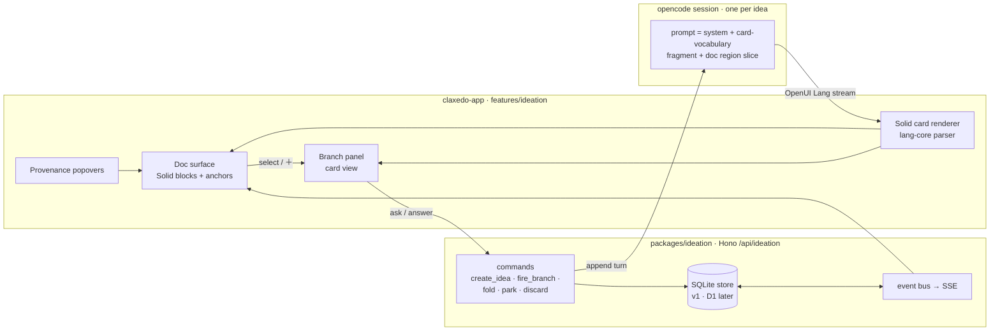

# Ideation Board - Plan

## Goal Capsule

| Field | Contract |
|---|---|
| Objective | Give every raw idea a living **document** as its base artifact, an async engine that reads/produces into it, and transient **branch** discussions (workspace-tab rich cards, infinitely nestable) that fold conclusions back into the doc with nested provenance. Sessions become secondary machinery; the doc is what survives. |
| Primary invariant | The doc is the only durable knowledge surface. Every folded element carries provenance resolving to user queries, answers, and transcript spans. Discarding a branch loses nothing that was folded; folding a branch removes its need to exist. |
| Authority order | The ideation store owns docs/branches/folds (one command door, idempotent operationIds). The engine session owns production. The client owns rendering. The transcript is append-only evidence, never the store. |
| Execution profile | Cross-package: new `packages/ideation` domain service, one new dep (`@openuidev/lang-core`), one new content surface + workspace-panel mode in claxedo-app, Solid generative renderer, SSE reuse. |
| Stop conditions | Stop if branch context cannot be bounded to doc-region + local thread (unbounded replay kills the economics); stop if lang-core cannot drive a Solid renderer without forking it; stop if fold conflicts (two branches editing one block) cannot resolve with last-write+provenance. |
| Tail ownership | Tier-2 AI-authored sandboxed component plugins mount/keep/unmount only after Tier-1 composed cards and the fold/provenance spine are green. |

---

## Product Contract

### Summary

From the rail's **Ideas** list the user creates an idea; its empty **doc** opens as the primary content surface. An engine (one opencode session per idea) reads sources and streams structured output — parsed with `@openuidev/lang-core` and rendered by our Solid card renderer — directly into the doc. The user selects any line or hits ＋ on any section to **fire a branch**: instead of a side-chat, this opens in the existing workspace panel under a **Branches** tab as a rich card (explainer, clarification, diagram, question). Cards nest (select-to-fork children) and **fold upward**: conclusions commit into the parent card or the doc as new blocks carrying provenance chips (query → answer → transcript span → reads). Parked questions resurface per-idea.

### The five settled design decisions (from design sessions 2026-08)

1. **Doc-first, not board-first.** The document is the base artifact from second zero; boards/cards were scaffolding around this insight. Discussions are transient edits-in-waiting on the doc.
2. **Branches live in the workspace panel**, not floating margins. Same tab system as Session/Process/Files/Browser. Vertical run-list grouped Needs-you → Working → Parked → Folded; click-through to the rich card.
3. **Fold semantics**: answering converts to fact; agreeing closes the *entire ancestor chain* and logs one decision; correcting-before-fold attributes the edit; park = left-for-later, never dropped.
4. **Rendering = compose-from-vocabulary** (OpenUI pattern): the model composes typed cards from a closed library; freeform HTML demoted to a later Tier-2 "generated component plugin" with manifest-declared capabilities and disposer-paired mount/unmount (Cordis discipline).
5. **Branch context is bounded**: doc region + local thread. Never transcript replay. Folding garbage-collects context — the doc absorbs what would have been history weight.

---

## Current State (grounding)

| Extension point | Path | Shape |
|---|---|---|
| Workbench tab types | `packages/claxedo-app/src/app/workbench/state/types.ts` (CONTENT_TYPES, line 19) + `app/integrations/content-surface-contract.ts` + `first-party-content-surfaces.tsx` | Add `"ideation"` to CONTENT_TYPES + one `ContentSurfaceContribution` with renderer. Registry already resolves reactively via `contentSurface(meta.type)` in `app/workbench/content/index.tsx`. |
| Rail list (ideas list mirrors session list) | `src/app/workbench/rail/rail-sidebar.tsx` (~line 1570 new-session), `rail-header-actions.ts createSession()`, draft-session meta via `draftSessionMeta()` | Ideas get their own rail section; creation mints an `ideation` ContentMeta analog to draft-session. |
| Side panel modes (Branches tab lives here) | `src/features/workspaces/ui/panel/workspace-panel-state.ts` — `WorkspacePanelMode` union; rendered by `src/app/workbench/rail/workspace-panel-body.tsx` | Add `"branches"` mode + body section. Files/Browser/Process precedent. |
| Message part dispatch (if ever surfacing genui in transcripts) | `packages/session-ui/src/components/message-part.tsx` — `PART_MAPPING` registry, `registerPartComponent(type, comp)` (line 1000) | Not needed for v1 (ideation renders its own parts); noted as the seam for later. |
| SSE fanout | `packages/workspace-runtime/src/routes/events.ts` (`streamSSE` + replay buffer); client loop `claxedo-app/src/app/integrations/claxedo-events.tsx` | Ideation events ride the same bus; no new transport. |
| Theme tokens | `packages/ui/src/theme/themes/codex.json` + `html[data-theme="codex"]` overrides | All ideation UI consumes semantic vars only. |
| Generative UI dep | none anywhere (verified repo-wide) | `@openuidev/lang-core` is a brand-new, MIT, framework-agnostic dependency. |

---

## Architecture



### Data model (store contract, both backends eventually)

```
ideas        id · title · status(open|settled|archived) · sessionId · cursor        (tenant-scoped org+user)
doc_blocks   id · ideaId · order · kind(title|para|bullets|artifact|section) ·      ← the base artifact
             contentJson · version · foldedFrom? (branchId) · provenanceId?
branches     id · ideaId · parentId? · blockAnchor? · kind(question|dig|clarify) ·
             title · state(working|need|park|folded|discarded) · conclusion? · operationId unique
messages     id · branchId · role(you|eng) · partJson (text | genui-lang) · seq
folds        id · branchId → targetBlock · payloadJson · reason(settle|correct|clarify) ·
             chainIds[] · transcriptSpan {sessionId, evStart, evEnd}                ← provenance rows
```

Branch context bound at request time: `prompt = systemPrompt + vocabularyFragment + slice(doc, blockAnchor ± neighborhood) + branch.messages`. No transcript replay. Folding appends a doc-block and mutates nothing else — old branch messages stay queryable for provenance only.

### Rendering pipeline (Tier 1)

Card library defined once in `features/ideation/cards/`: `key-points`, `diagram` (mermaid source kept), `report`, `question`, `clarify`, `table`. Each: Zod props + Solid component themed by codex vars. `@openuidev/lang-core` generates the system-prompt fragment from the library and parses the streamed Lang dialect incrementally into a reactive store; our ~200-line Solid renderer maps node types → components. Unknown/unregistered output renders as text — never broken UI.

### Tier 2 (deferred tail)

Model requests off-vocabulary component via structured `request_component` call → authoring step produces code + manifest (`props` / `capabilities` / `effects`+disposers) → mount policy: pure = auto-mount in iframe sandbox; acting = quarantined until approved (approval-gate DNA, same born-staged rule) → **keep** promotes into the library, versioned and pinned per doc. Explicitly out of scope until Phase 6.

---

## Phases

### Phase 0 — Foundations (scaffold, no behavior)
- Add `@openuidev/lang-core` dependency (root catalog).
- `packages/claxedo-app/src/features/ideation/` with AGENTS.md ownership block (mustNotImport: session/*, terminal/*, browser/* — keep the surface self-contained).
- `"ideation"` in CONTENT_TYPES + first-party content surface rendering an empty shell; rail **Ideas** section listing from store; new-idea action mints ContentMeta + opens surface (clone draft-session flow).
- Accept: idea appears in rail, opens empty doc surface, survives reload (store round-trip).

### Phase 1 — Doc-first surface (read path)
- Doc block renderer: title/sections/paragraph/bullets/artifact kinds; concept tooltips; codex theme throughout.
- Solid generative renderer + 4 initial card types wired to lang-core parse of canned Lang fixtures (no engine yet).
- Block anchors (＋ / thread-count badge) as pure UI.
- Accept: fixture Lang streams render progressively into correct blocks; theme passes dark/light.

### Phase 2 — Domain + engine loop (write path)
- `packages/ideation`: contracts (Zod commands above), SQLite adapter + Hono router, mount in `claxedo-server` host composition; SSE events for doc/branch changes.
- Idea creation spawns one opencode session whose system prompt embeds the vocabulary fragment; assistant turns stream Lang → parsed → doc_blocks via fold-free "produce" command; transcript span ids captured per message.
- Accept: create idea → ask in seed branch → card appears in doc; reload reconstructs identical doc from store.

### Phase 3 — Branches panel
- `"branches"` WorkspacePanelMode + body section; grouped vertical list; rich card view with breadcrumb; fire composer (direct, unanchored, folds to *From branches* section); select-to-fork child branches; park/reopen.
- Accept: full loop against the real store: fire → working → needs-you → answer → fold.

### Phase 4 — Fold + provenance
- `fold` command with reason settle|correct|clarify; chain closure (ancestor walk, single decision entry per fold into seed log); provenance rows joining queries/answers/transcript spans; pv chips + nested-chain popover in doc.
- Conflict rule: two folds touching one block = last-write-wins with both provenances retained (stop-condition check lives here).
- Accept: corrected fold shows `✓ corrected` chip; provenance popover reconstructs the exact transcript span.

### Phase 5 — Async completion + attention
- Engine continues with open questions while user away; needs-you surfaces integrate the existing attention patterns; parked resurfaces on idea open; rail badges.
- Accept: question answered while away appears folded-ready on return; nothing silently dropped.

### Phase 6 — Tier-2 tail
- Tier-2 generated-component plugins (mount/quarantine/keep/unmount with disposers) behind a flag.
- Accept: a kept generated component composes in Tier-1 thereafter.

---

## File Map

**New:** `packages/ideation/**` (contracts, http, adapters/sqlite, application) · `features/ideation/**` (surface, doc/, branches/, cards/, renderer, api client, stores) · panel section `workspace-panel/branches-panel.tsx`.
**Touched:** `workbench/state/types.ts` (+CONTENT_TYPES) · `first-party-content-surfaces.tsx` · `rail-sidebar.tsx` (+Ideas section) · `workspace-panel-state.ts` (+mode) · `workspace-panel-body.tsx` · `claxedo-server` host composition (+mount) · root `package.json` catalog (+lang-core).

## Risks & Open Questions

| # | Item | Posture |
|---|---|---|
| 1 | lang-core API drift / Solid fit | Pin version; parser is isolated behind `features/ideation/renderer/`; escape hatch = vendor the ~1k-line parser. |
| 2 | Mermaid rendering dep | Defer: ship mermaid *source* + mono pre-render v1 (matches mocks); add renderer when justified. |
| 3 | Hosted backend (D1) parity | Deliberately v2; SQLite personal-first. |
| 4 | Naming ("Ideas/Ideation", fold/park verbs) | Product-voice decision, flagged not blocked. |
| 5 | Multi-cursor fold conflicts | Rule set in Phase 4 acceptance; revisit CRDT only if real contention appears. |
