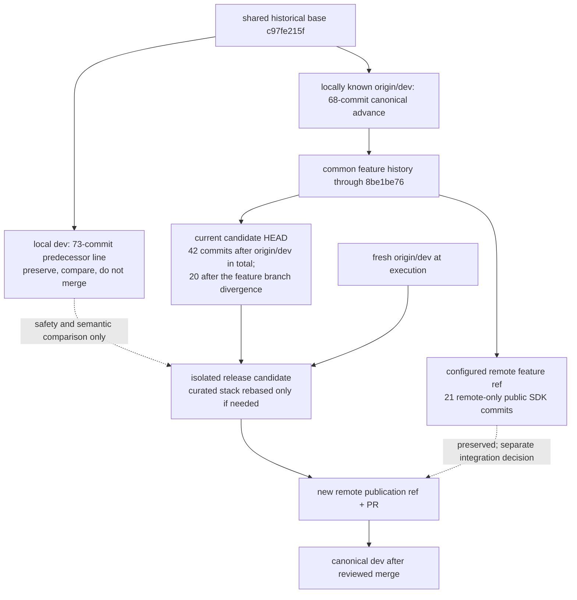

# refactor: Integrate the release-hardening rewrite into dev

## Overview

Integrate the tree currently checked out as `codex/claxedo-platform-release-hardening` into the canonical `dev` line without combining obsolete predecessor history or overwriting the different history already published under the same remote branch name.

The checked-out tree is already a curated rewrite on top of the locally known `origin/dev` tip. The safe path is therefore to refresh that base, preserve all divergent tips, replay or rebase the curated release stack only if `origin/dev` advanced, qualify the exact resulting tree, publish it under a fresh remote ref, and merge it into `dev` through review. The divergent local `dev` tip is retained as a recovery/reference point; it is not merged back into the rewrite.

This is a deep integration plan. At the planning snapshot:

- `HEAD` is `fedad52254` on `codex/claxedo-platform-release-hardening`.
- The locally known `origin/dev` tip is `59b50c5363` and is an ancestor of `HEAD`; the checked-out branch adds 42 commits.
- Local `dev` is `94c110381a` and has diverged from `origin/dev` by 73 local-only and 68 remote-only commits.
- The checked-out branch's configured upstream has diverged by 20 local-only and 21 remote-only commits. The remote-only line contains the public embedded SDK cutover work and must not be overwritten or silently folded into this merge.
- The release stack changes 1,542 files relative to the locally known `origin/dev` snapshot, dominated by `packages/claxedo-app`, `packages/ui`, `packages/claxedo-desktop`, `packages/claxedo-server`, and the performance harness.

All commit counts and hashes above are evidence from the planning snapshot, not execution-time truth. Refresh remote refs before acting and recompute every relationship.

## Problem Frame

The branch is not a small topic branch. It consolidates a performance and platform campaign into reviewable dependency/runtime, app, desktop, E2E, performance, CI, product, session, harness-continuation, durable-daemon, workspace-identity, and server-discovery slices. `PERFORMANCE_HANDOFF.md` explicitly describes that history as a logical rewrite on top of fresh `origin/dev` and says the original tested feature ref is a safety point rather than an integration base.

A normal merge from the current checkout into the local `dev` tip would defeat that design. Static history analysis shows the two old lines overlap heavily, while a direct three-way preview between local `dev` and the locally known `origin/dev` already exposes 49 files with conflict markers. Combining both histories would risk restoring experiments and replaced implementations that the curated rewrite intentionally removed.

The merge must preserve the rewritten tree as the authoritative candidate, validate product behavior through its real entry points, and leave every displaced history recoverable until the canonical remote `dev` merge and post-merge verification are complete.

## Requirements Trace

### History and publication safety

- **R1. Canonical target:** Integrate into the current remote `dev` line, using a freshly refreshed `origin/dev` as the base of truth.
- **R2. Preserve displaced history:** Retain recoverable refs for the current local `dev`, current `HEAD`, and the existing remote branch tip before any history rewrite or branch update.
- **R3. Do not recombine predecessor history:** Do not merge the 73-commit local `dev` predecessor line into the curated rewrite. Before retiring it as an integration source, account for every local-only commit in a coverage ledger as retained in the rewrite, superseded, deliberately reverted, or separately out of scope.
- **R4. Do not overwrite the divergent remote feature branch:** Publish the release candidate under a fresh remote ref; keep the existing 21-commit remote-only public-SDK line intact.
- **R5. Reviewable provenance:** Keep the curated logical ordering and make any conflict-resolution delta independently reviewable against both refreshed `origin/dev` and the pre-integration candidate.

### Contract preservation

- **R6. Authoritative producers win:** Resolve conflicts at the canonical owner of workspace identity, session configuration, transcript state, daemon lifecycle, provider catalog errors, usage totals, and route intent. Do not add fallback values, duplicate stores, or synthesized events to make consumers pass.
- **R7. Product flows remain complete:** Preserve first-prompt creation, base-branch selection, archived-session isolation, worktree routing, model/harness continuation, completion sounds, workspace reopen/review state, usage reconciliation, and preview-feature defaults.
- **R8. Durable local runtime remains real:** App/desktop restart must reconnect to the existing local daemon and durable session state through the public entrypoints; failure and stale-lease recovery must remain bounded and explicit.
- **R9. Security and isolation remain unchanged or stronger:** Loopback ownership, workspace identity, signed/unsigned routing, credentials, provider errors, and session boundaries must not broaden during conflict resolution.

### Qualification and merge readiness

- **R10. Benchmark-first execution:** Re-run the causal performance and correctness gates that establish the rewrite's value before broad CI, using same-window controls where a performance claim depends on attribution.
- **R11. Repository-equivalent validation:** Pass focused contract suites, workspace-wide typechecking, package/build boundaries, app architecture checks, real entrypoint E2E, and the full Crabbox/native platform matrix from one exact clean candidate tree.
- **R12. Truthful evidence:** Update handoffs, benchmark records, and release notes only with results from the final candidate; retain historical results as historical rather than presenting them as proof of the rebased tree.
- **R13. Remote confirmation:** After publication, require the real GitHub checks and the post-merge `dev` smoke to pass before retiring safety refs or declaring the integration complete.

## Scope Boundaries

- Include the exact product and test behavior represented by the checked-out candidate after rebasing it onto the then-current `origin/dev`.
- Include conflict resolution, focused corrections required by the refreshed base, and evidence updates caused by those corrections.
- Exclude the 21 remote-only commits on `origin/codex/claxedo-platform-release-hardening`; they are a separate public embedded SDK cutover line and need their own integration decision.
- Exclude unfinished follow-on work listed in `PERFORMANCE_HANDOFF.md` (for example further Workspace disposal/virtualization, context-card/minimap/composer work, or new performance optimization). This merge qualifies the current rewrite; it does not restart the optimization campaign.
- Exclude new compatibility shims, fallback producers, or alternate event/data paths added solely to ease the merge.
- Exclude direct pushes or force-pushes to `dev`.
- Exclude removal of safety refs until the remote merge, post-merge smoke, and rollback window have completed.

## Context & Research

### Repository and topology findings

- The root is a Bun 1.3.14 / TypeScript 7 monorepo with workspace packages and Turbo typechecking. `CONTRIBUTING.md` requires workspace typecheck before review and extra care for vendored OpenCode packages.
- The locally known `origin/dev` is an ancestor of the candidate. The candidate's 42-commit stack begins with grouped dependency/runtime/app/desktop/E2E/performance/CI/product commits and ends with focused session, daemon, workspace-identity, and discovery fixes.
- `PERFORMANCE_HANDOFF.md` is the merge authority: it requires a clean integration worktree, a fresh `origin/dev`, benchmark-first validation, full Crabbox/AWS validation, and a feature-branch PR rather than a direct `dev` push.
- `docs/perf/AGENTS.md` records what was already tried and requires same-session controls when attribution is material.
- No `docs/solutions/` corpus or `docs/solutions/patterns/critical-patterns.md` exists in this checkout, so there are no additional institutional learnings to carry forward.

### Current runtime flow to preserve

1. **Prompt creation and dispatch**
   - `packages/claxedo-app/src/features/session/composer/ui/submit.ts` receives the selected workspace, session, harness/model, permission mode, and prompt state. `createPromptSubmit()` resolves the canonical target and transport before dispatch.
   - `packages/claxedo-app/src/features/session/submit/handoff.ts` retargets the submitting draft surface, persists the selected configuration, and navigates with canonical session/workspace identity.
   - `packages/claxedo-app/src/features/session/submit/send.ts` waits for a provisioning worktree, prepares live events best-effort, dispatches once, and rolls optimistic state back on failure.
   - The workspace runtime and `@claxedo/agent-sdk-runtime` then own the durable session, adapter handoff, transcript events, and harness continuation.

2. **Harness/model continuation**
   - `packages/claxedo-app/src/features/session/harness/harness-switcher.ts` and `harness-model-writer.ts` change the canonical session configuration.
   - `packages/agent-sdk-runtime/src/session-handoff.ts` validates whether the existing transcript can continue on the requested harness/model and produces the handoff context used by runtime dispatch.
   - `packages/workspace-runtime/src/routes/session.ts`, `session-core.ts`, `store.ts`, and `workspace/runtime.ts` persist and expose the configuration and transcript state. The app consumes the resulting canonical events; it must not synthesize a parallel continuation state.

3. **Local daemon continuity**
   - `packages/claxedo-desktop/src/main/server-child-process.ts` discovers or launches the local server and owns desktop-side connection/recovery policy.
   - `packages/claxedo-local-server/src/app/start-local-server.ts` composes the real local server, while `local-daemon-lifecycle.ts` owns client activity, leases, idle state, and shutdown eligibility.
   - `packages/claxedo-server-core` owns shared DB/session/engine primitives. The desktop may disconnect or restart without making the daemon's durable session state app-lifetime state.

4. **Workspace identity and routes**
   - `packages/claxedo-app/src/platform/identity/workspace-route.ts` is the UI route producer for canonical workspace IDs.
   - `packages/claxedo-server/src/workspace/routes/index.ts` resolves explicit workspace IDs before directory-derived compatibility references and returns the canonical workspace record.
   - `packages/claxedo-server/src/workspace/signed-access.ts` rejects ambiguous directory-to-workspace mappings rather than inventing an ID.

5. **Result to the user**
   - Canonical runtime events update the session timeline, route bridge, rail status, sounds, worktree context, usage dashboard, and workspace/review surfaces.
   - On error, the originating state is restored or an explicit recovery/error surface is shown. On restart, the desktop reconnects to durable authority rather than reopening archived sessions or reconstructing them from UI cache.

### Existing patterns to follow

- `PERFORMANCE_HANDOFF.md` for integration ordering, shared-worktree safety, and proof standards.
- `.crabbox.yaml`, `script/cbx-ci.ts`, and `.agents/skills/crabbox/SKILL.md` for the GitHub-equivalent matrix and native provider rules.
- `packages/claxedo-server-core/README.md` for the shared-core dependency boundary: product composition stays out of `server-core`.
- `packages/workspace-runtime/README.md` for the runtime/host boundary and the primary event authorities.
- Focused colocated tests in each changed package, with cross-layer behavior proven by the existing Playwright and real-runtime suites rather than mocks alone.

### External research decision

Skipped. This plan is about repository-specific history, architecture, tests, and release gates. The local handoffs, code, CI configuration, and Git topology are more authoritative than generic merge guidance.

## Key Technical Decisions

1. **Treat `origin/dev`, not local `dev`, as the integration base.** The candidate is the deliberate rewrite of the older performance line. Merging the old local `dev` history back into it would restore superseded paths and erase the value of the rewrite.
2. **Preserve every divergent tip, then publish under a new branch name.** The configured upstream contains a different 21-commit line. A fresh publication ref avoids destructive force-pushes and makes the exact candidate visible for review.
3. **Rebase only when the refreshed base requires it.** If refreshed `origin/dev` still matches the candidate base, keep the existing candidate topology. If it advanced, replay the curated stack in its logical order and preserve intentional merge topology for the daemon and harness-continuation sub-branches. Drop a candidate patch only when refreshed history proves it is already present or intentionally superseded.
4. **Resolve semantics by owner, not by choosing a side wholesale.** For each conflict, identify the canonical producer and keep one code path. Consumer compatibility is not a reason to add duplicate state, fallback data, or synthetic events.
5. **Validate by logical slice, then validate the assembled product.** Focused failures are easier to attribute during integration; only the exact final tree earns full CI and benchmark evidence.
6. **Benchmark before broad CI.** The branch exists partly to preserve measured performance behavior. Causal benchmarks and their correctness assertions run before expensive platform-wide validation, matching the repository's explicit execution posture.
7. **Use the PR merge as the canonical `dev` transition.** The local `dev` name is not made authoritative by merging its old tip. After the reviewed remote merge, local `dev` is realigned to the canonical remote result while its old tip remains preserved under a safety ref.

## Open Questions

### Resolved during planning

- **Should the old local `dev` history be merged into the candidate?** No. `PERFORMANCE_HANDOFF.md` identifies the candidate as the logical rewrite and the earlier history as a safety/reference point.
- **Should the current branch overwrite its configured upstream?** No. The upstream has a distinct remote-only public SDK line; use a fresh publication ref.
- **Should the candidate be merged directly into `dev` before validation?** No. Qualify an isolated integration candidate and merge through review only after exact-tree gates pass.
- **Should current historical benchmark numbers be reused after rebasing?** No. They guide expected behavior, but only final-tree reruns are merge evidence.

### Deferred to implementation

- **Exact refreshed-base conflict set:** It depends on the remote tip at execution time. Recompute it after refresh and record the resulting conflict inventory in the integration PR.
- **Whether a no-op rebase is possible:** If `origin/dev` remains the candidate's ancestor at the same base, preserve the current commits. Otherwise rebase/replay the curated stack.
- **Which focused test fails first after a conflict resolution:** This is execution evidence, not a planning decision. Fix the authoritative owner and update the affected unit's verification record.
- **Performance deltas on the final candidate:** Measure them using the existing causal protocols; do not infer them from the history or from earlier artifacts.

## High-Level Technical Design

> *This illustrates the intended approach and is directional guidance for review, not implementation specification. The implementing agent should treat it as context, not code to reproduce.*

## Implementation Units

- [ ] **Unit 1: Freeze provenance and establish the exact candidate scope**

**Goal:** Make every starting tip recoverable and prove which histories belong to this merge before changing integration history.

**Requirements:** R1-R5

**Dependencies:** None

**Files:**

- Review: `PERFORMANCE_HANDOFF.md`
- Review: `docs/perf/AGENTS.md`
- Review: `docs/plans/README.md`
- Record merge evidence in: the integration PR description and the committed plan/evidence update made before final exact-tree qualification

**Approach:**

- Refresh `origin/dev` and the configured remote feature ref, then recompute ancestry, ahead/behind counts, patch equivalence, and worktree cleanliness.
- Create recoverable safety refs for the pre-integration `HEAD`, local `dev`, and the fetched remote feature tip. Do not reuse a mutable branch name as the only recovery mechanism.
- Create the integration candidate in a clean isolated worktree. Leave the shared current worktree and any concurrent user changes untouched; no result from a dirty/shared worktree counts as release evidence.
- Build a local-`dev` coverage ledger that classifies every local-only commit as retained in the curated rewrite, superseded by a named canonical change, deliberately reverted with evidence, or separately out of scope. Any unclassified behavior blocks treating local `dev` as predecessor-only.
- Classify remote-only commits by topic and confirm that the public embedded SDK cutover remains outside this merge. If a remote-only commit is a genuinely applicable fix to a contract also changed here, port that fix as a new, reviewable candidate commit rather than merging the alternate history.
- Generate an integration manifest containing the refreshed base, candidate tip, safety refs, included commit stack, local-`dev` coverage ledger, excluded remote-only line, and clean-tree proof.

**Patterns to follow:**

- `PERFORMANCE_HANDOFF.md` section "Current integration state and workflow"
- `PERFORMANCE_HANDOFF.md` section "Shared worktree safety"

**Test scenarios:**

- **Happy path:** Refreshed `origin/dev` remains the ancestor of the candidate; the manifest identifies the existing curated commits and no rewrite is needed.
- **Edge case:** `origin/dev` advanced; the manifest identifies only the new base commits and the curated candidate commits that must be replayed.
- **Error path:** The worktree is dirty or a safety ref cannot be verified; integration stops before any history-changing action.
- **Isolation:** The configured remote feature ref still has remote-only commits; they remain reachable and absent from the release candidate diff.
- **Falsification:** A local-`dev`-only commit has behavior not represented or intentionally retired by the curated candidate; classification stops and that behavior receives an explicit integration decision before the old line is excluded.

**Verification:**

- Every starting tip resolves to a stable recovery ref.
- The candidate scope is a deterministic diff against refreshed `origin/dev`.
- Every local-`dev`-only commit has an evidence-backed coverage-ledger classification; none is silently discarded because of the rewrite assumption.
- No excluded remote-only commit or old local-`dev` predecessor commit appears solely because histories were merged wholesale.

- [ ] **Unit 2: Rebase the curated dependency, runtime, app, and platform stack onto refreshed dev**

**Goal:** Produce one clean integration candidate on the current canonical base while preserving the rewrite's logical ordering and one-owner architecture.

**Requirements:** R1, R3, R5-R9

**Dependencies:** Unit 1

**Files:**

- Dependency ownership: `package.json`, `bun.lock`, `script/apply-dependency-patches.ts`, `patches/`
- Runtime ownership: `packages/agent-sdk-runtime/src/runtime.ts`, `packages/agent-sdk-runtime/src/session-handoff.ts`, `packages/workspace-runtime/src/store.ts`, `packages/workspace-runtime/src/routes/session.ts`, `packages/workspace-runtime/src/routes/session-core.ts`, `packages/workspace-runtime/src/workspace/runtime.ts`
- Shared server ownership: `packages/claxedo-server-core/src/platform/db/db.ts`, `packages/claxedo-server-core/src/session/sync.ts`, `packages/claxedo-server-core/src/opencode/engine.ts`
- App ownership: `packages/claxedo-app/src/app/`, `packages/claxedo-app/src/features/`, `packages/claxedo-app/src/platform/`
- Desktop ownership: `packages/claxedo-desktop/src/main/`, `packages/claxedo-desktop/src/shared/`
- CI/product ownership: `.crabbox.yaml`, `.github/workflows/`, `script/cbx-ci.ts`, `script/cbx-ci-remote.sh`, `script/product-boundary/`
- Focused tests: `packages/claxedo-desktop/scripts/dependency-patches.test.ts`, `packages/agent-sdk-runtime/src/runtime.test.ts`, `packages/agent-sdk-runtime/src/session-handoff.test.ts`, `packages/workspace-runtime/src/store.test.ts`, `packages/workspace-runtime/src/workspace/runtime.test.ts`, `packages/claxedo-app/src/architecture/layout.guard.test.ts`

**Approach:**

- Preserve the candidate's logical sequence: dependencies and patches; runtime foundations; bounded app reactivity; desktop packaging/diagnostics; E2E; performance harness; CI; product/docs; focused correctness fixes; harness continuation; durable daemon; workspace identity/discovery.
- For refreshed-base conflicts, trace both sides to the current canonical owner. Keep one producer and adjust its consumers/tests. Delete replaced paths rather than leaving both versions behind.
- Treat vendored OpenCode files as deliberate deviations. Each conflict in `packages/{opencode,core,server,protocol,schema,plugin,llm,codemode,tui,ui,session-ui,sdk,http-recorder}` receives an explicit rationale in the PR.
- Keep dependency lockfile and patch changes package-relative and reproducible. Lockfile resolution follows the final manifests and retained patches, not an arbitrary conflict side.
- After each logical slice, review the delta against the pre-integration candidate to ensure the refreshed base caused only explainable changes.

**Execution note:** Characterization-first for any conflict in legacy/shared runtime code. Preserve an existing failing test or add a focused regression before changing semantics.

**Patterns to follow:**

- `packages/claxedo-server-core/README.md` shared-core boundary
- `packages/workspace-runtime/README.md` runtime and event ownership
- `CONTRIBUTING.md` vendored-engine review requirements

**Test scenarios:**

- **Happy path:** Each logical slice applies with its existing focused tests and no unexplained diff from the pre-integration candidate.
- **Edge case:** Both base and candidate changed a store or route; the resolution preserves the canonical schema/identity and removes duplicate helpers or compatibility state.
- **Error path:** A dependency patch no longer applies; update the authoritative patch against the final pinned package and prove install/package checks, rather than bypassing patch application.
- **Error path:** A runtime event contract changed on the base; update the authoritative producer and all typed consumers in the same slice, with no synthesized bridge event.
- **Integration:** The shared-core/runtime/app dependency direction still passes architecture and public-entrypoint guards.

**Verification:**

- The candidate is based on refreshed `origin/dev` and has a clean, explainable diff.
- No duplicate runtime, store, event, route, or patch-application path remains.
- Focused dependency/runtime/app architecture checks are green before proceeding.

- [ ] **Unit 3: Qualify session, workspace, usage, and durable-daemon behavior through real entrypoints**

**Goal:** Prove that the high-risk user-visible fixes survive integration as complete flows, including failure and recovery.

**Requirements:** R6-R9, R11

**Dependencies:** Unit 2

**Files:**

- Prompt flow: `packages/claxedo-app/src/features/session/composer/ui/submit.ts`, `packages/claxedo-app/src/features/session/submit/send.ts`, `packages/claxedo-app/src/features/session/submit/handoff.ts`
- Harness continuation: `packages/claxedo-app/src/features/session/harness/harness-switcher.ts`, `packages/claxedo-app/src/features/session/harness/harness-model-writer.ts`, `packages/agent-sdk-runtime/src/session-handoff.ts`
- Workspace routing: `packages/claxedo-app/src/platform/identity/workspace-route.ts`, `packages/claxedo-app/src/app/workbench/state/route-bridge.tsx`, `packages/claxedo-server/src/workspace/routes/index.ts`, `packages/claxedo-server/src/workspace/signed-access.ts`
- Daemon ownership: `packages/claxedo-desktop/src/main/server-child-process.ts`, `packages/claxedo-desktop/src/main/server-daemon-discovery.ts`, `packages/claxedo-desktop/src/main/server-daemon-lease.ts`, `packages/claxedo-local-server/src/app/start-local-server.ts`, `packages/claxedo-local-server/src/app/local-daemon-lifecycle.ts`
- Usage and notifications: `packages/claxedo-server/src/usage/adapters/token-tracker-local-history.ts`, `packages/claxedo-app/src/features/usage/ui/usage-dashboard.tsx`, `packages/claxedo-app/src/platform/notifications/sound.ts`
- Tests: `packages/claxedo-app/e2e/playwright/core-first-prompt-local.spec.ts`, `packages/claxedo-app/e2e/playwright/real-harness-local.spec.ts`, `packages/claxedo-app/e2e/playwright/core-sidebar-tree.spec.ts`, `packages/claxedo-app/e2e/playwright/core-panes-split-tabs.spec.ts`, `packages/claxedo-app/e2e/playwright/core-usage-dashboard.spec.ts`, `packages/claxedo-app/src/features/session/ui/components/session-new-branch-source.vitest.ts`, `packages/agent-sdk-runtime/src/session-handoff.test.ts`, `packages/claxedo-local-server/src/app/local-daemon-lifecycle.test.ts`, `packages/claxedo-local-server/src/app/start-local-server.test.ts`, `packages/claxedo-desktop/src/main/server-daemon-discovery.test.ts`, `packages/claxedo-desktop/src/main/server-daemon-lease.test.ts`, `packages/claxedo-server/src/workspace/routes/index.test.ts`
- Security tests: `packages/claxedo-desktop/src/main/server-runtime-policy.test.ts`, `packages/claxedo-local-server/src/platform/http/control-plane-route-auth.test.ts`, `packages/claxedo-local-server/src/credentials/routes/provider-auth.test.ts`, `packages/claxedo-server/src/platform/auth/workspace-id.test.ts`

**Approach:**

- Exercise each user flow from the UI/public server entrypoint to the authoritative store/runtime and back to the UI.
- Validate local, signed, and user-hosted route variants where the changed contract crosses those surfaces.
- Confirm failure presentation uses the real provider/runtime error and rollback path; quota errors remain demoted in transcript presentation without hiding actionable provider failures.
- Confirm durable daemon lifecycle is independent of the Electron renderer/window lifetime and that stale leases, duplicate starts, and idle shutdown follow one lifecycle authority.

**Execution note:** Start with existing integration/E2E characterization. Add a focused regression only when the refreshed-base resolution exposes a previously untested branch.

**Patterns to follow:**

- Existing `core-*` Playwright specs for public entrypoint behavior
- Existing daemon lifecycle tests for injected time/lease behavior
- Existing session/runtime contract tests for adapter and store conformance

**Test scenarios:**

- **Happy path:** Create a session in a newly created worktree, select a base branch, submit the first prompt, and land on the canonical workspace/session route.
- **Happy path:** Continue an existing transcript after changing the model and after changing the harness; prior transcript rows remain stable and the next turn uses the selected configuration.
- **Recovery:** Restart the desktop/app while a local session and terminal exist; the new client discovers the daemon, reconnects, and sees the same durable state without spawning a duplicate owner.
- **Recovery:** A stale daemon lease or dead process is detected; startup replaces/reconnects through the bounded owner path and surfaces a real error if recovery fails.
- **Edge case:** Archive a session while its route/tab is active; route reconciliation must not reopen it from cached inventory or stale intent.
- **Edge case:** Reopen a top-level Workspace in Review mode; canonical workspace ID, review target, and scroll/state ownership survive without directory-derived identity replacement.
- **Edge case:** Two workspace discovery requests arrive concurrently; both receive the same canonical discovery result and no duplicate workspace record/process appears.
- **Error path:** Provider catalog loading fails; the user receives the explicit catalog error and no empty synthetic catalog is treated as success.
- **Error path:** Worktree provisioning fails or times out; the optimistic prompt/session state rolls back and the user's input/comments are restored.
- **Isolation:** Two workspaces share or alias a directory; signed access rejects ambiguity unless a canonical workspace ID is supplied.
- **Security:** A non-loopback or unauthorized caller cannot use daemon/control-plane routes, a stale/forged lease cannot claim daemon ownership, provider credentials are not emitted in errors/logs, and a workspace ID cannot cross the authenticated workspace boundary.
- **Integration:** A completed session emits one user-configured completion sound; split panes and background status transitions do not duplicate it.
- **Integration:** Local usage totals reconcile with provider history once, with provenance and default UI state intact.

**Verification:**

- All listed focused suites pass against the candidate without skipped high-risk paths.
- The real local harness E2E proves prompt, continuation, restart, and route behavior through public entrypoints.
- Failure messages and recovery states come from authoritative producers and no fallback path was introduced.

- [ ] **Unit 4: Re-establish performance, packaging, and cross-surface acceptance evidence**

**Goal:** Prove that the final candidate still delivers the measured performance/correctness intent and packages the same behavior across supported surfaces.

**Requirements:** R10-R12

**Dependencies:** Unit 3

**Files:**

- Performance protocol: `packages/claxedo-app/perf-harness/src/`, `packages/claxedo-app/perf-harness/test/`, `packages/claxedo-app/perf-harness/targets/`
- Performance evidence: `PERFORMANCE_HANDOFF.md`, `docs/perf/README.md`, `docs/perf/AGENTS.md`
- Desktop packaging: `packages/claxedo-desktop/scripts/package-structure.test.ts`, `packages/claxedo-desktop/scripts/verify-package-contents.test.ts`, `packages/claxedo-desktop/scripts/claxedo-server-boot.test.ts`, `packages/claxedo-desktop/src/main/server-readiness.test.ts`
- Cross-surface E2E: `packages/claxedo-app/e2e/playwright/desktop-u8-package-boundary.spec.ts`, `packages/claxedo-app/e2e/playwright/web-signed-cloud.spec.ts`, `packages/claxedo-app/e2e/playwright/web-signed-userhosted.spec.ts`, `packages/claxedo-app/e2e/playwright/core-workspace-lifecycle.spec.ts`, `packages/claxedo-app/e2e/playwright/core-timeline-rendering-scroll.spec.ts`

**Approach:**

- Freeze the applicable final-candidate gate manifest before measuring: current gates come from the latest merge handoff and live harness contracts; older qualification tables remain historical when explicitly superseded. Every unresolved current blocker remains blocking. Accepting, waiving, or re-baselining a current gate requires an explicit product-owner decision recorded in the PR, not an implementer inference.
- Run focused harness correctness before measuring latency. Reject any sample that fails readiness, identity, transcript, or visual-stability assertions.
- Re-run the causal user-flow and heavy-workspace protocols on a quiet eligible host. Where a change is claimed to cause an improvement, compare treatment and control builds in the same session/window.
- Distinguish noninferiority, absolute debt, and historical evidence exactly as the handoffs require. Do not rewrite a WARN or blocked gate as a pass.
- Build and inspect the packaged desktop artifact used by E2E/measurement; prove the tested source commit and packaged bytes match the candidate.
- Update evidence documents only with exact final-candidate results and provenance.

**Execution note:** Benchmark-first. Broad CI begins only after performance harness correctness and the required causal/noninferiority gates are acceptable.

**Patterns to follow:**

- `PERFORMANCE_HANDOFF.md` benchmark and merge sections
- `docs/perf/AGENTS.md` measurement rules and same-window control discipline

**Test scenarios:**

- **Happy path:** Final candidate meets the existing cold-session, workspace, navigation, transcript, and memory correctness assertions with valid samples.
- **Edge case:** A latency sample is fast but a readiness or identity assertion fails; the run is invalid and cannot support a merge claim.
- **Error path:** Host preflight rejects an unsuitable machine or concurrent load; measurement stops rather than recording contaminated evidence.
- **Regression:** Candidate is slower or retains more ownership than its matched control beyond the documented allowance; merge remains blocked pending root-cause resolution or an explicit product decision.
- **Gate ambiguity:** Two handoff/evidence documents disagree about whether a gate is current; qualification stops until the gate manifest names the authoritative current contract and records why the other result is historical or superseded.
- **Integration:** Packaged desktop, hosted signed, and user-hosted surfaces all preserve the session/workspace contracts changed by the branch.

**Verification:**

- Performance evidence names the exact candidate and contains valid correctness/provenance records.
- The final gate manifest has no unresolved current blocker; every waiver or re-baseline is an explicit product-owner decision.
- Packaging tests prove the daemon/runtime files and dependency patches are present in the shipped artifact.
- Cross-surface E2E passes without substituting mock-only proof for real runtime behavior.

- [ ] **Unit 5: Run the complete repository-equivalent release matrix**

**Goal:** Establish merge readiness from one clean candidate across local static checks, package tests, and native CI providers.

**Requirements:** R11-R12

**Dependencies:** Unit 4

**Files:**

- Matrix definition: `.crabbox.yaml`
- Matrix orchestration: `script/cbx-ci.ts`, `script/cbx-ci-remote.sh`, `script/cbx-ci-windows.ps1`, `script/cbx-ci-macos.sh`
- GitHub workflows: `.github/workflows/test.yml`, `.github/workflows/typecheck.yml`, `.github/workflows/release-gates.yml`, `.github/workflows/release-claxedo.yml`, `.github/workflows/claxedo-packages-release.yml`
- Workspace validation: `package.json`, `turbo.json`
- Boundary policies: `script/product-boundary/`

**Approach:**

- Start from an exact-clean candidate and record its commit before launching any lane.
- Run workspace typechecking, lint/static guards, package tests, app architecture checks, packaging/build tests, and E2E according to the repository matrix.
- Use Crabbox's configured AWS-backed pre-push profiles for Linux and full Windows coverage and the native Mac profile for macOS-specific jobs. Focused/retry lanes diagnose failures but do not replace the blocking full lane.
- Investigate failures at the owning code or matrix contract. Do not weaken timeouts, skip assertions, or convert failures to warnings without evidence that the test contract is wrong.
- Re-run any affected focused and blocking lanes after a fix, then re-establish exact-clean provenance for the full candidate.

**Test scenarios:**

- **Happy path:** All required Linux, Windows, macOS, typecheck, package, architecture, build, and E2E lanes pass on the same candidate.
- **Error path:** A lane fails due to product behavior; fix the authoritative owner and invalidate prior exact-tree approval until required lanes rerun.
- **Infrastructure path:** A native provider is unavailable or a lease fails; record the unavailable acceptance criterion and resume when the provider is healthy rather than treating absence as success.
- **Flake path:** A retry passes; inspect the original failure and require the repository's retry policy/evidence before classifying it as infrastructure-only.
- **Isolation:** Matrix preparation leaves the candidate worktree clean and does not materialize untracked generated state into the merge diff.

**Verification:**

- The integration record maps every required matrix lane to a pass on the exact candidate commit.
- Workspace typecheck and product-boundary guards pass.
- No required platform or real-entrypoint criterion remains unverified.

- [ ] **Unit 6: Publish, review, merge, and verify canonical dev**

**Goal:** Land the qualified candidate in remote `dev` without destructive branch updates and prove the merged result remains healthy.

**Requirements:** R2, R4-R5, R12-R13

**Dependencies:** Unit 5

**Files:**

- PR body source: `docs/plans/2026-08-27-146-refactor-integrate-release-hardening-plan.md`
- Merge/evidence context: `PERFORMANCE_HANDOFF.md`
- Release-facing docs changed by the candidate: `README.md`, `docs/plans/README.md`, `public-docs/`, `packages/claxedo-app/README.md`

**Approach:**

- Publish the exact qualified candidate under a new remote branch name. Do not update the divergent configured upstream and do not push `dev` directly.
- Open a PR to current `dev` that documents: base and candidate commits; preserved safety refs; included logical slices; excluded remote-only public-SDK history; vendored OpenCode deviations; conflict-resolution rationale; performance evidence; and the full validation matrix.
- Treat any new `dev` commit before merge as a stale-base event: refresh/rebase, rerun affected focused checks, performance acceptance where the tree changed materially, and the full required matrix on the new exact candidate.
- Require real GitHub checks and review approval. Merge using the repository's normal PR policy without rewriting the protected target.
- After merge, verify the remote `dev` tree through a focused post-merge smoke. Then realign the local `dev` name to canonical remote `dev` while retaining its old tip under the safety ref for the rollback window.

**Test scenarios:**

- **Happy path:** PR base remains current, GitHub checks match pre-push evidence, review approves, and post-merge smoke passes.
- **Race:** `dev` advances during review; candidate is refreshed and all invalidated evidence is rerun before merge.
- **Error path:** GitHub differs from local/Crabbox results; the PR stays open, the discrepancy is root-caused, and a new exact candidate is qualified.
- **Recovery:** A post-merge regression appears; the preserved candidate and predecessor refs identify the last known trees and support a reviewable revert/fix without data loss.
- **Isolation:** The separate public-SDK remote branch and old local `dev` tip remain reachable after the merge.

**Verification:**

- Remote `dev` contains the reviewed candidate and all required checks are green.
- Post-merge user-flow smoke passes from canonical `dev`.
- Safety refs remain available through the agreed rollback window, with owners for eventual cleanup.

## System-Wide Impact

- **Interaction graph:** The merge spans app prompt/session UI, route intent, query/cache state, workspace control routes, local server composition, shared server core, workspace runtime, harness adapters, desktop process ownership, packaging, CI, and performance evidence. Contract verification must follow the full UI → transport → runtime/store → event → UI loop.
- **Error propagation:** Provider catalog, worktree provisioning, daemon discovery, runtime dispatch, and session handoff errors remain typed/explicit at their producer and are presented by existing UI recovery surfaces. Merge conflict resolution must not turn failures into empty success values.
- **State lifecycle risks:** Durable DB/session state outlives the app; daemon leases outlive renderer windows; workspace identity must remain canonical across route producers; archived sessions must not be resurrected by cached inventory; optimistic prompt state must roll back on failed dispatch; usage totals must not double count local/provider history.
- **API surface parity:** Local loopback, desktop packaged, signed hosted, user-hosted, vendored OpenCode compatibility routes, workspace-runtime public routes, and SDK-generated types all require parity where a shared contract changed.
- **Security boundaries:** Loopback exposure, signed workspace identity, management tokens, provider credentials, session/workspace isolation, and ambiguous directory rejection must remain intact. The merge introduces no new trust boundary, but it can accidentally weaken existing ones if conflict resolution accepts a broader route or fallback identity.
- **Performance:** The candidate changes boot, session switching, workspace mounting, timeline rendering, terminal behavior, diagnostics, and packaged process shape. Passing functional tests alone does not establish merge readiness.
- **Operational impact:** The daemon changes process lifetime and upgrade/restart behavior. CI changes the pre-push platform matrix. Both need exact-tree packaging and native-provider proof.
- **Unchanged invariants:** `server-core` remains composition-neutral; workspace-runtime remains the per-workspace host kit; canonical events and stores remain single-owner; no compatibility/fallback layer is added; remote `dev` remains PR-controlled.

## Risks & Dependencies

| Risk | Likelihood | Impact | Mitigation |
|---|---|---|---|
| Fresh `origin/dev` has advanced since the planning snapshot | High | High | Refresh first; rebase the curated stack only as needed; invalidate stale evidence. |
| Old local `dev` is mistakenly treated as additive work | Medium | Critical | Preserve it as a safety ref and explicitly prohibit merging it into the rewrite. Compare semantics only. |
| Existing remote feature history is overwritten | Medium | Critical | Publish under a fresh remote ref; preserve and exclude the 21-commit alternate line. |
| Conflict resolution restores duplicate state/event paths | High | High | Resolve at canonical producers, search for replaced paths, and require cross-layer tests. |
| Lockfile/patch conflicts produce a locally installable but unreproducible tree | Medium | High | Regenerate from final manifests, prove patch application/package tests, and inspect shipped bytes. |
| Functional CI passes while performance intent regresses | Medium | High | Run harness correctness and causal/noninferiority measurements before broad CI. |
| Historical benchmark evidence is mistaken for final-tree proof | High | High | Label history as history; append exact candidate provenance and rerun results. |
| Daemon lifecycle regression leaks processes or loses sessions | Medium | Critical | Exercise restart, duplicate start, stale lease, idle, and packaged recovery flows through real entrypoints. |
| Workspace identity conflict causes cross-workspace leakage | Low-Medium | Critical | Preserve explicit canonical ID precedence and ambiguity rejection; test signed and local variants. |
| Native CI provider is unavailable | Medium | High | Treat the platform criterion as unverified/blocking; resume when the provider is healthy. |
| PR base moves after qualification | High | Medium-High | Refresh, rerun invalidated focused/performance checks, and repeat the full matrix on the new exact commit. |

## Documentation / Operational Notes

- The PR description is the durable integration manifest and must link the exact candidate evidence.
- `PERFORMANCE_HANDOFF.md` remains status/history; update only sections whose current claims changed, without deleting historical controls or retractions.
- Record which safety refs were created, who owns their cleanup, and the rollback-window end condition.
- Preserve benchmark artifacts before releasing any Crabbox/native lease used for final evidence.
- If an acceptance criterion cannot run, report the unmet criterion, evidence, blocker, owner, and concrete follow-up. Do not report the merge as complete.

## Success Metrics

- The candidate is a clean, reviewable stack on the actual current `origin/dev` and contains no accidental predecessor or alternate-remote history.
- Every changed authority has one producer and no merge-created fallback/duplicate path.
- The listed user flows pass through real entrypoints, including failure, restart, persistence, security, and workspace isolation paths.
- Causal performance/correctness gates are valid on the final tree, with no historical result presented as current proof.
- The complete local/Crabbox/native/GitHub matrix passes on the exact merged candidate.
- Canonical remote `dev` passes a post-merge smoke and every displaced tip remains recoverable through the rollback window.

## Sources & References

- Merge authority: `PERFORMANCE_HANDOFF.md`
- Performance protocol: `docs/perf/AGENTS.md`
- CI matrix: `.crabbox.yaml`
- Contribution contract: `CONTRIBUTING.md`
- Shared-core boundary: `packages/claxedo-server-core/README.md`
- Workspace-runtime boundary: `packages/workspace-runtime/README.md`
- Durable control-plane plan: `docs/plans/2026-08-27-0144-feat-durable-local-control-plane-plan.md`
- Durable daemon plan: `docs/plans/2026-08-27-145-feat-durable-local-server-daemon-plan.md`
- Planning snapshot: local Git topology and diffs inspected on 2026-08-27; remote state must be refreshed during execution.
