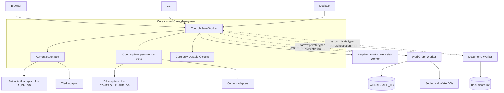

# refactor: Add D1 and Better Auth adapters; land multiplayer product postures; extract optional services

## Direct answer

The target is no longer one large Cloudflare Worker with disabled WorkGraph and Documents resources. It is one core Cloudflare deployment plus two independently deployable, optional services:

- **Core:** provider-neutral authentication and tenant-safe control-plane ports, application authorization, multiplayer projects/workspaces/private sessions, and relay/runtime coordination. The default Cloudflare composition selects Better Auth plus D1. Claxedo-hosted additionally composes billing/usage; user-deployed does not contain Claxedo billing.
- **WorkGraph service:** its own Worker, D1 database, settlement/wake Durable Objects, cron triggers, migrations, and release workflow.
- **Documents service:** its own Worker, R2 bucket, document jobs, migrations/adoption tooling, and release workflow.

A fresh core deployment provisions no WorkGraph database, Documents bucket, WorkGraph Durable Object, WorkGraph cron, or optional-service secret. An uninstalled service is absent. A service may be deployed dark only as an explicit install step; in that state its resources exist because the operator installed it, but core does not advertise or route traffic to it.

Better Auth does not delete Clerk, and D1 does not delete Convex. They become peer adapters behind two independent ports. The initial release targets two production profiles: Better Auth+D1 for new Cloudflare deployments and the retained Clerk+Convex hosted profile. Clerk+Convex is certified only after the current shared Convex deployment is carved into a core-only schema/function closure: WorkGraph that must remain available moves through the WorkGraph service track, while verified-unused or explicitly archived-and-deactivated WorkGraph state may be retired without installing the service. The ports are independently composable, but Clerk+D1 and Better Auth+Convex are not promised production profiles until a committed operator need funds their entrypoints, migration rehearsal, and support horizon. `WorkspaceAuthority` remains the canonical application policy contract regardless of profile.

Every hosted Cloudflare deployment brings its own login credentials. Google and GitHub are optional. Email delivery is required only when the selected auth/product flows send email. There is no Claxedo-managed auth broker and no shared Claxedo Google/GitHub application credential. The offline self-hosted Node product keeps its existing embedded local-auth posture; adding external social providers to that separate product is not part of this hosted migration.

This is still a clean adapter migration: there is no per-request auth fallback, storage read-through, dual read/write, or mixed-provider identity. Retaining the Clerk+Convex profile is supported adapter composition, not a compatibility branch inside Better Auth or D1.

## Why the previous plan was rejected

The prior plan said WorkGraph and Documents were “decoupled” while still binding `WORKGRAPH_DB`, `CLAXEDO_DOCUMENTS`, `WORKGRAPH_SETTLER`, and `WAKE_LANE` to `claxedo-control-plane`. That is exactly why disabled features still consumed resources.

The code confirms the coupling:

1. `packages/claxedo-server/src/deployments/hosted-workerd/worker.ts` imports both feature implementations, creates WorkGraph runtime state, owns WorkGraph cron dispatch, exports WorkGraph Durable Objects, and constructs the R2 Documents backend.
2. `packages/claxedo-server/src/deployments/hosted-shared/hosted-app.ts` always constructs WorkGraph and directly mounts `/api/workgraph` and `/documents`.
3. `packages/claxedo-server/wrangler.toml` provisions the Documents bucket, WorkGraph settler/wake namespaces, their migrations, and WorkGraph cron triggers for base and staging deployments.
4. `packages/claxedo-app/src/app/composition/hosted-contribution-loader.ts` loads one combined bundle. `product-contributions.ts` hard-codes hosted content types and explicitly is not a general plugin system.
5. WorkGraph and Documents both call deep core services—authority, sandbox placement, relay lookup, runtime-token minting, session resolution, live-sync, and credentials. Moving only their storage would leave a distributed monolith.

The rewrite therefore makes deployment, storage, execution, auth, UI activation, migration, and operations independent—not just navigation.

## Requirements trace

### Core deployment

- **R1. Core-only base:** the base Worker bundle and Wrangler manifest contain no WorkGraph/Documents implementation import, route, D1/R2 binding, Durable Object, cron, migration, or service secret.
- **R2. One owner per datum:** the selected auth adapter owns authentication records; the selected control-plane adapter owns application users, organizations, memberships, projects, workspaces, sessions/participants, shares, leases, idempotency, and durable core records. In `claxedo-hosted` it also owns application billing/usage; `user-deployed` composes no Claxedo billing owner. Each optional service owns its own feature data. A deployment never has two active owners for the same datum.
- **R3. App-owned authorization:** every privileged request resolves current application membership/share policy through `WorkspaceAuthority`. An auth-adapter principal proves identity, not organization access.
- **R4. Explicit profiles, no fallback:** deployment tooling selects one certified profile (`better-auth-d1` or `clerk-convex`) and builds its thin Worker entrypoint. Adapter/profile values are deployment inputs, not request-time or tenant-time switches inside the Worker. Unknown, partial, mixed-uncertified, or multiple selections fail before deploy. Requests never try another adapter after failure; storage never dual-reads or dual-writes.
- **R5. D1-safe invariants:** core contested writes use constraints plus conditional SQL/fixed `batch()` operations. No implementation assumes D1 provides SQLite-style interactive transactions.

### Bring-your-own authentication

- **R6. Explicit auth adapter and methods:** the selected certified profile fixes its auth adapter. Better Auth additionally validates `CLAXEDO_AUTH_METHODS` such as `google`, `github`, and `email-password`; the retained Clerk profile validates its required deployment inputs. A public deployment must configure one usable interactive method through its selected adapter.
- **R7. Conditional secrets:** Google credentials are required only when Google is selected; GitHub credentials only when GitHub is selected; an email sender only when an enabled flow sends email.
- **R8. No shared app credentials:** deployment documentation instructs operators to create and supply their own OAuth applications. The repository contains no Claxedo production client ID/secret or proxy to one.
- **R9. Adapter-declared browser posture:** the selected auth adapter publishes one origin-bound transport descriptor. Better Auth uses a Secure, HttpOnly, host-only cookie with exact trusted origins and `credentials: "include"`; Clerk keeps its supported browser-token transport. The client selects from the descriptor once and never retries with another posture.
- **R10. Adapter-declared native posture:** Better Auth uses OAuth Device Authorization for CLI and authorization code + S256 PKCE for desktop. The retained Clerk adapter keeps its supported native/token flow until it is intentionally redesigned. Both descriptors and request schemas carry immutable client ID, resource/audience, least-privilege scopes, and token kind; both normalize to the same principal and keep credentials outside the renderer.
- **R11. Provider-neutral core, retained providers:** replace provider-shaped core types (`SignedControlPlaneAuth`, `VerifiedClerkAuth`, and `ClerkVerifier`) with a neutral principal/verifier port. Keep `clerkAuthAdapter` as an implementation of that port, add the Worker Better Auth implementation, and remove exception-driven “try Clerk, then CLI” behavior from shared request authentication. A source/API-schema guard rejects provider vocabulary (`grantedToClerk*`, `clerkOrgId`, `auth.clerk`, Clerk user fields, and `template: "convex"`) outside adapter-private or offline-migration directories; import closure alone is insufficient.
- **R12. Email is a capability, not a baseline dependency:** social-only deployments with product invitations disabled require no email binding. Email/password verification/reset or emailed invitations fail deployment if no configured `AuthEmailSender` exists.

### Optional-service boundary

- **R13. Separate compositions:** WorkGraph and Documents each have a Worker entrypoint, package, Wrangler manifest, storage, migrations, tests, workflow, health contract, and deployment lifecycle.
- **R14. Static first-party installation:** v1 supports optional Workers in the same Cloudflare account through explicit service bindings. It does not execute remote JavaScript or claim arbitrary third-party/cross-account plugin support.
- **R15. No shared auth/database:** optional services receive no user auth-adapter credential and no access to the selected core persistence adapter. Core sends a short-lived, scoped typed invocation after fresh authorization; cryptographic capabilities are added only where Unit 1 proves the private binding is insufficient.
- **R16. Narrow reverse bridge:** service-to-core orchestration uses a dedicated private, versioned, allowlisted service entrypoint for workspace/session placement, sandbox/relay operations, credential brokering, and idempotent event publication. It cannot make arbitrary core requests; a separate service assertion is added only if named binding identity cannot enforce the caller boundary.
- **R17. Installation is authoritative:** absent registration means unavailable and provisions nothing. Installed-disabled means resources were deliberately installed but core advertises no capability and forwards no user traffic. Installed-enabled requires a compatible healthy service. Adding/removing a static Cloudflare binding is an explicit core configuration deploy, not a runtime registry mutation.
- **R18. Independent UI contributions:** WorkGraph and Documents have separate lazy contribution modules. The authenticated/origin-bound core bootstrap advertises installed compatible service IDs; the app loads only the matching first-party module. There is no combined hosted bundle or remote UI manifest.

### Migration and release

- **R19. Optional services do not structurally block core:** greenfield deployments and migrations with no continuing WorkGraph/Documents usage may cut core over with an empty catalog. The same frozen source snapshot produces verified deferred artifacts without provisioning either service. A feature that must remain available at cutover requires the corresponding service. The only bypass is an explicit owner-approved archive-and-deactivation/deprecation with user impact, artifact custody, and dated restoration-or-final-disposition recorded; this reclassifies the feature as inactive at cutover. An undefined temporary outage is not a bypass.
- **R20. Credential policy follows the selected auth migration:** Clerk sessions and current custom CLI tokens are invalidated only when that deployment switches to Better Auth; a deployment retaining Clerk keeps credentials according to the Clerk adapter's existing policy. Runtime tokens, document capabilities, active leases, and sealed auth payloads are always drained/invalidated at a control-plane data cutover.
- **R21. Preserve application identity across adapters:** application `user_id` and organization IDs are opaque, application-owned, and stable. An `auth_identities(adapter, issuer, subject) → user_id` mapping isolates provider identifiers; a Clerk-to-Better-Auth migration adds a Better Auth mapping to the existing user rather than requiring Better Auth to reuse the Clerk subject. Provider-specific identifiers remain private to mapping/auth adapters and disappear from shared contracts.
- **R22. Rehearsed one-way storage cutover:** when changing Convex→D1 and/or adopting Documents R2, the immutable previous release may be restored only before the first admitted target mutation across `AUTH_DB`, `CONTROL_PLANE_DB`, or the adopted bucket; after admission, recovery is roll-forward only. A deployment retaining Convex without adopting target storage has no D1/R2 cutover boundary.
- **R23. One selected path per deployment:** the tree retains Clerk, Better Auth, Convex, D1, and self-hosted SQLite adapters, but each deployed composition imports/configures only its selected pair. Obsolete cross-adapter glue, implicit fallbacks, and provider-shaped shared contracts are removed.
- **R24. Real-entrypoint proof:** browser, CLI, desktop, core Worker, relay Worker, empty service catalog, service install/disable/enable, migration, tenancy, concurrency, and self-hosted behavior are tested through their public entrypoints.
- **R25. Physical Convex closure:** retaining Convex means retaining only the core persistence adapter, not the current combined Convex product deployment. Before `clerk-convex` is certified, stop every WorkGraph/wakes producer and remove their functions/schema from the active core Convex deployment through the repository's additive-migrate-contract protocol. Continuing WorkGraph availability makes Unit 6 a conditional certification prerequisite; verified-unused or explicitly archived-and-deactivated state may be retired without installing the service.
- **R26. Enforced cutover admission:** migration uses a persisted environment/profile/build-bound release state machine. `locked` admits only non-mutating health/descriptor/migration probes while provider deliveries remain fenced in the durable cutover inbox. `canary` remains closed to ordinary traffic and admits exactly one deployment-authorized operator journey whose sign-in/application mutation is the irreversible first target write and verifies recovery epochs/R2 boundaries. `provider_sync` still denies ordinary writes while selected-product callbacks switch to the target capture path, inbox/deliveries drain, Claxedo-hosted Polar reconciliation reaches zero unresolved records, and the paired backup completes; user-deployed proves the billing closure is absent. `multiplayer_validation` admits only two release-bound test identities and runs the private-session/stream/revocation smoke. Only `open` admits normal traffic. Until then, every other user/native/service mutation and every cron, alarm, queue, catalog change, and unrelated background write fails closed; no ordinary request can race or enter a validation phase.
- **R27. Conservation and stable source truth:** every source table has `source = imported + explicitly invalidated + explicitly archived + owner-approved deletion`. Core rejects, unresolved references, duplicate target keys, ambiguous identity/role/resource merges, skipped provider records, and truncated scans are zero at cutover. A maintenance fence plus complete Clerk and, for Claxedo-hosted, Polar reconciliation and two stable source scans precede export; a bounded everyday cron is not cutover evidence.
- **R28. Explicit non-human ingress:** private bindings remain the default, but WorkGraph provider webhooks and Documents runtime renew/writeback are named protocol exceptions. Each has a narrow, versioned, capability/signature-verified ingress with raw-byte preservation, exact scope, size/rate/replay controls, lifecycle drain/revocation, and no generic proxy or user-auth fallback.
- **R29. Coupled recovery:** `AUTH_DB` and `CONTROL_PLANE_DB` carry one release/recovery epoch, are backed up/restored/rebound as a pair, and fail hosted boot on epoch mismatch until reconciliation completes. Adopted Documents R2 has an immutable restore-tested backup, read-only verification mode, and its own one-way write boundary.
- **R30. Continuous authorization and trust separation:** unsafe cookie-auth requests pass default-on application CSRF middleware; live channels revalidate current application authorization and suspension; native credentials are bound at rest to the exact deployment/issuer/origin/client/resource/adapter/token kind; and core operator, sandbox, relay, migration/install, and optional-service identities are distinct and rejected across trust domains.
- **R31. Multiplayer is the target data model:** the migration lands directly on application-owned `org → team → project → workspace → session` identity (D17), immutable workspace tenant/project assignment, private sessions, active participants, session share grants to **user XOR team** (D18; org-targeted grants are interim only), and current workspace authority including `team_project_grants`. Session access requires workspace authority **and** creator/participant/session-share (user or team membership)/org-admin status; files remain workspace-scoped. Nested teams, team memberships, and team project grants are first-class D1/Convex/SQLite authority tables—not Clerk Organizations. No D1/Better Auth intermediate is certified with the old single-user session model or the flat Team=`org` glossary.
- **R32. Canonical actors and authors:** a human application user has a stable human actor independent of browser/CLI client type. Autonomous agents use separate linked actor IDs with explicit grants; a client kind never rewrites an actor kind. Runtime/relay authority carries actor ID/kind, and messages/events persist the verified producer actor or remain unattributed—never the current reader or synchronizer.
- **R33. Multiplayer execution and delivery:** one durable per-session turn lease owns prompt admission across isolates/reconstruction; create and fork reserve/register creator authority atomically or compensate without orphan state; HTTP, PTY, SSE, replay, reconnect, process-log aliases, and compatibility projections use one session policy. Renewable stream grants link to revocable parent authority, bound queues/deadlines/cache work, preserve 401/403/503, and stop revoked participants within the documented bound.
- **R34. The readiness branch is input, not merge evidence:** `codex/single-tenant-multiplayer-ready` implementation commit `c97d1fe3ce` and dossier commit `1537de86f8` define the grounded starting point, but the branch is marked not ready with 15 P1 and 3 P2 findings. Its exposure, lifecycle, stream, identity, attribution, durability, backend-parity, and migration-gate findings must be closed through real entrypoints before either hosted profile is certified.
- **R35. One tenant-safe model, two organization policies:** all schemas, tokens, queries, events, caches, and object keys carry canonical org/team/project/workspace/session scope in every deployment. Active principal may also carry optional `teamId` for UI filtering (D19); RAT/`org_id` remains the tenant isolation key. Claxedo-hosted permits many customer orgs, nested teams inside each, and multiplayer inside each. A user-deployed instance bootstraps exactly one org owned by the deploying administrator and supports multiplayer (including nested teams) only inside that org; it hides/rejects additional-org creation, org switching, and cross-org transfer without replacing tenant checks with constants or unscoped queries. Team switchers remain available when that single org has multiple teams.
- **R36. Billing is a hosted product capability:** Claxedo-hosted enables Polar-backed billing, usage attribution, subscription enforcement, reconciliation, and billing operations. A user-deployed instance has no Claxedo billing routes/UI, Polar secrets/webhooks/jobs, subscription gates, or billing-provider resources. Its local operational metrics may remain, but they are not interpreted as Claxedo billable usage. Billing selection is static composition, never credential-driven or a runtime fallback.

## Scope and explicit non-goals

### In scope

- Better Auth on the core Cloudflare Worker and D1.
- Retained Clerk authentication and Convex control-plane adapters behind neutral ports.
- Two explicit, fail-closed production profiles with Better Auth+D1 as the Cloudflare default and Clerk+Convex retained.
- Conditional BYO Google, GitHub, and email/password configuration.
- Browser cookie auth plus CLI device and desktop PKCE flows.
- Provider-neutral request authentication and application authorization.
- Tenant-aware multiplayer identity, private-session participants, actor attribution, durable prompt admission, and revocable live/replay delivery across browser, CLI, desktop, relay, and workspace runtime.
- Core Convex-to-D1 authority and durable-store migration tooling for deployments that select D1.
- Physical extraction of WorkGraph and Documents into separate Cloudflare Workers.
- Private typed core-to-service invocations and narrow service-to-core orchestration, with cryptographic capabilities only if the Unit 1 comparison requires them.
- Independent optional-service UI contribution loading.
- Core migration plus deferred, verified optional-service import packages.
- Cloudflare deployment workflows, greenfield guide, migration runbook, and provider-boundary cleanup.
- Separate `claxedo-hosted` and `user-deployed` product compositions over the same tenant-safe authority/runtime model; only the former contains Claxedo billing and multi-org product surfaces.

### Out of scope

- A marketplace, arbitrary third-party services, cross-account service discovery, or remote JavaScript execution.
- Zero-rebuild UI plugins. The app ships known first-party WorkGraph/Documents contribution chunks and activates them from the origin-bound service catalog.
- Preserving active Clerk/custom CLI credentials when a deployment switches away from Clerk, or preserving runtime/document credentials across a storage cutover.
- Migrating unsupported Clerk password hashes, MFA/TOTP state, or provider identities through compatibility code. Unsupported cases need an explicit reset/recovery policy before cutover.
- Moving Documents objects out of R2.
- Making WorkGraph or Documents part of the base deployment.
- Removing the Clerk or Convex adapters. Their current provider-coupled shared contracts and implicit fallback behavior are in scope for refactoring.
- Changing the self-hosted Node product from its existing embedded local-auth method set.
- Per-session filesystem/working-tree isolation, public/anonymous session links, presence UI, or automatic personal-workspace transfer into a team. These are separate product scopes; multiplayer session privacy still applies to every transcript-bearing surface.

## Target architecture

### Resource ownership

| Deployment | Always-owned resources | Must not own |
|---|---|---|
| Core control plane | Request limiter, `LIVE_SYNC_ROOM`, other core-only coordination, and only the resources required by the selected auth/storage adapters. Better Auth owns `AUTH_DB`; D1 persistence owns `CONTROL_PLANE_DB`; Clerk/Convex own their external provider configuration | WorkGraph D1/DOs/crons; Documents D1/R2/jobs; relay implementation; resources for unselected adapters |
| Required relay deployment | Relay Worker and its data-plane coordination resources | Selected auth/control-plane adapter storage; optional-service storage |
| WorkGraph service | `WORKGRAPH_DB`, WorkGraph settler/wake DOs, WorkGraph crons, service logs/secrets | Selected auth/control-plane adapter storage, Documents resources, core DO namespaces |
| Documents service | Documents R2 bucket/adopted bucket; a small service-owned D1 database for scoped index/job/idempotency receipts; service logs/secrets | Selected auth/control-plane adapter storage, WorkGraph resources, core DO namespaces |

`LIVE_SYNC_ROOM` remains core because sessions and multiple services publish to it. `WORKGRAPH_SETTLER` and `WAKE_LANE` move with WorkGraph because their current classes and cron paths construct WorkGraph-specific settlement behavior.

### Core adapter profiles

| Auth adapter | Control-plane adapter | Initial status | Provisioned auth/core data resources |
|---|---|---|---|
| Better Auth | D1 | Supported default for new Cloudflare deployments | `AUTH_DB` and `CONTROL_PLANE_DB` |
| Clerk | Convex | Supported retained hosted profile after neutralization and WorkGraph carve-out | Operator-owned Clerk and a core-only Convex deployment; no auth/core D1. Active WorkGraph usage requires its separate service before certification |
| Clerk | D1 | Contract-harness compatibility only; not an initial deployable profile | No workflow/guide until demand and rehearsal exist |
| Better Auth | Convex | Contract-harness compatibility only; not an initial deployable profile | No workflow/guide until demand and rehearsal exist |

The two production profiles satisfy the same provider-neutral principal, `WorkspaceAuthority`, durable-store, tenancy, and real-entrypoint suites. Mixed pairs use contract fakes to detect hidden coupling but have no production entrypoint, migration claim, or support obligation. Promoting one requires a named operator, production-shaped rehearsal, documentation, ownership, and an explicit support horizon. SQLite plus embedded Better Auth remains the separate self-hosted composition.

Adapter choice is independent from product posture:

| Product posture | Organization policy | Multiplayer | Billing closure |
|---|---|---|---|
| `claxedo-hosted` | Many isolated customer orgs; personal/team creation, membership, switching, and explicit transfer policy | Required within each org; all cross-org and nonparticipant paths deny | Polar-backed billing/usage/subscription routes, jobs, webhooks, secrets, reconciliation, and UI are present |
| `user-deployed` | Exactly one bootstrapped org. The deploying administrator becomes initial owner; invited/added users become members of that org. Additional-org creation, switching, and cross-org transfer are absent and fail closed | Required within the one org using the identical project/workspace/session/participant model | No Claxedo billing UI/routes, Polar integration/secrets/webhooks/jobs, subscription gates, or billing reconciliation resources |

`user-deployed` is single-organization policy, not a single-tenant implementation shortcut. Its rows and signed authority still carry `org_id`; queries and events remain scoped; tests inject a wrong org and require denial. This preserves one multiplayer implementation and allows future policy expansion without a data-model migration. Product posture, hosted sandbox posture (`control-plane-only`/`full-hosted`), and auth/storage adapter are three explicit build/deploy inputs whose supported combinations have generated manifests; environment credentials cannot silently select any axis.

Initial certified combinations are deliberately narrow: `user-deployed + better-auth-d1`, `claxedo-hosted + better-auth-d1`, and the retained `claxedo-hosted + clerk-convex` migration source/profile. `user-deployed + clerk-convex` and both mixed auth/storage pairs remain contract-harness combinations without a public workflow until separately rehearsed. This keeps the adapters reusable without claiming every product matrix cell is already operated.

### Multiplayer authority and runtime model

The Cloudflare migration targets the multiplayer model directly. It does not first reproduce the current single-user assumptions in D1 and migrate them again later.

| Concept | Canonical owner | Required target contract |
|---|---|---|
| Human/agent actor | Application actor registry behind `WorkspaceAuthority` | A signed-in human keeps one immutable human actor across browser, CLI, and desktop. An autonomous agent is a distinct linked actor with explicit scope; token/client type does not mutate actor kind. |
| Project | Application authority store | Opaque `project_id`, `org_id`, and one backend-independent canonical `repo_key`; the same repo in different orgs remains isolated. |
| Workspace | Application authority store | Immutable `org_id` and `project_id`, owner and effective role. Session project must equal workspace project. |
| Team | Application authority store | Nested access group under an org (`teams` / `team_memberships` / `team_project_grants`). Default-team migration for existing orgs; personal orgs need no team CRUD. |
| Private session | Session authority store | Workspace/org/project, creator actor, active participants, user- or team-targeted `session_share_grants`, lifecycle generation, and visibility state. Creator/org-admin/team-admin grant management still requires current workspace authority. |
| Prompt admission | Durable runtime store | One atomic per-session lease shared by `message` and `prompt_async`, surviving runtime reconstruction; loser receives structured `409 session_turn_in_progress`. |
| Message attribution | Authoritative prompt/event producer | Persist verified producer actor ID and expose only display-safe projection fields; unknown history stays unknown. |
| Live/replay delivery | Runtime session policy plus revocable authority | One policy for HTTP, PTY/process-log aliases, live SSE, retained replay, reconnect, and compatibility proxy. Sessionless signed events require canonical org/subject visibility and default-deny unknown classes. |

The private-session decision is conjunctive: current workspace read/write authority for the operation, plus creator, active participant, evaluate-time team (or interim org) session share, or current organization-admin status. Collection routes filter rows the principal cannot see. Files and working trees remain workspace-authorized; transcript-derived metadata, prompts, messages, tool/permission/question activity, checkpoints, PTY/process logs, and live/replayed events are session-private.

Connection establishment uses the short-lived relay proof only to authenticate the initial transport. A renewable session stream grant is bound to actor, org, workspace, session, action, parent runtime authority/revocation generation, and expiry. Grants have bounded TTL, per-connection/session cache keys, coalesced decisions, bounded concurrency/queues, overflow termination, and a total reconnect-readiness deadline. Current membership/removal/suspension/token revocation invalidates the grant and closes PTY/SSE with no later private frame; routine expiry renews rather than dropping an authorized connection.

Session creation and fork use a preassigned ID plus an idempotent authority reservation/registration protocol. Success is returned only after creator enrollment and post-create projection. Definitive registration denial compensates by deleting the runtime session; an ambiguous timeout persists reconciliation state and never fabricates success or blindly deletes a possibly registered session. This is the canonical resolution of the branch's open registration gate.

The branch itself is not a deployable dependency. Integration starts from its target contracts and tests, then closes every finding recorded in `.branch_status/review-findings.md`: tenantless global events and PTY aliases, stale creator administration, create/fork orphans, actor-kind mutation, repository-key/backend drift, session/workspace project mismatch, per-frame/unbounded/reconnect authority work, incorrect 503 mapping, one-minute stream expiry, process-local turn leasing, SQLite owner parity, cold-sync author fabrication, and the missing rollout gate.

### Installation states

| State | Resources | Core catalog | Requests/background work |
|---|---|---|---|
| Uninstalled | None | No descriptor | No routes, calls, jobs, or UI load |
| Installed, disabled | Service resources exist by explicit operator action | Descriptor says disabled or is withheld | Health/migration checks only; no user traffic or feature jobs |
| Installed, enabled | Service resources exist | Compatible origin-bound descriptor | Gateway forwards authorized traffic; service jobs run |

This is the promised “behind a flag” behavior without provisioning disabled features in a base deployment.

Static bindings make installation coordinated but releases independent. The canonical installation record lives behind the selected core persistence port—D1 or Convex—and contains service ID, protocol/schema version, lifecycle state, binding/entrypoint name, any trust metadata required by the chosen Unit 1 protocol, and last successful health probe. The base Wrangler source has no service binding. An install script renders an environment-specific core deployment config from an operator-owned service descriptor and redeploys core to add or remove a binding.

Enable sequence:

1. Deploy the private service with its lifecycle state `installed_disabled`; every cron, alarm, queue/job consumer, and mutation checks that state.
2. Register its protocol, binding entrypoint, and any proven-required trust metadata in the disabled core installation row.
3. Render/deploy core with the static binding.
4. Run a protected workflow probe through the binding; verify service ID, protocol, schema, chosen trust metadata, and local disabled/ready state. This is a deployment gate, not an asynchronous Worker boot check.
5. Mark the service locally ready/enabled, then atomically enable the core catalog row and advertise it in bootstrap. If the core step fails, return the service to disabled.

Disable sequence is the safety reverse: stop core advertisement/forwarding first, drain in-flight operations, disable the service lifecycle so background work stops, revoke bridge access, then optionally redeploy core without the binding and retire resources. A mismatched core/service state is observable and fail-closed.

Only an environment-scoped deployment identity may create installation rows, register/change trust metadata, change lifecycle state, or uninstall a service. These operations use replay-protected workflow credentials distinct from user and service calls, least-privilege Cloudflare/API permissions, explicit environment/service binding, and immutable audit records. Ordinary users and optional-service identities cannot mutate installation state. Binding provenance and emergency revocation—and key rotation if Unit 1 retains service keys—are verified before enablement.

Client availability is a state machine, not immediate contribution deletion:

| Observed state | Navigation/deep link | Open/restored surface |
|---|---|---|
| Loading catalog | Hold prior known surface with loading status; do not guess uninstalled | Preserve local state; no mutation until resolved |
| Uninstalled or unauthorized | Hide navigation; return a non-enumerating unavailable response to ordinary users | Keep a recoverable placeholder, not a blank prune; administrators may see installation status |
| Installed-disabled | Hide normal entry; administrator status explains disabled | Stop new mutations, settle known in-flight outcomes, preserve/export unsaved drafts, and show disabled status |
| Incompatible | Hide normal entry; administrator sees required/actual protocol versions | Preserve context and provide upgrade/support action |
| Unhealthy/timeout | Keep the known surface with degraded status and retry | Preserve drafts/context; cancel or reconcile in-flight work by idempotency key |
| Enabled | Load the known first-party contribution | Resume only after fresh auth/capability checks |

A surface is pruned only after the user closes it or an audited uninstall confirms data/draft disposition. Disabling while open never silently discards a Documents draft or WorkGraph operation context.

## Runtime contracts

### A. Browser/core authentication

1. The app reads one origin-bound auth descriptor from its build-configured core origin: selected adapter ID, browser transport, available methods, issuer/resource metadata, public client configuration, deployment ID, configuration version, and expiry.
2. It initializes exactly that adapter's client. Better Auth handles `/api/auth/*` and a host-only Secure/HttpOnly cookie; Clerk uses the retained Clerk client/token transport with operator-owned credentials.
3. Shared request code follows the descriptor once. It never obtains one credential, retries by stripping it, or tries the other auth adapter after verification failure.
4. `controlPlaneAuthContext()` receives the whole `Request` and delegates only to the selected neutral verifier/session adapter.
5. The adapter returns a provider-neutral `ControlPlanePrincipal` with a stable application subject plus validated `sessionId`, `authenticatedAt`, authentication methods/assurance, client ID, token kind, and scopes where the credential type supplies them. It does not contribute a trusted organization membership claim. Missing assurance is represented as insufficient—not inferred—and sensitive operations can issue an adapter-neutral reauthentication challenge.
6. The route derives the target org/project/workspace from its canonical resource and asks the selected `WorkspaceAuthority` adapter for current authorization.

For Better Auth, presenting its exact session cookie and an `Authorization` credential together is rejected as ambiguous; unrelated cookies do not trigger this rule. For Clerk, Better Auth cookies are not recognized and cannot switch the configured verifier. Adapter selection is unavailable from request headers, cookies, query parameters, or tenant data.

Cookie authentication also changes the posture of every application mutation, not only `/api/auth/*`. A default-on hosted middleware runs before routing for every unsafe method and validates exact `Origin` against the deployment/build allowlist plus the frozen Fetch Metadata and/or double-submit rule. It rejects simple `text/plain` sibling-subdomain requests, missing/`null` origins, and unsupported content types. Only inventory-listed cryptographically authenticated provider webhooks, document capabilities, and private bindings are exempt; a route-posture test fails any new unsafe cookie-auth route without an explicit classification. Clerk bearer requests and explicit local test posture retain their own non-cookie rules.

The descriptor does not create its own trust anchor. Browser trusts only the build-configured HTTPS core origin and exact CORS relationship. CLI/desktop trust only the user/configured HTTPS core base URL (with a loopback development exception), require the descriptor's deployment ID and issuer/resource origins to match that configuration, reject redirects/cross-origin metadata, and honor version/expiry cache invalidation. Unsigned data from another environment cannot change adapter selection.

Production hosted auth requires app and API custom domains under the same registrable domain (for example `app.example.com` and `api.example.com`) or an app-origin proxy to the core API. The default `pages.dev` plus `workers.dev` pairing is cross-site and is not accepted as the untested production baseline. Browser tests exercise the actual same-site custom-domain/CORS/cookie topology; preview deployments that cannot meet it do not claim full hosted auth support.

### B. CLI and desktop authentication

1. CLI/desktop consume the selected adapter's origin-bound native-auth descriptor rather than hard-code a provider or probe multiple endpoints.
2. Better Auth exposes OAuth resource metadata: CLI uses Device Authorization; desktop uses system-browser authorization code, exact loopback redirect, S256 PKCE, and state verification.
3. The retained Clerk adapter continues to expose its current supported device/session-token path behind the same native-auth port until a separate intentional redesign.
4. Core delegates bearer verification to only the selected auth adapter, which enforces issuer, audience/resource, authorized party where applicable, expiry, client, token kind, and scopes and returns `ControlPlanePrincipal`.
5. `AccountPort` stays tokenless and closed. Electron main owns desktop credentials and exposes named operations; adapter-specific token exchange/storage is not exposed to the renderer.
6. CLI and desktop replace credentials with a same-directory mode-0600 temporary file, flush it, and atomically rename it under a serialized/CAS refresh owner; a direct overwrite of the only credential copy is forbidden. Adding an OS keychain is separate work.

The Better Auth adapter must prove RFC 8252 variable-port loopback redirects because desktop intentionally binds an OS-assigned `127.0.0.1` port. A failed Better Auth OAuth token is never retried as a Clerk or legacy CLI token, and the Clerk adapter never interprets Better Auth credentials. Retained Clerk verification has distinct browser and native policies: browser tokens require exact issuer, audience, and authorized party/`azp`; native tokens require the exact issuer, resource, client ID, token kind, expiry, and least-privilege scopes. Both require rotation, registry, and revocation before normalization; preserving the adapter does not preserve broader legacy authorization.

Better Auth native clients use the separately pinned `@better-auth/oauth-provider` with `oauthProvider()` and `oauthDeviceAuthorization()`: CLI polls `/oauth2/token` for a resource-bound OAuth token, never the standalone `/device/token` Better Auth session-token path. Desktop/CLI public clients are deterministic and pre-registered; unauthenticated dynamic client registration is disabled. Persisted native credentials include normalized HTTPS issuer, token endpoint origin, control-plane origin, deployment ID, adapter, client ID, resource/audience, scopes, and token kind. Restore, refresh, and API use compare every field with the current signed descriptor and reject/quarantine missing or mismatched metadata and cross-origin redirects; no backward-compatible unbound record is accepted.

### C. Cross-client authentication states

Browser, CLI, and desktop share a state/content contract even when their controls differ: descriptor loading; descriptor unavailable/incompatible; method selection; redirect/device approval; callback/polling; denied/expired; identity-link conflict; password/MFA recovery; application-identity provisioning pending/retry/failed; signed in; signed out; revoked; and client upgrade required. No state exposes a partially provisioned account. Each error names one safe action—retry, restart authorization, recover identity, contact the deployment administrator, upgrade, or sign out—and returns to the interrupted operation only after fresh authorization.

Before server cutover, publish minimum compatible CLI/desktop versions, provide distribution lead time, and inventory active versions. A version middleware rejects missing/old native client versions with `426 Upgrade Required`, a stable machine-readable code, and operator-configured upgrade URL; it never accepts an old credential or legacy exchange. CLI shows actionable terminal copy and exit status, while desktop presents a blocking upgrade screen. Production admission requires all active clients in the measured window upgraded or an explicit owner-approved affected-client list and outreach plan.

### D. Core to optional service

The default v1 contract is a private typed Cloudflare service binding, not a generic signed plugin protocol. Unit 1 may retain cryptographic capabilities only for a concrete boundary the binding/RPC model cannot satisfy.

1. The client calls a stable core gateway path. Proposed breaking paths make authorization scope explicit:
   - `/api/services/workgraph/orgs/:orgId/*`
   - `/api/services/documents/orgs/:orgId/projects/:projectId/*`
2. Core authenticates the person and performs a fresh `WorkspaceAuthority` check for the route's org/project/workspace.
3. Core constructs a 30–60 second typed `ServiceInvocation`, removes all cookie/Authorization headers, and dispatches through the service-specific private binding/RPC entrypoint.
4. The invocation includes actor application ID, service/action, org ID, optional project/workspace/resource IDs, issue/expiry times, operation ID, and idempotency key. HTTP fallback mutations also bind method, canonical path/query, and a size-bounded raw-body hash.
5. The service accepts user/API calls only through its private entrypoint, verifies service/action/scope/expiry/request binding, and rejects undeclared public routes before touching storage. The only v1 public exceptions are the explicit non-human ingresses in section F. If Unit 1 proves delayed or non-RPC calls require independent verification, the invocation is encoded as a distinct-audience signed capability using the existing JWKS pattern.
6. The service atomically claims the invocation operation ID/idempotency receipt in its own database before applying a mutation; an operation ID by itself is not replay protection. It validates its stored row/index scope against the invocation. A forged document/work item ID cannot escape the authorized org/project. Documents uses its service-owned D1 index/receipt state machine (`pending` → object/version CAS → `completed`) so a Worker crash can resume the same idempotency key without applying a second R2 mutation; concurrent attempts and crash boundaries must be proven remotely.

The gateway refuses redirects, caps request/response/body sizes, strips cookies, user/service authorization, forwarding, connection, and other hop-by-hop headers before dispatch, and strips service `Set-Cookie` plus security-sensitive internal response headers on return. Tests cover canonicalization ambiguities, duplicate queries, compressed/oversized bodies, replay, and redirect attempts.

If signing survives the Unit 1 falsification test, extend the audience-separated pattern in `packages/claxedo-server-core/src/platform/auth/runtime-access-token.ts` and `packages/claxedo-server/src/authority/routes/jwks.ts`; do not reuse a runtime/document token shape by implication.

### E. Optional service to core

WorkGraph and Documents currently reach `ControlPlaneServices` directly. Replace that with a small versioned bridge in `packages/claxedo-service-contract`:

- resolve authorized workspace/session placement;
- request idempotent sandbox/relay operations;
- mint or obtain scoped runtime capabilities without exposing the core signing key;
- broker connection credentials without returning provider secrets to feature storage;
- retain/read a bounded session transcript when authorized;
- verify a raw provider webhook against the core-owned current/next connection secret and return a normalized verified signal without returning that secret;
- retain a WorkGraph transcript and its canonical usage facts/dedupe IDs in one durable operation;
- publish idempotent typed events such as `workgraph.changed` or `document.changed` to core live-sync;
- request cleanup by stable operation ID.

Each optional Worker binds to a service-specific, private core RPC entrypoint with a fixed allowlist; the entrypoint identity authenticates the service but does not authorize arbitrary tenant work. User-delegated calls carry a still-valid core-issued operation grant and recheck current application membership where the action depends on it. System-owned calls are limited to explicit installation-scoped operations. Documents sets `workers_dev = false` and exposes no public user route. WorkGraph disables `workers.dev` but may attach only its install-specific signed-provider webhook custom hostname/route from section F. If named entrypoints cannot prove which installed service invoked them, Unit 1 adds a short-lived per-service assertion with current/next key rotation rather than weakening the boundary.

Every mutating bridge operation has frozen crash semantics, not just a receipt. Core stores a durable operation record with `pending/completed/result` through the selected persistence adapter; performs same-store mutations atomically where that adapter supports the required invariant; and uses an outbox/reconciler plus the same provider idempotency key for relay, sandbox, live-sync, or other external effects. A retry resumes `pending` work or returns the canonical completed result. Unit 1 freezes the common schema/harness and proves one representative external mutation on D1 and Convex. Units 6 and 7 must prove crash-before-effect, crash-after-effect-before-completion, duplicate delivery, and reconciliation for each consumer-specific mutation before adding it to the allowlist.

Neither direction exposes a generic URL/method proxy.

### F. Declared non-human ingress

**WorkGraph provider webhooks:** installation creates a narrow custom-hostname route such as `/webhooks/{provider}/{connectionId}` for GitHub, Linear, and Jira. It preserves the size-bounded raw body and an allowlist of signature/delivery headers, applies a shared provider/connection/IP abuse budget, and asks the core verification bridge to resolve canonical org/connection scope and verify against current/next secrets without returning them. WorkGraph claims `(provider, connection, delivery ID, raw-body hash)` before intake and rejects mismatched replay. Enable registers or rotates provider callback URLs only after import/probe; cutover drains old-endpoint deliveries and proves provider-specific reconciliation; disable/uninstall unregisters callbacks before revoking bridge access or removing the route. Disabled/unknown connections fail without writing.

**Documents runtime callbacks:** the core origin retains narrowly named renew/writeback/dispose capability endpoints because the workspace runtime already trusts that origin. They accept no person session. Core verifies document/session/org/project/workspace, audience, method, canonical path, version, expiry, and idempotency from the Document Session Token, then privately dispatches to Documents. The service never receives a user cookie or generic core credential. Disable/uninstall drains or revokes every live document job/capability before ingress removal. Real runtime tests cover hydrate → renew → version-conflicted writeback → resolution → dispose and disable during an active job.

Every exception is independently inventoried by route, caller, credential, owner, rate limit, replay key, and disabled behavior. A request matching neither the person-auth gateway nor these exact protocols is rejected before storage.

### G. Long-lived authorization

Live-sync/SSE authorization is not permanent at connection time. At a bounded heartbeat and before replay, core revalidates session/account revocation, suspension, current `WorkspaceAuthority` membership/share, canonical org/resource scope, and an authorization epoch. Any change or authority outage closes the stream fail-closed and prevents post-revocation live or replay frames. Tests remove a member, suspend/delete an account, transfer/switch org ownership, revoke the auth session, and fail the authority while a stream is open.

## Auth configuration matrix

| Auth adapter / selected configuration | Required deployment input | Email sender required? |
|---|---|---|
| Better Auth + `google` | `GOOGLE_CLIENT_ID`, `GOOGLE_CLIENT_SECRET`, exact callback URI | No, if emailed invitations and all email auth flows are off |
| Better Auth + `github` | `GITHUB_CLIENT_ID`, `GITHUB_CLIENT_SECRET`, exact callback URI; private-email behavior proven | No, under the same condition |
| Better Auth + `email-password` | password policy plus configured `AuthEmailSender` for verification/reset | Yes |
| Better Auth + emailed product invitations | invitation templates/policy plus configured `AuthEmailSender` | Yes |
| Better Auth + Google/GitHub only, invitations off | only selected provider secrets | No |
| Clerk | operator-owned Clerk publishable/server/JWKS configuration; mandatory browser audience and authorized-party allowlist; `CLAXEDO_DEVICE_LOGIN_ISSUER` plus explicit native client ID, resource/audience, token kind, and least-privilege scopes (code/token URLs may use trusted defaults); CLI token signing/public keys and bounded access/refresh TTLs; a CLI registry supplied by the selected D1 or Convex adapter | Only if an application-owned flow outside Clerk sends email |

Cloudflare Email Service can implement `AuthEmailSender` through a Workers email binding, but it is currently an outbound transactional-email beta on Workers Paid and requires Cloudflare DNS. It is an adapter, not an unconditional dependency. External providers may implement the same narrow sender port.

Deploy validation first resolves exactly one auth adapter. Better Auth validation then fails on unknown methods, partial credentials, zero public sign-in methods, an email-sending flow without a sender, or secrets mistakenly placed in public Wrangler vars. Clerk validation fails on incomplete operator-owned configuration. The login UI consumes only the selected adapter descriptor and never shows an unavailable provider.

Both auth adapters define public-endpoint abuse controls before release: Cloudflare edge plus application limits per IP/account/client/device; trusted-proxy handling; enumeration-safe sign-in/reset responses; device-code entropy, expiry, polling interval and slowdown; refresh rotation/reuse detection; reset-email throttling; lockout and recovery policy. Unit 1 records measured traffic and freezes explicit budgets so Google/GitHub callbacks, email/password, reset, device-code, polling, and refresh routes have positive and denial tests rather than an unspecified global limiter.

Each production profile has a secrets inventory and rotation/emergency-revocation runbook covering Better Auth, Clerk, Convex, Google, GitHub, email, CLI/runtime signing, and optional service trust inputs. Shared logging/telemetry permits only canonical application IDs and coarse adapter/error codes; it redacts cookies, authorization values, provider subjects/emails unless explicitly required and hashed, invitation tokens, device codes, OAuth codes, document metadata, and migration payloads.

## Data ownership and migration

### Core target data

Auth-adapter persistence contains authentication-only records: Better Auth uses `AUTH_DB`, while Clerk remains external. Application tables in either D1 or Convex use the same stable domain IDs and port-level schema:

- `users.user_id` is an opaque canonical application identity independent of any provider subject;
- `auth_identities(adapter, issuer, subject)` uniquely maps an authenticated provider identity to one application `user_id`, supports reviewed account linking/unlinking, and prevents one external identity from mapping to multiple users;
- `actors.actor_id` is an opaque stable actor with immutable `kind`; each human user has a canonical human actor, while autonomous agents are separate linked actors with explicit grants and lifecycle;
- `orgs.org_id` preserves the existing internal application organization ID;
- `teams(team_id/public_id, org_id, name, is_default)`, `team_memberships(team_id, user_id, role)`, and `team_project_grants(team_id, project_id, role)` are first-class nested access groups under each org (D17). Personal orgs skip team CRUD; collaborative orgs get a default team via `ensureDefaultTeam` with membership/project mirrors and org→team retarget of interim share grants (D18);
- `projects(project_id, org_id, repo_key, owner_user_id)` and `workspaces(workspace_id, org_id, project_id, owner_user_id, role/access)` use the same canonical repository contract across D1, Convex, and SQLite; workspace tenant/project identity is immutable;
- `workspace_share_grants` and `session_share_grants` accept exactly one target: user XOR team (org-targeted rows are interim and retarget to the default `team_id` during nesting migration). Session list/read still requires workspace authority **and** creator/participant/session-share/org-admin;
- `sessions(session_id, workspace_id, org_id, project_id, creator_actor_id, lifecycle_generation)` and `session_participants(session_id, actor_id, role/grant, granted_at, revoked_at)` make transcript privacy explicit; message projections reference the verified producer actor when known;
- `org_memberships.user_id`, project/workspace ownership, shares, billing, usage, host enrollments, audit, runtime-authority revocation, stream grants, turn leases, and idempotency reference canonical application IDs;
- `clerk_org_id`, `token_identifier`, provider issuer concatenations, and Clerk reconciliation/tombstone fields are removed from shared contracts; adapter-private mapping/import tables may retain the provider values they require.

**D1 port note:** when implementing `packages/claxedo-server/migrations/control-plane/*.sql` for Better Auth+D1, copy the SQLite peer DDL for `teams`, `team_memberships`, `team_project_grants`, `session_share_grants`, and the team column/CHECK on `workspace_share_grants` from `packages/claxedo-server-core/src/authority/adapters/sqlite/workspace-authority-store.ts` (schema v3). Evaluation must join team membership for workspace role and session visibility the same way Convex and SQLite do today. Do not ship a D1 profile that only has flat `org_memberships` without nested teams.

For the existing hosted Convex source, the canonical application `user_id` is explicitly `String(users._id)`, because Convex memberships, ownership, workspaces, sessions, and other durable references use that document-ID space. `users.token_identifier`, Clerk subject/issuer, and string-keyed CLI/channel/usage identities are aliases resolved through the immutable identity ledger and rewritten to that `user_id`. A browser `users.me` identity and a CLI identity for the same human must resolve to the same canonical ID before import can proceed.

Do not make application authorization depend on Better Auth's organization plugin, Clerk organization claims, or either provider's physical membership table. `WorkspaceAuthority` remains the canonical application policy port; D1, Convex, and self-hosted SQLite implementations are conformance peers.

`WorkspaceAuthority` includes project/workspace/session/participant operations and parity decisions, while the durable runtime store owns only turn admission and runtime state. No adapter may infer org/project/creator/author from the current caller when the producer or stored parent resource is authoritative. Better Auth owns authentication, not team, participant, or session visibility policy.

### Application identity lifecycle

The bootstrap/account path calls one idempotent `ensureApplicationIdentity(principal)` service. Each `WorkspaceAuthority` adapter implements the same invariant; D1 and Convex must both prove that it:

- resolves or creates the provider identity mapping, then inserts or updates the application user projection without overwriting operator-owned/suspension state;
- under `claxedo-hosted`, finds or creates exactly one personal organization and owner membership for that user;
- under `user-deployed`, creates the one deployment organization and owner membership only for the one-time bootstrap administrator, then requires every later identity to hold an invitation/direct membership in that same org and never creates a per-user org;
- returns the canonical application identity used by bootstrap.

Concurrent first logins, an interrupted prior attempt, and an imported user must converge on the same records. User-deployed bootstrap is never “first public login wins”: deployment either pins the exact verified provider identity or creates a high-entropy one-use bootstrap-owner claim whose hash, expiry, deployment ID, and unused state live in D1 and which must accompany an authenticated principal. Its transaction creates the single org/owner and consumes the claim together; two first sign-ins cannot create two owners/orgs, and recovery requires an explicit operator rotation rather than choosing a winner. Imported org/membership data wins over new-user provisioning and never receives a duplicate personal or deployment org. Profile refresh, suspension, account deletion, member add/remove, and owner transfer are explicit application operations through `WorkspaceAuthority`; hosted org creation is also application-owned, while user-deployed composition does not mount it. These are not Better Auth hooks or Clerk sync replacements. Team membership administration remains application-owned. Emailed invitations are optional delivery around an application invitation record and are disabled when no sender is configured.

Freeze an operation-level administration policy before routes ship: allowed actor roles, target restrictions, last-owner protection, recent-auth/MFA requirements for ownership transfer and deletion, invitation entropy/expiry/single use/recipient binding, session revocation, immutable audit events, and cross-tenant denial. Direct provider account-deletion endpoints are disabled unless they enter this application lifecycle.

Organization administration lives in the existing application account/settings hierarchy, not in provider dashboards. In `claxedo-hosted`, the organization list leads to members, roles, pending invitations, and audit feedback; in `user-deployed`, the single organization page exposes membership/ownership only and has no create/switch/transfer-to-org surface. Browser and desktop present the allowed invite/add, revoke, remove, self-leave, role change, and ownership-transfer flows. Destructive actions show target/consequence confirmation and recent-auth requirements; last-owner removal is blocked with a transfer action. Without an email sender, an administrator may directly add an already-linked verified application user or generate a high-entropy, single-use, expiring, revocable invitation link for out-of-band delivery. Pending/accepted/expired/revoked states are explicit. Clerk dashboard organization changes no longer affect application access after neutralization and the migration guide calls this out to operators.

Account deletion is an adapter-neutral saga, not a cross-database transaction. A dedicated `AuthAccountLifecycle` port owns idempotent `disableAccount`, `deleteAccount`, `revokeAllSessions`, and operation-status/retry semantics for Better Auth and Clerk; `WorkspaceAuthority` does not reach provider SDKs. Core first writes a non-revivable application tombstone and blocks bootstrap/access, records owned-resource disposition, revokes application/runtime/native sessions through their owning ports, requests auth-adapter disable/delete, and completes cleanup through a durable outbox. Retries resume the operation; a failed provider deletion cannot let `ensureApplicationIdentity` recreate the user, while an auth-first partial failure cannot erase the application cleanup record. Prove crash/retry behavior at every boundary for Better Auth+D1 and Clerk+Convex; mixed pairings exercise only the neutral saga contract fakes until certified.

### Identity import policy when switching auth adapters

- Preserve each existing hosted Convex `String(users._id)` as the opaque application `user_id`; add verified Clerk `token_identifier`/issuer/subject and Better Auth identities as separate mapping rows to that user. Do not promote `token_identifier` to the canonical ID merely because the current CLI adapter exposes it.
- Import a Google/GitHub external identity only when the Clerk export contains the stable provider account identifier and the migration can prove which existing application user owns it.
- Rehearse a real login through every newly supplied OAuth application against imported accounts. Column-fit and row-count checks are insufficient.
- Do not import active **authentication sessions**, refresh tokens, device grants, or provider cookies. Preserve/transform durable application `session_history` and `session_messages` unless an explicit operator-approved data-deletion policy says otherwise; verify source/target counts, payload hashes, and a real post-import session read.
- Do not add implicit email linking as an invisible compatibility path. If a source identity cannot be mapped safely, cutover is blocked until the operator chooses a reviewed recovery policy.
- Clerk password hashes/MFA that the pinned Worker runtime cannot verify are not carried through. Password-only users require a reset/recovery channel; therefore an email sender becomes a cutover prerequisite for that population. An MFA-enabled account either migrates a supported factor or completes high-assurance recovery and forced MFA re-enrollment before privileged access; the cutover cannot silently downgrade it to single-factor access.
- Before cutover, segment affected browser/CLI/desktop users by credential and recovery path, prove each path end to end, send operator-approved advance/maintenance/re-authentication notice, and staff an administrator recovery/escalation procedure. No population is migrated if its reset, identity-link, MFA re-enrollment, or forced-upgrade path is unavailable.

None of these Clerk-to-Better-Auth identity steps run when a deployment retains Clerk. Likewise, Convex-to-D1 transforms run only for the Better Auth+D1 target. The transform components remain independently testable, but the initial production runbooks support only the combined Clerk+Convex→Better Auth+D1 migration and the retained Clerk+Convex neutralization path; partial mixed-profile cutovers are not claimed.

Retaining a provider still requires one provider-neutralization migration. The Clerk adapter resolves `(clerk, issuer, subject)` through the identity map but no longer supplies authoritative org membership. The Convex adapter migrates existing `token_identifier`, `clerk_org_id`, and Clerk-derived share fields into adapter-private identity mappings plus canonical application user/org references. Follow the repository's mandatory expand–migrate–contract protocol: deploy an additive schema; run a resumable, idempotent `@convex-dev/migrations` backfill with its durable ledger; verify completion/counts/rejects on every deployment; cut neutral application code over; and only later contract provider-shaped fields. This temporary physical-schema overlap is migration safety, not a request-time dual-read compatibility layer.

Before Clerk organization events cease to be authoritative, freeze org deletion and inventory every `purge_requested_at`, deletion barrier, and deleting receipt. Deterministically drain or cancel each unfinished purge, then install an application-owned deletion generation/scope. Completed receipts may remain as hashed audit evidence; no old provider-triggered purge may survive neutralization or resume against an application-owned org. Crash-resume tests cover each partial-deletion boundary.

The ordinary 50-org Clerk sweep is not migration evidence. Under the cutover fence, keep verified events in a durable cutover inbox; run a cutover-only paginated reconciliation of every Clerk org/membership with zero truncated orgs or skipped corrections; drain the inbox; run a second full reconciliation; and require identical membership hashes and a recorded provider observation watermark before export. Then remove `/api/clerk/webhook`, `clerkReconcile` membership correction/liveness crons, `CLERK_SECRET_KEY`, `CLERK_WEBHOOK_SECRET`, tombstones, and provider-org appliers from the neutral application-authority closure. Retained Clerk authentication does not retain Clerk organization synchronization.

For Claxedo-hosted only, apply the same source-of-truth rule to billing: reconcile every mapped Polar customer and deleted subscription rather than only rows already flagged stale; require zero unresolved customers and zero failed cancellations; fence/switch the Polar webhook; drain redeliveries; and repeat the full reconciliation against the D1 target before accepting billing writes. User-deployed has no billing source/target transform and instead proves billing artifact closure.

Every transformer emits a source-row disposition ledger and enforces, per table, `source rows = imported + explicitly invalidated + explicitly archived + owner-approved deletions`. Cutover requires zero unapproved core rejects, unresolved foreign keys, duplicate target keys, or ambiguous identity/role/resource merges. Any collapse of duplicate source identities explicitly resolves personal orgs, memberships, ownership, invitations, billing, and usage; it never chooses the highest privilege implicitly. Unknown tables/enums and incomplete tenant/object pagination fail the run.

Usage migration has a field-level identity-semantics manifest rather than assuming columns already mean canonical IDs. It classifies facts, revisions, and rollups whose `user_id`/`org_id` currently contain Clerk subjects, Clerk org IDs, token identifiers, or Convex document IDs. Because raw facts expire while rollups remain, record the retained-fact cutoff: recompute recent buckets from canonicalized facts, but algebraically canonicalize/merge older rollup-only buckets while preserving every counter and known/unknown dimension. Verify totals separately on each side of the cutoff and reject ambiguity.

The source write barrier is executable state, not maintenance prose. A persisted `cutover_epoch` is checked by browser/native routes, service mutations, webhook appliers, provider callbacks, crons, `waitUntil` work, DO/alarm dispatch, queues/jobs, and catalog changes. After ingress closes, require zero in-flight idempotency/outbox/connection claims and wait beyond the maximum uncancellable operation/lease window; import completed receipts needed across the full client retry horizon and explicitly invalidate other ephemeral protocol state. Quiescence requires two stable scans separated by at least the longest background claim/lease window.

Runtime drain is physical: stop new admissions; close/checkpoint sessions; destroy or explicitly hand off every sandbox/provider resource; reconcile provider inventory against leases; and require manual/API inventory evidence when a driver cannot list resources. Only afterward invalidate leases/runtime tokens. A stable lease-table count alone cannot prove that paid infrastructure is gone.

### Multiplayer tenancy/session migration policy

The adapter cutover and multiplayer migration use one target transform. D1 is created only with the target actor/project/workspace/session/participant model; retained Convex follows an operational expand–migrate–verify–contract envelope; SQLite uses a stopped-service transactional upgrade with a WAL-checkpointed backup. The envelope supports rollout safety only and is removed—there is no permanent old/new request fallback.

For every legacy row, the exporter/transformer establishes or blocks on:

- one canonical human actor for each application user; browser/CLI token type never determines actor kind, and autonomous agents require separate explicit provenance;
- opaque project ID, org ID, and shared canonical repo key, rejecting ambiguous or backend-divergent repository identity;
- immutable workspace org/project identity, with no automatic personal-to-team transfer;
- session org/project/creator derived from its authoritative workspace and stored creator provenance; `session.project_id != workspace.project_id`, missing/ambiguous creator, or conflicting tenant provenance is a hard stop;
- initial active participant enrollment for the proven creator only, plus every existing explicit participant/grant/revocation; workspace membership alone does not become private-session participation;
- canonical message author only from producer-backed stored identity; unknown historical authors remain null/unknown rather than inheriting the migration operator or current reader;
- runtime tokens, stream grants, active turn leases, process-local queues, and other ephemeral authority invalidated rather than imported; durable transcripts/checkpoints remain preserved under their session scope.

Complete verification enumerates every user, project, project membership, workspace, session, participant, and attributed message. It proves non-null target fields, uniqueness, workspace/session org and project equality, creator participation, no active grant for a revoked/non-member actor, D1/Convex/SQLite decision parity, and conservation. The retained Convex profile cannot publish multiplayer enforcement until all tenant backfills and verification-ledger entries succeed; the Better Auth+D1 target cannot open until the imported D1 passes the same complete probes.

### Optional-service artifacts

The frozen cutover snapshot produces, but does not deploy:

- a versioned, encrypted WorkGraph archive with schema version, a deployment-wide paginated census of every `(organization, owner)` tenant, stable per-table freeze cursors/pages, resumable manifest, per-page/per-tenant/deployment aggregate counts/checksums, identity rewrites, zero-unapproved-reject report, and importer version;
- a Documents R2 adoption manifest that follows cursors until `truncated=false`, with bucket identity, complete content/index key inventory, sizes, metadata, checksums/ETags where reliable, org/project ownership, and orphan report; ephemeral `document-jobs/**` credential state is excluded only after it is drained and deleted;
- an executable table-classification policy that fails on an unknown source table or enum;
- an immutable core import manifest and source-to-target identity ledger kept outside runtime databases.

Unit 3 also builds a service-independent WorkGraph archive reader and round-trip verifier. The current all-tables `.collect()` `exportForService` endpoint is forbidden as the production exporter. The pinned old release instead uses a native frozen snapshot/file export or a paginated per-table exporter with stable freeze cursors plus an authoritative deployment-wide tenant census. Rehearsals cover both largest-tenant and maximum-total-tenant cardinality. Every discovered tenant has exactly one archive or approved abandonment record. The verifier parses every classified record, validates every identity rewrite/reference and checksum, rejects unknown schema content, and deterministically re-emits the canonical archive. The full frozen source snapshot remains retained until the Unit 6 importer succeeds in production or the operator records an explicit, separately approved abandonment decision; a successful core cutover is not permission to discard it.

Migration artifacts follow a separate custody policy: exclude authentication sessions, refresh/device grants, raw credentials, and unnecessary PII while preserving classified application transcripts; envelope-encrypt with environment-owned keys stored outside the bundle; integrity-sign with a separate key; restrict and audit reads/downloads; redact CI/log output; store only in approved per-environment locations; and assign retention deadlines plus verified deletion. Abandonment requires an authorized, audited decision and triggers the same deletion verification.

When WorkGraph is later installed, its workflow creates the service resources, applies service migrations, imports the archive, verifies invariants, deploys disabled, runs a dry settlement/reconciliation scan, and only then registers/enables it.

Before Documents manifest signing or later adoption, freeze bucket mutation; drain the bounded lifetime of every durable document job; tombstone and then delete all `document-jobs/**` objects containing sealed authentication material; walk two complete stable listings through `truncated=false`; and verify the bucket contains zero active or credential-bearing job keys. Create and restore-test an immutable content/index bucket copy or equivalent versioned backup before any new-service probe. The adopted service starts in read-only migration mode with orphan GC, index repair, snapshot GC, delete, and writes disabled. Only after verification does its separately recorded R2 write boundary open. The Documents install workflow either creates a greenfield bucket or explicitly adopts that named production bucket. Base core deploy never creates it.

`AUTH_DB` and `CONTROL_PLANE_DB` receive the same release/recovery epoch and paired backup manifest. Restore drills create fresh databases, restore both checkpoints, bind them in one candidate deployment, and prove identity/account lifecycle reconciliation before traffic. Hosted boot rejects mismatched epochs. Roll-forward begins before the first request that can mutate either database; a Better Auth sign-in already crosses that boundary.

## Code-grounded implementation hurdles

1. **WorkGraph transactions are the largest feasibility risk.** `packages/workgraph/src/adapters/sqlite/store.ts` is transaction-heavy and the hosted Convex path relies on transactional functions. D1 `batch()` is not an interactive transaction. A prototype must prove command idempotency, multi-record admission/outbox writes, claim/lease/settlement, and owner deletion under concurrent isolates. A per-owner Durable Object single-writer plus conditional D1 batches is the leading design, not a pre-approved answer.
2. **WorkGraph is an orchestration client, not only a store.** `hosts/workgraph/hosted/**` directly consumes authority, sandbox, relay, connections, transcript retention, live-sync, settlement, and credentials. Each dependency needs an owned bridge operation or must move wholly into the WorkGraph service.
3. **Documents persists the wrong authority material.** `documents/backends/hosted/backend.ts` seals `SignedControlPlaneAuth` into durable jobs using the runtime signing secret. The service must persist canonical scope/operation references, never cookies or access tokens, and reacquire a fresh capability before execution.
4. **Documents routes lack sufficient canonical scope.** Routes by document ID currently rely on core lookup. The breaking service API must carry org/project scope and compare it with the R2 index before object access.
5. **The frontend is not currently pluggable.** One combined loader, fixed `HOSTED_CONTENT_TYPES`, and dozens of direct imports mean splitting one file is insufficient. Registry lifecycle, restored-surface pruning, desktop named operations, and feature app ports all need per-service ownership.
6. **Better Auth's existing implementation is the wrong runtime.** `self-hosted-node/embedded-auth.ts` is Node-only, SQLite, bearer-based, email/password, and applies migrations at startup. It is a behavior reference, not the Worker implementation.
7. **Better Auth/OAuth API versions must be proven.** The repo pins Better Auth 1.6.25 while the required OAuth Provider/Device integration is newer. D1 adapter compatibility, schema generation, OAuth client schema, metadata paths, cookie behavior, and the existing Claxedo JWKS route must be tested with one exact pinned release before broad changes.
8. **The Convex adapter surface is wider than `WorkspaceAuthority`.** Leases, idempotency, resolver data, billing, usage, connection attempts, CLI token state, WorkGraph, wakes, and cron code all have direct adapters. Each durable capability needs a neutral port with D1 and Convex conformance; retaining `createConvex*` implementations must not let shared composition or optional services depend directly on Convex.
9. **Cloudflare-only deployment must include relay reality.** The main ordered workflow already deploys the Workspace Relay Worker, while another relay workflow still represents the old hosted topology. The new guide and workflows must have one Cloudflare relay path and delete the stale cloud path.
10. **Static service bindings make install/uninstall a coordinated core configuration release.** A runtime catalog cannot create a Worker binding. The install tooling must generate the environment-specific core configuration, preserve unrelated bindings, deploy it, probe the exact bound service, and only then advertise the service. Disable reverses that order and stops service-local jobs before resource retirement.
11. **Existing Durable Object migrations cannot simply disappear.** `WORKGRAPH_SETTLER` and `WAKE_LANE` must leave the core composition, but production migration tags are historical state. Unit 1 must choose append-only `deleted_classes` retirement after drain/archive or a newly named clean core Worker; editing old tags is forbidden.
12. **Authentication adapter neutrality requires an application identity lifecycle.** Better Auth and Clerk establish principals but neither owns `ensurePersonalOrg`, membership administration, suspension, or owner transfer. These must live in every `WorkspaceAuthority` implementation and be proven under concurrent first login before a principal reaches application routes.
13. **Adapter independence must not become four accidental products.** Better Auth+D1 and Clerk+Convex run full production suites. Clerk+D1 and Better Auth+Convex prove port compatibility only until operator demand justifies certification. The build must prove that each supported deployment closure imports only its profile adapters and that provider-specific environment variables cannot silently select behavior.
14. **The current “Better Auth adapter” is still shaped as Clerk compatibility.** `packages/claxedo-server-core/src/platform/auth/auth.ts` returns `ControlPlaneAuthAdapter`, adapts Better Auth into `ClerkVerifier`, and deliberately throws so `controlPlaneAuthContext()` can try a CLI token. The refactor must split neutral credential routing from provider implementations while preserving `clerkAuthAdapter`; otherwise “retained adapter” would keep the very fallback coupling this plan rejects.
15. **Two private services do not justify a generic plugin protocol by default.** Unit 1 must compare a private typed service-binding/RPC call with core-owned authorization against the proposed signed bilateral capability design using one real WorkGraph mutation and one durable Documents job. Service keys, generic grants, and shared replay machinery survive only where the simpler binding model cannot satisfy a concrete trust, delay, or crash boundary.
16. **The browser deployment is a Clerk composition today, not a neutral app shell.** `app/entry/main.tsx` statically binds `initializeClerk`, `getAuthToken`, and `useAuth`; `vite.cloud.config.ts` unconditionally defines `vendor-clerk`; and the deploy workflow always injects Clerk/Convex variables. A Worker-only adapter split would still ship and require the wrong browser implementation. Unit 4 needs separate supported-profile app composition roots, build manifests, workflow inputs, and artifact scans.
17. **Cookie authentication cannot work through the current cross-origin transport.** `platform/api/api.ts#authFetch` attaches bearer/basic headers but does not opt into cross-origin cookies, while hosted CORS does not enable credentials and the rejection path retries without authorization. For a Pages origin calling a separate control-plane Worker origin, Better Auth must use exact-origin credentialed CORS plus `credentials: "include"`, and the hosted path must delete anonymous retry behavior rather than silently downgrade a rejected session.
18. **“Binding-free Wrangler” is too broad and would remove core infrastructure.** The live manifest contains core rate limiting and `LIVE_SYNC_ROOM` alongside optional WorkGraph/Documents resources. The target is optional-service resource closure, not a Worker with no bindings: Better Auth+D1 still needs `AUTH_DB`, `CONTROL_PLANE_DB`, rate limiting, and core relay/runtime coordination; retained Clerk+Convex keeps only its certified core dependencies.
19. **The neutral principal currently cannot authorize recent-auth/MFA-sensitive operations.** `SignedControlPlaneAuth` and the Better Auth compatibility session discard authentication time, session ID, method/assurance, client, and scopes. Owner transfer or deletion would either branch on raw provider claims or silently weaken policy. The frozen principal must carry validated neutral assurance and support an adapter-neutral reauthentication challenge.
20. **The deletion saga has no provider lifecycle boundary.** `ControlPlaneAuthAdapter` currently verifies bearers only; it cannot disable/delete an auth account or revoke every provider session. Add `AuthAccountLifecycle` rather than letting `WorkspaceAuthority` or the outbox call Better Auth/Clerk internals directly.
21. **Native logout is local-only today.** CLI and desktop delete their local credential stores, while the server registry already has revocation primitives but no public logout caller reaches them. Add a selected-adapter native revocation route; clients attempt remote revocation before local deletion, report offline uncertainty, and still remove the local secret without claiming the remote credential is revoked.
22. **Native credential replacement is not atomic today.** Both CLI and desktop write directly over the only credential file. Refresh-token rotation followed by a crash or concurrent write can lose both generations. Unit 4 must add same-directory temp-file + flush + atomic rename and serialize/CAS concurrent refreshes, with interruption tests.
23. **Import scans will miss provider-shaped public contracts.** Shared auth session, share, billing, CLI-login, and authority types still expose Clerk/Convex vocabulary even when imports are type-only or indirect. The migration requires an explicit symbol/schema inventory and a denylist guard outside adapter/offline-migration boundaries.
24. **The current hosted source exposes two incompatible user identifiers.** Browser Convex identity returns `users._id`, CLI authority returns `token_identifier`, and durable ownership mostly references `users._id`. “Preserve the existing ID” is unsafe until the plan fixes `String(users._id)` as canonical and treats every provider/token string as a ledger alias.
25. **Old Clerk org purges can become delayed destructive time bombs.** Provider webhooks may already have set `purge_requested_at` and deletion barriers/receipts keyed to `clerk_org_id`. Neutralization must freeze, drain/cancel, and re-key this state before Clerk dashboard events lose authority.
26. **Session means two different data classes.** Auth sessions/refresh grants are credentials to invalidate; Convex `session_history`/`session_messages` are durable application transcripts to migrate. Every inventory, custody rule, manifest, and verification step must use the qualified names.
27. **Current WorkGraph export is not production-cardinality safe.** `convex/workgraphArchive.ts#exportForService` collects every table into one query/result. Fixture round trips cannot prove the largest tenant exports. Production requires stable paginated/native snapshot output, resumability, and per-page checksums.
28. **Usage identity fields and rollups are semantically mixed.** Existing facts and aggregates contain Clerk org IDs, Clerk subjects/token identifiers, and Convex IDs under the same column names. Canonicalization must be field-specific and recompute/merge aggregates from canonical facts or it will double-count/collide.
29. **The session replace-all contract has no defined maximum.** The shared port accepts unbounded `unknown[]`, SQLite writes in one interactive transaction, and Convex diffs the full array in one mutation. Freeze byte/count/per-message limits at the authoritative port and define atomic rejection or chunking before designing D1 batches.
30. **Existing self-hosted SQLite files need an upgrade decision.** Current identity columns are token-based and startup uses `CREATE TABLE IF NOT EXISTS` plus ad-hoc checks rather than a versioned migration ledger. Either preserve that physical representation behind the neutral adapter or add a transactional versioned upgrade proven against a current populated fixture.
31. **The retained Convex deployment is physically a combined core-plus-WorkGraph product today.** `convex/schema.ts` declares the WorkGraph and wakes tables; `convex/sessions.ts` reads WorkGraph state; `convex/orgs.ts` cascades deletion through WorkGraph/wakes; and the control-plane workflow deploys those functions together. Neutral interfaces do not make that resource-closed. Certifying Clerk+Convex requires a core-only Convex schema/function closure; WorkGraph that must remain available makes Unit 6 a conditional prerequisite, while verified-unused or owner-approved archived-and-deactivated state can be retired through the Convex evolution protocol.
32. **The required Better Auth cookie topology is not deployed by the current guide or manifest.** The live Wrangler config declares Worker names but no custom-domain routes, and the current workflow advertises `workers.dev`. Before auth setup, deployment tooling must attach and verify app/API custom domains or an app-origin proxy, wait for DNS/TLS, then prove exact trusted origins, CORS, callback URLs, and same-registrable-domain behavior from the observed URLs.
33. **The public hosted rate limiter currently fails open.** `CLAXEDO_REQUEST_LIMITER` is optional in `hosted-workerd/worker.ts`, so a generated profile/install config that drops the binding silently falls back to a per-isolate fuse. Both production profiles must fail deployment preflight and hosted boot without the shared limiter; only an explicit local/test mode may degrade. Every rendered base, staging, and service-installed config is tested.
34. **The legacy Durable Object migration workflow is already stale.** `.github/workflows/deploy-worker-migration.yml` watches nonexistent entrypoint/migration files and hard-codes the old `new_sqlite_classes` shape. Unit 1 must delete or replace it according to the selected append-only `deleted_classes` versus new-Worker retirement strategy, with real-file contract tests, ordered drain/archive, dry-run, and production approval.
35. **Cloudflare bindings are erased behind unsafe environment casts.** `HostedWorkerEnv` is string-only while the Worker casts D1/R2/DO/rate-limit bindings and `NodeJS.ProcessEnv` through `unknown`. Generate profile-specific Cloudflare `Env` types for every composition/install config, prohibit binding-to-`ProcessEnv` casts, and typecheck the rendered D1, RPC, R2, DO, and rate-limit closure.
36. **The current Clerk mirror may already grant stale admin access.** `clerkReconcile.ts` documents that a missed membership deletion persists indefinitely, while its daily sweep covers only 50 orgs per run. Neutralization needs a complete two-pass provider reconciliation and zero truncation/skips before copied membership becomes application authority.
37. **A reject report is not a migration gate.** Convex indexes are not uniqueness constraints and historical duplicate users/aliases can collapse into target membership, owner, billing, or usage collisions. Per-table conservation and zero unapproved core rejects/ambiguous merges are required; a deterministic privilege-max merge is forbidden.
38. **“Freeze writes/crons” misses active producers.** Clerk/Polar webhooks, `waitUntil`, idempotent mutations, DO alarms/dispatch, maintenance, jobs, and old clients can commit after a snapshot. A persisted cutover epoch/release lock must fence every producer and drain uncancellable/in-flight work before two stable scans.
39. **Deploy order can destroy the rollback boundary.** The Worker serves traffic and scheduled events before Pages finishes deploying, so an old client or cron may create the first target write. Deploy locked/dark, bind exact build/profile identities, then atomically admit matching artifacts; the first possible `AUTH_DB`, `CONTROL_PLANE_DB`, or adopted-R2 write is roll-forward-only.
40. **WorkGraph requires unauthenticated provider callbacks.** Its GitHub/Linear/Jira webhook router is deliberately outside user auth and needs raw-body signature verification plus core-owned connection secrets. Extraction must own a narrow public route, private secret-verification bridge, callback rotation/drain, abuse limits, and replay receipts rather than applying the no-public-route rule blindly.
41. **Documents requires non-human runtime callbacks.** Hydrated runtimes persist core-origin renew/writeback URLs and use a Document Session Token, not a person session. A narrow core capability gateway must survive extraction and dispatch privately; person-only service routing would make active document edits stop saving.
42. **Cookie auth exposes every custom mutation to CSRF.** CORS does not stop a sibling same-site origin from sending a simple request, and Better Auth origin checks do not cover Hono application routes. Default-on unsafe-method middleware and a complete route posture inventory are required.
43. **Live-sync authorization goes stale after connection.** The current heartbeat re-verifies identity but not application membership/suspension. Removal must close the stream and prevent replay through an authorization epoch/current-authority check.
44. **Persisted native refresh tokens are not deployment-bound.** Desktop stores only token values and legacy CLI records can default a missing origin to current config. A deployment switch can send deployment A's refresh token to B. Missing binding metadata is invalid under this no-compatibility migration.
45. **One admin bearer crosses core and sandbox trust domains.** `CLAXEDO_RUNTIME_ADMIN_TOKEN` is synchronized into both Workers and reaches public core admin routes. Split per-environment machine identities and reject equality/cross-use among core operator, sandbox, relay, migration/install, and service domains.
46. **Two D1 databases need one recovery epoch.** Restoring Better Auth and application D1 to different instants can orphan or duplicate an identity. Paired backup/restore, boot-time epoch validation, and reconciliation are mandatory.
47. **Billing's normal stale sweep is not a final Claxedo-hosted ledger check.** It ignores customers not yet flagged and separately cancels deleted-org subscriptions. Claxedo-hosted cutover requires complete Polar reconciliation, zero unresolved/cancellation failures, webhook drain/switch, and a complete target pass; user-deployed must contain none of this path.
48. **Invalidating leases can leave paid sandboxes alive.** The cleanup path may only warn when a driver cannot list provider resources. Provider inventory/destruction or explicit handoff proof must precede lease/token invalidation.
49. **Historical usage cannot always be recomputed.** Raw facts expire after 400 days while daily rollups remain. Recent facts and older rollup-only history need separate canonicalization algorithms and totals around the retention cutoff.
50. **Object/tenant inventories can silently truncate.** WorkGraph export is tenant-scoped and Documents R2 listings stop at 10,000 without cursor resumption. Require deployment-wide tenant discovery and listing until `truncated=false`, then a second stable pass and aggregate conservation.
51. **In-place R2 probes can mutate the only copy.** Current reconciliation deletes orphans and repairs indexes. Adoption needs an immutable restore-tested bucket backup and an enforced read-only migration mode before the R2 write boundary.
52. **WorkGraph usage attribution currently reads WorkGraph tables from core.** After carve-out, transcript retention can silently lose run attribution and undercount billing. Add one scope-bound durable transcript-plus-usage operation with stable dedupe IDs on D1 and Convex.
53. **Desktop optional-service calls have no safe transport.** Renderer fetch points at the sidecar while hosted credentials stay in Electron main and the closed operation registry lacks WorkGraph/Documents. Both clients need typed platform service transports and fixed Electron operation registries, never generic renderer fetch.
54. **A healthy control plane may still create no cloud workspace.** Sandbox-driver composition is optional today and its Cloudflare backend is a separate resource-heavy deployment. Certified guides must choose `full-hosted` with one proven driver or explicitly label/hide `control-plane-only`; credentials cannot auto-select posture.
55. **Existing closure tests require the forbidden WorkGraph edge.** Product-boundary and hosted route/product inventories currently require WorkGraph in the base Worker. Unit 2 must rebaseline separate core/self-host/service closures from generated manifests rather than weakening enforcement.
56. **The bundled device plugin can issue the wrong credential.** Better Auth 1.6.25 contains standalone Device Authorization, but the resource-bound CLI flow requires the separately pinned OAuth Provider integration and `/oauth2/token`. Unit 1 must prove the exact package combination and disable anonymous client registration.
57. **Hard-coded rate-limit namespaces collide between installations.** Wrangler uses account-scoped `2001`/`2002`; another deployment in the same account can share counters and deny unrelated traffic. The renderer allocates/accepts environment-unique positive namespace IDs and rejects duplicates across core/services/staging.
58. **The multiplayer branch is explicitly not release-ready.** `.branch_status/README.md` at `1537de86f8` records 15 P1 and 3 P2 defects against implementation `c97d1fe3ce`. The migration may reuse its target contracts/tests, but neither profile may certify by merely merging/cherry-picking it; every stable finding needs a fixing commit and executable evidence.
59. **Actor kind currently changes with client type.** The branch's `resolveRuntimeActor()` and Convex model can turn one user between human and agent when browser and CLI alternate, invalidating active runtime authority. Actor kind is immutable: human-operated clients use the human actor, while autonomous agents are separate linked actors with explicit grants.
60. **Private-session coverage has direct leak paths.** Sessionless signed global events and `/process/logs` PTY aliases can bypass tenant/session policy, while revoked creators may still manage participants. Default-deny event classification and one route inventory must cover every transcript-bearing HTTP/PTY/SSE/replay/proxy path; creator/admin status never bypasses current workspace authority.
61. **Session create and fork are not atomic with authority registration.** The branch can return a fork without creator authority or leave a hidden runtime session after registration denial. Use preassigned IDs, idempotent reserve/register, post-registration projection, definitive-failure compensation, and persisted reconciliation for ambiguous outcomes.
62. **The branch's event authorization path is both duplicated and unbounded.** `workspace-runtime/src/event-delivery.ts` authorizes on enqueue and write, queues promises without a bound, and can serialize retained replay into minutes of startup delay; the proxy also calls authority per frame. Freeze one renewable-grant/cache decision with bounded concurrency/queue/deadline and preserved order.
63. **Long-lived PTY/SSE cannot reuse a one-minute establishment proof.** The branch rechecks with the expiring relay host proof and disconnects an otherwise authorized PTY near 60 seconds. Establishment proof authenticates only connection setup; renewable stream grants link to current revocable runtime/session authority and close on removal, not routine renewal.
64. **Status semantics affect recovery and privacy.** `remote-session-authority.ts` maps authority 503 to 403, causing clients to treat outage as permanent denial. Every adapter/runtime preserves invalid proof=401, denied current authority=403, and unavailable authority=503 with bounded retry behavior.
65. **Turn admission is not durable across runtime reconstruction.** The branch's `AgentRuntime` can fall back to an instance-local map, admitting overlapping turns after reconstruction. Durable store lease methods are mandatory; `message` and `prompt_async` share one owner and return a structured 409 to only the loser.
66. **Backend identity and policy parity is incomplete.** Convex/SQLite repository canonicalization differs, a migrated session may retain a project different from its workspace, and SQLite omits an organization-owner fallback. Unit 1 freezes one dependency-light repo canonicalizer and decision table; complete migration probes and D1/Convex/SQLite conformance reject divergence.
67. **Cold synchronization can fabricate message authors.** The branch's SQLite sync may assign an unattributed historical message to the caller performing sync. Only the authoritative prompt/event producer may set an author; preserved known authors survive, and unknown history remains explicitly unknown.
68. **The deployment workflow does not run the multiplayer migration gate.** Private-session enforcement before complete user/project/workspace/session/participant backfill can make legacy sessions inaccessible. Both profiles require ordered full backfill/verification plus a legacy-session and two-user smoke before relay/runtime enforcement or public traffic.
69. **Single-organization self-deploy must not become unscoped single tenancy.** Replacing `org_id` with a constant or omitting tenant predicates would create a divergent implementation and make plugin/service/event boundaries unsafe. `user-deployed` uses a one-org policy adapter and closed org-management routes over the same mandatory tenant IDs, indexes, token claims, and negative wrong-org tests.
70. **Billing must disappear from user-deployed closure, not merely lack secrets.** Current hosted composition, D1 port inventory, WorkGraph usage bridge, workflows, and UI assume billing/usage exists. Generate separate product manifests so user-deployed imports/mounts/schedules no Polar, checkout, portal, subscription enforcement, reconciliation, or billable-usage code; Claxedo-hosted keeps the full reconciled path.

## Implementation units and dependency graph

Units 1–4 are the **shared adapter/core track**; Unit 5 proves the Better Auth + D1 migration path without making it mandatory for deployments that retain Clerk+Convex. They may complete without Units 6–8 for greenfield, verified-unused, or explicitly archived-and-deactivated features. If WorkGraph or Documents must remain available at cutover, Unit 6 or 7 respectively is a conditional prerequisite. Units 6 and 7 otherwise run in parallel once the named Unit 3 Phase A contracts/exporters/bridge owners exist; they do not wait for Unit 3 Phase B retained-profile certification. “Optional” governs installation, not silent loss of an active feature or continued co-ownership inside Convex.

- [ ] **Unit 1: Prove foundations and freeze the contracts/retirement plan**

  **Goal:** resolve every high-risk runtime assumption before broad implementation.

  **Depends on:** none.

  **Files:**

  - Add architecture decisions for the auth/storage adapter matrix, Better Auth+D1, application identity, optional-service trust/lifecycle, WorkGraph concurrency, Documents scope, and legacy DO retirement.
  - Add spikes under `packages/claxedo-server/src/platform/auth/`, `packages/claxedo-server/src/authority/adapters/d1/`, `packages/workgraph/test/d1/`, and Documents hosted tests.
  - Modify package manifests/lockfile only after selecting exact Better Auth packages.

  **Work:**

  - Prove Better Auth D1 schema, cookie session, BYO Google/GitHub, the separately pinned `@better-auth/oauth-provider` resource server plus `oauthDeviceAuthorization()` flow, refresh/revocation, metadata/JWKS coexistence, and Workers bundle with one exact compatible version set. Prove CLI uses `/oauth2/token`, anonymous dynamic client registration is disabled, and RFC 8252 variable-port desktop loopback redirects work.
  - Freeze a provider-neutral `ControlPlanePrincipal` including validated assurance/client/scope metadata, auth descriptor/session-verifier port, reauthentication challenge, native-auth issue/refresh/revoke port, `AuthAccountLifecycle`, `WorkspaceAuthority`, and durable core-store ports. Prove the retained Clerk and Convex implementations can satisfy them without leaking provider fields into shared code.
  - Freeze the multiplayer contracts from `codex/single-tenant-multiplayer-ready` without accepting its incomplete implementation: one actor model (human client stays human; autonomous agent is separate), canonical repo key, project/workspace/session equality, private-session participant rules, idempotent create/fork registration, durable turn lease, producer-owned attribution, one live/replay policy, renewable stream grant, bounded delivery/reconnect, and exact 401/403/503 semantics. Resolve the branch's four open design gates and attach a disposition/test to all 18 recorded findings.
  - Inventory production identity/provider/password/MFA/email/org data and approve a disposition for every variant. MFA recovery must force re-enrollment before privileged access.
  - Measure auth endpoint traffic and freeze per-IP/account/client/device abuse budgets, enumeration-safe recovery behavior, selected-profile secret rotation/revocation, and the cross-adapter telemetry redaction contract.
  - Freeze a default-on application CSRF posture and complete unsafe-route inventory, long-lived authorization epoch/recheck contract, deployment-bound native credential record, and non-reuse matrix for core operator/sandbox/relay/migration/service identities.
  - Freeze the production network topology before auth work: exact app/API custom domains or the app-origin proxy, DNS/TLS readiness, callback URLs, trusted origins, and the observed-origin smoke contract. Define the explicit local/test-only exception separately.
  - Freeze maximum serialized bytes, message count, and per-message size at the authoritative session pull/authority port. Define atomic replace semantics—reject the whole request before writes or use a resumable generation/chunk protocol—then prototype core D1 invariants: concurrent user + personal-org + owner-membership provision; one-use host challenge + enrollment; idempotency/lease claim; exactly-at-limit and one-over replace-all session messages. A failed CAS must prevent every dependent statement from committing; use SQL dependency, an aborting constraint, or a serializer where fixed D1 batches cannot express it.
  - Prototype WorkGraph command/admission/outbox, claim/settlement, and owner deletion under concurrent isolates; choose conditional SQL versus a per-owner DO writer from remote evidence.
  - Prototype Documents org/project-scoped access and a durable job with no persisted `SignedControlPlaneAuth`.
  - After the protocol comparison, freeze the minimal service descriptor, install config generation, two-sided lifecycle, chosen binding/key trust mechanism, capability/replay rules where required, timeouts, headers, health protocol, and failure mapping. Explicitly prove the WorkGraph provider-webhook and Documents runtime-callback non-human ingresses. For every proposed mutating bridge call, freeze its durable operation/result schema, transactional or outbox boundary, provider idempotency key, reconciliation owner, and crash/retry tests.
  - Freeze the persisted `locked` → single-operator `canary` → `provider_sync` → two-principal `multiplayer_validation` → `open` release state machine, full producer inventory, source-row conservation ledger, complete Clerk/conditional-Polar two-pass reconciliation, paired D1 recovery epoch, Documents read-only/backup boundary, and exact irreversible canary event.
  - Freeze hosted posture as `full-hosted` with exactly one explicit sandbox driver or `control-plane-only` with cloud-workspace capability absent. Prove driver resource inventory/destroy/handoff and build identity; credentials cannot select the driver implicitly.
  - Freeze product posture independently: `claxedo-hosted` is multi-org plus multiplayer plus Polar billing; `user-deployed` is one bootstrapped org plus multiplayer with a hard billing closure. Define one-use bootstrap-owner recovery, invited-member admission, wrong-org negatives, and generated manifest expectations for both.
  - Falsify the service protocol against the simpler baseline: implement one representative WorkGraph mutation and one delayed Documents job over private typed service bindings with core-owned authorization, compare threat/crash/latency behavior with signed bilateral capabilities, and keep only mechanisms the evidence requires. Measure payload/rate/latency and freeze budgets before the contract.
  - Decide production migration of existing WorkGraph DOs: archive/drain first, then either append valid `deleted_classes` retirement migrations or switch routes to a newly named clean core Worker. Never delete/rewrite historical production DO migration tags. `LIVE_SYNC_ROOM` remains core. Delete or replace `.github/workflows/deploy-worker-migration.yml` with a contract-tested workflow that references the real entrypoints and enforces ordered drain/archive, dry-run, and production approval.

  **Acceptance:** every spike passes on the pinned runtime; no unsupported identity case is unexplained; prototype/fake implementations prove both production profiles and the two uncertified mixed pairings fit the frozen contracts without fallback; all multiplayer branch P1s have a closed design/test owner and its P2 durability/parity/attribution findings are required gates; core/WorkGraph concurrency designs are proven; service lifecycle/trust plus both non-human ingresses are executable; CSRF/long-lived auth/native credential/machine-identity policies are frozen; cutover fencing/conservation/recovery and the exclusive canary admission are executable; product and sandbox posture are explicit; Documents scope/R2 boundary is explicit; old DO state has a safe archive/retirement path. Real adapter composition is not a Unit 1 gate.

- [ ] **Unit 2: Add an empty service catalog and a resource-closed core composition**

  **Goal:** establish service contracts and prove every core adapter composition contains no optional server resources.

  **Depends on:** Unit 1 service/DO decisions.

  **Files:**

  - Add explicit WorkGraph and Documents service contract modules; place only behavior used identically by both in `packages/claxedo-service-contract/**` and `server-core` capability helpers.
  - Add `packages/claxedo-server/src/platform/services/{workgraph,documents,installation-store}.ts`, D1/Convex installation-record adapters, service-install config renderer, and no-binding tests. The catalog is a fixed two-service union, not a generic plugin registry. Do not build speculative reverse-bridge operations yet.
  - Add generated profile/install-specific Cloudflare `Env` types and configuration typechecks; remove binding-to-`NodeJS.ProcessEnv` and `unknown` casts from hosted composition seams.
  - Refactor `hosted-app.ts`, `hosted-workerd/worker.ts`, base Wrangler config, `script/product-boundary/policies/server.ts`, hosted product/route contract and guard inventories, Worker mocks/security/import-graph/cron tests, and architecture ownership guards. Define separate generated-manifest expectations for Claxedo-hosted core, user-deployed core, self-host, WorkGraph service, and Documents service.
  - Split app contribution loaders/type declarations; update restored-surface pruning and account/bootstrap schemas.

  **Work:**

  - Define two known service IDs and a data-only descriptor. An empty catalog is canonical.
  - Define a static product descriptor independent of auth/storage and sandbox profile. Claxedo-hosted mounts multi-org administration and billing; user-deployed mounts one-org administration, rejects additional-org operations, and contains no billing/Polar implementation, route, UI contribution, cron, webhook, secret, or subscription gate.
  - Remove WorkGraph/Documents construction, user routes, DO exports, and crons from the clean core composition. Preserve/archive legacy production resources according to Unit 1 rather than erasing migration history.
  - Define the Convex physical carve-out: stop WorkGraph/wakes producers, archive their tables, separate core deletion/session functions from feature data, then remove/retire the optional schema/functions through additive schema, ledgered migration, completion proof, neutral code, and later contraction. If the feature must remain available, defer Clerk+Convex certification until Unit 6 imports and serves it; an explicit archive-and-deactivation may instead make it inactive at cutover.
  - Keep the base Wrangler composition free of **optional-service** bindings/resources while retaining required core bindings such as auth/control D1, rate limiting, relay/runtime coordination, and `LIVE_SYNC_ROOM`. Add a deterministic config renderer for later install-specific core redeploys.
  - Make the shared rate-limit binding mandatory for hosted production boot and deployment preflight in every rendered profile/install config. Allocate or require environment-unique positive namespace IDs and reject reuse across core/services/staging in the same account. Preserve only a named local/test degraded mode and test base, staging, WorkGraph-installed, and Documents-installed renders.
  - Implement gateway unavailable/no-binding behavior and capability primitives, not unexercised orchestration.
  - Split WorkGraph/Documents UI loaders. Update actual clients later with their service units; an empty catalog loads neither contribution.

  **Acceptance:** the provider-independent clean core dry-runs with no optional server implementation/binding/route/cron/DO/R2 migration and loads no optional UI contribution (known dormant client chunks may still be emitted). Existing closure policies positively enforce the new separate compositions rather than requiring the old WorkGraph edge. The user-deployed artifact still carries mandatory tenant/session policy but has zero billing/Polar route, UI, job, webhook, secret, provider SDK, or subscription-enforcement edge; the Claxedo-hosted artifact contains and tests those edges. Clerk+Convex earns the same result only after the active Convex deployment contains no WorkGraph/wakes schema, function, producer, cascade, or workflow edge; if continuity is required, this acceptance waits for Unit 6, otherwise the archive-and-deactivation proof closes it. Every rendered hosted config has typed required bindings, unique rate-limit namespace IDs, and fails without the shared limiter. Legacy production retirement is separately safe. Unit 4 proves the certified production compositions through real entrypoints, keeps the two mixed pairings in the contract harness, and proves deployment rejects uncertified combinations.

- [ ] **Unit 3: Build Better Auth and D1 as peer adapters plus deterministic migration tooling**

  **Goal:** add the new auth and persistence choices without replacing the retained Clerk, Convex, or SQLite adapters.

  **Depends on:** Unit 1; uses Unit 2 clean composition.

  **Phase boundary:** Phase A consists of the neutral contracts/conformance suites, Better Auth+D1 adapters, application-ID and org neutralization machinery, immutable exporters/archive readers, bridge owners, and Convex carve-out plan. It unblocks Better Auth+D1 Units 4–5 and optional-service Units 6–7. Phase B executes the final retained-Convex WorkGraph/wakes contraction and certifies Clerk+Convex; it runs after Unit 6 only when WorkGraph must remain available, or after the approved archive-and-deactivation proof otherwise. Unit 6 never depends on Phase B.

  **Files:**

  - Add Better Auth-owned `AUTH_DB` binding/migrations and D1-owned `CONTROL_PLANE_DB` binding plus `packages/claxedo-server/migrations/control-plane/*.sql` application tables.
  - Add hosted Better Auth/auth-method/email-sender modules and D1 `WorkspaceAuthority`/durable stores.
  - Add migration inventory/transform/verify tools, source-row disposition/conservation ledger, cutover fence/status tooling, complete Clerk and Claxedo-hosted Polar reconciliation commands, user-deployed billing-closure verifier, paired-D1 recovery-epoch/backup verifier, a service-independent WorkGraph archive reader/round-trip verifier, a deployment-wide tenant census plus production-cardinality paginated/native-snapshot exporter, and cursor-complete Documents manifest/backup producers. The new transformer accepts versioned files only; source-provider access belongs to a pinned exporter in the immutable old release/tool image.
  - Add an in-place Convex adapter neutralization transform for deployments retaining Convex: canonical application IDs, adapter-private Clerk subject mapping, app-owned memberships/shares, counts/checksums, and rejection reporting.
  - Add a versioned Convex WorkGraph/wakes inventory/archive/retirement migration and core-only schema/function closure verifier. It must identify direct imports, session/org cascades, crons, generated API exports, and deployment-workflow edges—not only table names.
  - Add new provider-neutral principal/authority/account-lifecycle contracts alongside the still-selected legacy internal contract, plus D1/Convex/self-hosted SQLite conformance changes. Preserve the current SQLite physical identity representation behind the neutral adapter or add a transactional versioned upgrade tested from a populated current-schema fixture; `CREATE TABLE IF NOT EXISTS` is not an upgrade plan. Do not mutate `SignedControlPlaneAuth` in place while the current composition still consumes its provider fields.
  - Extend `WorkspaceAuthority` with the complete application org-admin and multiplayer authority surface and test D1/Convex/SQLite implementations: product-policy-aware org bootstrap/creation, membership list/add/remove, role/owner transfer, invitation state, project/workspace identity, session register/read/write/list, participant grant/revoke, user suspension, and deletion policy. Keep its new hosted routes unmounted until Unit 4.
  - Add the target D1 actor/project/workspace/session/participant/message-author/revocation schema directly. Add retained-Convex ledger migrations and a stopped-service SQLite upgrade for the same invariants, using the branch's migration tests as input but strengthening them for complete enumeration and project/workspace equality.

  **Work:**

  - Build Better Auth cookie/OAuth verification, conditional provider/email config, deterministic pre-registered public CLI/desktop clients using the exact OAuth Provider/device integration, provider-neutral principals with assurance metadata, and Better Auth/Clerk `AuthAccountLifecycle` implementations.
  - Port full core authority plus actors, projects, private sessions/participants, leases, idempotency, resolver, connections, sessions/messages, host enrollment, extensions, audit, and maintenance stores to D1 while retaining and conforming the Convex implementations of the same ports. Port billing/usage provider stores only into the Claxedo-hosted product module; user-deployed keeps non-billable operational metrics behind a different narrow interface.
  - Implement `ensureApplicationIdentity`, imported-user dedupe, Claxedo-hosted personal-org provisioning, user-deployed one-org bootstrap/admission, membership/admin lifecycle, suspension/deletion, and optional app-owned invitation delivery.
  - Implement core D1 conformance/races and fresh target-derived authorization.
  - Encode every source table as preserve/transform/archive/invalidate/drop-with-reason and classify auth-session credentials separately from application transcripts. Produce deterministic target SQL, `users._id`-anchored identity/actor ledger, tenant/project/workspace/session/participant transform, producer-backed author map, retention-cutoff-aware hosted usage facts/rollup merge, encrypted deployment-wide paginated WorkGraph archive, sanitized cursor-complete Documents adoption manifest, counts/checksums/orphans/dispositions. Prove per-table conservation, zero unapproved core rejects/collisions, full multiplayer tenancy invariants, largest-tenant plus maximum-total cardinality, and that the new-tree transformer requires no Clerk/Convex runtime or generated import. Round-trip every WorkGraph record through the independent archive reader and retain the full source snapshot until production import or explicit abandonment.
  - In Phase A, rehearse the non-contracting Convex neutralization/backfill and freeze the physical WorkGraph/wakes carve-out manifest separately from Convex→D1 export/import. In Phase B, execute completion verification → neutral code cutover → later contraction. Freeze and disposition every pending Clerk-triggered org purge before cutover; prove retained Clerk+Convex preserves canonical application IDs and app-owned authorization afterward. If WorkGraph must remain available, Phase B waits for Unit 6 import and continuity proof; otherwise it requires the approved archive-and-deactivation record. Better Auth+Convex remains an uncertified contract-fake pairing.
  - Keep the current production composition selected while these new factories are tested; do not add a request-time selector or mapping fallback.

  **Phase A acceptance:** Better Auth+D1 passes isolated real-entry tests; D1/Convex/SQLite authority and durable-store conformance passes, including populated SQLite upgrade/preservation; browser/CLI identities converge on one canonical user/human actor while autonomous agents remain distinct; project/workspace/session tenant equality, private participants, creator registration, revocation, and author attribution pass complete migration probes; application transcripts and, for Claxedo-hosted, both recent/rollup-only usage totals survive migration; auth sessions, stream grants, turn leases, and document-job credentials do not; per-table conservation and zero-unapproved-reject/collision gates pass; WorkGraph tenant census/export and complete R2 listing/backup are deterministic at production cardinality; every page/record/reference/checksum passes independent verification; paired D1 epochs restore together; user-deployed has one org and no billing closure; bridge owners are frozen; no request-time compatibility fallback exists.

  **Phase B acceptance:** retained Clerk+Convex passes through neutral contracts with no pending provider-triggered purge and no optional schema/function/workflow edge. Continuing WorkGraph has already passed Unit 6 import/continuity; otherwise its archive-and-deactivation decision and custody proof are complete.

- [ ] **Unit 4: Switch shared code to explicit adapter composition and migrate all clients**

  **Goal:** switch every public entrypoint to provider-neutral contracts while retaining Clerk/Better Auth and Convex/D1 as explicit selectable adapters.

  **Depends on:** Unit 2 and Unit 3 Phase A. Better Auth+D1 certification can finish on that boundary; Clerk+Convex certification additionally depends on Unit 3 Phase B.

  **Files:**

  - Refactor `hosted-services.ts`, `hosted-compose.ts`, hosted Worker/app, route guards, default CSRF and route-posture inventories, `LIVE_SYNC_ROOM` authorization, auth postures, and scheduled core maintenance into explicit auth/storage composition factories.
  - Add thin Worker composition entrypoints under `packages/claxedo-server/src/deployments/hosted-workerd/compositions/` for the supported `better-auth-d1` and `clerk-convex` profiles. Mixed-pair fakes stay in contract tests and are not deployable entrypoints.
  - Update `packages/claxedo-app/src/platform/auth/{auth-client,auth-display}.ts`, app auth session/API/login/bootstrap, and entry composition. Replace the single Clerk-specific cloud entry and unconditional `vendor-clerk` chunk with profile-specific browser composition roots/build manifests so the Better Auth artifact has no Clerk value edge and the retained Clerk artifact has no Better Auth client edge. Remove the now-unused `ClaxedoConfig.convexUrl`/`VITE_CONVEX_URL` browser contract rather than carrying a provider-shaped no-op.
  - Integrate and repair the multiplayer branch surfaces in `workspace-runtime/src/{session-access-policy,event-delivery,remote-session-authority}.ts`, session/PTY/process/event routes, `agent-sdk-runtime` durable turn admission, relay/runtime token claims, `LIVE_SYNC_ROOM`, Convex/SQLite authority adapters, message-author projections, and the two-user acceptance suites. Do not copy its process-local lease or incomplete stream policy.
  - Add organization/account administration to `packages/claxedo-app/src/features/settings/ui/account-section.tsx` and its tests; update `platform/account/{account-port,hosted-operations}.ts`, CLI device/token-store code, and desktop account/OAuth/`HostedOperationName` operation tables.
  - Rewrite core/app/relay workflows and greenfield/rollback guides; delete or replace the stale `.github/workflows/deploy-worker-migration.yml`. Parameterize `scripts/boundary/build-workerd.ts` and `scripts/deploy/deploy-hosted.ts` by certified profile so each uses its exact entrypoint, Wrangler source/render, output directory, browser composition, and manifest.
  - Retain Clerk client/server and Convex adapter/generated API modules behind their adapter packages. Remove provider imports from shared core, implicit environment selection, compatibility retries, and direct adapter-to-adapter calls. Preserve offline migration readers/artifacts separately.

  **Work:**

  - Resolve one `CLAXEDO_HOSTED_PROFILE` deployment input, select its static composition entrypoint, and reject unknown, mixed-uncertified, conflicting, or partially configured inputs before Worker deployment. The running Worker has no generic provider switch.
  - For a retained Convex deployment, freeze writes, apply and verify the provider-neutral Convex transform, then deploy the neutral Worker/functions together. Do not ship a request-time old/new schema selector.
  - Mount the application-owned org/member/invitation/suspension routes and switch web/desktop callers from provider-owned organization assumptions. Both auth adapters use these routes.
  - Mount product-policy-specific organization routes: Claxedo-hosted supports multiple customer orgs; user-deployed exposes only its one deployment org and membership/owner operations. Every handler still receives and enforces canonical org scope.
  - Complete private-session runtime behavior: stable actor claims from control plane through relay, atomic/idempotent creator registration for create/fork, current workspace-plus-participant authorization on every transcript-bearing surface, durable one-turn admission, producer-backed message authors, default-deny sessionless event classification, and one bounded renewable-grant path for live/replay/reconnect/PTY. Preserve 401/403/503 and close streams after revocation within the frozen bound.
  - Make browser/CLI/desktop consume the origin-bound, versioned auth descriptor. Better Auth uses cookie/OAuth flows; Clerk keeps its adapter-specific browser/native implementation. Keep adapter-specific exchange code inside the Clerk adapter rather than exposing it through shared `AccountPort`.
  - Extend CLI device and desktop authorization/token/refresh requests with the descriptor-pinned issuer/origins/deployment ID/adapter/client ID/resource/scopes/token kind. Persist those fields and reject/quarantine every missing or mismatched legacy record before refresh/API use. Add a native revocation route; CLI and desktop call it before local logout, distinguish confirmed revocation from offline/local-only removal, and reject reuse of revoked access and refresh tokens.
  - Replace CLI and desktop direct credential-file overwrites with serialized/CAS refresh ownership and same-directory mode-0600 temp-file, flush, and atomic rename. Prove crash-before-rename, crash-after-server-rotation, and concurrent refresh recovery.
  - Apply Better Auth same-site custom-domain cookie/CORS rules only when Better Auth is selected and enforce default-on CSRF before every unsafe Hono route; keep equivalent retained Clerk security contract tests. The Better Auth browser transport must set `credentials: "include"` for the exact configured control-plane origin, the Worker must return exact-origin credentialed CORS headers, and cookie requests must never enter the current bearer-refresh/unsigned-stripping fallback in `platform/api/api.ts`. Clerk retains its bearer refresh inside its adapter, but a rejected credential never becomes an anonymous retry against the same hosted route.
  - Reauthorize long-lived live-sync streams at a bounded heartbeat and before replay; close on membership/share/suspension/session/account/authorization-epoch change or authority failure, with no post-revocation frame.
  - Stop and remove Clerk organization webhook/reconcile/liveness/tombstone authority separately from retained Clerk authentication after the full two-pass membership reconciliation.
  - Split core operator, sandbox control, relay resolver, migration/install, and optional-service machine identities; reject equality and cross-endpoint use in deployment preflight, remove the current sandbox/core token synchronization, and provide independent rotation/revocation drills.
  - Select an explicit `full-hosted` sandbox driver or `control-plane-only` capability at composition time. The full profile pins and proves its driver build/resources and workspace lifecycle; the limited profile hides/rejects cloud workspace creation and is not described as the complete hosted product.
  - Before auth migrations, attach and verify the chosen app/API custom domains or app-origin proxy, wait for DNS/TLS, and compare observed origins against trusted origins, CORS, cookie scope, OAuth callback URLs, and the build descriptor. A `pages.dev`/`workers.dev` smoke cannot certify the production Better Auth profile.
  - Parameterize deployment workflows: apply only selected adapter migrations/secrets, then smoke the selected pair. Greenfield and verified-unused deployments use an empty service catalog; environments with required optional-service continuity use only the preinstalled, bound, and verified service entries. WorkGraph/Documents are not universal core prerequisites, but an actively used feature remains a deployment-specific gate. Core workflows must neither build nor probe optional services, and must fail when any generated hosted config lacks its typed required rate-limit/core bindings.
  - Parameterize the product posture too. Claxedo-hosted applies billing migrations/secrets/webhooks/jobs and multi-org UI; user-deployed fails artifact closure if any Polar/billing/subscription implementation or multi-org creation/switch route is reachable. Both run the same wrong-org, private-session, two-user, concurrent-prompt, replay, PTY, and revocation suites.
  - Run closure scans proving shared core imports no provider implementation and each built/deployed composition includes only its selected adapters; add a source and serialized-API-schema denylist for provider-shaped names outside explicit adapter/offline-migration directories; run self-hosted regressions.

  **Acceptance:** Better Auth+D1 and the physically core-only retained Clerk+Convex profile pass browser/CLI/desktop and application-authorization entrypoints; a real custom-domain Pages→Worker (or app-origin proxy) Better Auth cookie journey proves DNS/TLS, observed-origin agreement, sign-in, authenticated bootstrap, default-on CSRF denial across the unsafe-route inventory, sign-out, and expired-session recovery; two signed users prove private-session grant/revoke, attribution, exactly-one concurrent prompt, filtered list/replay, reconnect, PTY/process-log denial, >60-second authorized stream renewal, and bounded 503 recovery through production composition; open streams stop on authorization loss; deployment-A native credentials never reach deployment B; machine credentials fail across trust domains; Clerk org sync no longer writes authority; Claxedo-hosted proves multi-org isolation and billing, while user-deployed proves exactly one org plus zero billing closure; the selected sandbox posture behaves as advertised; mixed pairings pass neutral contract fakes but are rejected by deployment tooling; Better Auth Google-only/GitHub-only work without email and email flows fail without a sender; no request crosses adapters or retries anonymously after credential failure; each browser and Worker build manifest excludes unselected auth/product adapters; unselected resources/secrets are unnecessary; every hosted config includes its typed shared limiter; greenfield core deploy creates no optional-service resources.

- [ ] **Unit 5: Rehearse the Better Auth + D1 migration and publish adapter-aware deployment paths**

  **Goal:** prove the default Clerk+Convex → Better Auth+D1 migration without forcing that transition on deployments that retain the certified Clerk+Convex profile.

  **Depends on:** Better Auth+D1 completion in Unit 4 and two successful Unit 3 Phase A migration rehearsals. It does not structurally depend on Units 6–8 for greenfield, verified-unused, or explicitly archived-and-deactivated features. A feature that must remain available creates a deployment-specific continuity gate requiring Unit 6 or 7; an undefined temporary outage does not satisfy it.

  **Work:**

  - Complete full table/tenant/object inventories, target-key collision scans, source-row disposition ledgers, zero-reject dry runs, and optional-feature classification. A feature is unused, preinstalled service, or explicitly archived-and-deactivated/deprecated with owner, user-impact approval, artifact custody, and restoration-or-final-disposition date; the last state is inactive at cutover, not a temporary-outage shortcut.
  - Deploy the old-release persisted cutover fence to every producer, enter maintenance, reject user/native/service writes, stop new runtime/WorkGraph/Documents/provider admissions, and keep only the exact cutover probe/inbox paths alive.
  - Run complete paginated Clerk membership and, for Claxedo-hosted, Polar customer/deleted-subscription reconciliations with zero skips/truncations/unresolved/cancellation failures. Drain captured provider deliveries, then repeat and require stable provider watermarks/hashes. For user-deployed, prove there is no Polar input, mapping, callback, or target table/job to reconcile.
  - Drain `waitUntil` work, idempotency/outbox/connection claims, DO alarms, jobs, leases, document capabilities, and provider sandbox resources. Require zero in-flight operations and two stable scans separated by the maximum background/lease window.
  - Seal source ingress, freeze Convex/R2, take the immutable source snapshot and restore-tested Documents bucket backup, then run the pinned old-release exporters. The file-only transformer enforces per-table conservation, zero unapproved core rejects/collisions, complete WorkGraph tenant census, complete R2 cursors, and recent-versus-rollup-only usage totals.
  - Apply target migrations/import, write matching recovery epochs to `AUTH_DB`/`CONTROL_PLANE_DB`, take and restore-test their paired backup, and verify adopted R2 in enforced read-only mode. No Better Auth sign-in or target mutation is allowed yet.
  - Deploy a `locked`/dark exact-profile candidate comprising the relay, core, matching browser preview or maintenance shell, explicit sandbox posture, and every required preinstalled optional service. Bind profile/release/browser/relay/service manifest IDs; old browser/CLI/desktop, cron, callback, sign-in, and unsolicited mutation probes must fail closed while only health/descriptor/deployment probes pass.
  - Move to `canary` without opening ordinary routing. Admit one deployment-authorized operator journey, serialize its Better Auth sign-in/application mutation ahead of every ordinary request, and treat it as the irreversible first D1/R2 write boundary. Verify paired recovery epochs and the adopted R2 boundary. Any failure rolls forward or returns to `locked` only if no canary mutation committed.
  - Move to `provider_sync` while ordinary application writes and, where present, checkout/billing portal remain denied. Switch selected provider callbacks to the target capture/inbox path, drain both old and new delivery paths with dedupe, run complete post-cutover authority and Claxedo-hosted Polar reconciliation to zero unresolved records, verify user-deployed billing closure, and take the first paired target backup.
  - Move to `multiplayer_validation` while ordinary traffic remains fenced. Admit only two release-bound signed identities; prove org isolation, private-session invisibility before participation, add/read/write/live/replay/PTY after grant, exactly one concurrent prompt, correct authors, fork registration, participant removal, HTTP/process-log/replay/reconnect/SSE/PTY denial/closure, stream survival past establishment-proof expiry, and retryable bounded authority 503. Claxedo-hosted runs cross-org negatives; user-deployed injects a wrong-org authority and proves denial while both users remain in the one real org.
  - Move to `open` and publish the matching browser only after canary, provider synchronization, and multiplayer validation succeed; prove a queued ordinary browser/native request could not enter any earlier phase and now receives normal service.
  - Require browser/CLI/desktop reauthentication and verify old Clerk/custom credentials fail only for this Better Auth target deployment.
  - Enforce the published minimum native-client versions, execute the user communication/recovery plan, and verify password, MFA, provider-link, device-denial/expiry, and administrator-assisted recovery journeys before admitting writes.
  - Monitor identity provisioning, provider linking, authorization, D1 races/latency, core leases/idempotency, relay/runtime, tenancy probes, and scheduled maintenance.

  **Acceptance:** the rehearsed Better Auth+D1 target runs without provisioning Clerk/Convex; no source producer or old client can cross `locked`, no ordinary request can enter `canary`, `provider_sync`, or `multiplayer_validation`, the one authorized canary owns the recorded irreversible first target write, and checkout/application traffic cannot observe stale provider state before `open`; the complete two-user smoke passes in the selected product posture; two stable provider/source passes and per-table conservation have zero unapproved gaps; paired D1 and R2 recovery drills pass; optional-service resources are absent only where usage is verified unused or explicitly archived-and-deactivated; every continuing feature and provider callback has continuity; paid sandbox inventory is accounted for; manifests/build IDs match; target-invalid credentials fail; retained artifacts are sufficient for later installation; previous optional DO resources are safely retained or retired per Unit 1. The greenfield and retained-profile guides do not instruct operators to migrate data they still own in the retained adapter.

- [ ] **Unit 6: Build and install the independent WorkGraph service**

  **Goal:** migrate the complete WorkGraph feature on its own lifecycle without changing core data ownership.

  **Depends on:** Units 1–2 and the explicitly named Unit 3 Phase A contracts, archive/export reader, identity mapping, and bridge owners—not Unit 3 Phase B. May be developed before Unit 5. It does not block greenfield, verified-unused, or explicitly archived-and-deactivated WorkGraph, but it is a conditional prerequisite for any profile that must preserve WorkGraph availability—including certification of retained Clerk+Convex in that case—because the combined Convex deployment cannot remain the service owner. A deployment retaining Convex still reaches core only through the bridge, never by importing Convex into the service.

  **Files:**

  - Add `packages/claxedo-workgraph-service/{package.json,wrangler.toml,migrations/**,src/**}` and service workflow.
  - Add WorkGraph D1 adapter/serializer and move hosted user routes, signed-provider webhook ingress, settlement/wakes/cron/reconciliation/effects from server.
  - Update actual app callers: `features/workgraph/api.ts`, app integrations/execution context/sync/restored surfaces, and their tests. Add a typed platform service transport; browser uses selected auth while Electron main implements a closed WorkGraph operation registry with fixed methods/paths/decoders/idempotency and no generic renderer fetch.
  - Preserve exact package/server conformance and hosted journey/runtime/connection/run/attention/owner-deletion/reconcile/settlement tests under new owners.

  **Work:**

  - Implement proven D1/DO concurrency and service-local lifecycle checks on every mutation/cron/alarm/job.
  - Implement only WorkGraph-needed core bridge operations consumer-first, with private typed entrypoints, durable grants, durable operation rows, external-effect outboxes/reconcilers, and end-to-end idempotency; add service assertions/key rotation only if Unit 1 retained them. Before allowlisting each mutation, prove crash-before-effect, crash-after-effect, duplicate delivery, and reconciliation on D1 and Convex.
  - Implement the narrow custom-hostname GitHub/Linear/Jira ingress and core raw-byte secret-verification bridge; register/rotate callbacks only after probe, drain/dedupe old endpoint deliveries, and unregister before disable/uninstall.
  - Replace core queries of `workgraph_runs` with one scope-bound durable `retainWorkGraphTranscriptAndUsage` operation carrying `streamId`, `runId`, `workItemId`, canonical resource-usage facts, and stable dedupe IDs. Claxedo-hosted feeds those facts to billing attribution; user-deployed may retain non-billable operational metrics but has no billing consumer. Prove crashes/duplicates around transcript and usage writes on D1 and Convex.
  - Move WorkGraph storage, DOs, crons, state machine, and outbox/effects wholly to the service; core retains credentials/runtime placement/live-sync.
  - Import disabled, verify, dry-run reconciliation, add core binding through the generated config/redeploy, probe, enable service then catalog, and load only its UI contribution.

  **Acceptance:** independent service release/import succeeds; disabled state does no work; real provider callbacks survive bad-signature/replay/bridge-outage/endpoint-rotation cases; browser and signed desktop complete service journeys without renderer credentials; transcript plus usage attribution is complete and idempotent; enabled staging completes intake through settlement/live-sync; core owns no WorkGraph resource. “Independent” means independent service releases after the one-time coordinated binding install.

- [ ] **Unit 7: Build and install the independent Documents service**

  **Goal:** migrate hosted R2 Documents without breaking portable/self-hosted Documents.

  **Depends on:** Units 1–2 and the named Unit 3 Phase A contracts, sanitized adoption manifest, scope model, and bridge owners. May be developed before Unit 5. It does not block greenfield, verified-unused, or explicitly archived-and-deactivated Documents; it is required when Documents must remain available at cutover. The service is indifferent to the selected core auth/storage adapters.

  **Files:**

  - Add a portable `packages/claxedo-documents/**` contract/routes/domain package, keeping Node/local adapters in server.
  - Add `packages/claxedo-documents-service/{package.json,wrangler.toml,migrations/**,src/**}` containing R2/hosted orchestration, a service-owned D1 scoped index/job/idempotency store, and its workflow.
  - Update actual app callers in `features/documents/data/documents-api.ts`, actions/access/editor/index/restored surfaces and integrations. Add the same typed platform service transport and a closed Electron Documents registry including required methods, fixed paths, binary responses, decoders, and idempotency ownership.
  - Preserve/relocate routes, hosted integration/capability lifecycle, R2 Miniflare, managed/project-index, runtime-broker/local-relay, service/session/migration tests.

  **Work:**

  - Adopt explicit org/project-scoped paths; verify capability against the R2 index before access.
  - Replace sealed auth jobs with stable operation/scope records and fresh core grants.
  - Preserve the core-origin Document Session Token renew/writeback/dispose capability gateway and dispatch privately to the service; prove exact audience/method/path/version/scope/idempotency and never require a person cookie for runtime callbacks.
  - Implement the D1 idempotency state machine and version-bound R2 mutation protocol; prove concurrent duplicate requests and crashes before/after the R2 write resume or return the canonical result without duplicate effect.
  - Implement only Documents-needed bridge operations consumer-first, including the same durable operation/outbox crash semantics for any external core effect. Before allowlisting each mutation, prove crash-before-effect, crash-after-effect, duplicate delivery, and reconciliation on D1 and Convex.
  - Handle WorkGraph-linked actions with explicit unavailable errors when WorkGraph is absent.
  - Support greenfield bucket creation and explicit production-bucket adoption through a complete cursor manifest, immutable restore-tested backup, and enforced read-only verification mode before the separate R2 write boundary; install through the two-sided disabled/probe/enable sequence.

  **Acceptance:** portable self-hosted Documents regressions pass; independent greenfield/adopted service deploy passes; disabled jobs do no work; browser and signed desktop work without renderer credentials; a real runtime completes hydrate/renew/conflicted-writeback/reconcile/dispose and disable-mid-job; cross-scope requests fail before R2; read-only probes cannot mutate the adopted bucket; restore succeeds; replay/crash tests prove one logical R2 effect; core owns no Documents resource.

- [ ] **Unit 8: Prove optional-service lifecycle and finish migration governance**

  **Goal:** verify both optional tracks are truly removable from routing and operationally independent; production enablement remains an operator choice.

  **Depends on:** Unit 6 for WorkGraph proof and Unit 7 for Documents proof; not a dependency of Unit 5.

  **Work:**

  - In staging, install each service from retained artifacts, probe, enable, exercise, disable core advertisement, unregister/drain provider webhooks and document runtime callbacks, drain/disable local jobs, revoke bridge access, remove binding/route through core config redeploy, and prove core remains healthy.
  - Test mismatched lifecycle states, binding/entrypoint revocation, wrong service/action/scope/path/body, replay, timeouts, and stale membership; include key rotation/revocation only if the chosen protocol uses service keys.
  - Publish separate install/disable/uninstall/restore guides and retain archive/bucket abandonment policy.
  - Re-run coherence, feasibility, security, scope, data-integrity/migration, correctness, reliability, and project-standards reviews. P0/P1 block production enablement.

  **Acceptance:** no service lifecycle action provisions the other service; removing routing never breaks core; no external provider/runtime callback targets removed ingress; resources exist only after explicit install; production may leave both services disabled only where usage inventory proves that state is acceptable.

## Test and review matrix

| Area | Existing anchors | Required additions |
|---|---|---|
| Auth/core | `server-core/src/platform/auth/auth.ts`, hosted auth/posture tests, `self-hosted-node/embedded-auth.ts` | neutral principal/auth descriptor/reauth/account-lifecycle contracts; retained Clerk browser `aud`+`azp` and native client/resource/scope/token-kind rejection; exact Better Auth OAuth Provider + OAuth Device grant integration; two production-profile matrix plus mixed-pair rejection/contract fakes; default-on unsafe-route CSRF including sibling/simple requests; OAuth resource tests; stale/missing assurance and unsupported identity/MFA recovery |
| Authority | SQLite `workspace-authority` implementation/tests; hosted Convex adapter tests; multiplayer branch two-user/parity tests | D1/Convex/SQLite conformance, races, hosted personal-org versus user-deployed one-org bootstrap, immutable actors, canonical repo/project/workspace identity, private session/participant rules, suspension/deletion/owner-transfer, target-derived authorization, provider-neutral schema tests |
| Multiplayer runtime | multiplayer branch `session-access-policy`, `event-delivery`, relay/runtime actor/token, create/fork, PTY/process, message-author and two-user tests | close all recorded branch P1/P2 gates; durable turn lease; atomic/idempotent create/fork registration; complete transcript route inventory; one bounded renewable live/replay/reconnect/PTY grant; default-deny global events; author provenance; exact 401/403/503; real two-signed-user grant/revoke/collision/reconstruction smoke |
| Browser | `auth-client`, `auth-session`, `api`, account-port and auth-mode architecture tests | descriptor-selected Better Auth cookie and Clerk token transports; no cross-adapter retry; open live-sync authorization loss/outage/replay closure |
| CLI | `packages/cli/src/auth/device-code.ts`, `token-store.ts`, logout command | `/oauth2/token` resource-bound Device grant; retained Clerk native flow; exact deployment/issuer/origin/client/resource/scope/token-kind persistence and mismatch rejection; approve/deny/pending/slow-down/expiry; refresh rotation/replay; remote revoke/logout and offline uncertainty; atomic-file interruption/concurrent-refresh recovery |
| Desktop | account config, PKCE, OAuth flow, account service, secure storage, hosted-operation tests | adapter descriptor selection; Better Auth discovery/resource/variable-port loopback; retained Clerk flow; deployment-bound credential rejection; remote revoke/logout; atomic credential replacement; closed WorkGraph/Documents operation registries; binary response handling; renderer remains tokenless |
| UX/accessibility | current login/account/settings/restored-surface tests | keyboard-complete auth/recovery/org/service-state/upgrade flows; deterministic focus after redirect/error/dialog; labeled status announcements; accessible member/invitation tables; 200% zoom and narrow desktop window; non-color-only state; automated plus manual browser/desktop checks |
| Core closure | deployment closures, Worker import-graph, product-boundary/route inventories, Wrangler/cron drift tests | separate enforced Claxedo-hosted/user-deployed/self-host/WorkGraph/Documents closures; Better Auth+D1 and physically core-only Clerk+Convex builds; mixed-profile rejection; user-deployed one-org plus zero billing/Polar closure; no unselected resources/secrets; empty catalog; required uniquely namespaced limiter; generated Env typecheck; append-only DO retirement proof |
| Service protocol | service-binding/RPC and runtime-token/JWKS tests as patterns | generated binding add/remove, two-sided lifecycle mismatch, wrong service/action/scope/path/body, replay/expiry, key rotation/revocation, bridge allowlist, machine-identity cross-use denial, WorkGraph raw webhook and Documents capability ingress, crash/retry/outbox reconciliation for every mutation |
| WorkGraph | package conformance, hosted runtime/connection/run/reconcile/settlement tests | independent Worker, D1/DO concurrency, deployment-wide archive, signed provider webhook lifecycle, transcript+usage durability, browser/signed-desktop transport, dark import, core bridge, service install lifecycle |
| Documents | routes, hosted integration, R2 Miniflare, runtime capability/job tests | independent Worker, service-owned D1 receipt/index state machine, complete R2 pagination/backup/read-only adoption, runtime renew/writeback ingress, signed desktop/binary transport, explicit project scope, no sealed auth, WorkGraph-absent behavior |
| Deploy/migration | current ordered control-plane/app workflows, multiplayer branch rollout dossier, and smokes | persisted release states/dark candidate, old-client/cron first-write races, source conservation/zero rejects, full multiplayer tenant/session backfill and verification ledger, two-user gated validation, two-pass Clerk and conditional-Polar reconciliation, paired D1 epoch restore, provider/sandbox drain, explicit product/sandbox posture, custom-domain preflight, conditional migrations, stale DO-workflow replacement, Convex carve-out, real guides |

After implementation, run the document and code-review personas again: coherence, feasibility, security, scope, data migration/integrity, correctness, reliability, and project standards. P0/P1 findings block cutover.

## Operational gates

### Before implementation leaves Unit 1

- Exact Better Auth core, OAuth-provider, and OAuth-device-authorization packages and Worker/D1 API behavior are pinned and proven; native clients use the resource-bound OAuth token endpoint and unauthenticated dynamic client registration is disabled.
- Prototype/fake adapters prove the neutral auth/storage contracts can represent Better Auth+D1, Clerk+D1, Better Auth+Convex, and Clerk+Convex. Unit 4 proves real entrypoints and deployment closure only for the two certified profiles; mixed pairs remain contract-fake and deploy-rejection tests.
- Auth population inventory has no unexplained provider/password/MFA case.
- Concurrent application-user/personal-org/owner-membership provisioning and the largest core D1 mutation pass remote tests.
- WorkGraph D1 concurrency design passes remote contention tests.
- Documents scoped contract passes cross-project negative tests.
- Same-site browser domain topology, default-on unsafe-method CSRF enforcement for every custom route, live-stream authorization revalidation, RFC 8252 variable-port desktop redirects, and deployment-bound native credentials are proven.
- The multiplayer branch's actor, tenancy, private-session, create/fork, durable-turn, attribution, event/replay, renewable-stream, backend-parity, and migration findings each have executable closure; one production-shaped two-user run passes.
- Same-account static service binding limitation, two-sided lifecycle, chosen binding/key trust model, and legacy Durable Object retirement are accepted and executable.
- Auth abuse budgets, descriptor origin trust, administration authorization, separate machine-identity trust domains, secret rotation, telemetry redaction, and the representative service-binding protocol comparison are frozen from evidence.
- Person/API traffic, provider webhook ingress, and service-to-core runtime callbacks each have an explicit route, authentication model, replay policy, rate budget, rotation plan, and disable/drain lifecycle.
- The persisted release lock, cutover epoch, paired-D1 recovery epoch, R2 adoption boundary, and declared `control-plane-only` or `full-hosted` sandbox posture are frozen and executable.
- Product posture is frozen independently: Claxedo-hosted proves many-org isolation plus billing; user-deployed proves one-org bootstrap/membership, wrong-org denial, multiplayer, and zero billing/Polar artifact closure.
- The production app/API domain or proxy topology is attached and proven against DNS/TLS, exact callbacks/trusted origins/CORS, and observed URLs; the shared rate limiter is a fail-closed typed binding with deployment-unique namespace IDs in every hosted render.

### Before staging cutover rehearsal

- Core Wrangler/import graph proves zero optional resources/code.
- All direct core Convex callers sit behind neutral ports with both a retained Convex implementation and a D1 implementation or an explicit adapter-local rationale.
- Better Auth and Clerk real sign-ins work with operator-owned credentials; each failure remains inside its selected adapter.
- Email flows are either disabled or use a verified sender.
- Core and optional artifacts are deterministic and encrypted at rest.
- Optional import artifacts are verified. Service implementation is a separate track; it becomes a deployment-specific cutover gate only where production usage requires continuity.
- Better Auth+D1 and the physically core-only retained Clerk+Convex closure/entrypoint suites pass; deployment tooling rejects uncertified mixed profiles. If retained Convex must preserve WorkGraph availability, Unit 6 continuity/import proof is complete before this gate; otherwise archive-and-deactivation proof is complete.
- A full source census—not a largest-tenant sample—accounts for every application actor/project/workspace/session/participant/author row, Clerk organization/member, Claxedo-hosted Polar subscription, WorkGraph tenant, R2 object page, pending idempotency record, destructive workflow, provider callback, and physical sandbox resource.
- A production-shaped dry run satisfies per-table conservation with zero unapproved rejects, ambiguous identity/role merges, duplicate target keys, or broken foreign keys.
- The `locked` candidate accepts only health, descriptor, and migration probes; `canary` admits exactly one deployment-authorized operator; `provider_sync` admits only callback capture/drain and reconciliation operations; `multiplayer_validation` admits exactly two release-bound identities for the complete private-session smoke. Ordinary clients, checkout/portal, and unrelated background producers remain fenced until `open`. Race tests prove no old or ordinary client can perform the first target write or observe validation/provider state.
- Core/self-hosted, WorkGraph, and Documents build/route closure policies pass independently, and optional services use only typed browser/Electron transports and their declared non-human ingress.

### Before Better Auth + D1 production traffic admission

- Two complete production-shaped rehearsals pass inside the maintenance budget.
- The persisted cutover fence is installed across browser/API mutations, Clerk and selected-product provider webhooks—including Polar only for Claxedo-hosted—scheduled handlers, Durable Objects, workflows, `waitUntil` work, idempotency retries, document jobs, and sandbox settlement; two source scans separated by the longest producer window produce the same manifest.
- Complete paginated Clerk and, for Claxedo-hosted, Polar reconciliations run twice to the same hash; user-deployed has no billing provider closure. No source idempotency operation remains in flight, and obsolete Clerk organization webhook/reconcile/crons are removed before authority moves to the application.
- Per-table conservation passes with zero unapproved core rejects, ambiguous merges, duplicate target keys, or broken foreign keys; explicit invalidation, archival, and owner-approved deletion records explain every non-imported row.
- Provider callbacks have a fenced cutover inbox; during `provider_sync` they switch and drain with dedupe, complete authority and conditional-Polar reconciliation reaches zero unresolved records, runtime document callbacks remain reachable through their capability gateway, every WorkGraph tenant has an archive/import/disposition, and every provider sandbox resource has a destroy-or-handoff proof.
- Source freeze/drain and rollback/roll-forward commands are rehearsed.
- Paired `AUTH_DB`/`CONTROL_PLANE_DB` backups share a verified recovery epoch, R2 adoption has an immutable restore-tested backup, and retained source/optional-service artifacts are verified; the source-retention hold remains until each deferred import succeeds or is explicitly abandoned.
- Browser, CLI, desktop, relay, core tenancy, and failure/recovery probes pass; the complete two-user private-session/participant/concurrent-turn/author/replay/reconnect/PTY/revocation/outage smoke passes in `multiplayer_validation`.
- Minimum native-client versions, user recovery/communication, account lifecycle saga, and continuing WorkGraph/Documents continuity gates pass; every intentionally inactive feature has an approved archive-and-deactivation record.
- Migration artifact custody/access/retention controls and selected-profile secret rotation drills pass.
- The candidate build/profile/product IDs match the import manifest; `locked` → `canary` is the atomic irreversible write-admission action, the single canary proves the shared D1 recovery epoch and R2 write boundary, `provider_sync` completes callback drain/reconciliation/backup, and `multiplayer_validation` proves the selected org/billing policy plus runtime privacy while ordinary writes remain fenced. Only all three successes permit `open` public admission.
- Shared core contains no Clerk/Convex-shaped contract or implicit legacy fallback, and the deployed closure requires no resource or secret for an unselected adapter.

## What the resulting Cloudflare guide will look like

The public greenfield guide is for a user-deployed, single-organization multiplayer instance with Better Auth+D1 and no Claxedo billing. A separate operator runbook deploys Claxedo-hosted as multi-organization multiplayer with Polar billing. Retained adapters remain explicit advanced/internal alternatives:

1. Clone the repository, install the pinned toolchain, authenticate Wrangler, and choose the Cloudflare account plus exact app/API custom domains (or the documented app-origin proxy topology).
2. Attach the domains, wait for DNS and TLS, and run the topology preflight. It compares observed URLs with the app build origin, Worker trusted origins/CORS, host-only cookie scope, and OAuth callback URLs, and rejects the default `pages.dev` plus `workers.dev` pairing for a production Better Auth certification.
3. Select the static product posture. The public guide defaults to `user-deployed`: it pins the bootstrap administrator's verified provider identity or generates a deployment-bound, expiring, one-use bootstrap claim—never an unauthenticated first-user-wins flow—then creates exactly one deployment org, enables invited-member multiplayer, and builds no org-create/switch or Claxedo billing/Polar closure. The internal `claxedo-hosted` runbook enables many customer orgs and the complete billing closure. Then use the default `better-auth-d1` adapter profile; a separate advanced guide documents retaining `clerk-convex` only after its core-only Convex carve-out. Unsupported product/adapter combinations fail before provisioning.
4. Choose the sandbox posture independently. `control-plane-only` creates Better Auth `AUTH_DB`, D1 `CONTROL_PLANE_DB`, a shared rate limiter with renderer-allocated deployment-unique namespace IDs, and only the documented core coordination resources; it does not advertise cloud workspace creation. `full-hosted` additionally provisions and deploys one explicit sandbox driver and must pass a real workspace create/connect/destroy smoke. Neither posture changes org isolation or multiplayer policy. The advanced retained-profile guide instead uses operator-owned Clerk plus a physically core-only Convex deployment and creates no auth/core D1.
5. For Better Auth, set `BETTER_AUTH_SECRET`, canonical core/app URLs, and `CLAXEDO_AUTH_METHODS`; add credentials only for selected methods. Google-only or GitHub-only requires no email sender unless an email-sending flow is enabled. Native CLI/desktop support additionally configures pinned OAuth-provider and OAuth-device-authorization packages, registered client/resource metadata, the resource-bound token endpoint, and no unauthenticated dynamic client registration. For Clerk, supply only the retained adapter's operator-owned Clerk configuration.
6. For the default profile, apply Better Auth auth migrations and the target multiplayer D1 migrations directly: actors, canonical projects/workspaces, private sessions/participants, authors, revocation, and durable runtime coordination. `user-deployed` applies the one-org bootstrap policy and no billing migration/provider setup; `claxedo-hosted` additionally applies billing/usage migrations and Polar configuration. The advanced retained profile applies its complete tenant/session Convex migration and verification ledger plus provider neutralization and WorkGraph/wakes carve-out. Never provision or migrate an unselected adapter, product module, or optional service.
7. Deploy the relay Worker and selected core composition as a dark `locked` candidate. Run only non-mutating binding-type/preflight, health, adapter/product descriptor, observed-origin, empty-service-catalog, closure-policy, and declared-sandbox-posture probes; sign-in must be rejected while locked. Move to `canary`, still fenced from ordinary traffic, and admit one deployment-authorized operator sign-in/application journey as the serialized irreversible first target write. Verify D1 recovery epochs, R2 boundary when present, tenancy denial, org behavior, and, for `full-hosted`, workspace lifecycle. Move to `provider_sync`; keep ordinary writes and any checkout/portal denied while callbacks switch/drain, authority plus conditional-Polar reconciliation reaches zero unresolved records, user-deployed billing absence is verified, and the paired backup completes. Move to `multiplayer_validation` and admit only two release-bound identities for private-session grant/revoke, concurrent prompt, author, replay/reconnect, PTY/process-log, stream-renewal, wrong-org, and outage tests. Only then move to `open` and publish the matching browser app.
8. Stop. The user-deployed instance is one-organization multiplayer, contains no Claxedo billing, WorkGraph, or Documents resources, and its deployer is the initial org owner. The Claxedo-hosted runbook instead finishes with many-org isolation and billing smokes. A retained deployment reaches this point only after active optional-feature continuity or an approved disposition is complete.
9. Optionally follow a separate WorkGraph or Documents install guide. It creates/adopts only that service's resources, deploys with all jobs disabled, registers the private person/API entrypoint plus its narrow non-human ingress and a disabled installation row, renders and deploys a core configuration containing the static binding, probes the service-binding protocol and callback lifecycle, enables the service locally, and finally advertises it from the core catalog. WorkGraph registers its dedicated raw-body provider-webhook hostname and verification bridge; Documents registers its capability-scoped core callback gateway for hydrate/renew/writeback/conflict/dispose. Its disable guide removes core advertisement first, unregisters and drains provider/runtime callbacks, stops service jobs, revokes bridge access, and only then removes the binding/resources.

Migration documentation has two initial paths: the combined Clerk+Convex→Better Auth+D1 runbook and the retained Clerk+Convex provider-neutralization/carve-out runbook. Only the combined path switches auth providers and imports Better Auth identities. The retained path still rewrites Clerk/token aliases and provider-shaped references to canonical application IDs in place. WorkGraph archives, R2 adoption, maintenance freeze, and the one-way D1 write boundary remain migration-only concerns. Mixed-profile runbooks are added only if those profiles are later certified.

## Success measures

- A base Cloudflare deployment succeeds with no WorkGraph/Document configuration and provisions none of their resources.
- Google-only and GitHub-only deployments succeed without an email sender.
- Every public deployment supplies its own auth credentials and has at least one usable login method.
- Better Auth and Clerk both satisfy one neutral auth contract; D1, Convex, and SQLite satisfy neutral application authority/durable-store contracts.
- Every deployment selects exactly one auth and one control-plane adapter; there is no automatic fallback, dual read/write, or cross-adapter credential interpretation.
- Better Auth+D1 deployments require no Clerk/Convex resources, while retained-adapter deployments continue to work through supported adapter boundaries.
- Claxedo-hosted supports multiple isolated customer orgs, multiplayer private sessions within each, and the complete billing closure. User-deployed supports multiplayer in exactly one deployment org, rejects wrong/additional orgs, and contains no Claxedo billing/Polar code or resources.
- Two signed users prove participant grant/revoke, correct author attribution, exactly-one durable prompt admission, create/fork atomicity, filtered HTTP/replay/reconnect, PTY/process-log privacy, >60-second stream renewal, bounded authority outage, and revocation closure through real entrypoints.
- WorkGraph and Documents independently install, migrate, enable, disable, and release without sharing core storage/auth.
- The cutover has an enforceable persisted `locked` → exclusive `canary` → `provider_sync` → `multiplayer_validation` → `open` gate, complete source/provider reconciliation, per-table conservation with zero unapproved rejects, and paired D1/R2 recovery evidence; the canary owns the first target write and ordinary traffic cannot race or enter validation.
- Cross-tenant, wrong-audience, wrong-deployment credential, replay, stale-membership—including an already-open live stream—CSRF, cross-machine-secret, and cross-project probes fail before data access.
- WorkGraph provider webhooks and Documents runtime callbacks remain reachable only through their narrow authenticated ingress and stop cleanly when the service is disabled or removed.
- Every deployment declares `control-plane-only` or `full-hosted`; only the latter advertises cloud workspace creation and it proves a real sandbox driver lifecycle.
- Core cutover succeeds with neither optional service deployed for greenfield, verified-unused, or explicitly archived-and-deactivated cases; every feature that must remain available has its service continuity gate complete.

## Sources

### Repository anchors

- `packages/claxedo-server/src/deployments/hosted-workerd/worker.ts`
- `packages/claxedo-server/src/deployments/hosted-shared/hosted-app.ts`
- `packages/claxedo-server/wrangler.toml`
- `packages/claxedo-server-core/src/platform/auth/auth.ts`
- `packages/claxedo-server-core/src/platform/auth/authority.ts`
- `packages/claxedo-server-core/src/authority/adapters/sqlite/workspace-authority-store.ts`
- `packages/claxedo-server/src/deployments/self-hosted-node/embedded-auth.ts`
- `packages/claxedo-server/src/authority/adapters/worker/hosted-compose.ts`
- `packages/claxedo-server/src/hosts/workgraph/hosted/**`
- `packages/claxedo-server/src/hosts/workgraph/webhook-router.ts`
- `packages/claxedo-server/src/connections/webhook-verifier.ts`
- `packages/claxedo-server/src/deployments/hosted-workerd/live-sync-room.cf.ts`
- `packages/workgraph/src/adapters/sqlite/**`
- `packages/claxedo-server/src/documents/**`
- `packages/claxedo-server/src/documents/backends/hosted/managed.ts`
- `packages/claxedo-server/src/documents/backends/hosted/index.ts`
- `packages/claxedo-server/src/documents/backends/hosted/runtime-broker.ts`
- `packages/workspace-runtime/src/routes/document-hydration.ts`
- `packages/claxedo-app/src/app/composition/**`
- `packages/claxedo-app/src/app/integrations/hosted-content-surfaces.tsx`
- `packages/claxedo-app/src/platform/account/account-port.ts`
- `packages/claxedo-desktop/src/main/account/**`
- `packages/claxedo-desktop/src/main/account/credential-store.ts`
- `packages/claxedo-desktop/src/main/platform/hosted-operations.ts`
- `packages/cli/src/auth/**`
- `packages/claxedo-server/scripts/product-boundary/policies/server.ts`
- `packages/claxedo-server/src/deployments/hosted-shared/hosted-product-contract.ts`
- `packages/claxedo-server/src/deployments/hosted-shared/hosted-route-guard-inventory.ts`
- `convex/clerkReconcile.ts`
- `convex/http.ts`
- `convex/idempotency.ts`
- `convex/usageMetering.ts`
- `.github/workflows/deploy-control-plane.yml`
- `.github/workflows/deploy-claxedo-app.yml`
- `.github/workflows/deploy-sandbox-worker.yml`
- `codex/single-tenant-multiplayer-ready@c97d1fe3ce`
- `codex/single-tenant-multiplayer-ready:.branch_status/{README,architecture,decisions,product-requirements,review-findings,verification-and-rollout}.md`
- `codex/single-tenant-multiplayer-ready:docs/tech-docs/{access-model,tenant-identity-schema-rollout}.md`
- `codex/single-tenant-multiplayer-ready:packages/workspace-runtime/src/{session-access-policy,event-delivery,remote-session-authority}.ts`
- `codex/single-tenant-multiplayer-ready:packages/claxedo-server/src/authority/{two-user-product.e2e,two-user-runtime-transport.acceptance,two-user-signed-transport.e2e}.test.ts`

### External primary documentation

- [Better Auth: migrating from Clerk](https://better-auth.com/docs/guides/clerk-migration-guide)
- [Better Auth: users and external account identity](https://better-auth.com/docs/concepts/users-accounts)
- [Better Auth: OAuth 2.1 Provider](https://better-auth.com/docs/plugins/oauth-provider)
- [Better Auth: Device Authorization](https://better-auth.com/docs/plugins/device-authorization)
- [Better Auth: email and bring-your-own sender](https://better-auth.com/docs/concepts/email)
- [Cloudflare D1 migrations](https://developers.cloudflare.com/d1/reference/migrations/)
- [Cloudflare D1 Worker API](https://developers.cloudflare.com/d1/worker-api/)
- [Cloudflare Worker service bindings](https://developers.cloudflare.com/workers/runtime-apis/bindings/service-bindings/)
- [Cloudflare Worker secrets](https://developers.cloudflare.com/workers/configuration/secrets/)
- [Cloudflare Email Service](https://developers.cloudflare.com/email-service/)
