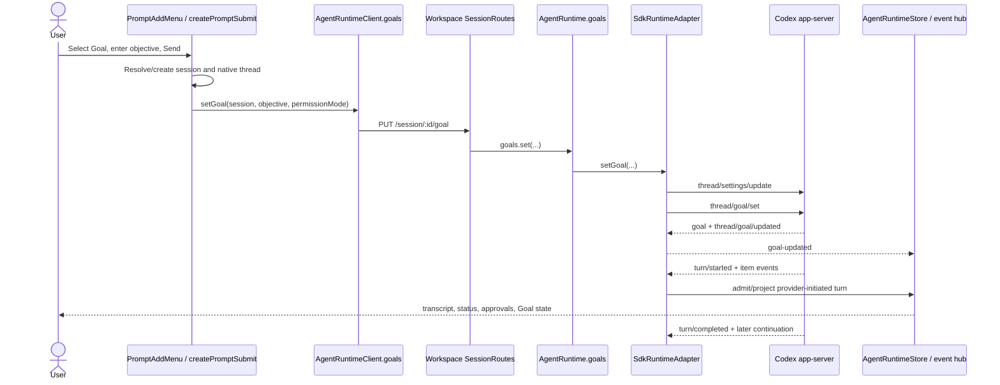

# feat: Add native Codex Goal mode to Claxedo

## Overview

Add a Goal option to Claxedo's session composer for native Codex sessions. A Goal submission creates Codex's single persisted thread Goal and lets Codex continue across provider-initiated turns until the Goal is paused, blocked, limited, cleared, or complete.

This is not another property on Claxedo's normal prompt payload. `thread/goal/set` is a separate, thread-scoped app-server operation, and an active Goal can start later turns without another `turn/start` request. Claxedo therefore needs a Goal resource, lifecycle events, provider-initiated turn admission, and explicit controls in addition to the composer option.

The implementation must keep Codex authoritative for the Goal objective, status, budget, usage, and elapsed time. Claxedo adapts that state for transport and display; it does not emulate Goal with a prompt loop, synthesize terminal state, or create a cross-harness fallback.

## User and System Flow

### A. Create a Goal from the composer

1. The user selects **Goal** in `PromptAddMenu`, enters an objective, and presses Send.
2. `createPromptSubmit` resolves or creates the Claxedo session exactly as normal submit does, so the native Codex thread is materialized before Goal activation.
3. The Goal branch verifies that the selected native Codex harness reports the `goals` capability and that no current Goal must first be cleared. A new draft uses the harness-level capability route; an existing session uses its session-scoped capability result.
4. Before activation, the Codex adapter applies the selected permission mode to the thread's next-turn settings. This ordering matters because `thread/goal/set` can wake autonomous continuation immediately.
5. The Goal branch calls the dedicated Goal resource with the objective. It does not call `dispatchNormalPromptSubmit`, add a `goal` field to `PromptDispatchPayload`, or issue a duplicate `turn/start`.
6. Codex persists the Goal, returns its canonical state, emits `thread/goal/updated`, and starts work when its Goal runtime decides the thread is eligible.
7. Claxedo clears the composer only after the Goal write is acknowledged. A rejected write retains both the objective and armed Goal mode and shows the provider error.

### B. Observe autonomous Goal work

1. The Codex app-server emits `turn/started`, item/tool/approval/question events, `turn/completed`, and Goal notifications without a new Claxedo prompt request.
2. A process-lifetime Codex router resolves the provider `threadId` to the authoritative Claxedo session binding.
3. On each provider `turn/started`, the SDK runtime opens a provider-initiated turn using the native turn identity, the session's stored harness/model/agent configuration, no fabricated user prompt, and a distinct assistant message.
4. Existing event adapters and projectors persist transcript/tool output, publish realtime events, and route approvals and questions to the same session.
5. On `turn/completed`, the runtime records that turn's canonical outcome. It does not mark the session-level Goal complete merely because one turn settled.
6. `thread/goal/updated` refreshes the Goal surface. `thread/goal/cleared` removes it. Reconnect and reload call `thread/goal/get`; live notifications are an invalidation/update path, not the durable authority.

### C. Pause, resume, stop, and clear

1. **Pause** first sets Goal status to `paused`, then interrupts the active Goal turn if one exists. The pause write must precede interruption so Codex cannot immediately schedule another continuation.
2. The existing composer **Stop** action delegates to that same pause-and-interrupt intent while a Goal is active. Ordinary non-Goal turns retain the current abort behavior.
3. **Resume** reapplies the current permission/thread settings, installs event routing, and only then sets Goal status to `active`.
4. **Clear** removes the native Goal and interrupts an in-flight Goal turn. The UI does not claim the Goal is gone until `thread/goal/clear` succeeds or a subsequent authoritative read returns `null`.
5. `blocked`, `usageLimited`, and `budgetLimited` remain provider-reported states. The user may retry Resume when the external condition has been addressed. `complete` is terminal until the user clears the Goal.
6. While Goal status is `active`, ordinary prompt submit is disabled even during the gap between provider turns; this prevents a normal `turn/start` from racing automatic continuation. After the Goal is paused, blocked, limited, or complete, ordinary prompts use the existing explicit-turn path and do not implicitly resume the Goal.

## Problem Frame

The current Claxedo prompt path is intentionally turn-scoped:

- `packages/claxedo-app/src/features/session/composer/ui/submit.ts` resolves the target and then calls `dispatchNormalPromptSubmit`.
- `packages/claxedo-app/src/features/session/composer/ui/submit-normal-prompt.ts` builds `PromptDispatchPayload` and sends `/session/:id/prompt_async`.
- `packages/workspace-runtime/src/session/service.ts` translates `SessionPromptBody` into `runtime.turns.start`.
- `packages/agent-sdk-runtime/src/harnesses/shared/sdk-runtime-adapter.ts` opens one turn projector and passes its `ingest` callback to a driver.
- `packages/agent-sdk-runtime/src/harnesses/codex/driver.ts` currently subscribes to process messages only inside `runLeasedTurn`, removes that listener after `turn/completed`, and removes the thread from `activeThreads`.

That path cannot safely represent Goal:

- Native Goal is not a `turn/start` option. Adding `goal?: boolean` or `objective?: string` to the prompt body would send data to a contract that does not own it.
- Codex can start Goal continuation when Claxedo has no explicit turn open, so the current turn-scoped listener would miss transcript, tool, approval, question, and completion events.
- `packages/agent-event-runtime/src/harnesses/codex/adapter.ts` currently classifies `thread/goal/updated` and `thread/goal/cleared` as unmapped.
- The process idle reaper sees no `activeThreads` between turns and may dispose the child while an active Goal still owns future work.
- `turn/interrupt` only stops the current turn. Treating it as “stop Goal” can allow continuation to restart.
- The runtime's own docs already state that a higher-level lifecycle such as a Codex Goal must own session-level working/done state because a turn may settle while the Goal continues.

## Requirements Trace

### Contract and authority

- **R1 — Native-only capability:** Make Goal selectable only for a native Codex adapter that reports Goal support. A selected native Codex harness may show a disabled item explaining unavailable support; other harnesses must not receive, ignore, or emulate a Goal request.
- **R2 — Dedicated resource:** Create/read/update/pause/resume/clear Goal through a dedicated runtime and HTTP resource. Do not extend `PromptInput`, `SessionPromptBody`, `PromptDispatchPayload`, or `turn/start` with Goal fields.
- **R3 — Materialized-thread ordering:** Resolve/create the session and provider thread before setting its Goal. Apply current permission/thread settings before any operation that activates or resumes continuation.
- **R4 — Provider authority:** Preserve Codex's exact objective, status, `tokenBudget`, `tokensUsed`, `timeUsedSeconds`, and timestamps. On reload or a replay gap, recover with `thread/goal/get`, not cached or synthesized state.

### Execution and control

- **R5 — Autonomous turn integrity:** Persist and stream every provider-initiated Goal turn through the same authoritative runtime store, event hub, permission/question queues, and transcript projectors as an explicit turn.
- **R6 — Independent lifecycle:** A settled turn updates `lastTurn`; only Goal state determines whether Goal work is active, paused, limited, blocked, cleared, or complete.
- **R7 — Safe control:** Pause/Stop must prevent new continuation before interrupting the current turn. Resume must reinstall routing and current permissions before activation. Clear must remove the native Goal and stop in-flight Goal work.
- **R8 — Failure and recovery:** A rejected Goal write leaves composer input intact. Process loss marks active work recovering, reconnects/resumes the native thread, rereads Goal state, and continues only when Codex still reports `active`.

### Product behavior

- **R9 — Discoverability and state:** The composer exposes a one-shot Goal option when supported. An existing Goal is represented by a session-level surface with objective, status, budget/usage/time, and Pause/Resume/Clear controls.
- **R10 — Existing behavior unchanged:** Ordinary prompt submission, OpenCode Plan mode, explicit-turn abort, other harness capability reports, and current transcript contracts remain unchanged outside Goal sessions.

## Scope Boundaries

- Native Codex app-server only. No ACP/OpenCode/Claude/Cursor/Pi implementation and no prompt-loop fallback.
- No Goal field in the normal prompt transport.
- No token-budget editor or budget-write API in the first slice. Omit `tokenBudget` when creating a Goal so Codex applies its configured policy; display the returned budget and usage without inventing a Claxedo default. If Codex reports `tokenBudget: null`, the Goal surface explicitly says there is no provider token cap.
- No simultaneous Claxedo OpenCode Plan-mode composition. The current Plan control is OpenCode-agent-specific, while Goal is native-Codex-only; their capability gates do not overlap. A future native Codex Plan feature must define its own Goal interaction.
- No client-owned durable Goal table. Codex remains the durable authority; Claxedo keeps only its existing session-to-provider-thread binding and realtime/query cache state.
- No silent replacement of an existing Goal. While any Goal exists, the session-level surface owns it; the user clears it before creating another. The lower-level update contract may change objective/status because the native API supports that, but the initial UI does not make replacement accidental.
- No automatic mutation of the user's Codex experimental-feature configuration. Capability discovery reports Goal only when the connected app-server exposes and enables it. For native Codex with Goal absent or disabled, the menu keeps a disabled Goal item with the reason; non-Codex harnesses do not show the item.

## Context and Research

### Current code and patterns

- `packages/claxedo-app/src/features/session/composer/ui/add-menu.tsx` owns the composer's `+` menu and the existing Plan-mode item.
- `packages/claxedo-app/src/features/session/composer/ui/toolbar-controls.tsx`, `packages/claxedo-app/src/features/session/composer/ui/frame.tsx`, and `packages/claxedo-app/src/features/session/composer/composer.tsx` carry menu state into submit wiring.
- `packages/claxedo-app/src/features/session/store/session-capabilities-query.ts` is the existing query-backed owner for per-session transport capabilities.
- `packages/claxedo-app/src/platform/runtime/agent/agent-runtime-client.ts` and `packages/claxedo-app/src/platform/runtime/agent/agent-runtime-urls.ts` own session-resource transport selection across local and signed-control-plane sessions.
- `packages/workspace-runtime/src/routes/session-core.ts` owns guarded session routes, including `/capabilities`, `/prompt_async`, and `/abort`; Goal routes belong beside these rather than in a Claxedo-only side channel.
- `packages/agent-sdk-runtime/src/adapter-contract.ts` expresses optional harness resources as `Supports*` contracts, and `packages/agent-sdk-runtime/src/capabilities.ts` is the canonical harness capability shape.
- `packages/agent-sdk-runtime/src/harnesses/shared/runtime-store.ts` and the memory/SQLite stores retain the Claxedo-session to provider-session binding needed to route unsolicited native events.
- `packages/agent-sdk-runtime/src/harnesses/shared/turn-projection.ts` is the canonical runtime-event to stored-transcript projection boundary.
- `packages/agent-event-runtime/src/harnesses/codex/protocol/v2/ThreadGoal.ts` and adjacent generated files already contain the exact native Goal request/response/notification types.
- `packages/claxedo-app/src/app/providers/global-sdk/provider.tsx` owns normalized runtime-event ingestion and is the correct live invalidation path for Goal query state.
- There is no `docs/solutions/` or `docs/brainstorms/` corpus in this checkout with additional Goal requirements.

### External protocol facts

- OpenAI's app-server documentation defines `thread/goal/set`, `thread/goal/get`, and `thread/goal/clear` as operations on one persisted Goal for a materialized thread, with `thread/goal/updated` and `thread/goal/cleared` notifications: https://github.com/openai/codex/blob/main/codex-rs/app-server/README.md
- The same documentation defines the statuses and configured maximum-budget behavior; omitting a budget lets Codex own the default, while an explicit oversized budget can be rejected: https://github.com/openai/codex/blob/main/codex-rs/app-server/README.md
- OpenAI's generated protocol source defines `ThreadGoal` as objective, status, budget/usage/time, and timestamps, and `ThreadGoalSetParams` as a partial objective/status/budget update: https://github.com/openai/codex/blob/main/codex-rs/app-server-protocol/src/protocol/v2/thread.rs
- OpenAI's app-server documentation describes automatic Goal continuation explicitly through `deferGoalContinuation`; current native Goal reports also demonstrate that an idle active Goal can produce a turn without another `turn/start`: https://github.com/openai/codex/blob/main/codex-rs/app-server/README.md

## Key Technical Decisions

### 1. Goal is a runtime resource, not a prompt variant

Add canonical types such as `AgentGoal`, `AgentGoalStatus`, and `AgentGoalUpdate`, plus a `SupportsGoals` adapter contract and `runtime.goals` namespace. The app uses dedicated `getGoal`, `setGoal`, `pauseGoal`, `resumeGoal`, and `clearGoal` client methods.

This keeps the normal prompt contract narrow and prevents unsupported harnesses from silently discarding Goal intent. `hasAdapterCapability(adapter, "goals")` or an equivalent typed resource guard must reject unsupported calls before any provider write.

### 2. Codex owns state; Claxedo owns routing and presentation

`AgentGoal` mirrors the provider values without a second state machine. `thread/goal/updated` maps to `goal-updated`; `thread/goal/cleared` maps to `goal-cleared`; the runtime event contract/version/registry is updated accordingly.

The app maintains a query entry keyed by the same session resource authority used for capabilities. Live Goal events update or invalidate that entry. Initial mount, reconnect, replay-gap recovery, and manual refresh read the Goal resource from Codex.

Goal objectives travel only in request bodies and the provider-backed Goal response. Do not add them to URLs, capability diagnostics, structured process logs, or error metadata beyond the repository's existing prompt-content handling policy.

### 3. Codex event listening becomes process-lifetime and single-path

Move notification subscription out of `runLeasedTurn` and install one listener when `CodexAppServerProcess` starts. Replace the current explicit-turn-only `activeThreads` routing with a thread registry that can resolve both explicit and provider-initiated turns.

The registry must own:

- Claxedo session ID, provider thread ID, directory, current model/agent config, and active projector;
- turn waiters for explicit `turn/start` calls;
- provider-initiated turn admission on `turn/started`;
- request routing for approvals, questions, and dynamic tools during autonomous turns;
- cleanup on `turn/completed`, Goal clear/terminal state, thread close, process failure, session deletion, and driver disposal.

Do not keep both the old turn listener and the new process listener. One raw frame must reach one projector exactly once.

### 4. Provider-initiated turns are real runtime turns

Extend the shared SDK driver/adapter host boundary with a provider-initiated turn callback rather than letting the Codex driver write the store directly. On native `turn/started`, the adapter:

- resolves the Claxedo session from the stored provider-thread binding;
- uses the provider turn ID to derive a stable admission/correlation key;
- creates a distinct assistant message with no fabricated user message;
- calls the existing store's `startTurn`, creates the normal turn projector/router, and publishes committed start events;
- projects subsequent events through the existing `AgentEventRuntime` and child routing;
- calls `finishTurn` with the native completion outcome and assistant message ID.

Duplicate/replayed `turn/started` for the same provider turn must be idempotent, and late completion from an older turn must not settle a newer active turn.

### 5. Goal liveness holds the process but remains separate from turn liveness

An `active` Goal holds a Codex activity lease even between turns, preventing `reapIdleProcess` from disposing the app-server while it owns future continuation. A paused/blocked/limited/complete/cleared Goal releases that continuation lease after state is confirmed, while ordinary per-turn leases continue to work unchanged.

Session badges and composer stop policy check Goal state before `session.status`/`lastTurn`. A turn can be idle or completed while the Goal surface still says active.

### 6. Permission and interruption order is enforced server-side

Goal activation/resume first applies the session's selected Codex permission mode using `thread/settings/update`, then calls `thread/goal/set` with status `active`. This closes the ordering window where continuation could begin with stale thread settings.

Pause is one adapter/runtime intent: set Goal status `paused`, confirm it, then interrupt the known active turn. Clear removes the Goal before interrupting any active Goal turn. These sequences live behind the runtime Goal resource so desktop, signed relay, and future clients cannot accidentally reverse them.

### 7. Capability discovery fails closed

Add `goals` to the canonical `HarnessCapabilities` and app `SessionTransportCapabilities` shapes. Native Codex reports it only after `experimentalFeature/list` confirms the connected app-server has Goal enabled; every other harness reports `false`. Both existing sessions and new drafts use the established session-scoped and harness-level capability routes respectively, so Goal can be selected before the first session exists without assuming support.

Cache that discovery only for the lifetime/config revision of the current Codex process and invalidate it on restart or config change. Reuse the existing Codex model/probe process and idle lifecycle; do not launch or retain a second process solely for Goal discovery.

A route call still checks the optional adapter contract because a stale client capability is not authorization. Unsupported, disabled, parent-owned subagent, missing-thread, and provider rejection errors are returned explicitly.

## Implementation Units

### Unit 1 — Define the canonical Goal contract and normalize Codex notifications

**Files**

- `packages/agent-event-runtime/src/contracts/agent-runtime-event.ts`
- `packages/agent-event-runtime/src/contracts/agent-runtime-event.test.ts`
- `packages/agent-event-runtime/src/harnesses/codex/adapter.ts`
- `packages/agent-event-runtime/src/harnesses/codex/adapter.test.ts`
- `packages/agent-sdk-runtime/src/capabilities.ts`
- `packages/agent-sdk-runtime/src/adapter-contract.ts`
- `packages/agent-sdk-runtime/src/index.ts`
- `packages/agent-sdk-runtime/src/harnesses/harness-capabilities.test.ts`
- all harness capability literals/tests required by the exhaustive `HarnessCapabilities` shape

**Changes**

- Add provider-neutral Goal types that preserve every native field and exact status spelling.
- Add `goal-updated` and `goal-cleared` runtime events, increment the event contract version, and update registries/factories.
- Map both Codex Goal notifications instead of returning `unmappedCodexAppServerEvent`.
- Add the optional Goal adapter surface and the `goals` capability; set it false for every non-native-Codex implementation.
- Make native-Codex capability discovery reflect the connected process's enabled Goal feature rather than protocol-file presence alone.

**Acceptance checks**

- A full native Goal notification normalizes without losing budget, usage, elapsed time, timestamps, status, or thread correlation.
- Clear normalizes to one `goal-cleared` event.
- Unknown/malformed Goal payloads produce the repository's normal diagnostic behavior rather than a fabricated Goal.
- Capability shape completeness tests force every harness to state Goal support explicitly.

### Unit 2 — Refactor Codex routing for autonomous turns and controls

**Files**

- `packages/agent-sdk-runtime/src/harnesses/codex/app-server-process.ts`
- `packages/agent-sdk-runtime/src/harnesses/codex/driver.ts`
- `packages/agent-sdk-runtime/src/harnesses/shared/sdk-runtime-driver.ts`
- `packages/agent-sdk-runtime/src/harnesses/shared/sdk-runtime-adapter.ts`
- `packages/agent-sdk-runtime/src/harnesses/shared/runtime-store.ts`
- `packages/agent-sdk-runtime/src/stores/memory.ts`
- `packages/agent-sdk-runtime/src/stores/sqlite.ts`
- `packages/agent-sdk-runtime/src/test-utils/fake-runtime-store.ts`
- `packages/agent-sdk-runtime/src/harnesses/codex/goal-lifecycle.test.ts` (new)
- `packages/agent-sdk-runtime/src/harnesses/codex/workspace-behavior.test.ts`
- `packages/agent-sdk-runtime/src/harnesses/codex/thread-recovery.test.ts`
- `packages/agent-sdk-runtime/src/harnesses/codex/idle-reaping.test.ts`
- `packages/agent-sdk-runtime/src/harnesses/shared/sdk-runtime-adapter.test.ts`

**Changes**

- Add a reverse provider-thread binding lookup or equivalent canonical resolver to the runtime-store boundary.
- Install one process-lifetime notification listener and route explicit and autonomous events through it.
- Add the shared provider-initiated turn admission/project/finish callback; keep store writes in the adapter/runtime owner, not the Codex driver.
- Preserve explicit `runTurn` completion promises by correlating native turn IDs instead of owning a temporary listener.
- Route autonomous approvals/questions/tool calls through the same pending interaction maps.
- Implement Goal get/set/update/pause/resume/clear against the generated protocol types.
- Apply `thread/settings/update` before set/resume, enforce pause/clear interruption ordering, and hold/release the Goal continuation lease.
- Ensure the provider thread is loaded/resumed and the process listener is installed before Goal get/set/resume can trigger runtime effects.
- Reconcile Goal state after process start/resume and recover an active Goal without duplicating a turn already admitted.

**Acceptance checks**

- Setting an active Goal while idle admits and persists a provider-started turn without an explicit Claxedo `turns.start` call.
- One native event is projected once; explicit-turn behavior has no duplicates or regressions after listener refactoring.
- Consecutive automatic turns create distinct assistant messages and independent `lastTurn` outcomes while Goal remains active.
- Autonomous permission and question requests reach the correct Claxedo session and their replies return to the correct native turn.
- Pause prevents a continuation from starting after the current turn is interrupted; Resume uses the latest permission selection.
- Active Goal prevents idle reaping. Paused/terminal/cleared Goal permits reaping without losing persisted Goal state.
- Process loss/restart rereads native Goal state and produces recovering/error behavior without synthesizing completion.

### Unit 3 — Expose Goal through AgentRuntime and guarded workspace routes

**Files**

- `packages/agent-sdk-runtime/src/runtime.ts`
- `packages/agent-sdk-runtime/src/runtime.test.ts`
- `packages/workspace-runtime/src/session/service.ts`
- `packages/workspace-runtime/src/session/service.test.ts`
- `packages/workspace-runtime/src/routes/session-core.ts`
- `packages/workspace-runtime/src/routes/session.ts`
- `packages/workspace-runtime/src/routes/session-core.test.ts`
- `packages/workspace-runtime/src/routes/session.test.ts`
- `packages/workspace-runtime/src/routes.ts`

**Changes**

- Add `runtime.goals.get/set/pause/resume/clear`, resolving the session's configured adapter and rejecting absent support.
- Add guarded session routes:
  - `GET /session/:id/goal`
  - `PUT /session/:id/goal` for a new objective/activation, returning conflict when a Goal already exists
  - `PATCH /session/:id/goal` for allowed objective/status updates, without a token-budget write in this slice
  - `DELETE /session/:id/goal`
- Use the existing session operation guard, directory/harness resolution, signed transport, and error response conventions.
- Keep Goal absent from `SessionPromptBody` and both prompt routes.
- Publish Goal runtime notifications through the existing runtime event hub/SSE replay path.

**Acceptance checks**

- Goal endpoints target the adapter bound to the session and cannot cross directory, workspace, harness, or signed authority boundaries.
- Unsupported/disabled harness returns an explicit non-success response and makes no provider call.
- New-session ordering materializes the provider thread before the Goal route executes.
- PUT/PATCH validation rejects blank objectives, unsupported statuses, unknown fields, and accidental Goal replacement according to the declared API policy.
- Repeated reads return the provider's current Goal; DELETE is idempotent only to the extent reported by native `cleared`.
- Existing prompt and abort route tests remain unchanged for non-Goal sessions.

### Unit 4 — Add app transport, query ownership, and realtime reconciliation

**Files**

- `packages/claxedo-app/src/platform/runtime/capabilities.ts`
- `packages/claxedo-app/src/platform/runtime/agent/agent-runtime-urls.ts`
- `packages/claxedo-app/src/platform/runtime/agent/agent-runtime-client.ts`
- `packages/claxedo-app/src/platform/runtime/agent/agent-runtime-client.test.ts`
- `packages/claxedo-app/src/features/session/store/session-transport.ts`
- `packages/claxedo-app/src/features/session/store/session-pane-queries.ts`
- `packages/claxedo-app/src/features/session/store/session-goal-query.ts` (new)
- `packages/claxedo-app/src/features/session/store/session-goal-query.vitest.ts` (new)
- `packages/claxedo-app/src/app/providers/global-sdk/provider.tsx`
- `packages/claxedo-app/src/app/providers/global-sdk/provider.test.ts`

**Changes**

- Add typed Goal resource URLs/client methods that use the same local, workspace-relay, and signed-control-plane authority selection as other session resources.
- Replace `AgentRuntimeClient.getCapabilities`'s current no-session default for selected runtime harnesses with the guarded `/session/capabilities` read, carrying the explicitly selected harness. Keep the static default only when no runtime transport/harness target exists, with `goals: false`.
- Add a session-scoped Goal query key containing every authority dimension used by capabilities/messages so results cannot bleed across workspaces or transports.
- Resolve new-draft availability from harness-level capabilities, then replace it with session-scoped capabilities after materialization without letting a stale draft result overwrite the bound session.
- Hydrate from GET, update from `goal-updated`, remove from `goal-cleared`, and refetch on reconnect/replay gap.
- Ensure Goal runtime envelopes do not create OpenCode-shaped transcript events; their consumer is Goal state, while turn/item events continue through the existing transcript projection.

**Acceptance checks**

- Local and signed session URLs resolve to the same canonical Goal resource and preserve authorization headers/workspace scope.
- A stale request from a previously mounted session cannot overwrite the current session's Goal query.
- Live update and clear events affect only the matching session/authority key.
- Replay gap or process reconnect causes an authoritative GET before the UI reports final Goal state.

### Unit 5 — Add the composer option and session-level Goal controls

**Files**

- `packages/claxedo-app/src/features/session/composer/ui/add-menu.tsx`
- `packages/claxedo-app/src/features/session/composer/ui/toolbar-controls.tsx`
- `packages/claxedo-app/src/features/session/composer/ui/frame.tsx`
- `packages/claxedo-app/src/features/session/composer/prompt-input-props.ts`
- `packages/claxedo-app/src/features/session/composer/composer.tsx`
- `packages/claxedo-app/src/features/session/composer/ui/submit-input.ts`
- `packages/claxedo-app/src/features/session/composer/ui/submit.ts`
- `packages/claxedo-app/src/features/session/composer/ui/submit-goal.ts` (new)
- `packages/claxedo-app/src/features/session/composer/ui/prompt-options.test.ts`
- `packages/claxedo-app/src/features/session/composer/ui/submit.harness-dispatch.test.ts`
- `packages/claxedo-app/src/features/session/composer/goal-mode.test.ts` (new)
- `packages/claxedo-app/src/features/session/ui/composer/session-goal-dock.tsx` (new)
- `packages/claxedo-app/src/features/session/ui/composer/session-composer-state.ts`
- `packages/claxedo-app/src/features/session/ui/session-message-actions.ts`
- `packages/claxedo-app/src/platform/i18n/en.ts` and every locale module containing `prompt.action.planMode`

**Changes**

- Add a one-shot Goal toggle to `PromptAddMenu`. For selected native Codex, render it disabled with loading/unavailable reason until capability resolution succeeds; omit it for non-Codex harnesses.
- Carry local Goal-mode state through the frame/composer submit inputs without adding it to normal prompt content types.
- Branch only after the shared target/session provisioning path. The branch calls `submit-goal.ts`; the normal branch remains `dispatchNormalPromptSubmit`.
- Retain objective and mode on failure; clear them after acknowledged Goal creation.
- Render the authoritative Goal dock with objective, exact status label, provider budget/usage/time, error/limited guidance, and Pause/Resume/Clear.
- While Goal is active, route the composer Stop action to pause-and-interrupt. Keep ordinary abort for sessions without an active Goal.
- Disable ordinary prompt submission while Goal is active, including provider-turn idle gaps. Do not implicitly activate a paused/blocked/limited Goal when an ordinary prompt is sent.
- Prevent a second Goal submission until the existing Goal is cleared.
- Make the menu item a keyboard-operable checked option with concise explanatory copy that Goal continues until paused or complete and can consume substantial usage. Announce asynchronous Goal status changes through the existing accessible status mechanism.
- In the Goal dock, place objective and status before metering, wrap the compact layout at narrow widths, disable mutation controls while a write is pending, and require confirmation before Clear because it removes the persisted Goal and interrupts work. Pause remains immediate and always available while active.

**Acceptance checks**

- Goal is selectable only for an enabled native Codex Goal capability; selected native Codex shows a disabled reason when unavailable, and other harnesses never show it or inherit a stale prior capability response.
- Sending in normal mode produces the existing prompt payload and no Goal call; sending in Goal mode produces one Goal call and no prompt/turn call.
- New-session Goal waits for session/thread materialization and uses the resolved session ID, directory, harness, model, and permission selection.
- Failed Goal creation preserves the editor content. Successful creation clears once and displays returned state.
- Active/paused/blocked/limited/complete and cleared states render distinct, accurate controls.
- Loading, unsupported/disabled, mutation-pending, mutation-error, no-budget-cap, and reconnecting states are explicit and do not flash a false empty/complete Goal.
- Stop pauses before interrupting; ordinary turn Stop remains unchanged.
- An active Goal blocks ordinary Send between autonomous turns; paused/non-active Goal state does not silently resume when a normal prompt is sent.
- Keyboard submit, button submit, draft/session switches, and harness switches cannot leak armed Goal mode to a different composer scope.

### Unit 6 — Verify the full lifecycle and close architecture/documentation gaps

**Files**

- `packages/workspace-runtime/src/workspace/runtime.test.ts`
- `packages/claxedo-app/src/platform/runtime/workspace-runtime-route-audit.test.ts`
- `packages/agent-sdk-runtime/README.md`
- `packages/agent-sdk-runtime/docs/concepts.md`
- `packages/agent-sdk-runtime/docs/recipes.md`
- architecture-ratchet baselines/comments only if the reviewed dependency closure intentionally changes

**Changes**

- Add a full workspace-host test covering Goal create, autonomous turn events, pause, resume, completion, clear, and reload.
- Add route/client audits proving Goal travels through the canonical workspace/signed session transport rather than a new product-specific endpoint.
- Replace the existing “if your host supports Goal” documentation caveat with the concrete `runtime.goals` lifecycle and the distinction between turn and Goal status.
- Run focused package tests/typechecks, the affected product closure verification, and the required architecture-ratchet gate. Investigate any newly reachable production import before changing a ceiling; if intentional, record the exact owner and measured closure with no headroom.
- Perform a real native-Codex smoke using a Goal-enabled app-server: create a Goal, observe at least two provider turns or an explicit complete state, pause during work, verify no continuation, resume, and clear/reload.

**Acceptance checks**

- The real public Claxedo composer entrypoint can start and control a native Goal end to end.
- Reopening the session shows provider-authoritative Goal state and complete transcript history.
- The app does not show Done while an active Goal owns future work.
- Network/SSE interruption does not clear or complete the Goal; reconnect reconciles from GET.
- Typecheck, focused tests, workspace/runtime integration tests, product closure verification, and architecture ratchets pass.

## Test Scenarios

### Positive flows

- New native Codex session: arm Goal, submit objective, materialize thread, apply permission settings, set Goal, stream autonomous work, complete, clear.
- Existing idle native Codex session: set Goal without creating a new session or issuing a normal turn.
- Active Goal: settle one turn, remain active, start a second turn, and preserve two assistant messages/outcomes.
- Pause and resume: pause before interrupt, observe no continuation, change permission mode, resume with the new settings.
- Reload: close/remount the UI and recover the same objective/status/usage from `thread/goal/get`.

### Negative and boundary flows

- Goal disabled or absent in app-server feature discovery.
- Unsupported harness, parent-owned Codex subagent, unknown session, wrong directory/workspace, and stale signed authority.
- Blank objective, duplicate Goal while one exists, invalid status, and Goal-disabled native Codex.
- `thread/goal/set` fails after session creation; objective remains editable and no normal turn starts.
- Process exits during an autonomous turn; runtime reports recovery/error, resumes routing, rereads Goal, and does not duplicate transcript rows.
- SSE disconnect/replay gap during a Goal update; UI refetches instead of assuming the missed status.
- Pause races with `turn/completed` or the next `turn/started`; final state is paused and no later continuation remains admitted.
- Clear races with an active turn; Goal becomes absent and the turn is interrupted without a replacement turn.
- Late/duplicate `turn/started` and `turn/completed` frames are idempotent and cannot settle the wrong assistant message.
- User switches session, workspace, or harness while Goal creation/read is in flight; stale results do not update the new scope.
- User presses ordinary Send during the idle gap between two active Goal turns; admission remains blocked and no competing `turn/start` is issued.

## Risks and Mitigations

| Risk | Mitigation |
|---|---|
| Adding only a prompt flag starts no native Goal or causes duplicate work | Dedicated Goal resource; Goal branch never calls normal prompt dispatch. |
| Autonomous events are lost between explicit turns | One process-lifetime notification router plus provider-initiated turn admission. |
| Goal burns usage after the user presses Stop | Pause/clear native state before interrupting the current turn; active Goal owns Stop semantics. |
| Goal continuation uses stale permissions | Apply thread settings before set/resume and test the exact request order. |
| Idle reaper kills future Goal continuation | Hold an activity lease for confirmed active Goal state. |
| UI shows stale terminal state after reconnect | Provider GET is authoritative; live events only update/invalidate query state. |
| Duplicate event routing corrupts transcript | Remove temporary listener path and key provider-turn admission idempotently. |
| Scope expands into a generic scheduler | Keep contracts limited to a single provider-owned per-session Goal and reuse existing runtime/store/event seams. |
| Unsupported Codex version breaks ordinary Codex | Discover enabled Goal support from the running app-server and fail closed without changing normal-turn capability. |

## Completion Criteria

- A native Codex Goal can be created, observed, paused, resumed, completed, cleared, and recovered through Claxedo's real composer/session entrypoint.
- Normal prompt DTOs contain no Goal field and unsupported harnesses never emulate or silently drop Goal intent.
- Every autonomous Goal turn is persisted and streamed once, including tools, approvals, questions, outcomes, and recovery.
- Goal state displayed after reload exactly matches Codex's current Goal response.
- Stop cannot leave an active Goal silently continuing.
- All focused tests, typechecks, workspace/runtime integration, product closure verification, and architecture ratchets pass.
