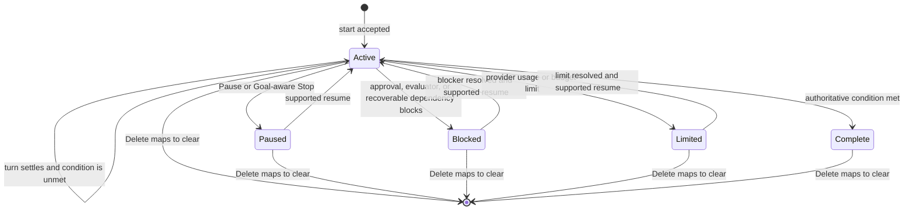
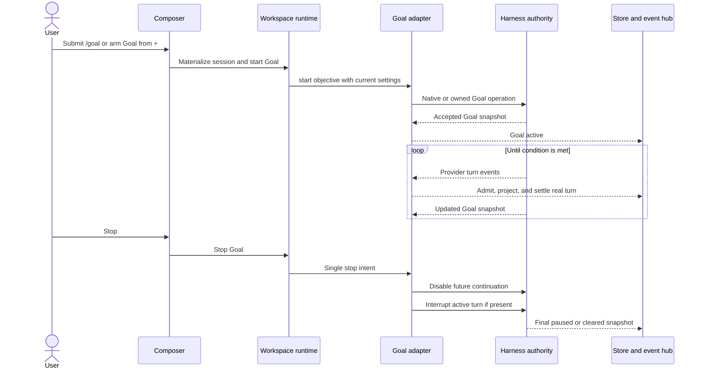

# Universal Goal Support - Plan

## Goal Capsule

- **Objective:** A Claxedo user can start a long-running Goal with `/goal` or the composer's `+` menu, see the active Goal, and manage it with the controls the selected harness supports.
- **Means:** Add one provider-neutral Goal resource and map it to each harness's real Goal mechanism behind its adapter (KTD1, KTD3).
- **Authority:** The selected harness owns execution and completion. Claxedo owns normalized transport, event projection, and UI state. OpenCode and Pi are exceptions only in the sense that Claxedo already owns those harness runtimes, so their Goal executors live there (KTD4).
- **Execution profile:** Cross-package code change spanning five built-in harnesses, capability-advertised ACP connections, workspace transport, realtime events, and the composer.
- **Stop conditions:** All R-IDs pass the cross-harness conformance suite. Real smoke tests prove both start paths, active-state visibility, and supported actions for every built-in whose runtime prerequisites are available. An unavailable environment remains explicitly unverified and blocks any claim of full real-harness parity. Stop, pause, delete, and recovery must not leave invisible autonomous work running.
- **Tail ownership:** Remove replaced Codex-only paths, temporary prompt fallbacks, duplicate listeners, and dead-end executor code before completion.

---

## Product Contract

### Summary

Add a one-shot **Goal** intent to Claxedo's composer for Claude, Codex, Cursor, OpenCode, and Pi. Users can type `/goal <objective>` or select Goal from the `+` menu. Submission creates one session-level completion condition through a dedicated Goal resource. Each harness adapter translates it into its supported Goal primitive and reports a normalized Goal snapshot. A visible Goal surface shows the objective and status, with Pause, Resume, and Delete controls when the harness advertises those actions.

Open and custom ACP connections participate only when they advertise the neutral Goal extension. Claxedo must not silently turn an unsupported ACP Goal into an ordinary prompt.

### Problem Frame

Claxedo currently submits one explicit prompt and treats its turn as the unit of work. A Goal is session-scoped: it may start multiple turns, remain active between turns, survive reconnects, and stop independently from any one turn.

The earlier Codex-only plan chose the wrong product boundary. Goal is a Claxedo composer intent across every built-in harness. The transport still differs by harness:

- Codex has structured thread/goal/set, thread/goal/get, and thread/goal/clear operations and notifications.
- Claude and Cursor accept native /goal commands through their SDK send surfaces.
- The vendored OpenCode runtime and in-process Pi adapter have continuation seams but no first-class Goal resource in this checkout, so their owned harness implementations must add one.
- ACP has no stable core Goal method. The provider-neutral _meta.goal and _session/goal extension can be negotiated.

### Key Decisions

- **Goal is a built-in-harness feature, not a Codex-only feature.** (session-settled: user-directed — chosen over native-Codex-only scope: the same composer action must work across every harness Claxedo ships.) Governs R1, R2, R3.
- **Unknown ACP agents remain capability-gated.** Claxedo cannot promise an extension that an arbitrary external process did not advertise. Governs R1, R4, R11.
- **The first slice guarantees the common lifecycle, not every provider-specific control.** All built-ins support start, observe, completion, stop, and recovery. A reversible Pause/Resume pair, Delete, budgets, and evaluator diagnostics appear only when advertised. Governs R5, R6, R8, R9, R16, R17, R18.
- **Goal has equivalent command and click entry paths.** (session-settled: user-directed — chosen over a `+`-only option: users must be able to set a Goal with `/goal` or the composer menu.) Governs R2, R13, R14.
- **Goal management reflects harness capabilities.** (session-settled: user-directed — chosen over universal controls backed by approximations: users see a reversible Pause/Resume pair and Delete only when the selected harness supports them.) Governs R6, R15, R16, R17, R18.

### Requirements

**Availability and submission**

- R1. Goal is implemented for the built-in native harnesses claude, codex, cursor, opencode, and pi; runtime prerequisites may make it temporarily unavailable with an explicit reason, while an ACP connection is eligible only when it advertises the neutral Goal extension.
- R2. The composer exposes one Goal intent through `/goal` and the `+` menu without changing model, agent, effort, permission mode, attachments, or workspace target.
- R3. Goal submission materializes the Claxedo and provider sessions first, then sends the objective through the selected adapter's Goal contract exactly once.
- R4. Unsupported, disabled, or misconfigured Goal execution fails before ordinary prompt dispatch, preserves the draft and armed state, and returns the harness's reason.

**Lifecycle and authority**

- R5. A successful Goal continues across harness turns until the harness reports complete, the user stops it, or the harness reports blocked or limited.
- R6. Claxedo exposes one normalized snapshot with objective, common status, timestamps, and optional usage, budget, iteration, and last-reason fields; it never invents unavailable values.
- R7. Provider-initiated Goal turns use the existing runtime store, transcript projection, permissions, questions, tools, child-agent routing, and realtime event hub exactly once.
- R8. Stop becomes Goal-aware: it prevents future continuation before interrupting active work, using the adapter's strongest supported clear or pause operation.
- R9. Reload and replay gaps recover Goal from adapter authority; process restart resumes when the provider session is durable and otherwise reports blocked recovery instead of inferring completion.

**Compatibility and boundaries**

- R10. Normal prompts, explicit-turn abort, OpenCode and Cursor Plan mode, and non-Goal transcript behavior remain unchanged.
- R11. Goal routes preserve directory, workspace, signed-control-plane, session ownership, and parent/child authorization boundaries.
- R12. Capability and conformance tests require every built-in adapter to declare and prove Goal support; forwarding an ordinary unstructured prompt does not satisfy the contract.

**Entry paths and controls**

- R13. Typing `/goal <objective>` submits the remainder through the Goal contract and never through generic slash-command or prompt dispatch.
- R14. Invoking bare `/goal` by submission or command-list selection, or selecting Goal from the `+` menu, arms the same one-shot composer state without provisioning a session so the next non-blank submission becomes the objective.
- R15. A session with a Goal shows its objective and authoritative status beside the composer across turns, reloads, and reconnects until the Goal is deleted or cleared.
- R16. The Goal surface renders Pause only when the adapter advertises both Pause and Resume, renders Resume only for a paused Goal, and renders Delete only when advertised.
- R17. Pause disables continuation before interrupting active work and preserves the authoritative objective; Resume continues that Goal without creating a replacement Goal or duplicating a turn.
- R18. Delete disables continuation, interrupts active work, and clears authoritative Goal state as one server-side intent.

### Key Flows

- F1. **Start a Goal**
  - **Trigger:** The user submits `/goal <objective>`, selects `/goal` and submits a draft, or selects Goal from the `+` menu and submits a draft.
  - **Steps:** Resolve one Goal intent, resolve the target, create or resume provider state, apply settings, call runtime.goals.start, translate in the adapter, and acknowledge after the harness accepts.
  - **Outcome:** The editor clears once, Goal state appears for the bound session, and work starts without a duplicate normal prompt.
  - **Covered by:** R1, R2, R3, R4, R11.
- F2. **Run across turns**
  - **Trigger:** The Goal implementation decides its condition is not met.
  - **Steps:** The harness continues, the adapter admits the next provider turn, shared projectors persist and publish events, and Goal state remains independent from turn state.
  - **Outcome:** Each real turn appears once while the session-level Goal remains active.
  - **Covered by:** R5, R6, R7, R9.
- F3. **Stop Goal work**
  - **Trigger:** The user presses Stop while a Goal exists.
  - **Steps:** The runtime calls the adapter's Goal stop intent, the adapter disables continuation, it interrupts current work, and the UI reconciles authoritative state.
  - **Outcome:** No invisible continuation starts after Stop.
  - **Covered by:** R8, R9, R10.
- F4. **Observe and manage a Goal**
  - **Trigger:** A session has an authoritative Goal snapshot.
  - **Steps:** Show the objective and status, derive controls from advertised actions, send Pause, Resume, or Delete through runtime.goals, and reconcile the returned snapshot.
  - **Outcome:** The Goal stays visible and each displayed control has native or owned harness semantics.
  - **Covered by:** R6, R15, R16, R17, R18.

### Acceptance Examples

- AE1. **Built-in parity**
  - **Covers:** R1, R3, R5, R12.
  - **Given:** A draft using any built-in harness.
  - **When:** The user submits Goal with a verifiable condition.
  - **Then:** Claxedo starts one Goal through that harness adapter and the harness can continue without another user prompt.
- AE2. **No prompt fallback**
  - **Covers:** R4, R12.
  - **Given:** An ACP connection that does not advertise Goal.
  - **When:** A stale or direct client attempts Goal submission.
  - **Then:** The runtime rejects it, preserves the objective, and sends no session/prompt request.
- AE3. **Turn completion is not Goal completion**
  - **Covers:** R5, R7, R9.
  - **Given:** The first turn ends before the condition holds.
  - **When:** That turn settles.
  - **Then:** Claxedo records the turn and remains Goal-active while the harness continues.
- AE4. **Stop ordering**
  - **Covers:** R8.
  - **Given:** An active Goal can auto-continue.
  - **When:** The user presses Stop.
  - **Then:** Continuation is disabled before interruption and no later autonomous turn is admitted.
- AE5. **Recovery**
  - **Covers:** R6, R9, R11.
  - **Given:** An active Goal and process or SSE interruption.
  - **When:** The session reconnects.
  - **Then:** Claxedo reloads Goal from adapter authority and projects only uncommitted turns, or reports blocked recovery when that harness cannot restore its session.
- AE6. **Equivalent start paths**
  - **Covers:** R2, R13, R14.
  - **Given:** A Goal-capable harness and the objective `Ship when the verification contract passes`.
  - **When:** The user submits it as `/goal Ship when the verification contract passes` or arms Goal from the `+` menu and submits the draft.
  - **Then:** Both paths create the same Goal request and send no ordinary prompt or generic slash command.
- AE7. **Visible capability-driven controls**
  - **Covers:** R6, R15, R16.
  - **Given:** An active Goal whose adapter advertises Delete but not the complete Pause/Resume pair.
  - **When:** The Goal surface loads or reconnects.
  - **Then:** The objective and active status are visible, Delete is available, and Pause and Resume are absent.
- AE8. **Pause, resume, and delete ordering**
  - **Covers:** R17, R18.
  - **Given:** An active Goal whose adapter advertises Pause, Resume, and Delete.
  - **When:** The user pauses, resumes, and later deletes the Goal.
  - **Then:** Pause prevents another turn and preserves the Goal, Resume continues the same Goal once, and Delete clears it before another continuation can start.

### Scope Boundaries

**In scope**

- The five built-in native harnesses and capability-advertised ACP connections.
- `/goal` and `+` menu entry paths backed by one Goal intent.
- Goal start, normalized state, active-state visibility, autonomous continuation, completion, stop, and recovery.
- Capability-driven pause, resume, delete, budget, usage, iterations, and reason fields.
- One Goal per session.

**Deferred to follow-up work**

- Goal queues, concurrent Goals, scheduling, recurring Goals, and cross-session orchestration.
- A common token-budget editor.
- Automatic installation of third-party OpenCode or Pi Goal plugins; Claxedo owns the built-in implementations.

**Outside this product's identity**

- Claiming every arbitrary ACP agent supports Goal.
- Reimplementing Claude, Codex, or Cursor completion evaluation when their harness owns it.
- Encoding Goal as a boolean an adapter may ignore.

### System-Wide Impact

- **Session state:** Goal adds a session-level lifecycle beside turn state. Session lists, status badges, and idle detection must not derive Goal completion from lastTurn.
- **Composer commands:** `/goal` is a reserved local command that creates Goal intent before the normal custom-command resolver. The `+` menu writes the same intent instead of maintaining a second mode.
- **Persistence:** Codex, Claude, Cursor, and ACP reconcile from provider-owned state. OpenCode and Pi persist through their existing session owners. Query caches remain projections.
- **Process lifecycle:** An active Goal can own future work while no turn is running. Process reaping and reconnect logic must retain the harness only as long as its authoritative Goal state requires.
- **Permissions and questions:** Every autonomous turn must reuse the session's current permission mode and existing interaction queues. Resume must not bypass a pending approval or change the parent/child owner.
- **Transport and authorization:** Goal uses the same local, workspace-relay, and signed-control-plane boundaries as other session resources. No new bypass route or client-only side channel is allowed.
- **Usage and operations:** Goal may consume multiple turns and evaluator calls. The UI must show provider usage when available and clearly state when a harness does not report it.

---

## Planning Contract

### Key Technical Decisions

- KTD1. **Goal is a dedicated runtime resource.** The composer presents a prompt option, but submission branches after session provisioning into runtime.goals. PromptInput, SessionPromptBody, and ordinary turn/start remain Goal-free. (session-settled: user-directed — chosen over a Codex-only prompt option: every built-in harness must receive enforceable Goal intent.)
- KTD2. **The normalized shape follows the neutral ACP extension.** Use active, paused, blocked, limited, and complete, with optional provider metrics. Keep provider detail in diagnostics.
- KTD3. **Each adapter uses its real Goal primitive.** Codex uses thread/goal operations; Claude and Cursor use native /goal; OpenCode gains an owned session Goal service; Pi gains an owned controller around its follow-up loop; ACP uses its advertised extension. No generic prompt fallback exists.
- KTD4. **Authority stays nearest the executor.** Codex, Claude, Cursor, and ACP provider state wins on reconciliation. The vendored OpenCode service and PiHarnessAdapter own their implementations. UI cache and runtime events are projections.
- KTD5. **Goal and turn lifecycles remain independent.** Provider-initiated turns enter through one process/session router and the existing projector. A completed turn never completes Goal by itself.
- KTD6. **Capabilities are structured.** goals is the coarse runtime-availability signal; the Goal resource reports implementation support, unavailable reason, actions, recovery behavior, and optional fields. Every built-in implements Goal but may report unavailable when a required harness feature is disabled. ACP derives support from _meta.goal.
- KTD7. **Stop is one server-side intent.** The adapter disables continuation before interrupting work. Clients do not compose those operations.
- KTD8. **One conformance suite proves parity.** Shared tests cover start, observe, multi-turn continuation, completion, stop ordering, and recovery.
- KTD9. **Owned executors use an independent completion check.** After each OpenCode or Pi work turn, a fresh no-tools evaluator judges the condition using the session's selected provider/model unless that harness exposes an authoritative evaluator choice. The working agent cannot mark itself complete without that check.
- KTD10. **One local Goal-intent parser owns both entry paths.** `/goal <objective>` is recognized before generic slash-command resolution. Bare `/goal`, slash-popover selection, and `+` menu selection arm the same one-shot intent. (session-settled: user-directed — chosen over provider slash dispatch and separate menu state: both entry paths must create the same cross-harness Goal.)
- KTD11. **Goal actions are advertised, not inferred.** The normalized action set is Pause, Resume, and Delete. The UI treats Pause and Resume as one reversible capability pair, while adapters map Delete to authoritative clear or removal. (session-settled: user-directed — chosen over always-visible approximate controls: the Goal surface must match each harness's real support.)

### High-Level Technical Design

The diagrams fix component ownership and operation ordering. Exact helper names remain local to the implementation units.

**Component and data-flow topology**

```mermaid
flowchart TB
  Slash[/goal command] --> Intent[One-shot Goal intent]
  AddMenu[+ menu Goal option] --> Intent
  Intent --> Provision[Shared session provisioning]
  Provision --> Runtime[runtime.goals]
  Runtime --> Contract[SupportsGoals adapter contract]
  Contract --> Codex[Codex Goal API]
  Contract --> NativeCommand[Claude or Cursor native Goal command]
  Contract --> OwnedExecutor[OpenCode or Pi owned Goal executor]
  Contract --> ACP[Negotiated ACP Goal extension]
  Codex --> GoalEvents[Normalized Goal events]
  NativeCommand --> GoalEvents
  OwnedExecutor --> GoalEvents
  ACP --> GoalEvents
  GoalEvents --> Store[Runtime store and event hub]
  Store --> Query[Session Goal query]
  Query --> Surface[Goal status and controls]
  Surface --> Runtime
  Codex --> Turns[Provider-initiated turns]
  NativeCommand --> Turns
  OwnedExecutor --> Turns
  ACP --> Turns
  Turns --> Projector[Existing turn projector]
  Projector --> Store
```

**Common Goal lifecycle**



**Start, continuation, and Stop ordering**



### Harness Mapping

| Harness | Start | Authority | Advertised actions | Recovery |
|---|---|---|---|---|
| Codex | thread/goal/set | Goal read and notifications | Pause and Resume through status update; Delete through thread/goal/clear | Resume thread, reinstall router, reread |
| Claude | /goal through query | active_goal and resumed Claude session | Only actions proven by the installed SDK Goal lifecycle | Resume SDK session and reconcile |
| Cursor | /goal through Agent.send | Agent/Run lifecycle and Goal output | Only actions proven by the installed SDK Goal lifecycle | Resume durable Agent and inspect latest run |
| OpenCode | Owned session Goal service | OpenCode Goal store and events | Owned Pause, Resume, and Delete transitions | Restore with OpenCode session |
| Pi | Owned Pi Goal controller | Pi session Goal state and evaluator | Owned Pause, Resume, and Delete transitions | Restore if durable state exists; otherwise report blocked recovery |
| ACP | Advertised _session/goal | session_info_update._meta.goal | Advertised action subset only | Resume/load and refresh session info |

### Implementation Constraints

- Preserve session-to-provider binding as routing authority.
- Do not put objectives in URLs, capability diagnostics, or process logs.
- Reserve `/goal` as a Claxedo-owned composer intent before generic custom-command resolution on every transport.
- Validate objective type, non-blank content, and length before provider dispatch. Use the most restrictive documented built-in limit, currently 4,000 characters, unless an adapter advertises a lower cap.
- Do not keep two listeners for the same provider frame.
- Do not add external OpenCode or Pi plugins as hidden dependencies.
- Keep child and parent sessions isolated.
- Any new production import requires bun run test:architecture-ratchets. Intentional closure increases use exact measured ceilings and adjacent owner comments.

### Risks and Dependencies

| Risk | Mitigation |
|---|---|
| One UI hides different semantics | Normalize only the common lifecycle and expose action capabilities. |
| /goal becomes ordinary text | Claude and Cursor tests assert native command lifecycle; no other adapter uses that mapping. |
| A custom `goal` slash command intercepts the feature | Resolve the reserved local `/goal` intent before provider and OpenCode custom commands. |
| OpenCode or Pi becomes a generic scheduler | Keep each executor inside its owned harness runtime and the SupportsGoals contract. |
| Autonomous frames are lost | Install provider/session lifetime routing before activation and hold a process lease. |
| Stop races continuation | Enforce disable-then-interrupt and test the race. |
| Delete clears the UI but leaves work running | Make Delete one guarded adapter intent that disables continuation before interrupting work and clearing state. |
| Capability claims drift | Conformance fails any built-in that claims support without behavior. |
| SDK behavior changes | Pin to installed types, official docs, and real smoke tests. |

### Security Posture

- Direct Goal requests and Goal actions are subject to the same session operation guard and signed workspace authority as prompts. A caller cannot select a different directory, harness, provider session, or child owner through Goal input.
- The objective is untrusted user content. Validate it before dispatch, keep it out of route paths and operational logs, and render it as text rather than markup.
- Autonomous turns reuse current permission and interaction routing. A recovered Goal must reinstall those gates before any continuation can start.
- ACP extension metadata is untrusted protocol input. Accept only the supported Goal version, valid action names, expected snapshot schema, and an allowed extension method shape.

### Sequencing

1. Land U1, then implement U3 against fake Goal adapters so the resource boundary stabilizes early.
2. Develop U2, U7, and U8 independently against the same conformance suite.
3. Build U4 and U5 against the stable route contract while adapter work proceeds.
4. Keep the composer feature unavailable in release builds until every built-in adapter passes conformance.
5. Finish with U6 real-harness evidence and architecture gates.

### Sources and Research

- packages/agent-sdk-runtime/src/harness-types.ts defines the five built-in harnesses and open ACP identities.
- packages/agent-sdk-runtime/src/capabilities.ts and adapter-contract.ts own shared capabilities and optional resources.
- packages/agent-sdk-runtime/src/harnesses contains the current translation boundaries.
- packages/agent-event-runtime/src/harnesses/codex/protocol/v2 contains structured Codex Goal types.
- Installed Claude SDK types include SDKActiveGoalMessage; official behavior is documented at https://code.claude.com/docs/en/goal.
- Official Cursor docs define /goal as a long-lived objective at https://cursor.com/docs/agent/overview, while installed SDK types expose Agent.send, Run streaming, wait, and cancel rather than mode: goal.
- The neutral ACP extension is documented at https://github.com/agentclientprotocol/codex-acp/blob/main/docs/goal-extension.md.
- Current OpenCode and Pi sources have continuation seams but no first-class Goal resource, so their implementations are active work rather than capability flags.

---

## Implementation Units

### U1. Define the canonical Goal contract and events

- **Goal:** Establish one typed Goal resource, event vocabulary, and capability contract.
- **Requirements:** R1, R4, R6, R12, R15, R16, R17, R18.
- **Dependencies:** None.
- **Files:**
  - packages/agent-sdk-runtime/src/capabilities.ts
  - packages/agent-sdk-runtime/src/adapter-contract.ts
  - packages/agent-sdk-runtime/src/index.ts
  - packages/agent-sdk-runtime/src/harnesses/harness-capabilities.test.ts
  - packages/agent-sdk-runtime/src/harnesses/goal-conformance.test.ts (new)
  - packages/agent-event-runtime/src/contracts/agent-runtime-event.ts
  - packages/agent-event-runtime/src/contracts/agent-runtime-event.test.ts
- **Approach:**
  1. Add normalized Goal status, snapshot, Pause, Resume, and Delete capabilities, and mutation result types.
  2. Add SupportsGoals and typed Goal events.
  3. Build a reusable conformance fixture.
  4. Update every capability literal; built-ins declare implementation support and runtime availability, while ACP stays negotiated.
- **Patterns to follow:** SupportsPermissions, SupportsTodos, harnessCapabilities, and event contract/version tests.
- **Test scenarios:**
  - Covers AE1. Every built-in declares Goal implementation and satisfies required methods; a disabled runtime reports a reason.
  - Covers AE2. An adapter without SupportsGoals rejects before any message call.
  - Covers AE7. An incomplete Pause/Resume pair is unavailable to clients, while an unadvertised action rejects before provider work.
  - Covers AE8. Pause, Resume, and Delete satisfy the shared ordering and identity invariants.
  - Optional fields survive normalization without defaults.
  - Malformed status follows normal diagnostics.
- **Verification:** Public exports compile and the fake adapter passes conformance.

### U2. Map Codex, Claude, and Cursor native Goal primitives

- **Goal:** Implement the three existing native Goal surfaces.
- **Requirements:** R3, R5, R6, R7, R8, R9, R12, R16, R17, R18.
- **Dependencies:** U1.
- **Files:**
  - packages/agent-sdk-runtime/src/harnesses/codex/app-server-process.ts
  - packages/agent-sdk-runtime/src/harnesses/codex/driver.ts
  - packages/agent-sdk-runtime/src/harnesses/codex/goal-lifecycle.test.ts (new)
  - packages/agent-sdk-runtime/src/harnesses/claude/driver.ts
  - packages/agent-sdk-runtime/src/harnesses/claude/goal-lifecycle.test.ts (new)
  - packages/agent-sdk-runtime/src/harnesses/cursor/driver.ts
  - packages/agent-sdk-runtime/src/harnesses/cursor/goal-lifecycle.test.ts (new)
  - packages/agent-sdk-runtime/src/harnesses/shared/sdk-runtime-driver.ts
  - packages/agent-sdk-runtime/src/harnesses/shared/sdk-runtime-adapter.ts
  - packages/agent-sdk-runtime/src/harnesses/shared/runtime-store.ts
  - packages/agent-event-runtime/src/harnesses/codex/adapter.ts
  - packages/agent-event-runtime/src/harnesses/claude/adapter.ts
- **Approach:**
  1. Let drivers publish Goal state and admit provider turns outside one explicit runTurn.
  2. Move Codex to one process-lifetime listener and implement thread/goal operations.
  3. Send Claude /goal through query and ingest active_goal.
  4. Send Cursor /goal through Agent.send and reconcile from durable Agent/Run state without invented fields.
  5. Characterize and advertise only the Pause, Resume, and Delete actions each installed SDK can execute authoritatively.
  6. Implement KTD7 and remove replaced listeners.
- **Execution note:** Start with installed-SDK characterization tests for Claude and Cursor: prove /goal is recognized through query or Agent.send, continuation stays attached to the SDK stream, cancel semantics are Goal-safe, and resume exposes enough state to reconcile. If a pinned SDK fails, upgrade the authoritative SDK or bridge before implementing shared routing; do not add a prompt-loop fallback.
- **Test scenarios:**
  - Covers AE1. Each adapter starts once through its native primitive.
  - Covers AE3. Two provider turns persist separately while Goal stays active.
  - Covers AE4. Stop disables continuation before interrupt or cancel.
  - Covers AE5. Resume reloads native state and deduplicates turn IDs.
  - Covers AE7 and AE8. Codex maps Pause and Resume to status updates and Delete to clear; Claude and Cursor omit any action pair or Delete operation their SDK cannot prove.
  - Ordinary prompt request shapes and event counts remain unchanged.
- **Verification:** Native fixtures pass shared conformance with no duplicate projection.

### U7. Add owned Goal executors for OpenCode and Pi

- **Goal:** Make OpenCode and Pi first-class without external plugins or best-effort prompting.
- **Requirements:** R1, R3, R5, R6, R7, R8, R9, R12, R16, R17, R18.
- **Dependencies:** U1.
- **Files:**
  - packages/opencode/src/session/goal.ts (new)
  - packages/opencode/src/session/prompt.ts
  - packages/opencode/src/command/index.ts
  - packages/opencode/src/server/routes/instance/httpapi/groups/session.ts
  - packages/opencode/src/server/routes/instance/httpapi/handlers/session.ts
  - packages/opencode/test/session/goal.test.ts (new)
  - packages/opencode/test/server/httpapi-session.test.ts
  - packages/agent-sdk-runtime/src/harnesses/opencode/index.ts
  - packages/agent-sdk-runtime/src/harnesses/opencode/workspace-behavior.test.ts
  - packages/agent-sdk-runtime/src/harnesses/pi/index.ts
  - packages/agent-sdk-runtime/src/harnesses/pi/model-backend.ts
  - packages/agent-sdk-runtime/src/harnesses/pi/goal-lifecycle.test.ts (new)
- **Approach:**
  1. Add an OpenCode Goal aggregate beside session prompt ownership, with durable state, evaluation, continuation, events, and Pause, Resume, and Delete transitions.
  2. Register first-party /goal backed by that service.
  3. Map the service through OpenCodeHarnessAdapter.
  4. Add a Pi Goal controller using pi-agent-core follow-up messages, owned Goal actions, and the independent completion boundary from KTD9.
  5. Persist Pi Goal state in a durable runtime owner when available, disable follow-ups before abort, and report blocked recovery when the underlying Pi conversation cannot be restored.
- **Test scenarios:**
  - Covers AE1 and AE3. Unmet evaluation continues into a real new turn; met evaluation completes.
  - Covers AE4. Stop cannot enqueue another turn.
  - Covers AE5. Restart restores active Goals when the conversation is durable and reports blocked recovery otherwise.
  - Covers AE7 and AE8. Pause prevents follow-up work, Resume continues the preserved objective once, and Delete clears state without another turn.
  - Evaluation timeout, provider failure, context exhaustion, and usage limits do not claim completion.
- **Verification:** Both real owned entrypoints pass shared conformance.

### U8. Negotiate the neutral ACP Goal extension

- **Goal:** Support Goal on open ACP connections without assuming it.
- **Requirements:** R1, R4, R6, R8, R9, R11, R12, R16, R17, R18.
- **Dependencies:** U1.
- **Files:**
  - packages/agent-sdk-runtime/src/harnesses/acp/session.ts
  - packages/agent-sdk-runtime/src/harnesses/acp/process.ts
  - packages/agent-sdk-runtime/src/harnesses/acp/index.ts
  - packages/agent-sdk-runtime/src/harnesses/acp/session.test.ts
  - packages/agent-sdk-runtime/src/harnesses/acp/workspace-behavior.test.ts
  - packages/agent-sdk-runtime/src/harnesses/acp/goal-extension.test.ts (new)
- **Approach:**
  1. Parse _meta.goal from initialize.
  2. Expose Goal only for valid version, method, and required actions.
  3. Map Pause, Resume, and Delete only when the extension advertises the corresponding action, then reconcile session info updates.
  4. Reject unadvertised actions and retain forward-compatible optional fields.
- **Test scenarios:**
  - Covers AE2. Missing or malformed metadata yields false and no extension request.
  - Valid metadata starts and updates normalized state.
  - Advertised subsets disable only unavailable controls.
  - Covers AE7 and AE8. An incomplete Pause/Resume pair is hidden, while unsupported action requests fail locally without substitution.
  - Resume refreshes stale state.
- **Verification:** ACP fixtures pass extension and shared conformance cases.

### U3. Expose Goal through AgentRuntime and workspace routes

- **Goal:** Serve Goal through local and signed workspace transports.
- **Requirements:** R3, R4, R8, R9, R11, R16, R17, R18.
- **Dependencies:** U1.
- **Files:**
  - packages/agent-sdk-runtime/src/runtime.ts
  - packages/agent-sdk-runtime/src/runtime.test.ts
  - packages/workspace-runtime/src/session/service.ts
  - packages/workspace-runtime/src/session/service.test.ts
  - packages/workspace-runtime/src/routes/session-core.ts
  - packages/workspace-runtime/src/routes/session.ts
  - packages/workspace-runtime/src/routes/session-core.test.ts
  - packages/workspace-runtime/src/routes/session.test.ts
  - packages/workspace-runtime/src/routes.ts
- **Approach:**
  1. Add runtime.goals methods that enforce SupportsGoals.
  2. Add guarded get, start, pause, resume, delete, and Goal-aware stop routes beside session routes.
  3. Keep Goal out of prompt request types and use the existing event hub.
  4. Apply settings before activation where required.
- **Test scenarios:**
  - Goal cannot cross directory, workspace, session, harness, or signed boundaries.
  - Stale capability still fails before provider work.
  - Non-string, blank, oversized, unsupported-action, and duplicate-start requests fail before adapter dispatch.
  - Delete disables continuation before interrupting active work and clearing state.
  - Normal prompt and abort routes remain compatible.
- **Verification:** Direct and signed clients share one route contract.

### U4. Add app transport and Goal reconciliation

- **Goal:** Give the app one session-scoped source of truth.
- **Requirements:** R1, R4, R6, R9, R11, R15, R16, R17, R18.
- **Dependencies:** U3.
- **Files:**
  - packages/claxedo-app/src/platform/runtime/capabilities.ts
  - packages/claxedo-app/src/platform/runtime/agent/agent-runtime-urls.ts
  - packages/claxedo-app/src/platform/runtime/agent/agent-runtime-client.ts
  - packages/claxedo-app/src/platform/runtime/agent/agent-runtime-client.test.ts
  - packages/claxedo-app/src/features/session/store/session-transport.ts
  - packages/claxedo-app/src/features/session/store/session-goal-query.ts (new)
  - packages/claxedo-app/src/features/session/store/session-goal-query.vitest.ts (new)
  - packages/claxedo-app/src/app/providers/global-sdk/provider.tsx
  - packages/claxedo-app/src/app/providers/global-sdk/provider.test.ts
- **Approach:**
  1. Add Goal URLs and client methods using session authority dimensions.
  2. Resolve draft capability at harness level and session capability after materialization.
  3. Key Goal queries by every authority dimension.
  4. Hydrate objective, status, and action capabilities from read; reconcile mutation results and events; refetch after gaps.
- **Test scenarios:**
  - Harness switches cannot inherit prior availability.
  - Events affect only matching authority keys.
  - Stale requests cannot overwrite current sessions.
  - Reconnect does not flash absent or complete.
  - Covers AE7. Mutation state is isolated per action and cannot hide the authoritative Goal while a request is pending or fails.
- **Verification:** Local, relay, and signed clients normalize identically.

### U5. Add `/goal`, the `+` option, and capability-driven controls

- **Goal:** Start Goal through equivalent command and click paths, then show and manage the active Goal.
- **Requirements:** R1, R2, R3, R4, R8, R10, R13, R14, R15, R16, R17, R18.
- **Dependencies:** U4.
- **Files:**
  - packages/claxedo-app/src/features/session/composer/ui/add-menu.tsx
  - packages/claxedo-app/src/features/session/composer/ui/mode-commands.ts
  - packages/claxedo-app/src/features/session/composer/ui/mode-commands.test.ts
  - packages/claxedo-app/src/features/session/composer/ui/toolbar-controls.tsx
  - packages/claxedo-app/src/features/session/composer/ui/frame.tsx
  - packages/claxedo-app/src/features/session/composer/prompt-input-props.ts
  - packages/claxedo-app/src/features/session/composer/composer.tsx
  - packages/claxedo-app/src/features/session/composer/ui/submit-input.ts
  - packages/claxedo-app/src/features/session/composer/ui/submit.ts
  - packages/claxedo-app/src/features/session/composer/ui/submit-goal.ts (new)
  - packages/claxedo-app/src/features/session/composer/ui/goal-command.ts (new)
  - packages/claxedo-app/src/features/session/composer/ui/goal-command.test.ts (new)
  - packages/claxedo-app/src/features/session/composer/goal-mode.test.ts (new)
  - packages/claxedo-app/src/features/session/composer/ui/submit.harness-dispatch.test.ts
  - packages/claxedo-app/src/features/session/ui/composer/session-goal-dock.tsx (new)
  - packages/claxedo-app/src/features/session/ui/composer/session-composer-region.tsx
  - packages/claxedo-app/src/features/session/ui/composer/session-composer-state.ts
  - packages/claxedo-app/src/platform/i18n/en.ts
- **Approach:**
  1. Add Goal to the `+` menu and register a built-in `/goal` command; both write one scoped Goal-intent controller.
  2. Parse `/goal <objective>` before generic slash resolution. Treat submitted bare `/goal` and popover selection as arm actions that return focus to an empty draft.
  3. Branch after shared target provisioning into submit-goal for either entry path.
  4. Retain objective and armed state on failure; clear once after acceptance.
  5. Mount the Goal surface below permission and question docks but above the prompt and Todo region. Keep it outside composer and Todo visibility gates so the active Goal remains visible while work or an approval is pending.
  6. Render the objective and status before advertised actions and metrics. Cover capability loading, unavailable, empty, active, paused, blocked, limited, complete, mutation-pending, mutation-error, and recovering states.
  7. Show Pause, Resume, and Delete from the snapshot's action capabilities. Route each through the corresponding Goal mutation and preserve the surface until authoritative clear.
  8. Confirm Delete with the existing destructive-dialog pattern and name that active work will stop before clearing the Goal.
  9. Keep the compact status surface keyboard accessible, announce asynchronous transitions, preserve usable touch targets, and wrap rather than truncate controls at narrow widths.
  10. Route the existing Stop control through Goal-aware stop while a Goal exists.
- **Patterns to follow:** PromptAddMenu command triggers, active session-command ownership, SessionPermissionDock placement, and packages/claxedo-app/src/features/session/ui/components/dialogs/delete-session-dialog.tsx.
- **Test scenarios:**
  - Covers AE1. Goal appears for every built-in and uses the resolved target.
  - Covers AE6. `/goal <objective>`, submitted bare `/goal`, slash-popover selection, and `+` menu selection converge on the same Goal submission intent.
  - Submitting bare `/goal` arms Goal without creating a session, clearing the draft's settings, or calling a transport.
  - Covers AE2. Unsupported ACP shows a reason and retains the draft.
  - Goal submit makes one Goal call and zero prompt calls.
  - Normal submit remains unchanged.
  - Covers AE4. Stop selects Goal stop only for Goal sessions.
  - Covers AE7. The Goal remains visible, hides an incomplete Pause/Resume pair, and renders Delete only when advertised.
  - Covers AE8. Pause preserves the Goal, Resume continues the same Goal once, and Delete clears it with disable-before-interrupt ordering.
  - Canceling Delete closes confirmation without a Goal mutation; confirming keeps the surface pending until the authoritative clear arrives.
  - A provider custom command named `goal` cannot shadow the reserved built-in command.
  - Loading and mutation-pending states disable duplicate actions; failure keeps the objective and returns focus to the composer.
  - Screen-reader announcements distinguish active, blocked, limited, complete, stopped, and recovery states.
  - Scope switches cannot leak state or in-flight results.
- **Verification:** The public composer starts mock Goals from both entry paths and exercises every advertised management action.

### U6. Verify the lifecycle and update docs

- **Goal:** Prove parity and preserve architecture boundaries.
- **Requirements:** R1 through R18.
- **Dependencies:** U2, U7, U8, U3, U4, U5.
- **Files:**
  - packages/workspace-runtime/src/workspace/runtime.test.ts
  - packages/claxedo-app/src/platform/runtime/workspace-runtime-route-audit.test.ts
  - packages/claxedo-app/e2e/playwright/real-harness-local.spec.ts
  - packages/agent-sdk-runtime/README.md
  - packages/agent-sdk-runtime/docs/concepts.md
  - packages/agent-sdk-runtime/docs/recipes.md
- **Approach:**
  1. Add workspace lifecycle tests for start, multiple turns, completion, stop, and reconnect.
  2. Add a table-driven product test across five built-ins and supported/unsupported ACP for both entry paths and advertised actions.
  3. Run real smokes against every built-in through `/goal` and the `+` menu, then exercise each supported Pause, Resume, and Delete control.
  4. Document Goal versus turn status and adapter action differences.
  5. Run closure and architecture ratchets.
- **Test scenarios:**
  - Covers AE1 through AE8 through the public composer and workspace boundary.
  - Each built-in proves an unmet-to-continue transition or native equivalent.
  - Network loss, process exit, evaluator failure, permission denial, and usage limits do not synthesize completion.
  - Prompt, Plan, abort, transcript, and child-session regressions remain green.
- **Verification:** Every gate below passes or the handoff names the exact unavailable environment and unmet example.

---

## Verification Contract

| Gate | Command | Proves |
|---|---|---|
| Event contracts | bun --cwd packages/agent-event-runtime test | Goal events and existing event behavior |
| SDK runtime | bun --cwd packages/agent-sdk-runtime test | Conformance, mappings, stop, recovery |
| OpenCode | bun --cwd packages/opencode test and bun --cwd packages/opencode test:httpapi | Owned Goal service and HTTP contract |
| Workspace runtime | bun --cwd packages/workspace-runtime test | Routes, relay, replay, isolation |
| Claxedo app | bun --cwd packages/claxedo-app test | Composer, transport, query, controls |
| Type safety | bun run typecheck | Cross-package compatibility |
| Product closure | bun --cwd packages/claxedo-app verify:closure | Product dependency reachability |
| Architecture | bun run test:architecture-ratchets | Reviewed production imports |
| Real harnesses | bun --cwd packages/claxedo-app test:e2e:real with credentials and binaries | Public behavior on five built-ins |

Real smoke evidence must include both composer entry paths, the native request or command, visible objective and status, every advertised action, at least one continuation transition, terminal or stopped state, and proof no continuation runs after Stop, Pause, or Delete.

---

## Definition of Done

- R1 through R18 work through the real composer and workspace entrypoints.
- Every built-in implements the Goal contract and passes shared conformance; capability discovery reports runtime availability and its reason separately.
- Unsupported ACP fails closed with no prompt fallback.
- Goal and turn state remain independent; provider turns persist once.
- `/goal <objective>` and `+` menu submission produce the same Goal request and bypass ordinary prompt and slash-command dispatch.
- Bare `/goal`, slash-popover selection, and `+` menu selection arm the same state without provisioning a session.
- An existing Goal remains visible with its objective and status while the composer, permissions, or questions are active.
- Pause appears only with Resume support, Resume appears only for paused Goals, and Delete appears only when advertised.
- Stop, Pause, and Delete leave no invisible autonomous work.
- Reload and reconnect recover from adapter authority without invented state; non-durable process loss becomes blocked recovery.
- Normal prompt and Plan-mode contracts remain unchanged.
- Focused tests, package tests, typechecks, closure verification, and ratchets pass.
- Real-harness evidence exists for every available environment; unavailable environments remain explicitly unverified.
- Abandoned implementations, duplicate listeners, obsolete Codex-only assumptions, and experimental fallbacks are removed.
