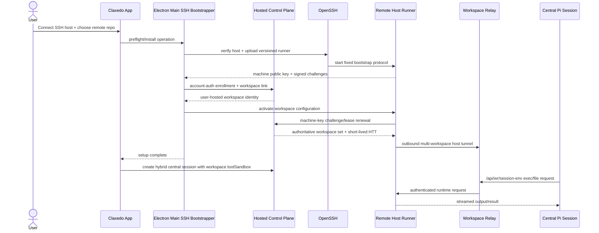

# feat: Add SSH-bootstrapped remote workspaces for cloud agents

## Overview

Add a desktop flow that connects to an existing machine over SSH, installs and enrolls a durable Claxedo remote-host runtime there, registers a repository on that machine as a `user-hosted` workspace, and then runs central cloud-agent sessions whose tool side effects execute in that remote repository.

SSH is the bootstrap, update, diagnosis, and recovery channel. It is not the per-command data plane. After bootstrap, the remote host maintains the existing outbound Workspace Relay tunnel and serves the existing `/api/wr/session-env/*` protocol. The model loop remains central; shell and file operations run on the remote host through the same `SessionEnv` contract already used for cloud sandboxes.

## Problem Frame

The repository already represents “central brain, remote hands,” but only part of that path is usable in the hosted product:

- `@claxedo/agent-sdk-runtime` supports a `hybrid` central session with a `workspace-runtime` tool sandbox.
- `packages/claxedo-server/src/session/runtime.ts` persists that placement and binds the Pi harness to it.
- `packages/claxedo-server/src/hosts/workspace-runtime/session-env.ts` maps tool operations to `/api/wr/session-env/*`.
- Workspace Relay already routes user-hosted runtime traffic over an outbound host tunnel.
- Hosted composition currently rejects every workspace-backed central session in `packages/claxedo-server/src/deployments/hosted-node/index.ts` because the session-env factory expects a concrete SQLite `Workspace` while hosted workspace authority lives in Convex.
- Existing `claxedo up` registration requires account-mediated calls on the serving machine and does not provide an SSH-first installation lifecycle.

The feature therefore is not “run `ssh host command` for every tool.” It is to close the existing hosted hybrid-session seam and add a secure SSH bootstrapper for the already-defined user-hosted runtime architecture.

Without this work, a user who already has a capable server must either move the repository into a Claxedo cloud sandbox or manually install `claxedo up` and keep account-mediated CLI state alive on that server. The intended outcome is narrower and more direct: connect an existing repository once, then use it as durable remote hands for the cloud agent with no model credentials or account bearer stored there.

## Requirements Trace

### Execution and identity

- **R1 — Central model loop:** The agent/harness session runs on the hosted central runtime; no model process or provider credential is required on the SSH host.
- **R2 — Remote tool execution:** `exec`, file reads/writes, directory operations, cancellation, timeouts, and optional session worktree admission execute in the selected remote repository through `SessionEnv` and `/api/wr/session-env/*`.
- **R3 — SSH only for lifecycle:** SSH performs preflight, first install, enrollment signing, update, diagnosis, and recovery. Normal agent turns continue after the initiating SSH connection closes.
- **R4 — Existing workspace identity:** An SSH-backed repository is persisted and rendered as `user-hosted`; no new `ssh` workspace kind or duplicate runtime protocol is introduced.

### Security and durability

- **R5 — Credential isolation:** The account bearer and SSH private key never leave the desktop-side owners. The remote stores only its own machine key and short-lived relay credentials; renderer code receives neither secrets nor a generic command-execution primitive.
- **R6 — Durable connectivity:** A headless remote-host process survives SSH disconnects, maintains the outbound relay tunnel, renews short-lived credentials with its enrolled machine key, and restarts under the remote OS service manager.
- **R7 — Fail closed:** Host-key changes, revoked enrollment, workspace-set expansion, invalid remote paths, unsupported platforms, and unavailable relay/runtime states fail explicitly. The system never silently switches a remote session to a virtual or cloud sandbox.

### User experience and proof

- **R8 — Reconnectable UX:** Existing workspace connection state is authoritative after enrollment. The UI distinguishes SSH bootstrap failure from runner offline, relay reconnecting, forbidden, and ready states, and allows safe retry or repair.
- **R9 — Verifiable end-to-end behavior:** An integration test proves that a signed central Pi session changes files and runs commands only in the SSH host’s repository, remains usable after SSH exits, and stops reaching it after revocation.

## Scope Boundaries

- The first release is a desktop-originated flow for POSIX SSH hosts. Windows SSH servers and browser-originated bootstrap are deferred.
- The initial remote service-manager target is Linux `systemd --user`; macOS `launchd` support can follow behind the same installer contract.
- Authentication uses the system OpenSSH client and the user’s existing SSH config/agent or identity file. Claxedo does not implement an SSH protocol stack or store SSH private keys/passwords.
- The remote repository already exists. Cloning over SSH is not part of the first slice; the installer validates the selected path and Git worktree.
- Direct cloud-control-plane-to-SSH connectivity, inbound ports on the remote host, SSH agent forwarding, arbitrary renderer-supplied SSH options, and per-tool SSH processes are non-goals.
- The feature does not change Workspace Relay framing, runtime access token semantics, or the `SessionEnv` operation set.

## Context & Research

### Relevant Code and Patterns

- `packages/agent-sdk-runtime/src/session-env.ts` owns `SessionStartMode`, `SessionHost`, `SandboxRef`, and `SessionEnv`. Its comment explicitly defines tool-only remote placement.
- `packages/claxedo-server/src/session/runtime.ts` is the canonical central hybrid-session owner and persists `toolSandbox` in session metadata.
- `packages/claxedo-server/src/hosts/workspace-runtime/session-env.ts` is the current bridge from `SessionEnv` to Workspace Runtime. It already handles NDJSON exec streaming, cancellation, token refresh, retry, and document hydration.
- `packages/workspace-runtime/src/routes/session-env.ts` is the authoritative command/file executor. It contains paths to registered workspace roots and kills command process groups on cancel/timeout.
- `packages/claxedo-server/src/authority/runtime-target.ts` already resolves a signed `user-hosted` workspace through `activeLocalHostLink()` and a cloud workspace through Sandbox Manager.
- `packages/claxedo-server/src/authority/http/runtime-transport.ts` already resolves a target, mints a runtime access token, and calls Relay. The hosted SessionEnv path should reuse this authority-aware mechanism instead of synthesizing a local `Workspace`.
- `packages/workspace-runtime/src/workspace-relay-host-tunnel.ts` already supports one outbound host tunnel registering multiple workspace IDs and updating its registration/token.
- `packages/claxedo-server/src/user-hosted-tunnel.ts` demonstrates composing multiple local workspaces behind one machine tunnel.
- `packages/claxedo-host-connector/src/connector.ts` and `packages/claxedo-server/src/routes/hosted/host-enrollment.ts` establish the machine-key enrollment pattern. The connector deliberately remains a client and owns no server.
- `packages/claxedo-app/src/platform/remote-access/machine-remote-access-port.ts` and desktop Host Connector IPC demonstrate the pure app port, closed Electron IPC, main-owned credential, and status-subscription pattern.
- `packages/claxedo-app/src/features/workspaces/data/workspace-connection.ts` is the single writer for ready/reconnecting/offline state; SSH code must not create a second liveness authority.
- `packages/claxedo-app/src/features/session/composer/workspace-resolver.ts` already treats `user-hosted` as remote without provisioning a cloud sandbox.
- `docs/plans/2026-08-27-145-feat-durable-local-server-daemon-plan.md` establishes that remote connectivity must outlive Electron and that host-key-authenticated renewal must remove the account bearer from steady-state liveness.

### Institutional Learnings

- No `docs/solutions/` entries matching SSH, user-hosted runtime bootstrap, or host enrollment were found. The plan therefore relies on live code contracts and the durable-daemon plan rather than undocumented precedent.
- The repository’s persistent implementation preference applies directly: fix the authoritative hosted runtime producer; do not repair the current rejection with a virtual-environment fallback or fabricated workspace record.

### External References

- OpenSSH client configuration: `StrictHostKeyChecking=accept-new` accepts a first-seen host but rejects changed keys; `BatchMode=yes`, `RequestTTY=no`, encrypted-channel keepalives, and `ForwardAgent=no` are appropriate for unattended follow-up calls. See https://man.openbsd.org/ssh_config.
- OpenSSH command behavior and remote command execution: https://man.openbsd.org/ssh.
- Node child-process guidance supports spawning an executable with an argument array and no shell; user-controlled values must not be interpolated into shell commands. See https://nodejs.org/api/child_process.html.

## Key Technical Decisions

1. **SSH bootstraps a durable runner; Relay carries runtime traffic.** This gives normal turns one transport with existing streaming, cancellation, authentication, reconnect, and routing behavior. Running every tool call through SSH would duplicate `SessionEnv`, make cloud workers depend on direct SSH reachability, and lose current Relay presence semantics.
2. **Persist the target as `user-hosted`, not `ssh`.** SSH describes how a runtime was installed, not where a session is hosted. Inventory, connection gating, relay placement, and session routing already understand `user-hosted`.
3. **Keep model placement independent from tool placement.** A central session has `host: "central"` and a `toolSandbox` pointing at the user-hosted workspace. A workspace-hosted session remains a separate existing flow.
4. **Make the SessionEnv factory depend on a runtime requester, not a concrete workspace-store row.** The local adapter can continue to resolve SQLite workspaces; the hosted adapter uses Workspace Authority, runtime target resolution, Relay, and runtime access token minting. This removes the exact impedance mismatch documented in `hosted-node/index.ts`.
5. **Use account auth only for initial enrollment, workspace linking, and explicit revoke.** Steady-state runner renewal uses one-time server challenges signed by the enrolled machine key. The server derives the allowed workspace set from canonical active host links and never accepts a client-proposed expansion.
6. **Keep the remote host composition separate from `@claxedo/host-connector`.** Create a narrow `@claxedo/remote-host` product package that composes the connector identity primitives, Workspace Runtime, and host tunnel. The existing connector’s “client only, serves nothing” contract remains intact.
7. **Use system OpenSSH behind closed desktop operations.** Electron main owns connection profiles and invokes fixed actions such as preflight/install/repair. Renderer IPC cannot pass a raw command, arbitrary option list, environment, or destination path to a generic executor.
8. **Pass remote paths and enrollment material as structured stdin to the installed helper.** The only pre-install remote shell snippets are constant, versioned bootstrap commands. This prevents repository names or paths from becoming shell syntax.
9. **Treat trust-on-first-use as an explicit user action.** The initial Connect action may use `accept-new`; the resulting host identity/fingerprint is recorded for display. A changed key is terminal and requires an explicit forget/retrust action—never `StrictHostKeyChecking=no`.
10. **No silent placement downgrade.** A remote runner/relay failure leaves the session central but makes tool operations fail with a workspace-unavailable error. It does not switch the tool sandbox to `{kind:"virtual"}` or provision a replacement cloud VM.
11. **Use the existing Pi harness choice as the cloud-agent choice on signed remote workspaces.** Pi is the only centrally dispatchable harness in `session/runtime.ts`; selecting it creates the central hybrid session. Other harnesses keep their existing workspace-hosted behavior. The composer shows an explicit summary—“Agent: Cloud · Tools: <SSH host>”—instead of adding a second generic placement selector.

## Open Questions

### Resolved During Planning

- **Where does a command run?** On the SSH host’s Workspace Runtime, not in a local client session and not by invoking SSH for each command.
- **What remains in the cloud?** The Pi/model loop, central session store, authorization, and orchestration remain in `claxedo-server`; only tool side effects cross Relay.
- **Does the SSH connection remain open?** No. A successful install starts a supervised remote process and an outbound Relay tunnel; SSH may close immediately.
- **Who owns workspace liveness in the UI?** `workspace-connection.ts`, after bootstrap has registered the `user-hosted` workspace. Installer progress is a finite setup flow, not a competing connection state machine.
- **How is a workspace associated with a remote machine?** Initial setup uses the remote machine key to satisfy the existing per-workspace local-host-link challenge. Subsequent runtime leases query those canonical links by enrolled host identity.

### Deferred to Implementation

- **Artifact format and compression:** Choose the final bundle/container format after measuring packaged size and startup on Linux x64/arm64; the contract remains a versioned artifact plus manifest and digest verification.
- **macOS remote service management:** Implement only after the Linux service-manager adapter is proven; it must satisfy the same start/status/stop contract rather than adding installer branching to shared code.
- **Connection multiplexing during install:** `ControlMaster`/`ControlPersist` may reduce repeated handshake latency, but is optional. If used, the control socket must live in a private per-operation temporary directory and be removed on completion.
- **Remote runner self-update policy:** The first slice supports explicit desktop-initiated update/repair. Automatic updates require a separate signed-release and rollback policy.

## High-Level Technical Design

> *This illustrates the intended approach and is directional guidance for review, not implementation specification. The implementing agent should treat it as context, not code to reproduce.*

The intended lifecycle is:

`unconfigured -> SSH preflight -> installed -> enrolled -> linked -> relay connecting -> ready`

Runtime loss transitions `ready -> reconnecting -> offline`; enrollment revocation and SSH host-key mismatch are terminal until explicit user action. An SSH disconnect after `installed` is not a runtime state transition.

## Implementation Units

- [ ] **Unit 1: Make hosted central SessionEnv authority-aware**

**Goal:** Allow a hosted central Pi session to bind a real cloud or user-hosted Workspace Runtime without resolving a fake SQLite `Workspace` and without falling back to the virtual environment.

**Requirements:** R1, R2, R4, R7

**Dependencies:** None

**Files:**
- Modify: `packages/claxedo-server/src/hosts/workspace-runtime/session-env.ts`
- Create: `packages/claxedo-server/src/authority/session-env-runtime-requester.ts`
- Modify: `packages/claxedo-server-core/src/platform/auth/authority.ts`
- Modify: `packages/claxedo-server/src/authority/adapters/convex/workspace-authority/workspaces.ts`
- Modify: `packages/claxedo-server-core/src/authority/adapters/sqlite/workspace-authority.ts`
- Modify: `convex/workspaces.ts`
- Modify: `packages/claxedo-server/src/deployments/hosted-node/index.ts`
- Modify: `packages/claxedo-server/src/authority/http/runtime-transport.ts`
- Test: `packages/claxedo-server/src/hosts/workspace-runtime/session-env.test.ts`
- Test: `packages/claxedo-server/src/deployments/hosted-node/index.test.ts`
- Test: `packages/claxedo-server/src/authority/http/runtime-transport.test.ts`

**Approach:**
- Extract the per-session request responsibility currently hidden behind concrete `Workspace` branching into a narrow requester factory consumed by `createWorkspaceRuntimeSessionEnv`.
- Keep a local adapter that uses `resolveWorkspace`, `localWorkspaceRuntime`, and Sandbox Manager exactly as today.
- Add an internal, service-authenticated authority resolver keyed by the persisted `sessionId + workspaceId`. It must verify that the session visibility record names that workspace before returning the canonical authority workspace and active target. The SessionEnv factory has no request bearer at bind/recovery time, so it must not synthesize user auth from `ConnectionTurnCredentials` or call a user-authenticated `openWorkspace()` with fabricated identity.
- Add a hosted adapter that consumes that server-owned resolution, validates `backing/access`, resolves the target through `resolveWorkspaceRuntimeTarget`, mints Relay runtime access tokens from the authoritative org/workspace/host identity, and caches target/endpoint/token with the existing refresh skew and one-retry bounds.
- Route both worktree admission and `/api/wr/session-env/*` through this requester so setup and normal tools share one authority path.
- Delete `hostedWorkspaceResolver()` and its `central_hybrid_virtual_tools_only` rejection only when the hosted adapter is wired and tested.

**Execution note:** Start with the hosted user-hosted failure test, then turn it into a passing integration test without weakening the virtual fallback guard.

**Patterns to follow:**
- Target selection in `packages/claxedo-server/src/authority/runtime-target.ts`.
- Runtime token/Relay request construction in `packages/claxedo-server/src/authority/http/runtime-transport.ts`.
- Cache/retry behavior in `createCloudSandboxRequester()`.

**Test scenarios:**
- **Happy path:** A hosted `workspace-runtime` sandbox for a canonical `user-hosted` workspace resolves its active host link, mints a token for that host, and sends `exec` to the Relay workspace URL.
- **Happy path:** A hosted cloud workspace still resolves through Sandbox Manager and preserves existing token-refresh behavior.
- **Integration:** Worktree admission followed by an exec uses the admitted directory and the same authority-aware requester.
- **Error path:** Missing/paused host link returns user-hosted-unavailable during session creation; the factory never returns a virtual env.
- **Security:** A service resolver request for a workspace different from the session’s persisted workspace is denied before target or token resolution.
- **Error path:** Relay token mint, target resolution, and identity-mismatch failures propagate with stable control-plane error codes.
- **Edge case:** A moved target invalidates endpoint/token once and retries once; repeated 5xx does not loop.

**Verification:**
- Hosted composition has no `central_hybrid_virtual_tools_only` branch, and both cloud and user-hosted central sessions produce a `SessionEnv` whose kind is `workspace-runtime`.

- [ ] **Unit 2: Add machine-key-authenticated runtime leases**

**Goal:** Let an enrolled headless host renew enrollment/tunnel credentials without storing an account bearer, while preventing replay and client-chosen workspace expansion.

**Requirements:** R5, R6, R7

**Dependencies:** None; required by Unit 3 activation

**Files:**
- Modify: `packages/claxedo-server-core/src/platform/auth/authority.ts`
- Modify: `packages/claxedo-server-core/src/authority/adapters/sqlite/workspace-authority.ts`
- Modify: `packages/claxedo-server/src/authority/adapters/convex/workspace-authority/host-enrollment.ts`
- Modify: `packages/claxedo-server/src/authority/adapters/convex/workspace-authority/api.ts`
- Modify: `convex/hostEnrollments.ts`
- Modify: `packages/claxedo-server/src/routes/hosted/host-enrollment.ts`
- Modify: `packages/claxedo-server/src/deployments/hosted-shared/hosted-product-contract.test.ts`
- Test: `packages/claxedo-server/src/routes/hosted/host-enrollment.parity.test.ts`
- Test: `packages/claxedo-server/src/authority/adapters/convex/workspace-authority/host-enrollment.test.ts`
- Test: `packages/claxedo-server/src/authority/adapters/sqlite/host-enrollment.test.ts`

**Approach:**
- Add a one-use runtime-lease challenge and redemption flow. The signed payload binds protocol version, host ID, request ID, nonce, and requested TTL/config revision.
- Resolve the enrollment owner from the verified host key, then derive current active local-host links and their remote directories from authority storage. The caller sends no workspace list.
- Atomically extend the machine enrollment and the server-derived active local-host links covered by the lease. Otherwise the existing per-workspace links would expire even while the machine lease remained healthy.
- Mint a short-lived Host Tunnel Token scoped to exactly that derived set and return Relay URL, expiry, configuration revision, and sanitized workspace registrations including each canonical `remote_directory`.
- Consume the challenge atomically, rate-limit challenge creation and redemption, audit allow/deny decisions, and make pause/revoke invalidate subsequent renewal.
- Keep initial enrollment and workspace-link creation account-authenticated through existing routes.

**Patterns to follow:**
- One-use challenge verification in the existing enrollment and local-host-link flows.
- Backend parity discipline in `host-enrollment.parity.test.ts`.
- Host Tunnel Token bounds in `packages/claxedo-server-core/src/platform/auth/runtime-access-token.ts`.

**Test scenarios:**
- **Happy path:** An enrolled host with two active links redeems one signed challenge and receives one HTT scoped to those two canonical workspace IDs.
- **Integration:** Redeeming the lease extends the machine enrollment and exactly the linked workspace expiries in one authority transaction; a later target resolution still sees those links as active.
- **Edge case:** Duplicate workspace links are deduplicated and sorted; config revision changes when the authoritative set changes.
- **Error path:** Replayed, expired, wrong-host, wrong-key, malformed, and already-consumed challenges fail without minting a token.
- **Error path:** A paused/revoked/expired enrollment cannot renew.
- **Security:** A signed request that includes or implies a third workspace cannot expand the server-derived set.
- **Integration:** Convex and SQLite routes return equivalent status and response shapes for every case.

**Verification:**
- A headless host can maintain Relay liveness with only its private machine key; account credentials are absent from request bodies, runner state, and logs.

- [ ] **Unit 3: Build the durable remote-host runner**

**Goal:** Produce a versioned headless artifact that owns registered remote repositories, Workspace Runtime instances, machine identity, runtime-lease renewal, and one outbound multi-workspace Relay tunnel.

**Requirements:** R2, R3, R5, R6, R7

**Dependencies:** Unit 2

**Files:**
- Create: `packages/claxedo-remote-host/package.json`
- Create: `packages/claxedo-remote-host/src/main.ts`
- Create: `packages/claxedo-remote-host/src/runner.ts`
- Create: `packages/claxedo-remote-host/src/bootstrap-protocol.ts`
- Create: `packages/claxedo-remote-host/src/identity-store.ts`
- Create: `packages/claxedo-remote-host/src/workspace-registry.ts`
- Create: `packages/claxedo-remote-host/src/service-manager.ts`
- Create: `packages/claxedo-remote-host/scripts/build.ts`
- Test: `packages/claxedo-remote-host/src/runner.test.ts`
- Test: `packages/claxedo-remote-host/src/bootstrap-protocol.test.ts`
- Test: `packages/claxedo-remote-host/src/identity-store.test.ts`
- Test: `packages/claxedo-remote-host/src/service-manager.test.ts`
- Modify: `package.json`
- Modify: `bun.lock`

**Approach:**
- Compose `@claxedo/workspace-runtime`, host-identity signing primitives, and `startWorkspaceRelayHostTunnel()`; do not copy SessionEnv routes or make `@claxedo/host-connector` serve requests.
- Persist a versioned non-secret registry mapping control-plane workspace IDs to validated absolute repository roots. Reject overlapping/conflicting registrations and paths outside the configured roots.
- Generate the host key on the remote machine. Store it in an owner-only file created atomically with strict permission checks; never print private material or accept it from desktop.
- Expose a fixed stdin/stdout bootstrap protocol for status, public identity, challenge signing, workspace activation, service install, and repair. It accepts structured records, not shell fragments.
- Run Workspace Runtime listeners on loopback only. The outbound host tunnel dispatches by canonical workspace ID to the matching runtime.
- Renew the machine runtime lease before expiry; update tunnel registration atomically; stop and report terminal status on revocation rather than re-enrolling automatically.
- Install a `systemd --user` unit with restart backoff. Service installation and activation are idempotent and version-aware.
- Preflight `loginctl` lingering. If the user service would terminate after logout, setup must stop with an actionable prerequisite instead of claiming durability; enabling linger is an explicit administrator/user action, never an implicit `sudo` operation.

**Patterns to follow:**
- Multi-workspace tunnel update semantics in `workspace-relay-host-tunnel.ts` and `user-hosted-tunnel.ts`.
- Path containment and process-group cleanup in Workspace Runtime session-env routes.
- Explicit stopped/revoked connector state in `@claxedo/host-connector`.

**Test scenarios:**
- **Happy path:** Two registered repositories start two runtime targets behind one host tunnel and dispatch by workspace ID.
- **Happy path:** SSH/bootstrap process exits while the supervised runner stays active and renews its lease.
- **Edge case:** Re-applying the same artifact/config is idempotent; applying a newer config revision atomically updates the tunnel registration.
- **Error path:** Missing/non-Git/non-directory paths, duplicate IDs, widened identity-file permissions, unsupported architecture, and corrupt registry fail before tunnel registration.
- **Error path:** A host without enabled user lingering does not report durable-ready and provides the exact remediation required by that host.
- **Error path:** Renewal network failure retries with bounded backoff while the current token is valid; expiry moves to offline; explicit revocation stops retries.
- **Security:** Bootstrap output and logs contain no private key, HTT, runtime access token, account bearer, command body, or file content.
- **Integration:** A tunneled session-env exec streams stdout/stderr and cancellation kills the remote process group.

**Verification:**
- The artifact can be installed once, survive SSH termination and a login-session exit on a host with verified user lingering, reconnect Relay after a transient outage, and shut down on revoke.

- [ ] **Unit 4: Add the desktop SSH bootstrap capability**

**Goal:** Give the desktop a safe, observable, closed operation set for preflighting, installing, registering, repairing, inspecting, and forgetting SSH remote hosts.

**Requirements:** R3, R5, R7, R8

**Dependencies:** Units 2 and 3

**Files:**
- Create: `packages/claxedo-app/src/platform/remote-host/remote-host-port.ts`
- Create: `packages/claxedo-app/src/platform/remote-host/remote-host.ts`
- Test: `packages/claxedo-app/src/platform/remote-host/remote-host.test.ts`
- Create: `packages/claxedo-desktop/src/main/remote-host/ssh-process.ts`
- Create: `packages/claxedo-desktop/src/main/remote-host/installer.ts`
- Create: `packages/claxedo-desktop/src/main/remote-host/profile-store.ts`
- Create: `packages/claxedo-desktop/src/main/remote-host/ipc.ts`
- Create: `packages/claxedo-desktop/src/renderer/remote-host/electron-remote-host-binding.ts`
- Modify: `packages/claxedo-desktop/src/preload/index.ts`
- Modify: `packages/claxedo-desktop/src/preload/types.ts`
- Modify: `packages/claxedo-desktop/src/main/index.ts`
- Modify: `packages/claxedo-desktop/scripts/package.ts`
- Test: `packages/claxedo-desktop/src/main/remote-host/ssh-process.test.ts`
- Test: `packages/claxedo-desktop/src/main/remote-host/installer.test.ts`
- Test: `packages/claxedo-desktop/src/main/remote-host/profile-store.test.ts`
- Test: `packages/claxedo-desktop/src/main/remote-host/ipc.test.ts`

**Approach:**
- Define app-level operations and status records without Electron or SSH vocabulary leaking into feature components beyond connection/profile fields the UI must render.
- Spawn system `ssh`/`sftp` with argument arrays and `shell: false`. Use `BatchMode=yes`, `RequestTTY=no`, `ForwardAgent=no`, keepalives, and no port forwarding for unattended calls.
- Resolve normal SSH features through the user’s config (including agent and ProxyJump) while allowlisting only Claxedo-owned overrides. Reject destination/option values beginning with option prefixes where applicable.
- First connection is a user-initiated TOFU step using `accept-new`; persist the resolved display identity/fingerprint. Changed host keys produce a dedicated terminal state and require explicit retrust.
- Upload only packaged, manifest-verified remote-host artifacts. Invoke fixed bootstrap actions and send paths/challenges/config over stdin.
- Persist profiles locally without SSH private key material: SSH alias/destination, port/user when explicitly structured, observed fingerprint, runner version, remote service identity, and linked workspace IDs.
- Register a closed IPC surface and pass progress events as sanitized states. Never expose a generic `run`, arbitrary command, environment, URL, or raw credential operation.

**Patterns to follow:**
- Closed operation registration in `packages/claxedo-desktop/src/main/host-connector/ipc.ts`.
- Preload narrowing and bridge validation in desktop remote-access bindings.
- Bundled child artifact verification in `packages/claxedo-desktop/src/main/host-connector/child-artifact.ts`.

**Test scenarios:**
- **Happy path:** A profile using an SSH config alias completes preflight, upload, identity signing, workspace link, activation, and status without any renderer secret.
- **Happy path:** Repair detects an already-current runner and performs only health/config reconciliation.
- **Edge case:** Hostnames, usernames, ports, IPv6, paths with spaces, ProxyJump config, and multiple concurrent profile operations remain argument-safe and are serialized per host.
- **Error path:** Missing OpenSSH, auth failure, timeout, unsupported OS/arch, insufficient disk, missing Git repo, failed service install, checksum mismatch, and changed host key produce distinct actionable stages.
- **Security:** Extra renderer arguments cannot introduce SSH options, commands, environment values, token destinations, or IPC methods.
- **Security:** Profile persistence and diagnostic logs contain no SSH key, account bearer, machine private key, HTT, or bootstrap challenge signature.
- **Integration:** Closing the setup dialog or Electron after activation does not stop the remote runner or tunnel.

**Verification:**
- The renderer can complete setup and repair through named operations, while repository search finds no generic SSH executor exposed through preload or app code.

- [ ] **Unit 5: Add the SSH remote-project setup flow**

**Goal:** Let a desktop user connect a host, select an existing remote Git repository, observe setup phases, and open the resulting canonical user-hosted workspace.

**Requirements:** R4, R5, R8

**Dependencies:** Unit 4

**Files:**
- Create: `packages/claxedo-app/src/features/workspaces/ui/dialogs/connect-ssh-project.tsx`
- Create: `packages/claxedo-app/src/features/workspaces/data/ssh-project-controller.ts`
- Modify: `packages/claxedo-app/src/features/workspaces/actions/project-actions.tsx`
- Modify: `packages/claxedo-app/src/app/routes/home.tsx`
- Modify: `packages/claxedo-app/src/features/session/ui/components/session-new-design-view.tsx`
- Modify: `packages/claxedo-app/src/features/session/ui/components/session-new-workspace-options.ts`
- Modify: `packages/claxedo-app/src/features/session/ui/controls/agent-harness-selector.tsx`
- Modify: `packages/claxedo-app/src/platform/i18n/en.ts`
- Test: `packages/claxedo-app/src/features/workspaces/data/ssh-project-controller.test.ts`
- Test: `packages/claxedo-app/src/features/workspaces/ui/dialogs/connect-ssh-project.vitest.tsx`
- Test: `packages/claxedo-app/src/features/session/ui/components/session-new-workspace-options.test.ts`

**Approach:**
- Add “Connect SSH host” alongside existing local/cloud project entry points only when the remote-host port is bound (desktop capability). Do not show a dead option on web.
- Collect SSH alias/destination and absolute remote repository path, explain the one-time host trust action, and show ordered phases: connecting, verifying host, checking repository, installing runner, enrolling machine, linking workspace, starting Relay, checking runtime, ready.
- On success, consume the control plane’s canonical workspace ID/directory and refresh project inventory. Do not invent a temporary project/workspace row in the client.
- Render the result with the existing `user-hosted` pin and Workspace Connection gate. Update the offline copy to offer “Repair SSH connection” for SSH-origin profiles and retain `claxedo up` guidance for other user-hosted workspaces.
- Preserve the existing invariant that a user-hosted workspace cannot enter cloud-provisioning or local-worktree creation branches.
- For a signed user-hosted workspace, label Pi as the cloud agent and show “Agent: Cloud · Tools: <SSH host>” before submit. Do not expose a placement control for harnesses that cannot run centrally.
- Keep focus inside the setup dialog, expose progress/error changes through an `aria-live` region, associate every field/error with accessible labels, and return focus to the invoking action on cancel or completion. The ordered phases must remain readable without color or animation.
- Treat cancellation by phase: before authority mutation, remove temporary upload state; after enrollment or workspace link, preserve the canonical partial state and route the next attempt through repair/reconciliation rather than creating a second identity or workspace.

**Patterns to follow:**
- Cloud project setup progression in `create-cloud-project.tsx`.
- Capability-bound operations in machine remote access.
- Canonical user-hosted selection behavior in `session-new-workspace-options.ts`.

**Test scenarios:**
- **Happy path:** Desktop capability present -> form submits -> ordered phases render -> canonical inventory refresh opens `/w/:workspaceId`.
- **Edge case:** Existing profile and already-linked workspace offer reconnect/repair instead of duplicate creation.
- **Error path:** Bootstrap failure preserves entered non-secret fields and offers retry; changed host key requires explicit retrust; account sign-out blocks enrollment without losing SSH preflight result.
- **UX state:** Loading, cancellation-before-activation, partial enrollment, runner-offline-after-activation, forbidden, and ready states have one unambiguous next action.
- **Accessibility:** Keyboard-only submit/cancel/retry/retrust preserves focus order, progress announcements are voiced once, and error meaning does not depend on color.
- **Parity:** Web/local browser builds do not expose the SSH action, and existing cloud/local creation behavior remains unchanged.
- **Placement clarity:** Selecting Pi shows cloud-agent/SSH-tools placement; selecting another harness removes that summary and preserves workspace-hosted creation.

**Verification:**
- A successfully connected project appears from server inventory as exactly one `user-hosted` workspace and uses the existing workspace connection authority thereafter.

- [ ] **Unit 6: Create signed central sessions with remote tool placement**

**Goal:** When a user chooses the cloud Pi agent in an SSH-backed workspace, create a signed central `hybrid` session whose `toolSandbox` is that user-hosted Workspace Runtime.

**Requirements:** R1, R2, R4, R7

**Dependencies:** Units 1 and 5

**Files:**
- Modify: `packages/claxedo-server/src/session/routes/control-plane-session.ts`
- Modify: `packages/claxedo-server/src/session/runtime.ts`
- Modify: `packages/claxedo-server/src/central-runtime.ts`
- Modify: `packages/claxedo-server-core/src/platform/auth/authority.ts`
- Modify: `packages/claxedo-server/src/authority/adapters/convex/workspace-authority/sessions.ts`
- Modify: `packages/claxedo-server-core/src/authority/adapters/sqlite/workspace-authority.ts`
- Modify: `convex/sessions.ts`
- Modify: `packages/claxedo-app/src/platform/runtime/agent/workspace-control-routes.ts`
- Modify: `packages/claxedo-app/src/features/session/harness/harness-runtime-session-actions.ts`
- Modify: `packages/claxedo-app/src/features/session/harness/harness-config-store.ts`
- Modify: `packages/claxedo-app/src/features/session/composer/ui/submit-create-session.ts`
- Modify: `packages/claxedo-app/src/platform/identity/session-ref.ts`
- Test: `packages/claxedo-server/src/session/routes/control-plane-session.test.ts`
- Test: `packages/claxedo-server/src/session/runtime.test.ts`
- Test: `packages/claxedo-app/src/features/session/harness/harness-runtime-session-actions.test.ts`
- Test: `packages/claxedo-app/src/features/session/composer/ui/submit-create-session.test.ts`
- Test: `packages/claxedo-app/src/platform/runtime/agent/agent-runtime-client.test.ts`

**Approach:**
- Permit signed `POST /api/control/sessions` only after authenticating the actor, opening the requested workspace through authority, validating that `workspaceId` and `toolSandbox.workspaceId` are identical, and confirming an available runtime target.
- Require a mutation-capable workspace/session role for both central-session creation and message submission. If the existing authority exposes only `authorizeSessionRead`, add the corresponding write/execute authorization rather than treating read access as permission to mutate a remote repository.
- Persist only the canonical workspace placement returned by the server. Ignore/reject caller-supplied host ID, Relay URL, directory outside admitted worktree data, role, or token material.
- Add a central-session creation branch to the harness prepared-session action for Pi on a signed remote workspace; leave workspace-hosted harness creation unchanged for other harnesses.
- Return and promote a `SessionRef` with `host: "central"` and `toolSandbox: {kind:"workspace", hosting:"user-hosted", workspaceId}`. Do not use `workspaceBackedSessionRef()`, which intentionally means the session itself is workspace-hosted.
- Keep every subsequent message authorized against persisted session/workspace identity, while the bound SessionEnv requests the remote runtime through Unit 1’s server-owned requester.
- Preserve idempotent create semantics so submit retries cannot create duplicate central sessions or divergent placements.

**Patterns to follow:**
- Loopback hybrid creation validation in `control-plane-session.ts`.
- Placement persistence/recovery and divergent-placement rejection in `session/runtime.ts`.
- Central `SessionRef` routing in `submit-transport.ts` and `agent-runtime-client.ts`.

**Test scenarios:**
- **Happy path:** Signed owner creates central Pi + user-hosted tools; response placement, persisted metadata, and promoted `SessionRef` all agree.
- **Happy path:** A prompt’s exec reaches the remote Workspace Runtime while message/event/session reads remain central.
- **Edge case:** Idempotent retry with the same session ID/placement returns the same session; a different workspace or sandbox kind conflicts.
- **Error path:** Missing auth, unauthorized workspace, unavailable host, non-Pi central harness, workspace/sandbox ID mismatch, and client-supplied host metadata are rejected before session persistence.
- **Security:** A read-only shared user may inspect an authorized session but cannot create it against the workspace or submit a tool-running turn.
- **Error path:** Remote tool failure is surfaced on the turn and does not mutate placement or start cloud provisioning.
- **Recovery:** Restarting the central runtime reconstructs the same workspace tool sandbox and resumes routing after the user-hosted tunnel reconnects.
- **Regression:** Existing persisted workspace-hosted Pi sessions retain their recorded placement; only new signed remote Pi sessions use the new central creation branch.

**Verification:**
- The session inventory and UI identify the session as central, while an observable file mutation lands only in the remote repository.

- [ ] **Unit 7: Prove lifecycle, security, and rollout behavior end to end**

**Goal:** Qualify the complete feature across SSH bootstrap, machine enrollment, Relay, central session execution, disconnect/reconnect, repair, and revoke.

**Requirements:** R3, R5, R6, R7, R8, R9

**Dependencies:** Units 1–6

**Files:**
- Create: `packages/claxedo-desktop/scripts/ssh-remote-workspace-smoke.ts`
- Create: `packages/claxedo-server/src/ssh-remote-central-session.e2e.test.ts`
- Modify: `packages/claxedo-app/e2e/playwright/core-workspace-connection.spec.ts`
- Modify: `packages/claxedo-server/src/deployments/hosted-shared/hosted-product-contract.test.ts`
- Modify: `packages/claxedo-app/src/platform/runtime/workspace-runtime-route-audit.test.ts`
- Modify: `script/product-boundary/products.json`
- Modify: `public-docs/relay-and-deployment.md`
- Create: `public-docs/ssh-remote-workspaces.md`

**Approach:**
- Build a hermetic SSH fixture with a disposable POSIX user, known host key, repository sentinel files, and no access to the local/cloud fixture roots.
- Exercise the public desktop operation and signed control-plane routes rather than calling internal runner methods.
- Record sanitized operational signals: bootstrap stage, runner version, enrollment state, lease-renewal age, Relay presence, workspace connection state, and tool request correlation. Explicitly denylist secrets and prompt/file contents from logs.
- Roll out behind one server capability plus one desktop artifact capability. The app shows the entry point only when both are available; enrolled workspaces continue to function across a desktop upgrade.
- Run each affected product closure verification and the architecture ratchet because the new product package and production imports alter dependency reachability.

**Test scenarios:**
- **End to end:** Connect fixture -> close SSH -> create central Pi session -> run `pwd`/write/read -> assert results and file exist only on remote root.
- **Reconnect:** Terminate Relay connection, observe reconnecting/offline, restore it, and complete the next tool call without changing session placement.
- **Restart:** Restart remote runner and central server independently; persisted workspace/session identity routes correctly after both recover.
- **Revoke:** Revoke enrollment during an idle and an active session; new lease/tunnel access stops, the UI becomes terminal/offline, and no automatic re-enrollment occurs.
- **Host trust:** Replace the SSH fixture host key; repair hard-fails until explicit retrust.
- **Isolation:** Two accounts, hosts, and workspaces cannot cross-register, mint, route, read, or execute.
- **Security:** Scan process arguments, environment, state files, HTTP bodies, and logs for all credential classes.
- **Regression:** Existing local sessions, workspace-hosted user-hosted sessions, central virtual sessions, and cloud-sandbox central sessions retain their original paths.

**Verification:**
- The public flow satisfies R9, affected product closure checks and `test:architecture-ratchets` pass with reviewed exact ceilings, and docs describe installation, repair, revocation, and security behavior.

## System-Wide Impact

- **Interaction graph:** Project action -> app remote-host port -> desktop closed IPC -> OpenSSH/bootstrap protocol -> account-auth enrollment/workspace link -> remote machine-key lease -> Relay host tunnel -> Workspace Connection -> signed hybrid session creation -> central Pi -> SessionEnv -> remote Workspace Runtime.
- **Error propagation:** Bootstrap errors return finite setup stages; steady-state runner/Relay errors flow through existing workspace connection status; tool-operation errors flow through SessionEnv into the active turn. No layer converts an unavailable remote workspace into successful virtual execution.
- **State lifecycle risks:** Partial install, enrollment without link, link without activation, stale config revision, duplicate retries, token expiry during reconnect, central restart, and revoke racing renewal must all have explicit idempotent transitions. The control plane owns workspace/link/enrollment truth; desktop owns SSH profiles; remote runner owns machine key/runtime process state; the app owns only presentation and connection projection.
- **API surface parity:** Convex and SQLite authority adapters must remain behaviorally identical. Desktop gets the SSH bootstrap port; web intentionally has no equivalent. Existing self-hosted HTTP machine-publication behavior remains unchanged.
- **Integration coverage:** Unit tests cannot prove artifact upload, OS service survival, Relay routing, or central-to-remote filesystem mutation; Unit 7 owns these public-boundary proofs.
- **Unchanged invariants:** `SessionEnv` remains the only agent tool-placement contract; Workspace Runtime remains the command/file authority; Relay remains outbound-only for user-hosted machines; `user-hosted` remains the inventory kind; SSH private keys remain owned by OpenSSH; `workspace-connection.ts` remains the sole liveness writer.

## Alternative Approaches Considered

- **Run every tool command over SSH:** Rejected because it duplicates SessionEnv, requires cloud-to-host SSH reachability and credentials, and loses the existing Relay authentication/reconnect/streaming model.
- **Keep one long-lived SSH tunnel from desktop:** Rejected because closing the laptop/app would stop remote sessions and make the desktop a mandatory data-plane hop.
- **Install `claxedo up` and store an account token remotely:** Rejected because an account bearer would become a steady-state server secret and revocation/rotation would couple runner liveness to user login.
- **Deploy full `@claxedo/local-server` remotely:** Rejected for the tools-only target because that product also owns local harness, provider, credential, session, PTY, and desktop-side routes. A narrow remote-host composition reuses Workspace Runtime without asking the remote machine to become a second model/session control plane.
- **Represent SSH as a fourth workspace kind:** Rejected because transport provenance would leak into every inventory, placement, and connection branch even though runtime behavior is already exactly `user-hosted`.
- **Resolve a synthetic local `Workspace` in hosted SessionEnv:** Rejected by repository policy and correctness: the authority workspace is canonical, and a fabricated row could drift in org, access, host, directory, or region.
- **Expose a generic SSH command bridge to the renderer:** Rejected because it turns Electron main into a credential-bearing confused deputy and makes input validation unbounded.

## Success Metrics

- A user can connect an existing Linux repository and start a central cloud-agent turn without installing model credentials remotely.
- After setup, zero normal agent tool calls invoke the `ssh` executable.
- Closing the SSH setup process and Electron does not end the runner or active Relay registration.
- Host revocation prevents the next renewal and produces no automatic re-enrollment.
- Central session metadata, runtime routing, and UI all retain one canonical workspace ID and `user-hosted` kind.
- No account bearer, SSH private key, machine private key, HTT, or runtime access token appears in renderer state, command-line arguments, logs, or non-secret profile storage.

## Dependencies / Prerequisites

- Hosted deployments must have Workspace Authority, Relay provider, runtime access token signer, and Host Tunnel Token signer configured.
- Desktop packages must include a verified remote-host artifact for each supported remote OS/architecture.
- Remote hosts need outbound HTTPS/WebSocket access to the configured Relay and a functional system OpenSSH server; no inbound Claxedo port is required.
- Linux hosts using the first-release `systemd --user` adapter must have user lingering enabled so the runner survives logout; setup detects and reports this prerequisite but never elevates itself.
- The current dirty worktree contains related session/runtime changes. Implementation must preserve user-owned edits and rebase each unit on the then-current canonical contracts.

## Risk Analysis & Mitigation

| Risk | Likelihood | Impact | Mitigation |
|---|---:|---:|---|
| SSH host impersonation during first connection | Medium | High | Explicit TOFU action, record/display fingerprint, reject changed keys, provide deliberate retrust only |
| Renderer turns main into an SSH confused deputy | Medium | High | Closed operations, strict schemas, no raw command/options/env, sender guard, structured stdin |
| Stolen remote machine key expands access | Low | High | Owner-only storage, one-use signed challenges, server-derived workspace set, short HTT TTL, immediate revoke |
| Hosted SessionEnv bypasses workspace authorization | Medium | High | Authorize signed creation, persist canonical workspace, authorize every message/session access, server-owned target/token resolution |
| Partial setup leaves orphan authority or remote state | Medium | Medium | Idempotency keys, explicit phase record, repair/reconcile operation, canonical server inventory, no client-synthesized row |
| Runner update interrupts active commands | Medium | High | Explicit updates in first slice, readiness check before activation, service-manager rollback to previous verified artifact |
| Relay outage is mistaken for SSH failure | Medium | Medium | Separate finite installer status from Workspace Connection state and show runner/lease/relay diagnostics distinctly |
| New package expands product closures unexpectedly | High | Medium | Keep remote-host dependency surface narrow, verify each affected product closure, adjust only exact measured ceilings with adjacent rationale |
| Shell injection through remote path/profile | Medium | High | Spawn without local shell, fixed remote commands, structured stdin, strict absolute path validation, no renderer options |
| Multiple workspaces route to wrong root | Low | High | Canonical registry keyed by workspace ID, per-request identity verification, path containment, cross-workspace integration tests |

## Phased Delivery

### Phase 1 — Runtime plane

- Land authority-aware hosted SessionEnv routing and signed central user-hosted placement behind a disabled capability.
- This can be tested with the existing user-hosted tunnel fixtures before SSH exists.

### Phase 2 — Headless host and lease

- Land machine-key runtime leases, remote-host runner, artifact build, and hermetic runner/Relay integration coverage.

### Phase 3 — Desktop bootstrap and UX

- Land closed SSH operations, project connection flow, repair/retrust UX, and inventory integration.

### Phase 4 — Qualification and rollout

- Run the live SSH/Relay/central-session smoke matrix, enable the capability for internal users, observe renewal/reconnect failures, then expand availability.

## Documentation / Operational Notes

- Document supported client/remote platforms, required outbound destinations, SSH config compatibility, first-use trust, service location, runner data location, repair, update, revoke, and uninstall.
- Add diagnostics that identify host/profile/workspace/runner versions and timestamps but redact all credential and content classes.
- Alert on lease-renewal failures, repeated runner restarts, Relay registration churn, hosted SessionEnv target mismatches, and signed session-create denials.
- Uninstall must stop/disable the remote service and remove runner artifacts/config. Deleting the machine identity is a separate explicit revoke/forget action because it is security-significant and irreversible.

## Sources & References

- Related plan: `docs/plans/2026-08-27-145-feat-durable-local-server-daemon-plan.md`
- Session placement contract: `packages/agent-sdk-runtime/src/session-env.ts`
- Central session owner: `packages/claxedo-server/src/session/runtime.ts`
- Workspace Runtime SessionEnv bridge: `packages/claxedo-server/src/hosts/workspace-runtime/session-env.ts`
- Hosted rejection to replace: `packages/claxedo-server/src/deployments/hosted-node/index.ts`
- Authority target routing: `packages/claxedo-server/src/authority/runtime-target.ts`
- Relay runtime transport: `packages/claxedo-server/src/authority/http/runtime-transport.ts`
- Remote execution routes: `packages/workspace-runtime/src/routes/session-env.ts`
- Host tunnel client: `packages/workspace-runtime/src/workspace-relay-host-tunnel.ts`
- Machine enrollment route: `packages/claxedo-server/src/routes/hosted/host-enrollment.ts`
- App connection authority: `packages/claxedo-app/src/features/workspaces/data/workspace-connection.ts`
- OpenSSH client configuration: https://man.openbsd.org/ssh_config
- OpenSSH client: https://man.openbsd.org/ssh
- Node child processes: https://nodejs.org/api/child_process.html
