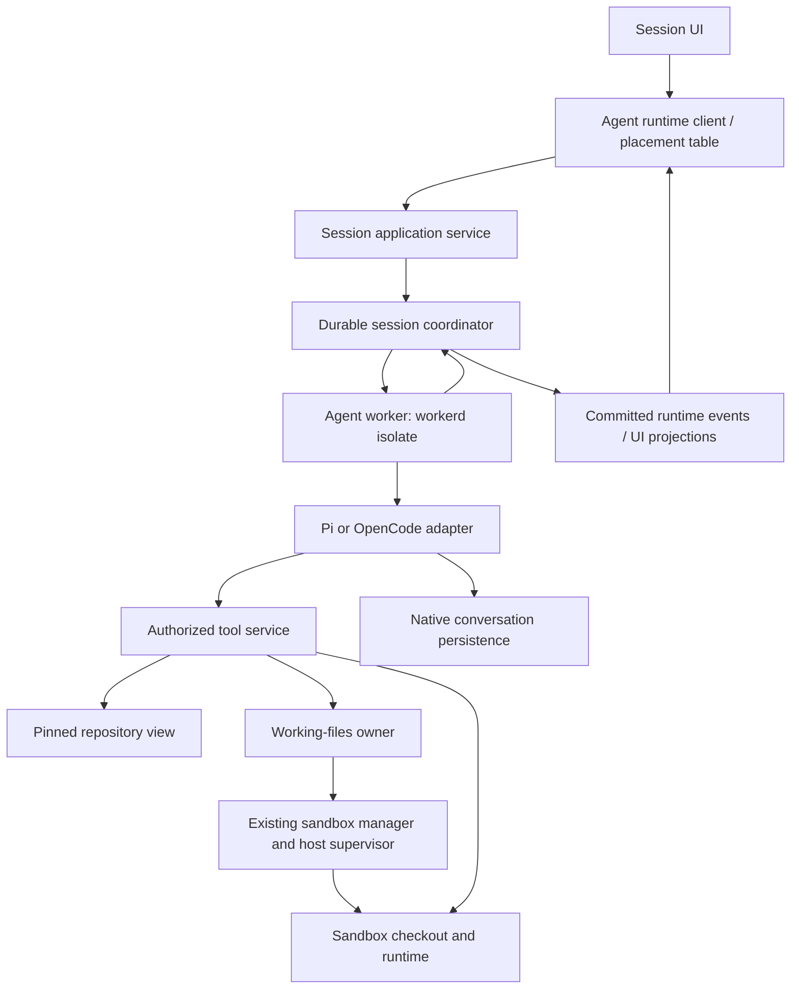

# workerd agents: bootless chat with coding environments on demand

Status: superseded by 2026-09-05-004 (central/VM split removed by owner decision, 2026-09-05). Retained as history.
Revision note: [Reviewed plan 002](./2026-09-05-002-pi-worker-runtime-and-gateway-plan.md) supersedes this document's proposed runtime, extension host, machine-tool bridge, promotion and delivery. Retain the current-code analysis and Cloud Worker/Sandbox composer/defaults. Under 002, Worker code extensions are unavailable, machine work runs in a Sandbox child, and explicit one-way promotion is a new exception to fixed placement. Conflicting proposals below are retained as design history, not parallel implementation requirements.
Date: 2026-09-05.
Code baseline: `eefd4a8777`. Source anchors were inspected in this checkout.

## 1. Decision

Keep workspace-less chat. In the existing composer's **Cloud** destination, offer exactly two agent placements: **Worker** (workerd) and **Sandbox** (the full harness in a cloud machine). Pi and OpenCode each have a saved default placement, subject to demonstrated runtime capabilities. A Worker session attaches a coding environment only when a tool needs one; that does not create a third “Hybrid” mode.

Separate three facts that currently overlap:

| Fact | Meaning | Lifetime |
|---|---|---|
| Agent execution | Where the harness runs: workerd or sandbox | Bound to the session; no automatic migration |
| Working files | No repository, a pinned repository snapshot, or a checkout | Independent of whether compute is running |
| Compute | Unallocated, starting, running, suspending, suspended, or failed | Acquired when a tool needs execution |

**Worker means workerd in this design.** It is a concrete JavaScript/Wasm runtime constraint. The hosted target is Cloudflare Workers; a self-hosted deployment would also need to run workerd and supply the required storage, scheduling and isolation services. A Node process running Pi does not meet worker-mode acceptance. “Bootless” means no dedicated coding machine is provisioned before chat; model execution and tool services still consume compute. [U10]

Use Web-standard APIs, supported bindings and an explicit compatibility date/flag set. Node compatibility is a subset with some unsupported/stubbed APIs; successful imports do not prove execution works. Workers' virtual filesystem is not a durable repository checkout or an operating-system toolchain. Persist conversation and extension state through durable services, not `/tmp` or module globals. [U5, U6]

The recommended first delivery supports chat, plugins, restricted code-mode tools, repository inspection, and lazy checkout creation for coding. Editing a repository without compute is a separate extension described in section 7; it is not required to ship the first version.

Keep **Cloud** as the destination and show **Worker / Sandbox** as its placement choice in the existing composer. Use **Repository** and **Coding environment** for the attached resources. Defaults make ordinary sending require no repeated placement decision.

Companion: Chat, tools, and coding environments — draft user guide (draft guide retired with the superseded proposal; see git history). It explains the machine as a tool and the proposed extended-Pi worker setup. Both documents describe the target experience, not currently shipped features.

## 2. What the code does today

The following is observed source behavior, not a claim of deployed acceptance. Bracketed references point to the source inventory in section 12.

### A. A caller creates a central Pi session

**A.1 `ControlPlaneSessionRoutes` → `POST /api/control/sessions`.** The route requires `mode: "hybrid"`, validates the harness and model, and calls `createHybridSession()`. A signed caller must supply `workspaceId` and pass workspace authorization. Local loopback creation can be workspace-less. MCP's session creation tool uses this route. [S1, S2]

**A.2 `createHybridSession()` → session binding and metadata.** It validates the model, optionally admits a workspace worktree, binds `PiHarnessAdapter`, binds the memory runtime store, and persists metadata with `host: "central"`. The session's organizational workspace and its tool workspace may differ. Placement is also held in the `sessionPlacements` map. The function publishes session information and creation telemetry. [S3]

**A.3 `createCentralSessionRuntime()` → one Pi runtime.** It constructs `PiHarnessAdapter`, registers it with `createAgentRuntime()`, and wires session routes, connection credentials, metering, wakes, and subagents inside a 1,316-line module. The 228-line `central-runtime.ts` composes the HTTP/auth wrapper. The concrete composition inspected is `deployments/self-hosted-node/app.ts`; this is not proof that the same harness executes in hosted workerd. [S3, S4, S5]

### B. The user sends a message

**B.0 New-session controls → draft defaults.** `session-new-design-view.tsx` builds project, environment and worktree context chips. Its Cloud option currently says “Runs in a Claxedo sandbox,” and its creation action says “New cloud sandbox.” `newSessionEnvironmentOptions()` restricts hosted web to Cloud when enabled; desktop can also offer Local. User-hosted routes have a separate pinned-workspace presentation. There is no Worker/Sandbox placement control here today. `DraftTarget` carries workspace kind and optional harness, but no independent agent placement. [S26]

`createDraftDefaultPreferences()` currently stores the last harness and each harness's model in `byHarness`, scoped by server and workspace. `resolveDraftDefault()` checks model/harness eligibility; its existing `placementDefault` is a replacement harness/model pair, not a saved Worker/Sandbox choice. `shouldApplyDraftDefault()` guards against late hydration overriding explicit or server-owned state. Existing session configuration is authoritative over draft preferences. These are the owners to extend for placement; do not add a second preference system. [S27]

**B.1 Composer → session target and transport.** `acquireSubmitSessionTarget()` delegates to target creation. The signed branch reserves a private session against a required workspace. The harness branch claims a harness session; the other branch creates an OpenCode session. The transport adapter separately selects central, loopback, and workspace routes. The normal submit flow manages optimistic messages, worktree readiness, and event stream readiness. This is a distinct UI path from MCP's explicit hybrid-create endpoint. [S6, S7]

**B.2 `centralRuntimePath()` → central HTTP route.** An existing `SessionRef.host === "central"` rewrites session paths under `/api/control`. `centralRuntimeAccess()` checks signed session access, including the workspace requirement. `runTurn()` establishes the current credential context before dispatch. [S4, S7]

**B.3 Shared session routes → `createAgentRuntime()` → `PiHarnessAdapter.sendMessage()`.** The shared route parses the prompt and runs the runtime turn machinery. Pi resolves its model backend, creates or refreshes an `Agent` from `pi-agent-core`, and invokes it. This integration assembles an agent from the lower-level core; it is not currently the full Pi coding-agent SDK integration. [S8, S9, S10]

**B.4 Pi's bash tool → `SessionEnv.exec()`.** `createClaxedoSessionEnvFactory()` chooses `just-bash` with `InMemoryFs` or `createWorkspaceRuntimeSessionEnv()`. The latter sends execution/file requests through the existing workspace client to `/api/wr/session-env/*`, carries the active turn credential, and decodes command output. Unknown workspaces and protocol failures throw; hydration-sync failures have a separate reporting path. [S11, S12]

**B.5 Events → persistence and UI.** Pi events are translated into runtime events. Shared runtime/turn code maintains the turn lifecycle. Central `publishGlobal()` feeds live events, metering, session-title updates, and the durable message log. Transcript reads use the projection store. These responsibilities must remain ordered and attributable when extracted. [S3, S8, S9, S10]

### C. The process restarts or tool placement changes

**C.1 Recovery.** `ensureCentralRuntimeSession()` reloads metadata, model, and tool placement and binds a fresh adapter session. `bindSession()` initializes an empty adapter message list. The inspected path does not restore Pi's native conversation into the new `Agent`; Pi's goal code explicitly marks an active goal blocked when its conversation state is unavailable after restart. A visible persisted transcript is therefore not proof of recovered model context. [S3, S9]

**C.2 Placement swap.** `updateSessionPlacement()` refuses a swap during an active turn, creates the next environment, replaces the bash tool's environment, and disposes the previous one. It preserves the live agent object. It does **not** export virtual files, copy edits, or validate a destination checkout. The HTTP placement route also persists metadata, but it does not supply a filesystem migration protocol. [S3, S9]

**C.3 Workspace Pi.** The workspace runtime registry constructs the same `PiHarnessAdapter` and can supply a model backend. That registration does not inject a workspace `createEnv`; the adapter defaults to the virtual environment. Selecting the Pi runner is not sufficient evidence of full native coding execution. [S9, S13]

### D. Why the current model is difficult to follow

- `SessionRef` combines `host`, optional workspace, tool sandbox, directory, and harness. The runtime's sandbox union and the frontend's sandbox union use different shapes. Routing must interpret those combinations. [S11, S14]
- Directory-less support is explicitly tied to Pi through `isDirectorylessPiSession()` and `supportsSessionDirectory()`. The runtime client rejects other central sessions without a directory. [S14, S15]
- Runtime placement already has an owner, `placement-table.ts`, but the composer and runtime client still carry special central path handling. The rewrite should finish consolidation there instead of adding another routing helper. [S7, S15]
- Live Pi state, runtime state, placement metadata, and transcript projections have different jobs, but the large composition function coordinates their updates directly. [S3, S9]
- The existing Environment card already exposes repository, changes, files, and processes. Reuse that surface instead of adding a separate “worker mode” UI. [S16]
- `@claxedo/agent-extensions` already owns discovery, desired installs, locks, integrity, trust and materialization. Its current harness targets are OpenCode, Claude, Codex and Cursor; its install scopes are project/workspace/machine. Pi extension assets and workspace-less owner/session installs are missing. Extend this owner rather than building a second Pi package manager. [S23]
- The hosted workerd core has an explicit static composition/resource boundary. `WakeLane` demonstrates durable alarm-driven scheduling; it does not currently establish Pi turn execution in workerd. The file named `test-worker-stream.ts` is a scripted model-stream helper, not a workerd integration test. Existing build/smoke gates prove certified Worker artifacts load and fail closed, not that a Pi conversation runs there. [S24, S25]

The earlier measured footprint was 1,810 lines of Pi integration, 1,544 of central composition, and 1,399 around tool environments, plus 3,612 adjacent test lines. Those are physical lines including comments/blanks, not a deletion estimate. Shared session, environment, and Pi code remains useful in the target architecture.

## 3. UX: Cloud placement in the existing composer

### Choose where the harness runs

Extend the current environment/context controls and harness selector. Cloud remains the destination; **Worker** and **Sandbox** are placements within it. Do not add Hybrid, a separate worker destination alongside Cloud, or a second session-creation screen. Desktop Local and pinned user-hosted flows retain their existing meaning.

Conceptual composer states, not implemented layouts:

```text
[Cloud] [Pi · selected model]       [Worker ▾]  [Attach repository]
[Cloud] [OpenCode · selected model] [Sandbox ▾] [Choose sandbox]
```

| Cloud placement | Harness and extensions | Machine startup | Composer context |
|---|---|---|---|
| Worker | Separate workerd execution isolate | Only when a coding tool requests it | Repository optional; no required workspace or sandbox selection |
| Sandbox | Selected cloud sandbox | Required before the harness can respond | Select/reuse a sandbox or create one; repository remains optional |

Change the Cloud option's existing sandbox-specific description to describe cloud execution. Keep “New cloud sandbox” in the Sandbox branch. For Worker, make project/repository context optional and remove mandatory worktree provisioning from submit; merely hiding its chip would still boot a machine through today's resolver. A plain Sandbox chat can create an empty environment without cloning a repository. An already provisioned sandbox can be reused through the existing selection flow. [S6, S26]

### Remember placement separately for Pi and OpenCode

Add **Default cloud placement: Worker / Sandbox** to each harness's existing configuration/default controls. Reuse `byHarness` in `draft-defaults.ts` for the preference rather than creating an independent placement store. The composer displays the resolved choice and lets the user override it for the current draft. Provide **Use as default for Pi** or **Use as default for OpenCode** as an explicit action; changing this draft's placement alone does not change future chats. [S27]

Today preferences require a workspace scope. Extend the same preference owner with a real authenticated owner scope for workspace-less drafts, distinct from a workspace key; do not invent a workspace. Within an existing workspace, retain its existing scope and harness slot. State that scope in the default action so a user knows whether it applies to their workspace or workspace-less chats. Placement defaults remain preferences, not authority or tool grants.

Resolve placement once for a new draft: explicit draft selection → saved placement for that scope and harness → declared supported product default. Recommend Worker as the product default once that harness passes workerd acceptance; until then, only a verified Sandbox placement may be the declared default. An explicitly selected or saved unavailable placement stays visible with its reason and blocks send until the user changes it. Never reinterpret an unavailable Worker choice as permission to start a sandbox.

Switching Pi/OpenCode resolves the selected harness's own default unless the user already made an explicit placement selection for that draft; then preserve and validate that selection. Late preference or capability responses cannot overwrite an explicit choice. Sending transmits the chosen placement as intent, the server validates it and persists the authoritative session placement before execution. Existing sessions display their stored placement; later default changes cannot move them. Reuse the current authority/revision guard and headless routing owner. [S15, S27]

Availability is checked for the selected harness, model, extension configuration and deployment. OpenCode embedding being planned is not proof of workerd support. A native-only Pi extension makes Worker unavailable for that configuration, with an explicit Sandbox choice; it never triggers an automatic placement change.

### Start a chat

With Worker selected or restored from defaults, the user opens New chat, chooses an available model/harness if needed, and sends. There is no required workspace chooser, repository bootstrap, or coding-machine status gate. With Sandbox selected, the same composer prepares or connects the chosen sandbox before starting the harness. Missing credentials produce a model connection action before execution; an unsupported harness is not silently replaced.

The session has an authenticated personal or organization owner from creation. It does not need a fake workspace or synthetic directory to fit authorization or frontend APIs. Team access is explicit session participation until a real workspace association is added.

The same session identity, URL, transcript, and draft survive environment attachment. The picker shows supported placements for each harness; a harness may support Sandbox before Worker. An unavailable embedded OpenCode capability is labeled unavailable, not emulated through a different harness.

### Ask about a repository

The user attaches a repository and branch. The backend verifies repository access and resolves that branch to an immutable commit. The Environment card shows the repository and a short revision with **Repository attached**. Read/search tools use that revision; no machine boots.

The first version provides read-only inspection. If the user asks for an edit, test, package install, terminal, or application preview, the appropriate tool requests a coding environment. Repository attachments are data: they do not authorize running repository-supplied extensions, hooks, or install scripts.

### Begin coding

The tool service checks the saved execution policy. If compute use is already allowed, it starts the selected environment. If required configuration or a grant is missing, it presents one concrete action, such as **Choose environment** or **Allow environment startup**, with the relevant resource/cost context. It does not ask again for an existing grant.

The Environment card changes to **Starting coding environment**, with expandable provisioning detail. The conversation stays visible. Once the exact checkout is verified, the backend publishes **Coding environment ready**, and the waiting tool executes.

The card reuses the existing Files, Changes, and Processes affordances. Environment selection is available there or in settings; no `central`, `hybrid`, lease epoch, or driver terminology is required in the normal chat flow.

### Failure, cancel, and suspension

| Situation | User-visible behavior | Backend rule |
|---|---|---|
| Startup fails | Chat remains open; card shows the cause and Retry | Retry the same preparation operation; do not switch provider/location silently |
| User cancels startup | Pending coding action stops; prompt/history remain | Cancel or reconcile the owned preparation; never delete another session's resources |
| Compute is suspended | Card says Suspended; Resume is available | Retain verified storage/checkpoint; a tool needing compute may resume under the saved policy |
| Agent worker disconnects | Reconnecting or Interrupted on the conversation | Recover the harness from durable native state; never claim an active turn survived without evidence |
| Sandbox connection drops | Coding tool reports interruption or uncertain completion | Do not repeat an unknown side effect; reconnect and inspect its operation identity |
| Access is revoked | Protected resources and actions become unavailable | Recheck authorization on reconnect and subsequent operations |

Worker connectivity, turn activity, and coding-environment status are separate facts. A suspended machine does not mean a worker conversation is disconnected. A ready machine does not mean an agent turn is running. Live checkout reads cannot silently return an old repository snapshot while compute is unavailable; explicitly labeled historical views may remain readable.

### Run the whole harness in a sandbox

Select **Cloud → Sandbox** in the same composer. The harness, native extensions, native session storage, and coding tools run in that sandbox. The same app session API reaches that host through the existing authorized runtime transport. This is one of the two placements, not a separate advanced mode or a requirement to bring a user-hosted machine.

This placement is chosen before session execution. Attaching coding compute to a worker session does not relocate the harness. Cross-location continuation is a separate explicit handoff with adapter-supported state transfer; it is not part of the first rewrite. If the chosen host is unavailable, the session remains unavailable rather than moving to a worker.

After Worker requests compute, the composer still identifies **Cloud · Worker** and the Environment card reports the machine's state. For **Cloud · Sandbox**, suspending that machine also makes the harness unavailable until resume. There is no Hybrid label in either flow.

## 4. Proposed ownership and dependency direction

These are proposed module responsibilities, not five new deployed services or five new packages. Keep them in the current owning packages unless extraction reduces a real dependency boundary.

| Responsibility | Proposed owner | Reuse/change point |
|---|---|---|
| Harness lifecycle, native history, tool injection, event mapping | `HarnessAdapter` | Extend the existing agent-sdk-runtime adapter contract and registry; no parallel runtime facade |
| Execute one admitted conversation turn | `AgentWorker` in workerd | Replace Pi-specific orchestration with a workerd-safe composition of the existing runtime; audit its complete import closure |
| Session ownership, placement and access | Session application service | Extend existing session metadata and authority owners; do not turn projection caches into authority |
| Authorize and route tool operations | Tool service | Reuse connection grants, workspace clients and `SessionEnv` mechanisms behind explicit capabilities |
| Track the authoritative files and prepare a checkout | Working-files owner | New narrow record/transition responsibility beside session/environment composition |
| Provision, fence, suspend and restore compute | `SandboxManager` and existing host supervisor | Reuse driver metadata, leases, runtime boot and checkpoint machinery |
| Route app requests | Existing agent-runtime client and placement table | One headless resolution point; composer supplies intent, not transport policy |
| Render conversation and environment | Session feature | Reuse transcript/composer and Environment card; obtain cross-feature actions through app ports |

Dependency direction: product composition supplies authority, storage, credentials and environment capabilities to the runtime. Harness adapters do not import server routes, workspace provisioning, telemetry products, or UI. The session feature does not import workspace/terminal/browser feature implementations; existing app ports carry those actions, following its AGENTS.md boundary.



For sandbox execution the adapter and native history live on the selected host. The session API still addresses the session, and trusted authorization remains outside user extension code. No direct privileged request is authorized merely because an extension emitted a plausible event.

### Concrete workerd composition

Use a trusted session coordinator keyed by tenant and session. For the hosted target, implement it as a Durable Object that owns the execution lease, persisted adapter checkpoints, pending operation identities and ordered event progress. It coordinates execution and storage; it does not implement a second model/tool loop. Existing session metadata remains authoritative for access and placement. Large content may use scoped object storage, referenced from the coordinator's committed state. Durable Objects combine coordination and storage, but their in-memory JavaScript state is still evictable. [U7]

The coordinator invokes the workerd-compatible harness with the latest checkpoint and scoped capabilities. Completion or safe checkpoint boundaries commit native state and runtime progress through the existing turn owner. Browser disconnect must not be the only owner of work: durable scheduling records subsequent activation. Do not treat a timer, `waitUntil`, an open SSE response, or a still-live `Agent` object as persistence. Long turns must expose resumable model/tool boundaries; if the adapter cannot do so yet, workerd restart acceptance remains unmet. Do not automatically reissue a tool whose external completion is unknown. [U7]

Keep user extension code in a separate workerd execution compartment from the trusted coordinator. For the hosted target, use Dynamic Workers/Worker Loader as the candidate execution primitive for an immutable bundle containing the compatible Pi runtime and approved extension configuration. This is a proposed integration, not an existing repository capability. Its deployment availability and limits must be verified. Do not inject user modules into the trusted coordinator's own module graph. [U8]

Give the execution isolate only scoped model, tools and session-state bindings. No raw D1 namespace, whole R2 bucket, deployment token, provider secret or general internal-fetch binding. Trusted binding methods derive tenant/session/turn identity from their construction and recheck grants; an extension-supplied ID cannot select another resource. Begin with direct outbound networking disabled (`globalOutbound: null` in the hosted Dynamic Workers API). Use an explicitly authorized outbound gateway only where provider-library compatibility requires it; enforce destinations, redirects, credentials and quotas there. [U9]

The hosted core's existing resource closure intentionally excludes optional-service implementations. Add this runtime through the service/deployment boundary and its own declared resources, rather than importing the current Node-oriented `session/runtime.ts` into `core-worker.cf.ts`. Reuse the runtime/authority contracts while removing reachable host-specific dependencies from the workerd artifact. Self-hosted workerd needs equivalent bindings and durable scheduling; the open-source runtime alone is not a managed Cloudflare deployment or a complete defense-in-depth configuration. [S24, U10]

## 5. State contracts and runtime flow

### Identity and records

Keep existing public session references opaque. Do not derive access or routing by parsing `central:` or by treating a session ID as a directory. The following is a conceptual shape, not a new wire schema ready for implementation:

```ts
type AgentPlacement =
  | { kind: "workerd"; deploymentId: string }
  | { kind: "sandbox"; environmentId: string }

type WorkingFiles =
  | { kind: "none" }
  | { kind: "repository"; repositoryId: string; commit: string }
  | { kind: "checkout"; environmentId: string; checkoutId: string }
```

The session record owns its placement and working-files reference. `kind: "workerd"` must never resolve to a Node implementation. Workspace membership remains an independent authorization/organization association; it must not select the tool destination implicitly. Persist environment lifecycle and preparation operations with the existing environment/lease owner rather than duplicating them in the session record and client maps. Runtime environment roots are resolved by the host, not supplied as arbitrary client paths.

### Sending a prompt

1. The client sends session identity, a stable submission ID, prompt, and selected configuration through the existing session client contract.
2. The application service verifies the actor's session grant. A workspace-less session uses real owner/participant authorization. Attaching a repository or environment adds separate resource checks; it does not broaden the session grant.
3. The worker acquires the authoritative turn lease and loads the adapter's native state. A restarted worker uses the existing lifecycle/lease mechanisms, extended to worker ownership; a second worker cannot write the same session concurrently. [S8, S17]
4. The adapter receives authorized tools with a stable routing boundary. Credentials come from scoped server-side grants. Current `ConnectionTurnCredentials` provides useful in-process context, but an async-local value or memory map is not a cross-worker durable grant. Explicit expiry, revocation and worker/turn binding are required at that boundary. [S18]
5. Tool requests resolve the current file owner and execution capability. Lifecycle preparation is awaited at a tool boundary. Do not mutate the adapter environment during an active operation, bypassing today's idle guard; replace that mechanism with a stable tool router and a serialized environment transition.
6. Canonical events cross the existing runtime admission/persistence path once. The worker's event bridge attaches authenticated session/turn identity, preserves ordering and feeds metering/read projections. UI recovery uses committed events and a cursor; the adapter resumes its own native state.

Maintain distinct authorities: harness state owns model continuation; runtime state owns admitted turn outcomes; the UI projection owns neither. Define a checkpoint association between native state and committed runtime progress before advertising restart recovery. If the two are inconsistent after a crash, report an interrupted/blocked session and reconcile rather than inventing messages or replaying tool side effects.

### Tool capabilities

Expose explicit operations such as repository read/search, workspace read/edit, workspace execution, and preview. These names are proposed capabilities; reuse existing APIs behind them.

- Repository reads operate on the pinned snapshot.
- In the first version, workspace edits/execution require an authoritative checkout and ensure compute before acting.
- A virtual shell has its own bounded documented capabilities. Do not run a compound command virtually and retry it on a real machine after partial failure.
- Worker-hosted native filesystem/process tools must be disabled or replaced. A central `bash` wrapper is insufficient if another built-in tool or native extension can reach the worker host directly.
- Wakes, goals, channels, and subagents submit through the same session application boundary. Their scheduling, admission, cancellation and limits remain in existing owners. Extract their composition from the Pi closure without reimplementing their state machines. [S3, S19]

## 6. First delivery: read-only repository view, then a real checkout

When the user attaches a repository, verify access and resolve the requested branch to a commit. A content service obtains files through a provider API or a bounded archive request. Cache keys include repository identity and commit; authorization is checked independently of cache hits. Reject unsafe paths and archive entries before materialization. Do not execute repository code during inspection.

The first version need not implement Git inside `just-bash`. A snapshot is a source tree, not a promise of Git history, submodules, LFS hydration, local hooks, installed dependencies or POSIX process behavior. If an operation needs those features, it requests compute. Access to private submodules or large-file content requires its own grant and explicit support. The virtual shell's supported commands and filesystem adapters remain a separate capability contract. [U4]

On the first coding operation:

1. Admit one preparation operation, keyed by session, requested revision and target environment. Serialize competing attach/edit/exec requests.
2. Provision or resume the selected sandbox through `SandboxManager`, retaining its lease/generation identity.
3. Use existing worktree admission to prepare the exact repository revision. Verify commit and registered root against the requested repository. Existing `prepareWorkspaceRuntimeSession()` is a mechanism to extend, not evidence that repository-snapshot preparation already exists. [S12]
4. Commit the working-files transition using the expected prior revision and current lease. Publish readiness only after the authoritative commit. If the commit fails, do not expose the candidate checkout as ready.
5. Run the waiting operation once against the checkout. Duplicate requests resolve their existing operation; an unknown execution result is not permission to rerun it.

The agent remains in its worker. All repository-related live reads and writes now use that checkout. Any earlier read-only attachment becomes historical context, never a second writable tree. Tool outputs identify the active revision/location sufficiently for the agent to avoid assuming its old read context is current.

Suspend only when the provider can retain the authoritative work or after a verified checkpoint. The UI derives “saved” and “resumable” from actual capabilities and results. Existing drivers distinguish suspension versus termination and same-host versus replacement-host recovery; do not pretend they all preserve a disk. [S20]

If storage is irretrievably lost, report the loss and the last verified checkpoint. Never replace uncommitted work silently with a fresh clone. The conversation remains available to the extent its independent persistence allows.

## 7. Optional next step: edits before compute

This adds a product capability and real maintenance cost. It should not be smuggled into the initial rewrite as an implementation detail.

Represent pre-compute work as an immutable repository commit plus a **durable change set**: file contents, additions, deletions, and supported file metadata, with an increasing revision. Persist it outside the worker; an `InMemoryFs` can cache it but cannot own it. The file tool contract must account for binary files, symlinks, executable bits and path normalization, or reject unsupported cases explicitly. A rename can initially be represented as deletion plus addition.

Promotion extends section 6:

1. Freeze change-set revision R; queue subsequent writes.
2. Prepare a checkout at the exact base commit.
3. Apply revision R and verify the resulting file manifest, including deletions and supported metadata.
4. Atomically transfer the working-files reference to that checkout, with fencing against stale preparation attempts.
5. Route queued writes and the waiting command to the checkout. Retain R until the committed transition and recovery policy make cleanup safe.

If preparation fails, R remains authoritative and writable again after rollback. If the worker crashes after materialization but before commit, recovery examines the durable preparation record and expected manifest before completing or discarding the candidate. It does not guess based on directory existence.

There is no background two-way rsync and no automatic downgrade to a writable virtual tree. Once promoted, retain the checkout/volume or checkpoint while compute sleeps. A future return to virtual editing would be a separately specified export/import operation with conflict rules, not the normal suspend path.

## 8. Harness capabilities and extension security

### Pi

The current adapter uses `pi-agent-core`. The full Pi coding-agent SDK offers resource loading, extensions, session management and tool configuration, but this does not establish workerd compatibility. First prove the pinned Pi model loop and dependency closure inside workerd, with model streaming through scoped bindings or the controlled provider gateway. Then select one Pi worker integration: use upstream SDK mechanisms that actually pass that boundary, and explicitly adapt the Node-dependent loader/storage/tool surfaces that do not. Do not ship both a hidden Node runner and a nominal workerd wrapper. [S9, S10, U1, U2, U5]

A Pi worker implementation is accepted only when real workerd execution proves tool injection, durable native restore, cancellation, exact model selection, extension hooks and isolation. Compile extension entrypoints into explicit Worker modules; do not assume Pi's Node-side dynamic loader, home-directory discovery or session files work unchanged. State persistence must preserve canonical model messages, tool results and extension state through supported serialized checkpoints. The sandbox implementation may use the full SDK or official RPC behind the existing adapter contract; subprocess RPC is not the workerd execution path. Keep one worker implementation and share Pi event mapping where appropriate. [U1, U3]

### OpenCode

`OpenCodeHarnessAdapter` already supports an injected `OpenCodeRequestFn` in addition to URL/spawn transport. Its current methods still use workspace-directory contracts. An embedded HTTP handler is not proof of directory-less execution, external filesystem/tool injection, or safe multi-session isolation. [S21]

Treat the forthcoming embeddable mode as an integration dependency. An embeddable Node API alone is insufficient: its complete execution path must pass the same workerd conformance cases as Pi. Keep current workspace OpenCode operational; do not relabel a workspace server as bootless or synthesize a directory to satisfy it.

### User customization

| Customization | Worker session | Entire harness in sandbox |
|---|---|---|
| Prompt templates / skills | Data loaded through scoped resources; their instructions grant no authority | Supported within the environment's access |
| Remote plugin / connector tools | Authorized API calls with scoped grants | Same API boundary when using Claxedo credentials |
| User code-mode tools | Restricted isolated execution with explicit capabilities and limits | May use environment capabilities |
| Worker-compatible Pi extensions | Supported Pi extension APIs inside a confined agent worker; tools reach resources through granted APIs | Also usable when their declared dependencies are available |
| Arbitrary native Pi/OpenCode extensions | Run outside the privileged worker as isolated services, or require sandbox placement | Execute with the sandbox process's permissions |

Native extensions share the harness process's access. A manifest, tool-call hook or prompt instruction cannot prevent direct Node filesystem/network/process calls. Extension installation and dependency scripts are also code execution: build pinned artifacts without production secrets, and do not auto-authorize a repository's extension configuration. [U2]

Managed model and connector credentials stay behind an external broker where supported. The sandbox receives bounded, expiring grants; the broker enforces model/action scope, budget and revocation. A grant can still be exercised by malicious code inside that trust boundary, so quotas are enforced outside the extension. User-supplied raw credentials in a user-owned sandbox are readable by that sandbox's code.

Require actual isolation, egress and brokering capabilities for a restricted managed-extension profile. Current sandbox metadata distinguishes these capabilities; current generic egress policy can proceed with a documented gap, while secret brokering has its own failure behavior. Introducing a stricter profile is a deliberate policy addition, not a claim that every driver currently fails closed. An incompatible driver must be refused for that profile rather than weakening it. [S20]

Extension questions/notifications can map to existing UI primitives. Terminal-specific Pi components are not arbitrary web widgets; support the documented RPC interaction subset and label unavailable UI capabilities. An extension confirmation does not mint a Claxedo infrastructure grant. [U3]

### Extended Pi must be runnable in a worker

This is a required user capability, not merely a recommendation to move custom agents into coding sandboxes. A user must be able to select Pi, add a compatible extension package, enable it for a worker conversation, and use its tools/hooks without allocating a coding machine.

The unit the user selects is a **Pi configuration**: a pinned harness version plus an enabled extension set and explicit grants. This is an immutable resolved configuration per session, not another harness ID, a fork of Pi, or a new package format. The extensions feature owns installation and management; the session picker references that configuration through app ports. A user may save a default for new chats and override the extension set for a particular session.

**Runtime boundary.** Run extended Pi in a workerd isolate loaded from the verified configuration bundle, separate from the trusted coordinator. Its only external authority is the scoped bindings and controlled egress described above. Use tested resource/deadline limits and revocable capabilities. A Node process or Node worker thread is not an alternative implementation of this mode; `nodejs_compat` does not supply a full machine. No control-plane secrets or privileged supervisor endpoints are exposed inside the execution isolate. [U5, U8, U9]

Initially isolate one tenant/session/configuration per execution instance. Loader identity includes the configuration digest and relevant grant generation; do not reuse a cached instance with another session's bindings. Bindings reauthorize each call even when an instance is reused. Module globals and temporary files are disposable; restore extension state from the session's committed checkpoint on activation. This consumes workerd resources but does not provision a repository machine, operating-system toolchain or dev server. If the deployment cannot provide the required loading, isolation and durable services, extended-worker execution is unavailable there. Do not silently launch a coding machine or run the extension in the control-plane module graph.

**Compatibility contract.** Support Pi tool registration, declared lifecycle/context hooks, commands, structured questions and extension-state persistence where verified in workerd against the pinned SDK. Extensions access repository contents through granted file APIs, invoke connectors through scoped bindings, and request full execution through the same coding-environment tool as the harness. Direct repository `node:fs` assumptions, arbitrary child processes, native addons, terminal-only UI or unrestricted sockets are not part of the worker profile. A package needing them must adapt or declare sandbox placement. Workerd's temporary filesystem, when enabled, is scratch space rather than durable extension/session storage. [U5, U6]

**Install and activation flow:**

1. The user chooses a package in the existing Extensions surface or supplies a supported package source. The backend resolves an immutable version/digest, using existing lock and integrity mechanisms. Package identity or a passing scan is not itself a trust grant.
2. Build/check it outside the execution Worker without user/provider secrets. Bundle its dependency graph into explicit JavaScript/Wasm Worker modules; package installation does not happen inside workerd. Run compatibility tests under the selected workerd version and compatibility flags. Produce a result containing the Pi version, module digest, extension entrypoints, required capabilities and unsupported dependencies. Runtime isolation enforces policy even if analysis misses malicious or dynamic behavior.
3. Present the named tool/resource grants and whether coding compute may be requested. Record approval against the immutable configuration and owner. An update or added grant invalidates the relevant previous approval.
4. Extend `@claxedo/agent-extensions` with a Pi asset/materializer and owner/session desired-state composition. Preserve a single lock, integrity and policy path. The existing directory-based project-trust ledger cannot be reused with a fabricated workspace; add real owner/session grant storage through the authority layer.
5. Resolve the effective extension snapshot, compose the immutable Pi-plus-extensions module bundle, and load it through the workerd execution binding. Pi receives an explicit extension registry instead of ambient host/repository auto-discovery. Preserve supported Pi extension semantics without importing arbitrary modules into the trusted host.
6. The worker verifies model and granted tool availability before accepting a turn. The session UI displays its selected configuration and enabled extensions. Unsupported packages fail with a reason and options to adapt or explicitly start a sandbox session.
7. On disable or grant revocation, block further privileged calls immediately at the broker, cancel affected work where required, invalidate the old execution generation, and activate a fresh configuration isolate before accepting another turn. Removing a tool name does not unload arbitrary JavaScript. Ordinary configuration upgrades occur at an idle boundary with native state persisted and version compatibility checked.

Extensions sharing one Pi isolate share that configuration's effective authority. Display grants at that boundary; do not promise per-extension secrecy or mutual isolation within it. An extension requiring narrower independent privileges runs in a separate workerd tool isolate/service with its own grant.

For example, a review extension registers a `review_repository` tool and a context hook. It obtains files at the pinned revision through the tool service and stores review preferences in Pi's persisted extension state. All of that runs in the worker. If the user asks it to test a proposed fix, it requests `workspace.exec`; the existing compute flow prepares a checkout and returns the test result to that same extended Pi conversation. Neither the extension nor its model needs to move into the coding machine.

**Required implementation artifact:** a small example package, installed through the real Extensions flow, that demonstrates a Pi hook, a custom tool, persisted extension state and an optional compute request. Acceptance must execute that package in real workerd, evict/reactivate it, verify denied direct egress and other-session access, and verify that the no-compute path never calls sandbox provisioning. Also test malicious package initialization, excessive resource use, missing/revoked grants, mismatched bundle versions and stale loader bindings. Use local workerd/Miniflare for iteration and deployed Workers for the final hosted proof. A Node/Bun test or injected `extraTools` unit test cannot establish worker compatibility.

## 9. Rewrite boundaries and removals

The rewrite changes session execution composition and its UI contract. It reuses the current runtime, authority, transport, provider adapters and sandbox lifecycle where their responsibilities are already correct.

| Current surface | Required change | Completion condition |
|---|---|---|
| `session/runtime.ts` | Replace the central Pi closure with worker composition; move product scheduling/usage/session coordination to their existing or narrow owners | No duplicated Pi-only session service or second worker turn implementation |
| `central-runtime.ts` | Retain HTTP/auth responsibility behind a session application boundary; rename implementation ownership deliberately | Worker execution does not depend on a central-specific router inside adapters |
| Shared routes exported by workspace-runtime | Move the environment-independent session route owner to an existing neutral runtime package after checking its import closure | One route implementation, imported by worker and workspace compositions |
| `SessionEnv` and workspace client | Keep remote execution/file mechanisms; separate stable tool routing from a mutable adapter environment | Pi and OpenCode use the same authorized environment capability |
| `SessionRef` and persisted placement | Separate execution placement from working files and workspace membership | No directory synthesized from a session ID; no placement inferred from tags |
| `isDirectorylessPiSession` and client guards | Replace harness-name conditions with authoritative adapter capability | Any proven worker harness uses the same workspace-less path |
| Composer transport selection | Move request policy into the existing headless client/placement owner | Composer does not choose central versus workspace URLs |
| Composer context chips, `DraftTarget`, harness draft defaults | Add Cloud Worker/Sandbox intent and per-harness defaults; make workspace-less context real | Exactly two cloud placements; explicit draft choices and server session placement survive preference hydration; Worker submit never provisions compute by default |
| Environment card | Add repository-only and compute lifecycle projections | Existing Files/Changes/Processes actions work through app ports |
| Memory-only Pi continuation | Use canonical native persistence and define runtime checkpoint correspondence | Process replacement resumes actual harness context, or explicitly reports non-recoverability |
| Agent Extensions targets, scopes and materialization | Add Pi extension assets and owner/session configurations to the existing package lifecycle | One install/lock/trust path supports a workspace-less extended Pi worker |

Do not globally replace the word `central`: account authorization, aggregate usage, telemetry locations and control-plane deployment topology are different concepts. The proposed term replaces the **agent execution role**. Separate schema changes must state which fact each old field encoded.

Keep public identity, session history, participant rules, tool-result fidelity, usage attribution, and parent/child relationships through the cutover. Preserving those contracts does not require keeping obsolete implementations or parallel fallback routes.

## 10. Delivery and data cutover

1. **Contracts and fixture inventory.** Record current central, workspace, local, user-hosted, parent/child and archived session identities, metadata references and transcript storage. Specify worker capability and owner authorization without a mandatory workspace. Reuse the authoritative session/turn services; do not weaken existing workspace routes to accept missing scope.
2. **Durable Pi workerd slice.** First prove bundle/load/model-stream/tool execution in actual workerd with explicit compatibility flags. Then prove create → prompt → tool → committed event → eviction → next prompt through the public session entrypoint and durable coordinator. Extract orchestration, keep one Pi worker implementation, and wire model/tool bindings. Include signed personal and organization sessions without fake workspaces. Node/Bun execution does not satisfy this slice.
3. **UX and routing cutover.** Extend the existing composer with Cloud Worker/Sandbox placement and per-harness defaults, including real owner-scoped workspace-less preferences. Replace Pi-only directory guards and composer transport branches with capability/descriptor consumption. Remove mandatory project/worktree provisioning for Worker drafts. Keep session URLs and first-message ordering stable. Complete removal of replaced client paths within this slice.
4. **Repository inspection and lazy compute.** Add pinned snapshots, exact-checkout preparation, lifecycle events, ownership transfer and failure recovery. Reuse `SandboxManager`, workspace admission and the Environment card. No bootless edit overlay is required here.
5. **Extended Pi workerd and sandbox placement.** Add prebundled Pi modules and owner/session configuration to the existing Extensions lifecycle. Ship the example package and prove the Dynamic Worker loading, scoped bindings and eviction path without a coding machine. Separately run the full harness on a selected sandbox host for native packages needing that environment. Verify isolation/profile refusals and user-owned credential behavior.
6. **Embedded OpenCode.** Integrate only when its embedding contract is available and passes the worker conformance suite. This dependency does not block the Pi worker slice; the dual-harness worker requirement remains explicitly incomplete until it passes.
7. **Optional pre-compute edits.** Implement section 7 only after deciding its startup/cost benefit justifies the extra file-state protocol.

Before changing persisted refs, enumerate all primary/foreign references, indexes, URLs, grants and attachment/tag ownership using the live schemas. Existing session metadata already handles ref-linked children, so a label-only rewrite is insufficient. [S22]

Use a versioned, backed-up data migration with validation and one authoritative reader/writer after cutover. Quiesce affected turns, fence old owners, migrate the complete reference graph, verify counts and relationships, then enable the replacement. If external refs remain stable, treat them as opaque; if they must change, migrate dependents and document the breaking boundary. Do not maintain guessed-placement fallback or indefinite dual execution.

Old Pi sessions without native conversation state remain readable as history. Do not manufacture native state from a display transcript. Continuing them requires an explicit new-session/import capability with honest semantics. The proposed default is readable history plus a new session, with references to the old work as context.

Rollback requires the matching pre-cutover data snapshot and code together, while writes are stopped; never run the old writer against partially migrated new state. Drain/remove obsolete routes, flags, bindings and map-based placement ownership after each completed slice.

## 11. Acceptance evidence and remaining decisions

| Acceptance scenario | Required proof |
|---|---|
| New workspace-less chat | Public create/send succeeds; sandbox ensure/start is never invoked; signed owner/participant checks hold |
| Unauthorized chat read/write | Another user cannot access messages, events or tools; revocation applies on reconnect |
| Harness parity | Same create/send/abort/reconnect contract for Pi and embedded OpenCode; unsupported placement is explicit |
| Composer placement/defaults | Pi and OpenCode remember separate defaults; draft override, harness switching, scoped preference reload, stale hydration and server session precedence work through the real composer; unavailable saved choices block rather than silently switch |
| Two cloud placements | Worker submit never starts a sandbox until a tool requests one; Sandbox submit connects/provisions before harness execution; a Worker with attached compute remains labeled Worker; hosted web exposes no Local or Hybrid choice |
| Actual workerd execution | Selected harness/model/extension bundle runs under the pinned workerd compatibility contract; no hidden Node process, subprocess RPC or coding sandbox executes the worker path |
| Restart continuation | Native model context, selected model and extension state survive; UI transcript alone cannot satisfy the check |
| Concurrent worker takeover | Stale worker/turn writes and tool grants are fenced; one owner completes the turn |
| Repository inspection | All reads use the resolved commit and enforce repository access, without sandbox startup |
| Lazy coding | First write/exec prepares exact revision once; active file reads use checkout after committed readiness |
| Startup failure/retry/cancel | Stable preparation identity; no lost edits, duplicate checkout, wrong target, or false ready event |
| Uncertain command completion | Connection loss does not silently rerun a side effect |
| Suspend/resume/replacement | Verified volume/checkpoint restores work; unsupported retention is visible and cannot discard work silently |
| Native extension isolation | Untrusted extension cannot read host/other-user files or platform credentials; limits are enforced outside Pi |
| Extended Pi in a worker | User enables a locked extension profile without a workspace; its tool/hook works, durable state resumes, and no coding sandbox starts until its execution tool requests one |
| Extension compatibility and revocation | Unsupported imports/capabilities fail before activation; updates need the appropriate new trust grant; disabling a profile revokes bindings and activates a fresh isolate generation at a safe boundary |
| UI continuity | Same session URL, draft and transcript across attach/start/suspend; environment state is distinct from turn status |
| Existing features | Channel ingress, wakes, goals, subagents, usage attribution and participant controls retain real-entrypoint behavior |
| Optional pre-compute edits | Binary/add/delete/metadata cases and crashes on both sides of transfer preserve one authoritative revision |

Use focused existing tests as regression anchors: `session/runtime.test.ts`, Pi's `index.test.ts` and `goal-lifecycle.test.ts`, `session-env.test.ts`, runtime session-authority tests, placement-table tests, session identity tests, and Environment card tests. Add integration tests for new contracts rather than string assertions on the proposed names. Validate real public entrypoints with real harness/environment boundaries and a deterministic model endpoint where suitable.

Run `bun run test:architecture-ratchets` for every implementation slice that adds, removes or redirects production imports. Reuse the affected package's existing typecheck/build/test commands and record their exact outcomes. For workerd integration, extend the declared artifact/closure coverage and run `bun run build:workerd-boundary` and `bun run smoke:workerd-boundary` from `packages/claxedo-server`, plus new actual model/tool/eviction tests. Existing fail-closed boot smoke alone is insufficient. This document alone changes no production imports; none of these runtime checks is claimed as executed for this documentation change. [S25]

Unresolved implementation decisions have explicit owners and next evidence:

| Decision / dependency | Owner | Next evidence |
|---|---|---|
| workerd deployment capabilities and durable activation | Deployment/runtime owner | Hosted Dynamic Workers/binding availability, resource limits, durable coordinator and eviction tests; separately certify self-hosted workerd services if offered |
| Embedded OpenCode tool/storage injection contract | OpenCode integration owner | Available API plus the worker conformance suite |
| Restricted plugin backend | Sandbox/security owner | Real isolation, egress and secret-brokering checks on each offered driver |
| Extended Pi workerd package compatibility | Runtime and Agent Extensions owners | Real install-to-isolate example, native-loader replacement, binding/egress denial tests, state after eviction and no coding-sandbox provisioning |
| Whether bootless edits earn their complexity | Product owner | Expected task mix and measured checkout startup/cost; initial delivery remains read-only before compute |
| Native state/runtime checkpoint alignment | Runtime and adapter owners | Crash injection around native save, runtime commit and terminal delivery |

The intended user result is an immediately usable conversation that gains a coding environment when needed. The architectural simplification is one session entrypoint, one execution-placement authority, one current file owner, and one externally enforced tool boundary. The tradeoff is explicit lifecycle coordination for lazy compute, with a larger file-transfer protocol only if bootless editing is added.

## 12. Source inventory

All repository links below refer to the inspected checkout. Line anchors are evidence for this baseline; recheck symbols before implementation.

- **S1:** [ControlPlaneSessionRoutes / hybrid creation](../../packages/claxedo-server/src/session/routes/control-plane-session.ts:279).
- **S2:** [MCP session dispatch](../../packages/claxedo-mcp/src/server.ts:516).
- **S3:** createCentralSessionRuntime, recovery, event ingress and createHybridSession in the former `claxedo-server` `src/session/runtime.ts` (retired by the native-Pi cutover, [plan 004](./2026-09-05-004-pi-native-harness-remove-central-plan.md)).
- **S4:** central authorization and createCentralControlApp in the former `claxedo-server` `src/central-runtime.ts` (retired by the native-Pi cutover, [plan 004](./2026-09-05-004-pi-native-harness-remove-central-plan.md)).
- **S5:** [Node deployment composition](../../packages/claxedo-server/src/deployments/self-hosted-node/app.ts:856).
- **S6:** [UI session target acquisition](../../packages/claxedo-app/src/features/session/composer/ui/submit-create-session.ts:140), [normal prompt dispatch](../../packages/claxedo-app/src/features/session/composer/ui/submit-normal-prompt.ts:1).
- **S7:** [submit transport](../../packages/claxedo-app/src/features/session/composer/ui/submit-transport.ts:99), centralRuntimePath in the former `claxedo-app` `src/platform/runtime/agent/central-runtime-path.ts` (retired by the native-Pi cutover, [plan 004](./2026-09-05-004-pi-native-harness-remove-central-plan.md)).
- **S8:** [shared message route](../../packages/workspace-runtime/src/routes/session-core.ts:1284), [createAgentRuntime](../../packages/agent-sdk-runtime/src/runtime.ts:96).
- **S9:** [PiHarnessAdapter](../../packages/agent-sdk-runtime/src/harnesses/pi/index.ts:197), [native recovery limitation](../../packages/agent-sdk-runtime/src/harnesses/pi/index.ts:332), [binding](../../packages/agent-sdk-runtime/src/harnesses/pi/index.ts:507), [environment swap](../../packages/agent-sdk-runtime/src/harnesses/pi/index.ts:642).
- **S10:** Pi model backend and tool injection in the former `agent-sdk-runtime` `src/harnesses/pi/model-backend.ts` (retired by the native-Pi cutover, [plan 004](./2026-09-05-004-pi-native-harness-remove-central-plan.md)).
- **S11:** SessionEnv contract and virtual environment in the former `agent-sdk-runtime` `src/session-env.ts` and `src/virtual-session-env.ts` (retired by the native-Pi cutover, [plan 004](./2026-09-05-004-pi-native-harness-remove-central-plan.md)).
- **S12:** environment factory and remote tools in the former `claxedo-server` `src/hosts/workspace-runtime/session-env-factory.ts` and `workspace-runtime-session-env.ts` (retired by the native-Pi cutover, [plan 004](./2026-09-05-004-pi-native-harness-remove-central-plan.md)), [worktree admission](../../packages/claxedo-server/src/hosts/workspace-runtime/workspace-session-admission.ts:18).
- **S13:** [workspace Pi registration](../../packages/workspace-runtime/src/workspace/runtime.ts:814).
- **S14:** [SessionRef and Pi-only directory-less rule](../../packages/claxedo-app/src/platform/identity/session-ref.ts:1).
- **S15:** [runtime resource client](../../packages/claxedo-app/src/platform/runtime/agent/agent-runtime-client.ts:249), [resolveRuntimePlacement](../../packages/claxedo-app/src/platform/runtime/agent/placement-table.ts:62).
- **S16:** [Environment card and source contract](../../packages/claxedo-app/src/features/session/ui/content/session-environment-card.tsx:1), [session feature boundary](../../packages/claxedo-app/src/features/session/AGENTS.md).
- **S17:** [runtime session authority](../../packages/claxedo-server/src/routes/runtime-session-authority.ts:1), [session turn authority contract](../../packages/claxedo-server-core/src/platform/auth/session-turn-authority.ts:1).
- **S18:** [connection turn credentials](../../packages/claxedo-server/src/connections/turn-credentials.ts:25).
- **S19:** central subagent composition in the former `claxedo-server` `src/session/runtime.ts` (retired by the native-Pi cutover, [plan 004](./2026-09-05-004-pi-native-harness-remove-central-plan.md)), [channel composition](../../packages/claxedo-server/src/channels/control-plane.ts:1).
- **S20:** [sandbox driver capabilities and egress policy](../../packages/sandbox-manager/src/index.ts:82), [checkpoint manager](../../packages/sandbox-manager/src/checkpoint-manager.ts:1).
- **S21:** OpenCode adapter and injected request transport (the retired `agent-sdk-runtime` OpenCode harness; the SDK harness now lives in `packages/workspace-runtime/src/opencode/harness-adapter.ts`).
- **S22:** [session metadata and reference-linked children](../../packages/claxedo-server-core/src/session/meta/index.ts:1).
- **S23:** extension targets and scopes, package installation, content-bound project trust, materializer, and integrity verification (the retired `agent-extensions` package, replaced by Agent Plugins under `packages/claxedo-local-server/src/agent-plugins/`), [extensions feature boundary](../../packages/claxedo-app/src/features/extensions/AGENTS.md).
- **S24:** [hosted workerd core composition](../../packages/claxedo-server/src/deployments/hosted-workerd/core-worker.cf.ts:1), [resource closure tests](../../packages/claxedo-server/src/deployments/hosted-workerd/core-resource-closure.test.ts:1), [durable wake lane](../../packages/claxedo-server/src/deployments/hosted-workerd/wake-lane.cf.ts:1).
- **S25:** Pi scripted model helper in the former `agent-sdk-runtime` `src/harnesses/pi/test-worker-stream.ts` (retired by the native-Pi cutover, [plan 004](./2026-09-05-004-pi-native-harness-remove-central-plan.md)), [certified workerd artifact inventory](../../packages/claxedo-server/scripts/boundary/certified-workerd-boundary.ts:1), [workerd smoke scope](../../packages/claxedo-server/scripts/boundary/smoke-workerd.ts:1), [package validation commands](../../packages/claxedo-server/package.json:68).
- **S26:** [new-session environment and workspace chips](../../packages/claxedo-app/src/features/session/ui/components/session-new-design-view.tsx:234), [hosted and desktop destination options](../../packages/claxedo-app/src/features/session/ui/components/session-new-workspace-options.ts:35), [draft target contract](../../packages/claxedo-app/src/features/session/composer/mode.ts:5).
- **S27:** [per-harness draft preferences](../../packages/claxedo-app/src/features/session/harness/draft-defaults.ts:16), [default resolution and authority guard](../../packages/claxedo-app/src/features/session/harness/draft-default-policy.ts:1), [draft versus session authority](../../packages/claxedo-app/src/features/session/harness/store-state.ts:43).
- **U1:** [Pi SDK, pinned v0.73.1](https://github.com/earendil-works/pi/blob/v0.73.1/packages/coding-agent/docs/sdk.md).
- **U2:** [Pi extensions and execution permissions, pinned v0.73.1](https://github.com/earendil-works/pi/blob/v0.73.1/packages/coding-agent/docs/extensions.md).
- **U3:** [Pi RPC and extension UI, pinned v0.73.1](https://github.com/earendil-works/pi/blob/v0.73.1/packages/coding-agent/docs/rpc.md).
- **U4:** [just-bash capabilities](https://github.com/vercel-labs/just-bash/blob/main/packages/just-bash/README.md). Upstream documentation is moving; this repository currently pins `just-bash` 3.0.1. Proposed optional features require verification against the installed version.
- **U5:** [Workers Node.js compatibility](https://developers.cloudflare.com/workers/runtime-apis/nodejs/). Check the selected deployment's explicit compatibility date and flags.
- **U6:** [Workers virtual filesystem](https://developers.cloudflare.com/workers/runtime-apis/nodejs/fs/).
- **U7:** [Durable Objects and storage](https://developers.cloudflare.com/durable-objects/concepts/what-are-durable-objects/), [object lifecycle and eviction](https://developers.cloudflare.com/durable-objects/concepts/durable-object-lifecycle/).
- **U8:** [Dynamic Workers](https://developers.cloudflare.com/dynamic-workers/), [Worker Loader API](https://developers.cloudflare.com/dynamic-workers/api-reference/). Candidate mechanism; not evidence of this repository's deployed availability.
- **U9:** [Dynamic Worker scoped bindings](https://developers.cloudflare.com/dynamic-workers/usage/bindings/), [egress control and credential gateway](https://developers.cloudflare.com/dynamic-workers/usage/egress-control/).
- **U10:** [workerd runtime and deployment scope](https://github.com/cloudflare/workerd).
