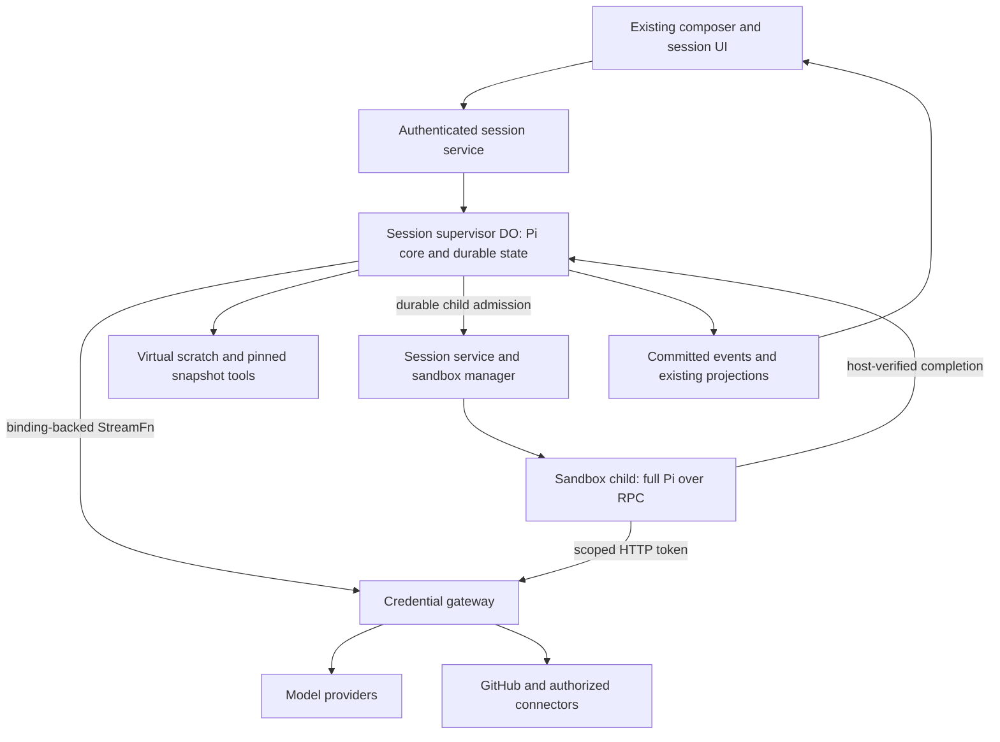

# Pi worker runtime and credential gateway on workerd

## Decision and review outcome

Keep a bootless Pi conversation in workerd, with `pi-agent-core` as the loop and a trusted Durable Object as its durable owner. Use a credential gateway for model and connector calls. Delegate machine work to a separate child session running the full `pi-coding-agent` in a sandbox. The parent stays in Worker placement. Code extensions run only in Sandbox; Worker extensibility is data and authorized protocols.

This reduces the extension compatibility burden, but **Claxedo still owns a harness integration**: persistence, context reconstruction, compaction, resources, tools, interruption recovery and gateway transport. It is not merely two dependency bumps and 1,500 copied lines. Maintenance estimates below are provisional, not measured savings.

This is a reviewed proposal, not implemented or deploy-verified behavior. It supersedes the proposed runtime, extension host, machine-tool bridge, promotion and delivery in [001](./2026-09-05-001-agent-worker-chat-and-coding-design.md). Keep 001's current-code analysis, Cloud Worker/Sandbox composer, per-harness defaults, workspace-less ownership and absence of a Hybrid option. Explicit promotion is a new exception to 001's fixed-placement rule. OpenCode stays Sandbox-only in this delivery until an embedded Worker integration passes its own conformance checks.

### Material corrections from review

| Finding | Revision |
|---|---|
| A Pi fork copies history, not just compacted context | Specify a completed fork boundary, selected branch, context budget, native/app identity mapping and authorization to disclose history |
| Inline waiting on a child was treated as durable scheduling | Persist child-wait state and resume from completion; a live promise is not the source of truth |
| `streamProxy` was described as an RPC binding adapter | Use an explicit binding-backed `StreamFn`; upstream `streamProxy` is an HTTP/SSE client |
| Eviction recovery omitted virtual files and pending operations | Persist scratch, configuration, operations and ordered events; reconcile unknown outcomes |
| Large-repository search could leave the pinned revision | Search that snapshot or report incomplete coverage; never substitute default-branch search |
| Gateway reuse implied authorization beyond current JWT claims | Explicitly add resource/action grants, generation checks, provider adapters and usage deduplication |
| Promotion was a file copy and a record flip | Require explicit choice, fencing, staged import validation and one authoritative placement cutover |
| Bundle and vendored-line numbers were treated as verified | Retain them as supplied estimates until reproducible artifacts exist |
| A new DO was placed in hosted core without reviewing its boundary | Deploy through the optional-service resource boundary |
| Unit 2 removed the runtime before its replacements shipped | Delete replaced paths only in the final complete cutover |

## Current code and precise change points

1. **Create/send.** `ControlPlaneSessionRoutes` admits explicit central Pi creation through the hybrid endpoint. Composer submission has a separate target-acquisition path and signed workspace requirement. `createCentralSessionRuntime()` binds the Pi adapter and a memory runtime store. These are replacement targets, not an existing Pi DO. [Route](../../packages/claxedo-server/src/session/routes/control-plane-session.ts), composition in `session/runtime.ts` (removed with the central runtime by [004](./2026-09-05-004-pi-native-harness-remove-central-plan.md)), [composer submission](../../packages/claxedo-app/src/features/session/composer/ui/submit-create-session.ts).
2. **Model/tools.** The backend creates `Agent` from Pi core. Its virtual environment uses `just-bash` and `InMemoryFs`; a server factory can bind remote workspace execution. The inspected Pi adapter does not implement full coding-agent RPC, so that adapter is new work. Backend `pi/model-backend.ts`, virtual environment `virtual-session-env.ts` and environment factory `session-env-factory.ts` were all removed by [004](./2026-09-05-004-pi-native-harness-remove-central-plan.md); the native replacement is [pi/driver.ts](../../packages/agent-sdk-runtime/src/harnesses/pi/driver.ts).
3. **Results/recovery.** `publishGlobal()` feeds existing metering, live events and durable projections. Restart rebinds adapter state without proving native context restoration. A display transcript cannot be assumed to contain every provider message, tool ID or compaction boundary. Native recovery and goals/wakes recovery are separate requirements. No independently tracked fix is claimed here. [Adapter](../../packages/agent-sdk-runtime/src/harnesses/pi/index.ts); the event/recovery owner `session/runtime.ts` was removed by [004](./2026-09-05-004-pi-native-harness-remove-central-plan.md).
4. **Hosting.** The hosted core renderer declares `LiveSyncRoom`; the repository also has a separate `WakeLane` DO implementation. Core excludes optional-service implementations and resources. Add agent execution through its declared service/deployment boundary, not every core profile's imports. [Core boundary](../../packages/claxedo-server/src/deployments/hosted-workerd/core-worker.cf.ts), [renderer](../../packages/claxedo-server/scripts/deploy/render-hosted-core-config.ts), [wake lane](../../packages/claxedo-server/src/deployments/hosted-workerd/wake-lane.cf.ts).
5. **Credentials/subagents.** The current egress JWT has sandbox subject, hosts and expiry. It does not supply the proposed generation revocation, session/turn grants or model metering. Extend that owner. Existing host subagent admission owns association identity and revisions; reuse it. [Broker](../../packages/claxedo-server/scripts/sandbox/cloudflare-worker/src/outbound-credentials.ts), which replaced the expiring egress token with native injection, [admission](../../packages/agent-sdk-runtime/src/subagent-admission.ts); the completed contract review (plan 2026-08-07-003) was retired from `docs/plans` once executed.

## Scope and composer UX

| Cloud placement | Runtime | Extensibility | Machine behavior |
|---|---|---|---|
| Worker | Pi core in workerd | Skills, templates, context resources, remote MCP and connectors | Authorized `request_machine` creates a visible Sandbox child |
| Sandbox | Full Pi coding agent; supported OpenCode runtime | Native packages within sandbox permissions and supported RPC UI | Machine must be available for the agent to respond |

Reuse the composer and its per-harness default owner. Pi and OpenCode keep separate placement preferences; unsupported saved choices block with a reason. Worker submit never provisions compute. Sandbox submit prepares/connects an environment, optionally without a repository. [Preferences](../../packages/claxedo-app/src/features/session/harness/draft-defaults.ts), [authority guard](../../packages/claxedo-app/src/features/session/harness/draft-default-policy.ts), [controls](../../packages/claxedo-app/src/features/session/ui/components/session-new-design-view.tsx).

Enabling a native extension shows **Requires Sandbox** with an explicit action. It never silently changes placement or defaults. An existing Worker session may offer **Move to Sandbox**, explaining machine startup and the one-way change. Ordinary coding opens a child beside its parent and returns a tool report. Both remain Cloud sessions; no Hybrid option appears.

In scope: durable Pi Worker turns, gateway, durable virtual scratch, pinned repository tools, GitHub change proposals, child machine sessions, explicit one-way promotion, sandbox Pi image/adapter/first-party tools and complete cutover.

Out of scope: user code extensions in workerd, ExtensionAPI emulation, a parent-to-machine remote `SessionEnv`, two-way placement movement, embedded OpenCode Worker delivery, unrestricted virtual POSIX compatibility, automatic parent/child file merging and the memory layer itself. Persisted GitHub change sets are a narrow form of bootless editing and are explicitly in scope.

## Evidence and dependency gates

The repository pins Pi core and AI at 0.73.1. The supplied [package review](../tech-docs/pi-coding-agent-package-review-2026-09-05.md) is research input, not acceptance evidence; some reuse recommendations describe the rejected Worker extension host. This plan governs the proposed implementation.

| Supplied claim | Status / required evidence |
|---|---|
| Core + AI bundle: 2,204 modules, 2.26 MB minified, 418 KB gzip, three guarded Node references | Reported, not reproduced in this review. Retain scripts, lockfile, entrypoint, flags, hashes, commands and outputs |
| Coding-agent SDK bundle fails on Node/process dependencies | Reported, consistent with filesystem/process coupling. Full SDK is unsupported by this Worker design; not a universal impossibility claim |
| About 1,500 pure Pi lines can be copied | Unverified. Measure compaction, messages, truncation, prompt/skill/template formatting, session-context extraction and their transitive closure |
| No Cloudflare beta dependency | Design avoids Dynamic Workers/facets. Verify all selected stable binding/DO capabilities in Unit 1 |

Vendoring requires a pinned upstream revision, file/function manifest, licenses, source hashes, line counts and reviewed patches. A re-copy script must reproduce the checked-in result and fail on unreviewed drift. Do not deep-import unsupported SDK internals or stub a callable provider/OAuth capability; expose unsupported capabilities as unavailable.

The pinned `Agent` awaits subscribed listeners and supports awaited tool hooks, providing persistence barriers. Its `continue()` has message-role constraints; durable resumption from a pending tool remains a feasibility gate. [Pi Agent](https://github.com/earendil-works/pi/blob/v0.73.1/packages/agent/src/agent.ts).

## Ownership and execution

Reuse session/turn authority, runtime contracts, event mapping, usage ledger, subagent admission and sandbox lifecycle. The DO owns execution, not participants or a second billing store. Optional-runtime composition declares its resources. Self-hosted Node declares Worker unavailable unless connected to a certified workerd service; a Node DO shim does not satisfy Worker placement.

### Durable records and barriers

One DO per tenant/session, addressed only after authority checks. No user JS modules enter its graph. Model-generated shell runs through a bounded interpreter, with no arbitrary module loading, deployment bindings or unrestricted evaluation. Enforce command/input/output/file/byte limits and test hostile scripts.

| Record | Purpose |
|---|---|
| Native entries, header, active leaf | Pi-format messages, model/thinking settings, compaction and custom entries; insertion order and valid parent links |
| Turn checkpoint | Submission ID, phase, execution generation, pinned configuration, pending tool IDs and cancellation |
| Events/outbox | Committed ordered events and replay cursor |
| Tool operations | Stable ID, arguments digest, admitted identity, state, external reference and result |
| Child wait | Reference to the canonical host subagent/child binding, not another association registry |
| Scratch/change-set manifest | Durable virtual files/proposed edits; scoped object storage for large content |
| Promotion preparation | Expected placement generation, export digest/leaf, target and readiness result |

Atomically commit entries, leaf, operation transitions and corresponding events within DO storage. Cross-service updates use idempotent commands and a committed outbox. Admit tool effects before dispatch; persist completed messages/results before subsequent model calls using the awaited listener/hook seams. Storage failure stops the turn. Event projections never substitute for native context.

### Turn, restart and long waits

1. Authenticate and deduplicate submission; admit one turn and persist its generation. Revalidate that generation after external waits: DO serialization alone does not make an entire async turn atomic.
2. Load the native context and pinned model/prompt/tool/resource configuration; restore scratch and create `Agent`. Persist the user message before the first reply.
3. Run model/tool boundaries with durable entries and operation state. Compaction uses the gateway; commit its entry before changing active context. Check context limits before requests, bound overflow recovery, and never rerun completed tools as a model retry.
4. A child wait persists `waiting_child` and ends the execution activation. The UI may keep displaying a waiting tool. Host-authenticated completion commits one terminal result and schedules continuation; no browser connection or suspended promise is the durable owner.
5. Restart restores committed state. Known results are recovered by identity; unknown external completion stays unknown until reconciled. Partial model streams remain interrupted, with separately attributed usage.

Unit 1 must prove a supported continuation seam for step 4, including a crash after a tool-call message but before dispatch and mixed completed/pending tools in one assistant batch. If core cannot express this without replacing its loop, stop at that gate and revise the dependency/approach. Never fabricate tool results to make `continue()` accept a state.

Alarms are at-least-once, have a single scheduled alarm per object and bounded automatic retries. Persist due work, rearm/reconcile it, and deduplicate execution. A JavaScript yield does not create a new invocation or reset limits. [Alarm contract](https://developers.cloudflare.com/durable-objects/api/alarms/).

Current paid SQLite DO limits include 10 GB storage, 2 MB per row and 128 MB isolate memory; CPU/wall-time limits depend on invocation type. Treat limits as ceilings, not capacity guarantees. [DO limits](https://developers.cloudflare.com/durable-objects/platform/limits/).

Years-long sessions require paginated history, bounded active-context reads, quotas, archival/restore, retention/deletion and schema migration. Compaction limits model context, not retained history. Store large attachments/output outside oversized rows and hydrate native payloads on export. Custom entries are a memory extension point, not a guarantee that memory requires no schema or lifecycle work.

## Machine work as a child session

### Fork contract

Pi `forkFrom` creates a new native ID, target cwd and a `parentSession` source-file path, copying the source entries. `buildSessionContext` reconstructs model input from the active path and compaction. The native header supplies neither app identity nor authorization. [Pinned SessionManager](https://github.com/earendil-works/pi/blob/v0.73.1/packages/coding-agent/src/core/session-manager.ts).

Proposed export rules:

- Export the authorized active branch at a completed boundary **before** the unresolved `request_machine` assistant/tool batch. Put the current user request and brief in the child's first new message; never copy a dangling delegation call.
- Include compaction dependencies. Validate the child's model budget including its different system prompt/tools. Summaries cannot recover facts they omitted.
- Map the host-minted app child ID to Pi's new native ID and artifact path. Parent association remains host-owned.
- Authorize history disclosure as part of compute policy. Sandbox code can read copied history even when compaction hides it from model input. Block export to an unauthorized sandbox/profile. A future brief-only option needs an explicit contract.
- Hydrate authorized attachments and record export digest, version, leaf, model/configuration and cwd mapping. Exclude keys and infrastructure grants.

### End-to-end flow

1. Parent calls `request_machine(brief, repository, revision, requestedCapabilities)`. Trusted services validate repository access and intersect requested capabilities with grants; model-supplied IDs cannot grant access.
2. Saved compute and history-disclosure policy either admits work or shows one action. Nothing provisions before admission. Persist cancellation so a late approval cannot restart cancelled work.
3. Existing host admission creates one child for the stable operation ID. Duplicate dispatch returns that child. Prepare its export and persist the parent wait.
4. Sandbox manager acquires an exclusive checkout lease and prepares the exact revision or validates retained state. The new RPC adapter starts full Pi, binds native/app identities and sends the brief.
5. Child edits/tests; authoritative events make it openable beside the parent. The first-party extension can report structured fields, but host lifecycle and observed test output establish status, not an extension's claimed success.
6. Host completion persists once and becomes the parent tool result: status, child link, summary, files, test evidence and optional PR URL. Only this report enters the parent, not a merged child log.
7. Retain checkout through an actual volume/checkpoint capability. Reuse requires the same authorized tenant/parent/repository and compatible checkout identity. Record base, branch, HEAD and dirty state. Never reset dirty files to a new requested revision. Serialize children sharing a checkout; parallel children need separate environments.

History and files are separate artifacts. A later child reads the actual checkout; the earlier report is not a file snapshot. Transfer GitHub change sets only through explicit commit/reference or verified transfer, never an implicit merge.

Parent cancellation records intent, revokes relevant future grants and requests child turn/process cancellation. An unreachable child remains cancellation-pending/unknown until acknowledged or fenced. Do not destroy another session's shared environment. Late completion stays in host history without appending a second parent result or resurrecting a cancelled turn.

Forking avoids moving the parent; it does not remove operation reconciliation, checkout leases or token costs. Preserving its prompt prefix may help caching, but cache hits depend on provider behavior, time and later prompt/compaction changes. Equality of cache-read tokens is not correctness acceptance.

## Credential gateway

### Worker model transport and metering

Implement a binding-backed `StreamFn` adapter and prove stream serialization, backpressure, abort, terminal events and usage in Unit 1. Upstream `streamProxy` requires a URL, token and its `/api/stream` SSE encoding; it cannot take a `WorkerEntrypoint` binding directly. Do not globally replace fetch. [Pinned proxy protocol](https://github.com/earendil-works/pi/blob/v0.73.1/packages/agent/src/proxy.ts).

Resolve canonical provider/model endpoints and secrets from trusted connections. Serialized model URLs, caller headers or token claims cannot select credential destinations. Trusted admission binds tenant/session/turn, followed by per-call grants; props alone are not authorization. Allowlist safe options and redirects. Compaction/auxiliary calls also use the gateway.

The existing usage ledger is the billing owner. Assign stable invocation IDs and purpose (assistant, compaction, retry), reserve/check budget, and reconcile once per provider attempt. Supervisor projections must not bill again through the old `turnMeter`. Missing terminal usage is unknown/pending reconciliation, not zero. Billable calls are not one-to-one with visible assistant messages.

### Sandbox credentials and native compatibility

Expose authenticated HTTP routes to the same policy owner. Extend the existing broker rather than assuming host-only JWTs already provide the required authorization. Claims/lookup cover issuer/audience, tenant/session/sandbox, generation, provider/model, connector resources/actions, expiry and budgets. Repository writes require repository/action grants, not just a host allowlist.

The sandbox receives a short-lived bearer capability. Any code there can spend it within scope. Token refresh must reach a running Pi process; changing its parent's environment does not update inherited variables. Prove a reloadable credential source or authenticated IPC refresh, including compaction and revocation. Every call checks live generation; specify whether revocation also aborts admitted streams.

Pi custom-provider entries and per-provider gateway paths are candidates, not a universal proxy. Test each enabled provider's base URL, auth headers, OAuth lifecycle, streaming, model identity and usage. Renaming providers to `claxedo-*` may require explicit native export/model mapping. Unsupported pairs remain unavailable.

Git clone/fetch/push requires a tested smart-HTTP route and credential helper, including redirects and refresh. Connector tools call typed gateway operations. Restrict upstream paths/methods and forwarded auth/cookies; test credential handling in errors, headers, logs and traces. Removing one response header, as the current broker does, does not establish arbitrary body/log redaction.

One Pi process per session avoids shared process registries; tenant filesystem/environment isolation still needs sandbox enforcement. Native compatibility is limited to the supported SDK/RPC UI, not arbitrary TUI behavior. Disable ambient repository code/package discovery unless enabled through the existing extension installation/trust owner.

Brokerage does not itself enforce network isolation. Respect each sandbox-manager driver's declared egress capabilities and refuse profiles that cannot satisfy required policy. Native installs/previews may need explicit additional network grants. Crabbox is not a supplied sandbox-manager driver for this plan.

## Tools without a machine

Pi-shaped read/write/edit/grep/find/ls/bash use shared `SessionEnv` where useful, with explicit schema, errors, truncation and path semantics. Core does not provide them automatically. Test the actual `just-bash` execution closure in workerd, including interpreter limits and hostile inputs. Unsupported commands fail explicitly; they do not provision machines implicitly.

Virtual scratch is separate from immutable repository snapshots. Persist supported mutations before tool completion using an atomic manifest revision and digests; restore on eviction. A scratch edit does not automatically change GitHub or a sandbox checkout. Do not silently reset files on restart.

`repo.attach` authorizes the repository and resolves a commit. All read/search operations use that revision. Search a bounded snapshot or a revision-specific index; report size limits and incomplete coverage. GitHub REST code search considers the default branch and cannot satisfy arbitrary pinned-commit search. [Search restrictions](https://docs.github.com/en/rest/search/search#search-code).

`github.propose_change` persists paths, expected blob IDs, file modes and content digests against a base commit. It does not publish. Initially support ordinary text files; reject unsupported binary, symlink, submodule and LFS changes explicitly.

`github.open_pull_request` requires write grants and a stable operation: blobs → tree → commit → dedicated branch → PR. Git Data handles objects/refs; PR creation is a separate endpoint. Persist external IDs at each stage; reconcile timeouts by operation branch/head/base instead of blindly creating again. Detect branch advancement and never force-push unrelated work. [PR endpoint](https://docs.github.com/en/rest/pulls/pulls#create-a-pull-request).

An API-only PR has no local test evidence unless independent CI supplies it. Report that directly. Deterministic acceptance uses a test service; live acceptance requires an explicitly authorized test repository and credentials. This review does not publish a PR or grant that authorization.

## Explicit one-way promotion

Promotion preserves the app session ID, URL and history, with explicit native-ID mapping. It is state transfer, not just JSONL serialization.

1. User chooses Sandbox; validate target, extension configuration, provider mapping, compute/history grants and native-format compatibility.
2. Reach a completed boundary without unresolved child/tool effects, or block with their status. Fence new Worker turns; persist the promotion ID and expected placement generation.
3. Export the selected native branch, validated cwd/header, model/thinking/resource configuration and declared scratch/artifact manifest. Stage the target without starting another prompt or unauthorized side-effecting extension initialization.
4. Validate native loading, digests, restored files and readiness. Compare-and-swap authoritative placement, then activate only the target and mark the source moved. Cross-service staging uses idempotent commands and outbox records.
5. Pre-cutover failure leaves Worker resumable after fenced cleanup. After cutover, recovery belongs to Sandbox; no automatic move back. Stale Worker activations refuse turns and protected tool calls.

A Pi file alone does not restore resources, virtual files, credentials or extensions. Prove the real next turn after import, including model identity, compaction, attachments and cwd. Old central-state migration is separate: preserve readable history when native data is insufficient, and offer an honestly labeled new-session continuation. Never manufacture native history from a lossy display transcript.

## Maintenance budget

| Piece | Ownership | Obligation |
|---|---|---|
| Pi core/AI | Pinned dependencies | Core/provider/stream conformance per bump |
| Selected coding-agent logic | Vendored plus patches | Supplied ~1,500 lines unverified; count full closure, retain notices and review drift |
| Supervisor/tools/gateway/resources | Claxedo | Supplied 5,000–6,000 lines is an estimate; includes durable continuation, quotas and protocol maintenance |
| Image/RPC adapter/first-party extension | Pinned SDK + Claxedo | Packaging, UI/events, identity/export, refresh and isolation |
| Child lifecycle/promotion | Existing owners extended | Admission, fencing, checkout retention and crash recovery |
| Tests/deployment/migrations | Claxedo | Count separately from estimated production lines |

001's footprint contains useful shared code; subtracting its total would overstate savings. Record added/deleted production, tests and vendored lines separately per unit. Compare ownership boundaries and upgrade steps as well as totals. This design trades arbitrary Worker extension compatibility for explicit persistence and child orchestration.

## Implementation units and acceptance

All units remain unchecked. Numbers retain the supplied plan's identifiers; dependencies determine execution order.

- [ ] **Unit 1 — Workerd feasibility and contracts.** Reproduce core/AI/virtual tools in real Miniflare/workerd with pinned versions/flags. Prove a model stream through a local binding gateway, a virtual tool, awaited persistence, native export/load and durable pending-child continuation with mixed tool results. Record bundle hashes/sizes and runtime provenance. No stubbed production capability. Exit: the real Workers entrypoint passes, enabled provider support has explicit evidence, and any required upstream continuation change is resolved.
- [ ] **Unit 3 — Gateway.** Implement scoped identity/grants, canonical destinations, budgets and invocation usage in the existing ledger. Test cross-tenant access, hostile model URLs/headers, redirects, stale/revoked grants, missing terminal usage, aborts and duplicate delivery. Exit: worker/compaction share one billing owner with no key exposure in tested paths.
- [ ] **Unit 2 — Supervisor.** Depends on Unit 1 continuation proof and Unit 3 gateway. Implement entries/config, scratch, operations, fences, compaction, outbox and scheduling through the declared runtime service. Exit: public create/send/evict/send preserves native context/files; duplicate admissions/alarms do not duplicate effects; storage failure stops work; interrupted operations reconcile; large histories and row limits are tested. Keep old execution paths until Unit 7.
- [ ] **Unit 4 — Repository/GitHub tools.** Implement exact-revision reads/search, durable change sets and idempotent publication; define machine dispatch through existing child admission. Exit: deterministic API-only PR flow invokes no sandbox; branch changes, incomplete trees, denied writes and timeout-after-create are handled. Live PR proof needs an authorized test repository. Machine dispatch is unavailable until Unit 6, not a placeholder success.
- [ ] **Unit 6 — Sandbox children and promotion.** Build pinned image, RPC adapter and first-party extension using the existing extension owner. Verify tools, discovery policy, provider/refresh, native/app mapping and RPC UI. Implement child waits, checkout reuse, cancellation and staged promotion. Exit: intended authorized context without pending parent calls; real edits/tests return one report; duplicate completion, cancellation loss, dirty state and promotion crashes preserve one owner. Stale Worker cannot execute after cutover.
- [ ] **Unit 5 — Composer.** Reuse 001 section 3 with Sandbox-only code extensions and explicit promotion. Exercise both supported placements through public entrypoints, per-harness defaults, draft overrides, stale hydration and existing-session authority. Exit: Worker never provisions at submit; children are visible; extensions cannot silently change placement. Ship only capabilities with passing preceding units.
- [ ] **Unit 7 — Cutover.** Inventory routes, signed auth, metadata graphs, goals, wakes, channels, subagents, usage, archives and hosted/self-hosted callers. Back up, fence writes, migrate qualified native data/refs and validate identities/counts. Then delete replaced Pi execution/routing. Keep unrelated HTTP/auth behavior with its owner; preserve opaque historical IDs. Exit: focused tests/typechecks/builds, affected `verify:closure`, real workerd/provider proof and `bun run test:architecture-ratchets` pass, with no obsolete execution or second billing path. Unsupported old sessions have an explicit continuation option.

Unit 1 runs first. After its contract verdict, gateway/storage and native-image work may proceed in disjoint files with reviewed shared contracts; integration follows the gates. This is an implementation plan, not authorization to start implementation or delegation during document review.

## Success criteria and tradeoffs

- Warm p50 time-to-first-token target under one second, with declared model/network cohort and provider latency reported separately. This is a target, not a result.
- Zero coding-sandbox provisions for Worker sessions without admitted machine work or explicit promotion. Sandbox placement intentionally needs a machine.
- Committed native context, configuration and scratch survive restart. Assert actual model input, not that compaction retains every historical fact.
- One admitted child and terminal report despite redelivery; usage reconciles per provider attempt; uncertain outcomes remain visible.
- One-way promotion crash tests and native export/import conformance pass on each Pi bump.
- Measure parent prefix stability/cache behavior without requiring identical cache-read tokens.

The separation is one durable Worker conversation, a scoped gateway and separately owned Sandbox children. Claxedo still maintains native interoperability and durable continuation. If Unit 1 cannot prove these without replacing Pi's loop, revisit the design before the rewrite. Full Pi in Sandbox remains the lower-maintenance alternative, with machine startup as its tradeoff.

## Review evidence and remaining proof

Reviewed local source at the stated baseline, pinned upstream Pi and current official Cloudflare/GitHub documentation linked above. No Miniflare, provider, image, fork, promotion or live GitHub tests were run for this document revision. Supplied bundle measurements and copied-line counts remain unverified.

Implementation regression anchors include Pi backend/goal/session-env tests, subagent admission, session authority, composer/defaults, hosted resource closure and certified workerd artifact checks. Each unit needs behavioral proof through its real entrypoint. Existing fail-closed boot smoke and Node-only tests cannot establish Worker execution, isolation or durability.
