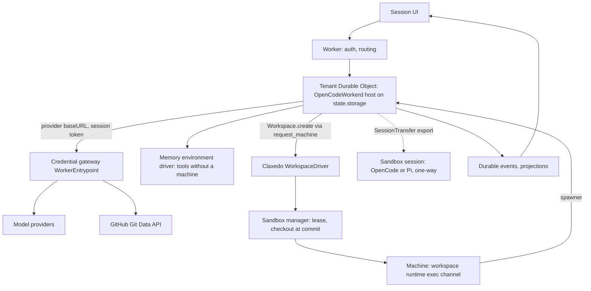

# feat: OpenCode v2 worker runtime on workerd with a credential gateway

## Overview

Every session that is not bound to code runs in a Durable Object hosting the OpenCode v2 workerd profile. Those sessions live for years, so persistence, compaction and eviction recovery are upstream code, not ours. A machine is never a prerequisite. When work needs one, the session attaches a workspace through OpenCode's `WorkspaceDriver` seam, backed by the sandbox manager, and the same tools start executing on the machine. A GitHub connection lets the agent read a repository and open a pull request without a machine at all.

Claxedo owns four things: a Durable Object class that composes the host, one workspace driver over the sandbox manager, the credential gateway, and a small set of first-party plugins. The harness, its tools, its session store, its compaction and its subagent runner are `@opencode-ai/core`. Pi becomes one sandbox harness among peers.

This plan replaces 2026-09-05-002, which built the same tier on `pi-agent-core` with a Claxedo-owned third layer. That plan stays on disk as the fallback. The UX and product decisions of 2026-09-05-001 (two Cloud placements, three separate facts, lazy compute, no Hybrid) stand unchanged. The evidence for choosing OpenCode v2 is in [the evaluation](../tech-docs/opencode-v2-workerd-evaluation-2026-09-05.md).

## Problem Frame

The reasons for this plan are structural, not the defects on the current path.

- The current central Pi path keeps every session in process memory with no per-session owner. On Cloudflare Workers, the primary deployment target, there is no long-lived process to hold it and no lease between isolates, so it cannot be deployed there by wiring alone. It needs a durable per-session owner with its own storage.
- The current path gives the model one bash tool and no persistence, compaction or recovery on the hosted target.
- There is no gateway that injects credentials and meters usage for a worker-hosted loop.

Two known defects on the current path are bugs, not reasons to rewrite, and should be fixed in place now regardless of this plan: restart rebinds a session with an empty message list, and goals live in an in-memory store. The fix is to rehydrate the agent from the durable session log on bind. That fix is tracked outside this document.

## Requirements Trace

### Runtime
- Worker sessions run the OpenCode v2 workerd profile inside a Durable Object, with the database on the object's SQLite and durable event history on.
- A restart, eviction or redeploy resumes an interrupted turn through OpenCode's execution claim and boot sweep. A UI transcript alone never satisfies this.
- Sessions are workspace-less by default and live for years. Compaction is upstream. A memory layer attaches through a first-party plugin's `session.context` hook.

### Tools without a machine
- With no workspace attached, tools run over an in-memory environment driver: `read`, `edit`, `write`, `grep`, `glob`, `shell`, `patch`, `webfetch`, `websearch`, `question`, `skill`, `subagent`.
- A first-party plugin adds `repo.attach`, repository read and search at a pinned commit, `github.propose_change` and `github.open_pull_request` through the Git Data API over the gateway.
- No sandbox provisioning happens until a workspace is requested and the saved policy allows it.

### Machine work
- `request_machine` creates a workspace through OpenCode's `Workspace.create` with the Claxedo provider and moves the session's location onto it. From then on every tool executes on the machine through the driver's spawner. The session, its history and its placement do not change.
- The machine is a checkout at the requested commit prepared through worktree admission. Idle suspension is OpenCode's own, backed by the driver's `suspendForIdle`.
- Parallel or background machine work uses OpenCode's subagent runner, whose child sessions can carry their own workspace.

### Extensibility
- Worker sessions are extended by data and by protocol: skills, instructions, remote MCP servers, Claxedo connectors, and first-party precompiled plugins.
- User-supplied plugin code never runs in the Durable Object. Pi extension packages and user OpenCode plugins from disk work only in Sandbox placement.

### Promotion
- A session moves to Sandbox placement only when the user picks Sandbox or enables a package that needs it. Promotion is `SessionTransfer.export` from the worker host and `import` in the sandbox host. Same id, URL and history. One-way in this plan.

### Secrets
- Model keys, OAuth refresh tokens and connector tokens are injected by the gateway on egress. The host is configured with provider `baseURL` at the gateway and the session grant token as the key, so no raw credential enters the object's SQLite.
- Every model call from the worker is metered at the gateway.

## Scope Boundaries

In scope: the Durable Object host, the workspace driver over the sandbox manager, the exec channel the driver needs, the credential gateway, first-party plugins for GitHub, connectors and `request_machine`, promotion by session transfer, the Claxedo sandbox image for OpenCode and Pi, composer placement per 001, and the cutover that deletes the central Pi closure and the v1 adapter transport.

Out of scope: user plugin code in the worker, terminal panels and file explorers in worker sessions (the `Pty`, `FileSystem` and `FileSystemSearch` layers stay stubbed until replaced), VCS status and snapshots in worker sessions, embedded OpenCode inside sandboxes, pre-compute edit overlays, the memory layer's own design, composer UI beyond 001.

## Context & Research

### A. What upstream shipped

`@opencode-ai/sdk/workerd` boots the full v2 application graph in a Durable Object with a replacement graph from `packages/server/src/workerd.ts`: Drizzle over the object's SQLite, events persisted, a typed no-execution-plane spawner, `FileSystem`, `FileSystemSearch` and `Pty` failing until a remote sandbox backs them, `Vcs` and `Snapshot` as no-ops, precompiled plugins only, native modules as inert stubs under the `workerd` bundle condition. `SessionRestart.resumeSuspendedSessions` replays turns whose execution claim was never released, capped at ten attempts per turn. Published under the `dev` dist-tag; the docs mark it beta.

### B. The seam that makes machines an implementation detail

`EmbeddedHost.CreateOptions.workspaceProviders` takes a record of `WorkspaceDriver.Interface`: `create`, `connect`, `suspendForIdle`, `destroy`, keyed by an idempotent workspace id with an opaque JSON binding. `connect` returns an `EnvironmentDriver`: a `ChildProcessSpawner` plus optional file overrides. `Environment` uses that driver for any location with a `workspaceID`, and `execDefaults` implements stat, read, list, write, move, remove and mkdir as shell scripts over the spawner with an exit-code protocol. Requirements from that file: GNU coreutils and findutils in the image, 64 MB read cap. `makeMemoryDriver` provides the in-memory environment for workspace-less locations.

### C. Bundle spike

`bun build --target=node --conditions=workerd` on the published dev SDK: 2,752 modules, 12.2 MB minified, 2.8 MB gzipped. Node builtins referenced are supported or stubbed under `nodejs_compat`; two static `node:child_process` imports load as stubs and are unreachable behind the unavailable spawner. This matches upstream's own `workerd-probe.ts`, which forbids only `bun:` builtins. No upstream execution test under workerd was found. Unit 1 supplies it.

### D. What already exists here

- `OpenCodeHarnessAdapter` with an injected `OpenCodeRequestFn` transport, speaking v1 routes (`/session/...`, `/global/event`, `x-opencode-directory`). v2 routes live under `/api/...` and route by session location.
- Vendored `packages/core` and `packages/server` at 1.17.13 without the workerd profile.
- The sandbox manager with drivers, leases, worktree admission and the JWT egress broker for containers.
- The workspace runtime's session-env exec with streaming output and abort, lacking stdin.
- `LiveSyncRoom` as the only hosted Durable Object.
- The GitHub connection with OAuth app or pasted token.

## Key Technical Decisions

1. **One `OpenCodeWorkerd` host per Durable Object, one object per tenant.** The host is created under `blockConcurrencyWhile` on `state.storage` and lives for the object's lifetime, as upstream documents. Sessions of one tenant share the object, which amortizes the 12 MB script boot. Per-session objects are the fallback if a tenant's sessions contend for CPU; the change is a key, not a design.
2. **Runtime packages come from npm at a pinned dev build, not the vendored tree.** The hosted Worker depends on `@opencode-ai/sdk` and its siblings at one exact `0.0.0-dev-*` build and one Effect version. The vendored 1.17.13 tree serves the sandbox image and the desktop until re-vendoring is its own decision. The two never meet in one bundle.
3. **Claxedo's `WorkspaceDriver` is the only bridge to machines, and it is upstream's contract.** `create` leases through the sandbox manager and prepares the checkout; `connect` returns a spawner over the workspace runtime's exec channel; `suspendForIdle` and `destroy` map to stop and destroy. No file overrides in the first version; `execDefaults` runs everything over the spawner.
4. **`request_machine` is a first-party plugin tool that attaches a workspace to the current session.** It calls `Workspace.create` with the Claxedo provider, moves the session location to a directory on that workspace, and returns. The next tool call provisions through `Workspace.provision`. Policy runs before `create`; a user without pre-approved compute sees one action.
5. **All model egress goes through the credential gateway.** The host's inline config sets each provider's `baseURL` to the gateway's per-provider path and its key to the session grant token. The gateway substitutes the real credential, forwards, strips it from responses, and records usage. Sandboxes use the same gateway paths; containers keep the JWT broker for non-model egress.
6. **Plugins in the object are first-party and precompiled.** `Plugin.define` modules bundled into the Worker: GitHub and connector tools, `request_machine`, the memory hook, and Claxedo policy on `permission.evaluate` and `tool.execute.before`. Nothing from user config or disk.
7. **Promotion is `SessionTransfer`.** Export from the worker host, import into the sandbox host at a location on the machine. One-way. Triggered by user choice or a package that needs the sandbox.
8. **The app talks v2.** The runtime client and the harness adapter gain a v2 transport using `@opencode-ai/client` against the object's fetch. The v1 transport is deleted in cutover.
9. **Pi is a sandbox harness.** Pi extension packages require Sandbox placement, unchanged from before. Nothing Pi-specific remains in the control plane.

## Open Questions

### Resolved During Planning
- Whether to keep a Claxedo-owned harness layer: no. Upstream provides persistence, compaction, recovery, tools, fork, transfer and subagents.
- Whether machine work needs a Claxedo-owned bridge: no. `WorkspaceDriver` is upstream's contract; Claxedo implements four methods and a spawner.
- Whether PTY is needed for tools: no. `Pty` backs the terminal panel only and stays stubbed.
- Whether user plugin code can run in the worker: no. Same trust rule as before; the object holds the database.

### Deferred to Implementation
- Object keying: per tenant by default; per session if CPU contention appears in the Unit 1 measurements.
- Whether `FileSystem` and `FileSystemSearch` get remote layers over the same spawner so the app's file explorer works in worker sessions with a machine attached. Default: not in this plan.
- How the exec channel carries stdin: extend the session-env protocol or add a WebSocket. Decided in Unit 4 against the workspace runtime's current shape.

## High-Level Technical Design

### The Durable Object host

- The class holds one `OpenCodeWorkerd.create({ storage, config, plugins, workspaceProviders: { claxedo: driver } })` for its lifetime and forwards `fetch` to the host's in-process transport. Config is inline JSON: providers pointed at the gateway, default agent, model policy.
- Identity comes from the Worker in front of the object, which resolves the tenant and mints the session grant token per turn. The object never trusts request headers for identity.
- Eviction, resume and compaction are upstream. The object adds nothing to them.

### Machine work, end to end

1. The user asks for a change in a repository. The loop reads the pinned snapshot through the GitHub plugin and decides it needs to run tests. It calls `request_machine` with the repository and commit.
2. Policy runs. Pre-approved compute for the tenant proceeds; otherwise the UI shows one action and the tool waits.
3. The plugin calls `Workspace.create({ provider: "claxedo" })` and moves the session's location to `/workspace` on that workspace id. The next tool call triggers `Workspace.provision`, which calls the driver's `create`: lease a machine through the sandbox manager, prepare the checkout at the commit through worktree admission, return the binding.
4. `connect` opens the exec channel to the workspace runtime and returns a spawner. `Environment` now runs every tool on the machine through `execDefaults`.
5. The agent edits, runs tests, and opens the pull request through the GitHub plugin, whose calls still go through the gateway.
6. OpenCode's idle tracking calls `suspendForIdle` after the threshold; the sandbox manager suspends the lease with the checkout intact. The next tool call reconnects.

If the exec channel drops mid-command, the shell tool reports the failure and OpenCode's execution claim keeps the turn resumable; nothing is re-run silently.

### Credential gateway

Unchanged from 002 in shape. One `WorkerEntrypoint` with per-provider paths speaking each provider's own wire protocol, connector paths for GitHub and other integrations, session grant tokens minted by the connections framework with hosts, scopes, TTL and a revocation generation, usage recorded per assistant message. Sandboxes use the same paths with the same token.

### Sandbox image

One image with `opencode` and `pi` installed, GNU coreutils and findutils, the workspace runtime exposing the exec channel, `rg` and `fd` present, telemetry off, and both harnesses' agent directories pinned to Claxedo-owned paths. Sandbox placement runs whichever harness the session selected over RPC, one process per session.

## Maintenance Budget

| Piece | Kind | Ongoing cost |
|---|---|---|
| `@opencode-ai/sdk` and siblings at a pinned dev build | Dependency | Bump on a schedule; the Miniflare suite is the gate; watch the beta API |
| Durable Object host class | Claxedo-owned, a few hundred lines | Ordinary product code |
| `WorkspaceDriver` and the exec channel | Claxedo-owned, about a thousand lines | Ordinary product code against a documented upstream contract |
| Credential gateway | Claxedo-owned, about a thousand lines | Ordinary product code |
| First-party plugins | Claxedo-owned, about a thousand lines | Versioned with the Worker; our code against `Plugin.define` |
| Sandbox image | Pinned harness versions | Rebuild per bump |

Nothing Claxedo owns reimplements a harness. The Pi plan's supervisor, entry tables, compaction port and tool reimplementation do not exist here.

## Implementation Units

- [ ] **Unit 1: Prove the host under Miniflare**
  - Create `OpenCodeWorkerd` on Durable Object storage in Miniflare with `nodejs_compat`, inline config pointing one provider at a local gateway stub, and the memory driver.
  - Run one prompt that calls `read` and `edit` on the memory driver, evict the object, prompt again, and assert continuation. Assert on a workerd-only signal so a Node run fails.
  - Record bundle size, cold boot time and time to first token.
  - Done when: the test passes under `smoke:workerd-boundary`; the numbers are in this document; no `bun:` builtin is statically imported. Progress:

- [ ] **Unit 2: Durable Object host and app transport**
  - Add the tenant Durable Object beside `LiveSyncRoom` in the hosted config renderer. Compose the host with inline config, plugins and the workspace provider. Front it with tenant resolution and the session grant token.
  - Add a v2 transport to the runtime client and `OpenCodeHarnessAdapter` using `@opencode-ai/client` against the object's fetch, including the durable event feed with `after` cursors.
  - Decide and record the Effect version and dependency layout so the vendored 1.17.13 tree and the dev packages never share a bundle.
  - Done when: a workspace-less session is created, prompted and streamed through the public session route on hosted workerd; eviction mid-turn resumes; the old central Pi closure is unused. Progress:

- [ ] **Unit 3: Credential gateway**
  - `WorkerEntrypoint` with per-provider and connector paths, session grant token validation, credential injection, budgets, revocation generation, usage recording into the existing ledger.
  - Done when: a revoked token is refused; injected credentials never appear in responses; usage rows match assistant messages one to one; the host's inline config reaches providers only through the gateway. Progress:

- [ ] **Unit 4: Workspace driver and exec channel**
  - Implement `WorkspaceDriver` over the sandbox manager: `create` leases and prepares the checkout at a commit through worktree admission, `connect` returns a spawner over the workspace runtime's exec channel with stdin added, `suspendForIdle` and `destroy` map to stop and destroy. Bindings carry the lease id and epoch.
  - Sandbox image with GNU coreutils and findutils.
  - Done when: `request_machine` in a worker session provisions exactly one machine, the seven file and shell tools execute on it, a second session of the same tenant attaches its own workspace, idle suspends and the next call reconnects, and a dropped channel mid-command surfaces as a tool failure with the turn still resumable. Progress:

- [ ] **Unit 5: First-party plugins**
  - GitHub plugin: `repo.attach`, pinned reads and search, `github.propose_change`, `github.open_pull_request` via the Git Data API over the gateway. Connector tools. `request_machine`. Policy hooks on `permission.evaluate` and `tool.execute.before`. Memory hook on `session.context` as a stub.
  - Done when: a workspace-less session opens a real pull request on a test repository with no sandbox call; `request_machine` without pre-approval surfaces one action and provisions nothing. Progress:

- [ ] **Unit 6: Composer placement and defaults**
  - As specified in 001 section 3. Worker submit never provisions. Unavailable saved placement blocks with a reason. Selecting Pi or a package that needs a machine selects Sandbox and says why.
  - Done when: the 001 acceptance rows for placement and defaults pass through the real composer. Progress:

- [ ] **Unit 7: Sandbox placement and promotion**
  - Sandbox image runs OpenCode or Pi over RPC, one process per session, with the same gateway paths and token. Promotion: `SessionTransfer.export` from the object, `import` into the sandbox host at a machine location, session record flipped, object refuses further turns for that session.
  - Done when: a worker session with a hundred messages and one compaction is promoted and the next reply references pre-compaction facts correctly; the object refuses a turn for it; a Pi session in the sandbox loads a Pi extension package. Progress:

- [ ] **Unit 8: Cutover**
  - Delete `session/runtime.ts`'s Pi closure, `central-runtime.ts` where the object now owns it, `isDirectorylessPiSession`, composer transport branches, and the v1 adapter transport.
  - Done when: `bun run test:architecture-ratchets` passes with no ceiling raised without a named owner, and no code path references `central` as an execution role. Progress:

## System-Wide Impact

- Hosted worker gains one Durable Object class, one entrypoint, and a 12 MB script. The config renderer and its tests change.
- The app's runtime client speaks v2 routes. Anything reading v1 events from the worker path changes.
- Usage attribution moves to the gateway for every worker session.
- The Node self-host composition needs a Durable Object shim or declares Worker placement unavailable. Decided in Unit 2.

## Alternative Approaches Considered

- **Project Think as the base-tier runtime.** Under evaluation, see [the Think evaluation](../tech-docs/project-think-evaluation-2026-09-05.md). It fits a long-lived assistant with memory and channels and has workerd recovery tests, but its sandbox tier is a stub and its code-execution tier needs the Dynamic Workers closed beta. Decided by the side-by-side spike in that document; this plan stands until then.
- **Pi worker with a Claxedo-owned third layer (plan 002).** Kept as the fallback. Rejected as primary because upstream OpenCode v2 provides that layer and unifies the harness across placements.
- **Real harness over RPC everywhere, no worker.** Rejected only because it costs a container per chat.
- **Per-session Durable Objects from the start.** Deferred; per-tenant amortizes the boot and is upstream's documented shape.
- **Re-vendoring the v2 branch now.** Deferred; consuming the published dev build isolates the worker from fork drift until the vendored tree is re-based on its own schedule.

## Success Metrics

- Time to first token for a workspace-less prompt on a warm object under one second at p50; cold object boot recorded and under a stated budget from Unit 1.
- Zero sandbox provisions for sessions that never call `request_machine`.
- Eviction resume test green on every deploy and every dependency bump.
- Promotion round-trip test green on every harness bump.

## Dependencies / Prerequisites

- `@opencode-ai/sdk@dev` and siblings at one pinned build; Effect 4 release candidate as they require.
- GitHub connection scope sufficient for Git Data API writes.
- Cloudflare Workers Paid for Durable Objects with SQLite. No beta features.

## Risk Analysis & Mitigation

| Risk | Mitigation |
|---|---|
| The dev build churns or breaks the API | Exact pin; scheduled bumps gated by the Miniflare suite; the Pi plan remains the fallback |
| A workerd code path reaches a stubbed builtin at runtime | Unit 1 exercises every tool over the memory driver; the unavailable spawner guards `child_process` |
| Two Effect versions in one bundle | One dependency layout per bundle, enforced by the import-graph guard |
| Cold boot of a 12 MB script | Per-tenant objects; measure in Unit 1; per-session only if contention |
| `execDefaults` assumes GNU userland | Image ships coreutils and findutils; a conformance test runs each script |
| OpenCode regains privileged status against the "just another harness" workstream | The object is an implementation behind the harness contract; the adapter registry still treats OpenCode as a peer |

## Phased Delivery

### Phase 1 — Host and gateway
Units 1, 2, 3. Workspace-less chat with eviction recovery on hosted workerd.

### Phase 2 — Machines and plugins
Units 4, 5, 6. Workspace attach, GitHub pull requests without a machine, composer placement.

### Phase 3 — Sandbox and promotion
Unit 7.

### Phase 4 — Cutover
Unit 8.

## Execution: parallelize with agents and workflows

Unit 1 runs first and alone. After it, Units 2, 3, 4 and 5 run in parallel with disjoint ownership: one agent owns the object and the v2 transport, one the gateway, one the driver and exec channel, one the plugins. A shared contract file for the gateway paths and the grant token is committed before they start. The sandbox image work in Units 4 and 7 shares one owner. Verification agents run the Miniflare suites per unit and must fail under Node by construction.

## Sources & References

- [OpenCode v2 workerd evaluation](../tech-docs/opencode-v2-workerd-evaluation-2026-09-05.md).
- [Plan 002, Pi worker runtime](./2026-09-05-002-pi-worker-runtime-and-gateway-plan.md), the fallback.
- Upstream `anomalyco/opencode` branch `v2`: `packages/sdk/src/workerd.ts`, `packages/sdk/src/internal/host.ts`, `packages/server/src/workerd.ts`, `packages/server/script/workerd-probe.ts`, `packages/core/src/workspace/driver.ts`, `packages/core/src/environment/*.ts`, `packages/core/src/session/execution/restart.ts`, `packages/core/src/session/transfer.ts`, `packages/core/src/session/subagent-job.ts`.
- Published `@opencode-ai/sdk@dev` build `0.0.0-dev-19120` and the v2 docs at `opencode.ai/v2/docs/build/sdk/cloudflare`.
- This repository: `packages/agent-sdk-runtime/src/harnesses/opencode/index.ts`, `packages/sandbox-manager/src`, `packages/claxedo-server/scripts/deploy/render-hosted-core-config.ts`, `packages/claxedo-server/src/connections`.
