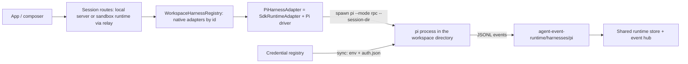

# refactor: Pi is a native harness; remove the central/VM split

## Overview

Owner decision, 2026-09-05: there is no central execution mode. Pi behaves like Claude, Codex and Cursor. In local mode the desktop or local server spawns the user's `pi` binary against a directory. In cloud mode `pi` runs entirely inside the sandbox VM, spawned by the sandbox's workspace runtime, exactly as the other native harnesses do today. The control plane never runs a model loop.

This deletes the central Pi runtime, the tools-only `SessionEnv` bridge, the hybrid session route, the virtual environment, and every client and contract branch that exists only because a session could be hosted on the control plane. It adds one thing: a Pi driver for the shared native adapter, speaking Pi's RPC protocol over stdio, with credentials delivered the way Codex and Claude already receive them.

Execute this plan to completion before starting [the Think agent base tier](./2026-09-05-005-think-agent-base-tier-plan.md). It is independently shippable and has no Think, workerd agent, gateway or machine-lease prerequisite. This restores plan 004 as its own workstream; it is no longer Phase 0 inside plan 005.

The product consequence for this release: every harness session needs a directory and a machine; Cloud uses a sandbox. Bootless, workspace-less agents remain a desired **new feature in plan 005**, not a Pi placement mode and not permanently cancelled. Plans 001 to 003 remain historical proposals. Implementation is in `codex/pi-native-no-split`, based on `ca3e488f7a`. See the [cutover evidence](../tech-docs/pi-native-harness-cutover.md) and [user guide](../pi-native-user-guide.md). Local browser and real native-process acceptance passed; packaged desktop, live provider refresh and staging Cloud acceptance remain open. Plan 005 is not unblocked.

## Problem Frame

Two execution architectures exist for one harness. The central path keeps sessions in process memory with no per-session owner, cannot be deployed on the hosted target, gives the model one bash tool, and threads a model backend through the workspace runtime, the local server and the self-hosted app. Every other harness is a process adapter with one registration, one binary resolver and one credential path. Pi is the only harness with a bespoke runtime, and the bespoke runtime is the thing that does not work where the product runs.

The 001 to 003 plans tried to keep central by rebuilding it on workerd. The owner chose to normalize the harness architecture first. This refactor removes the split without introducing a replacement agent runtime. Plan 005 adds durable agents later against the completed machine-session contract.

## Requirements Trace

### Pi as a native harness
- `pi` appears in the native adapter registry beside `claude`, `codex` and `cursor`, constructed through the shared `SdkRuntimeAdapter` with a Pi driver.
- The driver speaks Pi's RPC protocol over stdio, with correlated JSONL requests and native events. Product turns use `prompt`, `clear_queue` and `abort`; model discovery and selection use native commands. Pi owns automatic compaction. Explicit compaction is exercised at the protocol boundary. Exposing `steer` and `follow_up` in the product remains part of the separate queue project.
- One `pi --mode rpc` process per session, resumed from Pi's own session file on restart. The shared binding records Pi's native session id separately from the product session id; neither is synthesized from the other.
- Events are normalized by a Pi adapter in `agent-event-runtime`, following the Claude, Codex and Cursor adapters there.
- Model and thinking options come from the running process, not from a catalog projection.
- Goals work through the shared goal contract. Subagents are declared unsupported, per the cross-harness subagents plan.

### Local mode
- The local server and desktop resolve the `pi` binary the way they resolve `claude`: explicit env override, then PATH, with an install hint on absence.
- The spawned process uses a Claxedo-owned agent directory. Existing user logins are connected through the credential registry's supported import/login flow and projected there; setting `PI_CODING_AGENT_DIR` does not automatically expose the user's normal Pi login, settings or extensions. Never overwrite the user's Pi directory.

### Cloud mode
- The sandbox image pins one Pi version. The sandbox's workspace runtime constructs the Pi adapter from its registry when the session's harness is `pi`.
- Credentials reach the process through the existing registry-to-runtime configuration sync. Pi's driver projects API keys and the current Codex OAuth access token into its managed auth file; the registry retains refresh ownership.
- Session files live under the workspace runtime's data directory so checkpoints capture them and the scrub set clears the auth file.

### Removal
- No code path can create, route to, or resolve a session with `host: "central"`, `mode: "hybrid"`, or a virtual tool sandbox.
- No Claxedo production import of `pi-agent-core`, `pi-ai`, `just-bash` or the session-env bridge remains after cutover. Pi's external executable can depend on its own upstream packages; the ban concerns Claxedo's runtime import graph.
- No backward compatibility is required. Remove obsolete central/hybrid contract variants, public exports, persisted-format readers and execution-location enum values; do not retain them solely for old records or clients.
- Channels, wakes and MCP dispatch use authorized machine-session execution when a real backing exists. Requests without one return an actionable workspace-required outcome; they never create an empty-directory session or a virtual fallback.
- The composer uses the same harness defaults and Local/Cloud selection for Pi as its peers. Remove execution-placement fields such as central/hybrid/tools-only; retain genuine native-versus-connection harness identity and existing user-hosted machine support.

**Compatibility decision:** this is a breaking refactor. Update current producers and consumers together; no dual reads/writes, alias routes, old SDK signatures, legacy data migration, old-session resume, fallback runtime or compatibility flags. Existing native-session persistence/restart remains a feature of the current architecture, not a bridge for central sessions.

## Scope Boundaries

In scope: the Pi driver and event adapter, executable resolution, credential sync for Pi, local and sandbox registry wiring, the image pin, migration of central execution consumers, removal of the central runtime and every dependent branch, composer cleanup, repository docs and cutover evidence.

Out of scope: a new workspace-less runtime, a worker tier, a credential gateway, OpenCode v2 embedding, Project Think, machine leases for worker agents, Pi extension emulation, a new Pi marketplace/projection target in the current agent-plugins packages, and expansion of the separate queue/subagent projects. Existing machine-capable channel and wake behavior must be re-homed as part of removal. Native Pi remains responsible for its loop, tools, compaction, session persistence and supported extensions. Do not modify personal Codex memory as part of this plan.

## Context & Research

Code owners were rechecked at baseline `ca3e488f7a` with existing working-tree changes present. Line anchors are navigation hints; paths and named owners are authoritative. No matching `docs/brainstorms` or `docs/solutions` directories were present. The origin is the owner's explicit sequencing decision in this conversation and the previous plan's still-applicable implementation research.

### A. How the other native harnesses are built

- Registry: `NATIVE_HARNESS_ADAPTERS` in `packages/workspace-runtime/src/workspace/runtime.ts:216` maps a native runner id to an adapter class; the factory at line 515 constructs it with `binary`, `createStore`, `storeRoot`, `eventHub` and the process observer. `packages/agent-sdk-runtime/src/harness-factories/{claude,codex,cursor}.ts` are the per-harness factories; `pi.ts` there still builds the central adapter with `createEnv` and `defaultPlacement`.
- Contract: `SdkRuntimeDriver` in `packages/agent-sdk-runtime/src/harnesses/shared/sdk-runtime-driver.ts`: `type`, `setAuth(keys)`, `applyConfig`, `createAgentSession({ directory, title, model, system })`, `createRuntime(threadId)`, `runTurn(input)` which ingests `RawHarnessEvent`s, `deleteAgentSession`, `readRuntimeHealth`, `configOptions`, `peekConfigOptions`, optional `nativeGoal`, `permissionModes`, `dispose`. `SdkRuntimeAuth` is `{ anthropic?, openai?, cursor? }`.
- Process template: `packages/agent-sdk-runtime/src/harnesses/codex/app-server-process.ts` spawns `codex app-server --listen stdio://`, observes the process, and reaps it when idle. The Codex driver sets `CODEX_HOME` per spawn at `driver.ts:550`.
- Executable resolution: `packages/agent-sdk-runtime/src/harnesses/claude/executable.ts`: env override `CLAUDE_CODE_EXECUTABLE`, PATH discovery, Windows shim handling, install hint.
- Event normalization: `packages/agent-event-runtime/src/harnesses/{acp,claude,codex,cursor}`. No `pi` directory exists.
- Credentials: `packages/claxedo-server-core/src/credentials/operations/sync.ts` maps registry providers to env (`claude-sdk` to `ANTHROPIC_API_KEY`, `codex-app-server` to `OPENAI_API_KEY`) and reads harness credential files; `codex-auth-file.ts` writes `~/.codex/auth.json` after a refresh. `pi-provider-projection.ts` already maps Pi's `openai-codex`, `anthropic` and `openai` providers to registry credential ids.
- Sandbox boot: `claxedoRuntimeHarnessFromEnv` in `packages/claxedo-server/src/hosts/workspace-runtime/runtime-boot.ts:91` reads `WORKSPACE_RUNTIME_NATIVE_HARNESS` and validates it against `isNativeHarnessId`, which already includes `pi`. Images at `packages/claxedo-server/scripts/sandbox/Dockerfile:25` and `scripts/sandbox/cloudflare-worker/Dockerfile:14` install `@earendil-works/pi-coding-agent@0.75.5`.
- Usage: the local server registers a `pi` usage source and passes Pi's native session id at `packages/claxedo-local-server/src/app/start-local-server.ts:183`.

### B. What Pi's RPC mode provides

Protocol reference: [Pi v0.85.0 RPC documentation](https://github.com/earendil-works/pi/blob/v0.85.0/packages/coding-agent/docs/rpc.md), rechecked for this revision. Target v0.85.0 for the initial driver and image pin; the command inventory below is reference material, not a requirement to expose every RPC command in the product. Commands: `prompt`, `steer`, `follow_up`, `abort`, `clear_queue`, `new_session`, `get_state`, `get_messages`, `set_model`, `cycle_model`, `get_available_models`, `set_thinking_level`, `cycle_thinking_level`, `get_available_thinking_levels`, `set_steering_mode`, `set_follow_up_mode`, `compact`, `set_auto_compaction`, `set_auto_retry`, `abort_retry`, `bash`, `abort_bash`, `get_session_stats`, `export_html`, `switch_session`, `fork`, `clone`, `get_fork_messages`, `get_entries`, `get_tree`, `get_last_assistant_text`, `set_session_name`, `get_commands`. Events: `agent_start`, `agent_end`, `agent_settled`, `turn_start`, `turn_end`, `message_start`, `message_update` (deltas only since 0.84.0), `message_end` (authoritative), `bash_execution_update`, `tool_execution_start`, `tool_execution_update`, `tool_execution_end`, `queue_update`, `compaction_start`, `compaction_end`, `auto_retry_start`, `auto_retry_end`, summarization retry events, `extension_error`. Extension UI requests: `select`, `confirm`, `input`, `editor` need a response; `notify`, `setStatus`, `setWidget`, `setTitle`, `set_editor_text` do not. Session selection is by CLI flags: `--session <path|id>`, `--session-dir`, `--no-session`, `--fork`. `get_state` returns model, thinking level, streaming and compacting flags, session file and id, and pending counts.

### C. Version drift

Three Pi versions are in play: `agent-sdk-runtime` pins `pi-agent-core` and `pi-ai` at 0.73.1 for the central backend, the images install 0.75.5, and upstream is at 0.85.0 (2026-09-04) under the renamed `@earendil-works` scope. The RPC `message_update` shape changed in 0.84.0, `toolcall_start` ids were fixed, and `clear_queue`, `get_entries` and `get_tree` were added. The initial target is 0.85.0 and both images must match it. Record that exact version in the acceptance evidence; changing it requires rechecking the protocol rather than following main implicitly.

### D. The central surface to remove

- Server: `packages/claxedo-server/src/session/runtime.ts` (the central runtime, hybrid session creation, wake tool injection, dispatch tool, metering wiring), `central-runtime.ts`, the hybrid branch of `session/routes/control-plane-session.ts`, `centralSessionRuntime` and `harnessHost: "central"` in `deployments/hosted-shared/hosted-core-app.ts`, `piModelBackend` in `deployments/self-hosted-node/app.ts:1493`, `centralModelBackend`, the central implementation of `spawn_session` at `packages/claxedo-mcp/src/server.ts:508`; retain its dispatch intent through normal workspace session creation with an explicit machine target.
- Runtime kit: `packages/agent-sdk-runtime/src/harnesses/pi/{index,model-backend,session-state,local-auth,bundle-auth,values,test-worker-stream}.ts`, `session-env.ts`, `virtual-session-env.ts`, the `pi()` factory options `createEnv` and `defaultPlacement`, the `just-bash`, `pi-agent-core` and `pi-ai` dependencies (the `pi-catalog` export is the one consumer to relocate, see Unit 2).
- Workspace runtime: `routes/session-env.ts` and its mount at `server.ts:557`, the `piModelBackend` option through `WorkspaceHostOptions`, `packages/claxedo-local-server/src/deployments/local/embedded-workspace-runtime.ts:119`.
- Server hosts: `hosts/workspace-runtime/{session-env,session-env-factory,session-env-protocol,workspace-runtime-session-env}.ts` and the document round-trip integration test that rides them.
- Contracts: `AgentCentralExecutionBinding` and the `scope: "central"` expectation in `packages/agent-runtime-contract/src/{sessions,errors}.ts`; `host?: "central" | "workspace"` on the session-info event in `packages/agent-event-runtime/src/contracts/agent-runtime-event.ts:186` and its projection.
- App: `SessionHost` and the `host: "central"` variant in `packages/claxedo-app/src/platform/identity/session-ref.ts`, `isDirectorylessPiSession` and `supportsSessionDirectory`, `centralRuntimePath` and its five consumers, the central branches in `platform/runtime/agent/placement-table.ts:52-79` and `features/session/composer/ui/submit-transport.ts`, `harness-config-runtime.ts` central handling.
- Metering: remove the obsolete `"central"` variant from `TurnUsageLocation` and delete the central runtime's `resolveContext`. Do not keep a historical decoder or backfill for central usage rows; current native metering uses the canonical local/cloud locations.
- Tests: `session/runtime.test.ts`, `tests/integration/central-session-store.integration.test.ts`, `routes/control-plane-session.test.ts` hybrid cases, `harnesses/pi/{index,goal-lifecycle,local-auth,bundle-auth,model-backend,catalog}.test.ts`, `session-env.test.ts`, `metering.test.ts` central cases, `channels/ingress.test.ts` central cases, the app's `workspace-runtime-route-audit.test.ts` central rows.

Additional live consumers: `packages/claxedo-server/src/channels/control-plane.ts` binds directly to the central runtime type and routes channel send, abort and approval traffic through it. The wake sink and injected tools in `session/runtime.ts` must be moved to machine-session execution before this owner is deleted. `packages/claxedo-server/src/session/routes/control-plane-session.ts` already separates workspace routing from hybrid creation; reuse the authorized workspace branch.

Word-of-caution: "central" also names the control plane in transport helpers such as `centralTransportForServer`. Those describe where the control plane is, not where a session executes, and stay.

## Key Technical Decisions

1. **Pi is a `SdkRuntimeAdapter` with a Pi RPC driver.** `PiHarnessAdapter` becomes a three-line subclass like `ClaudeHarnessAdapter`. The driver owns a `pi --mode rpc` child per session, the RPC client, event ingestion and model options. The shared adapter remains the sole owner of product turn lifecycle and projections.
2. **One process per session, Pi owns persistence.** Each session gets its own process started with `--session-dir` under the runtime's data directory and `--session <file>` on resume. Pi's session id is the native id the host binds to its separate product session id. No Claxedo transcript store for Pi beyond the shared runtime store every native harness already writes.
3. **Events are normalized once, in `agent-event-runtime/harnesses/pi`.** Deltas assemble per `contentIndex` between `message_start` and `message_end`, and `message_end` is authoritative. `tool_execution_*` map to tool events, `agent_end` to its intermediate lifecycle observation and `agent_settled` to final quiescence through the shared lifecycle, without emitting two completions, `compaction_*` and retry events to status, `extension_error` to a diagnostic. The mapping in today's `model-backend.ts` is the seed.
4. **Extension UI requests map to the shared question surface.** `select`, `confirm` and `input` become `pendingQuestions` entries; `editor` is answered as `input`; `notify` becomes a notification; the fire-and-forget terminal methods are acknowledged and ignored. Pi raises no permission prompts, so `permissions: false` stays.
5. **Credentials use the existing sync and one Pi projection owner.** `applyConfig` passes the registry auth map to `harnesses/pi/auth.ts`, which atomically replaces the managed `auth.json` with mode 0600. API keys and the current `openai-codex` access token are projected; refresh tokens stay with the registry. Empty configuration revokes the projection. Credential changes close idle processes and are rejected during active turns or evaluation. The existing checkpoint scrub owner includes the managed profile path. No separate server-side Pi auth writer is needed.
6. **Model options and initial selection come from the process.** `configOptions` calls `get_available_models`, `get_available_thinking_levels` and `get_state`. `runTurn` applies `set_model` and `set_thinking_level`. The shared adapter persists the native process's actual initial model when the caller has not chosen one. Pi options use the shared harness namespace, with native provider/model encoded in the option id. Usage retains the actual upstream provider/model. Before a machine can answer, show loading or its actual error; there is no static Pi catalog fallback.
7. **Goals use the shared contract with an independent evaluator.** The evaluator runs `pi -p --no-session --no-tools` with the shared goal prompt against the same binary and credentials, with extension loading disabled using the pinned binary's supported flags, preserving the boundary that the worker's own claim is evidence, never authority.
8. **Subagents unsupported.** Pi has no subagent concept upstream. The capability is declared false; nothing is emulated.
9. **One Pi version everywhere.** The driver targets 0.85.0 initially and the images install the same exact version. Bumps re-run the driver conformance tests.
10. **Cloud placement means sandbox.** The composer's Cloud option creates or reuses a sandbox, as it does for every other harness. No Worker, Hybrid or virtual option exists.

## Open Questions

### Resolved During Planning
- Whether to retain central as a Pi mode: no. Workspace-less agents are deferred to the separate Think feature, which executes after this refactor.
- Whether Pi needs a bespoke runtime for cloud: no. The sandbox runtime already dispatches native harnesses by id, and `pi` is already a valid native id there.
- Whether the tools-only session-env bridge has another consumer: no. Its only route is the central Pi path.

### Deferred to Implementation
- Whether one `pi` process per session should be reaped on idle like Codex's app-server or kept for the runtime's lifetime. Default: reap on idle, resume from the session file.
- Whether local mode should also sync registry credentials into the user's real `~/.pi/agent`, or only into a Claxedo-owned directory. Default: Claxedo-owned directory, never the user's.
- Exact workspace admission and wake-tool mounting seams: select the existing shared owners during Unit 0. Re-home existing machine-backed behavior in Unit 5; unbound requests must return an actionable error. No new scheduler or agent loop is part of this work.

## High-Level Technical Design

> This illustrates the intended approach for review; it is not implementation code.

### A session, local or cloud

1. The composer creates a session with harness `pi` against a directory. Locally that is the local server; in cloud it is the sandbox's workspace runtime reached over the relay. Nothing about the create path is Pi-specific.
2. The registry constructs `PiHarnessAdapter` with the resolved binary, the shared store and the event hub.
3. On the first turn, `createAgentSession` spawns `pi --mode rpc --session-dir <data>/pi/sessions/<session>` in the directory, with env from `setAuth` and `PI_CODING_AGENT_DIR` pointing at the Claxedo-owned agent directory. The driver waits for the process to accept commands, calls `get_state`, and binds Pi's session id.
4. `runTurn` sends `prompt`, streams events into the normalizer until `agent_settled`, and answers `extension_ui_request`s from the question surface. `abort` follows the shared queue policy and waits for authoritative idle. An RPC prompt acknowledgement is acceptance, not completion; an accepted prompt whose process dies is interrupted/unknown and is not automatically sent again. Test whether the product cancellation intent requires `clear_queue` before abort; preserve queued-message identity rather than silently dropping or replaying it.
5. On restart the adapter finds the bound session id, locates the session file, and spawns with `--session <file>`. Pi rebuilds context from its own file, compaction included.
6. Model changes go through `set_model`; the picker lists what `get_available_models` returns for the credentials Pi has.

### Credentials

- Local: registry-connected credentials are projected into the process environment and Claxedo-owned Pi agent directory. A login present only in the user's normal Pi directory requires the supported connection/import flow; there is no hidden fallback read from another auth store. Approved native resources must be configured explicitly in the managed profile.
- Cloud: identical, driven by the same sync the sandbox already runs for Claude and Codex, with the Pi driver projecting its managed auth file. Checkpoint scrub removes that file before capture.

## Implementation Units

Implementation status below distinguishes completed code from outstanding acceptance. Context & Research above describes the baseline, including files removed by this change. Unit owner lists retain historical removal targets where useful. The cutover evidence records current owners, commands, test boundaries and blockers.

- [x] **Unit 0: Characterize the cutover boundary**
  - Requirements: complete split removal, one current contract, no dangling consumers. Dependencies: none.
  - Owners: `packages/claxedo-server/src/session/runtime.ts`, `session/routes/control-plane-session.ts`, `channels/control-plane.ts`; `packages/claxedo-mcp/src/server.ts`; `packages/agent-sdk-runtime/src/index.ts` and `package.json`; `packages/claxedo-app/src/platform/identity/session-ref.ts`.
  - Tests: existing `packages/claxedo-server/src/session/routes/control-plane-session.test.ts`, `packages/claxedo-server/src/channels/ingress.test.ts`, `packages/agent-sdk-runtime/src/public-api.test.ts`; new `packages/claxedo-server/src/tests/integration/native-session-cutover.integration.test.ts`.
  - Record every current creation, prompt, abort, approval, wake, read and export consumer and its destination owner. Identify central-only schemas, native bindings and scheduler registrations to remove. Separate control-plane transport terminology from execution placement.
  - Clean-break cutover: stop central execution and detach its scheduled dispatch before removing the owner. Old central sessions, pending actions, approvals, client payloads and SDK contracts are unsupported after cutover. Do not migrate, resume, backfill or reinterpret them as native Pi sessions. New work uses newly created native sessions. No historical reader, retired-session UI or legacy error adapter is required; ordinary current-route/schema rejection is sufficient.
  - Done when each current consumer has a concrete replacement owner, the removed registrations cannot dispatch work, and tests characterize current authorization and rejection of execution without a machine.

- [x] **Unit 1: Pi RPC driver and event normalization**
  - Requirements: native Pi parity and upstream-owned context/persistence. Dependencies: Unit 0's contracts.
  - Add `packages/agent-sdk-runtime/src/harnesses/pi/executable.ts`, `rpc-process.ts`, `driver.ts`; replace the bespoke `index.ts` with the shared adapter; simplify `packages/agent-sdk-runtime/src/harness-factories/pi.ts` to native factory options. Add normalization under `packages/agent-event-runtime/src/harnesses/pi/`.
  - Tests: `packages/agent-sdk-runtime/src/harnesses/pi/rpc-process.test.ts`, `driver.test.ts`, `executable.test.ts`, `native.integration.test.ts`, `packages/agent-event-runtime/src/harnesses/pi/adapter.test.ts`; shared harness capability and goal conformance suites.
  - Follow the Claude executable resolver, Codex process observation/idle reaping, and `harnesses/shared/sdk-runtime-driver.ts`. Use one process per session, persisted native identity, the normal store/event hub, and LF-framed correlated RPC. Pi owns its own compaction and session file. Extension questions use the shared question contract; unsupported terminal-only UI must not claim it was rendered.
  - Cases: fragmented JSONL and Unicode separators; prompt acceptance followed by asynchronous failure; interleaved text/tool deltas with authoritative message completion; cancellation clears the native queue before admitting another turn; abort while a tool or question is pending; duplicate terminal observations; process death after prompt acceptance; two sessions isolated; restart and resume of the correct native file; malformed output and missing/unsupported binary version. Product steer/follow-up controls are outside this cutover.
  - Include the independent goal evaluator under the shared goal contract. Do not add a Pi-specific goal loop or pretend native subagents exist.
  - Done when focused contracts pass and a real pinned Pi binary proves prompt, tool execution, an answered extension question, abort, compaction and resume. Deterministic transport tests supplement that proof. Assert absence of embedded Pi libraries and SessionEnv imports; this native process driver is intentionally not Node-free.

- [ ] **Unit 2: Credentials, native configuration and usage**
  - Status: implementation and deterministic isolation, revocation, usage and checkpoint tests pass. Live provider OAuth refresh/restart acceptance remains open.
  - Requirements: one credential path, canonical model choices and usage. Dependencies: Unit 1's spawn/config boundary.
  - Owners: existing credential registry/config sync; `packages/agent-sdk-runtime/src/harnesses/pi/auth.ts` and `driver.ts`; native provider metadata; the existing checkpoint scrub owner. The embedded Pi catalog is deleted.
  - Tests: `packages/agent-sdk-runtime/src/harnesses/pi/auth.test.ts`, `driver.test.ts`, `native.integration.test.ts`, checkpoint tests and `packages/workspace-runtime/src/pi-native.node-test.ts`.
  - Use the Claxedo-owned auth directory consistently. Cover API keys and the existing supported Codex OAuth connection/refresh path, correct provider attribution, rotation/revocation, missing credentials, and two isolated identities. Do not overwrite the user's real Pi profile or independently refresh the same credential in competing owners.
  - Remove the embedded `pi-ai` catalog dependency and central backend environment gates. Connected providers come from the registry; native models and thinking levels come from the selected runtime. A query before machine availability has an explicit unavailable/loading state.
  - Verify live provider observations enter the existing revisioned usage path with product and native session IDs correctly attributed. Preserve partial/unavailable usage after process loss; do not synthesize zero usage or a final observation.
  - Done when connected credentials reach the pinned process, refresh/restart behaves correctly, model selection reflects the process, and captured checkpoints contain no managed auth material while retaining resumable session files.

- [ ] **Unit 3: Local and desktop integration**
  - Status: native HTTP entrypoint, local server suites and Local browser composer pass. Packaged desktop acceptance remains open.
  - Requirements: normal native placement and recovery. Dependencies: Units 1–2.
  - Owners: `packages/claxedo-local-server/src/app/start-local-server.ts`, `src/deployments/local/embedded-workspace-runtime.ts`; desktop native registration/resolution; `packages/workspace-runtime/src/workspace/runtime.ts` and its native adapter factory.
  - Tests: `packages/claxedo-app/e2e/playwright/core-harness-ownership-local.spec.ts`, local server integration suites and `packages/workspace-runtime/src/pi-native.node-test.ts`.
  - Register Pi through the same native factory dependencies as peers. Remove local `piModelBackend` plumbing after the process path replaces it. Pin the supported protocol version and report unsupported local binaries explicitly; do not implement a hidden old-protocol fallback.
  - Cases: desktop and local web create against a real directory, edit a file, show tool/results/usage, change model, stop and resume after restart; missing binary produces an install hint; concurrent sessions remain isolated. Recheck other harnesses through the shared registry after its changes.
  - Done when both local public entrypoints use the native driver and no local Pi path runs an embedded model loop.

- [ ] **Unit 4: Cloud sandbox integration**
  - Status: images pinned to 0.85.0; boot, dispatch and checkpoint tests pass. Cloud browser is blocked before the composer by the baseline browser account bridge's unbound `workspace.connection.mint` transport. Live staging acceptance has not run.
  - Requirements: Cloud means a complete native harness inside the sandbox. Dependencies: Units 1–2 and shared registration from Unit 3.
  - Owners: `packages/claxedo-server/scripts/sandbox/Dockerfile`, `scripts/sandbox/cloudflare-worker/Dockerfile`, `packages/claxedo-server/src/hosts/workspace-runtime/runtime-boot.ts`, `packages/workspace-runtime/src/workspace/runtime.ts`.
  - Tests: existing `packages/claxedo-server/src/hosts/workspace-runtime/runtime-boot.test.ts`, `packages/claxedo-app/e2e/playwright/core-harness-ownership-cloud.spec.ts`, `core-cloud-provisioning.spec.ts`; Pi RPC integration and checkpoint tests.
  - Pin both images to the chosen Pi version. Native registry admission, credential delivery, relay events and restart all use existing workspace ownership. A unavailable sandbox/provider returns its actual error, never a central session.
  - Cases: provision and resume; shell/test execution and file edits; runtime death mid-turn; checkpoint restore with credentials rehydrated separately; authorization failure and disconnected relay; existing GitHub connection used for a real staging pull-request acceptance task when execution is authorized.
  - Done when the staging public cloud path proves these behaviors and no model loop executes in the control plane.

- [ ] **Unit 5: Re-home consumers, then delete split execution**
  - Status: code complete; machine dispatch, channel, wake, MCP and negative cutover tests pass. Release acceptance still depends on Units 2–4. Wake tools are exposed by Claxedo MCP for all harnesses; upstream Pi needs a trusted native MCP extension to consume them. No Claxedo extension emulator or automatic Pi tool injection is added.
  - Requirements: complete removal and independent shipping. Dependencies: Units 0–4 and Unit 6's composer changes.
  - Owners: all Context D paths; `packages/claxedo-server/src/channels/control-plane.ts`; shared wake sinks/tools currently composed in `session/runtime.ts`; `packages/claxedo-mcp/src/server.ts`; public SDK exports; session authority and usage producers.
  - Tests: existing control-plane session, channel ingress, public API and workspace route-audit suites; new `packages/claxedo-server/src/tests/integration/native-session-cutover.integration.test.ts` and `packages/claxedo-mcp/src/spawn-session.test.ts`.
  - Move channel send/abort/approval and scheduled delivery to the authorized machine-session routes, preserving sender/resource checks, event identity and wake receipts/budgets. Current machine-session targets use that backing; former central-session bindings are not converted. Unbound requests report that a machine workspace must be selected; no automatic assignment or replay of pending work.
  - Replace the central implementation of `spawn_session` with normal workspace session admission and explicit harness selection. It must return the authoritative created session ID and delivery outcome, not assume a fire-and-forget prompt succeeded. This preserves dispatch capability without adding a second execution owner.
  - Apply Unit 0's clean-break cutover: detach central dispatch and remove its live bindings. Do not add old-record conversion, historical access branches, compatibility enums or pending-action rebind states. Native sessions and fresh channel/wake bindings use the new contract only.
  - Delete central creation/prompt branches, model backend, split-only flags, MCP hybrid request construction, SessionEnv endpoints/factories, virtual environment, public placement exports and obsolete dependencies. Update all current producers/consumers together. Do not leave a fallback runtime or placeholder central mode.
  - Cases: channel sends and cancels a native session; duplicate wake is not duplicated; old approval cannot authorize a new native tool call; unbound dispatch fails clearly; stale clients cannot create hybrid sessions; old central IDs and payloads are rejected by current validation/routing without invoking a model or legacy adapter; other native/connection harnesses continue through the shared route.
  - Done when production searches find no live central/hybrid/tools-only execution path, public exports are removed consistently, and the hosted closure guard and architecture ratchets pass. Classify remaining matches as deliberate rejection tests, immutable past migrations, unrelated control-plane naming or superseded docs; do not demand zero matches across history.

- [ ] **Unit 6: Composer and session identity cleanup**
  - Status: code, app unit/component suites and Local browser flow pass. Cloud browser acceptance is blocked as recorded in Unit 4.
  - Requirements: Pi is a peer, no split-mode UX. Dependencies: Units 1–4; lands with Unit 5's cutover.
  - Owners: `packages/claxedo-app/src/platform/identity/session-ref.ts`, `platform/runtime/agent/placement-table.ts`, `features/session/composer/ui/submit-transport.ts`, `features/session/harness/draft-default-policy.ts`, `harness-config-runtime.ts` and the harness picker.
  - Tests: existing `packages/claxedo-app/src/platform/runtime/workspace-runtime-route-audit.test.ts`, `packages/claxedo-app/e2e/bun/session-config-contract.test.ts`, `packages/claxedo-app/e2e/playwright/core-model-effort-agent-controls.spec.ts`, `core-harness-ownership-local.spec.ts` and `core-harness-ownership-cloud.spec.ts`.
  - Remove central/virtual/hybrid choices and Pi-only directoryless routing. Use normal Local/Cloud defaults and machine-backed identity; preserve native/connection selection, user-hosted backing, persisted server choice precedence and unavailable-harness behavior. Do not add work-session identity or a Think composer control here.
  - Cases: choose Pi locally/cloud; reopen an existing machine session; change a draft default without mutating an existing session; obsolete placement data is rejected by current schema validation, with no conversion or retired-session surface; switching harnesses never silently changes target or model.
  - Done when Pi submits and renders through the same contracts as other native harnesses and no execution-placement toggle remains.

- [ ] **Unit 7: Release evidence and documentation**
  - Status: user guide and cutover evidence written. Package validation and architecture checks are recorded there. This unit stays open until the remaining desktop, provider and Cloud acceptance has evidence; plan 005 remains blocked.
  - Requirements: independently complete this plan before plan 005. Dependencies: Units 0–6.
  - Files: this plan, `docs/plans/README.md`, `docs/plans/2026-09-05-005-think-agent-base-tier-plan.md`, affected current runtime/user docs, and new `docs/tech-docs/pi-native-harness-cutover.md` for measured evidence and the clean-break deployment boundary.
  - Record actual commands and outcomes, exact Pi version, native local/cloud proof, interruption/resume and credential-isolation results. Record production line/import-closure changes separately from tests/generated code; previous size estimates are not acceptance evidence.
  - Run focused suites and affected typechecks/builds. Every production import change requires `bun run test:architecture-ratchets`. Investigate failed edges; do not raise a ceiling to conceal drift. If an intentional dependency requires a baseline adjustment, follow AGENTS.md's affected-product full closure verification and exact measured ceiling rules.
  - User guide: choose Local or Cloud, connect credentials, select Pi, run against a directory, stop/resume; explain that Cloud executes the complete native harness in its sandbox. Bootless agents are a later separate feature.
  - Done when all requirements have evidence, obsolete runtime branches are gone, no legacy compatibility path remains, and plan 005 is unblocked by completion of this plan. Report unavailable staging/binary/provider prerequisites as unmet acceptance criteria rather than marking the refactor complete.

## System-Wide Impact

- Session execution has one machine-owned path for all harnesses. The control plane still authorizes and routes requests; it does not run Pi's loop.
- Native identity and the shared event/turn lifecycle remain canonical. Remove only the independent harness execution-placement dimension.
- Channels, wakes and MCP dispatch need migration before their central implementation disappears. A missing machine backing becomes explicit; there is no replacement bootless runtime in this release.
- Old central data has no supported read/resume contract after cutover. Do not build adapters or backfills to keep it usable. This does not require bulk deletion of stored data or changes to immutable past migrations.
- Pi owns tools, compaction and native extensions. A managed Pi profile needs explicit resource configuration; inheriting the user's profile is not automatic.
- Current connection identity/defaults work in the dirty tree must be preserved. This plan is not permission to revert unrelated changes.

## Alternative Approaches Considered

- **Keep central and rebuild it on workerd with Pi (002) or OpenCode v2 (003).** Rejected by owner decision. Both required a second runtime, a gateway and a promotion protocol to preserve workspace-less chat.
- **Drive Pi through ACP.** Rejected. Pi has no ACP server; its RPC mode is the supported embedding protocol and is close in shape.
- **Embed `pi-coding-agent` as a library in the workspace runtime instead of a process.** Rejected. Pi keeps provider registries and stdout ownership in module globals, so one process per session is the safe unit, and a process matches every other native harness.

## Success Metrics

- Pi sessions behave identically in local and cloud placement through the same adapter, with the driver conformance suite green on the pinned version.
- Zero central/split execution producers, dispatch branches or compatibility readers. Current validation rejects obsolete inputs.
- `agent-sdk-runtime` production import closure shrinks; ratchet ceilings go down.

## Dependencies / Prerequisites

- A current Pi release pinned across the driver tests and both images.
- GitHub connection scope sufficient for the cloud acceptance pull request.
- Staging sandbox capacity for Unit 4.

## Risk Analysis & Mitigation

| Risk | Mitigation |
|---|---|
| Pi's RPC contract changes between patch releases | Exact pin; driver tests run against the real binary; bumps are deliberate |
| Bootless work is confused with the refactor | Keep plan 005 as a later new feature; current Cloud sessions require a sandbox |
| A credential leaks into a checkpoint through Pi's auth file | Scrub set extended and asserted in Unit 4 |
| The `pi` binary is missing in a local install | Same install-hint behavior as Claude, asserted in Unit 3 |
| Deletion leaves channels, wakes or MCP without an execution owner | Unit 0 inventories consumers; Unit 5 re-homes them before deletion and tests the public routes |
| Old work or approvals execute against a new machine | Detach central dispatch at cutover; no legacy resume, automatic prompt replay or target reassignment |

## Phased Delivery

### Phase 1 — Adapter
Unit 0 first, then Units 1 and 2. Pi runs as a native harness against the pinned binary with credentials synced.

### Phase 2 — Placements
Units 3, 4, 6. Local and cloud proven end to end through the real app.

### Phase 3 — Removal
Units 5 and 7. Consumer cutover and central deletion ship together with Unit 6. Repository documentation and evidence are aligned. Only after this phase is complete may plan 005 execution start.

## Execution order and completion boundary

Follow the unit dependencies above; keep the consumer cutover under one owner. No Think units run concurrently with this plan. Shared factories or registry changes must be integrated before their downstream tests. Future implementation may organize independent files according to the repository's agent-work instructions, but this document does not require a particular orchestration tool.

Characterization and deterministic protocol tests support the refactor; public local/cloud acceptance must use the real pinned Pi binary. Planning inspection is not runtime evidence. The owner must not mark the work complete while staging, restart, credential or consumer-cutover acceptance is unverified.

## Sources & References

- Owner decision in this session, 2026-09-05.
- Superseded: [001](./2026-09-05-001-agent-worker-chat-and-coding-design.md), [002](./2026-09-05-002-pi-worker-runtime-and-gateway-plan.md), [003](./2026-09-05-003-opencode-v2-worker-runtime-plan.md), and earlier placement proposals. Reference evaluations of [OpenCode v2 workerd](../tech-docs/opencode-v2-workerd-evaluation-2026-09-05.md), [Project Think](../tech-docs/project-think-evaluation-2026-09-05.md) and the [pi-coding-agent package review](../tech-docs/pi-coding-agent-package-review-2026-09-05.md), which remains accurate as a description of Pi.
- Native harness pattern: `packages/agent-sdk-runtime/src/harnesses/shared/sdk-runtime-driver.ts`, `harnesses/claude/{index,driver,executable}.ts`, `harnesses/codex/{driver,app-server-process}.ts`, `harness-factories/*.ts`, `packages/workspace-runtime/src/workspace/runtime.ts:216`.
- Credentials: `packages/claxedo-server-core/src/credentials/operations/{sync,codex-auth-file}.ts`, `credentials/pi-provider-projection.ts`, `packages/claxedo-server/src/credentials/worker/pi.ts`.
- Sandbox: `packages/claxedo-server/src/hosts/workspace-runtime/runtime-boot.ts`, `packages/claxedo-server/scripts/sandbox/Dockerfile`, `scripts/sandbox/cloudflare-worker/Dockerfile`.
- Pi protocol: [RPC at v0.85.0](https://github.com/earendil-works/pi/blob/v0.85.0/packages/coding-agent/docs/rpc.md). Exact command and event behavior must be proven against that binary; a later version requires an explicit pin update.
- Follow-on feature: [Think agent base tier, plan 005](./2026-09-05-005-think-agent-base-tier-plan.md), which depends on this plan and does not supersede it.
