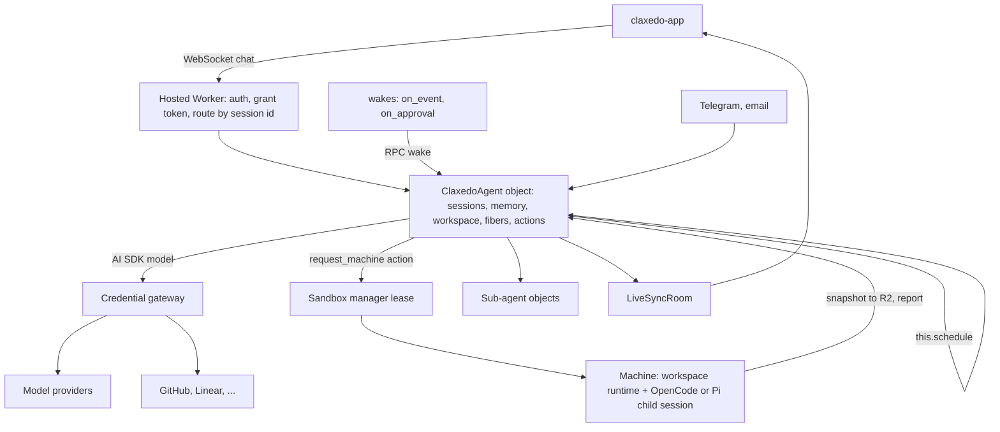

# Claxedo agent base tier: durable agents on Cloudflare, machines on demand

Execution prerequisite: complete [Pi normalization and split-mode removal, plan 004](./2026-09-05-004-pi-native-harness-remove-central-plan.md) first. That plan owns the native Pi adapter, credentials, consumer cutover, composer cleanup and central deletion. This plan adds the new durable work-session feature afterward; it does not contain a parallel copy of the refactor. The technical review findings for this feature still need resolution before its implementation.

## 1. In one paragraph

This plan moves Claxedo to two kinds of session. A **code session** starts on a machine with a fixed directory; the user picks local or cloud and a harness, and it runs exactly as it does today. A **work session** is a durable agent for everything that is not coding: a Cloudflare Durable Object that owns its conversation, memory, files and schedule, costs nothing while idle, and survives eviction mid-turn. It reads and edits files, opens pull requests, talks to connectors and channels, and remembers, without any machine. When a work session needs a real process, it leases a sandbox, runs a real coding harness there as a child session, and pulls the result back. The conversation never moves. Every harness, Pi included, runs where it was built to run: as a process on a machine. There is no central runtime. The substrate for work sessions is Cloudflare's Project Think; Claxedo writes the agent's configuration, the machine lease, the credential gateway, and the plugin projection.

## 2. Why this is needed

### 2.1 The product problem

After prerequisite plan 004, a Claxedo harness session cannot execute without a machine. A cloud session boots a sandbox before the first message; a local session needs a directory and a running harness. That is the right model for coding, and the wrong model for everything else the product is becoming: a long-lived assistant that remembers a person or a team for years, an agent that watches a repository or an inbox, a scheduled job, a Telegram bot, a session that opens a pull request from a phone. Those do not need a machine, they need durability. Forcing them onto machines has three costs.

- **Money.** A standard-1 container awake for the length of a chat costs about $0.074 per hour and pays for idle time between turns. A Durable Object costs about $0.006 per active hour and nothing while hibernated. For a twenty-turn-a-day chat over a month that is roughly $4 to $15 on a machine against $0.06 on an object. The difference is idle time, not compute.
- **Latency.** Our sandbox image is 5.3 GB. A session that sleeps between turns pays a boot on every wake. An object wakes in milliseconds.
- **Capability.** A machine session has no memory beyond its transcript, no schedule, no channel, no recovery if the process dies mid-turn. Building those on top of a process that may not be running is building them twice.

### 2.2 What was tried

The central Pi runtime was the first attempt at a machine-less session: a Pi loop hosted in the control plane process with tools bridged to a virtual filesystem or a remote machine. It could not be deployed on the hosted target, because it keeps sessions in process memory and workerd has no process. It gave the model one bash tool. It carried its own placement axis through identity, routing, contracts and the composer, so every session had three ways to be placed. It read developer credential stores from the server. The prerequisite refactor removes that runtime and cuts over its consumers before this feature begins.

Two further options were evaluated and are recorded in the tech docs: rebuilding that loop on workerd with `pi-agent-core`, and hosting OpenCode v2's workerd profile. Section 4 states why neither is the base.

### 2.3 What the base tier must be

- **Bootless.** No machine, no directory, no harness process before the first message.
- **Durable for years.** Conversation, memory and files persist; compaction keeps the context bounded; a turn interrupted by eviction resumes or is sealed cleanly.
- **The base of all kinds of agents.** Chat assistant, watcher, scheduled job, channel bot, all one substrate with different configuration.
- **Machine only when required.** Leased for a process, never for reading, writing or committing.
- **A layer over harnesses.** The coding harnesses stay upstream code running on machines. Claxedo does not own compaction, loops or tool implementations for them.

## 3. The rule that shapes everything

Claxedo is a layer over harnesses. We do not own harness internals. The coding harnesses, OpenCode, Pi, Claude Code, Codex, Cursor, run as processes on machines; Claxedo adapts, places, authenticates and renders them.

The base tier is the one deliberate exception, and it is not a coding harness. It is the product's own agent: what a Claxedo session is before it needs a machine. Its loop, persistence, compaction, recovery, memory, workspace and sub-agent primitives are upstream in Project Think and the Cloudflare Agents SDK. What Claxedo writes is configuration: which tools, which actions, which memory blocks, which policy. The plan keeps that subclass small and declarative so the exception stays an exception.

## 4. The decision and its alternatives

### 4.1 Project Think as the substrate

Project Think is Cloudflare's base class for durable agents, on the Agents SDK, MIT, published as `@cloudflare/think`. Read for this plan at 0.17.0 and from the `cloudflare/agents` repository:

- **Object per agent.** A Durable Object with SQLite, routed by name, hibernating between events.
- **Sessions.** A message tree with fork, non-destructive compaction as overlays, full-text search.
- **Memory.** Context blocks in the system prompt: writable blocks the model updates, skill blocks loaded on demand, search blocks, each with a token limit.
- **Durable execution.** Every turn runs in a fiber; `stash` writes a snapshot to SQLite synchronously; `keepAlive` holds the object; a recovery hook receives the snapshot after eviction; recovery budgets seal turns that keep dying.
- **Actions.** Tools with idempotency keys, permissions and approval policy. An action's ledger claim resolves as replay, pending, reclaimed or conflict, so a recovered turn never repeats a side effect. Approval pauses the turn until a human decides.
- **Workspace.** A durable filesystem on SQLite plus R2 with read, edit, grep and glob tools, and `isomorphic-git` for clone, commit and push without a machine.
- **Sub-agents.** Child objects with isolated SQLite and typed RPC.
- **Channels and schedules.** Telegram, email, cron and delayed tasks, workflows.
- **Evidence.** Recovery tests run on workerd in the repository: chat, tool rollback, stall, context overflow, submission, action ledger, workflow, messenger.

What it does not have: a machine tier. `createSandboxTools` is an unimplemented stub, and the bidirectional sync the announcement describes is not in code. Code execution and LLM-authored extensions require the Dynamic Workers closed beta. This plan builds the machine tier itself and does not use the beta tiers.

### 4.2 Alternatives and why not

| Option | What it is | Why not the base |
|---|---|---|
| Fix the central Pi runtime in place | Rehydrate from the durable log, adopt the shared turn lifecycle, add tools, remove the raw command path | Still Node-only; still Claxedo-owned persistence, compaction and tools; still one bash tool short of a harness; the primary target never gets it |
| Port that loop to workerd (plan 002) | A per-session object running `pi-agent-core` with Claxedo persistence, compaction, tools and a gateway | Writes a harness by hand: five to six thousand lines of the exact layer Think ships, with none of memory, actions, channels or tested recovery |
| OpenCode v2 workerd (plan 003) | OpenCode's own Durable Object profile; the harness upstream; a `WorkspaceDriver` seam to machines | The strongest layer-only option for a bootless coding harness, and a coding harness is the wrong base for an assistant: no memory, no channels, no action ledger, no schedules; beta on a dev dist-tag; 12 MB script. Kept as the alternative if the product later wants a bootless coding harness specifically |
| Stop after prerequisite plan 004 | Every harness session needs a machine | A valid independently shipped refactor; this follow-on feature adds durable agents |

The tradeoff accepted: Think is experimental, Cloudflare-only, and Claxedo authors a thin agent on it. In exchange the entire durable-agent substrate, sessions, memory, fibers, actions, workspace, sub-agents, channels, schedules, is upstream and tested on the target runtime.

## 5. Architecture

### 5.1 One placement model

A session is one of two kinds, chosen when it is created:

- **A code session.** A directory on a machine, local or cloud, with a harness picker: OpenCode, Pi, Claude, Codex or Cursor. Starts on the machine and stays there. Exactly what cloud and local sessions are today.
- **A work session.** A Durable Object keyed by session id, class `ClaxedoAgent extends Think`. No directory, no harness id, no machine. Created on first message. Attaches a machine only when an action needs one.

Plan 004 has already removed the central/VM split, hybrid route, tools-only bridge, virtual environment and per-harness execution-placement fields. This feature adds work-versus-code session identity while retaining the canonical harness selection for code sessions.

Pi is already a normal harness after plan 004: a `SdkRuntimeAdapter` with a driver that speaks Pi's RPC protocol over stdio, one process per session, Pi's own session file for persistence, registered beside Claude, Codex and Cursor, resolved on PATH like Claude's binary, authenticated through the same credential sync. Locally that spawns the user's `pi`; in cloud it spawns `pi` inside the sandbox through the same registry.

### 5.2 Inside the agent object

**Conversation.** The Sessions tree in the object's SQLite: `cf_agents_session_messages` with `parent_id` and `seq`, one active leaf, fork by message, compaction overlays that never delete, FTS5 search. Ten gigabytes per object is far above any conversation.

**Memory.** Context blocks rendered into the system prompt each turn. One writable block the model updates through `set_context` with a token limit; a skills block backed by installed plugins; a search block over the session. Memory is configuration, not code.

**Files.** The durable workspace on SQLite plus R2, with read, edit, grep, glob and list tools. `isomorphic-git` clones a repository at a pinned revision through the gateway's credential, and commits and pushes from the object. A pull request without a machine is a clone, an edit, a commit and a push.

**Execution.** `chat()` runs each turn in a fiber. `beforeTurn` assembles memory and the pinned repository into the prompt; the loop is `streamText` with `maxSteps`. Every side-effecting tool is an action with an idempotency key drawn from a domain identifier, never a request id. Approval-gated actions park the turn and surface a card; approval resumes the same turn from the stash.

**Recovery.** If the isolate is evicted mid-turn, the next wake evaluates recovery budgets before `onStart`, calls `onChatRecovery` with the stash, or seals the turn as interrupted. Settled actions replay their results; pending ones are reclaimed or reported.

**Sub-agents.** Parallel review, a watcher, a long-running task: a child object with its own SQLite and a typed RPC stub back to the parent, retained or deleted with the parent.

**Channels and schedules.** Telegram and email through the Agents SDK messengers; cron and delays through `this.schedule`, which is a Durable Object alarm waking the object that owns the work.

### 5.3 Credentials

No raw credential enters an object. The Worker front mints a session grant token per turn from the connections framework: subject session, allowed hosts and scopes, short TTL, a revocation generation. `getModel` returns an AI SDK model whose base URL is the credential gateway and whose key is that token; the gateway substitutes the real provider key or the OAuth token it refreshed itself, forwards, strips the credential from the response, and records usage. Connector actions call the gateway's paths with the same token. Machines use the same gateway and the same token; containers keep the existing JWT egress broker for non-model egress. Revocation bumps the generation and the gateway refuses on the next call.

**Bring your own subscription.** A work session uses whatever the user has connected, because `getModel` accepts any AI SDK model and the gateway is where provider differences live. Each connected provider is one gateway adapter:

| What the user connects | How it is connected | What the gateway does |
|---|---|---|
| API-key providers: Anthropic, OpenAI, Google, Kimi for Coding, Z.ai GLM coding plan, any OpenAI- or Anthropic-compatible endpoint | Paste a key in Connections; stored in the credential registry | Injects the key, forwards to the provider's endpoint; the agent uses `@ai-sdk/openai-compatible` or `@ai-sdk/anthropic` with the gateway as base URL |
| Codex subscription (ChatGPT plan) | The Codex OAuth device flow the registry already runs for the Codex harness, or import of an existing local login; the registry refreshes the token | Holds the refresh token, injects the access token, and speaks the ChatGPT backend's Responses dialect, the same translation Pi's `openai-codex` provider and OpenCode's Codex provider implement |
| Claude subscription | The Claude Code OAuth login the registry can already read; refresh handled by the registry | Injects the OAuth token on the Anthropic Messages API with the subscription headers |
| Gemini through a Google login (Gemini CLI, Antigravity) | Google OAuth against the Code Assist API, which Gemini CLI and OpenCode's Gemini provider use | Injects the token and speaks the Code Assist dialect. Antigravity itself has no documented API; whether its entitlement is reachable through that path is unverified and is a Unit 2 check |

The model picker lists models from providers the user has connected, the way the Pi catalog already projects "connected" from the registry. Subscription use outside the vendor's own client is subject to each vendor's terms; the product states that where the user connects one. Code sessions are unaffected: on a machine each harness performs its own login, and the registry sync provides keys and auth files as it does today.

### 5.4 Machines as leased caches

**When a machine is required.** A machine is leased when an action needs a process or a native harness, never for reading, writing or committing.

| Runs in the object | Needs a machine |
|---|---|
| Chat, planning, memory, connectors, channels, schedules, search | Any process: tests, builds, installs, dev servers, terminals |
| Reading, editing, grepping; commits and pull requests through the workspace and git | A native harness the user chose: OpenCode, Pi, Claude, Codex, Cursor |
| Skills, instructions, remote MCP servers | Stdio MCP servers, harness plugins, user extension code |
| | Model-written code execution, not offered until Dynamic Workers is generally available |

The `request_machine` action's description states this rule so the model does not lease a box to read a file.

**The lease.** The durable workspace is the truth; the machine is a cache with one writer at a time.

1. `request_machine` claims its ledger row with key `lease:<session>:<revision>`. A replay returns the settled result without a second lease.
2. Policy runs. Pre-approved compute proceeds; otherwise the turn parks on an approval card.
3. The sandbox manager leases or resumes a box and prepares the checkout at the revision through worktree admission, or materializes an archive of the workspace from R2 when there is no repository.
4. The object's workspace tools become read-only for the lease's duration.
5. A child session is created with the host-minted subagent identity and parent link, and a real harness runs there over the existing adapter with a brief as its first input and, if useful, an export of the conversation.
6. On completion or idle, the machine checkpoints; the object fetches the commit into the workspace with `isomorphic-git`, or imports the archive; the workspace is writable again; the action settles with the child's report.
7. The box sleeps with its checkout for the next lease.

A dropped connection to the child yields an unknown result on the action; nothing is re-run. The parent never blocks on a machine it cannot see.

### 5.5 Scheduling: wakes and Agents schedules

Claxedo already has `@claxedo/wakes`: durable records with three triggers, time, event and approval, a `pending → firing → fired` state machine with compare-and-swap transitions, lease reclaim on boot, idempotency keys, at-most-once effect receipts, serial lanes, budgets, expiring approval tokens with authorization, and a hosted driver, `WakeLane`, built on Durable Object alarms. The Agents SDK's `this.schedule` is the time trigger done natively: a SQLite row and an alarm inside the object that owns the work, with retry options, no event or approval triggers, no idempotency, and no cross-object coordination.

Ownership by trigger:

- Time triggers inside an agent use `this.schedule`. `WakeLane` retires for agent sessions; wakes' `at` trigger remains for control-plane jobs that are not an agent.
- Event and approval triggers stay in wakes. Plan 004 has already removed central-loopback execution. Add an explicit work-session destination alongside the existing machine-session sink. Ordinary events use idempotent durable submission; approval decisions settle the authorized parked execution by its execution ID. They must not be represented merely as a new chat turn saying approved.
- Side-effect safety inside a turn is Think's action ledger; wakes' `once()` covers effects the control plane performs on a wake's behalf.

### 5.6 Agent plugins in the object

An installed plugin is a manifest, skills and MCP servers, activated per target as an immutable generation with a lock and a trust record, and materialized into each harness's home by adapters for Claude, Codex, Cursor and OpenCode. That shape maps onto the agent without a new asset kind:

- skills become the agent's skill sources, listed in the skills block and loaded on demand;
- remote MCP servers become entries in the agent's MCP client through the shared MCP projection;
- stdio MCP servers and harness plugin roots are marked machine-only, shown as "requires a machine" in the install sheet, and materialize onto the machine on lease through the existing adapter for the child's harness.

Activation gains an `agent` target with the same generation, lock and trust path. One `think` projection adapter beside the four that exist.

### 5.7 No user-facing surface in this plan

Work sessions ship as infrastructure first. This plan adds no composer choice, no new screens and no new cards. The composer keeps showing exactly what it shows today for code sessions. A work session is created programmatically: by the control plane for wakes and channels, by an API or MCP call, or by a later product surface. When one needs to be inspected, the existing session transcript reads its events through a thin adapter over the Agents SDK chat protocol, which is enough for operators and for tests.

The reason to hold the UX: the work session is the base for durable agents, and its first users are agents, not people in the composer. Designing the human surface before the base exists would fix the wrong things first. The sketch below records what that surface is expected to become so the infrastructure does not preclude it; none of it is in scope here.

What a user would eventually see in a work session:

- New chat is one field and a model picker. No project chooser, no machine status.
- A model picker that lists what the user has connected: API keys and subscriptions alike, resolved through the gateway (section 5.3).
- A context strip: pinned repository and revision, memory on, workspace file count. Memory opens the editable blocks; Files opens the durable workspace with the same Files and Changes affordances the environment card has today.
- A machine card in the transcript when the agent asks: "Needs a machine to run the test suite", Start or Not now, then Starting, then Ready, then the child session as a nested card with its own live transcript, collapsing to its report when done.
- An approval card for gated actions: what, on which resource, risk, Approve or Reject. Closing the tab does not lose it; it waits in the object and in notifications.
- History search and fork-from-here on any user message.
- Sub-agent runs as sibling cards under the parent turn.
- Channel settings for Telegram and email.

## 6. How this simplifies the system

| Today | After |
|---|---|
| Three ways to place a session: central, workspace-runtime tool sandbox, machine | Two kinds: code session on a machine, work session in an object |
| Pi has its own runtime, model backend, credential readers and placement fields threaded through the workspace runtime, the local server and the self-hosted app | Pi is one native adapter like the other four |
| A central runtime of 1,300 lines composing routes, credentials, metering, wakes, subagents and placement, plus a 230-line wrapper and a 2,600-line Pi harness with a tools-only bridge on both sides | Deleted. The object composes upstream primitives with configuration |
| Wakes fires turns by loopback HTTP into a process that exists only on self-hosted Node | Wakes calls an RPC on the object; time triggers are alarms in the object |
| Subagents are a central-only tool that shares the parent's checkout | Sub-agents are child objects; machine children are leased sessions with their own checkout |
| Credentials reach a hosted loop through developer stores and env gates | One gateway, one grant token, for objects and machines alike |
| Memory, channels and schedules are plans | Upstream, configured |

Ownership after the change: identity and authority in D1; conversation, memory and files in the object; machines in the sandbox manager; credentials in the gateway; harnesses on machines. Each fact has one owner.

## 7. Tradeoffs and risks

- **Claxedo authors the base agent.** Prompt, tools, actions, policy, memory blocks, the compaction function, model policy. This is the exception to the layer rule. Mitigation: the subclass stays declarative and under about fifteen hundred lines with no loop, persistence or compaction code, so churn lands in few files.
- **Think is experimental.** 0.17, changing weekly, `think.ts` is sixteen thousand lines we do not control. Mitigation: exact pins for `@cloudflare/think`, `agents` and `@cloudflare/shell`; scheduled bumps gated by a Miniflare suite that must fail under Node by construction.
- **Cloudflare-only.** The object runs on workerd, including open-source workerd, but not on Node. The Node self-host control plane on Fly cannot host agent sessions; self-host is machine-only unless a Node base tier is built later.
- **Two message formats meet at the machine.** The object holds AI SDK messages; the machine runs a real harness. The boundary is a tool result, so nothing converts and the conversation never moves. A child's own transcript is its own session.
- **Beta primitives near the edges.** Code execution and extensions need the Dynamic Workers closed beta and are out of scope. Sub-agent facets and messengers are documented without a flag; the spike records every binding touched, and sub-agents degrade to leased child sessions if facets are unavailable.
- **Cold start and limits.** An object gives 128 MB and 30 s CPU per request, reset by each request. First-token times cold and warm are unmeasured until the spike.
- **Snapshot back on large repositories.** Git commits carry only the delta; archives are used only for non-git workspaces. Timing is measured in the spike.
- **Workspace-less chat does not exist on self-host.** Stated, not hidden.

## 8. Costs

| | Agent object | Machine |
|---|---|---|
| Per active hour | about $0.006 | standard-1 $0.074, standard-2 $0.13, standard-3 $0.22 |
| Idle | $0, hibernated | $0 asleep, but disk does not survive sleep without a checkpoint |
| Twenty-turn-a-day chat, one month | about $0.06 | $4 to $15 depending on idle timeout |
| One thirty-minute coding burst | | $0.07 to $0.11 |
| A thousand concurrent sessions | about $6 per hour | $74 per hour on standard-1, before the account cap |

Included allowances on Workers Paid cover about 870 hours of active object time and about twelve hours of one standard-1 per month.

## 9. What Claxedo owns

| Piece | Size | Nature |
|---|---|---|
| `ClaxedoAgent` subclass: prompt sections, tool set, actions, context blocks, policy hooks, compaction function, model policy | about 1,500 lines | The exception to the layer rule; declarative |
| Machine lease action and snapshot back | about 1,000 lines | Over the sandbox manager, worktree admission, checkpoints |
| Credential gateway and Worker front | about 1,000 lines | Same gateway serves machines |
| `work` session kind and read-only transport | a few hundred lines | Infrastructure; the human surface is deferred |
| `think` plugin projection adapter and `agent` activation target | a few hundred lines | Beside four existing adapters |
| Pi RPC driver and event adapter | Implemented in plan 004's worktree; its release acceptance remains open | Reuse after plan 004 completes; no implementation unit here |
| Wakes RPC sink and schedule mapping | small | |
| Pinned dependencies: `@cloudflare/think`, `agents`, `@cloudflare/shell`, one Pi version | | Bumps gated by the suite |

Already removed by prerequisite plan 004: central runtime and wrapper, Pi central harness/model backend, session-env bridge, virtual environment, obsolete dependencies, hybrid route and split-only client/contracts. Do not count those deletions as savings delivered by this feature. Measure this plan's new maintained code against the completed plan-004 baseline.

## 10. Delivery

### Prerequisite — completed native harness refactor

[Plan 004](./2026-09-05-004-pi-native-harness-remove-central-plan.md) is a separate delivery, executed and verified first. No Unit 0 tasks remain here. Its completion evidence must cover Pi on local and cloud machines, canonical credentials/events, current consumer cutover, removal of legacy compatibility paths and complete split-mode removal. No old central-session migration is a prerequisite for this feature.

### Phase 1 — Prove it

- [ ] **Unit 1: Spike under Miniflare and on staging.** `ClaxedoAgent` with one writable memory block, workspace read and edit, an `isomorphic-git` clone of a private repository through a gateway stub, a `request_machine` action leasing through the sandbox manager and spawning an OpenCode child that edits a file and returns a report, snapshot back, evict mid-turn, resume. Record cold and warm first-token times, object boot, and every closed-beta binding touched. Done when the flow passes under Miniflare with a workerd-only assertion and once on staging, the numbers are in this document, and no closed-beta binding is required. Progress:

### Phase 2 — Object and app

- [ ] **Unit 2: Agent object, Worker front, gateway binding.** The subclass in production shape; tenant resolution and grant minting; `getModel` bound to the gateway; the object registered in the hosted config renderer. Done when a workspace-less session is created and streamed through the public route on hosted workerd, eviction mid-turn recovers, and usage rows match assistant messages one to one. Progress:
- [ ] **Unit 3: Session kind and read-only transport.** `work` in identity and authority; a thin adapter from the Agents SDK chat protocol into the existing event model so a work session's transcript can be read in the app and asserted in tests. No composer entry point. Done when a programmatically created work session renders in the existing transcript component, reconnect resumes the stream, and the composer is unchanged. Progress:

### Phase 3 — Machines, memory, channels, plugins

- [ ] **Unit 4: Machine lease and snapshot back.** The action, the lease, materialization by clone or archive, the read-only rule, the child session with subagent identity, the report, the checkpoint fetch, sleep and resume. Done when a session leases a machine, the child runs tests and opens a pull request, the report lands as the action result, the workspace reflects the machine's commit, a second lease resumes the same box, a replayed action returns the settled result without a second lease, and a killed child yields an unknown result with no re-run. Progress:
- [ ] **Unit 5: Memory, workspace and approvals as APIs.** Read and write memory blocks, list and read workspace files and changes, list and settle parked approvals, search and fork history, all through the control plane API and MCP, with no screens. Done when an edited memory block shapes the next turn, and an approval-gated action pauses, is approved through the API after the object hibernates, and resumes. Progress:
- [ ] **Unit 6: Channels, schedules and wakes.** Telegram and email; `this.schedule`; the wakes RPC sink; `WakeLane` retired for agent sessions; `schedule_followup` on `this.schedule`. Done when a Telegram message reaches an agent and its reply returns, a scheduled task wakes a hibernated object, a channel event through wakes enqueues a turn, and an approval resolved through a wake token resumes the object. Progress:
- [ ] **Unit 7: Agent plugins into the object.** The `think` projection adapter and the `agent` activation target. Done when an installed skill loads in the agent, a remote MCP server's tools are callable from the object, a stdio server shows "requires a machine" and is reachable from the child after a lease, and generation and revocation behave as for harness targets. Progress:

### Phase 4 — Docs

- [ ] **Unit 8: Repository docs.** Plans index and a written record of the deferred human surface from section 5.7. Done when the index keeps plan 004 as the completed prerequisite and this plan as the work-session feature; active product copy exposes no obsolete split-execution mode. Technical references to Cloudflare Workers and superseded design documents remain valid; no legacy central-record compatibility is required. Progress:

### Parallel execution

No work in this plan runs in parallel with prerequisite plan 004. After that refactor is complete and Unit 1 passes, Units 2, 3 and 4 run in parallel: the object and Worker front; the read-only transport; the lease and snapshot path. Units 5, 6 and 7 run in parallel after Unit 2. A verification agent runs the Miniflare suite, the hosted import-graph guard and the architecture ratchets after each unit. Every acceptance test runs on real workerd or a real pinned binary; a scripted model stream satisfies no unit.

## 11. Open questions

- Object per session or per tenant with many conversations: per session by default, upstream's shape; revisit with Unit 1 numbers.
- How much conversation the child brief carries: a summary plus the workspace by default, a full export on request.
- Snapshot back by git for every repository or only git-backed workspaces: git when the workspace has a repository, archive otherwise.
- Whether sub-agent facets need an account flag: recorded by Unit 1; child sessions on machines are the fallback.
- Pi credential-directory ownership is resolved by plan 004 and is not reopened here: use its canonical native harness integration.

## 12. Sources

- Tech docs: [Project Think evaluation](../tech-docs/project-think-evaluation-2026-09-05.md), [OpenCode v2 workerd evaluation](../tech-docs/opencode-v2-workerd-evaluation-2026-09-05.md), [architecture comparison](../tech-docs/opencode-v2-vs-project-think-architecture-2026-09-05.md), [pi-coding-agent package review](../tech-docs/pi-coding-agent-package-review-2026-09-05.md).
- Plans 001 to 003 are superseded placement proposals. [Plan 004](./2026-09-05-004-pi-native-harness-remove-central-plan.md) is the active standalone prerequisite and owns the native Pi refactor and removal map.
- `cloudflare/agents` at `main`: `packages/think/src/{think,session}.ts`, `packages/think/src/tools/*.ts`, `packages/agents/src/sessions/core.ts`; Agents SDK docs for sessions, sub-agents, durable execution, scheduling and retries; Cloudflare pricing for Containers, Durable Objects and Workers.
- This repository: `packages/wakes/src`, `packages/sandbox-manager/src`, `packages/claxedo-server/src/connections`, `packages/claxedo-local-server/src/agent-plugins/runtime/adapters`, `packages/agent-sdk-runtime/src/harnesses/shared/sdk-runtime-driver.ts`, `packages/claxedo-server/src/hosts/workspace-runtime/runtime-boot.ts`.
