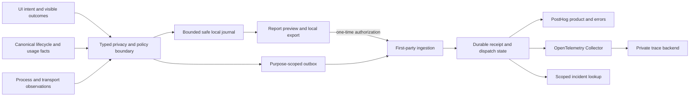

# Reliable product reporting, error reporting, and distributed tracing

## Goal capsule

When something breaks, support should be able to identify the last successful boundary, the first observed failure, the affected release/runtime, and any missing evidence. Product should know which features people actually use, whether they reach the intended outcome, and where progress stops. Neither capability should require collecting prompts, code, terminal content, file paths, credentials, or other user content.

This plan covers unsigned local, signed local, hosted, and user-hosted execution. It is a proposed implementation contract, not a claim that these capabilities exist today or authorization to purchase services or deploy infrastructure. Defaults and budgets below are explicit proposed decisions. Ship complete slices behind policy controls, then qualify the real distribution artifacts.

## Product Contract

### Problem and current answer

**Current coverage is insufficient for dependable incident reconstruction or trustworthy adoption and abandonment measurement.** We have useful PostHog events, selected exception capture, local logs/profiling, relay timing, and an unused tracing package. These do not form an end-to-end reporting system. Successful telemetry unit tests do not establish coverage of packaged desktop, cloud workers, native harnesses, or disconnected clients.

Product analytics answers **what people use and whether they succeed**. Error reporting answers **what failed, where, and for whom within the allowed reporting scope**. Tracing answers **how an operation progressed across components and where time or failure accumulated**. They share safe context and correlation, but have separate schemas, purposes, access, retention, and export policies. Billing/resource accounting remains a fourth, authoritative system; analytics must not become another usage ledger.

This plan supersedes the tracing exclusion and privacy assumptions in `docs/plans/2026-07-28-001-feat-posthog-observability-plan.md`. Keep PostHog for product events and error investigation; introduce a dedicated trace pipeline. Existing event names are not evidence of complete producer coverage.

### Actors and user flows

**F1 — Unsigned local user, including offline use.** Local execution maintains a bounded, sanitized diagnostic journal, subject to the user's local diagnostics setting. Optional product reporting and automatic remote diagnostics start disabled until the user chooses. A user can open **Help → Report a problem**, select a recent incident/time window, inspect the exact structured bundle and omissions, then export it locally or explicitly upload that bundle without creating an account. An upload does not enable future telemetry. Offline export works; upload clearly waits for connectivity or fails with retry available.

**F2 — Signed user running locally.** Signing in does not move execution to the cloud or silently enable reporting. Device-local collection restrictions still apply. An explicitly permitted diagnostic report can be associated with a purpose-specific account identifier, allowing authorized support correlation. Signing out never relabels queued records as the next user. Work from two accounts or organizations on one machine remains isolated.

**F3 — Signed user using hosted or remote execution.** A user submits an action. The UI records intent; the accepting service records acceptance; provisioning/relay/runtime/harness boundaries record their own facts; persistence and transport record delivery; the UI records visible success when it actually renders the result. Hosted services always retain the minimal operational evidence required to run the service under the deployment policy. Optional user analytics and client diagnostics remain separate choices. A local UI may drive cloud execution, and a web UI may drive a user-hosted machine: encode these dimensions separately.

**F4 — Product investigation.** A product owner selects a feature and sees eligible reporting users, starts, accepted operations, successful outcomes, failures, explicit cancellations, inferred abandonment, unknown outcomes, and reporting coverage. The owner can distinguish an unused feature from one that is unavailable or unobserved. Counts use deduplicated canonical facts rather than clicks or retries.

**F5 — Privacy and deletion.** Settings show what stays on the device, what leaves it, the destination, retention, current consent, and pending uploads. Disabling a purpose stops new collection/export for that purpose and removes its unsent data. A separate deletion action requests removal of already uploaded data and reports pending/offline state honestly. Local export and one-time reporting remain distinct controls.

**F6 — Crashes and hangs.** When the renderer, daemon, or harness dies, a surviving supervisor records the process exit or hang and the last acknowledged milestones. On next launch, a clean/unclean shutdown marker can identify an interrupted process. Dead processes cannot flush their final stack; show that limitation. Renderer death must not manufacture cancellation of a turn that continues elsewhere.

**F7 — Retry and reconnect.** Retrying a request or reconnecting SSE/WebSocket transport creates a new attempt/connection identity linked to the same logical operation where the canonical owner confirms that relationship. Replayed transport events do not count as new turns. A reporting retry can never trigger another product operation.

### Requirements

| ID | Contract |
| --- | --- |
| R1 | Separate product events, incidents, traces, and authoritative usage accounting. Policy and retention are purpose-specific. |
| R2 | Record UI surface, identity state, deployment type, execution location, runtime/harness, release, and environment independently using bounded enums. |
| R3 | Use random local installation identity and purpose-specific account/organization pseudonyms. Organization is optional for personal use; no fabricated tenant. |
| R4 | Treat pseudonyms and linkable diagnostic IDs as sensitive metadata. Unsigned installation counts are not people counts; never silently merge pre-login history into an account. |
| R5 | Separate local recording, optional remote product reporting, optional automatic diagnostics, necessary hosted operational diagnostics, and one-time report authorization. Sign-in is not consent. |
| R6 | Instrument actual shipped entrypoints, early startup failures, and enabled runtime paths, including background jobs and supervisors. |
| R7 | Propagate validated trace context across supported HTTP, IPC, subprocess, relay, stream, durable-job, and runtime boundaries; represent asynchronous causality explicitly. |
| R8 | Retain bounded critical milestones without ordinary sampling where reporting is enabled and within qualified capacity. Show sampling, drops, unsupported boundaries, and incomplete traces explicitly. |
| R9 | Distinguish intent, acceptance, execution, persistence, delivery, and visible outcome. Business outcomes come only from their authoritative producer. |
| R10 | Capture safe exceptions and process failures with stable grouping, release/build identity, and private symbolication. Unknown crash causes stay unknown. |
| R11 | Reporting failure cannot change product success, retries, cancellation, process exit, daemon residency, or the authoritative business transaction. |
| R12 | Use bounded durable delivery where available, stable record IDs, scoped deduplication, explicit acknowledgments, retry/expiry policies, and observable loss. |
| R13 | Provide preview, export, and one-time upload of safe incident bundles, without an account requirement. A report receipt is not a public read credential. |
| R14 | Manual reporting authorizes only the reviewed immutable bundle. Free text is optional and separately disclosed; raw logs, content, and native memory dumps are excluded. |
| R15 | Enforce account/organization/report scope on every ingestion, lookup, export, and deletion path. Client-supplied identity is not authoritative. |
| R16 | Maintain a typed event/metric registry with an owner, producer, eligibility rule, denominator, outcome semantics, and privacy schema for every supported feature. |
| R17 | Model abandonment as a revisable inference with time and coverage requirements. Disconnection, missing evidence, and ongoing work are not automatically abandonment. |
| R18 | Derive resource summaries from the canonical revision-aware usage ledger. Preserve unknown/null values, corrections, and settlement state. |
| R19 | Validate an allowlist before local persistence and before network export. Reject arbitrary attributes and user content rather than relying on regex redaction or path hashing. |
| R20 | Disable unapproved SDK automatic collection and sanitize exception chains, frames, breadcrumbs, request metadata, and release artifacts. |
| R21 | Monitor reporting health independently of the reporting pipeline, with canaries, loss counters, delivery lag, privacy alarms, and incident runbooks. |
| R22 | Cut over producers and consumers together, remove obsolete reporting paths, and document schema boundaries. Do not synthesize missing business facts or introduce compatibility fallbacks. |
| R23 | Consolidate existing event, incident, timing and delivery mechanisms according to C1–C11 below. One owner per responsibility; no parallel legacy and replacement emitters at completion. |
| R24 | Implement the explicit J1–J18 journey inventory below, including eligibility, observed milestones, canonical success, typed failure and unknown outcomes. Unsupported product capabilities are excluded explicitly. |
| R25 | Connect reporting to the existing performance instrumentation and agent-app benchmark contracts. Preserve measurement endpoints, provenance, validity, sampling and benchmark/field separation; do not publish proxy timings as equivalent benchmark scores. |

### Acceptance examples

- **AE1:** An unsigned user with optional reporting off generates no automatic product/diagnostic requests, can inspect and export a safe local report, and can authorize exactly one upload.
- **AE2:** A cloud harness fails after accepting a turn. The incident links the accepted turn to the observed failing boundary and release; visible-outcome evidence accurately shows whether the client saw the failure.
- **AE3:** The reporting server persists a record but its acknowledgment is lost. Retrying yields one logical record, without resubmitting the user's turn or repeating usage charges.
- **AE4:** Account A signs out and B signs in on the same machine. A's queued data cannot be associated with B or queried through B's organization.
- **AE5:** Killing the renderer while a remote turn continues creates a renderer incident and a delivery gap, not a fabricated turn cancellation.
- **AE6:** A late completion revises an inferred-abandoned funnel instance to completed. The original facts stay immutable and reports show the revision.
- **AE7:** Synthetic secrets, emails, paths, prompt text, repository URLs, and nested user content never appear in persistent journals, outbound payloads, vendors, or default bundles.
- **AE8:** Collector failure, disk pressure, or ingestion throttling leaves the product usable, with bounded resource consumption and explicit reporting loss/lag.
- **AE9:** A controlled benchmark action and its reporting record agree on the same action interval and readiness milestones within the benchmark's declared tolerance. Invalid, bounded, unsupported and missing measurements cannot become zero or passing results.
- **AE10:** After cutover, one accepted turn produces one canonical outcome projection; old browser/Node/Worker emitters do not also count it. Its safe performance evidence appears in local inspection and permitted reporting from the same observations.

### Scope boundaries and sequencing

Cover currently shipped onboarding, authentication, provider connection, workspace creation/opening, sessions/turns, terminal, review, document/canvas actions where available, plugins/connectors, remote/cloud setup, sharing/collaboration, settings, updates, and background execution. Inventory actual producers before enabling a feature's dashboard. Future features must enter through the same registry, but this work does not implement Project Think or other planned product features.

The active Pi native-harness refactor in `2026-09-05-004-pi-native-harness-remove-central-plan.md` executes first. Instrument its settled canonical runtime, not central/VM paths scheduled for removal. Schema, privacy, and delivery work can be designed independently; schedule overlapping production edits after that refactor. This plan does not reorder plan 005 relative to 004.

Exclude session replay, screenshots, DOM text capture, prompt/completion capture, terminal recording, arbitrary file attachment, raw CPU profiles, and native minidumps from the default system. These require separate product/privacy designs if ever requested.

## Planning Contract

### Observed implementation and gaps

These are source observations from the planning audit, not deployed-environment verification. The checkout is actively changing; revalidate named owners at each implementation unit.

| Current owner | Observed behavior | Change required |
| --- | --- | --- |
| `packages/claxedo-app/src/platform/telemetry/analytics.ts` | Lazy PostHog initialization behind mode/key; captures unhandled exceptions; permissive event properties; desktop classified as local. | Typed purpose-specific boundary; explicit SDK settings; real execution context; safe exceptions. |
| `packages/claxedo-app/src/app/integrations/telemetry-identity.tsx` | Identifies signed users and groups organizations; resets on sign-out. | Purpose-specific identity and policy scopes; no automatic historical linking. |
| `packages/claxedo-app/src/platform/telemetry/redact.ts` | Shallow slash-string hashing with noncryptographic FNV. | Remove as privacy boundary; prohibit paths and arbitrary nested fields. |
| `packages/claxedo-app/src/app/app-shell-state.ts` and `app/app-state-snapshot.ts` | Shell actions and a delayed snapshot provide selected activity evidence. | Register meaningful actions/outcomes; snapshots cannot measure sustained use. |
| `packages/claxedo-app/src/features/onboarding/funnel.ts` | Defines onboarding events; not every defined event has a production producer. | Verify actual entrypoints and eligibility before declaring funnel coverage. |
| `packages/claxedo-app/src/features/session/composer/ui/submit.ts`, `features/session/composer/ui/submit-normal-prompt.ts`, `features/session/submit/post-submit.ts` | Existing prompt reporting happens before the asynchronous send is accepted. | Split intent from canonical acceptance and outcome; never call this existing event a completed turn. |
| `packages/claxedo-app/src/features/session/store/session-status-telemetry.ts` | In-process status/debug evidence. | Correlate safe lifecycle facts without exporting debug state wholesale. |
| `packages/claxedo-app/src/features/session/telemetry/turn-outcome.ts` and `features/session/onboarding/first-turn-onboarding.tsx` | The current checkout also has a transcript-derived `turn_completed`/`turn_failed` classifier with caller-owned in-memory deduplication. | Reuse useful safe failure categories; replace this as an authoritative outcome producer with canonical lifecycle projection. Keep client observation separately named. |
| `packages/claxedo-app/src/platform/performance/session-perf.ts` | Separate always-on ring/marks for session open and request timing; includes arbitrary attributes, URLs, directory context at callers, and raw error strings. | Preserve measurement points, replace storage and permissive payloads with typed observations; never upload this ring wholesale. |
| `packages/claxedo-app/src/platform/performance/renderer-trace.ts` | Harness-armed renderer marks/phases; no timing reads on its ordinary disabled path. | Retain the narrow phase-measurement responsibility and benchmark evidence; share typed observations with a policy-bound reporting subscriber. |
| `packages/claxedo-app/src/features/terminal/core/benchmark-observer.ts` | Benchmark-only accepted/parsed write receipts include data and serialization callbacks. | Keep synthetic correctness validation benchmark-only; add a separate safe numeric projection at the same backend observation boundary, never export the raw receipt. |
| `packages/claxedo-app/perf-harness/src/agent-metrics.ts`, `agent-app-benchmark.ts`, `public-agent-app-driver.ts` | Internal nine-metric benchmark and public framework driver already own useful measurement/validity contracts. | Reuse those contracts and preserve independent benchmark authority; U17 adds parity and safe field measurement, not a new benchmark runner. |
| `packages/claxedo-app/src/app/routes/error.tsx` | Raw exception capture and copyable error details; no reviewed support-bundle upload flow. | Safe incident receipt plus report/preview/export entrypoints. |
| `packages/claxedo-desktop/src/main/telemetry.ts` and `src/main/install-telemetry.ts` | Main-process exception reporting; install marker/UUID; no unified per-operation trace. | Safe process incident broker and durable reporting identity/delivery. Marker-before-send must not lose install evidence. |
| `packages/claxedo-desktop/src/main/logging.ts`, `src/main/windows.ts`, `src/main/diagnostics/profiler.ts` | Rotating local logs, renderer diagnostics, bounded profiling; some failure evidence stays local. | Safe structured journal and supervisor incidents. Raw logs/profiles are not an export source. |
| `packages/claxedo-desktop/src/main/diagnostics/ipc.ts` | Validates sender/frame/origin for diagnostics IPC. | Reuse this security boundary for narrowly scoped safe diagnostic/report operations. |
| `packages/claxedo-desktop/scripts/claxedo-server-entry.ts` and `packages/claxedo-local-server/src/app/local-services.ts` | Actual desktop local-server startup does not inject reporting; local services default to a no-op sink. | Wire reporting through real startup composition, while preserving valid reporting-disabled behavior. |
| `packages/claxedo-server/src/platform/auth/worker-telemetry.ts` | Fire-and-forget product POST; response not checked; error helper lacks production callers in audited search. | Durable ingestion path, response handling, Worker lifetime wiring, actual error producers. |
| `packages/claxedo-server/src/deployments/hosted-workerd/core-worker.cf.ts` | Core Hono handler logs unexpected errors; composition/early failures are separate. | Instrument both actual exported Worker entrypoints and composed handlers. |
| `packages/claxedo-server/src/platform/telemetry/errors/` and `deployments/self-hosted-node/app.ts` | Existing Node error-sink seam; mutable/global patterns cannot represent concurrent Worker tenants. | Reuse responsibility with request-scoped context and separate runtime adapters. |
| `packages/claxedo-server/src/platform/telemetry/product/` and `session/runtime.ts` | Existing central-path product/metering events do not establish native-runtime coverage. | Project canonical native lifecycle and usage facts; remove superseded central producers. |
| `packages/claxedo-telemetry/src/{trace-context,tracer,span,exporter}.ts` | Explicit W3C context/tracer implementation has no audited production integration. Export queue removes batches before successful delivery; no durable retry/periodic flush. | Extend this package as the canonical contract/context owner; replace lossy transport behavior. |
| `packages/workspace-relay/src/cloudflare.ts` and `packages/workspace-runtime/src/server.ts` | Custom trace header and sampled timing help selected HTTP paths. | Coordinated W3C propagation and operation/attempt correlation through streaming and tunnels. |
| `packages/workspace-runtime/src/workspace-relay-host-tunnel.ts` | Multiplexed HTTP/channel forwarding carries request/channel identity. | Preserve trace context per request/channel, cancellation, and backpressure; never one global connection context. |
| `packages/agent-sdk-runtime/src/harnesses/shared/` | Native adapter, turn lifecycle, process lifecycle, and turn projection own execution facts. | Instrument these authorities, respecting cancellation vs teardown and per-harness capabilities. |
| `packages/agent-event-runtime/src/projections/debug-trace/projection.ts` | Rich raw diagnostic projection. | Do not export it directly; select safe facts at the authoritative boundary. |
| `packages/claxedo-server-core/src/usage/` and `packages/claxedo-local-server/src/usage/outbox-sync.ts` | Revision-aware canonical ledger and synchronization already exist. | Reuse ledger ownership; analytics is a downstream deduplicated projection. |
| `.github/workflows/release-claxedo.yml`, `.github/workflows/deploy-claxedo-app.yml`, `packages/claxedo-server/scripts/deploy/` | Build-time reporting settings, optional source-map upload, and multiple certified Worker variants. | Qualify the actual release artifact and every deployed entrypoint; a configured flag is not delivery proof. |

### KTDs: architecture and ownership

**KTD1 — One neutral contract/context package.** Extend `packages/claxedo-telemetry` with schemas, privacy validation, trace context, policy interfaces, and bounded observation APIs. Export explicit browser, Node, and Worker adapters so browser/Worker bundles cannot accidentally import Node persistence or a vendor SDK. Applications own their event meaning; this package owns transport-independent safety and correlation.

**KTD2 — A first-party reporting service.** Introduce `packages/claxedo-observability` with narrowly scoped ingestion, receipt/status, report, identity mapping, and deletion responsibilities. It runs independently of the product API so product-startup failures remain reportable. Use Cloudflare Worker/D1/R2/Queues capabilities already in the deployment environment; verify account entitlements during infrastructure setup. Keep auth verification behind the existing canonical auth contract with a narrow adapter—do not pull the product runtime into this service or implement a second session authority.

**KTD3 — Use established storage/query backends.** Keep PostHog for product events and error grouping. Send traces through an OpenTelemetry Collector to a managed Tempo-compatible trace backend, with private operator access. The trace adapter targets OTLP, keeping the app independent of the provider. Qualify late-span behavior, retention, deletion semantics, cost, and region before provisioning. Use a pinned disposable backend for local verification; do not invent a production self-hosted trace cluster. Vendor procurement/credentials are deployment dependencies, not reasons to omit the implementation contract.

**KTD4 — Purpose-scoped identities.** A random installation identifier is local state, not a hardware fingerprint. Export separate product and diagnostic pseudonyms only under their policies. A first-party mapping service derives/maps signed account and organization pseudonyms using purpose-separated keys; raw auth IDs do not go to vendors. Records keep immutable capture-time identity/policy scope. Browser and request contexts cannot share a mutable global current user. Early startup can record identity-free operational facts; it must not invent a user or organization. Any later association is an explicit authorized mapping, not a rewrite of history.

**KTD5 — Safe by construction.** Typed registries admit bounded enums, numbers, booleans, opaque scoped IDs, and approved symbolication fields. No arbitrary property bag, generic serialized Error, request/response body, tool arguments, tool output, headers, URL query, path, hostname, repository name, document title, email, or user-entered provider/model label. Known provider/model families use a maintained catalog; custom values become the truthful category `custom`, not a hash. Reject unknown fields before persistence; send only sanitized records. Regex detection is a second defense and regression tool, not the privacy architecture.

**KTD6 — W3C context with explicit lifecycle.** Use `traceparent`/`tracestate` for trusted first-party HTTP boundaries, explicit validated envelopes for IPC and streams, and span links for delayed/background/retry work. No arbitrary baggage. Keep logical operation ID, attempt ID, connection generation, and trace ID distinct. Traces describe attempts and bounded phases; long-running operations link successive traces so one multi-hour turn does not depend on a single in-memory root span. The existing HTTP CORS owner already allows trace headers; preserve its credential/security rules rather than broadening origins.

**KTD7 — Business facts remain canonical.** Acceptance, terminal outcome, persistence, and resource use are emitted/projected from their owners. Reporting may observe a committed fact or replay a retained canonical event log into its own atomic projection-cursor/outbox transaction. A reporting write cannot be added as a failure condition to the business transaction. Replay requires capture-time reporting eligibility stamped by the canonical producer; absent historical eligibility means no export, not assumed consent. There is no historical backfill on later opt-in. If the source log expires before projection, report a coverage gap; do not manufacture success/completion. Transient UI intent is explicitly best effort.

**KTD8 — At-least-once delivery, not exactly-once claims.** Assign a stable event ID before persistence. Deduplicate within purpose/scope/event ID, with revision-aware reducers for corrected facts. A receipt means first-party durable acceptance, not immediate visibility in PostHog or the trace backend. Track each destination separately. Propagate the stable ID into vendor adapters and prove actual dashboard deduplication; vendor retries must not inflate metrics. Persist payload plus receipt before queue dispatch and reconcile accepted-but-not-enqueued receipts. Partial failure between storage, receipts, and queue is an explicit recoverable state.

**KTD9 — Critical evidence and optional detail.** Always capture a bounded critical sequence for reportable operations: intent if observed, acceptance, runtime attachment, first result, terminal fact, persistence, and delivery/visible outcome where applicable. Do not ordinarily sample these milestones. Optional detailed spans use deterministic operation-level sampling with policy and budget metadata. Tail sampling can retain only detail that reached the collector; it cannot recover spans discarded earlier. A local incident may pin the recent sanitized ring, never conjure missing internals. Capacity limits can still lose critical evidence; reserve critical capacity and expose loss. [OpenTelemetry sampling](https://opentelemetry.io/docs/concepts/sampling/).

**KTD10 — Crash evidence comes from survivors.** Observe JS exceptions, renderer exits/hangs, daemon/harness exits, startup checkpoints, and clean-shutdown markers. Preserve original process exit semantics and bounded shutdown deadlines. Classify an unclean shutdown as interrupted with unknown cause unless evidence supports more. Native dumps are out of scope. Private source maps/debug symbols enrich safe release frames; source paths must be normalized to shipped package-relative paths before leaving the process.

**KTD11 — Support correlation is authorized access.** Public UI error messages expose a non-secret reference, never a bearer read token. Signed report lookup requires account/organization authorization. Unsigned one-time reports receive separate high-entropy status/deletion capabilities stored locally; report ID alone grants neither access nor deletion. Operators use audited role-based access, scoped queries, and temporary support-case association. Correlation cannot bypass opt-outs by joining product and diagnostic pseudonyms indiscriminately.

**KTD12 — Coordinated migration, one path.** Version schemas explicitly and cut over producers, first-party ingest, and consumers together. Historical dashboards label the old measurement era; do not reinterpret pre-send `prompt_sent` as canonical acceptance. Remove direct SDK calls, shallow path hashing, unused sinks, and redundant relay tracing only after replacements pass real entrypoint proof. Coordinate supported client/server artifacts before removing a wire header; if independent upgrades prevent a clean break, stop and specify a version rollout, not an implicit compatibility fallback.

### Concrete consolidation and deletion map

The simplification is fewer places that own identity, consent, schemas, error formatting, buffering, retries and correlation. Feature-specific meaning stays with the feature. Instrumentation at a UI, runtime or process boundary remains necessary because only that owner can observe the fact. Adding one central service without removing competing mechanisms does not satisfy this plan.

| ID | Existing scattered mechanism | Canonical destination and explicit cutover |
| --- | --- | --- |
| C1 | App `platform/telemetry/analytics.ts`, desktop `src/main/telemetry.ts`, server Node error SDK and Worker hand-built capture | Runtime bootstrap installs the appropriate adapter once. Producers call typed observations in `packages/claxedo-telemetry`; the first-party service owns vendor formatting/export. Remove direct application PostHog initialization/capture and Worker `$exception` formatting after cutover. Fatal-handler installation remains with each process owner. |
| C2 | Browser identity globals, `telemetry-identity.tsx`, install marker, server identity tags | One policy/scope contract with immutable capture context and runtime-owned lifecycle wiring. Retain the actual auth authority and install-state owner; remove independent identity inference/default-tenant logic and marker-before-delivery event loss. |
| C3 | `flowLog` name rewriting, one-shot app snapshot, ad hoc feature properties, onboarding capture, marketing `claxedoAnalytics` hook | Typed journey/feature registry; feature owners emit fixed schemas. Remove generic telemetry use of `flowLog` and the snapshot as a usage proxy. Preserve UI logging if separately needed and safe. The website keeps its small download producer through a narrow browser adapter; it does not import desktop/runtime infrastructure. |
| C4 | UI transcript-derived turn outcomes, first-turn outcomes, server central-path turn events | One canonical accepted/terminal projection with stable source identity. First-turn activation is a derived cohort fact; client-visible outcome is a separate observation. Remove duplicate completion producers and caller-owned analytics deduplication sets once the authoritative projection is live. |
| C5 | `session-perf.ts` ring/history/marks, `renderer-trace.ts` window arrays, ad hoc request timing | Reuse the existing measurement locations via a pure typed timing port; the shared safe journal owns production retention. The benchmark subscribes to those timing facts while retaining its external readiness checks. Remove the competing production ring and arbitrary URL/error attributes; diagnostic console summaries become read-only views of the safe journal. Do not remove benchmark raw evidence needed for validity. |
| C6 | Desktop profiler/process tree, renderer/harness/daemon logs, UI status snapshot telemetry | Keep the profiler as the single process-resource sampler and supervisors as exit authorities. Project safe aggregate samples/incidents to the journal. Remove any newly redundant samplers/incident queues; do not poll the same process family again from the telemetry package. |
| C7 | Relay custom trace IDs, server timings, runtime headers, isolated W3C tracer | One explicit W3C context/operation contract through HTTP, IPC and tunnel channels. Derive approved `Server-Timing` diagnostics from the same spans where needed; remove independent clocks/IDs and old trace headers through coordinated artifact cutover. |
| C8 | Browser callback queue, Node SDK queue, lossy OTLP queue, Worker fire-and-forget requests | Shared delivery state contract with browser/Node/Worker storage adapters, then one first-party receipt/per-destination dispatch mechanism. Delete parallel retry/deduplication policy and application-vendor queues. Runtime persistence implementations stay separate where platform capability requires it. |
| C9 | Shallow path hashing, raw Error forwarding, SDK automatic capture, broad debug projections | One allowlisted privacy contract before journal/outbox writes, enforced again by ingestion. Remove `redact.ts` as a reporting privacy boundary, raw exception formatting and automatic bypasses. Keep raw benchmark/debug artifacts restricted to their existing explicit diagnostic purpose; never feed them into default support reports. |
| C10 | Metering events and usage summaries mixed into product telemetry | Keep `packages/claxedo-server-core/src/usage/` and its existing outbox as the accounting authority. A single revision-aware reporting projection derives approved aggregates. Remove duplicate counters/calculations; never merge accounting delivery with optional analytics delivery. |
| C11 | Copy error details, local log tail, profiler view, new incident/support screens | One safe incident manifest/query contract consumed by error UI, Help, local export and one-time upload. Keep views lightweight; remove independent bundle assembly and divergent redaction rules. |

Proposed narrow observation operations are **action started**, **milestone observed**, **incident recorded**, and **measurement recorded**, with typed feature-specific payloads. These are design names, not existing exported functions. The observation library does not import feature/UI state. `platform/performance/AGENTS.md` explicitly requires pure timing wrappers; inject a subscriber from application composition rather than adding policy, network, Solid, SDK, or feature imports to that layer. `platform/telemetry/AGENTS.md` likewise prohibits importing product state into telemetry.

Migration proof for every C-row: identify existing callers → replace the authoritative producer/adapter → compare expected observations in an isolated qualification run → switch its readers → remove old emitter/storage/formatting code → search production imports and calls for remnants. A golden accepted-turn fixture must yield one outcome, one usage projection per ledger revision, and the expected separate client-visible observation. A golden session switch must yield one safe timing record consumed by both local inspection and permitted reporting. Do not run two active production emitters to obtain comparison evidence.

This introduces a reporting service because reliable delivery, unsigned report upload and scoped support lookup currently have no canonical home. It reuses the existing tracing package, performance measurement points, process sampler and usage ledger. Success is fewer independent policies and change locations, not a promised reduction in total lines after adding missing capabilities. U16 records the final before/after owner and deletion checklist for C1–C11.

### Proposed system topology

### Trace and incident contract

Common envelope: schema version, stable event ID, purpose, capture-policy revision, immutable scope, release/build ID, environment, UI surface, deployment type, execution location, harness family/version where safe, operation/attempt IDs, trace/span/parent or links, process/connection generation, occurrence time, receive time, monotonic duration, clock-quality indicator, producer/provenance, and coverage metadata. IDs are opaque and bounded; canonical internal identifiers reach vendors only after verifying they cannot contain user input and translating them into purpose-scoped diagnostic references where needed.

Error records contain typed error code/category, sanitized template message, approved stack frames, handled/unhandled state, process kind, release, stable fingerprint, and associated operation/trace. Fingerprints use code/category and normalized in-app frames, not dynamic strings or account IDs. Preserve causal chains through bounded safe representations. Distinguish application failure, provider failure, timeout, transport loss, user cancellation, unsupported capability, and unknown interruption.

For unrecognized exceptions, emit the truthful `unknown_error` category and approved structural evidence; do not forward an unrecognized `name`, message, arbitrary object serialization, or custom function name. Only frames attributable to the shipped release are eligible for symbolic fields. Critical milestone recording is independent of the optional-detail sampled flag: a remote unsampled parent cannot suppress the minimum permitted evidence. Express that evidence as bounded phase spans and correlated milestone records under the local policy, with the distinction visible in trace queries.

For a turn, trace the real sequence:

1. Composer owns intent and a client operation correlation token. The receiving service validates the token and binds it to canonical operation identity when accepting work.
2. Auth/routing/provisioning boundaries receive scoped context and emit their own durations/outcomes. No token, request body, workspace path, or authorization metadata is exported.
3. Local/hosted control plane hands context to workspace runtime, relay/tunnel where used, and the native adapter. Each async handoff preserves parentage or adds a link appropriate to its lifecycle.
4. Harness wrapper records launch/attach, request acceptance, first safe result milestone, lifecycle transition, and exit. External SDK/process internals are instrumented only through supported hooks. No IDs injected into prompts, command text, or user files; unsupported internals are marked as such.
5. The canonical lifecycle owner emits terminal outcome; persistence owner records durable projection; SSE/WS owner records transport delivery. Client sync/render owns visible outcome. None infer another owner's business success from a closed socket.

**Streams:** record open/first-byte/first-result/close, byte counts where safe, backpressure duration, reconnect and replay range, and terminal reason. Never record chunks. SSE reconnect has a new connection generation; replay deduplicates canonical facts. Browser WebSockets cannot assume arbitrary request headers: carry validated context in the first-party control envelope, never a query string. Multiplexed tunnels maintain context per request/channel. Durable Objects and jobs persist only safe linking context across hibernation/wake. Retry attempts link to the operation and prior attempt. Cross-process wall clocks may skew; compute duration locally with monotonic clocks and use causal links, not wall-time subtraction across machines. [OTel trace links](https://opentelemetry.io/docs/specs/otel/trace/api/).

**Completeness:** define an expected milestone graph per operation kind and capability. A query can report complete, still running, sampled detail, interrupted, unsupported boundary, or missing evidence. Missing milestones are derived diagnostic findings, never synthetic lifecycle events. Trace lookup must work from both a UI report reference and an operator incident.

**Trust:** trace headers are not authentication. Reject malformed/oversized context, cap links/attributes, scope all context to verified authority, and prevent client sampling flags from forcing expensive collection. At unauthenticated public ingress create a server root and optionally retain a bounded untrusted link. Strip telemetry context on requests to arbitrary external providers. Separate client-reported observations from server-confirmed facts. [W3C Trace Context](https://www.w3.org/TR/trace-context/).

### Policy, privacy, retention, and support UX

Proposed settings: **Local diagnostic history**, **Share product usage**, **Automatically send diagnostics**, and **Report a problem**. Local diagnostic history defaults on with a small safe ring and can be disabled. Optional automatic remote categories default off pending a choice; do not inherit the existing build-time telemetry-on setting as consent. Hosted minimal operational reporting has its own disclosed deployment policy and collects no persistent user identifier by default. Self-hosted operators can disable external reporting entirely; no user setting can override that ceiling.

Effective policy is the intersection of deployment ceiling, device restrictions, and applicable account preference. A denial wins. Record the policy revision and immutable scope at capture; recheck at dequeue and ingestion. Policy changes purge unsent disallowed records and prevent replay after opt-out. Offline policy changes remain pending remotely until delivered, with deletion tombstones retained beyond every supported retry/queue horizon. A new login cannot inherit another account's queued policy. Local diagnostics disabled means no ongoing journal; a user can still explicitly prepare a current safe environment summary for one-time reporting.

Manual upload uses a separate `support_report` purpose and a capability bound to the reviewed manifest hash, destination, scope, expiry, and maximum bytes. It is not rejected merely because automatic reporting is disabled, and it cannot override an operator prohibition on all external uploads. It also cannot authorize automatic product events or retroactive analytics. Report-derived safe incident/trace records remain support-scoped with report retention and access rules; they are excluded from usage cohorts. Local preview and export enforce the same account/organization separation as remote lookup.

Support flow: choose incident/time window → build a safe bundle from structured records → show destination, retention, exact record preview, included processes, omitted/missing evidence and optional description → freeze manifest/content hash → explicitly upload or export. Edits require a new preview and authorization for the changed bundle. Preserve durable receipt state through retry. Use statuses such as preparing, ready to review, queued, durably accepted, processing, available, failed, expired; do not label a first-party receipt as vendor-visible completion. A browser can include its own journal and permitted hosted evidence, not arbitrary local machine logs. Agent-accessible inspect/prepare/export APIs use the same policy; uploading still requires a user-granted one-time capability.

The empty state explains whether history is disabled, expired, or unavailable, and offers a current safe summary. Users can cancel an unsent upload and clear prepared bundles; after durable acceptance, use deletion rather than falsely promising cancellation. Recover pending state across restart without refreshing the reviewed content. Reuse existing dialog/settings components: keyboard traversal, focus restoration, screen-reader status announcements, and a narrow-window stacked preview/action layout are part of U14 acceptance. Status/deletion capabilities and signed authentication credentials never appear in exported manifests or shareable links.

Default bundles contain safe milestones, safe error frames, release/runtime versions, coarse capability/configuration enums, and coverage/loss summaries. Exclude raw log tails, environment variables, source files, session text, credentials, URLs, hostnames, machine usernames and filesystem paths. Do not traverse files, follow symlinks, or accept arbitrary archive attachments. Optional human description lives separately with an explicit warning that the user may enter personal data; it is never forwarded into analytics/traces. Its presence means the full report cannot honestly be called PII-free.

SDK hardening includes explicit autocapture/replay/pageview/geolocation/IP-enrichment controls as applicable to the pinned SDK; no automatic DOM/breadcrumb/network-body capture. Verify the serialized wire payload, not just initialization flags. First-party network infrastructure necessarily observes connection addresses; minimize operational/abuse logs separately and prevent exporting IPs into product analytics. Pseudonymous IDs remain potentially personal data; no promise of absolute anonymity. [PostHog collection controls](https://posthog.com/docs/privacy/data-collection).

| Data class | Proposed retention and deletion behavior |
| --- | --- |
| Safe local journal | 24 hours or 50 MiB, whichever first; user can clear immediately. |
| Local automatic outbox | 48 hours or 20 MiB; purge immediately on applicable opt-out; expired records produce bounded loss accounting. |
| First-party accepted dispatch payloads | Up to 72 hours; isolated dead-letter retention at most 7 days; never automatically replay after consent revocation. |
| Trace detail | 7 days. Immediately deny first-party lookup after a deletion request; invoke supported destination deletion. If physical per-record deletion is unavailable, disclose bounded expiry and verify expiry instead of promising instant removal. |
| Incidents and support bundles | 30 days, with earlier authorized deletion. Human descriptions have the same or shorter lifetime and narrower access. |
| Raw product events | 90 days, with supported identity/event deletion propagated to the destination. |
| Derived product aggregates | Up to 13 months only after approved aggregation and minimum cohort thresholds; linked or small-cohort derived records remain subject to deletion. |
| Mapping records and tombstones | Mapping lifetime no longer than data requiring the link; minimal non-content deletion tombstones outlive all accepted retry horizons. Document exact bounds in implementation. |

Source maps/debug symbols are private build artifacts with restricted upload/read credentials and retention sufficient for supported releases. Validate mapping against the shipped bundle/build ID. Never upload user project source. Keep secrets out of CI logs and report manifests. Role-based access, audited support queries, encryption in transit/at rest, and separate development/production destinations are required. Legal/privacy review determines the final disclosure and jurisdiction requirements; this document does not claim legal compliance.

Store destination credentials and pseudonym keys only in the server deployment's secret manager; desktop/browser distributions contain no privileged ingestion, destination, or support-read secret. Rotation uses versioned keys and retained authorized mappings until their data expires, without joining purposes. One-time report capabilities use OS-protected storage on desktop and narrowly scoped browser storage with short expiry; do not treat a public client key as authentication. Test revoked credentials, key rotation and capability theft boundaries in U15.

### Delivery, failure, and resource budgets

Node/desktop use a bounded durable reporting journal/outbox and a small in-memory front buffer. The broker never pins the daemon or blocks user shutdown. Browser storage is bounded best effort using IndexedDB where available; private mode/storage failure sets a coverage flag. `sendBeacon` is opportunistic delivery, not proof of receipt. Workers use their execution context for bounded asynchronous work but submit to durable first-party ingestion: `waitUntil` extends lifetime, it is not durable storage. Every actual exported Worker variant must pass context through, including early binding/auth/bootstrap errors. [Cloudflare execution context](https://developers.cloudflare.com/workers/runtime-apis/context/).

Dispatch state is explicit: pending → accepted → per-destination pending → delivered, or quarantined/expired with a reason. Unknown acknowledgment retries the same record ID. Queue delivery may duplicate or reorder records; reducers use event identity, revision, and occurrence/receive time. Queue messages hold validated durable pointers, not arbitrary user payloads. Reconciliation recovers a persisted receipt whose enqueue failed. A destination outage does not resend successful destinations. [Cloudflare Queue delivery guarantees](https://developers.cloudflare.com/queues/reference/delivery-guarantees/).

Handle successful, retriable, terminal, throttled, oversized, and partial-success responses. Honor bounded Retry-After/backoff with jitter; quarantine invalid records without dropping valid neighbors; cap retries by age and budget. OTLP partial success needs exporter-specific handling and explicit rejected-span counters, not endless blind replay. Collector durable queues/WAL reduce restart loss but do not defeat disk failure, overflow, or retention limits. [OTLP responses](https://opentelemetry.io/docs/specs/otlp/), [Collector resiliency](https://opentelemetry.io/docs/collector/resiliency/).

| Budget | Initial acceptance target, to qualify before rollout |
| --- | --- |
| Renderer buffer | At most 1 MiB / 1,000 records, whichever first. |
| Process front buffer | At most 2 MiB; at most two concurrent exports per process. |
| Record and batch | At most 16 KiB decoded per record; 128 records and 256 KiB decoded per batch. Bound compressed and decompressed sizes at ingress. |
| Span/phase detail | At most 128 attributes/events combined; no per-token/chunk events; close/link long phase segments at a bounded interval such as 30 seconds. |
| Manual report | At most 10 MiB decoded; scoped one-time upload ticket expires in 24 hours. |
| Delivery freshness | Healthy enabled pipeline: critical evidence queryable p95 within 60 seconds; product aggregates within 5 minutes. |
| User-path overhead | On documented reference machines: added submit-path p95 below 5 ms, no added main-thread task above 50 ms, incremental idle CPU below 0.5 percentage points using the same CPU normalization as the control. Disk/egress remain within configured budgets. This measures reporting overhead; the benchmark's total-app budgets remain separate. |
| Capacity | Sustain 2× measured expected launch peak; survive a bounded 10× error burst with critical reservation and explicit loss/lag. Measure expected load before setting tenant/global quotas. |

Use per-install, per-account/tenant, per-purpose and global limits, fair scheduling, circuit breakers and duplicate-storm suppression. Suppression emits bounded counts, not a false number of individually captured incidents. Untrusted clients cannot create unlimited identities to bypass anonymous limits. Dropping verbose detail precedes critical evidence; any critical loss is visible. Observability failures do not recursively report themselves without a strict guard. An independent external canary verifies durable acceptance and destination visibility; infrastructure alerts must still fire if PostHog or the trace pipeline is down.

### Rollout and operating ownership

Deliver in three qualification milestones: **foundation** (U1–U6, safe local recording and durable receipt/query proof), **complete observed operations** (U7–U11 plus the turn/workspace portion of U12 and U17 performance integration, real local/cloud/remote incidents), and **product/support release** (all feature producers, U13–U16, dashboards and report UI). Intermediate milestones are useful internal releases but do not satisfy the full Definition of Done. Within U12, prioritize setup, workspace readiness and turns before other feature families; finish every in-scope family before claiming complete product reporting. U17 was appended to preserve existing unit IDs; its dependencies place it before U13/U15/U16 qualification.

After U15 privacy/isolation gates and U16 real-mode qualification, release to employees, then deterministic 1%, 5%, 25%, and 100% cohorts of eligible consenting installations/accounts. Hold each stage for at least 24 hours and enough representative operations to assess the budgets; low traffic extends the hold. Rollout eligibility never grants consent. Hosted operational diagnostics have a separate deployment rollout. Track per-stage volume, destination costs, overhead, loss and completeness; capacity/cost estimates use measured records per action and expected peak operations rather than guessed user totals.

The reporting infrastructure owner owns ingestion, queue age, destinations, canaries, capacity, deletion/retention and incident response. Runtime/desktop owners own lifecycle and crash coverage; feature owners own event meaning; product owns metric definitions; the privacy/security owner owns allowed schemas and disclosures. Assign named people before production rollout. Run an independent canary every minute; page on three consecutive missing accepted/queryable canaries, a privacy/isolation failure, or growing critical loss under qualified load. Warn when oldest pending evidence exceeds five minutes or a queue exceeds 75% capacity for ten minutes. Keep low-traffic synthetic probes separate from product metrics.

Stop rollout immediately for privacy/isolation failure or product regression. Pause expansion and investigate sustained budget violations or unexplained missing critical boundaries. A deployment-level kill switch can only reduce collection/export, never enable a disallowed purpose. Disabling export preserves only policy-permitted bounded local evidence; suspected privacy leaks additionally purge/quarantine affected queues and initiate destination deletion. Rollback restores a previously qualified reporting artifact or disables the affected reporter, with schema checks preventing incompatible queue replay. It never restores unsafe raw capture or changes business execution. Exercise this rollback and its independent alert path in U16.

### Product metric and funnel contract

#### Exact journey inventory

The following is the proposed tracking contract, not a claim that every step already emits an event. J1–J18 enumerate the supported product journeys to instrument. Every listed action has a bounded action enum and a new journey/operation instance; repeated renders, transport retries, restore and replay do not count as new human actions. Optional product reporting policy applies throughout. Operational troubleshooting can retain its separately permitted facts without creating a product-analytics user.

| ID / journey | Steps and successful endpoint | Failure, abandonment and useful dimensions | Producer ownership |
| --- | --- | --- | --- |
| J1 — Download and first launch | Download CTA activated; independently, installed build first launched. Measure download intent and observed first launches as separate cohorts. | Platform/build/approved placement; a download click does not prove download/install completion. No cross-site fingerprint or automatic website-to-install identity join. | Website `packages/claxedo-web/src/scripts/analytics.ts`; desktop install/launch owner. |
| J2 — Start and restore the app | Launch/navigation → bootstrap → local service/auth readiness as applicable → restored shell/workspace → correct visible content and usable input. | Startup failure, daemon attach failure, stale restore, interrupted launch; first vs subsequent launch, surface, execution mode. Performance endpoints distinguish shell-ready from content-ready. | Desktop startup and app entry/bootstrap/workbench restore. |
| J3 — Sign up, sign in and first-use setup | Auth action → challenge/callback → verified session → required setup steps → setup ready; provider/workspace/first-value steps link to J4/J5/J8. | Explicit cancel, callback failure, waiting, setup dismissal, 24-hour qualified abandonment; unsigned use remains an eligible alternative, not a failed signup. No email, auth URL or account name. | Canonical auth callback plus onboarding flow; UI owns presentation/dismissal. |
| J4 — Provider, model and harness readiness | Open chooser/setup → choose approved catalog family or `custom` → connection/configuration accepted → verification → usable for a turn. | Invalid credentials, unavailable model/harness, unsupported capability, quota or policy block, explicit dismiss. Selection alone is not successful configuration or model usage; actual use is J8. | Provider/settings owners and canonical configuration/verification service. |
| J5 — Project/workspace creation and opening | Create/open/select intent → accepted inventory/worktree operation → local or hosted preparation/attach → workspace ready → first successful action. | Provisioning/path-access failure, missing-workspace recovery, explicit cancel, timeout/unknown; existing vs new, worktree vs root, execution location. Never paths/repo names. | Project/workspace actions, canonical workspace service and runtime readiness. |
| J6 — Cloud and remote enablement | Enable/connect → authorization/enrollment → host/lease reachable → runtime attached → first successful remote turn; separately observe first verified second-device use. | Offline host, expired enrollment, provisioning failure, tunnel disconnect, recovery or explicit disable. Track currently supported enrollment flows; do not implement a planned SSH feature merely for reporting. | Remote-access controllers, hosted provisioning, relay and host/runtime owners. |
| J7 — Session open, switch and manage | Select/new/open → canonical session resolved/created → messages ready → first fold visible → interactive. Separate actions for archive/delete/restore/fork where supported, with committed result. | Failed resolve/load, interrupted switch, unknown visibility; first visit vs revisit, within vs across workspace, panel closed/files/review, bounded history-size bucket. | Rail/session actions, canonical session service, session sync and visible-readiness observer. |
| J8 — Submit and complete a turn | Submit intent → validation → accepted turn → queued/attached/running → first result → terminal fact → persisted → delivered → visible. | Validation block, provider/runtime error, timeout, user cancel, lost delivery; queue wait, first-result and completion times. Catalog harness/model family, mode and execution location; no prompt/output/tool content. | Composer, accepting service, queue/native lifecycle, persistence, transport and UI respectively. |
| J9 — Respond or intervene during execution | Permission/question shown → user decision submitted → canonical decision applied → operation resumed/terminated. Separate steer/follow-up/stop actions where supported. | Waiting on the user, rejected decision, unsupported intervention, explicit deny/cancel, failed resume. An unresolved question is not a failed turn; follow-up is counted only when canonically accepted. | Permission/question UI and authoritative harness/turn-control or queue owner. |
| J10 — Terminal use | Create/open → PTY accepted → attached → first safe paint milestone → actual user interaction; switch/reconnect/close are separate actions. | Spawn/attach failure, disconnect, unavailable remote PTY, renderer remount, user close; safe backend kind and operation durations. Do not infer successful command execution from typing, or collect keys/commands/output. | Terminal actions, PTY/backend lifecycle and terminal renderer. |
| J11 — Workspace panel and files | Open/close/reopen panel; Files↔Review; file open/close; switch file tabs; navigator mode/resize actions. Each action ends at its own correct visible usable state. | Interrupted transitions, file-read failure, large-file guard, explicit force-render, unknown visibility; cold/warm data and mounted state independently, size/count buckets. No file paths/names. | Workspace-panel lifecycle, file/navigation/read owners and painted-readiness observer. |
| J12 — Inspect and act on a review | Open review → diff loaded/visible → expand/collapse or split/unified; separate comment/stage/revert/other supported mutations → authoritative commit/result visible. | Load failure, guard pane, conflict, permission block, rejected mutation; diff-size bucket and view mode. Reading a diff is engagement, not proof that a change was accepted or merged. | Review UI, canonical diff source and actual mutation service. |
| J13 — Documents/canvas editing | Open/create → content ready → edit intent → save accepted → committed revision → visible saved state; supported export/share actions separately. | Validation/write/conflict failure, unsaved close, interrupted save; surface/type enums only. No title, document text, patch or screenshot. Unsupported canvas mutations are not invented. | Document/page actions, editor save pipeline and persistence authority. |
| J14 — Plugins/connectors | Discover/detail → install/connect intent → auth/config accepted → installed/connected → first successful invocation; update/disable/remove separately. | Auth/config/install failure, explicit cancel, stale connection, unused connection after 7 days with qualified observation; approved capability/provider family or `custom`, never external account identity. | Plugin directory/actions, configuration/auth callback and invocation owner. |
| J15 — Organization, sharing and collaboration | Supported invite/share → authoritative grant created → authenticated join/access → first collaborative action/sync; revoke/leave separately. | Permission denied, invite expiry, failed live sync, removed access; capability and role category only. Sending a link does not establish that anyone joined. | Team/sharing authority, relevant UI and hosted live-sync owner. |
| J16 — Settings, usage and updates | Setting save → effective configuration; usage view/filter → data rendered; update available → user accepts → downloaded/verified → restarted build healthy. | Rejected setting, stale usage/unknown settlement, update failure/restart failure; setting key from allowlist without sensitive value, update version/channel. Viewing usage is not authoritative resource consumption. | Settings/config authority, canonical usage reader, desktop updater/startup. |
| J17 — Failure recovery and support | Failure shown → retry/reconnect/repair chosen → recovery accepted → affected operation ready/successful; report prepare → preview → export or upload → receipt/availability. | Retry fails, partial evidence, offline queue, cancel, expiry; recovered vs recurring incident. Report workflow counts remain report-scoped when product analytics is off. | Error/recovery UI, canonical repair/retry owner and support service. |
| J18 — Background jobs and child work | Existing schedule/wake/child-work accepted → queued → dispatched → running → canonical completion/failure → result delivered/next viewed. | Missed wake, attach failure, queue expiry, explicit cancellation, detached UI; human-initiated vs automated, parent/child links. Do not count scheduled execution as a human active day. | Existing scheduler/wake/child lifecycle and result-delivery authority; no new automation product features. |

For each journey, U12 must produce a registry row with the concrete emitted event names, typed fields, current file/function owner, eligibility and outcome reducer. UI visibility cannot be guessed from a backend success, and backend success cannot be guessed from a UI click. The registry and golden journey fixtures are the completeness checklist; an event definition with no live producer fails coverage. J1 acquisition and J18 automated work are separate populations from signed human activation/retention.

Every event registry entry records owner, schema version, purpose, allowed fields, producer, eligibility, logical deduplication key, outcome authority, applicable dimensions, and fixture examples. Each metric specifies numerator, denominator, window, late-data handling, exclusions, and coverage. Feature families get separate producers; do not turn every click into an event. Human actions, automated/background actions, restoration, retries, and replay are distinguishable.

| Question / metric | Definition and useful cuts |
| --- | --- |
| Activation | Eligible new reporting users/installations reaching first successful core action within 24 hours; show setup readiness separately. Signed users and unsigned installations are separate populations. |
| Time to first value | First eligible launch/setup start to first visible successful action; p50/p95 with missing-observation share. |
| Retention | D1/D7/D30 and weekly returning users with a meaningful core action; show cohort, eligibility, and reporting-policy coverage. |
| Feature adoption | Distinct eligible reporting users using a feature successfully / eligible reporting users who could use it; segment by surface, execution location, release and plan/capability where approved. |
| Frequency | Deduplicated successful operations per active reporting user, active days, and distribution; exclude retries/restoration/replay. |
| Engagement | Focused, recently active feature intervals with inactivity cutoff; never keystrokes, text, or open-tab time presented as active work. |
| Setup funnel | Setup presented → provider connected/verified → workspace ready → first accepted turn → first visible success; include typed failure and explicit dismissal where actually produced. |
| Workspace funnel | Create/open intent → accepted → provisioned/attached → ready → first successful action. Separate local, hosted and user-hosted. |
| Turn funnel | Submit intent → server acceptance → runtime/harness attach → first result → canonical terminal → persisted → client-visible result. Report each boundary's conversion/latency. |
| Connector/plugin funnel | Discover/configure → auth start → callback/verification → connected → first successful use within 7 days. Do not collect provider account identity. |
| Reliability | Failed accepted operations / accepted operations; crash-free observed process sessions; hangs, reconnects, recovery rate, recurrence by release/harness/location. |
| Performance | Startup-ready, workspace-ready, acceptance latency, first-result latency, total turn duration, delivery/render lag; p50/p95/p99 where sample size permits. |
| Resources | Canonical settled tokens/cost/compute by approved coarse dimensions; unknown/unsettled share and ledger revision lag always visible. |
| Reporting quality | Eligible vs opted-in population where knowable, event schema coverage, missing outcomes, duplicates rejected, loss, policy rejections, queue age, destination lag, trace completeness and symbolication rate. |

Core actions are feature-specific: a successful turn, committed document change, completed review action, or actual terminal interaction without command/content capture. Define success with each owner; opening a tab alone does not prove value. Cloud account totals can contextualize optional reporting coverage; unsigned installations with reporting fully off are unobservable and cannot be included in an invented total.

Funnels use a stable instance ID and append-only observed facts. Explicit cancel/dismiss is a fact. Inferred abandonment is a derived, revisable classification: setup uses a 24-hour observation window; connection-to-first-use uses 7 days; unaccepted UI intent may be classified after 30 minutes of observable active client time. Accepted turns use canonical terminal state/deadlines, not a generic idle timer. Disconnect/closed app with no reliable terminal evidence becomes unknown or right-censored. Late facts revise the derived classification and dashboards. Never manufacture a `flow_abandoned` business event for a dead client. Display observability loss, opted-in sampling bias, and small cohort suppression next to conversion rates.

### Performance contract: agent-app benchmark and field reporting

**Yes, the implementation must measure performance using the existing benchmark definitions where those definitions can be satisfied.** The original generic latency/CPU budget is insufficient. There are three distinct existing sources: the public `agent-app-benchmark` framework and app-owned driver; the internal packaged app benchmark with nine primary metrics; and the renderer fixture/ABBA diagnostic harness. They measure different conditions and must remain labeled.

Repository evidence:

- `packages/claxedo-app/perf-harness/src/agent-metrics.ts` defines the nine internal metric IDs and `exact`, `bounded`, `unsupported`, `invalid` states; `agent-app-benchmark.ts` maps them to eight scenarios across four profiles.
- `packages/claxedo-app/perf-harness/src/public-agent-app-driver.ts` currently advertises `app-start-v1`, `session-switch-v1`, `session-navigation-v1`, and `workspace-panel-v1`. Public framework code owns ordering, repetition, external process measurements and aggregation; the app driver returns raw action evidence.
- The dependency is pinned in `packages/claxedo-app/perf-harness/package.json` to commit `3e2c78d806b9cc02a552b7e1720a1d41a97ade7c`. The inspected installed registry contains startup/switch V1–V3, workspace-panel, and session-switch-with-panel contracts, while the current app driver's navigation and panel action shapes differ from parts of that registry. This is a **compatibility gate to resolve in U17**, not evidence that all advertised scenarios currently run. Do not alias/rename a scenario to make mismatched contracts pass.
- `packages/claxedo-app/perf-harness/src/flows.ts` also enumerates renderer flows including heavy workspace reopen/review resume/disposal. Its controlled fixture timing excludes real backend/network latency. The README's public-V1 summary is narrower than the current driver, so scenario registries, protocol and actual driver shape—not README prose alone—govern compatibility.

#### Nine internal benchmark metrics and their production counterparts

The targets below are the **existing internal `targets/graded-v1.json` reference budgets**, not measured results, universal production SLOs, or public benchmark thresholds. Preserve the target manifest/digest rather than copying a second configurable budget into production code.

| Existing metric | Reference budget | Required reporting/measurement behavior |
| --- | --- | --- |
| `app.cold_ready_ms` | ≤ 1,750 ms | Track process/bootstrap/service/shell/content/input readiness separately. Public `start.duration_ms` begins before process spawn and ends at the full readiness receipt. Field instrumentation that starts only in renderer JS reports a different start boundary and cannot claim that full metric. |
| `work_item.cold_open_ms` | ≤ 55 ms | Action activation → correct first fold/usable input under the defined cold condition; split route/resolve, data fetch, projection, mount and readiness. `messages-ready` alone is not the end. |
| `work_item.warm_switch_p95_ms` | ≤ 20 ms | Observe each switch once; preserve first visit/revisit, within/across workspace and panel state. Warm requires actual prior valid activation/cache evidence, not just a repeated session ID. |
| `stream.interaction_p95_ms` | ≤ 16.67 ms | During active streaming, observe eligible trusted interactions through paint using supported Event Timing. Preserve threshold censoring and bounded values; missing entries are not zero latency. Do not inject synthetic user actions into live sessions. |
| `stream.blocked_frame_ratio_pct` | ≤ 1% | Use the defined Long Animation Frame blocking duration divided by the valid observation window. Track unsupported APIs and hidden/background windows. This is not a dropped-frame/FPS metric. |
| `terminal.input_to_paint_p95_ms` | ≤ 100 ms | The benchmark verifies a controlled input/echo against parsed terminal state and paint opportunities. Field input-to-parse/render observations require valid causal matching; otherwise report a separately named proxy or unsupported, never assume arbitrary shell output is the input echo. |
| `terminal.output_mib_s` | ≥ 20 MiB/s | The benchmark requires the exact synthetic terminal model, a sufficient window and responsive concurrent input. Production may measure safe accepted/parsed byte counts and write/render backlog; it cannot claim validated benchmark throughput without those conditions. Never serialize/hash user terminal text for this purpose. |
| `resource.peak_process_family_rss_mib` | ≤ 650 MiB | Reuse the profiler's verified app-owned process family. Report the largest observed summed RSS with sampling coverage, not an OS true peak. Keep RSS and physical footprint separate; no double counting shared processes across workspaces. |
| `resource.quiescent_cpu_p95_pct` | ≤ 5% | Measure only a verified quiescent window, preserving CPU normalization and actual sample cadence/coverage. Background agent/provider work is active CPU, not an idle regression. Browser-only clients cannot report unavailable host/process-family CPU. |

Use separate namespaces for controlled benchmark results and field measurements. Match a field metric to a benchmark only when start/end predicates, clock, workload class and validity rules actually match; otherwise give the field metric an explicitly different ID. Performance samples belong to diagnostic reporting policy. Any product-facing aggregate derived from them must independently satisfy product reporting policy; perf collection cannot become a way around opt-out.

#### Public benchmark action parity and readiness

Public startup/switch evidence uses the `correct-content-painted-and-input-ready` endpoint: correct content identity, no blank/skeleton-only first fold, stability across two presentation opportunities, and trusted input acceptance. A framework revision can require same-clock milestone timestamps and an interval endpoint equal to the final milestone. Preserve its exact versioned checks. Two rAF/presentation opportunities are not proof of physical input-to-photon latency.

Public panel measurements include action duration, frame intervals and renderer task/script/style/layout deltas. Instrument open/close/reopen and interruption, Files↔Review, file open/tab switch, split/unified, collapse/expand; also measure first-visit/return navigation and session switches with panel closed/files/review where the selected framework/driver revision supports them. Keep the interval isolated per action. Separate shell-visible, animation-settled, data-ready, above-fold-ready and interactive milestones. Disposed/retained ownership after close is checked locally; field reporting exports safe counts, never component trees or DOM content.

Keep `start.duration_ms`, `switch.duration_ms`, `panel.action_duration_ms`, `panel.frame_interval_ms`, `panel.renderer_work_ms`, and panel-penalty metrics associated with the exact public scenario/version that defines them. Panel penalty is a matched controlled comparison, not an unqualified subtraction of unrelated users' timings. Native external resource monitoring remains the public benchmark authority; the production profiler may supply correlated diagnostic evidence but cannot replace the independent monitor in scored runs.

#### One set of observation points, distinct evidence consumers

1. Reuse `sessionPerf.openStart/openPhase` call sites in the rail and `features/session/ui/session-open-perf.ts`, request measurements in the runtime client, renderer-phase marks, terminal backend receipts and the desktop profiler. Replace permissive/raw production records with safe typed facts and bounded action tokens.
2. Keep clock/phase recording pure and nonblocking. Application composition injects the safe journal/reporting subscriber; benchmark composition injects its observer. The benchmark independently validates content/readiness using synthetic fixtures. No Playwright/CDP/process-monitor implementation is imported into production bundles.
3. Extract only genuinely shared pure measurement semantics/validity types from `agent-metrics.ts` into **new** `packages/claxedo-telemetry/src/performance/` with an explicit lightweight subpath. Both the internal harness and reporting adapters consume that owner. Framework-defined public aggregations remain in the pinned public framework; use a versioned mapping/contract check rather than reimplementing its score rules.
4. Capture one bounded action summary, eligible long-frame summaries, and bounded process-resource windows. Keep high-cardinality operation/trace references out of metric label sets; use short-lived exemplars/incident links. Do not ship every animation frame, token, terminal chunk, DOM mutation, or process sample to product analytics.
5. A slow action can create a typed **performance incident** linked to its operation and critical spans after a versioned threshold/coverage check. Separate it from a crash or failed turn. For example, a slow warm switch can show resolve 5 ms → data 8 ms → mount/layout 180 ms → readiness, allowing investigation of the actual delay without user content.

Field summaries include measurement-definition version, validity state/reason, sample count, observed/expected window coverage, supported APIs, foreground/focus state, trustworthy clock origin, release, surface, execution location, cold/warm evidence, coarse workload/count buckets and approved coarse environment tier. Corpus/digests, benchmark runner/driver revision, scenario digest and precise hardware/profile belong to controlled-run provenance. Never fingerprint a real device or scan/hash user text to manufacture a benchmark corpus classification.

Percentiles use deduplicated raw action durations or compatible mergeable histograms with documented buckets. Never average per-client p95 values into a fleet p95. Bounded observations remain censored, invalid/unsupported observations remain excluded with their coverage counts visible, and sample requirements come from the selected measurement contract. Separate foreground interactive, streaming, startup, background and quiescent windows. Field regressions compare matched cohorts; they are evidence of a regression to investigate, not proof of its cause.

Do not enable benchmark-only raw terminal callbacks, CDP tracing, sampled CPU profiles, DOM-content validation, or a permanent high-frequency heartbeat for all users. Reuse the existing profiler's bounded sampling cadence and qualify its safe projections. Detailed attribution remains an explicit controlled diagnostic lane. Production long-frame observations can export safe numeric work totals and approved release-frame attribution only, with no source URL/function derived from user code. Telemetry-on/off overhead must pass the existing ABBA/paired benchmark procedure in addition to the plan's user-path budget.

Additional field timings beyond benchmark scoring include auth/route/provisioning/relay/queue delay, time to first agent result, SSE/WS reconnect/replay delay, persistence-to-visible lag, and local disk/outbox delay. These explain backend/remote slowness that a renderer fixture benchmark cannot measure. Correlate all with the same operation and expose missing/unsupported phases.

## Implementation Units

Paths below are existing integration owners unless explicitly marked **new**. Scenario IDs bind each unit to the Verification Contract; implementation must add focused tests beside the actual owner, not tests that merely mirror constants.

### U1 — Safe schemas and observation API

- **Goal / requirements:** canonical typed boundary for every signal; R1–R4, R16, R19–R20, R22.
- **Depends on:** none; confirm settled package boundaries before imports.
- **Owners:** `packages/claxedo-telemetry/src/{index,span}.ts`; **new** `src/contracts/`, `src/privacy/`, `src/observations/` and adjacent tests in that package.
- **Work:** event registry/envelopes, bounded attributes, privacy classification, safe error/frame representation, version policy, explicit runtime exports. Reject unknown fields before any sink.
- **Scenarios:** U1.a valid records round-trip with stable IDs; U1.b nested content/unknown fields/oversized values rejected before persistence; U1.c personal/no-org scope remains valid; U1.d browser/Worker closure excludes Node/vendor implementations.

### U2 — Consent, scope, and identity lifecycle

- **Goal / requirements:** independent purpose controls and immutable identity; R2–R5, R15, R19.
- **Depends on:** U1.
- **Owners:** app `platform/telemetry/analytics.ts`, `app/integrations/telemetry-identity.tsx`, existing settings composition; desktop `src/main/install-telemetry.ts`; **new** neutral policy contracts and app policy/settings tests.
- **Work:** policy state/revision, deployment ceiling, device denial, account preference synchronization, purpose pseudonyms, capture-time scopes, pending offline changes and no history merge.
- **Scenarios:** U2.a unsigned off/on/manual; U2.b sign-in does not enable reporting; U2.c A→sign-out→B cannot relabel or export A's records; U2.d opt-out during retry/deletion prevents replay and later opt-in does not backfill.

### U3 — Trace context, links, and bounded exporters

- **Goal / requirements:** production-capable neutral tracing primitives; R7–R8, R11–R12.
- **Depends on:** U1.
- **Owners:** `packages/claxedo-telemetry/src/{trace-context,tracer,span,exporter}.ts` and adjacent tests.
- **Work:** validated explicit context, links, operation/attempt/generation model, safe exception status, bounded time/count flush, result-aware transport interfaces and partial-success handling. Adapter persistence is U4/U5, not hidden inside the neutral tracer.
- **Scenarios:** U3.a concurrent traces do not leak parent/tenant; U3.b invalid/untrusted context cannot control collection; U3.c timeout/non-2xx/partial response retains correct pending state; U3.d skew/long operations preserve causal links without unbounded spans.

### U4 — Local journal, broker, and durable outbox

- **Goal / requirements:** useful offline evidence with bounded overhead; R5, R8, R11–R14, R19, R21.
- **Depends on:** U1–U3.
- **Owners:** **new** Node/browser persistence adapters under `packages/claxedo-telemetry/src/`; desktop `src/main/diagnostics/ipc.ts`, `src/main/diagnostics/profiler.ts`, `src/main/logging.ts`; **new** desktop diagnostic journal/broker and adjacent tests.
- **Work:** safe append/rotate, crash-safe state, immutable manifest preparation, capture-policy retention, browser IndexedDB best effort, pressure accounting, bounded flush. Keep raw logging separate.
- **Scenarios:** U4.a restart after append or lost acknowledgment recovers once; U4.b disk full/corruption/storage unavailable leaves product usable; U4.c shutdown respects deadline and daemon idleness; U4.d privacy validation precedes disk write and quota purge respects account/purpose.

### U5 — Durable ingestion and report authorization

- **Goal / requirements:** independent trusted receipt boundary; R12–R15, R19, R21.
- **Depends on:** U1–U2.
- **Owners:** **new** `packages/claxedo-observability/` Worker, receipt schema/migrations, R2 payload store, queue dispatch, auth adapter, ingestion/report-ticket tests.
- **Work:** signed and bounded anonymous ingress, scope verification, immutable receipt/deduplication, payload limits, enqueue reconciliation, one-report capabilities and first-party status. Reuse canonical auth verification contracts; no new account authority.
- **Scenarios:** U5.a persist/ack/enqueue failures each recover; U5.b duplicate/reordered requests are idempotent; U5.c cross-tenant and forged-subject access fails; U5.d anonymous abuse, compressed bombs, expired tickets and invalid neighbors are bounded/rejected safely.

### U6 — Destinations, incident lookup, and pipeline health

- **Goal / requirements:** queryable signals and independent delivery proof; R1, R10, R12, R15, R21.
- **Depends on:** U3, U5.
- **Owners:** **new** observability-service PostHog/OTLP adapters, incident index, destination state; **new** `deploy/observability/collector.yaml`, deployment guide and `script/observability/canary.ts`.
- **Work:** per-destination retry/ack, private trace query, scoped incident lookup, collector persistent queue, readiness/canary alerts, region/retention configuration. Pin backend/SDK versions; prove vendor dedup semantics with actual queries.
- **Scenarios:** U6.a one destination down does not duplicate another; U6.b accepted-but-not-visible status remains truthful; U6.c backend restart/late spans preserve expected operation lookup; U6.d independent alarm fires while primary telemetry is unavailable.

### U7 — UI intent, transport, and visible outcomes

- **Goal / requirements:** trace real UI behavior and distinguish submission from acceptance; R2, R7–R9, R11, R16–R17.
- **Depends on:** U2–U4.
- **Owners:** app `platform/runtime/transport.ts`, `platform/runtime/server-transport.ts`, `platform/runtime/agent/agent-runtime-client.ts`, composer/submit owners from the audit, `features/session/data/sync/queries.ts`; **new** operation observer and focused UI/transport tests.
- **Work:** operation tokens, scoped request context, receive/replay/delivery generations, canonical response binding, rendered-outcome observation. Remove ambiguous pre-send success semantics.
- **Scenarios:** U7.a submit failure before acceptance is not an accepted turn; U7.b accepted response with delayed rendering has separate timings; U7.c reconnect/replay does not duplicate success; U7.d hidden/closed renderer produces unknown visibility, not invented abandonment.

### U8 — Local and native runtime ownership

- **Goal / requirements:** real unsigned/signed local coverage and native lifecycle facts; R6–R11, R18.
- **Depends on:** U3–U5; active Pi refactor settled.
- **Owners:** desktop `scripts/claxedo-server-entry.ts`; local-server `src/app/start-local-server.ts`, `src/app/local-services.ts`, `src/app/local-app.ts`; workspace-runtime `src/server.ts`, session routes/core; native `harnesses/shared/{sdk-runtime-adapter,turn-lifecycle,process-lifecycle,turn-projection}.ts`.
- **Work:** inject adapters at real startup, pass safe context into native requests/process supervision, project committed outcomes under capture policy, capture early startup failures outside fully composed services.
- **Scenarios:** U8.a packaged desktop with default real startup emits permitted milestones; U8.b abort vs teardown vs crash preserve canonical outcome; U8.c reporting failure cannot fail accepted work or alter usage; U8.d missing harness hooks are explicit unsupported detail with observed wrapper evidence.

### U9 — Hosted and self-hosted entrypoint coverage

- **Goal / requirements:** every deployed entrypoint and concurrent tenant path; R6–R7, R10–R12, R15.
- **Depends on:** U3, U5; current deployment artifact selection verified.
- **Owners:** server `deployments/hosted-workerd/core-worker.cf.ts`, locked/candidate/agent-plugin Worker variants, `live-sync-room.cf.ts`, `wake-lane.cf.ts`, self-hosted Node composition, `platform/auth/worker-telemetry.ts`, `platform/telemetry/errors/`, release/deploy scripts.
- **Work:** thread execution context from exports; safe bootstrap/auth/binding/composition incidents; request-scoped identity; explicit background job links; canonical reporting adapter wiring. Cover release-selected wrapper files rather than assuming the core helper is the entrypoint.
- **Scenarios:** U9.a early binding/startup error is reportable before product app composition; U9.b concurrent tenants cannot share context; U9.c Worker lifetime/queue retry preserves permitted delivery; U9.d hosted background work records actual job/turn facts without pretending a UI user was active.

### U10 — Relay, tunnel, streams, and remote machines

- **Goal / requirements:** continuous causal evidence through real remote boundaries; R7–R9, R11, R15, R22.
- **Depends on:** U3, U8–U9.
- **Owners:** workspace-relay Worker/Node entrypoints; workspace-runtime `server.ts`, `workspace-relay-host-tunnel.ts`, event routes; server `user-hosted-tunnel.ts`; `packages/claxedo-server-core/src/platform/http/browser-auth-security.ts`; sandbox Worker timing boundary where used.
- **Work:** W3C handoff, per-channel context, validated WS control envelopes, SSE generations/replay, durable resume links, external-header stripping. Coordinate removal of custom trace-header producers/consumers.
- **Scenarios:** U10.a local and hosted relay paths preserve the same logical operation with separate attempts; U10.b multiplexed requests do not cross context; U10.c reconnect/hibernation/backpressure retains links and correct cancellation; U10.d malicious trace headers cannot cross tenant or force sampling.

### U11 — Error capture, crashes, and release symbolication

- **Goal / requirements:** safe actionable incidents from actual failures; R6, R8, R10–R11, R19–R20.
- **Depends on:** U4, U6–U10.
- **Owners:** app error route; desktop `src/main/telemetry.ts`, `src/main/windows.ts`, `src/main/daemon-exit-lifecycle.ts` and process supervisors; server error adapters; release workflows; **new** source-map verification script and focused failure tests.
- **Work:** safe fingerprints/frames, renderer/harness/daemon incident sources, hang thresholds with resume evidence, clean-shutdown markers, private maps/symbols and exact release association. Preserve original exceptions/exit behavior.
- **Scenarios:** U11.a packaged JS error resolves to correct private source location; U11.b renderer/harness hard kill leaves supervisor evidence with unknown missing internals; U11.c hang recovery is distinguishable from crash; U11.d nested secrets/dynamic paths cannot escape through errors or release frames.

### U12 — Canonical feature events and resource projection

- **Goal / requirements:** accurate adoption/frequency from real producers; R9, R16–R18, R22–R24.
- **Depends on:** U2, U5, U7–U10.
- **Owners:** app shell/onboarding and individual feature owners; server `platform/telemetry/product/`; canonical `packages/claxedo-server-core/src/usage/`; local usage outbox; **new** registry and reporting projection tests.
- **Work:** implement the J1–J18 inventory, define eligibility/success, name concrete event schemas and file/function producers, assign owner, deduplicate source facts and revisions. Replace old central-only and transcript-derived outcome producers, not duplicate them. Usage is downstream of the existing ledger. Complete C3/C4/C10 consolidation.
- **Scenarios:** U12.a retries/restore/replay count one logical action; U12.b personal/no-org users are measured correctly; U12.c corrected/null/unsettled usage remains faithful to ledger; U12.d source replay cannot export old opt-out facts or turn gaps into successful events.

### U13 — Funnels, cohorts, dashboards, and data quality

- **Goal / requirements:** useful decisions without false abandonment or totals; R4, R16–R18, R21.
- **Depends on:** U6, U12, U17.
- **Owners:** **new** metric registry/documentation, funnel/cohort projection, dashboard definitions and fixture datasets with expected results.
- **Work:** activation/retention/adoption/latency/reliability/resource dashboards, coverage and unknown outcomes, event-time windows, late correction, small cohort suppression and reporting-bias disclosure. Add performance dashboards that separate controlled benchmark results from field observations and preserve U17 measurement validity/cohort semantics.
- **Scenarios:** U13.a explicit cancel vs inferred abandoned vs unknown vs running; U13.b late completion revises inferred abandonment; U13.c offline/disabled unsigned users do not appear in invented denominators; U13.d known fixtures produce exact deduplicated counts across release/schema boundaries.

### U14 — Report a problem: preview, export, upload, status

- **Goal / requirements:** a safe support flow for every user mode; R5, R13–R15, R19.
- **Depends on:** U4, U6, U11.
- **Owners:** **new** app support feature and platform support client; app error/help entrypoints; desktop diagnostic IPC/bundle builder; observability-service report/status endpoints; UI and packaged end-to-end tests.
- **Work:** exact immutable preview, safe incident/time selection, manifest/omissions, local export, scoped upload capability, optional separately handled description, durable retry/status/deletion controls; expose equivalent policy-bound agent APIs.
- **Scenarios:** U14.a unsigned offline export then one-time upload with automatic telemetry still off; U14.b changed bundle invalidates prior approval; U14.c browser cannot read machine logs and report ID cannot read contents; U14.d partial evidence and accepted-but-processing states remain clear and retryable.

### U15 — Privacy, deletion, isolation, and abuse qualification

- **Goal / requirements:** exercise the full boundary and lifecycle, not only a sanitizer; R3–R5, R12–R15, R19–R21.
- **Depends on:** U1–U14, U17.
- **Owners:** policy/ingestion/destination/support owners; **new** `script/observability/privacy-sentinels.ts`, deletion/retention integration tests, access audit checks.
- **Work:** seed hostile nested values through real errors/flows; inspect disk, wire and queried destinations; verify deletion/tombstones/expiry, replay suppression, report capabilities, cross-account/tenant and network abuse controls. Document physical deletion limitations per destination.
- **Scenarios:** U15.a no forbidden sentinel in any automatic/default-bundle surface; U15.b stale queue retry cannot resurrect deleted data; U15.c deletion denies lookup immediately and destination deletion/expiry meets disclosed bounds; U15.d privileged support access is scoped/audited and unauthorized enumeration fails.

### U16 — Real release qualification and removal of obsolete paths

- **Goal / requirements:** operational proof through shipped entrypoints; all R1–R25.
- **Depends on:** U1–U15, U17.
- **Owners:** existing app real desktop/live/deployed-Cloudflare E2E suites, certified Worker build/smoke scripts, release workflows; **new** `script/observability/acceptance.ts`, `script/observability/capacity.ts`, qualification evidence and runbooks.
- **Work:** run the matrix below against exact artifacts, query real destinations, measure overhead/load/failure recovery, verify monitoring, complete the C1–C11 deletion checklist, verify J1–J18 producers/consumers, remove superseded direct capture and header paths, update historical plan/index and operator docs. Include U17 benchmark parity and paired overhead evidence.
- **Scenarios:** U16.a every supported mode completes real happy/failure/reconnect/manual-report flows; U16.b outage/restart/pressure respects resource budgets and loss reporting; U16.c release symbolication and destination query are verified; U16.d closure/type/build checks and migration searches leave one production path.

### U17 — Consolidated performance measurement and benchmark parity

- **Goal / requirements:** reuse existing performance owners, measure slow real journeys, and connect trustworthy benchmark evidence to reporting; R7–R9, R11, R16, R19–R25.
- **Depends on:** U1–U4, U7–U8, U11.
- **Execution order:** completes before U13/U15/U16; appended ID preserves the earlier execution contract.
- **Owners:** app `platform/performance/{session-perf,renderer-trace}.ts`, session-open/readiness/rail/runtime-client callers, workspace-panel lifecycle, terminal backend/benchmark observer; desktop `src/main/diagnostics/profiler.ts`; `packages/claxedo-app/perf-harness/src/{agent-metrics,agent-app-benchmark,agent-browser-observer,public-agent-app-driver,public-workspace-panel}.ts`, `src/flows.ts`, existing target manifests and adjacent tests; **new** `packages/claxedo-telemetry/src/performance/` pure contracts/measurement semantics and safe reporting adapters.
- **Work:** complete C5/C6 measurement consolidation and C9 privacy enforcement; preserve raw synthetic benchmark correctness/independent resource authority. Introduce action-scoped safe timing subscriptions, replace the independent session perf ring, project existing profiler observations, and collect supported foreground Event Timing/LoAF summaries. Add all nine internal metric mappings and public start/switch/panel mapping, preserving bounds/invalid/unsupported states. Resolve and pin driver/framework scenario/action compatibility before running parity; update their documentation together. No alias, synthetic readiness or fallback result is acceptable.
- **Scenarios:** U17.a every supported controlled action produces matching report/benchmark intervals and milestones with correct versioned tolerance; U17.b hidden windows, threshold-censored Event Timing, missing starts, clock mismatch and insufficient resource samples preserve validity rather than manufacturing a passing number; U17.c slow switch/stream/terminal operation links to correct phase/resource evidence without user content or a second sampler; U17.d framework conformance rejects advertised-but-unsupported scenarios, incompatible action shapes and invalid readiness; U17.e paired telemetry off/on runs preserve both absolute benchmark gates and incremental overhead budgets, while golden observations prove old timing/outcome emitters are removed.

## Verification Contract

This planning turn changes documentation only. The commands below are execution requirements, not claims of tests already run. Use package-local tests; the root generic test intentionally fails. Record exact commit/build IDs, configuration, commands, observed outcomes, destination query evidence, and unmet criteria. Mocks and unit fixtures alone cannot pass U16.

### Mandatory mode matrix

| Mode | Required real proof |
| --- | --- |
| Unsigned local, optional reporting off | No automatic product/diagnostic egress; local policy respected; offline preview/export; explicitly authorized one-time report only. |
| Unsigned local, optional reporting on | Safe installation-scoped facts, accepted/outcome chain, restart/retry, bounded anonymous delivery. |
| Signed local | Same local trace path plus permitted purpose identity; account switch, sign-out, revocation and deletion. |
| Signed hosted/cloud | UI → actual certified Worker → provision/relay/runtime/harness → persisted outcome → visible UI, including injected failure. |
| Signed user-hosted remote | Actual relay/tunnel and remote runtime with disconnect/reconnect, per-channel context, expiry and local/cloud clock differences. |
| Self-hosted Node and Worker variants | Deployment ceiling, early startup failure, sink wiring and scoped context using the actual supported artifacts. |
| Background and multi-tenant operation | Wake/job lifecycle with links; no invented human activity; concurrent identities/organizations remain isolated. |

For every enabled harness, prove wrapper launch/accept/terminal/error behavior against its real adapter; mark unsupported internal spans as unsupported. Include startup failure, ordinary error, timeout, explicit cancellation, renderer death, daemon/harness death, reconnect/replay, lost acknowledgment, destination outage, disk/storage failure, account transition and late canonical completion. Kill tests require surviving evidence, not impossible final events from a dead process.

### Commands and evidence owners

- **U1–U6 primitive/transport tests:** from `packages/claxedo-telemetry`, run `bun run test`; add adapter-specific tests under that package's declared runner. The new observability package must define its own unit/integration test and typecheck scripts before implementation is complete.
- **App policy/analytics/UI:** from `packages/claxedo-app`, run `bun run test:vitest -- src/platform/telemetry`; use the owning package's browser-condition test configuration for other app tests. Extend focused suites for the new observers, support UI and identity transitions.
- **Server sinks/Worker integration:** from `packages/claxedo-server`, run `node ./node_modules/vitest/vitest.mjs run --config vitest.config.ts src/platform/telemetry src/platform/auth/worker-telemetry.test.ts`, plus newly added exported-entrypoint tests and certified workerd smoke checks.
- **Production imports:** from repository root, run `bun run test:architecture-ratchets` whenever production imports change. Run affected products' `bun run verify:closure` and owning-package typecheck/build scripts. Inspect the newly reachable dependency chain on failure; never blindly raise a ceiling.
- **Real product flows:** use the existing app scripts `test:e2e:desktop:real`, `test:e2e:live`, and `test:e2e:deployed-cloudflare` from their owning package, with actual runtime/provider configuration and exact release artifacts. Extend these suites with observability assertions; a substitute mock server is insufficient for mode qualification.
- **New execution harnesses, to be implemented:** from root, `bun run script/observability/acceptance.ts`, `bun run script/observability/privacy-sentinels.ts`, and `bun run script/observability/capacity.ts`. Each must document required environment, destinations, fixtures, cleanup and machine-readable results without printing secrets.
- **Operator evidence:** query accepted receipts and actual PostHog/trace records; trigger the independent canary alarm, verify delivery-lag/loss dashboards, exercise private source-map lookup from a shipped crash, and perform deletion/expiry verification. A successful HTTP send or mocked SDK call is not destination proof.
- **U17 pure semantics and driver parity:** from `packages/claxedo-app/perf-harness`, run `bun run test` and `bun run typecheck`, including focused metric, infrastructure, public-driver and terminal-observer suites. Run the new shared performance contract tests from `packages/claxedo-telemetry` through its package runner; verify production closure excludes benchmark/CDP/Playwright dependencies.
- **U17 controlled packaged benchmark:** from `packages/claxedo-app/perf-harness`, use `bun run benchmark:agent-app --app "$CLAXEDO_OBS_APP" --profiles all --run-profile iteration --seed 42 --targets targets/graded-v1.json --corpus "$CLAXEDO_OBS_CORPUS" --output "$CLAXEDO_OBS_RESULTS"`. Set these task-specific variables to the exact qualified executable, verified synthetic corpus and disposable result directory; fixture/digest mismatch fails preparation. Repeat under documented telemetry policy cohorts with isolated state, identical build/workload and paired order; verify actual exported records against the raw interval evidence. This is the internal benchmark, not a public comparison publication.
- **U17 public framework:** run the pinned framework's conformance/runner entrypoints with the app-owned public driver, explicit resource-monitor binary, scenario and output directory using its verified CLI contract. Start with the intersecting compatible startup/switch scenarios; panel/navigation qualification remains blocked until the exact scenario/action contract is reconciled and pinned. Record framework/driver/scenario/corpus/build digests. The driver returns raw observations; the framework still owns repetitions, scoring and reports. Do not publish a result as part of this implementation without a separate request.
- **U17 renderer diagnostics:** from `packages/claxedo-app/perf-harness`, use `bun run run:all` for the existing production-bundle renderer suite and its disabled/enabled ABBA profiler gate; add reporting off/on coverage using the same paired-control mechanism. Causal workspace scenarios use their existing required attribution mode. Raw CDP/CPU-profile diagnostic runs are attribution evidence and never substitute for unperturbed gating runs. Do not weaken the target manifests or interpret headless rAF as presented FPS.

### Release gates

1. Every deterministic acceptance scenario has the expected canonical fact count and trace links; no unexplained missing boundaries. Disabled, sampled, unsupported and interrupted evidence is explicitly labeled.
2. Within the supported queue/retry horizon, acknowledged records eventually reach each required destination or have a visible terminal failure. Duplicate/reordered delivery does not inflate metrics. Expiration is measured loss, never interpreted as zero product failures.
3. Optional reporting off produces no automatic remote product/client diagnostic requests. Manual reporting grants only the reviewed bundle. Hosted operational collection remains visibly separate.
4. Privacy sentinels are absent from local journals, outbound payloads, queried vendors and default bundles. Scope isolation, upload capability expiry, deletion replay suppression and retention limits pass.
5. Product behavior is unchanged under reporting failure. Measure off/on overhead on the same realistic workload and reference machines; qualify resource budgets and burst behavior.
6. Actual packaged/deployed faults are symbolicated or explicitly classified without unavailable frames; report lookup connects error, operation, safe milestones and coverage.
7. Existing architecture/type/build gates pass, obsolete paths are removed, and runbooks name the responsible operator and recovery steps. Missing deployment credentials or provider access leave the affected real criterion unverified; do not mark it passed.
8. C1–C11 have a verified surviving owner and removed competing paths; J1–J18 have concrete schemas/producers and truthful success/unknown semantics. Golden flows cannot double-count old and new emitters.
9. U17 preserves all nine internal metric definitions and the selected public framework contract. Controlled results have verifiable provenance/readiness; field metrics carry honest equivalence/validity labels. No censored/unsupported measurement, percentile-of-percentiles, shared-process double count, or benchmark-only user-content hook enters fleet reporting. Performance instrumentation passes the existing benchmark gates and paired overhead checks.

## Definition of Done

- [ ] R1–R25 and AE1–AE10 have linked implementation and evidence; U1–U17 scenarios pass at the appropriate boundary.
- [ ] C1–C11 consolidation and deletion are complete, and J1–J18 have verified producers and readers.
- [ ] Benchmark/field performance mappings, shared safe measurement points, driver/framework conformance, nine internal metric validity rules and paired overhead gates pass U17.
- [ ] Every shipped feature in scope has a canonical producer, eligibility/success definition, owner and verified metric consumer, or a clearly documented unsupported capability that is excluded from dashboards.
- [ ] Every supported runtime and mode has real trace/error/report proof, including startup and survivor-observed failures.
- [ ] Unsigned users can preview/export/upload a safe one-time report; signed users get authorized correlation without silent collection or account mixing.
- [ ] End-to-end delivery, loss visibility, retry deduplication, privacy, retention/deletion and tenant isolation pass the matrix.
- [ ] Metrics distinguish usage from clicks, acceptance from intent, failure from cancellation, and abandonment from unknown observation.
- [ ] Canonical accounting remains authoritative with revisions and unknowns preserved.
- [ ] Independent canaries, alerts, capacity budgets, destination query tools and runbooks are operational.
- [ ] Migration removes replaced paths; docs, settings copy, event registry and dashboards describe the shipped behavior.
- [ ] Unmet criteria, if any, list evidence, blocker, owner and concrete follow-up; release remains unqualified for those criteria.

## Risks and execution dependencies

The active native-harness refactor changes some integration owners; rebase this plan's runtime units onto its canonical result before editing them. The new service requires deployment credentials, storage/queue configuration, an approved region and a trace backend; those are infrastructure-owner dependencies. Exact library APIs must be checked against pinned versions at implementation, especially PostHog SDK defaults, OTLP responses, Worker lifecycle and trace backend retention/deletion behavior.

More trace detail increases cost and potential exposure. Control this with typed safe milestones, short retention, explicit limits and optional detail, while measuring loss honestly. Opt-in product cohorts are biased and cannot reveal completely unobserved unsigned users. Sanitized traces explain control flow and failure boundaries, not the content that caused a semantic model mistake. Hard process/machine death may leave only supervisor or next-launch evidence. These limits belong in support tools and dashboards, not hidden behind a claim of complete telemetry.

Before production rollout, the infrastructure owner must demonstrate actual destination deduplication, late-span querying, physical deletion or disclosed expiry, and capacity. If a selected backend cannot meet the contract, change the destination adapter/provider before release; do not weaken data semantics or pretend a receipt means successful delivery. Final privacy copy must describe pseudonymous metadata, network processing and optional human descriptions accurately.
