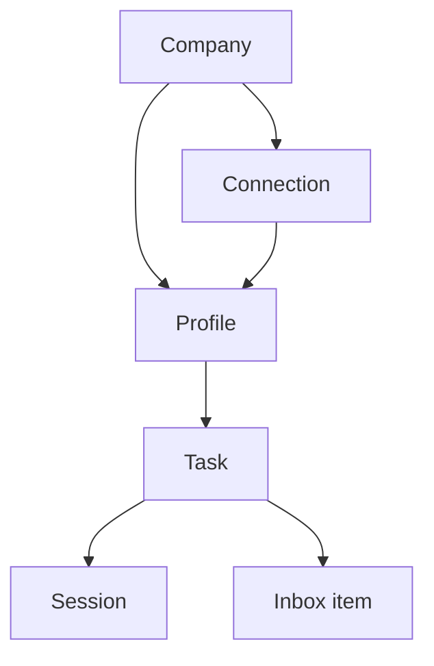
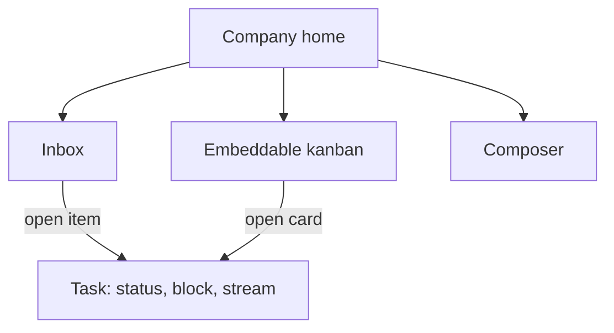
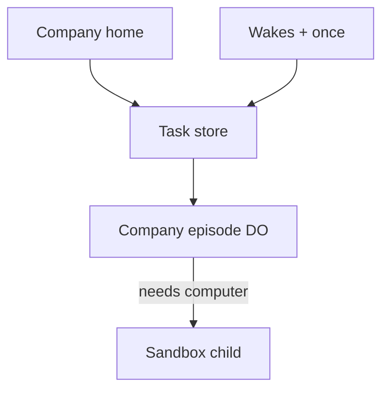

# BotProfile Company Mode - Plan

## Goal Capsule

- **Objective:** Ship Company mode as a company operating system for one founder-operator: profiles with memory, tasks as the work object, home of inbox plus embeddable kanban plus composer, worker-first execution, machine and stream only when a task needs a computer.
- **Product authority:** This plan owns the Company-mode product contract. Code mode stays today's harness sessions. Generated bot UI and multi-company are not active scope.
- **Open blockers:** None for product behavior. Scheduling must be trustworthy enough to run unattended; that is a planning verification, not an open product fork.
- **Product Contract preservation:** unchanged. R25 is interpreted by KTD1: same Pi harness family as Code, Company placement is `pi-agent-core` on a Company-owned Durable Object using the Cloudflare Agents SDK, hidden from Code. Flue is not used.

---

## Product Contract

### Summary

A Company mode sits beside Code. The operator's morning is inbox, an embeddable kanban, and the composer. Profiles are employees with memory. Work lives in tasks. A task may be written with no owner; assigning it to a profile starts it. A session is only how a task runs.

### Problem Frame

The founder is their own chief of staff: they dispatch, follow up, and remember what is in flight across chat tools, coding sessions, and SaaS tabs. Chat products stay chat. Coding sessions stay machines. Neither holds a company: who is working, what is blocked on the human, whose login to use, or what must happen Monday at nine.

### Key Decisions

- **Whole product model first.** (session-settled: user-directed — chosen over slicing the shell, runtime, or tools first: missing shared ontology would force every later plan to invent it.)
- **Founder-operator is the only human actor.** (session-settled: user-directed — chosen over eng-lead or ops as primary: they stop being dispatcher, reviewer, and follow-up engine.)
- **Home is inbox plus kanban plus composer.** (session-settled: user-directed — chosen over inbox-only morning, board-one-click-away, people-home, or kanban-as-the-only-home: empty inbox still means nothing is blocked on A1; the kanban is on home so in-flight work is visible.) Governs R2, R3, R16.
- **Unassigned tasks, assign to start.** (session-settled: user-directed — chosen over every task needing an owner at create: A1 can write a task and assign later; assigning to a profile starts it.) Governs R6, R26, R27.
- **Kanban is embeddable.** (session-settled: user-directed — chosen over a Company-only board: the same kanban must be reusable later on the Code surface. This plan ships the Company host, not the Code embed.) Governs R28.
- **Hybrid routing.** (session-settled: user-directed — chosen over CoS-only or flat @-dispatch: unaddressed goes to Chief of Staff; @ still reaches anyone.) Governs R8, R9.
- **Mention appends when the job is already open.** (session-settled: user-directed — chosen over always-new-task or message-only: same job continues; a new job creates a task.) Governs R10.
- **Task is the work object; session is an episode.** (session-settled: user-approved — chosen over every-task-is-a-session: a task can sleep, wake, and run many times.) Governs R5, R6, R7.
- **Connections are grants.** (session-settled: user-directed — chosen over every-bot-owns-every-login or company-Composio-for-all-API-work: Stripe and brand X are shared; each profile has email; a few identities stay individual.) Governs R17, R18, R19.
- **Per-profile machine identity.** (session-settled: user-directed — chosen over one company browser or borrowing the founder's machine: a leased computer mounts that profile's identity.) Governs R20, R21.
- **Memory on every turn.** (session-settled: user-directed — chosen over stateless, CoS-only memory, or task-only memory: a profile remembers the company across tasks.) Governs R22.
- **Company floor, no generated UI.** (session-settled: user-directed — chosen over shipping AG-UI/A2UI on day one: the floor is profiles, CoS, inbox, board, wakes, Composio tools, machine-when-needed.) Governs R1, R23.
- **Wake worry is reliability.** (session-settled: user-directed — chosen over inventing new trigger kinds first: time, event, and human-answer already cover the jobs; unattended company work cannot miss a fire.) Governs R24.

### Actors

- A1. Founder-operator — the only human. Reviews inbox, grants connections, watches a machine when one is leased, @-addresses work.
- A2. Chief of Staff — a profile. Default addressee. Routes unaddressed work, follows up, escalates only what A1 must do.
- A3. Specialist profile — an employee with tools, grants, memory, and optional machine identity.
- A4. Task runtime — worker-first execution of a task; may lease a machine.
- A5. Company — one workspace, one connection catalog, one board.

### Requirements

**Mode and surfaces**

- R1. Claxedo exposes a Company mode beside Code. Switching modes does not destroy in-flight Company tasks or Code sessions.
- R2. Company home is the inbox, the kanban, and the global composer.
- R3. An empty inbox means nothing is blocked on A1. In-flight work remains visible on the kanban.
- R4. The composer can leave a message unaddressed or @ a named profile.

**Ontology**

- R5. A profile is a durable employee: name, tools, connection grants, memory, and optional machine identity. It is not a session.
- R6. A task is the work object with a goal, an optional owner profile, and a status of unassigned, needs-you, doing, waiting, or done.
- R7. A session is one execution episode of a task. A task may have many sessions over its life.
- R8. A mention is addressing. It is not a session and not automatically a new task.

**Routing**

- R9. An unaddressed composer message is owned by the Chief of Staff.
- R10. An @-addressed composer message appends to that profile's open task when the job is already clearly the same, and otherwise creates a new task for that profile.
- R11. A profile may @ another profile. That mention routes the same way R10 does, as work for the mentioned profile.
- R12. Profiles run non-interactively. A question for A1 becomes an inbox item, not a blocking chat turn.

**Inbox and board**

- R13. Inbox items are tasks, or gates on tasks, that cannot proceed without A1: approval, identity grant, missing fact, or a hard failure.
- R14. Approving or answering an inbox item resumes the same task. It does not create a parallel task unless A1 asks for one.
- R15. Opening a task shows the task: owner, status, why it is blocked if it is, and the machine stream if a computer is leased. It does not open a Code session as the primary surface.
- R16. The kanban on home shows every open task and who owns it, grouped by R6 status. Unassigned tasks sit in an unassigned column.

**Identity and connections**

- R17. Connections live on the company catalog. A profile may use a connection only when granted it.
- R18. Shared connections (Stripe, brand X, and most SaaS) are the default. Each profile has its own email. A connection is individual only when the work requires a distinct person.
- R19. Initial tool coverage is the company Composio catalog. A1 connects tools once at company level, then grants subsets to profiles.
- R20. When a task leases a machine, that machine mounts the owning profile's identity, not A1's personal device and not a sibling profile's identity.
- R21. A first-time machine login for a profile is an inbox identity grant. After A1 completes it, later leases of that profile reuse the identity.

**Memory, runtime, schedule**

- R22. Every finished turn writes durable memory on the owning profile. Later tasks for that profile can use it without A1 re-briefing the company.
- R23. A task runs on a worker until it needs a computer. Leasing a machine streams what that profile is doing to A1. Releasing the machine does not end the task.
- R24. A task may sleep and resume on a time, an event, or an inbox answer. Missed or double-fired wakes are product defects.
- R25. Company mode uses the same control plane and agent runtime as Code mode. It does not invent a second agent stack.
- R26. A1 can create a task from the composer or the kanban without assigning an owner. That task is unassigned and does not start a session.
- R27. Assigning an unassigned task to a profile starts it: status becomes doing and a worker session begins, unless the task immediately needs A1.
- R28. The kanban is an embeddable surface with its own create, assign, and status columns. Company home is the first host. This plan does not ship a Code-mode host. The surface must be reusable there later without a rewrite.

### Key Flows

- F1. Morning, nothing blocked
  - **Trigger:** A1 opens Company mode.
  - **Actors:** A1, A2
  - **Steps:** Home shows an empty inbox, the kanban of in-flight and unassigned work, and the composer. Unaddressed composer input goes to A2 per R9.
  - **Outcome:** A1 sees what is blocked on them and what is in flight.
  - **Covered by:** R2, R3, R9, R16

- F2. Direct a specialist
  - **Trigger:** A1 sends `@growth draft the launch tweet`.
  - **Actors:** A1, A3
  - **Steps:** If Growth already has an open launch-tweet task, the message appends per R10. Otherwise a new task is created, owned by Growth, status doing. A worker session starts. No machine is leased.
  - **Outcome:** The board shows Growth on that task. Inbox stays empty unless Growth blocks.
  - **Covered by:** R6, R7, R10, R16, R23

- F3. Same job, later steer
  - **Trigger:** A1 later sends `@growth also mention the pricing` while that launch task is open.
  - **Actors:** A1, A3
  - **Steps:** The message appends to the open task. No second task is created.
  - **Outcome:** One card, one owner, one goal.
  - **Covered by:** R10

- F4. Human gate
  - **Trigger:** A task needs a refund approval, a fact A1 has, or a first login.
  - **Actors:** A1, A2 or A3
  - **Steps:** The task moves to needs-you and appears in the inbox. The profile does not wait in a chat turn. A1 answers on the task. The same task resumes.
  - **Outcome:** Inbox shrinks. No parallel task unless A1 asks.
  - **Covered by:** R12, R13, R14

- F5. Machine when needed
  - **Trigger:** A doing task needs a browser or local computer.
  - **Actors:** A1, A3, A4
  - **Steps:** The runtime leases a machine and mounts that profile's identity. If the identity is missing, F4 fires first. While leased, A1 can open the task and watch the stream. When the computer is no longer needed, the lease ends and the task may keep waiting or doing on a worker.
  - **Outcome:** Logins persist on the profile. The task outlives the machine.
  - **Covered by:** R15, R20, R21, R23

- F6. Scheduled continue
  - **Trigger:** A task is set to resume Monday at 09:00, or when an event arrives, or when A1 answers.
  - **Actors:** A2 or A3, A4
  - **Steps:** The task is waiting. On fire, a new session of the same task runs with that profile's memory. A miss or double fire is a defect.
  - **Outcome:** Follow-up does not depend on A1 remembering.
  - **Covered by:** R7, R22, R24

- F7. Week-one grants
  - **Trigger:** A1 creates Growth and assigns it brand work.
  - **Actors:** A1, A3, A5
  - **Steps:** Company Composio connections already exist. A1 grants Growth the brand X connection and Growth's email. Stripe stays shared with whoever is granted it. First browser login for Growth, if needed, is F4.
  - **Outcome:** Growth can work. A1 spent the morning on grants, not on doing the brand work.
  - **Covered by:** R17, R18, R19, R21

- F8. Write now, assign later
  - **Trigger:** A1 creates "Draft launch tweet" on the kanban with no owner.
  - **Actors:** A1, A3
  - **Steps:** The task is unassigned. No session starts. A1 later assigns it to Growth. The task becomes doing and a worker session starts.
  - **Outcome:** Capture and dispatch are separate. Assignment is the start.
  - **Covered by:** R26, R27, R16

### Acceptance Examples

- AE1. Unaddressed briefing
  - **Covers R9, R6.**
  - **Given:** Company home, no @ in the composer.
  - **When:** A1 sends "what's on fire?"
  - **Then:** A Chief of Staff task owns it. No specialist task is created.

- AE2. New job versus same job
  - **Covers R10.**
  - **Given:** Growth has an open task "draft launch tweet."
  - **When:** A1 sends `@growth also mention the pricing`.
  - **Then:** That task is appended. A second Growth task is not created.

- AE3. Different job
  - **Covers R10.**
  - **Given:** Growth has an open task "draft launch tweet."
  - **When:** A1 sends `@growth pull yesterday's ad spend`.
  - **Then:** A new Growth task is created. The tweet task is unchanged.

- AE4. Inbox is the task
  - **Covers R13, R14.**
  - **Given:** Growth is blocked on the brand X login.
  - **When:** A1 completes that inbox item.
  - **Then:** The same Growth task resumes. A new task is not created.

- AE5. Shared Stripe, personal email
  - **Covers R18, R20.**
  - **Given:** Stripe is a shared company connection. Growth has its own email.
  - **When:** Growth refunds on Stripe, then mails the customer.
  - **Then:** Stripe is the company account. The mail is from Growth's email. A leased machine, if any, uses Growth's identity.

- AE6. Machine ends, task remains
  - **Covers R7, R23.**
  - **Given:** A task leased a machine to finish a browser step.
  - **When:** The machine is released.
  - **Then:** The task is still the work object. A later wake may run a new session without a machine.

- AE7. Empty inbox, work visible
  - **Covers R3, R16.**
  - **Given:** Three tasks are doing or waiting, none needs A1.
  - **When:** A1 opens Company mode.
  - **Then:** Inbox is empty. The kanban on home still shows the three tasks.

- AE8. Unassigned then assign
  - **Covers R26, R27.**
  - **Given:** A1 wrote "Draft launch tweet" with no owner.
  - **When:** A1 assigns it to Growth.
  - **Then:** The task leaves unassigned, becomes doing, and a worker session starts. Inbox stays empty unless Growth blocks.

### Success Criteria

- A1 can start the day in Company mode, handle inbox items, and see in-flight and unassigned work on the same home without opening Code mode.
- After the first week of grants, a profile continues company work across days without A1 re-briefing it.
- Planning names a concrete wake-reliability proof for R24 before Company mode is called unattended-ready.
- A1 can watch a leased machine from the task in R15 without entering Code mode.

### Scope Boundaries

**Deferred for later**

- Generated durable bot UI (AG-UI, A2UI, per-profile custom pages).
- More than one company.
- Replacing or redesigning Code mode.
- Embedding the kanban on the Code surface. The Company host must leave that embed possible.

**Outside this product's identity**

- Another chat product with agents in the sidebar. Company mode is an operating system: inbox, board, grants, memory.
- Borrowing A1's personal laptop or personal browser as the bot computer.

### Dependencies / Assumptions

- Code mode remains the existing harness-session product.
- Initial tools come from a company Composio catalog. Planning picks the broker mechanics.
- Per-profile memory is intended to be Honcho or an equivalent that writes on every turn. Planning picks the service and the failure mode if it is down.
- Existing wake triggers (time, event, human answer) are enough. Planning must prove they are reliable enough for R24 or replace the owner.
- Adjacent plan `docs/plans/2026-09-05-005-think-agent-base-tier-plan.md` proposes a work-session substrate. This contract does not require that substrate.

<!-- ce-section: work-relationships -->
### How This Work Fits Together

This plan owns the Company-mode product contract: ontology, morning surface, grants, inbox, and worker-then-machine behavior.

- Code mode — `Can proceed independently of` this plan. Existing harness sessions stay the coding product.
- Agent base tier (`docs/plans/2026-09-05-005-think-agent-base-tier-plan.md`) — `Shares` machine-only-when-required. Company episodes run on Pi + Agents SDK (KTD1), not Think and not Flue. This contract does not require Think.
- Generated bot UI — `Depends on` this floor shipping. Deferred.
- Multi-company — `Depends on` one-company grants and inbox working. Deferred.
- Code-mode kanban host — `Depends on` R28. Deferred. `Shares` the same embeddable kanban.

### Outstanding Questions

**Resolve Before Planning**

- None.

**Deferred to Planning**

- [Affects R24] Wake fire is at-least-once (`packages/wakes/docs/architecture.md`). Company layer must use `once()` receipts so a double fire cannot start a second session (KTD3).
- [Affects R10] Same-job judge and wrong-merge undo remain host rules to specify in U4. Default if unset at implement: append only when the mentioned profile has exactly one open non-done task; otherwise create. Undo/split is still unspecified.
- [Affects R22] Memory-down behavior is KTD5 (queue the write, do not fail the turn).
- [Affects R19] Day-one Composio / box.ascii.dev path is U7 research during implementation.
- [Affects R13] Which granted actions require approval (money, mail, publish) was raised in review and is not yet product-settled. U4/U7 ship identity-grant and missing-grant inbox only.

### Sources / Research

- Marketing teaser only: `packages/claxedo-web/src/components/ClaxedoStorm.astro` ("Bot profiles").
- Superseded bootless Pi design (reuse, do not restore into Code): `docs/plans/2026-09-05-002-pi-worker-runtime-and-gateway-plan.md`.
- Central Pi removed; no production `pi-agent-core` import: `docs/plans/2026-09-05-004-pi-native-harness-remove-central-plan.md`.
- Think work-session alternative, not required: `docs/plans/2026-09-05-005-think-agent-base-tier-plan.md`.
- Wake at-least-once plus `once()`: `packages/wakes/docs/architecture.md`, `packages/wakes/src/wakes.ts`.
- Product UI flags (opt-in entry only): `packages/claxedo-app/src/app/composition/product-ui-flags.ts`.
- Composer @ is files/agents today: `packages/claxedo-app/e2e/playwright/core-composer-modes.spec.ts`.
- Native Pi driver (Code path, unchanged): `packages/agent-sdk-runtime/src/harnesses/pi/driver.ts`.
- Company episode runtime (adopted 2026-09-08, revised same day): in-process `@earendil-works/pi-agent-core@0.85.1` on one Company Durable Object class, recovered with Cloudflare Agents SDK `agents@0.22.0` (`runFiber` / `stash` / `onFiberRecovered`). Flue evaluated and rejected: generated DO class per agent function cannot express runtime-created profiles. Sources: https://developers.cloudflare.com/agents/runtime/execution/durable-execution/, https://blog.cloudflare.com/agents-platform-flue-sdk/ (platform layer only). Hosted core forbids optional services: `packages/claxedo-server/src/deployments/hosted-workerd/certified-worker-artifacts.ts` (`optionalServices: false`). Schedule clocks: https://developers.cloudflare.com/workers/configuration/cron-triggers/; hosted driver is Worker cron or existing `WakeLane`, not a wrangler cron per task.

---

## Planning Contract

### Key Technical Decisions

- KTD1. **Company episodes run `pi-agent-core` on a Company-owned Durable Object, hidden from Code.** (session-settled: user-directed 2026-09-08 — chosen over Flue, Think, or always-lease-a-machine: the loop is Pi; eviction recovery is Agents SDK fibers; Flue's generated-class-per-agent model cannot express runtime-created profiles.) Governs R23, R25. Pin `@earendil-works/pi-agent-core@0.85.1` and `agents@0.22.0`. One Durable Object class for all Company episodes; profile tools/grants/system are loaded as data. Do not restore deleted Code-path files from plan 004 (`harnesses/pi/model-backend.ts`, central runtime). Do not teach `harnesses/pi/driver.ts` a worker mode. Do not depend on `@flue/runtime`. Conflict: R25 said one agent stack; the accepted exception is one extra *placement* of the same Pi harness, Code-invisible.
- KTD7. **Task id addresses the episode DO. An episode is one fiber/admission.** Append (R10) and later wakes enqueue on that task, not a new object and not a new task. Inbox, Honcho, and `@claxedo/wakes` stay ours. Cloudflare Agent Memory, Cloudflare Workflows, and Flue channels are not used.
- KTD2. **Task record is canonical. Episode is a runtime handle, not a Code `SessionRef`.** Company work does not go through `ControlPlaneSessionRoutes` machine-session create. A later machine lease may create a child Code session for the computer only.
- KTD3. **Wakes stay `@claxedo/wakes`. Exactly-once effects use `once()`.** Firing is at-least-once. A Company sink that starts a session must be wrapped in `once()` so a re-drive cannot start a second worker. A fire that cannot start an episode becomes needs-you (hard failure). Hosted clock is a Worker Cron Trigger or the existing `WakeLane` DO alarm calling `runDue()`; wrangler `crons` are not a per-task calendar. Per-task `at` lives in the wake row (or `schedule()` on an already-created episode DO). Timezone belongs on that timestamp, not on UTC Worker crons.
- KTD4. **Kanban is its own package, first hosted on Company home.** No Company-only board fork. Code embed is out of this plan; the package API must not assume Company routes.
- KTD5. **Honcho (or equivalent) writes after each finished episode.** If the memory service is down, queue the write and finish the episode. Do not fail the turn.
- KTD6. **Machine lease is the existing sandbox `ensure` / `release` path as a child of the Company episode.** Stream renders on the task view. Profile identity volume is new; do not reuse desktop `host-machine-identity.json`.

### Technical Approach

Company mode is a new product surface on the existing control plane. Profiles, tasks, grants, and inbox are control-plane records. An assigned task is addressed as one Company episode Durable Object (`idFromName(taskId)`). Each run is a `pi-agent-core` loop inside `runFiber`. Tools that are APIs go through granted Composio connections. A computer is still a leased Claxedo sandbox child (U8), then released — v1 does not wait on `@cloudflare/workspace` or replace sandbox-manager with Cloudflare Containers. Code mode keeps `packages/agent-sdk-runtime/src/harnesses/pi/driver.ts` and `submit-create-session.ts` unchanged.

### Assumptions

- Plan 004 cutover is far enough that Code no longer imports `pi-agent-core`. Company must not restore those deleted files. Company imports `@earendil-works/pi-agent-core` only inside `packages/company-runtime/`, which Code UI and hosted-core do not load.
- Hosted Company runtime is a new optional service. Certified hosted-core artifacts stay `optionalServices: false` and must not import `company-runtime`, `pi-agent-core`, or `agents`.
- Desktop v1 uses a local workerd/Miniflare sidecar of the same package. Do not run the episode loop inside the Node control-plane process as a substitute for fiber recovery. Flag on with no runtime attached → the assign/wake becomes needs-you (hard failure), same as KTD3.
- Review leftovers (approval classes for refunds, initiator-grant on `@`, company-wide memory vs per-profile only) are not in v1 units.

### Sequencing

U1 and U2 first (flag, records). U3 and U4 in parallel after U2. U5 after U2 (needs tasks to run). U6 after U5. U7 and U8 after U5. U9 after U5.

---

## Implementation Units

### U1. Company mode flag and home shell

- **Goal:** Opt-in Company mode beside Code. Home shows inbox region, kanban host, and composer. Code UI does not change when the flag is off.
- **Files:** `packages/claxedo-app/src/app/composition/product-ui-flags.ts`, `packages/claxedo-app/src/app/entry/index.tsx`, new `packages/claxedo-app/src/features/company/`
- **Patterns:** Existing `ProductUiFlagConfig` strict opt-in. Do not add Company chrome to session workbench.
- **Test scenarios:**
  - Flag off: no Company mode switch, no Company routes.
  - Flag on: mode switch Code / Company; leaving Company does not destroy Code sessions (R1).
  - Home renders three regions: inbox, kanban slot, composer.
  - AE7: empty inbox, three doing/waiting tasks still visible on the home kanban.
- **Verification:** `bun test` on the new company flag/shell tests; `bun run typecheck` in `packages/claxedo-app`.
- **Covered by:** R1, R2, R3

### U2. Profiles, tasks, and CoS bootstrap

- **Goal:** Durable profile and task records. First Company open creates Chief of Staff. A1 can create a named specialist. Tasks support unassigned.
- **Files:** new control-plane module under `packages/claxedo-server-core/src/` (company profiles/tasks), matching app queries under `packages/claxedo-app/src/features/company/`
- **Patterns:** Server owns durable state. Browser storage is a cache only (`packages/claxedo-app/AGENTS.md`).
- **Test scenarios:**
  - First open creates CoS before an unaddressed send can succeed (R9).
  - A1 creates Growth with name only; no session starts.
  - Create task with no owner → status unassigned (R26).
  - Assign Growth → status doing (R27 status only). Persistence survives reload. Episode start is U5.
- **Verification:** server-core and app company-store tests; typecheck both packages.
- **Covered by:** R5, R6, R9, R26, R27 (status write)

### U3. Embeddable kanban package

- **Goal:** Reusable board: columns for unassigned, needs-you, doing, waiting, done. Create card, assign owner, open card. No Company route imports inside the package.
- **Files:** new `packages/company-kanban/` (or `packages/claxedo-kanban/` if that name is free), host in `packages/claxedo-app/src/features/company/`
- **Patterns:** Data in, commands out. Host supplies profiles and task mutations.
- **Test scenarios:**
  - Create unassigned card from the board.
  - Assign moves card to doing and emits assign command only (host starts the episode).
  - Package tests run with a fake host; no `claxedo-app` import.
- **Verification:** package unit tests plus Company home host test.
- **Covered by:** R16, R28

### U4. Composer routing and inbox

- **Goal:** Unaddressed → CoS task with same-job append. `@profile` appends or creates. Inbox lists needs-you tasks; answering resumes the same task.
- **Files:** `packages/claxedo-app/src/features/session/composer/` (extend mention types without breaking file/agent @ in Code), `packages/claxedo-app/src/features/company/`
- **Patterns:** Company composer is a host of the existing composer, not a fork of submit-create-session.
- **Test scenarios:**
  - AE1, AE2, AE3, AE8.
  - AE4: complete inbox item resumes same task.
  - Missing grant on an assigned task → needs-you (review default for U4/U7).
  - Code composer @ files/agents unchanged when Company flag is off.
- **Verification:** company routing tests; existing `core-composer-modes.spec.ts` still passes.
- **Covered by:** R4, R8, R9, R10, R11, R12, R13, R14

### U5. Flagged Company episode runtime

- **Goal:** Assigned doing tasks run `pi-agent-core` on one Company episode Durable Object addressed by task id (KTD7). Code native Pi driver stays the only Code path. Company runtime is not importable from Code session UI or hosted-core.
- **Files:** new `packages/company-runtime/` (episode DO, admission, Pi loop, event stream). Hosted optional-service composition only — not `packages/claxedo-server/src/deployments/hosted-workerd/core-worker.cf.ts` and not any `optionalServices: false` artifact. Do not add files under `packages/agent-sdk-runtime/src/harnesses/pi/` for this unit.
- **Patterns:** Load profile tools/grants as data onto one DO class. Run the Pi loop inside `runFiber`; `stash` at model/tool barriers; `onFiberRecovered` continues the same task. In-flight tools with no durable result stay unknown (do not invent a result). Stream Company events onto the task view. Pin `@earendil-works/pi-agent-core@0.85.1` and `agents@0.22.0`. Delete-nothing on the native driver. No `@flue/runtime`.
- **Test scenarios:**
  - Assign starts a fiber/admission on that task's DO; unassigned does not (R27 episode start).
  - Flag off, or flag on with no runtime attached: assign/wake cannot start → needs-you hard failure; Code sessions still create via machine-session route.
  - Evict mid-turn: same task resumes; a second task is not created.
  - Two appends while busy enqueue on the same task (one-at-a-time), still one task.
  - Import graph: Code app entry and hosted-core renderer do not load `company-runtime`, `pi-agent-core`, or `agents`.
- **Verification:** Miniflare test for one assign → stream → finish → evict-resume; architecture ratchet that Code entry and hosted-core do not import Company runtime.
- **Covered by:** R7, R23, R25, R27 (episode start), KTD1, KTD7

### U6. Task wakes with `once()`

- **Goal:** A waiting assigned task resumes on time, event, or inbox answer. Re-drive cannot start a second episode. Miss that cannot run becomes needs-you.
- **Files:** `packages/wakes/`, Company sink next to existing session wake dispatch
- **Patterns:** `createWakes` + `once()` around episode start. Hosted driver is Worker cron or `WakeLane` → `runDue()` → Company sink. Do not invent a second scheduler and do not add a wrangler cron per task.
- **Test scenarios:**
  - F6 Monday 09:00 resumes the same task.
  - Duplicate fire: `once()` suppresses second episode; task does not fork.
  - Crash during fire: at-least-once re-drive still one episode.
  - Unassigned tasks are not waiting-on-wake; they stay unassigned.
- **Verification:** wakes package tests plus Company sink tests.
- **Covered by:** R24, KTD3

### U7. Connection catalog grants

- **Goal:** Company-level Composio connections; per-profile grants; shared Stripe/X; per-profile email. Worker tools see only granted connections.
- **Files:** `packages/claxedo-connections/`, Company grant table in server-core, settings only when Company flag is on
- **Patterns:** `resolveForCapability`. Do not implement `proposeConnection` unless U7 is blocked without it.
- **Test scenarios:**
  - AE5 identity split (account used), without requiring a payment-approval product rule.
  - Growth without brand X cannot call that tool; task can move needs-you.
  - Revoke stops later turns (minimum: next episode).
- **Verification:** connections + grant tests.
- **Covered by:** R17, R18, R19, R21

### U8. Machine lease, profile identity, task stream

- **Goal:** Worker requests a computer → sandbox `ensure` as child → stream on task view → `release` does not end the task. First login is needs-you. Later leases reuse the profile identity volume.
- **Files:** sandbox manager ensure/release owners, Company task view in `packages/claxedo-app/src/features/company/`
- **Patterns:** Child session may use native Pi driver. Parent episode stays the Company worker. Do not open Code mode as the primary surface (R15).
- **Test scenarios:**
  - AE6: release machine, task remains.
  - F5: missing identity → inbox, then reuse.
  - Stream is on the task, not a Code session tab.
- **Verification:** lease/release integration test; app task-view test.
- **Covered by:** R15, R20, R21, R23

### U9. Per-profile memory writes

- **Goal:** After each finished episode, write Honcho (or equivalent) on the owning profile. Later episodes for that profile can read it.
- **Files:** Company worker completion hook; new small memory adapter module
- **Patterns:** KTD5 — queue on outage, do not fail the episode.
- **Test scenarios:**
  - Two sequential Growth tasks: second prompt includes memory from the first.
  - Memory down: episode completes; write retries.
  - CoS memory is not automatically Growth memory (v1).
- **Verification:** adapter tests with a fake Honcho; one worker completion test.
- **Covered by:** R22

---

## Verification Contract

| Gate | Command | When |
|---|---|---|
| App unit / typecheck | `bun test` and `bun run typecheck` in `packages/claxedo-app` | U1, U3, U4, U8 |
| Server-core | package tests + typecheck in `packages/claxedo-server-core` | U2, U7 |
| Wakes | `bun test` in `packages/wakes` | U6 |
| Company runtime | Miniflare episode DO assign → stream → finish → evict-resume | U5 |
| Architecture ratchet | `bun run test:architecture-ratchets` after U5 (new production import) | U5 |
| Code composer regression | `packages/claxedo-app/e2e/playwright/core-composer-modes.spec.ts` | U4 |
| Flag-off | No Company switch, no worker import from Code entry | U1, U5 |

---

## Definition of Done

- Flag off: Code product is unchanged.
- Flag on: F1, F8, AE1–AE3, AE7, AE8 pass on a real Company home.
- An assigned task runs as a Pi episode on the Company DO without a machine (U5).
- A wake re-drive does not start a second episode (U6).
- A leased machine can be watched on the task and released without ending the task (U8).
- `bun run test:architecture-ratchets` is green after the worker import lands.
- Unmet: refund/mail approval policy, Code kanban host, AG-UI, Think substrate, multi-company.
