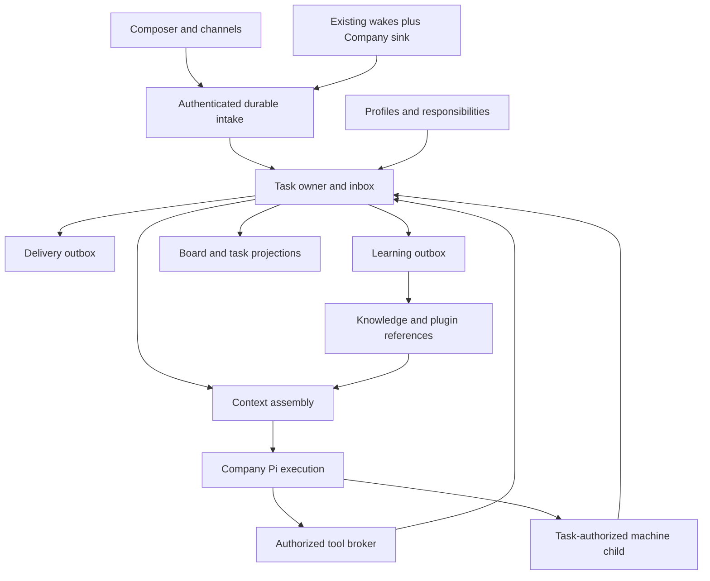

# Claxedo Company — Product Requirements and System Design

> **Superseded 2026-09-09.** The user dropped multiple profiles in favor of one @claxedo agent powered by scoped context and memory. Read the [current direction](2026-09-09-001-claxedo-single-agent-context-memory-direction.md) and [goal.md](../../goal.md). The profile-owned memory, assignment, employee identities and implementation milestones below are historical and must not be executed. Reusable technical observations require revalidation against current owners.

**Product promise: Give work once. Keep the learning. Know what needs you.**

Claxedo Company lets a founder give agents discrete tasks and ongoing responsibilities. Each task has an owner, an observable outcome and a place to resume. Named profiles retain useful learning across tasks. The system carries routine work forward within granted authority and brings concrete decisions back to the founder.

This document combines positioning, requirements, interaction design and system design. It is the proposed successor to the [BotProfile Company plan](docs/plans/2026-09-08-001-feat-botprofile-company-mode-plan.md), with explicit refinements in section 21. It describes intended behavior, not shipped functionality. Repository observations are identified separately from proposed extensions; vendor and deployment uncertainties remain release gates rather than promises.

Reading paths: [positioning](#2-positioning-and-differentiation), [user experience](#5-interaction-design), [system ownership](#9-system-boundaries-and-state-ownership), [execution and recovery](#15-durable-execution-and-external-effects), and [delivery and acceptance](#18-release-scope-and-sequencing).

## 1. The problem and the product bet

A founder can ask an agent to review a PR, prepare an outreach list or investigate a customer problem. The recurring burden is reconstructing the context, deciding who should act, checking whether work finished and moving a blocked conversation forward. Faster generation alone does not remove those obligations.

Persistent chat history helps the agent remember a conversation. A professional profile helps it select the right context. Neither establishes that tomorrow's PR will be reviewed, that an expired connection will surface, or that two agents will avoid posting the same answer.

The product must therefore solve three connected problems:

1. **Continuity:** the next task uses relevant facts, corrections and procedures learned from earlier work.
2. **Follow-through:** accepted work remains owned across delays, restarts, questions and changes in execution environment.
3. **Control:** the founder can see what is happening, stop it, correct it and grant authority without supervising every tool call.

The product bet is that these benefits become more valuable together. Memory reduces repeated explanation; responsibilities remove repeated dispatch; durable tasks remove repeated follow-up. This is a hypothesis to validate through repeated real work, not a claim that adding memory automatically improves an agent.

## 2. Positioning and differentiation

### 2.1 Who this is for

The initial customer is a founder-operator who already uses agents for useful work and remains the human responsible for the outcome. They move between code, customer conversations and business tools. They need a system they can inspect without becoming an automation engineer.

The first release has one human operator per Company. Tenant boundaries and authenticated identities still exist underneath; adding human team roles and approval hierarchies is outside this release.

The workflow is informed by the founder's expressed needs and the existing architecture, not by a completed customer study. Without this product, the operator continues using Code sessions and existing automations while manually supplying continuity and follow-up. The pilot must establish that Company reduces that burden enough to justify another surface.

The strongest initial use cases have an identifiable trigger, bounded scope, inspectable output and recurring context. PR review and a scheduled growth brief satisfy these conditions. “Run my business” does not supply a useful acceptance criterion.

### 2.2 What the category already promises

These are observations about documented product positioning, not independent performance comparisons.

| Product evidence | What it establishes | Implication for Claxedo |
|---|---|---|
| Grok Bot presents agents using applications, retaining context, learning routines and requesting approvals. [Product page](https://x.ai/bot) | Computer use and persistent teammates are already category promises. | A named bot or its own computer is insufficient differentiation. |
| Squad describes role ownership, accumulating memory, addressability and escalation; its memory guide exposes memory budgets and what gets omitted. [Role model](https://squad.so/resources/team-of-ai-employees), [memory guide](https://squad.so/resources/docs/memory-guide) | Scoped learning and visible work are central product concepts, not incidental infrastructure. | Make memory inspectable and tie it to useful future behavior. |
| OpenClaw documents agent scopes, channel bindings, shared skills and explicit cross-agent visibility controls. [Routing documentation](https://docs.openclaw.ai/concepts/multi-agent) | Routing, isolation and configuration are substantive system features. | Offer strong defaults without requiring users to understand session keys or agent directories. |
| Relevance AI documents a visual canvas connecting specialist agents through discretionary and mandatory handoffs. [Workforce documentation](https://relevanceai.com/docs/get-started/core-concepts/workforces) | Visual workflow construction is an established interaction model. | Let users begin with work; introduce structured responsibilities when repetition makes them useful. |

The opportunity is to make continuity and follow-through easier to obtain and easier to trust. There is no evidence here that competitors cannot do these things; the differentiation must be demonstrated in the user experience and operating results.

### 2.3 The position we should take

**Claxedo is a workspace for work that remembers and follows through.** Company is the surface for ongoing responsibilities; Code remains the surface for direct engineering work. A Company task can use a coding agent or a computer without making the founder manage the underlying session.

The product should demonstrate four things in one coherent example: a task starts from a real event, uses an earlier correction, produces a reviewable result and continues after an interruption. A screen full of agents exchanging messages does not demonstrate any of those properties on its own.

Our practical advantage is the existing connection between a control plane, multiple coding harnesses, permission handling and leased execution environments. That creates a plausible path from business work to actual code or computer work. It does not remove the need to build durable task ownership and learning.

### 2.4 Messaging and commercial principles

Lead onboarding and launch examples with outcomes: “Review new PRs using our conventions” and “Prepare the weekly growth brief using what we learned last week.” Explain profiles when the user needs continuity, rather than asking them to construct an organization first.

Do not promise autonomous employment, continuous improvement without correction, zero missed work, or unrestricted application access. Publish reliability and quality claims only after the corresponding release criteria are met.

Creating a name or saving a task should not consume an agent run or require a permanent computer. Show execution usage and computer time against the work that caused them. Pricing is deliberately not set here: provider and machine costs must be measured before selecting a commercial allowance. The product should not reward unnecessary agents, messages or machines.

## 3. One simple model, progressively revealed

The normal interface exposes **profiles, tasks and responsibilities**. Runs, manifests, event claims and leases appear in diagnostics rather than in setup.

| User concept | Meaning | What creating it does |
|---|---|---|
| Profile | A named area of work with its own learning and optional capabilities. | Creates a durable identity; no execution or credentials are implied. |
| Task | A particular piece of work with an objective, optional owner and outcome. | Saves work; assignment starts execution when prerequisites are satisfied. |
| Responsibility | A continuing instruction specifying when a profile should take work. | Establishes future intake after the operator activates its scope and authority. |

The system represents a lightweight named context and a professional profile as the same durable identity. Adding a job description, connection grant or responsibility extends that identity; it does not migrate memory into a different kind of object.

A task can have several runs and use several tools or children. A profile can own several unrelated tasks without combining their transcripts. A responsibility can produce many tasks without becoming an endless chat.

The Chief of Staff is the initial profile and default recipient. It helps clarify, organize and delegate work. It receives no administrative authority by virtue of its title and does not become a mandatory model hop for directly addressed or deterministically routed work.

## 4. Product requirements

### 4.1 Starting and owning work

- **P1 — Immediate usefulness.** The operator can submit a task without configuring a profile, workflow, channel or computer. Unaddressed work goes to Chief of Staff.
- **P2 — Named continuity.** `@@name` selects or creates a profile on submission. Later tasks can use its authorized learning. Creation is idempotent within the Company.
- **P3 — Explicit ownership.** Every active task has one accountable profile. Saving an unassigned task performs no model work; assigning it starts or queues a run, or exposes a specific prerequisite.
- **P4 — Stable task identity.** Messages, questions, child results and wakes belonging to a task continue that task. A change in session, harness or machine does not create a new business task.
- **P5 — Controlled repetition.** A responsibility identifies trigger, scope, instruction, output destination, authority and limits. Its next action and pause control are visible.

### 4.2 Seeing and controlling work

- **P6 — Useful home.** Company home combines attention items, the task board and a composer. An empty attention area means no known actionable operator blocker; monitoring failures cannot masquerade as health.
- **P7 — Concrete decisions.** A question or approval includes the affected task, the proposed action or missing fact, and what happens after the answer. Resolution resumes the same task.
- **P8 — Observable outcomes.** A task shows its owner, latest meaningful progress, result, evidence and unresolved dependency. Execution ending is not sufficient evidence of completion.
- **P9 — Effective intervention.** The operator can pause a responsibility, pause or cancel a task, correct a result and change an owner. Controls report their actual effect, including actions already in flight.
- **P10 — Quiet operation.** Routine progress stays on the task. Notifications cover requested results, actionable blockers and significant failures; unchanged checks do not generate messages.

### 4.3 Learning and authority

- **P11 — Durable learning input.** Every completed logical turn records an observation for its owning profile through a durable write queue. Memory service failure does not discard the observation or falsely fail completed work.
- **P12 — Selective and correctable recall.** Retrieval respects scope, provenance and a context budget. The operator can inspect, correct, exclude or delete remembered information.
- **P13 — Explicit authority.** Profiles can use only granted resources and actions. Incoming content, recalled memory, another agent's request and a familiar profile name cannot expand permission.
- **P14 — Bounded delegation.** A task may delegate within its authority and budget. Children return results to the parent; they do not independently acquire permission to address the human or external channel.
- **P15 — Separate identities.** Shared company connections are reusable through grants. Individual email or browser identities belong to the profile that needs them and are not copied from the operator or sibling profiles.

### 4.4 Execution and resilience

- **P16 — Computer only when needed.** API and reasoning work use the Company worker. Computer work uses a leased child environment, visible from the task, with an explicit cleanup policy.
- **P17 — Durable acceptance.** Accepted events and scheduled occurrences can be traced to a task, a recorded rejection or a visible failure. Retries cannot silently create parallel logical runs or duplicate authorized effects.
- **P18 — Deployment honesty.** Company reports where execution runs and whether that runtime is available. Switching surfaces or closing a view does not cancel work; a stopped local host cannot be presented as an always-on service.

## 5. Interaction design

### 5.1 Home

Home answers, in order: “What needs me?”, “What is in progress?” and “What should happen next?”

Attention items occupy the first region and collapse when empty. The board below contains Unassigned, Doing, Waiting, Needs you and Done. Done defaults to recent work with access to history. A compact composer remains available without covering the board's active controls.

Each card shows the outcome-oriented title, owner and one useful state detail: “Waiting for Friday, 09:00,” “Draft ready; needs send approval,” or “Reviewing commit abc123.” An animation or changing agent thought is not progress evidence.

Profiles and Connections are secondary destinations. Profile details contain Responsibilities, Memory and Access. The operator does not have to visit these screens to complete a first task.

The board must support keyboard and menu actions as alternatives to dragging. Status is conveyed by text as well as color. On narrow layouts, an ordered task list replaces horizontal columns while preserving filters and actions; a dedicated native mobile application is outside this document.

First entry creates the Company catalog and Chief of Staff within the existing authorized installation/account context; it does not ask for an organization chart. With no tasks, show a composer and two concrete example requests. Missing runtime or required account setup appears as a specific prerequisite, never as an apparently working empty board.

During loading, preserve the last confirmed board with a freshness indicator. A failed submission retains the draft and its request identity; retry first resolves whether that request was accepted. A disconnected stream reconnects from its last event cursor and refreshes the task snapshot. Pending requests are shown as pending, not as confirmed Doing tasks. Announce meaningful state changes accessibly without moving keyboard focus on each update.

### 5.2 Composer and profile addressing

Typing `@@` opens a profile picker. A known name resolves to a structured profile token. An unknown name displays “Create profile ‘growth’ on send”; submitting creates it and assigns the task atomically from the user's perspective. Editing or abandoning the draft creates nothing.

The canonical shortcut is `@@name`; `@@+name` is accepted as an explicit-create spelling of the same action, not a separate profile mode. Existing single-`@` file and harness mentions in Code retain their meaning. Profile identity travels as a structured ID after resolution, not as a substring reparsed by the model.

Names have a Company-scoped, case-normalized handle and an editable display name. Renaming preserves the identity and memory. An archived name remains distinguishable from a newly created profile; the picker offers restore rather than silently attaching old memory to a new object.

The composer exposes Send and Save unassigned. Send uses the named profile or Chief of Staff and starts work. Save unassigned saves a task without execution, retaining any suggested recipient as draft metadata rather than an active owner.

Inside a task, submitting text continues that task. On home, text creates a task unless the user has selected a task reference or an authoritative external work key identifies the existing task. An agent may suggest a related task; semantic similarity alone cannot silently merge work.

### 5.3 Task view

The task header contains the objective, owner, state, usage and pause/cancel controls. The main body begins with the latest result or blocker, followed by a chronological activity trail. Tool details and run history are expandable.

An activity entry states what changed: a source was examined, an artifact was produced, an action was applied, a child result arrived or a wait began. It is derived from recorded events and outputs; the UI does not generate reassuring activity when no canonical event exists.

The computer panel appears only while computer access is relevant. The task remains the primary view; opening a machine child in Code is an optional detail action.

“Context used” shows source names, memory items and relevant exclusions. “Why did this run?” shows the request or responsibility occurrence. These affordances provide explanations without exposing provider prompts, tokens or internal IDs in the normal flow.

### 5.4 Responsibility card

Natural language such as “Review each PR in this repository” produces an editable card with these fields:

| Field | Example |
|---|---|
| Owner and instruction | PR Reviewer; review correctness and missing tests |
| When | PR opened, reopened or updated |
| Scope | One selected repository; eligible PRs only |
| Output | One current review on the PR |
| Access | Read repository; publish review; no merge permission |
| Limits | Task budget, concurrency policy and notification preference |

The operator activates the displayed responsibility once. This is the moment they authorize future action; another generic confirmation is unnecessary. Existing authorized operations within those bounds execute without asking again.

A saved card shows its next scheduled run or subscribed event types, last outcome and Pause. “Run now” creates a distinct manual occurrence with the same bounds. “Try once” previews or executes one bounded task without enabling future intake.

### 5.5 Attention and approvals

An approval card presents the exact prepared change, destination, account and meaningful cost or consequence. It offers Approve once, Edit and Decline. An additional “Allow this responsibility to do this” action is available only when the system can express the resulting grant precisely.

Approval is bound to the prepared action revision. Editing recipients, content or material parameters invalidates the old approval. Two clicks or a stale card cannot execute two actions.

A missing-fact question supplies available evidence and asks only for information that blocks progress. A connection failure points to the affected account and reconnect action. Related blockers on the same account are grouped, while each affected task retains its own dependency.

Company's first release uses explicit approval controls or an exact reply token for external effects. A bare “yes” in a busy channel is not sufficient. Natural-language approval judging in the existing channel package is not automatically inherited by Company.

## 6. Representative journeys

### F1. Name an area of work and benefit from it later

The operator submits `@@growth Prepare three launch messages using this brief.` Claxedo creates Growth if needed, records a task and starts it with the brief and permitted tools. No email address or browser is provisioned merely because the profile exists.

The operator corrects the result: “Our buyer is the engineering lead, not procurement.” The current task consumes the correction. The completed turn queues an attributed observation, and the explicit correction becomes eligible for reuse within its scope.

A later Growth task retrieves that correction when relevant and shows its source under Context used. It does not load the full launch conversation or treat an unrelated generated assumption as a company rule. The operator can edit or forget the correction from Memory.

### F2. Turn a successful PR review into a responsibility

The operator first asks PR Reviewer to review a selected PR. After inspecting the result, they activate the responsibility card for that repository. Draft creation may happen immediately; publication requires the displayed review-publishing grant.

A verified PR event creates or updates the PR task. Updates are keyed to repository, PR and head revision. A new head arriving during review invalidates publication of an obsolete pending result and queues the latest revision. A review already posted remains recorded against its original commit.

The task reports findings against the reviewed head, with one designated external publisher. Closing the PR stops future review admission for that PR; reopening permits another occurrence. “No actionable findings” is a valid result only when the review completed against the intended revision.

### F3. Scheduled growth work that does not become background noise

The operator activates: “Every Friday at 09:00 Asia/Kolkata, prepare a growth brief from these sources and draft next week's experiments.” The card previews the next three dates, source access, draft-only output and budget.

Each scheduled period creates a new brief task with relevant Growth learning. Producing a draft completes that task; publishing a campaign is a separate authorized action. Missing source access produces one actionable blocker rather than an invented report.

An unchanged monitoring check may complete quietly with its recorded evidence. A reporting responsibility still produces its requested report even when metrics are unchanged. “Stay quiet” controls notifications, not whether the promised work occurs.

### F4. Continue a task through a channel

A channel user sends a message addressing the configured bot and referring to an existing task. The host verifies the transport, resolves sender authority, and checks access to the task before admitting the content.

Replies in a task-bound thread continue that task. A new request in an unbound thread creates a task through the configured recipient or Chief of Staff. A bot mention is an activation signal, not authorization. A task receives messages from multiple surfaces only through explicit bindings; unrelated direct messages do not share history by default.

Progress remains in the task. The requested result goes to the recorded destination under the task's reply owner. A second agent working on the task does not post another answer because it also saw the message.

### F5. Delegate and use a computer

Growth requests a bounded analysis from a specialist. The specialist receives the objective, selected evidence, permitted capabilities and a result destination. It returns an artifact to Growth's task, not a public channel message.

When a website requires browser interaction, the Company worker requests a machine child. The task displays the computer and the profile identity in use. A first login creates an identity gate; the operator authenticates within that environment without pasting credentials into chat.

After the browser work, the system persists allowed profile state and releases the task's compute hold according to the cleanup policy. The Company task continues from the recorded result. A machine disconnection leaves a recoverable child or an explicit blocker, not an assumed successful action.

### F6. Pause, correct and recover

Pausing a responsibility stops new automatic admissions. Existing tasks continue unless the operator also pauses them. Pausing a task prevents new actions, requests cancellation of cancellable work and records any action whose remote outcome is still unresolved.

Changing the owner fences the old run before a new owner can act. The new profile receives task evidence and explicitly shared references; the former owner's private memory is not transferred wholesale. The change does not grant the new owner the old owner's connections.

After a restart, the task owner recovers accepted events, current state and action receipts. It retries only actions whose retry policy permits it. An uncertain external send becomes a reconciliation step or an attention item; recovery never fabricates a tool result.

## 7. Task states and completion

| State | Meaning | Permitted exits |
|---|---|---|
| Unassigned | Saved work with no active owner. | Assign → Doing; cancel → Cancelled. |
| Doing | Owned work is queued, executing or recovering. | Waiting, Needs you, Done or Cancelled. |
| Waiting | Progress depends on a named time, child, external event, bounded retry or operator pause. | Dependency resolves → Doing; intervention needed → Needs you; cancel → Cancelled. |
| Needs you | The task cannot progress without an operator decision or repair. | Resolution → Doing or Waiting; cancel → Cancelled. |
| Done | The requested deliverable and required effects have recorded evidence. | Explicit follow-up or qualifying source revision → Doing; archive is a display operation. |
| Cancelled | Further task actions are prohibited; outstanding external outcomes remain visible. | Explicit restart creates a new run after unresolved effects are handled. |

The board's five active/result columns preserve the existing product model. Cancelled work is available in history rather than an additional default column. “Queued,” “Recovering” and “Paused” are state details, not competing top-level lifecycles.

A task asking for a draft is Done when the draft exists. A task asking to send that draft is not Done until delivery is confirmed. A task is not Done merely because its model stopped, its child exited or its wake was marked fired. A pending memory-provider write does not block Done once the observation is durable in Claxedo's outbox.

The agent proposes completion with an artifact and evidence. The task owner validates objective-specific conditions such as artifact existence, reviewed source revision, resolved required gates and confirmed effects before committing Done. This catches missing execution evidence; it does not establish that every substantive judgment is correct. Result quality is evaluated separately in the pilot and regression fixtures.

An unassigned backlog item does not populate Needs you: the operator intentionally saved it without starting work. An unattended task that loses authority does populate Needs you because accepted work is now blocked.

## 8. What Claxedo already owns

The following observations come from the current checkout. They constrain reuse; they are not estimates of implementation completion.

| Existing owner | Current behavior | Company change point |
|---|---|---|
| [Channel core](packages/claxedo-channels/src/core/command-emit.ts) and [control-plane composition](packages/claxedo-server/src/channels/control-plane.ts) | Admit messages, authorize workspace access, bind threads to machine sessions and render replies. | Add durable task intake after admission; preserve source identity and delivery key through dispatch. |
| [Wake engine](packages/wakes/src/wakes.ts) and [machine sink](packages/claxedo-server/src/session/machine-wakes.ts) | Persist and claim wakes; the active machine sink prompts an existing session with a stable message ID. | Add a Company sink and deploy a durable hosted clock. The scheduler does not own task completion. |
| [Session route](packages/workspace-runtime/src/routes/session-core.ts) and [agent runtime](packages/agent-sdk-runtime/src/runtime.ts) | Authorize, admit and execute machine turns with session state and events. | Reuse for machine children; bind children to Company task authority without making the session canonical for Company work. |
| [Subagent tools](packages/claxedo-mcp/src/tools/subagents.ts) | Create and inspect parent-owned cross-harness children with permission constraints. | Add a task-authorized child bridge. The existing tool requires a parent session; a Company task cannot impersonate one. |
| [Plugin activation](packages/claxedo-server-core/src/agent-plugins/activation/effective.ts) and [apply contract](packages/claxedo-server-core/src/agent-plugins/runtime/apply-contract.ts) | Resolve effective selections and immutable artifacts, then materialize harness configuration. | Add profile selections and per-execution binding; project eligible plugins into the Company worker's tool interface. |
| [Connection service](packages/claxedo-connections/src/service.ts) and [MCP gateway](packages/claxedo-server-core/src/agent-plugins/mcp/gateway.ts) | Resolve capability-bearing connections and broker upstream credentials. | Enforce profile/action grants before credential use. The opaque gateway does not inspect individual JSON-RPC tool calls. |
| [Channel approval bridge](packages/claxedo-channels/src/core/approval-bridge.ts) | Correlate tokens and check responder/thread using in-memory pending maps. | Persist Company gates; reuse responder checks and runtime permission APIs. |
| [Sandbox manager](packages/sandbox-manager/src/index.ts) | Manage workspace leases, provider lifecycle and checkpoint mechanisms. | Add task ownership and profile identity storage. Lease-row release alone is not proof that compute stopped. |
| [Composer modes](packages/claxedo-app/src/features/session/composer/mode.ts) and [session acquisition](packages/claxedo-app/src/features/session/composer/ui/submit-create-session.ts) | Target an existing session or create a harness session from a draft. | Add a task submission owner and reuse editor/presentation pieces without a hidden Code session. |
| [Document API](packages/claxedo-app/src/features/documents/data/documents-api.ts) and [document routes](packages/claxedo-server-core/src/documents/routes/index.ts) | Manage versioned Markdown documents through workspace/placement contracts. | Reference supported document versions from tasks; add an attachment transfer boundary for inputs unavailable to the Company worker. |

No production Company task owner, named-learning service or context-manifest implementation was established in the architecture investigation. Files named `memory.ts` that implement in-memory stores are not evidence of agent learning.

The earlier investigation also reproduced two limits of `wakes.once()`: concurrent same-key calls both executed the effect, and a failed receipt write caused retry to execute the effect again. Its current read → effect → receipt sequence cannot supply the old plan's exactly-once guarantee.

## 9. System boundaries and state ownership

### 9.1 Placement

Retain the adopted design of a Company service running a Pi agent loop on Cloudflare Durable Objects, with a task-addressed object coordinating its runs. Code keeps its existing native harness path. The Company runtime is new execution placement and integration work, even though it uses the same Pi family.

The Company service is optional and separately attached. Shared authentication, plugin, connection and machine services remain canonical for their existing responsibilities. Company-specific records and task transitions belong to the Company domain, not to channel adapters, UI stores or harness plugins.

The [local desktop closure](packages/claxedo-local-server/src/architecture/local-closure.test.ts) excludes channels, connections, wakes and sandbox-manager. [Certified hosted artifacts](packages/claxedo-server/src/deployments/hosted-workerd/certified-worker-artifacts.ts) declare optional services disabled. Integration must use explicit attached-service contracts and a separately reviewed deployment artifact; it cannot import the Company loop into these closures.

Desktop uses the planned local workerd/Miniflare sidecar for this service. Hosted deployment supplies an independently running service. The UI states “Runs on this computer” or “Runs on your hosted service.” A local responsibility becomes overdue while its host is stopped; no interface claims that closing or sleeping the only host preserves execution.

### 9.2 One owner per mutable fact

| Record or resource | Canonical owner | Key contract |
|---|---|---|
| Company profile, handle and responsibility catalog | Company catalog store | Tenant-scoped identity and revisions; profile creation has a unique normalized handle. |
| Resource/action grant | Authorization service used by the Company service | Current permission is checked at action execution, not inferred from a cached profile. |
| Accepted inbound event and route decision | Company intake store | Stable source identity and immutable decision history; dispatch remains retryable until the task acknowledges it. |
| Task, gates, run admission and task action intents | Task-addressed Company object | One mutation owner; durable revisions and occurrence uniqueness. |
| Board and search listing | Company projection store | Rebuildable view of task revisions; never an independent task-state writer. |
| Wake timing and occurrence dispatch | `@claxedo/wakes` plus Company scheduling composition | Wake delivery may repeat; the task accepts the logical occurrence once. |
| Connection secret and refresh state | Existing credential owner/provider | Opaque references in Company; no token copies in profiles, prompts or task records. |
| Knowledge item identity, scope and deletion state | Claxedo knowledge catalog | Authority for retrieval eligibility; external indexes are derived/contracted storage. |
| Task input/output content | Existing managed-document owner where applicable; task attachment storage for other content | Task stores immutable/versioned references and access scope rather than duplicate document content. |
| Native child session and compute lease | Existing runtime and sandbox owners | Company records references and results rather than maintaining duplicate session state. |

Task creation also addresses a task object when unassigned, but performs no model execution. A durable creation command makes incomplete catalog registration recoverable; repeated creation returns the same task. List projections apply monotonic task revisions and support reconciliation after dropped notifications.

Task completion, pending learning writes and delivery decisions are committed through the task owner. When a separate service must act, the task writes an outbox intent in the same local transaction as the state transition. The receiver deduplicates the intent and returns a durable receipt. No cross-service transaction or shared-memory guarantee is assumed.

A pasted brief is persisted with its accepted task input. A local file selected for a hosted task must be transferred through an authorized, bounded attachment operation before the worker can consume it; a desktop path is not a remotely readable artifact. Existing managed Markdown outputs use document IDs and versions. Other attachments receive content identity, media type, size and access scope; failed uploads leave the input pending rather than silently omitting it. Referencing a mutable document pins the version used by that run.

New Company storage carries private work content and follows deployment-backed encryption at rest, authenticated transport, tenant access controls and protected backups. External model and memory destinations are disclosed when the service is configured. Send only the selected content to those providers; exclude credentials from snapshots, learning payloads and diagnostics. Provider deletion and retention limitations must be surfaced rather than implied away by Claxedo's local tombstone.

### 9.3 Component relationship

This diagram is directional architecture guidance, not implementation code.

## 10. Event admission, routing and scheduling

### 10.1 A canonical work event

Every accepted event records tenant, source installation/account, transport delivery identity, logical source-message identity when available, verified sender classification, conversation/thread, resource revision, received time, payload reference and causation. The host attaches these fields; the model cannot create its own trusted provenance by writing similar text.

Maintain two deduplication boundaries. Transport identity detects redelivery. A provider-specific logical key detects multiple transport events describing the same actionable message. The normalizer owns that mapping; free-text similarity and timestamps are not substitutes for canonical source identifiers.

Unverifiable or unauthorized events do not create tasks or profile memories. Authenticated but non-activating room messages are not accumulated into an ambient company transcript in the first release. A later explicit reference can fetch permitted surrounding context through the provider.

Bot-originated channel messages do not activate Company by default. Recognize Claxedo's own deliveries through provider identity and recorded receipts, not a textual prefix, and suppress their re-entry as new work. Agent-to-agent requests use the authenticated internal delegation path. Any later external-bot integration requires an explicit source binding and bounded activation policy.

Persist accepted work before acknowledging it to the provider. The adapter must return a retryable failure when durable acceptance fails. Transport-specific acknowledgment requirements must be proven through the actual SDK boundary; a process-local background promise is insufficient.

### 10.2 Routing precedence

Apply routing in this order, after authorization:

1. Exact pending gate reference → that gate's task.
2. Explicit task ID or established thread binding → that task.
3. Responsibility plus canonical work key → create or update its designated task.
4. Explicit profile token → new task for that profile.
5. Unaddressed Company request → new task for Chief of Staff.

Check access to the selected target before dispatch. Reject conflicting explicit targets rather than choosing a convenient one. Profile creation through `@@` is a human composer capability; external bot messages cannot create persistent identities by mentioning an unknown name.

The first release addresses one primary profile per new request. Additional profile references are context or potential delegation, not broadcast recipients. A task-scoped mention proposing delegation does not silently reassign the parent.

### 10.3 Responsibility semantics

A responsibility stores its versioned instruction, profile, source scope, activation policy, work-key policy, output contract, grant reference, limits and pause state. Changing an instruction affects future occurrences. Changing permission is checked immediately at the next action boundary, including in already-running work.

Use one task per PR for the PR-review template, with runs keyed to head revisions. Use one task per calendar period for the weekly-brief template. A follow-up attached to a particular task resumes that task. The template selects this policy; the model does not guess task identity on every trigger.

Schedules store an IANA timezone, local calendar rule and computed UTC occurrence. The card previews upcoming local times. For daylight-saving changes, run a nonexistent local time at the next valid instant and run a repeated local time once, at its first occurrence; the preview must show this behavior.

After unplanned downtime, a periodic brief coalesces missed periods into one catch-up task with the missed interval stated. Task-specific deadlines remain individual recorded occurrences. Silent dropping and unbounded catch-up bursts are prohibited. Calendar periods during an operator pause are recorded as intentionally skipped; resuming admits future periods. The operator can request a separate catch-up. Pausing a responsibility does not erase deadlines already owned by its tasks.

The default is one active mutating run per task. New input is durably queued and applied at a safe boundary. PR updates coalesce to the latest head; distinct approval answers and user instructions are never discarded under that policy. Waiting tasks hold no model execution slot.

Recurrence creation must survive a crash between completing one occurrence and scheduling the next. Extend the wake store transaction or reconcile against the responsibility's authoritative calendar. Do not rely on the current `driveFiring()` sequence marking fired before inserting the next row.

## 11. Authority from input to tool execution

### 11.1 Separate five decisions

| Decision | Owner and evidence |
|---|---|
| Is this event from the configured transport? | Adapter validates the provider signature, secret or authenticated connection. |
| Who is represented, and may they invoke this target? | Host resolves account/sender identity and target access. |
| Which task should receive it? | Routing uses explicit bindings and responsibility scope. |
| What may this run read or change? | Grant service checks initiator or standing authorization, profile grants and resource policy. |
| Who may receive the result? | Delivery policy checks the recorded destination and information scope. |

For clock and repository events, execution authority comes from the responsibility's standing grant. The webhook author is input provenance, not the source of the founder's credentials. For a human invocation, authority comes from the authenticated operator's intent and the profile's allowed capabilities. Both paths remain constrained by company policy.

The worker receives a short-lived capability bound to Company, profile, task, run and allowed operations. A trusted issuer creates it after resolving current grants. Tool execution checks its audience, scope, expiry, task/run liveness and grant revision. The broker retrieves upstream credentials only after this check.

The hosted service uses authenticated service bindings or signed scoped requests. The local sidecar uses an installation-bound capability issued through the trusted desktop attachment path. Public network access cannot become authorized merely because a request claims to be local. The exact issuer integration must be proven in the runtime gate in section 20.

### 11.2 Permissions should be specific enough to remove repeated prompts

| Action | Initial policy |
|---|---|
| Read a connected, scoped source | Allowed when granted to the profile/task. |
| Produce drafts and task artifacts | Allowed within the task budget and permitted data scope. |
| Post PR reviews for an activated repository responsibility | Allowed under that explicit publishing grant; merge remains excluded. |
| Send email or publish a campaign without a matching standing grant | Prepare the exact action, then ask once. |
| Add access, change a grant, install an unapproved capability or connect a new account | Operator action required. |
| Transfer money, issue refunds or perform destructive administration | Excluded from first-release unattended tools; a broad provider connection does not enable them. |

The product does not ask for permission before every reversible step. It asks when the requested effect lies outside existing authority or when a concrete decision is required. Approvals expand only the named action or explicitly described responsibility scope.

The Composio adapter must expose stable connection references and tool identities that the broker can authorize. A provider's list of available tools is not the profile's grant list. The first release certifies specific read/write actions for selected integrations instead of enabling every action in a connected catalog.

Browser tools may provide broader access than an API capability. A browser child must use a separately approved, constrained account/environment appropriate to that access. A profile granted API read access cannot bypass the restriction through a logged-in browser. Where an action policy cannot be enforced in that environment, unattended execution of that action is unavailable.

### 11.3 Revocation and sharing

Revoking a grant prevents new brokered effects and invalidates relevant cached selections. Stop affected work at its next enforceable boundary. A provider request already accepted may still finish; the task records that outcome rather than claiming revocation reversed it.

Delegation does not union the parent's and child's privileges. The child needs its own permitted capabilities and a task-scoped delegation covering their use. Data shared with it retains source scope; a parent may not launder private information into a broader audience through a specialist.

Chief of Staff may see task summaries needed to coordinate permitted work. That does not automatically expose all profile memories or personal connection data. Company knowledge is explicitly shared; profile memory remains scoped to that profile unless the operator shares an item.

Source audience restrictions travel with retrieved items, tool results and derived task artifacts. The run's permitted output audience is constrained by those inputs. Posting a result to a broader audience requires approval of that prepared artifact or an existing policy explicitly allowing that release. Permission to read a private source is not permission to publish it.

## 12. Context assembly and caching

### 12.1 What each run receives

Before invocation, build one manifest from authoritative references. It includes the task/run identity, profile and instruction revision, plugin/tool versions, knowledge item IDs/revisions, source permissions, context budget, inclusion/exclusion reasons and output contract.

The assembled input has these ordered components:

1. Stable platform instructions and profile role.
2. Selected, authorized tool definitions and procedural instructions.
3. Current task objective, checkpoint and unresolved gates.
4. Relevant profile memory and explicitly shared knowledge, with source attribution.
5. The new event and bounded supporting evidence.
6. The result destination and whether external publication is authorized.

External text and recalled observations stay distinguishable from trusted instructions. The model can reason over them but cannot use them to change a grant or admission rule. Credentials, other profiles' raw transcripts and unrestricted company history are not part of this assembly.

Reserve space for output and tool responses before selecting history and memory. Begin with a configurable retrieved-memory cap of the smaller of 4,000 tokens or 10% of the available input budget; this is a proposed tuning default, not a measured optimum. Essential task constraints must fit or the run reports a context problem. The system does not silently truncate a material restriction.

Attach tool definitions needed by the active task and responsibility. For additional capabilities, expose a compact discovery operation backed by the already-authorized registry; it returns only eligible tools. Expansion updates the manifest and occurs within the input budget. The model does not receive the full connector catalog simply to choose a few operations.

### 12.2 Prevent repetition at the owner

Knowledge and artifact identity survives retrieval, delegation and prompt rendering. When the same item is selected through several paths, the assembler includes it once for the chosen revision. Where sources disagree, retain attributed conflicting evidence or ask for resolution; matching text does not establish authority.

Sharing a knowledge item creates an authorized reference rather than a second independently evolving copy. Tool identity includes its resource/server, tool name and schema revision: two plugins exposing the same underlying tool can resolve one definition, while equally named tools from different resources remain distinct. This is identity-based deduplication, not a semantic-equivalence guarantee.

For a continued provider session, the adapter records which manifest items remain in the retained conversation and appends only necessary changes. After compaction or recovery, reconstruct from the checkpoint and manifest rather than assuming the provider still has an old prefix. Each harness requires a conformance test because Claxedo's `system` input does not have identical semantics across adapters.

An internal agent message carries structured provenance once. A recipient renders it; forwarding the message preserves the envelope rather than prepending another textual wrapper. This prevents duplicate prefixes without pretending to solve semantic duplication.

### 12.3 Cache boundaries

| Cache | Key and invalidation | Benefit and limit |
|---|---|---|
| Plugin/artifact cache | Immutable digest plus adapter version. | Avoids repeated parsing/materialization; does not grant access. |
| Stable context cache | Profile/policy/tool revisions, model adapter and authorized scope. | Avoids assembly work; changing policy creates a new variant. |
| Retrieval cache | Tenant/profile scope, normalized query, knowledge and permission revisions. | Avoids repeated lookup; revalidate access before using results. |
| Provider prefix cache | Provider-supported exact prefix and model/account constraints. | May reduce model input processing cost; included text still occupies context. |
| Effect receipt | Logical action identity and authoritative outcome. | Prevents/reconciles repeated effects; it is never interchangeable with a prompt cache. |

Place changing timestamps and run IDs in metadata where the adapter supports it, rather than ahead of an otherwise stable prefix. Keep tool order deterministic. Retrieval changes should affect the variable section, not rewrite the entire profile prompt.

A changed or deleted knowledge item increments the relevant revision and invalidates derived entries. A previously issued provider prompt cannot be erased retroactively; the next turn must use the corrected state. Cache hits are an optimization metric, not proof of learning quality.

## 13. Learning without accumulating noise

The durable unit is an attributed observation or knowledge item, not a transcript summary appended forever. A completed logical turn writes its task, profile, sources, significant result, user corrections and any proposed reusable lesson to the learning outbox. Tool results retain their canonical event/artifact records; the learning path selects useful evidence rather than duplicating every payload.

Classify reusable information by its role:

| Kind | Treatment |
|---|---|
| Explicit operator correction or preference | Eligible within the stated scope; later corrections supersede it. |
| Source-backed fact | Retain source, observation time and freshness policy; revalidate changing facts when the task depends on them. |
| Successful procedure | Record prerequisites, evidence and applicable version; prior success does not grant permission to execute it again. |
| Agent inference | Mark provisional; it cannot become an authoritative company instruction through repetition. |
| Task-local detail | Keep with the task unless there is a specific reason for reuse. |

Honcho remains the preferred adapter candidate from the earlier plan. Selection requires proof of scope isolation, deletion, export, idempotent writes and usable retrieval latency. Claxedo retains stable item identities and provenance; a provider response cannot broaden the set of eligible sources.

The outbox uses a stable observation ID so retry cannot create repeated memories. Learning consolidation may run asynchronously and must itself be budgeted. The task can finish after the outbox commit; a provider outage appears as delayed learning in profile health. Persistent failure produces one actionable service issue with affected counts rather than an inbox item for every completed turn.

Memory inspection shows what is remembered, where it came from and where it applies. Correcting an item preserves a supersession trail. Excluding an item stops retrieval without deleting task evidence. Deleting it tombstones retrieval immediately and queues deletion from indexes/providers; the UI distinguishes effective exclusion from completed provider deletion.

Tombstones also cancel or invalidate older queued writes so an outage recovery cannot resurrect a deleted item. Before the next invocation, rebuild any retained context or checkpoint that still contains excluded knowledge. A model request already in flight may have received the information; deletion cannot retroactively remove that input, and affected pending publication must be revalidated.

Task records and knowledge have separate retention controls. “Forget this memory” does not falsely claim to erase the original task or a message already sent elsewhere. Profile export includes portable knowledge, sources, responsibilities and non-secret configuration; secrets are excluded.

Profile deletion first pauses responsibilities and prevents new work. Active tasks must be cancelled or reassigned through an explicit operator action. Retain a non-reusable identity tombstone for audit references; a future profile with the same display name does not inherit deleted memory or grants.

## 14. Agent-to-agent work and reply ownership

The supported primitive is delegated work with a result contract. A request contains the parent task, chosen recipient, objective, selected context references, capability limits, budget allocation, deadline and return destination. It does not contain the parent's whole conversation by default.

The recipient's task owner admits the request and constructs the recipient's own context. A missing or inaccessible reference produces a structured failure or clarification; it does not trigger unrestricted search across other profiles. Answers carry evidence and causation back to the parent.

One task owner decides whether the result satisfies the delegated request and whether further work is useful. Do not create automatic peer-to-peer conversational loops. A follow-up is a new explicit child request counted against the same parent budget.

Initial safety bounds are one active mutating run per task, at most four active children per parent and delegation depth at most two. These are proposed release defaults aligned with the existing bounded-child approach; tune them from measured workloads. Reject cycles using task ancestry and causal IDs.

The parent owns public delivery unless it explicitly delegates a specific destination and effect. Seeing an external conversation never grants a child permission to respond to it. Several internal findings may become one composed public answer, with the parent retaining responsibility for the result.

Timeout means the caller stopped waiting, not that the child failed to start. Cancellation and ownership changes fence stale completions. A late result is attached as historical evidence and cannot overwrite a newer task decision or automatically publish.

## 15. Durable execution and external effects

### 15.1 Admission and recovery

The task owner accepts each logical occurrence once using a durable uniqueness constraint and records the run identity before starting the model. A retry refers to that run; it does not invent another session and hope that receipts suppress it later.

Serialize task mutations at explicit storage boundaries. Awaiting model or tool work permits other events to arrive, so task-object placement alone is not a concurrency proof. Each action and completion carries the current run/ownership epoch; the task rejects stale commits.

Cloudflare's fiber documentation states that recovery receives saved state rather than the original executable closure, and that application recovery logic must be supplied. The framework offers checkpoints; Claxedo must define how the Pi loop resumes. [Durable execution documentation](https://developers.cloudflare.com/agents/runtime/execution/durable-execution/)

Checkpoint the model/provider configuration, serializable conversation state, task revision, manifest references, completed action receipts and pending action identity at model/tool barriers. Do not replay a mutating action merely because the agent loop was reconstructed. Version checkpoints and fail visibly when an installed runtime cannot safely interpret one.

### 15.2 External effect protocol

Before a mutating tool or outbound reply runs, persist an intent with a stable logical action ID, destination/resource, material argument digest, authorization/approval reference and expected provider reconciliation method. Retries reuse the same identity.

| Observed state | Next action |
|---|---|
| Intent exists; request definitely not submitted | Revalidate authority and execute. |
| Provider supports idempotency | Retry with the same provider key within its documented validity window. |
| Provider resource can be queried reliably | Reconcile by stable external reference before deciding whether to retry. |
| Provider confirmed the effect | Store receipt and advance the task. |
| Request may have succeeded, but outcome cannot be established | Mark Unknown; stop automatic replay and surface the precise uncertainty. |

Internal single admission is achievable through owned storage. Exactly-once effects across arbitrary external systems are not a blanket promise. The product guarantee is that ambiguity remains visible and does not turn into an automatic duplicate.

Delivery follows the same protocol. A deterministic delivery ID identifies the intended result revision and audience; the same receipt is returned on repeated requests. Channel edits, replacement reviews and genuinely new result revisions are explicit operations with their own identities.

### 15.3 Failure ownership

| Failure | Automatic behavior | User-visible result |
|---|---|---|
| Durable intake unavailable | Do not acknowledge acceptance; allow source retry. | Integration health issue; no false task-created state. |
| Worker unavailable after acceptance | Retain dispatch and retry within a bound. | Queued/recovering, then Needs you with runtime repair action. |
| Provider rate limit | Respect retry timing within the task deadline/budget. | Waiting with next attempt; no duplicate prompt to the operator. |
| Grant revoked or token needs reconnect | Stop affected action admission. | Needs you naming the account/action. |
| Memory provider unavailable | Preserve observation in the outbox. | Task can complete; profile shows delayed learning. |
| Projection update lost | Replay task revisions/reconcile listing. | Stale-data indication until refreshed; no invented current state. |
| Tool outcome unknown | Reconcile or require a decision. | Exact ambiguous action, not a generic “retry failed.” |
| Execution budget exhausted | Stop new work at the next enforceable boundary. | Partial artifacts and a request to resume with a new allowance. |

## 16. Tools, plugins and computers

Profile capability selection is constrained by the existing effective plugin policy and artifact versions. It does not replace company policy or reactivate disabled artifacts. Bind a resolved generation to a run so a plugin update does not silently change the behavior of an in-flight task.

The current materializer applies a shared active runtime generation. Company must not switch that generation between concurrent profiles. Worker tools are projected from eligible artifacts through a dedicated adapter; machine children use isolated execution bindings appropriate to their harness. Unsupported contributions are shown as unavailable with a reason.

Each machine child has task ownership, an execution capability, a compute hold and a cleanup deadline. The profile identity store contains only approved persistent browser/application state, encrypted and separate from desktop machine identity. A single mutable profile browser identity has one writer at a time; parallel API tasks do not need to wait for it.

A machine cannot be reassigned to a sibling profile while retaining the first profile's browser data. Stopping a task requests child cancellation, persists permitted state and releases the hold. The lifecycle owner must verify provider stop or idle teardown where required; deleting a lease row is not sufficient evidence of cleanup.

Profile-specific email is provisioned when its work first requires an individual sender identity. The profile retains a distinct sender binding once established. Provisioning a name does not silently create a mailbox, incur a mailbox charge or grant send permission; this is an explicit refinement of the earlier “each profile has email” requirement.

## 17. Budgets, notifications and operating visibility

Charge work to the initiating task and include child usage in the same total. A responsibility has per-occurrence and aggregate limits so repeated events cannot bypass a task cap. Creating profiles, inspecting state and waiting on a time/gate do not start model work.

Reserve a bounded allowance before admitting model or machine work; reconcile with reported usage afterward. Provider calls and external charges may settle after cancellation, so display measured usage, reservations and unknown amounts separately. Do not display an exact monetary total when the provider has not supplied enough information.

Start with a small Company execution-concurrency limit and a fair queue. Show “Queued” with its reason rather than starting overlapping runs to hide contention. Sustained progress without new evidence triggers a bounded stop/escalation policy; repeated self-generated messages do not reset that limit.

The operator chooses result delivery when assigning work or activating a responsibility. Keep ordinary progress in the task, send requested completions, and notify about actionable blockers. An unchanged monitoring result stays quiet unless the user asked for a report. Pausing notifications never pauses work, and pausing work never merely hides notifications.

Operational diagnostics retain a trace from source delivery to routing decision, task, run, manifest, tool intent, approval and delivery receipt. Redact credentials and scope access to these diagnostics. Support views expose which boundary failed without requiring a raw transcript of unrelated tasks.

An empty inbox is trustworthy only when the service can report intake, scheduling and projection health. Show a compact service-health warning when those signals are unavailable; do not synthesize per-task failures without evidence.

## 18. Release scope and sequencing

The first complete release serves one founder, one Company, named profiles, durable tasks, correctable memory, responsibility cards, an attention inbox and the embeddable board. It includes API-first work, bounded delegation and a computer child when needed.

Certify two responsibilities first: repository-scoped PR review and a scheduled growth brief. Certify GitHub events and one messenger, initially Slack, through the Company intake/delivery path. Other existing channel transports can retain their current session behavior until they pass the Company contracts. Connector certification specifies allowed actions and tested account modes; catalog availability alone does not count as support.

The first release excludes a visual workflow programming canvas, autonomous creation of persistent employees, cross-company teams, a public agent marketplace, native mobile application work and unattended financial/destructive administration. These exclusions protect the ability to explain and verify the supported product rather than limiting the underlying domain to two templates.

Deliver in complete slices. Each slice may be developed behind the Company flag; it is not a separate product with a competing task model.

| Slice | User-visible proof | Dependency |
|---|---|---|
| S1 — One task, remembered | Create a profile through a task, correct its result, and apply the correction in a later task with evidence. | Attached runtime, durable task admission, scoped knowledge and basic task UI. |
| S2 — One standing job | Activate a PR responsibility; a real update produces one review of the right revision. | S1 plus durable intake, grants and effect/delivery receipts. |
| S3 — Work that waits | A scheduled brief and an approval resume correctly after restart without repeated prompts or duplicate effects. | S2 plus recurrence recovery and durable gates. |
| S4 — Work across capabilities | A task delegates or leases a computer, returns a result and releases compute without losing ownership. | S3 plus task-authorized child bridge and isolated profile identity. |

Do not launch unattended positioning after S1 alone. S1 validates continuity; unattended follow-through requires the intake, authorization, delivery and recovery evidence in later slices.

## 19. Engineering workstreams

The paths below identify intended change owners, not prewritten implementations. Paths marked New are proposals. Workstreams should be split into reviewable commits at their acceptance boundaries rather than landed as one cross-package change.

- [ ] **U1 — Company domain and durable task owner.** Define profile, task, responsibility, gate and event contracts; establish catalog uniqueness, task-owned transitions and replayable projections. Requirements: P2–P8, P17. Dependencies: none; U2 provides the execution attachment.

  New: `/Users/yashvardhansingh/test/opencode/packages/claxedo-server-core/src/company/contracts.ts`; `/Users/yashvardhansingh/test/opencode/packages/company-runtime/src/domain/task.ts`; `/Users/yashvardhansingh/test/opencode/packages/company-runtime/src/domain/catalog.ts`; `/Users/yashvardhansingh/test/opencode/packages/company-runtime/src/domain/task.test.ts`; `/Users/yashvardhansingh/test/opencode/packages/company-runtime/src/domain/catalog.test.ts`.

  Prove simultaneous creation of the same normalized name resolves one identity; repeated create/assign commands resolve one task/run; stale ownership epochs cannot commit; projection loss can be rebuilt; unassigned creation invokes no model. Follow existing authority/storage separation, not UI-owned task state.

- [ ] **U2 — Attached Company execution.** Add the task-addressed worker, Pi loop adapter, checkpoint/recovery protocol and authenticated service attachment. Requirements: P4, P8, P17–P18. Dependencies: U1 contracts.

  New: `/Users/yashvardhansingh/test/opencode/packages/company-runtime/src/task-agent.ts`; `/Users/yashvardhansingh/test/opencode/packages/company-runtime/src/execution/pi.ts`; `/Users/yashvardhansingh/test/opencode/packages/company-runtime/src/task-agent.test.ts`; `/Users/yashvardhansingh/test/opencode/packages/company-runtime/src/deployment/attachment.test.ts`.

  Existing boundaries to extend through narrow contracts: [runtime actor resolution](packages/claxedo-server-core/src/platform/auth/runtime-actor.ts), [hosted artifact inventory](packages/claxedo-server/src/deployments/hosted-workerd/certified-worker-artifacts.ts) and [desktop closure tests](packages/claxedo-local-server/src/architecture/local-closure.test.ts). Certification changes must add the new service deliberately rather than relax the existing core closure.

  Prove assign → streamed artifact → completion through the public service; evict between model/tool barriers and recover the same logical run; reject foreign/expired capabilities; retain accepted work when the attached service is temporarily unavailable. Verify local sidecar and hosted execution separately.

- [ ] **U3 — Learning and context.** Implement stable knowledge identity, scoped retrieval, correction/deletion, learning outbox and manifest assembly. Requirements: P2, P11–P12. Dependencies: U1–U2.

  New: `/Users/yashvardhansingh/test/opencode/packages/company-runtime/src/context/assemble.ts`; `/Users/yashvardhansingh/test/opencode/packages/company-runtime/src/context/assemble.test.ts`; `/Users/yashvardhansingh/test/opencode/packages/company-runtime/src/knowledge/service.ts`; `/Users/yashvardhansingh/test/opencode/packages/company-runtime/src/knowledge/service.test.ts`.

  Reuse [plugin artifact selections](packages/claxedo-server-core/src/agent-plugins/runtime/apply-contract.ts). Prove F1 across two tasks, one memory item selected through two paths appears once, a revoked/deleted item is excluded from cache and recovery, provider outages preserve one observation, and empty retrieval yields an honest context rather than invented memory.

  Reuse versioned managed documents for applicable artifacts; implement the bounded task attachment port alongside context references. New test owner: `/Users/yashvardhansingh/test/opencode/packages/company-runtime/src/context/artifact-access.test.ts`. Prove a local-only path is not treated as hosted content, incomplete uploads block dependent work, foreign references are denied and a changed document does not silently alter a pinned run input.

- [ ] **U4 — Scoped tools and effects.** Implement Company grants, execution-time authorization, certified Composio actions, prepared-action approval and effect receipts. Requirements: P7, P13, P15, P17. Dependencies: U1–U2; U3 supplies tool/context selections.

  Extend [connection service](packages/claxedo-connections/src/service.ts) and its [tests](packages/claxedo-connections/src/service.test.ts) only where the canonical connection contract requires it. New: `/Users/yashvardhansingh/test/opencode/packages/company-runtime/src/tools/broker.ts`; `/Users/yashvardhansingh/test/opencode/packages/company-runtime/src/tools/broker.test.ts`; `/Users/yashvardhansingh/test/opencode/packages/company-runtime/src/effects/ledger.ts`; `/Users/yashvardhansingh/test/opencode/packages/company-runtime/src/effects/ledger.test.ts`.

  Prove an automation cannot borrow a human's personal token from session ownership; revocation between queue and execution denies the action; changing approved arguments requires a new decision; duplicate dispatch reuses the provider key; ambiguous remote success never triggers blind replay. Include direct broker calls so UI filtering cannot mask authorization failures.

- [ ] **U5 — Intake, responsibilities and delivery.** Connect normalized events, deterministic task routing, PR revision handling, task wakes and outbound receipts. Requirements: P4–P5, P10, P17. Dependencies: U1–U4.

  Extend [channel envelope](packages/claxedo-channels/src/envelope.ts), [GitHub normalization](packages/claxedo-channels/src/transport/github.ts), [channel composition](packages/claxedo-server/src/channels/control-plane.ts) and [wake engine](packages/wakes/src/wakes.ts). New: `/Users/yashvardhansingh/test/opencode/packages/company-runtime/src/intake/router.ts`; `/Users/yashvardhansingh/test/opencode/packages/company-runtime/src/intake/router.test.ts`; `/Users/yashvardhansingh/test/opencode/packages/company-runtime/src/responsibilities/dispatch.test.ts`. Extend [wake tests](packages/wakes/test/wakes.test.ts) and [sink tests](packages/wakes/test/sinks.test.ts) for any shared engine correction.

  Prove provider acknowledgment follows durable acceptance, two representations of one message produce one actionable event, a new PR head cannot publish an obsolete pending review, missing runtime preserves dispatch, and recurrence survives the fired/next-occurrence crash boundary. Exercise real GitHub and Slack adapter entrypoints.

- [ ] **U6 — Company interaction surface.** Add Company entry, task submission, profile tokens, board, task view, responsibility cards, memory inspection and durable attention controls. Requirements: P1–P10, P12, P18. Dependencies: U1 APIs; incremental integration with U2–U5.

  Extend [product flags](packages/claxedo-app/src/app/composition/product-ui-flags.ts), [composer](packages/claxedo-app/src/features/session/composer/composer.tsx) and [composer mode contract](packages/claxedo-app/src/features/session/composer/mode.ts). New: `/Users/yashvardhansingh/test/opencode/packages/claxedo-app/src/features/company/home.tsx`; `/Users/yashvardhansingh/test/opencode/packages/claxedo-app/src/features/company/task-view.tsx`; `/Users/yashvardhansingh/test/opencode/packages/task-board/src/board.tsx`; `/Users/yashvardhansingh/test/opencode/packages/task-board/src/board.test.tsx`; `/Users/yashvardhansingh/test/opencode/packages/claxedo-app/e2e/playwright/company-work.spec.ts`.

  Prove Send versus Save unassigned, unknown-name draft cancellation, keyboard operation without drag, stale approval cards, task continuity across surface navigation, unavailable-runtime health, and flag-off Code behavior. The board accepts task data/actions through its host API and imports no Company route implementation.

- [ ] **U7 — Delegation and machine identity.** Add a task-authorized bridge to existing child machinery, result contracts, profile browser state and verified compute cleanup. Requirements: P9, P14–P16. Dependencies: U1–U4; U6 supplies task/identity-gate presentation.

  Extend [subagent tools](packages/claxedo-mcp/src/tools/subagents.ts), [child admission](packages/agent-sdk-runtime/src/subagent-admission.ts), its [tests](packages/agent-sdk-runtime/src/subagent-admission.test.ts), and [sandbox manager](packages/sandbox-manager/src/index.ts). New: `/Users/yashvardhansingh/test/opencode/packages/company-runtime/src/children/dispatch.test.ts`; `/Users/yashvardhansingh/test/opencode/packages/company-runtime/src/identities/browser.test.ts`.

  Prove a Company task cannot forge a parent session, children stay within delegated authority/budget, late results cannot publish, two profiles do not share login state, concurrent use of one mutable identity serializes, and cancellation cleans up the actual provider resource. Existing native child callers retain their authenticated parent-session contract.

- [ ] **U8 — Recovery, measurement and release qualification.** Exercise the complete product across restarts, service outages, revocation and projection recovery; provide operating diagnostics and backup/restore procedures. Requirements: P8–P18. Dependencies: U1–U7.

  New: `/Users/yashvardhansingh/test/opencode/packages/company-runtime/test/company-recovery.integration.test.ts`; `/Users/yashvardhansingh/test/opencode/packages/company-runtime/test/company-isolation.integration.test.ts`; `/Users/yashvardhansingh/test/opencode/packages/claxedo-app/e2e/playwright/company-live.spec.ts`.

  Prove every accepted test event has an accountable disposition, effects remain non-duplicated or explicitly Unknown under injected failures, restored tasks reconcile with external receipts, and disabling new admissions does not abandon accepted work. Run owning-package checks and the repository architecture ratchets whenever production imports change; validate affected product closures and actual deployment artifacts.

## 20. Acceptance evidence and unresolved implementation gates

### 20.1 Product validation

The primary outcome is **useful completed work per unit of operator attention**. Measure it with artifact review and operator feedback, not with counts of generated messages or agent activity.

| Measure | Definition | What a bad result means |
|---|---|---|
| Time to first useful task | Time from ready Company entry to an operator-accepted result; report connection setup separately. | Onboarding or execution blocks value. |
| Repeated briefing burden | Corrections/context the operator has to restate in comparable later tasks. | Memory exists but does not improve continuity. |
| Material rework rate | Completed tasks requiring a substantial rewrite, rerun or correction of their intended outcome. | Autonomous completion is being overclaimed. |
| Avoidable interruptions | Questions whose answer was already authorized or available in permitted context. | The system transfers coordination back to the operator. |
| Responsibility fulfillment | Eligible occurrences producing their specified outcome or a timely explicit blocker. | Background execution is unreliable or poorly scoped. |
| Cost per accepted outcome | Recorded execution/tool/computer cost, including retries and children, divided by accepted outcomes. | Additional orchestration is consuming more than it saves. |

For a proposed pilot, recruit 5–10 founder-operators and collect at least 100 eligible responsibility occurrences plus 20 paired tasks involving an explicit correction and later relevant reuse. This is a study design, not existing customer evidence. Compare against each participant's prior workflow; do not infer time saved from estimated model speed.

The product passes the continuity gate when later tasks apply explicit corrections where relevant, avoid applying them outside their scope, and need less repeated briefing without increased material rework. A high retrieval hit rate alone does not pass.

PR-review evaluation includes independently annotated changes with known defects, clean changes and superseded revisions. Score missed material defects and incorrect findings alongside operator acceptance; an operator overlooking a defect must not turn it into a quality success. A responsibility that produces persuasive but unreliable reviews fails the pilot even when every schedule and receipt is correct.

### 20.2 Engineering release targets

These targets are proposed acceptance thresholds, not current service-level claims.

- **Durable intake:** acknowledgment stays within each provider's deadline; target p95 under two seconds after receipt for authenticated acceptance under the supported load, without a model call on the acknowledgment path.
- **Traceability:** every event acknowledged during the fault-injection suite resolves to an admitted task occurrence, recorded duplicate/rejection or visible recoverable failure. Zero unexplained losses are acceptable in that suite.
- **Scheduling:** at least 99% of eligible occurrences are admitted within 60 seconds of their due time during a seven-day healthy-host soak. Paused or stopped-local-host periods are reported separately; load-induced delays remain in the denominator.
- **Isolation and effects:** the qualification suite produces zero unauthorized resource accesses, cross-profile memory exposures or unrecorded duplicate effects. Unknown remote outcomes must remain visible rather than be scored as success.
- **Recovery:** eviction tests cover before dispatch, after admission, after an external request, after its receipt, and before projection/next-occurrence publication. Each boundary must recover the intended state.
- **Learning:** the correction/reuse and correction/deletion cases pass across new tasks, resumed runs, cache hits and provider outages.

The first launch must also prove F1–F6 through public UI/service entrypoints. Mocked store tests establish local invariants but cannot establish SDK acknowledgment ordering, provider effects, desktop sidecar survival or browser identity isolation.

### 20.3 Gates that cannot be declared solved by this document

| Gate | Owner | Required proof and decision on failure |
|---|---|---|
| Pi on the adopted Agents SDK placement | Runtime workstream | Validate the earlier candidate pins `pi-agent-core@0.85.1` and `agents@0.22.0` against their actual installed APIs; prove checkpoint/recovery on deployed workerd. Current docs are not proof of those exact versions. Hold unattended execution if this fails; do not silently substitute a non-durable Node loop. |
| Attached-service authority | Platform/auth workstream | Prove hosted and installation-bound local capabilities, replay resistance and revocation through real request paths. Company execution remains unavailable until its attachment is authenticated. |
| Memory provider contract | Learning workstream | Prove scope, export, deletion, idempotent writes and latency with Honcho or a documented replacement. Do not label an adapter complete based only on successful write/read calls. |
| Composio and sender identity | Connections workstream | Certify actual action/account modes, token refresh, provider idempotency/reconciliation and distinct sender support. Unsupported actions stay unavailable; do not route around a denied API operation through a browser. |
| Durable hosted scheduler | Scheduling workstream | Ship an actual driver with recurrence recovery. The old `WakeLane` documentation/test reference does not establish a present production implementation. |
| Browser identity persistence | Sandbox workstream | Prove save/restore, one-writer isolation and provider cleanup. Disable reusable unattended browser identity until the proof exists. |

These are bounded implementation validations with named owners. They are not product questions requiring another interview before work can begin.

## 21. Relationship to the earlier Company plan

This document preserves the earlier plan's founder audience, Company surface, inbox/board/composer home, unassigned tasks, assignment-to-start behavior, default Chief of Staff, durable task identity, connection grants, profile machine identity, per-turn learning, worker-first placement and reusable board. The old file remains an input/history artifact; implementation should reconcile it against this document rather than execute both as independent specifications.

| Earlier decision | Treatment here | Reason |
|---|---|---|
| R1–R3, R13–R16, R28: Company home and embeddable board | Preserved; health state and durable gates specified. | Empty attention is meaningful only when monitoring is healthy. |
| R4–R11: addressing and routing | Refined to `@@` profile tokens, explicit task bindings and bounded delegation. | Existing single-`@` syntax has other meanings; similarity-based task merging and agent broadcasts are ambiguous. |
| R5–R8, R26–R27: profiles/tasks/runs and assignment | Preserved, with lightweight profile creation and explicit Save unassigned. | A useful name should not require employee setup or a permanent execution environment. |
| R12–R14: non-interactive agents and inbox answers | Preserved; exact gate/action revision required. | A remembered “yes” or stale card cannot authorize a different effect. |
| R17–R21: connections and individual identities | Preserved; individual email provisioning occurs on first need. | Creating a profile must not silently provision paid accounts or widen authority. |
| R22: memory on every finished turn | Preserved as durable observations plus selective promotion/retrieval. | Write reliability and useful learning are separate requirements. |
| R23, R25 and KTD1/KTD7: Company Pi worker placement | Preserved as a new optional runtime; explicit recovery and authority gates added. | Reusing the Pi family is not proof that the Company execution path already exists. |
| R24, KTD3 and U6: wake reliability through `once()` | Corrected to durable occurrence admission and effect-specific idempotency/reconciliation. | The current receipt algorithm executes the effect before recording it and is not a concurrency/crash guarantee. |
| Broad Composio catalog and deferred initiator/action policy | Narrowed to certified initial actions with grants before unattended launch. | Catalog breadth without an enforceable action boundary would contradict controlled autonomy. |

The product refinements in this table are recommendations of this PRD/design, not claims that the operator previously approved these exact interaction details.

## 22. Rollout, changes and deliberate tradeoffs

Company begins behind a strict opt-in entry flag plus an attached-runtime capability check. A flag controls discoverability; server-side authorization still applies to every command. With the feature hidden, Code's creation and permission flows remain on their current contracts.

No existing Code session is converted into a Company task automatically. The operator may later link a session artifact or create a task referencing permitted evidence, but ownership and memory are not inferred from historical session names. This avoids migrating unrelated work into shared Company context.

Version task events, checkpoints, manifests and responsibility rules from the first release. Before upgrading, test that the new runtime reads persisted records and rejects incompatible checkpoints visibly. A rollback that cannot interpret a newer checkpoint pauses the affected task; it does not reconstruct a plausible history.

An operational rollback first stops new admissions, preserves accepted events, task state, gates and outboxes, and then drains or pauses execution. Hiding the UI alone does not stop background work. Restore procedures must reconcile remote effects before replay; restoring an older local receipt database cannot prove that a later external action never happened.

The deliberate tradeoffs are:

- One primary owner and bounded delegation limit emergent agent interaction, but make accountability and cost understandable.
- Explicit responsibility activation adds one setup step, but removes repeated permission prompts for the authorized work that follows.
- Selective memory requires retrieval and correction design, but prevents a profile from becoming an ever-growing transcript.
- API-first work needs a new worker integration, but avoids allocating a machine for every reasoning task.
- Ambiguous external effects can require human reconciliation, but automatic retries would sometimes duplicate real-world actions.
- A narrow certified launch supports fewer integrations, but makes the supported capability statement testable.

The smaller alternative is named memory attached to existing Code sessions. That remains useful for repeated coding work, but does not satisfy the standing-responsibility and task-continuity requirements adopted here. S1 tests the learning hypothesis before the wider product is launched. Conversely, a deterministic job whose output is fully determined by existing data should use a direct tool or scheduled operation; adding an agent solely to relay that result adds cost without useful judgment.

## 23. Evidence and document status

Local grounding: the [earlier Company plan](docs/plans/2026-09-08-001-feat-botprofile-company-mode-plan.md), the Claxedo architecture assessment (/Users/yashvardhansingh/.codex/visualizations/2026/09/08/01a07f97-c0af-7e00-99fb-4fbdbf8353dd/claxedo-architecture-map.md), and the canonical source owners linked in sections 8–19. The assessment records the focused `once()` probes; this drafting turn did not rerun runtime tests or change production code.

Category grounding: [Grok Bot](https://x.ai/bot), [Squad's role model](https://squad.so/resources/team-of-ai-employees), [Squad memory documentation](https://squad.so/resources/docs/memory-guide), [OpenClaw routing](https://docs.openclaw.ai/concepts/multi-agent) and [Relevance AI workforce documentation](https://relevanceai.com/docs/get-started/core-concepts/workforces), checked on 2026-09-08. These sources establish documented concepts and positioning; they do not establish comparative reliability or customer outcomes.

Runtime grounding: [Cloudflare durable execution documentation](https://developers.cloudflare.com/agents/runtime/execution/durable-execution/), checked on 2026-09-08. Exact pinned-version compatibility and the recovery behavior of the combined Pi/Company implementation remain U2 acceptance work.

This document is ready for product/design review and decomposition into the workstreams above. It is not a deployment authorization or a claim that the implementation gates have passed.
