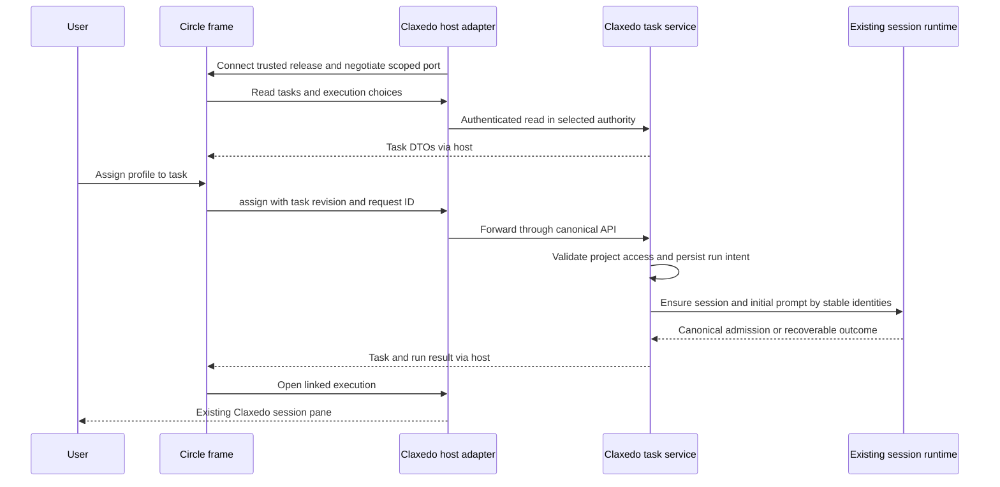
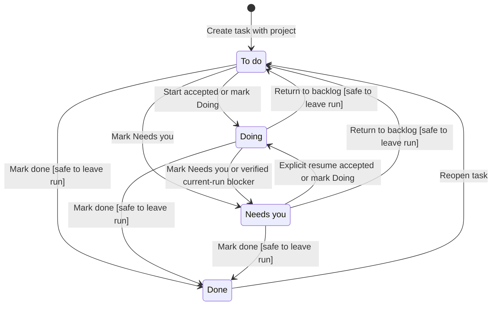
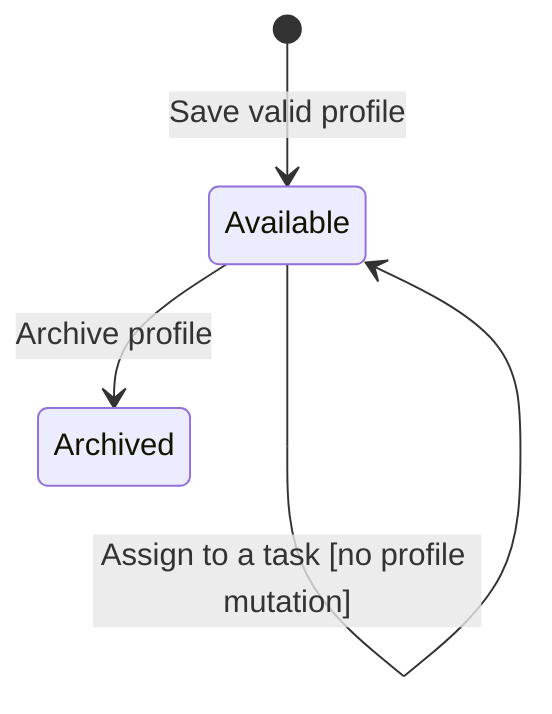
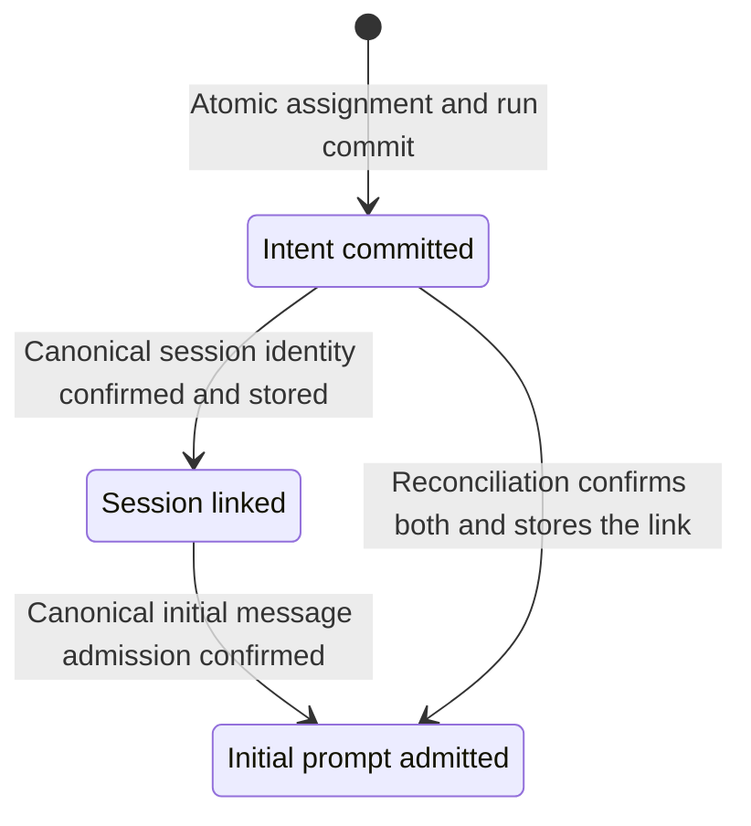
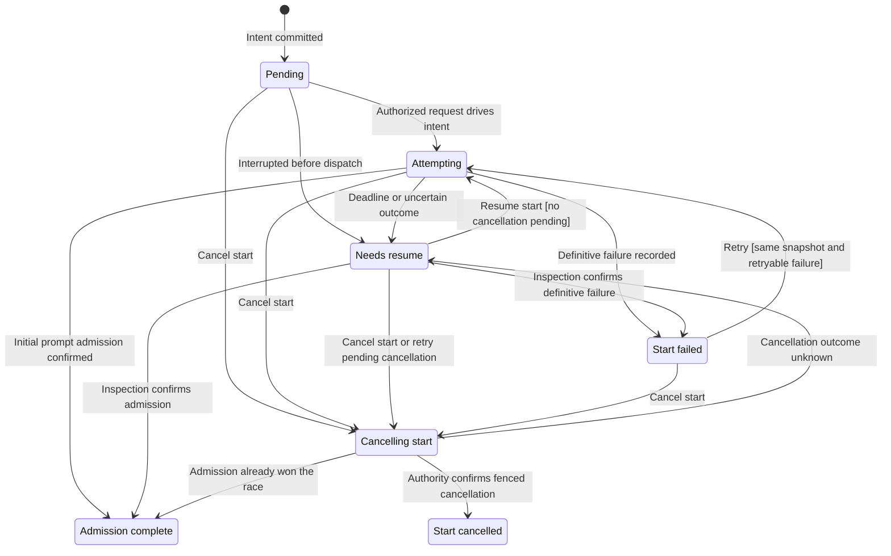
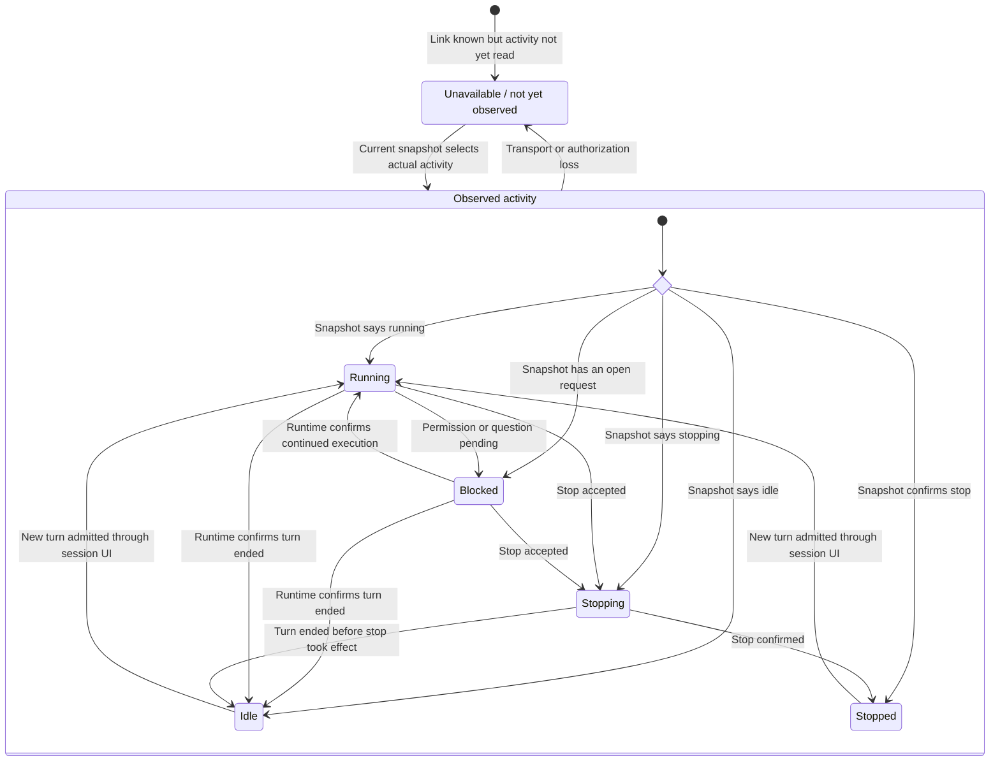
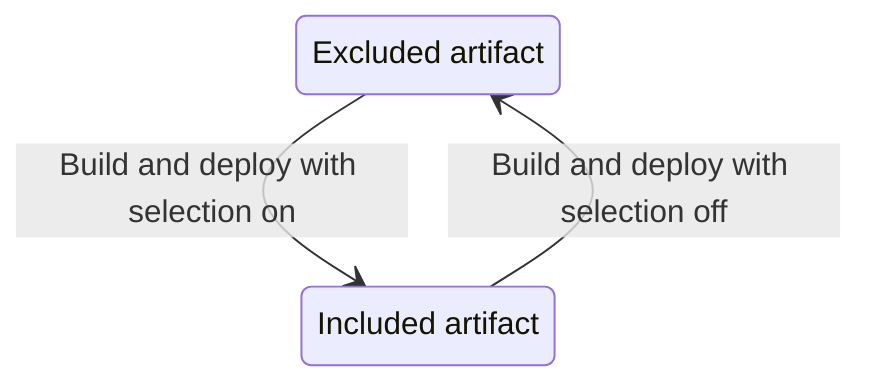
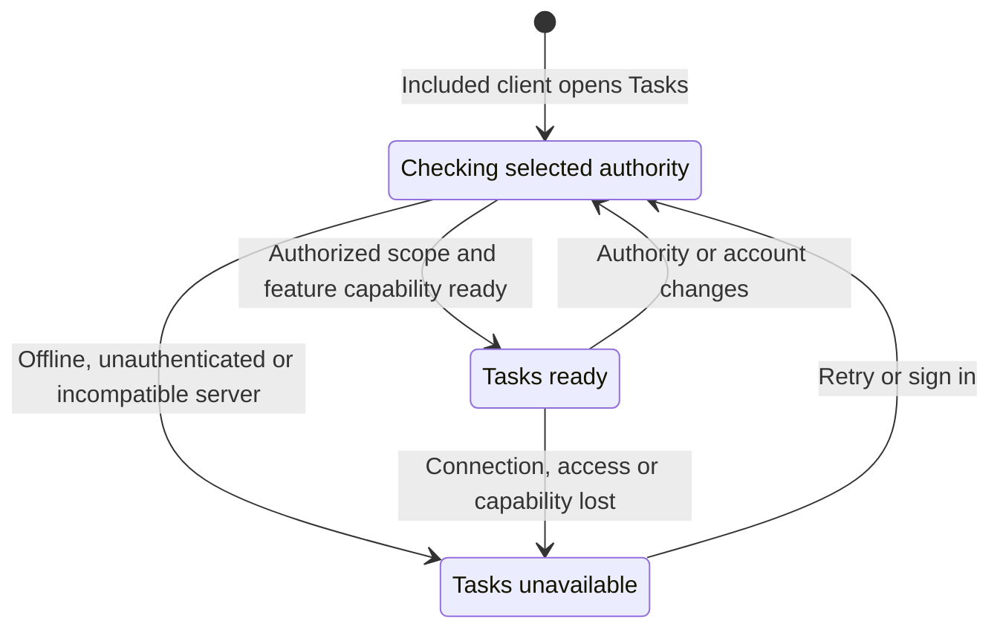

# Pluggable Task Work — Code-first Design

> **Historical profile design.** The [2026-09-09 single-agent decision](2026-09-09-001-claxedo-single-agent-context-memory-direction.md) removes multiple profiles entirely. Execute only the current linked Tasks designs and goal; do not restore profile CRUD or assignment from this file.


> Superseded by [Tasks — High-Level Design](docs/plans/2026-09-08-004-feat-tasks-high-level-design.md) and [Tasks — Low-Level Design](docs/plans/2026-09-08-005-feat-tasks-low-level-design.md). The current direction is one reusable Tasks library with host-supplied ports and a Solid UI on the existing stack. The external UI/fork decisions and package grouping below are historical, not implementation instructions.

Build a task board and reusable execution profiles inside local and Claxedo-hosted Code using an embedded Circle application. Preserve Circle's React UI in a separate fork and deploy it independently on Cloudflare. Claxedo owns task/profile data and execution authority; its existing packages contain the optional backend and a small embedding adapter. Assigning a profile starts a normal Claxedo session linked to the task. Keep the feature behind one build selection that removes its implementation, routes, styles, assets, migrations and exclusive dependencies from disabled release artifacts.

The upstream [Circle repository](https://github.com/ln-dev7/circle) has been forked to [kyashrathore/circle](https://github.com/kyashrathore/circle). The fork preserves its MIT notice. This replaces the earlier proposal to port the board UI to Solid. Fork creation is complete; embedding, backend integration and Cloudflare deployment are not implemented.

The feature is called **Task Work** in implementation and **Tasks** in the interface. It is a compile-time optional first-party capability, not a dynamically installed agent plugin. A model plugin cannot install this application UI, change its server routes or turn on a product build.

This document scopes the next implementation. The [Company PRD/design](docs/plans/2026-09-08-002-feat-company-prd-design-plan.md) remains the longer-term context. Company runtime, memory, channels, scheduling, autonomous delegation and company connections are outside this slice.

## 1. The build contract

Proposed build input: `CLAXEDO_BUILD_TASK_WORK=1`. Omitted or `0` means excluded; other values fail the build. Resolve it once in build tooling and pass the resolved selection to every producer of the release.

| Included build | Excluded build |
|---|---|
| Tasks navigation and surface are registered. | No Tasks navigation, surface renderer or command implementation. |
| Task/profile APIs and persistence adapter are mounted. | No feature routes, store initialization, listeners or startup recovery. |
| The Claxedo embedding adapter is emitted; Circle ships as a separately versioned app. | No embedding adapter, Circle frame or feature chunks/assets in the Claxedo artifact. |
| Feature migrations are staged separately. | No task schema or migration files in the shipped resources. |
| Required feature dependencies are packaged. | No feature-exclusive external dependencies in packaged resources. |

An environment change requires rebuilding and deploying the selected artifact. A runtime flag cannot remove bytes from an already-built application. Runtime service capability checks remain useful for detecting a mismatched or unavailable server; they do not satisfy exclusion.

“Excluded” applies to the shipped product, not the Git checkout or development lockfile. Existing shared session, HTTP, SQLite and UI dependencies remain when another feature needs them. Generic host contribution seams also remain; they contain no task/profile implementation. The disabled build must not resolve the feature implementation directories or copy their resources. Existing packages remain dependencies for the capabilities they already provide.

There is one feature selection for this scope, not separate permanent flags for board, profiles and assignment. Incremental releases add completed behavior under the same boundary. Desktop/local, self-hosted Node and the selected Claxedo-hosted Worker release are supported targets for this design. Each must qualify its own enabled and excluded artifacts. Other uncertified targets reject an enabled selection rather than quietly shipping half of the feature.

## 2. The product slice

### Tasks

The Tasks surface shows To do, Doing, Needs you and Done. Each task has a title, description, project, optional owner profile and a stable identity. Opening a task exposes its description, owner, status and linked sessions. Existing session presentation remains responsible for conversation, permissions, questions and tool output.

Create a task without assigning it: it stays To do and starts nothing. Assign a profile: the host resolves an execution target and starts a session. An unresolved target or denied permission produces a visible start failure. Editing a task description does not automatically submit another prompt.

Status is business state. Execution detail is shown separately: Starting, Resume start, Running, Idle, Blocked, Stopping, Stopped, Start failed or Unavailable. An idle session does not automatically mark a task Done. Mark done is explicit and does not abort a running session; the operator must stop active execution before completing the task.

Require a project when saving a task. Creating a task from a project surface may visibly prefill that project, but the saved task owns the selection. At launch, resolve the task's project → workspace placement → directory through existing host services. A project is not a filesystem path; a project may have several workspaces. Use the task's recorded workspace selection or an explicit host policy, and request a choice when the target is ambiguous. Never execute in whichever directory happens to be globally active.

Changing a task's project clears its workspace selection and revalidates access and harness availability. Refuse that change while a start is unresolved or the current execution is active, blocked, stopping or unavailable. After a confirmed idle/stopped execution, a project change affects the next explicit fresh run; existing runs retain their original project/workspace snapshot. Opening an old session still opens its original execution target. Changing the project never starts a session by itself.

The first slice supports menu/keyboard status changes; drag-and-drop uses the same mutation when added. No state transition depends on a drag event existing.

### Profiles

A profile form contains name, harness, optional model and optional instructions. Project and workspace selection belong exclusively to the task. A single profile can therefore be assigned to tasks in different projects without copying or editing the profile. Model choices come from the selected harness's existing catalog. An omitted model means that harness's default, not a newly hardcoded provider choice.

The initial profile is an execution preset. It does not yet learn, own credentials or carry standing permission. Existing session permission settings apply. Future memory can attach to its stable identity without changing that identity into a different object.

### Assignment and subsequent work

Assignment to an unstarted task starts one session. Repeating the same command returns its recorded run. Editing profile defaults affects future runs only; a running session retains its configuration snapshot.

Opening a linked session uses the existing Code navigation path. Continuing work submits through the existing session interface. An explicit Start fresh action creates a new linked run; ordinary reopening does not. A task may retain several historical runs and has at most one active start/execution owner.

Reassigning an active task is refused with a concrete Stop current run action. A stopped or idle task may be reassigned, starting a fresh run under the new profile. Pending or unknown starts must first be resolved or authoritatively cancelled; a timeout does not release their ownership. The previous transcript stays attached as history; it is not automatically injected into the new owner's prompt. The task description and selected context remain the explicit input.

## 3. Existing seams to use

| Current owner | Observed contract | How this feature uses it |
|---|---|---|
| [App architecture](packages/claxedo-app/src/ARCHITECTURE.md) | App composition joins features; features do not import each other at runtime. | Put Code adapters in app integration, not inside the reusable board. |
| [Contribution registry](packages/claxedo-app/src/app/integrations/registry.ts) | Registers surfaces and commands with ownership/gates. | Register Tasks through an enabled-only contribution module. |
| [Product contributions](packages/claxedo-app/src/app/composition/product-contributions.ts) | Composition supplies loaders and manages activation. | Reuse explicit contribution/lifecycle vocabulary; do not build a second registry. |
| [Local content surfaces](packages/claxedo-app/src/app/integrations/first-party-content-surfaces.tsx) | A surface imported here is reachable by every local product. | Do not add a static task renderer here. |
| [UI flags](packages/claxedo-app/src/app/composition/product-ui-flags.ts) | Flags govern entrypoint visibility. | Do not use this as the sole build switch. |
| [Browser build selection](packages/claxedo-app/vite.browser-auth.ts) | Build-time selection chooses a module and chunk configuration. | Follow explicit module selection rather than runtime branching around a feature import. |
| [Server contributions](packages/claxedo-server-core/src/platform/http/route-contribution.ts) | Deployment supplies route families; the common contract contains no feature-specific types. | Mount Task Work routes only from enabled server composition. |
| [Local app](packages/claxedo-local-server/src/app/local-app.ts) | Accepts route contributions at a defined middleware/mount boundary. | Reuse its outer security controls and add the optional route family at the contribution seam. |
| [Session acquisition](packages/claxedo-app/src/features/session/composer/ui/submit-create-session.ts) | Resolves targets and managed reservations before creating sessions. | Reuse canonical target/reservation owners through a headless launch port. |
| [Create lifecycle reconciliation](packages/claxedo-app/src/features/session/submit/create-with-lifecycle.ts) | Reconciles HTTP outcomes with authoritative lifecycle events. | Preserve this behavior for UI submission; it is not durable task-start deduplication. |
| [Runtime session routes](packages/workspace-runtime/src/routes/session-core.ts) | Own session creation and prompt admission. | Extend generic start identity where necessary; never implement a second session runtime. |
| [Product boundary tooling](script/product-boundary/closure.ts) | Walks aliases and package exports; emitted manifests check actual builds. | Prove both disabled source closure and release-artifact exclusion. |

## 4. Code grouping

Keep Circle in its own repository as an independently built UI service. Use feature folders inside existing Claxedo packages for the host adapter and task backend. Code and Company mount the same embedded app through their app composition. Circle retains React/Next.js; the host retains Solid.

Circle owns task presentation and disposable query state. The shared Claxedo server feature owns durable task rules and its API. Deployment adapters own storage and authority wiring. No task database, identity provider or harness runtime is added to the Circle fork.

The following tree is a proposed layout, not existing implementation. The Circle entry is a separate repository; the package/script entries are rooted at `/Users/yashvardhansingh/test/opencode`.

```text
kyashrathore/circle                       separate repository and release
  app/embed/                             dedicated embedded route/layout
  components/                            retained Circle board, task detail and controls
  lib/claxedo/                           typed host bridge and task data adapter
  [Cloudflare build configuration]       selected and qualified deployment adapter

packages/claxedo-app/src/features/task-work/
  contract.ts                            host-neutral embed contract
  circle-frame.tsx                       dedicated frame and loading/error states
  bridge.ts                              validated connection and scoped requests

packages/claxedo-app/src/app/integrations/task-work/
  contribution.tsx                       enabled-only surface and commands
  host.ts                                authenticated APIs and session navigation

packages/claxedo-server-core/src/task-work/
  contracts.ts                           transport-safe Task, Profile, Run DTOs
  domain.ts                              assignment and status rules
  service.ts                             durable commands and launch coordination
  ports.ts                               atomic store, authority and execution ports
  routes.ts                              deployment-neutral HTTP contribution
  storage/sqlite/                        Node/local store and owned migrations

packages/claxedo-local-server/src/task-work/
  composition.ts                         local store, authority and launch wiring

packages/claxedo-server/src/task-work/
  node-composition.ts                    signed Node authority and execution wiring
  hosted-composition.ts                  signed Worker authority and execution wiring
  storage/d1/                            D1 store and feature-owned migrations

packages/claxedo-server/src/deployments/hosted-workerd/
  [selected enabled entry]               composes Task Work with existing routes

script/task-work-build.ts                 one build selection and producer mapping
script/product-boundary/                  existing checks extended for on/off variants
```

Tests stay beside each owner. Start with these small modules; introduce further directories only when their responsibilities need them. There are no new Claxedo workspace packages or React dependencies in its renderer. Circle keeps its own manifest, lockfile and independent release version; the bridge protocol defines compatibility between the two repositories.

Add narrow subpath exports to the existing server-core package where consumers need them. Contracts and HTTP/domain modules must remain workerd-safe. The SQLite driver is reachable only through its explicit storage subpath; neither browser DTO imports nor the Worker service entry may pull it in. Do not add Task Work to an always-loaded server-core barrel.

The embedding adapter follows the existing feature dependency rules. App integration supplies project catalogs, harness/model choices and session navigation. Circle presents those values through its own controls rather than importing Claxedo components across the iframe boundary. Existing Claxedo conversation, permission and question UI stays in its session surface.

Replace Circle's mock issue store with a data adapter backed by typed host commands. Keep mock data in an explicit development preview only; a production disconnection renders Unavailable, never sample issues or fabricated successful mutations. Profile and execution controls are additions to Circle's UI; its existing human assignee field is not silently reinterpreted as an execution profile.

The optional feature owns its schemas, caches, API and lifecycle. Avoid task/profile fields in the default global session store, default server service contract, central migration journal or always-loaded settings module. Generic execution improvements belong with the existing session owner and contain no `Task` or `Profile` dependency.

## 5. Build composition across the real products

### Renderer selection

Add a build-selected optional Code contribution import. In an excluded build it resolves to an empty, feature-neutral contribution. In an included build it resolves to the Task Work contribution. The excluded module has no import, including a dynamic import, of the feature or its enabled adapters.

Apply the same resolver to cloud/local Vite builds and the Electron renderer build. Development resolution follows the selected variant too. A typed declaration for the seam is dependency-neutral; do not point an off-build TypeScript resolver at the real task implementation merely to obtain types.

The isolated disabled product's typecheck must also select only its own entry graph and neutral declarations. A broad project include that pulls enabled-only adapters back into that check defeats dependency isolation even when Vite would omit them. Keep the full repository's enabled-feature typecheck as a separate coverage target; exclusion must not become an excuse to leave feature code unchecked.

Lazy loading is still useful after inclusion, but is not exclusion: a retained `import()` usually creates a distributable chunk. The enabled contribution owns the frame loader, bridge, small host stylesheet and feature navigation labels. Circle assets are loaded only after a compatible service and frame connection are established. The base shell receives a contribution, not an unconditional task import behind `<Show>`.

The current global navigation has explicit callbacks rather than a general navigation contribution list. Add a small app-owned optional action slot with stable IDs, labels and callbacks. The enabled task contribution supplies its entry. Do not create a second plugin framework or hardcode task labels in the default navigation component.

### Embedded app and Cloudflare release

Circle's embedded route removes its outer workspace/team sidebar, duplicate account controls, promotional chrome and mock AI navigation. Keep the task toolbar, board/list toggle, task details and inline editing patterns. Size the layout to its container, not assumptions about Circle's full-window sidebar. Preserve project/profile/status controls on narrow panes and mobile through an accessible sheet or inline section.

The Cloudflare Worker serves the Circle app on a dedicated origin. It receives no Claxedo provider credentials and does not store task rows. The primary supported mode is embedded in signed Claxedo; a direct visit without a host connection shows connection-required state. A development fixture host can preview components but is not a production standalone task authority.

Preserve the existing Next.js routing first and qualify a Cloudflare build adapter against the actual fork. Current [Cloudflare Next.js guidance](https://developers.cloudflare.com/workers/framework-guides/web-apps/nextjs/) recommends vinext, describes it as beta and targets existing Next.js 16 apps; the reviewed Circle snapshot uses Next.js 15.2.8. An upgrade/compatibility check is therefore a real build task. Do not label the current fork Workers-ready or silently assume its arbitrary dynamic issue routes support static export. G0 must establish the supported framework/adapter versions, run a workerd preview and verify nested embed routes, assets and reloads before choosing the release configuration.

Keep the upstream MIT notice in source and distributed license notices. Removing promotional UI does not remove attribution obligations. Record the upstream commit in each fork release so later UI updates can be reviewed without overwriting Claxedo adapters.

### Frame connection and task commands

The parent creates a dedicated frame using an installed, trusted Circle release URL. The URL carries only non-secret layout/version options. Hosted deployments restrict `frame-ancestors` to approved Claxedo origins. Use a dedicated script-capable frame policy on a distinct origin; do not weaken the existing [generic external preview](packages/claxedo-app/src/features/browser/components/hosted-browser-frame.tsx), whose empty sandbox intentionally prevents application scripts.

For hosted web, validate the frame origin and exact `contentWindow`, negotiate a versioned protocol and transfer a `MessagePort`. Both ends validate message schemas, request IDs and a per-mount connection generation. Restrict commands to named operations such as list/create/edit tasks, list/create/edit profiles, assign/resume, get project/execution choices and open a known execution. Do not expose arbitrary URLs, arbitrary SDK calls, filesystem operations or generic authenticated fetch.

The Claxedo parent executes data commands through its normal authenticated API client. The server derives actor/organization and enforces task/project access, revisions and admission identity. Circle receives DTOs and command results, not bearer tokens, cookies or machine credentials. A Worker service binding is server-to-server infrastructure; it is not a browser authentication mechanism and does not replace this connection contract.

Pin each bridge instance to its authority and authenticated scope. Project selection remains an explicit task property. Switching account/authority invalidates outstanding UI results, closes the port and clears child query state before reconnecting. It does not retarget an already submitted command. A lost response is reconciled with the original command ID; unmounting never means cancelling an accepted execution.

Session observations flow through the same host port and canonical session references. `openExecution` opens an ordinary Claxedo session pane. Forward only the task-relevant status snapshot/updates to Circle, not the full conversation or tool stream. Snapshots establish state after reconnect; updates carry the current run identity so old events cannot overwrite a replacement run.

The packaged Electron renderer, whose trusted document URL is decided by [renderer-url-trust.ts](packages/claxedo-desktop/src/main/renderer-url-trust.ts), is loaded from `file://`. A production bridge must not treat the string `null` as a trusted parent origin. The desktop adapter must bootstrap a short-lived, one-use, pane-bound connection capability through the trusted host path and prove possession before the child accepts a port. Bind it to the trusted Circle release, app instance and connection generation; send no credential in the frame URL. The frame retains no Node/Electron privileges. Reuse existing renderer/navigation trust checks, and qualify this handshake in packaged Electron. Hosted origin checks alone do not prove desktop support.

The initial independently hosted UI needs network access even when controlling a local catalog. This is an explicit change from an entirely bundled local board. Do not call it offline-capable. A later approved local/static distribution can serve the same release and bridge contract; do not silently substitute a second board or load unversioned cached code on connection failure.



### Service lifecycle and build exclusion

Reuse the [service installation ledger](packages/claxedo-server/src/platform/services/installation-ledger.ts) for explicit installation, health, enable and disable semantics where that deployment supports it. The [current service contract](packages/claxedo-service-contract/src/index.ts) recognizes only `documents`; Circle is not already registered. Add a reviewed fixed service descriptor and signed browser projection for its UI origin, release identity and embed protocol range. Keep URLs tied to deployment trust; this is not a marketplace accepting arbitrary remote scripts.

Protocol compatibility and a successful health probe are required before offering Tasks. A service disable immediately prevents new bridge commands and removes/disposes the frame through the existing contribution lifecycle. Stored task/run records remain under their Claxedo authority. Build selection off additionally excludes all feature implementation and routes from the Claxedo artifact. The separately deployed Circle service may still exist, but the off product does not register it, request its assets or expose its task APIs.

Circle's React/CSS bundle never enters Claxedo's module graph. The shared Tailwind scan still needs off-only exclusions for the small task-work frame and integration folders. Inspect off/on Claxedo outputs and browser network traffic; JavaScript bundle absence alone does not prove that the app stopped preloading the service.

Pin the Circle release and protocol range in selected deployment metadata, and key caches by release. Existing open frames require explicit compatibility handling when either side upgrades; incompatible versions disconnect with a visible reason. Runtime disable, artifact exclusion and remote service deletion are separate actions. None automatically deletes task data or stops ordinary admitted sessions.

### Server selection

Use enabled server composition to create the store and route contribution and pass it to the existing app. The base `local-app.ts` does not import Task Work. The same selection controls feature resource copying and startup/shutdown ownership; merely returning no routes after opening the database is not an excluded build.

The [local-server package build](packages/claxedo-local-server/scripts/build.ts) and Electron's [server bundler](packages/claxedo-desktop/scripts/bundle-claxedo-server.ts) are separate producers. Wire both to the build selection. The [desktop server resolver](packages/claxedo-desktop/scripts/local-server.ts), prebuild and final packaging must agree on the selected entry/resources. Checking only `claxedo-app/dist` misses the installed desktop server.

Desktop/local Code uses local authority and SQLite. Self-hosted Node uses its existing signed authority, SQLite catalog and machine dispatch. Claxedo-hosted Code uses signed Worker authority, D1 and the existing hosted workspace execution path. All three implement the same task service ports and pass the same state-transition conformance cases. Do not import `@claxedo/server` into local-server to reuse the hosted adapter: the existing local closure forbids that edge.

Hosted support is part of this slice. The existing [Agent Plugins Worker composition](packages/claxedo-server/src/deployments/hosted-workerd/better-auth-d1-candidate-worker.agent-plugins.cf.ts) already composes authenticated feature routes over a shared control plane. Extend the selected enabled composition to append Task Work contributions without replacing existing route families, runtime preparation or provisioning hooks. Preserve settled composition and authentication readiness behavior.

The [full-hosted candidate entry](packages/claxedo-server/src/deployments/hosted-workerd/better-auth-d1-candidate-worker.agent-plugins.full-hosted.cf.ts) wires a sandbox driver and D1 lease store into that control plane. Reuse those execution owners. Do not introduce a second sandbox manager, a Company episode runtime or a task-specific Durable Object just to start Code sessions.

The inspected [certified artifact inventory](packages/claxedo-server/src/deployments/hosted-workerd/certified-worker-artifacts.ts) includes user-deployed candidate/full-hosted artifacts. That is evidence for the composition pattern, not proof of which artifact currently serves managed Claxedo. G0 must identify and qualify the actual managed release entry and its build/deploy pipeline. Add Task Work to that selected artifact explicitly; do not enable the broad optional-services family to obtain this one feature.

A control-plane-only deployment can keep a board and dispatch to an authorized connected execution target; it cannot offer cloud machine creation without that capability. A full-hosted release must pass its existing sandbox configuration checks. A renderer/server capability mismatch reports Tasks unavailable and never silently switches to a local catalog.

### One selection, complete artifact identity

The root build resolver returns the selected renderer contribution, server contribution, hosted Worker entry/deployment inputs and staged resource set. Producers consume those results; they do not independently interpret differently named environment variables. Include a generic feature-set fingerprint in build metadata and verify renderer/server resource agreement before packaging.

Use clean variant output/staging directories, and key build caches on the feature set. An enabled build followed by a disabled build must not leave old task chunks, styles, migrations, external packages, server compile caches or copied resources in the final release. Extend existing cleanup/manifest owners instead of adding an unrelated packager.

Update source-closure resolution to follow the same selected aliases. Unknown or opaque imports fail the check. Do not make the graph appear empty by hiding a dynamic import from the scanner.

## 6. Durable records and APIs

| Record | Minimum content |
|---|---|
| Task | ID, catalog/owner scope, title, description, required project reference, optional workspace selection, status, optional profile ID, revision, timestamps. |
| Profile | ID, scope, name, harness/model defaults, instruction text, revision, archived state. No project or workspace fields. |
| Run | ID, task ID/revision, profile ID/revision/configuration snapshot, task project/workspace snapshot, initial prompt snapshot, stable start/message identities, canonical session reference when known, admission checkpoint, start disposition, revision. |

Group the profile's harness/model defaults inside its execution configuration. Resolve those defaults against the task's project and workspace only when creating a run; persist both inputs in that run's immutable snapshot. Identity, name and instructions remain reusable when Company later adds a different execution configuration. Do not store the task itself as a session or place the only task ID inside a prompt string.

Use the canonical host-aware session reference through the Code adapter; a bare session ID is not sufficient across hosts. The shared feature retains an execution reference and delegates opening/inspection to its host. Company can later supply another execution kind without teaching the board about its runtime.

The enabled authority server owns task/profile mutations. Local and Node adapters use a separate `task-work.sqlite` catalog. Hosted uses feature-prefixed tables in the existing `CONTROL_PLANE_DB` binding. Do not create a new cloud database or store hosted catalog rows on a workspace VM. Browser caches are disposable and keyed by authority, authenticated scope and record revision.

The store port exposes atomic operations such as creating an assignment with its run intent. A browser read followed by unrelated task/run writes is not that contract. Both adapters must enforce expected revision, request uniqueness and the single active owner at the database boundary. The D1 adapter must use D1-supported transactional batches/conditional statements and prove rollback and competing-isolate behavior; it cannot emulate a Node transaction by holding an in-memory lock across requests.

Feature schema assets remain outside the unconditional core migration journal and resource-copy roots. Local initialization opens/migrates only its feature catalog. Hosted deployment applies feature migrations as an enabled-only release step against `CONTROL_PLANE_DB`, with a separate feature migration ledger and stable migration IDs. The deployment runner, rather than a Worker request, owns migration. Do not filter already-issued base migrations or renumber them when toggling the feature.

The existing [hosted release tooling](packages/claxedo-server/scripts/deploy/release-better-auth-d1.ts) is the place to integrate migration staging, schema readiness and the feature-set fingerprint. Off releases stage/apply no feature SQL but retain shared D1 bindings and all previously stored rows. Backup and restore still cover the existing control-plane database, including task rows. An enabled release with an incompatible feature schema fails readiness explicitly. Feature tables reference canonical owner/project IDs without adding task-specific columns or callbacks to core tables. After feature-off account/project deletion, re-enable must treat missing authority as unavailable and never resurrect access; physical orphan cleanup is an explicit feature maintenance concern.

The proposed API family is `/api/claxedo/task-work`, containing task/profile reads and typed create, edit, assign, resume-start, cancel-start, start-fresh, set-status and archive-profile commands. Mutating requests carry a stable request ID and expected entity revision. Scope and actor come from trusted host authorization, not from body fields. After authorization, a retry with the same request ID and payload returns the recorded command result before testing the now-outdated revision. Reusing that ID with another payload is an explicit conflict; a new request with a stale revision is also a conflict.

Local access uses the existing local request protection. Signed Node and hosted access resolve user and organization through the existing authority layer. The first signed catalog is personal within the selected organization, keyed by canonical organization and user IDs; organization-wide sharing is deferred. Every task/profile/run query and mutation includes that resolved scope. An ID from another user or organization cannot authorize a lookup or assignment.

Catalog ownership does not grant workspace execution access. Check current project/workspace authority separately before preparing a machine, reserving a session or admitting the prompt. The task description, profile name and persisted owner fields are not credentials. Profile presets neither store provider secrets nor broaden the selected session's existing permissions.

The Tasks surface labels its selected authority using the existing server/account context. A browser and a desktop client connected to the same hosted authority and signed scope see the same catalog. A desktop's installation-local board is a different catalog; this slice does not synchronize, aggregate or merge the two. Logging out or switching authority disposes observations and drops scoped query state before rendering the new scope. A pending mutation remains addressed to its original authority; it must never be replayed against the newly selected one.

Preserve task data when the feature is disabled. The excluded application neither queries nor migrates feature records; hosted continues using the shared control-plane database for its other capabilities. Re-enabling checks its schema version and reconciles existing session references. Old pending starts are surfaced for explicit resume rather than automatically launching work because a build was re-enabled.

## 7. Assign-to-session execution contract

The authoritative flow begins at the task service, not the browser component:

1. Authenticate the command and resolve its scope. Recover an existing matching request result; otherwise validate task revision, profile and target access.
2. Resolve project/workspace from the task and harness/model from the profile through the host port. Reject unavailable or ambiguous choices before session creation.
3. Commit assignment and one durable run/start intent, including the resolved configuration, exact initial prompt snapshot and stable launch/message identities. A task edit after this commit does not alter a retried prompt.
4. Ask the host execution port to ensure the session for that identity. Repeat calls must resolve the same session, including after an HTTP response is lost.
5. Persist the returned canonical execution reference, then submit the task prompt with its stable initial message identity.
6. Record authoritative admission or failure. Return the task/run state; the UI observes or opens the linked session through existing Code mechanisms.

The launch port has three responsibilities: ensure an execution from a persisted intent, inspect it, and request cancellation. The task service owns deduplication and task lifecycle; the host owns session authority, creation, prompt admission and runtime status. Repeated session and prompt admission must resolve the same identities even across concurrent attempts. This is an at-most-one admission contract per intent, not an exactly-once guarantee for tool side effects. No second agent loop is introduced.

The [current Node machine dispatcher](packages/claxedo-server/src/session/machine-dispatch.ts) generates a new session/registration identity inside `create`. Calling it again after an ambiguous outcome is not sufficient for task-start deduplication. Extend the authoritative create/reservation contract to accept or resolve a stable operation identity and use it consistently. That extension is a session capability with ordinary-session tests, not a task import into the runtime.

Likewise, the runtime's existing `clientRequestId` handling is tied to available child-session capabilities and caller identity. Do not pretend every deployment already supports the required top-level retry behavior. The local, signed Node and hosted adapters must each prove the contract through their real session entrypoint.

The app's current composer includes presentation and optimistic navigation around creation. Keep those concerns there. Reuse or extract genuinely shared headless target/configuration mechanisms; do not call the composer component from the board or copy its whole submit implementation into the task service.

### Recovery rules

| Interruption | Required result |
|---|---|
| Before start intent commits | No accepted start; retry can create one. |
| Intent committed, session outcome unknown | Reconcile by stable launch identity; no blind second session. |
| Session created, link write interrupted | Recover the same reference and complete the link. |
| Prompt admitted, response lost | Resolve the same prompt admission; do not submit another initial instruction. |
| Profile changes while start is pending | Use the recorded snapshot; a new configuration needs a new explicit run. |
| Runtime becomes inaccessible | Show Unavailable/Needs you; retain evidence and link. |
| Task Work excluded by a later build | No task background work runs. Existing sessions follow ordinary Code lifecycle and remain accessible where that lifecycle permits. |

Closing the board does not cancel a persisted launch intent or an admitted session. It also cannot guarantee that a disconnected HTTP request will finish launching. Node shutdown or Worker eviction may interrupt the attempt; the durable record must distinguish pending intent from confirmed runtime admission.

A launch is driven by an authenticated assign/resume request for a bounded duration. When completion is uncertain, return the persisted pending run when possible; after a lost response, the client reads it by request identity. On reopen/reconnect, inspect known identities and display the recovered state. Inspection may repair a link or confirm an admission, but must not create a missing session or resubmit a prompt. An explicit Resume start command reauthorizes and drives that same intent. This supplies crash recovery without promising an always-on work queue.

Worker memory, a detached promise and `waitUntil` are not durable task owners. No recurring scheduler or task-specific queue is required for this manual slice. Unattended guaranteed launch after the initiating request disappears would require durable dispatch and is a later capability. Already admitted sessions continue under the existing execution runtime's lifecycle.

The following state machines define when inspection can update evidence, when a command may retry, and when an execution owner can be released.

### Hosted user flow

1. A signed user opens Tasks. The Worker authorizes the scope and reads D1; no workspace needs to be running for board or profile CRUD.
2. Assign resolves the task/profile snapshot and an authorized project/workspace. The service atomically persists the run intent in D1 before requesting execution.
3. The hosted execution adapter calls the existing workspace preparation/provisioning and session reservation owners. A sleeping cloud target follows the existing machine startup path; its authoritative provisioning failure is shown on the run. Connected-machine placements follow their existing route instead.
4. Stable run/session/message identities survive Worker retries and isolate changes. The Worker dispatches through the same authenticated runtime channel as an ordinary Code session; it never asks the browser to supply a machine credential.
5. The stored execution reference opens the normal session UI. Switching devices recovers the board and reference from the same hosted catalog. The transcript and runtime events remain with their existing owners.

The board shows Starting while machine preparation or admission is unresolved and offers explicit resume after an interrupted start. It must not claim Running merely because a VM was requested. This distinction keeps hosted latency visible without inventing a second execution lifecycle.

## 8. UI and session-state ownership

The Circle board loads task data through its scoped host bridge, which calls the feature API. A card's linked-session detail comes through a host observation port using existing session queries/events. Task Work does not add a parallel global session cache or synthesize completion events.

Observe relevant session references while the task surface is mounted and dispose those subscriptions when it unmounts. On reopen, read a current snapshot before applying newer events. Missed events lead to reconciliation, not a guessed Idle or Done state.

An actual permission/question event for the current run may make a task Needs you under the guarded transitions below. Its action opens the existing session interaction UI; inline task-specific permission controls are outside this slice. A lack of observed events is not evidence that the agent asked a question or completed work.

Persist task surface identity through the existing content contract with an opaque task payload. An excluded build has no Task Work decoder/renderer; generic unavailable-surface handling can close an unsupported restored tab without touching the task database. The session links remain ordinary session references.

### State machines and their owners

These diagrams specify proposed Task Work behavior. The session activity diagram is a projection of existing runtime evidence, not a new session engine. The build diagram describes deployment changes, not a runtime feature switch. Workspace provisioning, authentication and permission handling retain their existing owners; Task Work consumes their results rather than persisting duplicate lifecycle machines.

| State | Authoritative owner | Persistence |
|---|---|---|
| Task business status | Task service and revision-checked task store | Task row. |
| Profile availability | Profile commands in the task service | Profile row and revision. |
| Launch admission checkpoint | Task service, advanced only from canonical host evidence | Run row; monotonically advances. |
| Start disposition | Task service coordinating the host launch port | Run row; separate from checkpoint. |
| Session activity | Existing runtime/session owner | Existing session store; task UI observes it. |
| Feature availability | Build composition, release selection and server capability | Artifact metadata; UI availability is transient. |

A task can be Doing while its session is Idle, or Needs you while a start needs recovery. Never combine these into a single enum. Scope authorization precedes every command; revisions and current-run identity guard persisted transitions. Rejected commands leave state unchanged.

### A. Task business status

Creating a task requires its project and creates To do. An accepted assign/start-fresh intent moves it to Doing in the same transaction that records the run. Preflight rejection leaves its prior status unchanged and shows the error on the action. Done is entered only by an explicit user command.



“Safe to leave run” means no run exists, a start has been conclusively cancelled/failed without active execution, or the current execution is authoritatively idle/stopped. Pending admission, running, blocked, stopping and unknown activity fail this guard. A stop request alone does not satisfy it. The same guard applies to changing the task's project, reassigning and Start fresh. New launches on Done require explicit reopening first.

Verified current-run launch failure, a permission/question request or interrupted admission can move Doing to Needs you. The task service validates the evidence and current run before persisting that transition; a browser-supplied status is not runtime evidence. Resolving a runtime blocker does not automatically erase a manually chosen Needs you status. The user can move it back to Doing; the execution badge independently shows resumed activity. Late events never reopen Done or change a task using evidence from an older run.

### B. Profile lifecycle

Saving a profile creates an available execution preset. Editing increments its revision. Archiving hides it from new assignment choices and rejects new starts using that profile, while retaining its identity and historical snapshots. A previously accepted intent may still resume with its frozen configuration after reauthorization; archiving does not cancel work already accepted.



The form's unsaved draft is UI state, not a third persisted profile state. Restore and permanent deletion are outside this slice. Neither profile state contains a project, workspace, credentials or execution activity. Project-specific validity is checked when assigning the profile to a task.

### C. Launch admission checkpoints

Committing a run records its task project/workspace and profile configuration snapshots before execution. Session creation and initial prompt admission are distinct boundaries: linking a session does not prove that it received the task.



Checkpoints never move backward. Timeouts, profile edits and retries do not reset them. A retry reuses the run's session/message identities and exact prompt snapshot; it does not rebuild the prompt from today's task description. Reconciliation may discover that execution progressed beyond the last stored checkpoint. Once admission is confirmed, launch coordination is complete and session observation owns activity reporting.

### D. Start attempt, interruption and cancellation

The start disposition answers whether a request is driving the intent, whether user recovery is needed, or whether launch coordination has finished. It is independent of the last confirmed checkpoint, so an interrupted start can retain a known session link without claiming prompt admission.



Resume rechecks access and continues from the stored checkpoint. A changed project, model or prompt requires a new explicit run after the current owner is safely released. Authentication failure on resume does not erase an existing intent or pretend that an already admitted session stopped.

Cancel start is for an intent whose admission is not yet confirmed. Persist the cancellation request and have the canonical launch/admission owner prevent later creation or admission under that identity. A local row update cannot stop an already in-flight runtime request. If admission won the race, resolve the same session and use its ordinary stop path; do not report Start cancelled. This fencing capability must be implemented and tested at the existing session/reservation boundary before exposing Cancel start. An uncertain outcome remains recoverable and retains ownership.

Start failed records a definitive operation failure, not proof that every external resource is absent. Before replacement, completion or a project change, inspect any known session and unresolved admission. Release ownership only when there is no active execution or late admission can no longer occur. An ambiguous network error belongs in Needs resume. A lost browser connection or Worker eviction never authorizes a new run ID by itself.

### E. Linked-session activity

After prompt admission, the adapter reads current session evidence and subscribes through the existing host. The badge can be Running, Blocked, Idle, Stopping, Stopped or Unavailable. Those labels are proposed task-facing projections; they do not rename runtime events or add another session store.



Entering Observed selects the state reported by the current snapshot, including when intermediate events were missed. The snapshot choice is a transient projection step, not another persisted runtime state. Unavailable retains the last confirmed evidence for display but fails guards that require a current idle/stopped result. A stop command being sent is not a confirmed stop; loss of its response requires inspection. Permission replies and subsequent turns continue through the existing session UI.

Idle and Stopped never imply that the task's requested outcome was achieved. Conversely, marking the task Done does not permanently disable its ordinary session; a user can later interact with that session through Code. Task Work coordinates its own starts and current-run ownership, not every future action taken directly on historical sessions.

### F. Build selection and client availability

Deploying an excluded build removes the feature from the shipped graph. Deploying an included build restores its code and can read existing records after schema/capability checks. Neither action is a task command.



While an included client is running, its Tasks surface follows the existing authority connection and capability checks:



Clear scoped queries/subscriptions before switching authorities. A pending command stays bound to its original authority and request identity. Reconnection reads existing intents; it does not automatically resume a start. An excluded renderer contains no Task Work implementation and therefore does not instantiate this client state machine.

### Transition acceptance checks

Add these cases to the existing G0–G4 checks rather than creating a separate state-machine framework:

- Task project is required, profile payloads reject project/workspace fields, and the same profile starts tasks in two projects with distinct correct targets.
- Task project edits clear workspace selection, fail while a start/activity is unresolved, and preserve all historical run snapshots.
- Every task status edge enforces its guard; runtime idle cannot enter Done and stale run events cannot change the current task.
- Profile archive blocks new intents but preserves historical reads and already accepted snapshot-based recovery.
- Lost responses at both admission boundaries recover the same session/message; observation cannot regress a checkpoint or dispatch missing work.
- Cancellation versus session creation/prompt admission proves fencing and truthful outcomes, including across Worker isolates. A late success cannot coexist with a reported pre-admission cancellation.
- Connection loss preserves evidence without releasing an execution owner; stopping requires canonical confirmation before reassignment or completion.
- On → off → on preserves SQLite/D1 records and dispatches no old intents automatically; account switches never reuse another scope's cache or pending request.


## 9. Incremental delivery groups

Every group adds a complete behavior under the same selection. Each adds colocated tests and preserves the disabled build. Proposed test files below are new unless explicitly linked as existing.

### G0 — Prove the boundary first

Create the feature module entrypoints, build selector and host composition seams, initially with a minimal enabled-only Circle frame/route. Qualify the fork on Cloudflare, embedded layout, hosted origin checks, packaged desktop handshake and the versioned host contract. A fixture backend proves embedding only; it does not satisfy G1 or G3. Add off/on controls using the existing [build-manifest normalizer](script/product-boundary/normalize-build-manifest.ts), [Rollup manifest plugin](script/product-boundary/rollup-build-manifest-plugin.ts), [isolated workspace tooling](script/product-boundary/isolated-workspace.ts) and desktop packaging checks.

New checks: `/Users/yashvardhansingh/test/opencode/script/task-work-build.test.ts`; `/Users/yashvardhansingh/test/opencode/script/product-boundary/task-work-artifacts.test.ts`. Extend producer configurations and product policies; do not create another source scanner.

Acceptance: enabled source is reachable only in the enabled graph; the disabled build succeeds with feature implementation directories absent from an isolated source tree; feature-specific CSS and a known feature asset exist only in the enabled output. Qualify desktop, Node and the selected hosted Worker/deployment inputs, including identifying the managed release owner. No mock-data Circle surface is exposed as production Tasks before G1.

### G1 — Persistent board

Implement task CRUD, required task-owned project selection, revision checks, To do/Doing/Needs you/Done and task details. Connect the Circle board to the Tasks surface through the scoped host bridge and authenticated API client. No profile assignment affordance appears before it can execute correctly.

Owners: the shared server-core task domain/service/routes, SQLite and hosted D1 adapters, the Circle board/data adapter, and enabled deployment compositions listed in section 4.

New tests: `/Users/yashvardhansingh/test/opencode/packages/claxedo-server-core/src/task-work/tasks.test.ts`; `/Users/yashvardhansingh/test/opencode/packages/claxedo-server-core/src/task-work/storage/sqlite/store.test.ts`; `components/common/issues/board.integration.test.tsx` in the Circle fork; `/Users/yashvardhansingh/test/opencode/packages/claxedo-app/e2e/playwright/task-work-board.spec.ts`.

Add D1 store conformance tests at `/Users/yashvardhansingh/test/opencode/packages/claxedo-server/src/task-work/storage/d1/store.test.ts`, exercising the real D1 adapter in Miniflare.

Acceptance: tasks survive process/Worker restart, stale writes fail explicitly, keyboard/menu actions work, and a different authority/user/organization does not see the catalog. Hosted CRUD works without a running workspace. Two clients in the same hosted scope observe the same records after refresh. An off build mounts no routes and performs no task database initialization.

### G2 — Reusable profile presets

Implement profile create/edit/archive and harness-dependent model selection. Persist harness/model defaults and instructions; the form and API contain no project/workspace fields. Do not provision credentials, infer learning or start sessions from saving a profile.

Owners: the shared task domain/service, both store adapters, the Circle profile UI and enabled app catalog ports.

New tests: `/Users/yashvardhansingh/test/opencode/packages/claxedo-server-core/src/task-work/profiles.test.ts`; `components/common/profiles/profile-form.test.tsx` in the Circle fork.

Acceptance: the same profile can serve tasks in two projects without mutation; profile creation/editing survives reload, invalid harness/model combinations are rejected, missing defaults remain explicit, and archiving preserves references on historical tasks. Run the same persistence and isolation cases against SQLite and D1. This uses the same module boundary and build selection as G1.

### G3 — Assignment starts exactly one linked execution

Implement run intents, host execution ports, stable session-creation identity, prompt admission and linked-session navigation. Introduce assignment and Start fresh only when this complete flow passes.

Owners: the shared task service; local, Node and hosted task composition adapters; canonical session creation/reservation owners; app task integration. Extend the existing [create lifecycle tests](packages/claxedo-app/src/features/session/submit/create-with-lifecycle.test.ts) and relevant runtime route tests where shared contracts change.

New tests: `/Users/yashvardhansingh/test/opencode/packages/claxedo-server-core/src/task-work/launch.test.ts`; `/Users/yashvardhansingh/test/opencode/packages/claxedo-local-server/src/task-work/launch.integration.test.ts`; `/Users/yashvardhansingh/test/opencode/packages/claxedo-server/src/task-work/launch.integration.test.ts`; `/Users/yashvardhansingh/test/opencode/packages/claxedo-app/e2e/playwright/task-work-launch.spec.ts`.

Acceptance: task → profile → correct workspace/harness/model → one session → one admitted initial prompt. Duplicate requests, two browser tabs and interruption after session creation recover one run/session. Local, signed Node and hosted authority are tested separately. Hosted cases include a sleeping cloud workspace, a connected target, permission revocation and Worker eviction before/after admission. An unsupported harness/placement fails before a fabricated success is returned. Project edits clear workspace selection, cannot retarget a live/pending run, and never change historical run targets. A global project switch does not redirect an assignment already submitted for another task.

Add hosted launch entrypoint cases at `/Users/yashvardhansingh/test/opencode/packages/claxedo-server/src/task-work/hosted-launch.integration.test.ts`; use an enabled workerd composition and the existing runtime boundary, not a mocked board callback.

Validate profile instructions through actual harness entrypoints as well as request-shape tests. A selected model or instruction field that an adapter silently drops is a failed acceptance case. Reuse the harness's existing supported configuration semantics rather than promising identical system-message priority across all harnesses.

### G4 — Status and disable/re-enable qualification

Wire actual session observations, existing permission navigation, explicit completion, active-run reassignment refusal and recovery inspection. Qualify the packaged Code feature before calling it complete.

New tests: `/Users/yashvardhansingh/test/opencode/packages/claxedo-server-core/src/task-work/run-state.test.ts`; `/Users/yashvardhansingh/test/opencode/packages/claxedo-app/e2e/playwright/task-work-lifecycle.spec.ts`; `/Users/yashvardhansingh/test/opencode/packages/claxedo-desktop/scripts/task-work-packaging.test.ts`.

Acceptance: Idle does not become Done, stale observations cannot overwrite a newer run, permissions open the correct session, and on → off → on preserves records without dispatching old starts automatically. Closing the board removes its subscriptions and message port without aborting ordinary sessions. Test frame reload, hostile origin/window messages, protocol mismatch, lost command responses and authority changes during requests. Prove hosted browser/desktop catalog identity, logout/account-switch cache isolation, and a deployed hosted launch against the real supported workspace provider. Miniflare alone is not proof of that last criterion.

## 10. What proves “nothing gets in the build”

No single screenshot, bundle-size number or text grep is sufficient. All four layers must agree:

1. **Selected source graph:** optional feature modules are unreachable from every disabled runtime entry, including dynamic edges. Type-only contracts do not create runtime edges. Alias resolution uses the actual build selection.
2. **Emitted module graph:** bundler manifests contain zero feature implementation modules in all chunks, not only the entry chunk. Positive-control builds contain the expected modules so a broken scanner cannot pass both variants.
3. **Resources and CSS:** inspect styles, HTML preload links, source maps, localization/assets, migrations, staged dependencies and server compile caches. Check feature-exclusive fixtures/markers against an enabled control.
4. **Final packaged product:** inspect the renderer and server resources in Electron's distributable, the supported Node release and the selected hosted Worker bundle/deployment assets, then exercise startup and route absence. A correct intermediate build does not prove the packager copied the correct one.

Required matrix:

| Scenario | Proof |
|---|---|
| Clean off build | No task UI/server implementation, resources or routes. |
| Clean on build | Compatible Circle release connects; board/profile/launch behavior works; React remains outside Claxedo chunks. |
| Circle unavailable or protocol mismatch | Clear unavailable state; no mock issues, credential leakage or duplicate command replay. |
| Runtime service disabled | Existing frame/port disposed; new task commands rejected; task data preserved. |
| On followed by off | No stale feature files survive staging or packaging. |
| Off with feature directories unavailable in an isolated build | Production build does not resolve the excluded implementation. |
| Renderer/server selection mismatch | Packaging fails; separately deployed mismatch is reported unavailable. |
| Previously enabled data with off executable | Catalog is untouched; no feature migration or recovery runs. |
| Re-enable with existing data | Schema checks and reference reconciliation work; no surprise launches. |
| Hosted off build/deploy dry run | No task Worker modules or feature SQL; shared auth/control-plane bindings still work. |
| Hosted on build/deploy dry run | D1 adapter, feature routes, selected migration assets and release fingerprint agree; no SQLite driver in Worker closure. |
| Hosted upgrade on → off → on | D1 task rows survive; off routes are absent; re-enable does not dispatch old pending starts. |
| Uncertified target with selection on | Clear build rejection until its artifact is qualified. |

Run `bun run test:architecture-ratchets` for every production import change during implementation. Follow the repository rule for intentional dependency growth: prove the affected closure and update only measured, reviewed policy values. Never raise a ceiling to hide an accidental edge.

Documentation validation in this turn does not establish these build guarantees. G0 and G4 must run the real builds and packaged checks before the implementation can claim exclusion.

## 11. Reuse in Company later

Company mounts the same Circle release through its task-work host adapter and app composition and consumes the same task/profile commands. It adds an execution adapter for Company episodes; Code's adapter continues producing sessions. The board, profile identity, task status rules and run history remain the same owners.

Memory attaches to profile identity. Responsibilities submit task commands. Neither belongs in this initial launch service. The hosted D1 catalog and store contract are already part of the Code slice. Company can reuse them for the same authority and scope; adding Company does not itself justify another catalog or persistence layer. Organization-wide ownership requires explicit access rules and migration, not reinterpretation of personal rows.

The later integration must select one authoritative catalog/store for a given scope. It may explicitly migrate/import local records with identity mapping; it cannot show two mutable copies of one task or silently treat an installation-local profile as an organization-global identity.

This is the scoped change to the earlier Company design: Code can ship useful task/profile behavior first, while Company runtime and automation remain excluded. The unit of reuse is a durable task capability with host adapters, not a board component permanently coupled to session creation.

## 12. Design status

This is a proposed layout and execution contract grounded in the current app, local-server, Node dispatcher, hosted Worker compositions, D1 adapters and build tooling. No production modules, build selection or routes were implemented while writing it. Existing working-tree changes are unrelated and were preserved.

The main implementation risks are the packaged desktop frame trust boundary, Cloudflare compatibility of the fork, and stable session-start identity across local/Node/hosted paths, atomic D1 assignment under concurrent isolates, emitted CSS isolation, and agreement between renderer/server/Worker release variants. Managed hosted release selection must be verified before claiming support for the deployed Claxedo service. They have explicit owners and acceptance checks above; they are not reasons to expand this slice into the full Company platform.
